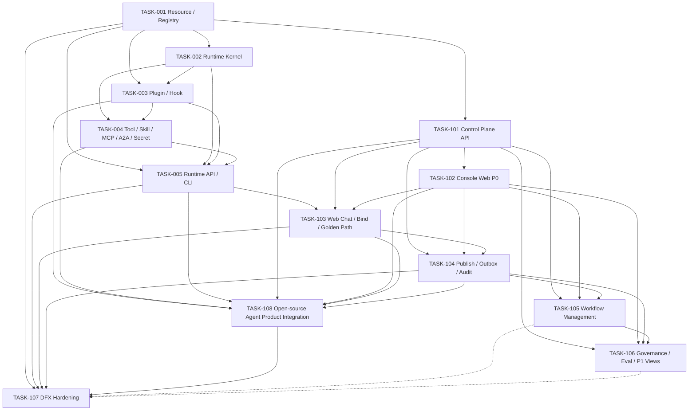

# Fluxion V3.2 开发实施路线

全部任务使用 code-flow 原生命令。`Depends` 是强依赖，不再只依赖 README 的叙事顺序。

## 依赖图



> `T105 -.-> T107`、`T106 -.-> T107` 为软依赖：TASK-105（P2 业务接入层）与 TASK-106（P1）均不构成 TASK-107（P0 Release Gate）的硬前置；Gate 只对已实现任务核验并在报告中显式标注未纳入项。

## 推荐顺序

| 顺序 | TASK | 目标 |
|---|---|---|
| 1 | TASK-001 | Resource Contract + SQLite/PostgreSQL Registry |
| 2 | TASK-002 | Stateless Runtime + ExecutionSnapshot |
| 3 | TASK-003 | Plugin Runtime + Typed Hook |
| 4 | TASK-004 | Tool / Skill / MCP / Workflow Adapter / A2A / Local SecretStore |
| 5 | TASK-005 | Runtime API / SSE / CLI / Hot Reload；仅 CLI Golden Path |
| 6 | TASK-101 | Control Plane API + Resource/Binding/Policy/CredentialRef |
| 7 | TASK-102 | P0 Console Web 管理面 |
| 8 | TASK-103 | Web Chat + `/bind` + 完整 Local Product Golden Path（S-R01） |
| 9 | TASK-104 | Publish / Outbox / Audit |
| 10 | TASK-105 | WorkflowDefinition 管理（P2 业务接入层，不阻塞 V1） |
| 11 | TASK-106 | Risk Approval / Eval / P1 Console Views |
| 12 | TASK-107 | DFX / Fault Injection / Release Gate |
| 13 | TASK-108 | 真实 Console/Chat HTTP + Model/Skill/MCP AgentLoop + dev admin/user link + Browser Golden Path；完成后重跑 TASK-107 |

TASK-005 明确不依赖未来 Console/Web UI：使用 `fluxion` CLI + ApplicationService 验证本地 Runtime Dev Bundle（S-R12）。完整 Console + SQLite + Runtime + Web Chat 的 S-R01 延后到 TASK-103。

TASK-103 的 S-R01 只验证了后端进程内 ASGI 组合，TASK-102 的生产入口仍使用 InMemoryConsoleApi，且 Runtime 尚未消费模型 tool call/真实 MCP transport。TASK-108 作为唯一纵向 owner 补齐 Browser → HTTP → SQLite → Runtime → Model/Skill/MCP 的真实产品边界；TASK-107 在 TASK-108 完成前保持 blocked，完成后重新执行 Release Gate。

Workflow Engine/DSL/执行归业务接入层，不在开源 V1 开发（见 Architecture Baseline §12）：Workflow Tool Adapter 接入协议由 TASK-004 在 V1 实现（FEAT-13/S-R08）；TASK-105 仅作为 WorkflowDefinition 资源管理（P2），不阻塞 V1 发布；业务接入时构建对应 Workflow。

启动示例：

```text
cf-task-status
cf-task-start resource-foundation TASK-001
```
