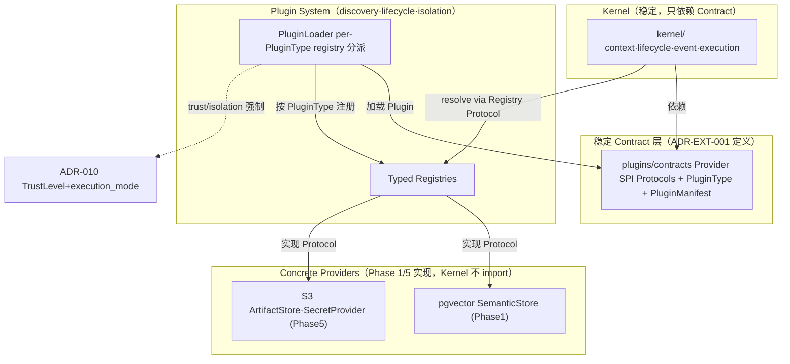
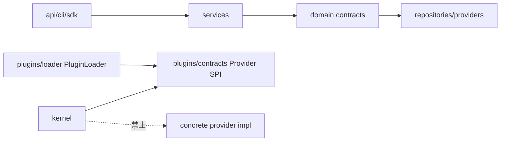

# Unified Extension Model 模块需求与设计一体化文档

> **文档编号**: MOD-EXT-001-v0.1
> **文档版本**: v0.1
> **创建日期**: 2026-08-26
> **文档状态**: 草稿 / 设计评审中
> **对应 PRD**: PRD-20260826-04 §4.9 / FEAT-14 / US-11 / NFR-ARCH-05
> **对应 Roadmap**: TASK-0003（ADR-EXT-001）

**评审边界说明**:
- **需求评审**: 第 2 章（需求分析）→ 通过后锁定为需求基线 v1.0
- **设计评审**: 第 3-4 章（技术设计 + 部署运维）→ 通过后锁定设计基线 v1.x
- **交接契约**: 2.5 验收条件 — 需求定义 What，设计实现 How

**ID 体系**: US（用户故事，来自 PRD）、FEAT（功能）、API/SPI（接口）、RULE（业务规则/系统约束）、TC（测试用例）、RISK（风险）、NFR（非功能指标）
场景编号：S-（正常）、E-（异常）、B-（边界）

> **本文是 Phase 0 ADR 级 contract-shaping design**：定义 Provider SPI 形状 + PluginLoader 注册分派泛化 + dead-type 删除清单 + §8 ADR 对齐。**不枚举 Phase 1/5 具体 provider 实现 Sprint task**（Rolling-wave §11 禁止在关键 ADR 未落地前提前枚举受其影响的伪精确任务）。

---

## 1. 文档控制

### 1.1 责任人

| 角色 | 姓名 | 职责范围 |
|------|------|---------|
| 架构师 | jahan | ADR 决策、Contract 定义、§8 对齐 |
| 开发负责人 | （待定） | PluginLoader 泛化实现、Provider SPI 落地 |
| 测试负责人 | （待定） | 架构依赖测试、fault injection |

### 1.2 修订历史

| 版本 | 日期 | 作者 | 变更描述 |
|------|------|------|---------|
| v0.1 | 2026-08-26 | jahan | 初始草稿：§8 对齐 ADR-006/010，定义 6 个 Provider SPI + loader 泛化 |

---

## 2. 需求分析

### 2.1 需求概述

| 项目 | 内容 |
|------|------|
| **模块名称** | Unified Extension Model（ADR-EXT-001） |
| **模块ID** | MOD-EXT-001 |
| **所属系统/产品线** | Fluxion Runtime / Microkernel Plugin 层 |
| **需求类型** | 架构演进 / 技术重构 |
| **业务背景** | v2.2 PRD §4.9 + FEAT-14 + US-11 + NFR-ARCH-05。当前 `PluginType` 声明 5 类（MODEL_PROVIDER/TOOL/MEMORY/STORAGE/HOOK），但 `PluginLoader` 仅对 `MODEL_PROVIDER` 做 `_register_model_provider`（`loader.py:99-112`）；其余 4 类 `load()` 仍会 `setup()` 并记录 capabilities，但无下游 ProviderRegistry 消费——即"死类型"非 loader 拒绝，而是无 SPI + 无 registry。死 PluginType 与新 SPI（SemanticStore/ArtifactStore/SecretProvider）长期并存，违反 US-11"扩展机制只有一套明确模型"。 |
| **核心目标** | 一套 Provider SPI + PluginLoader 模型：每个保留 PluginType 一一对应一个 typed Provider Contract + Registry；泛化 loader 注册分派；删除未实现且无计划的死 PluginType；与既有 ADR-006/010 显式对齐。 |

### 2.2 痛点与价值

| 维度 | 内容 |
|------|------|
| **目标用户** | 平台开发者（实现新 Provider）、插件作者（发布 Plugin Resource）、运维（隔离/信任边界） |
| **当前问题** | PluginType 声明 5 类但只 1 类有 registry；TOOL/MEMORY/STORAGE/HOOK capabilities 加载后无人消费（`loader.py:70-74` 记录但 `_register_model_provider:107-108` 早退）。扩展机制双体系：旧死 PluginType + 新 ad-hoc SPI 并存。 |
| **业务影响** | 新 Provider（SemanticStore/ArtifactStore/SecretProvider）无统一接入点 → 各自绕过 loader 直连，重复实现 discovery/lifecycle/isolation，trust 边界（ADR-010）无法统一强制。 |
| **预期价值** | 一套明确模型（US-11）；新 Provider 按 SPI 接入即获 discovery/lifecycle/isolation/trust；Kernel 只依赖稳定 Contract（RULE-fluxion-runtime-001 落地）。 |

**用户故事**

| 编号 | 用户故事 | 优先级 |
|------|---------|--------|
| US-11 | 平台扩展机制只有一套明确模型，不并存死 PluginType 与新 SPI | P0 |

### 2.3 功能方案

#### 2.3.1 功能清单

| 功能ID | 功能名称 | 功能描述 | 优先级 | 来源 |
|--------|---------|---------|--------|------|
| FEAT-14 | Unified Extension/Plugin Model | 一套 Provider SPI + PluginLoader 模型；PluginType 与 Provider Contract 一一对应；删除死类型 | P0 | US-11 |

#### 2.3.2 字段约束

**FEAT-14 字段约束 — PluginType enum（终态）**

| 字段名 | 字段类型 | 必填 | 约束 | 说明 |
|--------|--------|------|------|------|
| MODEL_PROVIDER | PluginType | Y | 保留，已实现 | 现有 `ModelProvider` + `ModelProviderRegistryProtocol`（`contracts.py:124-146`）为参考实现 |
| TOOL_PROVIDER | PluginType | Y | 新增（替换旧 TOOL） | 对应 Capability Contract（ADR-009），Tool 是 Agent-facing Adapter |
| ARTIFACT_STORE | PluginType | Y | 新增（STORAGE 拆分之一） | 对应 `ArtifactStoreProvider` SPI，Phase 5 实现（S3-compatible） |
| SEMANTIC_STORE | PluginType | Y | 新增（STORAGE 拆分之一） | 对应 `SemanticStoreProvider` SPI，Phase 1 实现（pgvector）；阶段出处 roadmap TASK-0003 依赖图，Phase 5 TASK-E504 或为生产硬化而非首版实现 |
| SECRET_PROVIDER | PluginType | Y | 新增 | 对应 `SecretProvider` SPI，Phase 5 实现 |
| HOOK | PluginType | Y | 保留 | 对应 ADR-007 typed-lifecycle-hook |
| ~~MEMORY~~ | PluginType | — | **resolved by ADR-MEM-001 = delete** | ADR-MEM-001 已决议删除该 enum：memory 由 `SessionMemoryStore` SPI（session-scoped）+ `SemanticStoreProvider` SPI（user-scoped）分治，无第三 `MEMORY_PROVIDER`。本 ADR 原 pending 标记已收口 |

**FEAT-14 字段约束 — Provider SPI 形状（每个保留类型）**

| Provider Contract | Registry Protocol | 关键方法 | 实现阶段 |
|--------|--------|------|------|
| `ModelProvider`（已有） | `ModelProviderRegistryProtocol`（已有） | `complete(request) -> ModelResponse` | 已实现 |
| `ToolProvider` | `ToolProviderRegistryProtocol` | `capabilities() -> list[CapabilityDescriptor]` | Phase 0 定义形状 / Phase 4 接线 |
| `SemanticStoreProvider` | `SemanticStoreRegistryProtocol` | `store/retrieve/search(tenant,user,filter)` | Phase 0 定义形状 / Phase 1 实现（pgvector） |
| `ArtifactStoreProvider` | `ArtifactStoreRegistryProtocol` | `put/get/delete(tenant,namespace,key)` | Phase 0 定义形状 / Phase 5 实现（S3） |
| `SecretProvider` | `SecretRegistryProtocol` | `resolve(tenant, secret_ref) -> Secret` | Phase 0 定义形状 / Phase 5 实现 |
| `Hook`（ADR-007） | `HookRegistryProtocol` | `priority/timeout/fail_policy/scope` | 已有 typed hook，本 ADR 对齐入统一模型 |

### 2.4 范围与边界

| 类别 | 内容 |
|------|------|
| **范围（In Scope）** | (1) 6 个保留 PluginType 的 Provider SPI Protocol 形状定义；(2) PluginLoader `_register_model_provider` 特例泛化为 per-PluginType registry 分派；(3) dead PluginType 删除清单（STORAGE 拆分、TOOL→TOOL_PROVIDER 重命名）；(4) §8 对齐：ADR-EXT-001 与 ADR-006/010 关系声明；(5) Plugin 作为 versioned Resource 的 lifecycle 对齐（复用 `resource_definitions`/`resource_bindings`）。 |
| **非范围（Out of Scope）** | (1) Phase 1/5 具体 provider 实现（pgvector/S3/SecretProvider 生产实现）——Rolling-wave 禁止提前枚举；(2) MEMORY_PROVIDER 终态决策——延后 ADR-MEM-001；(3) trust/isolation 重决——ADR-010 已决（`TrustLevel`/`_enforce_trust`/`TrustPolicy` 已落地），本 ADR 只引用；(4) 前端面（无前端 surface）。 |
| **前置假设** | ADR-006（microkernel-plugin-runtime）Accepted；ADR-010（trusted-untrusted-boundary）Accepted；ADR-009（capability-interface-and-center）Accepted；ADR-012（spec-model-SoT）Accepted。 |
| **有意妥协 / 技术债** | (1) MEMORY enum 终态已由 ADR-MEM-001 决议为 **delete**（session memory 由 SessionMemoryStore SPI + user memory 由 SemanticStoreProvider SPI 分治，无 MEMORY_PROVIDER），本 ADR 原 pending 标记已收口；(2) PluginLoader 泛化作为"reference binding"纳入 Phase 0（证明 contract 可实现），具体 provider 实现接线延后 Phase 5 TASK-E501。 |

### 2.5 验收条件

#### 2.5.1 业务规则与约束

| ID | 类型 | 描述 | 验证场景 |
|----|------|------|---------|
| RULE-EXT-01 | 系统约束 | Kernel 只依赖 Provider SPI Protocol，不依赖具体 Plugin/Provider 实现 | S-01, E-02 |
| RULE-EXT-02 | 系统约束 | PluginType 与 Provider Contract 一一对应；无下游消费者的死类型删除 | B-02 |
| RULE-EXT-03 | 系统约束 | trust/isolation 由 ADR-010 既有机制强制，本 ADR 不重决 | S-04 |
| RULE-EXT-04 | 系统约束 | Plugin 是 versioned Resource，credential 走 SecretRef/Binding，不入 spec | S-03 |

#### 2.5.2 功能验收场景

> 场景写到可转自动化测试断言的粒度。测试层级填 `unit`/`integration`/`E2E`/`manual`。跨 API、存储、运行时生成、渲染多个边界的场景标 `E2E`；`manual` 仅限无法自动化的外部条件并记录原因。**关键真实边界**列出测试中不得 mock 的组件，编码阶段不得自行降级。

**正常场景**

| 场景ID | 功能ID | 优先级 | 测试层级 | 关键真实边界 | 前置条件 | 操作步骤 | 预期结果 |
|--------|--------|--------|---------|-------------|---------|---------|---------|
| S-01 | FEAT-14 | P0 | E2E | import graph: `kernel/` + `plugins/loader.py` → 只到 Protocol 模块 | 6 个 Provider SPI Protocol 已定义 | 加载一个 SemanticStore/ArtifactStore/SecretProvider 假实现 plugin | PluginLoader 按 PluginType 分派注册进对应 typed registry；Kernel/loader 全程不 import 具体 impl 模块 |
| S-02 | FEAT-14 | P0 | integration | ToolProvider.capabilities() → CapabilityDescriptor；ToolRuntime dispatch | TOOL_PROVIDER SPI 定义 | 加载 TOOL_PROVIDER plugin，Agent 调用其 tool | tool 经 Capability Contract（ADR-009）解析；plugin 是 Adapter，业务逻辑在 Capability |
| S-03 | FEAT-14 | P0 | integration | `resource_definitions` 行 + `resource_bindings.credential_ref` | Plugin 作为 Resource kind 可发布 | 发布 Plugin Resource + 绑定 SECRET_PROVIDER credential | Plugin 入 `resource_definitions`（kind=plugin, 版本化）；credential 走 `resource_bindings.credential_ref`（SecretRef），spec_json 无明文 secret |
| S-04 | FEAT-14 | P0 | E2E | trust_level → execution_mode 分派 + fault injection | ADR-010 trust 机制 + 各 PluginType typed timeout/fail_policy/scope | 加载 untrusted plugin + 注入单 plugin crash | untrusted 走 isolated（ADR-010）；单 plugin 故障不拖垮 Runtime；每个保留类型 manifest 带 timeout/fail_policy/scope |

**异常场景**

| 场景ID | 功能ID | 测试层级 | 关键真实边界 | 触发条件 | 系统行为 | 用户感知 |
|--------|--------|---------|-------------|---------|---------|---------|
| E-01 | FEAT-14 | integration | registry + `_loaded` state after exception | provider `setup()` 抛异常 | PluginLoader 回滚：无 partial registry entry、无残留 `_loaded` 记录（沿用 `loader.py:76-82` 既有回滚） | 加载失败明确报错，registry 保持干净 |
| E-02 | FEAT-14 | integration | import-lint 静态测试 | `kernel/` import 任何 `plugins/<concrete>` 模块，或 provider 路径用 `spec_json.get` | architecture test 失败 | CI 阻断合入 |

**边界场景**

| 场景ID | 测试层级 | 关键真实边界 | 字段/条件 | 边界值 | 预期行为 |
|--------|---------|-------------|----------|--------|---------|
| B-01 | unit | `runtime_checkable` Protocol 检查 | 注册缺方法的 provider（如 SemanticStoreProvider 缺 `search`） | 缺 required method | load 时 `isinstance`/Protocol 校验拒绝 |
| B-02 | unit | `PluginType` enum 成员 | 死类型删除后 enum 成员 | {MODEL_PROVIDER, TOOL_PROVIDER, ARTIFACT_STORE, SEMANTIC_STORE, SECRET_PROVIDER, HOOK}（MEMORY 已由 ADR-MEM-001 删除） | 旧 TOOL/MEMORY/STORAGE 值引用报错 |
| B-03 | manual→static | file-location lint | Provider SPI Protocol 定义位置 | 必须在 `plugins/` 契约模块（`contracts` 或 `providers` 子包） | Protocol 不得散落到 `kernel/` 或 `services/`；深度 ≤ 3 |

> B-03 标 manual 因当前无 file-location lint 工具；落地时转为 static grep/architecture test，记录原因。

#### 2.5.3 非功能指标

**安全性要求**

| 指标ID | 安全域 | 验收标准 |
|--------|--------|---------|
| NFR-SEC-01 | 信任边界 | 不可信 Plugin 不默认 in-process（ADR-010 既有，本 ADR 不重决，仅复用） |
| NFR-SEC-02 | 租户隔离 | Provider registry 查询带 tenant scope（SemanticStore/ArtifactStore/Secret） |

**架构性指标**

| 指标ID | 指标名称 | 验收标准 | 验收落点 |
|--------|--------|---------|---------|
| NFR-ARCH-05 | Extension：Plugin/SPI 统一扩展模型 | 一套 Provider SPI + PluginType↔Contract 一一对应 + 死类型删除，不并存旧死 PluginType 与新 SPI | 由 FEAT-14 整体覆盖：S-01..S-04 + B-02（enum 终态）+ E-02（architecture test） |

---

## 3. 技术设计

### 3.1 方案选型

#### 备选方案对比

| 对比维度 | 权重 | 方案A：per-type Protocol + Registry（镜像 ModelProvider） | 得分 | 方案B：单一 generic CapabilityRegistry | 得分 |
|---------|------|-------|------|-------|------|
| 功能完备性 | 30% | PluginType↔Contract 一一对应，满足 PRD §4.9 | 5 | 一一对应语义模糊，类型擦除 | 2 |
| 类型安全 | 25% | 每个 Provider 有 typed Protocol，`runtime_checkable` 校验（B-01） | 5 | 全 generic dict，无编译期/加载期校验 | 2 |
| 实现复杂度 | 20% | 6 个 Protocol + 6 个 Registry，但参考实现已存在（ModelProvider） | 3 | 单一 Registry，最省代码 | 5 |
| 与现有代码一致 | 15% | 复用 ModelProvider/ModelProviderRegistryProtocol 模式 + CapabilityDescriptor 广告 | 5 | 需把 ModelProvider 也降级为 generic，破坏已落地代码 | 2 |
| 风险评估 | 10% | 渐进，不破坏现有 ModelProvider 路径 | 4 | 大改 ModelProvider 调用方 | 2 |
| **最终得分** | **100%** | | **4.45** | | **2.65** |

#### 关键决策记录

| 决策点 | 选择 | 被否决项 | 理由 | 可逆性 |
|--------|------|---------|------|--------|
| SPI 模式 | 方案A：per-type Protocol + Registry，保留 generic `CapabilityDescriptor` 广告 | 方案B：单一 generic CapabilityRegistry | 代码现状已是 A 的半成品（ModelProvider + CapabilityProvider 并存）；PRD §4.9 明确"PluginType 与 Provider Contract 一一对应"；类型安全 + 不破坏已落地 ModelProvider | 易回退（保留 ModelProvider 不动） |
| MEMORY enum 终态 | **resolved by ADR-MEM-001 = delete**（本 ADR 原 pending，已收口） | 现在删 / 现在 finalize | ADR-MEM-001 已决：memory 由 SessionMemoryStore + SemanticStore 分治，无 MEMORY_PROVIDER | 删除（不可逆，但 ADR-MEM-001 已论证无 provider 需该 enum） |
| Loader 泛化纳入 Phase 0 | 作为 reference binding 纳入（证明 contract 可 bind） | 纯 contract-only，loader 全延后 Phase 5 | 只定义 SPI 不展示如何 bind 会产出无法实现的抽象 contract；泛化本身≈把现有 ModelProvider 分支泛化，范围小 | 易回退 |

#### 技术栈

| 类别 | 选型 | 版本 | 选型理由 |
|------|------|------|---------|
| 语言 | Python | 3.12+ | 项目基线 |
| Contract 机制 | `typing.Protocol` + `@runtime_checkable` | stdlib | 与现有 ModelProvider 一致；加载期 isinstance 校验（B-01） |
| 架构依赖测试 | import-lint / grep-based static test | — | 强制 Kernel 不依赖具体 Plugin（RULE-fluxion-runtime-001） |

---

### 3.2 架构设计



#### 技术分层与模块边界



> **依赖方向硬约束**：`kernel/` 与 `plugins/loader.py` 只能 import `plugins/contracts`（Protocol 层），**禁止** import 任何 `plugins/<concrete>` 实现模块或 `services/`。Concrete provider 只实现 Protocol，由 PluginLoader 在运行期注册，Kernel 通过 Registry Protocol 间接 resolve。违反由 architecture test 阻断（E-02）。

#### Provider SPI 契约落点（RULE-backend-directory-001）

| 契约 | 文件位置 | 说明 |
|------|---------|------|
| Provider SPI Protocols + PluginType + PluginManifest | `backend/src/fluxion/plugins/contracts.py`（与现有 ModelProvider 同文件，避免散落） | 若 contracts.py 超 500 行（CLAUDE.md 硬约束），拆 `plugins/providers/` 子包，深度 ≤ 3 |
| PluginLoader 泛化 | `backend/src/fluxion/plugins/loader.py`（原地泛化 `_register_model_provider`） | 不新建文件 |
| Concrete providers | `backend/src/fluxion/plugins/<domain>/`（如 `plugins/semantic/pgvector.py`、`plugins/artifact/s3.py`） | Phase 1/5 实现 |

#### 外部依赖清单

| 外部系统 | 依赖类型 | 协议 | 超时 | 降级策略 |
|---------|---------|------|------|---------|
| pgvector | SemanticStore 实现（Phase 1） | SQL | 见 Phase 1 ADR | 见 Phase 1 |
| S3-compatible | ArtifactStore 实现（Phase 5） | HTTP/S3 API | 见 Phase 5 ADR | 见 Phase 5 |
| Secret Store | SecretProvider 实现（Phase 5） | KMS/Vault | 见 Phase 5 ADR | 见 Phase 5 |

> 本 ADR 只定义上述外部依赖的 Provider SPI **形状**；超时/降级具体值由各 Phase 实现 ADR 决定（Rolling-wave）。

---

### 3.3 数据设计

**无新增表**。Plugin 作为 versioned Resource 复用既有 `resource_definitions` + `resource_bindings`（RULE-fluxion-resource-001）。

| 复用表 | 用途 | 关键字段 |
|--------|------|---------|
| `resource_definitions` | Plugin Resource 发布版本（kind=plugin） | `tenant_id, kind=plugin, resource_id, version, status, spec_json(PluginManifest spec), published_at` |
| `resource_bindings` | Plugin 绑定 + credential | `subject_type, resource_type=plugin, credential_ref(SecretRef)` |

**Plugin 运行态模型（非持久化）**

| 字段名 | 类型 | 说明 |
|--------|------|------|
| `PluginManifest`（已有 `contracts.py:27-44`） | dataclass | `plugin_id, version, plugin_type, entrypoint, trust_level, permissions, dependencies, execution_mode` |
| `PluginType` enum 终态 | StrEnum | 见 §2.3.2 |

**索引设计**：无新增索引，复用 `idx_resource_latest_published` / `idx_binding_subject`。

**容量预估**：不适用（contract ADR，无数据增长）。

---

### 3.4 接口设计

> **形态 C：函数 / 库接口**（Provider SPI 为 Python Protocol，非 HTTP/CLI）。

#### Provider SPI 清单

| 接口ID | 名称 | Protocol | 关键签名 | 覆盖 FEAT |
|--------|------|---------|---------|---------|
| SPI-01 | ModelProvider（已有） | `ModelProvider` | `async complete(request: ModelRequest) -> ModelResponse` | FEAT-14 |
| SPI-02 | ToolProvider | `ToolProvider` | `def capabilities() -> list[CapabilityDescriptor]` | FEAT-14 |
| SPI-03 | SemanticStoreProvider | `SemanticStoreProvider` | `async store/recall/search(tenant_id, user_id, filter) -> ...` | FEAT-14, FEAT-17 |
| SPI-04 | ArtifactStoreProvider | `ArtifactStoreProvider` | `async put/get/delete(tenant_id, namespace, key) -> ...` | FEAT-14, FEAT-18 |
| SPI-05 | SecretProvider | `SecretProvider` | `async resolve(tenant_id, secret_ref) -> Secret` | FEAT-14, FEAT-19 |
| SPI-06 | HookRegistry | `HookRegistryProtocol` | `priority/timeout/fail_policy/scope`（对齐 ADR-007） | FEAT-14 |

#### SPI-03: SemanticStoreProvider（参考形状，Phase 1 实现待 ADR）

**函数签名**

| 函数签名 | 入参 | 返回 | 错误处理 |
|---------|------|------|---------|
| `async def store(self, tenant_id, user_id, record) -> record_id` | tenant_id, user_id, MemoryRecord | record_id | `SemanticStoreError` |
| `async def recall(self, tenant_id, user_id, query, top_k) -> list[record]` | tenant_id, user_id, query, top_k | list | `SemanticStoreError` |
| `async def search(self, tenant_id, user_id, filter) -> list[record]` | tenant_id, user_id, filter dict | list | `SemanticStoreError` |

> SPI-03/SPI-04/SPI-05 的方法签名在本 ADR 只定形状（tenant/user scope 强制），返回结构的具体字段由各 Phase 实现 ADR 细化。本 ADR 不锁定具体字段，避免 Rolling-wave 提前精确化。

#### PluginLoader 泛化（reference binding）

> 以下为 **形状示意**（reference binding，证明 contract 可 bind），非生产实现。真实 registry 注入、完整错误路径、测试覆盖归 Phase 5 TASK-E501；本 ADR 只锁定分派契约形状。

```python
# loader.py：_register_model_provider 特例 → per-PluginType registry 分派
# 现状（loader.py:99-112）只接 MODEL_PROVIDER
# 终态：
_REGISTRY_BY_TYPE: dict[PluginType, ProviderRegistryProtocol] = {
    PluginType.MODEL_PROVIDER: model_registry,
    PluginType.TOOL_PROVIDER: tool_registry,
    PluginType.ARTIFACT_STORE: artifact_registry,
    PluginType.SEMANTIC_STORE: semantic_registry,
    PluginType.SECRET_PROVIDER: secret_registry,
    # HOOK 走 HookRegistryProtocol（ADR-007）
}

def _register_provider(self, plugin, manifest, capabilities) -> None:
    registry = self._REGISTRY_BY_TYPE.get(manifest.plugin_type)
    if registry is None:
        return  # 非 Provider 类型不注册（MEMORY 已由 ADR-MEM-001 删除，不在本表）
    if not isinstance(plugin, registry.provider_protocol):
        raise PluginLoadError(f"{manifest.plugin_id}: lacks {manifest.plugin_type} protocol")
    registry.register(_provider_id(manifest, capabilities), plugin)
```

> 保留既有 `load()` 的回滚逻辑（`loader.py:76-82`）——partial registration 失败回滚（E-01）。

---

### 3.5 质量实现方案

#### 性能设计

无性能敏感热点（contract ADR，无运行期高频路径）。PluginLoader 注册发生在加载期，非每请求路径。

#### 可靠性设计

| 风险ID | 失效模式 | 影响 | 应对措施 | 验证场景 |
|--------|---------|------|---------|---------|
| RISK-01 | provider `setup()` 中途失败留 partial registry | 注册泄漏、后续 resolve 到半注册 provider | 沿用 + 泛化既有回滚（`loader.py:76-82`）：失败 pop `_loaded`/`_records` + `shutdown()` | E-01 |
| RISK-02 | Kernel 反向依赖 concrete provider | 架构腐化、不可替换 | architecture test 阻断 `kernel/` import `plugins/<concrete>`（E-02） | E-02 |
| RISK-03 | ~~MEMORY pending 误用~~（已删除） | — | MEMORY enum 已由 ADR-MEM-001 删除，loader 无该项 | B-02（确认 enum 不含 MEMORY） |

#### 安全性设计

| 指标ID | 验收标准 | 实现方案 |
|--------|---------|---------|
| NFR-SEC-01 | 不可信 Plugin 不默认 in-process | **复用** ADR-010 既有 `TrustLevel`/`_enforce_trust`/`TrustPolicy`（`loader.py:90-97`），本 ADR 不重决 |
| NFR-SEC-02 | 跨租户越权=0 | Provider SPI 方法首参 `tenant_id` 强制；registry 查询带 tenant scope |

#### 可观测性设计

| 场景 | 实现方案 |
|------|---------|
| Plugin lifecycle | publish/bind 走既有 AuditLog（`audit_logs` 表）+ publish_records |
| 加载失败 | 结构化日志带 plugin_id/tenant_id/request_id（对齐 console-api-contract） |
| 链路追踪 | Plugin 注册/resolve 关键路径挂 trace_id（Phase 5 OTel 细化） |

---

## 4. 部署与运维

### 4.1 部署架构

| 环境 | 配置 | 实例数 | 用途 |
|------|------|--------|------|
| dev | 单 Pod + SQLite | 1 | 插件加载/卸载验证 |
| prod | 多 Pod + PostgreSQL | 3+ | 多 Pod 等价 registry（依赖 ADR-001 无状态） |

> 本 ADR 不引入新部署单元；Plugin Resource 随 Registry 发布，Runtime Pod 从同一 Registry 读取（ADR-001/028 一致性）。

### 4.2 发布与回滚 [按需]

不适用（contract ADR，无独立发布）。Plugin Resource 发布/回滚复用既有 publish/rollback 治理（A8/A9 已落地）。

---

## 5. 风险与依赖

### 5.1 项目依赖

| 依赖模块/团队 | 依赖内容 | 状态 | 风险等级 |
|-------------|---------|------|---------|
| ADR-MEM-001 | MEMORY enum 删除决议（已收口本 ADR pending） | 已完成（design gate pass） | 低（已闭合） |
| ADR-006/010/009/012 | 既有 Accepted 基线 | Accepted | 低 |
| Phase 1 SemanticStore | 消费 SEMANTIC_STORE SPI 形状 | 阻塞于本 ADR | 高（roadmap DAG：ADR-EXT→Phase 1 SemanticStore Contract） |

### 5.2 风险识别

| 风险ID | 类型 | 描述 | 概率 | 影响 | 应对措施 | 验证场景 |
|--------|------|------|------|------|---------|---------|
| RISK-04 | 跨 ADR | ~~MEMORY 终态未决~~（已由 ADR-MEM-001 收口为 delete） | 低 | 低 | ADR-MEM-001 已决议删除，本 ADR pending 标记已移除 | B-02 |
| RISK-05 | 架构 | contracts.py 超 500 行 | 中 | 低 | 拆 `plugins/providers/` 子包（§3.2 已预案） | B-03 |

---

## 6. 需求追溯矩阵

| 用户故事 | 功能ID | 接口ID | 测试用例ID | 测试层级 | 状态 |
|---------|--------|--------|-----------|---------|------|
| US-11 | FEAT-14 | SPI-01..SPI-06 | S-01 | E2E | 待实现 |
| US-11 | FEAT-14 | SPI-02 | S-02 | integration | 待实现 |
| US-11 | FEAT-14 | SPI-03/04/05 | S-03 | integration | 待实现 |
| US-11 | FEAT-14 | SPI-01..06 + Loader | S-04 | E2E | 待实现 |
| US-11 | FEAT-14 | Loader | E-01 | integration | 待实现 |
| US-11 | FEAT-14 | Contract 层 | E-02 | integration | 待实现 |
| US-11 | FEAT-14 | SPI-03/04/05 | B-01 | unit | 待实现 |
| US-11 | FEAT-14 | PluginType enum | B-02 | unit | 待实现 |
| US-11 | FEAT-14 | 目录边界 | B-03 | manual→static | 待实现 |

> 矩阵闭合：US-11 → FEAT-14 → SPI-01..06 → S-/E-/B- 全覆盖；每个 FEAT 有来源(US-11)✓、有验收场景✓；每个场景有测试层级和关键真实边界✓；RULE-EXT-01..04 与 RISK-01/02/04/05 均映射到场景。

---

## Spec Compliance Matrix

> 从需求目录 `spec-context.yml` 继承并逐 Rule 回填。required Rule 必须有具体设计落点和 verifier/验收场景。

| Spec/Rule | enforcement | 设计影响 | 设计落点 | 验证场景 | 状态/N/A 理由 |
|-----------|-------------|---------|---------|---------|----------------|
| `fluxion-runtime-core#RULE-fluxion-runtime-001` | required | Kernel 只依赖稳定 Contract；本 ADR 定义的 Provider SPI Protocol 即该稳定 Contract | §3.2 架构图 + §3.4 SPI-01..06 + `provider-spi-kernel-contract` | S-01（E2E）+ E-02（integration）+ verifier: `fluxion-runtime-core#RULE-fluxion-runtime-001` manual checklist | applied（待 artifact ref 回填） |
| `fluxion-workflow-capability#RULE-fluxion-workflow-001` | required | TOOL_PROVIDER SPI 对齐 Capability Contract；Tool 是 Adapter | §3.4 SPI-02 + `tool-provider-capability` | S-02（integration）+ verifier: `fluxion-workflow-capability#RULE-fluxion-workflow-001` | applied |
| `fluxion-resource-registry#RULE-fluxion-resource-001` | required | Plugin 是 versioned Resource；credential 走 SecretRef/Binding | §3.3 数据设计 + `plugin-resource-secretref` | S-03（integration）+ verifier: `fluxion-resource-registry#RULE-fluxion-resource-001` | applied |
| `fluxion-dfx#RULE-fluxion-dfx-001` | required | Plugin typed timeout/fail_policy/scope + isolation 自动化证据 | §3.5 可靠性/安全 + `plugin-typed-timeout-isolation` | S-04（E2E）+ verifier: `fluxion-dfx#RULE-fluxion-dfx-001` | applied |
| `backend-code-quality-performance#RULE-backend-quality-001` | required | PluginLoader 泛化沿用回滚、不静默吞异常、类型注解 | §3.4 Loader 泛化 + §3.5 RISK-01 + `loader-rollback-type-safety` | E-01（integration）+ B-01（unit）+ verifier: `backend-code-quality-performance#RULE-backend-quality-001` | applied |
| `backend-directory-structure#RULE-backend-directory-001` | required | Provider SPI 契约落点 + 深度 ≤ 3 | §3.2 Provider SPI 契约落点表 + `provider-contract-placement` | B-03（manual→static）+ verifier: `backend-directory-structure#RULE-backend-directory-001` | applied |

**advisory rules**（PATTERN-backend-001..004 / frontend 等）：advisory 不强制 artifact ref；PATTERN-backend-001（缓存）对本 ADR 不适用（无运行期高频路径），PATTERN-backend-003（资源释放）由 loader 既有回滚覆盖。advisory `enforcement: advisory:none`。

**未绑定 spec**：4 个前端 spec（component-specs / frontend-directory / frontend-quality / semi-design）不在本 ADR 实现路径内（无前端 surface），故未 bind，非 N/A——按 §2.7"只对实现路径内候选 bind"原则，不进入 matrix。

---

## §8 ADR 对齐声明（本 ADR 与既有 ADR 关系）

| 既有 ADR | 关系 | 说明 |
|---------|------|------|
| ADR-006（microkernel-plugin-runtime） | **extends**（不 supersede） | ADR-006 已决"一切能力插件化、stable Contract、kernel 只管 plugin registry/contracts/lifecycle"，但只停在抽象层。本 ADR 具体化其 deferred Contract layer——枚举各类型 Provider SPI 形状。 |
| ADR-010（trusted-untrusted-boundary） | **references**（不重决） | ADR-010 已决 trust 分级 + isolation + Policy Intersection，代码已落地（`TrustLevel`/`_enforce_trust`/`TrustPolicy`）。本 ADR 只引用，不重决 trust/isolation。 |
| ADR-009（capability-interface-and-center） | references | TOOL_PROVIDER 对齐 Capability Contract。 |
| ADR-012（spec-model-SoT） | references | Plugin Resource spec 走 typed model（model_validate），不新增 spec_json.get。 |
| ADR-007（typed-lifecycle-hook） | references | HOOK 类型对齐 typed hook。 |

> v2.2 PRD/roadmap 把 ADR-EXT-001 表述为"新增 ADR"，§8 对齐后精确表述为"concretizes ADR-006 deferred Contract layer, references ADR-010 for isolation"。建议 PRD §4.9 措辞同步修正。

---

## 附录：术语表

| 术语 | 定义 |
|------|------|
| Provider SPI | 服务提供者接口，每个 PluginType 对应的 typed Protocol |
| PluginType | 插件类型枚举，与 Provider Contract 一一对应 |
| PluginManifest | 插件运行态 manifest（plugin_id/version/type/trust/execution_mode） |
| dead PluginType | 声明但无 Provider Contract + 无下游 registry 消费的类型 |
| reference binding | 本 ADR 纳入 PluginLoader 泛化作"证明 contract 可实现"的最小实现 |

---

*文档结束*
