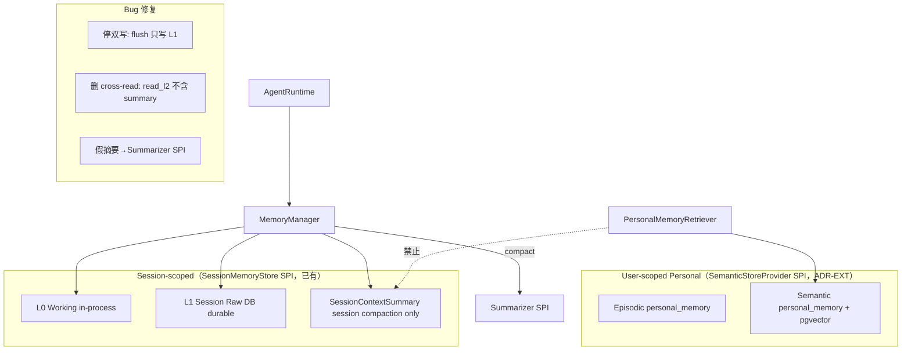

# Memory Taxonomy 模块需求与设计简报

> **文档编号**: MOD-MEM-001-v0.1
> **文档版本**: v0.1
> **创建日期**: 2026-08-26
> **文档状态**: 草稿 / 设计评审中
> **对应 PRD**: PRD-20260826-04 §4.5/4.6/4.7 / US-03 / NFR-PRIV-01 / B4
> **对应 Roadmap**: TASK-0005（ADR-MEM-001）

**评审边界说明**:
- **需求评审**: 第 2 章 → 锁定需求基线
- **设计评审**: 第 3 章 → 锁定设计基线

**ID 体系**: US（来自 PRD）、FEAT（功能）、API（接口）、NFR（非功能指标）
场景编号：S-（正常）、E-（异常）、B-（边界）

> **本文是 Phase 0 ADR 级 design**：定义 Memory Taxonomy + SessionContextSummary 边界 + Summarizer SPI + Personal Memory 模型 + MEMORY enum 终态（收口 ADR-EXT-001 pending）。M201-M216 是 Phase 2 **实现** task，本 ADR 只定义其消费的 taxonomy 契约与 architecture-test 规则，不枚举 Sprint 任务（Rolling-wave）。

---

## 1. 文档控制

### 1.1 责任人

| 角色 | 姓名 | 职责范围 |
|------|------|---------|
| 架构师 | jahan | taxonomy 决策、§8 对齐、收口 EXT MEMORY pending |
| 开发负责人 | （待定） | 双写/假摘要修复 + Summarizer SPI + personal_memory 表 |
| 测试负责人 | （待定） | architecture test（PersonalMemoryRetriever 不读 SessionContextSummary） |

### 1.2 修订历史

| 版本 | 日期 | 作者 | 变更描述 |
|------|------|------|---------|
| v0.1 | 2026-08-26 | jahan | 初始草稿：taxonomy + SessionContextSummary 边界 + Summarizer SPI + MEMORY 删除 |

---

## 2. 需求分析

### 2.1 需求概述

| 项目 | 内容 |
|------|------|
| **模块名称** | Memory Taxonomy（ADR-MEM-001） |
| **需求类型** | 架构演进 / 技术重构 |
| **业务背景** | v2.2 PRD §4.5 + B4 + US-03 + NFR-PRIV-01。当前 memory 三个已核实缺陷：(1) **双写**——`_flush_new_records` 对同一批 records 既 `append_l1` 又 `append_l2`（`memory.py:190-191`），raw 会话翻倍进 user-level L2 = "raw 对话=长期记忆"反模式；(2) **summary cross-read**——`read_l2` 用 `level.in_((_LEVEL_L2, _LEVEL_SUMMARY))`（`memory_sql.py:54`），session 摘要泄漏进 user-level retrieval；(3) **假摘要**——`_summarize` 只是 `"summary: " + " | ".join(content)`（`memory.py:254-257`），无模型调用。无 Episodic/Semantic personal memory。 |
| **核心目标** | 固定 memory taxonomy：L0 working / L1 session raw / L2 legacy-user-raw（停双写）/ SessionContextSummary（session-scoped compaction，不进 personal）/ Episodic + Semantic（personal，经 SemanticStore）。替换假摘要为 Summarizer SPI。收口 ADR-EXT-001 的 MEMORY pending。 |

### 2.2 功能方案

#### 2.2.1 功能清单

| 功能ID | 功能名称 | 功能描述 | 优先级 | 来源 |
|--------|---------|---------|--------|------|
| FEAT-MEM-01 | Memory Taxonomy | L0/L1/L2/SessionContextSummary/Episodic/Semantic 六层语义固定 + 双写/cross-read/假摘要三缺陷修复 | P0 | US-03 + §4.5 + B4 |
| FEAT-MEM-02 | Summarizer SPI | 替换 `_summarize` 字符串拼接；Model-based + 确定性截断 fallback + source range/hash + **token budget**；compaction 质量测试（TASK-M213）Phase 2 落地 | P0 | §4.6 + B4 |
| FEAT-MEM-03 | Personal Memory + User Control | Episodic/Semantic 经 SemanticStore；用户可查看/纠正/删除/停止自动学习 | P0 | US-03 + NFR-PRIV-01 + §4.5 |

#### 2.2.2 字段约束

**FEAT-MEM-01 字段约束 — Memory Taxonomy 终态**

| 层级 | 当前代码 | V2.2 定义 | 动作 | Provider |
|------|---------|---------|------|---------|
| L0 | `_l0` dict（`memory.py:105`） | Working Memory | 保留语义（in-process） | MemoryManager 内部 |
| L1 | `session_memory(level=L1)` | Session Raw Message Store | 保留 DB durable 路径 | `SessionMemoryStore` SPI（已有） |
| L2 | `session_memory(level=L2)` | Legacy user-scoped raw history | **停止双写**；停止作为 Personal/Semantic；Phase 2 迁移/删除 | `SessionMemoryStore` SPI |
| summary | `session_memory(level=summary)` | SessionContextSummary（重命名） | **删 L2/user-level cross-read**；只服务 session compaction | `SessionMemoryStore` SPI |
| Episodic | 无 | Personal Memory（用户级，跨 session） | 新建模型/表 | `SemanticStoreProvider` SPI（ADR-EXT-001） |
| Semantic | 无 | Personal Memory + Semantic Index | 新建模型/索引（pgvector） | `SemanticStoreProvider` SPI |

**MEMORY PluginType 终态（收口 ADR-EXT-001 pending）**：**删除**。memory 不由单一 MEMORY_PROVIDER 承载，而由两个既有/已定义 SPI 分治：
- session-scoped（L0/L1/L2/SessionContextSummary）→ `SessionMemoryStore` Protocol（`memory.py:41-54`，已有，formalize）。
- user-scoped personal（Episodic/Semantic）→ `SemanticStoreProvider` SPI（ADR-EXT-001 定义形状，Phase 1 pgvector 实现）。
- 故无第三个 MEMORY_PROVIDER；ADR-EXT-001 的 MEMORY pending 标记 → 本 ADR 决议为 delete。

**FEAT-MEM-01 字段约束 — `personal_memory` 表（新增，user-scoped）**

| 字段名 | 类型 | 可空 | 索引 | 说明 |
|--------|------|------|------|------|
| id | Integer | N | PK | 自增 |
| tenant_id | String(128) | N | idx+PK | 租户（强制） |
| user_id | String(128) | N | idx | 用户 |
| memory_type | String(16) | N | idx | `episodic` / `semantic` |
| content | Text | N | | 记忆内容 |
| embedding | vector | Y | ivfflat | pgvector 向量（semantic） |
| source_session_id | String(128) | Y | | 来源 session（provenance） |
| source_range_hash | String(64) | Y | | 源消息 range hash（可追溯） |
| learning_enabled | Boolean | N | | 是否由自动学习写入（user control） |
| created_at / updated_at | DateTime(tz) | N | | |

> `session_memory` 表复用（level 语义收紧为 l1/l2/session_context_summary）；新增 `personal_memory` 独立表承载 user-scoped。tenant 隔离强制（NFR-SEC-01）。

### 2.3 范围与边界

| 类别 | 内容 |
|------|------|
| **范围（In Scope）** | (1) 六层 taxonomy 固定 + MEMORY enum 删除决议；(2) 双写修复（`_flush_new_records` 只写 L1；`InMemory.append_summary` 不交叉写）；(3) cross-read 修复（`read_l2` 删 summary，`read_l1` 含 SessionContextSummary）；summary 重命名 SessionContextSummary；(4) Summarizer SPI 形状（Model + 确定性 fallback + range/hash）；(5) `personal_memory` 表模型 + tenant 隔离；(6) architecture-test 规则：PersonalMemoryRetriever 禁止读 SessionContextSummary。 |
| **非范围（Out of Scope）** | (1) M201-M216 实现细节（Phase 2）；(2) pgvector/ SemanticStore **实现**（Phase 1，FEAT-17）；(3) Candidate Extraction pipeline 细节（Phase 2）；(4) 用户控制 **UI**（Phase 4 TASK-X407）；(5) L2 legacy 数据迁移（Phase 2 TASK-M202）。 |
| **前置假设** | ADR-001（memory externalized）Accepted，`SQLSessionMemoryStore` 已落地；ADR-EXT-001 已定义 `SemanticStoreProvider` SPI 形状。 |
| **有意妥协 / 技术债** | (1) L2 暂留（停止双写但不立即删数据），迁移延后 Phase 2 TASK-M202；(2) Summarizer Model 实现选型（哪个 model）延后 Phase 2，本 ADR 只定 SPI。 |

### 2.4 验收条件

#### 2.4.1 功能验收场景

> 测试层级填 `unit`/`integration`/`E2E`/`manual`。**关键真实边界**不得 mock，编码阶段不得自行降级。

**正常场景**

| 场景ID | 功能ID | 优先级 | 测试层级 | 关键真实边界 | 操作步骤 | 预期结果 |
|--------|--------|--------|---------|-------------|---------|---------|
| S-01 | FEAT-MEM-01 | P0 | integration | `SQLSessionMemoryStore` append/read L1 | flush 一批 records | 只写 L1（`session_memory.level=L1`），不写 L2；read_l1 返回 session raw |
| S-02 | FEAT-MEM-01 | P0 | integration | `memory_sql.py` read_l2/read_l1 | read user-level L2 | `read_l2` **不含** summary/SessionContextSummary（level=L2 only）；`read_l1` 含 SessionContextSummary |
| S-03 | FEAT-MEM-02 | P0 | integration | `compact_context` + Summarizer SPI | 触发 compaction | 调用 Summarizer SPI（非 `_summarize` 拼接）；model 不可用时走确定性截断 fallback；summary 带 source range/hash |
| S-04 | FEAT-MEM-03 | P0 | integration | `PersonalMemoryRetriever` → `SemanticStoreProvider` | 检索 user personal memory | 经 SemanticStore SPI 取 Episodic/Semantic；**不读** session_memory 的 SessionContextSummary |

**异常场景**

| 场景ID | 功能ID | 测试层级 | 关键真实边界 | 触发条件 | 系统行为 |
|--------|--------|---------|-------------|---------|---------|
| E-01 | FEAT-MEM-03 | P0 | integration | import/dependency 静态测试 | `PersonalMemoryRetriever` import 或 read `SessionContextSummary` → architecture test 失败，CI 阻断 |
| E-02 | FEAT-MEM-02 | integration | Summarizer SPI 错误处理 | model summarizer 超时/异常 | 降级确定性截断 fallback，不静默吞（带日志+trace），不阻断主对话 |
| E-03 | FEAT-MEM-03 | P0 | integration | commit pipeline enforcement test | 任何绕过 `MemoryLearner.commit` 直写 `personal_memory` 的路径（含 summarizer 直写）→ architecture test 失败；`SessionContextSummary` 不得 auto-commit 进 `UserProfile`（§4.6 行 276） |

**边界场景**

| 场景ID | 测试层级 | 关键真实边界 | 字段/条件 | 边界值 | 预期行为 |
|--------|---------|-------------|----------|--------|---------|
| B-01 | unit | `personal_memory` delete + `learning_enabled` | 用户关闭自动学习后 | learning_enabled=false | 不再写入新 personal memory；已有可查看/纠正/删除（NFR-PRIV-01） |
| B-02 | unit | `PluginType` enum | MEMORY 删除后成员 | 无 MEMORY | memory 由 SessionMemoryStore SPI + SemanticStore SPI 分治；旧 MEMORY 引用报错 |

#### 2.4.2 非功能指标

| 指标ID | 指标名称 | 目标值 | 测量方法 |
|--------|--------|-------|---------|
| NFR-PRIV-01 | 用户可查看/纠正/删除/停止自动学习 | 全部可操作 | 用户控制 API 测试 + audit |
| NFR-SEC-01 | memory 跨租户越权 | =0 | tenant 隔离测试 |

---

## 3. 技术设计

### 3.1 技术选型

| 类别 | 选型 | 版本 | 选型理由 |
|------|------|------|---------|
| 语言 | Python | 3.12+ | 项目基线 |
| Session memory store | `SessionMemoryStore` Protocol（已有） | — | 复用，level 语义收紧 |
| Personal memory store | `SemanticStoreProvider` SPI（ADR-EXT-001） | — | user-scoped 需向量检索，复用 SemanticStore，不新建第三 SPI |
| Summarizer | `Summarizer` Protocol + ModelSummarizer + 确定性 fallback | — | 替换假 `_summarize`；fallback 保证可用性 |
| 向量索引 | pgvector ivfflat | Phase 1 | FEAT-17 |

### 3.2 架构设计



> **硬边界（读侧 + 写侧，M216 architecture test）**：
> - **读侧**：`PersonalMemoryRetriever` 不得 import 或 read `SessionContextSummary`。
> - **写侧**：`SessionContextSummary` 不得被 auto-commit 进 `personal_memory`/`UserProfile`——personal memory 唯一写入入口是 `MemoryLearner.commit`（经 MemoryCandidate→Policy/Consent→Commit pipeline，§4.7 行 286）；summarizer 输出只回 session compaction（§4.6 行 276 "summary 不自动写入 UserProfile"）。
> session 摘要只服务 session context compaction，不进 user-level retrieval/persistence。

| 层级 | 职责 |
|------|------|
| SessionMemoryStore SPI | L0/L1/L2/SessionContextSummary，session-scoped，DB durable |
| SemanticStoreProvider SPI | Episodic/Semantic，user-scoped personal，pgvector |
| Summarizer SPI | compaction 摘要，model + fallback |

### 3.3 接口设计

> **形态 C：函数 / 库接口**（内部 SPI）。

| 函数签名 | 入参 | 返回 | 错误处理 |
|---------|------|------|---------|
| `SessionMemoryStore.read_l2(tenant_id, user_id)`（修复） | tenant, user | list[L2 only] | 不含 SessionContextSummary（删 `level.in_(...summary)`） |
| `Summarizer.summarize(records, *, token_budget) -> SummaryResult`（新 SPI） | records + source range + **`token_budget`**（§4.6 行 277 硬要求） | SummaryResult(content, source_range_hash) | model 失败→`DeterministicTruncationSummarizer` fallback，不静默吞 |
| `SummarizerRegistryProtocol.register/resolve`（新） | provider_id, Summarizer | — | 镜像 ModelProviderRegistry 模式 |
| `PersonalMemoryRetriever.recall(tenant_id, user_id, query, top_k)` | tenant, user, query | list[personal_memory] | 经 SemanticStoreProvider；**禁止读 SessionContextSummary**（architecture test） |
| `MemoryLearner.commit(candidate, *, policy_decision, consent, learning_enabled)` | candidate + Policy/Consent gate + flag | commit result | `learning_enabled=false` 拒绝写入（user control, NFR-PRIV-01）；**必经 MemoryCandidate→Policy/Consent→Commit pipeline**（§4.7 行 286），绕过 `commit` 直写 `personal_memory` 被 architecture test 阻断（E-03） |

**双写修复（`memory.py:190-191`）**：
```python
# 修复前：await append_l1(new_records); await append_l2(new_records)
# 修复后：只写 L1（session raw）。L2 legacy 停止无脑双写。
await self._store.append_l1(new_records)
# L2 不再由 flush 写入；legacy L2 数据迁移/删除延后 Phase 2 TASK-M202。
```

**cross-read 修复（`memory_sql.py:54`）**：
```python
# 修复前：level.in_((_LEVEL_L2, _LEVEL_SUMMARY))
# 修复后：read_l2 只读 L2；SessionContextSummary 只由 read_l1（session-scoped）读取。
.where(session_memory.c.level == _LEVEL_L2)
```

**`InMemory.append_summary` 写侧修复（`memory.py:71-75`）**：
```python
# 修复前：append_summary 同时写 _summaries + _l1 + _l2（summary 泄漏进 user-level L2 的写侧根因）
# 修复后：summary 只写 session-scoped（_summaries / _l1），不交叉写 _l2。
await self._append_summary_session_only(summary)   # _l2 不再由 append_summary 写入
```

### 3.4 性能与容量考量

| 热点路径 | 预估负载 | 潜在瓶颈 | 应对策略 | 目标值 |
|---------|---------|---------|---------|--------|
| read_l1（每轮建消息前） | 每轮 1 次 | session_memory 全扫 | 复用 `idx_memory_l1`（tenant,session,level,id） | P95≤5ms（基线已要求） |
| PersonalMemoryRetriever.recall | 每轮 0-1 次 | pgvector 检索 | ivfflat 索引 + top_k 限制 + tenant/user 过滤 | 待定（Phase 1） |
| Summarizer.summarize | compaction 触发时 | model 调用延迟 | timeout + 确定性 fallback | 待定 |

> 无新热点；read_l1 性能依据：复用既有 `idx_memory_l1` 前缀索引，O(log n)。被放弃方案：read_l2 合并 summary 读取——会造成 user-level 检索被 session 噪声污染（正确性问题，非性能）。

---

## 4. 风险与依赖

### 4.1 项目依赖

| 依赖模块 | 依赖内容 | 风险等级 |
|---------|---------|---------|
| ADR-001 | memory externalized 基线（`SQLSessionMemoryStore` 已落地） | 低 |
| ADR-EXT-001 | `SemanticStoreProvider` SPI 形状（personal memory 消费） | 中 |
| Phase 1 FEAT-17 | pgvector/ SemanticStore 实现 | 中（personal memory 检索依赖） |

### 4.2 风险识别

| 风险ID | 描述 | 影响 | 应对措施 | 验证场景 |
|--------|------|------|---------|---------|
| RISK-01 | L2 停双写后 legacy 数据残留 | 仍被误读为 personal | Phase 2 TASK-M202 迁移/删除；本 ADR 停写入 + 标 legacy | S-01 + B-02 |
| RISK-02 | Summarizer model 选型未定 | compaction 质量不一 | SPI 先就位，model 选型 Phase 2；确定性 fallback 保底 | S-03 + E-02 |
| RISK-03 | architecture test 未落地 → SessionContextSummary 再泄漏 | user retrieval 污染 | M216 纳入 Phase 2 DoD；本 ADR 定义规则 | E-01 |

---

## Spec Compliance Matrix

| Spec/Rule | enforcement | 设计影响 | 设计落点 | 验证场景 | 状态/N/A 理由 |
|-----------|-------------|---------|---------|---------|----------------|
| `fluxion-runtime-core#RULE-fluxion-runtime-001` | required | memory externalized 是无状态核心；taxonomy 保留 SQLSessionMemoryStore durable 路径 | §3.2 架构图 + §3.3 read_l1 + `session-memory-externalized` | S-01（integration）+ S-02（integration）+ verifier: `fluxion-runtime-core#RULE-fluxion-runtime-001` | applied |
| `fluxion-dfx#RULE-fluxion-dfx-001` | required | PersonalMemoryRetriever 不读 SessionContextSummary 须 architecture test 自动化证据 | §3.2 硬边界 + §2.4 E-01 + `personal-memory-architecture-test` | S-04（integration）+ E-01（integration）+ verifier: `fluxion-dfx#RULE-fluxion-dfx-001` | applied |
| `backend-database#RULE-backend-database-001` | required | session_memory level 语义收紧 + 新 personal_memory 表 + tenant 隔离索引 | §2.2.2 表设计 + §3.3 cross-read 修复 + `memory-level-semantics-personal-schema` | S-02 + B-01 + verifier: `backend-database#RULE-backend-database-001` | applied |
| `backend-code-quality-performance#RULE-backend-quality-001` | required | 双写 + 假摘要修复，不静默吞（fallback 带日志） | §3.3 双写/cross-read/Summarizer 修复 + §2.4 S-03/E-02 + `doublewrite-summarizer-spi` | S-01 + S-03 + E-02 + verifier: `backend-code-quality-performance#RULE-backend-quality-001` | applied |

**advisory rules**：PATTERN-backend-001（缓存）对 read_l1 适用（已有 idx_memory_l1 缓存命中路径，§3.4）；advisory `enforcement: advisory:none`。

**未绑定 spec**：前端 spec 不在路径内（用户控制 UI 是 Phase 4，本 ADR 只定数据模型 + SPI），未 bind，非 N/A。

---

## §8 ADR 对齐声明

| 既有 ADR | 关系 | 说明 |
|---------|------|------|
| ADR-001（stateless-agent-runtime） | references | memory externalized 已决且 `SQLSessionMemoryStore` 已落地；本 ADR 保留 session memory durable 路径，不改无状态基线。 |
| ADR-EXT-001 | **收口 MEMORY pending** | ADR-EXT-001 把 MEMORY PluginType 标 pending 等本 ADR。本 ADR 决议：**删除 MEMORY enum**——memory 由 `SessionMemoryStore` SPI（session-scoped）+ `SemanticStoreProvider` SPI（user-scoped personal）分治，无第三 MEMORY_PROVIDER。 |

> 本 ADR 是首个 memory 专项 ADR（既有 ADR-001..012 无 memory 专项）。v2.2 roadmap TASK-0005 当"新增 ADR"准确——无既有 memory ADR 可 amend，确为新增。

---

## 附录：术语表

| 术语 | 定义 |
|------|------|
| L0/L1/L2 | working / session raw / legacy user raw 三层会话记忆 |
| SessionContextSummary | session-scoped compaction 摘要（重命名自 summary），不进 personal retrieval |
| Episodic/Semantic | user-scoped personal memory（跨 session），经 SemanticStore |
| Summarizer SPI | 替换假 `_summarize` 的摘要契约，model + 确定性 fallback |

---

*文档结束*
