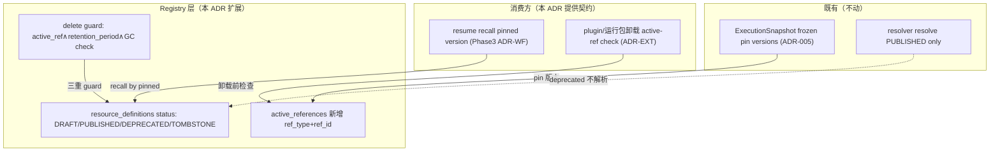
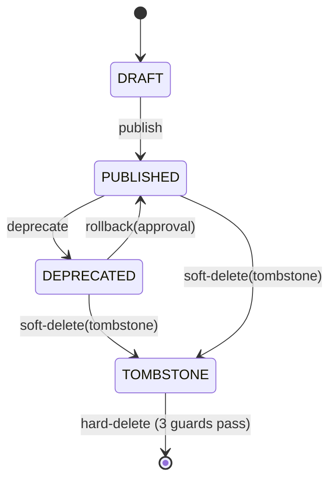

# Pinned Resource Retention 模块需求与设计简报

> **文档编号**: MOD-SNAPSHOT-001-v0.1
> **文档版本**: v0.1
> **创建日期**: 2026-08-26
> **文档状态**: 草稿 / 设计评审中
> **对应 PRD**: PRD-20260826-04 §4.4 / FEAT-04 / US-10 / NFR-ARCH-03
> **对应 Roadmap**: TASK-0004（ADR-SNAPSHOT-001）

**评审边界说明**:
- **需求评审**: 第 2 章 → 锁定需求基线
- **设计评审**: 第 3 章 → 锁定设计基线

**ID 体系**: US（来自 PRD）、FEAT（功能）、API（接口）、NFR（非功能指标）
场景编号：S-（正常）、E-（异常）、B-（边界）

> **本文是 Phase 0 ADR 级 design**：定义 Pinned Resource Retention / Tombstone / GC 模型 + active-reference 检查 API。resume 机制本身（Phase 3 ADR-WF）、Artifact 大 payload 恢复（Phase 5）不在本切片——本 ADR 只定义它们消费的 retention 契约与 active-ref 检查。

---

## 1. 文档控制

### 1.1 责任人

| 角色 | 姓名 | 职责范围 |
|------|------|---------|
| 架构师 | jahan | retention/tombstone/GC 决策、§8 对齐 |
| 开发负责人 | （待定） | active_references 表 + delete guard 实现 |
| 测试负责人 | （待定） | active-ref/guard 自动化测试 |

### 1.2 修订历史

| 版本 | 日期 | 作者 | 变更描述 |
|------|------|------|---------|
| v0.1 | 2026-08-26 | jahan | 初始草稿：TOMBSTONE + active_references + hard-delete 三重 guard |

---

## 2. 需求分析

### 2.1 需求概述

| 项目 | 内容 |
|------|------|
| **模块名称** | Pinned Resource Retention（ADR-SNAPSHOT-001） |
| **需求类型** | 架构演进 / 技术重构 |
| **业务背景** | v2.2 PRD §4.4 + FEAT-04 + US-10 + NFR-ARCH-03 + B2。长时间 Workflow resume（24h+ wait）时，启动时 pinned 的不可变定义可能被新版本 deprecated 甚至删除；当前 Registry 只有 DRAFT/PUBLISHED/DEPRECATED 三态（`contracts.py:21-23`），**无 TOMBSTONE、无 active-reference 跟踪、无 delete 路径**（grep 零结果）。ADR-005 只决了 ExecutionSnapshot 执行期不可变（pin 版本），其 failure-mode 笔带过"配置被删除→fail closed"但未设计 retention/tombstone/GC。 |
| **核心目标** | 让 pinned 版本在 active 引用期间不可 hard-delete、deprecated 不影响在飞 Execution、resume 永不 resolve latest、hard-delete 走三重 guard；为 Workflow resume / Plugin 卸载提供 active-ref 检查契约。 |

### 2.2 功能方案

#### 2.2.1 功能清单

| 功能ID | 功能名称 | 功能描述 | 优先级 | 来源 |
|--------|---------|---------|--------|------|
| FEAT-04 | Pinned Resource Retention | published immutable + deprecated 语义 + tombstone + active-reference 跟踪 + hard-delete 三重 guard + resume pinned + 卸载 active-ref 检查 | P0 | US-10 |

#### 2.2.2 字段约束

**FEAT-04 字段约束 — ResourceStatus 终态**

| 字段名 | 字段类型 | 必填 | 约束 | 说明 |
|--------|--------|------|------|------|
| DRAFT | ResourceStatus | Y | 已有 | `contracts.py:21` |
| PUBLISHED | ResourceStatus | Y | 已有，immutable | 已落 ADR-005：发布后不可原地改 |
| DEPRECATED | ResourceStatus | Y | 已有 | 阻止新解析（resolver 已只 resolve PUBLISHED，`resolver.py:144`）；不影响在飞 Execution |
| TOMBSTONE | ResourceStatus | Y | **新增** | soft-delete 标记：immutable payload 保留可恢复，不可解析，active_ref>0 时不可 hard-delete |

**FEAT-04 字段约束 — `active_references` 表（新增）**

| 字段名 | 类型 | 可空 | 索引 | 说明 |
|--------|------|------|------|------|
| tenant_id | String(128) | N | PK + idx | 租户 |
| kind | String(64) | N | PK | resource kind |
| resource_id | String(255) | N | PK | 资源 ID |
| version | String(64) | N | PK | pinned 版本 |
| ref_type | String(32) | N | idx | `execution` / `workflow` / `plugin_package` |
| ref_id | String(128) | N | PK | execution_id / workflow_id / package_id |
| created_at | DateTime(tz) | N | idx | 引用建立时间（供 retention period 判断） |

> 选独立表而非 `resource_definitions.active_ref_count` 计数字段：需追踪**谁引用**（rule 3 "被 active workflow/execution 引用"、rule 7 "plugin 卸载先过 active-ref 检查"），计数无法回答"哪个 workflow 阻止了删除"；独立表支持精确 owner 查询 + ref_type 过滤。代价：多一张表 + 引用建立/释放两次写。可逆（可回退为计数字段）。

**Hard-delete 三重 guard（rule 5）**

| Guard | 条件 | 失败行为 |
|------|------|---------|
| active_ref | `active_references` 中该 (tenant,kind,resource_id,version) 计数 = 0 | 拒绝，返回 `active_reference_blocked` |
| retention_period | `tombstoned_at` + retention_period ≤ now（或 published_at 超期） | 拒绝，返回 `retention_period_not_elapsed` |
| GC safety check | 二次确认无残留引用（并发安全：SELECT ... FOR UPDATE 或等价） | 拒绝，返回 `gc_safety_check_failed` |

> retention_period 具体值（如 90d）延后 Phase 6 容量配置阶段锁定，本 ADR 标"待定"，只定义 guard 顺序与失败码。

### 2.3 范围与边界

| 类别 | 内容 |
|------|------|
| **范围（In Scope）** | (1) TOMBSTONE 状态 + 状态机扩展；(2) `active_references` 表 + 引用建立/释放契约；(3) hard-delete 操作 + 三重 guard；(4) deprecated 语义形式化（已部分满足，补文档+测试）；(5) active-ref check API（供 resume/plugin 卸载消费）；(6) resume pinned 原则声明。 |
| **非范围（Out of Scope）** | (1) Workflow resume 机制本身——Phase 3 ADR-WF-001（本 ADR 只提供它消费的 pinned-version recall + active-ref 契约）；(2) Artifact 大 payload 恢复——Phase 5 ArtifactStore（rule 4 的 Registry 层 immutable payload 已满足，Artifact 层延后）；(3) ExecutionSnapshot V2 字段扩展（AgentDefinition/Tool/Credential/UserProfile pinning）——Phase 2 TASK-R201..R207；(4) retention_period 具体值——Phase 6。 |
| **前置假设** | ADR-005（snapshot 不可变）Accepted；ExecutionSnapshot 已 frozen + pin 版本（`contracts.py:464-495`）；resolver 已只 resolve PUBLISHED（rule 2 部分满足）。 |
| **有意妥协 / 技术债** | (1) retention_period 值待 Phase 6 定，本 ADR guard 逻辑先就位、值用配置注入；(2) active_references 用独立表（追踪 owner），计数字段方案被否决（见 §2.2.2 取舍）。 |

### 2.4 验收条件

#### 2.4.1 功能验收场景

> 测试层级填 `unit`/`integration`/`E2E`/`manual`。**关键真实边界**列出不得 mock 的组件，编码阶段不得自行降级。

**正常场景**

| 场景ID | 功能ID | 优先级 | 测试层级 | 关键真实边界 | 操作步骤 | 预期结果 |
|--------|--------|--------|---------|-------------|---------|---------|
| S-01 | FEAT-04 | P0 | integration | resolver PUBLISHED-only check + snapshot pinned recall | 版本 v1 PUBLISHED→DEPRECATED，v2 PUBLISHED；一个 Execution 已 pin v1 | 新解析只返回 v2（rule 2）；在飞 Execution 按 snapshot pinned v1 recall 成功，不受 deprecated 影响 |
| S-02 | FEAT-04 | P0 | integration | `active_references` 表 + delete guard | 版本 v3 被 active workflow 引用，尝试 hard-delete | `active_ref` guard 拒绝（`active_reference_blocked`），行保留 |
| S-03 | FEAT-04 | P0 | integration | delete 路径 + 三重 guard 顺序 | 版本 v4 tombstoned、active_ref=0、retention_period 已过、GC check 通过 | hard-delete 成功，`resource_definitions` 行物理删除 |
| S-04 | FEAT-04 | P0 | integration | status enum + resource_definitions 行保留 | 版本 v5 PUBLISHED→DEPRECATED→TOMBSTONE | TOMBSTONE 后 immutable payload（spec_json）保留可恢复；resolver 不解析；active_ref>0 时不可 hard-delete |

**异常场景**

| 场景ID | 功能ID | 测试层级 | 关键真实边界 | 触发条件 | 系统行为 |
|--------|--------|---------|-------------|---------|---------|
| E-01 | FEAT-04 | integration | pinned-version recall API | recall 请求用 LATEST 选择器而非 pinned version（resume 误用） | recall 拒绝 LATEST 回退，强制返回 pinned version（rule 6）；若 pinned 版本已 tombstone 仍可 recall（恢复语义） |
| E-02 | FEAT-04 | integration | GC safety check（并发） | 两个并发 hard-delete/释放引用 race | 二次确认无残留引用，失败方 `gc_safety_check_failed`，不产生孤儿/重复删除 |

**边界场景**

| 场景ID | 测试层级 | 关键真实边界 | 字段/条件 | 边界值 | 预期行为 |
|--------|---------|-------------|----------|--------|---------|
| B-01 | unit | active-ref check API（复用 rule 7） | plugin/运行包卸载时 active_ref | ref_count > 0 | 卸载被拒（`active_reference_blocked`）；ref_count=0 放行 |
| B-02 | unit | `ResourceStatus` 状态机 | 合法迁移 | DRAFT→PUBLISHED→DEPRECATED→TOMBSTONE→(hard-delete) | 合法迁移通过；PUBLISHED→DRAFT 等非法迁移拒绝；published 后 immutable |

#### 2.4.2 非功能指标

| 指标ID | 指标名称 | 目标值 | 测量方法 |
|--------|--------|-------|---------|
| NFR-ARCH-03 | active execution 引用资源不可 hard delete | 0 次违规 | delete guard 自动化测试 + 审计 |
| NFR-REL-03 | 不可逆写副作用重复 | =0 | hard-delete 幂等性测试 |

---

## 3. 技术设计

### 3.1 技术选型

| 类别 | 选型 | 版本 | 选型理由 |
|------|------|------|---------|
| 语言 | Python | 3.12+ | 项目基线 |
| 状态机 | ResourceStatus StrEnum + 状态迁移校验 | 既有 | 复用 `publish_sqlalchemy.py` `_next_status` 模式，扩 TOMBSTONE 分支 |
| active-ref 跟踪 | 独立 `active_references` 表 | — | 追踪 owner（execution/workflow/package），支持 rule 3/7 精确判断；计数字段被否决 |
| 并发安全 | `SELECT ... FOR UPDATE` 或等价行锁 | PostgreSQL | GC safety check 防止并发 race（E-02）；SQLite dev 用 busy_timeout（已落地 F5） |

### 3.2 架构设计

| 层级 | 职责 |
|------|------|
| resource_definitions | 版本化资源行，TOMBSTONE 后保留 immutable payload |
| active_references | 谁引用了哪个 pinned 版本（execution/workflow/package） |
| delete guard | hard-delete 三重 guard + 状态机校验 |

**状态机扩展**（`publish_sqlalchemy.py` `_next_status` 增分支）：

### 3.3 接口设计

> **形态 C：函数 / 库接口**（Registry 内部 API，非 HTTP）。

| 函数签名 | 入参 | 返回 | 错误处理 |
|---------|------|------|---------|
| `add_active_reference(tenant, kind, resource_id, version, ref_type, ref_id)` | 引用主体 | None | 重复引用幂等 |
| `release_active_reference(tenant, kind, resource_id, version, ref_type, ref_id)` | 引用主体 | None | 不存在则 no-op |
| `check_active_references(tenant, kind, resource_id, version) -> list[ref]` | 版本坐标 | 引用列表 | — |
| `hard_delete(tenant, kind, resource_id, version, *, approval_id) -> DeleteResult` | 版本坐标 + 审批 | DeleteResult | `active_reference_blocked` / `retention_period_not_elapsed` / `gc_safety_check_failed` |
| `tombstone(tenant, kind, resource_id, version, *, approval_id) -> TombstoneResult` | 版本坐标 + 审批 | result | 非法状态迁移 `VersionConflictError` |
| `recall_pinned(tenant, kind, resource_id, version) -> ResourceDefinition` | pinned 版本 | 不可变定义 | tombstone 仍可 recall；版本不存在 `ResourceNotFound`；**拒绝 LATEST 选择器**（rule 6） |

> hard_delete/tombstone 走既有治理（audit_logs + publish_records + outbox，A8/A9/A20 已落地）——高影响操作 fail-closed + 审批。

### 3.4 性能与容量考量

| 热点路径 | 预估负载 | 潜在瓶颈 | 应对策略 | 目标值 |
|---------|---------|---------|---------|--------|
| check_active_references（delete/卸载前） | 每次 delete/卸载 1 次 | 全表扫 active_references | PK 前缀 (tenant,kind,resource_id,version) 索引 + ref_type 过滤 | P95≤5ms |
| add/release_active_reference | 每 Execution/Workflow 开始/结束 1 次 | 高并发写 | 独立表无热点行（不锁 resource_definitions） | 待定 |

> 性能依据：独立 active_references 表把引用写入与 resource_definitions 读分离，避免计数更新锁热门资源行；check 用 PK 前缀索引，O(log n)。被放弃方案（计数字段）每次引用变更 update resource_definitions 同行→热点行锁。

---

## 4. 风险与依赖

### 4.1 项目依赖

| 依赖模块 | 依赖内容 | 风险等级 |
|---------|---------|---------|
| ADR-005 | snapshot 不可变基线（Accepted） | 低 |
| ADR-EXT-001 | plugin 卸载 active-ref 检查消费本 ADR 契约（rule 7） | 中 |
| ADR-WF-001 | resume recall pinned 消费本 ADR 契约（rule 6） | 中（Phase 3） |

### 4.2 风险识别

| 风险ID | 描述 | 影响 | 应对措施 | 验证场景 |
|--------|------|------|---------|---------|
| RISK-01 | active_references 释放遗漏（Execution 崩溃未 release） | 计数泄漏，版本永不可删 | TTL 兜底清理 + Execution 结束必 release（lifespan hook） | E-02 + 手动：崩溃后 TTL 兜底 |
| RISK-02 | retention_period 值未定先上线 | 过早删除 | Phase 6 前默认极保守值（如 ∞ 或配置注入） | S-03 用 mock period |
| RISK-03 | GC safety check 并发 race | 孤儿/重复删除 | 行锁 + 二次确认 | E-02 |

---

## Spec Compliance Matrix

| Spec/Rule | enforcement | 设计影响 | 设计落点 | 验证场景 | 状态/N/A 理由 |
|-----------|-------------|---------|---------|---------|----------------|
| `fluxion-runtime-core#RULE-fluxion-runtime-001` | required | 一次 Execution 固定 Snapshot；retention 保证 pinned 版本可恢复 + 不被 hard-delete（PRD §4.4 rule 4 两层：Registry 层 + Artifact 层） | §3.2 状态机 + §3.3 `recall_pinned` + `snapshot-retention-recoverable`；**Registry 层 applied**（TOMBSTONE 保留 `spec_json`），**Artifact 层 + snapshot manifest 恢复随 Phase 5 TASK-I501..I504** | S-01（integration）+ S-04（integration）+ verifier: `fluxion-runtime-core#RULE-fluxion-runtime-001` manual checklist | **partial applied**（Registry 层；Artifact 层 Phase 5，对齐 §2.3 Out of Scope） |
| `fluxion-resource-registry#RULE-fluxion-resource-001` | required | 资源化版本化入 Registry；TOMBSTONE/active-ref/hard-delete 是 Registry lifecycle 扩展 | §3.2 + §2.2.2 + `tombstone-active-ref-harddelete` | S-02（integration）+ S-03（integration）+ B-02（unit）+ verifier: `fluxion-resource-registry#RULE-fluxion-resource-001` | applied |
| `fluxion-dfx#RULE-fluxion-dfx-001` | required | GC safety check + active-ref check 须自动化证据 | §2.4 + §3.2 delete guard + `gc-safety-automated-evidence` | S-02 + S-03 + B-01（unit）+ verifier: `fluxion-dfx#RULE-fluxion-dfx-001` | applied |
| `backend-database#RULE-backend-database-001` | required | 新增 active_references 表 + 索引 + 并发行锁 | §2.2.2 表设计 + §3.4 索引 + `active-references-schema` | S-02 + E-02 + verifier: `backend-database#RULE-backend-database-001` | applied |

**advisory rules**：PATTERN-backend-001（读写分离/缓存）对本 ADR 不适用（delete 低频）；PATTERN-backend-003（资源释放）由 `release_active_reference` + lifespan hook 覆盖；advisory `enforcement: advisory:none`。

> **落点 tag 说明**：本表"设计落点"列的反引号 tag（如 `snapshot-retention-recoverable`、`tombstone-active-ref-harddelete`）是 `spec-context.yml` `applications` 的 `item_id`——设计自定义的稳定锚点（`bind` 时与 artifact/section_id 关联，非真实 spec rule ID）；"验证场景"列的 `fluxion-*#RULE-*-001` 才是真实 spec rule ID。item_id 用于 plan/code 阶段回溯落点，design gate 已 pass 核验绑定一致。

**未绑定 spec**：前端 spec 不在路径内（无前端 surface），未 bind，非 N/A。

---

## §8 ADR 对齐声明

| 既有 ADR | 关系 | 说明 |
|---------|------|------|
| ADR-005（execution-snapshot） | **extends**（不 supersede） | ADR-005 决了 ExecutionSnapshot 执行期不可变 + pin 版本；其 failure-mode 笔带过"配置被删除→fail closed"但未设计 retention/tombstone/GC。本 ADR 填该缺口：让 pinned 版本在 active 引用期不可删 + 可恢复。 |
| ADR-EXT-001 | references | rule 7 plugin/运行包卸载先过 active-ref 检查——消费本 ADR 的 `check_active_references` API。 |
| ADR-WF-001 | references | rule 6 resume pinned——消费本 ADR 的 `recall_pinned` 契约；resume 机制本身在 Phase 3。 |

> v2.2 roadmap TASK-0004 把 ADR-SNAPSHOT-001 当"新增 ADR"，§8 对齐后精确为"extends ADR-005 deferred retention/GC layer"。

---

## 附录：术语表

| 术语 | 定义 |
|------|------|
| TOMBSTONE | soft-delete 标记状态，immutable payload 保留可恢复，不可解析 |
| active reference | execution/workflow/plugin_package 对某 pinned 版本的活跃引用 |
| hard delete | 物理删除资源行，须过 active_ref ∧ retention_period ∧ GC 三重 guard |
| recall pinned | 按 ExecutionSnapshot 固定的精确版本取回定义，拒绝 LATEST 回退 |

---

*文档结束*
