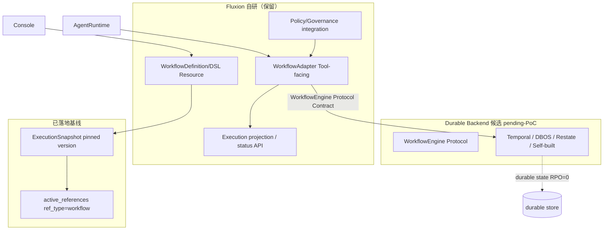

# Durable Execution Backend 模块需求与设计一体化文档

> **文档编号**: MOD-WF-001-v0.1
> **文档版本**: v0.1
> **创建日期**: 2026-08-26
> **文档状态**: 草稿 / 设计评审中
> **对应 PRD**: PRD-20260826-04 §4.8 / US-06 / US-10 / B1 / SLO-WF-01/02 / SLO-RUN-03 / NFR-REL-01/02 / NFR-SCALE-02
> **对应 Roadmap**: TASK-0004（ADR-WF-001）/ Phase 3 Workflow Platform 前置 Gate

**评审边界说明**:
- **需求评审**: 第 2 章 → 锁定需求基线
- **设计评审**: 第 3-4 章 → 锁定设计基线

**ID 体系**: US（来自 PRD）、FEAT、API、RULE、TC、RISK、NFR
场景编号：S-（正常）、E-（异常）、B-（边界）

> **本文是 Phase 0 ADR 级 design**：定义 Durable Execution Backend 的 **build-vs-buy 决策框架 + PoC 验收口径 + Adapter 契约保留**。**vendor 最终 pick 标 `pending-PoC-gate`**——按 PRD §4.8 "默认倾向：优先成熟 durable backend，不自研 durable kernel，最终以 ADR 为 Gate"，pick 须以 PoC 跑通的对比证据为准，本 brief 不在无证据下拍板。FEAT-10/12/13（DSL/HumanTask/Version GC）是 Phase 3 下游，消费本 ADR 选定的 backend，不在本 brief 范围。

---

## 目录

- [1. 文档控制](#1-文档控制)
- [2. 需求分析](#2-需求分析)
- [3. 技术设计](#3-技术设计)
- [4. 部署与运维](#4-部署与运维)
- [5. 风险与依赖](#5-风险与依赖)
- [6. 需求追溯矩阵](#6-需求追溯矩阵)
- [附录：术语表](#附录术语表)

---

## 1. 文档控制

### 1.1 责任人

| 角色 | 姓名 | 职责范围 |
|------|------|---------|
| 架构师 | jahan | build-vs-buy 决策框架、§8 amend ADR-008、PoC 验收口径 |
| 开发负责人 | （待定） | PoC 4 候选实现 + WorkflowEngine Protocol 扩展 |
| 测试负责人 | （待定） | PoC 自动化证据（crash 恢复/timeout/idempotency/scaling） |

### 1.2 修订历史

| 版本 | 日期 | 作者 | 变更描述 |
|------|------|------|---------|
| v0.1 | 2026-08-26 | jahan | 初始草稿：build-vs-buy 框架 + PoC 口径 + Adapter 契约保留 |

---

## 2. 需求分析

### 2.1 需求概述

| 项目 | 内容 |
|------|------|
| **模块名称** | Durable Execution Backend（ADR-WF-001） |
| **模块ID** | MOD-WF-001 |
| **所属系统/产品线** | Fluxion Runtime / Workflow Platform 前置 |
| **需求类型** | 技术重构 / 架构演进（build-vs-buy Gate） |
| **业务背景** | v2.2 PRD §4.8 + B1。复杂 SOP（入职流程等）含 Retry/Compensation/Timeout/Human Approval/Long-running State/Crash Recovery/Idempotency，属 Durable Workflow，不是 LLM Reasoning。ADR-008 已把"真实 Engine 替换 Adapter Stub"显式延期到业务接入层 + Revisit Condition；当前 `runtime/workflow.py` 只有 Adapter + `StubWorkflowEngine`，无 durable backend。v2.2 企业化要求 durable workflow 成为一等能力，须先做 build-vs-buy Gate，未通过不得开发 Engine（PRD B1）。 |
| **核心目标** | 选定一个成熟 durable execution backend（Temporal / DBOS / Restate / 自建 PostgreSQL engine），替换 `StubWorkflowEngine` backs the `WorkflowEngine` Contract；Fluxion 自研 DSL + adapter（已 ADR-008），**不自研 durable kernel**（PRD 默认倾向）。 |

### 2.2 痛点与价值

| 维度 | 内容 |
|------|------|
| **目标用户** | Builder（US-06：编排 durable Workflow 不自行实现恢复/定时器/等待语义）；运行时（US-10：长 Workflow resume 取 pinned 不可变定义与依赖）。 |
| **当前问题** | (1) `StubWorkflowEngine.start` 只 `append` 请求返回固定 run_id（`runtime/workflow.py:68-75`），**零 durable state、零恢复、零定时器**；(2) 无 build-vs-buy 评估，存在"未做 ADR 就自研完整 durable kernel"风险（PRD 反模式 line 447）；(3) Workflow backend/worker 故障无恢复路径。 |
| **业务影响** | 无 durable backend → 复杂 SOP 无法安全运行（中断即丢失进度），企业级 Agent Platform 不成立。 |
| **预期价值** | durable start P95≤1s（SLO-WF-01）；backend/worker 故障恢复 P95≤60s（SLO-WF-02）；committed durable state RPO=0（SLO-RUN-03）；durable backend/worker 可水平扩展（NFR-SCALE-02）。 |

**用户故事**

| 编号 | 用户故事 | 优先级 |
|------|---------|--------|
| US-06 | 作为 Builder，我希望编排 durable Workflow，不自行实现恢复/定时器/等待语义 | P0 |
| US-10 | 作为运行时，长时间 Workflow resume 时仍能取得启动时 pinned 的不可变定义与执行依赖 | P0 |

### 2.3 功能方案

#### 2.3.1 功能清单

| 功能ID | 功能名称 | 功能描述 | 优先级 | 来源 |
|--------|---------|---------|--------|------|
| FEAT-WF-01 | Durable Execution Backend 契约 + build-vs-buy PoC | 扩展 `WorkflowEngine` Protocol（resume/signal/cancel/status）+ 4 候选 PoC + 评估矩阵 + vendor pick（PoC-gated） | P0 | US-06 + US-10 + B1 |

> FEAT-10（Workflow DSL）/FEAT-12（HumanTask/Wait/Resume）/FEAT-13（Version Lifecycle/GC）是 Phase 3 下游，消费本 ADR 选定 backend，不在本 brief 范围。

#### 2.3.2 字段约束

**FEAT-WF-01 字段约束 — WorkflowEngine Protocol 扩展（Contract，backend 无关）**

| 成员 | 签名 | 约束 | 说明 |
|------|------|------|------|
| `start` | `async start(request: WorkflowStartRequest) -> WorkflowStartResult` | 已存在（`runtime/workflow.py:26`）；start 须同步持久化（durable start） | 返回 `run_id` |
| `resume` | `async resume(run_id: str) -> WorkflowRunStatus` | 新增；幂等 | 从最近 durable step 继续 |
| `signal` | `async signal(run_id, name, payload) -> None` | 新增；durable timer/wait 用 | HumanTask/Wait 唤醒 |
| `cancel` | `async cancel(run_id, *, timeout: float) -> None` | 新增；带 timeout | 规则 18 |
| `get_status` | `async get_status(run_id) -> WorkflowRunStatus` | 新增；projection | Execution 投影/状态 API |

> 所有成员必须定义 `timeout` + `retry` + `fail policy`（规则 18），禁止无限等待/重试。

**WorkflowStartRequest（已存在，补字段约束）**：`tenant_id`/`user_id`/`execution_id`/`trace_id` 必填且全链路透传（SLO-OBS-01）；`workflow_id` + pinned version 来自 ExecutionSnapshot（§4.4 rule 5/6）。

### 2.4 范围与边界

| 类别 | 内容 |
|------|------|
| **范围（In Scope）** | (1) `WorkflowEngine` Protocol 扩展契约（backend 无关）；(2) build-vs-buy 4 候选评估矩阵 + **15 PRD §4.8 维度** + **4 补充维度**（ADR-008 Contract swappability / vendor lock-in / Contract 可替换性 / PoC 失败回退成本）+ 权重；(3) PoC 验收口径（crash 恢复/durable timer/idempotency/pinned resume/timeout/scaling）；(4) Adapter 边界保留（ADR-008 不变）；(5) §8 amend ADR-008（决定什么 backs the Adapter）。 |
| **非范围（Out of Scope）** | (1) vendor 最终 pick（pending-PoC-gate）；(2) FEAT-10 DSL 实现（Phase 3）；(3) FEAT-12 HumanTask/Wait/Resume 实现（Phase 3）；(4) FEAT-13 Version Lifecycle/GC 实现（Phase 3，retention 机制由 ADR-SNAPSHOT-001 的 `active_references` 提供）；(5) Workflow Studio UX（FEAT-22，Phase 4）。 |
| **前置假设** | ADR-008 Accepted（Adapter+Stub 已落地 `runtime/workflow.py`）；ADR-001（stateless）落地；ADR-005（ExecutionSnapshot pinned）+ ADR-SNAPSHOT-001（active_references retention）已设计。 |
| **有意妥协 / 技术债** | (1) vendor pick 延后 PoC（不在此 brief 拍板）；(2) self-built PostgreSQL engine 选项保留但非默认（PRD 默认倾向不自研 durable kernel）；(3) durable state 存储位置（backend 自带 vs Fluxion PostgreSQL）随 pick 决定，self-built 选项才用 Fluxion PostgreSQL。 |

### 2.5 验收条件

#### 2.5.1 业务规则与约束

| ID | 类型 | 描述 | 验证场景 |
|----|------|------|---------|
| RULE-WF-01 | 系统约束 | Runtime 不持有 Workflow durable state；Adapter `local_durable_state_count==0` 不变 | B-01 |
| RULE-WF-02 | 系统约束 | Workflow resume 始终使用 pinned version（ExecutionSnapshot），不 resolve latest | S-03 |
| RULE-WF-03 | 系统约束 | 被 active workflow 引用的 WorkflowDefinition 版本不得 hard delete（active_references ref_type=workflow） | 引用 ADR-SNAPSHOT-001 |
| RULE-WF-04 | 系统约束 | 所有 backend 调用定义 timeout+retry+fail policy（规则 18） | S-04 + E-01 |

#### 2.5.2 功能验收场景

> **测试层级** `unit`/`integration`/`E2E`/`manual`。**关键真实边界**不得 mock，编码阶段不得自行降级。PoC 阶段 S-02/S-05/E-01 必须用真实 backend 候选跑通。

**正常场景**

| 场景ID | 功能ID | 优先级 | 测试层级 | 关键真实边界 | 操作步骤 | 预期结果 |
|--------|--------|--------|---------|-------------|---------|---------|
| S-01 | FEAT-WF-01 | P0 | E2E | Adapter → Engine → durable store | `execute_workflow` 调用 | 返回 `workflow_run_id`；start 同步持久化（durable start P95≤1s，SLO-WF-01） |
| S-02 | FEAT-WF-01 | P0 | E2E | 真实 backend + durable store | worker 中途 kill → resume | 从最近 durable step 继续，不重启（recovery P95≤60s，SLO-WF-02） |
| S-03 | FEAT-WF-01 | P0 | integration | ExecutionSnapshot + Registry | resume 长时间 Workflow | 使用 pinned WorkflowDefinition version，不 resolve latest（RULE-WF-02） |
| S-04 | FEAT-WF-01 | P0 | integration | Engine timeout 配置 | 单步超时 | 触发定义 fail policy，不无限等待（RULE-WF-04） |
| S-05 | FEAT-WF-01 | P0 | integration | 真实 backend dedup | 重试已完成 step | no-op（exactly-once effect） |
| S-06 | FEAT-WF-01 | P1 | integration | 2 个 worker 进程 | 2nd worker 拉取排队 work | 水平扩展生效（NFR-SCALE-02） |

**异常场景**

| 场景ID | 功能ID | 测试层级 | 关键真实边界 | 触发条件 | 系统行为 | 用户感知 |
|--------|--------|---------|-------------|---------|---------|---------|
| E-01 | FEAT-WF-01 | integration | Adapter fail policy + circuit-breaker | backend 宕机 | 返回定义错误码（非 hang）；N 次失败后熔断 | 工具调用失败而非超时挂起 |
| E-02 | FEAT-WF-01 | integration | PoC evidence artifact | build-vs-buy 无 PoC 证据 | CI 阻断（DFX gate） | 不得进入 Engine 开发 |

**边界场景**

| 场景ID | 测试层级 | 关键真实边界 | 字段/条件 | 边界值 | 预期行为 |
|--------|---------|-------------|----------|--------|---------|
| B-01 | unit | `runtime/workflow.py` WorkflowAdapter | `local_durable_state_count` | 恒等 0 | Runtime 无 durable workflow state（RULE-WF-01） |
| B-02 | integration | Engine tenant scoping | tenant A workflow_run | tenant B 查询 | 不可见（tenant 隔离，NFR-SEC-01） |

#### 2.5.3 非功能指标

**性能指标**

| 指标ID | 指标名称 | 目标值 | 测量方法 |
|--------|--------|-------|---------|
| SLO-WF-01 | Workflow durable start | start 确认持久化 P95≤1s | PoC 计时 |
| SLO-WF-02 | Workflow backend/worker 故障恢复 | durable workflow 可继续推进 P95≤60s | PoC crash 恢复计时 |
| SLO-WF-03 | Committed Step 不可逆副作用重复 | committed step 不可逆写副作用重复次数 = 0（PRD §4.8 line 100） | PoC idempotency 计数（P-IDEMP） |

**可靠性指标**

| 指标ID | 指标名称 | 目标值 |
|--------|--------|-------|
| SLO-RUN-03 | Durable state RPO | committed durable state RPO=0 |
| NFR-REL-01 | RPO | committed durable state RPO=0 |
| NFR-REL-02 | Recovery | Workflow backend 恢复 P95≤60s |
| NFR-REL-03 | Idempotency | committed 不可逆写副作用重复 = 0（PRD line 412，S-05） |
| NFR-SCALE-02 | Workflow | Durable backend/worker 可水平扩展 |

**安全性要求**

| 指标ID | 安全域 | 验收标准 |
|--------|--------|---------|
| NFR-SEC-01 | 租户隔离 | workflow_run 全链路 tenant scope，跨租户不可见（B-02） |

**可观测性**

| 指标ID | 指标名称 | 目标值 |
|--------|--------|-------|
| SLO-OBS-01 | Trace 关联完整率 | P0 Agent/Workflow/Tool/MCP 路径 ≥99% |

---

## 3. 技术设计

### 3.1 方案选型

#### 3.1.1 候选清单（PRD §4.8）

| 候选 | 类型 | 一句话定位 |
|------|------|-----------|
| **Temporal** | 成熟外部 durable backend | 分布式 workflow orchestration，replay-based，生态成熟 |
| **DBOS** | PostgreSQL-native durable backend | 轻量，durable state in Postgres，Python-first |
| **Restate** | built-for-eventing durable runtime | Rust core，invocation-based，self-host 友好 |
| **Self-built PostgreSQL engine** | 自研 durable kernel | Fluxion 自建 workflow_run/step + scheduler + replay（PRD 默认倾向**否决**，除非 PoC 证明更优） |

#### 3.1.2 评估矩阵（权重 + PoC 打分）

> 打分待 PoC 跑通后回填（`pending-PoC`）。权重锁定为评分依据；**15 PRD §4.8 维度 + 4 补充维度（ADR-008 派生：Contract swappability / vendor lock-in / Contract 可替换性 / PoC 失败回退成本）= 19 项**归入 5 个宏维度（补充维度已在“生态与适配”“风险/可逆性”行标注）。

| 宏维度 | 权重 | 含义（PRD §4.8 维度） | Temporal | DBOS | Restate | Self-built |
|--------|------|---------------------|---------|------|---------|------------|
| 功能完备性 | 30% | durable timer/wait/signal + retry/idempotency + replay/recovery model | pending | pending | pending | pending |
| 生态与适配 | 20% | Python SDK/生态 + dynamic DSL 适配 + ADR-008 Contract swappability | pending | pending | pending | pending |
| 运维 | 20% | self-host + horizontal scaling + operational complexity + local dev complexity + observability | pending | pending | pending | pending |
| 数据与合规 | 20% | data ownership（RPO=0/tenant）+ license + upgrade/versioning + workflow retention + enterprise maturity | pending | pending | pending | pending |
| 风险/可逆性 | 10% | vendor lock-in + Contract 可替换性 + PoC 失败回退成本 | pending | pending | pending | pending |
| **最终得分** | **100%** | | **pending** | **pending** | **pending** | **pending** |

#### 3.1.3 PoC 验收口径（每候选必须跑通的最小 durable workflow）

| 口径ID | 验收点 | 通过判据 | 对应场景 |
|--------|--------|---------|---------|
| P-CRASH | worker kill 中途恢复 | resume 从最近 durable step 继续，非重启 | S-02 |
| P-TIMER | durable timer | worker 重启后定时器仍触发 | — |
| P-IDEMP | 幂等 | 重试已完成 step 为 no-op | S-05 |
| P-PIN | pinned version | resume 用 pinned WorkflowDefinition | S-03 |
| P-TIMEOUT | 超时 fail policy | 单步超时触发定义 fail，非无限等待 | S-04 |
| P-SCALE | 水平扩展 | 2nd worker 拉取排队 work | S-06 |

> PoC 证据须自动化产出（RULE-fluxion-dfx-001），不得事后补（E-02 CI 阻断）。

#### 3.1.4 关键决策记录

| 决策点 | 选择 | 被否决项 | 理由 | 可逆性 |
|--------|------|---------|------|--------|
| durable kernel 自研 vs 采购 | **默认倾向采购**（pending-PoC-gate） | 默认否决自研 durable kernel | PRD §4.8 默认倾向 + 反模式 line 447“未做 ADR 就自研完整 durable kernel” + line 452“将业务领域事务迁进 Fluxion Workflow” | 高（backend behind Contract） |
| Fluxion 自研范围 | DSL + Adapter + Projection API | 不自研 scheduler/timer/exactly-once/replay/crash-recovery kernel | PRD §4.8 "Fluxion 不预设必须自研" | — |
| vendor 最终 pick | pending-PoC-gate | — | 须 PoC 跑通对比证据（4 候选均跑 P-CRASH..P-SCALE） | 高（`WorkflowEngine` Protocol 可替换） |

> 被放弃的较慢/较险方案：默认自研 durable kernel——replay/exactly-once/crash-recovery 自研复杂度高、易错且违背 PRD 默认倾向，PoC 须证明 self-built 在功能/运维/风险三宏维度均明显领先才翻盘。

#### 3.1.5 技术栈

| 类别 | 选型 | 版本 | 选型理由 |
|------|------|------|---------|
| 语言 | Python | 3.12+ | 项目基线 |
| Adapter | `WorkflowAdapter`（已有 `runtime/workflow.py`） | — | ADR-008 边界，保留 |
| Contract | `WorkflowEngine` Protocol（扩展） | — | backend 无关，可替换 |
| durable backend | pending-PoC-gate | — | Temporal/DBOS/Restate/self-built 四选一 |
| durable state store | 随 pick（backend 自带 或 Fluxion PostgreSQL） | — | self-built 选项才用 Fluxion PostgreSQL |

---

### 3.2 架构设计

> **硬边界**（ADR-008 + ADR-001）：`WorkflowAdapter.local_durable_state_count==0` 恒等（B-01）；Agent Runtime 不持有 durable workflow state（rule 13）；backend 只经 `WorkflowEngine` Protocol 接入，可替换（Contract swappability）。

**Fluxion 自研**：WorkflowDefinition/DSL（versioned Resource）、Builder UX、Agent/Capability node model、Policy/Governance、Execution projection/status API。
**Fluxion 不自研**：distributed scheduler、durable timers、exactly-once/replay engine、crash-recovery kernel（委托选定 backend）。

#### 外部依赖清单

| 外部系统 | 依赖类型 | 协议 | 超时 | 降级策略 |
|---------|---------|------|------|---------|
| Durable backend（pending pick） | 计算/状态 | WorkflowEngine Protocol（SDK/native） | 每调用定义（规则 18） | circuit-breaker + 定义错误码（E-01） |

---

### 3.3 数据设计

> durable state **主存储由选定 backend 拥有**（Temporal/DBOS/Restate 自带；self-built 才用 Fluxion PostgreSQL）。Fluxion 不重复发明 durable state 表。

**复用既有（不重新设计）**:
- `WorkflowDefinition` = versioned Resource（ADR-005 ExecutionSnapshot pinned；ADR-SNAPSHOT-001 `active_references` retention，`ref_type=workflow`）。

**self-built 选项才新增（仅该选项）**:

**新增表: `workflow_run`（self-built 选项）**

| 字段名 | 类型 | 可空 | 默认值 | 索引 | 说明 |
|--------|------|------|--------|------|------|
| id | String(128) | N | | PK | run_id |
| tenant_id | String(128) | N | | idx | 租户（强制） |
| workflow_id | String(128) | N | | idx | WorkflowDefinition id |
| workflow_version | Integer | N | | | pinned version |
| execution_id | String(128) | N | | idx | 关联 Execution |
| status | String(16) | N | | | running/paused/completed/failed/cancelled |
| state | JSON | Y | | | durable step state |
| created_at / updated_at | DateTime(tz) | N | | | |

**索引设计**

| 索引名 | 类型 | 字段 | 使用场景 |
|--------|------|------|---------|
| idx_wf_run_tenant | btree | tenant_id, status | 租户隔离 + 列表 |
| idx_wf_run_exec | btree | execution_id | Execution 关联 |

> `workflow_step` 表（self-built）随 DSL 设计在 Phase 3 补；本 brief 只锁 self-built 选项的 run 表骨架 + tenant 隔离。

**容量预估**: 待定（随 PoC + Phase 3 DSL）。

---

### 3.4 接口设计

> **形态 C：函数 / 库接口**（内部 SPI，backend 无关）。

| 函数签名 | 入参 | 返回 | 错误处理 |
|---------|------|------|---------|
| `WorkflowEngine.start(request)`（已有） | `WorkflowStartRequest` | `WorkflowStartResult` | durable start 失败→定义错误码 |
| `WorkflowEngine.resume(run_id)`（新） | run_id | `WorkflowRunStatus` | run 不存在→`NotFound`；幂等 |
| `WorkflowEngine.signal(run_id, name, payload)`（新） | run_id, name, payload | `None` | run 不存在/已终态→`InvalidState` |
| `WorkflowEngine.cancel(run_id, *, timeout)`（新） | run_id, timeout | `None` | 超时→`CancelTimeout`（规则 18） |
| `WorkflowEngine.get_status(run_id)`（新） | run_id | `WorkflowRunStatus` | run 不存在→`NotFound` |

> Protocol 当前 5 成员（start/resume/signal/cancel/get_status）是 build-vs-buy Gate 必需的最小 Contract。roadmap Phase 3 Workflow Platform 共 8 接口，其中 **`execution history ref`**（execution→workflow_run 关联查询）等 3 接口属 Phase 3 下游（FEAT-12/13 消费），本 brief 不扩展。

> 所有调用必须 `timeout` + `retry`（有限）+ `fail policy`（规则 18 / RULE-backend-quality-001）。`WorkflowAdapter.execute`（已有）透传 `tenant_id`/`execution_id`/`trace_id`，调用 `start`，返回 `ToolResult.started`。

---

### 3.5 质量实现方案

#### 性能设计

| 指标ID | 热点路径 | 目标值 | 实现方案（含被放弃的较慢方案） |
|--------|---------|-------|------------------------------|
| SLO-WF-01 | durable start（每 workflow 启动 1 次） | P95≤1s | start 同步持久化（backend 原生）；被放弃：async fire-and-forget start（无法保证 durable） |
| SLO-WF-02 | crash recovery（故障时） | P95≤60s | backend replay/recovery model；被放弃：自研 checkpoint（复杂度高，PRD 默认否决） |

#### 可靠性设计

| 风险ID | 失效模式 | 影响 | 应对措施 | 验证场景 |
|--------|---------|------|---------|---------|
| RISK-WF-01 | backend 全宕 | workflow 无法推进 | circuit-breaker + 定义错误码；不无限等待 | E-01 |
| RISK-WF-02 | 无 PoC 证据即自研 / 将业务领域事务迁进 Fluxion Workflow | durable kernel 不正确 / 领域事务越界 | CI DFX gate 阻断（E-02）；强制 4 候选 PoC；反模式 line 447 + 452 | E-02 |
| RISK-WF-03 | pinned version 被删 | resume 取错版本 | active_references ref_type=workflow（ADR-SNAPSHOT-001）+ tombstone | S-03 |

#### 安全性设计

| 指标ID | 验收标准 | 实现方案 |
|--------|---------|---------|
| NFR-SEC-01 | workflow_run 跨租户不可见 | tenant_id 全链路强制（B-02）；backend 查询带 tenant scope |

#### 可观测性设计

| 场景 | 实现方案 |
|------|---------|
| 监控指标 | durable start P95、recovery P95、backend 错误率、circuit-breaker 状态 |
| 日志 | 结构化 JSON + trace_id/execution_id/run_id 关联 |
| 链路追踪 | OpenTelemetry；SLO-OBS-01 P0 路径 ≥99% |

---

## 4. 部署与运维

### 4.1 部署架构

| 环境 | 配置 | 实例数 | 用途 |
|------|------|--------|------|
| dev | 待定（随 pick） | 1 | PoC + 本地开发 |
| prod | 待定（随 pick） | 3+ | 生产 durable backend + worker |

> 部署形态随 vendor pick 决定（Temporal 需独立集群；DBOS in-Postgres；Restate self-host；self-built in Fluxion pod）。本 brief 不固化。

### 4.2 监控告警

| 指标 | 阈值 | 级别 | 处理SLA |
|------|------|------|---------|
| durable start P95 | >1s | P1 | 15min |
| recovery P95 | >60s | P1 | 15min |
| backend 错误率 | >0.5% | P1 | 5min |

---

## 5. 风险与依赖

### 5.1 项目依赖

| 依赖模块/团队 | 依赖内容 | 状态 | 风险等级 |
|-------------|---------|------|---------|
| ADR-008 | Adapter 边界（已落地） | Accepted | 低 |
| ADR-001 | stateless 基线 | Accepted | 低 |
| ADR-005 + ADR-SNAPSHOT-001 | pinned version + active_references retention | 已设计 | 低 |
| Phase 3 FEAT-10/12/13 | DSL/HumanTask/Version GC（消费选定 backend） | 未启动 | 中 |

### 5.2 风险识别

| 风险ID | 类型 | 描述 | 概率 | 影响 | 应对措施 | 验证场景 |
|--------|------|------|------|------|---------|---------|
| RISK-WF-01 | 技术选型 | 4 候选 PoC 均不达 P-CRASH..P-SCALE | 低 | 高 | 允许 self-built 翻盘（须 PoC 证据）；否则降级 FEAT-11 范围 | S-02/S-05/S-06 |
| RISK-WF-02 | 架构 | durable state 误进 Agent Runtime | 中 | 高 | B-01 unit 不变量 + rule 13 architecture test | B-01 |
| RISK-WF-03 | 流程 | 无 PoC 证据即开发 Engine | 中 | 高 | E-02 CI gate + PRD B1 Gate | E-02 |
| RISK-WF-04 | 供应商 | vendor lock-in | 中 | 中 | `WorkflowEngine` Protocol 可替换；选型权重含风险/可逆性 10% | §3.1.4 |

---

## 6. 需求追溯矩阵

| 用户故事 | 功能ID | 接口ID | 测试用例ID | 测试层级 | 状态 |
|---------|--------|--------|-----------|---------|------|
| US-06 | FEAT-WF-01 | WorkflowEngine.start | S-01 | E2E | 待实现 |
| US-06 | FEAT-WF-01 | WorkflowEngine（resume/signal/cancel） | S-02/S-04/S-05 | integration | 待实现 |
| US-10 | FEAT-WF-01 | WorkflowEngine.resume + pinned | S-03 | integration | 待实现 |
| US-06 | FEAT-WF-01 | WorkflowEngine（horizontal） | S-06 | integration | 待实现 |
| — | FEAT-WF-01 | Adapter fail policy | E-01 | integration | 待实现 |
| — | FEAT-WF-01 | PoC evidence gate | E-02 | integration | 待实现 |
| — | FEAT-WF-01 | Adapter stateless invariant | B-01 | unit | 待实现 |
| — | FEAT-WF-01 | tenant isolation | B-02 | integration | 待实现 |

> RULE-WF-01→B-01、RULE-WF-02→S-03、RULE-WF-04→S-04/E-01；高影响 RISK-WF-01/02/03→S-02/S-05/S-06、B-01、E-02。矩阵闭合：US→FEAT→接口→TC 无断点。

---

## Spec Compliance Matrix

| Spec/Rule | enforcement | 设计影响 | 设计落点 | 验证场景 | 状态/N/A 理由 |
|-----------|-------------|---------|---------|---------|----------------|
| `fluxion-workflow-capability#RULE-fluxion-workflow-001` | required | Tool=Adapter；durable SOP state 必须由 Workflow Engine 管理 | §3.2 Adapter 边界 + §3.4 WorkflowEngine Protocol 扩展 + `durable-state-by-engine` | S-01（E2E）+ S-02（E2E）+ B-01（unit）+ verifier: `fluxion-workflow-capability#RULE-fluxion-workflow-001` | applied |
| `fluxion-runtime-core#RULE-fluxion-runtime-001` | required | Runtime 无状态；durable state 不进 Agent Runtime（rule 13）；backend 只经稳定 Contract；ExecutionSnapshot pinned | §3.2 硬边界 + §2.5 B-01 不变量 + `stateless-invariant-contract` | B-01（unit）+ S-03（integration，pinned）+ verifier: `fluxion-runtime-core#RULE-fluxion-runtime-001` | applied |
| `fluxion-dfx#RULE-fluxion-dfx-001` | required | build-vs-buy PoC 须在编码阶段产出自动化证据，非事后补 | §3.1.3 PoC 验收口径 + §2.5 E-02 CI gate + `poc-evidence-gate` | S-02 + S-05 + S-06 + E-02（integration）+ verifier: `fluxion-dfx#RULE-fluxion-dfx-001` | applied |
| `backend-code-quality-performance#RULE-backend-quality-001` | required | 所有 backend 调用定义 timeout+retry+circuit-breaker+fail policy（规则 18），禁止无限等待/重试 | §3.4 接口 timeout/fail + §3.5 RISK-WF-01 circuit-breaker + §2.5 S-04/E-01 + `timeout-fail-policy` | S-04（integration）+ E-01（integration）+ verifier: `backend-code-quality-performance#RULE-backend-quality-001` | applied |
| `backend-database#RULE-backend-database-001` | required | durable state RPO=0；self-built 选项 schema + tenant 隔离索引 | §3.3 workflow_run 表 + idx_wf_run_tenant + §2.5 B-02 + `rpo-zero-tenant-schema` | B-02（integration）+ S-01（E2E，durable persist）+ verifier: `backend-database#RULE-backend-database-001` | applied |

**advisory rules**：`backend-code-quality-performance#PATTERN-backend-002`（重 IO 异步/批处理）适用于 durable backend 调用；`PATTERN-backend-004`（性能敏感路径加监控）适用于 SLO-WF-01/02 监控（§3.5 可观测性 + §4.2 告警）。

**未绑定 spec**：`fluxion-resource-registry`（versioned WorkflowDefinition + pinned resume + retention 由 ADR-005/ADR-SNAPSHOT-001 设计，本 ADR references 不 re-design）未 bind，非 N/A。前端 spec 不在路径内，未 bind。

---

## §8 ADR 对齐声明

| 既有 ADR | 关系 | 说明 |
|---------|------|------|
| **ADR-008**（workflow-adapter-boundary） | **amend** | ADR-008 Decision/Validation：Adapter 在开源 V1；Engine/业务归业务接入层；**Validation 中“业务接入阶段以真实 Engine 替换 Stub”到期**（line 58）。本 ADR 决：选定真实 durable backend 替换 `StubWorkflowEngine` backs the `WorkflowEngine` Contract。**Adapter 边界不变**（`runtime/workflow.py` 保留），仅替换背后实现。不 supersede（接入协议层不变）。ADR-008 Revisit Condition（line 60-62“重新评估是否纳入开源层”）是另一议题，不在本 ADR 到期范围。 |
| ADR-001（stateless-agent-runtime） | references | `local_durable_state_count==0` 不变量保留（B-01）；durable state 不进 Agent Runtime（rule 13）。 |
| ADR-005（execution-snapshot） | references | Workflow resume 用 pinned version（RULE-WF-02），消费 ExecutionSnapshot。 |
| ADR-SNAPSHOT-001（pinned-retention） | references | 被 active workflow 引用的版本经 `active_references` ref_type=workflow 保护（RULE-WF-03），不 hard delete。 |
| ADR-EXT-001 | 无直接关系 | durable backend 是 infra behind Contract，非 PluginType（不在 ADR-EXT-001 将定义的 Provider SPI 之列——该 ADR 未编写，具体数量待其定稿）；DSL/Adapter 不是 Provider。 |

> 本 ADR 是 ADR-008 的 amend。到期的是 ADR-008 **Decision/Validation 中的 Stub→真实 Engine 演化**（Validation line 58“业务接入阶段：以真实 Engine 替换 Stub”），而非 Revisit Condition——ADR-008 Revisit Condition 主题是“重新评估是否纳入开源层”（line 60-62），与本 backend 选型是不同议题。措辞用 amend 而非 greenfield“新增”——Adapter 接入协议层已 ADR-008 决且已落地，本 ADR 只决背后 backend 选型。

---

## 附录：术语表

| 术语 | 定义 |
|------|------|
| Durable Workflow | 含 Retry/Compensation/Timeout/Human Approval/Long-running State/Crash Recovery/Idempotency 的 SOP 执行 |
| WorkflowEngine Protocol | backend 无关 Contract，Fluxion 自有，可替换实现 |
| WorkflowAdapter | Tool-facing 接入层（ADR-008），`local_durable_state_count==0` |
| pinned version | resume 使用 ExecutionSnapshot 固定的 WorkflowDefinition 版本 |
| build-vs-buy Gate | PRD B1 + §4.8 要求的 ADR 级决策门，未过不得开发 Engine |

---

*文档结束*
