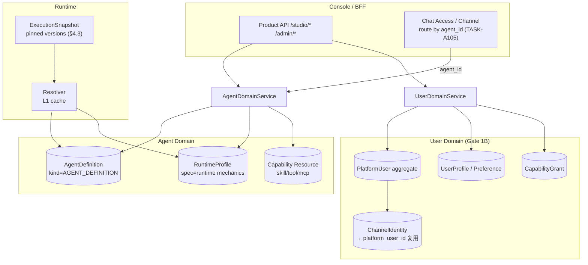
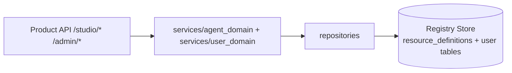
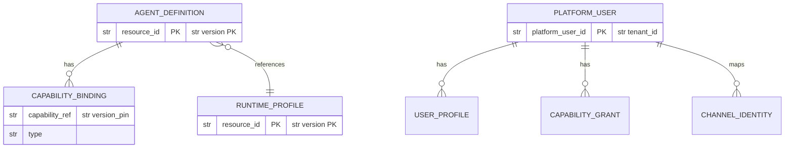
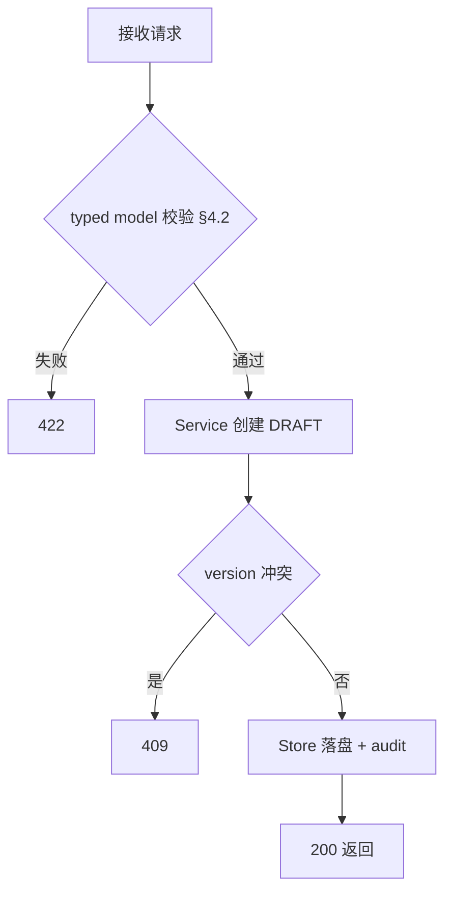

# Phase 1 Agent + User Domain 后端需求与设计一体化文档

> **文档编号**: MOD-P1-AGENTUSER-v0.3
> **文档版本**: v0.3（补 Gate 1B User Domain FEAT-B07 + TASK-A105 agent_id 产品路由 FEAT-B08；修 F-2 AgentDefinition 契约对齐 PRD §4.2；按 roadmap 标注落地阶段）
> **创建日期**: 2026-08-27
> **文档状态**: 草稿
> **配套**: 本 brief 与同目录 `phase1-product-architecture.frontend.design.md` 并行，前后端交叉引用。前端 Product API/BFF 契约见前端 brief §3.5，本文档定义其后端落点。

**评审边界说明**:
- **需求评审**: 第 2 章 → 锁定需求基线
- **设计评审**: 第 3-4 章 → 锁定设计基线

**ID 体系**: US（来自 PRD）、FEAT（功能）、API（接口）、RULE（业务规则/系统约束）、TC（测试用例）、RISK、NFR
场景编号：S-（正常）、E-（异常）、B-（边界）

**填写约定**: 阈值均为真实目标（引自 CLAUDE.md 性能基线 / PRD SLO），非示例。落地阶段引自 roadmap §3（Phase 1 Domain+Storage Foundations）/§6（Phase 4）/§7（Phase 5）。

---

## 1. 文档控制

### 1.1 责任人

| 角色 | 姓名 | 职责范围 |
|------|------|---------|
| 架构师 | Fluxion | AgentDefinition/RuntimeProfile 边界、User Domain、agent_id 路由、Contract |
| 开发负责人 | Fluxion | Agent Domain + User Domain service/API 实现 |
| 测试负责人 | Fluxion | 等价解析 / Snapshot / User Domain 契约测试 |

### 1.2 修订历史

| 版本 | 日期 | 作者 | 变更描述 |
|------|------|------|---------|
| v0.1 | 2026-08-27 | Fluxion | 初始草稿（cf-task:align 产出） |
| v0.2 | 2026-08-27 | Fluxion | 扩 FEAT-B05 通用 typed-resource CRUD + B06 schema 端点；RULE-B03 各 kind typed model；加 S-06/S-07 + API-B05/B06/B07 |
| v0.3 | 2026-08-27 | Fluxion | 补 Gate 1B User Domain FEAT-B07（TASK-U101..U105：PlatformUser aggregate/UserProfile/Preference/CapabilityGrant/ChannelIdentity 复用）；补 TASK-A105 agent_id 产品路由 FEAT-B08（runtime_profile_id→agent_id，迁移完删旧路径）；修 F-2：AgentDefinition spec model 对齐 PRD §4.2（加 owner/visibility/lifecycle + memory/personalization refs，tools 折进 capabilities）；FEAT-B02 显式对齐 TASK-A104（移除 RuntimeProfile 产品语义）；按 roadmap 标注落地阶段 |

---

## 2. 需求分析

### 2.1 需求概述 [必填]

| 项目 | 内容 |
|------|------|
| **模块名称** | Agent Domain + User Domain（AgentDefinition 产品实体 + RuntimeProfile 语义收缩 + User Domain + agent_id 产品路由） |
| **模块ID** | MOD-P1-AGENTUSER |
| **所属系统/产品线** | Fluxion Console + Runtime |
| **需求类型** | 架构演进 |
| **业务背景** | V1 `RuntimeProfile` 同时承载 persona（人设/system prompt）、model（模型选择）、capability（能力绑定）、runtime mechanics（timeout/concurrency）四类异质职责；前端只能按 Resource 类型铺表，管理员无法表达"一个 Agent"；User Domain（PlatformUser/Profile/CapabilityGrant）缺失，User 360 无数据底座；Chat Access/Channel 以 runtime_profile_id 为路由键，违反 PRD §4.2"普通用户产品面不再以 RuntimeProfile 为 Agent 标识"。经源码核验（PRD §2.1），`RuntimeProfile.spec_json` 混放 persona+runtime+capability，是 IA 混乱根因。 |
| **核心目标** | 拆出 `AgentDefinition` 作为产品领域实体（identity+owner/visibility/lifecycle+runtime_profile_ref+capabilities+memory/personalization refs+model_ref），`RuntimeProfile` 收缩为纯 runtime mechanics（TASK-A104）；建 User Domain（Gate 1B：PlatformUser aggregate/Profile/Preference/CapabilityGrant，复用 ChannelIdentity）；Chat Access/Channel 路由迁到 agent_id（TASK-A105）。 |

### 2.2 痛点与价值 [必填]

| 维度 | 内容 |
|------|------|
| **目标用户** | Builder（构建 Agent）、Admin（治理）；见 PRD §3.1 Persona |
| **当前问题** | RuntimeProfile 三职责混合：前端无法以"Agent"为单位构建/试跑；persona/model 散落 spec_json，无 typed model 约束（违反 ADR-011/FEAT-15）；User Domain 缺失（US-02 User 360 无底座）；跨 Pod 解析依赖隐式默认，等价性无自动化证据（PRD US-08/US-09 未闭环）；Chat 以 runtime_profile_id 路由，暴露内部配置给产品面。 |
| **业务影响** | 管理员"用不明白"当前 Console（用户原话）；Agent 构建路径不存在，FEAT-22 Agent Studio 无后端实体可对接；User 360（FEAT-23）无 PlatformUser/Profile/CapabilityGrant 数据底座。 |
| **预期价值** | AgentDefinition 为中心的构建/发布/试跑闭环（US-05）；User Domain 支撑 User 360 + 跨渠道身份映射（US-02/US-07）；agent_id 路由使产品面以 Agent 为标识（PRD §4.2）；跨 Pod/渠道运行态一致（US-08/US-09）。 |

**用户故事**

| 编号 | 用户故事 | 优先级 |
|------|---------|--------|
| US-02 | 同一用户跨渠道身份一致，User 360 可管理 Identity/Profile/Capability/Policy/Activity | P0 |
| US-05 | Builder 以 AgentDefinition 为中心完成 Agent 构建、测试、发布 | P0 |
| US-07 | Admin 可通过 User 360 管理 Identity/Profile/Capability/Policy/Activity | P0 |
| US-08 | 平台可任意水平扩展 Runtime Pod，用户无 sticky-session 感知 | P0 |
| US-09 | 同一 Execution 内 Tool/MCP/Skill/Policy/User Context 不发生版本漂移 | P0 |
| US-11 | 平台扩展机制只有一套明确模型，不并存死 PluginType 与新 SPI | P0 |
| US-12 | 所有 Resource Spec 以 typed model 为 SoT，禁止运行路径散乱读取 raw spec JSON | P0 |

### 2.3 功能方案 [必填]

#### 2.3.1 功能清单

> 落地阶段引自 roadmap：Phase 1=Domain+Storage Foundations（Gate 1A Architecture Skeleton / 1B User Domain / 1C Storage Foundation）；Phase 2=User Context+Runtime+Memory；Phase 4=Product Experience；Phase 5=Governance+Observability+Eval。本 brief 锁定 Phase 1 契约 + 标注 Phase 4/5 前端依赖。

| 功能ID | 功能名称 | 功能描述 | 优先级 | 落地阶段 | 来源 |
|--------|---------|---------|--------|---------|------|
| FEAT-B01 | AgentDefinition 实体（TASK-A101/A102/A103） | 新增 `ResourceKind.AGENT_DEFINITION` + typed spec model（identity/owner-visibility-lifecycle/runtime_profile_ref/capabilities/memory-personalization refs/model_ref/instructions，对齐 PRD §4.2），存于 Registry `resource_definitions`，走 DRAFT→PUBLISHED 生命周期。对应 PRD FEAT-01。 | P0 | Phase 1 (Gate 1A) | US-05 |
| FEAT-B02 | RuntimeProfile 语义收缩（TASK-A104） | 从 spec_json 移除 persona/model/capability 产品语义，保留 runtime mechanics（request_timeout_ms/max_retries/concurrency/memory_budget/executor_config）；typed model 约束。破坏性迁移（开发阶段接受大改）。对应 PRD FEAT-01 的另一半。 | P0 | Phase 1 (Gate 1A) | US-12 |
| FEAT-B03 | Runtime Semantic Equivalence | `tenant_id+user_id+runtime_profile_id`（及 agent_id）在不同 Pod 解析出等价 RuntimeProfile/UserRuntimeState/AgentDefinition，生成一致 ExecutionSnapshot；契约测试覆盖。对应 PRD FEAT-02。 | P0 | Phase 1 契约 / Phase 2 深做 (FEAT-03) | US-08, US-09 |
| FEAT-B04 | Capability Contract 复用 | AgentDefinition.capabilities 绑定 Capability Resource（skill/tool/mcp-typed）；Tool 与 Workflow Step 复用同一 Capability Contract（不重定义，tools 不再单列字段）。复用 ADR-EXT-001 的 6 SPI 模型，不新造 PluginType。对应 PRD FEAT-14 引用。 | P0 | Phase 1 | US-11 |
| FEAT-B05 | Product API（通用 typed-resource CRUD + Agent 试跑） | `/studio/{kind}` 通用 CRUD（kind ∈ agents/models/tools/skills/mcp/runtime-profiles/secrets/policies/evals）+ `/studio/agents/{agent_id}/test-run` + `/admin/users` + `/admin/users/{id}/360`；统一 envelope `{code,message,data,request_id}`。Control API `/api/v1/resources/*` 退为高级区。对应前端 brief FEAT-F11 BFF。 | P0 | Phase 1 契约 / Phase 4 前端落地 | US-05 |
| FEAT-B06 | typed spec model per kind + schema 端点 | 为 model/tool/skill/mcp/runtime-profile/secret/policy 各 kind 落地 typed spec model（ADR-011 RS），暴露 `GET /resources/{kind}/schema` 供前端 `SchemaForm` schema 驱动渲染（ADR-012）；`_definition_model(kind)` 分派补全（当前仅 MODEL_PROVIDER 硬接线）。前端"每类接入"前置依赖。对应 PRD FEAT-15。 | P0 | Phase 1 契约 / Phase 4 前端落地 | US-12 |
| FEAT-B07 | User Domain（Gate 1B，TASK-U101..U105） | PlatformUser aggregate（TASK-U101）+ UserProfile schema（U102）+ Profile Repository（U103）+ Preference/PersonalizationPolicy（U104）+ Capability Grant（U105）；复用既有 `channel_identities → platform_user_id` 映射；支撑 User 360 五区。对应 PRD FEAT-05/FEAT-23。 | P0 | Phase 1 (Gate 1B) | US-02, US-07 |
| FEAT-B08 | agent_id 产品路由（TASK-A105） | Chat Access/Channel 路由从 runtime_profile_id 迁到 agent_id；internal-dev 直接迁移/reset，externally-deployed 一次性 rollover，迁移完成删除旧路径。PRD §4.2"普通用户产品面不再以 RuntimeProfile 为 Agent 标识"。 | P0 | Phase 1 (Gate 1A 后) | US-05, US-02 |

#### 2.3.2 字段约束 [按需]

**FEAT-B01 AgentDefinition spec model**（typed，对齐 PRD §4.2；替代 raw spec_json）

| 分组（§4.2） | 字段名 | 字段类型 | 必填 | 约束 | 说明 |
|--------------|--------|---------|------|------|------|
| identity / presentation | name | str | Y | 1..64 | Agent 展示名 |
| identity / presentation | description | str | N | ≤512 | 用途说明 |
| identity / presentation | system_prompt | str | Y | ≤8192 | 人设/指令前缀 |
| owner / visibility / lifecycle | owner | str | Y | tenant 内用户/团队 ref | 归属 |
| owner / visibility / lifecycle | visibility | enum | Y | private\|tenant\|public | 可见范围 |
| owner / visibility / lifecycle | lifecycle | enum | Y | draft\|published\|deprecated | 生命周期态（映射 Resource 状态） |
| runtime_profile_ref | runtime_profile_ref | ResourceRef | N | 默认用 tenant 默认 Profile | 引用 RuntimeProfile |
| default capability/workflow presentation | capabilities | list[CapabilityBinding] | N | 每项含 capability_ref+version_pin+type(skill/tool/mcp) | 能力绑定（tools 折入，规则 12） |
| default capability/workflow presentation | workflow_ref | ResourceRef | N | 默认 workflow | default workflow presentation |
| memory/personalization policy refs | memory_policy_ref | ResourceRef | N | 引用 MemoryPolicy | Phase 2 深做，契约锁定 |
| memory/personalization policy refs | personalization_policy_ref | ResourceRef | N | 引用 PersonalizationPolicy | Phase 2 深做，契约锁定 |
| (Snapshot pin) | model_ref | ResourceRef | Y | 指向 MODEL_PROVIDER 资源 | 模型选择（§4.3 Snapshot 冻结 Model） |
| (补充) | instructions | str | N | ≤2048 | 补充指令 |

> F-2 修复：v0.2 的独立 `tools` 字段已删除——tools 是 capability（规则 12），折入 `capabilities`（type=tool）。补 owner/visibility/lifecycle + memory_policy_ref + personalization_policy_ref + workflow_ref（对齐 §4.2）。model_ref 由 §4.3 ExecutionSnapshot V2 冻结 Model 坐实（§4.2 树未单列但 Snapshot pin 之）。

**FEAT-B02 RuntimeProfile spec model（收缩后，TASK-A104）**

| 字段名 | 字段类型 | 必填 | 约束 | 说明 |
|--------|---------|------|------|------|
| request_timeout_ms | int | Y | 100..120000 | 单次模型调用超时 |
| max_retries | int | Y | 0..5 | 重试上限 |
| concurrency | int | N | 默认 1 | 并发上限 |
| memory_budget_mb | int | N | | 内存预算 |
| executor_config | dict | N | | executor 装配 |

> persona/system_prompt/model/capability 字段从此 model 移除（迁移到 AgentDefinition，TASK-A104 移除产品语义）。

**FEAT-B07 User Domain 模型（Gate 1B）**

| 实体 | 字段（核心） | 说明 |
|------|-------------|------|
| PlatformUser | platform_user_id, tenant_id, display_name, status | aggregate root；复用 `channel_identities → platform_user_id` 映射（TASK-U101） |
| UserProfile | platform_user_id, profile_json(typed), version | typed model（TASK-U102/U103） |
| Preference | platform_user_id, preference_json(typed) | 含 personalization_policy（TASK-U104） |
| CapabilityGrant | platform_user_id, capability_ref, granted_scope, version | 用户级能力授权（TASK-U105） |

### 2.4 范围与边界 [必填]

| 类别 | 内容 |
|------|------|
| **范围（In Scope，Phase 1 契约）** | AgentDefinition 实体 + spec model（对齐 §4.2）；RuntimeProfile 收缩（TASK-A104）；User Domain（Gate 1B：PlatformUser/Profile/Preference/CapabilityGrant/ChannelIdentity 复用，TASK-U101..U105）；agent_id 产品路由（TASK-A105）；Agent Domain + User Domain service/repository/Product API；Capability Contract 复用接线；等价解析契约测试。Phase 4/5 前端依赖契约（Product API/schema 端点）同步锁定。 |
| **非范围（Out of Scope）** | ExecutionSnapshot V2 深改（Phase 2，FEAT-03，本 brief 仅保证 AgentDefinition 与既有 Snapshot 契约不漂移 + §4.3 pin 列表锁定）；Memory V2 / Compaction / Multi-Pod 深做（Phase 2）；Workflow DSL + Durable Execution（Phase 3，FEAT-10/11，依赖 ADR-013 DBOS）；Plugin SPI 具体实现（ADR-EXT-001 Phase 0 已设计，本 brief 只引用 6 SPI 模型）；普通用户 Workspace shell（FEAT-21）属前端交付（前端 FEAT-F13），后端只提供 `/bind` + PlatformUser 映射 Contract（FEAT-B07 覆盖）；Operations/Eval/Governance 深做（Phase 5，本 brief 只锁契约）。 |
| **前置假设** | ADR-EXT-001（扩展模型）、ADR-011（Spec Model SoT，RS1-RS10 已落地）、ADR-013（DBOS，Accepted）均已 Accepted；Registry `resource_definitions` 已支持版本化+TOMBSTONE（ADR-SNAPSHOT-001）；`channel_identities → platform_user_id` 映射已存在（roadmap §3 User 复用）。 |
| **有意妥协 / 技术债** | RuntimeProfile 现有 persona/model 数据需迁移到 AgentDefinition——开发阶段接受破坏性迁移，不做双写兼容（TASK-A104）。`_definition_model(PLUGIN)` 当前硬接线 `ModelProviderDefinition`（`console_resources.py:512-513`）；FEAT-B06 要求为 model/tool/skill/mcp/runtime-profile/secret/policy/agent_definition 各 kind 补 typed spec model + `_definition_model(kind)` 分派（当前仅 MODEL_PROVIDER 接线），暂不重构为完全表驱动（技术债，Phase 1 末评估）。agent_id 路由迁移：externally-deployed 环境一次性 rollover（停机窗口），internal-dev 直接 reset（TASK-A105）。 |

### 2.5 验收条件 [必填]

#### 2.5.1 业务规则与约束

| ID | 类型 | 描述 | 验证场景 |
|----|------|------|---------|
| RULE-B01 | 业务规则 | AgentDefinition 是版本化 Resource，用户/租户差异通过 Binding 表达 | S-01, E-02 |
| RULE-B02 | 系统约束 | 相同 tenant+user+runtime_profile_id（+agent_id）跨 Pod 等价解析 | S-03 |
| RULE-B03 | 系统约束 | AgentDefinition/RuntimeProfile 及各 resource kind spec 必须是 typed model（ADR-011 RS），禁止 raw spec_json 读取 | S-05, S-06, S-07 |
| RULE-B04 | 业务规则 | PlatformUser 是身份聚合根，复用 ChannelIdentity 映射；Profile/Preference/CapabilityGrant typed model | S-08, S-10 |
| RULE-B05 | 系统约束 | Chat Access/Channel 以 agent_id 路由，不再以 runtime_profile_id 为产品标识（PRD §4.2）；迁移完删旧路径 | S-09 |

#### 2.5.2 功能验收场景

**正常场景**

| 场景ID | 功能ID | 优先级 | 测试层级 | 关键真实边界 | 前置条件 | 操作步骤 | 预期结果 |
|--------|--------|--------|---------|-------------|---------|---------|---------|
| S-01 | FEAT-B01 | P0 | E2E | Product API → Service → Registry Store → Resolver | tenant 已建 | POST /studio/agents（identity+owner/visibility+lifecycle+model_ref+capability）→ 发布 → GET 列表 | 资源 DRAFT→PUBLISHED，列表可见，spec 为 typed model（§4.2 字段全） |
| S-02 | FEAT-B01 | P0 | integration | Service → Store | RuntimeProfile 已发布 | 创建 AgentDefinition 引用 runtime_profile_ref | 解析时合并默认+覆盖，spec_json 无 persona/model/capability |
| S-03 | FEAT-B03 | P0 | E2E | Resolver ×2 Pod 实例 + Store | 同 tenant/user/profile | 两 Pod 各自解析 | 等价 RuntimeProfile/UserRuntimeState/AgentDefinition + 一致 ExecutionSnapshot |
| S-04 | FEAT-B02 | P0 | integration | Store + architecture-test | - | 运行 agents/ 目录 AST 守护 | RuntimeProfile model 无 persona/model/capability 字段；contracts 不 import kernel impl |
| S-05 | FEAT-B04 | P0 | integration | Service → Capability Contract | Capability 已发布 | AgentDefinition 绑定 capability（skill/tool/mcp-typed） | Tool 与 Workflow Step 走同一 Capability Contract，无重定义；无独立 tools 字段 |
| S-06 | FEAT-B06 | P0 | integration | Product API → spec model registry → UI schema | 各 kind 已落地 typed model | `GET /resources/{kind}/schema` | 返回该 kind typed spec model 的 JSON schema，供前端 SchemaForm 渲染 |
| S-07 | FEAT-B05,B06 | P0 | E2E | Product API → Service → Store → Resolver → UI schema | tenant 已建 | `POST /studio/models`（含 api_key→SecretRef）→ `GET /studio/models` → `GET /resources/models/schema` | 资源 DRAFT→PUBLISHED、列表可见、spec 为 typed model、schema 可驱动表单 |
| S-08 | FEAT-B07 | P0 | E2E | Product API → UserDomainService → Profile Repository → ChannelIdentity Store | 已有 channel_identity | 创建 PlatformUser（复用 channel_identities→platform_user_id）+ Profile + CapabilityGrant → GET /admin/users/{id}/360 | 五区聚合（Identity/Profile/Capability/Policy/Activity），复用 ChannelIdentity 映射 |
| S-09 | FEAT-B08 | P0 | E2E | Chat Access/Channel routing → Agent Resolver → Store | AgentDefinition 已发布 | Chat 请求以 agent_id 路由 → 解析 AgentDefinition+RuntimeProfile | 按 agent_id 路由成功；runtime_profile_id 旧路径已删除（迁移完） |
| S-10 | FEAT-B07 | P1 | E2E | Product API → UserDomainService → UI | User 已有 Profile/Grant | GET /admin/users/{id}/360 | Identity/Profile/Capability/Policy/Activity 五区可见 |

**异常场景**

| 场景ID | 功能ID | 测试层级 | 关键真实边界 | 触发条件 | 系统行为 | 用户感知 |
|--------|--------|---------|-------------|---------|---------|---------|
| E-01 | FEAT-B01 | integration | Product API → Service | 缺 model_ref/owner | 422 + 错误码 `agent_definition_invalid` | 字段定位提示 |
| E-02 | FEAT-B01 | integration | Service → Store | version 已存在 | 409 `version_conflict` | 提示版本冲突 |
| E-03 | FEAT-B05 | integration | Service → Model Provider | 模型调用 timeout | retry→circuit-breaker→ERROR | 试跑失败 + 错误态 |
| E-04 | FEAT-B05 | integration | Service → Logger | 脱敏字段写入日志 | 脱敏后落盘 | 日志无明文 secret |
| E-05 | FEAT-B08 | integration | Chat Access → Agent Resolver | agent_id 不存在/未发布 | 404 `agent_not_found` | 提示 Agent 不存在 |
| E-06 | FEAT-B07 | integration | UserDomainService → ChannelIdentity Store | channel_identity 未绑定 platform_user | 404 `user_not_bound` | 提示未绑定 |

**边界场景** [按需]

| 场景ID | 测试层级 | 关键真实边界 | 字段/条件 | 边界值 | 预期行为 |
|--------|---------|-------------|----------|--------|---------|
| B-01 | integration | Snapshot → Resolver | latest 漂移后 pinned 执行 | AgentDefinition v1 pinned，v2 发布 | Execution 仍按 v1 执行 |
| B-02 | integration | Chat Access → routing | 迁移期 runtime_profile_id 与 agent_id 并存 | rollover 窗口 | externally-deployed 一次性 rollover；迁移完旧路径删除 |

#### 2.5.3 非功能指标 [按需]

**性能指标**（引自 CLAUDE.md 性能基线）

| 指标ID | 指标名称 | 目标值 | 测量方法 |
|--------|---------|-------|---------|
| NFR-PERF-01 | Resource Resolver L1 命中 P95 | ≤5ms | bench |
| NFR-PERF-02 | ExecutionSnapshot 构建 P95 | ≤20ms | bench |
| NFR-PERF-03 | Publish API P95 | ≤500ms | APM |

**可靠性指标**

| 指标ID | 指标名称 | 目标值 |
|--------|---------|-------|
| NFR-REL-01 | 跨 Pod 等价解析一致率 | 100% |

**安全性要求**

| 指标ID | 安全域 | 验收标准 |
|--------|--------|---------|
| NFR-SEC-01 | Secret | model_ref/credential 走 SecretRef，不进 spec_json/日志（CLAUDE.md 规则 17） |

---

## 3. 技术设计

### 3.1 方案选型 [必填]

#### 备选方案对比

| 对比维度 | 权重 | 方案A：新增 AGENT_DEFINITION ResourceKind + RuntimeProfile 收缩 + User Domain + agent_id 路由 | 得分 | 方案B：扩展 RuntimeProfile + 复用 Binding 表达 User | 得分 |
|---------|------|-------|------|-------|------|
| 产品语义清晰 | 35% | Agent 独立实体 + User Domain + agent_id，符合 CLAUDE.md 规则 3/26/27 + PRD §4.2 | 9 | 混杂加剧 | 4 |
| 版本独立 | 25% | Agent/Profile/Grant 各自版本化 | 9 | 耦合 | 5 |
| 前端 IA | 20% | 支撑冻结导航 + User 360 | 9 | 仍 Resource-centric | 4 |
| 实现成本 | 10% | 破坏性迁移（开发阶段可接受） | 7 | 小 | 9 |
| 风险 | 10% | 迁移风险（有测试兜底） | 7 | 低但留债 | 8 |
| **最终得分** | **100%** | | **8.5** | | **5.0** |

#### 关键决策记录

| 决策点 | 选择 | 被否决项 | 理由 | 可逆性 |
|--------|------|---------|------|--------|
| AgentDefinition 形态 | 新增 ResourceKind + typed spec model（对齐 §4.2） | 扩展 RuntimeProfile | 产品语义独立、可独立版本/发布；符合规则 3/26/27 + PRD §4.2 + 用户"最优方案、接受大改"原则 | 难回退（破坏性迁移） |
| RuntimeProfile persona/model 去留 | 移除（TASK-A104） | 保留双写 | 开发阶段不做兼容（用户原则 1） | 难回退 |
| tools 字段 | 折入 capabilities（type=tool） | 独立 tools 字段 | 规则 12：Tool 是 Agent-facing Adapter，复用 Capability Contract；§4.2 只列 capability/workflow presentation | 中（数据迁移） |
| User Domain | 新建 PlatformUser aggregate + 复用 ChannelIdentity | 复用 Binding 表达 | roadmap §3 Gate 1B 明确；Binding 表授权不表身份聚合 | 中 |
| Chat 路由键 | agent_id（TASK-A105） | runtime_profile_id | PRD §4.2"普通用户产品面不再以 RuntimeProfile 为 Agent 标识" | 难回退（迁移后删旧） |

#### 技术栈

| 类别 | 选型 | 版本 | 选型理由 |
|------|------|------|---------|
| 语言 | Python | 3.12+ | 既有 |
| 框架 | FastAPI | 既有 | Product API 入口 |
| 数据库 | SQLite(dev) / PostgreSQL(prod) | 既有 | 同一 RegistryStore Contract（规则 7） |
| durable | DBOS | 2.31 | ADR-013 Accepted（仅试跑异步任务用，Phase 1 不深做） |

### 3.2 架构设计 [必填]



#### 技术分层



> 依赖方向遵守 CLAUDE.md：`api → services → domain contracts → repositories`；`services` 禁止裸 ORM 查询；`kernel` 不依赖具体 plugin。

**新增目录** `backend/src/fluxion/agents/`（AgentDomainService / repository / spec model / API router）+ `backend/src/fluxion/users/`（UserDomainService / Profile Repository / CapabilityGrant / ChannelIdentity 集成），落点受 RULE-backend-directory-001 的 architecture-test 守护（agents/ + users/ 不 import kernel/runtime impl）。

### 3.3 数据设计 [必填]

**AgentDefinition** 复用既有 `resource_definitions`（`kind=AGENT_DEFINITION`），符合 RULE-fluxion-resource-001（SQLite=PG 同 Contract）。roadmap §3 PG V2 `agents` 表为 Agent 域聚合查询的 domain table（引用 resource_definitions 版本；具体规范化在 TASK-A101 定，契约=版本化+tenant-scoped Resource）。

**AgentDefinition spec model**（typed，对应 FEAT-B01 字段约束表，对齐 §4.2）

| 字段名 | 类型 | 可空 | 默认值 | 索引 | 说明 |
|------|------|------|--------|------|------|
| name | str | N | - | | 展示名 |
| system_prompt | str | N | - | | 人设 |
| owner | str | N | - | | 归属 |
| visibility | enum | N | private | | private/tenant/public |
| lifecycle | enum | N | draft | | draft/published/deprecated |
| model_ref | dict | N | - | | {resource_id, version}（§4.3 pin） |
| runtime_profile_ref | dict | Y | tenant 默认 | | 引用 RuntimeProfile |
| capabilities | list | Y | [] | | CapabilityBinding[]（含 type: skill/tool/mcp） |
| workflow_ref | dict | Y | - | | default workflow |
| memory_policy_ref | dict | Y | - | | Phase 2 深做 |
| personalization_policy_ref | dict | Y | - | | Phase 2 深做 |
| instructions | str | Y | - | | 补充指令 |

> `model_ref` 含的 credential 走 SecretRef，不落 spec_json（NFR-SEC-01）。`tools` 字段已删除（折入 capabilities）。

**User Domain 新增表**（roadmap §3 PG V2；Gate 1B 范围）

| 表名 | 核心字段 | 索引 | 说明 |
|------|---------|------|------|
| platform_users | platform_user_id PK, tenant_id, display_name, status | uk(tenant_id, platform_user_id) | PlatformUser aggregate root；复用 channel_identities→platform_user_id |
| user_profiles | platform_user_id, profile_json, version | idx(platform_user_id) | typed model（U102/U103） |
| user_preferences | platform_user_id, preference_json | idx(platform_user_id) | 含 personalization_policy（U104） |
| capability_grants | platform_user_id, capability_ref, granted_scope, version | idx(platform_user_id, capability_ref) | 用户级能力授权（U105） |

> `channel_identities` 既有表复用（roadmap §3 User：复用 `channel_identities → platform_user_id`），不新建。personal_memory_metadata / artifact_metadata / active_resource_references / workflow_projection 属 Phase 2/3，本 brief 不建。

**索引设计**（既有 resource_definitions 复用）

| 索引名 | 类型 | 字段 | 使用场景 |
|--------|------|------|---------|
| idx_rd_tenant_kind_id | unique | tenant_id, kind, resource_id, version | AgentDefinition 等价解析 |
| idx_rd_tenant_status | btree | tenant_id, status | 列表 P95≤300ms |

**ER图**



**容量预估** [按需]：初始 <1k AgentDefinition / 租户、<10k PlatformUser / 租户；3 年 <50k/<500k——既有量级，无需分库。

### 3.4 接口设计 [必填]

#### 形态 A：HTTP API（Product API，统一 envelope `{code,message,data,request_id}`，RULE-fluxion-console-api-001）

#### 接口清单

| 接口ID | 名称 | 方法 | 路径 | 详细 |
|--------|------|------|------|------|
| API-B01 | 创建 AgentDefinition | POST | `/studio/agents` | [↓](#api-b01) |
| API-B02 | 查询 AgentDefinition | GET | `/studio/agents/{id}` | 不带 version 时先取 latest **published**，无发布版本则回退最新版本（任意状态）——支撑 Studio 对 DRAFT 的读取与编辑（repository 层实现，TASK-001 review 确认）；[↓](#api-b02) |
| API-B03 | 试跑 Agent（按 agent_id） | POST | `/studio/agents/{agent_id}/test-run` | [↓](#api-b03) |
| API-B04 | Capability 列表 | GET | `/studio/capabilities?type=skill\|tool\|mcp` | 参考 API-B02 |
| API-B05 | 通用 typed-resource CRUD | GET/POST | `/studio/{kind}` + `/{id}` | 通用：kind ∈ models/tools/skills/mcp/runtime-profiles/secrets/policies/evals；走 typed model 校验 + Store；复用 API-B01 envelope 与错误码模式 |
| API-B06 | 资源 schema 端点 | GET | `/resources/{kind}/schema` | 返回该 kind typed spec model 的 JSON schema，供前端 SchemaForm（ADR-012）渲染；RS6 既有实现，本 brief 确认覆盖全部 kind |
| API-B07 | User 360 | GET | `/admin/users/{id}/360` | 聚合 Identity/Profile/Capability/Policy/Activity；对应前端 FEAT-F06 |
| API-B08 | User Domain CRUD | GET/POST/PUT | `/admin/users` + `/{id}` + Profile + CapabilityGrant | PlatformUser/Profile/Preference/CapabilityGrant CRUD（FEAT-B07）；`/bind` 见 RULE-fluxion-console-001 |
| API-B09 | agent_id 路由（Chat Access/Channel） | - | 内部路由迁移 | TASK-A105：Chat Access/Channel routing 从 runtime_profile_id → agent_id；非新 HTTP 端点，是路由键迁移（FEAT-B08） |

---

#### API-B01: 创建 AgentDefinition

**请求**

| 参数 | 类型 | 必填 | 说明 |
|------|------|------|------|
| name | str | Y | |
| system_prompt | str | Y | |
| owner | str | Y | |
| visibility | enum | Y | private/tenant/public |
| lifecycle | enum | Y | draft/published/deprecated |
| model_ref | object | Y | {resource_id, version} |
| runtime_profile_ref | object | N | |
| capabilities | array | N | CapabilityBinding[]（type: skill/tool/mcp） |
| workflow_ref | object | N | |
| memory_policy_ref | object | N | |
| personalization_policy_ref | object | N | |
| instructions | str | N | |

**响应示例**

```json
{"code":0,"message":"success","data":{"resource_id":"agent_xxx","version":1,"status":"DRAFT"},"request_id":"req_xxx"}
```

**错误码**

| 错误码 | 信息 | 场景 | HTTP状态码 |
|--------|------|------|----------|
| 42201 | agent_definition_invalid | 缺必填（model_ref/owner/identity） | 422 |
| 40901 | version_conflict | 版本已存在 | 409 |
| 42202 | agent_not_found | agent_id 不存在/未发布 | 404 |

**处理逻辑**



---

#### API-B03: 试跑 Agent（按 agent_id）

**请求**：`{input, max_turns?}` → SSE 同步执行链（复用 RuntimeApplicationService.stream 的 failover/retry/deadline 有界能力；**不用 DBOS durable task**——交互式流式无断点恢复价值，规则 13 界定 durable 归 Phase 3 Workflow 域）。路由键=agent_id（TASK-A105），Resolver 按 agent_id 解析 AgentDefinition+RuntimeProfile+capabilities。
**响应**：SSE 流；失败走 E-03 timeout/retry/circuit-breaker；agent_id 不存在走 E-05。

### 3.5 质量实现方案 [必填]

#### 性能设计

| 指标ID | 热点路径 | 目标值 | 实现方案（含被放弃的较慢方案） |
|--------|---------|-------|------------------------------|
| NFR-PERF-01 | Resolver L1 | ≤5ms P95 | L1 进程内 cache + 版本 pin key；放弃每次查库（慢，N+1） |
| NFR-PERF-02 | Snapshot 构建 | ≤20ms P95 | 一次性 pin 全资源版本（§4.3 列表）；放弃运行时逐个 resolve（漂移+慢） |
| NFR-PERF-03 | Publish | ≤500ms P95 | 单事务 audit+publish_record+outbox（A8 模式）；放弃多事务 |

#### 可靠性设计

| 风险ID | 失效模式 | 影响 | 应对措施 | 验证场景 |
|--------|---------|------|---------|---------|
| RISK-B01 | 跨 Pod 解析不等价 | 同 Agent 行为不一致 | 契约测试 + ExecutionSnapshot 固定版本 | S-03, B-01 |
| RISK-B02 | 模型 provider 超时 | 试跑挂起 | timeout+有限 retry+circuit-breaker（规则 18） | E-03 |
| RISK-B03 | agent_id 路由迁移期断 | Chat 不可用 | externally-deployed 一次性 rollover + 迁移完删旧路径 | S-09, B-02, E-05 |

#### 安全性设计

| 指标ID | 验收标准 | 实现方案 |
|--------|---------|---------|
| NFR-SEC-01 | Secret 不进 spec/日志 | model_ref credential 走 SecretRef + AES-256-GCM（规则 17） |

#### 可观测性设计

| 场景 | 实现方案 |
|------|---------|
| 日志 | RequestContext + structlog JSON，关联 request_id/trace_id/execution_id/agent_id（RULE-backend-logging-001） |
| 链路追踪 | trace_id 全链路；试跑异步任务 DBOS event log 关联（SLO-OBS-01 口径） |
| Audit | AgentDefinition/User Domain publish/rollback/ CapabilityGrant 进独立 AuditLog（规则 24） |

---

## 4. 部署与运维

### 4.1 部署架构

| 环境 | 配置 | 实例数 | 用途 |
|------|------|--------|------|
| dev | 2C4G | 1 | SQLite；agent_id 直接 reset |
| prod | 8C16G | 3+ | PostgreSQL，Runtime Pod 可水平扩（US-08）；agent_id 一次性 rollover |

### 4.2 数据迁移 [按需]

> RuntimeProfile 现有 persona/model 数据迁移到 AgentDefinition（TASK-A104）；Chat 路由 runtime_profile_id→agent_id（TASK-A105）。开发阶段破坏性迁移，不做双写。

| 阶段 | 操作 | 验证方法 |
|------|------|---------|
| 1 | 建 AgentDefinition spec model + User Domain tables + enum | Schema + architecture-test |
| 2 | 迁移脚本：RuntimeProfile persona/model → 新 AgentDefinition | 一致性校验 |
| 3 | RuntimeProfile model 去字段（TASK-A104） | 契约测试绿 |
| 4 | agent_id 路由迁移（TASK-A105）：internal-dev reset / prod rollover | S-09 + B-02；旧路径删除 |

---

## 5. 风险与依赖

### 5.1 项目依赖

| 依赖模块/团队 | 依赖内容 | 状态 | 风险等级 |
|-------------|---------|------|---------|
| ADR-EXT-001 | 6 SPI Capability 模型 | design gate pass | 中 |
| ADR-011 / RS1-RS10 | Spec Model SoT | 已落地 | 低 |
| ADR-013 | DBOS（试跑异步） | Accepted + PoC | 低 |
| channel_identities | platform_user_id 映射复用 | 既有 | 低 |

### 5.2 风险识别

| 风险ID | 类型 | 描述 | 概率 | 影响 | 应对措施 | 验证场景 |
|--------|------|------|------|------|---------|---------|
| RISK-B01 | 架构 | 跨 Pod 等价解析 | 中 | 高 | 契约测试 + Snapshot | S-03, B-01 |
| RISK-B02 | 可靠性 | 模型调用超时 | 高 | 中 | timeout/retry/circuit-breaker | E-03 |
| RISK-B03 | 迁移 | agent_id 路由迁移期断 | 中 | 高 | 一次性 rollover + 删旧路径 | S-09, B-02 |
| RISK-B04 | 技术债 | `_definition_model` 硬接线 | 高 | 低 | 新增 AGENT_DEFINITION 分派，暂不表驱动 | S-04 |

---

## 6. 需求追溯矩阵

| 用户故事 | 功能ID | 接口ID | 测试用例ID | 测试层级 | 状态 |
|---------|--------|--------|-----------|---------|------|
| US-05 | FEAT-B01 | API-B01 | S-01 | E2E | 待实现 |
| US-05 | FEAT-B01 | API-B01 | E-01, E-02 | integration | 待实现 |
| US-08 | FEAT-B03 | - | S-03 | E2E | 待实现 |
| US-09 | FEAT-B03 | - | B-01 | integration | 待实现 |
| US-11 | FEAT-B04 | - | S-05 | integration | 待实现 |
| US-12 | FEAT-B02 | - | S-04 | integration | 待实现 |
| US-12 | FEAT-B06 | API-B06 | S-06 | integration | 待实现 |
| US-05, US-12 | FEAT-B05, FEAT-B06 | API-B01, API-B05, API-B06 | S-07 | E2E | 待实现 |
| US-05 | FEAT-B05 | API-B03 | E-03, E-04 | integration | 待实现 |
| US-02, US-07 | FEAT-B07 | API-B07, API-B08 | S-08, S-10, E-06 | E2E | 待实现 |
| US-05, US-02 | FEAT-B08 | API-B09 | S-09, B-02, E-05 | E2E | 待实现 |

---

## Spec Compliance Matrix

> 从需求目录 `spec-context.yml` 继承；design-stage bind 后回填 artifact/section_id/item_id。零 N/A——15 条 required rule 全部落点（本 brief 负责 10 条，另 5 条 frontend 规则见前端 brief）。v0.3 补 User Domain/agent_id 落点描述，落点 section/item 不变，仅刷 artifact_sha256。

| Spec/Rule | enforcement | 设计影响 | 设计落点 | 验证场景 | 状态/N/A 理由 |
|-----------|-------------|---------|---------|---------|----------------|
| `fluxion-resource-registry#RULE-fluxion-resource-001` | required | AgentDefinition 是版本化 Resource + Binding；User Domain Profile/Grant 版本化；SQLite=PG 同 Contract | §3.3 / item: agent-definition-resource | S-01, E-02, S-08 | applied |
| `fluxion-runtime-core#RULE-fluxion-runtime-001` | required | Runtime 无状态 + ExecutionSnapshot 固定版本（§4.3）+ Kernel 只依赖 Contract；agent_id 路由不破坏无状态 | §3.2 / item: runtime-stateless-snapshot | S-03, B-01, S-09 | applied |
| `fluxion-workflow-capability#RULE-fluxion-workflow-001` | required | Tool/Workflow Step 复用 Capability Contract，不重定义（tools 折入 capabilities） | §3.4 / item: capability-contract-reuse | S-05, E-03 | applied |
| `fluxion-console-api-contract#RULE-fluxion-console-api-001` | required | Product API 统一 envelope；/admin/users + /bind | §3.4 / item: product-api-envelope | S-01, E-01, S-08 | applied |
| `backend-database#RULE-backend-database-001` | required | 复用 resource_definitions + User Domain 新表；SQLite=PG contract test | §3.3 / item: registry-contract | S-01, S-08 | applied |
| `backend-directory-structure#RULE-backend-directory-001` | required | agents/ + users/ 目录分层 + architecture-test AST 守护 | §3.2 / item: agents-directory | S-04 | applied |
| `backend-code-quality-performance#RULE-backend-quality-001` | required | typed model + 显式异常/超时 + frozen dataclass | §3.5 / item: backend-quality | S-05 | applied |
| `backend-logging#RULE-backend-logging-001` | required | RequestContext+structlog+request_id/trace_id/agent_id+脱敏 | §3.5 / item: backend-logging | E-04 | applied |
| `backend-platform-rules#RULE-backend-platform-001` | required | 模型调用 timeout+有限 retry+circuit-breaker | §3.5 / item: backend-platform | E-03 | applied |
| `fluxion-dfx#RULE-fluxion-dfx-001` | required | DFX 编码阶段自动化证据（契约/architecture-test/perf bench/User Domain E2E） | §3.5 / item: backend-dfx | S-03, S-04, S-08, NFR-PERF-01..03 | applied |

---

## 附录：术语表

| 术语 | 定义 |
|------|------|
| AgentDefinition | 产品领域实体（§4.2）：identity+owner/visibility/lifecycle+runtime_profile_ref+capabilities+memory/personalization refs+model_ref，版本化 Resource |
| RuntimeProfile | runtime mechanics 配置（timeout/concurrency/...），被 AgentDefinition 引用（TASK-A104 移除产品语义） |
| User Domain | Gate 1B：PlatformUser aggregate + Profile/Preference + CapabilityGrant + ChannelIdentity 复用（TASK-U101..U105） |
| agent_id 产品路由 | TASK-A105：Chat Access/Channel 以 agent_id 路由，不再以 runtime_profile_id 为产品标识（PRD §4.2） |
| Product API | 面向前端 BFF 的业务语义 API（`/studio/*` `/admin/*`），区别于 Control API |
| ExecutionSnapshot | 一次 Execution 固定的资源版本集合（规则 6，§4.3 pin 列表） |
| Capability Contract | Tool/Workflow Step 共复用的能力契约（规则 12；tools 折入 capabilities） |

---

*文档结束*
