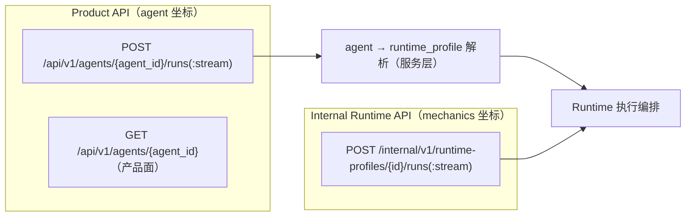
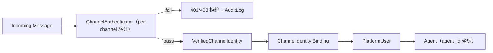

# Phase 1 Closure Gate 模块需求与设计一体化文档

> **文档编号**: MOD-P1C-V1.0
> **文档版本**: v0.1（草稿）
> **创建日期**: 2026-08-28
> **文档状态**: 设计评审中

**评审边界说明**:
- 本文档是 **Phase 1 Closure Gate** 的实施基线，来源：REMEDIATION-20260828-01（`fluxion-phase1-closure-detailed-remediation.md`，基线 commit `bbe96f9`/`7c39aeb`「重构后端能力」；该整改文档已随 docs v2 基线切换移除，git 历史可查）。
- **范围只覆盖代码/产品链闭环**（remediation §4–§12，P1C-01~09）与 Closure DoD 要求的前端 IA 修正（§15.3–15.5）。**设计修订类问题（P1C-10~14）已直接修订到 Phase 2–6 各设计简报**，不在本目录重复。
- Closure Gate 完成并验收前，Phase 2–5 不得大规模进入实施（remediation §23；已拆解的 Phase 2–5 任务文件需按修订后简报重新对齐）。

**ID 体系**: FEAT、RULE、NFR、RISK。场景: S-（正常）、E-（异常）、B-（边界）。

---

## 1. 文档控制

### 1.1 责任人

| 角色 | 姓名 | 职责范围 |
|------|------|---------|
| 开发负责人 | jahan | Agent 模型收口、Product API、ChannelAuthenticator、前端 wiring |
| 测试负责人 | jahan | round-trip/冒充负测试/术语扫描自动化证据 |
| 架构师 | jahan | SoT 策略、tool: 统一边界、Internal API 分层 |

### 1.2 修订历史

| 版本 | 日期 | 作者 | 变更描述 |
|------|------|------|---------|
| v0.1 | 2026-08-28 | jahan | 初始草稿（继承 REMEDIATION-20260828-01 P1C-01~09 + DoD） |
| v0.2 | 2026-08-28 | jahan | 并入 docs v2 基线（`docs/migration/当前代码偏差与迁移.md`）的 P0-1/P0-2：新增 FEAT-C-11（Tool UserGrant 维度恢复 + Capability 命名收口）、RULE-C-10、S-11/E-03（对齐 Gate G1）；来源整改文档已随基线切换移除（git 历史可查） |

---

## 2. 需求分析

### 2.1 需求概述

| 项目 | 内容 |
|------|------|
| **模块名称** | Phase 1 Closure Gate — 产品架构闭环 |
| **模块ID** | MOD-P1C |
| **所属系统/产品线** | Fluxion Agent Harness |
| **需求类型** | 架构纠偏 / 产品数据链闭环（后端 + 前端） |
| **业务背景** | Phase 1 已建立 AgentDefinition、User Domain 与新 Console Shell，但产品数据链未全部切换到 Agent/User 模型：AgentDefinition 状态双 SoT、Tool 仍映射 Plugin、Agent Studio 保存丢字段、Chat Access 前端仍以 RuntimeProfile 列表签发、Channel 身份逐消息信任（可冒充）、产品执行坐标仍是 runtime_profile_id、UserProfile 过浅。前端「UI 上像 V2」但底层依赖未切。 |
| **核心目标** | 用户产品入口 → AgentDefinition → RuntimeProfile mechanics → Capability/Tool/MCP/Skill 的链条全部以 **agent_id / Agent 产品模型**为主坐标；Builder 可 round-trip 保存完整 AgentDefinition；Admin 以 Agent 签发 Chat Access；Channel Identity 必经认证；普通用户面不暴露 Runtime 内部术语。 |

### 2.2 痛点与价值

| 维度 | 内容 |
|------|------|
| **目标用户** | Builder（Studio 真实保存）、Admin（Agent 授权 + User 360）、普通用户（产品面无内部术语）、平台安全（Channel 不可冒充） |
| **当前问题** | 见 §2.1；已逐条代码核实（P1C-05 第一层已修复、P1C-06 断点在前端选择器、P1C-07 为已登记 S2 残留） |
| **预期价值** | Phase 2–6 建立在正确前提上：Snapshot 以 agent 为主坐标、Workflow Agent 节点引用 agent_ref、Studio 数据可信、Channel 不可冒充 |

### 2.3 功能方案

#### 2.3.1 功能清单

| 功能ID | 功能名称 | 功能描述 | 优先级 | 来源 |
|--------|---------|---------|--------|------|
| FEAT-C-01 | AgentDefinition SoT 收口 | 删除 spec 内 `lifecycle`/`visibility`（remediation P1C-01）；唯一事实源 = ResourceDefinition envelope（status/visibility/version）；`model_validator(mode="before")` 剥离 legacy 键兼容读 | P0 | P1C-01 |
| FEAT-C-02 | Tool ResourceKind 统一 | `CapabilityType.TOOL → ResourceKind.TOOL`；parser 接受 `tool:<id>@<version>`；TOOL capability 遇 `plugin:` 前缀 fail-closed 拒绝；`plugin:` 仅保留 Provider/Extension 语义（P1C-02） | P0 | P1C-02 |
| FEAT-C-03 | Product Agent API + Internal 边界 | 新增 `POST /api/v1/agents/{agent_id}/runs(:stream)` 与 `GET /api/v1/agents/{agent_id}`（产品面）；`/api/v1/runtime-profiles/{id}/runs` 迁移为 `/internal/v1/runtime-profiles/{id}/runs`（internal-only）（P1C-08） | P0 | P1C-08 |
| FEAT-C-04 | UserProfile Attribute 模型 | BasicProfile（固定字段）+ `ProfileAttribute`（key/value/source/source_ref/confidence/is_explicit/user_editable/visibility/valid_from/valid_until/superseded_by），支撑 learned profile 与 provenance（P1C-09） | P0 | P1C-09 |
| FEAT-C-05 | ChannelAuthenticator | `VerifiedChannelIdentity`（channel_type/external_user_id/verification_method/verified_at/claims）；Web=Bearer Chat Access Token、WeCom=签名验证、Mattermost=webhook/bot token；fail-closed；伪造 channel_user_id 必拒（P1C-07，收口已登记 S2 残留） | P0 | P1C-07 |
| FEAT-C-06 | Agent-based Chat Access 收口 | 后端：签发校验 agent 存在且 published（`issueChatAccess(platformUserId, agentId)`）；前端：选择器数据源 `agent_definition`（不再列 runtime_profile）（P1C-06） | P0 | P1C-06 |
| FEAT-C-07 | Agent Studio 完整 round-trip | `saveDraft()` 构建完整 `AgentDefinitionSpec`（含 runtime_profile_ref/capabilities/memory_policy_ref/personalization_policy_ref）；E2E 断言全字段 round-trip 一致（P1C-03） | P0 | P1C-03 |
| FEAT-C-08 | Typed CapabilityPicker | `CapabilitySelection { type, capabilityRef, versionPin }`；选择展示「名称 + 类型 + 版本」；保存后 binding 三字段完整（P1C-04） | P0 | P1C-04 |
| FEAT-C-09 | Chat Agent 产品信息展示 | Chat 头部经产品 API 解析 displayName/icon，不展示 raw agent_id（P1C-05 第二层） | P0 | P1C-05 |
| FEAT-C-10 | Console IA 修正 | 默认视图 Overview；Build 下 Agents 单一一级入口（新建为页内 CTA，删除独立「新建智能体」一级菜单）；Binding 下沉（不再一级导航）（P1C-13 前置 + §15.3–15.5） | P0 | §15.3–15.5 |
| FEAT-C-11 | Tool UserGrant 维度恢复 + Capability 命名收口 | 移除 `runtime_tool_ops` 的 `user_tools = agent_tools` 折叠（`runtime_tool_ops.py:174`），恢复 Tool 用户授权维度；`UserDomainService.grant` 支持 Tool（`users/service.py:184` 现拒绝 tool-capability）；`AgentDefinition.capabilities: CapabilityBinding[]` 改名 Allowlist 语义（`AgentCapabilityReference`，P0-2）；对齐 ADR-A002/ARCH-06（撤销 ADR-012 user=agent 推导，ADR-A006）；验收对齐 Gate G1 真值表 | P0 | migration P0-1/P0-2 + ADR-A002/A006 |

#### 2.3.2 字段约束

**VerifiedChannelIdentity（FEAT-C-05）**

| 字段名 | 类型 | 必填 | 约束 | 说明 |
|--------|------|------|------|------|
| `channel_type` | `Literal["web","wecom","mattermost"]` | Y | — | 渠道 |
| `external_user_id` | `str` | Y | — | 渠道侧用户 ID（经验证后可信） |
| `verification_method` | `Literal["bearer_chat_access","wecom_signature","mattermost_webhook"]` | Y | — | 验证方式 |
| `verified_at` | `datetime(tz)` | Y | UTC | 验证时间 |
| `claims` | `Mapping[str, str]` | N | 只读 | 渠道声明（tenant 等） |

**ProfileAttribute（FEAT-C-04）**

| 字段名 | 类型 | 必填 | 约束 | 说明 |
|--------|------|------|------|------|
| `key` | `str` | Y | dot-path（如 `output.report_style`） | 属性键 |
| `value` | `str` | Y | — | 属性值 |
| `source` | `Literal["explicit","conversation","inference"]` | Y | — | 来源 |
| `source_ref` | `str \| None` | N | — | 溯源（execution/session 坐标） |
| `confidence` | `float` | N | 0.0–1.0 | 置信度 |
| `is_explicit` | `bool` | Y | — | 用户显式给出 |
| `user_editable` | `bool` | Y | 默认 true | 可否用户编辑 |
| `visibility` | `Literal["private","agent"]` | Y | — | 可见性 |
| `valid_from` / `valid_until` | `datetime(tz) \| None` | N | — | 有效期 |
| `superseded_by` | `str \| None` | N | — | 被取代指向 |

**CapabilitySelection（FEAT-C-08，前端 ViewModel）**

```ts
interface CapabilitySelection {
  type: "skill" | "tool" | "mcp";
  capabilityRef: string;
  versionPin: string;
}
```

**AgentDefinitionSpec 目标形状（FEAT-C-01/07）**：`name / display_name / description / icon / owner / system_prompt / model_ref / runtime_profile_ref / capabilities / memory_policy_ref / personalization_policy_ref`——不含 `lifecycle`/`visibility`。

### 2.4 范围与边界

| 类别 | 内容 |
|------|------|
| **范围（In Scope）** | §2.3.1 FEAT-C-01~10 全部；console IA 三项修正；Closure DoD 全部验收项。 |
| **非范围（Out of Scope）** | P1C-10~14 设计修订（已直接落地 Phase 2–6 简报）；Agent Studio UX 深化（版本管理/试跑/资产面板 → Phase 4 C402）；Workspace 页面群（Phase 4 X402–X408）；ContextResolver/Snapshot V2（Phase 2）。 |
| **前置假设** | 基线 `7c39aeb` 代码事实成立（本简报 §2.2 引用的核实结论）；Phase 1 现有测试基线绿；无新增外部依赖（ChannelAuthenticator 用现有 crypto/stdlib）。 |
| **有意妥协 / 技术债** | (1) legacy `lifecycle/visibility` 键以「读取时剥离」兼容，不做存量 spec_json 批量重写（一次性检查脚本报告存量）；(2) `plugin:` tool 绑定存量以检查脚本报告 + fail-closed 拒绝新写入，不自动改写数据；(3) WeCom/Mattermost 验证以本地签名/token 契约实现，无真实渠道凭据的 live smoke 保持 planned 不伪造（[[sp13-07-live-smoke-constraint]]）。 |

### 2.5 验收条件

#### 2.5.1 业务规则与约束

| ID | 类型 | 描述 | 验证场景 |
|----|------|------|---------|
| RULE-C-01 | 系统约束 | Agent status/visibility 唯一事实源 = ResourceDefinition envelope；Agent Spec 不含 lifecycle/visibility | S-01 |
| RULE-C-02 | 系统约束 | `tool:` capability 解析为 `ResourceKind.TOOL`；TOOL capability 拒绝 `plugin:` 前缀 | S-02 / B-01 |
| RULE-C-03 | 系统约束 | Product API 以 agent_id 为主坐标；产品面不暴露 runtime_profile_id | S-04 / S-10 |
| RULE-C-04 | 安全约束 | Channel Identity 必经 ChannelAuthenticator；未验证身份不得映射 PlatformUser | S-06 / E-01 |
| RULE-C-05 | 系统约束 | Chat Access 以 agent_id 签发且校验 agent 存在并 published | S-05 / E-02 |
| RULE-C-06 | 数据约束 | ProfileAttribute 保留 provenance（source/source_ref/confidence）；用户可查看/修改/删除 | S-07 |
| RULE-C-07 | 前端约束 | Agent Studio 保存完整 AgentDefinitionSpec；CapabilitySelection 带 type/version | S-03 |
| RULE-C-08 | 前端约束 | Console 默认 Overview；Build 单一 Agents 入口；Binding 非一级 | S-08 |
| RULE-C-09 | 质量约束 | TypeScript strict typecheck 全绿；普通用户面术语 denylist=0 | S-09 / B-02 |
| RULE-C-10 | 安全约束 | Tool/MCP 有效权限必须满足 `UserGrant ∩ AgentAllowlist ∩ TenantPolicy`，任一维度缺失 fail-closed；禁止 `user_tools = agent_tools` 作为最终语义（ARCH-06 / REQ-CAP-002/003） | S-11 / E-03 |

#### 2.5.2 功能验收场景

**正常场景**

| 场景ID | 功能ID | 优先级 | 测试层级 | 关键真实边界 | 操作步骤 | 预期结果 |
|--------|--------|--------|---------|-------------|---------|---------|
| S-01 | FEAT-C-01 | P0 | integration | 真实 Registry Store（双库） | 创建 spec 含 legacy lifecycle 键 → publish → GET | envelope status/visibility 生效；spec 读取剥离 legacy 键；新写入 spec 无 lifecycle/visibility |
| S-02 | FEAT-C-02 | P0 | integration | Capability parser + Registry | 解析 `tool:customer-query@1.0.0`；解析 `type=tool + plugin:ref` | 前者 → `ResourceKind.TOOL`；后者 fail-closed 明确错误 |
| S-03 | FEAT-C-07/08 | P0 | E2E | Browser → Console API → Registry | Studio 选择 runtime_profile、添加 skill/tool/mcp（typed）、设置 memory/personalization policy → Save → GET | 全字段 round-trip 一致（含 binding type/capability_ref/version_pin） |
| S-04 | FEAT-C-03 | P0 | E2E | Product API → Runtime 链路 | `POST /api/v1/agents/{agent_id}/runs` 发起执行 | 执行成功；内部解析 agent→runtime_profile；响应与产品面无 runtime_profile_id；`/internal/v1/runtime-profiles/{id}/runs` 仍可用于 internal 调用 |
| S-05 | FEAT-C-06 | P0 | E2E | Console 用户页 → 签发 → Chat resolve | 选择真实 Agent → issue → chat 侧 resolve | 返回 agentId 指向正确 Agent；显示产品信息 |
| S-06 | FEAT-C-05 | P0 | E2E | Web channel per-message Bearer | 有效 token 发消息；伪造他人 channel_user_id（无有效凭据）发送 | 有效 token 通过；伪造请求 401/403 拒绝，不映射 PlatformUser |
| S-07 | FEAT-C-04 | P0 | integration | users 服务 + 真实 Store | 写入 attribute（source=conversation, confidence=0.98）→ 查看/修改/删除 | provenance 保留；删除生效；用户可关闭 learned 自动写入 |
| S-08 | FEAT-C-10 | P0 | E2E | Browser → Console Shell | 打开 Console；核对 Build 导航 | 默认 Overview；Build 下 Agents 单一一级入口（新建为页内 CTA）；Binding 不在一级导航 |
| S-09 | FEAT-C-01~09 | P0 | integration | 全仓 TypeScript | `pnpm -r typecheck`（strict） | 全绿（含 chat/console 修改面） |
| S-10 | FEAT-C-09 | P0 | E2E | Chat → 产品 API | 绑定用户打开 chat 查看头部 | 显示 Agent displayName/icon；不显示 raw agent_id |
| S-11 | FEAT-C-11 | P0 | integration | 真实 EffectiveCapabilityResolver + 双租户 Store | 同一 AgentDefinition，User-A/User-B 配置不同 Tool/MCP（版本/参数/enable/CredentialRef） | 实际 Tool list 与调用结果不同且正确；负向矩阵（UserGrant 缺失 / AgentAllowlist 缺失 / Tenant deny 任一）全部拒绝（Gate G1） |

**异常场景**

| 场景ID | 功能ID | 测试层级 | 关键真实边界 | 触发条件 | 系统行为 | 用户感知 |
|--------|--------|---------|-------------|---------|---------|---------|
| E-01 | FEAT-C-05 | integration | WeCom 签名 / Mattermost token 验证 | 签名/凭据错误 | fail-closed 拒绝 + AuditLog（verification_method） | 消息不入站 |
| E-02 | FEAT-C-06 | integration | Chat Access 签发校验 | 指向不存在/未发布 agent | 签发拒绝 + 明确错误码 | Admin 收到明确错误 |
| E-03 | FEAT-C-11 | integration | grant + 运行时三重交集 | 现状 RED：grant 拒绝 tool-capability 且执行侧 user_tools=agent_tools | 恢复后 grant Tool 成功；未授权 Tool 调用 fail-closed 拒绝 | 用户 Tool 维度真实存在 |

**边界场景**

| 场景ID | 测试层级 | 关键真实边界 | 字段/条件 | 边界值 | 预期行为 |
|--------|--------|-------------|----------|--------|---------|
| B-01 | unit | Capability parser | 坏格式 ref / 未知 type / `plugin:` 当 tool | 各 1 组 | 全部明确报错（不静默降级） |
| B-02 | E2E | 普通用户面文案扫描 | chat 全部页面 + console 产品面 | denylist 术语 | 出现次数 = 0 |

**非功能指标**

| 指标ID | 指标名称 | 目标值 | 测量方法 |
|--------|---------|-------|---------|
| NFR-C-01 | Channel 验证开销 | 单消息验证 P95 ≤ 20ms（本地签名/token 校验） | integration 基准 |
| NFR-C-02 | 存量数据兼容 | legacy spec_json 读取零失败（剥离策略） | S-01 + 检查脚本报告 |

---

## 3. 技术设计

### 3.1 方案选型

#### 关键决策记录

| 决策点 | 选择 | 被否决项 | 理由 | 可逆性 |
|--------|------|---------|------|--------|
| D1 SoT 收口策略 | 删除 spec 内 `lifecycle`/`visibility` + `model_validator(mode="before")` 剥离 legacy 键（兼容读） | 存量 spec_json 批量重写迁移 | envelope 是版本生命周期唯一事实源（rule 5）；剥离读零迁移成本；一次性检查脚本报告存量 | 易（纯模型收缩） |
| D2 tool: 统一策略 | parser 接受 `tool:`；TOOL capability 遇 `plugin:` fail-closed 拒绝 + 存量检查脚本 | 自动把 `plugin:` 改写为 `tool:`（静默数据改写风险） | remediation §5.4 要求删除 plugin: 路径；fail-closed 符合架构规则 18 精神；存量由脚本报告人工确认 | 中 |
| D3 Product/Internal 分层 | 新增 Product API（agents 坐标）；runtime-profiles 路由迁 `/internal/v1/` | 保留双路由并存（边界继续模糊） | remediation §11.2；产品域不被 mechanics 污染；internal 保留 testing/advanced 用途 | 易（路径迁移 + 调用方更新） |
| D4 ChannelAuthenticator 形态 | 应用服务层抽象 + 3 实现（web/wecom/mattermost）；fail-closed；dev `/bind` 前匿名例外保留（H1 语义） | FastAPI 全局中间件一刀切（破坏 /bind 匿名与 header-tenant 设计，channel.py 注释已记录原因） | 收口 S2 残留；per-channel 验证方式本就不同；保留既有 golden-path 契约 | 中 |
| D5 Profile 分层 | BasicProfile 固定字段 + `profile_attributes` 表（行级 attribute + provenance） | 整块 Profile JSON 重写 | remediation §12；learned attribute 需要行级来源/置信度/有效期/取代链 | 易 |
| D6 Chat Access 收口 | 后端已切 agent_id（`channel_app.py` 现状）；补签发校验 + 前端选择器切 `agent_definition` 数据源 | 后端回退兼容 runtime_profile 签发 | 后端模型正确（核实结论）；断点在 Console 前端与校验缺失 | 易 |
| D7 Studio 保存 | `saveDraft()` 构建完整 typed spec + E2E round-trip 断言 | 仅 toast 断言 | remediation §6.4 明确禁止只断言保存成功 | 易 |

### 3.2 架构设计

#### Product API / Internal 分层（FEAT-C-03）



#### ChannelAuthenticator 流程（FEAT-C-05）



#### 模块落点

| 模块 | 落点 | 说明 |
|------|------|------|
| Agent Spec 收口 | `agents/definitions.py` + `agents/repository.py` | 删字段 + 剥离 validator + repository 写入不含 legacy 键 |
| Capability 统一 | `agents/capabilities.py` + `resources/contracts.py` | 映射 + parser |
| Product API | `api/agents.py`（新增）+ `services/`（agent 执行 use case） | agent→runtime_profile 解析在服务层 |
| Internal API | `api/runtime.py`（路由前缀迁移） | 调用方同步更新 |
| ChannelAuthenticator | `services/channel_auth.py`（新增）+ `api/channel.py` 接线 | 3 实现 + VerifiedChannelIdentity |
| Profile Attribute | `users/models.py` + `users/service.py` + models（`profile_attributes` 表） | 双库契约 |
| Chat Access | `services/console_*`（签发校验）+ console 前端用户页 | agent 校验 + 选择器切换 |
| Studio/Picker | console `pages/studio/AgentStudioPage.tsx` | saveDraft + CapabilitySelection |
| Tool UserGrant 恢复 | `services/runtime_tool_ops.py` + `users/service.py` + `agents/definitions.py` | 移除 `user_tools = agent_tools` 折叠；grant 支持 Tool；`CapabilityBinding` → `AgentCapabilityReference` 命名收口（P0-2） |

### 3.3 数据设计

**`profile_attributes` 表（新增）**

| 字段 | 类型 | 约束 | 说明 |
|------|------|------|------|
| `tenant_id` | text | PK part | 租户 |
| `platform_user_id` | text | PK part | 用户 |
| `key` | text | PK part | dot-path |
| `value` | text | — | 值 |
| `source` | text | explicit/conversation/inference | 来源 |
| `source_ref` | text | nullable | 溯源坐标 |
| `confidence` | real | 0.0–1.0 | 置信度 |
| `is_explicit` | bool | — | 显式给出 |
| `user_editable` | bool | default true | 可编辑 |
| `visibility` | text | private/agent | 可见性 |
| `valid_from` / `valid_until` | timestamptz | nullable | 有效期 |
| `superseded_by` | text | nullable | 取代链 |
| `created_at` / `updated_at` | timestamptz | — | 时间 |

索引：`(tenant_id, platform_user_id)`；双库契约同规则 7。

**`chat_access_records`（既有）**：`agent_id` 为唯一授权坐标（后端已切）；签发时校验 `agent_definition` 存在且 `status=PUBLISHED`。

**AgentDefinition spec**：删除 `lifecycle`/`visibility` 字段；存量 spec_json 读取剥离（不批量重写）。

### 3.4 接口设计

| 接口 | 签名/形状 | 说明 |
|------|---------|------|
| `POST /api/v1/agents/{agent_id}/runs` | body: 执行输入；resp: 统一 envelope | Product API（S-04） |
| `POST /api/v1/agents/{agent_id}/runs:stream` | 流式 | Product API |
| `GET /api/v1/agents/{agent_id}` | 产品面（displayName/icon/description/能力） | Chat 头部消费（S-10） |
| `POST /internal/v1/runtime-profiles/{id}/runs(:stream)` | 原 `/api/v1/runtime-profiles/...` 迁移 | internal/testing 专用 |
| `ChannelAuthenticator.verify(request) -> VerifiedChannelIdentity` | fail-closed 抛 `ChannelAuthError` | per-channel 实现 |
| `issueChatAccess(platformUserId, agentId)` | 校验 agent published；返回 agentId | E-02 拒绝路径 |
| `UserProfileAttributeStore` | upsert/get/list/delete(tenant_id, platform_user_id, key) | provenance 保留 |
| `CapabilitySelection`（前端） | `{ type, capabilityRef, versionPin }` | binding 三字段完整 |

> Product API 全部走统一 envelope `{code, message, data, request_id}`；错误码走既有命名空间。

### 3.5 质量实现方案

#### 可靠性设计

| 风险ID | 失效模式 | 应对 | 验证场景 |
|--------|---------|------|---------|
| RISK-C-01 | spec 删字段破坏存量读取 | 剥离 validator + 检查脚本报告 | S-01 |
| RISK-C-02 | `plugin:` 存量 tool 绑定 | fail-closed + 检查脚本（不静默改写） | S-02 / B-01 |
| RISK-C-03 | 路由迁移破坏调用方 | internal 调用方全量回归 | S-04 |
| RISK-C-04 | ChannelAuthenticator 误拒合法流量 | per-channel golden 契约测试（有效 token/签名通过） | S-06 |
| RISK-C-05 | Studio round-trip 回归丢失 | E2E 全字段断言（禁 toast-only） | S-03 |

#### 安全性设计

- Channel 验证 fail-closed；verification_method/结果进 AuditLog；token/签名不入日志（脱敏复用 RedactionProcessor）。
- Chat Access 签发校验 agent published（防未发布 agent 被授权）。

#### 可观测性设计

- Product API 执行链路带 trace_id/execution_id/tenant_id（既有 infra）。
- ChannelAuthenticator 拒绝事件进 AuditLog（规则 24 精神：高影响安全事件）。

---

## 4. 部署与运维

| 项 | 说明 |
|----|------|
| 路由迁移 | `/api/v1/runtime-profiles/*` → `/internal/v1/runtime-profiles/*`；发布说明标注 breaking，调用方（internal service/testing）同步更新 |
| 存量检查脚本 | `lifecycle/visibility` 残留 spec 报告 + `plugin:` tool 绑定报告（只报告不改写） |
| 回滚 | 纯模型/路由/前端变更，git revert 可回滚；无数据迁移 |

---

## 5. 风险与依赖

| 依赖/风险 | 内容 | 状态 | 风险 |
|------|------|------|------|
| remediation 基线核实 | P1C-01~09 代码事实已逐条核实（P1C-05 第一层已修、P1C-06 断点在前端） | 已核实 | 低 |
| Phase 2–5 任务文件 | 需按修订后简报重新对齐（P1C-10~14 已改简报） | 待对齐 | 中 |
| RISK-C-02 存量 plugin: 数据 | 检查脚本先行 | 待脚本 | 中 |
| 真实渠道凭据 | WeCom/Mattermost live 验证 | 无凭据保持 planned（不伪造） | 低 |

---

## 6. 需求追溯矩阵

| 功能ID | 场景 | 测试层级 | 状态 |
|--------|------|---------|------|
| FEAT-C-01 | S-01 | integration | 待实现 |
| FEAT-C-02 | S-02 / B-01 | integration/unit | 待实现 |
| FEAT-C-03 | S-04 | E2E | 待实现 |
| FEAT-C-04 | S-07 | integration | 待实现 |
| FEAT-C-05 | S-06 / E-01 | E2E/integration | 待实现 |
| FEAT-C-06 | S-05 / E-02 | E2E/integration | 待实现 |
| FEAT-C-07/08 | S-03 | E2E | 待实现 |
| FEAT-C-09 | S-10 | E2E | 待实现 |
| FEAT-C-10 | S-08 | E2E | 待实现 |
| FEAT-C-11 | S-11 / E-03 | integration | 待实现 |
| 质量（全局） | S-09 / B-02 | integration/E2E | 待实现 |

> RULE-C-01→S-01、RULE-C-02→S-02/B-01、RULE-C-03→S-04/S-10、RULE-C-04→S-06/E-01、RULE-C-05→S-05/E-02、RULE-C-06→S-07、RULE-C-07→S-03、RULE-C-08→S-08、RULE-C-09→S-09/B-02。矩阵闭合无断点。

---

## Spec Compliance Matrix

> 绑定 12 条 required Rule（见 `spec-context.yml`）。逐条回填设计落点与验证场景。

| Spec/Rule | enforcement | 设计影响 | 设计落点 | 验证场景 | 状态/N/A 理由 |
|-----------|-------------|---------|---------|---------|----------------|
| `fluxion-resource-registry#RULE-fluxion-resource-001` | required | envelope 唯一生命周期 SoT；版本化不变；spec 收缩 | §3.1 D1 + §3.3 | S-01 | design 待 applied |
| `backend-code-quality-performance#RULE-backend-quality-001` | required | parser/mapping 全类型注解、fail-closed 不静默、timeout | §3.4 + §2.5 B-01 | S-02 / B-01 | design 待 applied |
| `fluxion-runtime-core#RULE-fluxion-runtime-001` | required | Product API agent 坐标；Runtime 无状态；mechanics 内聚 | §3.1 D3 + §3.2 | S-04 | design 待 applied |
| `fluxion-console-api-contract#RULE-fluxion-console-api-001` | required | Product API 统一 envelope + 错误码 | §3.4 | S-04 / E-02 | design 待 applied |
| `backend-database#RULE-backend-database-001` | required | `profile_attributes` 双库契约；chat_access agent_id | §3.3 | S-07 | design 待 applied |
| `fluxion-console-channel#RULE-fluxion-console-001` | required | Channel Identity 必经验证；未绑定仅 /bind | §3.1 D4 + §3.2 | S-06 / E-01 | design 待 applied |
| `backend-directory-structure#RULE-backend-directory-001` | required | 新模块落点（api/agents.py、services/channel_auth.py） | §3.2 模块落点 | S-01 / S-06 | design 待 applied |
| `backend-logging#RULE-backend-logging-001` | required | 验证失败 AuditLog + 脱敏 | §3.5 安全/可观测 | E-01 | design 待 applied |
| `frontend-component-specs#RULE-frontend-component-001` | required | CapabilitySelection typed VM；props 只读事件上抛 | §2.3.2 + §3.1 D7 | S-03 | design 待 applied |
| `frontend-semi-design#RULE-frontend-semi-001` | required | Studio/用户页全 Semi；adapter 首导入 | §3.2 模块落点 | S-03 / S-05 | design 待 applied |
| `frontend-directory-structure#RULE-frontend-directory-001` | required | Console IA 修正的页面/组件落点 | §2.3.1 FEAT-C-10 | S-08 | design 待 applied |
| `frontend-quality-standards#RULE-frontend-quality-001` | required | typecheck strict + 术语门禁 | §2.5.2 S-09/B-02 | S-09 / B-02 | design 待 applied |

---

## 附录：术语表

| 术语 | 定义 |
|------|------|
| Closure Gate | Phase 1 闭环门禁：P0 产品链修复全部验收后才进入 Phase 2–5 实施 |
| SoT | Single Source of Truth；本 gate 指 status/visibility 唯一来自 envelope |
| VerifiedChannelIdentity | 经 ChannelAuthenticator 验证的可信渠道身份 |
| ProfileAttribute | 行级用户画像属性（含 provenance/confidence/有效期/取代链） |
| CapabilitySelection | 前端 typed 选择 ViewModel（type/capabilityRef/versionPin） |
| Product API | 以 agent_id 为主坐标、面向产品面的 API 层 |
| Internal Runtime API | 以 runtime_profile 为主坐标、仅 internal/testing 使用的 API 层 |

---

*文档结束（v0.1 草稿，待评审）*
