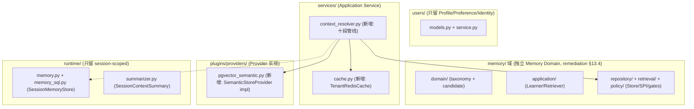
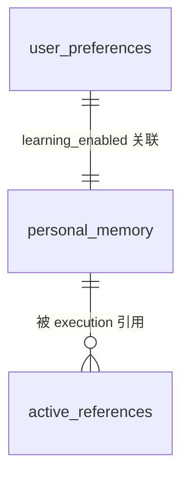

# Phase 2 User Context + Runtime + Memory 模块需求与设计一体化文档

> **文档编号**: MOD-PHASE2-V1.0
> **文档版本**: v0.1（草稿）
> **创建日期**: 2026-08-28
> **文档状态**: 设计评审中

**评审边界说明**:
- 本文档是 v2.2 Rolling-wave 的 **Phase 2 Detailed Implementation Plan**（roadmap §11），继承三份规划文档（`fluxion-v2.2-architecture-remediation-roadmap.md` §4、`fluxion-v2.2-enterprise-agent-platform-prd.md` FEAT-06/07/08 + §4.5–4.7、`fluxion-final-source-review-remediation-plan.md` §10——三份均随 docs v2 基线切换移除，git 历史可查）与两份 Phase 0 ADR 设计简报（ADR-MEM-001 / ADR-SNAPSHOT-001）。
- **前置已落地不重复设计**（仅引用）:M201 双写修复（`memory.py:249-252`）、M209–M216 Summarizer SPI + SessionContextSummary + `read_l2` cross-read 删除（`summarizer.py` / `memory_sql.py`）、MemoryCandidate→Policy/Consent→Commit 骨架（`runtime/personal_memory.py`）、`active_references` 表（ADR-SNAPSHOT-001）。
- 本文档**只覆盖 Phase 2 未落地部分**:ContextResolver + ExecutionSnapshot V2 + Memory V2 补齐（pgvector/learning control/L2 迁移）+ Redis cache adapter + Multi-Pod 验证。

**ID 体系**: US（来自 PRD）、FEAT、API（接口）、RULE、TC（测试用例）、NFR、RISK。场景: S-（正常）、E-（异常）、B-（边界）。

---

## 1. 文档控制

### 1.1 责任人

| 角色 | 姓名 | 职责范围 |
|------|------|---------|
| 开发负责人 | jahan | 技术方案、代码实现 |
| 测试负责人 | jahan | 测试策略、Multi-Pod 验证 |
| 架构师 | jahan | ContextResolver 归属、Snapshot V2 Contract 变更、ADR 对齐 |

### 1.2 修订历史

| 版本 | 日期 | 作者 | 变更描述 |
|------|------|------|---------|
| v0.1 | 2026-08-28 | jahan | 初始草稿（继承三份规划 + 两份 ADR 简报） |
| v0.2 | 2026-08-28 | jahan | 按 `fluxion-phase1-closure-detailed-remediation.md` §13（历史文档，git 历史可查）修订：等价性主键改 agent_id、digest 覆盖补全 + normalize 语义、Personal Memory 独立 `memory/` 域、Redis 降 P1、k8s 验证移 Phase 6 |
| v0.3 | 2026-08-28 | jahan | 按 docs v2 基线（架构验收 Gate G4/G2 + ARCH-07/REQ-EXE-002/003/REQ-CAP-004）新增场景 S-08（Execution 不可变：运行中发布不影响本执行）、S-09（per-user Credential 隔离：连接池/cache key 不串用），归属 TASK-007 |
| v0.4 | 2026-08-28 | jahan | 按用户旅程对话优先原则（design/08 UJ-U-04/UJ-U-06）新增 FEAT-P2-12「用户自助 tool」：profile/preference/memory 能力暴露为 builtin tools，用户经自然语言完成查看/设置/纠正/删除/停学（REQ-CAP-007），新增场景 S-10，归属 TASK-011 |

---

## 2. 需求分析

### 2.1 需求概述

| 项目 | 内容 |
|------|------|
| **模块名称** | Phase 2 — User Context + Runtime + Memory（未落地部分） |
| **模块ID** | MOD-PHASE2 |
| **所属系统/产品线** | Fluxion Agent Harness |
| **需求类型** | 架构演进 / 中大型功能开发 |
| **业务背景** | Phase 1（AgentDefinition/UserProfile/CapabilityGrant）已落地；Memory 深做大部分已提前落地。剩余:User Context（ContextResolver）与 Snapshot V2（digest/manifest）无实现，个人记忆检索链路未接通（`PersonalMemoryRetriever` 无调用方），pgvector/Redis 为 Phase 1 遗留缺口，Multi-Pod 一致性与恢复能力未验证。 |
| **核心目标** | 建立 **ContextResolver 管线**，产出携带 **canonical digest / memory manifest** 的 **ExecutionSnapshot V2**，补齐 **Memory V2**（pgvector/learning control/L2 迁移），落地 **Redis cache（P1 基础设施，正确性不依赖）** 与 **Multi-instance 等价性验证**，使相同 `tenant_id + user_id + agent_id`（+ execution inputs）跨实例解析出一致的 Snapshot（架构规则 28；等价性主键修订见 remediation §13.1）。 |

### 2.2 痛点与价值

| 维度 | 内容 |
|------|------|
| **目标用户** | Runtime 开发者 / 平台运维 / 最终用户（通过 Profile + Personal Memory 获得个性化 Context） |
| **当前问题** | (1) ContextResolver 全仓不存在，`PersonalMemoryRetriever` 只在测试被实例化 → 个人记忆检索链路未接通；(2) `ExecutionSnapshot` 无 `snapshot_digest`/`user_profile_version`/`memory_manifest`，跨 Pod 语义等价无法自动化验证；(3) pgvector 生产 provider 未落地（`schema.py:265` 注释「pgvector ivfflat 是 Phase 1 FEAT-17 范围」但实际未实现），Episodic/Semantic 只能 JSON 存储无向量检索；(4) Personal Memory 长在 `runtime/` 包（违反 remediation-plan P-04「Personal Memory 从 Runtime Domain 移出」）；(5) Redis cache adapter 未落地（只有 config-change 通知流）。 |
| **预期价值** | 跨 Pod 100% 一致的 ExecutionSnapshot（规则 28）；个人记忆检索链路生产化；真实向量检索；用户隐私控制（查看/纠正/删除/停学，NFR-PRIV-01）。 |

**用户故事**（继承 PRD）

| 编号 | 用户故事 | 优先级 |
|------|---------|--------|
| US-02 | 同一 PlatformUser 跨渠道获得一致 Agent、能力、权限、Profile/Memory Context | P0 |
| US-03 | 用户可查看、纠正、删除 Profile/Personal Memory 并关闭自动学习 | P0 |
| US-09 | 同一 Execution 内 Tool/MCP/Skill/Policy/User Context 不发生版本漂移 | P0 |

### 2.3 功能方案

#### 2.3.1 功能清单

| 功能ID | 功能名称 | 功能描述 | 优先级 | 来源 |
|--------|---------|---------|--------|------|
| FEAT-P2-01 | ContextResolver 管线 | Identity→User→Agent→Runtime→Profile→Memory→Capability→Credential→Policy→Snapshot 十段解析管线 + context budget + resolution trace manifest | P0 | US-09 / roadmap R208-R213 / PRD FEAT-08 |
| FEAT-P2-02 | ExecutionSnapshot V2 + canonical digest | 扩展 `ExecutionSnapshot` 增加 `user_profile_version`/`memory_manifest`/`snapshot_digest`/`credential_versions`；canonical 序列化 + sha256 digest | P0 | US-09 / roadmap R201-R207 / ADR-SNAPSHOT-001 §2.3 Out-of-Scope(4) |
| FEAT-P2-03 | Personal Memory 迁出 runtime 域 | `runtime/personal_memory.py` → **独立 `memory/` 域**（domain/application/repository/retrieval/policy；`users/` 只留 Profile/Preference/Identity）（remediation §13.4） | P0 | US-02 / remediation-plan P-04 |
| FEAT-P2-04 | MemoryCandidate pipeline 正式化 | 将已有骨架固化为正式 pipeline：extraction → Consent gate → Policy gate → Commit | P0 | US-03 / roadmap M203 / ADR-MEM-001 |
| FEAT-P2-05 | Episodic/Semantic 检索 | 通过 `SemanticStoreProvider` recall + `memory_type` 过滤，接通 `PersonalMemoryRetriever` → ContextResolver | P0 | US-02 / roadmap M204-M205 |
| FEAT-P2-06 | pgvector SemanticStore provider | `SemanticStoreProvider` 的 PostgreSQL pgvector 生产实现（embedding 列 PG vector / SQLite JSON 双库契约） | P0 | US-02 / roadmap M206 / ADR-MEM-001 §2.3 Out-of-Scope(2) |
| FEAT-P2-07 | L2 legacy 迁移/删除 | 一次性迁移：legacy `session_memory(level=L2)` → Episodic/Semantic 或删除 | P1 | roadmap M202 / ADR-MEM-001 |
| FEAT-P2-08 | delete/correct/reindex | 用户级 查看/纠正/删除 + embedding 重新索引 | P0 | US-03 / roadmap M207 / NFR-PRIV-01 |
| FEAT-P2-09 | user learning control | `learning_enabled` 接入 `UserPreference` + MemoryLearner gate（UI 属 Phase 4 X407） | P0 | US-03 / roadmap M208 / NFR-PRIV-01 |
| FEAT-P2-10 | Redis tenant cache adapter | tenant-scoped key、TTL、invalidation、degraded fallback、clear-all correctness；供 ContextResolver 做 L2（**P1 基础设施；正确性不依赖 Redis**，remediation §13.5） | P1 | roadmap Gate 1C / Phase 2 依赖 |
| FEAT-P2-11 | Multi-instance 等价性验证 | N 个 Application 实例（共享真实 PG + Redis）路由、local cache clear、实例进程 kill 恢复、Redis restart/degrade；**真实 k8s 多副本/rolling restart 移交 Phase 6**（remediation §13.6） | P1 | US-09 / roadmap R214-R217 / Phase 2 Gate |
| FEAT-P2-12 | 用户自助 tool（对话即界面） | 把 UserDomainService 的 Profile/Preference/Personal Memory 能力暴露为 builtin tools（`user.profile.get/update`、`user.memory.search/correct/delete`、`user.preference.get/set`）：走三重交集 + 风险分级（读/改偏好 auto-approve，删除类需确认）+ AuditLog；用户经自然语言完成 UJ-U-04/UJ-U-06（REQ-CAP-007） | P1 | US-03 / design/08 对话优先 |

#### 2.3.2 字段约束

**FEAT-P2-02 ExecutionSnapshot V2 新增字段**

| 字段名 | 字段类型 | 必填 | 约束 | 说明 |
|--------|---------|------|------|------|
| `user_profile_version` | `str \| None` | N | 同 Profile 解析版本 | UserProfile 解析时取的版本坐标 |
| `memory_manifest` | `MemoryManifest` | N | `extra="forbid"` | 检索到的 Personal Memory refs + 内容 hash |
| `snapshot_digest` | `str` | N | 64 字符 hex | canonical 版本图谱 sha256 |
| `credential_versions` | `dict[str, str]` | N | 只存 ref→version，不存明文 | Secret 版本坐标（NFR-SEC-01） |
| `agent_definition_version` | `str` | N | 同 Agent 解析版本 | AgentDefinition 解析版本坐标（等价性主键，remediation §13.1/13.2） |
| `policy_versions` | `dict[str, str]` | N | tenant/user/personalization | 策略版本坐标（remediation §13.2） |

> **digest 覆盖（remediation §13.2）**：AgentDefinition version、RuntimeProfile version、Model ref/policy、prompt/instruction digest、Skill/Tool/MCP exact versions、Binding versions、Credential versions、Profile version、Memory retrieval manifest、Tenant/User policy version、Personalization policy version 全部进入版本图谱。

**FEAT-P2-02 MemoryManifest（子模型）**

| 字段名 | 字段类型 | 必填 | 约束 | 说明 |
|--------|---------|------|------|------|
| `entry_refs` | `list[MemoryEntryRef]` | N | 每项 = entry_id + memory_type | 进入 Execution 的 personal memory 条目 |
| `content_hash` | `str` | N | sha256 | 全部条目 content 联合 hash，供 digest |
| `truncated` | `bool` | N | 默认 false | context budget 截断标记 |

### 2.4 范围与边界

| 类别 | 内容 |
|------|------|
| **范围（In Scope）** | ContextResolver 管线；ExecutionSnapshot V2 字段 + canonical digest；Personal Memory 迁入 `users/` 域 + pgvector provider + learning control + correct/delete/reindex + L2 legacy 迁移；Redis tenant cache adapter；Multi-Pod 验证（k8s + PG + Redis）。 |
| **非范围（Out of Scope）** | Memory & Profile UI（Phase 4 TASK-X407）；ArtifactStore / Secret 生产 provider / OTel Collector（Phase 5）；Workflow Studio（Phase 4）；retention_period 具体值 / Hardening / Chaos（Phase 6）；`durable_task` Async Task（Phase 5）。 |
| **前置假设** | ADR-MEM-001 / ADR-SNAPSHOT-001 / ADR-EXT-001 / ADR-005 accepted；AgentDefinition/UserProfile/CapabilityGrant 已落地（phase1）且 Phase 1 Closure Gate 完成（agent_id 主坐标）；M201 + M209-M216 已落地；docker PostgreSQL（`mmuser/mmuser@localhost:5432`，fluxion_test 库）+ Redis（`localhost:6379` 无密码）可用（复用记忆 `local-pg-test-env`）；Multi-instance 验证以 N 个应用实例模拟（真实 k8s 多副本属 Phase 6）。 |
| **有意妥协 / 技术债** | (1) pgvector 用单列 `vector` 存 embedding、SQLite 用 JSON —— 双库共享 schema 下不做 PG 专属索引 ivfflat 的 SQLite 等价物（Phase 1 契约要求是「同一 Contract」，不是同一存储实现）；(2) Multi-Pod 验证用「N 个 Resolver/Application 实例共享同一真实 PG + Redis」模拟多 Pod，不引入 k8s Deployment 编排脚本（验证等价性而非部署编排）；(3) Memory 检索召回用最近优先 + budget 截断，不做重排序模型（Phase 6 再评估）。 |

### 2.5 验收条件

#### 2.5.1 业务规则与约束

| ID | 类型 | 描述 | 验证场景 |
|----|------|------|---------|
| RULE-P2-01 | 系统约束 | 相同 `tenant_id + user_id + agent_id`（+ execution inputs）在不同实例解析出相同 `snapshot_digest`（100% 一致，架构规则 28；remediation §13.1） | S-01 |
| RULE-P2-02 | 系统约束 | ContextResolver 完整解析（不含外部模型调用）P95 ≤ 300ms（PRD SLO-CTX-01） | S-02 |
| RULE-P2-03 | 架构约束 | `PersonalMemoryRetriever` 禁止读取 `SessionContextSummary`（ADR-MEM-001） | S-03 |
| RULE-P2-04 | 安全约束 | Secret 明文不进入 `snapshot_digest`/`memory_manifest`/日志（NFR-SEC-01，架构规则 17） | E-02 |
| RULE-P2-05 | 隐私约束 | 用户可关闭自动学习；关闭后 `MemoryLearner.commit` 必须拒绝（NFR-PRIV-01） | S-04 |
| RULE-P2-06 | 可靠性约束 | Redis 不可用时降级 Store 直读，正确性不损坏（Phase 2 Gate「Redis restart/degrade」） | S-05 |
| RULE-P2-07 | 一致性约束 | Pod 失败后新请求可恢复，committed durable state RPO=0（Phase 2 Gate） | S-06 |
| RULE-P2-08 | 一致性约束 | Execution 不可变（Resolve Once）：一次执行内资源/绑定/策略版本不漂移；执行中发布只影响新 Execution（ARCH-07/REQ-EXE-002/003，Gate G4） | S-08 |

#### 2.5.2 功能验收场景

**正常场景**

| 场景ID | 功能ID | 优先级 | 测试层级 | 关键真实边界 | 前置条件 | 操作步骤 | 预期结果 |
|--------|--------|--------|---------|-------------|---------|---------|---------|
| S-01 | FEAT-P2-01/02 | P0 | E2E | Product API → Service → ContextResolver → Registry → Secret → Memory | 已发布 agent_definition + user_profile + binding + personal memory 条目 | 两个独立 Application 实例（共享同一真实 PG + Redis）各 resolve 同一 agent（`agent_id` 主坐标） | 两份 `snapshot_digest` 完全相等；含 `agent_definition_version`/`user_profile_version`/`memory_manifest`/`credential_versions`/`policy_versions` |
| S-02 | FEAT-P2-01 | P0 | integration | ContextResolver → Store | 典型数据量（≤100 条 memory，≤20 capability） | 连续 resolve 50 次，测 P95 | P95 ≤ 300ms |
| S-03 | FEAT-P2-01/03/05 | P0 | integration | 架构测试扫描 imports | — | 静态断言 `users/personal_memory.py` 不含 `session_context_summary` 读取 | 规则 RULE-P2-03 通过 |
| S-04 | FEAT-P2-09 | P0 | E2E | API → UserPreference → MemoryLearner → Store | 用户已关 learning | 对关闭用户 commit 一条 candidate | commit 被拒，`personal_memory` 无新行 |
| S-05 | FEAT-P2-10 | P0 | E2E | Redis → cache adapter → Store | Redis 启动后 kill | 停 Redis → resolve | 返回正确结果（回退直读）；重启 Redis → 恢复缓存 |
| S-06 | FEAT-P2-11 | P0 | E2E | N 个独立应用实例 → PG → Redis | N 实例运行 | 分别服务请求后 kill 一个实例进程，新请求打到存活实例 | digest 一致；新请求正常，RPO=0（真实 k8s 多副本/rolling restart 移交 Phase 6） |
| S-07 | FEAT-P2-06/05 | P0 | E2E | PG pgvector → SemanticStoreProvider → PersonalMemoryRetriever | 已插入 episodic + semantic 各若干 | `recall(memory_type=semantic)` | 只返回 semantic 条目，按相关性排序 |
| S-08 | FEAT-P2-01/02 | P0 | integration | 真实 Store + 执行中发布 | Execution-1 已开始（pin v1） | Execution-1 运行中发布 v2 → Execution-1 后续解析仍全 v1 → 新 Execution-2 使用 v2 | Execution-1 全程 v1（无漂移）；Execution-2 用 v2（Gate G4，ARCH-07/REQ-EXE-002/003） |
| S-09 | FEAT-P2-01 | P0 | integration | ContextResolver Credential 段 + MCP prepare | 同一 MCP Definition，User-A/User-B 不同 CredentialRef | A/B 各自 resolve → 检查 MCP 连接池 key 与 per-execution cache key | A/B 凭据与缓存完全不串用；跨用户/跨租户读取拒绝（Gate G2，REQ-CAP-004） |
| S-10 | FEAT-P2-12 | P0 | E2E | AgentLoop + builtin user tools + UserDomainService + 真实 Store | 用户已绑定且处于对话中 | 对话说「把我的时区改成 Asia/Tokyo」→ 说「忘掉刚才那条记忆」→（停学用户）触发记忆写入 | 偏好即时生效；删除生效且进 AuditLog；停学用户写工具拒绝（对话即界面，UJ-U-04/UJ-U-06） |

**异常场景**

| 场景ID | 功能ID | 测试层级 | 关键真实边界 | 触发条件 | 系统行为 | 用户感知 |
|--------|--------|---------|-------------|---------|---------|---------|
| E-01 | FEAT-P2-01 | integration | Middleware → ContextResolver | 非 dev 模式缺身份头 | 401 fail-closed（H1 已落地，回归验证） | 401 + 统一 envelope |
| E-02 | FEAT-P2-01 | integration | ContextResolver → Secret store | 检索 Secret 时缺失/版本不存在 | 抛明确错误；日志不含明文 | 失败，无泄露 |
| E-03 | FEAT-P2-04 | integration | MemoryLearner → Consent gate | candidate 被 Policy/Consent 拒绝 | commit 拒绝，记录 reason | 不产生个人记忆 |
| E-04 | FEAT-P2-01 | integration | ContextResolver → Profile | `user_profile_version` 指向不存在版本 | fail-closed，无 `snapshot_digest` 产出 | 明确错误码 |
| E-05 | FEAT-P2-10 | integration | Redis → cache adapter | Redis 连接超时 | degraded 模式回退 Store 直读，不抛错 | 请求正常 |

**边界场景**

| 场景ID | 测试层级 | 关键真实边界 | 字段/条件 | 边界值 | 预期行为 |
|--------|---------|-------------|----------|--------|---------|
| B-01 | unit | context budget 计算 | memory_manifest 超 budget | 超限 | 按优先级截断 + `truncated=true` |
| B-02 | unit | canonical 序列化 | 字段顺序/None/时区 | 键乱序、`None`、UTC 与带偏移时间 | digest 相等（确定性） |
| B-03 | unit | digest 敏感性 | 任一版本号变更 | skill v1→v2 | digest 必变 |

#### 2.5.3 非功能指标

**性能指标**

| 指标ID | 指标名称 | 目标值 | 测量方法 |
|--------|---------|-------|---------|
| NFR-PERF-01 | ContextResolver 解析（无外部模型） | P95 ≤ 300ms | integration 基准 |
| NFR-PERF-02 | `snapshot_digest` 计算 | P95 ≤ 20ms | unit 基准（ExecutionSnapshot 构建预算内） |
| NFR-PERF-03 | Multi-Pod digest 一致性 | 100% | S-01 契约测试 |

**安全性要求**

| 指标ID | 安全域 | 验收标准 |
|--------|--------|---------|
| NFR-SEC-01 | 敏感数据 | Secret 明文零泄露进 digest/manifest/日志；tenant 隔离成立 |
| NFR-PRIV-01 | 用户隐私 | 查看/纠正/删除/停学 后端契约全通（UI Phase 4） |

---

## 3. 技术设计

### 3.1 方案选型

#### 关键决策记录

| 决策点 | 选择 | 被否决项 | 理由 | 可逆性 |
|--------|------|---------|------|--------|
| ContextResolver 归属 | **`services/context_resolver.py` 应用服务** | `users/context.py`（域内编排跨域职责）；`runtime/context.py`（违背 P-04） | ContextResolver 是跨 Agent/User/Registry/Secret 四域的 use case 编排；放 services 符合依赖方向 `services -> domain contracts`；Personal Memory 数据/查询迁独立 `memory/` 域（domain/application/repository/retrieval/policy；`users/` 只留 Profile/Preference/Identity），满足 P-04「移出 Runtime Domain」（remediation §13.4） | 中（纯内部包移动 + DI，API 不变） |
| Snapshot V2 形态 | **扩展现有 `ExecutionSnapshot`**（`contracts.py:534`，`extra="forbid"` 保持） | 新建 `ExecutionSnapshotV2` 类（破坏既有 trace/store/console 消费） | V2 是增量字段，向后兼容；digest/manifest 是派生事实 | 易（纯加字段 + 新 build 路径） |
| digest 算法 | **typed model → normalize defaults → canonical dump（递归排序键）→ 确定性 JSON → sha256**（不简单忽略 None：可选字段以规范形式参与序列化，仅排除 `created_at`/`execution_id`/`trace_id` 运行时字段；remediation §13.3） | 签名/HMAC（跨实例一致性无需密钥）；UUID 随机摘要（不可验证）；hash 时简单忽略 None/空值（remediation §13.3 明确否决） | 确定性、可复现、跨实例可断言相等；只含「版本事实」 | 易 |
| Personal Memory 存储 | 迁入 `users/` 域 + **pgvector provider**（`SemanticStoreProvider` 生产实现） | 继续留 `runtime/`（违 P-04）；纯 JSON 无向量检索 | Episodic/Semantic 需要向量召回；双库契约 SQLite JSON / PG vector | 中 |
| Redis 形态 | **`services/cache.py` tenant-scoped cache adapter**（L1 内存 + Redis L2 + degrade 回退） | 自研分布式缓存；Event Bus（v2.2 明确不引入） | 满足 Phase 1 Gate 1C；Redis 不作 SoT | 易 |
| Multi-Pod 验证 | **N 个 Application 实例共享真实 PG + Redis**（本地 k8s 可跑真 Pod） | 纯单测断言（不覆盖跨实例一致性）；docker-compose 独占一套（环境重复） | 复用记忆 `local-pg-test-env`（`mmuser/mmuser@5432` + `redis-cli 6379`）；验证等价性而非部署编排 | 易 |

#### 技术栈

| 类别 | 选型 | 版本 | 选型理由 |
|------|------|------|---------|
| 语言 | Python | 3.12+ | 项目基线 |
| 框架 | FastAPI + Pydantic v2 | 现有 | 复用统一 envelope / extra="forbid" |
| 数据库 | PostgreSQL + pgvector 扩展 / SQLite(dev) | 现有 PG | 双库 Contract Test 规则 7 |
| 向量 | `pgvector`（PG）/ JSON（SQLite） | — | 双库可移植（`schema.py:265` 现状） |
| 缓存 | redis.asyncio | 现有依赖形态 | Phase 1 遗留，本地 6379 可用 |
| 验证 | pytest + httpx ASGI + 本地 k8s | 现有 | 复用 cross-Pod 契约模式（TASK-009） |

### 3.2 架构设计

#### ContextResolver 管线（应用服务编排）

```mermaid
graph LR
    REQ[RequestContext] --> IDEN["Identity (tenant/user)"]
    IDEN --> USER["User (PlatformUser)"]
    USER --> AGENT["Agent (agent_definition)"]
    AGENT --> RT["Runtime (runtime_profile+memory_policy)"]
    RT --> PROF["Profile (user_profile_version)"]
    PROF --> MEM["Memory (PersonalMemory retrieval manifest)"]
    MEM --> CAP["Capability (effective bindings)"]
    CAP --> CRED["Credential (secret refs/versions)"]
    CRED --> POL["Policy (pin version)"]
    POL --> SNAP["Snapshot V2 builder + digest"]
    SNAP --> OUT[ExecutionSnapshot V2 + ResolvedUserContext]
    IDEN -.->|"channel: ChannelIdentity→PlatformUser"| USER
    MEM -.->|"recall via SemanticStoreProvider"| SEM[(pgvector)]
    CAP -.->|"L1 + Redis L2"| CACHE[(Redis)]
```



#### 包结构（P-04 迁移后）



#### 外部依赖清单

| 外部系统 | 依赖类型 | 协议 | 超时 | 降级策略 |
|---------|---------|------|------|---------|
| PostgreSQL (pgvector) | 持久化/向量 | TCP/5432 | 2s（resolve 路径） | 连接池 + fail-closed（版本缺失时明确报错） |
| Redis | L2 缓存 | TCP/6379 | 300ms（读写） | 超时即 degraded 回退 Store 直读 |
| 模型 Provider | Personal Memory 候选抽取（可选） | 现有协议 | 现有 `request_timeout_ms` | 抽取失败跳过该候选，不阻塞 Execution |

### 3.3 数据设计

**`personal_memory` 表（已存在，调整 embedding 存储）**

| 字段名 | 类型 | 可空 | 默认值 | 索引 | 说明 |
|--------|------|------|--------|------|------|
| id | Integer | N | AUTO | PK | 主键 |
| tenant_id | String(128) | N | — | `idx_personal_memory_user` 前缀 | tenant 隔离 |
| user_id | String(128) | N | — | 同上 | 用户 |
| memory_type | String(16) | N | — | — | episodic / semantic |
| content | Text | N | — | — | 记忆内容 |
| embedding | **PG: vector / SQLite: JSON** | Y | — | PG 建立 ivfflat（后续） | 现状 JSON，PG 侧换 vector 类型（dialect 分派） |
| source_session_id | String(128) | N | — | — | provenance |
| source_range_hash | String(64) | Y | — | — | 溯源 |
| learning_enabled | Boolean | N | — | — | 停学 gate（M208） |
| created_at / updated_at | DateTime(tz) | N | — | — | 时间 |

> 双库契约：SQLAlchemy `TypeDecorator` 按 dialect 分派 `VECTOR` / `JSON`，**不改双库契约测试断言**（规则 7 是 Contract 一致，非存储一致）。

**Redis key 设计（FEAT-P2-10）**

| Key 模式 | TTL | 说明 | 失效 |
|---------|-----|------|------|
| `fluxion:ctx:{tenant}:{user}:{profile_ver}` | 300s | ContextResolver profile/capability 解析结果 | 发布/绑定变更时 invalidate |
| `fluxion:def:{kind}:{id}@{ver}` | 300s | Definition 版本缓存 | 发布时 invalidate |
| `fluxion:mem:{tenant}:{user}:{type}` | 60s | 个人记忆 recall 结果 | 用户纠正/删除时 invalidate |

**ER 关系**



### 3.4 接口设计

> 形态 C：函数/库接口（本 phase 为后端领域逻辑，无新 HTTP 入口；Console API 沿用现有 `/studio` + `/platform-users`）。

| 函数签名 | 入参 | 返回 | 错误处理 |
|---------|------|------|---------|
| `ContextResolver.resolve(request: RequestContext, selector: ResolverSelector) -> ResolveResult` | 请求上下文 + 选择器（`agent_id` 主坐标 + memory budget） | `ResolveResult`（`ExecutionSnapshot` + `UserContext` + `resolution_trace` + `budget_used`） | `ContextResolutionError`（带 slug + 整码）；fail-closed |
| `canonical_digest(snapshot: ExecutionSnapshot) -> str` | V2 snapshot | 64 字符 sha256 | 纯函数 |
| `PgVectorSemanticStore.recall(scope: Scope, query_embedding: list[float], *, k: int, memory_type: MemoryType | None) -> list[MemoryEntryRef]` | 作用域 + 查询向量 + 数量 + 类型过滤 | 相关条目 refs | 检索失败抛 `SemanticStoreError`（调用方降级空 manifest） |
| `MemoryLearner.commit(candidate: MemoryCandidate) -> CommitResult`（formalize） | 候选（含 provenance） | `CommitResult`（accepted/rejected + reason） | 拒绝不抛错，记录 reason |
| `PersonalMemoryStore.reindex(tenant_id, user_id, entry_id) -> None`（新） | 条目坐标 | 无 | 条目不存在抛明确错误 |
| `TenantRedisCache.get/set/invalidate/clear(scope)` | tenant-scoped key | 值/空 | Redis 不可用 → 返回 miss（degraded） |

**`ResolveResult` 结构（关键）**

```python
@dataclass(frozen=True, slots=True)
class ResolveResult:
    snapshot: ExecutionSnapshot          # V2：含 user_profile_version / memory_manifest / snapshot_digest / credential_versions
    user_context: UserContext            # profile + memory manifest + capabilities + policy（budget 截断后）
    resolution_trace: ResolutionTrace    # 每段 stage：resolved version + 耗时（关联 trace_id）
    budget_used: int                     # context budget 已用 token
```

### 3.5 质量实现方案

#### 性能设计

| 指标ID | 热点路径 | 目标值 | 实现方案（含被放弃的较慢方案） |
|--------|---------|-------|------------------------------|
| NFR-PERF-01 | ContextResolver 十段解析 | P95 ≤ 300ms | **L1 内存缓存必备**；Redis L2 为可选增强（正确性不依赖 Redis，remediation §13.5）——profile/capability/definition 解析结果只对变更版本回源；放弃「每 execution 全量回源」（每段一次 Store 读，最坏 10 次 DB IO） |
| NFR-PERF-02 | canonical digest | P95 ≤ 20ms | 纯 Python 排序键 JSON + hashlib，无 IO；放弃「签名/外键比对」 |

#### 可靠性设计

| 风险ID | 失效模式 | 影响 | 应对措施 | 验证场景 |
|--------|---------|------|---------|---------|
| RISK-01 | Redis 宕机 | L2 失效 | 超时即 degrade 回退 Store 直读；clear-all 后正确性不变（测试） | S-05 / E-05 |
| RISK-02 | 个人记忆检索超时/失败 | Context 缺记忆 | 空 manifest + `truncated=true`，不阻塞 Execution | E-02（变形） |
| RISK-03 | 版本坐标缺失（profile/policy 等） | Snapshot 不完整 | fail-closed，明确错误码，不产出缺字段 digest | E-04 |
| RISK-04 | Personal Memory 迁移破坏既有 import | 编译/测试失败 | 迁移脚本 + 全量回归；`summarizer.py` 等依赖改 import 后验证 | S-03 |

#### 安全性设计

| 指标ID | 验收标准 | 实现方案 |
|--------|---------|---------|
| NFR-SEC-01 | Secret 明文零泄露 | `credential_versions` 只存 `ref→version`，不落明文；`canonical_digest` 只序列化版本图谱，不含值；日志经 RedactionProcessor |

#### 可观测性设计

| 场景 | 实现方案 |
|------|---------|
| resolution trace | 每段 stage 记录 `resolved version + 耗时` 写入 `resolution_trace`，关联 `trace_id` |
| 指标 | ContextResolver 耗时 / 命中率 / degrade 次数（复用现有 metrics 模式） |
| 日志 | structlog JSON + `request_id`/`trace_id`/`tenant_id`（现有 infra） |

---

## 4. 部署与运维

### 4.2 发布与回滚

| 阶段 | 范围 | 进入条件 | 回滚条件 |
|------|------|---------|---------|
| 数据迁移（M202 L2） | legacy L2 → 迁移/删除 | 迁移 dry-run 通过 | 迁移脚本幂等 + 备份 |
| Personal Memory 迁包 | import 改写 | 全量测试绿 | 纯代码移动，git revert 即可 |

### 4.4 数据迁移

| 阶段 | 操作 | 验证方法 |
|------|------|---------|
| 1 | L2 legacy 扫描 + dry-run 报告 | 迁移报告行数核对 |
| 2 | 按策略迁移为 Episodic/Semantic 或删除 | 目标表计数一致 |
| 3 | 停用旧 L2 读路径 | architecture test 禁止 `read_l2` 进入 user-level retrieval |

---

## 5. 风险与依赖

### 5.1 项目依赖

| 依赖模块/团队 | 依赖内容 | 状态 | 风险等级 |
|-------------|---------|------|---------|
| ADR-MEM-001 / ADR-SNAPSHOT-001 / ADR-EXT-001 | taxonomy + retention + SemanticStore SPI 契约 | accepted（Phase 0） | 低 |
| phase1（AgentDefinition/UserProfile/CapabilityGrant） | ContextResolver 输入 | 已落地 | 低 |
| pgvector（Phase 1 遗留） | 本 phase 补生产 provider | 未落地 → 本 phase | 中 |
| Redis（Phase 1 遗留） | cache adapter 前置 | 未落地 → 本 phase | 中 |
| 本地 k8s + PG + Redis | Multi-Pod 验证环境 | 已就绪（记忆 `local-pg-test-env`） | 低 |

### 5.2 风险识别

| 风险ID | 类型 | 描述 | 概率 | 影响 | 应对措施 | 验证场景 |
|--------|------|------|------|------|---------|---------|
| RISK-01 | 基础设施 | pgvector 扩展在 CI SQLite 契约下分派不一致 | 中 | 中 | `TypeDecorator` dialect 分派 + 双库契约测试（PG 与 SQLite 各跑一套） | S-07 |
| RISK-02 | 迁移 | Personal Memory 迁包破坏 imports | 中 | 中 | 迁移脚本 + 全量回归 + architecture test | S-03 |
| RISK-03 | 性能 | ContextResolver 全量回源超 SLO | 中 | 中 | L1 + Redis L2；degrade 可观测 | S-02 / E-05 |
| RISK-04 | 一致性 | digest 对非版本字段敏感导致跨 Pod 不等 | 中 | 高 | canonical 序列化排除运行时字段（`created_at`/`execution_id`/`trace_id`）；B-02/B-03 单测锁定 | B-02 / B-03 |

---

## 6. 需求追溯矩阵

| 用户故事 | 功能ID | 接口ID | 测试用例ID | 测试层级 | 状态 |
|---------|--------|--------|-----------|---------|------|
| US-09 | FEAT-P2-01 | `ContextResolver.resolve` | S-01/S-02/S-08/S-09/E-01/E-04 | E2E/integration | 待实现 |
| US-09 | FEAT-P2-02 | `canonical_digest` | S-01/B-02/B-03 | E2E/unit | 待实现 |
| US-02 | FEAT-P2-03 | 包迁移（`memory/` 域） | S-03 | integration | 待实现 |
| US-03 | FEAT-P2-04 | `MemoryLearner.commit` | E-03 | integration | 待实现 |
| US-02 | FEAT-P2-05 | `PersonalMemoryRetriever` | S-07 | E2E | 待实现 |
| US-02 | FEAT-P2-06 | `PgVectorSemanticStore.recall` | S-07 | E2E | 待实现 |
| — | FEAT-P2-07 | 迁移脚本 | M202（dry-run 自动化，integration） | integration | 待实现 |
| US-03 | FEAT-P2-08 | `PersonalMemoryStore.reindex` | NFR-PRIV-01（后端契约，integration） | integration | 待实现 |
| US-03 | FEAT-P2-09 | `UserPreference` + Learner gate | S-04 | E2E | 待实现 |
| US-02 | FEAT-P2-10 | `TenantRedisCache`（P1） | S-05/E-05 | E2E/integration | 待实现 |
| US-09 | FEAT-P2-11 | Multi-instance 等价性验证（真实 k8s 移 Phase 6） | S-06 | E2E | 待实现 |
| US-03 | FEAT-P2-12 | 用户自助 builtin tools | S-10 | E2E | 待实现 |

> RULE-P2-01~08 分别映射到 S-01（digest 一致）、S-02（P95）、S-03（架构）、E-02（secret）、S-04（停学）、S-05（Redis degrade）、S-06（kill 实例 RPO=0）、S-08（Execution 不可变）。矩阵闭合无断点。

---

## Spec Compliance Matrix

> 继承 `.code-flow/tasks/2026-08-28/phase2-user-context-runtime-memory/spec-context.yml`（9 绑定）。required Rule 逐条回填设计落点与验证场景。

| Spec/Rule | enforcement | 设计影响 | 设计落点 | 验证场景 | 状态/N/A 理由 |
|-----------|-------------|---------|---------|---------|----------------|
| `fluxion-runtime-core#RULE-fluxion-runtime-001` | required | Snapshot V2 保持 `extra="forbid"`；digest 只含版本事实；Runtime 无状态（kill -9 恢复） | §3.1 D2 + §3.2 管线 + §3.5 可靠性 | S-01 / S-06 / B-02 | design 待 applied |
| `fluxion-resource-registry#RULE-fluxion-resource-001` | required | 版本坐标 pin 进 digest；SQLite/PG 双库契约（pgvector JSON/vector 分派） | §3.3 数据设计 + §3.1 D4 | S-01 / S-07 | design 待 applied |
| `fluxion-console-channel#RULE-fluxion-console-001` | required | ContextResolver 复用 ChannelIdentity→PlatformUser（Phase 1） | §3.2 IDEN→USER 段 | S-01 | design 待 applied |
| `fluxion-dfx#RULE-fluxion-dfx-001` | required | DFX 在编码阶段落实：性能基准（S-02）、可靠性（S-05/06）、安全（E-02）、可观测（resolution trace） | §3.5 全节 | S-02/S-05/S-06/E-02 | design 待 applied |
| `backend-code-quality-performance#RULE-backend-quality-001` | required | 类型注解 + 异常不吞 + 单函数 ≤50 行；性能敏感路径最优（L1+Redis L2） | §3.4 接口 + §3.5 性能 | S-02 | design 待 applied |
| `backend-database#RULE-backend-database-001` | required | embedding dialect 分派、N+1 避免、缓存先写库再失效 | §3.3 + §3.5 性能 | S-05 / S-07 | design 待 applied |
| `backend-directory-structure#RULE-backend-directory-001` | required | 新建 `services/context_resolver.py`/`services/cache.py`/`plugins/providers/`；Personal Memory 迁 `users/` | §3.2 包结构 | S-03 | design 待 applied |
| `backend-logging#RULE-backend-logging-001` | required | resolution trace + structlog JSON + 脱敏（Secret 明文零日志） | §3.5 可观测 | E-02 | design 待 applied |
| `backend-platform-rules#RULE-backend-platform-001` | required | 统一 envelope；SLO 目标明确；错误码命名空间 | §3.4 + §2.5.3 | S-02 / E-01 | design 待 applied |

---

## 附录：术语表

| 术语 | 定义 |
|------|------|
| ContextResolver | 将 Identity→Snapshot 十段解析的 Application Service（本 phase 新增） |
| snapshot_digest | ExecutionSnapshot 版本图谱的 canonical sha256，跨 Pod 一致性的判据 |
| memory_manifest | 进入 Execution 的 Personal Memory refs + 内容 hash + 截断标记 |
| SemanticStoreProvider | ADR-EXT-001 定义的可插拔向量存储 SPI（`plugins/contracts.py:191`） |
| pgvector | PostgreSQL 向量检索扩展（本 phase 补生产 provider） |
| TenantRedisCache | tenant-scoped L2 缓存 adapter（degrade 回退 Store 直读） |
| User/Memory State Plane | P-04 提出的个人记忆归属域（本 phase 迁入独立 `memory/` 域；`users/` 只留 Profile/Preference/Identity） |

---

*文档结束（v0.1 草稿，待评审）*
