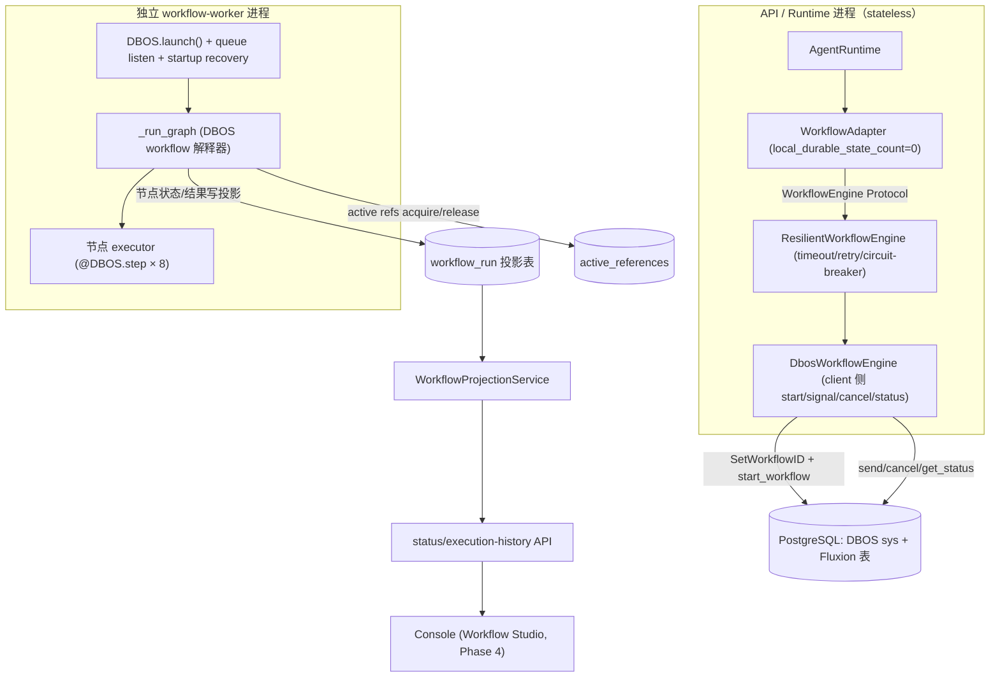
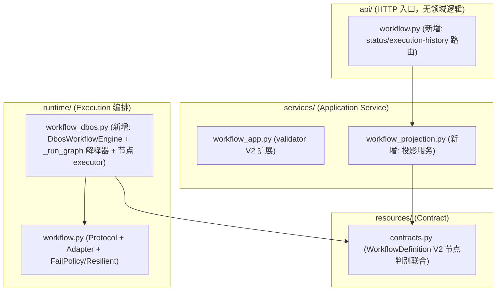
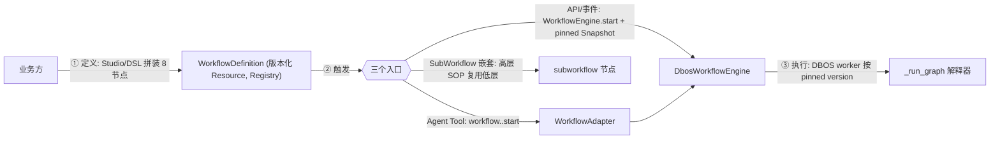
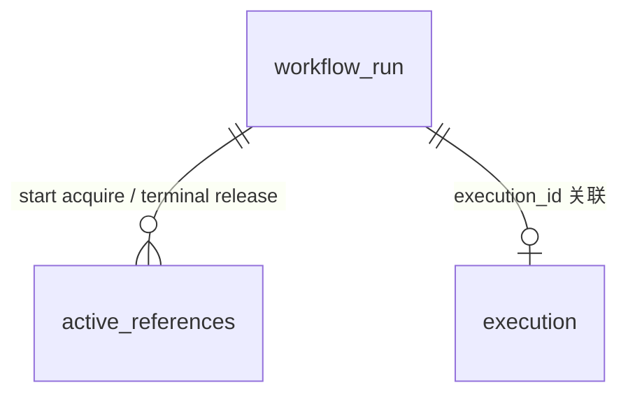

# Phase 3 Workflow Platform 模块需求与设计一体化文档

> **文档编号**: MOD-PHASE3-V1.0
> **文档版本**: v0.1（草稿）
> **创建日期**: 2026-08-28
> **文档状态**: 设计评审中

**评审边界说明**:
- 本文档是 v2.2 Rolling-wave 的 **Phase 3 Detailed Implementation Plan**（roadmap §5），继承三份规划（roadmap §5、PRD FEAT-10/11/12/13 + §4.8、remediation-plan §11）与三份 ADR 设计简报/ADR（ADR-WF-001、ADR-013、ADR-SNAPSHOT-001）。
- **vendor 已定**：ADR-013 以 PoC 证据锁定 **DBOS**（`evidence/dbos.json` all_criteria_passed=True，11/11 + baseline 全绿），解除 ADR-WF-001 的 `pending-PoC-gate`，self-built fallback 关闭。本文档只做 DBOS 生产化，不重做选型。
- **前置已落地不重复设计**（仅引用）:`WorkflowEngine` Protocol 5 成员 + `FailPolicy`/`ResilientWorkflowEngine` + `WorkflowAdapter`（`runtime/workflow.py`）、`WorkflowDefinition` V1 + `WorkflowDefinitionValidator`（`services/workflow_app.py`）、`active_references` 表（ADR-SNAPSHOT-001）、`WorkflowBackendSettings`（`config/workflow.py`）。
- 本文档**只覆盖 Phase 3 未落地部分**：DBOS production backend、WorkflowDefinition V2 节点契约、durable graph 解释器、HumanTask/Wait/Timer/Resume、Version pin/active ref/GC、status projection + execution history、独立 worker 部署。

**ID 体系**: US（来自 PRD）、FEAT、API（接口）、RULE、TC（测试用例）、NFR、RISK。场景: S-（正常）、E-（异常）、B-（边界）。

---

## 1. 文档控制

### 1.1 责任人

| 角色 | 姓名 | 职责范围 |
|------|------|---------|
| 开发负责人 | jahan | DBOS 生产后端、解释器、WorkflowDefinition V2、投影服务 |
| 测试负责人 | jahan | Phase 3 Gate 自动化证据（crash/timer/idempotency/pinned/HumanTask） |
| 架构师 | jahan | Retry 边界、WorkflowDefinition V2 Contract 变更、部署模型 |

### 1.2 修订历史

| 版本 | 日期 | 作者 | 变更描述 |
|------|------|------|---------|
| v0.1 | 2026-08-28 | jahan | 初始草稿（继承三份规划 + ADR-WF-001/013/ADR-SNAPSHOT-001） |
| v0.2 | 2026-08-28 | jahan | 按 `fluxion-phase1-closure-detailed-remediation.md` §14（历史文档，git 历史可查）修订：Agent 节点改 `agent_ref`（§14.1）、capability 前缀改 `skill\|tool\|mcp`（§14.2）、`engine_ref` 移出 Product DSL（§14.3） |

---

## 2. 需求分析

### 2.1 需求概述

| 项目 | 内容 |
|------|------|
| **模块名称** | Phase 3 — Workflow Platform（未落地部分） |
| **模块ID** | MOD-PHASE3 |
| **所属系统/产品线** | Fluxion Runtime / Workflow Platform |
| **需求类型** | 架构演进 / 中大型功能开发 |
| **业务背景** | ADR-013 已选型 DBOS（PostgreSQL-native durable execution library）。当前 `runtime/workflow.py` 只有 Protocol + Adapter + `StubWorkflowEngine`（零 durable state），PoC 证据在 `tests/workflow_poc/`（DBOS 2.31，11/11 全绿）尚未上移生产化。WorkflowDefinition V1 只有线性 `capability_ref` step，无节点契约/输入输出映射/HumanTask/Wait/Timer/SubWorkflow；无版本 pin + GC 生产路径；无 status projection。 |
| **核心目标** | 以 DBOS 生产后端替换 `StubWorkflowEngine`，落地 WorkflowDefinition V2 节点契约与 durable graph 解释器（Agent/Tool-MCP-Capability/Condition-Switch/Parallel-Join/Transform/Approval-HumanTask/Wait-Timer/SubWorkflow），实现 Version pin/active ref/GC 与 status projection，使复杂 SOP 具备 durable execution（Phase 3 Gate 全过）。 |

### 2.2 痛点与价值

| 维度 | 内容 |
|------|------|
| **目标用户** | Builder（US-06：编排 durable Workflow 不自行实现恢复/定时器/等待语义）；运行时（US-10：长 Workflow resume 用 pinned 不可变定义）；Console（Workflow Studio，Phase 4 消费 projection API） |
| **当前问题** | (1) `StubWorkflowEngine.start` 只 append 请求返回固定 run_id，零 durable state、零恢复、零定时器；(2) WorkflowDefinition V1 仅支持线性 capability step，无法表达条件/并行/审批/等待/子流程；(3) 无版本 pin + active ref 生产路径（P-PIN 只在 PoC mock 验证）；(4) 无 status projection API（Workflow Studio 无数据源）；(5) DBOS 依赖未声明进 `pyproject.toml`/`uv.lock`（PoC 用 `.venv` 直装）。 |
| **业务影响** | 无 durable backend → 复杂 SOP（入职流程、审批流、跨服务编排）中断即丢失进度，企业级 Agent Platform 不成立。 |
| **预期价值** | durable start P95≤1s（SLO-WF-01）；worker 崩溃恢复 P95≤60s（SLO-WF-02）；committed 不可逆副作用重复=0（SLO-WF-03）；timer/wait/approval 跨重启存活；pinned deprecated 版本可恢复；active ref hard-delete 被拒。 |

**用户故事**（继承 PRD）

| 编号 | 用户故事 | 优先级 |
|------|---------|--------|
| US-06 | Builder 可编排 durable Workflow，不自行实现恢复/定时器/等待语义 | P0 |
| US-10 | 长时间 Workflow resume 时仍能取得启动时 pinned 的不可变定义与执行依赖 | P0 |
| US-11 | 平台扩展机制只有一套明确模型（Workflow Step 与 Agent Tool 复用 Capability Contract） | P0 |

### 2.3 功能方案

#### 2.3.1 功能清单

| 功能ID | 功能名称 | 功能描述 | 优先级 | 来源 |
|--------|---------|---------|--------|------|
| FEAT-P3-01 | DurableExecutionBackend 生产实现（DBOS） | `DbosWorkflowEngine` 实现 `WorkflowEngine` Protocol（含 `await_result`/`get_execution_history` 扩展），替换 `StubWorkflowEngine` 为生产实现；DBOS 依赖声明进 pyproject/uv.lock | P0 | US-06 / FEAT-11 / W301+W302 / ADR-013 |
| FEAT-P3-02 | WorkflowDefinition V2 节点契约 | `WorkflowDefinition` 扩展为节点判别联合（capability/agent/condition/switch/parallel/transform/wait/human_task/subworkflow），V1 线性 step 向后兼容；每个节点契约含 timeout/retry/fail policy 字段 | P0 | US-06 / FEAT-10 / W303 |
| FEAT-P3-03 | Durable graph 解释器 | 单注册 DBOS workflow `_run_graph` 数据驱动遍历图；每节点类型有 `@DBOS.step()` executor；输出映射 `node_id → value` + `{{ node_id.output }}` 引用插值；Condition/Switch 路由、Parallel/Join 汇聚、Transform 变换、SubWorkflow 嵌套 | P0 | US-06 / FEAT-10 / W304-307+W310 |
| FEAT-P3-04 | HumanTask / Wait / Timer / Resume | Wait/Timer 用 `DBOS.sleep_async`（durable）；HumanTask/Approval 用 `DBOS.recv_async/send`（durable signal + 跨重启存活）；assignee 解析 + timeout；resume 用 pinned version | P0 | US-06/US-10 / FEAT-12 / W308+W309+W311-313 |
| FEAT-P3-05 | Version pin / active ref / GC | start 时对 workflow + 依赖资源 acquire `active_references`（ref_type=workflow）；terminal 释放；hard-delete 被拒；deprecated-but-resumable | P0 | US-10 / FEAT-13 / W307-310 |
| FEAT-P3-06 | Status projection + execution history | `workflow_run` 投影表（tenant scope + pinned refs + node_states）；status projection API（Console-facing，统一 envelope）；`get_execution_history` 关联 execution→run | P1 | US-06 / FEAT-11 / W306+W312 |

#### 2.3.2 字段约束

**FEAT-P3-01 WorkflowEngine Protocol 扩展**

| 成员 | 签名 | 约束 | 说明 |
|------|------|------|------|
| `start` | `async start(request: WorkflowStartRequest) -> WorkflowStartResult` | 已存在；start 须同步持久化（durable start P95≤1s） | 返回 `run_id` |
| `resume` | `async resume(run_id: str) -> WorkflowRunStatus` | 已存在；幂等 | 从最近 durable step 继续 |
| `signal` | `async signal(run_id, name, payload) -> None` | 已存在 | HumanTask/Wait 唤醒 |
| `cancel` | `async cancel(run_id, *, timeout: float) -> None` | 已存在；带 timeout（规则 18） | 终止运行 |
| `get_status` | `async get_status(run_id) -> WorkflowRunStatus` | 已存在 | 投影/状态查询 |
| `await_result` | `async await_result(run_id, *, timeout: float) -> object` | **新增**；有限等待 | 同步等待终态 + 结果 |
| `get_execution_history` | `async get_execution_history(run_id) -> ExecutionHistory` | **新增** | execution→workflow_run 关联 + 节点历史（roadmap 接口 8） |

> `WorkflowStartRequest` 增加 `pinned: WorkflowPinnedRefs`（workflow + 依赖资源的 `{kind, id, version}` 快照，来自 ExecutionSnapshot）。全成员定义 timeout + retry + fail policy（规则 18 / RULE-P3-04，禁 double retry）。

**FEAT-P3-02 WorkflowDefinition V2 节点契约（判别联合，`type` 为 discriminator）**

| 节点类型 | 关键字段 | 必填约束 | 说明 |
|---------|---------|---------|------|
| `capability`（= V1 step 兼容） | `capability_ref` `(skill\|tool\|mcp):<id>@<version>`、`input` | capability_ref 必填 | 执行 Capability（US-11：Step 与 Agent Tool 复用 Capability Contract；`tool:` → `ResourceKind.TOOL`，Phase 1 Closure 统一） |
| `agent` | `agent_ref`（`agent:<id>@<version>`）、`prompt`、`max_turns` | agent_ref 必填 | 经 Agent exact version → Phase 2 ContextResolver（`agent_id` 主坐标）→ RuntimeProfile → pinned ExecutionSnapshot → AgentRuntime；**Workflow DSL 不感知 Runtime mechanics**（remediation §14.1） |
| `condition` | `expression`（谓词，见 §3.4）、`then`/`else`（后继 node id 列表） | expression 必填 | 二元路由 |
| `switch` | `expression`、`cases: [{value, node_ids}]`、`default` | cases ≥1 | 多路路由 |
| `parallel` | `branches: [{branch_id, node_ids}]`、`join_policy: all\|any` | branches ≥2 | 分支并发 + 汇聚 |
| `transform` | `source`（引用）、`transform`（模板/映射） | 必填 | 值变换 |
| `wait` | `duration_seconds` | >0 | durable timer |
| `human_task` | `assignee`（user ref / role）、`message`、`timeout_seconds` | assignee 必填 | 审批/人工输入（durable signal） |
| `subworkflow` | `workflow_ref`（`workflow:<id>@<version>`）、`input` | 必填 | 嵌套 durable workflow |

> 公共字段（所有节点）: `id`（唯一）、`depends_on`（无环）、`timeout_ms`、`retry_policy`（max_attempts/delay，**step 级 retry 归 DBOS**，仅表达业务意愿）、`output_schema`（可选，节点输出契约）。
> 兼容规则: V1 spec（无 `type` 字段、有 `capability_ref`）经 `model_validator(mode="before")` 注入 `type="capability"`，V1 全部现网 WorkflowDefinition 不需迁移（B-03）。
> **`engine_ref` 不进入 Product DSL**（remediation §14.3）：durable backend 选择属 Platform Configuration（`WorkflowBackendSettings`），不由每个 WorkflowDefinition 配置；可替换性由 `WorkflowEngine` Protocol 承担（ADR-008 可逆性）。

### 2.4 范围与边界

| 类别 | 内容 |
|------|------|
| **范围（In Scope）** | DBOS production backend + Protocol 扩展；WorkflowDefinition V2 节点契约 + validator；durable graph 解释器（8 节点类型）；HumanTask/Wait/Timer/Resume；Version pin/active ref/GC；status projection + execution history API；独立 worker 部署；DBOS 依赖正式声明。 |
| **非范围（Out of Scope）** | Workflow Studio UI（Phase 4）；Builder UX（Phase 4）；完整表达式语言（本 phase 用文档化子集）；retention_period 具体值/Hardening/Chaos（Phase 6）；OTel Collector（Phase 5）；A2A V1 扩展；跨语言大规模编排（ADR-013 Revisit 条件，未触发）。 |
| **前置假设** | ADR-WF-001/013/ADR-SNAPSHOT-001 accepted；Phase 1 Capability/AgentDefinition 落地；**Phase 2 ContextResolver + Snapshot V2 落地**（Agent 节点消费 pinned ExecutionSnapshot）；`active_references` 表已建；本地 PG（`mmuser/mmuser@localhost:5432`，含 `fluxion_poc_dbos` 或新建 `fluxion_workflow` 库）+ Redis 可用。 |
| **分层边界** | **Phase 3 交付能力层**（WorkflowDefinition V2 + DBOS 引擎 + 解释器 + 投影），**不交付业务 SOP**。业务 SOP = 发布到 Registry 的 WorkflowDefinition 实例（定义数据），不写引擎代码（rule 5 / rule 12）。ADR-008/013 的「业务接入层」是**时机**概念（有真实业务需要时才构建 Engine），不是分层概念——Phase 3 将其建成能力层基底。 |
| **有意妥协 / 技术债** | (1) 条件表达式用文档化子集（`==`/`!=`/`in`/数值比较/布尔组合，白名单函数），不做任意表达式求值（安全）；(2) Agent 节点执行复用现有 AgentRuntime，不做节点级容错扩展（Phase 6 再评估）；(3) durable backend 生产唯一值 DBOS（ADR-013），选择属 Platform Configuration 不进 DSL（remediation §14.3）；(4) DBOS sys 表建在业务 PG 库（ADR-013 已接受强耦合 PG）。 |

### 2.5 验收条件

#### 2.5.1 业务规则与约束

| ID | 类型 | 描述 | 验证场景 |
|----|------|------|---------|
| RULE-P3-01 | 系统约束 | Runtime 不持有 Workflow durable state（rule 13）；`WorkflowAdapter.local_durable_state_count==0` 恒等 | B-01 |
| RULE-P3-02 | 系统约束 | Workflow resume 始终使用 pinned version（ExecutionSnapshot），不 resolve latest | S-03 |
| RULE-P3-03 | 系统约束 | 被 active workflow 引用的 WorkflowDefinition/Capability/Agent 版本不得 hard delete（ref_type=workflow） | S-07 |
| RULE-P3-04 | 系统约束 | 禁止 double retry：DBOS step 级 durable retry 与 Fluxion backend 调用重试互不叠加 | S-04 / E-03 |
| RULE-P3-05 | 系统约束 | durable start 同步持久化 P95≤1s；backend/worker 故障恢复 P95≤60s | S-01 / S-02 |
| RULE-P3-06 | 安全约束 | workflow_run 全链路 tenant scope，跨租户不可见 | B-02 |

#### 2.5.2 功能验收场景

**正常场景**

| 场景ID | 功能ID | 优先级 | 测试层级 | 关键真实边界 | 前置条件 | 操作步骤 | 预期结果 |
|--------|--------|--------|---------|-------------|---------|---------|---------|
| S-01 | FEAT-P3-01 | P0 | E2E | Adapter → DbosWorkflowEngine → DBOS → PG | 已发布 WorkflowDefinition（含 capability + wait + humantask 节点） | `WorkflowAdapter.execute` 调用 | 返回 `run_id`；start 返回后 DBOS 可查状态（同步持久化）；P95≤1s |
| S-02 | FEAT-P3-01 | P0 | E2E | 独立 worker 进程 + PG | workflow 运行中 | SIGKILL worker → 新进程启动 | startup recovery 续跑，已完成 step 不重跑；P95≤60s |
| S-03 | FEAT-P3-05 | P0 | integration | ExecutionSnapshot + Registry + active_references | start 时 workflow v1 pinned；v2 已发布 | resume 长 workflow | 使用 v1，不 resolve latest（RULE-P3-02） |
| S-04 | FEAT-P3-03 | P0 | integration | DBOS step timeout 配置 | `timeout_ms` < 实际耗时 | 运行超时节点 | 有界转 ERROR，不无限等待（RULE-P3-04） |
| S-05 | FEAT-P3-01 | P0 | E2E | DBOS 幂等（SetWorkflowID） | 同 execution 已 start | 二次 start | 返回既有 run，step 不重跑，业务记录恰 1 条（SLO-WF-03） |
| S-06 | FEAT-P3-01 | P1 | integration | database-backed queue + 2 worker 进程 | 排队任务 | 2nd worker 拉取 | 任务分摊，水平扩展生效 |
| S-07 | FEAT-P3-05 | P0 | E2E | active_references ref_type=workflow | workflow 运行中引用 v1 | 尝试 hard-delete v1 | 被拒（RULE-P3-03）；run 结束后可删 |
| S-08 | FEAT-P3-04 | P0 | E2E | DBOS recv_async/send + 独立 worker | 审批节点运行中 + worker 重启 | send(approve signal) | 唤醒并继续；跨重启存活 |
| S-09 | FEAT-P3-04 | P0 | E2E | DBOS.sleep_async | wait 节点运行中 | kill + 重启 worker | 按原始 deadline 触发，elapsed 落在窗口内 |
| S-10 | FEAT-P3-03 | P0 | E2E | 解释器遍历 8 节点类型 | condition/switch/parallel/transform/subworkflow 混合图 | 运行 | 图执行结果正确，并行分支并发完成 |
| S-11 | FEAT-P3-06 | P1 | integration | workflow_run 投影表 + status API | 运行中/终态 run | `GET /workflows/runs/{run_id}` | 返回 node 级状态 + pinned refs + execution history |

**异常场景**

| 场景ID | 功能ID | 测试层级 | 关键真实边界 | 触发条件 | 系统行为 | 用户感知 |
|--------|--------|---------|-------------|---------|---------|---------|
| E-01 | FEAT-P3-01 | integration | ResilientWorkflowEngine + circuit breaker | DBOS backend 宕机 | 熔断快速失败（非 hang）；N 次失败后 open，cooldown 后试探 | 明确错误码（非无限等待） |
| E-02 | FEAT-P3-01 | integration | tenant scope | 查询他租户 run | 404 NotFound（不可见） | 统一 envelope 错误 |
| E-03 | FEAT-P3-03 | integration | DBOS durable retry | step 首次执行抛异常 | DBOS step retry 生效；业务写不重复 | step 最终成功或按 fail policy 终态 |

**边界场景**

| 场景ID | 测试层级 | 关键真实边界 | 字段/条件 | 边界值 | 预期行为 |
|--------|---------|-------------|----------|--------|---------|
| B-01 | unit | `runtime/workflow.py` WorkflowAdapter | `local_durable_state_count` | 恒等 0 | Runtime 无 durable workflow state（RULE-P3-01） |
| B-02 | integration | tenant scope | tenant A run | tenant B 查询 | 不可见（NFR-SEC-01） |
| B-03 | unit | WorkflowDefinition V2 validator | V1 spec（无 type 字段） | 纯 capability step | 兼容通过，注入 `type="capability"`（不迁移） |
| B-04 | unit | 条件表达式求值 | 非法/非白名单表达式 | 任意代码注入 | 拒绝求值（文档化子集白名单） |

#### 2.5.3 非功能指标

**性能指标**

| 指标ID | 指标名称 | 目标值 | 测量方法 |
|--------|---------|-------|---------|
| NFR-PERF-01 | Workflow durable start | P95≤1s（SLO-WF-01） | E2E 计时（start 返回后 DBOS 可查） |
| NFR-PERF-02 | backend/worker 故障恢复 | P95≤60s（SLO-WF-02） | crash 恢复计时 |
| NFR-PERF-03 | Committed 不可逆副作用重复 | =0（SLO-WF-03） | idempotency 计数 |

**可靠性指标**

| 指标ID | 指标名称 | 目标值 |
|--------|---------|-------|
| NFR-REL-01 | Durable state RPO | committed durable state RPO=0 |
| NFR-REL-02 | timer/wait/approval 跨重启 | survive restart（S-08/S-09） |

**安全性要求**

| 指标ID | 安全域 | 验收标准 |
|--------|--------|---------|
| NFR-SEC-01 | 租户隔离 | workflow_run 全链路 tenant scope，跨租户不可见（B-02） |
| NFR-SEC-02 | 表达式安全 | 条件表达式仅文档化白名单子集，任意代码注入被拒（B-04） |

**可观测性**

| 指标ID | 指标名称 | 目标值 |
|--------|---------|-------|
| NFR-OBS-01 | Trace 关联完整率 | P0 Agent/Workflow/Tool/MCP 路径 ≥99%（SLO-OBS-01） |

---

## 3. 技术设计

### 3.1 方案选型

#### 关键决策记录

| 决策点 | 选择 | 被否决项 | 理由 | 可逆性 |
|--------|------|---------|------|--------|
| Durable backend | **DBOS**（PostgreSQL-native，library 模型） | Temporal / Restate / self-built | ADR-013 PoC 证据：DBOS 11/11 + baseline 1000 并发全绿，start 14ms，崩溃恢复 5.07s，db-backed queue 双 worker 分摊；Restate 单节点恢复失效 + BUSL-1.1；Temporal 运维最重（未实测，文档分 7.4） | 高（`WorkflowEngine` Protocol 可替换，ADR-008 可逆性） |
| DbosWorkflowEngine 归属 | **`runtime/workflow_dbos.py`**（与 Protocol 同包） | `plugins/providers/`（DBOS 是 infra behind Contract，非 PluginType，ADR-WF-001 §3.1.5 已决）；services/（无编排职责） | 镜像 RegistryStore 的 SQLite/PG adapter 同包模式；引擎实现紧贴其实现的 Contract | 高（纯模块移动，DI） |
| WorkflowDefinition V2 形态 | **扩展现有 `WorkflowDefinition`**（node 判别联合，V1 兼容） | 新建独立 `WorkflowDefinitionV2`（破坏现有 validator/console/registry 消费） | V1 线性 step = `type="capability"` 特例；现网 spec 零迁移（B-03） | 中（模型字段扩展 + validator 分支） |
| DSL→DBOS 桥 | **通用解释器 `_run_graph`**（单注册 DBOS workflow，数据驱动图遍历；每节点 `@DBOS.step()` executor） | 按定义 codegen（每 WorkflowDefinition 生成 Python 函数；动态注册生命周期复杂 + codegen 安全风险） | 任何 Definition 免重新注册即可执行；DBOS replay 对确定性图遍历正确（step 结果按 args 缓存）；表达式子集白名单防注入（B-04） | 中（解释器内部实现可换） |
| 部署模型 | **独立 `fluxion-workflow-worker` Deployment**（DBOS.launch + queue listen + startup recovery）；API/Console 进程持 DbosWorkflowEngine 做 client 侧 start/signal/cancel/status | 引擎与 API 进程同生共死（library 模型限制，恢复/并发受 API 进程影响） | ADR-013 Trade-offs 已决「独立 worker 进程承载引擎（PoC 已验证）」；worker 独立扩缩容（rule 14 运行边界分离） | 易（Deployment 分离） |
| Retry 边界 | **Fluxion=backend 调用级**（ResilientWorkflowEngine: bounded timeout/retry/circuit-breaker）；**DBOS=step 级 durable retry** | step 内再套 Fluxion retry（double retry，副作用重复） | remediation §11「禁止 double retry」；`retry_policy` 字段只表达业务意愿，由 DBOS 执行 | 易（文档 + 架构测试） |
| Version pin / GC | **复用 ADR-SNAPSHOT-001 `active_references`**（ref_type=workflow），start acquire / terminal 释放 | 自建 workflow 专用 pin 表（重复机制） | 与 ExecutionSnapshot retention 统一；hard-delete 单守卫 | 易 |
| Status projection | **Fluxion `workflow_run` 投影表**（tenant scope + pinned refs + node_states） | 直接暴露 DBOS sysdb 状态（无 tenant 概念、与 Fluxion 事实隔离差） | tenant 强制（rule 16）+ Execution 关联 + node 级投影（Workflow Studio 数据源） | 易 |

> **被放弃的较慢/较险方案**：自研 durable kernel（replay/exactly-once/crash-recovery 复杂度高，ADR-013 默认否决 + PoC 翻盘条件未触发）；按定义 codegen（动态注册 + 安全风险，解释器可满足）。

#### 技术栈

| 类别 | 选型 | 版本 | 选型理由 |
|------|------|------|---------|
| 语言 | Python | 3.12+ | 项目基线 |
| Durable backend | `dbos`（SDK） | 2.31（PoC 实测版本） | ADR-013 pick；MIT；PostgreSQL-native；Python-first |
| DB Driver | `psycopg` | 现有 | PoC 已用（`psycopg.AsyncConnection`） |
| 数据库 | PostgreSQL（DBOS sys 表 + Fluxion projection） | 现有 | ADR-013 强耦合 PG（可接受） |
| 缓存 | Redis（Phase 2 复用） | 现有 | workflow 状态 projection 可选 L2（不强制） |
| 验证 | pytest + httpx ASGI + 本地 k8s（Phase 2 复用） | 现有 | Phase 3 Gate 自动化证据 |

> **依赖变更**：`dbos` 从 `.venv` 直装（PoC）正式声明进 `pyproject.toml` + `uv.lock`（FEAT-P3-01）。

### 3.2 架构设计

#### 生产组件图

#### 包结构

### 3.2.1 业务 SOP 接入路径（能力层 / 业务层边界）

**能力层（本 phase 交付）**：WorkflowDefinition V2（版本化 Resource）、8 节点契约、DBOS 引擎 + `_run_graph` 解释器、投影服务——通用、可复用。

**业务层（SOP 接入，本 phase 不交付）**：具体业务 SOP = 发布到 Registry 的 `WorkflowDefinition` 实例（定义数据）。接入路径：

| 接入路径 | 说明 | 消费方 |
|---------|------|--------|
| ① 定义 | 业务方用 8 节点拼装 SOP（`agent` 引 pinned `runtime_profile`、`capability` 引 skill/mcp/plugin、`human_task` 挂审批人），发布版本化 WorkflowDefinition | Workflow Studio（Phase 4）/ DSL |
| ② Agent Tool | `workflow.<id>.start`，Agent 推理中主动触发（已有 `WorkflowAdapter`），作为 Agent-facing Capability | AgentRuntime |
| ② API/事件 | Console/外部系统调用 `WorkflowEngine.start`，携带 pin 的 ExecutionSnapshot（RULE-P3-02） | Console（Phase 4）/ 集成方 |
| ② SubWorkflow | 高层 SOP 的 `subworkflow` 节点复用低层 SOP（如「入职 SOP」→「账号开通 SOP」） | 解释器 |
| ③ 执行 | DBOS worker 按 pinned version 解释执行；审批/等待/重试/恢复由引擎承担，业务只提供定义 + 业务策略（审批人/超时/重试意愿） | `fluxion-workflow-worker` |

> **边界**：业务 SOP 不实现恢复/定时器/幂等/并发调度（PRD §4.8：Fluxion 自研 DSL 与 adapter，不自研 durable kernel）；业务侧新增节点类型才触及能力层（走节点契约扩展评审）。

#### 外部依赖清单

| 外部系统 | 依赖类型 | 协议 | 超时 | 降级策略 |
|---------|---------|------|------|---------|
| PostgreSQL（DBOS sys + Fluxion 表） | 持久化/durable state | TCP/5432 | 每调用定义（规则 18） | ResilientWorkflowEngine 熔断快速失败（E-01） |
| 模型 Provider | Agent 节点执行（可选） | 现有协议 | 现有 `request_timeout_ms` | 节点按 fail policy 终态 |
| Redis | projection L2 缓存（可选） | TCP/6379 | 300ms | degrade 直读（Phase 2 cache adapter） |

### 3.3 数据设计

**新增表 `workflow_run`（Fluxion projection，与 DBOS sysdb 同库不同表）**

| 字段名 | 类型 | 可空 | 默认值 | 索引 | 说明 |
|--------|------|------|--------|------|------|
| run_id | String(128) | N | | PK | 与 DBOS workflow_id 一致（`{workflow_id}:{execution_id}`） |
| tenant_id | String(128) | N | | `idx_wf_run_tenant` | 租户（强制，rule 16） |
| workflow_id | String(128) | N | | | WorkflowDefinition id |
| workflow_version | Integer | N | | | pinned version |
| execution_id | String(128) | N | | `idx_wf_run_exec` | 关联 Execution |
| trace_id | String(128) | N | | | 链路关联（NFR-OBS-01） |
| status | String(16) | N | `running` | | running/succeeded/failed/cancelled/paused |
| node_states | JSON | Y | | | `{node_id: {status, output_ref, error}}` |
| pinned_refs | JSON | N | | | `[{kind, id, version}]` 版本快照（RULE-P3-02） |
| created_at / updated_at | DateTime(tz) | N | | | |

**active_references（ADR-SNAPSHOT-001 已建，本 phase 消费）**

| 用途 | 说明 |
|------|------|
| `ref_type=workflow` | workflow run 对 workflow/capability/agent 版本引用（RULE-P3-03） |
| acquire | start 时对 `pinned_refs` 逐项 acquire |
| release | terminal（succeeded/failed/cancelled）时释放 |
| hard-delete guard | 存在 active ref → 拒绝删除（S-07） |

**DBOS sys 表**：`dbos` schema（workflow_status/operations/queues 等），DBOS 管理，Fluxion 不设计不直写。

**ER 关系**

### 3.4 接口设计

> 形态 C：函数/库接口（领域逻辑）+ HTTP API（投影）。

| 函数签名 | 入参 | 返回 | 错误处理 |
|---------|------|------|---------|
| `DbosWorkflowEngine.start(request: WorkflowStartRequest) -> WorkflowStartResult` | 请求（含 pinned refs） | run_id + status | durable start 失败→定义错误码；幂等（SetWorkflowID） |
| `DbosWorkflowEngine.await_result(run_id, *, timeout) -> object` | run_id + 有限等待 | 终态结果 | 超时→`TimeoutError`（规则 18） |
| `_run_graph(definition: dict, input: dict, run_meta: dict) -> dict`（DBOS workflow） | V2 定义 + 输入 + run 元信息 | `{outputs, node_states}` | 节点失败→DBOS step retry → fail policy 终态 |
| `_run_node(kind, node_def, inputs, scope) -> object`（DBOS step） | 节点类型 + 定义 + 输入 | 节点输出 | 按类型 dispatch；超时/失败→step retry（E-03） |
| `WorkflowProjectionService.get_run(tenant_id, run_id) -> WorkflowRunProjection` | 租户 + run | 投影 | 不存在/跨租户→NotFound（E-02） |
| `WorkflowProjectionService.list_runs(tenant_id, workflow_id) -> list[...]` | 租户 + workflow | 运行列表 | tenant 强制 |
| `GET /workflows/runs/{run_id}` | 路径 run_id | `{code, data: WorkflowRunProjection, ...}`（统一 envelope） | 404 |
| `GET /workflows/{workflow_id}/runs` | 查询 tenant/status | 运行列表 + 分页 | tenant 强制 |

**条件表达式子集（NFR-SEC-02，白名单）**

| 形态 | 示例 | 说明 |
|------|------|------|
| 引用插值 | `{{ step_a.output }} == "approved"` | 引用前序节点输出 |
| 比较符 | `==`、`!=`、`> < >= <=`、`in` | 值比较 |
| 布尔组合 | `and`、`or`、`not` | 组合子 |
| 白名单函数 | `len()`、`lower()`、`upper()`、`is_empty()` | 仅白名单，无任意调用 |

> 求值器用 AST 解析 + 白名单校验，非 `eval`（B-04）。

### 3.5 质量实现方案

#### 性能设计

| 指标ID | 热点路径 | 目标值 | 实现方案（含被放弃的较慢方案） |
|--------|---------|-------|------------------------------|
| NFR-PERF-01 | durable start（每 workflow 启动 1 次） | P95≤1s | `DBOS.start_workflow` 同步持久化（PoC start 14ms）；被放弃：fire-and-forget start（无法保证 durable） |
| NFR-PERF-02 | crash recovery（故障时） | P95≤60s | DBOS launch 级 startup recovery（PoC 5.07s）；被放弃：自研 checkpoint |
| NFR-PERF-03 | 图执行 | step 并行 | `parallel` 分支 `asyncio.gather`（DBOS 缓存已完 step 结果，replay 不重算） |

#### 可靠性设计

| 风险ID | 失效模式 | 影响 | 应对措施 | 验证场景 |
|--------|---------|------|---------|---------|
| RISK-P3-01 | worker 崩溃 | workflow 中断 | DBOS startup recovery（S-02）；独立 worker 进程隔离 | S-02 |
| RISK-P3-02 | double retry | 副作用重复 | Retry 边界文档化 + 架构测试断言 step executor 无 Fluxion 层重试 | S-04 / E-03 / B-01 |
| RISK-P3-03 | pinned version 被删 | resume 取错版本 | active_references ref_type=workflow（S-07）+ tombstone | S-03 / S-07 |
| RISK-P3-04 | DBOS 客户端 event loop 绑定 | to_thread 报错 | 查询/信号类 DBOS API 统一 `asyncio.to_thread`（PoC 已验证） | S-01 |
| RISK-P3-05 | 表达式注入 | 任意代码执行 | AST 白名单求值器（B-04） | B-04 |

#### 安全性设计

| 指标ID | 验收标准 | 实现方案 |
|--------|---------|---------|
| NFR-SEC-01 | workflow_run 跨租户不可见 | tenant_id 全链路强制（projection 表 + API 查询带 tenant scope） |
| NFR-SEC-02 | 表达式无任意代码执行 | 白名单 AST 求值器，非 `eval` |

#### 可观测性设计

| 场景 | 实现方案 |
|------|---------|
| 链路追踪 | `run_id`/`execution_id`/`trace_id`/`tenant_id` 全链路关联（WorkflowStartRequest 透传 + 投影表）；SLO-OBS-01 ≥99% |
| 指标 | durable start P95、recovery P95、step 重试次数、circuit-breaker 状态、投影写入延迟 |
| 日志 | structlog JSON（`emit_workflow_event_log` 已有）；节点状态事件 `workflow.node.{id}.{status}` |

---

## 4. 部署与运维

### 4.1 部署架构

| 组件 | 形态 | 说明 |
|------|------|------|
| `fluxion-api` / `fluxion-runtime` | 现有 Deployment | 持 DbosWorkflowEngine（client 侧）；stateless |
| `fluxion-workflow-worker` | **新增独立 Deployment**（≥2 副本） | `DBOS.launch()` + `listen_queues` + startup recovery；`worker_concurrency` 有界（PoC 4）防单 worker 全认领 |
| PostgreSQL | 现有 | DBOS sys schema + Fluxion 表（同库） |
| Redis | 现有 | projection L2（可选） |

> DBOS `register_queue` 需非 async 上下文 → 后台线程注册（PoC 已验证，≤1s 被 queue_thread 接管）。

### 4.2 发布与回滚

| 阶段 | 范围 | 进入条件 | 回滚条件 |
|------|------|---------|---------|
| 数据（投影表） | `workflow_run` 建表 | 迁移幂等（CREATE IF NOT EXISTS） | 表内数据可保留（投影可重建） |
| 代码 | DbosWorkflowEngine 替换 Stub | Phase 3 Gate 全绿 | Stub 保留在测试；engine 经 DI 切换 |

### 4.4 数据迁移

| 阶段 | 操作 | 验证方法 |
|------|------|---------|
| 1 | `workflow_run` 建表（幂等 DDL） | 迁移报告 |
| 2 | DBOS sys schema 由 DBOS 自身初始化（launch 自动） | DBOS 状态可查 |
| 3 | 现网 V1 WorkflowDefinition 无需迁移（V2 兼容，B-03） | V1 spec validator 通过 |

---

## 5. 风险与依赖

### 5.1 项目依赖

| 依赖模块/团队 | 依赖内容 | 状态 | 风险等级 |
|-------------|---------|------|---------|
| ADR-WF-001 / ADR-013 | WorkflowEngine Protocol + vendor pick | accepted | 低 |
| ADR-SNAPSHOT-001 | active_references 表 + tombstone | 已落地 | 低 |
| Phase 1（Capability/AgentDefinition） | 节点 executor 输入 | 已落地 | 低 |
| **Phase 2（ContextResolver + Snapshot V2）** | Agent 节点 pinned ExecutionSnapshot | 设计完成，未编码 | 中 |
| `dbos` 依赖声明 | pyproject/uv.lock | PoC 直装 → 本 phase 声明 | 低 |

### 5.2 风险识别

| 风险ID | 类型 | 描述 | 概率 | 影响 | 应对措施 | 验证场景 |
|--------|------|------|------|------|---------|---------|
| RISK-P3-01 | 基础设施 | worker 崩溃丢进度 | 中 | 高 | DBOS startup recovery + 独立 worker（S-02） | S-02 |
| RISK-P3-02 | 架构 | durable state 误进 Agent Runtime / double retry | 中 | 高 | B-01 不变量 + Retry 边界架构测试 | B-01 / S-04 |
| RISK-P3-03 | 一致性 | pinned version 被删 | 中 | 高 | active_references ref_type=workflow | S-03 / S-07 |
| RISK-P3-04 | 依赖 | DBOS 版本升级破坏兼容 | 低 | 中 | `WorkflowEngine` Protocol 隔离（ADR-008 可逆性） | E-01 |
| RISK-P3-05 | 安全 | 表达式注入 | 低 | 高 | 白名单 AST 求值器 | B-04 |

---

## 6. 需求追溯矩阵

| 用户故事 | 功能ID | 接口ID | 测试用例ID | 测试层级 | 状态 |
|---------|--------|--------|-----------|---------|------|
| US-06 | FEAT-P3-01 | DbosWorkflowEngine.start/await_result | S-01/S-02/S-05/S-06/E-01/E-02 | E2E/integration | 待实现 |
| US-06 | FEAT-P3-02 | WorkflowDefinition V2 节点契约 | S-10/B-03 | E2E/unit | 待实现 |
| US-06 | FEAT-P3-03 | `_run_graph` / `_run_node` | S-04/S-10/E-03/B-04 | E2E/integration/unit | 待实现 |
| US-06/US-10 | FEAT-P3-04 | `resume` / `signal` / `wait`/`human_task` 节点 | S-03/S-08/S-09 | integration/E2E | 待实现 |
| US-10 | FEAT-P3-05 | pinned refs + active_references | S-03/S-07 | integration/E2E | 待实现 |
| US-06 | FEAT-P3-06 | ProjectionService + `GET /workflows/runs/...` | S-11/E-02 | integration | 待实现 |

> RULE-P3-01→B-01、RULE-P3-02→S-03、RULE-P3-03→S-07、RULE-P3-04→S-04/E-03、RULE-P3-05→S-01/S-02、RULE-P3-06→B-02。高影响 RISK→S-02/E-03/S-07/B-04 全覆盖。矩阵闭合无断点。

---

## Spec Compliance Matrix

> 继承 `.code-flow/tasks/2026-08-28/phase3-workflow-platform/spec-context.yml`（11 绑定）。required Rule 逐条回填设计落点与验证场景。

| Spec/Rule | enforcement | 设计影响 | 设计落点 | 验证场景 | 状态/N/A 理由 |
|-----------|-------------|---------|---------|---------|----------------|
| `fluxion-workflow-capability#RULE-fluxion-workflow-001` | required | Tool=Adapter；Durable State 归 Workflow Engine；Step 与 Tool 复用 Capability Contract | §3.2 Adapter 边界 + §2.3.2 `capability` 节点 + §2.5 B-01 | S-01（E2E）+ B-01（unit）+ S-10（E2E） | design 待 applied |
| `fluxion-runtime-core#RULE-fluxion-runtime-001` | required | Runtime 无状态（rule 13）；durable state 不进 Agent Runtime；Kernel 只依赖 Contract | §3.1 D6（retry 边界）+ §2.5 B-01 + §3.2 组件图 | B-01（unit）+ S-03（pinned）+ E-01（熔断） | design 待 applied |
| `fluxion-resource-registry#RULE-fluxion-resource-001` | required | WorkflowDefinition 版本化；pinned resume；Binding 差异；SQLite/PG 同契约 | §3.1 D7（pin/GC 复用 ADR-SNAPSHOT-001）+ §3.3 pinned_refs | S-03 + S-07 + B-03 | design 待 applied |
| `fluxion-dfx#RULE-fluxion-dfx-001` | required | Phase 3 Gate 编码阶段自动化证据（crash/timer/idempotency/approval/pinned/GC） | §2.5.2 S-02/S-05/S-08/S-09/S-07 + §3.5 可靠性 | S-02/S-05/S-08/S-09/S-07 | design 待 applied |
| `fluxion-console-channel#RULE-fluxion-console-001` | required | status projection API 供 Console（Workflow Studio Phase 4）；Web Chat Channel 不变 | §3.2 SVC→API→CON + §3.4 status API | S-11 | design 待 applied |
| `fluxion-console-api-contract#RULE-fluxion-console-api-001` | required | 统一 envelope + 错误码 + 日志（API Handler 不手写响应结构） | §3.4 status/execution-history API + §3.5 可观测 | S-11 + E-02 | design 待 applied |
| `backend-code-quality-performance#RULE-backend-quality-001` | required | 所有 backend/DBOS 调用定义 timeout+retry+circuit-breaker+fail policy（规则 18）；禁 double retry | §3.1 D6 + §3.4（await_result timeout）+ §2.5 S-04/E-01 | S-04 + E-01 + E-03 | design 待 applied |
| `backend-database#RULE-backend-database-001` | required | `workflow_run` projection schema + 索引 + tenant scope；DBOS sys 表由 DBOS 管理 | §3.3 workflow_run 表 + idx_wf_run_tenant/exec | S-11 + B-02 | design 待 applied |
| `backend-directory-structure#RULE-backend-directory-001` | required | `runtime/workflow_dbos.py`、`services/workflow_projection.py`、`api/workflow.py` 包边界 | §3.2 包结构 | B-01 + S-11 | design 待 applied |
| `backend-logging#RULE-backend-logging-001` | required | run_id/execution_id/trace_id/tenant_id 关联 + structlog + 脱敏 | §3.5 可观测 + `emit_workflow_event_log` 复用 | S-01 + NFR-OBS-01 | design 待 applied |
| `backend-platform-rules#RULE-backend-platform-001` | required | SLO 目标明确；错误码命名空间；统一响应；配置优先级 | §2.5.3 NFR-PERF-01/02 + §3.4 envelope + `WorkflowBackendSettings` | S-01 + S-02 + E-02 | design 待 applied |

**advisory rules**：`backend-code-quality-performance#PATTERN-backend-002`（重 IO 异步/批处理）适用于 DBOS 客户端调用 `to_thread`；`PATTERN-backend-004`（性能敏感路径加监控）适用于 durable start/recovery 指标（§3.5 可观测）；`backend-database#PATTERN-backend-003`（分批写入）适用于投影表 node_states 写入。

---

## 附录：术语表

| 术语 | 定义 |
|------|------|
| Durable Execution | 含 Retry/Compensation/Timeout/Human Approval/Long-running State/Crash Recovery/Idempotency 的 SOP 执行 |
| DbosWorkflowEngine | `WorkflowEngine` Protocol 的 DBOS 生产实现（本 phase 新增） |
| `_run_graph` | 通用 DBOS workflow 解释器：数据驱动遍历 WorkflowDefinition V2 图 |
| pinned refs | ExecutionSnapshot 固定的 workflow + 依赖资源版本快照（RULE-P3-02） |
| active_references | ADR-SNAPSHOT-001 引用表；`ref_type=workflow` 保护被 active workflow 引用的版本 |
| workflow_run 投影 | Fluxion 域状态投影表（tenant scope + node_states + pinned refs），Workflow Studio 数据源 |
| Retry 边界 | Fluxion 只持有 backend 调用级重试/熔断；DBOS 持有 step 级 durable retry；禁止 double retry |

---

*文档结束（v0.1 草稿，待评审）*
