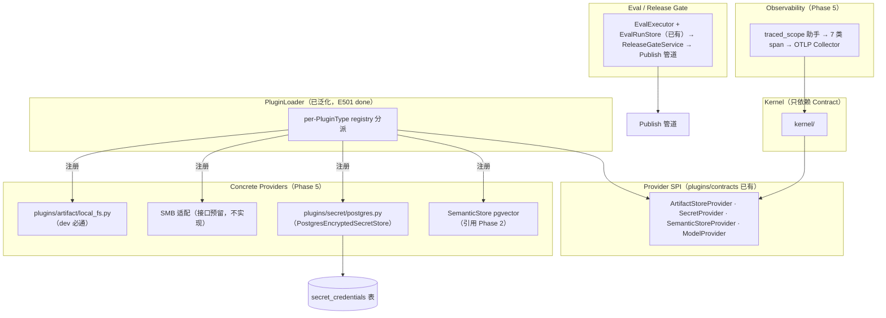

# Phase 5 Governance + Observability + Eval 设计简报

> **文档编号**: FE-P5-01
> **文档版本**: v0.1
> **创建日期**: 2026-08-28
> **文档状态**: 评审中

**评审边界说明**:
- **需求评审**: 第 2 章（需求分析）→ 通过后锁定需求基线
- **设计评审**: 第 3 章（技术设计）→ 通过后锁定设计基线

**ID 体系**: US（来自 PRD）、FEAT（功能）、SPI/API（接口）、NFR（非功能指标）
场景编号：S-（正常）、E-（异常）、B-（边界）

**范围声明**: Phase 5 为**后端生产化**（design-full 模板），含 Console Eval 实页前端小节。Extension Model 核心（PluginLoader 泛化 + PluginType 终态）已在代码落地（E501/E502 done），本简报只设计**生产 provider 接线 + 生命周期/隔离测试**。后端 Phase 2（SemanticStore pgvector）与 Phase 3（Workflow）设计简报为依赖来源。

---

## 目录

- [1. 文档控制](#1-文档控制)
- [2. 需求分析](#2-需求分析)
  - [2.1 需求概述](#21-需求概述-必填)
  - [2.2 功能方案](#22-功能方案-必填)
  - [2.3 范围与边界](#23-范围与边界-必填)
  - [2.4 验收条件](#24-验收条件-必填)
- [3. 技术设计](#3-技术设计)
  - [3.1 方案选型](#31-方案选型-必填)
  - [3.2 架构设计](#32-架构设计-必填)
  - [3.3 数据设计](#33-数据设计-必填)
  - [3.4 接口设计](#34-接口设计-必填)
  - [3.5 质量实现方案](#35-质量实现方案-必填)
- [4. 部署与运维](#4-部署与运维-按需)
- [5. 风险与依赖](#5-风险与依赖)
- [6. 需求追溯矩阵](#6-需求追溯矩阵)
- [Spec Compliance Matrix](#spec-compliance-matrix)
- [附录：术语表](#附录术语表)

---

## 1. 文档控制

### 1.1 责任人

| 角色 | 姓名 | 职责范围 |
|------|------|---------|
| 开发负责人 | Fluxion 团队 | Provider 实现、OTel 埋点、Eval/Release Gate、Async Task |
| 架构师 | jahan | SPI 形状、ADR-EXT-001 对齐、Phase 5 Gate 验收 |

### 1.2 修订历史

| 版本 | 日期 | 作者 | 变更描述 |
|------|------|------|---------|
| v0.1 | 2026-08-28 | Fluxion 团队 | 初始草稿（评审中） |

---

## 2. 需求分析

### 2.1 需求概述 [必填]

| 项目 | 内容 |
|------|------|
| **模块名称** | Phase 5 Governance + Observability + Eval（Extension Model 生产 provider / Artifact Store / Secret / OTel / Eval / Async Task） |
| **需求类型** | 架构演进 + 生产 provider 落地 + 可观测性 + 评测/发布门禁 |
| **业务背景** | v2.2 roadmap §7；PRD FEAT-14（Unified Extension Model）/ FEAT-18（ArtifactStore）/ FEAT-19（SecretProvider）/ FEAT-20（OpenTelemetry）/ FEAT-24（Eval/Release Gate）/ FEAT-25（Durable Async Task）。Extension Model 核心已在代码落地；本阶段补齐生产 provider、生产可观测性、Eval 生产化与 Release Gate，达成 Phase 5 Gate（trace 关联≥99%、Secret 明文泄漏=0、tenant escape=0、Eval Gate 可阻断 P0 回归）。 |
| **核心目标** | 让 6 个保留 PluginType 都有生产可用 provider（Artifact/Secret 落地、Semantic 接线）；生产链路 span 全覆盖且 trace 关联≥99%；Eval 可在发布前阻断 P0 回归；Secret 明文在任何面泄漏=0。 |

**已确认的设计对齐项（用户 2026-08-28 确认）**：

| # | 对齐点 | 结论 |
|---|--------|------|
| A | SecretProvider 生产后端 | PostgreSQL 持久化加密 store（密文入 `secret_credentials` 表、Master Key 外置 env、AES-256-GCM）；SPI 预留外部 KMS 扩展，不引 Vault/KMS 强依赖 |
| B | ArtifactStore provider | **生产预留 SMB 接口（不实现）**；**本地文件系统 dev provider 必须跑通**；tenant 命名空间 = 路径前缀；`artifact://` 引用入 Resource spec |
| C | OTel 范围 | 共享 `traced_scope` 上下文助手 + 7 类 span（O501–O507）；span 必带 trace_id/execution_id/tenant_id/request_id；Collector 部署 = OTLP env 接线 + 部署配置文档 |
| D | Eval Release Gate | 扩展现有 `compare()`：publish 管道前挂 `ReleaseGateService`，候选版本跑 EvalRun 对比基线，score 回退超阈值阻断 P0 发布 |
| E | Async Task | **P1 条件 FEAT**：设计 `durable_task` 表 + 无状态 worker（poll/claim/resume），仅在明确存在耗时后台逻辑时实施 |

---

### 2.2 功能方案 [必填]

| 功能ID | 功能名称 | 功能描述 | 优先级 | 来源 |
|--------|---------|---------|--------|------|
| FEAT-P5-01 | Extension Model 生产 provider 接线 + lifecycle/isolation 测试 | 将本地 dev provider（local-fs ArtifactStore / 生产 SecretProvider / pgvector SemanticStore per Phase 2）注册进 per-PluginType registry；untrusted→isolated、单 provider 故障不拖垮 Runtime（ADR-EXT-001 S-04）。E501/E502 已在代码落地，本 FEAT 不做。 | P0 | US-11 |
| FEAT-P5-02 | ArtifactStore | `ArtifactStoreProvider` SPI（已有）：**本地文件系统 dev provider（必须通）** + **SMB 生产接口预留**；tenant 命名空间；`artifact://{tenant}/{ns}/{key}@{version}` 引用模型与元数据。 | P0 | FEAT-18, US-11 |
| FEAT-P5-03 | SecretProvider 生产 | `SecretProvider` SPI（已有）+ `PostgresEncryptedSecretStore`：AES-256-GCM、Master Key 外置、`secret_credentials` 表持久化、双库契约；泄漏测试明文=0。 | P0 | FEAT-19, US-11 |
| FEAT-P5-04 | OTel 生产 | 共享 `traced_scope` 助手 + 7 类 span（HTTP/Runtime/Model/Tool·MCP/Workflow/DB·Redis/Collector）；trace 关联≥99%；OTLP Collector 部署配置。 | P0 | FEAT-20, NFR-OBS-01 |
| FEAT-P5-05 | Eval 生产 + Release Gate + Console 页 | EvalExecutor 扩展（模型评测 harness SPI + RuleBased 默认）；Workflow 用例 / Capability 契约；dataset 生命周期（EvalSet 版本化）；`ReleaseGateService` 阻断 P0 回归；Console `/build/eval` 实页（Phase 4 占位升级）。 | P0 | FEAT-24, US-05 |
| FEAT-P5-06 | Async Task（P1 条件） | `durable_task` 表 + 无状态 worker（poll/claim/resume）；V2.2 不引 Event Bus；仅明确存在耗时后台逻辑时实施。 | P1 | FEAT-25 |

---

### 2.3 范围与边界 [必填]

| 类别 | 内容 |
|------|------|
| **范围（In Scope）** | 生产 SecretProvider（PostgreSQL 持久化）；ArtifactStore local-fs dev provider + SMB 接口预留；pgvector SemanticStore 经 loader 接线（实现引用 Phase 2）；OTel 7 类 span + traced_scope + Collector 部署配置；Eval 生产化 + ReleaseGateService + Console Eval 页；Async Task 契约设计（P1 条件）。 |
| **非范围（Out of Scope）** | SMB/外部 KMS 的生产实现（仅预留接口）；Event Bus（V2.2 明确不引入）；Extension Model 核心（E501/E502 已落地）；pgvector 底层实现细节（Phase 2 设计简报）；Eval 页的交互深设计（复用 Phase 4 前端模式）。 |
| **有意妥协 / 技术债** | ArtifactStore 生产走 SMB 预留（本阶段不实现），生产能力依赖后续 SMB 适配；Eval 模型评测 harness 为 SPI 预留，默认 RuleBased（真实模型评测需凭据，S-P13-07 约束不伪造）；Async Task 为条件 FEAT（无耗时逻辑则不启用）。 |

---

### 2.4 验收条件 [必填]

**正常场景**

| 场景ID | 功能ID | 优先级 | 测试层级 | 关键真实边界 | 前置条件 | 操作步骤 | 预期结果 |
|--------|--------|--------|---------|-------------|---------|---------|---------|
| S-01 | FEAT-P5-02 | P0 | integration | 真实文件系统（tmp 目录）→ ArtifactStoreProvider | local-fs provider 已注册 | put → get → delete artifact | 内容一致；元数据（size/sha256/version）正确；tenant 命名空间隔离 |
| S-02 | FEAT-P5-03 | P0 | integration | 真实 DB（SQLite+PG 双库契约） | `secret_credentials` 表就绪 + Master Key 外置 | put → 重启 store → resolve → revoke → resolve | 持久化 resolve 一致；revoke 后 resolve 拒绝；密文非明文 |
| S-03 | FEAT-P5-03 | P0 | integration | CredentialResolver + 双租户 | tenant A/B 各持 secret | tenant A 引用 tenant B ref | `secret_tenant_mismatch` 拒绝（tenant escape=0） |
| S-04 | FEAT-P5-04 | P0 | E2E | 完整 execution：HTTP→Runtime→Model→Tool→Workflow→DB/Redis | traced_scope 已接线 | 跑一次真实 execution | 全链路 span 携带 trace_id/execution_id/tenant_id/request_id；关联完整率≥99% |
| S-05 | FEAT-P5-05 | P0 | integration | EvalSet（workflow 类型用例）+ EvalExecutor | EvalSet 含 workflow 用例 | start EvalRun | score/passed 正确；EvalRun 记录可查 |
| S-06 | FEAT-P5-05 | P0 | E2E | Publish 管道 + ReleaseGateService + EvalRun | 候选版本 score < 基线阈值 | 触发 publish | publish 被阻断 + 明确诊断（score delta） |
| S-07 | FEAT-P5-05 | P0 | E2E | Publish 管道 + ReleaseGateService | 候选版本 score ≥ 阈值 | 触发 publish | publish 放行，EvalRun 记录留档 |
| S-08 | FEAT-P5-05 | P0 | E2E | Browser → Router → Service → Eval API | Console Eval 页已升级 | 打开 `/build/eval` 查看 EvalSet/Run 列表 | 列表/详情/触发评测可见（四态完备） |
| S-09 | FEAT-P5-06 | P1 | integration | 真实 DB + worker | Async Task 已启用（条件） | enqueue → claim → 完成/失败 | 任务状态正确；失败可重试；无重复执行（幂等） |

**异常场景**

| 场景ID | 功能ID | 测试层级 | 关键真实边界 | 触发条件 | 系统行为 | 用户感知 |
|--------|--------|---------|-------------|---------|---------|---------|
| E-01 | FEAT-P5-03 | integration | 日志/trace/spec/response 扫描 | Secret 明文出现在任意面 | 泄漏检测测试失败（明文=0 门禁） | CI 阻断合入 |
| E-02 | FEAT-P5-02 | integration | ArtifactStoreProvider tenant scope | tenant A 读 tenant B 的 artifact key | 拒绝访问（tenant escape=0） | 明确错误，无数据返回 |
| E-03 | FEAT-P5-04 | integration | span 完整性扫描 | 某 span 缺 trace_id/execution_id | 关联完整性测试失败（≥99% 门禁） | CI 阻断合入 |
| E-04 | FEAT-P5-05 | integration | ReleaseGateService + EvalRunStore | 基线 run 不存在 | 阻断 + 明确错误「基线不可用」 | publish 被阻断并提示重跑基线 |

**边界场景**

| 场景ID | 功能ID | 测试层级 | 关键真实边界 | 触发条件 | 预期行为 |
|--------|--------|---------|-------------|---------|---------|
| B-01 | FEAT-P5-02 | integration | SMB provider 注册点 | 配置 SMB 生产 provider（未实现） | 明确「SMB 未实现」错误或降级 dev provider，不崩溃 |
| B-02 | FEAT-P5-03 | unit | `FLUXION_SECRET_MASTER_KEY` env | Master Key 缺失/长度≠32 | 启动明确报错，不静默生成 |
| B-03 | FEAT-P5-04 | unit | OTLP exporter 包存在性 | otlp exporter 缺失 | 降级不 export + warning，不阻断服务 |
| B-04 | FEAT-P5-06 | unit | Async Task 开关 | 无耗时后台逻辑，未启用 | 功能关闭无副作用 |

**非功能指标**

| 指标ID | 指标名称 | 目标值 | 测量方法 |
|--------|---------|-------|---------|
| NFR-SEC-01 | Secret 明文泄漏 | =0 | 泄漏检测测试（E-01） |
| NFR-OBS-01 | Trace 关联完整率 | ≥99% | 关联完整性扫描（E-03 + S-04） |
| NFR-ARCH-05 | 扩展模型统一 | 6 保留 PluginType 全有 provider 或显式预留 | 架构测试（S-01/B-01） |
| NFR-PERF-01 | Eval/Release Gate 附加延迟 | publish P95 增量 ≤ 500ms | ReleaseGateService 计时 |

---

## 3. 技术设计

### 3.1 方案选型 [必填]

| 类别 | 选型 | 版本 | 选型理由 |
|------|------|------|---------|
| SecretProvider 生产 | `PostgresEncryptedSecretStore`（AES-256-GCM + `secret_credentials` 表） | stdlib cryptography | 与现有 `LocalEncryptedSecretStore` 同形；Master Key 外置 env（规则 17）；复用双库契约；SPI 预留外部 KMS |
| ArtifactStore 生产 | **SMB 接口预留**（不实现）；dev 用 local-fs provider | — | 用户明确：生产走 SMB 但本阶段只预留接口，保证 dev 通 |
| ArtifactStore dev | `LocalFileArtifactStore`（tenant 前缀目录） | stdlib | 必须跑通；dev SQLite 平行 |
| OTel | `traced_scope` 上下文助手 + 7 类 span | opentelemetry（已依赖） | 统一埋点入口；span 携带关联字段；Collector 走 OTLP env |
| Eval | `EvalExecutor` SPI + RuleBased 默认 + 模型评测 harness 预留 | 已有 eval_app | 默认确定性；真实模型评测需凭据（S-P13-07） |
| Release Gate | `ReleaseGateService` 挂 publish 管道 | 已有 eval compare() | 阻断 P0 回归；阈值按 EvalSet 配置 |
| Async Task | `durable_task` 表 + 无状态 worker | — | P1 条件；V2.2 不引 Event Bus |

**关键决策记录**

| 决策点 | 选择 | 被否决项 | 理由 |
|--------|------|---------|------|
| Secret 生产后端 | PostgreSQL 持久化 AES-256-GCM | 外部 Vault/KMS | 简单、与现有同形、满足规则 17；SPI 留扩展 |
| ArtifactStore 生产 | SMB 接口预留 | S3/MinIO | 用户指定；本阶段不实现，dev 通 |
| OTel 范围 | 统一 `traced_scope` | 每类手写埋点 | 单一入口保证关联字段一致；可测 |
| Eval 评测器 | SPI + RuleBased 默认 | 直接上模型评测 | 默认确定性可测；模型 harness 预留 |
| Async Task | P1 条件 | 直接实现 | roadmap P1；无耗时逻辑不启用 |

---

### 3.2 架构设计 [必填]

**Provider 注册与隔离**：concrete providers 只实现 Protocol，由 PluginLoader 在运行期注册（ADR-EXT-001）；untrusted provider 走 ADR-010 既有 `TrustLevel`/`execution_mode` 强制（S-04 场景在 ADR-EXT-001 已定义，本阶段补 E506 测试）。

**OTel 埋点清单（7 类 span，O501–O507）**

| 编号 | 类别 | 埋点位置 | span 名 | 关联字段 |
|------|------|---------|--------|---------|
| O501 | HTTP | `api/console_routes_*` / `api/channel.py` | `http.{method}.{route}` | trace_id/request_id/tenant_id |
| O502 | Runtime | `runtime/` execution 编排 | `runtime.execution` | trace_id/execution_id |
| O503 | Model | `runtime/model_providers.py` | `model.complete` | trace_id/execution_id/model |
| O504 | Tool/MCP | `runtime/tool_*` / `runtime/mcp.py` | `tool.call` / `mcp.call` | trace_id/execution_id/tool |
| O505 | Workflow | Phase 3 `runtime/workflow_dbos.py` | `workflow.step` | trace_id/execution_id/workflow_id |
| O506 | DB/Redis | `registry/store.py` / Redis cache | `db.query` / `redis.cache` | trace_id/tenant_id |
| O507 | Collector | OTLP env 接线 + 部署配置 | — | 统一导出 |

> 所有 span 经 `traced_scope` 助手创建，保证关联字段一致；红色内容经 `observability/redaction.py` 脱敏（Secret 明文不进 span）。

---

### 3.3 数据设计 [必填]

**`secret_credentials` 表（新增）**

| 字段 | 类型 | 约束 | 说明 |
|------|------|------|------|
| `tenant_id` | text | PK part | 租户 |
| `ref` | text | PK part | `secret://{tenant}/{name}@{version}` |
| `name` | text | — | 凭据名 |
| `version` | text | — | 版本 |
| `nonce` | bytea | — | AES-256-GCM 12B nonce |
| `ciphertext` | bytea | — | 密文（绝不存明文） |
| `revoked` | bool | default false | 撤销标记 |
| `created_at` | timestamptz | — | 创建时间 |

> 双库契约：SQLite + PostgreSQL 实现同一 `SecretStore`/`SecretMetadataStore` Repository 契约并跑同一 Contract Test（规则 7）。

**Artifact 引用模型（无独立表）**

- Resource spec / ExecutionSnapshot 中以 `artifact://{tenant}/{namespace}/{key}@{version}` URI 引用（pin 进 snapshot，规则 6/10）。
- 元数据由 provider 返回 `ArtifactMetadata(ref/tenant/namespace/key/version/size/sha256/created_at)`，不落独立表（对象存储自身即事实源）。

**`durable_task` 表（P1 条件）**

| 字段 | 类型 | 说明 |
|------|------|------|
| `task_id` | text PK | 幂等键 |
| `tenant_id` | text | 租户 |
| `payload` | jsonb | 任务载荷 |
| `status` | text | pending/claimed/done/failed |
| `attempts` | int | 重试次数（有限） |
| `claimed_at` / `done_at` | timestamptz | 状态时间 |
| `created_at` | timestamptz | 入队时间 |

**索引**：`secret_credentials(tenant_id, name)`；`durable_task(status, claimed_at)`（worker 轮询）。

---

### 3.4 接口设计 [必填]

**SPI（已有，不重定义）**：`ArtifactStoreProvider`（put/get/delete(tenant_id, namespace, key)）、`SecretProvider`（resolve(tenant_id, secret_ref)）、`SemanticStoreProvider`（store/recall/search(tenant_id, user_id, ...)）。

**新增实现/契约**

| 接口 | 签名/形状 | 说明 |
|------|---------|------|
| `LocalFileArtifactStore` | `put(tenant_id, namespace, key, data) -> ArtifactMetadata`；`get(...) -> bytes`；`delete(...) -> None` | dev provider；目录前缀 `{root}/{tenant_id}/{namespace}/{key}`；timeout/fail policy 明确 |
| `PostgresEncryptedSecretStore` | `put/rotate/revoke/resolve/list_metadata(tenant_id, ...)` | 与 `LocalEncryptedSecretStore` 同形；密文入表；Master Key 外置 |
| `traced_scope` | `async with traced_scope(name, kind=..., attributes={}): ...` | 统一 span 入口；自动挂 trace_id/execution_id/tenant_id/request_id；自动脱敏 |
| `ReleaseGateService` | `async evaluate(release_id, candidate_eval_run_id, baseline_run_id, threshold) -> GateDecision` | 挂 publish 管道；score 回退超阈值 → blocked |
| Eval API 扩展 | `GET /admin/evals` / `POST /admin/evals/{id}/run` / `GET /admin/evals/runs` | Console Eval 页消费；envelope 封装（`{code,message,data,request_id}`） |

> `ReleaseGateService` 复用 `EvaluationApplicationService.compare()`；blocked 决策含 score_delta 与原因。

---

### 3.5 质量实现方案 [必填]

#### 性能设计

- Eval/Release Gate 不阻塞 publish 主路径：评测结果异步落 EvalRunStore，publish 等待 gate 决策（超时 ≤ 2s，超时 fail-closed 阻断并记录）。
- provider 外部 IO 全部定义 timeout（规则 18）：artifact put/get、secret resolve 均带 deadline。

#### 可靠性设计

| 风险ID | 失效模式 | 应对 | 验证场景 |
|--------|---------|------|---------|
| RISK-P5-01 | provider 注册失败留 partial registry | 沿用 loader 既有回滚（E-01 ADR-EXT-001） | S-01/B-01 |
| RISK-P5-02 | Master Key 缺失/错误 | 启动 fail-fast（B-02） | B-02 |
| RISK-P5-03 | Secret 明文泄漏 | redaction 全链路 + 泄漏检测测试（E-01） | E-01 |
| RISK-P5-04 | Release Gate 基线不可用 | 阻断 + 明确错误（E-04） | E-04 |
| RISK-P5-05 | Async Task 重复执行 | 幂等键（task_id）+ 有限重试 | S-09 |

#### 安全性设计

- Secret 明文不进 spec/日志/trace/响应（规则 17）；`secret_credentials` 只存密文。
- Provider 方法首参 `tenant_id` 强制；CredentialResolver 收口 tenant（已有 `secret_tenant_mismatch`）。
- Artifact/Secret/Semantic 查询全部带 tenant scope（NFR-SEC-01）。

#### 可观测性设计

- 7 类 span 全链路（O501–O507）；span 关联字段一致（trace_id/execution_id/tenant_id/request_id）。
- 日志/Audit/Trace 关联 request_id/trace_id（规则 23）；Secret 相关操作进 AuditLog（规则 24：publish/revoke secret）。

---

## 4. 部署与运维 [按需]

| 环境 | Provider 配置 | OTel | 说明 |
|------|--------------|------|------|
| dev | local-fs ArtifactStore + `PostgresEncryptedSecretStore`（SQLite）+ pgvector dev | 无 exporter（本地 TracerProvider） | 一键启动可用 |
| prod | SMB 适配（预留，未实现时 local-fs 或显式报错）+ PostgreSQL Secret + pgvector | `FLUXION_OTLP_ENDPOINT` → OTLP Collector | Collector 部署配置文档（O507） |
| 发布回滚 | Publish 管道挂 ReleaseGateService；rollback 复用既有治理 | — | 阻断决策留档 AuditLog |

**Master Key 部署**：`FLUXION_SECRET_MASTER_KEY`（base64 32B）经部署 secret 注入，不进代码/仓库。

---

## 5. 风险与依赖

| 依赖 | 内容 | 状态 | 风险 |
|------|------|------|------|
| Phase 2 简报 | SemanticStore pgvector 实现细节 | 设计已过 gate，未实现 | 中（接线依赖其落地） |
| Phase 3 简报 | Workflow OTel span（O505）与 execution 链路 | 设计已过 gate，未实现 | 中 |
| SMB | ArtifactStore 生产适配 | 本阶段不实现（预留） | 高（生产 Artifact 能力缺失，记录为技术债） |
| 真实模型凭据 | Eval 模型评测 harness | 无凭据则保持 RuleBased（S-P13-07） | 中（不伪造 GREEN） |
| Async Task | 耗时后台逻辑是否明确 | P1 条件 | 低（不启用即无副作用） |

---

## 6. 需求追溯矩阵

| 用户故事/来源 | 功能ID | 接口/表 | 测试用例ID | 测试层级 | 状态 |
|---------|--------|---------|-----------|---------|------|
| US-11 | FEAT-P5-01 | Provider 注册 + loader | S-01, B-01 | integration | 待实现 |
| FEAT-18 | FEAT-P5-02 | `LocalFileArtifactStore` + `artifact://` | S-01, E-02, B-01 | integration | 待实现 |
| FEAT-19 | FEAT-P5-03 | `PostgresEncryptedSecretStore` + `secret_credentials` | S-02, S-03, E-01, B-02 | integration | 待实现 |
| FEAT-20 | FEAT-P5-04 | `traced_scope` + 7 span | S-04, E-03, B-03 | E2E | 待实现 |
| FEAT-24 | FEAT-P5-05 | `ReleaseGateService` + Eval API | S-05~S-08, E-04 | E2E | 待实现 |
| FEAT-25 | FEAT-P5-06 | `durable_task` + worker | S-09, B-04 | integration | P1 条件 |

> 矩阵闭合：每个 FEAT 有来源✓、有验收场景✓；每个场景有测试层级与关键真实边界✓；Phase 5 Gate 四项（trace≥99% / 明文泄漏=0 / tenant escape=0 / Eval 阻断 P0）各映射到场景（S-04+E-03 / E-01 / S-03+E-02 / S-06+S-07）。

---

## Spec Compliance Matrix

| Spec/Rule | enforcement | 设计影响 | 设计落点 | 验证场景 | 状态/N/A 理由 |
|-----------|-------------|---------|---------|---------|----------------|
| `fluxion-runtime-core#RULE-fluxion-runtime-001` | required | Kernel 只依赖 Contract；providers 经 loader 注册，Kernel 经 registry 间接 resolve | §3.2 架构图 + §3.4 SPI | S-01、B-01 | applied |
| `fluxion-resource-registry#RULE-fluxion-resource-001` | required | `artifact://` 引用入 spec/snapshot；EvalSet 版本化 | §3.3 Artifact 引用模型 + §2.2 FEAT-P5-05 | S-05、S-06 | applied |
| `fluxion-dfx#RULE-fluxion-dfx-001` | required | provider 外部 IO 全 timeout；Release Gate 异步不阻塞 | §3.5 可靠性/性能 + §3.4 | S-06、S-07、B-01 | applied |
| `fluxion-workflow-capability#RULE-fluxion-workflow-001` | required | Eval Workflow 用例 / Capability 契约评测对齐能力层 | §2.2 FEAT-P5-05 + §3.4 Eval API | S-05、S-06 | applied |
| `fluxion-console-api-contract#RULE-fluxion-console-api-001` | required | Eval API envelope 统一；Release Gate 决策走标准响应 | §3.4 Eval API 扩展 | S-08、E-04 | applied |
| `backend-code-quality-performance#RULE-backend-quality-001` | required | provider 全类型注解、禁静默吞异常、timeout/fail policy | §3.4 接口 + §3.5 | S-01~S-09、E-01 | applied |
| `backend-directory-structure#RULE-backend-directory-001` | required | provider 落 `plugins/artifact` `plugins/secret`；深度≤3 | §3.2 架构 + 契约落点 | S-01、S-02 | applied |
| `backend-database#RULE-backend-database-001` | required | `secret_credentials`/`durable_task` 表；双库契约共享 | §3.3 数据设计 | S-02、S-09、B-02 | applied |
| `backend-logging#RULE-backend-logging-001` | required | Secret 操作 AuditLog；明文脱敏 | §3.5 可观测性 | E-01 | applied |
| `backend-platform-rules#RULE-backend-platform-001` | required | Eval/Release Gate 走控制面 API；阻断决策留档 | §3.4 + §4 发布回滚 | S-06、S-08 | applied |
| `frontend-semi-design#RULE-frontend-semi-001` | required | Console Eval 页全 Semi | §2.2 FEAT-P5-05 + 复用 Phase 4 模式 | S-08 | applied |
| `frontend-quality-standards#RULE-frontend-quality-001` | required | Eval 页经 services、四态完备 | §2.2 + Phase 4 §3.5/§3.6 | S-08、E-04 | applied |
| `frontend-directory-structure#RULE-frontend-directory-001` | required | Eval 页 `src/pages/eval/` | §2.2 + Phase 4 §3.2 | S-08 | applied |
| `frontend-component-specs#RULE-frontend-component-001` | required | Eval 页容器/展示分离 | §2.2 + Phase 4 §3.3/§3.4 | S-08 | applied |

---

## 附录：术语表

| 术语 | 定义 |
|------|------|
| Provider SPI | 服务提供者接口，每个 PluginType 对应的 typed Protocol |
| 生产 provider | 生产环境可用的 provider 实现（本阶段：PostgresEncryptedSecretStore / LocalFileArtifactStore；SMB 预留） |
| Release Gate | 发布前 EvalRun 对比基线的门禁，score 回退超阈值阻断 P0 发布 |
| traced_scope | 统一 OTel span 上下文助手，自动挂关联字段与脱敏 |
| tenant escape | 跨租户越权访问（本 Phase Gate 要求 =0） |
| durable_task | P1 条件：PostgreSQL 持久化任务表 + 无状态 worker |

---

*文档结束*
