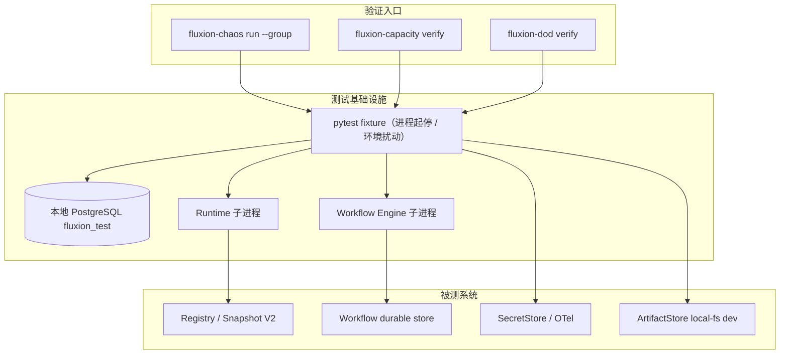
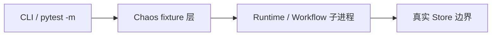

# Phase 6 加固与规模化发布（Hardening + Scale + Release）设计简报

> **文档编号**: MOD-PHASE6-001
> **文档版本**: v0.1
> **创建日期**: 2026-08-28
> **文档状态**: 设计评审中

**评审边界说明**:
- **设计评审**: 第 3-4 章（技术设计 + 部署运维）→ 通过后锁定设计基线 v0.1
- **交接契约**: 2.5 验收条件 — 需求定义 What，设计实现 How

**ID 体系**: FEAT（功能）、API（接口）、RULE（业务规则/系统约束）、NFR（非功能指标）
场景编号：S-（正常）、E-（异常）、B-（边界）

**范围来源**: `fluxion-v2.2-architecture-remediation-roadmap.md` §8（Phase 6；该 roadmap 已随 docs v2 基线切换移除，git 历史可查），承接 Phase 1-5 已落地设计与实现。本阶段为**加固 + 验证 + 发布**性质，不新增业务功能；架构验收同步对齐 `docs/development/架构验收Gate.md`（G1~G9）。

---

## 目录

- [1. 文档控制](#1-文档控制)
- [2. 需求分析](#2-需求分析)
- [3. 技术设计](#3-技术设计)
- [4. 部署与运维](#4-部署与运维)
- [5. 风险与依赖](#5-风险与依赖)
- [6. 需求追溯矩阵](#6-需求追溯矩阵)
- [Spec Compliance Matrix](#spec-compliance-matrix)
- [附录：术语表](#附录术语表)

---

## 1. 文档控制

### 1.1 责任人

| 角色 | 姓名 | 职责范围 |
|------|------|---------|
| 开发负责人 | fluxion | 技术方案、验证套件实现 |
| 测试负责人 | fluxion | Chaos / Scale / DoD 自动化证据 |

### 1.2 修订历史

| 版本 | 日期 | 作者 | 变更描述 |
|------|------|------|---------|
| v0.1 | 2026-08-28 | Claude | 初始草稿（对齐点 A-E 用户已确认） |
| v0.2 | 2026-08-28 | jahan | 按 `fluxion-phase1-closure-detailed-remediation.md` §17（历史文档，git 历史可查）修订：SurfaceEvidence 客观字段 schema + 三级分类 + UNKNOWN 保守规则（§17.1，新增 B-05）；RPO 拆 App/Infrastructure 两层（§17.2）；等价性主键对齐 agent（§13.1 级联） |
| v0.3 | 2026-08-28 | jahan | 按 docs v2 基线（`docs/migration/当前代码偏差与迁移.md` P0-3/P0-4/P0-5 + 架构验收 Gate G3/G5/G7）新增 FEAT-P6-05「真实部署 Gate 与生产运行边界」：S-07（真实 k8s 多副本 G3）、S-08（停 Console 继续运行 G7）、S-09（本地状态审计 G5）、E-07（InMemory 唯一实现 fail-fast）、E-08（本地 scheduler 守卫）+ RULE-P6-05；G8/P14 列为显式 P1 移交（§5.3） |
| v0.4 | 2026-08-29 | Claude | 登记 phase5 review 遗留「生产装配」为 FEAT-P6-06（S-10）：真实 provider 接线（PostgresEncryptedSecretStore / S3CompatibleArtifactStore / Operations DBOS sysdb / release_gate_enforced=True）+ 与 FEAT-P6-05 ④ 协同的 production fail-fast |

---

## 2. 需求分析

### 2.1 需求概述 [必填]

| 项目 | 内容 |
|------|------|
| **模块名称** | Phase 6 加固与规模化发布 |
| **模块ID** | MOD-PHASE6-001 |
| **所属系统/产品线** | Fluxion v2.2 remediation roadmap |
| **需求类型** | 技术重构 / 性能优化 / 质量加固 |
| **业务背景** | v2.2 六阶段 rolling wave 的收尾阶段：Phase 1-5 已落地领域/存储、User Context/Memory、DBOS Workflow、产品体验、治理/可观测/Eval，但缺少**容量锁定、故障恢复验证、一次性迁移、最终 DoD 验收** |
| **核心目标** | 以自动化证据锁定容量契约、验证三类故障恢复、执行受控迁移/清理，并通过 14 项 Final DoD 验收，达到可发布状态 |

### 2.2 痛点与价值 [必填]

| 维度 | 内容 |
|------|------|
| **目标用户** | Fluxion 平台维护者 / 部署运维团队 / 质量与发布负责人 |
| **当前问题** | ①容量无契约，性能 SLO 缺复核；②故障恢复行为无自动化断言（kill/重启/failover 后是否正确恢复未知）；③遗留兼容路径（dead PluginType、`spec_json.get`、伪 `_summarize`）未清理；④Final DoD 14 项多为人工核对，缺可重复验证 |
| **业务影响** | 无法可靠声明"可发布"；故障场景行为不可预期；遗留代码长期积累技术债 |
| **预期价值** | 14 项 DoD 全部可自动化验证，发布有门禁；故障恢复有 SLO 证据；遗留路径清零 |

### 2.3 功能方案 [必填]

#### 2.3.1 功能清单

| 功能ID | 功能名称 | 功能描述 | 优先级 | 来源 |
|--------|---------|---------|--------|------|
| FEAT-P6-01 | Capacity Profile 契约 | 锁定 7 项容量数字为 V1 契约；scale-test 实测复核并收紧 SLO | P0 | roadmap §8.1 |
| FEAT-P6-02 | Chaos 测试套件 | Runtime / Workflow / Storage 三组故障注入 + 恢复断言 | P0 | roadmap §8.2 |
| FEAT-P6-03 | One-time Migration/Rollover | 仅真实外部依赖触发的双写→校验→切换→删旧；legacy 清理 | P0 | roadmap §8.3 |
| FEAT-P6-04 | Final DoD 自动化验收套件 | roadmap 14 项 DoD 每项一个 verifier，Release 门禁 | P0 | roadmap §8.4 |
| FEAT-P6-05 | 真实部署 Gate 与生产运行边界 | ①真实 k8s ≥2 副本部署 Gate（rolling restart/kill pod，P0-3/G3，承接 Phase 2 移交）；②停 Console 后已发布 Agent 继续运行（G7/ARCH-14）；③本地状态审计脚本（G5）；④production profile 禁止 InMemory Trace/Approval/Eval 唯一实现（fail-fast，P0-5）；⑤RuntimeScheduler 本地实现限定 test/dev（fail-fast，P0-4） | P0 | migration P0-3/P0-4/P0-5 + Gate G3/G5/G7 |
| FEAT-P6-06 | Phase 5 生产装配（真实 provider 接线） | 将 phase5 生产 provider 从测试/占位装配进生产 app（composition root）：`PostgresEncryptedSecretStore`（PG AES-256-GCM 替代内存 store）、`S3CompatibleArtifactStore`（S3/MinIO）、Operations 运营端点（DBOS sysdb DSN）、`release_gate_enforced=True`（phase5 P1-7 强制语义落地）；与 FEAT-P6-05 ④ 协同——production profile 下 InMemory Secret/Approval/Eval/Trace 唯一实现 fail-fast | P0 | phase5 review P1-7 + phase5 review P2（Secret/Artifact/Operations 无生产装配点） |

#### 2.3.2 字段约束

**FEAT-P6-01 Capacity Profile V1 契约值（用户已确认）**

| 维度 | V1 契约值 | 说明 |
|--------|---------|------|
| tenant 数 | 50 | 初始契约 |
| users/tenant | 1,000 | 初始契约 |
| concurrent sessions | 5,000 | 每 session 一次 Execution |
| Runtime replicas | 10 | 每 replica 承接 500 并发 session（推导） |
| workflow concurrency | 100 | 同时运行 Workflow 实例数 |
| MCP servers/user | 5 | 每用户 MCP 接入上限 |
| memories/user | 1,000 | 每用户 Memory 条目上限 |

**SurfaceEvidence 客观分类（remediation §17.1）**

| 证据字段 | 类型 | 说明 |
|---------|------|------|
| `active_record_count` | int | 活跃记录数（token/channel/绑定） |
| `active_token_count` | int | 有效 access token 数 |
| `enabled_integration_count` | int | 启用的外部集成数 |
| `traffic_30d` | int | 近 30 天请求量 |
| `last_used_at` | datetime \| None | 最近使用时间 |
| `known_external_consumer` | bool | 已知外部消费方 |
| `public_stable_contract` | bool | 是否公开稳定契约 |
| `evidence_source` | text | 证据来源（表/指标名） |

分类规则：`EXTERNAL_ACTIVE`（任一证据命中 → 只可 Rollover 双写）/ `RESET_ALLOWED`（全部证据为零且无外部消费 → 直接 reset）/ `UNKNOWN`（证据不足 → **按 EXTERNAL_ACTIVE 处理，禁止 destructive reset**，保守默认）。

> 契约规则：V1 值经 scale-test 实测后**只允许收紧、不允许放松**（RULE-P6-01）。数值为设计契约初始值，以 scale-test 实测为准，禁止编造实测数据。

### 2.4 范围与边界 [必填]

| 类别 | 内容 |
|------|------|
| **范围（In Scope）** | ①Capacity Profile 契约文档 + scale-test 压测套件；②Chaos 套件（进程 kill/重启、cache 失效、PG 连接中断、ArtifactStore 不可达、SemanticStore 降级、workflow activity timeout/duplicate delivery）；③One-time Migration/Rollover 流程与 legacy 清理；④Final DoD 14 项自动化验收套件；⑤真实部署 Gate 与生产运行边界（FEAT-P6-05：本地 k8s 多副本 G3、停 Console G7、本地状态审计 G5、InMemory/本地 scheduler 生产守卫 P0-4/P0-5） |
| **非范围（Out of Scope）** | 新增业务功能；新增外部依赖；**生产级 chaos-mesh 工具化演练**（本地以进程级注入 + 本地 k8s 部署 Gate 等价覆盖，见 FEAT-P6-05/S-07）；SemanticStore 生产实现（Phase 2 预留）；SMB ArtifactStore 实现（Phase 5 已落地 S3Compatible 生产 provider，SMB 仍为预留接口） |
| **前置假设** | 本地 dev 环境存在真实 PostgreSQL（mmuser/fluxion_test，见 [[local-pg-test-env]]）；Runtime/Workflow Engine 可在本地以子进程方式启动/杀死；**本地 k8s 集群可用（S-07 真实部署 Gate 载体）**；已落地 Phase 2 Snapshot V2 digest、Phase 3 DBOS Workflow、Phase 5 SecretStore/OTel/Eval |
| **有意妥协 / 技术债** | 工具化混沌演练（chaos-mesh）推迟到真实生产部署后；本地以进程级注入（故障语义）+ 本地 k8s 部署 Gate（S-07，部署语义）双层等价覆盖。无真实外部凭据的 live smoke 保持 planned，**绝不伪造 GREEN**（约束继承自 [[sp13-07-live-smoke-constraint]]） |

### 2.5 验收条件 [必填]

#### 2.5.1 业务规则与约束

| ID | 类型 | 描述 | 验证场景 |
|----|------|------|---------|
| RULE-P6-01 | 系统约束 | Capacity Profile V1 值只允许收紧、不允许放松；修改须设计评审 | B-01 |
| RULE-P6-02 | 系统约束 | Chaos 场景不得 mock 关键真实边界（Runtime 进程 / Store / 外部 activity） | S-02..S-04、E-01..E-06 |
| RULE-P6-03 | 业务规则 | Rollover 只在 SurfaceEvidence 判定存在真实外部依赖时执行；否则直接 reset，不建双写；**UNKNOWN 一律按 EXTERNAL_ACTIVE 处理，禁止 destructive reset**（remediation §17.1） | S-05、B-03 |
| RULE-P6-04 | 系统约束 | Final DoD 14 项全过才允许 Release；任一失败阻断发布 | S-06 |
| RULE-P6-05 | 系统约束 | 生产运行边界 fail-closed：production profile 禁止 InMemory Trace/Approval/Eval 作为唯一实现、禁止本地 scheduler 承载生产任务（启动 fail-fast 或显式 production adapter）；durable facts 只在外置 Store（P0-4/P0-5，REQ-SCH-001/REQ-OBS-002/REQ-SEC-006） | S-08、S-09、E-07、E-08 |

#### 2.5.2 功能验收场景

> 场景即测试用例来源（§6 追溯矩阵引用）。测试层级限 `unit` / `integration` / `E2E` / `manual`。跨 Runtime + Store + 运行时生成边界标 `E2E`。**关键真实边界**在编码阶段不得降级为 mock。

**正常场景**

| 场景ID | 功能ID | 优先级 | 测试层级 | 关键真实边界 | 前置条件 | 操作步骤 | 预期结果 |
|--------|--------|--------|---------|-------------|---------|---------|---------|
| S-01 | FEAT-P6-01 | P0 | E2E | 真实 PostgreSQL + Runtime | V1 容量契约已锁定；scale-test 环境就绪 | 按 V1 契约构造负载（50 tenant / 5000 sessions）运行 scale-test | 全部性能 SLO 达标；记录实测值，V1 契约保持或收紧 |
| S-02 | FEAT-P6-02 | P0 | E2E | Runtime 真实进程 + Registry | 已发布并消费中的 ExecutionSnapshot | kill Runtime 进程 → 等待 → 重启 → 恢复 | 恢复 P95≤30s；恢复后跨 pod Snapshot digest 一致率=100% |
| S-03 | FEAT-P6-02 | P0 | E2E | Workflow Engine + durable store | 运行中的 Workflow 实例 | 重启 workflow backend → 恢复 | 恢复 P95≤60s；已提交 durable state 无丢失；无重复 side effect |
| S-04 | FEAT-P6-02 | P0 | E2E | 真实 PostgreSQL | 已提交事务的数据 | 模拟 PG 连接中断/failover → 恢复 | 已提交 durable state RPO=0；恢复后数据完整 |
| S-05 | FEAT-P6-03 | P0 | E2E | 真实外部依赖（如有） | SurfaceEvidence 判定存在真实外部依赖 | 双写 → 一致性校验 → 切换 → 删旧 | 全流程成功；旧路径删除后无回归 |
| S-06 | FEAT-P6-04 | P0 | E2E | 全套件边界 | 上述验收已过 | 运行 Final DoD 验收套件 | 14 项全过；Release 门禁通过 |
| S-07 | FEAT-P6-05 | P0 | E2E | 本地 k8s 真实集群 ≥2 RuntimeInstance 副本（共享 PG/Redis） | 部署就绪、无 sticky session | rolling restart → kill 任一副本 → 新请求打到存活副本 → 扩/缩容 | digest 一致率=100%；committed durable state RPO=0；Agent/User/Session/Memory/Binding/Credential/Approval/Workflow facts 零丢失（G3，P0-3，承接 Phase 2 移交） |
| S-08 | FEAT-P6-05 | P0 | E2E | 已发布 Agent 运行中 → 停止 Console 进程 | 已发布 AgentDefinition 存在并有流量 | 停 Console → 继续发起执行 → 核查 Runtime 配置来源 | 已发布 Agent 执行不受影响；Runtime 不调用 Console API 获取配置 truth（G7/ARCH-14） |
| S-09 | FEAT-P6-05 | P0 | integration | Runtime 进程内全部 dict/list/cache | 审计脚本就绪 | 运行 local state audit 扫描并逐项标注 | 全部标注为 Ephemeral/Cache/Durable/SoT；Durable/SoT 本地命中 = 0；Scheduler/Trace/Approval/Eval/Workflow Stub 全覆盖（G5） |
| S-10 | FEAT-P6-06 | P0 | integration | 真实 PG secret（AES-256-GCM）+ S3/MinIO artifact + enforced gate + Operations 真实端点 | phase5 生产 provider 已装配 | production 装配集成测试：put/rotate secret → S3 artifact put/get → publish 带 gate → Operations 端点 | Secret 落 PG 密文、artifact 落 S3 + metadata 表、gate 强制（无 gate 参数 publish fail-closed）、Operations 返回真实 DBOS 状态；production profile 下 InMemory Secret/Approval/Eval/Trace fail-fast |

**异常场景**

| 场景ID | 功能ID | 测试层级 | 关键真实边界 | 触发条件 | 系统行为 | 用户感知 |
|--------|--------|---------|-------------|---------|---------|---------|
| E-01 | FEAT-P6-02 | integration | Cache + Registry | cache 失效/flush（Redis 未接线时以内存 cache flush 等价） | L1 miss 自动降级 L2，数据无损 | 无 |
| E-02 | FEAT-P6-02 | integration | 外部 activity 真实调用 | external activity timeout | fail policy 触发，有界重试后显式失败或补偿 | 任务标记失败可重试，不悬挂 |
| E-03 | FEAT-P6-02 | E2E | Workflow Engine + durable store | 重复投递（同 event 二次送达） | 幂等执行，仅一次 side effect | 无重复副作用 |
| E-04 | FEAT-P6-02 | integration | ArtifactStore（local-fs dev） | ArtifactStore 指向不可达路径 | 显式失败，不损坏已存 artifact | 明确的失败错误 |
| E-05 | FEAT-P6-02 | integration | SemanticStore SPI | SemanticStore 未配置/不可用 | 降级为 no-memory 检索，不崩溃 | 检索降级但功能可用 |
| E-06 | FEAT-P6-02 | E2E | Workflow Engine + durable store | HumanTask 审批长时间无人处理 | 无死锁；Wait 节点超时策略触发，可恢复 | 可取消/超时重处理 |
| E-07 | FEAT-P6-05 | integration | production profile 启动装配路径 | Trace/Approval/Eval 仅装配 InMemory 实现 | 启动 fail-fast 拒绝，或要求显式 production adapter（P0-5，REQ-OBS-002/REQ-SEC-006） | 明确启动错误；不静默降级 |
| E-08 | FEAT-P6-05 | integration | production profile + RuntimeScheduler 本地 `_tasks` 实现 | 生产任务走本地 scheduler | fail-fast 拒绝启用（仅 test/dev 放行）（P0-4，REQ-SCH-001） | 明确错误；生产任务事实外置 |

**边界场景**

| 场景ID | 测试层级 | 关键真实边界 | 字段/条件 | 边界值 | 预期行为 |
|--------|---------|-------------|----------|--------|---------|
| B-01 | E2E | 真实 PostgreSQL + Runtime | concurrent sessions 满负载 | 5,000 | SLO 仍达标或记录实际瓶颈，触发"只紧不松"评审 |
| B-02 | integration | Registry | active pinned resource hard-delete | 已 pin 且被引用 | 拒绝删除（409），引用阻断生效 |
| B-03 | integration | SurfaceEvidence 判定 | 无真实外部依赖 | 0 个外部依赖 | 直接 reset，不建双写；legacy 路径直接删除 |
| B-05 | integration | SurfaceEvidence 判定 | 证据不足（UNKNOWN） | evidence 字段缺失/为空且无法确认 | **按 EXTERNAL_ACTIVE 处理，禁止 destructive reset**（remediation §17.1 保守默认） |

#### 2.5.3 非功能指标 [按需]

**一致性 / 可靠性指标**（对应 Final DoD 1-6）

| 指标ID | 指标名称 | 目标值 |
|--------|---------|-------|
| NFR-P6-CONSIST-01 | Snapshot digest cross-pod 一致率 | =100% |
| NFR-P6-CONSIST-02 | Capability equivalence（同 tenant+user+**agent** 解析等价，remediation §13.1） | =100% |
| NFR-P6-REC-01 | Runtime failure recovery | P95≤30s |
| NFR-P6-REC-02 | Workflow recovery | P95≤60s |
| NFR-P6-REL-01 | committed durable state RPO（**App RPO**，Fluxion durable transaction） | =0；**Infrastructure RPO**（跨 PG node failover）为部署契约前提：sync replication / WAL durability / storage / failover topology，由部署文档声明（remediation §17.2）；本地 S-04 只验证应用层连接中断等价 |
| NFR-P6-REL-02 | irreversible duplicate side effect | =0 |

**可观测性 / 安全 / 体验指标**（对应 Final DoD 7-9）

| 指标ID | 指标名称 | 目标值 |
|--------|---------|-------|
| NFR-P6-TRACE-01 | trace completeness | ≥99% |
| NFR-P6-SEC-01 | tenant escape | =0 |
| NFR-P6-UX-01 | UX journey success | ≥95% |

**遗留清理指标**（对应 Final DoD 10-14）

| 指标ID | 指标名称 | 目标值 |
|--------|---------|-------|
| NFR-P6-LEGACY-01 | dead PluginType | =0 |
| NFR-P6-LEGACY-02 | runtime raw `spec_json.get` violation | =0 |
| NFR-P6-LEGACY-03 | pseudo `_summarize` | =0 |
| NFR-P6-LEGACY-04 | permanent legacy product compatibility path | =0 |
| NFR-P6-DEL-01 | active pinned resource hard-delete | =0 |

---

## 3. 技术设计

### 3.1 方案选型 [必填]

#### 备选方案对比

**Chaos 注入形态**

| 对比维度 | 权重 | 方案A：进程级故障注入（子进程 kill/重启 + 环境扰动） | 得分 | 方案B：外部 chaos 工具（chaos-mesh / kube-chaos） | 得分 |
|---------|------|-------|------|-------|------|
| 本地可复现性 | 30% | 无需 k8s，本地 dev 直接跑 | / | 依赖 k8s 集群 | / |
| 故障语义覆盖 | 25% | 覆盖 kill/重启/timeout/幂等核心故障 | / | 覆盖全，但超出当前部署形态 | / |
| 实现复杂度 | 20% | 低（pytest fixture + subprocess） | / | 高（部署 + CRD） | / |
| 维护成本 | 15% | 低 | / | 中 | / |
| 风险评估 | 10% | 不触碰生产 | / | 需隔离环境 | / |
| **最终得分** | **100%** | **选择** | | | |

**关键决策记录**

| 决策点 | 选择 | 被否决项 | 理由 | 可逆性 |
|--------|------|---------|------|--------|
| D1 Chaos 注入形态 | 进程级故障注入（pytest fixture + subprocess kill/restart + 环境变量扰动）覆盖故障语义；部署级语义由 S-07 真实 k8s Gate 承接 | chaos-mesh/kube-chaos | 工具化演练推迟到真实部署后；进程级 kill/重启/timeout/幂等在语义上等价覆盖 roadmap 故障清单，部署级一致性由 FEAT-P6-05 保证（remediation §13.6/P0-3） | 易（部署后接入真实 chaos 工具不冲突） |
| D2 Capacity 契约载体 | `docs/capacity/capacity-profile-v1.md` 契约文档 + `tests/scale/` 压测套件 | 运行时配置 | 容量契约是部署/验收事实，不是运行态配置（架构规则 #2/8） | 易 |
| D3 Rollover 触发 | SurfaceEvidence 判定为门禁：仅真实外部依赖才双写 | 无条件双写 | 无真实外部依赖时双写是无意义复杂度（对齐点 D 用户确认） | 易 |
| D4 DoD 载体 | pytest 套件 + 静态扫描脚本，`-m chaos/scale/dod` 标记分组 | 独立 CLI 二进制 | 复用既有测试基础设施；静态扫描归入 CI 同门禁 | 易 |
| D5 Legacy 清理范围 | dead PluginType / `spec_json.get` / 伪 `_summarize` / permanent legacy path 四类静态扫描 + 删除 | 逐个手工核对 | 四类均有确定的可扫描签名，可自动化且与 Final DoD 10-14 对应 | 难回退（删除后由 git 历史恢复） |

#### 技术栈

| 类别 | 选型 | 版本 | 选型理由 |
|------|------|------|---------|
| 语言 | Python | 3.12+ | 既有后端基线 |
| 测试框架 | pytest + pytest-benchmark | 既有 | 复用现有测试基础设施 |
| 数据库 | 本地 PostgreSQL（fluxion_test） | 既有 | 真实 Store 边界，契约测试双库基线 |
| 编排 | pytest `-m` 标记 + shell 包装 | - | 分组运行 Chaos/Scale/DoD |

### 3.2 架构设计 [必填]

#### 技术分层

#### 套件布局

| 路径 | 内容 |
|------|------|
| `tests/chaos/test_runtime_chaos.py` | Runtime 组：kill / rolling restart / cache flush |
| `tests/chaos/test_workflow_chaos.py` | Workflow 组：backend restart / activity timeout / duplicate delivery / approval long wait |
| `tests/chaos/test_storage_chaos.py` | Storage 组：PG failover / ArtifactStore 不可达 / SemanticStore 降级 |
| `tests/scale/test_capacity_verify.py` | scale-test：V1 契约 + SLO 复核 |
| `tests/dod/` | Final DoD 14 项 verifier（含静态扫描） |
| `scripts/static_scan/` | `spec_json_get.py` / `summarize_scan.py` / `legacy_path_scan.py` / `plugin_type_scan.py` |
| `docs/capacity/capacity-profile-v1.md` | Capacity V1 契约文档 |

> 目录与源码同构、测试目录镜像（backend-directory-structure 规则）。

### 3.3 数据设计 [必填]

本阶段**不新增运行态表**。涉及的数据事实：

| 数据对象 | 载体 | 说明 |
|---------|------|------|
| Capacity Profile V1 | 契约文档（非 DB 表） | 部署/验收事实，不入运行态（架构规则 #2） |
| Rollover 双写校验 | 复用既有表 + 临时影子视图 | 仅真实外部依赖触发时使用；无则直接 reset（B-03） |
| RPO 证据 | 既有 Registry/PG 已提交数据 | S-04/E-04 读取已提交事务验证 |

**Registry 版本化 + 引用保护**（对应 Final DoD 14：active pinned resource hard-delete=0）

| 保护点 | 实现 | 验证 |
|--------|------|------|
| pinned resource | active ref + 引用计数检查 | B-02：hard-delete 被拒（409） |
| SQLite/PG 契约 | 双库共享 RegistryStore Contract Test（架构规则 #7） | S-04 |

### 3.4 接口设计 [必填]

> 按入口类型选择：CLI 命令（形态 B）。

#### 形态 B：CLI 命令

| 命令 | 参数 / Flag | 说明 | 退出码 |
|------|------------|------|--------|
| `fluxion-chaos run` | `--group runtime\|workflow\|storage` | 运行对应组 Chaos 套件（等价 `pytest -m chaos_<group>`） | 0=全过 / 非 0=存在失败 |
| `fluxion-capacity verify` | `--profile v1` | 运行 scale-test 复核 V1 契约 + SLO | 0=SLO 达标 / 非 0=未达标 |
| `fluxion-migrate rollover` | `--kind token\|channel\|data` | 双写→一致性校验→切换（仅真实外部依赖） | 0=完成切换 / 非 0=校验失败中止 |
| `fluxion-migrate cleanup` | `--kind legacy` | 删除旧 API/字段/compat 路径（git 可恢复） | 0=清理完成 |
| `fluxion-dod verify` | - | 运行 Final DoD 14 项验收套件 | 0=14/14 全过 / 非 0=存在失败 |

> stdout 输出逐项 `[OK]`/`[FAIL]`，支持 `--json` 机器可读；错误文案中文，代码标识符英文。

### 3.5 质量实现方案 [必填]

#### 性能设计 [按需]

| 指标ID | 热点路径 | 目标值 | 实现方案（含被放弃的较慢方案） |
|--------|---------|-------|------------------------------|
| NFR-P6-REC-01 | Runtime 恢复 | P95≤30s | 无状态重启 + ExecutionSnapshot 从 Registry 重建（快照 digest 验证）；放弃"本地缓存恢复"（破坏无状态） |
| NFR-P6-REC-02 | Workflow 恢复 | P95≤60s | durable state 从 DBOS/durable store 重放；放弃"进程内恢复" |
| NFR-P6-CONSIST-01 | Snapshot 跨 pod | 一致率=100% | canonical digest 计算 + 多 pod 对拍（Phase 2 设计已定） |
| S-01/B-01 | 容量满负载 | SLO 达标或记录瓶颈 | 批量并发 session 构造；连接池复用；放弃逐 session 串行起停 |

#### 可靠性设计 [按需]

| 风险ID | 失效模式 | 影响 | 应对措施 | 验证场景 |
|--------|---------|------|---------|---------|
| RISK-01 | Chaos 注入破坏本地数据 | 数据损坏 | 使用 fluxion_test 专属库；测试前后 reset 状态 | E-01..E-06 |
| RISK-02 | live smoke 无真实凭据 | 假 GREEN | 保持 planned，**绝不伪造 GREEN**（约束） | S-05 |
| RISK-03 | legacy 删除不可逆 | 回归 | git 历史可恢复；删除前静态扫描白名单复核 | B-03 |
| RISK-04 | 容量实测低于契约 | 过度承诺 | "只紧不松"评审（RULE-P6-01） | B-01 |

#### 安全性设计 [按需]

| 指标ID | 验收标准 | 实现方案 |
|--------|---------|---------|
| NFR-P6-SEC-01 | tenant escape=0 | 复用 tenant 全链路强制测试；Chaos 场景下追加跨 tenant 断言 |

#### 可观测性设计 [按需]

| 场景 | 实现方案 |
|------|---------|
| trace completeness | OTel traced_scope 断言：采样执行的 span 完整率≥99%（NFR-P6-TRACE-01） |
| 日志 | 结构化 JSON + request_id/trace_id；Chaos 故障期日志关联 |
| 监控指标 | scale-test 记录 QPS/P95/错误率，写入验收证据 |

---

## 4. 部署与运维

### 4.1 部署架构

| 环境 | 配置 | 说明 |
|------|------|------|
| dev | 本地 + fluxion_test PG | Chaos/Scale/DoD 主环境 |
| prod | k8s（待真实部署后） | 接入真实 chaos 工具不冲突（D1 可逆） |

### 4.2 发布与回滚 [按需]

**Release 门禁**（FEAT-P6-04）

| 阶段 | 范围 | 进入条件 | 回滚条件 |
|------|------|---------|---------|
| DoD 验证 | 全量 | Final DoD 14/14 全过（RULE-P6-04） | 任一 DoD 失败 → 阻断 |
| 迁移切换 | 按 kind | rollover 一致性校验通过 | 校验失败 → 中止不切换 |

### 4.3 监控告警 [按需]

| 指标 | 阈值 | 级别 |
|------|------|------|
| S-02 恢复耗时 | >30s（P95） | P1 |
| S-03 恢复耗时 | >60s（P95） | P1 |
| trace completeness | <99% | P1 |
| tenant escape | >0 | P0（阻断） |

### 4.4 数据迁移 [按需]

| 阶段 | 操作 | 验证方法 |
|------|------|---------|
| 1 | 双写（仅真实外部依赖） | 一致性校验（S-05） |
| 2 | 切换读取 | 切后冒烟 |
| 3 | 删旧（legacy cleanup） | 静态扫描 =0 + 回归套件 |

---

## 5. 风险与依赖

### 5.1 项目依赖

| 依赖模块/团队 | 依赖内容 | 状态 | 风险等级 |
|-------------|---------|------|---------|
| Phase 2 Snapshot V2 digest | cross-pod 一致率验证前提 | 设计已过，待实现 | 中 |
| Phase 3 DBOS Workflow | workflow recovery / durable state | 设计已过，待实现 | 中 |
| Phase 5 OTel / SecretStore | trace completeness / RPO 证据 | 设计已过，待实现 | 中 |
| 本地 PG | chaos/scale 关键真实边界 | 可用（[[local-pg-test-env]]） | 低 |

### 5.2 风险识别

| 风险ID | 类型 | 描述 | 概率 | 影响 | 应对措施 | 验证场景 |
|--------|------|------|------|------|---------|---------|
| RISK-01 | 数据 | Chaos 破坏本地数据 | 中 | 中 | fluxion_test 专属库 + reset | E-01..E-06 |
| RISK-02 | 合规 | live smoke 假 GREEN | 中 | 高 | 无凭据保持 planned | S-05 |
| RISK-03 | 回归 | legacy 删除不可逆 | 低 | 高 | git 恢复 + 扫描白名单 | B-03 |
| RISK-04 | 性能 | 容量实测低于契约 | 中 | 中 | 只紧不松评审 | B-01 |

---

### 5.3 P1 收口显式移交（不阻塞 Phase 6 Gate）

以下为 `docs/migration/当前代码偏差与迁移.md` §3 的 P1 收口项，Phase 6 **不实施**，但作为 P0 Gate 全绿后的第一优先滚动项显式登记（避免静默悬挂）：

| 移交项 | 基线依据 | 建议归属 |
|--------|---------|---------|
| Semantic Validation / Risk Classification / Approval 统一 pipeline（G8，L0-L3） | REQ-SEC-003/004、design/05 §1 | Phase 6 后 rolling wave（运行时治理域） |
| Model policy / resource ownership 收口 | REQ-AGT-001 | 随 Phase 2/3 实施顺带 |
| Personal Memory retrieval/learning 深度接入 AgentLoop | REQ-MEM-004/006 | Phase 2 完成后复核 |

> G8 的最低保障不依赖上述 pipeline：publish 路径严格校验（`extra="forbid"`）+ Release Gate（Phase 5）已覆盖「schema valid 但明显退化」的第一道防线；语义级校验（L2/L3）在 pipeline 落地前保持显式缺口标注。

## 6. 需求追溯矩阵

| 功能ID | 接口ID | 测试用例ID | 测试层级 | 状态 |
|--------|--------|-----------|---------|------|
| FEAT-P6-01 | `fluxion-capacity verify` | S-01、B-01 | E2E | 待实现 |
| FEAT-P6-02 | `fluxion-chaos run` | S-02、S-03、S-04、E-01..E-06 | E2E/integration | 待实现 |
| FEAT-P6-03 | `fluxion-migrate rollover` / `cleanup` | S-05、B-03 | E2E/integration | 待实现 |
| FEAT-P6-04 | `fluxion-dod verify` | S-06、B-02 | E2E/integration | 待实现 |
| FEAT-P6-05 | 部署 Gate runner + local state audit 脚本 + production 守卫 | S-07、S-08、S-09、E-07、E-08 | E2E/integration | 待实现 |
| FEAT-P6-06 | Phase 5 生产装配（真实 provider 接线） | S-10 | integration | 待实现 |

> RULE-P6-01..05 与高影响 RISK-01..04 已映射到场景；NFR 全部有对应场景/verifier。无 manual 场景（外部真实依赖触发条件由 SurfaceEvidence 判定，非人工）。

---

## Spec Compliance Matrix

> 从需求目录 `spec-context.yml` 继承并逐 Rule 回填。required Rule 必须有具体设计落点和 verifier/验收场景。

| Spec/Rule | enforcement | 设计影响 | 设计落点 | 验证场景 | 状态/N/A 理由 |
|-----------|-------------|---------|---------|---------|----------------|
| `fluxion-runtime-core#RULE-fluxion-runtime-001` | required | Runtime 无状态是 Chaos 恢复断言的前提（无状态重启重建 Snapshot） | §3.2 runtime-chaos | S-02、E-03 | applied |
| `fluxion-resource-registry#RULE-fluxion-resource-001` | required | 版本化 Registry + SQLite/PG 契约支撑 RPO 与 pinned hard-delete 保护 | §3.3 registry-rpo | S-04、B-02 | applied |
| `fluxion-workflow-capability#RULE-fluxion-workflow-001` | required | Workflow durable state 由 Engine 管理 → 恢复/幂等断言 | §3.2 workflow-chaos | S-03、E-02、E-06 | applied |
| `fluxion-dfx#RULE-fluxion-dfx-001` | required | DFX 以 Final DoD 14 项自动化 verifier 在编码阶段落实 | §3.5 dfx | S-06 | applied |
| `fluxion-console-channel#RULE-fluxion-console-001` | required | UX journey E2E 覆盖 Console/Chat 同仓两 App | §2.3 ux-journey | NFR-P6-UX-01 | applied |
| `fluxion-console-api-contract#RULE-fluxion-console-api-001` | required | 运维/迁移接口走统一 envelope（如有 HTTP 入口） | §3.4 ops-interface | S-05 | applied |
| `backend-code-quality-performance#RULE-backend-quality-001` | required | Chaos/Scale 套件遵循测试与错误处理规范 | §3.5 suite-quality | S-01..S-06 | applied |
| `backend-database#RULE-backend-database-001` | required | PG failover RPO=0 验证 + 双库契约 | §3.3 rpo-store | S-04、E-04 | applied |
| `backend-logging#RULE-backend-logging-001` | required | trace completeness≥99% 断言 + 故障期日志关联 | §3.5 trace | NFR-P6-TRACE-01 | applied |
| `backend-platform-rules#RULE-backend-platform-001` | required | Release 门禁、health/smoke、配置加载 | §4 release-smoke | S-06 | applied |
| `backend-directory-structure#RULE-backend-directory-001` | required | 套件目录与源码同构（tests/chaos、tests/scale、tests/dod、scripts/static_scan） | §3.2 suite-layout | S-01..S-06 | applied |
| `frontend-semi-design#RULE-frontend-semi-001` | required | UX journey 走既有 Semi 页面，不新增第二套组件库 | §2.3 ux-journey | NFR-P6-UX-01 | applied |
| `frontend-quality-standards#RULE-frontend-quality-001` | required | UX journey E2E 遵循端到端测试质量约束 | §2.3 ux-journey | NFR-P6-UX-01 | applied |

---

## 附录：术语表

| 术语 | 定义 |
|------|------|
| Capacity Profile | 容量契约：锁定 tenant/users/sessions/replicas/concurrency 等数字 |
| Chaos | 故障注入测试，验证恢复行为 |
| RPO | Recovery Point Objective，恢复点目标 |
| DoD | Definition of Done，完成定义验收清单 |
| Rollover | 一次性迁移：双写→校验→切换→删旧 |
| SurfaceEvidence | 证据驱动的表面判定：真实外部依赖识别 |

---

*文档结束*
