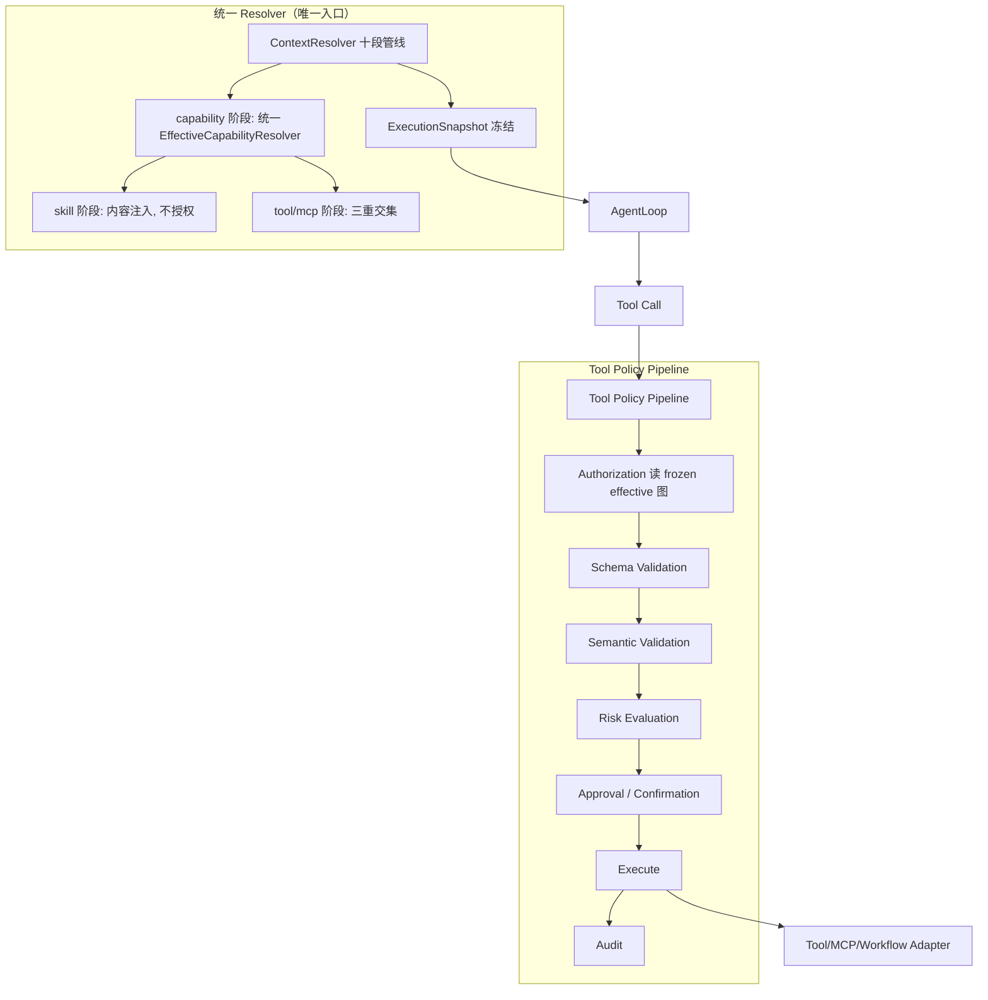

# Runtime 架构收口整改 模块需求与设计一体化文档

> **文档编号**: MOD-RUNTIME-CLOSURE-v1.0
> **文档版本**: v0.1
> **创建日期**: 2026-08-30
> **文档状态**: 设计评审中

**评审边界说明**:
- **需求评审**: 第 2 章（需求分析）→ 通过后锁定为需求基线 v1.0
- **设计评审**: 第 3-4 章（技术设计 + 部署运维）→ 通过后锁定设计基线 v1.x
- **交接契约**: 2.5 验收条件 — 需求定义 What，设计实现 How

**ID 体系**: FEAT（功能）、RULE（业务规则/系统约束）、TC（测试用例）、RISK（风险）、NFR（非功能指标）
场景编号：S-（正常）、E-（异常）、B-（边界）

**填写约定**: 无实测数据处填「待定」，不照抄示例值。本次为纯后端 Runtime 内核收口，不新增 HTTP API、不新增 DB 表（Snapshot 为运行时契约对象，不落库）。

---

## 目录

- [1. 文档控制](#1-文档控制)
- [2. 需求分析](#2-需求分析)
  - [2.1 需求概述](#21-需求概述)
  - [2.2 痛点与价值](#22-痛点与价值)
  - [2.3 功能方案](#23-功能方案)
  - [2.4 范围与边界](#24-范围与边界)
  - [2.5 验收条件](#25-验收条件)
- [3. 技术设计](#3-技术设计)
  - [3.1 方案选型](#31-方案选型)
  - [3.2 架构设计](#32-架构设计)
  - [3.3 数据设计](#33-数据设计)
  - [3.4 接口设计](#34-接口设计)
  - [3.5 质量实现方案](#35-质量实现方案)
- [4. 部署与运维](#4-部署与运维)
- [5. 风险与依赖](#5-风险与依赖)
- [6. 需求追溯矩阵](#6-需求追溯矩阵)
- [Spec Compliance Matrix](#spec-compliance-matrix)
- [附录：术语表](#附录术语表)

---

## 1. 文档控制

### 1.1 责任人

| 角色 | 姓名 | 职责范围 |
|------|------|---------|
| 开发负责人 | — | 技术方案、代码实现 |
| 架构师 | — | 架构审核、技术决策 |
| 测试负责人 | — | 测试策略、质量保证 |

### 1.2 修订历史

| 版本 | 日期 | 作者 | 变更描述 |
|------|------|------|---------|
| v0.1 | 2026-08-30 | Fluxion | 初始草稿（Codex 源码审查 + code review 结论 + 文档收口） |

---

## 2. 需求分析

### 2.1 需求概述

| 项目 | 内容 |
|------|------|
| **模块名称** | Runtime 架构收口整改 |
| **模块ID** | MOD-RUNTIME-CLOSURE |
| **所属系统/产品线** | Fluxion Agent Harness（Runtime 内核） |
| **需求类型** | 技术重构 |
| **业务背景** | Codex 源码审查（2026-08-30，ARCH-01~04/SNAP-01~02/TOOL-01~04）与本仓库 code review 发现：授权解析存在三条语义分裂的路径（违反 REQ-CAP-006）、ExecutionSnapshot 未冻结 workflow/memory/personalization ref 且未落 effective 图（ADR-A003 未满足）、Skill 与 Tool/MCP 的授权语义未分型（直接导致 ARCH-03 误判）、ToolRuntime 缺 Schema/Semantic/Risk/Approval 统一管线（REQ-SEC-003/004）。 |
| **核心目标** | 收敛 Runtime 主链「AgentDefinition → 单一 Resolver → 完整不可变 ExecutionSnapshot → 统一 Tool Policy Pipeline → Execution」，消除双轨与授权语义分裂。 |

### 2.2 痛点与价值

| 维度 | 内容 |
|------|------|
| **目标用户** | 平台开发者 / 架构评审（不直接面向普通用户） |
| **当前问题** | ① 授权解析三条路径语义分裂：`EffectiveCapabilityResolver`（Tool ∩）、`_effective_skill_selectors`（Skill ∪）、`ContextResolver._resolve_capability_versions`（忽略 binding），对「binding 是否扩张能力」给出三种答案；② 两条 resolver 管线并存（`ExecutionSnapshotBuilder` vs `ContextResolver`），主 invoke 走旧管线、workflow 节点走新管线；③ Snapshot 冻结不全，事后无法从 Snapshot 反推 effective 权限；④ ToolRuntime 只做三元组交集，`parameters_schema`/`risk_level` 只写不读。 |
| **业务影响** | 高风险写操作可能仅凭「LLM 参数合法」直接执行（违反 `foundation/01 §5` 成功标准）；授权语义漂移导致审计不可解释；维护者需同时理解三套授权算法。 |
| **预期价值** | 单一 Resolver 消除授权漂移与 N+1；完整 Snapshot 支撑审计与跨 Pod 等价；统一 Policy Pipeline 补安全边界；术语与架构一致。 |

### 2.3 功能方案

#### 2.3.1 功能清单

| 功能ID | 功能名称 | 功能描述 | 优先级 | 来源 |
|--------|---------|---------|--------|------|
| FEAT-01 | 单一 Resolver 收敛 + 入口去 runtime_profile_id | 合并 `ExecutionSnapshotBuilder` 与 `ContextResolver` 为单一 Resolver，入口走 `ResolverSelector(agent_id)`，`RequestContext.runtime_profile_id` 降级/移除（RUNTIME-01）；删除 `_effective_skill_selectors` 的 Skill authz 路径；Tool/MCP 授权由统一 `EffectiveCapabilityResolver` 在 Snapshot 构建期算一次并冻结 | P0 | REQ-CAP-006 / ADR-A002 / RUNTIME-01 |
| FEAT-02 | Snapshot 完整冻结 | `ExecutionSnapshot` 增 `workflow_ref`/`memory_policy_ref`/`personalization_policy_ref` 精确版本 + effective capability/permission 图；消除 `agent_definition_version` 重复字段（SNAP-02） | P0 | ADR-A003 / REQ-EXE-002 |
| FEAT-03 | 统一能力授权：visibility + 管理员 grant（Skill/Tool/MCP/Workflow） | Skill/Tool/MCP/Workflow 四类一等能力统一按用户授权：`visibility`（public/tenant 全租户可用，private 需 grant）+ 管理员 `grant()` per-user 配置；`CapabilityType` 增 WORKFLOW、`grant()` 支持 workflow；Tool/MCP 额外保留 `AgentAllowlist ∩ TenantPolicy`；workflow 内部 step 沿用发起用户授权（frozen effective 图进 durable 上下文） | P0 | REQ-CAP-002/005（设计决策：统一授权 + workflow 一等能力） |
| FEAT-04 | Tool 统一 Policy Pipeline | `ToolRuntime._call` 补 Schema Validation → Semantic Validation → Risk → Approval → Credential → Execute → Result Validation → Audit；`PolicyDecision` 从 bool 升级为 ALLOW/DENY/REQUIRE_CONFIRMATION/REQUIRE_APPROVAL | P0 | REQ-SEC-003/004 / design-02 §7 |
| FEAT-05 | 术语落地 | Runtime 域引入 `RuntimeInstance`/`RuntimePool` 概念，Console 运营「Worker/队列」对齐到 RuntimePool 语义 | P1 | ADR-A001 |
| FEAT-06 | Model failover 职责收口 | `model_failover` 链从 `RuntimeProfile.executor_config` 移出，改由 `ModelPolicy` 承载；Resolver 不再直读 `executor_config["model_failover"]` | P1 | MODEL-01 / ADR-006 |
| FEAT-07 | Capability Grant 列表补 kind | `list_grants()` 返回补 `resource_kind`/`capability_kind`，与 `grant()` 同构 | P1 | USER-01 |
| FEAT-08 | Workflow Stub 移出主模块 | `StubWorkflowEngine` 从 `runtime/workflow.py` 移到 `tests/fakes/` 或 `fluxion/testing/`，主模块只留生产契约与 Adapter | P1 | WF-01 / REQ-SCH-001 |
| FEAT-09 | 数据库初始化脚本化 | 删除 alembic；新增 `scripts/init_db.py`（复用 `registry.schema.metadata`，`create_all` 幂等建全部域表），PG/SQLite 双库；服务进程（serve/worker）启动不建表 | P1 | 部署/运维收口 |
| FEAT-10 | 三服务运行边界分离 | api（Control Plane）/ runtime（AgentLoop 无状态横向扩）/ worker（DBOS）拆为独立进程与 Deployment，互不影响；入口 `FLUXION_ROLE` 增加 `runtime` | P1 | 规则 14 / ARCH-14 |

> 来源：无 PRD，直接引用 `docs/foundation/02` 的 REQ-* 与 `docs/adr` 的 ADR-* 作为需求来源。

### 2.4 范围与边界

| 类别 | 内容 |
|------|------|
| **范围（In Scope）** | 上述 FEAT-01~10；含 `ExecutionSnapshot` 契约字段调整、统一 Resolver 模块、Tool Policy Pipeline 各阶段实现、Model/User/Workflow 领域边界清理、数据库初始化脚本化（FEAT-09）、三服务运行边界分离（FEAT-10）、对应 contract/integration 测试。 |
| **非范围（Out of Scope）** | 不新增 HTTP API；不新增 DB 表/迁移（Snapshot 为运行时对象）；不改前端 UI；不引入新第三方依赖（Schema Validation 复用现有能力或标准库）；Workflow DSL / Memory V2 / Eval 深化不在本次。 |
| **后续前端批次（单列待办，不进本后端设计）** | CHAT-01：`ChatApp` 直接维护 `platformUserId`/`access` 平台身份耦合，随前端 Workspace/Identity Adapter 分层另行立项（design-frontend 分册）。CONSOLE-01 已判定过时（Agent Studio `/build/agent-studio` 已存在），不列为整改项。 |
| **前置假设** | 真实 PG（`mmuser/mmuser@5432` 或 k8s 共享 PG）可用于 integration/E2E；`FLUXION_K8S_TEST=1` 时可跑多 Pod Gate。 |
| **有意妥协 / 技术债** | FEAT-03 摘出 Skill 后，遗留 `_effective_skill_selectors` 的迁移期删除按「先停用、后删码」两步走，避免一次性大改破坏 fixture；Skill 的用户级「个性化」落地到 UserPreference 的契约先锁、深做放后续（同 `personalization_policy_ref` 现状）。 |

### 2.5 验收条件

#### 2.5.1 业务规则与约束

| ID | 类型 | 描述 | 验证场景 |
|----|------|------|---------|
| RULE-01 | 业务规则 | EffectiveCapability 由单一 Resolver 产出，执行链不得拼第二套授权 | S-01 |
| RULE-02 | 业务规则 | Tool/MCP 授权 = `UserGrant ∩ AgentAllowlist ∩ TenantPolicy`，缺任一维度 fail-closed | E-01 |
| RULE-03 | 系统约束 | Snapshot 冻结 workflow/memory_policy/personalization_policy 精确版本，且无重复字段 | S-02 |
| RULE-04 | 业务规则 | Skill 不参与授权；Agent 声明的 skill 直接注入，用户差异不进入 authz | S-03 |
| RULE-05 | 业务规则 | Tool 执行顺序 = 授权 → Schema → Semantic → Risk → Approval → Execute → Audit | S-04 |
| RULE-06 | 系统约束 | 高风险写操作不得仅凭 LLM 参数合法直接执行（须命中审批） | E-03 |
| RULE-07 | 业务规则 | `list_grants()` 返回与 `grant()` 同构的 kind 字段 | S-06 |
| RULE-08 | 系统约束 | Model failover 链由 `ModelPolicy` 承载，`RuntimeProfile` 不含 provider/model 职责 | S-05 |
| RULE-09 | 系统约束 | Runtime 主模块不承载测试 Stub/Fake（测试实现移出） | manual |

#### 2.5.2 功能验收场景

**正常场景**

| 场景ID | 功能ID | 优先级 | 测试层级 | 关键真实边界 | 前置条件 | 操作步骤 | 预期结果 |
|--------|--------|--------|---------|-------------|---------|---------|---------|
| S-01 | FEAT-01 | P0 | integration | Resolver → Registry(PG/SQLite) → Snapshot | 同 tenant+user+agent，两套 store 对拍 | 单一 Resolver 解析同输入 | 产出等价 Snapshot，effective 图一致；无双入口 |
| S-02 | FEAT-02 | P0 | unit | Snapshot 契约校验 | 构造含 workflow/memory/personalization ref 的 AgentDefinition | 构建 Snapshot | 三个 ref 冻结精确版本；`agent_definition_version` 唯一 |
| S-03 | FEAT-03 | P0 | integration | Resolver → Snapshot（skill visibility+grant） | public skill S1 + private skill S2，用户仅有 S2 的 grant | 解析 | public S1 全用户可用；private S2 仅 grant 用户可用；Tool/MCP 仍 ∩ |
| S-04 | FEAT-04 | P0 | E2E | Model ToolCall → Pipeline → Execute → Audit | 低风险只读工具，schema 合法 | 触发 tool call | 授权→Schema→Semantic→Risk 全过，直接执行，审计记录完整决策链 |
| S-05 | FEAT-06 | P1 | integration | Resolver → ModelPolicy | RuntimeProfile 含 `model_failover` 但 ModelPolicy 承载 | 解析 | `model_resolution.failover` 来自 ModelPolicy，非 `executor_config` |
| S-06 | FEAT-07 | P1 | integration | Service → Store（grant 列表） | 用户已有 skill/tool/mcp grant | `list_grants()` | 返回含 `resource_kind`/`capability_kind`，与 `grant()` 同构 |
| S-07 | FEAT-08 | P1 | unit | 模块 import 结构 | `StubWorkflowEngine` 已移到新位置 | import `fluxion.runtime.workflow` 断言无 Stub；从新位置 import 并 smoke start | 主模块无 `StubWorkflowEngine`；新位置可 import 且 start 正常返回 |
| S-08 | FEAT-05 | P1 | unit | Runtime 域符号 | 术语已落地为代码符号 | import `RuntimeInstance`/`RuntimePool` | 符号可 import 且语义正确 |
| S-09 | FEAT-03 | P1 | integration | 真实 worker 部署、DBOS durable 上下文 | worker 已装配 capability/agent executor | 跑含 capability/agent 节点的 workflow | 内部 step 按发起用户 frozen 图授权，无权 fail-closed |

**异常场景**

| 场景ID | 功能ID | 测试层级 | 关键真实边界 | 触发条件 | 系统行为 | 用户感知 |
|--------|--------|---------|-------------|---------|---------|---------|
| E-01 | FEAT-01 | integration | EffectiveCapabilityResolver → ToolRuntime | Tool 缺 UserGrant 或 AgentAllow 或 Tenant deny | fail-closed 拒绝 | tool_not_allowed |
| E-02 | FEAT-02 | integration | ContextResolver → Registry | workflow/memory/personalization ref 解析失败 | fail-closed，不产出缺字段 digest | 解析失败错误码 |
| E-03 | FEAT-04 | E2E | Pipeline → Approval → Execute | 高风险写操作（LLM 未声明审批） | 返回 REQUIRE_APPROVAL，不得执行 | 待审批卡片/信号 |

**边界场景**

| 场景ID | 测试层级 | 关键真实边界 | 字段/条件 | 边界值 | 预期行为 |
|--------|---------|-------------|----------|--------|---------|
| B-01 | unit | Skill 解析 | Agent 无 skill + 无 binding | 空集 | 正常产出空 skill_instructions，不报错 |
| B-02 | unit | Snapshot 契约 | workflow_ref 等可选字段 | None | 字段为 None 而非缺失，重复字段已消除 |

#### 2.5.3 非功能指标

**性能指标**

| 指标ID | 指标名称 | 目标值 | 测量方法 |
|--------|---------|-------|---------|
| NFR-PERF-01 | 单一 Resolver L1 命中 | P95 ≤ 5ms | 基准测试 |
| NFR-PERF-02 | ExecutionSnapshot 构建 | P95 ≤ 20ms | 基准测试 |

**可靠性指标**

| 指标ID | 指标名称 | 目标值 |
|--------|---------|-------|
| NFR-REL-01 | 执行期版本不漂移（resolve-once） | 100%（对拍 digest 一致） |

**安全性要求**

| 指标ID | 安全域 | 验收标准 |
|--------|--------|---------|
| NFR-SEC-01 | 授权 | Tool/MCP 缺任一授权维度拒绝 |
| NFR-SEC-02 | 高风险写 | 未经审批不得执行；LLM 无法自降风险 |

---

## 3. 技术设计

### 3.1 方案选型

#### 关键决策记录

| 决策点 | 选择 | 被否决项 | 理由 | 可逆性 |
|--------|------|---------|------|--------|
| 双 resolver 收敛方向 | 以 `ContextResolver`（十段管线）为主体，补齐 tool 授权与 effective 图后成为唯一入口 | 以 `ExecutionSnapshotBuilder` 为主体补十段 | `ContextResolver` 已具备 identity/runtime_profile_ref/digest/memory manifest/credential/policy 阶段，覆盖更全；旧 builder 只覆盖 profile/agent/skill/mcp | 易（分步迁移，可回退） |
| Skill 语义 | 摘出授权链，定性「内容/个性化」 | 留在 authz 内补 tenant 闸门（∪ + gate） | 保留非对称复杂度已实际造成 ARCH-03 误判；Skill 本身低风险无副作用，不该占用安全授权通道 | 中（契约已锁，需改 fixture） |
| Tool PolicyDecision | 升级为 ALLOW/DENY/REQUIRE_CONFIRMATION/REQUIRE_APPROVAL 枚举 | 保持 bool | bool 无法表达审批/确认语义（REQ-SEC-003） | 中 |
| Effective 图载体 | 存入 `ExecutionSnapshot` 新字段 `effective_capability`/`effective_permissions` | 存 side-car | 与 Snapshot 一起 digest，才能保证 resolve-once 与跨 Pod 等价（ADR-A003「追溯 EffectiveCapability」） | 中 |

#### 技术栈

| 类别 | 选型 | 版本 | 选型理由 |
|------|------|------|---------|
| 语言 | Python | 3.12+ | 现有 |
| 校验 | Pydantic（typed Spec SoT） | 2.x | 现有；Schema Validation 阶段复用 `parameters_schema` 走 JSON Schema 校验（标准库/现有能力） |
| 存储 | PostgreSQL / SQLite | 现有 | Registry Store Contract 不变 |

### 3.2 架构设计

#### 技术分层

- `services/context_resolver.py`：唯一 Resolver 入口（十段），产出不可变 Snapshot。
- `runtime/capabilities.py`：`EffectiveCapabilityResolver` 保留，但只在 Snapshot 构建期被调用一次，产出 effective 图冻结进 Snapshot；执行期 ToolRuntime 不再实时重算。
- `runtime/tools.py`：`ToolRuntime` 增 Policy Pipeline 各阶段，读 Snapshot 的 frozen effective 图。
- `runtime/resolver.py`：`ExecutionSnapshotBuilder` 与 `_effective_skill_selectors` 退役（迁移期先停用，后删码）。

#### 外部依赖清单

| 外部系统 | 依赖类型 | 协议 | 超时 | 降级策略 |
|---------|---------|------|------|---------|
| Registry（PG/SQLite） | 事实源 | Store Contract | 现有 | fail-closed / L1 缓存 |

### 3.3 数据设计

本次不新增 DB 表。`ExecutionSnapshot` 为运行时契约对象（`resources/contracts.py`），字段调整如下：

| 字段名 | 类型 | 可空 | 说明 |
|--------|------|------|------|
| workflow_ref | `ExactResourceVersion \| None` | Y | 新增：default workflow 精确版本（FEAT-02） |
| memory_policy_ref | `ExactResourceVersion \| None` | Y | 新增：MemoryPolicy 精确版本（FEAT-02） |
| personalization_policy_ref | `ExactResourceVersion \| None` | Y | 新增：PersonalizationPolicy 精确版本（FEAT-02） |
| effective_capability | `dict[str, object]` | N | 新增：effective capability 图（FEAT-01/02） |
| effective_permissions | `dict[str, object]` | N | 新增：effective permission 图（Tool/MCP 三元组结果） |
| agent_definition_version | `str \| None` | Y | **修复**：删除重复声明（SNAP-02，原 624/639 两处） |

### 3.4 接口设计

#### 形态 C：函数 / 库接口

| 函数签名 | 入参 | 返回 | 错误处理 |
|---------|------|------|---------|
| `ContextResolver.resolve(selector: ResolverSelector, *, session_id, memory_query) -> ResolveResult` | `ResolverSelector`（tenant/agent/user/pin） | `ResolveResult`（snapshot + user_context + trace） | `ContextResolutionError(slug, status)` fail-closed |
| `EffectiveCapabilityResolver.resolve(tenant, user, agent) -> EffectiveCapability` | 三元组 | frozen `EffectiveCapability`（tool/mcp/skill 三分图） | fail-closed |
| `ToolRuntime.call(context, tool_id, arguments, *, frozen_policy) -> ToolResult` | 读 Snapshot frozen 图，不再传三个 set | `ToolResult(policy_decision_id)` | `ToolAuthorizationError` / 语义 / 审批拒绝 |

> 变更点：`ToolRuntime.call` 的 `user_grants/agent_allowlist/tenant_policy` 三个 set 参数，由「调用方实时算」改为「读 Snapshot 内 frozen effective 图」，从源头消除执行期漂移与 N+1。

### 3.5 质量实现方案

#### 性能设计

| 指标ID | 热点路径 | 目标值 | 实现方案（含被放弃的较慢方案） |
|--------|---------|-------|------------------------------|
| NFR-PERF-01 | Resolver L1 | ≤5ms | L1 内存缓存 + 单一 Resolver（放弃三条路径各自查库的 N+1） |
| NFR-PERF-02 | Snapshot 构建 | ≤20ms | effective 图在构建期算一次，执行期只读；放弃「每 tool call 重算三元组」 |

#### 可靠性设计

| 风险ID | 失效模式 | 影响 | 应对措施 | 验证场景 |
|--------|---------|------|---------|---------|
| RISK-01 | 双 resolver 迁移期主 invoke 仍走旧路径 | 双轨未消除 | 分步：先切主 invoke 到 ContextResolver，再删旧 builder | S-01/E-02 |
| RISK-02 | Skill 摘出后遗留 authz 代码误放行 | 授权语义回退 | 删除 `_effective_skill_selectors`，补 fail-closed 测试 | S-03/E-01 |

#### 安全性设计

| 指标ID | 验收标准 | 实现方案 |
|--------|---------|---------|
| NFR-SEC-01 | Tool/MCP 缺任一授权维度拒绝 | frozen effective 图 + `ToolAuthorizationError` fail-closed |
| NFR-SEC-02 | 高风险写须审批 | `PolicyDecision.REQUIRE_APPROVAL` + 审批 durable 状态 |

#### 可观测性设计

| 场景 | 实现方案 |
|------|---------|
| 决策可解释 | `_record_policy_decision` 增 policy version / schema verdict / semantic verdict / risk level / approval actor+decision（对应 OBS-01） |
| 链路追踪 | 保留 `traced_scope`，policy_decision_id 关联 trace_id |

---

## 4. 部署与运维

### 4.1 部署架构

| 环境 | 配置 | 实例数 | 用途 |
|------|------|--------|------|
| dev | — | 1 | 开发调试 |
| prod | — | ≥2 | 无状态多 Pod（RuntimePool） |

### 4.4 数据迁移

无 DB 迁移。契约字段变化仅影响运行时对象与 `snapshot_digest` 计算，需同步更新 `canonical_digest` 的 `_RUNTIME_FIELDS` 排除清单（effective 图参与 digest）。

---

## 5. 风险与依赖

### 5.1 项目依赖

| 依赖模块/团队 | 依赖内容 | 状态 | 风险等级 |
|-------------|---------|------|---------|
| Registry Store | 读取 AgentDefinition/RuntimeProfile/Binding/Policy | 已有 | 低 |

### 5.2 风险识别

| 风险ID | 类型 | 描述 | 概率 | 影响 | 应对措施 | 验证场景 |
|--------|------|------|------|------|---------|---------|
| RISK-03 | 兼容 | 迁移期 fixture 依赖同名回退 | 中 | 中 | 保留同名回退至 TASK-008 agent_id 路由完成 | E-02 |
| RISK-04 | 范围 | 摘出 Skill 触及 design-02 §5 的 tenant 闸门需求 | 中 | 中 | 闸门随摘出自然消解（不再有 ∪ 扩展），文档已同步 | S-03 |

---

## 6. 需求追溯矩阵

| 用户故事 | 功能ID | 接口ID | 测试用例ID | 测试层级 | 状态 |
|---------|--------|--------|-----------|---------|------|
| 需求描述（REQ-CAP-006 / RUNTIME-01） | FEAT-01 | `ContextResolver.resolve` / `EffectiveCapabilityResolver.resolve` | S-01, E-01 | integration | 待实现 |
| 需求描述（ADR-A003） | FEAT-02 | `ExecutionSnapshot`（contract） | S-02, B-02, E-02 | unit/integration | 待实现 |
| 需求描述（REQ-CAP-005） | FEAT-03 | `ContextResolver` skill 阶段 | S-03, B-01, S-09 | integration | 待实现 |
| 需求描述（REQ-SEC-003/004） | FEAT-04 | `ToolRuntime.call` | S-04, E-03 | E2E | 待实现 |
| 需求描述（ADR-A001） | FEAT-05 | 术语（RuntimePool） | S-08 | unit | 待实现 |
| 需求描述（MODEL-01） | FEAT-06 | `ContextResolver` model 阶段 / `ModelPolicy` | S-05 | integration | 待实现 |
| 需求描述（USER-01） | FEAT-07 | `UserDomainService.list_grants` | S-06 | integration | 待实现 |
| 需求描述（WF-01 / REQ-SCH-001） | FEAT-08 | `StubWorkflowEngine` 迁移 | S-07 | unit | 待实现 |
| 需求描述（部署/运维收口） | FEAT-09 | `scripts/init_db.py` | —（幂等建表 smoke） | manual | 已完成 |
| 需求描述（规则 14 / ARCH-14） | FEAT-10 | `FLUXION_ROLE=runtime` + helm runtime Deployment | —（部署架构） | integration | 待实现 |

> RULE-01~09 已映射到 S-/E-/B- 场景；FEAT-05（术语）、FEAT-08（Stub 迁移）为纯命名/组织对齐，无运行时行为差异，标 manual 并说明：以 code review / 目录结构断言确认，不产生运行时行为差异。

---

## Spec Compliance Matrix

> 从 `spec-context.yml` 继承 8 条 spec 的 required Rule，逐 Rule 回填设计落点与 verifier/验收场景。

| Spec/Rule | enforcement | 设计影响 | 设计落点 | 验证场景 | 状态/N/A 理由 |
|-----------|-------------|---------|---------|---------|----------------|
| `fluxion-runtime-core#RULE-fluxion-runtime-001` | required | 无状态 + 固定 Snapshot + Kernel 只依赖 Contract | §3.2 统一 Resolver + §3.3 Snapshot 字段；单一 Resolver 收敛即落实「固定 ExecutionSnapshot」 | S-01, E-02 | applied |
| `fluxion-workflow-capability#RULE-fluxion-workflow-001` | required | Tool 是 Adapter、业务属 Capability、durable 归 Workflow | §3.2 Tool Policy Pipeline + FEAT-03（Skill 摘出）；Tool/MCP 走统一 Capability authz | S-03, S-04 | applied |
| `fluxion-resource-registry#RULE-fluxion-resource-001` | required | 资源版本化、Binding 表达差异、双库同 Contract | §3.3 Snapshot 契约字段 + FEAT-02 版本冻结；SNAP-02 去重 | S-02, B-02 | applied |
| `fluxion-dfx#RULE-fluxion-dfx-001` | required | 安全/可观测/性能在编码期落实 | §3.5 安全设计（审批）+ 可观测（决策链）+ 性能（单一 Resolver） | E-03, S-04 | applied |
| `fluxion-console-channel#RULE-fluxion-console-001` | required | Console/Runtime 同仓边界、Web Chat 通道 | 本次纯 Runtime 内核，不触碰 Console API/Channel；边界不受影响 | E-02 | applied |
| `backend-code-quality-performance#RULE-backend-quality-001` | required | 满足 Guidance、避开 Avoid | §3.4 接口（fail-closed、无静默吞异常）+ §3.5 性能（消除 N+1） | S-01, E-01 | applied |
| `backend-directory-structure#RULE-backend-directory-001` | required | 模块按域组织 | 统一 Resolver 落 `services/context_resolver.py`，EffectiveCapability 落 `runtime/capabilities.py` | S-01 | applied |
| `backend-logging#RULE-backend-logging-001` | required | 结构化日志、trace 关联、脱敏 | §3.5 可观测（policy_decision_id 关联 trace_id、字段脱敏） | S-04 | applied |

---

## 附录：术语表

| 术语 | 定义 |
|------|------|
| Resolver | 解析层：把请求解析为不可变 ExecutionSnapshot |
| EffectiveCapability | 单用户+Agent+租户生效的能力/权限图（授权结果，非版本引用） |
| ExecutionSnapshot | 一次 Execution 解析出的不可变版本视图 |
| Policy Pipeline | Tool 执行前的授权→校验→语义→风险→审批→审计链路 |
| Skill 摘出 | 把 Skill 从安全授权链路移除，定性为内容/个性化注入 |
| RuntimeInstance / RuntimePool | 实际运行 Pod/Process / 共享无状态计算池 |

---

*文档结束*
