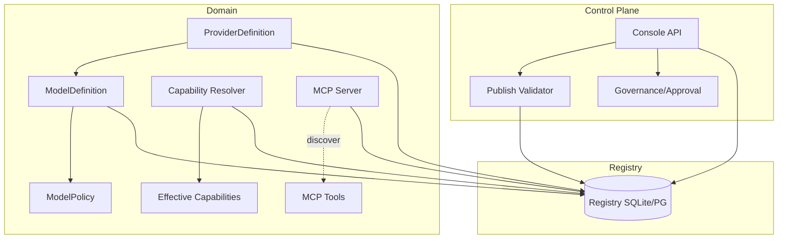
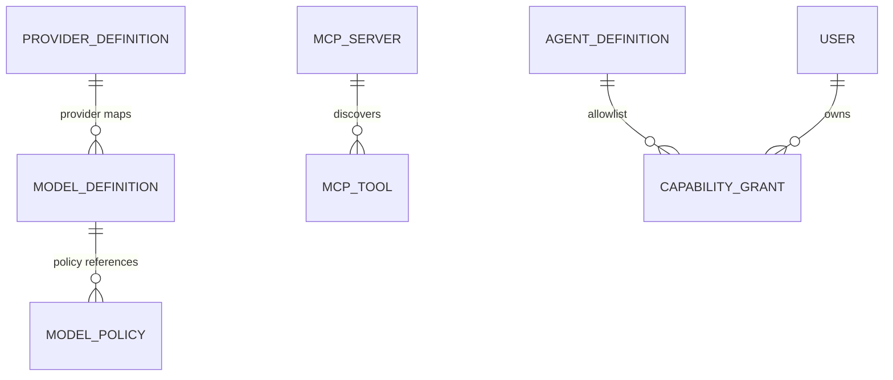

# Console 产品化 · 后端领域修复 模块需求与设计一体化文档

> **文档编号**: MOD-CONSOLE-DOMAIN-1.0
> **文档版本**: v0.1（草稿）
> **创建日期**: 2026-08-31
> **文档状态**: 草稿（待评审）

**评审边界说明**：需求评审第 2 章；设计评审第 3-4 章；交接契约 2.5 验收条件。
**来源**：`fluxion-console-productization-remediation-final.md`（产品化目标态 + 修订索引）+ `docs/foundation/*` + `docs/adr/ADR-A007`。

---

## 1. 文档控制

### 1.1 责任人

| 角色 | 姓名 | 职责范围 |
|------|------|---------|
| 产品 | - | 需求定义、业务验收 |
| 开发负责人 | - | 技术方案、代码实现 |
| 架构师 | - | 领域模型、Contract 审核 |

### 1.2 修订历史

| 版本 | 日期 | 作者 | 变更描述 |
|------|------|------|---------|
| v0.1 | 2026-08-31 | Codex | 初始草稿 |

---

## 2. 需求分析

### 2.1 需求概述 [必填]

| 项目 | 内容 |
|------|------|
| **模块名称** | Console 产品化 · 后端领域修复 |
| **模块ID** | MOD-CONSOLE-DOMAIN |
| **所属系统** | Fluxion Harness（Control Plane + Runtime Resolver） |
| **需求类型** | 技术重构 + 领域模型收口 |
| **业务背景** | Console 从「Resource/API 管理界面」升级为 Agent 产品控制台；当前领域模型存在双事实源与授权维度回退，需先修领域，再产品化 UI |
| **核心目标** | 消灭 `MODEL + PLUGIN(model_provider)` 双事实源、恢复多维能力治理、固定术语，为 Console 产品化提供正确的领域底座 |

### 2.2 痛点与价值 [必填]

| 维度 | 内容 |
|------|------|
| **目标用户** | Builder / Admin（通过 Console 配置 Agent） |
| **当前问题** | ① `ResourceKind.MODEL` 语义是「模型供应商」而非「模型名」，`PLUGIN(plugin_type=model_provider)` 又承担 provider，双事实源；② 授权解析三条路径分裂（`EffectiveCapabilityResolver` / `_effective_skill_selectors` / `ContextResolver._resolve_capability_versions`）；③ 术语混用 `Agent`/`AgentDefinition`，与 Workflow `agent` node 撞名 |
| **业务影响** | 管理员配置模型/能力时无法保证 Runtime 消费一致；UI 若要「前端简单」必须先「后端严格」 |
| **预期价值** | Model 在 Console/Resolver/Runtime 单一事实源；能力治理三维（UserGrant ∩ AgentAllowlist ∩ TenantPolicy）不变式可验证；发布校验可操作 |

**用户故事**（映射 remediation §31 Golden Path ①③⑤）

| 编号 | 用户故事 | 优先级 |
|------|---------|--------|
| US-01 | 作为 Builder，我希望连接模型服务并发现模型，以便 Agent 引用正确的模型 | P0 |
| US-02 | 作为 Admin，我希望给用户配置能力时后端仍按三维权限解析，以便 UI 简化不破坏安全 | P0 |
| US-03 | 作为 Builder，我希望发布时自动完整校验并得到可操作问题清单，以便不发布非法配置 | P0 |

### 2.3 功能方案 [必填]

#### 2.3.1 功能清单

| 功能ID | 功能名称 | 功能描述 | 优先级 | 来源 |
|--------|---------|---------|--------|------|
| FEAT-B01 | Model 领域三层重构 | 新增 `ProviderDefinition`(kind=model_provider) / `ModelDefinition`(kind=model_definition) / `ModelPolicy`(结构化)，消灭 `MODEL+PLUGIN(model_provider)` 双事实源 | P0 | US-01 |
| FEAT-B02 | Capability 多维治理恢复 | 有效能力 = `UserGrant ∩ AgentAllowlist ∩ TenantPolicy`，收敛为单一 EffectiveCapability Resolver | P0 | US-02 |
| FEAT-B03 | Skill baseline + extension 语义 | Skill 恢复「Agent baseline + User Binding 扩展」，受 TenantPolicy 约束 | P0 | US-02 |
| FEAT-B04 | MCP Server/Tool 语义分离 | 新增 `MCP_SERVER` 资源，MCP Tool 由 Server 自动发现，不作为手工资源 | P0 | US-01 |
| FEAT-B05 | 术语固定 | 禁止 `ResourceKind.AGENT`；继续使用 `AGENT_DEFINITION`；代码/契约不引入裸 `Agent` | P0 | US-01 |
| FEAT-B06 | Approval Runtime Gate 保留 | 保留分级审批（LOW/MEDIUM/HIGH）+ fail-closed；rollback 审批保留，publish 审批后续 | P0 | US-03 |
| FEAT-B07 | published immutable + single working draft | 已发布版本不可变；编辑自动创建/复用 working draft | P0 | US-03 |
| FEAT-B12 | Tool/Plugin 代码侧拆分 | `PluginType.TOOL_PROVIDER` 降级为 Tool 的 SPI 实现载体；Tool 为一等 Capability Resource；Plugin 不参与 Capability Resolution（ADR-A009） | P0 | US-02 |
| FEAT-B08 | 发布完整校验 | 发布前 Schema/引用/语义/依赖/凭据/风险审批/Eval Gate 全量校验，返回可操作问题清单 | P1 | US-03 |
| FEAT-B09 | Capability dependency planning | `CapabilityPlanningService` 计算能力依赖闭包，UI 提示缺失 Tool/MCP（remediation §6.4） | P2 | US-02 |
| FEAT-B10 | Skill required capability closure | Skill 声明 required capabilities，授权/配置时计算依赖闭包 | P2 | US-02 |
| FEAT-B11 | 连接测试 | Provider / MCP / Tool 连接测试端点，配置验证（测试连接 action） | P2 | US-01 |

> FEAT-B09~B11 为 P2 体验增强项，数据模型/接口细节留待 `cf-task:plan` 拆解时细化。

### 2.4 范围与边界 [必填]

| 类别 | 内容 |
|------|------|
| **范围（In Scope）** | 后端领域模型修复（FEAT-B01~B07）；发布校验服务（FEAT-B08）；Contract/Resolver 单一事实源 |
| **非范围（Out of Scope）** | Console UI 产品化（见 `console-productization.frontend.design.md`）；Policy Center / Plugin SPI / ABAC / Publish Approval（P3 未来）；Runtime 无状态化重写（已达标） |
| **前置假设** | ADR-A007 三层拆分决策成立；SQLite/PG 共享 Registry Contract 不变 |
| **有意妥协 / 技术债** | `ModelDefinition` 第二阶段才独立（当前 `ResourceKind.MODEL` 语义是供应商）；发布审批暂缓，仅保留 rollback 审批 |

### 2.5 验收条件 [必填]

#### 2.5.1 业务规则与约束

| ID | 类型 | 描述 | 验证场景 |
|----|------|------|---------|
| RULE-01 | 业务规则 | Model 在 Console/Resolver/Runtime 使用同一 typed truth，`PLUGIN(model_provider)` 退出模型运行链 | S-01 |
| RULE-02 | 系统约束 | 有效能力 = `UserGrant ∩ AgentAllowlist ∩ TenantPolicy`，缺任一维度 fail-closed（Tool/MCP） | S-02 / E-01 |
| RULE-03 | 系统约束 | Skill 有效集 = Agent baseline ∪ User Binding extension，受 TenantPolicy 约束 | S-03 |
| RULE-04 | 业务规则 | 发布自动全量校验，失败返回可操作问题清单 | S-04 / E-02 |
| RULE-05 | 系统约束 | 已发布版本不可变；编辑产生 working draft | S-05 |

#### 2.5.2 功能验收场景

**正常场景**

| 场景ID | 功能ID | 优先级 | 测试层级 | 关键真实边界 | 前置条件 | 操作步骤 | 预期结果 |
|--------|--------|--------|---------|-------------|---------|---------|---------|
| S-01 | FEAT-B01 | P0 | E2E | Registry → Resolver → Runtime | 已有 ProviderDefinition+ModelDefinition | 创建 provider 并发现 model，Agent 引用 model_ref 后执行 | Snapshot 冻结 provider/model exact version，无 PLUGIN(model_provider) 参与 |
| S-02 | FEAT-B02 | P0 | E2E | Grant Store → Resolver | 用户 grant / agent allowlist / tenant policy 三维齐备 | 三者交集求有效能力 | 交集正确；缺 allowlist 或 policy 维度时 Tool/MCP 不可用 |
| S-03 | FEAT-B03 | P0 | integration | Binding → Resolver | 用户被 grant 一个不在 agent baseline 的 skill | 解析有效 skill | 该 skill 出现在有效集；违反 tenant policy 时被拒 |
| S-04 | FEAT-B08 | P1 | E2E | Publish API → Validator → Store | 存在缺失依赖的 skill 引用 | 点击发布 | 返回可操作问题清单（定位到缺失能力），不产生 published 版本 |
| S-05 | FEAT-B07 | P0 | integration | Publish Store | 已有 published v3 | 编辑并保存 | 自动产生 working draft；v3 不变；发布后形成 v4 |
| S-06 | FEAT-B09 | P2 | integration | Resolver → PlanningService | Agent 引用 skill 声明 required capabilities | 计算依赖闭包 | 返回缺失 Tool/MCP 清单，可定位 |
| S-07 | FEAT-B11 | P2 | integration | Test → Provider/MCP 连接 | 已配置 Provider/凭据 | 点击测试连接 | 返回可达性/发现模型结果 |
| S-08 | FEAT-B12 | P0 | integration | Tool Registry → Plugin SPI | Plugin 提供 Tool Executor 实现 | Agent 授权/调用 | 授权对象是 Tool 而非 Plugin；Plugin 不参与 Capability Resolution |

**异常场景**

| 场景ID | 功能ID | 测试层级 | 关键真实边界 | 触发条件 | 系统行为 | 用户感知 |
|--------|--------|---------|-------------|---------|---------|---------|
| E-01 | FEAT-B02 | integration | Resolver → fail-closed | 仅用户 grant、无 agent allowlist | 解析 Tool 有效集 | fail-closed，该 Tool 不可调用 |
| E-02 | FEAT-B08 | integration | Validator → 错误清单 | Credential 不可用 | 发布校验 | 返回「Credential 不可用」可操作错误，阻止发布 |
| E-03 | FEAT-B06 | integration | Approval Gate | 高风险工具、无 approval callback | 执行工具 | fail-closed 抛 `ToolApprovalRequired`，不放行 |
| E-04 | FEAT-B11 | integration | Test → 外部连接 | Provider 凭据错误/超时 | 测试连接 | 返回可操作错误（超时/凭据），非静默失败 |
| E-05 | FEAT-B09 | integration | PlanningService | 依赖闭包缺能力 | 配置/发布 | 提示缺失能力，运行时前拦截 |

#### 2.5.3 非功能指标 [按需]

| 指标ID | 指标名称 | 目标值 | 测量方法 |
|--------|---------|-------|---------|
| NFR-PERF-01 | Resolver L1 命中 P95 | ≤5ms | benchmark（沿用现有 `test_snapshot_resolution`） |
| NFR-PERF-02 | 发布校验 P95 | ≤500ms | 压测报告（待定） |

---

## 3. 技术设计

### 3.1 方案选型 [必填]

#### 关键决策记录

| 决策点 | 选择 | 被否决项 | 理由 | 可逆性 |
|--------|------|---------|------|--------|
| Model 领域结构 | 三层 `ProviderDefinition → ModelDefinition → ModelPolicy` | 两层 `Model→Provider`（1:1） | 1:1 堵死跨 provider failover；ADR-A007 已决策三层 | 难回退（Contract） |
| ModelPolicy 归属 | 结构化（非独立 Resource），引用为 `ExactResourceVersion` | 独立 versioned Resource | 运行机制不单独发布；避免重试语义跨层重复 | 易回退 |
| 能力解析 | 单一 EffectiveCapability Resolver | 三条路径分裂（现状） | REQ-CAP-006 要求单一 Resolver | 难回退（收口） |
| MCP | `MCP_SERVER` 资源 + 自动发现 Tool | 手工新增 MCP Tool | MCP Tool 是发现结果，非产品对象 | 易回退 |

#### 技术栈

| 类别 | 选型 | 版本 | 选型理由 |
|------|------|------|---------|
| 语言 | Python | 3.12+ | 现有基线 |
| 框架 | FastAPI | 0.116+ | 现有基线 |
| 校验 | Pydantic v2 | 2.11+ | typed spec 单一真相源（ADR-A006） |
| 存储 | SQLAlchemy async | 2.0+ | SQLite/PG 共享 Registry Contract |

### 3.2 架构设计 [必填]



**技术分层**：`api → services → domain contracts → repositories/providers`（沿用现有依赖方向，禁止 `services → ORM model query`）。

### 3.3 数据设计 [必填]

> 领域对象沿用版本化 Resource envelope（`ResourceDefinition`：id/kind/spec_json/version/status/visibility），新增 kind 只需 typed spec model + enum 值，不新增独立表。仅 grant/approval 等关系态有独立表（沿用现有 `capability_grants` / `approval_records`）。Model 领域按 **ADR-A008** 三层定型。

**ResourceKind 变更（`resources/contracts.py` `ResourceKind`）**

| Kind | 值 | typed spec model | 说明 |
|------|-----|------------------|------|
| `MODEL_PROVIDER` | `model_provider` | `ProviderDefinition` | 连接（ADR-A008） |
| `MODEL_DEFINITION` | `model_definition` | `ModelDefinition` | 模型身份 + provider 映射 |
| `MCP_SERVER` | `mcp_server` | `McpServerDefinition` | MCP 连接 + transport + credential_ref |
| `MODEL` | `model` | — | **废弃**（存量迁移为 ProviderDefinition） |

> `PLUGIN(plugin_type=model_provider)` 退出模型运行链，仅保留 SPI 协议层（ADR-A008）。

**ProviderDefinition 字段约束（FEAT-B01）**

| 字段名 | 类型 | 必填 | 约束 | 说明 |
|--------|------|------|------|------|
| protocol | str | Y | openai-compatible 等 | 连接协议 |
| base_url | str | Y | URL | endpoint |
| credential_ref | str | Y | `secret://...` | 凭据引用（拒绝明文） |
| default_model | str | N | | 默认模型名（自然键） |
| request_timeout_ms | int | N | >0 | 连接维度超时（ADR-A008） |
| max_retries | int | N | ≥0 | 连接维度重试 |

**ModelDefinition 字段约束（FEAT-B01）**

| 字段名 | 类型 | 必填 | 约束 | 说明 |
|--------|------|------|------|------|
| name | str | Y | 自然键 | 模型名（如 deepseek-chat） |
| provider_ref | ExactResourceVersion | Y | version pin | 服务的 ProviderDefinition |
| capabilities | object | N | | context_window / tool_calling / vision / max_tokens |

**ModelPolicy 字段约束（AgentDefinition 结构化字段，非独立 Resource）**

| 字段名 | 类型 | 必填 | 约束 | 说明 |
|--------|------|------|------|------|
| primary_model_ref | ExactResourceVersion | Y | version pin | 主 ModelDefinition |
| fallback_model_refs | list[ExactResourceVersion] | N | | 跨 provider 回退链 |
| model_timeout_ms | int | N | >0 | 模型调用超时（执行维度） |
| model_deadline_ms | int | N | >0 | 模型调用截止 |

> timeout/retry/failover 归属切分（ADR-A008）：连接超时/重试 → `ProviderDefinition`；模型调用超时/截止 + 路由/回退 → `ModelPolicy`；Agent 运行机制（`max_rounds`/`concurrency`/`budget`）→ `RuntimeProfile`。

**ER 图**



### 3.4 接口设计 [必填]

**形态 A：HTTP API（新增/变更，统一 `{code,message,data,request_id}` envelope）**

| 接口ID | 名称 | 方法 | 路径 | 详细 |
|--------|------|------|------|------|
| API-01 | 创建 Provider | POST | `/api/v1/model-providers` | [↓](#api-01) |
| API-02 | 发现模型 | GET | `/api/v1/model-providers/{id}/models` | 测试连接 + 发现 |
| API-03 | 创建 MCP Server | POST | `/api/v1/mcp-servers` | |
| API-04 | 发现 MCP Tools | GET | `/api/v1/mcp-servers/{id}/tools` | |
| API-05 | 发布校验 | POST | `/api/v1/resources/{kind}/{id}:validate-publish` | 返回问题清单 |
| API-06 | 有效能力查询 | GET | `/api/v1/agents/{id}/effective-capabilities?user_id=` | 单一 Resolver 出口 |

#### API-01: 创建 Provider

**请求**

| 参数 | 类型 | 必填 | 说明 |
|------|------|------|------|
| protocol | string | Y | openai-compatible |
| base_url | string | Y | endpoint |
| credential_ref | string | Y | `secret://...` |
| default_model | string | N | 默认模型 |

**响应示例**

```json
{ "code": 0, "message": "success", "data": { "resource_id": "prov-xxx", "version": "v1" }, "request_id": "..." }
```

**错误码**

| 错误码 | 信息 | 场景 | HTTP |
|--------|------|------|------|
| 40001 | 参数错误 | base_url 非法 | 400 |
| 40901 | 资源冲突 | provider 已存在 | 409 |
| 50001 | 连接失败 | 测试连接超时 | 502 |

### 3.5 质量实现方案 [必填]

#### 性能设计

| 指标ID | 热点路径 | 目标值 | 实现方案 |
|--------|---------|-------|---------|
| NFR-PERF-01 | Resolver L1 | ≤5ms | 沿用 L1 cache（key=tenant+kind+id+version，TTL 短，发布失效） |

#### 可靠性设计

| 风险ID | 失效模式 | 影响 | 应对措施 | 验证场景 |
|--------|---------|------|---------|---------|
| RISK-01 | provider_ref 缺失 | 无 provider 可解析 | fail-closed 不发起调用 | E-01 |
| RISK-02 | 发布校验漏项 | 发布非法配置 | 校验清单 + 引用完整性 | E-02 |

#### 安全性设计

| 指标ID | 验收标准 | 实现方案 |
|--------|---------|---------|
| NFR-SEC-01 | Secret 不进 spec/日志/trace | SecretRef + 脱敏（沿用 `SensitiveSpecModel`） |
| NFR-SEC-02 | 审批状态 durable | PG `approval_records`（沿用） |

---

## 4. 部署与运维

### 4.1 部署架构

| 环境 | 配置 | 实例数 | 用途 |
|------|------|--------|------|
| dev | SQLite | 1 | 开发 |
| prod | PostgreSQL | 3+ | 生产（Resolver L1 进程内） |

### 4.4 数据迁移 [按需]

| 阶段 | 操作 | 验证方法 |
|------|------|---------|
| 1 | 新增 `model_provider`/`model_definition`/`mcp_server` ResourceKind | 枚举存在 |
| 2 | `PLUGIN(model_provider)` 迁移为 `ProviderDefinition`（存量 fixture 重写） | contract test |
| 3 | `MODEL`(供应商语义) 收敛为 `ProviderDefinition`，`model_definition` 承载模型名 | resolver 一致性 |

---

## 5. 风险与依赖

### 5.2 风险识别

| 风险ID | 类型 | 描述 | 概率 | 影响 | 应对措施 | 验证场景 |
|--------|------|------|------|------|---------|---------|
| RISK-03 | 迁移 | 存量 `PLUGIN(model_provider)` fixture 重写面大 | 中 | 高 | 分批迁移 + contract test 兜底 | S-01 |

---

## 6. 需求追溯矩阵

| 用户故事 | 功能ID | 接口ID | 测试用例ID | 测试层级 | 状态 |
|---------|--------|--------|-----------|---------|------|
| US-01 | FEAT-B01 | API-01/02 | S-01 | E2E | 待实现 |
| US-02 | FEAT-B02/B03 | API-06 | S-02/S-03 | E2E/integration | 待实现 |
| US-03 | FEAT-B08 | API-05 | S-04/E-02 | E2E | 待实现 |
| US-02 | FEAT-B09/B10 | TBD(plan) | S-06/E-05 | integration | 待实现 |
| US-01 | FEAT-B11 | TBD(plan) | S-07/E-04 | integration | 待实现 |

---

## Spec Compliance Matrix

| Spec/Rule | enforcement | 设计影响 | 设计落点 | 验证场景 | 状态/N/A 理由 |
|-----------|-------------|---------|---------|---------|----------------|
| fluxion-resource-registry#RULE-fluxion-resource-001 | required | 新领域对象资源化版本化，Binding 表达差异 | §3.3 新增 kind + typed spec | S-01 | applied |
| fluxion-runtime-core#RULE-fluxion-runtime-001 | required | Snapshot 固定 model/provider exact version | §3.4 API-06 / S-01 | S-01 | applied |
| fluxion-workflow-capability#RULE-fluxion-workflow-001 | required | MCP Tool 是发现结果；Tool 复用 Capability Contract | §3.3 MCP_SERVER / FEAT-B04 | S-01 | applied |
| fluxion-console-channel#RULE-fluxion-console-001 | required | Console/Runtime 同仓共享 Contract | §3.2 架构分层 | S-01 | applied |
| fluxion-dfx#RULE-fluxion-dfx-001 | required | 领域修复即测即验 | §3.5 可靠性/性能 | E-01/E-02 | applied |
| fluxion-console-api-contract#RULE-fluxion-console-api-001 | required | 新 API 统一 envelope | §3.4 接口设计 | S-04 | applied |
| backend-code-quality-performance#RULE-backend-quality-001 | required | 超时/缓存/测试约束 | §3.5 | E-01 | applied |
| backend-database#RULE-backend-database-001 | required | SQLite/PG 共享 Contract | §3.3 数据设计 | S-01 | applied |
| backend-directory-structure#RULE-backend-directory-001 | required | 新 domain 模块归位 | §3.2 分层 | S-01 | applied |
| backend-logging#RULE-backend-logging-001 | required | 新链路结构化日志/脱敏 | §3.5 安全性 | E-02 | applied |
| backend-platform-rules#RULE-backend-platform-001 | required | 统一响应/错误码 | §3.4 错误码 | S-04 | applied |
| frontend-component-specs#RULE-frontend-component-001 | required | —（前端域） | 见 `console-productization.frontend.design.md` | — | 前端设计覆盖 |
| frontend-directory-structure#RULE-frontend-directory-001 | required | —（前端域） | 见 frontend.design.md | — | 前端设计覆盖 |
| frontend-quality-standards#RULE-frontend-quality-001 | required | —（前端域） | 见 frontend.design.md | — | 前端设计覆盖 |
| frontend-semi-design#RULE-frontend-semi-001 | required | —（前端域） | 见 frontend.design.md | — | 前端设计覆盖 |

---

## 附录：术语表

| 术语 | 定义 |
|------|------|
| ProviderDefinition | 模型供应商连接（协议/端点/凭据） |
| ModelDefinition | 模型身份 + provider/model mapping |
| ModelPolicy | 路由/failover/timeout/retry 运行机制 |
| Effective Capability | 三维交集（UserGrant ∩ AgentAllowlist ∩ TenantPolicy） |
| MCP Server / MCP Tool | 连接对象 / 自动发现的工具 |

*文档结束*
