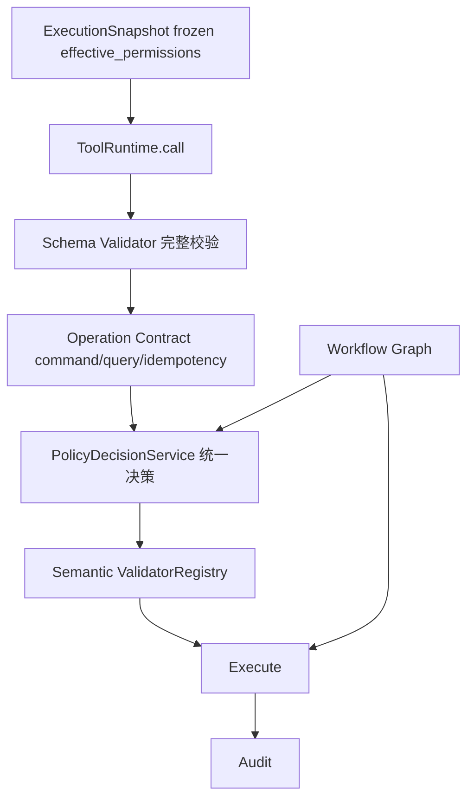

# Runtime 第二阶段整改 模块需求与设计一体化文档

> **文档编号**: MOD-RUNTIME-PHASE2-v1.0
> **文档版本**: v0.1
> **创建日期**: 2026-08-31
> **文档状态**: 设计评审中

**评审边界说明**:
- **需求评审**: 第 2 章（需求分析）→ 通过后锁定为需求基线 v1.0
- **设计评审**: 第 3-4 章（技术设计）→ 通过后锁定设计基线 v1.x
- **交接契约**: 2.5 验收条件 — 需求定义 What，设计实现 How

**ID 体系**: FEAT（功能）、RULE（业务规则）、TC（测试用例）、RISK（风险）
场景编号：S-（正常）、E-（异常）、B-（边界）

**来源说明**: 本设计承接 Codex 源码审查问题清单（F-01~F-20，2026-08-31）。其中 F-01/F-10 已被上一阶段（runtime-architecture-closure）部分解决，本设计只收口剩余部分；F-14~F-17 为前端批次，本设计列为 Out of Scope 单列待办。

---

## 目录

- [1. 文档控制](#1-文档控制)
- [2. 需求分析](#2-需求分析)
  - [2.1 需求概述](#21-需求概述)
  - [2.2 痛点与价值](#22-痛点与价值)
  - [2.3 功能方案](#23-功能方案)
  - [2.4 范围与边界](#24-范围与边界)
  - [2.5 验收条件](#25-验收条件)
- [3. 技术设计](#3-技术设计)
  - [3.1 方案选型](#31-方案选型)
  - [3.2 架构设计](#32-架构设计)
  - [3.3 接口设计](#33-接口设计)
  - [3.4 质量实现方案](#34-质量实现方案)
- [4. 部署与运维](#4-部署与运维)
- [5. 风险与依赖](#5-风险与依赖)
- [6. 需求追溯矩阵](#6-需求追溯矩阵)
- [Spec Compliance Matrix](#spec-compliance-matrix)

---

## 1. 文档控制

### 1.1 责任人

| 角色 | 职责范围 |
|------|---------|
| 架构师 | 架构审核、技术决策 |
| 开发负责人 | 技术方案、代码实现 |
| 测试负责人 | 测试策略、质量保证 |

### 1.2 修订历史

| 版本 | 日期 | 作者 | 变更描述 |
|------|------|------|---------|
| v0.1 | 2026-08-31 | Fluxion | 初始草稿（Codex F-01~F-20 整改） |

---

## 2. 需求分析

### 2.1 需求概述

| 项目 | 内容 |
|------|------|
| **模块名称** | Runtime 第二阶段整改 |
| **模块ID** | MOD-RUNTIME-PHASE2 |
| **需求类型** | 技术重构 |
| **业务背景** | Codex 源码审查（2026-08-31）提出 F-01~F-20。上一阶段（runtime-architecture-closure TASK-001~011）已完成架构主链收口（单一 Resolver、effective 图冻结、Tool Policy Pipeline、三服务拆分），本阶段承接其遗留（F-01 收敛收尾、F-08 本阶段引入的全局可变）与更深层的领域边界重构（Model/Runtime/Policy/Capability 领域模型）。 |
| **核心目标** | 深化 Tool 安全内核（完整 JSON Schema + Tool Operation Contract + 可注入 Validator）、收口授权决策（消费 frozen effective 图 + 统一 PolicyDecisionService）、消除 Skill 隐式扩权、重构 Model/Runtime/Workflow 领域边界。 |

### 2.2 痛点与价值

| 维度 | 内容 |
|------|------|
| **当前问题** | ① effective 图已冻结进 Snapshot，但执行路径仍在 `runtime_tool_ops._effective_tool_policy` 实时重算（F-01 收尾）；② Tool 只有最小 `required` 校验、缺 command/query/idempotency/side-effect 语义；③ `_semantic_validators` 是 process-global list；④ Skill 的 `allowed_tools` 隐式扩张 Agent 工具权限；⑤ Model/Runtime/Workflow 领域边界混乱。 |
| **业务影响** | 高风险写操作缺幂等与副作用契约；授权决策多处入口难统一审计；Skill 越权是安全面。 |
| **预期价值** | Tool 契约完整（schema + 副作用 + 幂等）、授权决策单一可信、Skill 权限显式闭合、领域边界清晰可维护。 |

### 2.3 功能方案

#### 2.3.1 功能清单

| 功能ID | 功能名称 | 功能描述 | 优先级 | 来源 |
|--------|---------|---------|--------|------|
| FEAT-01 | 收敛收尾：执行路径消费 frozen 图 | 执行路径改为消费 Snapshot 内 frozen `effective_permissions`，删除 `runtime_tool_ops._effective_tool_policy` 实时重算 | P0 | F-01 |
| FEAT-02 | JSON Schema 完整校验 | 手写最小 validator 支持 type/enum/required/nested/additionalProperties（不引新依赖） | P0 | F-02 |
| FEAT-03 | Tool Operation Contract | `ToolDescriptor` 增 command/query、idempotency、side-effect、retry/compensation 语义 | P0 | F-03/F-19 |
| FEAT-04 | Semantic Validator 可注入 Registry | `_semantic_validators` 全局 list 改为可注入、可版本化的 ValidatorRegistry | P0 | F-08 |
| FEAT-05 | 统一 PolicyDecisionService | Tool/Approval/Workflow Human Gate 统一到单一决策入口 | P1 | F-05 |
| FEAT-06 | Skill required_capabilities + closure 校验 | Skill 改声明 `required_capabilities`，发布期做 closure 校验，消除隐式扩权 | P0 | F-06 |
| FEAT-07 | CapabilityGraph 统一领域模型 | Tool/MCP/Skill 的授权/依赖/运行要求收敛到 EffectiveCapability 图 | P1 | F-18 |
| FEAT-08 | Model 领域重构 | ProviderDefinition → ModelDefinition → ModelPolicy（需 ADR） | P1 | F-04 |
| FEAT-09 | Runtime 职责拆分 | 拆 ExecutionCoordinator/Assembler/ProfileService/Observer + ExecutionSession 去 run/stream 重复 | P1 | F-07/F-11 |
| FEAT-10 | Provider Resolver execution-scoped | `_prepare_registry_model_providers()` 不再 mutate service-level registry | P1 | F-09 |
| FEAT-11 | 去 generic dict 强类型化 | 删除 `executor_config` generic dict，全部强类型化 | P1 | F-10 |
| FEAT-12 | Workflow 复用 Execution Kernel | Workflow 只负责 Graph/Durability，Tool/Policy/Approval 统一复用 Execution Kernel | P1 | F-12 |
| FEAT-13 | Production Guard 白名单 | `isinstance(InMemoryXXX)` 黑名单改为 Adapter 显式声明 capability | P1 | F-13 |
| FEAT-14 | Domain Event 细化 | `ConfigChangeEvent` 细化为 ResourcePublished/PolicyChanged 等 Domain Event | P2 | F-20 |

### 2.4 范围与边界

| 类别 | 内容 |
|------|------|
| **范围（In Scope）** | FEAT-01~14（后端）。 |
| **非范围（Out of Scope）** | 前端批次 F-14~F-17（Builder UX/God Service/Contract 生成/双入口）单列待办，另出 design-frontend。 |
| **前置假设** | FEAT-08 的 Model 领域重构需先补 ADR（规则 25 契约变更）。 |
| **有意妥协 / 技术债** | 无兼容层、无渐进——按最优直接改，存量 fixture/API/UI 一并迁移（不保留旧语义/旧字段）。 |

### 2.5 验收条件

#### 2.5.1 业务规则与约束

| ID | 类型 | 描述 | 验证场景 |
|----|------|------|---------|
| RULE-01 | 业务规则 | 执行期 Tool 授权只消费 frozen effective 图，不实时重算 | S-01 |
| RULE-02 | 业务规则 | Tool 参数经完整 JSON Schema 校验（type/enum/required/nested） | S-02/E-01 |
| RULE-03 | 业务规则 | Tool 副作用/幂等语义显式声明（command/query + idempotency key） | S-03 |
| RULE-04 | 业务规则 | Skill 不隐式扩张 Agent 工具权限（closure 校验） | S-04/E-02 |

#### 2.5.2 功能验收场景

**正常场景**

| 场景ID | 功能ID | 优先级 | 测试层级 | 关键真实边界 | 操作步骤 | 预期结果 |
|--------|--------|--------|---------|-------------|---------|---------|
| S-01 | FEAT-01 | P0 | integration | Snapshot → ToolRuntime | 执行期 tool call 授权 | 只读 frozen `effective_permissions`，不触发 `_effective_tool_policy` 重算 |
| S-02 | FEAT-02 | P0 | unit | Schema validator | type/enum/required/nested 校验 | 合法通过、非法拒绝 |
| S-03 | FEAT-03 | P0 | integration | ToolDescriptor → 执行 | command/query + idempotency 语义 | 幂等键重放不重复副作用 |
| S-04 | FEAT-06 | P0 | integration | 发布 closure 校验 | Skill 声明未覆盖的 allowed_tools | 发布期拒绝（closure 校验） |

**异常场景**

| 场景ID | 功能ID | 测试层级 | 关键真实边界 | 触发条件 | 系统行为 |
|--------|--------|---------|-------------|---------|---------|
| E-01 | FEAT-02 | unit | Schema validator | 参数 type/enum 不符 | 拒绝并返回明确校验错误 |
| E-02 | FEAT-06 | integration | 发布 closure 校验 | Skill allowed_tools 越出 Agent capability | 发布失败 |

#### 2.5.3 非功能指标

| 指标ID | 指标名称 | 目标值 |
|--------|---------|-------|
| NFR-PERF-01 | Tool 授权决策（frozen 图命中） | P95 ≤ 10ms |
| NFR-PERF-02 | Schema 校验开销 | P95 ≤ 5ms |

---

## 3. 技术设计

### 3.1 方案选型

#### 关键决策记录

| 决策点 | 选择 | 被否决项 | 理由 | 可逆性 |
|--------|------|---------|------|--------|
| F-01 收敛方向 | 执行路径消费 frozen effective 图 | 保留执行期实时重算 | 单一事实源，消除漂移 | 易 |
| F-02 校验器 | 引 `jsonschema` 库（标准完整 JSON Schema） | 手写最小 validator | 完整、经过验证，覆盖 type/enum/required/nested/additionalProperties | 易 |
| F-08 Validator | 可注入 ValidatorRegistry（随 PolicyDecision 决策链） | process-global list | 可测试、可版本化、无跨执行泄漏 | 中 |
| F-06 Skill | `required_capabilities` + 发布期 closure 校验（直接迁移 fixture/API/UI） | 保留 `allowed_tools` ∪ | 消除隐式扩权，不保留兼容层 | 中（改 SkillDefinition 契约） |
| F-13 守卫 | Adapter 显式 capability 声明（白名单） | `isinstance` 黑名单 | 白名单可扩展、不误伤 | 中 |

#### 技术栈

| 类别 | 选型 | 版本 | 选型理由 |
|------|------|------|---------|
| 语言 | Python | 3.12+ | 现有 |
| 校验 | Pydantic（typed Spec SoT） | 2.x | 现有 |
| JSON Schema | jsonschema | 最新稳定 | 标准完整 JSON Schema 校验（F-02） |

### 3.2 架构设计

### 3.3 接口设计

#### 形态 C：函数 / 库接口

| 函数签名 | 入参 | 返回 | 错误处理 |
|---------|------|------|---------|
| `ToolRuntime.call(context, tool_id, arguments, *, frozen_policy)` | 读 frozen 图，不再传三个 set | `ToolResult` | `ToolAuthorizationError`/`ToolSchemaError`/`ToolApprovalRequired` |
| `ToolDescriptor` 扩展字段 | `operation: Literal["command","query"]`、`idempotency: IdempotencySpec \| None`、`side_effect: bool` | — | — |
| `ValidatorRegistry.register(validator)` | 可注入 validator | — | — |

### 3.4 质量实现方案

#### 性能设计

| 指标ID | 热点路径 | 目标值 | 实现方案 |
|--------|---------|-------|---------|
| NFR-PERF-01 | Tool 授权决策 | ≤10ms | frozen 图命中，无实时重算（放弃 N+1 查询） |
| NFR-PERF-02 | Schema 校验 | ≤5ms | 手写 validator，O(fields)，无反射开销 |

#### 可靠性设计

| 风险ID | 失效模式 | 应对措施 | 验证场景 |
|--------|---------|---------|---------|
| RISK-01 | frozen 图与执行期语义不一致 | 单一消费点 + 契约测试 | S-01 |

#### 可观测性设计

| 场景 | 实现方案 |
|------|---------|
| 决策可解释 | PolicyDecisionService 统一输出决策链（version/schema/semantic/risk/approval） |

---

## 4. 部署与运维

无 DB 迁移（FEAT-06/08 为契约级变更，经发布期校验/迁移）。前端批次（F-14~F-17）另立项。

---

## 5. 风险与依赖

| 风险ID | 类型 | 描述 | 概率 | 影响 | 应对措施 | 验证场景 |
|--------|------|------|------|------|---------|---------|
| RISK-02 | 契约 | FEAT-06 改 SkillDefinition（required_capabilities）直接迁移存量 skill spec/fixture/API/UI，不保留兼容层 | 中 | 中 | 直接迁移 | S-04/E-02 |
| RISK-03 | 契约 | FEAT-08 Model 领域重构需 ADR（规则 25） | 高 | 高 | 先补 ADR 再拆 TASK | — |

---

## 6. 需求追溯矩阵

| 来源 | 功能ID | 接口 | 测试用例 | 测试层级 | 状态 |
|------|--------|------|---------|---------|------|
| F-01 | FEAT-01 | `ToolRuntime.call` frozen_policy | S-01 | integration | 待实现 |
| F-02 | FEAT-02 | Schema validator | S-02, E-01 | unit | 待实现 |
| F-03/F-19 | FEAT-03 | `ToolDescriptor` | S-03 | integration | 待实现 |
| F-08 | FEAT-04 | `ValidatorRegistry` | S-03 | unit | 待实现 |
| F-05 | FEAT-05 | `PolicyDecisionService` | S-01 | integration | 待实现 |
| F-06 | FEAT-06 | `SkillDefinition.required_capabilities` | S-04, E-02 | integration | 待实现 |
| F-18 | FEAT-07 | `EffectiveCapability` | S-01 | integration | 待实现 |
| F-04 | FEAT-08 | ProviderDefinition/ModelDefinition/ModelPolicy | — | — | 待实现（需 ADR） |
| F-07/F-11 | FEAT-09 | ExecutionCoordinator/Assembler | — | — | 待实现 |
| F-09 | FEAT-10 | execution-scoped Provider Resolver | — | — | 待实现 |
| F-10 | FEAT-11 | 强类型化 | — | — | 待实现 |
| F-12 | FEAT-12 | Execution Kernel 复用 | — | — | 待实现 |
| F-13 | FEAT-13 | Adapter capability 声明 | — | — | 待实现 |
| F-20 | FEAT-14 | Domain Event | — | — | 待实现 |

---

## Spec Compliance Matrix

| Spec/Rule | enforcement | 设计影响 | 设计落点 | 验证场景 | 状态 |
|-----------|-------------|---------|---------|---------|----------------|
| `fluxion-runtime-core#RULE-fluxion-runtime-001` | required | 无状态 + 固定 Snapshot | FEAT-01 执行期只消费 frozen 图 | S-01 | applied |
| `fluxion-workflow-capability#RULE-fluxion-workflow-001` | required | Tool 是 Adapter、业务属 Capability | FEAT-03/06/07 Tool/Capability 契约 + FEAT-12 Workflow 复用 | S-03/S-04 | applied |
| `fluxion-resource-registry#RULE-fluxion-resource-001` | required | 资源版本化 | FEAT-06 closure 校验 + FEAT-08 Model 资源化 | S-04 | applied |
| `fluxion-dfx#RULE-fluxion-dfx-001` | required | 安全/可观测编码期落实 | FEAT-02/05/13 Schema/决策/守卫 | E-01 | applied |
| `fluxion-console-channel#RULE-fluxion-console-001` | required | Console/Runtime 边界 | 本设计为 Runtime 内核，前端 F-14~F-17 Out of Scope | — | applied |
| `backend-code-quality-performance#RULE-backend-quality-001` | required | 质量约束 | FEAT-04 去全局可变 + FEAT-09 去重复 | — | applied |
| `backend-directory-structure#RULE-backend-directory-001` | required | 模块按域组织 | FEAT-09 Runtime 职责拆分目录落位 | — | applied |
| `backend-logging#RULE-backend-logging-001` | required | 结构化日志 | FEAT-05 统一决策审计 | — | applied |

---

*文档结束*
