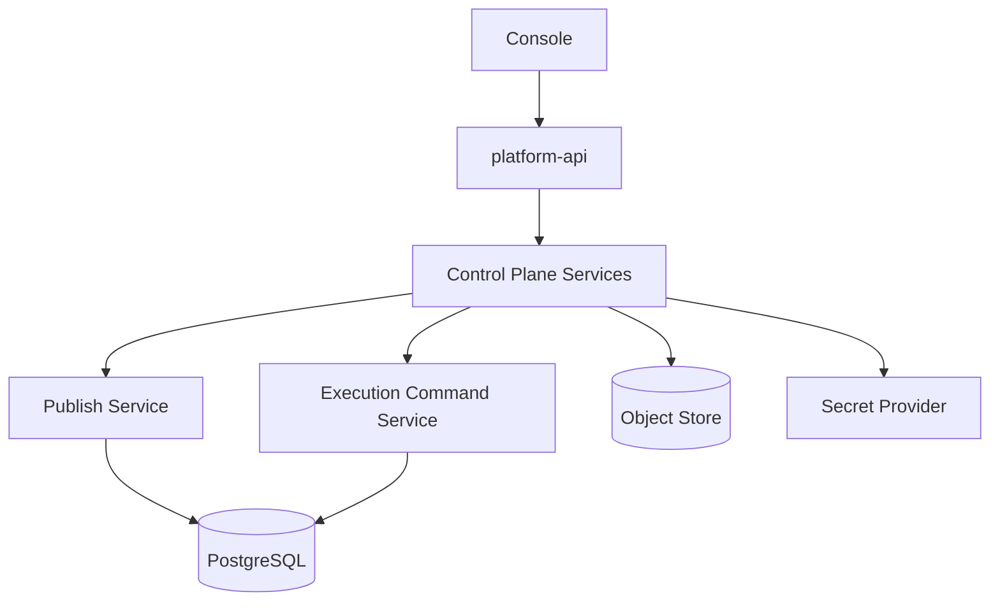
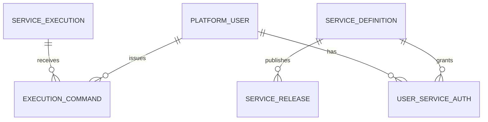

# Platform API 与控制面 模块需求与设计一体化文档

> **文档编号**: MOD-CTRL-1.0  
> **文档版本**: v1.2（align 草稿）  
> **创建日期**: 2026-09-10  
> **文档状态**: 设计草稿（V1.7 整改对齐 + align 细化）  
> **设计基线**: 《通用智能服务执行框架 V1.6 总体设计说明书》+《05-变更记录/V1.6-to-V1.7-整改对齐说明》（D04/AuditLog）  
> **模板类型**: design-full（跨模块/架构核心模块）  
> **需求目录**: `.code-flow/tasks/2026-09-10/platform-api-control/`

**评审边界说明**：

- 需求评审：第 2 章，确认模块职责和边界；
- 设计评审：第 3-4 章，确认技术实现、数据、接口、DFX、部署；
- 本文只设计 Framework Core，不引入任何具体项目业务字段。

---

## 1. 文档控制

### 1.1 责任人

| 角色 | 姓名 | 职责范围 |
|---|---|---|
| 产品/架构负责人 | 待定 | 模块边界、需求与总体设计一致性 |
| 开发负责人 | 待定 | 技术方案与实现 |
| 测试负责人 | 待定 | 场景与 Gate |
| 安全/运维评审 | 按需 | 安全、可靠性、部署评审 |

### 1.2 修订历史

| 版本 | 日期 | 变更描述 |
|---|---|---|
| v0.1 | 2026-09-10 | 基于总体设计 V1.6 首次形成模块详细设计 |
| v1.1 | 2026-09-10 | V1.7 整改：Agent 仅 Save/Enable/Disable（D04）、补 AuditLog ER/索引（P1-05） |
| v1.2 | 2026-09-10 | align 细化：删 API-03（Agent 发布，与 D04 矛盾）并补 enable；FEAT-02/03 管理 API 全量定接口（API-08~API-17）；E-02 改挂 FEAT-01；FEAT-05 补 S-05；S-03 定 integration（编排停服）；Compliance Matrix 换真实 Rule 引用 |

---

## 2. 需求分析

### 2.1 需求概述

| 项目 | 内容 |
|---|---|
| 模块名称 | Platform API 与控制面 |
| 模块ID | MOD-CTRL |
| 需求类型 | 新框架模块设计 |
| 业务背景 | 管理员/Builder 需要统一管理 Agent、Service、Capability、Knowledge、Channel、用户授权和运行查询，同时控制面不能成为终端用户实时执行主链。 |
| 核心目标 | 提供低频、可审计、统一响应/日志的控制面 API，并承载 Console 静态资源。 |
| 运行形态 | `platform-api` 独立进程/镜像；Production 通常 1 replica |

### 2.2 痛点与价值

| 维度 | 内容 |
|---|---|
| 目标用户 | Admin、Builder |
| 当前问题 | 如果 Console/API 与 Runtime truth 紧耦合，控制面故障会中断已发布服务；若各页面各自定义响应、日志、分页则维护成本高。 |
| 框架影响 | 控制面是所有配置入口，错误的发布/授权可能直接影响所有 Runtime。 |
| 预期价值 | 统一管理、低运维复杂度、控制面下线不影响已发布 Runtime/Worker 继续执行。 |

### 2.3 功能方案

#### 2.3.1 功能清单

| 功能ID | 功能名称 | 功能描述 | 优先级 | 来源 |
|---|---|---|---|---|
| FEAT-01 | Agent/Service 管理 | Agent 仅创建/编辑/保存/启用-禁用（无发布，V1.7 D04）；Service 保留 Draft/测试/发布/停用。 | P0 | 总体设计 V1.7 |
| FEAT-02 | 能力与资源管理 | 管理 Capability、Knowledge、Model、Skill、Channel、Integration 注册信息；direct-effect + revision，Skill artifact 只读。 | P0 | 总体设计 V1.6 |
| FEAT-03 | 用户与授权管理 | 管理 PlatformUser、Channel Binding、Service/Capability 授权、AuthProfile 引用（只存 ref，不碰明文）。 | P0 | 总体设计 V1.6 |
| FEAT-04 | 运行查询与命令 | 查询 Execution/Trace/Audit，发出 Cancel/Retry/HumanDecision 等命令（写 `execution_command`）。 | P0 | 总体设计 V1.6 |
| FEAT-05 | Console 交付 | 生产镜像内承载 React/Vite Console 静态资源（`StaticFiles` 挂载 `dist/`）。 | P0 | 总体设计 V1.6 |

> 无 PRD，来源列引用总体设计基线。

#### 2.4 范围与边界

| 类别 | 内容 |
|---|---|
| 范围（In Scope） | 管理 REST API（API-01/02/04~17）、统一鉴权依赖注入点、发布/停用、运行查询、审计、Console 静态资源挂载。 |
| 非范围（Out of Scope） | 运行 LangGraph、消费后台 Execution、保存 Credential 明文、直接管理 Agent/Worker Pod 生命周期。 |
| 前置假设 | 外部身份认证机制由部署项目配置；Runtime 可从共享 Store 解析已发布配置；Console 已构建出 `dist/`。 |
| 有意妥协/技术债 | V1 不做复杂多组织审批/Marketplace；管理面 HA 在真实需求出现后再扩副本；单 key 鉴权（内网无公网暴露已够用），SSO 后续接入 |

### 2.5 验收条件

#### 2.5.1 业务规则与约束

| ID | 类型 | 描述 | 验证场景 |
|---|---|---|---|
| RULE-01 | 系统约束 | 普通 JSON API 必须使用统一 ApiResponse Envelope。 | S-01/E-01 |
| RULE-02 | 系统约束 | 发布操作必须原子切换 current published（调 01 LIB-01 同事务 + audit）。 | S-02 |
| RULE-03 | 系统约束 | platform-api 不得调用 Kubernetes API 为用户动态创建 Agent/Worker Pod。 | E-02 |
| RULE-04 | 系统约束 | Control Plane 故障不能阻止已创建 Execution 继续执行。 | S-03 |
| RULE-05 | 系统约束 | Agent 无发布状态机；任何 `POST /agents/*/publish` 形态不得出现（V1.7 D04，回退 S-06 类门禁思路）。 | S-01/E-03 |
| RULE-06 | 系统约束 | 管理动作必须写 Audit（action/entity/request_id），details 禁完整 payload。 | S-02/S-04 |

#### 2.5.2 功能验收场景

**正常场景**

| 场景ID | 功能ID | 优先级 | 测试层级 | 关键真实边界 | 前置条件 | 操作步骤 | 预期结果 |
|---|---|---|---|---|---|---|---|
| S-01 | FEAT-01 | P0 | integration | HTTP → Application → PostgreSQL → Response | 已完成基础配置 | 保存 Agent、enable/disable、分页查询 | 统一 Envelope 带 request_id；保存直接生效 revision+1，无 Draft/Published |
| S-02 | FEAT-01 | P0 | integration | HTTP → Publish Service → PostgreSQL Transaction | Service 有 Draft | POST 发布 Service | 原子生成 Snapshot + audit，current 切换；重复发布幂等单行 |
| S-03 | FEAT-04 | P0 | integration | platform-api Down → PostgreSQL → Worker | docker 编排环境 | Execution 运行中停 platform-api 容器再恢复 | Worker 继续执行；恢复后 Console 查到完整状态 |
| S-04 | FEAT-02 | P0 | integration | Console/API → Repository → Runtime Config | 已完成基础配置 | 更新 Knowledge/Model/Capability 配置 | 校验通过 revision+1 并对后续解析生效 |
| S-05 | FEAT-05 | P0 | integration | HTTP → StaticFiles → dist/ | Console 已构建 | GET `/` 及静态资源 | 返回 Console index.html；API 前缀不受影响 |
| S-06 | FEAT-03 | P0 | integration | HTTP → Grant Repository | 用户与 Service 已存在 | 创建/撤销 user_service_auth | 组合唯一约束生效；撤销后新 Execution 鉴权失败但历史 Snapshot 不变 |

**异常场景**

| 场景ID | 功能ID | 测试层级 | 关键真实边界 | 触发条件 | 系统行为 | 用户感知 |
|---|---|---|---|---|---|---|
| E-01 | FEAT-03 | integration | HTTP Exception Pipeline | 非法参数/未授权管理请求 | 统一错误 Envelope + 正确 HTTP status | 可识别错误，不泄露内部细节 |
| E-02 | FEAT-01 | integration | Architecture Gate | 新增经 platform-api 创建 Runtime Pod 的代码（k8s client 调用） | 门禁测试失败 | 可识别错误，不泄露内部细节 |
| E-03 | FEAT-01 | integration | Router → Agent State | 调用不存在的 Agent 发布形态 / 非法状态流转 | 404/409 统一 Envelope | 可识别错误，不泄露内部细节 |

#### 2.5.3 非功能指标

| 指标ID | 指标名称 | 目标值 | 测量方法 |
|---|---|---|---|
| NFR-REL-01 | 可靠性 | 不得丢失/破坏框架权威状态；具体 SLA 待真实部署压测后确定 | 故障注入 + integration/E2E |
| NFR-SEC-01 | 安全边界 | 不得信任 LLM 提供的身份/权限/Host 路径等安全上下文 | Architecture Gate + integration |
| NFR-OBS-01 | 可观测性 | 关键操作必须携带 request_id/trace_id 或 execution_id | 日志/Trace 断言 |

性能/QPS/延迟阈值当前没有真实压测依据，本文不虚构固定数字；上线门槛在真实 Reference Integration 跑通后补充。**无性能敏感点**：控制面为低频管理 API（Admin/Builder），无写热点与高频调用，跳过性能与容量维度。

---

## 3. 技术设计

### 3.1 方案选型

#### 关键决策记录

| 决策点 | 选择 | 被否决项 | 理由 | 可逆性 |
|---|---|---|---|---|
| Console 部署 | 静态资源并入 platform-api | 独立 console-web 镜像 | 第一阶段减少一个部署单元，控制面本身低频 | 易 |
| 控制面副本 | 默认 1 | 默认多副本 | 不随终端用户流量扩容；HA 需求出现后再调整 | 易 |
| 运行命令 | 写 execution_command | 直接 RPC 控制 Worker | 持久化命令可恢复/审计 | 中 |
| Agent 发布形态 | 删除（D04） | 保留 publish 路由 | direct-effect + revision 已覆盖；发布只属于 Service | 易 |

#### 技术栈

| 类别 | 选型 | 版本 | 选型理由 |
|---|---|---|---|
| 语言 | Python | 3.12+ | 统一 Framework 后端生态 |
| Web | FastAPI | 0.115+ | 异步 API、OpenAPI、Pydantic 集成 |
| Schema | Pydantic v2 | 2.x | 输入/输出统一校验 |
| ORM | SQLAlchemy Async | 2.x | 事务与异步数据库 |

### 3.2 架构设计



#### 分层职责

| 层级 | 职责 | 代码落点 |
|---|---|---|
| Router | 管理 API、校验、统一响应 | `apps/platform_api/routes/` |
| Application | 发布、授权、查询、命令用例 | `framework/domain/publish.py` + 各 Repository |
| Domain | Agent/Service/Grant 等规则 | `framework/domain/` |
| Repository | PostgreSQL 读写 | `adapters/postgres/*_repository.py` |
| Static | Console build 资源，仅生产挂载 | `StaticFiles(dist/)` |

### 3.3 数据设计

> **统一数据库公共字段约束**：本模块凡新增 Framework 自建表，均必须包含 `is_deleted BOOLEAN NOT NULL DEFAULT FALSE`、`create_time TIMESTAMPTZ NOT NULL DEFAULT now()`、`update_time TIMESTAMPTZ NOT NULL DEFAULT now()`；Repository 默认过滤 `is_deleted=false`，删除默认逻辑删除。第三方自管理表（如 LangGraph Checkpointer）不修改其内部 Schema。

本模块**不新增表**（复用 01 模块表：`agent_definition/service_definition/service_release/user_service_auth/execution_command/audit_log/platform_user/channel_account`）。


| 数据对象/表 | 关键字段 | 约束/索引 | 说明 |
|---|---|---|---|
| agent_definition/service_definition | Draft/Published 管理字段 | 发布事务 | 核心配置 |
| platform_user/user_service_auth | 用户/服务授权 | 组合唯一约束 | 控制面授权 |
| execution_command | execution_id、actor_user_id、command_type、status | execution_id 索引 | 可靠命令 |
| audit_log | actor、action、entity、before/after ref、request_id | actor/time/entity 索引 | 管理操作审计 |


**ER 图**



### 3.4 接口设计

形态：**HTTP API**（`GET /api/v1/...` 前缀见 `main.py`）。

#### 接口清单

| 接口ID | 接口/函数 | 形态 | 说明 | 关联功能 |
|---|---|---|---|---|
| API-01 | GET /api/v1/agents | HTTP | Agent 列表/分页（`page/page_size/keyword/enabled`） | FEAT-01 |
| API-02 | POST /api/v1/agents · PUT /api/v1/agents/{id} | HTTP | 创建/保存 Agent，直接生效 revision+1（V1.7 D04） | FEAT-01 |
| API-02b | POST /api/v1/agents/{id}/enable · POST /api/v1/agents/{id}/disable | HTTP | 启用/停用（对称；disable 已有，补 enable） | FEAT-01 |
| API-04 | GET /api/v1/services | HTTP | Service 列表/分页 | FEAT-01 |
| API-05 | POST /api/v1/services/{id}/publish | HTTP | 发布 Service（调 LIB-01，幂等，写 audit） | FEAT-01 |
| API-06 | GET /api/v1/executions | HTTP | 运行记录查询（分页/状态过滤） | FEAT-04 |
| API-07 | POST /api/v1/executions/{id}/commands | HTTP | 取消/重试/人工决定（写 execution_command，见 §3.4.1） | FEAT-04 |
| API-08 | GET /api/v1/capabilities · PUT /api/v1/capabilities/{id} | HTTP | Capability 查询/保存（direct-effect + revision） | FEAT-02 |
| API-09 | GET /api/v1/knowledge-sources · PUT /api/v1/knowledge-sources/{id} | HTTP | Knowledge 配置查询/保存 | FEAT-02 |
| API-10 | GET /api/v1/model-configs · PUT /api/v1/model-configs/{id} | HTTP | Model 配置查询/保存（只存 config，不存密钥明文） | FEAT-02 |
| API-11 | GET /api/v1/skills | HTTP | Skill artifact 只读列表（按 checksum 引用，不可变） | FEAT-02 |
| API-12 | GET /api/v1/channels · PUT /api/v1/channels/{id} | HTTP | ChannelAccount 查询/保存（含 default_agent + revision） | FEAT-02 |
| API-13 | GET /api/v1/integrations | HTTP | Integration 注册信息只读 | FEAT-02 |
| API-14 | GET/POST /api/v1/users | HTTP | PlatformUser 查询/创建 | FEAT-03 |
| API-15 | POST/DELETE /api/v1/grants | HTTP | user_service_auth 授权/撤销 | FEAT-03 |
| API-16 | GET /api/v1/channel-bindings | HTTP | Channel Binding 只读查询 | FEAT-03 |
| API-17 | GET /api/v1/auth-profiles | HTTP | AuthProfile 引用只读（禁返回 credential 明文/可解析句柄） | FEAT-03 |

> ~~API-03 POST /agents/{id}/publish~~ 已删除（V1.7 D04；RULE-05 门禁）。

列表接口统一使用 `page/page_size/filter/search/sort`，返回 `items/total/page/page_size`（`PageData`）。管理动作必须写 Audit；删除默认优先软停用/disabled，避免破坏被历史 Execution 引用的数据。

#### §3.4.1 API-07 命令体

```json
{
  "command_type": "CANCEL",
  "reason": "user requested",
  "idempotency_key": "cmd-uuid-1"
}
```

`command_type ∈ {CANCEL, RETRY, HUMAN_DECISION}`（HUMAN_DECISION 挂人工载荷，05 模块消费；本模块只落库+审计，不解释业务语义）。同 `idempotency_key` 重放返回原命令，不重复入队。

所有普通 HTTP JSON 接口必须复用统一响应 Envelope：

```json
{
  "code": "OK",
  "message": "success",
  "data": {},
  "request_id": "req-xxx",
  "timestamp": "2026-09-10T15:00:00+00:00"
}
```

SSE/WebSocket/文件流属于协议例外，但必须复用统一错误码 taxonomy 和 request/trace 关联策略。

### 3.5 质量实现方案

#### 可靠性

发布与授权修改使用事务；幂等管理命令带 command id/idempotency key；Control Plane 不维护 Worker 内存状态。

#### 安全性

管理 API 强制 Admin/Builder 权限（V1 落地 B-lite：内部署、无公网暴露，`Settings.admin_api_key` 只从 env/secret 来，`dependencies.require_admin` 统一挂载全部管理路由，`/healthz` 除外；audit 以 key 指纹记 actor；SSO 后续接入）；Credential 只管理 ref；敏感字段不进入普通详情接口。

#### 可观测性

统一 request_id、access log、audit event；发布失败、权限拒绝、命令积压暴露指标。

#### 测试策略

```text
unit
→ 纯规则/状态机/转换

integration
→ HTTP → Repository → 真实 PG（TestClient + 真实 DB；S-03 用编排脚本停服）
→ Repository / Provider / Runtime 边界

E2E
→ 真实进程/API/数据库/用户可见结果

architecture
→ 依赖方向、k8s-client 禁用门禁（E-02）、Agent 无 publish 形态门禁（RULE-05/E-03）
```

---

## 4. 部署与运维

### 4.1 部署架构

Kubernetes Deployment `platform-api`；默认 1 replica；挂载/内嵌 Console static assets（`dist/`，S-05）；不依赖本地持久卷保存业务状态。

### 4.2 发布与回滚

- 框架代码通过镜像/包版本发布；
- Schema 变化使用 Alembic expand → migrate → switch → contract；
- 只有 `Service` 采用草稿/已发布两态，`Agent` 统一 direct-effect + revision（V1.7 D04），不把代码发布和业务定义发布混成一套版本系统；
- 运行配置可直接生效时必须保留 revision/audit；
- 回滚不得恢复已经撤销的用户权限、Credential 或安全禁用状态。

### 4.3 监控告警

health/readiness（`/healthz` 独立于业务认证）、HTTP error rate、publish failures（>0 告警，沿用 01 零阈值）、DB latency、command create failures；其余阈值待定。

阈值当前统一标记为**待定**，由 Reference Integration 实测建立基线后配置。

---

## 5. 风险与依赖

### 5.1 项目依赖

| 依赖模块/团队 | 依赖内容 | 状态 | 风险等级 |
|---|---|---|---|
| PostgreSQL | 控制面 SoT | 必需 | 高 |
| Object Store | Skill/Artifact metadata | 按功能 | 中 |
| Secret Provider | Credential Ref 测试/解析 | 必需 | 高 |
| Console | 前端静态资源 | 同镜像 | 低 |

### 5.2 风险识别

| 风险ID | 类型 | 描述 | 概率 | 影响 | 应对措施 | 验证场景 |
|---|---|---|---|---|---|---|
| RISK-01 | 可用性 | 控制面被误做成 Runtime 同步依赖 | 中 | 高 | Runtime 使用共享 Store/Registry；Control Plane Down Gate | S-03 |
| RISK-02 | 安全 | 管理 API 权限过大 | 中 | 高 | Admin/Builder 分权、Audit、危险操作显式确认 | E-01 |

---

## 6. 需求追溯矩阵

| 来源 | 功能ID | 接口ID | 测试场景 | 测试层级 | 状态 |
|---|---|---|---|---|---|
| 总体设计 V1.7 | FEAT-01 | API-01, API-02, API-02b, API-04, API-05 | S-01, S-02, E-03 | integration | 待实现（agents 现状有 5 路由；缺 enable + services 发布） |
| 总体设计 V1.6 | FEAT-02 | API-08 ~ API-13 | S-04 | integration | 待实现 |
| 总体设计 V1.6 | FEAT-03 | API-14 ~ API-17 | S-06, E-01 | integration | 待实现 |
| 总体设计 V1.6 | FEAT-04 | API-06, API-07 | S-03 | integration/manual | 待实现（S-03 定 integration 编排） |
| 总体设计 V1.6 | FEAT-05 | 内部契约（StaticFiles 挂载） | S-05 | integration | 待实现 |

---

## Spec Compliance Matrix

| Spec/Rule | enforcement | 设计影响 | 设计落点 | 验证场景 | verifier | 状态 |
|---|---|---|---|---|---|---|
| backend-platform-rules#RULE-backend-platform-001 | required | 统一 Envelope + 错误码 taxonomy；1 replica + 静态挂载 | §3.4/§4.1 | S-01/E-01/S-05 | `test_response.py` + TestClient | applied |
| backend-code-quality-performance#RULE-backend-quality-001 | required | 路由只转发+转换；命令幂等；每 API 有用例 | §3.2/§3.4.1 | S-01/S-02/E-03 | pytest.raises 断 code | applied |
| backend-database#RULE-backend-database-001 | required | 复用 01 表无新增；发布/audit 同事务 | §3.3/§3.5 | S-02/S-06 | integration 真实 PG | applied |
| backend-directory-structure#RULE-backend-directory-001 | required | routes/ 只转发；配置走 settings | §3.2 | E-02 | architecture gate | applied |
| backend-logging#RULE-backend-logging-001 | required | request_id + access log + audit | §3.5 | S-01/S-02 | 日志/Trace 断言 | applied |

---

## 附录：术语表

| 术语 | 定义 |
|---|---|
| Framework Core | 与具体业务项目解耦的框架内核 |
| Integration | 具体项目对框架 SPI/Contract 的实现和配置 |
| Capability | 稳定的“系统能做什么”合同 |
| Execution | 一次可靠业务服务执行实例 |
| SoT | Source of Truth，权威事实源 |
| SPI | Service Provider Interface，扩展接口 |
| DFX | 面向可靠性、安全性、可测试性、可运维性等质量属性的设计 |

---
