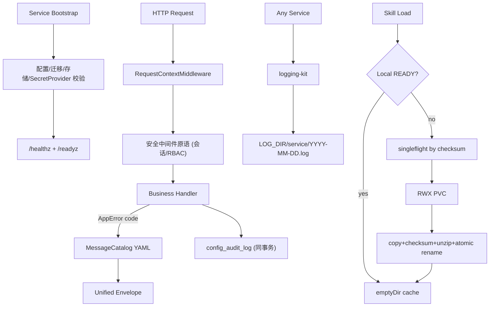
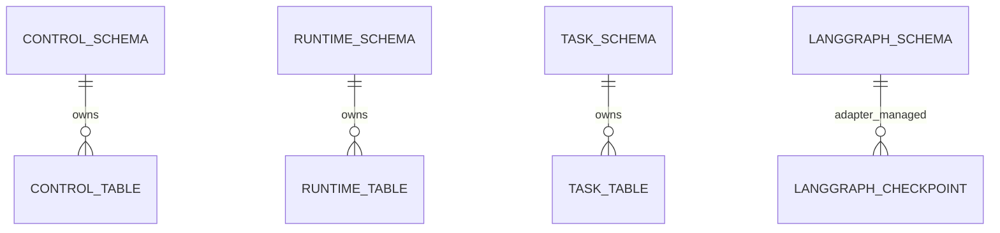

# 平台底座与公共框架 模块需求与设计一体化文档

> **文档编号**: MOD-FOUNDATION-V1.1  
> **文档版本**: v1.1  
> **创建日期**: 2026-09-17  
> **文档状态**: 设计评审中  
> **模板**: design-full.md

## 1. 文档控制

| 项目 | 内容 |
|---|---|
| 模块 | 平台底座与公共框架 |
| Owner | 共享 packages + console-platform |
| 数据 Owner | control/runtime/task/langgraph schema baseline |
| 前置模块 | - |
| 建议代码位置 | packages/logging-kit/；packages/api-kit/；packages/contracts/；packages/common/；packages/artifact-store/；migrations/；apps/console-platform/frontend/src/components/common/；apps/console-platform/frontend/src/i18n/ |

### 1.1 责任人

| 角色 | 姓名 | 职责范围 |
|------|------|---------|
| 产品经理 | 待定 | 需求定义、业务验收 |
| 开发负责人 | 待定 | 技术方案、代码实现 |
| 测试负责人 | 待定 | 测试策略、质量保证 |
| 架构师 | 待定 | 架构审核、依赖方向与技术决策 |

### 1.2 修订历史

| 版本 | 日期 | 作者 | 变更描述 |
|------|------|------|---------|
| v1.0 | 2026-09-17 | fluxion-harness | 初始设计 |
| v1.1 | 2026-09-18 | fluxion-harness | 对齐 V1.4 决策（docs/17）：补 `langgraph` schema、依赖方向门禁、启动初始化校验与 `/healthz`+`/readyz`、质量门清单、固定 10 项菜单、错误码登记约束（附录 A）、Console 登录/RBAC 归属 13-console-auth |

## 2. 需求分析

### 2.1 需求概述

| 项目 | 内容 |
|---|---|
| 模块名称 | 平台底座与公共框架 |
| 模块 ID | MOD-FOUNDATION |
| 需求类型 | 中大型功能开发 |
| 业务背景 | 后续四个服务和所有业务模块必须共享日志、响应、错误码国际化、前端国际化、ArtifactStore、Contract 与公共 Semi 组件，避免重复造轮子。 |
| 核心目标 | 先冻结可复用底座，使后续模块只实现业务，不再设计日志/响应/i18n/公共 UI/文件缓存框架。 |

### 2.2 痛点与价值

| 维度 | 内容 |
|---|---|
| 目标用户/调用方 | Builder / Admin / End User / 内部服务（按模块实际入口） |
| 当前问题 | 后续四个服务和所有业务模块必须共享日志、响应、错误码国际化、前端国际化、ArtifactStore、Contract 与公共 Semi 组件，避免重复造轮子。 |
| 业务影响 | 模块边界或契约不固定会导致上层重复设计、接口漂移和跨模块返工。 |
| 预期价值 | 先冻结可复用底座，使后续模块只实现业务，不再设计日志/响应/i18n/公共 UI/文件缓存框架。 |

### 2.3 功能方案

#### 2.3.1 功能清单

| 功能ID | 功能名称 | 功能描述 | 优先级 | 来源 |
|---|---|---|---|---|
| FEAT-01 | 统一日志 | 仅配置 LOG_DIR，按 service/YYYY-MM-DD.log 输出 JSON 日志。 | P0 | 需求描述 |
| FEAT-02 | 统一 REST Envelope | code/msg/data/trace_id/request_id/timestamp + AppError(code) + 安全中间件原语。 | P0 | 需求描述 |
| FEAT-03 | 全栈 i18n | 后端 YAML code→中英文；前端 locale JSON + X-Locale。 | P0 | 需求描述 |
| FEAT-04 | ArtifactStore/Cache | NFS RWX PVC 权威源 + Runtime/Worker emptyDir READY cache（singleflight）。 | P0 | 需求描述 |
| FEAT-05 | 公共前端组件 | 列表/详情/表单/状态/分页等 Semi 组件封装；ConsoleShell 固定 10 项菜单。 | P0 | 需求描述 |

#### 2.3.2 字段约束

| 字段类别 | 约束 |
|---|---|
| ID | 业务实体统一 UUID；跨 Owner Schema 仅逻辑引用 UUID |
| 时间 | PostgreSQL 使用 `timestamptz`；Console 展示 `YYYY-MM-DD HH:mm:ss` |
| 删除 | 产品表统一 `is_deleted` 软删除；状态枚举不重复表达 DELETED |
| Secret | 只保存 SecretRef；Secret Value 不进入 DB / Snapshot / 日志 / LLM / 审计 |
| 枚举 | API 与 DB 统一使用稳定英文枚举值，中文/英文只在 UI/i18n 层映射 |
| 错误 | 业务代码只抛稳定 `code`；`msg/http_status` 由公共配置映射 |

### 2.4 范围与边界

| 类别 | 内容 |
|---|---|
| In Scope | logging-kit、api-kit（Envelope/AppError/审计与安全中间件原语）、contracts/common、NFS-backed ArtifactStore 原语与 SkillArtifactCache、Alembic owner schema（control/runtime/task/langgraph）、ConsoleShell 与公共 Semi 组件；依赖方向门禁（apps → kits/packages → common；Runtime/Worker 不 import Console ORM/Repository；Skill 不 import Runtime/Console）；启动初始化校验（配置/迁移/存储/SecretProvider 可达）；每服务 `/healthz` + `/readyz`；质量门清单（ruff/mypy/pytest/契约/迁移 parity/镜像扫描）。 |
| Out of Scope | 不实现具体业务 CRUD；不部署 MinIO/S3；不把 NFS Server 当业务 Pod；不引入 Redux/Zustand；不实现 Console 登录、账号、会话与 RBAC 业务（归属 13-console-auth，01 只提供 api-kit 安全中间件原语）；不提供“系统设置/中间件状态”菜单。 |
| 技术债 | 无；不为未确认的未来能力增加兼容层 |

**ArtifactStore 所有权边界**：01 只提供 `packages/artifact-store` 原语（`storage_key` ⇄ NFS mount 解析、原子写入、checksum 校验、emptyDir READY 缓存与 singleflight）。05-skill-management 负责 Skill 导入与 Artifact 元数据写入；08/09/10 等消费方只按 `storage_key` 读取（10-im-gateway 按 delivery 中 `artifact_ids` 取件投递）。禁止其它模块新增第二套存储抽象或直接拼接 NFS 路径（docs/02 §3.3、docs/03 §5）。

**Console 登录/RBAC 归属**：01 只提供 api-kit 安全中间件能力（会话校验依赖、角色依赖注入、`UNAUTHORIZED`/`FORBIDDEN` 统一响应）；Console 登录、`console_account`/`console_session` 账号会话业务归属 13-console-auth（新增模块）。

### 2.5 验收条件

#### 2.5.1 业务规则与约束

| ID | 类型 | 描述 | 验证场景 |
|---|---|---|---|
| RULE-01 | 系统约束 | 固定 4 个部署单元；Runtime/Worker 无状态横向扩展。 | S-01 / S-07 |
| RULE-02 | 系统约束 | 统一 logging-kit；仅配置 LOG_DIR；日志按 service/YYYY-MM-DD.log 保存并带 trace_id/request_id。 | S-01 |
| RULE-03 | 系统约束 | JSON REST 统一 code/msg/data/trace_id/request_id/timestamp；业务只抛 code，msg/http_status 配置映射。 | S-02 / S-10 |
| RULE-04 | 系统约束 | 后端错误和前端页面支持 zh-CN/en-US；新增业务仅增加配置。 | S-03 / E-02 |
| RULE-05 | 系统约束 | Console 使用 React + Semi；左上操作、右上搜索筛选、右下分页；主展示字段打开详情。 | S-09（FE 文档 S-FE-01） |
| RULE-06 | 系统约束 | 详情 SideSheet 标题/副标题左侧，操作按钮与关闭 X 同行靠右，Tabs 在其下。 | FE 文档 S-FE-01 |
| RULE-07 | 系统约束 | 产品表统一 is_deleted/create_time/update_time；同 Owner Schema 物理 FK，跨 Owner Schema 逻辑 UUID。 | S-08 / E-05 |
| RULE-08 | 系统约束 | Secret Value 不进 DB/Snapshot/日志/LLM，只保存 SecretRef。 | S-01 / FE 文档 E-FE-02 |
| RULE-09 | 系统约束 | 依赖方向门禁：apps → kits/packages → common；Runtime/Worker 不 import Console ORM/Repository；Skill 不 import Runtime/Console；由 CI import-linter/architecture test 强制。 | S-06 / E-03 |
| RULE-10 | 系统约束 | 启动初始化校验：配置加载、迁移到 head、Artifact Store 挂载、SecretProvider 可达；任一失败快速退出（fail fast），不进入就绪。 | S-07 / E-04 |
| RULE-11 | 系统约束 | 每个服务暴露 `/healthz`（进程存活）与 `/readyz`（依赖就绪），由部署平台探针消费。 | S-07 |
| RULE-12 | 系统约束 | 质量门：ruff、mypy、pytest、契约测试（枚举/错误码）、迁移与 docs/02 parity、镜像扫描，全部通过方可合入/发布。 | S-08 / E-05 |
| RULE-13 | 系统约束 | ConsoleShell 菜单固定 10 项（概览/Agent/Skill/MCP/模型/用户/项目平台/后台任务/定时任务/运行审计）；无系统设置/中间件状态。 | S-09 |
| RULE-14 | 系统约束 | 01 只提供 api-kit 安全中间件原语（会话校验/RBAC 依赖注入）；登录、账号、会话业务归属 13-console-auth。 | S-10 |
| RULE-15 | 系统约束 | `config_audit_log` 由 api-kit 审计原语写入：`actor_user_id` = 登录的 `console_account.id`，与业务变更同一事务；before/after 不含 Secret Value；config 审计 `result_status` 固定 SUCCESS。 | S-11 / E-06 |

#### 2.5.2 功能验收场景

##### 正常场景

| 场景ID | 功能ID | 测试层级 | 关键真实边界 | 归属 | 操作/前置 | 预期结果 |
|---|---|---|---|---|---|---|
| S-01 | FEAT-01 | integration | Service→FileSystem | 本模块 | 两个服务分别写日志 | 按服务/日期分文件且含 trace_id/request_id |
| S-02 | FEAT-02 | integration | FastAPI→api-kit→YAML | 本模块 | 业务抛 AppError('AGENT_NOT_FOUND') | 统一 Envelope，msg 按 locale 映射 |
| S-03 | FEAT-03 | E2E | Browser→X-Locale→API→UI | 本模块 | 切到 English 后触发错误 | 页面和后端 msg 同步为 en-US |
| S-04 | FEAT-04 | integration | emptyDir→NFS | 本模块 | 同 checksum ensure 两次 | 第二次命中 READY，不访问 NFS |
| S-05 | FEAT-04 | integration | 并发 ensure→NFS | 本模块 | 同 checksum 10 个并发 ensure | 仅一次 NFS 复制/解压，其余等待同一 READY 结果 |
| S-06 | RULE-09 | unit | import graph（CI） | 本模块 | 运行架构门禁静态检查 | 允许方向通过，越层 import 被拒绝 |
| S-07 | RULE-10/11 | integration | Service→/healthz /readyz | 本模块 | 依赖就绪/缺失两种情况请求探针 | 就绪时均 200；缺失依赖时 `/readyz` 非 200 且 fail fast |
| S-08 | RULE-12 | integration | CI→ruff/mypy/pytest/parity | 本模块 | 全质量门运行 | 全部通过，错误码/枚举与 `config/api-messages.yaml` 一致 |
| S-09 | RULE-13 | unit | ConsoleShell 菜单 | 本模块 | 渲染 ConsoleShell | 恰为固定 10 项，无系统设置/中间件状态 |
| S-10 | RULE-14 | integration | api-kit→RBAC 依赖 | 本模块 | 无会话访问受保护端点/角色不足 | `UNAUTHORIZED` / `FORBIDDEN`（账号业务见 13-console-auth） |
| S-11 | RULE-15 | integration | Service→业务表+audit 同库事务 | 本模块 | 业务更新成功/随后失败回滚 | 审计与业务同一事务：成功同提交，失败同回滚 |

##### 异常场景

| 场景ID | 功能ID | 测试层级 | 关键真实边界 | 归属 | 触发条件 | 系统行为 |
|---|---|---|---|---|---|---|
| E-01 | FEAT-04 | integration | Cache→NFS | 本模块 | cache miss 且 NFS 不可用 | `SKILL_ARTIFACT_UNAVAILABLE`，不执行半成品 |
| E-02 | FEAT-03 | unit | locale-key checker | 本模块 | zh 新 key 但 en 缺失 | 检查失败 |
| E-03 | RULE-09 | unit | import graph（CI） | 本模块 | PR 引入 agent-runtime→console-platform.infrastructure | CI 阻断合入 |
| E-04 | RULE-10 | integration | bootstrap→配置/迁移/存储/Secret | 本模块 | 配置缺失或迁移未到 head | 启动失败并输出明确错误，不提供 ready |
| E-05 | RULE-12 | integration | CI→migration parity | 本模块 | 迁移与 docs/02 字段/索引不一致 | parity 检查失败阻断合入 |
| E-06 | RULE-15 | integration | 业务事务→audit | 本模块 | 审计写入失败 | 业务事务回滚，不产生无审计变更 |

无可靠实测数据的性能阈值统一标记“待定”，不复制模板示例值。

## 3. 技术设计

### 3.1 技术选型与关键决策

| 决策 | 选择 | 放弃项 | 理由 |
|---|---|---|---|
| 日志 | 独立 logging-kit | 每服务自行 FileHandler | 统一格式和切日行为 |
| 错误 | AppError(code)+YAML | 业务写明文 message | 支持中英文且避免漂移 |
| Artifact | NFS PVC + local cache | 直接从 NFS 执行 | 保持无状态且降低小文件 IO |
| 前端 | Semi 公共组件 | 每页复制 HTML/CSS | 保持一致并可主题化 |
| 依赖 | 单向依赖 + CI 门禁 | 运行时约定 | 防止 Runtime/Skill 反向依赖 Console |

基础栈：Python >=3.12、FastAPI >=0.115、SQLAlchemy 2.x、PostgreSQL；按需 Redis/NFS/Secret Provider；统一 `muad-api` 与 `muad-logging`。

### 3.2 架构与流程



依赖方向：`apps/* → packages/kits → packages/common`；Runtime/Worker 不 import Console ORM/Repository，Skill 不 import Runtime/Console（docs/01 §6、docs/09 §13）。

### 3.3 数据设计

本模块不新增业务表，只建立 Owner Schema 和迁移纪律。

```sql
CREATE SCHEMA IF NOT EXISTS control;
CREATE SCHEMA IF NOT EXISTS runtime;
CREATE SCHEMA IF NOT EXISTS task;
CREATE SCHEMA IF NOT EXISTS langgraph;
```

`langgraph` schema 由 `migrations/versions/0001_create_schemas.py` 创建；Checkpointer 表由 LangGraph Checkpointer adapter setup 管理，不写入 Alembic 业务迁移（docs/02 §3、docs/17 §5）。

所有上层业务表统一公共字段：

| 字段 | 类型 | 约束 |
|---|---|---|
| id | uuid | PK |
| is_deleted | boolean | NOT NULL DEFAULT false |
| create_time | timestamptz | NOT NULL DEFAULT now() |
| update_time | timestamptz | NOT NULL DEFAULT now() |

**ER 图**



数据库规则：所有产品表统一 `id/is_deleted/create_time/update_time`；同 Owner Schema 物理 FK，跨 Owner Schema 逻辑 UUID；迁移使用 Alembic expand→deploy→contract（docs/02 §3、§11）。

### 3.4 接口设计

本模块无 HTTP API，仅提供函数库接口（形态 C）。

统一响应 Envelope 示例：

```json
{
  "code":"0",
  "msg":"成功",
  "data":{},
  "trace_id":"trace-id",
  "request_id":"request-id",
  "timestamp":"2026-09-17T17:00:00+08:00"
}
```

业务异常只允许 `raise AppError("CODE")`；msg 与 HTTP Status 统一由 `config/api-messages.yaml` 映射。

| 接口ID | 名称 | 方法 | 路径 | FEAT |
|---|---|---|---|---|
| - | 无 HTTP API | - | - | - |

| 函数ID | 签名 | 用途 | 错误码 | docs | FEAT |
|---|---|---|---|---|---|
| LIB-01 | `configure_logging(service_name, log_dir=None, level=None) -> None` | 初始化服务级按日 JSON 日志 | `COMMON_INTERNAL_ERROR` | docs/00 §5.1 | FEAT-01 |
| LIB-02 | `install_api_foundation(app, messages_file, default_locale) -> MessageCatalog` | 安装上下文/统一异常/Envelope | `COMMON_INTERNAL_ERROR` | docs/07 §1 | FEAT-02 |
| LIB-03 | `MessageCatalog.message(code, locale, args=None) -> str` | 按 code 解析中英文 | `COMMON_INTERNAL_ERROR` | docs/07 §1.3 | FEAT-03 |
| LIB-04 | `ArtifactStore.resolve(storage_key) -> Path` | storage_key 映射到 NFS mount，禁止直接执行 NFS 文件 | `COMMON_NOT_FOUND` | docs/02 §3.3 | FEAT-04 |
| LIB-05 | `SkillArtifactCache.ensure(artifact_id, storage_key, checksum) -> Path` | 本地 READY cache，miss 才访问 NFS；同 checksum singleflight | `SKILL_ARTIFACT_UNAVAILABLE`、`SKILL_ARTIFACT_CHECKSUM_MISMATCH` | docs/00 §0.10 | FEAT-04 |
| LIB-06 | `install_console_security(app, session_verifier, role_resolver) -> None` | 安装 Console 会话校验与 RBAC 依赖原语（账号/登录业务见 13-console-auth） | `UNAUTHORIZED`、`FORBIDDEN` | docs/03 §3.3 | FEAT-02 |
| LIB-07 | `validate_startup(settings, engine, artifact_store, secret_provider) -> None` | 启动初始化校验：配置/迁移到 head/存储挂载/SecretProvider 可达，失败快速退出 | `COMMON_INTERNAL_ERROR` | docs/05 §12 | 全部 |
| LIB-08 | `install_health_probes(app, readiness_checks) -> None` | 注册 `/healthz` 与 `/readyz` | `COMMON_INTERNAL_ERROR` | docs/05 §12 | 全部 |
| LIB-09 | `write_config_audit(session, actor_user_id, resource_type, resource_id, action, before, after) -> None` | 与业务变更同一事务写 `config_audit_log`；Secret Value 不落盘 | `COMMON_INTERNAL_ERROR` | docs/02 §4.18 | 全部 |

所有错误码必须来自 `config/api-messages.yaml` 已登记清单，见附录 A。

### 3.5 质量实现方案

- 性能：批量/聚合优先，列表禁止 N+1，真实目标待基线压测后确定。
- 可靠性：事务只覆盖原子 DB 操作；外部 IO 不包长事务；高影响错误必须有 E-/B- 验收。
- 安全：Secret/Token/Cookie 不进业务 DB、日志、Snapshot、LLM、审计。
- 可观测：统一 JSON 日志，自动带 service/trace_id/request_id；状态变化可关联 trace_id。
- 质量门（CI/发布必过）：ruff、mypy、pytest、契约测试（枚举/错误码）、迁移与 docs/02 parity、镜像扫描；依赖方向由 import-linter/architecture test 强制（docs/09 §13-14）。

## 4. 部署与运维

本模块随 `共享 packages + console-platform` 对应镜像/共享 package 发布；PostgreSQL、Redis、NFS、Secret Provider 外置。监控阈值待真实基线确定。

- 每服务提供 `/healthz`（进程存活）与 `/readyz`（配置/迁移/存储/SecretProvider 就绪），由部署平台探针消费。
- 启动时执行初始化校验，任一失败快速退出，不进入服务发现。
- 质量门与镜像扫描在 CI/发布流水线执行。

## 5. 风险与依赖

- 前置：无。
- 主要风险：后续模块绕过底座自行实现日志/响应/i18n/SideSheet；或越层 import 破坏无状态边界。
- 应对：Contract Test + S/E/B 验收 + Spec Matrix + CI 依赖方向门禁。

## 6. 需求追溯矩阵

| 用户故事 | 功能ID | 接口ID | 测试用例ID | 测试层级 | 状态 |
|---|---|---|---|---|---|
| 需求描述 | FEAT-01 | LIB-01 | S-01 | integration | 待实现 |
| 需求描述 | FEAT-02 | LIB-02, LIB-06 | S-02, S-10 | integration | 待实现 |
| 需求描述 | FEAT-03 | LIB-03 | S-03, E-02 | E2E | 待实现 |
| 需求描述 | FEAT-04 | LIB-04, LIB-05 | S-04, S-05, E-01 | integration | 待实现 |
| 需求描述 | FEAT-05 | - | FE 文档 S-FE-01~03 | E2E | 待实现 |

> 平台规则映射：RULE-09→S-06/E-03，RULE-10→S-07/E-04，RULE-11→S-07，RULE-12→S-08/E-05，RULE-13→S-09，RULE-14→S-10，RULE-15→S-11/E-06。运行审计 `result_status` 由模块 11 统一提供，本模块只提供写入原语。

## Spec Compliance Matrix

| Spec/Rule | enforcement | 设计影响 | 设计落点 | 验证场景 | 状态/N/A 理由 |
|---|---|---|---|---|---|
| `harness-platform#RULE-arch-001` | required | 固定 4 个部署单元；Runtime/Worker 无状态横向扩展。 | §2.4 / §3.1 / §3.2 / §4 | S-06, S-07（verifier: project-owner 确认部署单元为四个） | applied |
| `harness-platform#RULE-log-001` | required | 统一 logging-kit；仅配置 LOG_DIR；日志按 service/YYYY-MM-DD.log 保存并带 trace_id/request_id。 | §3.2 / §3.4 LIB-01 / §3.5 | S-01（verifier: project-owner 确认 LOG_DIR 与脱敏） | applied |
| `harness-platform#RULE-api-001` | required | JSON REST 统一 code/msg/data/trace_id/request_id/timestamp；业务只抛 code，msg/http_status 配置映射。 | §3.4 LIB-02/LIB-03 / 附录 A | S-02, S-10（verifier: project-owner 确认错误码来自配置） | applied |
| `harness-platform#RULE-i18n-001` | required | 后端错误和前端页面支持 zh-CN/en-US；新增业务仅增加配置。 | §3.4 LIB-03 / FE 文档 §3.5 | S-03, E-02（verifier: project-owner） | applied |
| `harness-platform#RULE-ui-001` | required | Console 使用 React + Semi；左上操作、右上搜索筛选、右下分页；主展示字段打开详情；菜单固定十项。 | §2.4 RULE-13 / FE 文档 §3.2 | S-09, FE 文档 S-FE-01/S-FE-03（verifier: project-owner） | applied |
| `harness-platform#RULE-ui-detail-001` | required | 详情 SideSheet 标题/副标题左侧，操作按钮与关闭 X 同行靠右，Tabs 在其下。 | 01 前端文档 §3.3 CMP-04 / §3.4 | FE 文档 S-FE-01, E-FE-02（verifier: project-owner） | applied |
| `harness-platform#RULE-data-001` | required | 产品表统一 is_deleted/create_time/update_time；同 Owner Schema 物理 FK，跨 Owner Schema 逻辑 UUID；四逻辑 schema。 | §3.3 / §3.5 质量门 | S-08, E-05（verifier: project-owner 确认迁移 parity） | applied |
| `harness-platform#RULE-secret-001` | required | Secret Value 不进 DB/Snapshot/日志/LLM/审计，只保存 SecretRef。 | §3.4 LIB-09 / §3.5 | S-11, FE 文档 E-FE-02（verifier: project-owner） | applied |
| `harness-platform#RULE-skill-001` | required | NFS-backed RWX PVC 为 Artifact 权威源；Runtime/Worker emptyDir 本地 cache；禁止直接从 NFS 执行 Python；同 checksum 并发 singleflight。 | §2.4 所有权边界 / §3.2 / §3.4 LIB-04/LIB-05 | S-04, S-05, E-01（verifier: project-owner） | applied |
| `harness-platform#RULE-front-001` | required | 前端 API 只经 services/；组件不裸用 axios/fetch；文案只用 i18n key。 | FE 文档 §3.5 | FE 文档 S-FE-02, E-FE-02（verifier: project-owner） | applied |
| `harness-platform#RULE-test-001` | required | 跨 API/DB/Runtime/Browser 的关键流程必须 E2E，列出不得 mock 的真实边界。 | §2.5.2 / §3.5 | S-01~S-11, E-01~E-06（verifier: project-owner 确认真实边界） | applied |

## 附录 A：错误码登记约束

- 本设计**不新增错误码**；所有错误码必须已登记于 `config/api-messages.yaml`，文档与代码不得引用未登记代码（docs/17 §5、harness-platform Guidance）。
- 01 只使用既有平台级错误码：`COMMON_INTERNAL_ERROR`（日志/初始化/审计写入失败）、`COMMON_NOT_FOUND`（Artifact `storage_key` 不存在）、`COMMON_VALIDATION_ERROR`、`SKILL_ARTIFACT_UNAVAILABLE`、`SKILL_ARTIFACT_CHECKSUM_MISMATCH`、`UNAUTHORIZED`、`FORBIDDEN`。
- 若确需新增错误码：必须先在 `config/api-messages.yaml` 登记 `code/http_status/zh-CN/en-US`，再在设计与实现中引用；本设计阶段不要求、也不得直接使用未登记代码。
- 新增业务模块只增加配置与词条，不改 api-kit 框架代码（RULE-i18n-001）。
