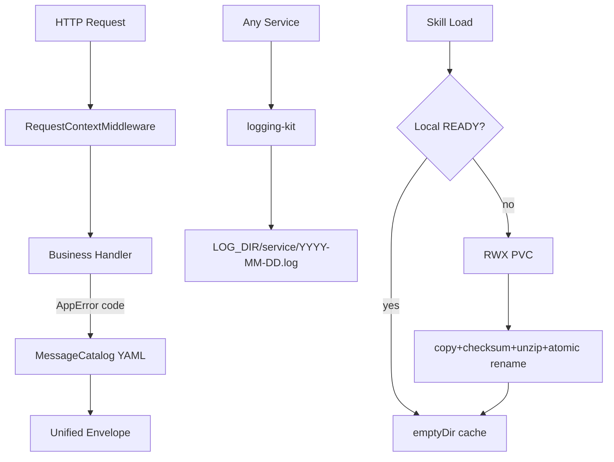
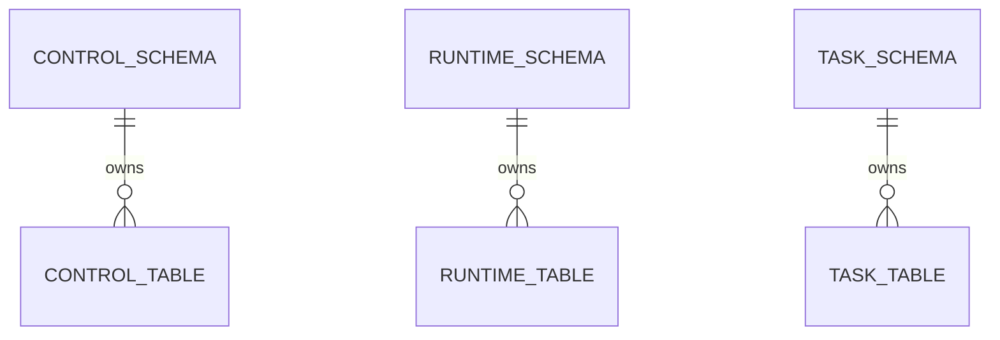

# 平台底座与公共框架 模块需求与设计一体化文档

> **文档编号**: MOD-FOUNDATION-V1.0  
> **文档版本**: v1.0  
> **创建日期**: 2026-09-17  
> **文档状态**: 设计评审中  
> **模板**: design-full.md


## 1. 文档控制

| 项目 | 内容 |
|---|---|
| 模块 | 平台底座与公共框架 |
| Owner | 共享 packages + console-platform |
| 数据 Owner | control/runtime/task schema baseline |
| 前置模块 | - |
| 建议代码位置 | packages/logging-kit/；packages/api-kit/；packages/contracts/；packages/common/；packages/artifact-store/；migrations/；apps/console-platform/frontend/src/components/common/；apps/console-platform/frontend/src/i18n/ |

## 2. 需求分析

### 2.1 需求概述

| 项目 | 内容 |
|---|---|
| 模块名称 | 平台底座与公共框架 |
| 模块 ID | MOD-FOUNDATION |
| 需求类型 | 中大型功能开发 |
| 业务背景 | 后续四个服务和所有业务模块必须共享日志、响应、错误码国际化、前端国际化、ArtifactStore、Contract 与公共 Semi 组件，避免重复造轮子。 |
| 核心目标 | 先冻结可复用底座，使后续模块只实现业务，不再设计日志/响应/i18n/公共 UI/文件缓存框架。 |

### 2.2 痛点与价值

| 维度 | 内容 |
|---|---|
| 目标用户/调用方 | Builder / Admin / End User / 内部服务（按模块实际入口） |
| 当前问题 | 后续四个服务和所有业务模块必须共享日志、响应、错误码国际化、前端国际化、ArtifactStore、Contract 与公共 Semi 组件，避免重复造轮子。 |
| 业务影响 | 模块边界或契约不固定会导致上层重复设计、接口漂移和跨模块返工。 |
| 预期价值 | 先冻结可复用底座，使后续模块只实现业务，不再设计日志/响应/i18n/公共 UI/文件缓存框架。 |

### 2.3 功能方案

| 功能ID | 功能名称 | 功能描述 | 优先级 | 来源 |
|---|---|---|---|---|
| FEAT-01 | 统一日志 | 仅配置 LOG_DIR，按 service/YYYY-MM-DD.log 输出 JSON 日志。 | P0 | 需求描述 |
| FEAT-02 | 统一 REST Envelope | code/msg/data/trace_id/request_id/timestamp + AppError(code)。 | P0 | 需求描述 |
| FEAT-03 | 全栈 i18n | 后端 YAML code→中英文；前端 locale JSON + X-Locale。 | P0 | 需求描述 |
| FEAT-04 | ArtifactStore/Cache | NFS RWX PVC 权威源 + Runtime/Worker emptyDir READY cache。 | P0 | 需求描述 |
| FEAT-05 | 公共前端组件 | 列表/详情/表单/状态/分页等 Semi 组件封装。 | P0 | 需求描述 |

#### 2.3.2 字段约束

| 字段类别 | 约束 |
|---|---|
| ID | 业务实体统一 UUID；跨 Owner Schema 仅逻辑引用 UUID |
| 时间 | PostgreSQL 使用 `timestamptz`；Console 展示 `YYYY-MM-DD HH:mm:ss` |
| 删除 | 产品表统一 `is_deleted` 软删除；状态枚举不重复表达 DELETED |
| Secret | 只保存 SecretRef；Secret Value 不进入 DB / Snapshot / 日志 / LLM |
| 枚举 | API 与 DB 统一使用稳定英文枚举值，中文/英文只在 UI/i18n 层映射 |
| 错误 | 业务代码只抛稳定 `code`；`msg/http_status` 由公共配置映射 |

### 2.4 范围与边界

| 类别 | 内容 |
|---|---|
| In Scope | logging-kit、api-kit、contracts/common、NFS-backed ArtifactStore、SkillArtifactCache 基础、Alembic owner schema、ConsoleShell 与公共 Semi 组件。 |
| Out of Scope | 不实现具体业务 CRUD；不部署 MinIO/S3；不把 NFS Server 当业务 Pod；不引入 Redux/Zustand |
| 技术债 | 无；不为未确认的未来能力增加兼容层 |

### 2.5 验收条件

#### 2.5.1 业务规则与约束

| ID | 类型 | 描述 | 验证场景 |
|---|---|---|---|
| RULE-01 | 系统约束 | 固定 4 个部署单元；Runtime/Worker 无状态横向扩展。 | S-01 / 对应 E- 场景 |
| RULE-02 | 系统约束 | 统一 logging-kit；仅配置 LOG_DIR；日志按 service/YYYY-MM-DD.log 保存并带 trace_id/request_id。 | S-01 / 对应 E- 场景 |
| RULE-03 | 系统约束 | JSON REST 统一 code/msg/data/trace_id/request_id/timestamp；业务只抛 code，msg/http_status 配置映射。 | S-01 / 对应 E- 场景 |
| RULE-04 | 系统约束 | 后端错误和前端页面支持 zh-CN/en-US；新增业务仅增加配置。 | S-01 / 对应 E- 场景 |
| RULE-05 | 系统约束 | Console 使用 React + Semi；左上操作、右上搜索筛选、右下分页；主展示字段打开详情。 | S-01 / 对应 E- 场景 |
| RULE-06 | 系统约束 | 详情 SideSheet 标题/副标题左侧，操作按钮与关闭 X 同行靠右，Tabs 在其下。 | S-01 / 对应 E- 场景 |
| RULE-07 | 系统约束 | 产品表统一 is_deleted/create_time/update_time；同 Owner Schema 物理 FK，跨 Owner Schema 逻辑 UUID。 | S-01 / 对应 E- 场景 |
| RULE-08 | 系统约束 | Secret Value 不进 DB/Snapshot/日志/LLM，只保存 SecretRef。 | S-01 / 对应 E- 场景 |

#### 2.5.2 功能验收场景

##### 正常场景

| 场景ID | 功能ID | 测试层级 | 关键真实边界 | 归属 | 操作/前置 | 预期结果 |
|---|---|---|---|---|---|---|
| S-01 | FEAT-01 | integration | Service→FileSystem | 本模块 | 两个服务分别写日志 | 按服务/日期分文件且含 trace_id/request_id |
| S-02 | FEAT-02 | integration | FastAPI→api-kit→YAML | 本模块 | 业务抛 AppError('AGENT_NOT_FOUND') | 统一 Envelope，msg 按 locale 映射 |
| S-03 | FEAT-03 | E2E | Browser→X-Locale→API→UI | 本模块 | 切到 English 后触发错误 | 页面和后端 msg 同步为 en-US |
| S-04 | FEAT-04 | integration | emptyDir→NFS | 本模块 | 同 checksum ensure 两次 | 第二次命中 READY，不访问 NFS |

##### 异常场景

| 场景ID | 功能ID | 测试层级 | 关键真实边界 | 归属 | 触发条件 | 系统行为 |
|---|---|---|---|---|---|---|
| E-01 | FEAT-04 | integration | Cache→NFS | 本模块 | cache miss 且 NFS 不可用 | SKILL_ARTIFACT_UNAVAILABLE，不执行半成品 |
| E-02 | FEAT-03 | unit | locale-key checker | 本模块 | zh 新 key 但 en 缺失 | 检查失败 |

无可靠实测数据的性能阈值统一标记“待定”，不复制模板示例值。

## 3. 技术设计

### 3.1 技术选型与关键决策

| 决策 | 选择 | 放弃项 | 理由 |
|---|---|---|---|
| 日志 | 独立 logging-kit | 每服务自行 FileHandler | 统一格式和切日行为 |
| 错误 | AppError(code)+YAML | 业务写明文 message | 支持中英文且避免漂移 |
| Artifact | NFS PVC + local cache | 直接从 NFS 执行 | 保持无状态且降低小文件 IO |
| 前端 | Semi 公共组件 | 每页复制 HTML/CSS | 保持一致并可主题化 |

基础栈：Python >=3.12、FastAPI >=0.115、SQLAlchemy 2.x、PostgreSQL；按需 Redis/NFS/Secret Provider；统一 `muad-api` 与 `muad-logging`。

### 3.2 架构与流程



### 3.3 数据设计

本模块不新增业务表，只建立 Owner Schema 和迁移纪律。

```sql
CREATE SCHEMA IF NOT EXISTS control;
CREATE SCHEMA IF NOT EXISTS runtime;
CREATE SCHEMA IF NOT EXISTS task;
```

所有上层业务表统一公共字段：

| 字段 | 类型 | 约束 |
|---|---|---|
| id | uuid | PK |
| is_deleted | boolean | NOT NULL DEFAULT false |
| create_time | timestamptz | NOT NULL DEFAULT now() |
| update_time | timestamptz | NOT NULL DEFAULT now() |

**ER 图**



数据库规则：所有产品表统一 `id/is_deleted/create_time/update_time`；同 Owner Schema 物理 FK，跨 Owner Schema 逻辑 UUID；迁移使用 Alembic expand→deploy→contract。

### 3.4 接口设计

```json
{
  "code":"0",
  "msg":"成功",
  "data":{},
  "trace_id":"trace-id",
  "request_id":"request-id",
  "timestamp":"2026-09-17T17:00:00+08:00"
}
```

业务异常只允许 `raise AppError("CODE")`；msg 与 HTTP Status 统一由 `config/api-messages.yaml` 映射。

| 接口ID | 名称 | 方法 | 路径 | FEAT |
|---|---|---|---|---|
| - | 无 HTTP API | - | - | - |

| 函数ID | 签名 | 用途 | 错误码 | FEAT |\n|---|---|---|---|---|\n| LIB-01 | `configure_logging(service_name, log_dir=None, level=None) -> None` | 初始化服务级按日 JSON 日志 | `LOG_INIT_FAILED` | FEAT-01 |
| LIB-02 | `install_api_foundation(app, messages_file, default_locale) -> MessageCatalog` | 安装上下文/统一异常/Envelope | `COMMON_INTERNAL_ERROR` | FEAT-02 |
| LIB-03 | `MessageCatalog.message(code, locale, args=None) -> str` | 按 code 解析中英文 | `COMMON_INTERNAL_ERROR` | FEAT-03 |
| LIB-04 | `ArtifactStore.resolve(storage_key) -> Path` | storage_key 映射到 NFS mount | `ARTIFACT_NOT_FOUND` | FEAT-04 |
| LIB-05 | `SkillArtifactCache.ensure(artifact_id, storage_key, checksum) -> Path` | 本地 READY cache，miss 才访问 NFS | `SKILL_ARTIFACT_UNAVAILABLE` | FEAT-04 |


### 3.5 质量实现方案

- 性能：批量/聚合优先，列表禁止 N+1，真实目标待基线压测后确定。
- 可靠性：事务只覆盖原子 DB 操作；外部 IO 不包长事务；高影响错误必须有 E-/B- 验收。
- 安全：Secret/Token/Cookie 不进业务 DB、日志、Snapshot、LLM。
- 可观测：统一 JSON 日志，自动带 service/trace_id/request_id；状态变化可关联 trace_id。


## 4. 部署与运维

本模块随 `共享 packages + console-platform` 对应镜像/共享 package 发布；PostgreSQL、Redis、NFS、Secret Provider 外置。监控阈值待真实基线确定。

## 5. 风险与依赖

- 前置：无。
- 主要风险：后续模块绕过底座自行实现日志/响应/i18n/SideSheet。。
- 应对：Contract Test + S/E/B 验收 + Spec Matrix。

## 6. 需求追溯矩阵

| 用户故事 | 功能ID | 接口ID | 测试用例ID | 测试层级 | 状态 |
|---|---|---|---|---|---|
| 需求描述 | FEAT-01 | LIB-01 | S-01 | integration | 待实现 |
| 需求描述 | FEAT-02 | LIB-02 | S-02 | integration | 待实现 |
| 需求描述 | FEAT-03 | LIB-03 | S-03, E-02 | E2E | 待实现 |
| 需求描述 | FEAT-04 | LIB-04, LIB-05 | S-04, E-01 | integration | 待实现 |
| 需求描述 | FEAT-05 | - |  | integration | 待实现 |

## Spec Compliance Matrix

| Spec/Rule | enforcement | 设计影响 | 设计落点 | 验证场景 | 状态/N/A 理由 |
|---|---|---|---|---|---|
| `mss-platform#RULE-ARCH-001` | required | 固定 4 个部署单元；Runtime/Worker 无状态横向扩展。 | §3.2/§3.3/§3.4 | S-01 + verifier | applied |
| `mss-platform#RULE-LOG-001` | required | 统一 logging-kit；仅配置 LOG_DIR；日志按 service/YYYY-MM-DD.log 保存并带 trace_id/request_id。 | §3.2/§3.3/§3.4 | S-01 + verifier | applied |
| `mss-platform#RULE-API-001` | required | JSON REST 统一 code/msg/data/trace_id/request_id/timestamp；业务只抛 code，msg/http_status 配置映射。 | §3.2/§3.3/§3.4 | S-01 + verifier | applied |
| `mss-platform#RULE-I18N-001` | required | 后端错误和前端页面支持 zh-CN/en-US；新增业务仅增加配置。 | §3.2/§3.3/§3.4 | S-01 + verifier | applied |
| `mss-platform#RULE-UI-001` | required | Console 使用 React + Semi；左上操作、右上搜索筛选、右下分页；主展示字段打开详情。 | §3.2/§3.3/§3.4 | S-01 + verifier | applied |
| `mss-platform#RULE-UI-DETAIL-001` | required | 详情 SideSheet 标题/副标题左侧，操作按钮与关闭 X 同行靠右，Tabs 在其下。 | §3.2/§3.3/§3.4 | S-01 + verifier | applied |
| `mss-platform#RULE-DATA-001` | required | 产品表统一 is_deleted/create_time/update_time；同 Owner Schema 物理 FK，跨 Owner Schema 逻辑 UUID。 | §3.2/§3.3/§3.4 | S-01 + verifier | applied |
| `mss-platform#RULE-SECRET-001` | required | Secret Value 不进 DB/Snapshot/日志/LLM，只保存 SecretRef。 | §3.2/§3.3/§3.4 | S-01 + verifier | applied |
| `mss-platform#RULE-SKILL-001` | required | NFS-backed RWX PVC 为 Artifact 权威源；Runtime/Worker emptyDir 本地 cache；禁止直接从 NFS 执行 Python。 | §3.2/§3.3/§3.4 | S-01 + verifier | applied |
| `mss-platform#RULE-FRONT-001` | required | 前端 API 只经 services/；组件不裸用 axios/fetch；文案只用 i18n key。 | §3.2/§3.3/§3.4 | S-01 + verifier | applied |
| `mss-platform#RULE-TEST-001` | required | 跨 API/DB/Runtime/Browser 的关键流程必须 E2E，列出不得 mock 的真实边界。 | §3.2/§3.3/§3.4 | S-01 + verifier | applied |
