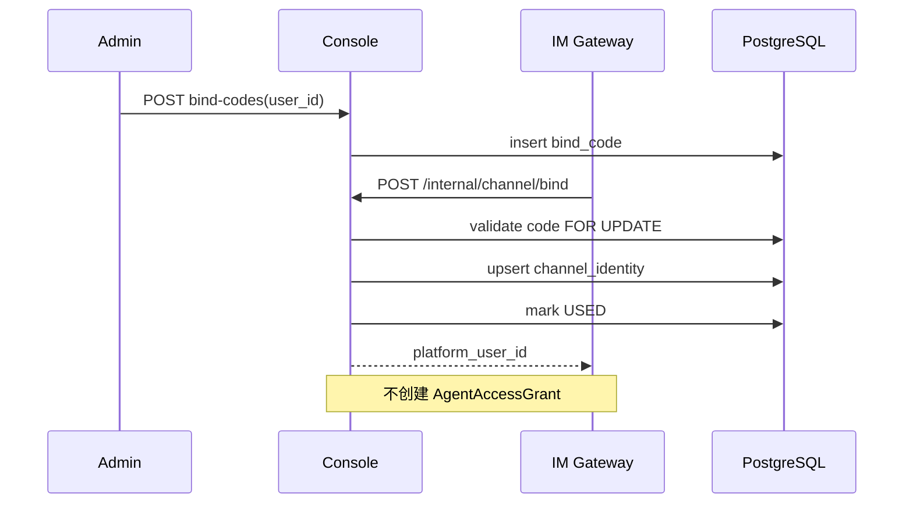
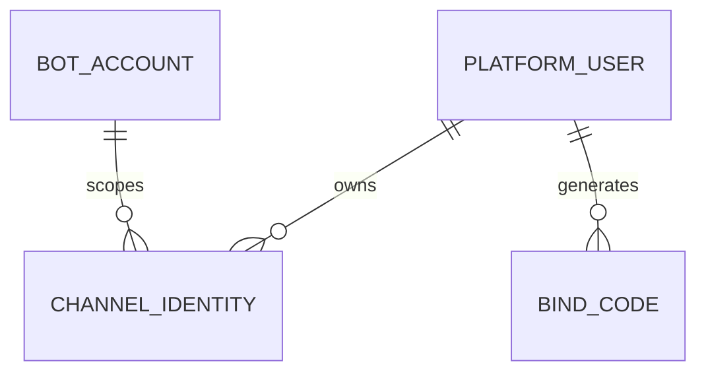

# 用户、身份与绑定 模块需求与设计一体化文档

> **文档编号**: MOD-USER-V1.0  
> **文档版本**: v1.0  
> **创建日期**: 2026-09-17  
> **文档状态**: 设计评审中  
> **模板**: design-full.md


## 1. 文档控制

| 项目 | 内容 |
|---|---|
| 模块 | 用户、身份与绑定 |
| Owner | muad-console-platform + muad-im-gateway |
| 数据 Owner | control |
| 前置模块 | 01-platform-foundation |
| 建议代码位置 | apps/console-platform/backend/src/muad_console_platform/modules/users/；apps/im-gateway/src/muad_im_gateway/identity/ |

## 2. 需求分析

### 2.1 需求概述

| 项目 | 内容 |
|---|---|
| 模块名称 | 用户、身份与绑定 |
| 模块 ID | MOD-USER |
| 需求类型 | 中大型功能开发 |
| 业务背景 | End User 不登录 Console，但 channel/bot/openid 必须稳定映射 PlatformUser；/bind 不能隐式授予 Agent。 |
| 核心目标 | 建立 PlatformUser、ChannelIdentity、BindCode 的统一身份主键，为后续授权/凭据/Memory 提供稳定 user_id。 |

### 2.2 痛点与价值

| 维度 | 内容 |
|---|---|
| 目标用户/调用方 | Builder / Admin / End User / 内部服务（按模块实际入口） |
| 当前问题 | End User 不登录 Console，但 channel/bot/openid 必须稳定映射 PlatformUser；/bind 不能隐式授予 Agent。 |
| 业务影响 | 模块边界或契约不固定会导致上层重复设计、接口漂移和跨模块返工。 |
| 预期价值 | 建立 PlatformUser、ChannelIdentity、BindCode 的统一身份主键，为后续授权/凭据/Memory 提供稳定 user_id。 |

### 2.3 功能方案

| 功能ID | 功能名称 | 功能描述 | 优先级 | 来源 |
|---|---|---|---|---|
| FEAT-01 | 平台用户 | 创建/编辑/查询 PlatformUser。 | P0 | 需求描述 |
| FEAT-02 | IM 身份绑定 | 一次性绑定码把 channel+bot_id+external_user_id 绑定 PlatformUser。 | P0 | 需求描述 |
| FEAT-03 | 用户详情聚合 | 基本信息、授权数、凭据数、IM身份数、Memory数。 | P0 | 需求描述 |

#### 2.3.2 字段约束

| 字段类别 | 约束 |
|---|---|
| ID | 业务实体统一 UUID；跨 Owner Schema 仅逻辑引用 UUID |
| 时间 | PostgreSQL 使用 `timestamptz`；Console 展示 `YYYY-MM-DD HH:mm:ss` |
| 删除 | 产品表统一 `is_deleted` 软删除；状态枚举不重复表达 DELETED |
| Secret | 只保存 SecretRef；Secret Value 不进入 DB / Snapshot / 日志 / LLM |
| 枚举 | API 与 DB 统一使用稳定英文枚举值，中文/英文只在 UI/i18n 层映射 |
| 错误 | 业务代码只抛稳定 `code`；`msg/http_status` 由公共配置映射 |

### 2.4 范围与边界

| 类别 | 内容 |
|---|---|
| In Scope | 用户 CRUD、IM 身份、绑定码、last_active_at、用户详情聚合计数；Agent 授权/Memory Tab 使用后置模块 Contract。 |
| Out of Scope | /bind 不自动授予 Agent；不把外部 openid 当平台主键 |
| 技术债 | 无；不为未确认的未来能力增加兼容层 |

### 2.5 验收条件

#### 2.5.1 业务规则与约束

| ID | 类型 | 描述 | 验证场景 |
|---|---|---|---|
| RULE-01 | 系统约束 | JSON REST 统一 code/msg/data/trace_id/request_id/timestamp；业务只抛 code，msg/http_status 配置映射。 | S-01 / 对应 E- 场景 |
| RULE-02 | 系统约束 | 后端错误和前端页面支持 zh-CN/en-US；新增业务仅增加配置。 | S-01 / 对应 E- 场景 |
| RULE-03 | 系统约束 | 产品表统一 is_deleted/create_time/update_time；同 Owner Schema 物理 FK，跨 Owner Schema 逻辑 UUID。 | S-01 / 对应 E- 场景 |
| RULE-04 | 系统约束 | Agent 0..N bot_id；bot_id 只指向一个 Agent；不绑定 Runtime Pod。 | S-01 / 对应 E- 场景 |
| RULE-05 | 系统约束 | 跨 API/DB/Runtime/Browser 的关键流程必须 E2E，列出不得 mock 的真实边界。 | S-01 / 对应 E- 场景 |

#### 2.5.2 功能验收场景

##### 正常场景

| 场景ID | 功能ID | 测试层级 | 关键真实边界 | 归属 | 操作/前置 | 预期结果 |
|---|---|---|---|---|---|---|
| S-01 | FEAT-01 | E2E | Browser→API→DB→UI | 本模块 | 新增用户 | 列表显示且计数字段来自后端聚合 |
| S-02 | FEAT-02 | E2E | Gateway→bind API→DB | 本模块 | 有效绑定码首次使用 | 创建 ChannelIdentity，不创建 AgentAccessGrant |

##### 异常场景

| 场景ID | 功能ID | 测试层级 | 关键真实边界 | 归属 | 触发条件 | 系统行为 |
|---|---|---|---|---|---|---|
| E-01 | FEAT-02 | integration | bind service→DB transaction | 本模块 | 绑定码过期/已使用 | BIND_CODE_INVALID 且不写身份 |

无可靠实测数据的性能阈值统一标记“待定”，不复制模板示例值。

## 3. 技术设计

### 3.1 技术选型与关键决策

| 决策 | 选择 | 放弃项 | 理由 |
|---|---|---|---|
| 平台主键 | PlatformUser UUID | 直接用 openid | 一个用户可有多个渠道身份 |
| /bind | 仅身份映射 | 顺便授权 Agent | 授权与身份职责分离 |

基础栈：Python >=3.12、FastAPI >=0.115、SQLAlchemy 2.x、PostgreSQL；按需 Redis/NFS/Secret Provider；统一 `muad-api` 与 `muad-logging`。

### 3.2 架构与流程



### 3.3 数据设计

#### `control.platform_user`

**表说明**

- **用途**：平台统一用户主体；IM 外部身份、Agent 授权、项目平台凭据最终都归并到该用户。
- **主要写入方**：Console 创建/维护；绑定流程只建立 ChannelIdentity 到该用户。
- **主要读取方**：Console、IM Gateway 解析接口、Agent Runtime Definition Resolve。
- **生命周期/边界**：长期存在；禁用不删除历史 Run。

| 字段 | 类型 | 约束 | 说明 |
|---|---|---|---|
| `id` | uuid | PK | 主键 |
| `is_deleted` | boolean | NOT NULL DEFAULT false | 软删除 |
| `create_time` | timestamptz | NOT NULL DEFAULT now() | 创建时间 |
| `update_time` | timestamptz | NOT NULL DEFAULT now() | 更新时间 |
| `tenant_id` | varchar(64) | NOT NULL | 租户/组织隔离键 |
| `user_code` | varchar(128) | NOT NULL | 平台用户编码 |
| `display_name` | varchar(128) | NOT NULL | 显示名 |
| `status` | varchar(32) | NOT NULL DEFAULT 'ACTIVE' | ACTIVE/DISABLED |
| `metadata_json` | jsonb | NOT NULL DEFAULT '{}' | 扩展信息 |

**索引/约束**：

- `UNIQUE (tenant_id, user_code) WHERE is_deleted=false`
- `INDEX (tenant_id, status)`

#### `control.channel_identity`

**表说明**

- **用途**：外部 IM 用户身份到 PlatformUser 的映射。
- **主要写入方**：/bind Internal API。
- **主要读取方**：IM Gateway resolve。
- **生命周期/边界**：用户级长期映射；可支持 Bot 级 identity_key。

| 字段 | 类型 | 约束 | 说明 |
|---|---|---|---|
| `id` | uuid | PK | 主键 |
| `is_deleted` | boolean | NOT NULL DEFAULT false | 软删除 |
| `create_time` | timestamptz | NOT NULL DEFAULT now() | 创建时间 |
| `update_time` | timestamptz | NOT NULL DEFAULT now() | 更新时间 |
| `tenant_id` | varchar(64) | NOT NULL | 隔离键 |
| `channel` | varchar(32) | NOT NULL | 渠道 |
| `identity_key` | varchar(512) | NOT NULL | 归一化唯一键 |
| `external_user_id` | varchar(256) | NOT NULL | 渠道外部身份 |
| `bot_account_id` | uuid | NOT NULL FK -> bot_account.id | V1 企业微信身份按 bot 账号隔离 |
| `platform_user_id` | uuid | NOT NULL FK -> platform_user.id | 绑定用户 |
| `bound_at` | timestamptz | NOT NULL DEFAULT now() | 绑定时间 |
| `last_active_at` | timestamptz |  | 最近一次有效消息活动时间；Gateway 可节流更新 |

**索引/约束**：

- `UNIQUE (tenant_id, identity_key) WHERE is_deleted=false`
- `INDEX (platform_user_id, channel)`

#### `control.bind_code`

**表说明**

- **用途**：一次性短期绑定凭证。
- **主要写入方**：Console。
- **主要读取方**：/bind API。
- **生命周期/边界**：有 TTL、一次性消费，过期/使用后不可重用。

| 字段 | 类型 | 约束 | 说明 |
|---|---|---|---|
| `id` | uuid | PK | 主键 |
| `is_deleted` | boolean | NOT NULL DEFAULT false | 软删除 |
| `create_time` | timestamptz | NOT NULL DEFAULT now() | 创建时间 |
| `update_time` | timestamptz | NOT NULL DEFAULT now() | 更新时间 |
| `tenant_id` | varchar(64) | NOT NULL | 隔离键 |
| `platform_user_id` | uuid | NOT NULL FK -> platform_user.id | 目标用户 |
| `code_hash` | varchar(128) | NOT NULL | 只存 hash |
| `status` | varchar(16) | NOT NULL DEFAULT 'ACTIVE' | ACTIVE/USED/EXPIRED/REVOKED |
| `expires_at` | timestamptz | NOT NULL | 过期时间 |
| `used_at` | timestamptz |  | 使用时间 |
| `used_channel_identity_id` | uuid |  | 绑定成功后的 identity |
| `created_by` | uuid | NOT NULL | 生成管理员 |

**索引/约束**：

- `UNIQUE (code_hash) WHERE is_deleted=false`
- `INDEX (platform_user_id, status, expires_at)`

**ER 图**



数据库规则：所有产品表统一 `id/is_deleted/create_time/update_time`；同 Owner Schema 物理 FK，跨 Owner Schema 逻辑 UUID；迁移使用 Alembic expand→deploy→contract。

### 3.4 接口设计

```json
{
  "code":"0",
  "msg":"成功",
  "data":{},
  "trace_id":"trace-id",
  "request_id":"request-id",
  "timestamp":"2026-09-17T17:00:00+08:00"
}
```

业务异常只允许 `raise AppError("CODE")`；msg 与 HTTP Status 统一由 `config/api-messages.yaml` 映射。

| 接口ID | 名称 | 方法 | 路径 | FEAT |
|---|---|---|---|---|
| API-01 | 用户列表 | GET | `/api/v1/users` | FEAT-01 |
| API-02 | 新增用户 | POST | `/api/v1/users` | FEAT-01 |
| API-03 | 用户详情 | GET | `/api/v1/users/{user_id}` | FEAT-03 |
| API-04 | 编辑用户 | PUT | `/api/v1/users/{user_id}` | FEAT-01 |
| API-05 | 身份列表 | GET | `/api/v1/users/{user_id}/identities` | FEAT-02 |
| API-06 | 生成绑定码 | POST | `/api/v1/users/{user_id}/bind-codes` | FEAT-02 |
| API-07 | 解绑身份 | DELETE | `/api/v1/users/{user_id}/identities/{identity_id}` | FEAT-02 |


#### API-01 用户列表

```text
GET /api/v1/users
```

- 请求：
- `data`：分页 items，含 agent_grant_count/credential_count/identity_count/memory_count。
- 错误码：`COMMON_VALIDATION_ERROR / COMMON_INTERNAL_ERROR`
- 处理：

#### API-02 新增用户

```text
POST /api/v1/users
```

- 请求：name/account/enabled。
- `data`：
- 错误码：`USER_ACCOUNT_CONFLICT`
- 处理：

#### API-03 用户详情

```text
GET /api/v1/users/{user_id}
```

- 请求：
- `data`：
- 错误码：`COMMON_VALIDATION_ERROR / COMMON_INTERNAL_ERROR`
- 处理：

#### API-04 编辑用户

```text
PUT /api/v1/users/{user_id}
```

- 请求：name/account/enabled。
- `data`：
- 错误码：`COMMON_VALIDATION_ERROR / COMMON_INTERNAL_ERROR`
- 处理：

#### API-05 身份列表

```text
GET /api/v1/users/{user_id}/identities
```

- 请求：
- `data`：
- 错误码：`COMMON_VALIDATION_ERROR / COMMON_INTERNAL_ERROR`
- 处理：

#### API-06 生成绑定码

```text
POST /api/v1/users/{user_id}/bind-codes
```

- 请求：
- `data`：bind_code/expires_at/status。
- 错误码：`COMMON_VALIDATION_ERROR / COMMON_INTERNAL_ERROR`
- 处理：

#### API-07 解绑身份

```text
DELETE /api/v1/users/{user_id}/identities/{identity_id}
```

- 请求：
- `data`：
- 错误码：`USER_IDENTITY_NOT_FOUND`
- 处理：


### 3.5 质量实现方案

- 性能：批量/聚合优先，列表禁止 N+1，真实目标待基线压测后确定。
- 可靠性：事务只覆盖原子 DB 操作；外部 IO 不包长事务；高影响错误必须有 E-/B- 验收。
- 安全：Secret/Token/Cookie 不进业务 DB、日志、Snapshot、LLM。
- 可观测：统一 JSON 日志，自动带 service/trace_id/request_id；状态变化可关联 trace_id。


## 4. 部署与运维

本模块随 `muad-console-platform + muad-im-gateway` 对应镜像/共享 package 发布；PostgreSQL、Redis、NFS、Secret Provider 外置。监控阈值待真实基线确定。

## 5. 风险与依赖

- 前置：01-platform-foundation。
- 主要风险：把身份绑定和 Agent 授权混在一个用例。。
- 应对：Contract Test + S/E/B 验收 + Spec Matrix。

## 6. 需求追溯矩阵

| 用户故事 | 功能ID | 接口ID | 测试用例ID | 测试层级 | 状态 |
|---|---|---|---|---|---|
| 需求描述 | FEAT-01 | API-01, API-02, API-04 | S-01 | E2E | 待实现 |
| 需求描述 | FEAT-02 | API-05, API-06, API-07 | S-02, E-01 | E2E | 待实现 |
| 需求描述 | FEAT-03 | API-03 |  | integration | 待实现 |

## Spec Compliance Matrix

| Spec/Rule | enforcement | 设计影响 | 设计落点 | 验证场景 | 状态/N/A 理由 |
|---|---|---|---|---|---|
| `mss-platform#RULE-API-001` | required | JSON REST 统一 code/msg/data/trace_id/request_id/timestamp；业务只抛 code，msg/http_status 配置映射。 | §3.2/§3.3/§3.4 | S-01 + verifier | applied |
| `mss-platform#RULE-I18N-001` | required | 后端错误和前端页面支持 zh-CN/en-US；新增业务仅增加配置。 | §3.2/§3.3/§3.4 | S-01 + verifier | applied |
| `mss-platform#RULE-DATA-001` | required | 产品表统一 is_deleted/create_time/update_time；同 Owner Schema 物理 FK，跨 Owner Schema 逻辑 UUID。 | §3.2/§3.3/§3.4 | S-01 + verifier | applied |
| `mss-platform#RULE-IM-001` | required | Agent 0..N bot_id；bot_id 只指向一个 Agent；不绑定 Runtime Pod。 | §3.2/§3.3/§3.4 | S-01 + verifier | applied |
| `mss-platform#RULE-TEST-001` | required | 跨 API/DB/Runtime/Browser 的关键流程必须 E2E，列出不得 mock 的真实边界。 | §3.2/§3.3/§3.4 | S-01 + verifier | applied |
