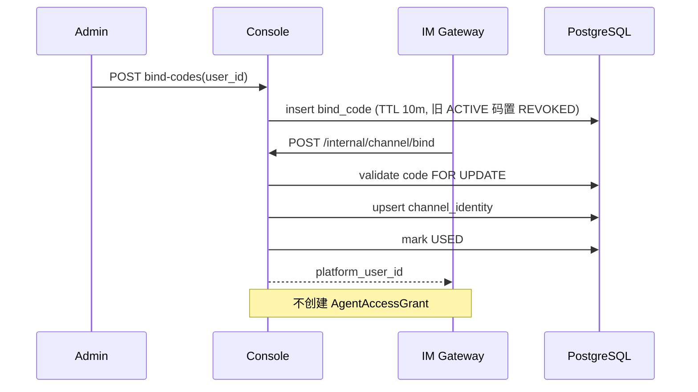
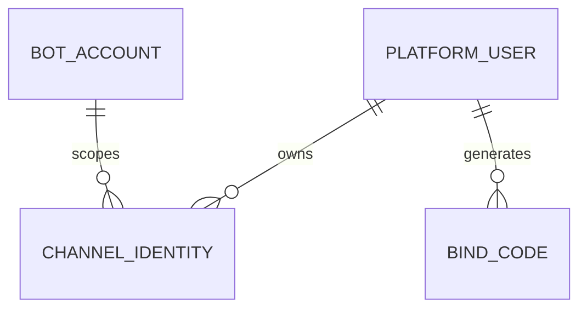

# 用户、身份与绑定 模块需求与设计一体化文档

> **文档编号**: MOD-USER-V1.1  
> **文档版本**: v1.1  
> **创建日期**: 2026-09-17  
> **文档状态**: 设计评审中  
> **模板**: design-full.md

## 1. 文档控制

| 项目 | 内容 |
|---|---|
| 模块 | 用户、身份与绑定 |
| Owner | muad-console-platform + muad-im-gateway |
| 数据 Owner | control |
| 前置模块 | 01-platform-foundation |
| 建议代码位置 | apps/console-platform/backend/src/muad_console_platform/modules/users/；apps/im-gateway/src/muad_im_gateway/identity/ |

### 1.1 责任人

| 角色 | 姓名 | 职责范围 |
|------|------|---------|
| 产品经理 | 待定 | 需求定义、业务验收 |
| 开发负责人 | 待定 | 技术方案、代码实现 |
| 测试负责人 | 待定 | 测试策略、质量保证 |
| 架构师 | 待定 | 架构审核、跨模块服务复用决策 |

### 1.2 修订历史

| 版本 | 日期 | 作者 | 变更描述 |
|------|------|------|---------|
| v1.0 | 2026-09-17 | fluxion-harness | 初始设计 |
| v1.1 | 2026-09-18 | fluxion-harness | 对齐 V1.4 决策（docs/17）：补用户侧 Agent 授权与 Memory 端点、字段名对齐 docs/15（display_name/user_code/status）、FEAT-03 聚合响应 schema 与数据来源、IM 身份状态派生、绑定码 TTL/撤销语义、错误码清理与 API 契约补全 |

## 2. 需求分析

### 2.1 需求概述

| 项目 | 内容 |
|---|---|
| 模块名称 | 用户、身份与绑定 |
| 模块 ID | MOD-USER |
| 需求类型 | 中大型功能开发 |
| 业务背景 | End User 不登录 Console，但 channel/bot/openid 必须稳定映射 PlatformUser；/bind 不能隐式授予 Agent。 |
| 核心目标 | 建立 PlatformUser、ChannelIdentity、BindCode 的统一身份主键，为后续授权/凭据/Memory 提供稳定 user_id。 |

### 2.2 痛点与价值

| 维度 | 内容 |
|---|---|
| 目标用户/调用方 | Builder / Admin / End User / 内部服务（按模块实际入口） |
| 当前问题 | End User 不登录 Console，但 channel/bot/openid 必须稳定映射 PlatformUser；/bind 不能隐式授予 Agent。 |
| 业务影响 | 模块边界或契约不固定会导致上层重复设计、接口漂移和跨模块返工。 |
| 预期价值 | 建立 PlatformUser、ChannelIdentity、BindCode 的统一身份主键，为后续授权/凭据/Memory 提供稳定 user_id。 |

### 2.3 功能方案

#### 2.3.1 功能清单

| 功能ID | 功能名称 | 功能描述 | 优先级 | 来源 |
|---|---|---|---|---|
| FEAT-01 | 平台用户 | 创建/编辑/查询 PlatformUser（user_code/display_name/status）。 | P0 | 需求描述 |
| FEAT-02 | IM 身份绑定 | 一次性绑定码把 channel+bot_id+external_user_id 绑定 PlatformUser。 | P0 | 需求描述 |
| FEAT-03 | 用户详情聚合 | 基本信息、授权数、凭据数、IM身份数、Memory数，以及用户侧 Agent 授权与 Memory 管理端点。 | P0 | 需求描述 |

#### 2.3.2 字段约束

| 字段类别 | 约束 |
|---|---|
| ID | 业务实体统一 UUID；跨 Owner Schema 仅逻辑引用 UUID |
| 时间 | PostgreSQL 使用 `timestamptz`；Console 展示 `YYYY-MM-DD HH:mm:ss` |
| 删除 | 产品表统一 `is_deleted` 软删除；状态枚举不重复表达 DELETED |
| Secret | 只保存 SecretRef；Secret Value 不进入 DB / Snapshot / 日志 / LLM |
| 枚举 | API 与 DB 统一使用稳定英文枚举值，中文/英文只在 UI/i18n 层映射 |
| 错误 | 业务代码只抛稳定 `code`；`msg/http_status` 由公共配置映射 |

### 2.4 范围与边界

| 类别 | 内容 |
|---|---|
| In Scope | 用户 CRUD（`user_code/display_name/status/metadata`）、IM 身份、绑定码、last_active_at、用户详情聚合计数；用户侧 Agent 授权端点（`users/{id}/agents`）与用户侧 Memory 端点（`users/{id}/memory`），写操作复用 07/08 的 application service（**服务复用不构成前置依赖**，04/07/08 仅作为数据来源）。 |
| Out of Scope | /bind 不自动授予 Agent；不把外部 openid 当平台主键；不重复实现 07 的 Agent 侧授权服务与 08 的 Memory 读写服务；不做三元授权（User-Agent-Skill/MCP）。 |
| 技术债 | 无；不为未确认的未来能力增加兼容层 |

### 2.5 验收条件

#### 2.5.1 业务规则与约束

| ID | 类型 | 描述 | 验证场景 |
|---|---|---|---|
| RULE-01 | 系统约束 | JSON REST 统一 code/msg/data/trace_id/request_id/timestamp；业务只抛 code，msg/http_status 配置映射。 | S-01 / E-03 |
| RULE-02 | 系统约束 | 后端错误和前端页面支持 zh-CN/en-US；新增业务仅增加配置。 | S-01 / E-03 |
| RULE-03 | 系统约束 | 产品表统一 is_deleted/create_time/update_time；同 Owner Schema 物理 FK，跨 Owner Schema 逻辑 UUID。 | S-01 / S-03 |
| RULE-04 | 系统约束 | Agent 0..N bot_id；bot_id 只指向一个 Agent；不绑定 Runtime Pod。 | S-02 / E-01 |
| RULE-05 | 系统约束 | 跨 API/DB/Runtime/Browser 的关键流程必须 E2E，列出不得 mock 的真实边界。 | S-02 |
| RULE-06 | 业务规则 | 关系类修改（用户↔Agent、Memory 删除）使用单关系 POST/DELETE 独立事务，禁止全量 PUT 覆盖；用户侧端点复用 07/08 同一 application service。 | S-04 / S-05 |
| RULE-07 | 业务规则 | 绑定码 TTL 默认 10 分钟、一次性消费；过期→`BIND_CODE_EXPIRED`，无效/已用/已撤销→`BIND_CODE_INVALID`；生成新码时同用户旧 ACTIVE 码置 `REVOKED`（管理员撤销语义）。 | S-02 / E-01 / E-02 |
| RULE-08 | 业务规则 | 用户字段固定 `user_code/display_name/status`（ACTIVE/DISABLED）；`user_code` 创建后不可修改。 | S-01 / E-04 |

#### 2.5.2 功能验收场景

##### 正常场景

| 场景ID | 功能ID | 测试层级 | 关键真实边界 | 归属 | 操作/前置 | 预期结果 |
|---|---|---|---|---|---|---|
| S-01 | FEAT-01 | E2E | Browser→API→DB→UI | 本模块 | 新增用户 | 列表显示且计数字段来自后端聚合 |
| S-02 | FEAT-02 | E2E | Gateway→bind API→DB | 本模块 | 有效绑定码首次使用 | 创建 ChannelIdentity，不创建 AgentAccessGrant |
| S-03 | FEAT-03 | E2E | Browser→02/04/07/08 数据源 | 本模块 | 用户已有授权/凭据/身份/记忆 | 详情四个计数与各来源 COUNT 一致 |
| S-04 | FEAT-03 | integration | 用户侧授权→07 同一 service | 本模块 | POST/DELETE `/users/{id}/agents/{agent_id}` | 与 07 `/agents/{id}/users` 视图一致，单关系独立事务 |
| S-05 | FEAT-03 | integration | 用户侧 Memory→08 同一 service | 本模块 | 删除单条/清空用户 Memory | 08 Memory 列表同步为空，幂等 |

##### 异常场景

| 场景ID | 功能ID | 测试层级 | 关键真实边界 | 归属 | 触发条件 | 系统行为 |
|---|---|---|---|---|---|---|
| E-01 | FEAT-02 | integration | bind service→DB transaction | 本模块 | 绑定码无效/已使用/已撤销 | `BIND_CODE_INVALID`，不写身份 |
| E-02 | FEAT-02 | integration | bind service→DB transaction | 本模块 | 绑定码过期（超过 10 分钟 TTL） | `BIND_CODE_EXPIRED`，不写身份 |
| E-03 | FEAT-01 | integration | API→partial unique | 本模块 | 新增用户 `user_code` 已存在 | `COMMON_CONFLICT`（message_args: `{user_code}`），不覆盖 |
| E-04 | FEAT-01 | unit | request schema | 本模块 | 编辑请求携带 `user_code` | Schema 拒绝，`COMMON_VALIDATION_ERROR` |

无可靠实测数据的性能阈值统一标记“待定”，不复制模板示例值。

## 3. 技术设计

### 3.1 技术选型与关键决策

| 决策 | 选择 | 放弃项 | 理由 |
|---|---|---|---|
| 平台主键 | PlatformUser UUID | 直接用 openid | 一个用户可有多个渠道身份 |
| /bind | 仅身份映射 | 顺便授权 Agent | 授权与身份职责分离 |
| 用户侧关系/记忆端点 | 复用 07/08 application service | 02 内重复实现 | 避免双实现漂移；07 负责 Agent 侧视图、08 负责 Memory 读写 |
| 用户标识 | `user_code` 不可变 | 允许改 account | 对外稳定引用 |

基础栈：Python >=3.12、FastAPI >=0.115、SQLAlchemy 2.x、PostgreSQL；按需 Redis/NFS/Secret Provider；统一 `muad-api` 与 `muad-logging`。

### 3.2 架构与流程



用户侧关系/记忆写路径：`users/{id}/agents`、`users/{id}/memory` 由 02 Router 接入，分别调用 07 `GrantService`、08 `MemoryService`（同一 application service），02 只做用户存在性校验、Envelope 与审计，不重复实现领域逻辑。

### 3.3 数据设计

#### `control.platform_user`

**表说明**

- **用途**：平台统一用户主体；IM 外部身份、Agent 授权、项目平台凭据最终都归并到该用户。
- **主要写入方**：Console 创建/维护；绑定流程只建立 ChannelIdentity 到该用户。
- **主要读取方**：Console、IM Gateway 解析接口、Agent Runtime Definition Resolve。
- **生命周期/边界**：长期存在；禁用不删除历史 Run。

| 字段 | 类型 | 约束 | 说明 |
|---|---|---|---|
| `id` | uuid | PK | 主键 |
| `is_deleted` | boolean | NOT NULL DEFAULT false | 软删除 |
| `create_time` | timestamptz | NOT NULL DEFAULT now() | 创建时间 |
| `update_time` | timestamptz | NOT NULL DEFAULT now() | 更新时间 |
| `tenant_id` | varchar(64) | NOT NULL | 租户/组织隔离键 |
| `user_code` | varchar(128) | NOT NULL | 平台用户编码（创建后不可修改） |
| `display_name` | varchar(128) | NOT NULL | 显示名 |
| `status` | varchar(32) | NOT NULL DEFAULT 'ACTIVE' | ACTIVE/DISABLED |
| `metadata_json` | jsonb | NOT NULL DEFAULT '{}' | 扩展信息 |

**索引/约束**：

- `UNIQUE (tenant_id, user_code) WHERE is_deleted=false`
- `INDEX (tenant_id, status)`

#### `control.channel_identity`

**表说明**

- **用途**：外部 IM 用户身份到 PlatformUser 的映射。
- **主要写入方**：/bind Internal API。
- **主要读取方**：IM Gateway resolve。
- **生命周期/边界**：用户级长期映射；可支持 Bot 级 identity_key；表无 `status` 列，UI 的“状态”为派生展示（身份存在且未软删 = 已绑定；用户 `platform_user.status` 决定启用状态）。

| 字段 | 类型 | 约束 | 说明 |
|---|---|---|---|
| `id` | uuid | PK | 主键 |
| `is_deleted` | boolean | NOT NULL DEFAULT false | 软删除 |
| `create_time` | timestamptz | NOT NULL DEFAULT now() | 创建时间 |
| `update_time` | timestamptz | NOT NULL DEFAULT now() | 更新时间 |
| `tenant_id` | varchar(64) | NOT NULL | 隔离键 |
| `channel` | varchar(32) | NOT NULL | 渠道 |
| `identity_key` | varchar(512) | NOT NULL | 归一化唯一键 |
| `external_user_id` | varchar(256) | NOT NULL | 渠道外部身份 |
| `bot_account_id` | uuid | NOT NULL FK -> bot_account.id | V1 企业微信身份按 bot 账号隔离 |
| `platform_user_id` | uuid | NOT NULL FK -> platform_user.id | 绑定用户 |
| `bound_at` | timestamptz | NOT NULL DEFAULT now() | 绑定时间 |
| `last_active_at` | timestamptz |  | 最近一次有效消息活动时间；Gateway 可节流更新 |

**索引/约束**：

- `UNIQUE (tenant_id, identity_key) WHERE is_deleted=false`
- `INDEX (platform_user_id, channel)`

#### `control.bind_code`

**表说明**

- **用途**：一次性短期绑定凭证。
- **主要写入方**：Console。
- **主要读取方**：/bind API。
- **生命周期/边界**：TTL 默认 10 分钟（`expires_at = now() + 10min`，docs/03 §9.1）；一次性消费，过期/使用后不可重用；生成新码时将该用户既有 ACTIVE 码置 `REVOKED`。

| 字段 | 类型 | 约束 | 说明 |
|---|---|---|---|
| `id` | uuid | PK | 主键 |
| `is_deleted` | boolean | NOT NULL DEFAULT false | 软删除 |
| `create_time` | timestamptz | NOT NULL DEFAULT now() | 创建时间 |
| `update_time` | timestamptz | NOT NULL DEFAULT now() | 更新时间 |
| `tenant_id` | varchar(64) | NOT NULL | 隔离键 |
| `platform_user_id` | uuid | NOT NULL FK -> platform_user.id | 目标用户 |
| `code_hash` | varchar(128) | NOT NULL | 只存 hash |
| `status` | varchar(16) | NOT NULL DEFAULT 'ACTIVE' | ACTIVE/USED/EXPIRED/REVOKED |
| `expires_at` | timestamptz | NOT NULL | 过期时间（绑定码 TTL 字段，非授权到期时间） |
| `used_at` | timestamptz |  | 使用时间 |
| `used_channel_identity_id` | uuid |  | 绑定成功后的 identity |
| `created_by` | uuid | NOT NULL | 生成管理员（= 登录的 `console_account.id`） |

**索引/约束**：

- `UNIQUE (code_hash) WHERE is_deleted=false`
- `INDEX (platform_user_id, status, expires_at)`

**ER 图**



数据库规则：所有产品表统一 `id/is_deleted/create_time/update_time`；同 Owner Schema 物理 FK，跨 Owner Schema 逻辑 UUID；迁移使用 Alembic expand→deploy→contract。

### 3.4 接口设计

```json
{
  "code":"0",
  "msg":"成功",
  "data":{},
  "trace_id":"trace-id",
  "request_id":"request-id",
  "timestamp":"2026-09-17T17:00:00+08:00"
}
```

业务异常只允许 `raise AppError("CODE")`；msg 与 HTTP Status 统一由 `config/api-messages.yaml` 映射。

| 接口ID | 名称 | 方法 | 路径 | FEAT |
|---|---|---|---|---|
| API-01 | 用户列表 | GET | `/api/v1/users` | FEAT-01 |
| API-02 | 新增用户 | POST | `/api/v1/users` | FEAT-01 |
| API-03 | 用户详情聚合 | GET | `/api/v1/users/{user_id}` | FEAT-03 |
| API-04 | 编辑用户 | PUT | `/api/v1/users/{user_id}` | FEAT-01 |
| API-05 | 用户 Agent 授权列表 | GET | `/api/v1/users/{user_id}/agents` | FEAT-03 |
| API-06 | 授权用户使用 Agent | POST | `/api/v1/users/{user_id}/agents/{agent_id}` | FEAT-03 |
| API-07 | 撤销用户 Agent 授权 | DELETE | `/api/v1/users/{user_id}/agents/{agent_id}` | FEAT-03 |
| API-08 | 身份列表 | GET | `/api/v1/users/{user_id}/identities` | FEAT-02 |
| API-09 | 生成绑定码 | POST | `/api/v1/users/{user_id}/bind-codes` | FEAT-02 |
| API-10 | 解绑身份 | DELETE | `/api/v1/users/{user_id}/identities/{identity_id}` | FEAT-02 |
| API-11 | 用户记忆列表 | GET | `/api/v1/users/{user_id}/memory` | FEAT-03 |
| API-12 | 删除单条用户记忆 | DELETE | `/api/v1/users/{user_id}/memory/{memory_id}` | FEAT-03 |
| API-13 | 清空用户记忆 | DELETE | `/api/v1/users/{user_id}/memory` | FEAT-03 |

#### API-01 用户列表

```text
GET /api/v1/users
```

- 调用方：Console 用户列表页（useUserList）。
- 请求（Query）：
  - `page`：int，可选，默认 1，`>=1`。
  - `page_size`：int，可选，默认 20，`1<=page_size<=100`。
  - `keyword`：string，可选，模糊匹配 `user_code/display_name`。
  - `status`：string，可选，`ACTIVE/DISABLED`。
- `data`：`{items:[{id,user_code,display_name,status,agent_grant_count,credential_count,identity_count,memory_count,create_time,update_time}],page,page_size,total}`。
- 错误码：`COMMON_VALIDATION_ERROR`、`COMMON_INTERNAL_ERROR`。
- 处理：分页查询 `control.platform_user WHERE is_deleted=false`；计数字段批量聚合（禁止 N+1）：`agent_grant_count`←07 `agent_access_grant COUNT(is_deleted=false)`，`credential_count`←04 `user_credential_ref COUNT(is_deleted=false)`，`identity_count`←本模块 `channel_identity COUNT(is_deleted=false)`，`memory_count`←08 `runtime.user_memory COUNT(is_deleted=false)`。
- 对应：docs/07 §10.5、§11；docs/15 §4、§7。

#### API-02 新增用户

```text
POST /api/v1/users
```

- 调用方：Console 新增用户 Modal。
- 请求（JSON body）：
  - `user_code`：string，必填，`<=128`，租户内唯一，创建后不可修改。
  - `display_name`：string，必填，`<=128`。
  - `status`：string，可选，默认 `ACTIVE`，`ACTIVE/DISABLED`。
  - `metadata`：object，可选，默认 `{}`。
- `data`：创建后的用户对象 `{id,user_code,display_name,status,metadata,create_time,update_time}`（不含计数）。
- 错误码：`COMMON_VALIDATION_ERROR`、`COMMON_CONFLICT`（`user_code` 已存在，message_args: `{user_code}`）、`COMMON_INTERNAL_ERROR`。
- 处理：校验 → `tenant_id` 取会话租户 → INSERT `platform_user`；partial unique 冲突捕获后返回 `COMMON_CONFLICT`；`config_audit_log`（`actor_user_id`=登录的 `console_account.id`）与业务写入同一事务；单事务。
- 对应：docs/07 §10.5；docs/02 §4.1。

#### API-03 用户详情聚合

```text
GET /api/v1/users/{user_id}
```

- 调用方：Console 用户详情 SideSheet（useUserDetail）与各 Tab 标题计数。
- 请求：路径参数 `user_id`（uuid，必填）；无 body。
- `data`：用户基本信息 + 4 个聚合计数，结构如下：

```json
{
  "id": "uuid",
  "tenant_id": "tenant-1",
  "user_code": "u1001",
  "display_name": "张明",
  "status": "ACTIVE",
  "metadata": {},
  "create_time": "2026-09-17T17:00:00+08:00",
  "update_time": "2026-09-17T17:00:00+08:00",
  "agent_grant_count": 3,
  "credential_count": 1,
  "identity_count": 2,
  "memory_count": 8
}
```

- 计数数据来源：

| 字段 | 数据来源 | Owner |
|---|---|---|
| `agent_grant_count` | `control.agent_access_grant COUNT(is_deleted=false, user_id=?)` | 07-agent-management |
| `credential_count` | `control.user_credential_ref COUNT(is_deleted=false, user_id=?)` | 04-project-platform |
| `identity_count` | `control.channel_identity COUNT(is_deleted=false, platform_user_id=?)` | 本模块 |
| `memory_count` | `runtime.user_memory COUNT(is_deleted=false, user_id=?)` | 08-runtime-execution |

- 错误码：`COMMON_VALIDATION_ERROR`、`COMMON_NOT_FOUND`、`COMMON_INTERNAL_ERROR`。
- 处理：校验用户存在且 `is_deleted=false`（否则 `COMMON_NOT_FOUND`）→ 4 个 COUNT 并行/合并查询一次返回；读操作不加长事务。
- 对应：docs/07 §10.5；docs/15 §4、§7。

#### API-04 编辑用户

```text
PUT /api/v1/users/{user_id}
```

- 调用方：Console 编辑用户 Modal。
- 请求（JSON body）：
  - `display_name`：string，可选（存在则更新），`<=128`。
  - `status`：string，可选，`ACTIVE/DISABLED`。
  - `metadata`：object，可选。
  - `user_code`：不接受；携带则 `COMMON_VALIDATION_ERROR`。
- `data`：更新后的用户对象（同 API-02）。
- 错误码：`COMMON_VALIDATION_ERROR`、`COMMON_NOT_FOUND`、`COMMON_INTERNAL_ERROR`。
- 处理：`SELECT ... FOR UPDATE` 校验存在 → UPDATE `platform_user` → `config_audit_log` 同一事务提交；`user_code` 不可修改；禁用用户不影响历史 Run。
- 对应：docs/07 §10.5；docs/02 §4.1。

#### API-05 用户 Agent 授权列表

```text
GET /api/v1/users/{user_id}/agents
```

- 调用方：Console 用户详情「Agent 授权」Tab。
- 请求（Query）：`page`、`page_size`（同 API-01，`page_size<=100`）。
- `data`：`{items:[{agent_id,agent_key,agent_name,enabled,granted_at,granted_by}],page,page_size,total}`。
- 错误码：`COMMON_VALIDATION_ERROR`、`COMMON_NOT_FOUND`、`COMMON_INTERNAL_ERROR`。
- 处理：校验用户存在 → JOIN `agent_access_grant(is_deleted=false)` 与 `agent_definition(is_deleted=false)`；查询复用 07 `GrantService.list_by_user` 契约（07 负责 Agent 侧视图 `/api/v1/agents/{agent_id}/users`），本模块不重复实现领域服务。
- 对应：docs/07 §10.5、§10.1；docs/14 §8。

#### API-06 授权用户使用 Agent

```text
POST /api/v1/users/{user_id}/agents/{agent_id}
```

- 调用方：Console 用户详情「Agent 授权」Tab（Admin）。
- 请求：路径参数 `user_id`、`agent_id`（uuid，必填）；无 body。
- `data`：`{user_id,agent_id,granted_at,granted_by}`。
- 错误码：`COMMON_VALIDATION_ERROR`、`COMMON_NOT_FOUND`（用户或 Agent 不存在/已删）、`FORBIDDEN`（非 Admin）、`COMMON_INTERNAL_ERROR`。
- 处理：复用 07 `GrantService.grant(user_id, agent_id, granted_by)`（单关系独立事务 + `config_audit_log` 同事务）；幂等：已存在 ACTIVE grant 直接返回现有记录，软删过的 grant 复活（`is_deleted=false` + 更新 `granted_at/granted_by`），保持 partial unique 成立；影响后续新 Run/Task，既有 Snapshot 不漂移。
- 对应：docs/07 §10.1、§10.5；docs/14 §9；docs/03 §12。

#### API-07 撤销用户 Agent 授权

```text
DELETE /api/v1/users/{user_id}/agents/{agent_id}
```

- 调用方：Console 用户详情「Agent 授权」Tab（Admin，Popconfirm）。
- 请求：路径参数 `user_id`、`agent_id`；无 body。
- `data`：`{user_id,agent_id,revoked:true}`。
- 错误码：`COMMON_NOT_FOUND`（无 ACTIVE grant）、`FORBIDDEN`、`COMMON_INTERNAL_ERROR`。
- 处理：复用 07 `GrantService.revoke`，软删除 + `config_audit_log` 同事务；撤销即时影响后续新 Run/Task，历史 Run 保留。
- 对应：docs/07 §10.1、§10.5；docs/14 §9。

#### API-08 身份列表

```text
GET /api/v1/users/{user_id}/identities
```

- 调用方：Console 用户详情「IM 身份」Tab。
- 请求（Query）：`page`、`page_size`（`page_size<=100`）；`channel`：string，可选。
- `data`：`{items:[{id,channel,external_user_id,bot_id,bound_at,last_active_at,user_status}],page,page_size,total}`；`user_status` 来自 `platform_user.status`；“已绑定”由身份记录存在且 `is_deleted=false` 派生，`channel_identity` 没有独立 `status` 字段。
- 错误码：`COMMON_VALIDATION_ERROR`、`COMMON_NOT_FOUND`、`COMMON_INTERNAL_ERROR`。
- 处理：校验用户存在 → 分页查询 `channel_identity(is_deleted=false)` JOIN `bot_account` 取 `bot_id`；只读。
- 对应：docs/07 §10.5；docs/15 §3（User → 启用状态）。

#### API-09 生成绑定码

```text
POST /api/v1/users/{user_id}/bind-codes
```

- 调用方：Console 用户详情「IM 身份」Tab（Admin）。
- 请求：路径参数 `user_id`；无 body。
- `data`：`{bind_code:"ABC123",expires_at:"2026-09-17T17:10:00+08:00",status:"ACTIVE"}`；`bind_code` 明文仅本次返回。
- 错误码：`COMMON_VALIDATION_ERROR`、`COMMON_NOT_FOUND`、`FORBIDDEN`、`COMMON_INTERNAL_ERROR`。
- 处理：校验用户存在 → 生成高熵随机码（DB 只存 `code_hash`，`expires_at = now() + 10min`）→ 同事务将该用户既有 ACTIVE 码置 `REVOKED`（撤销语义）→ INSERT 新码；单次使用，消费见 docs/07 §8.3（`SELECT ... FOR UPDATE` → 校验 hash/status/expire → upsert `channel_identity` → 标记 USED）。
- 对应：docs/07 §10.5、§8.3；docs/03 §9。

#### API-10 解绑身份

```text
DELETE /api/v1/users/{user_id}/identities/{identity_id}
```

- 调用方：Console 用户详情「IM 身份」Tab（Popconfirm）。
- 请求：路径参数 `user_id`、`identity_id`；无 body。
- `data`：`{identity_id,unbound:true}`。
- 错误码：`COMMON_NOT_FOUND`（身份不存在或不属于该用户）、`FORBIDDEN`、`COMMON_INTERNAL_ERROR`。
- 处理：校验归属 → 软删除 `channel_identity` + `config_audit_log` 同事务；解绑后 Gateway resolve 返回 `bound=false`（正常分支，不是错误码）；历史 Run 与 CanonicalEvent 保留。
- 对应：docs/07 §8.2、§8.3、§10.5。

#### API-11 用户记忆列表

```text
GET /api/v1/users/{user_id}/memory
```

- 调用方：Console 用户详情「用户记忆」Tab。
- 请求（Query）：`page`、`page_size`（`page_size<=100`）；`category`：string，可选（PREFERENCE/WORK_STYLE/EXPLICIT）。
- `data`：`{items:[{id,memory_key,category,content,source_type,source_ref,version,enabled,create_time,update_time}],page,page_size,total}`（`content_json` 在 API 层为 `content`）。
- 错误码：`COMMON_VALIDATION_ERROR`、`COMMON_NOT_FOUND`、`COMMON_INTERNAL_ERROR`。
- 处理：校验用户存在 → 调用 08 `MemoryService.list_by_user`（复用 `/internal/admin/users/{user_id}/memory` 同一 service）；只读，不重复实现 Memory 领域逻辑。
- 对应：docs/07 §9.3、§10.5；docs/02 §4.23。

#### API-12 删除单条用户记忆

```text
DELETE /api/v1/users/{user_id}/memory/{memory_id}
```

- 调用方：Console 用户详情「用户记忆」Tab（Popconfirm）。
- 请求：路径参数 `user_id`、`memory_id`；无 body。
- `data`：`{memory_id,deleted:true}`。
- 错误码：`COMMON_NOT_FOUND`（记忆不存在或不属于该用户）、`FORBIDDEN`、`COMMON_INTERNAL_ERROR`。
- 处理：调用 08 `MemoryService.delete(user_id, memory_id)` 软删除（单关系独立事务 + 审计）；重复删除返回 `COMMON_NOT_FOUND`；不删除 CanonicalEvent。
- 对应：docs/07 §9.3、§10.5；docs/02 §4.23。

#### API-13 清空用户记忆

```text
DELETE /api/v1/users/{user_id}/memory
```

- 调用方：Console 用户详情「用户记忆」Tab（危险操作，Popconfirm）。
- 请求：路径参数 `user_id`；无 body。
- `data`：`{deleted_count: 8}`。
- 错误码：`COMMON_NOT_FOUND`（用户不存在）、`FORBIDDEN`、`COMMON_INTERNAL_ERROR`。
- 处理：调用 08 `MemoryService.delete_all(user_id)` 批量软删除该用户全部未删记忆；幂等（无记忆时返回 `deleted_count=0`）；单事务 + 审计。
- 对应：docs/07 §9.3、§10.5。

### 3.5 质量实现方案

- 性能：批量/聚合优先，列表禁止 N+1；详情 4 个 COUNT 合并查询，真实目标待基线压测后确定。
- 可靠性：事务只覆盖原子 DB 操作；外部 IO 不包长事务；bind code 消费 + identity 建立必须同事务；高影响错误必须有 E- 验收。
- 安全：Secret/Token/Cookie 不进业务 DB、日志、Snapshot、LLM；绑定码只存 hash；用户侧授权/记忆操作要求 Admin。
- 可观测：统一 JSON 日志，自动带 service/trace_id/request_id；状态变化可关联 trace_id；配置/授权变更写 `config_audit_log`（与业务同事务）。

## 4. 部署与运维

本模块随 `muad-console-platform + muad-im-gateway` 对应镜像/共享 package 发布；PostgreSQL、Redis、NFS、Secret Provider 外置。监控阈值待真实基线确定。

## 5. 风险与依赖

- 前置：01-platform-foundation；04-project-platform、07-agent-management、08-runtime-execution（聚合计数与用户侧关系/记忆服务）。
- 主要风险：把身份绑定和 Agent 授权混在一个用例；用户侧与 Agent 侧双实现授权/记忆逻辑导致漂移。
- 应对：Contract Test + S/E/B 验收 + Spec Matrix + 复用同一 application service。

## 6. 需求追溯矩阵

| 用户故事 | 功能ID | 接口ID | 测试用例ID | 测试层级 | 状态 |
|---|---|---|---|---|---|
| 需求描述 | FEAT-01 | API-01, API-02, API-04 | S-01, E-03, E-04 | E2E | 待实现 |
| 需求描述 | FEAT-02 | API-08, API-09, API-10 | S-02, E-01, E-02 | E2E | 待实现 |
| 需求描述 | FEAT-03 | API-03, API-05, API-06, API-07, API-11, API-12, API-13 | S-03, S-04, S-05 | E2E | 待实现 |

## Spec Compliance Matrix

| Spec/Rule | enforcement | 设计影响 | 设计落点 | 验证场景 | 状态/N/A 理由 |
|---|---|---|---|---|---|
| `harness-platform#RULE-api-001` | required | JSON REST 统一 code/msg/data/trace_id/request_id/timestamp；列表 `{items,page,page_size,total}` 且 `page_size<=100`；业务只抛已登记 code。 | §3.4 API-01~API-13 | S-01, S-03, E-03（verifier: project-owner 确认分页与错误码） | applied |
| `harness-platform#RULE-i18n-001` | required | 后端错误和前端页面支持 zh-CN/en-US；新增业务仅增加配置。 | §3.4 错误码映射 / FE 文档 §3.5 | S-01, E-03（verifier: project-owner） | applied |
| `harness-platform#RULE-data-001` | required | 产品表统一 is_deleted/create_time/update_time；同 Owner Schema 物理 FK，跨 Owner Schema 逻辑 UUID。 | §3.3 platform_user / channel_identity / bind_code | S-01, S-02（verifier: project-owner 确认迁移一致） | applied |
| `harness-platform#RULE-im-001` | required | Agent 0..N bot_id；bot_id 只指向一个 Agent；不绑定 Runtime Pod。 | §3.2 bind 流程 / §3.3 channel_identity | S-02, E-01, E-02（verifier: project-owner） | applied |
| `harness-platform#RULE-test-001` | required | 跨 API/DB/Runtime/Browser 的关键流程必须 E2E，列出不得 mock 的真实边界。 | §2.5.2 / §3.5 | S-01~S-05, E-01~E-04（verifier: project-owner 确认真实 PG/Gateway） | applied |
