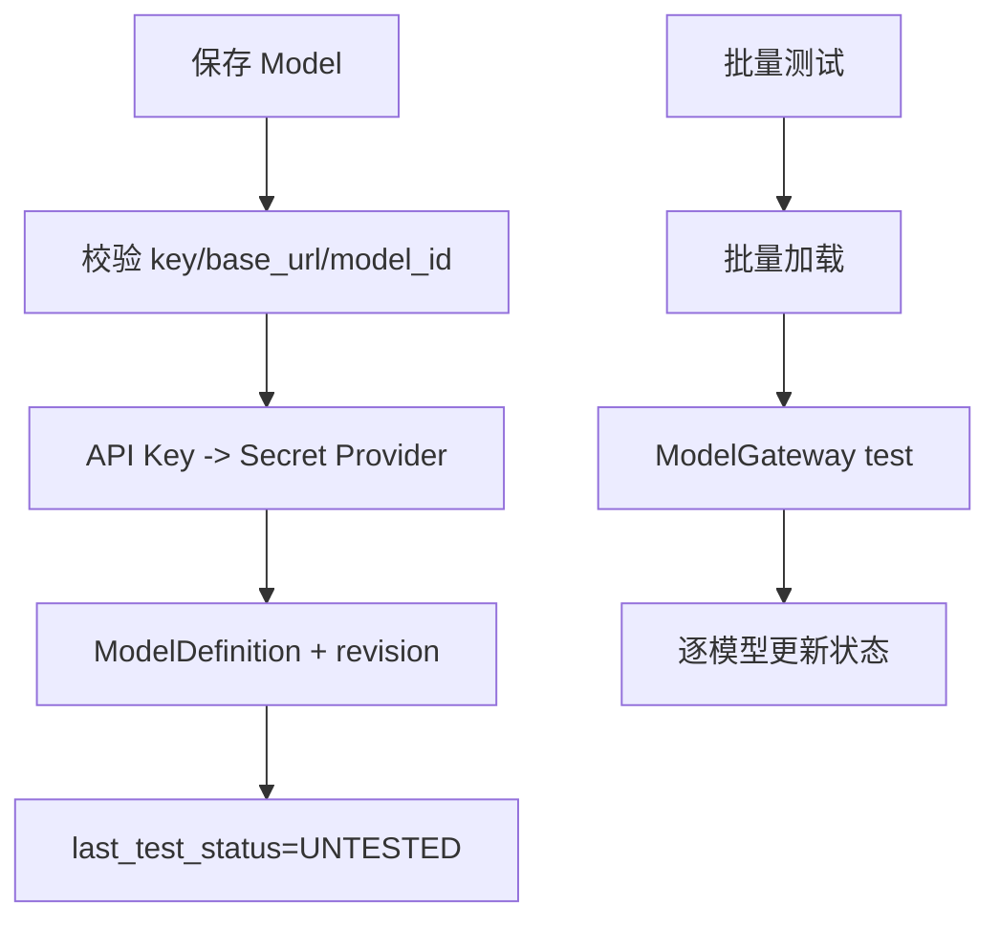
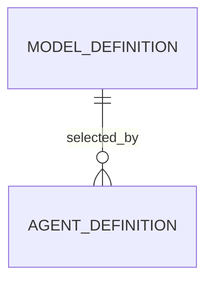

# 模型管理 模块需求与设计一体化文档

> **文档编号**: MOD-MODEL-V1.0  
> **文档版本**: v1.0  
> **创建日期**: 2026-09-17  
> **文档状态**: 设计评审中  
> **模板**: design-full.md


## 1. 文档控制

| 项目 | 内容 |
|---|---|
| 模块 | 模型管理 |
| Owner | muad-console-platform |
| 数据 Owner | control |
| 前置模块 | 01-platform-foundation |
| 建议代码位置 | apps/console-platform/backend/src/muad_console_platform/modules/models/ |

## 2. 需求分析

### 2.1 需求概述

| 项目 | 内容 |
|---|---|
| 模块名称 | 模型管理 |
| 模块 ID | MOD-MODEL |
| 需求类型 | 中大型功能开发 |
| 业务背景 | 需要区分内部 key 与 OpenAI model_id，并彻底移除没有业务意义的默认模型概念。 |
| 核心目标 | 提供 OpenAI-compatible ModelDefinition CRUD、SecretRef、revision 和批量模型测试。 |

### 2.2 痛点与价值

| 维度 | 内容 |
|---|---|
| 目标用户/调用方 | Builder / Admin / End User / 内部服务（按模块实际入口） |
| 当前问题 | 需要区分内部 key 与 OpenAI model_id，并彻底移除没有业务意义的默认模型概念。 |
| 业务影响 | 模块边界或契约不固定会导致上层重复设计、接口漂移和跨模块返工。 |
| 预期价值 | 提供 OpenAI-compatible ModelDefinition CRUD、SecretRef、revision 和批量模型测试。 |

### 2.3 功能方案

| 功能ID | 功能名称 | 功能描述 | 优先级 | 来源 |
|---|---|---|---|---|
| FEAT-01 | 模型 CRUD | name/key/base_url/model_id/api_key/params/enabled/revision。 | P0 | 需求描述 |
| FEAT-02 | 批量测试 | 选中多个模型做连通性/模型调用测试并逐项返回结果。 | P0 | 需求描述 |

#### 2.3.2 字段约束

| 字段类别 | 约束 |
|---|---|
| ID | 业务实体统一 UUID；跨 Owner Schema 仅逻辑引用 UUID |
| 时间 | PostgreSQL 使用 `timestamptz`；Console 展示 `YYYY-MM-DD HH:mm:ss` |
| 删除 | 产品表统一 `is_deleted` 软删除；状态枚举不重复表达 DELETED |
| Secret | 只保存 SecretRef；Secret Value 不进入 DB / Snapshot / 日志 / LLM |
| 枚举 | API 与 DB 统一使用稳定英文枚举值，中文/英文只在 UI/i18n 层映射 |
| 错误 | 业务代码只抛稳定 `code`；`msg/http_status` 由公共配置映射 |

### 2.4 范围与边界

| 类别 | 内容 |
|---|---|
| In Scope | 模型 CRUD、批量测试、test status/revision、Agent 选择 enabled 模型。 |
| Out of Scope | 无 is_default/default_model；不支持多协议 Provider |
| 技术债 | 无；不为未确认的未来能力增加兼容层 |

### 2.5 验收条件

#### 2.5.1 业务规则与约束

| ID | 类型 | 描述 | 验证场景 |
|---|---|---|---|
| RULE-01 | 系统约束 | JSON REST 统一 code/msg/data/trace_id/request_id/timestamp；业务只抛 code，msg/http_status 配置映射。 | S-01 / 对应 E- 场景 |
| RULE-02 | 系统约束 | 产品表统一 is_deleted/create_time/update_time；同 Owner Schema 物理 FK，跨 Owner Schema 逻辑 UUID。 | S-01 / 对应 E- 场景 |
| RULE-03 | 系统约束 | Secret Value 不进 DB/Snapshot/日志/LLM，只保存 SecretRef。 | S-01 / 对应 E- 场景 |
| RULE-04 | 系统约束 | ModelDefinition 无 is_default；Agent 显式选择 enabled model_id。 | S-01 / 对应 E- 场景 |
| RULE-05 | 系统约束 | 新 Run/Task 冻结 Snapshot；配置/授权变更只影响后续新 Run/Task。 | S-01 / 对应 E- 场景 |
| RULE-06 | 系统约束 | 跨 API/DB/Runtime/Browser 的关键流程必须 E2E，列出不得 mock 的真实边界。 | S-01 / 对应 E- 场景 |

#### 2.5.2 功能验收场景

##### 正常场景

| 场景ID | 功能ID | 测试层级 | 关键真实边界 | 归属 | 操作/前置 | 预期结果 |
|---|---|---|---|---|---|---|
| S-01 | FEAT-01 | E2E | Browser→API→Secret Provider→DB | 本模块 | 新增模型含 API Key | DB 仅 SecretRef，详情仅显示已配置 |
| S-02 | FEAT-02 | E2E | Browser→batch-test→Model endpoint→DB | 本模块 | 选择多个模型测试 | 逐项结果和 test_status 更新 |

##### 异常场景

| 场景ID | 功能ID | 测试层级 | 关键真实边界 | 归属 | 触发条件 | 系统行为 |
|---|---|---|---|---|---|---|
| E-01 | FEAT-01 | integration | DB revision | 本模块 | 旧 revision 保存 | REVISION_CONFLICT，不覆盖新值 |
| E-02 | FEAT-01 | unit | request schema | 本模块 | 请求携带 is_default | Schema 不接受该领域字段 |

无可靠实测数据的性能阈值统一标记“待定”，不复制模板示例值。

## 3. 技术设计

### 3.1 技术选型与关键决策

| 决策 | 选择 | 放弃项 | 理由 |
|---|---|---|---|
| 模型选择 | Agent 显式 model_id | 平台默认模型 | 避免隐式行为 |
| Secret | SecretRef | DB 明文 API Key | 安全边界 |

基础栈：Python >=3.12、FastAPI >=0.115、SQLAlchemy 2.x、PostgreSQL；按需 Redis/NFS/Secret Provider；统一 `muad-api` 与 `muad-logging`。

### 3.2 架构与流程



### 3.3 数据设计

#### `control.model_definition`

**表说明**

- **用途**：Agent 可选择的模型配置定义，不代表模型实例。
- **主要写入方**：Console。
- **主要读取方**：Agent Runtime 创建 Snapshot 时读取。
- **生命周期/边界**：修改 revision+1；新 Run 生效，旧 Run Snapshot 不漂移。

| 字段 | 类型 | 约束 | 说明 |
|---|---|---|---|
| `id` | uuid | PK | 主键 |
| `is_deleted` | boolean | NOT NULL DEFAULT false | 软删除 |
| `create_time` | timestamptz | NOT NULL DEFAULT now() | 创建时间 |
| `update_time` | timestamptz | NOT NULL DEFAULT now() | 更新时间 |
| `tenant_id` | varchar(64) | NOT NULL | 隔离键 |
| `key` | varchar(128) | NOT NULL | 稳定业务 key |
| `name` | varchar(128) | NOT NULL | 名称 |
| `protocol` | varchar(32) | NOT NULL DEFAULT 'OPENAI' | 当前仅 OPENAI；对应 OpenAI-compatible 协议 |
| `model_id` | varchar(128) | NOT NULL | OpenAI 请求中的 `model` 字段 |
| `base_url` | text | NOT NULL | OpenAI-compatible Base URL，不包含具体 `/chat/completions` 路径 |
| `secret_ref` | varchar(256) |  | Secret Provider 引用 |
| `params_json` | jsonb | NOT NULL DEFAULT '{}' | temperature 等 |
| `revision` | bigint | NOT NULL DEFAULT 1 | 每次修改 +1 |
| `enabled` | boolean | NOT NULL DEFAULT true | 是否启用 |
| `last_test_status` | varchar(16) | NOT NULL DEFAULT 'UNTESTED' | UNTESTED/AVAILABLE/FAILED |
| `last_test_at` | timestamptz |  | 最近批量测试时间 |

**索引/约束**：

- `UNIQUE (tenant_id, key) WHERE is_deleted=false`

**明确不设计** `is_default`：Agent 必须显式选择 `model_id`。

**ER 图**



数据库规则：所有产品表统一 `id/is_deleted/create_time/update_time`；同 Owner Schema 物理 FK，跨 Owner Schema 逻辑 UUID；迁移使用 Alembic expand→deploy→contract。

### 3.4 接口设计

```json
{
  "code":"0",
  "msg":"成功",
  "data":{},
  "trace_id":"trace-id",
  "request_id":"request-id",
  "timestamp":"2026-09-17T17:00:00+08:00"
}
```

业务异常只允许 `raise AppError("CODE")`；msg 与 HTTP Status 统一由 `config/api-messages.yaml` 映射。

| 接口ID | 名称 | 方法 | 路径 | FEAT |
|---|---|---|---|---|
| API-01 | 模型列表 | GET | `/api/v1/models` | FEAT-01 |
| API-02 | 新增模型 | POST | `/api/v1/models` | FEAT-01 |
| API-03 | 模型详情 | GET | `/api/v1/models/{model_id}` | FEAT-01 |
| API-04 | 编辑模型 | PUT | `/api/v1/models/{model_id}` | FEAT-01 |
| API-05 | 删除模型 | DELETE | `/api/v1/models/{model_id}` | FEAT-01 |
| API-06 | 批量测试 | POST | `/api/v1/models/batch-test` | FEAT-02 |


#### API-01 模型列表

```text
GET /api/v1/models
```

- 请求：
- `data`：
- 错误码：`COMMON_VALIDATION_ERROR / COMMON_INTERNAL_ERROR`
- 处理：

#### API-02 新增模型

```text
POST /api/v1/models
```

- 请求：name/key/protocol=OPENAI/base_url/model_id/api_key?/params/enabled。
- `data`：
- 错误码：`COMMON_VALIDATION_ERROR / COMMON_INTERNAL_ERROR`
- 处理：

#### API-03 模型详情

```text
GET /api/v1/models/{model_id}
```

- 请求：
- `data`：
- 错误码：`COMMON_VALIDATION_ERROR / COMMON_INTERNAL_ERROR`
- 处理：

#### API-04 编辑模型

```text
PUT /api/v1/models/{model_id}
```

- 请求：expected_revision + 可编辑字段；API Key 空表示保持。
- `data`：
- 错误码：`REVISION_CONFLICT`
- 处理：

#### API-05 删除模型

```text
DELETE /api/v1/models/{model_id}
```

- 请求：
- `data`：
- 错误码：`MODEL_IN_USE`
- 处理：

#### API-06 批量测试

```text
POST /api/v1/models/batch-test
```

- 请求：model_ids[]。
- `data`：items[]: model_id/status/latency_ms/error_code/tested_at。
- 错误码：`COMMON_VALIDATION_ERROR / COMMON_INTERNAL_ERROR`
- 处理：


### 3.5 质量实现方案

- 性能：批量/聚合优先，列表禁止 N+1，真实目标待基线压测后确定。
- 可靠性：事务只覆盖原子 DB 操作；外部 IO 不包长事务；高影响错误必须有 E-/B- 验收。
- 安全：Secret/Token/Cookie 不进业务 DB、日志、Snapshot、LLM。
- 可观测：统一 JSON 日志，自动带 service/trace_id/request_id；状态变化可关联 trace_id。


## 4. 部署与运维

本模块随 `muad-console-platform` 对应镜像/共享 package 发布；PostgreSQL、Redis、NFS、Secret Provider 外置。监控阈值待真实基线确定。

## 5. 风险与依赖

- 前置：01-platform-foundation。
- 主要风险：后续 UI/API 再次引入默认模型。。
- 应对：Contract Test + S/E/B 验收 + Spec Matrix。

## 6. 需求追溯矩阵

| 用户故事 | 功能ID | 接口ID | 测试用例ID | 测试层级 | 状态 |
|---|---|---|---|---|---|
| 需求描述 | FEAT-01 | API-01, API-02, API-03, API-04, API-05 | S-01, E-01, E-02 | E2E | 待实现 |
| 需求描述 | FEAT-02 | API-06 | S-02 | E2E | 待实现 |

## Spec Compliance Matrix

| Spec/Rule | enforcement | 设计影响 | 设计落点 | 验证场景 | 状态/N/A 理由 |
|---|---|---|---|---|---|
| `mss-platform#RULE-API-001` | required | JSON REST 统一 code/msg/data/trace_id/request_id/timestamp；业务只抛 code，msg/http_status 配置映射。 | §3.2/§3.3/§3.4 | S-01 + verifier | applied |
| `mss-platform#RULE-DATA-001` | required | 产品表统一 is_deleted/create_time/update_time；同 Owner Schema 物理 FK，跨 Owner Schema 逻辑 UUID。 | §3.2/§3.3/§3.4 | S-01 + verifier | applied |
| `mss-platform#RULE-SECRET-001` | required | Secret Value 不进 DB/Snapshot/日志/LLM，只保存 SecretRef。 | §3.2/§3.3/§3.4 | S-01 + verifier | applied |
| `mss-platform#RULE-MODEL-001` | required | ModelDefinition 无 is_default；Agent 显式选择 enabled model_id。 | §3.2/§3.3/§3.4 | S-01 + verifier | applied |
| `mss-platform#RULE-SNAPSHOT-001` | required | 新 Run/Task 冻结 Snapshot；配置/授权变更只影响后续新 Run/Task。 | §3.2/§3.3/§3.4 | S-01 + verifier | applied |
| `mss-platform#RULE-TEST-001` | required | 跨 API/DB/Runtime/Browser 的关键流程必须 E2E，列出不得 mock 的真实边界。 | §3.2/§3.3/§3.4 | S-01 + verifier | applied |
