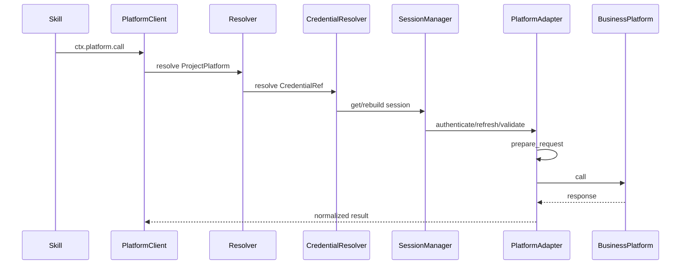
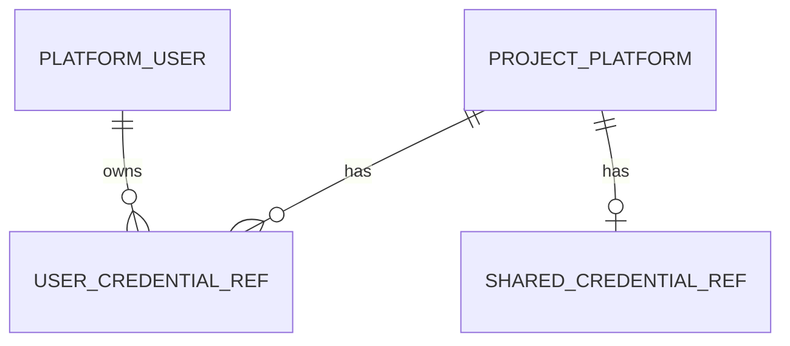

# 项目平台与凭据 模块需求与设计一体化文档

> **文档编号**: MOD-PLATFORM-V1.0  
> **文档版本**: v1.0  
> **创建日期**: 2026-09-17  
> **文档状态**: 设计评审中  
> **模板**: design-full.md


## 1. 文档控制

| 项目 | 内容 |
|---|---|
| 模块 | 项目平台与凭据 |
| Owner | muad-console-platform + platform-sdk |
| 数据 Owner | control + Redis session cache |
| 前置模块 | 01-platform-foundation, 02-user-identity |
| 建议代码位置 | apps/console-platform/backend/src/muad_console_platform/modules/project_platforms/；packages/platform-sdk/ |

## 2. 需求分析

### 2.1 需求概述

| 项目 | 内容 |
|---|---|
| 模块名称 | 项目平台与凭据 |
| 模块 ID | MOD-PLATFORM |
| 需求类型 | 中大型功能开发 |
| 业务背景 | 固定 Bearer/Basic/OAuth 枚举无法覆盖实际登录/签名/Session 流程，Skill 也不应持有认证细节。 |
| 核心目标 | 用 ProjectPlatform + PlatformAdapter + CredentialRef + Redis PlatformSession 封装业务平台寻址和认证。 |

### 2.2 痛点与价值

| 维度 | 内容 |
|---|---|
| 目标用户/调用方 | Builder / Admin / End User / 内部服务（按模块实际入口） |
| 当前问题 | 固定 Bearer/Basic/OAuth 枚举无法覆盖实际登录/签名/Session 流程，Skill 也不应持有认证细节。 |
| 业务影响 | 模块边界或契约不固定会导致上层重复设计、接口漂移和跨模块返工。 |
| 预期价值 | 用 ProjectPlatform + PlatformAdapter + CredentialRef + Redis PlatformSession 封装业务平台寻址和认证。 |

### 2.3 功能方案

| 功能ID | 功能名称 | 功能描述 | 优先级 | 来源 |
|---|---|---|---|---|
| FEAT-01 | 项目平台 CRUD | resolver_type/config + adapter_key/config + credential_mode。 | P0 | 需求描述 |
| FEAT-02 | 动态凭据 | Adapter credential_schema 生成用户/共享凭据表单。 | P0 | 需求描述 |
| FEAT-03 | Session/调用测试 | Credential→Session→prepare_request→业务调用完整链路。 | P0 | 需求描述 |
| FEAT-04 | Adapter 变更失效 | 更换 adapter_key 后凭据 INVALID、Session 清理。 | P0 | 需求描述 |

#### 2.3.2 字段约束

| 字段类别 | 约束 |
|---|---|
| ID | 业务实体统一 UUID；跨 Owner Schema 仅逻辑引用 UUID |
| 时间 | PostgreSQL 使用 `timestamptz`；Console 展示 `YYYY-MM-DD HH:mm:ss` |
| 删除 | 产品表统一 `is_deleted` 软删除；状态枚举不重复表达 DELETED |
| Secret | 只保存 SecretRef；Secret Value 不进入 DB / Snapshot / 日志 / LLM |
| 枚举 | API 与 DB 统一使用稳定英文枚举值，中文/英文只在 UI/i18n 层映射 |
| 错误 | 业务代码只抛稳定 `code`；`msg/http_status` 由公共配置映射 |

### 2.4 范围与边界

| 类别 | 内容 |
|---|---|
| In Scope | Adapter metadata、ProjectPlatform CRUD/Test、用户/共享凭据、CredentialResolver、SessionManager、adapter 变更失效。 |
| Out of Scope | Session 不落业务表；Skill 不读取 Secret Value；每平台最多一套共享凭据 |
| 技术债 | 无；不为未确认的未来能力增加兼容层 |

### 2.5 验收条件

#### 2.5.1 业务规则与约束

| ID | 类型 | 描述 | 验证场景 |
|---|---|---|---|
| RULE-01 | 系统约束 | JSON REST 统一 code/msg/data/trace_id/request_id/timestamp；业务只抛 code，msg/http_status 配置映射。 | S-01 / 对应 E- 场景 |
| RULE-02 | 系统约束 | 产品表统一 is_deleted/create_time/update_time；同 Owner Schema 物理 FK，跨 Owner Schema 逻辑 UUID。 | S-01 / 对应 E- 场景 |
| RULE-03 | 系统约束 | Secret Value 不进 DB/Snapshot/日志/LLM，只保存 SecretRef。 | S-01 / 对应 E- 场景 |
| RULE-04 | 系统约束 | ProjectPlatform + PlatformAdapter + CredentialRef + Redis Session；换 Adapter 使旧凭据/Session 失效。 | S-01 / 对应 E- 场景 |
| RULE-05 | 系统约束 | 后端错误和前端页面支持 zh-CN/en-US；新增业务仅增加配置。 | S-01 / 对应 E- 场景 |
| RULE-06 | 系统约束 | 跨 API/DB/Runtime/Browser 的关键流程必须 E2E，列出不得 mock 的真实边界。 | S-01 / 对应 E- 场景 |

#### 2.5.2 功能验收场景

##### 正常场景

| 场景ID | 功能ID | 测试层级 | 关键真实边界 | 归属 | 操作/前置 | 预期结果 |
|---|---|---|---|---|---|---|
| S-01 | FEAT-01 | E2E | Browser→API→DB | 本模块 | 创建 Base URL 平台并选择 Adapter | 按 Adapter schema 保存/展示配置 |
| S-02 | FEAT-02 | E2E | Browser→Secret Provider→DB | 本模块 | 配置用户敏感凭据 | DB 仅 SecretRef 且不回显 |
| S-03 | FEAT-03 | E2E | API→Redis→Adapter→业务平台 | 本模块 | 执行调用测试 | 展示 Resolver/Credential/Session/Request/业务调用阶段 |

##### 异常场景

| 场景ID | 功能ID | 测试层级 | 关键真实边界 | 归属 | 触发条件 | 系统行为 |
|---|---|---|---|---|---|---|
| E-01 | FEAT-04 | integration | Service→DB→Redis | 本模块 | 修改 adapter_key | 旧凭据 INVALID、Session 删除、reconfigure_required=true |

无可靠实测数据的性能阈值统一标记“待定”，不复制模板示例值。

## 3. 技术设计

### 3.1 技术选型与关键决策

| 决策 | 选择 | 放弃项 | 理由 |
|---|---|---|---|
| 认证抽象 | PlatformAdapter | auth_type enum | 可承载登录/签名/Session |
| Session | Redis 可重建 | DB 权威表 | 避免持久化短期认证状态 |
| 共享凭据 | 0..1 | 凭据池+priority | V1 没有真实池化需求 |

基础栈：Python >=3.12、FastAPI >=0.115、SQLAlchemy 2.x、PostgreSQL；按需 Redis/NFS/Secret Provider；统一 `muad-api` 与 `muad-logging`。

### 3.2 架构与流程



### 3.3 数据设计

#### `control.project_platform`

**表说明**

- **用途**：一个真实业务平台实例的逻辑定义；保存寻址配置、PlatformAdapter 选择和非敏感 Adapter 配置。
- **主要写入方**：Console。
- **主要读取方**：Runtime/Worker Egress Boundary。
- **生命周期/边界**：
  - 不把 Bearer/Basic/OAuth2 等认证协议硬编码到 ProjectPlatform 领域模型；
  - 平台认证、签名、Session 逻辑由 `adapter_key` 对应的 PlatformAdapter 实现；
  - `adapter_config_json` 只能保存非 Secret 配置；
  - Adapter 本身是代码注册项，不在数据库存可执行代码。

| 字段 | 类型 | 约束 | 说明 |
|---|---|---|---|
| `id` | uuid | PK | 主键 |
| `is_deleted` | boolean | NOT NULL DEFAULT false | 软删除 |
| `create_time` | timestamptz | NOT NULL DEFAULT now() | 创建时间 |
| `update_time` | timestamptz | NOT NULL DEFAULT now() | 更新时间 |
| `tenant_id` | varchar(64) | NOT NULL | 隔离键 |
| `key` | varchar(128) | NOT NULL | 平台标识 |
| `name` | varchar(128) | NOT NULL | 名称 |
| `resolver_type` | varchar(32) | NOT NULL | SERVICE_DISCOVERY/BASE_URL |
| `resolver_config_json` | jsonb | NOT NULL | 服务发现或 base URL 配置 |
| `adapter_key` | varchar(128) | NOT NULL | PlatformAdapter Registry key |
| `adapter_config_json` | jsonb | NOT NULL DEFAULT '{}' | Adapter 非敏感平台配置 |
| `adapter_schema_version` | varchar(32) | NOT NULL DEFAULT '1' | 保存时采用的配置 Schema 版本 |
| `credential_mode` | varchar(32) | NOT NULL | USER_ONLY/SHARED_ONLY/USER_THEN_SHARED/NONE |
| `enabled` | boolean | NOT NULL DEFAULT true | 是否启用 |

**索引/约束**：

- `UNIQUE (tenant_id, key) WHERE is_deleted=false`
- `INDEX (adapter_key, enabled)`

**为什么不建 `platform_adapter` 表**

`PlatformAdapter` 是受控 Python 代码，不是业务数据。Registry 在应用启动时由 `platform-sdk` 注册；Console 通过 `GET /api/v1/platform-adapters` 获取 Metadata/Schema。这样新增 Adapter 必须经过代码评审和发布，不会把认证执行代码变成数据库动态脚本。

#### `control.user_credential_ref`

**表说明**

- **用途**：用户 × ProjectPlatform 的唯一凭据引用，只存 SecretRef。
- **主要写入方**：Console/认证配置。
- **主要读取方**：Runtime Egress。
- **生命周期/边界**：Secret 真值由 Secret Provider 管理。

| 字段 | 类型 | 约束 | 说明 |
|---|---|---|---|
| `id` | uuid | PK | 主键 |
| `is_deleted` | boolean | NOT NULL DEFAULT false | 软删除 |
| `create_time` | timestamptz | NOT NULL DEFAULT now() | 创建时间 |
| `update_time` | timestamptz | NOT NULL DEFAULT now() | 更新时间 |
| `tenant_id` | varchar(64) | NOT NULL | 隔离键 |
| `user_id` | uuid | NOT NULL FK -> platform_user.id | 用户 |
| `platform_id` | uuid | NOT NULL FK -> project_platform.id | 项目平台 |
| `secret_ref` | varchar(256) | NOT NULL | Secret Provider 引用 |
| `credential_schema_version` | varchar(32) | NOT NULL DEFAULT '1' | 创建凭据时的 Adapter Credential Schema 版本 |
| `status` | varchar(16) | NOT NULL DEFAULT 'ACTIVE' | ACTIVE/INVALID |
| `last_verified_at` | timestamptz |  | 最近验证 |

**索引/约束**：

- `UNIQUE (user_id, platform_id) WHERE is_deleted=false`

#### `control.shared_credential_ref`

**表说明**

- **用途**：平台级共享凭据回退引用。
- **主要写入方**：Console。
- **主要读取方**：Runtime Egress。
- **生命周期/边界**：V1 每个 ProjectPlatform 最多一套共享凭据；不做共享账号池/优先级；不向 Skill 暴露。

| 字段 | 类型 | 约束 | 说明 |
|---|---|---|---|
| `id` | uuid | PK | 主键 |
| `is_deleted` | boolean | NOT NULL DEFAULT false | 软删除 |
| `create_time` | timestamptz | NOT NULL DEFAULT now() | 创建时间 |
| `update_time` | timestamptz | NOT NULL DEFAULT now() | 更新时间 |
| `tenant_id` | varchar(64) | NOT NULL | 隔离键 |
| `platform_id` | uuid | NOT NULL FK -> project_platform.id | 项目平台 |
| `secret_ref` | varchar(256) | NOT NULL | 共享 Secret 引用 |
| `credential_schema_version` | varchar(32) | NOT NULL DEFAULT '1' | Adapter Credential Schema 版本 |
| `status` | varchar(16) | NOT NULL DEFAULT 'ACTIVE' | 状态 |

**索引/约束**：

- `UNIQUE (platform_id) WHERE is_deleted=false`
- `INDEX (platform_id, status)`

**ER 图**



数据库规则：所有产品表统一 `id/is_deleted/create_time/update_time`；同 Owner Schema 物理 FK，跨 Owner Schema 逻辑 UUID；迁移使用 Alembic expand→deploy→contract。

### 3.4 接口设计

```json
{
  "code":"0",
  "msg":"成功",
  "data":{},
  "trace_id":"trace-id",
  "request_id":"request-id",
  "timestamp":"2026-09-17T17:00:00+08:00"
}
```

业务异常只允许 `raise AppError("CODE")`；msg 与 HTTP Status 统一由 `config/api-messages.yaml` 映射。

| 接口ID | 名称 | 方法 | 路径 | FEAT |
|---|---|---|---|---|
| API-01 | Adapter 元数据 | GET | `/api/v1/platform-adapters` | FEAT-01 |
| API-02 | 平台列表 | GET | `/api/v1/project-platforms` | FEAT-01 |
| API-03 | 新增平台 | POST | `/api/v1/project-platforms` | FEAT-01 |
| API-04 | 平台详情 | GET | `/api/v1/project-platforms/{platform_id}` | FEAT-01 |
| API-05 | 编辑平台 | PUT | `/api/v1/project-platforms/{platform_id}` | FEAT-04 |
| API-06 | 调用测试 | POST | `/api/v1/project-platforms/{platform_id}/test` | FEAT-03 |
| API-07 | 用户凭据读 | GET | `/api/v1/project-platforms/{platform_id}/users/{user_id}/credential` | FEAT-02 |
| API-08 | 用户凭据写 | PUT | `/api/v1/project-platforms/{platform_id}/users/{user_id}/credential` | FEAT-02 |
| API-09 | 用户凭据删 | DELETE | `/api/v1/project-platforms/{platform_id}/users/{user_id}/credential` | FEAT-02 |
| API-10 | 共享凭据读 | GET | `/api/v1/project-platforms/{platform_id}/shared-credential` | FEAT-02 |
| API-11 | 共享凭据写 | PUT | `/api/v1/project-platforms/{platform_id}/shared-credential` | FEAT-02 |
| API-12 | 共享凭据删 | DELETE | `/api/v1/project-platforms/{platform_id}/shared-credential` | FEAT-02 |


#### API-01 Adapter 元数据

```text
GET /api/v1/platform-adapters
```

- 请求：
- `data`：key/name/version/platform_config_schema/credential_schema/session_mode。
- 错误码：`COMMON_VALIDATION_ERROR / COMMON_INTERNAL_ERROR`
- 处理：

#### API-02 平台列表

```text
GET /api/v1/project-platforms
```

- 请求：
- `data`：
- 错误码：`COMMON_VALIDATION_ERROR / COMMON_INTERNAL_ERROR`
- 处理：

#### API-03 新增平台

```text
POST /api/v1/project-platforms
```

- 请求：name/key/resolver_type/resolver_config/adapter_key/adapter_config/credential_mode/enabled。
- `data`：
- 错误码：`COMMON_VALIDATION_ERROR / COMMON_INTERNAL_ERROR`
- 处理：

#### API-04 平台详情

```text
GET /api/v1/project-platforms/{platform_id}
```

- 请求：
- `data`：
- 错误码：`COMMON_VALIDATION_ERROR / COMMON_INTERNAL_ERROR`
- 处理：

#### API-05 编辑平台

```text
PUT /api/v1/project-platforms/{platform_id}
```

- 请求：expected_revision + fields；adapter_key 改变触发 credential/session invalidation。
- `data`：
- 错误码：`COMMON_VALIDATION_ERROR / COMMON_INTERNAL_ERROR`
- 处理：

#### API-06 调用测试

```text
POST /api/v1/project-platforms/{platform_id}/test
```

- 请求：test_user_id + operation/payload。
- `data`：
- 错误码：`COMMON_VALIDATION_ERROR / COMMON_INTERNAL_ERROR`
- 处理：

#### API-07 用户凭据读

```text
GET /api/v1/project-platforms/{platform_id}/users/{user_id}/credential
```

- 请求：
- `data`：
- 错误码：`COMMON_VALIDATION_ERROR / COMMON_INTERNAL_ERROR`
- 处理：

#### API-08 用户凭据写

```text
PUT /api/v1/project-platforms/{platform_id}/users/{user_id}/credential
```

- 请求：字段由 credential_schema 定义，Secret 只在请求明文出现。
- `data`：
- 错误码：`COMMON_VALIDATION_ERROR / COMMON_INTERNAL_ERROR`
- 处理：

#### API-09 用户凭据删

```text
DELETE /api/v1/project-platforms/{platform_id}/users/{user_id}/credential
```

- 请求：
- `data`：
- 错误码：`COMMON_VALIDATION_ERROR / COMMON_INTERNAL_ERROR`
- 处理：

#### API-10 共享凭据读

```text
GET /api/v1/project-platforms/{platform_id}/shared-credential
```

- 请求：
- `data`：
- 错误码：`COMMON_VALIDATION_ERROR / COMMON_INTERNAL_ERROR`
- 处理：

#### API-11 共享凭据写

```text
PUT /api/v1/project-platforms/{platform_id}/shared-credential
```

- 请求：
- `data`：
- 错误码：`COMMON_VALIDATION_ERROR / COMMON_INTERNAL_ERROR`
- 处理：

#### API-12 共享凭据删

```text
DELETE /api/v1/project-platforms/{platform_id}/shared-credential
```

- 请求：
- `data`：
- 错误码：`COMMON_VALIDATION_ERROR / COMMON_INTERNAL_ERROR`
- 处理：


### 3.5 质量实现方案

- 性能：批量/聚合优先，列表禁止 N+1，真实目标待基线压测后确定。
- 可靠性：事务只覆盖原子 DB 操作；外部 IO 不包长事务；高影响错误必须有 E-/B- 验收。
- 安全：Secret/Token/Cookie 不进业务 DB、日志、Snapshot、LLM。
- 可观测：统一 JSON 日志，自动带 service/trace_id/request_id；状态变化可关联 trace_id。


## 4. 部署与运维

本模块随 `muad-console-platform + platform-sdk` 对应镜像/共享 package 发布；PostgreSQL、Redis、NFS、Secret Provider 外置。监控阈值待真实基线确定。

## 5. 风险与依赖

- 前置：01-platform-foundation, 02-user-identity。
- 主要风险：Adapter 改变后复用旧 CredentialRef/Session。。
- 应对：Contract Test + S/E/B 验收 + Spec Matrix。

## 6. 需求追溯矩阵

| 用户故事 | 功能ID | 接口ID | 测试用例ID | 测试层级 | 状态 |
|---|---|---|---|---|---|
| 需求描述 | FEAT-01 | API-01, API-02, API-03, API-04 | S-01 | E2E | 待实现 |
| 需求描述 | FEAT-02 | API-07, API-08, API-09, API-10, API-11, API-12 | S-02 | E2E | 待实现 |
| 需求描述 | FEAT-03 | API-06 | S-03 | E2E | 待实现 |
| 需求描述 | FEAT-04 | API-05 | E-01 | integration | 待实现 |

## Spec Compliance Matrix

| Spec/Rule | enforcement | 设计影响 | 设计落点 | 验证场景 | 状态/N/A 理由 |
|---|---|---|---|---|---|
| `mss-platform#RULE-API-001` | required | JSON REST 统一 code/msg/data/trace_id/request_id/timestamp；业务只抛 code，msg/http_status 配置映射。 | §3.2/§3.3/§3.4 | S-01 + verifier | applied |
| `mss-platform#RULE-DATA-001` | required | 产品表统一 is_deleted/create_time/update_time；同 Owner Schema 物理 FK，跨 Owner Schema 逻辑 UUID。 | §3.2/§3.3/§3.4 | S-01 + verifier | applied |
| `mss-platform#RULE-SECRET-001` | required | Secret Value 不进 DB/Snapshot/日志/LLM，只保存 SecretRef。 | §3.2/§3.3/§3.4 | S-01 + verifier | applied |
| `mss-platform#RULE-PLATFORM-001` | required | ProjectPlatform + PlatformAdapter + CredentialRef + Redis Session；换 Adapter 使旧凭据/Session 失效。 | §3.2/§3.3/§3.4 | S-01 + verifier | applied |
| `mss-platform#RULE-I18N-001` | required | 后端错误和前端页面支持 zh-CN/en-US；新增业务仅增加配置。 | §3.2/§3.3/§3.4 | S-01 + verifier | applied |
| `mss-platform#RULE-TEST-001` | required | 跨 API/DB/Runtime/Browser 的关键流程必须 E2E，列出不得 mock 的真实边界。 | §3.2/§3.3/§3.4 | S-01 + verifier | applied |
