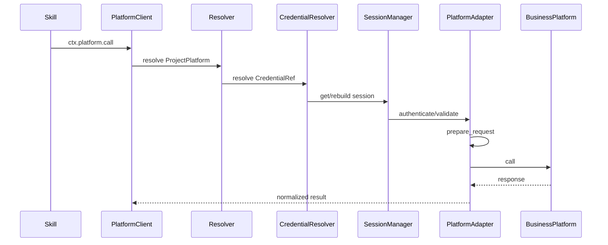
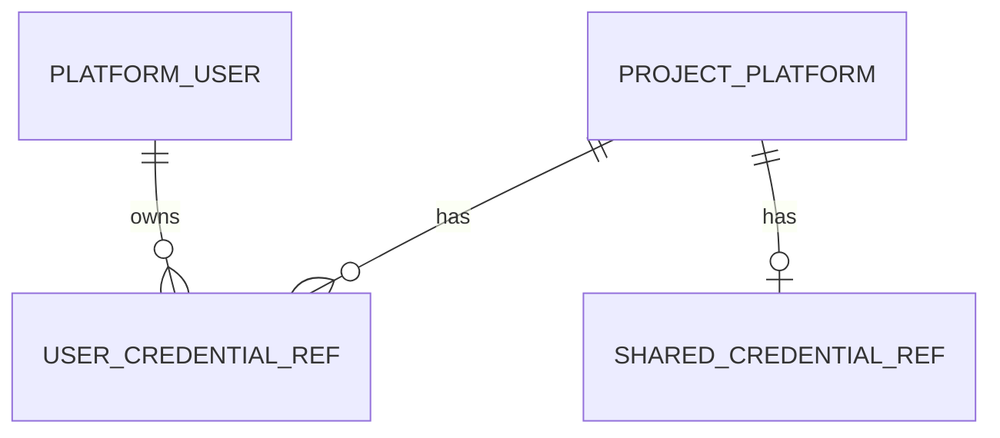

# 项目平台与凭据 模块需求与设计一体化文档

> **文档编号**: MOD-PLATFORM-V1.0  
> **文档版本**: v1.1  
> **创建日期**: 2026-09-17  
> **文档状态**: 设计评审中  
> **模板**: design-full.md


## 1. 文档控制

| 项目 | 内容 |
|---|---|
| 模块 | 项目平台与凭据 |
| Owner | muad-console-platform + platform-sdk |
| 数据 Owner | control + Redis session cache |
| 前置模块 | 01-platform-foundation, 02-user-identity |
| 建议代码位置 | apps/console-platform/backend/src/muad_console_platform/modules/project_platforms/；packages/platform-sdk/ |

### 1.1 责任人

| 角色 | 姓名 | 职责范围 |
|---|---|---|
| 产品经理 | — | 需求定义、业务验收 |
| 开发负责人 | muad-console-platform + platform-sdk | 技术方案、代码实现 |
| 测试负责人 | — | 测试策略、质量保证 |
| 架构师 | 01-platform-foundation Owner | 架构审核、技术决策 |

### 1.2 修订历史

| 版本 | 日期 | 作者 | 变更描述 |
|---|---|---|---|
| v1.0 | 2026-09-17 | muad-console-platform | 初始设计 |
| v1.1 | 2026-09-18 | muad-console-platform | 对齐 V1.4 决策（docs/17）：Adapter SPI 去掉独立 refresh、Session Set 索引与 singleflight、credential_mode 选择算法、project_platform 无 revision、Console 不执行业务平台调用、补 DELETE 平台与 Adapter 详情端点及错误码 |

## 2. 需求分析

### 2.1 需求概述

| 项目 | 内容 |
|---|---|
| 模块名称 | 项目平台与凭据 |
| 模块 ID | MOD-PLATFORM |
| 需求类型 | 中大型功能开发 |
| 业务背景 | 固定 Bearer/Basic/OAuth 枚举无法覆盖实际登录/签名/Session 流程，Skill 也不应持有认证细节。 |
| 核心目标 | 用 ProjectPlatform + PlatformAdapter + CredentialRef + Redis PlatformSession 封装业务平台寻址和认证。 |

### 2.2 痛点与价值

| 维度 | 内容 |
|---|---|
| 目标用户/调用方 | Builder / Admin / End User / 内部服务（按模块实际入口） |
| 当前问题 | 固定 Bearer/Basic/OAuth 枚举无法覆盖实际登录/签名/Session 流程，Skill 也不应持有认证细节。 |
| 业务影响 | 模块边界或契约不固定会导致上层重复设计、接口漂移和跨模块返工。 |
| 预期价值 | 用 ProjectPlatform + PlatformAdapter + CredentialRef + Redis PlatformSession 封装业务平台寻址和认证。 |

### 2.3 功能方案

#### 2.3.1 功能清单

| 功能ID | 功能名称 | 功能描述 | 优先级 | 来源 |
|---|---|---|---|---|
| FEAT-01 | 项目平台 CRUD | resolver_type/config + adapter_key/config + credential_mode；新增/编辑/删除/详情/列表。 | P0 | 需求描述 |
| FEAT-02 | 动态凭据 | Adapter credential_schema 生成用户/共享凭据表单；共享凭据每平台 0..1。 | P0 | 需求描述 |
| FEAT-03 | 配置校验与连通性探测 | Console 侧 Schema 校验 + 非鉴权连通性探测；真实鉴权调用归 Runtime/Worker Egress Boundary。 | P0 | 需求描述 |
| FEAT-04 | Adapter 变更失效 | 更换 adapter_key 后凭据 INVALID、Session 清理、credential_reconfigure_required=true。 | P0 | 需求描述 |

#### 2.3.2 字段约束

| 字段类别 | 约束 |
|---|---|
| ID | 业务实体统一 UUID；跨 Owner Schema 仅逻辑引用 UUID |
| 时间 | PostgreSQL 使用 `timestamptz`；Console 展示 `YYYY-MM-DD HH:mm:ss` |
| 删除 | 产品表统一 `is_deleted` 软删除；状态枚举不重复表达 DELETED |
| Secret | 凭据明文存于凭据表（credential_json）并以主键引用；不得进入 Snapshot / 日志 / LLM / API 响应 |
| 枚举 | API 与 DB 统一使用稳定英文枚举值，中文/英文只在 UI/i18n 层映射 |
| 错误 | 业务代码只抛稳定 `code`；`msg/http_status` 由公共配置映射 |
| 命名 | DB 列保留 `_json` 后缀；API/UI 使用无后缀名（`resolver_config`/`adapter_config`，docs/15 §6） |

### 2.4 范围与边界

| 类别 | 内容 |
|---|---|
| In Scope | Adapter metadata、ProjectPlatform CRUD、用户/共享凭据配置、配置校验与非鉴权连通性探测、CredentialResolver、SessionManager 共享契约、adapter 变更失效。 |
| Out of Scope | Session 不落业务表；Skill 不读取 Secret Value；每平台最多一套共享凭据（无 priority/池化）；Console 不执行平台登录与业务调用（真实鉴权调用归 Runtime/Worker Egress Boundary）。 |
| 技术债 | 无；不为未确认的未来能力增加兼容层 |

### 2.5 验收条件

#### 2.5.1 业务规则与约束

| ID | 类型 | 描述 | 验证场景 |
|---|---|---|---|
| RULE-01 | 系统约束 | JSON REST 统一 code/msg/data/trace_id/request_id/timestamp；业务只抛 code，msg/http_status 配置映射。 | S-01 / E-01 |
| RULE-02 | 系统约束 | 产品表统一 is_deleted/create_time/update_time；同 Owner Schema 物理 FK，跨 Owner Schema 逻辑 UUID。 | S-01 / S-04 |
| RULE-03 | 系统约束 | 凭据明文存于凭据表（credential_json）并以主键引用；不得进入 Snapshot/日志/LLM/API 响应。 | S-02 / E-02 |
| RULE-04 | 系统约束 | PlatformAdapter SPI 唯一版本为 `key/name/version/session_mode/platform_config_schema/credential_schema` + `authenticate/validate/prepare_request`；无独立 `refresh`；Session 为 Redis 可重建缓存，键含 credential_version，并用 Set 索引清理（禁止 KEYS/SCAN）。 | S-04 / E-01 |
| RULE-05 | 系统约束 | `adapter_key` 变更时 user/shared 凭据 INVALID、清理该平台全部 Session、返回 `credential_reconfigure_required=true`；`project_platform` 无 revision 列，更新不携带 `expected_revision`，同一事务追加 `config_audit_log`。 | S-04 / E-01 |
| RULE-06 | 系统约束 | 后端错误和前端页面支持 zh-CN/en-US；新增业务仅增加配置。 | S-01 |
| RULE-07 | 系统约束 | 跨 API/DB/Runtime/Browser 的关键流程必须 E2E，列出不得 mock 的真实边界。 | S-01 / S-03 |
| RULE-08 | 系统约束 | Console 不执行平台登录/业务调用：调用测试仅做配置/Schema 校验与非鉴权连通性探测，不读取 Secret Value、不建立 Session。 | S-03 / E-02 |

#### 2.5.2 功能验收场景

##### 正常场景

| 场景ID | 功能ID | 测试层级 | 关键真实边界 | 归属 | 操作/前置 | 预期结果 |
|---|---|---|---|---|---|---|
| S-01 | FEAT-01 | E2E | Browser→API→DB | 本模块 | 创建 Base URL 平台并选择 Adapter | 按 Adapter schema 保存/展示配置；唯一 key 冲突拒绝 |
| S-02 | FEAT-02 | E2E | Browser→API→DB | 本模块 | 配置用户敏感凭据 | DB 存明文且不回显 |
| S-03 | FEAT-03 | E2E | Browser→API→网络探测→UI | 本模块 | 对已启用平台执行配置校验与连通性探测 | 返回 config_valid/connectivity/credential_ref_status；不出现平台登录、Session 或业务调用记录 |
| S-04 | FEAT-04 | integration | Service→DB→Redis | 本模块 | 修改 adapter_key | 旧凭据 INVALID、Session 按 Set 索引删除、credential_reconfigure_required=true、config_audit_log 落库 |

##### 异常场景

| 场景ID | 功能ID | 测试层级 | 关键真实边界 | 归属 | 触发条件 | 系统行为 |
|---|---|---|---|---|---|---|
| E-01 | FEAT-01 | integration | API→Registry | 本模块 | 新增/编辑使用未注册 adapter_key | 返回 `PLATFORM_ADAPTER_NOT_FOUND`，不落库 |
| E-02 | FEAT-03 | integration | API→CredentialResolver | 本模块 | credential_mode 需要凭据但引用缺失 | 返回 `CREDENTIAL_MISSING`，不读取 Secret Value |
| E-03 | FEAT-01 | integration | API→DB | 本模块 | 新增平台 key 重复 | 返回 `COMMON_CONFLICT`（`message_args` 带 key） |
| E-04 | FEAT-02 | integration | API→Schema | 本模块 | 凭据字段不满足 credential_schema | 返回 `COMMON_VALIDATION_ERROR`，Secret 不落库 |

无可靠实测数据的性能阈值统一标记“待定”，不复制模板示例值。

## 3. 技术设计

### 3.1 技术选型与关键决策

| 决策 | 选择 | 放弃项 | 理由 |
|---|---|---|---|
| 认证抽象 | PlatformAdapter（authenticate/validate/prepare_request） | auth_type enum、独立 refresh | 刷新属于 authenticate 内部，与 docs/12 §3.1 唯一版本一致 |
| Session | Redis 可重建 + Set 索引清理 | DB 权威表、KEYS/SCAN 清理 | 避免持久化短期认证状态，且清理不阻塞 Redis |
| 共享凭据 | 每平台 0..1（无 priority） | 凭据池 + priority | V1 没有真实池化需求 |
| 调用测试 | Console 配置/Schema 校验 + 非鉴权连通性探测 | Console 执行平台登录/业务调用 | Console 不持有 Session/Secret，真实鉴权调用归 Runtime/Worker Egress Boundary（docs/01 §3.1） |
| 并发登录保护 | session key 短锁 + singleflight | 无锁重复 authenticate | 避免多 Pod 冷启动并发登录打爆业务平台 |

基础栈：Python >=3.12、FastAPI >=0.115、SQLAlchemy 2.x、PostgreSQL；按需 Redis/NFS；统一 `muad-api` 与 `muad-logging`。

### 3.2 架构与流程

> 下述链路运行在 Runtime/Worker Egress Boundary 内；Console 只做配置/Schema 校验与非鉴权连通性探测（FEAT-03），不执行平台登录与业务调用。



### 3.3 数据设计

#### `control.project_platform`

**表说明**

- **用途**：一个真实业务平台实例的逻辑定义；保存寻址配置、PlatformAdapter 选择和非敏感 Adapter 配置。
- **主要写入方**：Console。
- **主要读取方**：Runtime/Worker Egress Boundary。
- **生命周期/边界**：
  - 不把 Bearer/Basic/OAuth2 等认证协议硬编码到 ProjectPlatform 领域模型；
  - 平台认证、签名、Session 逻辑由 `adapter_key` 对应的 PlatformAdapter 实现；
  - `adapter_config_json` 只能保存非 Secret 配置；
  - Adapter 本身是代码注册项，不在数据库存可执行代码；
  - **无 `revision` 列**：配置更新不携带 `expected_revision`，同一事务追加 `config_audit_log`（docs/03 §4.3）。

| 字段 | 类型 | 约束 | 说明 |
|---|---|---|---|
| `id` | uuid | PK | 主键 |
| `is_deleted` | boolean | NOT NULL DEFAULT false | 软删除 |
| `create_time` | timestamptz | NOT NULL DEFAULT now() | 创建时间 |
| `update_time` | timestamptz | NOT NULL DEFAULT now() | 更新时间 |
| `tenant_id` | varchar(64) | NOT NULL | 隔离键 |
| `key` | varchar(128) | NOT NULL | 平台标识 |
| `name` | varchar(128) | NOT NULL | 名称 |
| `resolver_type` | varchar(32) | NOT NULL | SERVICE_DISCOVERY/BASE_URL |
| `resolver_config_json` | jsonb | NOT NULL | 服务发现或 base URL 配置 |
| `adapter_key` | varchar(128) | NOT NULL | PlatformAdapter Registry key |
| `adapter_config_json` | jsonb | NOT NULL DEFAULT '{}' | Adapter 非敏感平台配置 |
| `adapter_schema_version` | varchar(32) | NOT NULL DEFAULT '1' | 保存时采用的配置 Schema 版本 |
| `credential_mode` | varchar(32) | NOT NULL | USER_ONLY/SHARED_ONLY/USER_THEN_SHARED/NONE |
| `enabled` | boolean | NOT NULL DEFAULT true | 是否启用 |

**索引/约束**：

- `UNIQUE (tenant_id, key) WHERE is_deleted=false`
- `INDEX (adapter_key, enabled)`

**为什么不建 `platform_adapter` 表**

`PlatformAdapter` 是受控 Python 代码，不是业务数据。Registry 在应用启动时由 `platform-sdk` 注册；Console 通过 `GET /api/v1/platform-adapters` 获取 Metadata/Schema。这样新增 Adapter 必须经过代码评审和发布，不会把认证执行代码变成数据库动态脚本。

#### `control.user_credential_ref`

**表说明**

- **用途**：用户 × ProjectPlatform 的唯一凭据记录，存 credential_json 明文。
- **主要写入方**：Console/认证配置。
- **主要读取方**：Runtime Egress。
- **生命周期/边界**：凭据明文存于本表；`adapter_key` 变更时 `status=INVALID`。

| 字段 | 类型 | 约束 | 说明 |
|---|---|---|---|
| `id` | uuid | PK | 主键 |
| `is_deleted` | boolean | NOT NULL DEFAULT false | 软删除 |
| `create_time` | timestamptz | NOT NULL DEFAULT now() | 创建时间 |
| `update_time` | timestamptz | NOT NULL DEFAULT now() | 更新时间 |
| `tenant_id` | varchar(64) | NOT NULL | 隔离键 |
| `user_id` | uuid | NOT NULL FK -> platform_user.id | 用户 |
| `platform_id` | uuid | NOT NULL FK -> project_platform.id | 项目平台 |
| `credential_json` | jsonb | NOT NULL DEFAULT '{}' | 凭据内容（明文） |
| `credential_schema_version` | varchar(32) | NOT NULL DEFAULT '1' | 创建凭据时的 Adapter Credential Schema 版本 |
| `status` | varchar(16) | NOT NULL DEFAULT 'ACTIVE' | ACTIVE/INVALID |
| `last_verified_at` | timestamptz |  | 最近验证 |

**索引/约束**：

- `UNIQUE (user_id, platform_id) WHERE is_deleted=false`

#### `control.shared_credential_ref`

**表说明**

- **用途**：平台级共享凭据回退引用。
- **主要写入方**：Console。
- **主要读取方**：Runtime Egress。
- **生命周期/边界**：V1 每个 ProjectPlatform 最多一套共享凭据；不做共享账号池/优先级；不向 Skill 暴露；`adapter_key` 变更时 `status=INVALID`。

| 字段 | 类型 | 约束 | 说明 |
|---|---|---|---|
| `id` | uuid | PK | 主键 |
| `is_deleted` | boolean | NOT NULL DEFAULT false | 软删除 |
| `create_time` | timestamptz | NOT NULL DEFAULT now() | 创建时间 |
| `update_time` | timestamptz | NOT NULL DEFAULT now() | 更新时间 |
| `tenant_id` | varchar(64) | NOT NULL | 隔离键 |
| `platform_id` | uuid | NOT NULL FK -> project_platform.id | 项目平台 |
| `credential_json` | jsonb | NOT NULL DEFAULT '{}' | 共享凭据内容（明文） |
| `credential_schema_version` | varchar(32) | NOT NULL DEFAULT '1' | Adapter Credential Schema 版本 |
| `status` | varchar(16) | NOT NULL DEFAULT 'ACTIVE' | 状态 |

**索引/约束**：

- `UNIQUE (platform_id) WHERE is_deleted=false`
- `INDEX (platform_id, status)`

**ER 图**



数据库规则：所有产品表统一 `id/is_deleted/create_time/update_time`；同 Owner Schema 物理 FK，跨 Owner Schema 逻辑 UUID；迁移使用 Alembic expand→deploy→contract。

**字段中文名（docs/15 §6）**：`resolver_type`=接入方式、`resolver_config`=访问配置、`adapter_key`=平台适配器、`adapter_config`=适配器配置、`credential_mode`=凭据策略；列表数量字段为“已配置用户凭据数”（`user_credential_ref` COUNT）与“共享凭据：已配置/未配置”（`shared_credential_ref`）。

### 3.4 接口设计

```json
{
  "code":"0",
  "msg":"成功",
  "data":{},
  "trace_id":"trace-id",
  "request_id":"request-id",
  "timestamp":"2026-09-17T17:00:00+08:00"
}
```

业务异常只允许 `raise AppError("CODE")`；msg 与 HTTP Status 统一由 `config/api-messages.yaml` 映射。列表接口统一分页 `{items,page,page_size,total}`，`page>=1`、`1<=page_size<=100`（docs/07 §11）。

| 接口ID | 名称 | 方法 | 路径 | FEAT |
|---|---|---|---|---|
| API-01 | Adapter 元数据列表 | GET | `/api/v1/platform-adapters` | FEAT-01 |
| API-02 | 平台列表 | GET | `/api/v1/project-platforms` | FEAT-01 |
| API-03 | 新增平台 | POST | `/api/v1/project-platforms` | FEAT-01 |
| API-04 | 平台详情 | GET | `/api/v1/project-platforms/{platform_id}` | FEAT-01 |
| API-05 | 编辑平台 | PUT | `/api/v1/project-platforms/{platform_id}` | FEAT-04 |
| API-06 | 配置校验与连通性探测 | POST | `/api/v1/project-platforms/{platform_id}/test` | FEAT-03 |
| API-07 | 用户凭据读 | GET | `/api/v1/project-platforms/{platform_id}/users/{user_id}/credential` | FEAT-02 |
| API-08 | 用户凭据写 | PUT | `/api/v1/project-platforms/{platform_id}/users/{user_id}/credential` | FEAT-02 |
| API-09 | 用户凭据删 | DELETE | `/api/v1/project-platforms/{platform_id}/users/{user_id}/credential` | FEAT-02 |
| API-10 | 共享凭据读 | GET | `/api/v1/project-platforms/{platform_id}/shared-credential` | FEAT-02 |
| API-11 | 共享凭据写 | PUT | `/api/v1/project-platforms/{platform_id}/shared-credential` | FEAT-02 |
| API-12 | 共享凭据删 | DELETE | `/api/v1/project-platforms/{platform_id}/shared-credential` | FEAT-02 |
| API-13 | 删除平台 | DELETE | `/api/v1/project-platforms/{platform_id}` | FEAT-01 |
| API-14 | Adapter 详情 | GET | `/api/v1/platform-adapters/{adapter_key}` | FEAT-01 |

#### API-01 Adapter 元数据列表

```text
GET /api/v1/platform-adapters
```

- 调用方：Console Web。
- 请求（Query）：

| 字段 | 类型 | 必填 | 说明 |
|---|---|---|---|
| `page` | int | 否 | 页码，默认 1，最小 1 |
| `page_size` | int | 否 | 每页条数，默认 100，最大 100 |

- `data`：`{items:[{key,name,version,session_mode,platform_config_schema,credential_schema}],page,page_size,total}`。
- 错误码：`COMMON_VALIDATION_ERROR / COMMON_INTERNAL_ERROR`
- 处理：只读 Registry，不查 DB、不调用业务平台、不回显 Secret；Schema 原样返回供 Console 动态渲染。
- 对应 docs/07：§10.6。

#### API-02 平台列表

```text
GET /api/v1/project-platforms
```

- 调用方：Console Web。
- 请求（Query）：

| 字段 | 类型 | 必填 | 说明 |
|---|---|---|---|
| `keyword` | string | 否 | name/key 模糊搜索 |
| `adapter_key` | string | 否 | 平台适配器筛选 |
| `enabled` | boolean | 否 | 启用状态筛选 |
| `page` | int | 否 | 页码，默认 1，最小 1 |
| `page_size` | int | 否 | 每页条数，默认 20，最大 100 |

- `data`：`{items:[{platform_id,key,name,resolver_type,resolver_config,adapter_key,adapter_config,adapter_schema_version,credential_mode,enabled,configured_user_credential_count,has_shared_credential,update_time}],page,page_size,total}`。
- 错误码：`COMMON_VALIDATION_ERROR / COMMON_INTERNAL_ERROR`
- 处理：软删过滤；数量字段用聚合 COUNT 得出，禁止 N+1；枚举原样返回，中文映射留给 UI/i18n。
- 对应 docs/07：§10.7；字段中文名 docs/15 §6/§7。

#### API-03 新增平台

```text
POST /api/v1/project-platforms
```

- 调用方：Console Web。
- 请求（Body）：

| 字段 | 类型 | 必填 | 说明 |
|---|---|---|---|
| `name` | string | 是 | 名称，≤128 |
| `key` | string | 是 | 平台标识，租户内唯一 |
| `resolver_type` | string | 是 | `BASE_URL` / `SERVICE_DISCOVERY` |
| `resolver_config` | object | 是 | BASE_URL→`base_url`；SERVICE_DISCOVERY→`service_name` |
| `adapter_key` | string | 是 | 已注册 PlatformAdapter key |
| `adapter_config` | object | 否 | 非敏感 Adapter 配置，默认 `{}` |
| `credential_mode` | string | 是 | `USER_ONLY/SHARED_ONLY/USER_THEN_SHARED/NONE` |
| `enabled` | boolean | 否 | 默认 true |

- `data`：`{platform_id}`。
- 错误码：`COMMON_VALIDATION_ERROR / PLATFORM_ADAPTER_NOT_FOUND / COMMON_CONFLICT / COMMON_INTERNAL_ERROR`
- 处理：校验 `adapter_key` 已注册且 config 匹配 `platform_config_schema`；`resolver_type` 与 `resolver_config` 结构匹配；`UNIQUE(tenant_id,key)` 冲突返回 `COMMON_CONFLICT`；同一事务写入 `config_audit_log`（`actor_user_id`=当前 `console_account.id`）；不触发任何外部平台调用。
- 对应 docs/07：§10.7。

#### API-04 平台详情

```text
GET /api/v1/project-platforms/{platform_id}
```

- 调用方：Console Web。
- 请求：path `platform_id`。
- `data`：单个平台完整字段 + `configured_user_credential_count`、`has_shared_credential`、`adapter_metadata`（不含 Secret）。
- 错误码：`COMMON_NOT_FOUND / COMMON_INTERNAL_ERROR`
- 处理：软删过滤；不存在返回 `COMMON_NOT_FOUND`；Adapter Metadata 按 `adapter_key` 关联展示。
- 对应 docs/07：§10.7。

#### API-05 编辑平台

```text
PUT /api/v1/project-platforms/{platform_id}
```

- 调用方：Console Web。
- 请求（Body）：

| 字段 | 类型 | 必填 | 说明 |
|---|---|---|---|
| `name` | string | 否 | 名称 |
| `resolver_type` | string | 否 | `BASE_URL` / `SERVICE_DISCOVERY` |
| `resolver_config` | object | 否 | 与 resolver_type 匹配 |
| `adapter_key` | string | 否 | 变更后触发凭据失效与 Session 清理 |
| `adapter_config` | object | 否 | 非敏感 Adapter 配置 |
| `credential_mode` | string | 否 | 凭据选择策略 |
| `enabled` | boolean | 否 | 启用状态 |

  不接收 `expected_revision`（`project_platform` 无 revision 列，docs/03 §4.3）。
- `data`：`{platform_id,credential_reconfigure_required}`。
- 错误码：`COMMON_VALIDATION_ERROR / COMMON_NOT_FOUND / PLATFORM_ADAPTER_NOT_FOUND / COMMON_INTERNAL_ERROR`
- 处理：校验规则同 API-03；单事务更新平台字段并追加 `config_audit_log`；`adapter_key` 变化时同一事务将 user/shared 凭据置 `INVALID`，随后按 Redis Set 索引清理该平台全部 Session（禁止 KEYS/SCAN），响应 `credential_reconfigure_required=true`；已运行 Run/Task 的 Snapshot 不漂移。
- 对应 docs/07：§10.7。

#### API-06 配置校验与连通性探测

```text
POST /api/v1/project-platforms/{platform_id}/test
```

- 调用方：Console Web。
- 请求（Body）：

| 字段 | 类型 | 必填 | 说明 |
|---|---|---|---|
| `test_user_id` | uuid | 否 | 仅检查该用户凭据引用是否存在且 ACTIVE，不读取 Secret Value |
| `timeout_ms` | int | 否 | 连通性探测超时，默认 3000 |

- `data`：`{config_valid,adapter_key,adapter_version,resolver_type,connectivity:"REACHABLE|UNREACHABLE",credential_ref_status:"ACTIVE|MISSING|NOT_CHECKED",checked_at,details}`。
- 错误码：`COMMON_VALIDATION_ERROR / COMMON_NOT_FOUND / PLATFORM_ADAPTER_NOT_FOUND / CREDENTIAL_MISSING / COMMON_INTERNAL_ERROR`
- 处理（按顺序）：
  1. 加载平台配置并解析 `adapter_key`；
  2. 用 `platform_config_schema` 校验 `adapter_config` 与 `resolver_config`；
  3. 非鉴权连通性探测：BASE_URL 对 host 做 TCP/HEAD，SERVICE_DISCOVERY 做 DNS 解析；
  4. 传入 `test_user_id` 时按 `credential_mode` 检查凭据引用（不读取 Secret Value），缺失返回 `CREDENTIAL_MISSING`；
  5. 不执行 `authenticate/validate/prepare_request`，不建立/缓存 Session，不调用业务接口，不写 `config_audit_log`；真实鉴权调用归 Runtime/Worker Egress Boundary（docs/01 §3.1、docs/12 §8）。
- 对应 docs/07：§10.7。

#### API-07 用户凭据读

```text
GET /api/v1/project-platforms/{platform_id}/users/{user_id}/credential
```

- 调用方：Console Web。
- 请求：path `platform_id`、`user_id`。
- `data`：`{user_id,platform_id,credential_json,credential_schema_version,status,last_verified_at,configured:true}`（仅返回是否已配置，不含明文）。
- 错误码：`COMMON_NOT_FOUND / COMMON_INTERNAL_ERROR`
- 处理：按 `(user_id, platform_id)` 且 `is_deleted=false` 查询；不存在返回 `COMMON_NOT_FOUND`；不回显 Secret Value。
- 对应 docs/07：§10.8。

#### API-08 用户凭据写

```text
PUT /api/v1/project-platforms/{platform_id}/users/{user_id}/credential
```

- 调用方：Console Web。
- 请求（Body）：

| 字段 | 类型 | 必填 | 说明 |
|---|---|---|---|
| Adapter `credential_schema` 定义的字段（如 `ak/sk`、`username/password`） | string | 由 Schema 决定 | Secret 只在请求明文出现，`x-secret=true` 字段不回显 |

  字段以当前 Adapter 的 `credential_schema` 为准，后端使用同一 Schema 再校验。
- `data`：`{user_id,platform_id,credential_schema_version,status:"ACTIVE"}`。
- 错误码：`COMMON_VALIDATION_ERROR / COMMON_NOT_FOUND / PLATFORM_ADAPTER_NOT_FOUND / COMMON_INTERNAL_ERROR`
- 处理：后端使用同一 JSON Schema 再校验 → 明文写入 `user_credential_ref.credential_json`；`credential_schema_version` 取当前 Adapter Schema 版本；credential_json 内容哈希变化使旧 Session 自然不复用（session key 含 `credential_version`）；同事务追加 `config_audit_log`。
- 对应 docs/07：§10.8。

#### API-09 用户凭据删

```text
DELETE /api/v1/project-platforms/{platform_id}/users/{user_id}/credential
```

- 调用方：Console Web。
- 请求：path `platform_id`、`user_id`。
- `data`：`{}`（软删除结果）。
- 错误码：`COMMON_NOT_FOUND / COMMON_INTERNAL_ERROR`
- 处理：`user_credential_ref.is_deleted=true`（撤销=软删除，无到期时间字段）；同事务追加 `config_audit_log`；旧 Session 因 credential_version（内容哈希）变化自然失效。
- 对应 docs/07：§10.8。

#### API-10 共享凭据读

```text
GET /api/v1/project-platforms/{platform_id}/shared-credential
```

- 调用方：Console Web。
- 请求：path `platform_id`。
- `data`：`{platform_id,configured:true|false,credential_schema_version?,status?}`。
- 错误码：`COMMON_NOT_FOUND / COMMON_INTERNAL_ERROR`
- 处理：每平台 0..1；未配置返回 `configured=false`，不是错误；不回显 Secret Value。
- 对应 docs/07：§10.8。

#### API-11 共享凭据写

```text
PUT /api/v1/project-platforms/{platform_id}/shared-credential
```

- 调用方：Console Web。
- 请求（Body）：

| 字段 | 类型 | 必填 | 说明 |
|---|---|---|---|
| Adapter `credential_schema` 定义的字段 | string | 由 Schema 决定 | 共享凭据明文只在请求出现 |

  每平台最多一套共享凭据；不存在则创建，存在则更新。
- `data`：`{platform_id,configured:true,credential_schema_version,status:"ACTIVE"}`。
- 错误码：`COMMON_VALIDATION_ERROR / COMMON_NOT_FOUND / PLATFORM_ADAPTER_NOT_FOUND / COMMON_INTERNAL_ERROR`
- 处理：每平台最多一套，存在则更新、不存在则创建；不做 priority/池化；明文写入 `shared_credential_ref.credential_json`；同事务 `config_audit_log`。
- 对应 docs/07：§10.8。

#### API-12 共享凭据删

```text
DELETE /api/v1/project-platforms/{platform_id}/shared-credential
```

- 调用方：Console Web。
- 请求：path `platform_id`。
- `data`：`{}`（软删除结果）。
- 错误码：`COMMON_NOT_FOUND / COMMON_INTERNAL_ERROR`
- 处理：`shared_credential_ref.is_deleted=true`；同事务 `config_audit_log`；后续按 `credential_mode` 回退/报 `CREDENTIAL_MISSING`。
- 对应 docs/07：§10.8。

#### API-13 删除平台

```text
DELETE /api/v1/project-platforms/{platform_id}
```

- 调用方：Console Web。
- 请求：path `platform_id`。
- `data`：`{}`（软删除结果）。
- 错误码：`COMMON_NOT_FOUND / COMMON_INTERNAL_ERROR`
- 处理：`project_platform.is_deleted=true` 并同事务追加 `config_audit_log`；触发该平台凭据引用与 Session 失效清理；已运行 Run/Task 的 Snapshot 不漂移，仅影响后续新 Run/Task。
- 对应 docs/07：§10.7。

#### API-14 Adapter 详情

```text
GET /api/v1/platform-adapters/{adapter_key}
```

- 调用方：Console Web（Console 元数据一致性检查；Runtime/Worker 诊断见 docs/07 §4.3）。
- 请求：path `adapter_key`。
- `data`：`{key,name,version,session_mode,platform_config_schema,credential_schema}`。
- 错误码：`PLATFORM_ADAPTER_NOT_FOUND / COMMON_INTERNAL_ERROR`
- 处理：从 platform-sdk Registry 读取；未注册返回 `PLATFORM_ADAPTER_NOT_FOUND`；不回显 Secret。
- 对应 docs/07：§10.6。

### 3.5 Session 与凭据解析

> 本节是 Runtime/Worker Egress Boundary 的共享契约；Console 只做配置/Schema 校验与非鉴权连通性探测。

**Session Key（docs/12 §7.1）**

```text
platform_session:{tenant_id}:{platform_id}:{actor_scope}:{credential_version}:{adapter_key}:{adapter_version}
```

- `actor_scope`：`user:{user_id}` / `shared:{shared_credential_id}` / `none`；
- `credential_version` 来自 credential_json 内容哈希，凭据变更后自然不复用旧 Session。

**Redis Set 索引与失效清理**

```text
写入：SET {session_key} <state> EX <ttl>
      SADD platform_sessions:{tenant_id}:{platform_id} {session_key}
失效：SMEMBERS platform_sessions:{tenant_id}:{platform_id}
      -> DEL {session_key}
```

- 禁止 `KEYS/SCAN` 或通配符删除；
- 触发时机：`adapter_key` 变更、凭据失效/删除、平台删除；
- Redis 仅是可重建缓存，丢失后重新 `authenticate`；Session Cache 不保存 raw password / raw AK/SK。

**SingleFlight（docs/12 §7.4）**

并发冷启动时按 session key 获取短分布式锁 → double check → 仅一次 `authenticate` → 写缓存；其余调用者复用结果，避免账号被并发登录打爆。

**credential_mode 选择算法（docs/06 §6.5）**

| 模式 | 选择算法 | 缺失时 |
|---|---|---|
| `USER_ONLY` | UserCredentialRef(user, platform) | `CREDENTIAL_MISSING` |
| `SHARED_ONLY` | SharedCredentialRef(platform) | `CREDENTIAL_MISSING` |
| `USER_THEN_SHARED` | 先 UserCredentialRef；缺失或 `INVALID` 时回退 SharedCredentialRef | 两者都缺失 → `CREDENTIAL_MISSING` |
| `NONE` | credential = None，不读取凭据表 | 无 |

- 共享凭据每平台 0..1，无 priority/池化；
- 凭据明文存于凭据表；不得进入 Snapshot/日志/LLM/API 响应/Session Cache；
- `session_mode`（`NONE`/`SESSION`/`REQUEST_SIGNING`）决定 `credential/session` 是否可选，与 `credential_mode` 正交。

### 3.6 质量实现方案

- 性能：批量/聚合优先，列表禁止 N+1，真实目标待基线压测后确定。
- 可靠性：事务只覆盖原子 DB 操作；外部 IO 不包长事务；高影响错误必须有 E-/B- 验收。
- 安全：Secret/Token/Cookie 不进业务 DB、日志、Snapshot、LLM。
- 可观测：统一 JSON 日志，自动带 service/trace_id/request_id；状态变化可关联 trace_id。

## 4. 部署与运维

本模块随 `muad-console-platform + platform-sdk` 对应镜像/共享 package 发布；PostgreSQL、Redis、NFS 外置。监控阈值待真实基线确定。

## 5. 风险与依赖

- 前置：01-platform-foundation, 02-user-identity。
- 主要风险：Adapter 改变后复用旧 CredentialRef/Session（Session 索引清理失败会延长窗口）。
- 应对：Contract Test + S/E/B 验收 + Spec Matrix；Set 索引清理失败进入补偿重试。

## 6. 需求追溯矩阵

| 用户故事 | 功能ID | 接口ID | 测试用例ID | 测试层级 | 状态 |
|---|---|---|---|---|---|
| 需求描述 | FEAT-01 | API-01, API-02, API-03, API-04, API-13, API-14 | S-01, E-01, E-03 | E2E/integration | 待实现 |
| 需求描述 | FEAT-02 | API-07, API-08, API-09, API-10, API-11, API-12 | S-02, E-04 | E2E/integration | 待实现 |
| 需求描述 | FEAT-03 | API-06 | S-03, E-02 | E2E/integration | 待实现 |
| 需求描述 | FEAT-04 | API-05 | S-04 | integration | 待实现 |

## Spec Compliance Matrix

| Spec/Rule | enforcement | 设计影响 | 设计落点 | 验证场景 | 状态/N/A 理由 |
|---|---|---|---|---|---|
| `harness-platform#RULE-api-001` | required | JSON REST 统一封套与分页；业务只抛 code，msg/http_status 走配置映射。 | §2.5.1 RULE-01、§3.4 全部 API | S-01、S-03 | applied |
| `harness-platform#RULE-data-001` | required | 统一标准列、软删除 partial unique、timestamptz、同 Schema 物理 FK。 | §3.3 三张表定义 | S-01、S-04 | applied |
| `harness-secret#RULE-secret-001` | required | 凭据明文存于凭据表（主键引用）；不进日志/审计/Snapshot/API 响应；Session Cache 不含 raw credential。 | §3.3 user/shared_credential_ref、§3.5 | S-02、E-02 | applied |
| `harness-platform#RULE-platform-001` | required | Adapter SPI 无 refresh；credential_mode 仅选择策略；Session key 含版本且用 Set 索引清理。 | §3.1、§3.2、§3.5 | S-04、E-01、E-02 | applied |
| `harness-platform#RULE-i18n-001` | required | 错误码只使用已登记 code，msg 由 config/api-messages.yaml 双语映射。 | §3.4 错误码列 | S-01、E-01 | applied |
| `harness-platform#RULE-test-001` | required | 关键流程 E2E 且列出不得 mock 的真实边界（DB/Redis/网络探测）。 | §2.5.2 S-01~S-04 | S-01、S-03 | applied |
