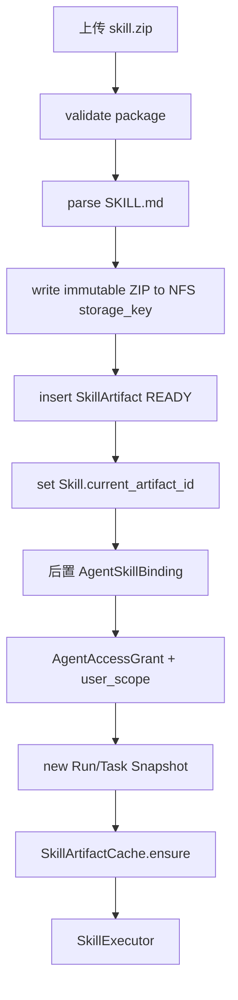
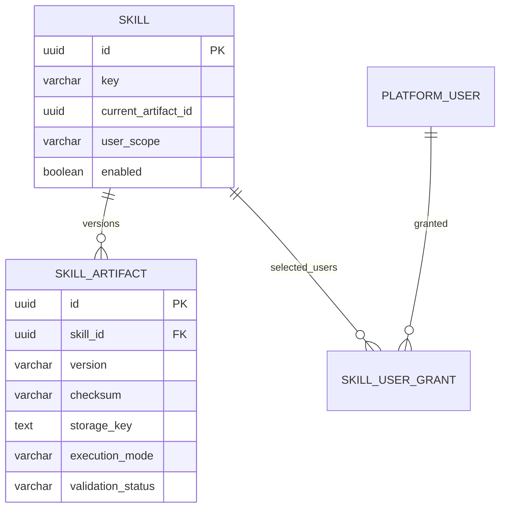

# Skill 管理与 Artifact 模块需求与设计一体化文档

> **文档编号**: MOD-SKILL-V1.0  
> **文档版本**: v1.0  
> **创建日期**: 2026-09-17  
> **文档状态**: 设计评审中  
> **模板**: design-full.md


## 1. 文档控制

| 项目 | 内容 |
|---|---|
| 模块 | Skill 管理与 Artifact |
| Owner | muad-console-platform + skill-sdk/artifact-store |
| 数据 Owner | control + NFS Artifact Store |
| 前置模块 | 01-platform-foundation, 02-user-identity, 04-project-platform |
| 建议代码位置 | apps/console-platform/backend/src/muad_console_platform/modules/skills/；packages/skill-sdk/；packages/artifact-store/ |

## 2. 需求分析

### 2.1 需求概述

| 项目 | 内容 |
|---|---|
| 模块名称 | Skill 管理与 Artifact |
| 模块 ID | MOD-SKILL |
| 需求类型 | 中大型功能开发 |
| 业务背景 | Skill 需要支持线下 IDE 开发后导入平台，不能依赖共享执行目录，也不能把认证和复杂 manifest 塞进包。 |
| 核心目标 | 把 Skill 作为业务能力最小单元，管理不可变 Artifact 版本、执行模式、用户范围和 SDK/Egress 运行边界。 |

### 2.2 痛点与价值

| 维度 | 内容 |
|---|---|
| 目标用户/调用方 | Builder / Admin / End User / 内部服务（按模块实际入口） |
| 当前问题 | Skill 需要支持线下 IDE 开发后导入平台，不能依赖共享执行目录，也不能把认证和复杂 manifest 塞进包。 |
| 业务影响 | 模块边界或契约不固定会导致上层重复设计、接口漂移和跨模块返工。 |
| 预期价值 | 把 Skill 作为业务能力最小单元，管理不可变 Artifact 版本、执行模式、用户范围和 SDK/Egress 运行边界。 |

### 2.3 功能方案

| 功能ID | 功能名称 | 功能描述 | 优先级 | 来源 |
|---|---|---|---|---|
| FEAT-01 | 导入 Skill | ZIP 校验、解析 SKILL.md、写 NFS、创建 Skill 与首个 Artifact。 | P0 | 需求描述 |
| FEAT-02 | 版本管理 | 给已有 Skill 导入新不可变 Artifact 并更新 current_artifact。 | P0 | 需求描述 |
| FEAT-03 | 用户范围 | ALL/SELECTED + SkillUserGrant，资源级跨 Agent 生效。 | P0 | 需求描述 |
| FEAT-04 | SDK/Egress Contract | Skill 通过 SkillContext/PlatformClient 调用项目平台。 | P0 | 需求描述 |

#### 2.3.2 字段约束

| 字段类别 | 约束 |
|---|---|
| ID | 业务实体统一 UUID；跨 Owner Schema 仅逻辑引用 UUID |
| 时间 | PostgreSQL 使用 `timestamptz`；Console 展示 `YYYY-MM-DD HH:mm:ss` |
| 删除 | 产品表统一 `is_deleted` 软删除；状态枚举不重复表达 DELETED |
| Secret | 只保存 SecretRef；Secret Value 不进入 DB / Snapshot / 日志 / LLM |
| 枚举 | API 与 DB 统一使用稳定英文枚举值，中文/英文只在 UI/i18n 层映射 |
| 错误 | 业务代码只抛稳定 `code`；`msg/http_status` 由公共配置映射 |

### 2.4 范围与边界

| 类别 | 内容 |
|---|---|
| In Scope | Skill import、Artifact 新版本、校验/manifest、current_artifact、user_scope/selected users、NFS storage_key、Skill SDK 契约。 |
| Out of Scope | Skill 包不保存 Secret；不动态 pip install；不从 NFS 直接执行 Python；不做复杂 Workflow DSL |
| 技术债 | 无；不为未确认的未来能力增加兼容层 |

### 2.5 验收条件

#### 2.5.1 业务规则与约束

| ID | 类型 | 描述 | 验证场景 |
|---|---|---|---|
| RULE-01 | 系统约束 | JSON REST 统一 code/msg/data/trace_id/request_id/timestamp；业务只抛 code，msg/http_status 配置映射。 | S-01 / 对应 E- 场景 |
| RULE-02 | 系统约束 | 产品表统一 is_deleted/create_time/update_time；同 Owner Schema 物理 FK，跨 Owner Schema 逻辑 UUID。 | S-01 / 对应 E- 场景 |
| RULE-03 | 系统约束 | Secret Value 不进 DB/Snapshot/日志/LLM，只保存 SecretRef。 | S-01 / 对应 E- 场景 |
| RULE-04 | 系统约束 | User→Agent；Agent→Skill/MCP；SELECTED 再叠加资源用户 Grant；不建三元授权。 | S-01 / 对应 E- 场景 |
| RULE-05 | 系统约束 | NFS-backed RWX PVC 为 Artifact 权威源；Runtime/Worker emptyDir 本地 cache；禁止直接从 NFS 执行 Python。 | S-01 / 对应 E- 场景 |
| RULE-06 | 系统约束 | 新 Run/Task 冻结 Snapshot；配置/授权变更只影响后续新 Run/Task。 | S-01 / 对应 E- 场景 |
| RULE-07 | 系统约束 | 关系修改使用单关系 POST/DELETE 独立事务，不用全量 PUT。 | S-01 / 对应 E- 场景 |
| RULE-08 | 系统约束 | 跨 API/DB/Runtime/Browser 的关键流程必须 E2E，列出不得 mock 的真实边界。 | S-01 / 对应 E- 场景 |

#### 2.5.2 功能验收场景

##### 正常场景

| 场景ID | 功能ID | 测试层级 | 关键真实边界 | 归属 | 操作/前置 | 预期结果 |
|---|---|---|---|---|---|---|
| S-01 | FEAT-01 | E2E | Upload API→NFS→PostgreSQL | 本模块 | 导入合法 ZIP | NFS 有不可变 Artifact，DB storage_key/checksum/manifest READY，Skill 指向它 |
| S-02 | FEAT-03 | integration | Grant service→DB | 本模块 | SELECTED Skill 添加用户 | 只创建 SkillUserGrant，不创建 AgentAccessGrant/AgentSkillBinding |
| S-03 | FEAT-02 | E2E | Upload→Snapshot semantics | 本模块 | Run A 开始后导入 v2 | Run A 继续旧 Artifact，新 Run 使用 current v2 |

##### 异常场景

| 场景ID | 功能ID | 测试层级 | 关键真实边界 | 归属 | 触发条件 | 系统行为 |
|---|---|---|---|---|---|---|
| E-01 | FEAT-01 | integration | Validator→NFS/DB | 本模块 | ZIP 路径穿越或缺 SKILL.md | 拒绝导入，不产生 READY Artifact |
| E-02 | FEAT-04 | integration | Skill SDK→Egress | 本模块 | Skill 试图直接访问 Secret | SDK 无此接口，Secret 不进入 Skill context |

无可靠实测数据的性能阈值统一标记“待定”，不复制模板示例值。

## 3. 技术设计

### 3.1 技术选型与关键决策

| 决策 | 选择 | 放弃项 | 理由 |
|---|---|---|---|
| Artifact 存储 | NFS RWX PVC + storage_key | 共享执行目录 | 保持文件事实源与执行 cache 分离 |
| Skill 包 | SKILL.md + scripts/references/assets/tests | 复杂 skill.yaml | 线下开发简单且低耦合 |
| 依赖 | 基础镜像白名单依赖 | 运行时 pip install | 避免污染 Runtime 环境 |

基础栈：Python >=3.12、FastAPI >=0.115、SQLAlchemy 2.x、PostgreSQL；按需 Redis/NFS/Secret Provider；统一 `muad-api` 与 `muad-logging`。

### 3.2 架构与流程



### 3.3 数据设计

#### `control.skill`

**表说明**

- **用途**：Skill 逻辑资源，name/description 主要来自 SKILL.md frontmatter。
- **主要写入方**：Skill 导入流程。
- **主要读取方**：Console、Runtime Skill Catalog。
- **生命周期/边界**：可切换 current_artifact；旧 Artifact 保持不可变。

| 字段 | 类型 | 约束 | 说明 |
|---|---|---|---|
| `id` | uuid | PK | 主键 |
| `is_deleted` | boolean | NOT NULL DEFAULT false | 软删除 |
| `create_time` | timestamptz | NOT NULL DEFAULT now() | 创建时间 |
| `update_time` | timestamptz | NOT NULL DEFAULT now() | 更新时间 |
| `tenant_id` | varchar(64) | NOT NULL | 隔离键 |
| `key` | varchar(128) | NOT NULL | Skill key |
| `name` | varchar(128) | NOT NULL | 名称 |
| `description` | text | NOT NULL | Catalog 描述 |
| `platform_label` | varchar(128) |  | 人类识别标签 |
| `user_scope` | varchar(16) | NOT NULL DEFAULT 'SELECTED' | ALL/SELECTED；默认指定用户，避免新导入能力直接对所有 Agent 授权用户开放 |
| `current_artifact_id` | uuid |  | 当前默认 Artifact |
| `enabled` | boolean | NOT NULL DEFAULT true | 是否启用 |

**索引/约束**：

- `UNIQUE (tenant_id, key) WHERE is_deleted=false`
- `INDEX (user_scope, enabled)`

#### `control.skill_artifact`

**表说明**

- **用途**：一次不可变 Skill 包上传结果。Package 以 SKILL.md + scripts/resources 为事实源。
- **主要写入方**：Console Skill Import。
- **主要读取方**：Runtime SkillLoader。
- **生命周期/边界**：append-only；checksum 确保可复现；不覆盖。

| 字段 | 类型 | 约束 | 说明 |
|---|---|---|---|
| `id` | uuid | PK | 主键 |
| `is_deleted` | boolean | NOT NULL DEFAULT false | 软删除 |
| `create_time` | timestamptz | NOT NULL DEFAULT now() | 创建时间 |
| `update_time` | timestamptz | NOT NULL DEFAULT now() | 更新时间 |
| `skill_id` | uuid | NOT NULL FK -> skill.id | 所属 Skill |
| `version` | varchar(64) | NOT NULL | Artifact 语义版本 |
| `checksum` | varchar(128) | NOT NULL | 不可变校验 |
| `storage_key` | text | NOT NULL | Artifact Store 相对键，例如 `skills/{skill_id}/{artifact_id}/skill.zip` |
| `frontmatter_json` | jsonb | NOT NULL DEFAULT '{}' | SKILL.md frontmatter 快照 |
| `manifest_json` | jsonb | NOT NULL DEFAULT '{}' | 包内文件清单、大小等，仅用于详情/校验，不作为第二套执行 manifest |
| `execution_mode` | varchar(16) | NOT NULL DEFAULT 'SYNC' | SYNC/ASYNC/AUTO；由 SKILL.md `execution` 提取 |
| `default_script` | varchar(256) |  | 可选默认脚本，例如 scripts/main.py；不是强制入口 |
| `package_size` | bigint | NOT NULL | 字节数 |
| `validation_status` | varchar(32) | NOT NULL | READY/REJECTED |
| `validation_message` | text |  | 校验信息 |
| `created_by` | uuid | NOT NULL | 上传人 |

**索引/约束**：

- `UNIQUE (skill_id, version) WHERE is_deleted=false`
- `UNIQUE (skill_id, checksum) WHERE is_deleted=false`
- `INDEX (skill_id, create_time DESC)`

#### `control.skill_user_grant`

**表说明**

- **用途**：当 Skill `user_scope=SELECTED` 时，声明哪些 PlatformUser 可以使用该 Skill。
- **主要写入方**：Admin/Builder。
- **主要读取方**：Runtime Visibility Resolver。
- **生命周期/边界**：
  - 只控制 Skill 的资源级用户范围；
  - 不授予 Agent 使用权；
  - 不把 Skill 自动绑定到 Agent；
  - 一个 Grant 对所有绑定该 Skill 的 Agent 生效，但用户仍必须分别拥有目标 Agent 的 AgentAccessGrant。

| 字段 | 类型 | 约束 | 说明 |
|---|---|---|---|
| `id` | uuid | PK | 主键 |
| `is_deleted` | boolean | NOT NULL DEFAULT false | 软删除 |
| `create_time` | timestamptz | NOT NULL DEFAULT now() | 创建时间 |
| `update_time` | timestamptz | NOT NULL DEFAULT now() | 更新时间 |
| `skill_id` | uuid | NOT NULL FK -> skill.id | Skill |
| `user_id` | uuid | NOT NULL FK -> platform_user.id | 指定用户 |
| `granted_by` | uuid | NOT NULL | 授权人 |
| `expires_at` | timestamptz |  | 可选到期时间；主要用于临时验证/灰度 |

**索引/约束**：

- `UNIQUE (skill_id, user_id) WHERE is_deleted=false`
- `INDEX (user_id, skill_id)`

**ER 图**



数据库规则：所有产品表统一 `id/is_deleted/create_time/update_time`；同 Owner Schema 物理 FK，跨 Owner Schema 逻辑 UUID；迁移使用 Alembic expand→deploy→contract。

### 3.4 接口设计

```json
{
  "code":"0",
  "msg":"成功",
  "data":{},
  "trace_id":"trace-id",
  "request_id":"request-id",
  "timestamp":"2026-09-17T17:00:00+08:00"
}
```

业务异常只允许 `raise AppError("CODE")`；msg 与 HTTP Status 统一由 `config/api-messages.yaml` 映射。

| 接口ID | 名称 | 方法 | 路径 | FEAT |
|---|---|---|---|---|
| API-01 | Skill 列表 | GET | `/api/v1/skills` | FEAT-01 |
| API-02 | 导入新 Skill | POST | `/api/v1/skills/import` | FEAT-01 |
| API-03 | Skill 详情 | GET | `/api/v1/skills/{skill_id}` | FEAT-01 |
| API-04 | 编辑 Skill 元数据 | PUT | `/api/v1/skills/{skill_id}` | FEAT-01 |
| API-05 | 版本列表 | GET | `/api/v1/skills/{skill_id}/artifacts` | FEAT-02 |
| API-06 | 导入新版本 | POST | `/api/v1/skills/{skill_id}/artifacts` | FEAT-02 |
| API-07 | 版本详情 | GET | `/api/v1/skills/{skill_id}/artifacts/{artifact_id}` | FEAT-02 |
| API-08 | 变更用户范围 | PUT | `/api/v1/skills/{skill_id}/user-scope` | FEAT-03 |
| API-09 | 指定用户列表 | GET | `/api/v1/skills/{skill_id}/users` | FEAT-03 |
| API-10 | 添加指定用户 | POST | `/api/v1/skills/{skill_id}/users/{user_id}` | FEAT-03 |
| API-11 | 移除指定用户 | DELETE | `/api/v1/skills/{skill_id}/users/{user_id}` | FEAT-03 |

| 函数ID | 签名 | 用途 | 错误码 | FEAT |\n|---|---|---|---|---|\n| LIB-01 | `SkillArtifactValidator.validate(zip_path) -> ValidationResult` | 校验包结构、ZIP 安全和 SKILL.md | `SKILL_PACKAGE_INVALID` | FEAT-01 |
| LIB-02 | `SkillContext.platform.call(platform_key,target,payload) -> dict` | Skill 调业务平台统一出口 | `EGRESS_DENIED / PLATFORM_CALL_FAILED` | FEAT-04 |

#### API-01 Skill 列表

```text
GET /api/v1/skills
```

- 请求：
- `data`：分页 Skill，包含 current_version/using_agent_count/selected_user_count。
- 错误码：`COMMON_VALIDATION_ERROR / COMMON_INTERNAL_ERROR`
- 处理：

#### API-02 导入新 Skill

```text
POST /api/v1/skills/import
```

- 请求：multipart ZIP + user_scope；默认 SELECTED。
- `data`：skill_id/current_artifact/version/validation_status。
- 错误码：`COMMON_VALIDATION_ERROR / COMMON_INTERNAL_ERROR`
- 处理：

#### API-03 Skill 详情

```text
GET /api/v1/skills/{skill_id}
```

- 请求：
- `data`：
- 错误码：`COMMON_VALIDATION_ERROR / COMMON_INTERNAL_ERROR`
- 处理：

#### API-04 编辑 Skill 元数据

```text
PUT /api/v1/skills/{skill_id}
```

- 请求：description/enabled；Artifact 内容不可变。
- `data`：
- 错误码：`COMMON_VALIDATION_ERROR / COMMON_INTERNAL_ERROR`
- 处理：

#### API-05 版本列表

```text
GET /api/v1/skills/{skill_id}/artifacts
```

- 请求：
- `data`：
- 错误码：`COMMON_VALIDATION_ERROR / COMMON_INTERNAL_ERROR`
- 处理：

#### API-06 导入新版本

```text
POST /api/v1/skills/{skill_id}/artifacts
```

- 请求：multipart ZIP；user_scope 不随版本改变。
- `data`：
- 错误码：`COMMON_VALIDATION_ERROR / COMMON_INTERNAL_ERROR`
- 处理：

#### API-07 版本详情

```text
GET /api/v1/skills/{skill_id}/artifacts/{artifact_id}
```

- 请求：
- `data`：version/checksum/storage_key/execution_mode/validation_status/manifest。
- 错误码：`COMMON_VALIDATION_ERROR / COMMON_INTERNAL_ERROR`
- 处理：

#### API-08 变更用户范围

```text
PUT /api/v1/skills/{skill_id}/user-scope
```

- 请求：user_scope=ALL|SELECTED。
- `data`：
- 错误码：`COMMON_VALIDATION_ERROR / COMMON_INTERNAL_ERROR`
- 处理：

#### API-09 指定用户列表

```text
GET /api/v1/skills/{skill_id}/users
```

- 请求：
- `data`：
- 错误码：`COMMON_VALIDATION_ERROR / COMMON_INTERNAL_ERROR`
- 处理：

#### API-10 添加指定用户

```text
POST /api/v1/skills/{skill_id}/users/{user_id}
```

- 请求：
- `data`：
- 错误码：`COMMON_VALIDATION_ERROR / COMMON_INTERNAL_ERROR`
- 处理：

#### API-11 移除指定用户

```text
DELETE /api/v1/skills/{skill_id}/users/{user_id}
```

- 请求：
- `data`：
- 错误码：`COMMON_VALIDATION_ERROR / COMMON_INTERNAL_ERROR`
- 处理：


### 3.5 质量实现方案

- 性能：批量/聚合优先，列表禁止 N+1，真实目标待基线压测后确定。
- 可靠性：事务只覆盖原子 DB 操作；外部 IO 不包长事务；高影响错误必须有 E-/B- 验收。
- 安全：Secret/Token/Cookie 不进业务 DB、日志、Snapshot、LLM。
- 可观测：统一 JSON 日志，自动带 service/trace_id/request_id；状态变化可关联 trace_id。


## 4. 部署与运维

本模块随 `muad-console-platform + skill-sdk/artifact-store` 对应镜像/共享 package 发布；PostgreSQL、Redis、NFS、Secret Provider 外置。监控阈值待真实基线确定。

## 5. 风险与依赖

- 前置：01-platform-foundation, 02-user-identity, 04-project-platform。
- 主要风险：上传成功但 DB 事务失败留下孤儿文件；用临时 storage_key/promote 或后台 orphan 清理。。
- 应对：Contract Test + S/E/B 验收 + Spec Matrix。

## 6. 需求追溯矩阵

| 用户故事 | 功能ID | 接口ID | 测试用例ID | 测试层级 | 状态 |
|---|---|---|---|---|---|
| 需求描述 | FEAT-01 | API-01, API-02, API-03, API-04, LIB-01 | S-01, E-01 | E2E | 待实现 |
| 需求描述 | FEAT-02 | API-05, API-06, API-07 | S-03 | E2E | 待实现 |
| 需求描述 | FEAT-03 | API-08, API-09, API-10, API-11 | S-02 | integration | 待实现 |
| 需求描述 | FEAT-04 | LIB-02 | E-02 | integration | 待实现 |

## Spec Compliance Matrix

| Spec/Rule | enforcement | 设计影响 | 设计落点 | 验证场景 | 状态/N/A 理由 |
|---|---|---|---|---|---|
| `mss-platform#RULE-API-001` | required | JSON REST 统一 code/msg/data/trace_id/request_id/timestamp；业务只抛 code，msg/http_status 配置映射。 | §3.2/§3.3/§3.4 | S-01 + verifier | applied |
| `mss-platform#RULE-DATA-001` | required | 产品表统一 is_deleted/create_time/update_time；同 Owner Schema 物理 FK，跨 Owner Schema 逻辑 UUID。 | §3.2/§3.3/§3.4 | S-01 + verifier | applied |
| `mss-platform#RULE-SECRET-001` | required | Secret Value 不进 DB/Snapshot/日志/LLM，只保存 SecretRef。 | §3.2/§3.3/§3.4 | S-01 + verifier | applied |
| `mss-platform#RULE-AUTH-001` | required | User→Agent；Agent→Skill/MCP；SELECTED 再叠加资源用户 Grant；不建三元授权。 | §3.2/§3.3/§3.4 | S-01 + verifier | applied |
| `mss-platform#RULE-SKILL-001` | required | NFS-backed RWX PVC 为 Artifact 权威源；Runtime/Worker emptyDir 本地 cache；禁止直接从 NFS 执行 Python。 | §3.2/§3.3/§3.4 | S-01 + verifier | applied |
| `mss-platform#RULE-SNAPSHOT-001` | required | 新 Run/Task 冻结 Snapshot；配置/授权变更只影响后续新 Run/Task。 | §3.2/§3.3/§3.4 | S-01 + verifier | applied |
| `mss-platform#RULE-REL-001` | required | 关系修改使用单关系 POST/DELETE 独立事务，不用全量 PUT。 | §3.2/§3.3/§3.4 | S-01 + verifier | applied |
| `mss-platform#RULE-TEST-001` | required | 跨 API/DB/Runtime/Browser 的关键流程必须 E2E，列出不得 mock 的真实边界。 | §3.2/§3.3/§3.4 | S-01 + verifier | applied |
