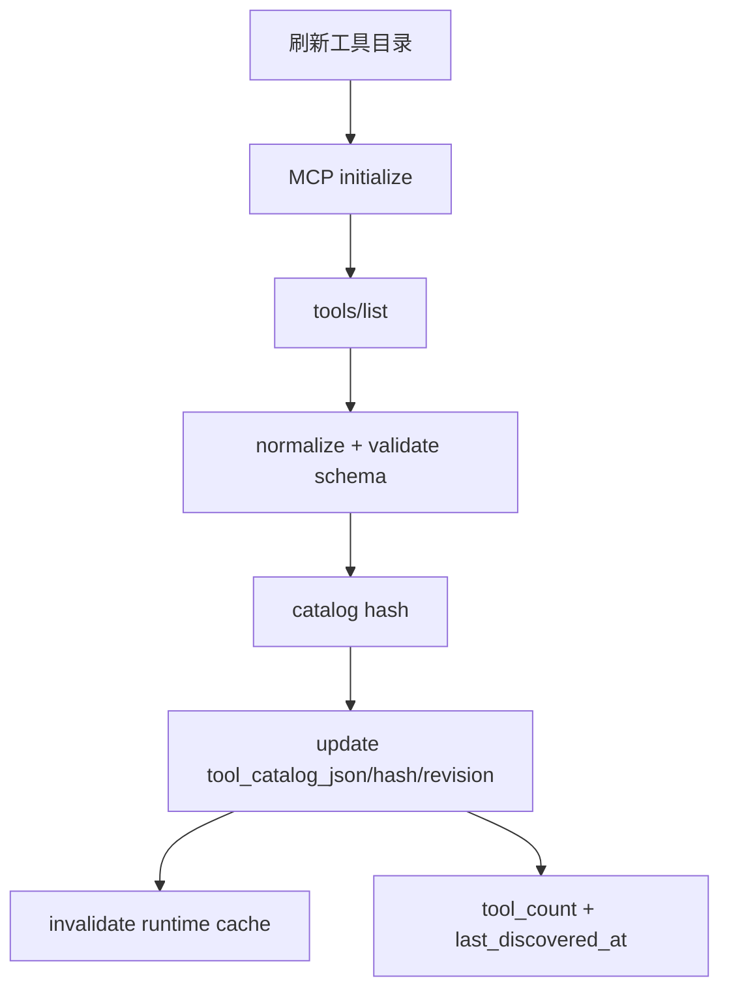
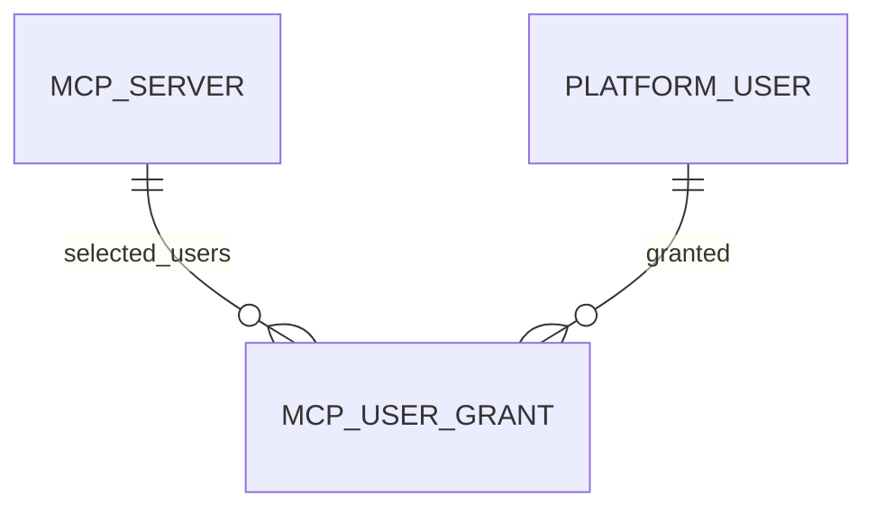

# MCP Server 与工具目录 模块需求与设计一体化文档

> **文档编号**: MOD-MCP-V1.0  
> **文档版本**: v1.0  
> **创建日期**: 2026-09-17  
> **文档状态**: 设计评审中  
> **模板**: design-full.md


## 1. 文档控制

| 项目 | 内容 |
|---|---|
| 模块 | MCP Server 与工具目录 |
| Owner | muad-console-platform + Runtime MCP Adapter |
| 数据 Owner | control |
| 前置模块 | 01-platform-foundation, 02-user-identity |
| 建议代码位置 | apps/console-platform/backend/src/muad_console_platform/modules/mcp/；apps/agent-runtime/src/muad_agent_runtime/mcp/ |

## 2. 需求分析

### 2.1 需求概述

| 项目 | 内容 |
|---|---|
| 模块名称 | MCP Server 与工具目录 |
| 模块 ID | MOD-MCP |
| 需求类型 | 中大型功能开发 |
| 业务背景 | MCP 管理状态与连接状态不能混为一个“状态”；Tool Catalog 不能只存在 Redis；V1 不应引入 Tool 级用户白名单/启停。 |
| 核心目标 | 管理 Streamable HTTP MCP Server，持久化最近成功 Tool Catalog，并按 Server 级用户范围授权。 |

### 2.2 痛点与价值

| 维度 | 内容 |
|---|---|
| 目标用户/调用方 | Builder / Admin / End User / 内部服务（按模块实际入口） |
| 当前问题 | MCP 管理状态与连接状态不能混为一个“状态”；Tool Catalog 不能只存在 Redis；V1 不应引入 Tool 级用户白名单/启停。 |
| 业务影响 | 模块边界或契约不固定会导致上层重复设计、接口漂移和跨模块返工。 |
| 预期价值 | 管理 Streamable HTTP MCP Server，持久化最近成功 Tool Catalog，并按 Server 级用户范围授权。 |

### 2.3 功能方案

| 功能ID | 功能名称 | 功能描述 | 优先级 | 来源 |
|---|---|---|---|---|
| FEAT-01 | MCP CRUD/连接状态 | endpoint/enabled/connection_status。 | P0 | 需求描述 |
| FEAT-02 | Tool Catalog | initialize + tools/list，最近成功目录持久化 PostgreSQL。 | P0 | 需求描述 |
| FEAT-03 | 用户范围 | ALL/SELECTED + McpUserGrant，所有 Tool 继承 Server 范围。 | P0 | 需求描述 |

#### 2.3.2 字段约束

| 字段类别 | 约束 |
|---|---|
| ID | 业务实体统一 UUID；跨 Owner Schema 仅逻辑引用 UUID |
| 时间 | PostgreSQL 使用 `timestamptz`；Console 展示 `YYYY-MM-DD HH:mm:ss` |
| 删除 | 产品表统一 `is_deleted` 软删除；状态枚举不重复表达 DELETED |
| Secret | 只保存 SecretRef；Secret Value 不进入 DB / Snapshot / 日志 / LLM |
| 枚举 | API 与 DB 统一使用稳定英文枚举值，中文/英文只在 UI/i18n 层映射 |
| 错误 | 业务代码只抛稳定 `code`；`msg/http_status` 由公共配置映射 |

### 2.4 范围与边界

| 类别 | 内容 |
|---|---|
| In Scope | MCP CRUD、连接测试、discover-tools、Tool Catalog、用户范围、指定用户、工具详情。 |
| Out of Scope | V1 仅 Streamable HTTP；不做 Tool 级用户授权；不做 Tool 级 enabled 配置 |
| 技术债 | 无；不为未确认的未来能力增加兼容层 |

### 2.5 验收条件

#### 2.5.1 业务规则与约束

| ID | 类型 | 描述 | 验证场景 |
|---|---|---|---|
| RULE-01 | 系统约束 | JSON REST 统一 code/msg/data/trace_id/request_id/timestamp；业务只抛 code，msg/http_status 配置映射。 | S-01 / 对应 E- 场景 |
| RULE-02 | 系统约束 | 产品表统一 is_deleted/create_time/update_time；同 Owner Schema 物理 FK，跨 Owner Schema 逻辑 UUID。 | S-01 / 对应 E- 场景 |
| RULE-03 | 系统约束 | Secret Value 不进 DB/Snapshot/日志/LLM，只保存 SecretRef。 | S-01 / 对应 E- 场景 |
| RULE-04 | 系统约束 | User→Agent；Agent→Skill/MCP；SELECTED 再叠加资源用户 Grant；不建三元授权。 | S-01 / 对应 E- 场景 |
| RULE-05 | 系统约束 | V1 仅 Streamable HTTP；Tool Catalog 持久化 PostgreSQL；Server 级用户范围，无 Tool 级授权/启停。 | S-01 / 对应 E- 场景 |
| RULE-06 | 系统约束 | 关系修改使用单关系 POST/DELETE 独立事务，不用全量 PUT。 | S-01 / 对应 E- 场景 |
| RULE-07 | 系统约束 | 新 Run/Task 冻结 Snapshot；配置/授权变更只影响后续新 Run/Task。 | S-01 / 对应 E- 场景 |
| RULE-08 | 系统约束 | 跨 API/DB/Runtime/Browser 的关键流程必须 E2E，列出不得 mock 的真实边界。 | S-01 / 对应 E- 场景 |

#### 2.5.2 功能验收场景

##### 正常场景

| 场景ID | 功能ID | 测试层级 | 关键真实边界 | 归属 | 操作/前置 | 预期结果 |
|---|---|---|---|---|---|---|
| S-01 | FEAT-02 | E2E | Browser→MCP Server→PostgreSQL→UI | 本模块 | 刷新工具目录 | revision 变化，工具数/详情来自最新成功 Catalog |
| S-02 | FEAT-03 | integration | Grant API→DB | 本模块 | SELECTED MCP 添加指定用户 | 创建 McpUserGrant，无 Tool 级 grant |

##### 异常场景

| 场景ID | 功能ID | 测试层级 | 关键真实边界 | 归属 | 触发条件 | 系统行为 |
|---|---|---|---|---|---|---|
| E-01 | FEAT-02 | integration | MCP Client→DB | 本模块 | tools/list 失败 | connection_status=DISCOVERY_FAILED 且保留上一成功 Catalog |
| E-02 | FEAT-01 | unit | request schema | 本模块 | transport 非 Streamable HTTP | V1 拒绝注册 |

无可靠实测数据的性能阈值统一标记“待定”，不复制模板示例值。

## 3. 技术设计

### 3.1 技术选型与关键决策

| 决策 | 选择 | 放弃项 | 理由 |
|---|---|---|---|
| Tool Catalog | PostgreSQL 最近成功快照 | 仅 Redis | Console/审计需要稳定事实源 |
| Test | connect+initialize | 顺带刷新 tools/list | 连接测试与目录变更语义分离 |
| Tool 控制 | Server 级 | Tool 级 enabled/grant | V1 不需要第二套权限模型 |

基础栈：Python >=3.12、FastAPI >=0.115、SQLAlchemy 2.x、PostgreSQL；按需 Redis/NFS/Secret Provider；统一 `muad-api` 与 `muad-logging`。

### 3.2 架构与流程



### 3.3 数据设计

#### `control.mcp_server`

**表说明**

- **用途**：已登记 MCP Server 的连接定义。
- **主要写入方**：Console。
- **主要读取方**：Runtime MCP Registry。
- **生命周期/边界**：启停实时影响新 Run；当前 Run 按 Snapshot 处理。

| 字段 | 类型 | 约束 | 说明 |
|---|---|---|---|
| `id` | uuid | PK | 主键 |
| `is_deleted` | boolean | NOT NULL DEFAULT false | 软删除 |
| `create_time` | timestamptz | NOT NULL DEFAULT now() | 创建时间 |
| `update_time` | timestamptz | NOT NULL DEFAULT now() | 更新时间 |
| `tenant_id` | varchar(64) | NOT NULL | 隔离键 |
| `key` | varchar(128) | NOT NULL | Server key |
| `name` | varchar(128) | NOT NULL | 名称 |
| `transport` | varchar(32) | NOT NULL DEFAULT 'streamable-http' | V1 仅 streamable-http |
| `endpoint` | text | NOT NULL | MCP endpoint |
| `auth_secret_ref` | varchar(256) |  | 认证引用 |
| `auth_config_json` | jsonb | NOT NULL DEFAULT '{}' | 非 secret 认证配置 |
| `user_scope` | varchar(16) | NOT NULL DEFAULT 'SELECTED' | ALL/SELECTED；默认指定用户 |
| `enabled` | boolean | NOT NULL DEFAULT true | 管理侧启用状态 |
| `connection_status` | varchar(24) | NOT NULL DEFAULT 'UNKNOWN' | UNKNOWN/AVAILABLE/UNAVAILABLE/DISCOVERY_FAILED；连接/工具发现状态，不与 enabled 混用 |
| `tool_catalog_json` | jsonb | NOT NULL DEFAULT '[]' | 最近一次成功 `tools/list` 的 Tool Catalog 快照：name/description/input_schema/effect |
| `tool_catalog_hash` | varchar(128) |  | Tool Catalog 内容哈希 |
| `tool_catalog_revision` | bigint | NOT NULL DEFAULT 0 | 成功发现且目录变化时 +1 |
| `last_discovered_at` | timestamptz |  | 最近一次成功 tools/list 时间 |
| `last_discovery_error` | text |  | 最近发现失败摘要 |
| `connect_timeout_ms` | int | NOT NULL DEFAULT 5000 | 连接超时 |
| `tool_cache_ttl_sec` | int | NOT NULL DEFAULT 300 | Redis Runtime 缓存 TTL；PostgreSQL Catalog 仍是 Console 权威目录快照 |

**索引/约束**：

- `UNIQUE (tenant_id, key) WHERE is_deleted=false`
- `INDEX (user_scope, enabled)`

**Tool Catalog 原则**：

- V1 不建设独立 `mcp_tool` 配置表；
- Tool 不做平台侧单 Tool 启停，不做 Tool 级用户白名单；
- Tool 是否存在以最近一次成功 `tools/list` 的 `tool_catalog_json` 为准；
- Redis 只缓存解析后的 ToolDefinition，不是目录事实源。

#### `control.mcp_user_grant`

**表说明**

- **用途**：当 MCP Server `user_scope=SELECTED` 时，声明哪些 PlatformUser 可以使用该 MCP 暴露的工具目录。
- **主要写入方**：Admin/Builder。
- **主要读取方**：Runtime Visibility Resolver。
- **生命周期/边界**：
  - 与 AgentMcpBinding、AgentAccessGrant 共同生效；
  - V1.3 只做 MCP Server 级用户范围，不做单个 MCP Tool 的用户授权；
  - 指定用户授权不会把 MCP 自动绑定到任何 Agent。

| 字段 | 类型 | 约束 | 说明 |
|---|---|---|---|
| `id` | uuid | PK | 主键 |
| `is_deleted` | boolean | NOT NULL DEFAULT false | 软删除 |
| `create_time` | timestamptz | NOT NULL DEFAULT now() | 创建时间 |
| `update_time` | timestamptz | NOT NULL DEFAULT now() | 更新时间 |
| `mcp_server_id` | uuid | NOT NULL FK -> mcp_server.id | MCP Server |
| `user_id` | uuid | NOT NULL FK -> platform_user.id | 指定用户 |
| `granted_by` | uuid | NOT NULL | 授权人 |
| `expires_at` | timestamptz |  | 可选到期时间 |

**索引/约束**：

- `UNIQUE (mcp_server_id, user_id) WHERE is_deleted=false`
- `INDEX (user_id, mcp_server_id)`

**ER 图**



数据库规则：所有产品表统一 `id/is_deleted/create_time/update_time`；同 Owner Schema 物理 FK，跨 Owner Schema 逻辑 UUID；迁移使用 Alembic expand→deploy→contract。

### 3.4 接口设计

```json
{
  "code":"0",
  "msg":"成功",
  "data":{},
  "trace_id":"trace-id",
  "request_id":"request-id",
  "timestamp":"2026-09-17T17:00:00+08:00"
}
```

业务异常只允许 `raise AppError("CODE")`；msg 与 HTTP Status 统一由 `config/api-messages.yaml` 映射。

| 接口ID | 名称 | 方法 | 路径 | FEAT |
|---|---|---|---|---|
| API-01 | MCP 列表 | GET | `/api/v1/mcp-servers` | FEAT-01 |
| API-02 | 注册 MCP | POST | `/api/v1/mcp-servers` | FEAT-01 |
| API-03 | MCP 详情 | GET | `/api/v1/mcp-servers/{mcp_id}` | FEAT-01 |
| API-04 | 编辑 MCP | PUT | `/api/v1/mcp-servers/{mcp_id}` | FEAT-01 |
| API-05 | 删除 MCP | DELETE | `/api/v1/mcp-servers/{mcp_id}` | FEAT-01 |
| API-06 | 连接测试 | POST | `/api/v1/mcp-servers/{mcp_id}/test` | FEAT-01 |
| API-07 | 刷新工具目录 | POST | `/api/v1/mcp-servers/{mcp_id}/discover-tools` | FEAT-02 |
| API-08 | 工具列表 | GET | `/api/v1/mcp-servers/{mcp_id}/tools` | FEAT-02 |
| API-09 | 工具详情 | GET | `/api/v1/mcp-servers/{mcp_id}/tools/{tool_name}` | FEAT-02 |
| API-10 | 用户范围 | PUT | `/api/v1/mcp-servers/{mcp_id}/user-scope` | FEAT-03 |
| API-11 | 指定用户列表 | GET | `/api/v1/mcp-servers/{mcp_id}/users` | FEAT-03 |
| API-12 | 添加指定用户 | POST | `/api/v1/mcp-servers/{mcp_id}/users/{user_id}` | FEAT-03 |
| API-13 | 移除指定用户 | DELETE | `/api/v1/mcp-servers/{mcp_id}/users/{user_id}` | FEAT-03 |


#### API-01 MCP 列表

```text
GET /api/v1/mcp-servers
```

- 请求：
- `data`：
- 错误码：`COMMON_VALIDATION_ERROR / COMMON_INTERNAL_ERROR`
- 处理：

#### API-02 注册 MCP

```text
POST /api/v1/mcp-servers
```

- 请求：name/key/endpoint/user_scope/enabled/auth_ref?/timeouts。
- `data`：
- 错误码：`COMMON_VALIDATION_ERROR / COMMON_INTERNAL_ERROR`
- 处理：

#### API-03 MCP 详情

```text
GET /api/v1/mcp-servers/{mcp_id}
```

- 请求：
- `data`：
- 错误码：`COMMON_VALIDATION_ERROR / COMMON_INTERNAL_ERROR`
- 处理：

#### API-04 编辑 MCP

```text
PUT /api/v1/mcp-servers/{mcp_id}
```

- 请求：
- `data`：
- 错误码：`COMMON_VALIDATION_ERROR / COMMON_INTERNAL_ERROR`
- 处理：

#### API-05 删除 MCP

```text
DELETE /api/v1/mcp-servers/{mcp_id}
```

- 请求：
- `data`：
- 错误码：`COMMON_VALIDATION_ERROR / COMMON_INTERNAL_ERROR`
- 处理：

#### API-06 连接测试

```text
POST /api/v1/mcp-servers/{mcp_id}/test
```

- 请求：
- `data`：
- 错误码：`COMMON_VALIDATION_ERROR / COMMON_INTERNAL_ERROR`
- 处理：只执行 connect + initialize，不修改 Tool Catalog。

#### API-07 刷新工具目录

```text
POST /api/v1/mcp-servers/{mcp_id}/discover-tools
```

- 请求：
- `data`：connection_status/tool_catalog_revision/tool_count/last_discovered_at。
- 错误码：`COMMON_VALIDATION_ERROR / COMMON_INTERNAL_ERROR`
- 处理：

#### API-08 工具列表

```text
GET /api/v1/mcp-servers/{mcp_id}/tools
```

- 请求：
- `data`：
- 错误码：`COMMON_VALIDATION_ERROR / COMMON_INTERNAL_ERROR`
- 处理：

#### API-09 工具详情

```text
GET /api/v1/mcp-servers/{mcp_id}/tools/{tool_name}
```

- 请求：
- `data`：
- 错误码：`COMMON_VALIDATION_ERROR / COMMON_INTERNAL_ERROR`
- 处理：

#### API-10 用户范围

```text
PUT /api/v1/mcp-servers/{mcp_id}/user-scope
```

- 请求：
- `data`：
- 错误码：`COMMON_VALIDATION_ERROR / COMMON_INTERNAL_ERROR`
- 处理：

#### API-11 指定用户列表

```text
GET /api/v1/mcp-servers/{mcp_id}/users
```

- 请求：
- `data`：
- 错误码：`COMMON_VALIDATION_ERROR / COMMON_INTERNAL_ERROR`
- 处理：

#### API-12 添加指定用户

```text
POST /api/v1/mcp-servers/{mcp_id}/users/{user_id}
```

- 请求：
- `data`：
- 错误码：`COMMON_VALIDATION_ERROR / COMMON_INTERNAL_ERROR`
- 处理：

#### API-13 移除指定用户

```text
DELETE /api/v1/mcp-servers/{mcp_id}/users/{user_id}
```

- 请求：
- `data`：
- 错误码：`COMMON_VALIDATION_ERROR / COMMON_INTERNAL_ERROR`
- 处理：


### 3.5 质量实现方案

- 性能：批量/聚合优先，列表禁止 N+1，真实目标待基线压测后确定。
- 可靠性：事务只覆盖原子 DB 操作；外部 IO 不包长事务；高影响错误必须有 E-/B- 验收。
- 安全：Secret/Token/Cookie 不进业务 DB、日志、Snapshot、LLM。
- 可观测：统一 JSON 日志，自动带 service/trace_id/request_id；状态变化可关联 trace_id。


## 4. 部署与运维

本模块随 `muad-console-platform + Runtime MCP Adapter` 对应镜像/共享 package 发布；PostgreSQL、Redis、NFS、Secret Provider 外置。监控阈值待真实基线确定。

## 5. 风险与依赖

- 前置：01-platform-foundation, 02-user-identity。
- 主要风险：discover-tools 失败时错误清空旧 Catalog。。
- 应对：Contract Test + S/E/B 验收 + Spec Matrix。

## 6. 需求追溯矩阵

| 用户故事 | 功能ID | 接口ID | 测试用例ID | 测试层级 | 状态 |
|---|---|---|---|---|---|
| 需求描述 | FEAT-01 | API-01, API-02, API-03, API-04, API-05, API-06 | E-02 | unit | 待实现 |
| 需求描述 | FEAT-02 | API-07, API-08, API-09 | S-01, E-01 | E2E | 待实现 |
| 需求描述 | FEAT-03 | API-10, API-11, API-12, API-13 | S-02 | integration | 待实现 |

## Spec Compliance Matrix

| Spec/Rule | enforcement | 设计影响 | 设计落点 | 验证场景 | 状态/N/A 理由 |
|---|---|---|---|---|---|
| `mss-platform#RULE-API-001` | required | JSON REST 统一 code/msg/data/trace_id/request_id/timestamp；业务只抛 code，msg/http_status 配置映射。 | §3.2/§3.3/§3.4 | S-01 + verifier | applied |
| `mss-platform#RULE-DATA-001` | required | 产品表统一 is_deleted/create_time/update_time；同 Owner Schema 物理 FK，跨 Owner Schema 逻辑 UUID。 | §3.2/§3.3/§3.4 | S-01 + verifier | applied |
| `mss-platform#RULE-SECRET-001` | required | Secret Value 不进 DB/Snapshot/日志/LLM，只保存 SecretRef。 | §3.2/§3.3/§3.4 | S-01 + verifier | applied |
| `mss-platform#RULE-AUTH-001` | required | User→Agent；Agent→Skill/MCP；SELECTED 再叠加资源用户 Grant；不建三元授权。 | §3.2/§3.3/§3.4 | S-01 + verifier | applied |
| `mss-platform#RULE-MCP-001` | required | V1 仅 Streamable HTTP；Tool Catalog 持久化 PostgreSQL；Server 级用户范围，无 Tool 级授权/启停。 | §3.2/§3.3/§3.4 | S-01 + verifier | applied |
| `mss-platform#RULE-REL-001` | required | 关系修改使用单关系 POST/DELETE 独立事务，不用全量 PUT。 | §3.2/§3.3/§3.4 | S-01 + verifier | applied |
| `mss-platform#RULE-SNAPSHOT-001` | required | 新 Run/Task 冻结 Snapshot；配置/授权变更只影响后续新 Run/Task。 | §3.2/§3.3/§3.4 | S-01 + verifier | applied |
| `mss-platform#RULE-TEST-001` | required | 跨 API/DB/Runtime/Browser 的关键流程必须 E2E，列出不得 mock 的真实边界。 | §3.2/§3.3/§3.4 | S-01 + verifier | applied |
