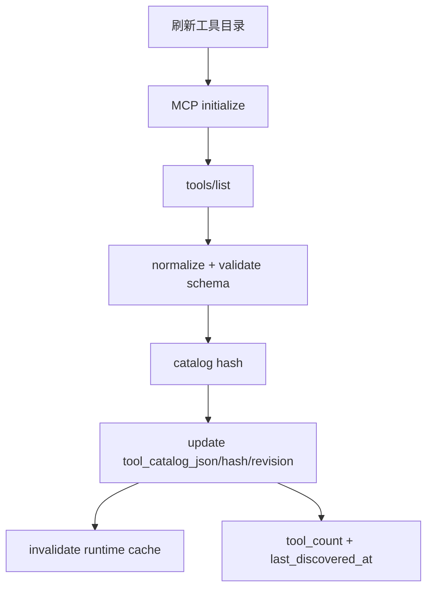
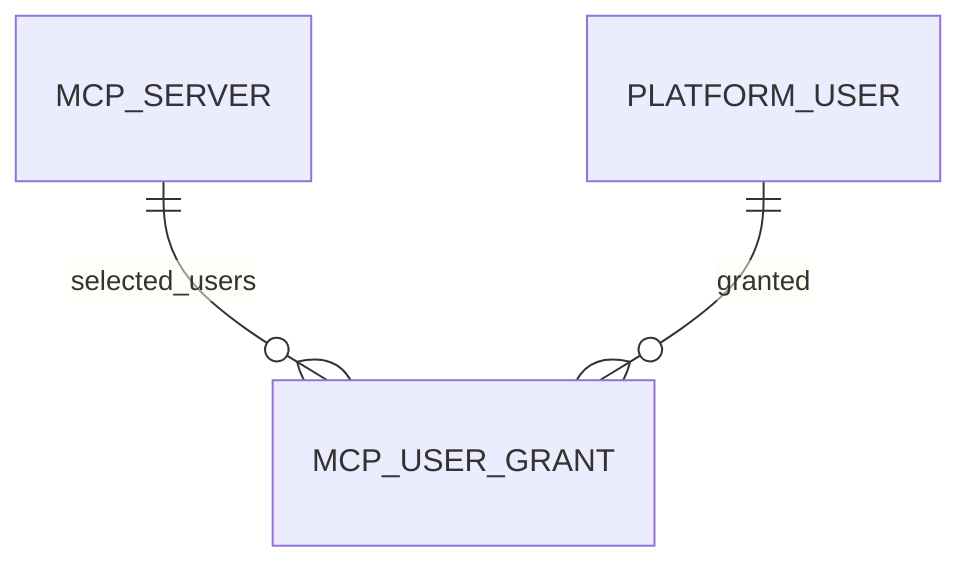

# MCP Server 与工具目录 模块需求与设计一体化文档

> **文档编号**: MOD-MCP-V1.0  
> **文档版本**: v1.1  
> **创建日期**: 2026-09-17  
> **文档状态**: 设计评审中  
> **模板**: design-full.md


## 1. 文档控制

| 项目 | 内容 |
|---|---|
| 模块 | MCP Server 与工具目录 |
| Owner | muad-console-platform（catalog 契约）；Runtime 侧 catalog 消费见模块 08 |
| 数据 Owner | control |
| 前置模块 | 01-platform-foundation, 02-user-identity |
| 建议代码位置 | apps/console-platform/backend/src/muad_console_platform/modules/mcp/；Runtime 侧消费实现（命名/ToolRegistry/Hook/Policy/Audit）归模块 08 |

### 1.1 责任人

| 角色 | 姓名 | 职责范围 |
|---|---|---|
| 产品经理 | — | 需求定义、业务验收 |
| 开发负责人 | muad-console-platform + agent-runtime（接口对接） | 技术方案、代码实现 |
| 测试负责人 | — | 测试策略、质量保证 |
| 架构师 | 01-platform-foundation Owner | 架构审核、技术决策 |

### 1.2 修订历史

| 版本 | 日期 | 作者 | 变更描述 |
|---|---|---|---|
| v1.0 | 2026-09-17 | muad-console-platform | 初始设计 |
| v1.1 | 2026-09-18 | muad-console-platform | 对齐 V1.4 决策（docs/17）：删除 mcp_user_grant.expires_at、明确与模块 08 的责任边界与 catalog 契约、明确 mcp_server 无 revision（不使用 expected_revision）、补 MCP_CONFIG_INVALID/MCP_DISCOVERY_FAILED 与工具数上限、SecretRef 解析说明 |

## 2. 需求分析

### 2.1 需求概述

| 项目 | 内容 |
|---|---|
| 模块名称 | MCP Server 与工具目录 |
| 模块 ID | MOD-MCP |
| 需求类型 | 中大型功能开发 |
| 业务背景 | MCP 管理状态与连接状态不能混为一个“状态”；Tool Catalog 不能只存在 Redis；V1 不应引入 Tool 级用户白名单/启停。 |
| 核心目标 | 管理 Streamable HTTP MCP Server，持久化最近成功 Tool Catalog，并按 Server 级用户范围授权。 |

### 2.2 痛点与价值

| 维度 | 内容 |
|---|---|
| 目标用户/调用方 | Builder / Admin / End User / 内部服务（按模块实际入口） |
| 当前问题 | MCP 管理状态与连接状态不能混为一个“状态”；Tool Catalog 不能只存在 Redis；V1 不应引入 Tool 级用户白名单/启停。 |
| 业务影响 | 模块边界或契约不固定会导致上层重复设计、接口漂移和跨模块返工。 |
| 预期价值 | 管理 Streamable HTTP MCP Server，持久化最近成功 Tool Catalog，并按 Server 级用户范围授权。 |

### 2.3 功能方案

#### 2.3.1 功能清单

| 功能ID | 功能名称 | 功能描述 | 优先级 | 来源 |
|---|---|---|---|---|
| FEAT-01 | MCP CRUD/连接测试 | endpoint/enabled/connection_status；更新仅同事务 `config_audit_log`（无 revision）。 | P0 | 需求描述 |
| FEAT-02 | Tool Catalog | `discover-tools` 执行 initialize + tools/list，最近成功目录持久化 PostgreSQL；校验单 Server 工具数上限。 | P0 | 需求描述 |
| FEAT-03 | 用户范围 | ALL/SELECTED + McpUserGrant，所有 Tool 继承 Server 范围；无到期时间，撤销=软删除。 | P0 | 需求描述 |
| FEAT-04 | Catalog 契约（Runtime 消费） | `resolve-definition` 返回 catalog `revision/hash/definitions`；`mcp::<server>::<tool>` 命名与 ToolRegistry/Hook/Policy/Audit 归模块 08。 | P1 | 需求描述 |

#### 2.3.2 字段约束

| 字段类别 | 约束 |
|---|---|
| ID | 业务实体统一 UUID；跨 Owner Schema 仅逻辑引用 UUID |
| 时间 | PostgreSQL 使用 `timestamptz`；Console 展示 `YYYY-MM-DD HH:mm:ss` |
| 删除 | 产品表统一 `is_deleted` 软删除；状态枚举不重复表达 DELETED；授权撤销=软删除，无到期时间 |
| Secret | 连接凭据明文存于 `auth_secret`（主键引用）；不得进入 Snapshot / 日志 / LLM / API 响应 |
| 枚举 | API 与 DB 统一使用稳定英文枚举值，中文/英文只在 UI/i18n 层映射 |
| 错误 | 业务代码只抛稳定 `code`；`msg/http_status` 由公共配置映射 |

### 2.4 范围与边界

| 类别 | 内容 |
|---|---|
| In Scope | MCP Server 注册/CRUD、连接测试、`discover-tools`、Tool Catalog 快照、Server 级用户范围、指定用户、工具详情、catalog `revision/hash/definitions` 契约。 |
| Out of Scope | V1 仅 Streamable HTTP；不做 Tool 级用户授权；不做 Tool 级 enabled 配置；不做 Runtime 侧 catalog 消费/Tool 命名/ToolRegistry/Hook/Policy/Audit（归模块 08）。 |
| 技术债 | 无；不为未确认的未来能力增加兼容层 |

**与模块 08 的责任边界**

```text
模块 06（本模块）：
  MCP Server 注册/发现/绑定关系/用户范围；
  discover-tools 唯一目录维护入口；
  Tool Catalog 快照与 catalog 契约（resolve 返回 revision/hash/definitions）。

模块 08（Runtime）：
  catalog 消费（Snapshot 冻结 definitions 建 ToolRegistry）；
  Tool 命名 mcp::<server_key>::<tool_name>；
  Hook / Policy / Audit 与 Tool execute。
```

### 2.5 验收条件

#### 2.5.1 业务规则与约束

| ID | 类型 | 描述 | 验证场景 |
|---|---|---|---|
| RULE-01 | 系统约束 | JSON REST 统一 code/msg/data/trace_id/request_id/timestamp；业务只抛 code，msg/http_status 配置映射。 | S-01 / E-02 |
| RULE-02 | 系统约束 | 产品表统一 is_deleted/create_time/update_time；同 Owner Schema 物理 FK，跨 Owner Schema 逻辑 UUID。 | S-01 / S-02 |
| RULE-03 | 系统约束 | 凭据明文存于 `auth_secret`（主键引用）；不得进入 Snapshot/日志/LLM/API 响应。 | S-01 / E-02 |
| RULE-04 | 系统约束 | User→Agent；Agent→Skill/MCP；SELECTED 再叠加资源用户 Grant；不建三元授权；McpUserGrant 无 `expires_at`，撤销=软删除。 | S-02 / E-03 |
| RULE-05 | 系统约束 | V1 仅 Streamable HTTP；Tool Catalog 持久化 PostgreSQL；Server 级用户范围，无 Tool 级授权/启停。 | S-01 / E-02 |
| RULE-06 | 系统约束 | 关系修改使用单关系 POST/DELETE 独立事务，不用全量 PUT。 | S-02 / E-03 |
| RULE-07 | 系统约束 | 新 Run/Task 冻结 Snapshot；配置/授权变更只影响后续新 Run/Task。 | S-04 |
| RULE-08 | 系统约束 | 跨 API/DB/Runtime/Browser 的关键流程必须 E2E，列出不得 mock 的真实边界。 | S-01 / S-03 |
| RULE-09 | 系统约束 | `mcp_server` 无 `revision` 列（与 docs/02 及迁移一致）：更新不携带 `expected_revision`，同一事务内追加 `config_audit_log`。 | S-03 |
| RULE-10 | 系统约束 | `discover-tools` 是 Tool Catalog 唯一维护入口；单 Server 工具数超过上限时发现失败（`MCP_DISCOVERY_FAILED`）并保留上一成功 Catalog。 | E-01 / E-05 |
| RULE-11 | 系统约束 | 本模块只定义 catalog 契约（resolve 返回 `revision/hash/definitions`）；Runtime 消费、`mcp::<server_key>::<tool_name>` 命名与 ToolRegistry/Hook/Policy/Audit 归模块 08。 | S-04 |

#### 2.5.2 功能验收场景

##### 正常场景

| 场景ID | 功能ID | 测试层级 | 关键真实边界 | 归属 | 操作/前置 | 预期结果 |
|---|---|---|---|---|---|---|
| S-01 | FEAT-02 | E2E | Browser→MCP Server→PostgreSQL→UI | 本模块 | 刷新工具目录 | revision 变化，工具数/详情来自最新成功 Catalog |
| S-02 | FEAT-03 | integration | Grant API→DB | 本模块 | SELECTED MCP 添加指定用户 | 创建 McpUserGrant（无到期时间），无 Tool 级 grant |
| S-03 | FEAT-01/02 | E2E | Browser→MCP Server→PostgreSQL | 本模块 | 注册 Server→连接测试→刷新工具目录 | connection_status=AVAILABLE，catalog revision/hash 更新 |
| S-04 | FEAT-04 | E2E | Agent 详情（模块 07）→resolve-definition→Runtime | 后置 → 模块 08 | 注册/测试/发现完成后，在 Agent 详情绑定该 Server 并参与 resolve-definition | 返回 catalog `revision/hash/definitions`；Tool 命名 `mcp::<server_key>::<tool_name>` 与 Registry/Audit 由模块 08 断言 |

##### 异常场景

| 场景ID | 功能ID | 测试层级 | 关键真实边界 | 归属 | 触发条件 | 系统行为 |
|---|---|---|---|---|---|---|
| E-01 | FEAT-02 | integration | MCP Client→DB | 本模块 | tools/list 失败 | 返回 `MCP_DISCOVERY_FAILED`；connection_status=DISCOVERY_FAILED 且保留上一成功 Catalog |
| E-02 | FEAT-01 | unit | request schema | 本模块 | transport 非 Streamable HTTP 或注册/编辑配置非法 | 返回 `MCP_CONFIG_INVALID`，V1 拒绝注册 |
| E-03 | FEAT-03 | integration | Grant API→DB | 本模块 | 重复添加同一指定用户 | 返回 `COMMON_CONFLICT`，不产生重复 Grant |
| E-04 | FEAT-02 | integration | MCP Client→DB | 本模块 | 刷新工具目录时连接失败 | 返回 `MCP_DISCOVERY_FAILED`；`connection_status=DISCOVERY_FAILED` 且保留上一成功 Catalog |
| E-05 | FEAT-02 | integration | MCP Client→DB | 本模块 | 单 Server 返回工具数超过上限 | 发现失败（`MCP_DISCOVERY_FAILED`），保留上一成功 Catalog |

无可靠实测数据的性能阈值统一标记“待定”，不复制模板示例值。

## 3. 技术设计

### 3.1 技术选型与关键决策

| 决策 | 选择 | 放弃项 | 理由 |
|---|---|---|---|
| Tool Catalog | PostgreSQL 最近成功快照 | 仅 Redis | Console/审计需要稳定事实源 |
| Test | connect+initialize | 顺带刷新 tools/list | 连接测试与目录变更语义分离 |
| Tool 控制 | Server 级 | Tool 级 enabled/grant | V1 不需要第二套权限模型 |
| Runtime 边界 | 本模块只定义 catalog 契约（resolve 返回 `revision/hash/definitions`） | 在 06/08 重复承载 Runtime MCP Adapter | Tool 命名 `mcp::<server_key>::<tool_name>` 与 ToolRegistry/Hook/Policy/Audit 归模块 08 |
| 更新并发 | 同事务 `config_audit_log`（无 `revision`） | `expected_revision` + `REVISION_CONFLICT` | `mcp_server` 无 revision 列，与 docs/02 及迁移一致 |
| 连接凭据 | `auth_secret` 明文存 DB，运行时直接读取 | 日志/审计/响应出现明文 | 与 RULE-secret-001 一致 |

基础栈：Python >=3.12、FastAPI >=0.115、SQLAlchemy 2.x、PostgreSQL；按需 Redis/NFS；统一 `muad-api` 与 `muad-logging`。

### 3.2 架构与流程



Runtime 侧消费路径（归模块 08）：`resolve-definition → mcp_catalog_revision + mcp_catalog_hash + definitions → namespace（mcp::<server_key>::<tool_name>）→ ToolRegistry（Hook/Policy/Audit）`；Run 内不执行 `tools/list`。

### 3.3 数据设计

#### `control.mcp_server`

**表说明**

- **用途**：已登记 MCP Server 的连接定义。
- **主要写入方**：Console。
- **主要读取方**：Runtime MCP Registry。
- **生命周期/边界**：启停实时影响新 Run；当前 Run 按 Snapshot 处理；配置更新在同一事务内追加 `config_audit_log`（`mcp_server` 无 revision 列）。
- **认证**：`auth_secret` 明文存于本表，Runtime/Worker 直接读取，任何接口不回显明文。

| 字段 | 类型 | 约束 | 说明 |
|---|---|---|---|
| `id` | uuid | PK | 主键 |
| `is_deleted` | boolean | NOT NULL DEFAULT false | 软删除 |
| `create_time` | timestamptz | NOT NULL DEFAULT now() | 创建时间 |
| `update_time` | timestamptz | NOT NULL DEFAULT now() | 更新时间 |
| `tenant_id` | varchar(64) | NOT NULL | 隔离键 |
| `key` | varchar(128) | NOT NULL | Server key |
| `name` | varchar(128) | NOT NULL | 名称 |
| `transport` | varchar(32) | NOT NULL DEFAULT 'streamable-http' | V1 仅 streamable-http |
| `endpoint` | text | NOT NULL | MCP endpoint |
| `auth_secret` | text |  | 认证密钥（明文） |
| `auth_config_json` | jsonb | NOT NULL DEFAULT '{}' | 非 secret 认证配置 |
| `user_scope` | varchar(16) | NOT NULL DEFAULT 'SELECTED' | ALL/SELECTED；默认指定用户 |
| `enabled` | boolean | NOT NULL DEFAULT true | 管理侧启用状态 |
| `connection_status` | varchar(24) | NOT NULL DEFAULT 'UNKNOWN' | UNKNOWN/AVAILABLE/UNAVAILABLE/DISCOVERY_FAILED；连接/工具发现状态，不与 enabled 混用 |
| `tool_catalog_json` | jsonb | NOT NULL DEFAULT '[]' | 最近一次成功 `tools/list` 的 Tool Catalog 快照：name/description/input_schema/effect |
| `tool_catalog_hash` | varchar(128) |  | Tool Catalog 内容哈希 |
| `tool_catalog_revision` | bigint | NOT NULL DEFAULT 0 | 成功发现且目录变化时 +1 |
| `last_discovered_at` | timestamptz |  | 最近一次成功 tools/list 时间 |
| `last_discovery_error` | text |  | 最近发现失败摘要 |
| `connect_timeout_ms` | int | NOT NULL DEFAULT 5000 | 连接超时 |
| `tool_cache_ttl_sec` | int | NOT NULL DEFAULT 300 | Redis Runtime 缓存 TTL；PostgreSQL Catalog 仍是 Console 权威目录快照 |

**索引/约束**：

- `UNIQUE (tenant_id, key) WHERE is_deleted=false`
- `INDEX (user_scope, enabled)`

**Tool Catalog 原则**：

- V1 不建设独立 `mcp_tool` 配置表；
- Tool 不做平台侧单 Tool 启停，不做 Tool 级用户白名单；
- Tool 是否存在以最近一次成功 `tools/list` 的 `tool_catalog_json` 为准；
- Redis 只缓存解析后的 ToolDefinition，不是目录事实源；缓存键 `mcp:tools:{server_id}:{revision}`；
- 单 Server 工具数上限由部署配置 `mcp.max_tools_per_server` 控制（具体数值待压测基线确定）；超限时 `discover-tools` 失败并保留上一成功 Catalog（`MCP_DISCOVERY_FAILED`）。

#### `control.mcp_user_grant`

**表说明**

- **用途**：当 MCP Server `user_scope=SELECTED` 时，声明哪些 PlatformUser 可以使用该 MCP 暴露的工具目录。
- **主要写入方**：Admin/Builder。
- **主要读取方**：Runtime Visibility Resolver。
- **生命周期/边界**：
  - 与 AgentMcpBinding、AgentAccessGrant 共同生效；
  - V1 只做 MCP Server 级用户范围，不做单个 MCP Tool 的用户授权；
  - 指定用户授权不会把 MCP 自动绑定到任何 Agent；
  - **无到期时间**：不设 `expires_at`，撤销 = 软删除（`is_deleted=true`），判定只用 `is_deleted=false`（docs/17 §D7）。

| 字段 | 类型 | 约束 | 说明 |
|---|---|---|---|
| `id` | uuid | PK | 主键 |
| `is_deleted` | boolean | NOT NULL DEFAULT false | 软删除；true 即撤销 |
| `create_time` | timestamptz | NOT NULL DEFAULT now() | 创建时间 |
| `update_time` | timestamptz | NOT NULL DEFAULT now() | 更新时间 |
| `mcp_server_id` | uuid | NOT NULL FK -> mcp_server.id | MCP Server |
| `user_id` | uuid | NOT NULL FK -> platform_user.id | 指定用户 |
| `granted_by` | uuid | NOT NULL | 授权人 |

**索引/约束**：

- `UNIQUE (mcp_server_id, user_id) WHERE is_deleted=false`
- `INDEX (user_id, mcp_server_id)`

**ER 图**



数据库规则：所有产品表统一 `id/is_deleted/create_time/update_time`；同 Owner Schema 物理 FK，跨 Owner Schema 逻辑 UUID；迁移使用 Alembic expand→deploy→contract。

### 3.4 接口设计

```json
{
  "code":"0",
  "msg":"成功",
  "data":{},
  "trace_id":"trace-id",
  "request_id":"request-id",
  "timestamp":"2026-09-17T17:00:00+08:00"
}
```

业务异常只允许 `raise AppError("CODE")`；msg 与 HTTP Status 统一由 `config/api-messages.yaml` 映射。列表接口统一分页 `{items,page,page_size,total}`，`page>=1`、`1<=page_size<=100`（docs/07 §11）。

| 接口ID | 名称 | 方法 | 路径 | FEAT |
|---|---|---|---|---|
| API-01 | MCP 列表 | GET | `/api/v1/mcp-servers` | FEAT-01 |
| API-02 | 注册 MCP | POST | `/api/v1/mcp-servers` | FEAT-01 |
| API-03 | MCP 详情 | GET | `/api/v1/mcp-servers/{mcp_id}` | FEAT-01 |
| API-04 | 编辑 MCP | PUT | `/api/v1/mcp-servers/{mcp_id}` | FEAT-01 |
| API-05 | 删除 MCP | DELETE | `/api/v1/mcp-servers/{mcp_id}` | FEAT-01 |
| API-06 | 连接测试 | POST | `/api/v1/mcp-servers/{mcp_id}/test` | FEAT-01 |
| API-07 | 刷新工具目录 | POST | `/api/v1/mcp-servers/{mcp_id}/discover-tools` | FEAT-02 |
| API-08 | 工具列表 | GET | `/api/v1/mcp-servers/{mcp_id}/tools` | FEAT-02 |
| API-09 | 工具详情 | GET | `/api/v1/mcp-servers/{mcp_id}/tools/{tool_name}` | FEAT-02 |
| API-10 | 用户范围 | PUT | `/api/v1/mcp-servers/{mcp_id}/user-scope` | FEAT-03 |
| API-11 | 指定用户列表 | GET | `/api/v1/mcp-servers/{mcp_id}/users` | FEAT-03 |
| API-12 | 添加指定用户 | POST | `/api/v1/mcp-servers/{mcp_id}/users/{user_id}` | FEAT-03 |
| API-13 | 移除指定用户 | DELETE | `/api/v1/mcp-servers/{mcp_id}/users/{user_id}` | FEAT-03 |

#### API-01 MCP 列表

```text
GET /api/v1/mcp-servers
```

- 调用方：Console Web。
- 请求（Query）：

| 字段 | 类型 | 必填 | 说明 |
|---|---|---|---|
| `keyword` | string | 否 | name/key 模糊搜索 |
| `user_scope` | string | 否 | `ALL` / `SELECTED` 筛选 |
| `enabled` | boolean | 否 | 启用状态筛选 |
| `connection_status` | string | 否 | 连接状态筛选 |
| `page` | int | 否 | 页码，默认 1，最小 1 |
| `page_size` | int | 否 | 每页条数，默认 20，最大 100 |

- `data`：`{items:[{mcp_id,key,name,transport,endpoint,user_scope,enabled,connection_status,tool_count,using_agent_count,selected_user_count,last_discovered_at,update_time}],page,page_size,total}`。
- 错误码：`COMMON_VALIDATION_ERROR / COMMON_INTERNAL_ERROR`
- 处理：软删过滤；`tool_count` 来自 `tool_catalog_json`，`using_agent_count`/`selected_user_count` 聚合 COUNT；禁止 N+1。
- 对应 docs/07：§10.3。

#### API-02 注册 MCP

```text
POST /api/v1/mcp-servers
```

- 调用方：Console Web。
- 请求（Body）：

| 字段 | 类型 | 必填 | 说明 |
|---|---|---|---|
| `name` | string | 是 | 名称，≤128 |
| `key` | string | 是 | Server key，租户内唯一 |
| `endpoint` | string | 是 | MCP endpoint |
| `user_scope` | string | 否 | 默认 `SELECTED` |
| `enabled` | boolean | 否 | 默认 true |
| `auth_secret` | string | 否 | 认证密钥（明文，不参与响应） |
| `auth_config` | object | 否 | 非 secret 认证配置，默认 `{}` |
| `connect_timeout_ms` | int | 否 | 默认 5000 |
| `tool_cache_ttl_sec` | int | 否 | 默认 300 |

- `data`：`{mcp_id}`。
- 错误码：`COMMON_VALIDATION_ERROR / MCP_CONFIG_INVALID / COMMON_CONFLICT / COMMON_INTERNAL_ERROR`
- 处理：`transport` 固定 `streamable-http`，其他值返回 `MCP_CONFIG_INVALID`；`(tenant_id,key)` 冲突 `COMMON_CONFLICT`；注册不自动执行 discovery（目录由 `discover-tools` 维护）；`auth_secret` 明文写入；同事务 `config_audit_log`。
- 对应 docs/07：§10.3。

#### API-03 MCP 详情

```text
GET /api/v1/mcp-servers/{mcp_id}
```

- 调用方：Console Web。
- 请求：path `mcp_id`。
- `data`：`{mcp_id,key,name,transport,endpoint,user_scope,enabled,connection_status,tool_catalog_revision,tool_catalog_hash,tool_count,last_discovered_at,last_discovery_error,connect_timeout_ms,tool_cache_ttl_sec,using_agent_count,selected_user_count,auth_config}`（不含明文，仅 `auth_secret_configured`）。
- 错误码：`COMMON_NOT_FOUND / COMMON_INTERNAL_ERROR`
- 处理：软删过滤；不存在返回 `COMMON_NOT_FOUND`；不回显 Secret。
- 对应 docs/07：§10.3。

#### API-04 编辑 MCP

```text
PUT /api/v1/mcp-servers/{mcp_id}
```

- 调用方：Console Web。
- 请求（Body）：

| 字段 | 类型 | 必填 | 说明 |
|---|---|---|---|
| `name` | string | 否 | 名称 |
| `endpoint` | string | 否 | MCP endpoint |
| `user_scope` | string | 否 | `ALL` / `SELECTED` |
| `enabled` | boolean | 否 | 启用状态 |
| `auth_secret` | string | 否 | 认证密钥（明文） |
| `auth_config` | object | 否 | 非 secret 认证配置 |
| `connect_timeout_ms` | int | 否 | 连接超时 |
| `tool_cache_ttl_sec` | int | 否 | Redis 缓存 TTL |

  `transport` 不可修改。
- `data`：`{mcp_id,revision}`（递增后的 revision）。
- 错误码：`COMMON_VALIDATION_ERROR / COMMON_NOT_FOUND / MCP_CONFIG_INVALID / COMMON_INTERNAL_ERROR`
- 处理：同一事务更新字段 + 追加 `config_audit_log`（`mcp_server` 无 revision，不使用 `expected_revision`）；不自动触发 discovery，不改变 Tool Catalog；变更只影响后续新 Run/Task。
- 对应 docs/07：§10.3、docs/03 §4.3。

#### API-05 删除 MCP

```text
DELETE /api/v1/mcp-servers/{mcp_id}
```

- 调用方：Console Web。
- 请求：path `mcp_id`。
- `data`：`{}`（软删除结果）。
- 错误码：`COMMON_NOT_FOUND / COMMON_INTERNAL_ERROR`
- 处理：`mcp_server.is_deleted=true` + 同事务 `config_audit_log`；Tool Catalog 随资源失效，已运行 Run/Task 的 Snapshot 不漂移。
- 对应 docs/07：§10.3。

#### API-06 连接测试

```text
POST /api/v1/mcp-servers/{mcp_id}/test
```

- 调用方：Console Web。
- 请求（Path + Body）：

| 字段 | 类型 | 必填 | 说明 |
|---|---|---|---|
| `mcp_id` | uuid | 是 | Path 参数 |
| `timeout_ms` | int | 否 | 默认取 `connect_timeout_ms` |

- `data`：`{connection_status:"AVAILABLE|UNAVAILABLE",latency_ms,server_info,error_code?,tested_at}`；`error_code` 仅记录发现/连接失败摘要，不作为 HTTP 错误抛出。
- 错误码：`COMMON_VALIDATION_ERROR / COMMON_NOT_FOUND / MCP_CONFIG_INVALID / COMMON_INTERNAL_ERROR`
- 处理：只执行 connect + initialize，不执行 `tools/list`、不修改 `tool_catalog_json`；结果写 `connection_status`；`auth_secret` 直接使用，不落日志。
- 对应 docs/07：§10.3。

#### API-07 刷新工具目录

```text
POST /api/v1/mcp-servers/{mcp_id}/discover-tools
```

- 调用方：Console Web。
- 请求：path `mcp_id`；无 body。
- `data`：`{connection_status,tool_catalog_revision,tool_catalog_hash,tool_count,last_discovered_at,changed:true|false}`。
- 错误码：`COMMON_NOT_FOUND / MCP_CONFIG_INVALID / MCP_DISCOVERY_FAILED / COMMON_INTERNAL_ERROR`
- 处理（按顺序）：
  1. `initialize + tools/list`，normalize 并校验 schema；
  2. 校验单 Server 工具数上限；
  3. 计算 catalog hash，仅目录变化时 `tool_catalog_revision+1`；
  4. 更新 `tool_catalog_json/tool_catalog_hash/last_discovered_at` 并失效 Redis `mcp:tools:{server_id}:{revision}`；
  5. 失败时只更新 `connection_status=DISCOVERY_FAILED` + `last_discovery_error`，保留上一成功 Catalog，返回 `MCP_DISCOVERY_FAILED`。
- 对应 docs/07：§10.3。

#### API-08 工具列表

```text
GET /api/v1/mcp-servers/{mcp_id}/tools
```

- 调用方：Console Web。
- 请求（Path + Query）：

| 字段 | 类型 | 必填 | 说明 |
|---|---|---|---|
| `mcp_id` | uuid | 是 | Path 参数 |
| `page` | int | 否 | 页码，默认 1，最小 1 |
| `page_size` | int | 否 | 每页条数，默认 20，最大 100 |

- `data`：`{items:[{name,description,effect,input_schema}],page,page_size,total}`。
- 错误码：`COMMON_NOT_FOUND / COMMON_VALIDATION_ERROR / COMMON_INTERNAL_ERROR`
- 处理：读取 `tool_catalog_json` 最近成功快照；不联网、不执行 `tools/list`；无 tool 级启停/授权字段。
- 对应 docs/07：§10.3。

#### API-09 工具详情

```text
GET /api/v1/mcp-servers/{mcp_id}/tools/{tool_name}
```

- 调用方：Console Web。
- 请求：path `mcp_id`、`tool_name`。
- `data`：`{name,description,effect,input_schema,catalog_revision,catalog_hash}`。
- 错误码：`COMMON_NOT_FOUND / COMMON_INTERNAL_ERROR`
- 处理：从最近成功 `tool_catalog_json` 匹配；不存在返回 `COMMON_NOT_FOUND`；只读，无启停/授权操作。
- 对应 docs/07：§10.3。

#### API-10 用户范围

```text
PUT /api/v1/mcp-servers/{mcp_id}/user-scope
```

- 调用方：Console Web。
- 请求（Body）：

| 字段 | 类型 | 必填 | 说明 |
|---|---|---|---|
| `user_scope` | string | 是 | `ALL` / `SELECTED` |

- `data`：`{mcp_id,user_scope}`。
- 错误码：`COMMON_VALIDATION_ERROR / COMMON_NOT_FOUND / COMMON_INTERNAL_ERROR`
- 处理：单事务更新 `mcp_server.user_scope` + `config_audit_log`；切换为 SELECTED 不清空既有 Grant；变更只影响后续新 Run/Task。
- 对应 docs/07：§10.3。

#### API-11 指定用户列表

```text
GET /api/v1/mcp-servers/{mcp_id}/users
```

- 调用方：Console Web。
- 请求（Path + Query）：

| 字段 | 类型 | 必填 | 说明 |
|---|---|---|---|
| `mcp_id` | uuid | 是 | Path 参数 |
| `page` | int | 否 | 页码，默认 1，最小 1 |
| `page_size` | int | 否 | 每页条数，默认 20，最大 100 |

- `data`：`{items:[{user_id,display_name,granted_by,granted_at,create_time}],page,page_size,total}`。
- 错误码：`COMMON_NOT_FOUND / COMMON_VALIDATION_ERROR / COMMON_INTERNAL_ERROR`
- 处理：只返回 `is_deleted=false` 的 McpUserGrant；`user_scope=ALL` 时列表可为空，由 UI 提示。
- 对应 docs/07：§10.3。

#### API-12 添加指定用户

```text
POST /api/v1/mcp-servers/{mcp_id}/users/{user_id}
```

- 调用方：Console Web。
- 请求：path `mcp_id`、`user_id`；无 body。
- `data`：`{}`（Grant 创建结果）。
- 错误码：`COMMON_VALIDATION_ERROR / COMMON_NOT_FOUND / COMMON_CONFLICT / COMMON_INTERNAL_ERROR`
- 处理：校验 Server 与 PlatformUser 存在；重复 Grant 返回 `COMMON_CONFLICT`；只创建 McpUserGrant（无到期时间），不创建 AgentMcpBinding/AgentAccessGrant，不做 Tool 级 grant；同事务 `config_audit_log`。
- 对应 docs/07：§10.3、§12。

#### API-13 移除指定用户

```text
DELETE /api/v1/mcp-servers/{mcp_id}/users/{user_id}
```

- 调用方：Console Web。
- 请求：path `mcp_id`、`user_id`。
- `data`：`{}`（软删除结果）。
- 错误码：`COMMON_NOT_FOUND / COMMON_INTERNAL_ERROR`
- 处理：`mcp_user_grant.is_deleted=true`（撤销=软删除）；同事务 `config_audit_log`；只影响后续新 Run/Task。
- 对应 docs/07：§10.3。

### 3.5 质量实现方案

- 性能：批量/聚合优先，列表禁止 N+1，真实目标待基线压测后确定。
- 可靠性：事务只覆盖原子 DB 操作；外部 IO 不包长事务；高影响错误必须有 E-/B- 验收。
- 安全：Secret/Token/Cookie 不进业务 DB、日志、Snapshot、LLM；`auth_secret` 明文存储，仅运行时读取。
- 可观测：统一 JSON 日志，自动带 service/trace_id/request_id；状态变化可关联 trace_id。

## 4. 部署与运维

本模块（Server 注册/发现/范围与 catalog 契约）随 `muad-console-platform` 发布；Runtime 侧 catalog 消费实现归模块 08。PostgreSQL、Redis、NFS 外置。监控阈值待真实基线确定。

## 5. 风险与依赖

- 前置：01-platform-foundation, 02-user-identity。
- 主要风险：discover-tools 失败时错误清空旧 Catalog。
- 应对：失败只更新 connection_status/last_discovery_error 并保留上一成功 Catalog；Contract Test + S/E/B 验收 + Spec Matrix。

## 6. 需求追溯矩阵

| 用户故事 | 功能ID | 接口ID | 测试用例ID | 测试层级 | 状态 |
|---|---|---|---|---|---|
| 需求描述 | FEAT-01 | API-01, API-02, API-03, API-04, API-05, API-06 | S-03, E-02, E-04 | E2E/integration | 待实现 |
| 需求描述 | FEAT-02 | API-07, API-08, API-09 | S-01, S-03, E-01, E-05 | E2E/integration | 待实现 |
| 需求描述 | FEAT-03 | API-10, API-11, API-12, API-13 | S-02, E-03 | integration | 待实现 |
| 需求描述 | FEAT-04 | 见 docs/07 §4.1（resolve-definition catalog 字段） | S-04 | integration | 待实现 |

## Spec Compliance Matrix

| Spec/Rule | enforcement | 设计影响 | 设计落点 | 验证场景 | 状态/N/A 理由 |
|---|---|---|---|---|---|
| `harness-platform#RULE-api-001` | required | JSON REST 统一封套与分页；业务只抛 code，msg/http_status 走配置映射。 | §3.4 全部 API | S-01、S-02 | applied |
| `harness-platform#RULE-data-001` | required | 统一标准列、软删除 partial unique、timestamptz、同 Schema 物理 FK。 | §3.3 两张表定义 | S-01、S-02 | applied |
| `harness-secret#RULE-secret-001` | required | `auth_secret` 明文存 DB；不进日志/审计/响应。 | §3.3 mcp_server、§3.4 API-06 | S-03、E-02 | applied |
| `harness-platform#RULE-auth-001` | required | SELECTED 叠加 McpUserGrant；无到期时间、绑定无开关、不做 Tool 级授权。 | §2.5.1 RULE-04、§3.3 mcp_user_grant | S-02、E-03 | applied |
| `harness-platform#RULE-mcp-001` | required | V1 仅 Streamable HTTP；discover-tools 唯一目录入口；Server 级范围；catalog 持久化。 | §2.4、§3.2、§3.3、§3.4 API-07 | S-01、S-03、E-01 | applied |
| `harness-platform#RULE-rel-001` | required | 指定用户关系用单关系 POST/DELETE，独立事务。 | §3.4 API-12/API-13 | S-02 | applied |
| `harness-platform#RULE-snapshot-001` | required | catalog revision/hash 由 Run Snapshot 冻结；更新只影响后续 Run。 | §2.5.1 RULE-07、§2.5.2 S-04 | S-04 | applied |
| `harness-platform#RULE-test-001` | required | 关键流程 E2E 且列出不得 mock 的真实边界（MCP Server/PG/Browser）。 | §2.5.2 S-01、S-03 | S-01、S-03 | applied |
