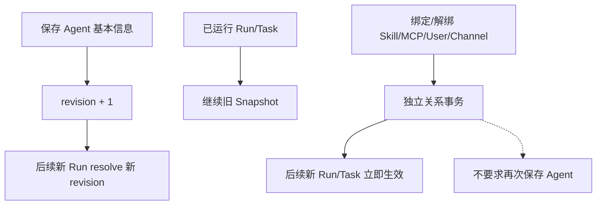
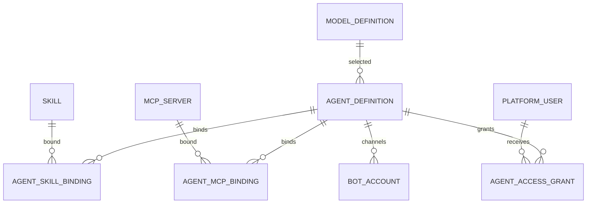

# Agent 定义、授权与通道配置 模块需求与设计一体化文档

> **文档编号**: MOD-AGENT-V1.0  
> **文档版本**: v1.0  
> **创建日期**: 2026-09-17  
> **文档状态**: 设计评审中  
> **模板**: design-full.md


## 1. 文档控制

| 项目 | 内容 |
|---|---|
| 模块 | Agent 定义、授权与通道配置 |
| Owner | muad-console-platform |
| 数据 Owner | control |
| 前置模块 | 02-user-identity, 03-model-management, 05-skill-management, 06-mcp-management |
| 建议代码位置 | apps/console-platform/backend/src/muad_console_platform/modules/agents/ |

## 2. 需求分析

### 2.1 需求概述

| 项目 | 内容 |
|---|---|
| 模块名称 | Agent 定义、授权与通道配置 |
| 模块 ID | MOD-AGENT |
| 需求类型 | 中大型功能开发 |
| 业务背景 | Agent 不能与 Pod 绑定；基本字段是版本化 Definition，关系操作是独立事务，不能用全局保存或全量 PUT。 |
| 核心目标 | 组合 Model、Skill、MCP、用户授权和 0..N IM 通道为逻辑 Agent，并用 revision + Snapshot 保证运行一致性。 |

### 2.2 痛点与价值

| 维度 | 内容 |
|---|---|
| 目标用户/调用方 | Builder / Admin / End User / 内部服务（按模块实际入口） |
| 当前问题 | Agent 不能与 Pod 绑定；基本字段是版本化 Definition，关系操作是独立事务，不能用全局保存或全量 PUT。 |
| 业务影响 | 模块边界或契约不固定会导致上层重复设计、接口漂移和跨模块返工。 |
| 预期价值 | 组合 Model、Skill、MCP、用户授权和 0..N IM 通道为逻辑 Agent，并用 revision + Snapshot 保证运行一致性。 |

### 2.3 功能方案

| 功能ID | 功能名称 | 功能描述 | 优先级 | 来源 |
|---|---|---|---|---|
| FEAT-01 | Agent Definition | name/key/model_id/instructions/runtime_config/enabled/revision。 | P0 | 需求描述 |
| FEAT-02 | 能力绑定 | AgentSkillBinding/AgentMcpBinding 单关系事务。 | P0 | 需求描述 |
| FEAT-03 | 用户授权 | AgentAccessGrant。 | P0 | 需求描述 |
| FEAT-04 | IM 通道 | 0..N BotAccount，bot_id 只指向一个 Agent。 | P0 | 需求描述 |

#### 2.3.2 字段约束

| 字段类别 | 约束 |
|---|---|
| ID | 业务实体统一 UUID；跨 Owner Schema 仅逻辑引用 UUID |
| 时间 | PostgreSQL 使用 `timestamptz`；Console 展示 `YYYY-MM-DD HH:mm:ss` |
| 删除 | 产品表统一 `is_deleted` 软删除；状态枚举不重复表达 DELETED |
| Secret | 只保存 SecretRef；Secret Value 不进入 DB / Snapshot / 日志 / LLM |
| 枚举 | API 与 DB 统一使用稳定英文枚举值，中文/英文只在 UI/i18n 层映射 |
| 错误 | 业务代码只抛稳定 `code`；`msg/http_status` 由公共配置映射 |

### 2.4 范围与边界

| 类别 | 内容 |
|---|---|
| In Scope | Agent CRUD/revision、Skill/MCP binding、AgentAccessGrant、BotAccount、通道关系。 |
| Out of Scope | 关系变更不进入 Agent revision；不绑定 Runtime Pod；/bind 不在本模块创建用户身份 |
| 技术债 | 无；不为未确认的未来能力增加兼容层 |

### 2.5 验收条件

#### 2.5.1 业务规则与约束

| ID | 类型 | 描述 | 验证场景 |
|---|---|---|---|
| RULE-01 | 系统约束 | JSON REST 统一 code/msg/data/trace_id/request_id/timestamp；业务只抛 code，msg/http_status 配置映射。 | S-01 / 对应 E- 场景 |
| RULE-02 | 系统约束 | 产品表统一 is_deleted/create_time/update_time；同 Owner Schema 物理 FK，跨 Owner Schema 逻辑 UUID。 | S-01 / 对应 E- 场景 |
| RULE-03 | 系统约束 | Secret Value 不进 DB/Snapshot/日志/LLM，只保存 SecretRef。 | S-01 / 对应 E- 场景 |
| RULE-04 | 系统约束 | 关系修改使用单关系 POST/DELETE 独立事务，不用全量 PUT。 | S-01 / 对应 E- 场景 |
| RULE-05 | 系统约束 | User→Agent；Agent→Skill/MCP；SELECTED 再叠加资源用户 Grant；不建三元授权。 | S-01 / 对应 E- 场景 |
| RULE-06 | 系统约束 | ModelDefinition 无 is_default；Agent 显式选择 enabled model_id。 | S-01 / 对应 E- 场景 |
| RULE-07 | 系统约束 | 新 Run/Task 冻结 Snapshot；配置/授权变更只影响后续新 Run/Task。 | S-01 / 对应 E- 场景 |
| RULE-08 | 系统约束 | Agent 0..N bot_id；bot_id 只指向一个 Agent；不绑定 Runtime Pod。 | S-01 / 对应 E- 场景 |

#### 2.5.2 功能验收场景

##### 正常场景

| 场景ID | 功能ID | 测试层级 | 关键真实边界 | 归属 | 操作/前置 | 预期结果 |
|---|---|---|---|---|---|---|
| S-01 | FEAT-01 | E2E | Browser→Agent API→DB→Runtime resolve | 本模块 | 修改模型/系统 Prompt 并保存 | revision+1；新 Run 新配置，旧 Run 不漂移 |
| S-02 | FEAT-02 | E2E | Browser→binding API→DB | 本模块 | 绑定 Skill | Binding 立即写入，后续新 Run 可见，无全局保存 |
| S-03 | FEAT-04 | E2E | Browser→Secret Provider→bot_account | 本模块 | 同 Agent 新增第二个 WeCom bot | 两个 bot 都指向同一 agent_id |

##### 异常场景

| 场景ID | 功能ID | 测试层级 | 关键真实边界 | 归属 | 触发条件 | 系统行为 |
|---|---|---|---|---|---|---|
| E-01 | FEAT-01 | integration | DB revision | 本模块 | 两个管理员并发编辑 | 旧 revision 返回 REVISION_CONFLICT |
| E-02 | FEAT-04 | integration | bot_id unique constraint | 本模块 | 把 Agent A 的 bot_id 配给 Agent B | BOT_ID_CONFLICT，不重绑 |

无可靠实测数据的性能阈值统一标记“待定”，不复制模板示例值。

## 3. 技术设计

### 3.1 技术选型与关键决策

| 决策 | 选择 | 放弃项 | 理由 |
|---|---|---|---|
| 基本字段 | revision 化 Definition | 每字段立即写 | Snapshot 可追溯 |
| 关系 | 独立 POST/DELETE | 全量 PUT 集合 | 避免 lost update |
| 运行映射 | 逻辑 Agent | Agent→Pod | 支持无状态横向扩容 |

基础栈：Python >=3.12、FastAPI >=0.115、SQLAlchemy 2.x、PostgreSQL；按需 Redis/NFS/Secret Provider；统一 `muad-api` 与 `muad-logging`。

### 3.2 架构与流程



### 3.3 数据设计

#### `control.agent_definition`

**表说明**

- **用途**：产品层逻辑 IM Agent；承载 Instructions、Model 与运行参数。它不是 Runtime Pod。
- **主要写入方**：Console。
- **主要读取方**：Console 列表/详情；Runtime Definition Resolve。
- **生命周期/边界**：配置修改 revision+1；Bot 只绑定 agent_id；运行实例不落表。

| 字段 | 类型 | 约束 | 说明 |
|---|---|---|---|
| `id` | uuid | PK | 主键 |
| `is_deleted` | boolean | NOT NULL DEFAULT false | 软删除 |
| `create_time` | timestamptz | NOT NULL DEFAULT now() | 创建时间 |
| `update_time` | timestamptz | NOT NULL DEFAULT now() | 更新时间 |
| `tenant_id` | varchar(64) | NOT NULL | 隔离键 |
| `key` | varchar(128) | NOT NULL | Agent key |
| `name` | varchar(128) | NOT NULL | 名称 |
| `description` | text |  | 描述 |
| `instructions` | text | NOT NULL | Agent Instructions |
| `model_id` | uuid | NOT NULL FK -> model_definition.id | 绑定模型 |
| `runtime_config_json` | jsonb | NOT NULL DEFAULT '{}' | token budget/deadline 等 |
| `revision` | bigint | NOT NULL DEFAULT 1 | 配置版本 |
| `enabled` | boolean | NOT NULL DEFAULT true | 是否启用 |

**索引/约束**：

- `UNIQUE (tenant_id, key) WHERE is_deleted=false`
- `INDEX (model_id, enabled)`

#### `control.agent_skill_binding`

**表说明**

- **用途**：声明某个逻辑 Agent 绑定并可加载哪些 Skill；最终是否对某用户有效还需结合 AgentAccessGrant 与 Skill.user_scope。
- **主要写入方**：Console Agent 配置。
- **主要读取方**：Runtime Definition Resolve。
- **生命周期/边界**：绑定变更只影响新 Run。

| 字段 | 类型 | 约束 | 说明 |
|---|---|---|---|
| `id` | uuid | PK | 主键 |
| `is_deleted` | boolean | NOT NULL DEFAULT false | 软删除 |
| `create_time` | timestamptz | NOT NULL DEFAULT now() | 创建时间 |
| `update_time` | timestamptz | NOT NULL DEFAULT now() | 更新时间 |
| `agent_id` | uuid | NOT NULL FK -> agent_definition.id | Agent |
| `skill_id` | uuid | NOT NULL FK -> skill.id | Skill |
| `enabled` | boolean | NOT NULL DEFAULT true | 是否启用 |
| `sort_order` | int | NOT NULL DEFAULT 0 | Catalog 排序 |

**索引/约束**：

- `UNIQUE (agent_id, skill_id) WHERE is_deleted=false`

#### `control.agent_mcp_binding`

**表说明**

- **用途**：逻辑 Agent 与 MCP Server 的绑定关系；最终是否对某用户有效还需结合 AgentAccessGrant 与 MCP.user_scope。
- **主要写入方**：Console。
- **主要读取方**：Runtime Resolve。
- **生命周期/边界**：配置关系；不对应 Runtime 连接实例。

| 字段 | 类型 | 约束 | 说明 |
|---|---|---|---|
| `id` | uuid | PK | 主键 |
| `is_deleted` | boolean | NOT NULL DEFAULT false | 软删除 |
| `create_time` | timestamptz | NOT NULL DEFAULT now() | 创建时间 |
| `update_time` | timestamptz | NOT NULL DEFAULT now() | 更新时间 |
| `agent_id` | uuid | NOT NULL FK -> agent_definition.id | Agent |
| `mcp_server_id` | uuid | NOT NULL FK -> mcp_server.id | MCP Server |
| `enabled` | boolean | NOT NULL DEFAULT true | 是否启用 |

**索引/约束**：

- `UNIQUE (agent_id, mcp_server_id) WHERE is_deleted=false`

#### `control.agent_access_grant`

**表说明**

- **用途**：平台用户使用某逻辑 Agent 的最小授权关系。
- **主要写入方**：Admin/Builder。
- **主要读取方**：Gateway resolve / Runtime resolve。
- **生命周期/边界**：撤销后新消息立即拒绝；历史运行保留。

| 字段 | 类型 | 约束 | 说明 |
|---|---|---|---|
| `id` | uuid | PK | 主键 |
| `is_deleted` | boolean | NOT NULL DEFAULT false | 软删除 |
| `create_time` | timestamptz | NOT NULL DEFAULT now() | 创建时间 |
| `update_time` | timestamptz | NOT NULL DEFAULT now() | 更新时间 |
| `user_id` | uuid | NOT NULL FK -> platform_user.id | 用户 |
| `agent_id` | uuid | NOT NULL FK -> agent_definition.id | Agent |
| `granted_by` | uuid | NOT NULL | 授权人 |
| `granted_at` | timestamptz | NOT NULL DEFAULT now() | 授权时间 |

**索引/约束**：

- `UNIQUE (user_id, agent_id) WHERE is_deleted=false`
- `INDEX (agent_id, user_id)`

#### `control.bot_account`

**表说明**

- **用途**：IM 通道账号配置；核心关系是 `bot_id/channel_account -> logical agent_id`。一个 Agent 可配置多条账号记录。
- **主要写入方**：Console Agent 的“IM 接入”页。
- **主要读取方**：IM Gateway 启动/刷新及消息路由。
- **生命周期/边界**：Bot 与 Runtime Pod 无任何绑定；Runtime 扩缩容无需更新本表。

| 字段 | 类型 | 约束 | 说明 |
|---|---|---|---|
| `id` | uuid | PK | 主键 |
| `is_deleted` | boolean | NOT NULL DEFAULT false | 软删除 |
| `create_time` | timestamptz | NOT NULL DEFAULT now() | 创建时间 |
| `update_time` | timestamptz | NOT NULL DEFAULT now() | 更新时间 |
| `tenant_id` | varchar(64) | NOT NULL | 隔离键 |
| `channel` | varchar(32) | NOT NULL DEFAULT 'WECOM' | 渠道类型 |
| `name` | varchar(128) | NOT NULL | 通道账号显示名称 |
| `bot_id` | varchar(256) | NOT NULL | 企业微信 bot_id |
| `secret_ref` | varchar(256) | NOT NULL | bot secret 引用 |
| `agent_id` | uuid | NOT NULL FK -> agent_definition.id | 绑定的逻辑 IM Agent；禁止存 Runtime Pod/实例 ID |
| `enabled` | boolean | NOT NULL DEFAULT true | 是否启用 |
| `config_json` | jsonb | NOT NULL DEFAULT '{}' | SDK 扩展配置 |
| `last_connected_at` | timestamptz |  | 最近成功连接时间 |

**索引/约束**：

- `UNIQUE (bot_id) WHERE is_deleted=false`
- `INDEX (agent_id, channel, enabled)`

**ER 图**



数据库规则：所有产品表统一 `id/is_deleted/create_time/update_time`；同 Owner Schema 物理 FK，跨 Owner Schema 逻辑 UUID；迁移使用 Alembic expand→deploy→contract。

### 3.4 接口设计

```json
{
  "code":"0",
  "msg":"成功",
  "data":{},
  "trace_id":"trace-id",
  "request_id":"request-id",
  "timestamp":"2026-09-17T17:00:00+08:00"
}
```

业务异常只允许 `raise AppError("CODE")`；msg 与 HTTP Status 统一由 `config/api-messages.yaml` 映射。

| 接口ID | 名称 | 方法 | 路径 | FEAT |
|---|---|---|---|---|
| API-01 | Agent 列表 | GET | `/api/v1/agents` | FEAT-01 |
| API-02 | 新增 Agent | POST | `/api/v1/agents` | FEAT-01 |
| API-03 | Agent 详情 | GET | `/api/v1/agents/{agent_id}` | FEAT-01 |
| API-04 | 编辑基本信息 | PUT | `/api/v1/agents/{agent_id}` | FEAT-01 |
| API-05 | Skill 列表 | GET | `/api/v1/agents/{agent_id}/skills` | FEAT-02 |
| API-06 | 绑定 Skill | POST | `/api/v1/agents/{agent_id}/skills/{skill_id}` | FEAT-02 |
| API-07 | 解除 Skill | DELETE | `/api/v1/agents/{agent_id}/skills/{skill_id}` | FEAT-02 |
| API-08 | MCP 列表 | GET | `/api/v1/agents/{agent_id}/mcp-servers` | FEAT-02 |
| API-09 | 绑定 MCP | POST | `/api/v1/agents/{agent_id}/mcp-servers/{mcp_id}` | FEAT-02 |
| API-10 | 解除 MCP | DELETE | `/api/v1/agents/{agent_id}/mcp-servers/{mcp_id}` | FEAT-02 |
| API-11 | 用户授权列表 | GET | `/api/v1/agents/{agent_id}/users` | FEAT-03 |
| API-12 | 授权用户 | POST | `/api/v1/agents/{agent_id}/users/{user_id}` | FEAT-03 |
| API-13 | 取消授权 | DELETE | `/api/v1/agents/{agent_id}/users/{user_id}` | FEAT-03 |
| API-14 | 通道列表 | GET | `/api/v1/agents/{agent_id}/channels` | FEAT-04 |
| API-15 | 新增通道 | POST | `/api/v1/agents/{agent_id}/channels` | FEAT-04 |
| API-16 | 编辑通道 | PUT | `/api/v1/agents/{agent_id}/channels/{channel_account_id}` | FEAT-04 |
| API-17 | 移除通道 | DELETE | `/api/v1/agents/{agent_id}/channels/{channel_account_id}` | FEAT-04 |


#### API-01 Agent 列表

```text
GET /api/v1/agents
```

- 请求：
- `data`：分页 Agent + skill_count/mcp_count/channel_count/user_count。
- 错误码：`COMMON_VALIDATION_ERROR / COMMON_INTERNAL_ERROR`
- 处理：

#### API-02 新增 Agent

```text
POST /api/v1/agents
```

- 请求：name/key/model_id/instructions/runtime_config/enabled；model_id 必填。
- `data`：
- 错误码：`COMMON_VALIDATION_ERROR / COMMON_INTERNAL_ERROR`
- 处理：

#### API-03 Agent 详情

```text
GET /api/v1/agents/{agent_id}
```

- 请求：
- `data`：
- 错误码：`COMMON_VALIDATION_ERROR / COMMON_INTERNAL_ERROR`
- 处理：

#### API-04 编辑基本信息

```text
PUT /api/v1/agents/{agent_id}
```

- 请求：expected_revision + fields。
- `data`：
- 错误码：`REVISION_CONFLICT`
- 处理：

#### API-05 Skill 列表

```text
GET /api/v1/agents/{agent_id}/skills
```

- 请求：
- `data`：
- 错误码：`COMMON_VALIDATION_ERROR / COMMON_INTERNAL_ERROR`
- 处理：

#### API-06 绑定 Skill

```text
POST /api/v1/agents/{agent_id}/skills/{skill_id}
```

- 请求：
- `data`：
- 错误码：`COMMON_VALIDATION_ERROR / COMMON_INTERNAL_ERROR`
- 处理：

#### API-07 解除 Skill

```text
DELETE /api/v1/agents/{agent_id}/skills/{skill_id}
```

- 请求：
- `data`：
- 错误码：`COMMON_VALIDATION_ERROR / COMMON_INTERNAL_ERROR`
- 处理：

#### API-08 MCP 列表

```text
GET /api/v1/agents/{agent_id}/mcp-servers
```

- 请求：
- `data`：
- 错误码：`COMMON_VALIDATION_ERROR / COMMON_INTERNAL_ERROR`
- 处理：

#### API-09 绑定 MCP

```text
POST /api/v1/agents/{agent_id}/mcp-servers/{mcp_id}
```

- 请求：
- `data`：
- 错误码：`COMMON_VALIDATION_ERROR / COMMON_INTERNAL_ERROR`
- 处理：

#### API-10 解除 MCP

```text
DELETE /api/v1/agents/{agent_id}/mcp-servers/{mcp_id}
```

- 请求：
- `data`：
- 错误码：`COMMON_VALIDATION_ERROR / COMMON_INTERNAL_ERROR`
- 处理：

#### API-11 用户授权列表

```text
GET /api/v1/agents/{agent_id}/users
```

- 请求：
- `data`：
- 错误码：`COMMON_VALIDATION_ERROR / COMMON_INTERNAL_ERROR`
- 处理：

#### API-12 授权用户

```text
POST /api/v1/agents/{agent_id}/users/{user_id}
```

- 请求：
- `data`：
- 错误码：`COMMON_VALIDATION_ERROR / COMMON_INTERNAL_ERROR`
- 处理：

#### API-13 取消授权

```text
DELETE /api/v1/agents/{agent_id}/users/{user_id}
```

- 请求：
- `data`：
- 错误码：`COMMON_VALIDATION_ERROR / COMMON_INTERNAL_ERROR`
- 处理：

#### API-14 通道列表

```text
GET /api/v1/agents/{agent_id}/channels
```

- 请求：
- `data`：
- 错误码：`COMMON_VALIDATION_ERROR / COMMON_INTERNAL_ERROR`
- 处理：

#### API-15 新增通道

```text
POST /api/v1/agents/{agent_id}/channels
```

- 请求：channel/name/bot_id/secret/enabled/config；Secret 写 Secret Provider。
- `data`：
- 错误码：`COMMON_VALIDATION_ERROR / COMMON_INTERNAL_ERROR`
- 处理：

#### API-16 编辑通道

```text
PUT /api/v1/agents/{agent_id}/channels/{channel_account_id}
```

- 请求：
- `data`：
- 错误码：`COMMON_VALIDATION_ERROR / COMMON_INTERNAL_ERROR`
- 处理：

#### API-17 移除通道

```text
DELETE /api/v1/agents/{agent_id}/channels/{channel_account_id}
```

- 请求：
- `data`：
- 错误码：`COMMON_VALIDATION_ERROR / COMMON_INTERNAL_ERROR`
- 处理：


### 3.5 质量实现方案

- 性能：批量/聚合优先，列表禁止 N+1，真实目标待基线压测后确定。
- 可靠性：事务只覆盖原子 DB 操作；外部 IO 不包长事务；高影响错误必须有 E-/B- 验收。
- 安全：Secret/Token/Cookie 不进业务 DB、日志、Snapshot、LLM。
- 可观测：统一 JSON 日志，自动带 service/trace_id/request_id；状态变化可关联 trace_id。


## 4. 部署与运维

本模块随 `muad-console-platform` 对应镜像/共享 package 发布；PostgreSQL、Redis、NFS、Secret Provider 外置。监控阈值待真实基线确定。

## 5. 风险与依赖

- 前置：02-user-identity, 03-model-management, 05-skill-management, 06-mcp-management。
- 主要风险：关系接口误用全量 PUT 导致并发 lost update。。
- 应对：Contract Test + S/E/B 验收 + Spec Matrix。

## 6. 需求追溯矩阵

| 用户故事 | 功能ID | 接口ID | 测试用例ID | 测试层级 | 状态 |
|---|---|---|---|---|---|
| 需求描述 | FEAT-01 | API-01, API-02, API-03, API-04 | S-01, E-01 | E2E | 待实现 |
| 需求描述 | FEAT-02 | API-05, API-06, API-07, API-08, API-09, API-10 | S-02 | E2E | 待实现 |
| 需求描述 | FEAT-03 | API-11, API-12, API-13 |  | integration | 待实现 |
| 需求描述 | FEAT-04 | API-14, API-15, API-16, API-17 | S-03, E-02 | E2E | 待实现 |

## Spec Compliance Matrix

| Spec/Rule | enforcement | 设计影响 | 设计落点 | 验证场景 | 状态/N/A 理由 |
|---|---|---|---|---|---|
| `mss-platform#RULE-API-001` | required | JSON REST 统一 code/msg/data/trace_id/request_id/timestamp；业务只抛 code，msg/http_status 配置映射。 | §3.2/§3.3/§3.4 | S-01 + verifier | applied |
| `mss-platform#RULE-DATA-001` | required | 产品表统一 is_deleted/create_time/update_time；同 Owner Schema 物理 FK，跨 Owner Schema 逻辑 UUID。 | §3.2/§3.3/§3.4 | S-01 + verifier | applied |
| `mss-platform#RULE-SECRET-001` | required | Secret Value 不进 DB/Snapshot/日志/LLM，只保存 SecretRef。 | §3.2/§3.3/§3.4 | S-01 + verifier | applied |
| `mss-platform#RULE-REL-001` | required | 关系修改使用单关系 POST/DELETE 独立事务，不用全量 PUT。 | §3.2/§3.3/§3.4 | S-01 + verifier | applied |
| `mss-platform#RULE-AUTH-001` | required | User→Agent；Agent→Skill/MCP；SELECTED 再叠加资源用户 Grant；不建三元授权。 | §3.2/§3.3/§3.4 | S-01 + verifier | applied |
| `mss-platform#RULE-MODEL-001` | required | ModelDefinition 无 is_default；Agent 显式选择 enabled model_id。 | §3.2/§3.3/§3.4 | S-01 + verifier | applied |
| `mss-platform#RULE-SNAPSHOT-001` | required | 新 Run/Task 冻结 Snapshot；配置/授权变更只影响后续新 Run/Task。 | §3.2/§3.3/§3.4 | S-01 + verifier | applied |
| `mss-platform#RULE-IM-001` | required | Agent 0..N bot_id；bot_id 只指向一个 Agent；不绑定 Runtime Pod。 | §3.2/§3.3/§3.4 | S-01 + verifier | applied |
| `mss-platform#RULE-TEST-001` | required | 跨 API/DB/Runtime/Browser 的关键流程必须 E2E，列出不得 mock 的真实边界。 | §3.2/§3.3/§3.4 | S-01 + verifier | applied |
