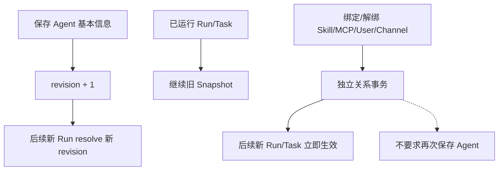
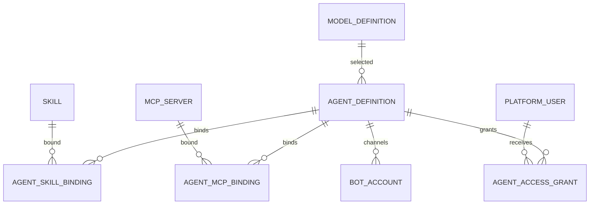

# Agent 定义、授权与通道配置 模块需求与设计一体化文档

> **文档编号**: MOD-AGENT-V1.0  
> **文档版本**: v1.1  
> **创建日期**: 2026-09-17  
> **文档状态**: 设计评审中  
> **模板**: design-full.md


## 1. 文档控制

| 项目 | 内容 |
|---|---|
| 模块 | Agent 定义、授权与通道配置 |
| Owner | muad-console-platform |
| 数据 Owner | control |
| 前置模块 | 02-user-identity, 03-model-management, 05-skill-management, 06-mcp-management |
| 建议代码位置 | apps/console-platform/backend/src/muad_console_platform/modules/agents/ |

### 1.1 责任人

| 角色 | 姓名 | 职责范围 |
|---|---|---|
| 产品经理 | 待指定 | 需求定义、业务验收 |
| 开发负责人 | muad-console-platform | 技术方案、代码实现 |
| 测试负责人 | 待指定 | 测试策略、质量保证 |
| 架构师 | 待指定 | 架构审核、技术决策 |

### 1.2 修订历史

| 版本 | 日期 | 作者 | 变更描述 |
|---|---|---|---|
| v1.0 | 2026-09-17 | muad-console-platform | 初始设计（对齐历史版本基线） |
| v1.1 | 2026-09-18 | muad-console-platform | 对齐 V1.4 决策（docs/17）：删除 `agent_skill_binding.enabled` / `agent_mcp_binding.enabled`；补 Effective Capability 公式；新增 `DELETE /api/v1/agents/{agent_id}`（软删除）；错误码收敛为已登记码；补全 API 契约、场景与 Spec Matrix。 |

## 2. 需求分析

### 2.1 需求概述

| 项目 | 内容 |
|---|---|
| 模块名称 | Agent 定义、授权与通道配置 |
| 模块 ID | MOD-AGENT |
| 需求类型 | 中大型功能开发 |
| 业务背景 | Agent 不能与 Pod 绑定；基本字段是版本化 Definition，关系操作是独立事务，不能用全局保存或全量 PUT。 |
| 核心目标 | 组合 Model、Skill、MCP、用户授权和 0..N IM 通道为逻辑 Agent，并用 revision + Snapshot 保证运行一致性。 |

### 2.2 痛点与价值

| 维度 | 内容 |
|---|---|
| 目标用户/调用方 | Builder / Admin / End User / 内部服务（按模块实际入口） |
| 当前问题 | Agent 不能与 Pod 绑定；基本字段是版本化 Definition，关系操作是独立事务，不能用全局保存或全量 PUT。 |
| 业务影响 | 模块边界或契约不固定会导致上层重复设计、接口漂移和跨模块返工。 |
| 预期价值 | 组合 Model、Skill、MCP、用户授权和 0..N IM 通道为逻辑 Agent，并用 revision + Snapshot 保证运行一致性。 |

### 2.3 功能方案

#### 2.3.1 功能清单

| 功能ID | 功能名称 | 功能描述 | 优先级 | 来源 |
|---|---|---|---|---|
| FEAT-01 | Agent Definition | name/key/model_id/instructions/runtime_config/enabled/revision；支持软删除。 | P0 | 需求描述 |
| FEAT-02 | 能力绑定 | AgentSkillBinding/AgentMcpBinding 单关系事务；绑定即生效，解除=软删除。 | P0 | 需求描述 |
| FEAT-03 | 用户授权 | AgentAccessGrant；撤销=软删除，无到期时间。 | P0 | 需求描述 |
| FEAT-04 | IM 通道 | 0..N BotAccount，bot_id 只指向一个 Agent。 | P0 | 需求描述 |

#### 2.3.2 字段约束

| 字段类别 | 约束 |
|---|---|
| ID | 业务实体统一 UUID；跨 Owner Schema 仅逻辑引用 UUID |
| 时间 | PostgreSQL 使用 `timestamptz`；Console 展示 `YYYY-MM-DD HH:mm:ss` |
| 删除 | 产品表统一 `is_deleted` 软删除；状态枚举不重复表达 DELETED |
| Secret | 只保存 SecretRef；Secret Value 不进入 DB / Snapshot / 日志 / LLM |
| 枚举 | API 与 DB 统一使用稳定英文枚举值，中文/英文只在 UI/i18n 层映射 |
| 错误 | 业务代码只抛稳定 `code`；`msg/http_status` 由公共配置映射 |

### 2.4 范围与边界

| 类别 | 内容 |
|---|---|
| In Scope | Agent CRUD/软删除/revision、Skill/MCP binding、AgentAccessGrant、BotAccount、通道关系。 |
| Out of Scope | 关系变更不进入 Agent revision；不做绑定级启停开关（绑定即生效，解除=软删除）；不做用户授权到期时间；不绑定 Runtime Pod；/bind 不在本模块创建用户身份 |
| 技术债 | 无；不为未确认的未来能力增加兼容层 |

### 2.5 验收条件

#### 2.5.1 业务规则与约束

| ID | 类型 | 描述 | 验证场景 |
|---|---|---|---|
| RULE-01 | 系统约束 | JSON REST 统一 code/msg/data/trace_id/request_id/timestamp；业务只抛 code，msg/http_status 配置映射。 | S-01, E-01 |
| RULE-02 | 系统约束 | 产品表统一 is_deleted/create_time/update_time；同 Owner Schema 物理 FK，跨 Owner Schema 逻辑 UUID。 | S-05, E-04 |
| RULE-03 | 系统约束 | Secret Value 不进 DB/Snapshot/日志/LLM，只保存 SecretRef。 | S-03 |
| RULE-04 | 系统约束 | 关系修改使用单关系 POST/DELETE 独立事务，不用全量 PUT。 | S-02, S-06, E-04 |
| RULE-05 | 系统约束 | User→Agent；Agent→Skill/MCP；SELECTED 再叠加资源用户 Grant；不建三元授权；绑定无启停开关。 | S-04, E-03, E-05 |
| RULE-06 | 系统约束 | ModelDefinition 无 is_default；Agent 显式选择 enabled model_id。 | S-01 |
| RULE-07 | 系统约束 | 新 Run/Task 冻结 Snapshot；配置/授权变更只影响后续新 Run/Task。 | S-01, S-04, S-05 |
| RULE-08 | 系统约束 | Agent 0..N bot_id；bot_id 只指向一个 Agent；不绑定 Runtime Pod。 | S-03, E-02 |

#### 2.5.2 功能验收场景

##### 正常场景

| 场景ID | 功能ID | 测试层级 | 关键真实边界 | 归属 | 操作/前置 | 预期结果 |
|---|---|---|---|---|---|---|
| S-01 | FEAT-01 | E2E | Browser→Agent API→DB→Runtime resolve | 本模块 | 修改模型/系统 Prompt 并保存 | revision+1；新 Run 新配置，旧 Run 不漂移 |
| S-02 | FEAT-02 | E2E | Browser→binding API→DB | 本模块 | 绑定 Skill | Binding 立即写入，后续新 Run 可见，无全局保存 |
| S-03 | FEAT-04 | E2E | Browser→API→bot_account | 本模块 | 同 Agent 新增第二个 WeCom bot | 两个 bot 都指向同一 agent_id；secret 明文落 DB 且不回显 |
| S-04 | FEAT-03 | E2E | Browser→grant API→DB→Runtime resolve | 本模块 | 给用户授权 Agent 后再撤销 | 授权后后续新 Run 可用；撤销=软删除，后续新 Run 拒绝，历史 Snapshot 不漂移 |
| S-05 | FEAT-01 | E2E | Browser→DELETE Agent API→DB→Runtime resolve | 本模块 | 软删除 Agent | 列表/详情不可见；后续 resolve 返回 AGENT_NOT_FOUND；历史运行记录保留 |
| S-06 | FEAT-02 | E2E | Browser→unbind API→DB→Runtime resolve | 本模块 | 解除 MCP 绑定后再次绑定 | 解除=软删除，后续新 Run 立即不可见；再次绑定恢复同一逻辑关系 |

##### 异常场景

| 场景ID | 功能ID | 测试层级 | 关键真实边界 | 归属 | 触发条件 | 系统行为 |
|---|---|---|---|---|---|---|
| E-01 | FEAT-01 | integration | DB revision | 本模块 | 两个管理员并发编辑 | 旧 revision 返回 REVISION_CONFLICT |
| E-02 | FEAT-04 | integration | bot_account unique constraint | 本模块 | 新增/编辑的 bot_id 已被其他 Agent 占用 | COMMON_CONFLICT（message_args 带 bot_id），不重绑 |
| E-03 | FEAT-02 | integration | Skill 状态与软删除 | 本模块 | 绑定不存在/已软删除的 Skill；绑定已禁用 Skill | 不存在 → COMMON_NOT_FOUND；禁用 → 绑定行可写入但 Effective Capability 过滤，不进入新 Run 的 Prompt/Catalog |
| E-04 | FEAT-03 | integration | grant partial unique + 软删除 | 本模块 | 重复授权已存在关系的用户 | 幂等返回既有 Grant；历史软删除行恢复，不产生重复有效行 |
| E-05 | FEAT-01 | integration | Agent.enabled | 本模块 | Agent 禁用后新消息/Run | Runtime resolve 返回 AGENT_DISABLED；绑定与授权不生效 |
| E-06 | FEAT-04 | integration | bot_account 查询 | 本模块 | 编辑/移除不存在的 channel_account_id | BOT_NOT_FOUND，不修改数据 |

无可靠实测数据的性能阈值统一标记“待定”，不复制模板示例值。

## 3. 技术设计

### 3.1 技术选型与关键决策

| 决策 | 选择 | 放弃项 | 理由 |
|---|---|---|---|
| 基本字段 | revision 化 Definition | 每字段立即写 | Snapshot 可追溯 |
| 关系 | 独立 POST/DELETE | 全量 PUT 集合 | 避免 lost update |
| 关系启停 | 绑定即生效，解除=软删除 | 绑定级 `enabled` 开关 | 与 V1.4 授权公式一致，取消中间态 |
| 运行映射 | 逻辑 Agent | Agent→Pod | 支持无状态横向扩容 |

基础栈：Python >=3.12、FastAPI >=0.115、SQLAlchemy 2.x、PostgreSQL；按需 Redis/NFS；统一 `muad-api` 与 `muad-logging`。

### 3.2 架构与流程



### 3.3 数据设计

#### 3.3.1 Effective Capability 判定

运行时能力判定唯一公式，与 `harness-platform` Spec、docs/00 §0.9、docs/02 §5.10、docs/03 §6.2-6.3、docs/07 §4.1 完全一致：

```text
EffectiveSkill(user, agent, skill) =
    AgentAccessGrant(user, agent).is_deleted = false
AND Agent.enabled = true
AND AgentSkillBinding(agent, skill).is_deleted = false
AND Skill.enabled = true
AND Skill.is_deleted = false
AND (
    Skill.user_scope = ALL
    OR SkillUserGrant(skill, user).is_deleted = false
)

EffectiveMcp(user, agent, mcp) =
    AgentAccessGrant(user, agent).is_deleted = false
AND Agent.enabled = true
AND AgentMcpBinding(agent, mcp).is_deleted = false
AND MCP.enabled = true
AND MCP.is_deleted = false
AND (
    MCP.user_scope = ALL
    OR McpUserGrant(mcp, user).is_deleted = false
)
```

约束：

- `agent_skill_binding` / `agent_mcp_binding` 没有 `enabled` 列：绑定即生效，解除绑定=软删除（`is_deleted=true`）；
- `agent_access_grant` / `skill_user_grant` / `mcp_user_grant` 没有 `expires_at`：撤销=软删除；
- 用户授权是资源级（Skill/MCP × User），不是 `(user, agent, skill/mcp)` 三元授权；
- Agent 软删除后按 `AGENT_NOT_FOUND` 处理，不再进入公式判定；
- Runtime 必须在构建 Prompt/Skill Catalog/ToolRegistry 之前完成过滤，未授权资源不出现在模型上下文中；
- 变更只影响后续新 Run/Task，已冻结的 RuntimeSnapshot 不漂移。

#### `control.agent_definition`

**表说明**

- **用途**：产品层逻辑 IM Agent；承载 Instructions、Model 与运行参数。它不是 Runtime Pod。
- **主要写入方**：Console。
- **主要读取方**：Console 列表/详情；Runtime Definition Resolve。
- **生命周期/边界**：配置修改 revision+1；Bot 只绑定 agent_id；运行实例不落表。

| 字段 | 类型 | 约束 | 说明 |
|---|---|---|---|
| `id` | uuid | PK | 主键 |
| `is_deleted` | boolean | NOT NULL DEFAULT false | 软删除 |
| `create_time` | timestamptz | NOT NULL DEFAULT now() | 创建时间 |
| `update_time` | timestamptz | NOT NULL DEFAULT now() | 更新时间 |
| `tenant_id` | varchar(64) | NOT NULL | 隔离键 |
| `key` | varchar(128) | NOT NULL | Agent key |
| `name` | varchar(128) | NOT NULL | 名称 |
| `description` | text |  | 描述 |
| `instructions` | text | NOT NULL | Agent Instructions |
| `model_id` | uuid | NOT NULL FK -> model_definition.id | 绑定模型 |
| `runtime_config_json` | jsonb | NOT NULL DEFAULT '{}' | token budget/deadline 等 |
| `revision` | bigint | NOT NULL DEFAULT 1 | 配置版本 |
| `enabled` | boolean | NOT NULL DEFAULT true | 是否启用 |

**索引/约束**：

- `UNIQUE (tenant_id, key) WHERE is_deleted=false`
- `INDEX (model_id, enabled)`

#### `control.agent_skill_binding`

**表说明**

- **用途**：声明某个逻辑 Agent 绑定并可加载哪些 Skill；最终是否对某用户有效还需结合 AgentAccessGrant 与 Skill.user_scope。
- **主要写入方**：Console Agent 配置。
- **主要读取方**：Runtime Definition Resolve。
- **生命周期/边界**：绑定变更只影响新 Run；绑定即生效，解除绑定用软删除，无绑定级启停开关。

| 字段 | 类型 | 约束 | 说明 |
|---|---|---|---|
| `id` | uuid | PK | 主键 |
| `is_deleted` | boolean | NOT NULL DEFAULT false | 软删除 |
| `create_time` | timestamptz | NOT NULL DEFAULT now() | 创建时间 |
| `update_time` | timestamptz | NOT NULL DEFAULT now() | 更新时间 |
| `agent_id` | uuid | NOT NULL FK -> agent_definition.id | Agent |
| `skill_id` | uuid | NOT NULL FK -> skill.id | Skill |
| `sort_order` | int | NOT NULL DEFAULT 0 | Catalog 排序 |

**索引/约束**：

- `UNIQUE (agent_id, skill_id) WHERE is_deleted=false`

#### `control.agent_mcp_binding`

**表说明**

- **用途**：逻辑 Agent 与 MCP Server 的绑定关系；最终是否对某用户有效还需结合 AgentAccessGrant 与 MCP.user_scope。
- **主要写入方**：Console。
- **主要读取方**：Runtime Resolve。
- **生命周期/边界**：配置关系；不对应 Runtime 连接实例；绑定即生效，解除绑定用软删除，无绑定级启停开关。

| 字段 | 类型 | 约束 | 说明 |
|---|---|---|---|
| `id` | uuid | PK | 主键 |
| `is_deleted` | boolean | NOT NULL DEFAULT false | 软删除 |
| `create_time` | timestamptz | NOT NULL DEFAULT now() | 创建时间 |
| `update_time` | timestamptz | NOT NULL DEFAULT now() | 更新时间 |
| `agent_id` | uuid | NOT NULL FK -> agent_definition.id | Agent |
| `mcp_server_id` | uuid | NOT NULL FK -> mcp_server.id | MCP Server |

**索引/约束**：

- `UNIQUE (agent_id, mcp_server_id) WHERE is_deleted=false`

#### `control.agent_access_grant`

**表说明**

- **用途**：平台用户使用某逻辑 Agent 的最小授权关系。
- **主要写入方**：Admin/Builder。
- **主要读取方**：Gateway resolve / Runtime resolve。
- **生命周期/边界**：撤销后新消息立即拒绝；历史运行保留。

| 字段 | 类型 | 约束 | 说明 |
|---|---|---|---|
| `id` | uuid | PK | 主键 |
| `is_deleted` | boolean | NOT NULL DEFAULT false | 软删除 |
| `create_time` | timestamptz | NOT NULL DEFAULT now() | 创建时间 |
| `update_time` | timestamptz | NOT NULL DEFAULT now() | 更新时间 |
| `user_id` | uuid | NOT NULL FK -> platform_user.id | 用户 |
| `agent_id` | uuid | NOT NULL FK -> agent_definition.id | Agent |
| `granted_by` | uuid | NOT NULL | 授权人 |
| `granted_at` | timestamptz | NOT NULL DEFAULT now() | 授权时间 |

**索引/约束**：

- `UNIQUE (user_id, agent_id) WHERE is_deleted=false`
- `INDEX (agent_id, user_id)`

#### `control.bot_account`

**表说明**

- **用途**：IM 通道账号配置；核心关系是 `bot_id/channel_account -> logical agent_id`。一个 Agent 可配置多条账号记录。
- **主要写入方**：Console Agent 的“IM 接入”页。
- **主要读取方**：IM Gateway 启动/刷新及消息路由。
- **生命周期/边界**：Bot 与 Runtime Pod 无任何绑定；Runtime 扩缩容无需更新本表。

| 字段 | 类型 | 约束 | 说明 |
|---|---|---|---|
| `id` | uuid | PK | 主键 |
| `is_deleted` | boolean | NOT NULL DEFAULT false | 软删除 |
| `create_time` | timestamptz | NOT NULL DEFAULT now() | 创建时间 |
| `update_time` | timestamptz | NOT NULL DEFAULT now() | 更新时间 |
| `tenant_id` | varchar(64) | NOT NULL | 隔离键 |
| `channel` | varchar(32) | NOT NULL DEFAULT 'WECOM' | 渠道类型 |
| `name` | varchar(128) | NOT NULL | 通道账号显示名称 |
| `bot_id` | varchar(256) | NOT NULL | 企业微信 bot_id |
| `secret` | text |  | Bot secret（明文，不回显） |
| `agent_id` | uuid | NOT NULL FK -> agent_definition.id | 绑定的逻辑 IM Agent；禁止存 Runtime Pod/实例 ID |
| `enabled` | boolean | NOT NULL DEFAULT true | 是否启用 |
| `config_json` | jsonb | NOT NULL DEFAULT '{}' | SDK 扩展配置 |
| `last_connected_at` | timestamptz |  | 最近成功连接时间 |

**索引/约束**：

- `UNIQUE (bot_id) WHERE is_deleted=false`
- `INDEX (agent_id, channel, enabled)`

**ER 图**



数据库规则：所有产品表统一 `id/is_deleted/create_time/update_time`；同 Owner Schema 物理 FK，跨 Owner Schema 逻辑 UUID；迁移使用 Alembic expand→deploy→contract。

### 3.4 接口设计

```json
{
  "code":"0",
  "msg":"成功",
  "data":{},
  "trace_id":"trace-id",
  "request_id":"request-id",
  "timestamp":"2026-09-17T17:00:00+08:00"
}
```

业务异常只允许 `raise AppError("CODE")`；msg 与 HTTP Status 统一由 `config/api-messages.yaml` 映射。列表统一 `{items,page,page_size,total}`，`page>=1`、`1<=page_size<=100`。错误码只使用已登记代码，新增错误码必须先登记配置再引用。

| 接口ID | 名称 | 方法 | 路径 | FEAT |
|---|---|---|---|---|
| API-01 | Agent 列表 | GET | `/api/v1/agents` | FEAT-01 |
| API-02 | 新增 Agent | POST | `/api/v1/agents` | FEAT-01 |
| API-03 | Agent 详情 | GET | `/api/v1/agents/{agent_id}` | FEAT-01 |
| API-04 | 编辑基本信息 | PUT | `/api/v1/agents/{agent_id}` | FEAT-01 |
| API-05 | 删除 Agent | DELETE | `/api/v1/agents/{agent_id}` | FEAT-01 |
| API-06 | Skill 列表 | GET | `/api/v1/agents/{agent_id}/skills` | FEAT-02 |
| API-07 | 绑定 Skill | POST | `/api/v1/agents/{agent_id}/skills/{skill_id}` | FEAT-02 |
| API-08 | 解除 Skill | DELETE | `/api/v1/agents/{agent_id}/skills/{skill_id}` | FEAT-02 |
| API-09 | MCP 列表 | GET | `/api/v1/agents/{agent_id}/mcp-servers` | FEAT-02 |
| API-10 | 绑定 MCP | POST | `/api/v1/agents/{agent_id}/mcp-servers/{mcp_id}` | FEAT-02 |
| API-11 | 解除 MCP | DELETE | `/api/v1/agents/{agent_id}/mcp-servers/{mcp_id}` | FEAT-02 |
| API-12 | 用户授权列表 | GET | `/api/v1/agents/{agent_id}/users` | FEAT-03 |
| API-13 | 授权用户 | POST | `/api/v1/agents/{agent_id}/users/{user_id}` | FEAT-03 |
| API-14 | 取消授权 | DELETE | `/api/v1/agents/{agent_id}/users/{user_id}` | FEAT-03 |
| API-15 | 通道列表 | GET | `/api/v1/agents/{agent_id}/channels` | FEAT-04 |
| API-16 | 新增通道 | POST | `/api/v1/agents/{agent_id}/channels` | FEAT-04 |
| API-17 | 编辑通道 | PUT | `/api/v1/agents/{agent_id}/channels/{channel_account_id}` | FEAT-04 |
| API-18 | 移除通道 | DELETE | `/api/v1/agents/{agent_id}/channels/{channel_account_id}` | FEAT-04 |

#### API-01 Agent 列表

```text
GET /api/v1/agents
```

- 调用方：Console 浏览器（`AgentPage`）。
- 请求（Query）：

| 字段 | 类型 | 必填 | 说明 |
|---|---|---|---|
| `keyword` | string | 否 | 名称/标识/模型/bot_id 模糊搜索 |
| `enabled` | boolean | 否 | 启用状态筛选 |
| `page` | int | 否 | 页码，默认 1，最小 1 |
| `page_size` | int | 否 | 每页条数，默认 20，最大 100 |

- `data`：分页对象 `{items,page,page_size,total}`；`items[]`：`id/key/name/model_id/model_name/enabled/revision/skill_count/mcp_count/channel_count/user_count/update_time`。
- 错误码：`COMMON_VALIDATION_ERROR`（分页参数越界/类型错误）。
- 处理：只查 `is_deleted=false`；各关系数量用聚合 COUNT（禁止 N+1），计数只统计 `is_deleted=false` 的有效关系；默认按 `update_time DESC`；不返回 Secret 与 Snapshot。
- 对应：docs/07 §10.1；docs/03 §4.1。

#### API-02 新增 Agent

```text
POST /api/v1/agents
```

- 调用方：Console 浏览器（新增 Agent Modal）。
- 请求（Body）：

| 字段 | 类型 | 必填 | 说明 |
|---|---|---|---|
| `name` | string | 是 | 名称，<=128 |
| `key` | string | 是 | 标识，<=128，租户内唯一 |
| `description` | string | 否 | 描述 |
| `instructions` | string | 是 | 系统 Prompt |
| `model_id` | uuid | 是 | 必须指向未软删除且 `enabled=true` 的 ModelDefinition |
| `runtime_config` | object | 否 | 运行参数，默认 `{}` |
| `enabled` | boolean | 否 | 启用状态，默认 true |

- `data`：`{id,key,name,model_id,revision,enabled,create_time}`。
- 错误码：`COMMON_VALIDATION_ERROR / COMMON_NOT_FOUND`（模型不存在）/ `MODEL_DISABLED`（模型已禁用）/ `COMMON_CONFLICT`（key 已存在）。
- 处理：单事务插入 `agent_definition`（`revision=1`）+ `config_audit_log(action=CREATE, resource_type=AGENT, resource_id=新 id)`；`UNIQUE (tenant_id,key) WHERE is_deleted=false` 冲突映射 `COMMON_CONFLICT`；不引入平台默认模型。
- 对应：docs/07 §10.1；docs/03 §4.3、§11.1；RULE-model-001。

#### API-03 Agent 详情

```text
GET /api/v1/agents/{agent_id}
```

- 调用方：Console 浏览器（详情 SideSheet / 基本信息 Tab）。
- 请求（Path）：`agent_id`（uuid，必填）。
- `data`：`id/tenant_id/key/name/description/instructions/model_id/model_name/runtime_config/revision/enabled/create_time/update_time/skill_count/mcp_count/channel_count/user_count`。
- 错误码：`AGENT_NOT_FOUND`。
- 处理：只读；`is_deleted=false` 且 id 命中，否则 `AGENT_NOT_FOUND`；计数只统计有效关系；最近运行由前端另行调用运行审计接口，不在详情接口内聚合。
- 对应：docs/07 §10.1；docs/03 §4.2。

#### API-04 编辑基本信息

```text
PUT /api/v1/agents/{agent_id}
```

- 调用方：Console 浏览器（编辑基本信息 Modal）。
- 请求（Body）：

| 字段 | 类型 | 必填 | 说明 |
|---|---|---|---|
| `expected_revision` | bigint | 是 | 乐观锁，必须等于当前 revision |
| `name` | string | 否 | 名称 |
| `description` | string | 否 | 描述 |
| `instructions` | string | 否 | 系统 Prompt |
| `model_id` | uuid | 否 | 未软删除且 enabled 的模型 |
| `runtime_config` | object | 否 | 运行参数 |
| `enabled` | boolean | 否 | 启用状态 |

- `data`：`{id,revision,update_time}`。
- 错误码：`AGENT_NOT_FOUND / COMMON_VALIDATION_ERROR / COMMON_NOT_FOUND`（模型不存在）/ `MODEL_DISABLED` / `REVISION_CONFLICT`。
- 处理：单事务 CAS `UPDATE ... WHERE id=? AND revision=expected_revision AND is_deleted=false`；命中则 `revision=revision+1`、写 `config_audit_log(action=UPDATE)`；未命中或 Agent 不存在分别返回 `REVISION_CONFLICT` / `AGENT_NOT_FOUND`；只影响后续新 Run/Task，已有 Snapshot 不更新。
- 对应：docs/07 §10.1；docs/03 §4.3。

#### API-05 删除 Agent

```text
DELETE /api/v1/agents/{agent_id}
```

- 调用方：Console 浏览器（列表操作列删除，Popconfirm 确认）。
- 请求（Path）：`agent_id`（uuid，必填）。
- `data`：`{id,is_deleted:true}`。
- 错误码：`AGENT_NOT_FOUND`。
- 处理：单事务软删除 `UPDATE ... SET is_deleted=true, update_time=now() WHERE id=? AND is_deleted=false` + `config_audit_log(action=DELETE, before_json)`；已删除再删返回 `AGENT_NOT_FOUND`；不级联物理删除绑定/授权/通道，历史运行与 Snapshot 保留；软删除后 key 可重新创建（partial unique）；后续 Runtime resolve 返回 `AGENT_NOT_FOUND`。
- 对应：docs/07 §10.1；docs/03 §4.1；S-05。

#### API-06 Skill 列表

```text
GET /api/v1/agents/{agent_id}/skills
```

- 调用方：Console 浏览器（详情 Skill Tab）。
- 请求（Path + Query）：

| 字段 | 类型 | 必填 | 说明 |
|---|---|---|---|
| `agent_id` | uuid | 是 | 路径参数 |
| `page` | int | 否 | 默认 1 |
| `page_size` | int | 否 | 默认 20，最大 100 |

- `data`：分页对象 `{items,page,page_size,total}`；`items[]`：`skill_id/key/name/description/user_scope/enabled/current_artifact_version/sort_order/create_time`。
- 错误码：`AGENT_NOT_FOUND / COMMON_VALIDATION_ERROR`。
- 处理：Agent 必须存在且未软删除；只查 `agent_skill_binding.is_deleted=false` 并 JOIN `skill`；保留已禁用 Skill 行（带 `enabled=false`，供管理侧解绑），不返回已软删除绑定；按 `sort_order ASC, create_time ASC`。
- 对应：docs/07 §10.1；docs/03 §4.2、§6.5。

#### API-07 绑定 Skill

```text
POST /api/v1/agents/{agent_id}/skills/{skill_id}
```

- 调用方：Console 浏览器（Skill Tab 绑定选择器）。
- 请求（Path + Body）：

| 字段 | 类型 | 必填 | 说明 |
|---|---|---|---|
| `agent_id` | uuid | 是 | 路径参数 |
| `skill_id` | uuid | 是 | 路径参数 |
| `sort_order` | int | 否 | Catalog 排序，默认 0 |

- `data`：`{agent_id,skill_id,sort_order}`。
- 错误码：`AGENT_NOT_FOUND / COMMON_NOT_FOUND`（Skill 不存在或已软删除）/ `COMMON_VALIDATION_ERROR`。
- 处理：单关系独立事务，不用全量 PUT；已存在有效绑定则幂等返回既有关系；存在软删除历史行则恢复（`is_deleted=false`）并更新 `sort_order`，否则插入新行；写 `config_audit_log(action=GRANT, resource_type=AGENT, resource_id=agent_id)`；绑定即生效，无绑定级 `enabled`；禁用 Skill 允许绑定，由 3.3.1 公式在运行时过滤。
- 对应：docs/07 §10.1；docs/03 §6.5。

#### API-08 解除 Skill

```text
DELETE /api/v1/agents/{agent_id}/skills/{skill_id}
```

- 调用方：Console 浏览器（Skill Tab 行内解除）。
- 请求（Path）：`agent_id`、`skill_id`（uuid，必填）。
- `data`：`{agent_id,skill_id,is_deleted:true}`。
- 错误码：`AGENT_NOT_FOUND`。
- 处理：单关系独立事务软删除 `is_deleted=true`；幂等：关系不存在或已删除仍返回成功，避免重复提交报错；写 `config_audit_log(action=REVOKE)`；解除后新 Run 立即不可见，已有 Snapshot 不漂移；无绑定级启停开关。
- 对应：docs/07 §10.1；S-06。

#### API-09 MCP 列表

```text
GET /api/v1/agents/{agent_id}/mcp-servers
```

- 调用方：Console 浏览器（详情 MCP Tab）。
- 请求（Path + Query）：`agent_id`（必填）、`page`（默认 1）、`page_size`（默认 20，最大 100）。
- `data`：分页对象 `{items,page,page_size,total}`；`items[]`：`mcp_server_id/key/name/user_scope/enabled/connection_status/tool_count/create_time`。
- 错误码：`AGENT_NOT_FOUND / COMMON_VALIDATION_ERROR`。
- 处理：只查 `agent_mcp_binding.is_deleted=false` 并 JOIN `mcp_server`；保留已禁用 Server 行；`tool_count` 由 `tool_catalog_json` 派生，不落独立表；按 `create_time ASC`。
- 对应：docs/07 §10.1；docs/03 §4.2、§6.6。

#### API-10 绑定 MCP

```text
POST /api/v1/agents/{agent_id}/mcp-servers/{mcp_id}
```

- 调用方：Console 浏览器（MCP Tab 绑定选择器）。
- 请求（Path）：`agent_id`、`mcp_id`（uuid，必填）。
- `data`：`{agent_id,mcp_server_id}`。
- 错误码：`AGENT_NOT_FOUND / COMMON_NOT_FOUND`（MCP Server 不存在或已软删除）。
- 处理：单关系独立事务；已存在有效绑定幂等返回，软删除历史行恢复，否则插入；写 `config_audit_log(action=GRANT)`；绑定即生效，无绑定级 `enabled`；MCP 连接状态与绑定无关。
- 对应：docs/07 §10.1；docs/03 §6.5、§6.6。

#### API-11 解除 MCP

```text
DELETE /api/v1/agents/{agent_id}/mcp-servers/{mcp_id}
```

- 调用方：Console 浏览器（MCP Tab 行内解除）。
- 请求（Path）：`agent_id`、`mcp_id`（uuid，必填）。
- `data`：`{agent_id,mcp_server_id,is_deleted:true}`。
- 错误码：`AGENT_NOT_FOUND`。
- 处理：单关系独立事务软删除，幂等返回；写 `config_audit_log(action=REVOKE)`；后续新 Run 立即不可见，已有 Snapshot 不漂移。
- 对应：docs/07 §10.1；S-06。

#### API-12 用户授权列表

```text
GET /api/v1/agents/{agent_id}/users
```

- 调用方：Console 浏览器（详情 用户授权 Tab）。
- 请求（Path + Query）：`agent_id`（必填）、`keyword`（否，用户编码/显示名搜索）、`page`（默认 1）、`page_size`（默认 20，最大 100）。
- `data`：分页对象 `{items,page,page_size,total}`；`items[]`：`user_id/user_code/display_name/status/granted_by/granted_at/create_time`。
- 错误码：`AGENT_NOT_FOUND / COMMON_VALIDATION_ERROR`。
- 处理：只查 `agent_access_grant.is_deleted=false` 并 JOIN `platform_user`；按 `create_time DESC`。
- 对应：docs/07 §10.1；docs/03 §8.2。

#### API-13 授权用户

```text
POST /api/v1/agents/{agent_id}/users/{user_id}
```

- 调用方：Console 浏览器（用户授权 Tab 授权选择器）。
- 请求（Path）：`agent_id`、`user_id`（uuid，必填）。
- `data`：`{agent_id,user_id,granted_by,granted_at}`。
- 错误码：`AGENT_NOT_FOUND / COMMON_NOT_FOUND`（用户不存在或已软删除）。
- 处理：单关系独立事务；`granted_by` 取当前登录 `console_account` 对应操作人；已存在有效 Grant 幂等返回，软删除历史行恢复（更新 `granted_by/granted_at`），否则插入；写 `config_audit_log(action=GRANT, resource_type=AGENT, resource_id=agent_id)`；不创建三元授权，不写 `expires_at`。
- 对应：docs/07 §10.1；docs/03 §8.2；S-04。

#### API-14 取消授权

```text
DELETE /api/v1/agents/{agent_id}/users/{user_id}
```

- 调用方：Console 浏览器（用户授权 Tab 行内取消）。
- 请求（Path）：`agent_id`、`user_id`（uuid，必填）。
- `data`：`{agent_id,user_id,is_deleted:true}`。
- 错误码：`AGENT_NOT_FOUND`。
- 处理：单关系独立事务软删除（撤销即软删除，无到期时间），幂等返回；写 `config_audit_log(action=REVOKE)`；撤销后新消息立即拒绝，历史运行保留，已有 Snapshot 不漂移。
- 对应：docs/07 §10.1；docs/03 §8.2；S-04。

#### API-15 通道列表

```text
GET /api/v1/agents/{agent_id}/channels
```

- 调用方：Console 浏览器（详情 IM 接入 Tab）。
- 请求（Path + Query）：`agent_id`（必填）、`page`（默认 1）、`page_size`（默认 20，最大 100）。
- `data`：分页对象 `{items,page,page_size,total}`；`items[]`：`channel_account_id/channel/name/bot_id/secret_configured/enabled/config/last_connected_at/create_time`。
- 错误码：`AGENT_NOT_FOUND / COMMON_VALIDATION_ERROR`。
- 处理：只查 `bot_account.is_deleted=false` 且 `agent_id` 命中；只回 `secret_configured`，绝不回明文；按 `create_time ASC`。
- 对应：docs/07 §10.1；docs/03 §4.2.1。

#### API-16 新增通道

```text
POST /api/v1/agents/{agent_id}/channels
```

- 调用方：Console 浏览器（IM 接入 Tab 新增通道 Modal）。
- 请求（Path + Body）：

| 字段 | 类型 | 必填 | 说明 |
|---|---|---|---|
| `agent_id` | uuid | 是 | 路径参数 |
| `channel` | string | 是 | V1 仅 `WECOM` |
| `name` | string | 是 | 通道账号显示名称，<=128 |
| `bot_id` | string | 是 | 企业微信 bot_id，<=256，全局唯一（仅有效行） |
| `secret` | string | 是 | Bot secret 明文，直接写 `bot_account.secret`；不落日志/审计/响应 |
| `enabled` | boolean | 否 | 默认 true |
| `config` | object | 否 | SDK 扩展配置，默认 `{}` |

- `data`：`{channel_account_id,bot_id,agent_id,enabled,last_connected_at}`。
- 错误码：`AGENT_NOT_FOUND / COMMON_VALIDATION_ERROR / COMMON_CONFLICT`（bot_id 已被占用，`message_args` 带字段与值）/ `COMMON_INTERNAL_ERROR`（secret 缺失或写入失败）。
- 处理：单事务插入 `bot_account.secret`（明文）+ `config_audit_log(action=CREATE)`（审计不含明文）；`UNIQUE (bot_id) WHERE is_deleted=false` 冲突映射 `COMMON_CONFLICT` 且不重绑；明文不得进入审计/日志/LLM/响应。
- 对应：docs/07 §10.1；docs/03 §4.2.1；S-03。

#### API-17 编辑通道

```text
PUT /api/v1/agents/{agent_id}/channels/{channel_account_id}
```

- 调用方：Console 浏览器（IM 接入 Tab 行内编辑 Modal）。
- 请求（Path + Body）：

| 字段 | 类型 | 必填 | 说明 |
|---|---|---|---|
| `agent_id` | uuid | 是 | 路径参数 |
| `channel_account_id` | uuid | 是 | 路径参数 |
| `name` | string | 否 | 显示名称 |
| `bot_id` | string | 否 | 修改后仍需全局唯一 |
| `secret` | string | 否 | 传入即轮换：直接覆盖 `bot_account.secret`（明文） |
| `enabled` | boolean | 否 | 通道对象自身的启用状态（不是绑定开关） |
| `config` | object | 否 | SDK 扩展配置 |

- `data`：`{channel_account_id,bot_id,enabled,last_connected_at,update_time}`。
- 错误码：`AGENT_NOT_FOUND / BOT_NOT_FOUND / COMMON_VALIDATION_ERROR / COMMON_CONFLICT`（bot_id 占用）/ `COMMON_INTERNAL_ERROR`（secret 缺失或写入失败）。
- 处理：`bot_account` 不存在或已软删除 → `BOT_NOT_FOUND`；传 `secret` 时直接覆盖明文列；单事务更新字段 + `config_audit_log(action=UPDATE)`（审计不含明文）；编辑通道不影响同 Agent 其他通道，不需要保存整个 Agent。
- 对应：docs/07 §10.1；docs/03 §4.2.1。

#### API-18 移除通道

```text
DELETE /api/v1/agents/{agent_id}/channels/{channel_account_id}
```

- 调用方：Console 浏览器（IM 接入 Tab 行内移除，Popconfirm 确认）。
- 请求（Path）：`agent_id`、`channel_account_id`（uuid，必填）。
- `data`：`{channel_account_id,is_deleted:true}`。
- 错误码：`AGENT_NOT_FOUND / BOT_NOT_FOUND`（通道账号不存在或已删除）。
- 处理：单事务软删除 `bot_account.is_deleted=true` + `config_audit_log(action=DELETE)`；不影响同 Agent 其他通道；移除后 IM Gateway 刷新不再加载该 bot；历史运行记录保留。
- 对应：docs/07 §10.1；docs/03 §4.2.1；E-06。

### 3.5 质量实现方案

- 性能：批量/聚合优先，列表禁止 N+1，真实目标待基线压测后确定。
- 可靠性：事务只覆盖原子 DB 操作；外部 IO 不包长事务；高影响错误必须有 E-/B- 验收。
- 安全：Secret/Token/Cookie 不进业务 DB、日志、Snapshot、LLM；错误码只使用 `config/api-messages.yaml` 已登记代码。
- 可观测：统一 JSON 日志，自动带 service/trace_id/request_id；状态变化可关联 trace_id；配置变更写 `config_audit_log`。

## 4. 部署与运维

本模块随 `muad-console-platform` 对应镜像/共享 package 发布；PostgreSQL、Redis、NFS 外置。监控阈值待真实基线确定。

## 5. 风险与依赖

- 前置：02-user-identity, 03-model-management, 05-skill-management, 06-mcp-management。
- 主要风险：关系接口误用全量 PUT 导致并发 lost update。
- 应对：Contract Test + S/E/B 验收 + Spec Matrix。

## 6. 需求追溯矩阵

| 用户故事 | 功能ID | 接口ID | 测试用例ID | 测试层级 | 状态 |
|---|---|---|---|---|---|
| 需求描述 | FEAT-01 | API-01, API-02, API-03, API-04, API-05 | S-01, S-05, E-01, E-05 | E2E | 待实现 |
| 需求描述 | FEAT-02 | API-06, API-07, API-08, API-09, API-10, API-11 | S-02, S-06, E-03 | E2E | 待实现 |
| 需求描述 | FEAT-03 | API-12, API-13, API-14 | S-04, E-04 | E2E | 待实现 |
| 需求描述 | FEAT-04 | API-15, API-16, API-17, API-18 | S-03, E-02, E-06 | E2E | 待实现 |

## Spec Compliance Matrix

| Spec/Rule | enforcement | 设计影响 | 设计落点 | 验证场景 | 状态/N/A 理由 |
|---|---|---|---|---|---|
| `harness-platform#RULE-api-001` | required | JSON REST 统一 code/msg/data/trace_id/request_id/timestamp；列表统一分页；业务只抛 code，msg/http_status 配置映射。 | §3.4 | S-01, E-01, E-04 | applied |
| `harness-platform#RULE-data-001` | required | 产品表统一 is_deleted/create_time/update_time；partial unique 软删除；同 Owner Schema 物理 FK，跨 Owner Schema 逻辑 UUID。 | §3.3 | S-05, E-02, E-04 | applied |
| `harness-platform#RULE-secret-001` | required | Secret Value 不进 DB/Snapshot/日志/LLM，只保存 SecretRef。 | §3.3（`bot_account`）, §3.4（API-15/16/17） | S-03 | applied |
| `harness-platform#RULE-rel-001` | required | 关系修改使用单关系 POST/DELETE 独立事务，不用全量 PUT。 | §3.4（API-07/08/10/11/13/14） | S-02, S-06, E-04 | applied |
| `harness-platform#RULE-auth-001` | required | User→Agent；Agent→Skill/MCP；SELECTED 再叠加资源用户 Grant；不建三元授权；绑定无启停开关、授权无到期时间。 | §2.5.1, §3.3.1 | S-04, E-03, E-05 | applied |
| `harness-platform#RULE-model-001` | required | ModelDefinition 无 is_default；Agent 显式选择 enabled model_id。 | §3.3（`agent_definition`）, §3.4（API-02/04） | S-01 | applied |
| `harness-platform#RULE-snapshot-001` | required | 新 Run/Task 冻结 Snapshot；配置/授权变更只影响后续新 Run/Task。 | §3.2, §3.3.1 | S-01, S-04, S-05 | applied |
| `harness-platform#RULE-im-001` | required | Agent 0..N bot_id；bot_id 只指向一个 Agent；不绑定 Runtime Pod。 | §3.3（`bot_account`）, §3.4（API-15/16/17/18） | S-03, E-02, E-06 | applied |
| `harness-platform#RULE-test-001` | required | 跨 API/DB/Runtime/Browser 的关键流程必须 E2E，列出不得 mock 的真实边界。 | §2.5.2, §3.5 | S-01~S-06, E-01~E-06 | applied |
