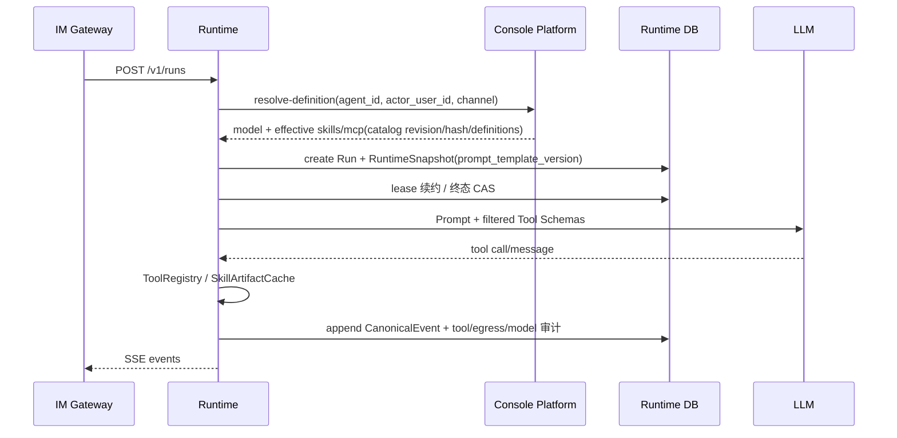
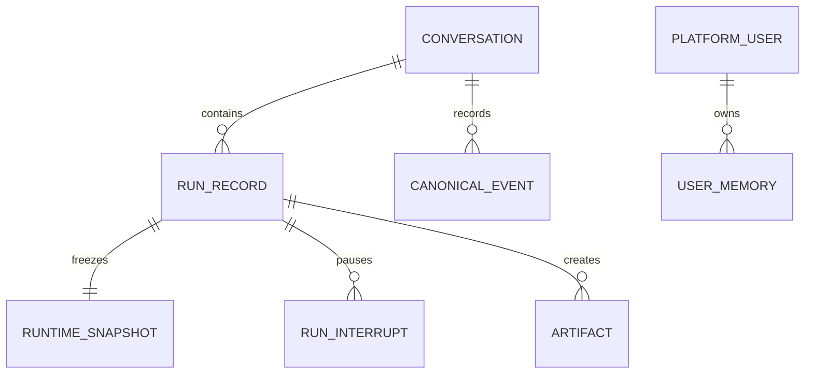

# Agent Runtime 执行引擎 模块需求与设计一体化文档

> **文档编号**: MOD-RUNTIME-V1.1  
> **文档版本**: v1.1  
> **创建日期**: 2026-09-17  
> **文档状态**: 设计评审中  
> **模板**: design-full.md


## 1. 文档控制

| 项目 | 内容 |
|---|---|
| 模块 | Agent Runtime 执行引擎 |
| Owner | muad-agent-runtime |
| 数据 Owner | runtime |
| 前置模块 | 01-platform-foundation, 02-user-identity, 03-model-management, 04-project-platform, 05-skill-management, 06-mcp-management, 07-agent-management |
| 建议代码位置 | apps/agent-runtime/src/muad_agent_runtime/；packages/agent-core/；packages/skill-sdk/；packages/platform-sdk/ |
| 文档基线 | docs/17 V1.4 评审决策；跨模块契约 docs/07 §2–§4；表结构 docs/02 §4.19–4.28 与 migrations/0002 |

### 1.1 责任人

| 角色 | 姓名 | 职责范围 |
|---|---|---|
| 产品经理 | 待定 | 需求定义、业务验收 |
| 开发负责人 | muad-agent-runtime | 技术方案、代码实现 |
| 测试负责人 | 待定 | 测试策略、质量保证 |
| 架构师 | project-owner | 架构审核、技术决策 |

### 1.2 修订历史

| 版本 | 日期 | 作者 | 变更描述 |
|---|---|---|---|
| v1.0 | 2026-09-17 | muad-agent-runtime | 初始设计稿 |
| v1.1 | 2026-09-18 | muad-agent-runtime | 对齐 V1.4 决策（docs/17）：Run 租约字段与并发 partial unique、WAITING_INPUT 自动 resume、cancel-active 协作取消与 Runtime Reaper；Snapshot 补 `prompt_template_version` 并明确 MCP catalog revision/hash/definitions；SSE 全事件契约；resolve-definition/resolve-egress 契约对齐；Hook 生命周期、Model Recovery、ToolRegistry 执行链与 tool/egress/model 审计写入；错误码收敛到已登记清单 |

## 2. 需求分析

### 2.1 需求概述

| 项目 | 内容 |
|---|---|
| 模块名称 | Agent Runtime 执行引擎 |
| 模块 ID | MOD-RUNTIME |
| 需求类型 | 中大型功能开发 |
| 业务背景 | 运行时必须与控制面解耦，不能把状态留在 Pod；授权要在 LLM 看到 Tool Schema 前过滤，Snapshot 后配置不得漂移。 |
| 核心目标 | 实现无状态 LangGraph Runtime：resolve-definition、Effective Capability、Snapshot、Prompt/Skill/Tool/MCP、Context/Memory、SSE、澄清与取消。 |

### 2.2 痛点与价值

| 维度 | 内容 |
|---|---|
| 目标用户/调用方 | Builder / Admin / End User / 内部服务（按模块实际入口） |
| 当前问题 | 运行时必须与控制面解耦，不能把状态留在 Pod；授权要在 LLM 看到 Tool Schema 前过滤，Snapshot 后配置不得漂移。 |
| 业务影响 | 模块边界或契约不固定会导致上层重复设计、接口漂移和跨模块返工。 |
| 预期价值 | 实现无状态 LangGraph Runtime：resolve-definition、Effective Capability、Snapshot、Prompt/Skill/Tool/MCP、Context/Memory、SSE、澄清与取消。 |

### 2.3 功能方案

#### 2.3.1 功能清单

| 功能ID | 功能名称 | 功能描述 | 优先级 | 来源 |
|---|---|---|---|---|
| FEAT-01 | Run 生命周期与租约 | 创建/自动 resume/流式执行/取消/租约续约/终态 CAS/Reaper 回收 + canonical event。 | P0 | 需求描述、docs/00 §0.12 |
| FEAT-02 | Effective Capability | resolve-definition 在 Prompt/ToolRegistry 前按 RULE-05 公式过滤 Skill/MCP。 | P0 | 需求描述 |
| FEAT-03 | RuntimeSnapshot | 冻结 Agent/Model/Skill/MCP catalog/prompt_template_version/policy 版本。 | P0 | 需求描述 |
| FEAT-04 | Skill/Tool 执行 | lazy Artifact cache + ToolRegistry 执行链 + Egress/Artifact + tool/egress/model 审计写入。 | P0 | 需求描述、docs/04 §8 |
| FEAT-05 | Context/Memory | canonical history 与 LLM request context 分离，受控长期 Memory。 | P0 | 需求描述 |
| FEAT-06 | Hook 生命周期 | `user_prompt/pre_model/post_model/pre_tool_use/post_tool_use/on_interrupt/stop` 代码层注册与触发。 | P1 | docs/04 §12 |
| FEAT-07 | Model Recovery | 429/5xx/连接重置/超时按 Retry-After+指数退避重试，受 deadline/cancel 约束，`max_model_retries=3`。 | P1 | docs/04 §14 |

#### 2.3.2 字段约束

| 字段类别 | 约束 |
|---|---|
| ID | 业务实体统一 UUID；跨 Owner Schema 仅逻辑引用 UUID |
| 时间 | PostgreSQL 使用 `timestamptz`；Console 展示 `YYYY-MM-DD HH:mm:ss` |
| 删除 | 产品表统一 `is_deleted` 软删除；状态枚举不重复表达 DELETED |
| Secret | 只保存 SecretRef；Secret Value 不进入 DB / Snapshot / 日志 / LLM / 审计 |
| 枚举 | API 与 DB 统一使用稳定英文枚举值，中文/英文只在 UI/i18n 层映射 |
| 错误 | 业务代码只抛稳定 `code`；`msg/http_status` 由公共配置映射 |

### 2.4 范围与边界

| 类别 | 内容 |
|---|---|
| In Scope | Conversation/Run/Snapshot/Event/Interrupt/Memory/Artifact；SkillArtifactCache/Executor；PromptBuilder/ToolRegistry/MCP Adapter/ModelGateway；Hook 生命周期（`user_prompt/pre_model/post_model/pre_tool_use/post_tool_use/on_interrupt/stop`）；Model Recovery（429/5xx/Retry-After/backoff/deadline/cancel，`max_model_retries=3`）；Tool/Egress/Model 三类审计写入（表定义与查询面见模块 11）。 |
| Out of Scope | 不做 Multi-Agent/Worktree；LangGraph checkpoint 不作为业务事实源；Pod 本地不保存权威会话/Memory；不做用户侧 Artifact 下载；不做 Console Prompt 模板管理（模板代码内置，Snapshot 记录 `prompt_template_version`）；Schedule misfire 补发由模块 09 承载。 |
| 前置假设 | Console `resolve-definition`/`resolve-egress-access` 可用；PostgreSQL/Redis/NFS-backed RWX PVC/Secret Provider 就绪；`runtime.tool_call_audit/egress_audit/model_invocation_audit` 由模块 11 提供。 |
| 技术债 | 无；不为未确认的未来能力增加兼容层 |

### 2.5 验收条件

#### 2.5.1 业务规则与约束

| ID | 类型 | 描述 | 验证场景 |
|---|---|---|---|
| RULE-01 | 系统约束 | 固定 4 个部署单元；Runtime/Worker 无状态横向扩展，不绑定 Pod/bot/user。 | S-04 |
| RULE-02 | 系统约束 | JSON REST 统一 code/msg/data/trace_id/request_id/timestamp；业务只抛 code，msg/http_status 配置映射；SSE 使用 §3.4.1 封套，不套 JSON Envelope。 | E-03 |
| RULE-03 | 系统约束 | 产品表统一 is_deleted/create_time/update_time；同 Owner Schema 物理 FK，跨 Owner Schema 逻辑 UUID；时间统一 timestamptz。 | S-02 |
| RULE-04 | 系统约束 | Secret Value 不进 DB/Snapshot/日志/LLM/审计，只保存 SecretRef。 | S-02 |
| RULE-05 | 系统约束 | 三层授权 + Effective Capability：`AgentAccessGrant(用户,Agent).is_deleted=false AND Agent.enabled AND Binding.is_deleted=false AND 资源.enabled AND 资源.is_deleted=false AND (user_scope=ALL OR 用户 Grant.is_deleted=false)`；绑定无 enabled，Grant 无到期时间（撤销=软删除）。 | S-01 |
| RULE-06 | 系统约束 | NFS-backed RWX PVC 为 Artifact 权威源；Runtime/Worker emptyDir 本地 cache；checksum 校验后原子切 READY；禁止直接从 NFS 执行 Python。 | S-03 / E-01 |
| RULE-07 | 系统约束 | V1 仅 Streamable HTTP；Tool Catalog 持久化 PostgreSQL；Server 级用户范围，无 Tool 级授权/启停；Run 内不执行 `tools/list`。 | S-02 |
| RULE-08 | 系统约束 | 新 Run/Task 冻结 Snapshot；配置/授权变更只影响后续新 Run/Task。 | S-02 |
| RULE-09 | 系统约束 | 同一 conversation 同时最多一个非终态 Run（partial unique 保底）；Run 持久化 `lease_owner/lease_until/heartbeat_at` 并续租；终态写入必须 CAS；Reaper 将 lease 过期仍 RUNNING 的 Run CAS 为 `FAILED(RUN_ABANDONED)`。 | S-04 / E-03 / E-04 |
| RULE-10 | 系统约束 | 取消为协作语义：cancel-active 无活跃→`NO_ACTIVE_RUN`；WAITING_INPUT 直接 CAS `CANCELLED`；CREATED/RUNNING 写 `cancel_requested`+Redis hint 返回 `CANCELLING`，执行 Pod 协作停止后 CAS `CANCELLED`；Redis 仅加速，权威在 DB。 | E-02 / E-08 |
| RULE-11 | 系统约束 | Snapshot 冻结项含 `prompt_template_version`、MCP catalog `revision/hash/definitions`，`policy_json` 含 `max_model_retries=3` 等预算；Run 内不漂移。 | S-02 |
| RULE-12 | 系统约束 | SSE 封套 `{run_id,seq,timestamp,type,data}`；事件集固定 10 个；`: heartbeat` 注释帧不计 seq；未收终态断流时提示重发，Run 由 Reaper 回收。 | S-07 / E-07 |
| RULE-13 | 系统约束 | Egress `target_type` 统一 `PLATFORM_SERVICE/HTTP/MCP`；`ctx.http` host 必须命中 allowlist、响应 ≤5 MiB、禁止未授权跳转、超时必填，与平台调用共用 Egress Boundary 和审计。 | E-05 |
| RULE-14 | 系统约束 | 业务错误只抛 `config/api-messages.yaml` 已登记 code；`RUN_ABANDONED` 仅作 Run 终态 `error_code` 记录，不作为 HTTP 错误码。 | E-03 / E-04 |

#### 2.5.2 功能验收场景

##### 正常场景

| 场景ID | 功能ID | 优先级 | 测试层级 | 关键真实边界 | 归属 | 操作/前置 | 预期结果 |
|---|---|---|---|---|---|---|---|
| S-01 | FEAT-02 | P0 | E2E | Gateway→Runtime→resolve API→LLM | 本模块 | 用户仅有部分 SELECTED Skill 权限 | LLM catalog 完全不存在未授权能力 |
| S-02 | FEAT-03 | P0 | E2E | Runtime→DB Snapshot→LLM/Tool | 本模块 | Run 创建后管理员改 Agent/Grant；上传 Skill v2 | 当前 Run 继续原 Snapshot（agent/model/skill/`prompt_template_version`/MCP catalog revision+hash 均不变），新 Run 才看到变更；Snapshot 无 Secret |
| S-03 | FEAT-04 | P0 | integration | emptyDir→NFS | 本模块 | 同 Pod 第二次执行同 checksum Skill | 命中 READY，不访问 NFS |
| S-04 | FEAT-01 | P0 | E2E | Runtime A→PostgreSQL→Runtime B | 本模块 | Turn 1 由 Pod A 执行后 Pod A 删除，Turn 2 路由到 Pod B | Pod B 从 PostgreSQL+Artifact Store 重建上下文，无 sticky session，Conversation/Memory 正确 |
| S-05 | FEAT-06 | P1 | integration | runner→HookManager→tool | 本模块 | 一轮含 Tool 调用的 Run，Hook 已注册 | Hook 按 `user_prompt→pre_model→pre_tool_use→post_tool_use→post_model→stop` 触发，未触发的 Hook 不影响已注册的其他 Hook |
| S-06 | FEAT-07 | P1 | integration | ModelGateway→fake provider | 本模块 | Provider 先返回 429（`Retry-After: 1`）后成功 | 按 Retry-After+backoff 重试成功，`model_invocation_audit` 记录 attempt/retry_reason，Run 不失败 |
| S-07 | FEAT-01 | P0 | E2E | Gateway→Runtime SSE→DB | 本模块 | conversation 存在 WAITING_INPUT Run，用户直接回复消息 | 不新建 Run，作为 resume 输入继续执行，首个事件 `run.created` 带 `"resumed":true`，seq 继续单调 |
| S-08 | FEAT-05 | P1 | integration | CanonicalEvent→ContextBuilder→LLM request | 本模块 | 长会话触达 context budget 且存在 User Memory | 仅裁剪发给模型的 request context，CanonicalEvent 保持 append-only；Memory 按 `tenant_id+user_id+enabled` 读取；大结果转 Artifact preview |

##### 异常场景

| 场景ID | 功能ID | 测试层级 | 关键真实边界 | 归属 | 触发条件 | 系统行为 |
|---|---|---|---|---|---|---|
| E-01 | FEAT-04 | integration | Runtime cache→NFS | 本模块 | cache miss 且 NFS 不可用 | 产生明确 Skill 失败（`SKILL_ARTIFACT_UNAVAILABLE`），不执行半成品 |
| E-02 | FEAT-01 | E2E | Gateway→Runtime cancel-active→DB | 本模块 | 用户 `/stop`，存在 WAITING_INPUT Run | 直接 CAS 置 `CANCELLED`，写 CANCEL CanonicalEvent，发 `run.completed(status=CANCELLED)`，`run_interrupt` 置 CANCELLED |
| E-03 | FEAT-01 | E2E | Gateway→Runtime→DB partial unique | 本模块 | conversation 存在 CREATED/RUNNING Run 时再次 `POST /v1/runs` | 返回 `409 RUN_BUSY`；Run 状态与 lease 不变 |
| E-04 | FEAT-01 | integration | Reaper→DB lease→CAS | 本模块 | RUNNING Run 的 `lease_until` 过期且无续租（执行 Pod 崩溃） | Reaper CAS 置 `FAILED(RUN_ABANDONED)`，会话解锁可建新 Run；旧执行者后续写终态被 CAS 拒绝 |
| E-05 | FEAT-04 | integration | Skill→Egress Boundary | 本模块 | `ctx.http` 请求 host 不在 allowlist | 请求不发出，返回 `FORBIDDEN`，写 `egress_audit(policy_decision=DENY, target_type=HTTP)` |
| E-06 | FEAT-07 | integration | ModelGateway→fake provider | 本模块 | 连续 429/5xx 直至超过 `max_model_retries` 或剩余 deadline 不足以退避 | 停止重试，Run 终态 `FAILED`，`error_code=MODEL_UNAVAILABLE`，写 `model_invocation_audit` |
| E-07 | FEAT-01 | E2E | Gateway SSE→Runtime Reaper | 本模块 | SSE 流未收到终态即断开且执行 Pod 随之中断 | Gateway 向用户提示可重发；lease 过期后 Reaper 回收为 `FAILED(RUN_ABANDONED)`，`GET /v1/runs/{run_id}` 可查终态 |
| E-08 | FEAT-01 | E2E | Gateway→Runtime cancel-active→DB | 本模块 | 用户 `/stop`，存在 CREATED/RUNNING Run | 写 `cancel_requested=true`+Redis hint，响应 `{run_id,status:"CANCELLING"}`；执行 Pod 在模型/工具/心跳检查点协作停止后 CAS `CANCELLED`；无活跃 Run 时返回 `404 NO_ACTIVE_RUN` |

无可靠实测数据的性能阈值统一标记“待定”，不复制模板示例值。

## 3. 技术设计

### 3.1 技术选型与关键决策

| 决策 | 选择 | 放弃项 | 理由 |
|---|---|---|---|
| 执行框架 | LangGraph + PG Checkpointer | 自研状态机 | 保留 interrupt/checkpoint 能力 |
| 能力授权 | resolve-definition 前置过滤 | Tool 执行后 403 | 避免 schema 泄露和无效选择 |
| Skill 加载 | checksum lazy cache | 启动时全量下载 | 扩容成本低且按需 IO |
| Run 并发控制 | conversation partial unique + lease/Reaper | 分布式锁 / 粘性 Pod | PostgreSQL 为权威、无额外中间件，Pod crash 可回收 |
| 取消 | 协作取消（DB `cancel_requested` 权威 + Redis hint） | 直接杀执行进程 | 外部副作用不可回滚，先受理再协作停止 |
| 模型恢复 | 有界重试（`max_model_retries=3`）+ Retry-After/deadline | 无限重试 | 防止挂死并尊重上游限流 |

基础栈：Python >=3.12、FastAPI >=0.115、SQLAlchemy 2.x、PostgreSQL；按需 Redis/NFS/Secret Provider；统一 `muad-api` 与 `muad-logging`。

### 3.2 架构与流程



Run 状态机以 docs/02 §6 为准；取消与 Reaper 语义见 §3.4 API-03/API-04 与 docs/08 §6。同一 conversation 的并发、租约与 CAS 规则见 RULE-09。

### 3.3 数据设计

#### `runtime.conversation`

**表说明**

- **用途**：逻辑 Agent 与用户之间的会话容器。
- **主要写入方**：Agent Runtime。
- **主要读取方**：Agent Runtime。
- **生命周期/边界**：跨 Pod；/new 创建新会话；不存 Pod 归属。

| 字段 | 类型 | 约束 | 说明 |
|---|---|---|---|
| `id` | uuid | PK | 主键 |
| `is_deleted` | boolean | NOT NULL DEFAULT false | 软删除 |
| `create_time` | timestamptz | NOT NULL DEFAULT now() | 创建时间 |
| `update_time` | timestamptz | NOT NULL DEFAULT now() | 更新时间 |
| `tenant_id` | varchar(64) | NOT NULL | 隔离键 |
| `user_id` | uuid | NOT NULL | PlatformUser |
| `agent_id` | uuid | NOT NULL | Agent |
| `title` | varchar(256) |  | 标题 |
| `status` | varchar(16) | NOT NULL DEFAULT 'ACTIVE' | ACTIVE/ARCHIVED |
| `last_seq` | bigint | NOT NULL DEFAULT 0 | Canonical Event 序号 |
| `last_run_id` | uuid |  | 最近 Run |

**索引/约束**：

- `INDEX (tenant_id, user_id, agent_id, update_time DESC)`

#### `runtime.run_record`

**表说明**

- **用途**：一次用户消息对应的一次 Agent 执行。
- **主要写入方**：Agent Runtime。
- **主要读取方**：Runtime/Admin。
- **生命周期/边界**：短时执行记录；Pod crash 不改变历史事实；lease 过期由 Reaper 回收。

| 字段 | 类型 | 约束 | 说明 |
|---|---|---|---|
| `id` | uuid | PK | 主键 |
| `is_deleted` | boolean | NOT NULL DEFAULT false | 软删除 |
| `create_time` | timestamptz | NOT NULL DEFAULT now() | 创建时间 |
| `update_time` | timestamptz | NOT NULL DEFAULT now() | 更新时间 |
| `tenant_id` | varchar(64) | NOT NULL | 隔离键 |
| `conversation_id` | uuid | NOT NULL FK -> conversation.id | 会话 |
| `user_id` | uuid | NOT NULL | 执行用户 |
| `agent_id` | uuid | NOT NULL | Agent |
| `snapshot_id` | uuid |  | Snapshot |
| `status` | varchar(24) | NOT NULL | CREATED/RUNNING/WAITING_INPUT/COMPLETED/FAILED/CANCELLED |
| `input_text` | text | NOT NULL | 本轮用户输入 |
| `trace_id` | varchar(64) | NOT NULL | 全链路 Trace |
| `start_time` | timestamptz |  | 开始 |
| `end_time` | timestamptz |  | 结束 |
| `cancel_requested` | boolean | NOT NULL DEFAULT false | 取消标记 |
| `error_code` | varchar(64) |  | 错误码 |
| `error_message` | text |  | 错误摘要 |
| `lease_owner` | varchar(128) |  | 当前执行 Runtime Pod 实例 ID |
| `lease_until` | timestamptz |  | 执行租约到期 |
| `heartbeat_at` | timestamptz |  | 最近续租时间 |

**索引/约束**：

- `UNIQUE (conversation_id) WHERE status IN ('CREATED','RUNNING','WAITING_INPUT') AND is_deleted=false`
- `INDEX (conversation_id, create_time DESC)`
- `INDEX (agent_id, status, create_time DESC)`
- `INDEX (lease_until) WHERE status = 'RUNNING'`
- `INDEX (trace_id)`

> 终态写入必须 CAS；`error_code` 仅记录领域终态原因（如 `RUN_ABANDONED`），不作为 HTTP 错误码（docs/17 §5）。

#### `runtime.runtime_snapshot`

**表说明**

- **用途**：冻结本 Run 的 Agent/Model/Skill/MCP 版本投影。
- **主要写入方**：Agent Runtime Run 创建阶段。
- **主要读取方**：Runtime/Admin。
- **生命周期/边界**：Run 内不可变；不包含 Secret 和 Pod 信息。

| 字段 | 类型 | 约束 | 说明 |
|---|---|---|---|
| `id` | uuid | PK | 主键 |
| `is_deleted` | boolean | NOT NULL DEFAULT false | 软删除 |
| `create_time` | timestamptz | NOT NULL DEFAULT now() | 创建时间 |
| `update_time` | timestamptz | NOT NULL DEFAULT now() | 更新时间 |
| `tenant_id` | varchar(64) | NOT NULL | 隔离键 |
| `run_id` | uuid | NOT NULL | 对应 Run |
| `schema_version` | int | NOT NULL DEFAULT 1 | Snapshot JSON Schema 版本 |
| `agent_revision` | bigint | NOT NULL | Agent revision |
| `model_revision` | bigint | NOT NULL | Model revision |
| `agent_json` | jsonb | NOT NULL | 冻结 Agent 定义 |
| `model_json` | jsonb | NOT NULL | 冻结 Model 非 secret 定义 |
| `skill_catalog_json` | jsonb | NOT NULL | Skill ID/version/checksum/catalog |
| `mcp_catalog_json` | jsonb | NOT NULL | MCP catalog `revision`/`hash`/`definitions`（tools 明细）快照；Run 内不执行 `tools/list` |
| `policy_json` | jsonb | NOT NULL DEFAULT '{}' | 预算/策略快照，含 `max_model_retries` 等默认键 |
| `prompt_template_version` | varchar(32) | NOT NULL | 代码内置 Prompt 模板版本 |
| `content_hash` | varchar(128) | NOT NULL | 快照哈希 |

**索引/约束**：

- `UNIQUE (run_id)`
- `INDEX (content_hash)`

冻结项与实时项以 docs/04 §6.3 为准：Agent instructions/revision、Model/params、Effective Skill artifact/version/checksum、Prompt template `prompt_template_version`、MCP catalog revision/hash/definitions 冻结；Secret value、Egress emergency deny、cancel 实时。

#### `runtime.canonical_event`

**表说明**

- **用途**：会话真实发生的不可变事件日志。
- **主要写入方**：Agent Runtime EventWriter。
- **主要读取方**：ContextBuilder/Admin。
- **生命周期/边界**：append-only；上下文裁剪不得修改。

| 字段 | 类型 | 约束 | 说明 |
|---|---|---|---|
| `id` | uuid | PK | 主键 |
| `is_deleted` | boolean | NOT NULL DEFAULT false | 软删除 |
| `create_time` | timestamptz | NOT NULL DEFAULT now() | 创建时间 |
| `update_time` | timestamptz | NOT NULL DEFAULT now() | 更新时间 |
| `tenant_id` | varchar(64) | NOT NULL | 隔离键 |
| `conversation_id` | uuid | NOT NULL | 会话 |
| `run_id` | uuid |  | 所属 Run |
| `seq` | bigint | NOT NULL | Conversation 单调序号 |
| `event_type` | varchar(64) | NOT NULL | USER_MESSAGE/ASSISTANT_MESSAGE/TOOL_CALL/... |
| `payload_json` | jsonb | NOT NULL | 事件负载 |
| `artifact_id` | uuid |  | 大结果引用 |

**索引/约束**：

- `UNIQUE (conversation_id, seq)`
- `INDEX (run_id, seq)`
- `INDEX (conversation_id, create_time)`

#### `runtime.user_memory`

**表说明**

- **用途**：跨 Conversation 的长期用户上下文，不存实时业务事实。
- **主要写入方**：受控 Memory Writer/Console。
- **主要读取方**：ContextBuilder/Console。
- **生命周期/边界**：按 tenant+user 隔离；可查看/清理。

| 字段 | 类型 | 约束 | 说明 |
|---|---|---|---|
| `id` | uuid | PK | 主键 |
| `is_deleted` | boolean | NOT NULL DEFAULT false | 软删除 |
| `create_time` | timestamptz | NOT NULL DEFAULT now() | 创建时间 |
| `update_time` | timestamptz | NOT NULL DEFAULT now() | 更新时间 |
| `tenant_id` | varchar(64) | NOT NULL | 隔离键 |
| `user_id` | uuid | NOT NULL | 用户 |
| `memory_key` | varchar(128) | NOT NULL | 稳定 key |
| `category` | varchar(64) | NOT NULL | PREFERENCE/WORK_STYLE/EXPLICIT |
| `content_json` | jsonb | NOT NULL | 记忆内容 |
| `source_type` | varchar(32) | NOT NULL | USER_EXPLICIT/RUNTIME |
| `source_ref` | varchar(256) |  | 来源 Run/Event |
| `write_policy` | varchar(32) | NOT NULL DEFAULT 'CONTROLLED' | 写入策略 |
| `version` | bigint | NOT NULL DEFAULT 1 | 版本 |
| `enabled` | boolean | NOT NULL DEFAULT true | 是否使用 |

**索引/约束**：

- `UNIQUE (tenant_id, user_id, memory_key) WHERE is_deleted=false`
- `INDEX (user_id, enabled, update_time DESC)`

#### `runtime.artifact`

**表说明**

- **用途**：报告、大 Tool 结果、结构化产物的外部对象引用。
- **主要写入方**：Agent Runtime、Agent Worker（通过共享 Artifact Port）。
- **主要读取方**：ContextBuilder、Agent Worker、Console。
- **生命周期/边界**：内容在 Artifact Store（V1=NFS-backed RWX PVC），DB 只存 storage_key 和元数据；Run Artifact 与 Task Artifact 使用同一表，通过 run_id/task_id 区分。

| 字段 | 类型 | 约束 | 说明 |
|---|---|---|---|
| `id` | uuid | PK | 主键 |
| `is_deleted` | boolean | NOT NULL DEFAULT false | 软删除 |
| `create_time` | timestamptz | NOT NULL DEFAULT now() | 创建时间 |
| `update_time` | timestamptz | NOT NULL DEFAULT now() | 更新时间 |
| `tenant_id` | varchar(64) | NOT NULL | 隔离键 |
| `run_id` | uuid |  | 实时 Run；与 task_id 二选一 |
| `task_id` | uuid |  | 后台 Task；与 run_id 二选一 |
| `conversation_id` | uuid |  | 实时会话；定时任务产物可为空 |
| `artifact_type` | varchar(64) | NOT NULL | TOOL_RESULT/REPORT/FILE/... |
| `storage_key` | text | NOT NULL | Artifact Store 相对键 |
| `media_type` | varchar(128) | NOT NULL | MIME |
| `size` | bigint | NOT NULL | 字节 |
| `checksum` | varchar(128) | NOT NULL | 校验 |
| `preview_text` | text |  | LLM/用户预览 |
| `metadata_json` | jsonb | NOT NULL DEFAULT '{}' | 元数据 |

**索引/约束**：

- `CHECK ((run_id IS NOT NULL) <> (task_id IS NOT NULL))`
- `INDEX (run_id, create_time) WHERE run_id IS NOT NULL`
- `INDEX (task_id, create_time) WHERE task_id IS NOT NULL`
- `INDEX (conversation_id, create_time) WHERE conversation_id IS NOT NULL`

#### `runtime.run_interrupt`

**表说明**

- **用途**：会话内澄清/确认产生的暂停点。
- **主要写入方**：LangGraph/Runtime。
- **主要读取方**：resume API/Gateway/Admin。
- **生命周期/边界**：Phase 1 仅短时会话内等待，不等同 durable human task。

| 字段 | 类型 | 约束 | 说明 |
|---|---|---|---|
| `id` | uuid | PK | 主键 |
| `is_deleted` | boolean | NOT NULL DEFAULT false | 软删除 |
| `create_time` | timestamptz | NOT NULL DEFAULT now() | 创建时间 |
| `update_time` | timestamptz | NOT NULL DEFAULT now() | 更新时间 |
| `tenant_id` | varchar(64) | NOT NULL | 隔离键 |
| `run_id` | uuid | NOT NULL | Run |
| `conversation_id` | uuid | NOT NULL | 会话 |
| `interrupt_type` | varchar(32) | NOT NULL | CLARIFY/CONFIRM/PERMISSION |
| `prompt_text` | text | NOT NULL | 向用户展示的问题 |
| `options_json` | jsonb | NOT NULL DEFAULT '[]' | 可选项 |
| `status` | varchar(16) | NOT NULL DEFAULT 'WAITING' | WAITING/RESOLVED/CANCELLED |
| `resolution_json` | jsonb |  | 用户输入/选择 |
| `expires_at` | timestamptz |  | 可选过期 |
| `resolved_at` | timestamptz |  | 恢复时间 |

**索引/约束**：

- `INDEX (run_id, status)`
- `INDEX (conversation_id, status)`

#### 审计写入（表定义见 docs/02 §4.26–4.28，查询面与验收见模块 11）

| 表 | 写入时机 | 关键字段 | 查询/展示归属 |
|---|---|---|---|
| `runtime.tool_call_audit` | ToolRegistry 每次 `prepare/execute` 的终态 | `tool_kind/prepared_args_hash/status/error_code/artifact_id` | 模块 11 |
| `runtime.egress_audit` | Egress Boundary 每次平台/HTTP/MCP 调用 | `target_type(PLATFORM_SERVICE/HTTP/MCP)/policy_decision/result_status` | 模块 11 |
| `runtime.model_invocation_audit` | ModelGateway 每次 attempt（含重试） | `attempt/retry_reason/status/error_code` | 模块 11 |

**ER 图**



数据库规则：所有产品表统一 `id/is_deleted/create_time/update_time`；同 Owner Schema 物理 FK，跨 Owner Schema 逻辑 UUID；迁移使用 Alembic expand→deploy→contract。

### 3.4 接口设计

```json
{
  "code":"0",
  "msg":"成功",
  "data":{},
  "trace_id":"trace-id",
  "request_id":"request-id",
  "timestamp":"2026-09-17T17:00:00+08:00"
}
```

业务异常只允许 `raise AppError("CODE")`；msg 与 HTTP Status 统一由 `config/api-messages.yaml` 映射。错误码仅允许使用该配置已登记代码（本模块涉及：`COMMON_* / AGENT_* / MODEL_* / FORBIDDEN / RUN_BUSY / NO_ACTIVE_RUN / PLATFORM_ADAPTER_NOT_FOUND / CREDENTIAL_MISSING / SKILL_ARTIFACT_*`）。

| 接口ID | 名称 | 方法 | 路径 | FEAT |
|---|---|---|---|---|
| API-01 | 创建 Run | POST | `/v1/runs` | FEAT-01 |
| API-02 | Resume Run | POST | `/v1/runs/{run_id}/resume` | FEAT-01 |
| API-03 | 取消当前活跃 Run | POST | `/v1/runs/cancel-active` | FEAT-01 |
| API-04 | 显式取消 Run（诊断） | POST | `/v1/runs/{run_id}/cancel` | FEAT-01 |
| API-05 | 创建 Conversation | POST | `/v1/conversations` | FEAT-01 |
| API-06 | 查询 Run | GET | `/v1/runs/{run_id}` | FEAT-01 |
| API-07 | Resolve Definition | POST | `/internal/runtime/resolve-definition` | FEAT-02 |
| API-08 | Resolve Egress | POST | `/internal/runtime/resolve-egress-access` | FEAT-04 |

| 函数ID | 签名 | 用途 | 错误码 | FEAT |
|---|---|---|---|---|
| LIB-01 | `AgentRunner.run(request) -> AsyncIterator[RunEvent]` | Run 状态机、租约、SSE 事件 | `COMMON_INTERNAL_ERROR` | FEAT-01 |
| LIB-02 | `PromptBuilder.build(snapshot, context) -> messages` | 构建 System Prompt 和上下文 | `COMMON_INTERNAL_ERROR` | FEAT-03 |
| LIB-03 | `SkillArtifactCache.ensure(artifact_id, storage_key, checksum) -> Path` | lazy prepare Skill（singleflight + checksum） | `SKILL_ARTIFACT_UNAVAILABLE / SKILL_ARTIFACT_CHECKSUM_MISMATCH` | FEAT-04 |
| LIB-04 | `ToolRegistry.execute(prepared_call) -> ToolResult` | prepare→schema 校验→pre_tool hook→policy→execute→post_tool→audit | `COMMON_INTERNAL_ERROR / FORBIDDEN` | FEAT-04 |
| LIB-05 | `HookManager.emit(hook, payload) -> None` | 生命周期 Hook 触发 | `COMMON_INTERNAL_ERROR` | FEAT-06 |
| LIB-06 | `ModelGateway.invoke(request) -> ModelResult` | 模型调用 + Recovery（429/5xx/Retry-After/backoff/deadline/cancel，`max_model_retries=3`） | `MODEL_UNAVAILABLE / COMMON_INTERNAL_ERROR` | FEAT-07 |
| LIB-07 | `RunReaper.sweep() -> int` | lease 过期 RUNNING → CAS `FAILED(RUN_ABANDONED)` | `COMMON_INTERNAL_ERROR` | FEAT-01 |

#### API-01 创建 Run

```text
POST /v1/runs
```

- 调用方：IM Gateway（用户消息）；诊断工具。
- 协议：请求 `application/json`；响应 `text/event-stream`（SSE），不使用 JSON Envelope。
- 幂等：支持 `Idempotency-Key`（缺省取 `channel.message.id`），重复请求不得创建第二个非终态 Run（docs/07 §12）。

**请求字段**

| 字段 | 类型 | 必填 | 说明 |
|---|---|---|---|
| `agent_id` | uuid | 是 | 逻辑 Agent；不得传 runtime_pod_id |
| `platform_user_id` | uuid | 是 | PlatformUser |
| `conversation_id` | uuid | 否 | 为空时按 (user, agent) 取/建会话 |
| `channel.type` | string | 是 | 渠道类型，如 WECOM |
| `channel.bot_id` | string | 是 | bot 路由已由 Gateway 完成 |
| `channel.external_conversation_id` | string | 是 | 渠道会话 ID |
| `message.id` | string | 是 | 渠道消息 ID，幂等键来源 |
| `message.type` | string | 是 | text/... |
| `message.text` | string | 是 | 用户输入 |
| `message.attachments` | array | 否 | 附件引用（V1 不解析） |

**响应**

SSE；首事件：

```text
event: run.created
data: {"run_id":"...","conversation_id":"...","resumed":false,"trace_id":"..."}
```

事件封套与事件集见 §3.4.1。WAITING_INPUT 自动 resume 时 `"resumed":true`。非流式错误使用统一 JSON Envelope。

**错误码**

| 错误码 | 场景 | HTTP |
|---|---|---|
| `COMMON_VALIDATION_ERROR` | 字段缺失/类型错误 | 422 |
| `AGENT_NOT_FOUND` | Agent 不存在 | 404 |
| `AGENT_DISABLED` | Agent 已禁用 | 409 |
| `AGENT_ACCESS_DENIED` | 无 AgentAccessGrant | 403 |
| `MODEL_DISABLED` | 绑定模型已禁用 | 409 |
| `RUN_BUSY` | conversation 存在 CREATED/RUNNING Run | 409 |
| `COMMON_INTERNAL_ERROR` | 其他内部错误 | 500 |

**处理逻辑**

```text
1. 校验 agent enabled + AgentAccessGrant（resolve-definition）
2. 查询 conversation 非终态 Run（DB partial unique 兜底）:
   WAITING_INPUT -> 不新建 Run，将 message.text 作为 resume 输入
   CREATED/RUNNING -> raise RUN_BUSY
3. 新建 Run: run_record insert status=CREATED
   + lease_owner = 本 Pod 实例 ID + lease_until + heartbeat_at
4. resolve-definition -> RuntimeSnapshot(run_id, prompt_template_version,
   mcp catalog revision/hash/definitions) -> 回写 run_record.snapshot_id
5. append USER_MESSAGE CanonicalEvent -> LangGraph 执行
6. 执行期间持续续租；SSE 事件按 seq 单调输出
7. 终态 CAS 写 run_record（COMPLETED/FAILED/CANCELLED）
```

- 事务：步骤 3–5 的 Run/Snapshot/CanonicalEvent 创建在同一 DB 事务；LLM/Tool 外部 IO 不包长事务。
- 并发兜底：两个请求同时通过步骤 2 时，partial unique 使后写者失败，按 `RUN_BUSY` 返回。
- 对应 docs/07 §2.1；docs/04 §4/§4.1/§6。

#### API-02 Resume Run

```text
POST /v1/runs/{run_id}/resume
```

- 调用方：IM Gateway（澄清/确认回复的显式入口）；诊断工具。
- 协议：响应 SSE（与 API-01 同一事件流，首事件 `run.created` 带 `"resumed":true`）。IM 普通回复无需 Gateway 显式调用，Runtime 在 API-01 内自动 resume（docs/07 §2.2）。
- 幂等：已终态 Run 返回当前终态，不再执行。

**请求字段**

| 字段 | 类型 | 必填 | 说明 |
|---|---|---|---|
| `input.type` | string | 是 | text/... |
| `input.text` | string | 是 | 澄清/确认输入 |

**响应**：SSE 事件流，终态事件 `run.completed / run.failed`。

**错误码**

| 错误码 | 场景 | HTTP |
|---|---|---|
| `COMMON_VALIDATION_ERROR` | 输入字段缺失/类型错误 | 422 |
| `COMMON_NOT_FOUND` | Run 不存在 | 404 |
| `COMMON_CONFLICT` | Run 非 WAITING_INPUT 且未终态 | 409 |
| `COMMON_INTERNAL_ERROR` | 其他内部错误 | 500 |

**处理逻辑**

```text
1. 校验 run_id 存在；status 非 WAITING_INPUT:
   已终态 -> 返回当前终态（幂等）
   其余   -> raise COMMON_CONFLICT
2. run_interrupt -> RESOLVED + resolution_json
3. append USER_MESSAGE(resume input) CanonicalEvent
4. CAS run_record WAITING_INPUT -> RUNNING，重新初始化 lease
5. LangGraph resume -> SSE 输出
```

- 对应 docs/07 §2.2；docs/04 §15.2；docs/08 §5。

#### API-03 取消当前活跃 Run

```text
POST /v1/runs/cancel-active
```

- 调用方：IM Gateway `/stop`。
- 语义：受理语义“正在停止当前任务…”，先受理再协作停止。

**请求字段**

| 字段 | 类型 | 必填 | 说明 |
|---|---|---|---|
| `agent_id` | uuid | 是 | 逻辑 Agent |
| `platform_user_id` | uuid | 是 | PlatformUser |

**响应 `data`**

```json
{"run_id":"uuid","status":"CANCELLING"}
```

WAITING_INPUT 直接终态时返回 `{"run_id":"uuid","status":"CANCELLED"}`。

**错误码**

| 错误码 | 场景 | HTTP |
|---|---|---|
| `COMMON_VALIDATION_ERROR` | 字段缺失/类型错误 | 422 |
| `NO_ACTIVE_RUN` | 当前无 CREATED/RUNNING/WAITING_INPUT Run | 404 |
| `COMMON_INTERNAL_ERROR` | 其他内部错误 | 500 |

**处理逻辑**

```text
1. 按 (agent_id, platform_user_id) 定位 conversation 的非终态 Run
2. 无 -> raise NO_ACTIVE_RUN
3. WAITING_INPUT（无执行者）:
   CAS status=CANCELLED; run_interrupt WAITING->CANCELLED;
   append CANCEL CanonicalEvent; 发 run.completed(status=CANCELLED)
4. CREATED/RUNNING:
   CAS cancel_requested=true
   + Redis SET run:cancel:{run_id}=1 EX 1800（hint，失败不阻塞）
   -> 返回 CANCELLING
   执行 Pod 在模型调用前/工具调用前/心跳处检查 cancel，
   CAS status=CANCELLED + CANCEL 事件 + run.completed(status=CANCELLED)
```

- 权威事实是 `run_record.cancel_requested`，Redis 仅为加速通道。
- 对应 docs/07 §2.4；docs/00 §0.12；docs/08 §6。

#### API-04 显式取消 Run（诊断）

```text
POST /v1/runs/{run_id}/cancel
```

- 调用方：诊断工具/Admin（经模块 11）；非 `/stop` 主路径。
- 保留原因：按 Run 的显式取消，便于排障与外部系统对齐。

**请求字段**：路径参数 `run_id`（uuid，必填）。

**响应 `data`**

```json
{"run_id":"uuid","status":"CANCELLING","cancel_requested":true}
```

WAITING_INPUT 直接终态时返回 `status=CANCELLED`；已终态时返回当前终态与 `cancel_requested`。

**错误码**

| 错误码 | 场景 | HTTP |
|---|---|---|
| `COMMON_VALIDATION_ERROR` | run_id 非法 | 422 |
| `COMMON_NOT_FOUND` | Run 不存在 | 404 |
| `COMMON_INTERNAL_ERROR` | 其他内部错误 | 500 |

**处理逻辑**

```text
1. 查询 run: 已终态 -> 返回当前终态（幂等）
2. WAITING_INPUT -> 直接 CAS CANCELLED（同 API-03 步骤 3）
3. CREATED/RUNNING -> 写 cancel_requested + Redis hint，返回 CANCELLING
```

- 对应 docs/07 §2.3；docs/04 §16。

#### API-05 创建 Conversation

```text
POST /v1/conversations
```

- 调用方：IM Gateway `/new`。

**请求字段**

| 字段 | 类型 | 必填 | 说明 |
|---|---|---|---|
| `agent_id` | uuid | 是 | 逻辑 Agent |
| `platform_user_id` | uuid | 是 | PlatformUser |

**响应 `data`**

```json
{"conversation_id":"uuid","agent_id":"uuid","status":"ACTIVE"}
```

**错误码**

| 错误码 | 场景 | HTTP |
|---|---|---|
| `COMMON_VALIDATION_ERROR` | 字段缺失/类型错误 | 422 |
| `AGENT_NOT_FOUND` | Agent 不存在 | 404 |
| `AGENT_ACCESS_DENIED` | 无 AgentAccessGrant | 403 |
| `COMMON_INTERNAL_ERROR` | 其他内部错误 | 500 |

**处理逻辑**

```text
1. 校验 Agent 授权（同 API-01 步骤 1）
2. insert conversation(user_id, agent_id, status=ACTIVE)
3. 返回 conversation_id；不创建 Run
```

- 每个 `/new` 创建新会话；历史消息不复制。
- 对应 docs/07 §2.5；docs/02 §4.19。

#### API-06 查询 Run

```text
GET /v1/runs/{run_id}
```

- 调用方：IM Gateway（SSE 断流后诊断）；Console Admin 经模块 11。
- 用途：返回 Run 当前状态与 Snapshot 摘要引用（不含 Secret）。

**响应 `data`**

| 字段 | 类型 | 说明 |
|---|---|---|
| `run_id` | uuid | Run |
| `conversation_id` | uuid | 会话 |
| `agent_id` | uuid | Agent |
| `status` | string | CREATED/RUNNING/WAITING_INPUT/COMPLETED/FAILED/CANCELLED |
| `cancel_requested` | boolean | 取消标记 |
| `error_code` / `error_message` | string | 终态原因（如 `RUN_ABANDONED`） |
| `start_time` / `end_time` | string | RFC3339 |
| `snapshot` | object | `{snapshot_id, content_hash, prompt_template_version, mcp_catalog_revision, mcp_catalog_hash}` |
| `trace_id` | string | 全链路 Trace |

**错误码**

| 错误码 | 场景 | HTTP |
|---|---|---|
| `COMMON_VALIDATION_ERROR` | run_id 非法 | 422 |
| `COMMON_NOT_FOUND` | Run 不存在 | 404 |
| `COMMON_INTERNAL_ERROR` | 其他内部错误 | 500 |

**处理逻辑**：单行查询，不触发执行；不返回 lease/Secret；已终态返回终态。对应 docs/07 §2.6；Admin 列表与详情见模块 11 与 docs/07 §9.1–9.2。

#### API-07 Resolve Definition

```text
POST /internal/runtime/resolve-definition
```

- 调用方：Agent Runtime；实现方：Console Platform。
- 用途：解析 Agent/Model 与当前用户 Effective Skill/MCP，供 Snapshot 使用。

**请求字段**

| 字段 | 类型 | 必填 | 说明 |
|---|---|---|---|
| `agent_id` | uuid | 是 | 逻辑 Agent |
| `actor_user_id` | uuid | 是 | 执行用户（不是 platform_user_id） |
| `channel` | string | 是 | 渠道类型，如 WECOM |

**响应 `data`**

```json
{
  "agent": {"id":"uuid","key":"example-agent","revision":12,"instructions":"...","runtime_config":{}},
  "model": {"id":"uuid","revision":4,"protocol":"OPENAI","model_id":"qwen3-235b-a22b","base_url":"http://model-gateway.internal/v1","secret_ref":"secret://model/xxx","params":{}},
  "skills": [
    {"skill_id":"uuid","artifact_id":"uuid","key":"policy-check","name":"设备策略检查","description":"...","version":"1.3.0","checksum":"sha256:...","storage_key":"skills/{skill_id}/{artifact_id}/skill.zip","frontmatter":{},"execution_mode":"ASYNC"}
  ],
  "mcp_servers": [
    {"mcp_server_id":"uuid","key":"mssw-mcp","catalog_revision":7,"catalog_hash":"sha256:...","definitions":[{"name":"...","description":"...","input_schema":{},"effect":"READ"}]}
  ]
}
```

- `skills/mcp_servers` 已是 Effective Capability（RULE-05 公式），不是 Agent 的全量绑定；未授权资源不返回。
- `model.secret_ref` 仅为 SecretRef，不返回 Secret Value。
- MCP `definitions` 来自最近一次成功 `tools/list` 的 `tool_catalog_json`（`revision/hash` 同源）；Run 内不再 `tools/list`。
- 字段与 docs/07 §4.1 对齐；MCP 条目与 Snapshot `mcp_catalog_json` 同构。

**错误码**

| 错误码 | 场景 | HTTP |
|---|---|---|
| `COMMON_VALIDATION_ERROR` | 字段缺失/类型错误 | 422 |
| `AGENT_NOT_FOUND` | Agent 不存在 | 404 |
| `AGENT_DISABLED` | Agent 已禁用 | 409 |
| `AGENT_ACCESS_DENIED` | 无 AgentAccessGrant | 403 |
| `MODEL_DISABLED` | 绑定模型已禁用 | 409 |
| `COMMON_INTERNAL_ERROR` | 其他内部错误 | 500 |

**处理逻辑**

```text
1. 校验 Agent enabled + AgentAccessGrant
2. 按 RULE-05 公式解析 Effective Skill（含 artifact checksum/storage_key）
3. 按 RULE-05 公式解析 Effective MCP（含 catalog revision/hash/definitions）
4. 返回 agent/model/skills/mcp_servers；不做 Secret 解析、不执行平台登录
```

- 对应 docs/07 §4.1；docs/04 §6.2.1/§9.1；docs/02 §5.10。

#### API-08 Resolve Egress

```text
POST /internal/runtime/resolve-egress-access
```

- 调用方：Runtime/Worker 的 Egress Boundary；实现方：Console Platform。
- 用途：ProjectPlatform 解析、adapter 返回、凭据选择策略与授权/审计归因；不返回 Secret Value，不在 Console 执行平台登录。

**请求字段**

| 字段 | 类型 | 必填 | 说明 |
|---|---|---|---|
| `actor_user_id` | uuid | 是 | 执行用户 |
| `execution_ref.type` | string | 是 | RUN（Runtime）/TASK（Worker） |
| `execution_ref.id` | uuid | 是 | Run/Task ID |
| `skill_artifact_id` | uuid | 否 | 调用来源 Skill |
| `platform_key` | string | 是 | ProjectPlatform key |
| `target.type` | string | 是 | `PLATFORM_SERVICE/HTTP/MCP` |
| `target.service` | string | 条件必填 | `PLATFORM_SERVICE` 时的逻辑服务 |
| `target.operation` | string | 条件必填 | 操作名/path/tool |
| `target.url/method` | string | 条件必填 | `HTTP` 时的地址与方法 |

**响应 `data`**

```json
{
  "decision":"ALLOW",
  "platform": {
    "id":"uuid","key":"mssw-prod","resolver_type":"BASE_URL",
    "resolver_config":{"base_url":"https://mssw.internal"},
    "adapter_key":"mssw","adapter_config":{},
    "adapter_schema_version":"1","credential_mode":"USER_THEN_SHARED"
  },
  "credential": {
    "ref_id":"uuid","secret_ref":"secret://user/u1/mssw","credential_schema_version":"1"
  }
}
```

**错误码**

| 错误码 | 场景 | HTTP |
|---|---|---|
| `COMMON_VALIDATION_ERROR` | `execution_ref.type`/`target.type` 非法 | 422 |
| `COMMON_NOT_FOUND` | Platform/服务无法解析 | 404 |
| `FORBIDDEN` | 策略拒绝（`decision=DENY`）或未授权跳转 | 403 |
| `PLATFORM_ADAPTER_NOT_FOUND` | Adapter 未注册 | 404 |
| `CREDENTIAL_MISSING` | 用户/共享凭据缺失 | 409 |
| `COMMON_INTERNAL_ERROR` | 其他内部错误 | 500 |

**处理逻辑**

```text
1. 校验 execution_ref.type ∈ {RUN,TASK}；target.type ∈ {PLATFORM_SERVICE,HTTP,MCP}
2. 解析 ProjectPlatform + adapter_key/adapter_config + schema version
3. 按 credential_mode（USER_ONLY/SHARED_ONLY/USER_THEN_SHARED/NONE）选择 CredentialRef
4. 返回 ALLOW + platform + credential(ref_id/secret_ref)；Secret 仅由 Runtime 经 Secret Provider 解析
5. ctx.http 与平台调用共用本边界：allowlist、5 MiB、禁止未授权跳转、超时必填
```

- 对应 docs/07 §4.2；docs/00 §0.12（Skill 出网）；docs/04 §13。

#### 3.4.1 SSE 事件契约

所有事件封套：

```json
{
  "run_id": "uuid",
  "seq": 12,
  "timestamp": "2026-09-17T11:00:00+08:00",
  "type": "message.delta",
  "data": {}
}
```

- `seq` 与 conversation 的 canonical seq 对齐，单调递增；重连/诊断以 `GET /v1/runs/{run_id}` 为准。
- 连接空闲发送 SSE 注释帧 `: heartbeat`，不带 event 与 seq、不计入 seq，Consumer 忽略。
- 未收到终态（`run.completed/run.failed`）断流时，Gateway 向用户提示可重发；Run 由 Reaper 回收（E-07）。
- Gateway 只消费面向渠道必要的事件；审计类信息不要求全部转给最终用户（docs/04 §17）。

| 事件 | 时机 | `data` 摘要 | 参考 |
|---|---|---|---|
| `run.created` | Run 创建或自动 resume | `{run_id, conversation_id, resumed, trace_id}` | docs/07 §2.1 |
| `message.delta` | LLM 文本增量 | `{delta}` | docs/07 §3.1 |
| `skill.loaded` | SKILL.md 注入 | `{skill_key, version}` | docs/07 §3.2 |
| `tool.started` | Tool 执行开始 | `{tool_call_id, tool_name}` | docs/07 §3.3 |
| `tool.completed` | Tool 执行完成 | `{tool_call_id, status, artifact_id}` | docs/07 §3.4 |
| `task.accepted` | 后台 Task 受理 | `{task_id, status, delivery_mode, message}` | docs/07 §3.5 |
| `interrupt.required` | 澄清/确认暂停 | `{interrupt_id, kind, prompt, options}` | docs/07 §3.6 |
| `artifact.created` | Artifact 落盘 | `{artifact_id, media_type, preview}` | docs/07 §3.7 |
| `run.completed` | Run 成功/取消终态 | `{status, final_text}` | docs/07 §3.8 |
| `run.failed` | Run 失败终态 | `{status, error_code}` | docs/07 §3.9 |

> Console Admin 的 Run 列表/详情由 Runtime 提供数据、模块 11 承载查询面与验收：`GET /internal/admin/runs`（分页 `{items,page,page_size,total}`，`page_size<=100`）、`GET /internal/admin/runs/{run_id}`，契约见 docs/07 §9.1–9.2；本模块不重复定义。

### 3.5 质量实现方案

**性能**

- 批量/聚合优先，列表禁止 N+1；真实目标待基线压测后确定（docs/09 §7 为设计目标，非容量承诺）。
- Skill Artifact cache hit 不访问 NFS；SSE 首事件 `run.created` 目标待压测校准。

**可靠性**

- Run 并发/租约/Reaper：partial unique + `lease_owner/lease_until/heartbeat_at` 续租 + 终态 CAS（RULE-09）；Reaper 仅回收 lease 过期 RUNNING。
- 取消协作：DB `cancel_requested` 权威 + Redis hint；WAITING_INPUT 直接 CAS 终态（RULE-10）。
- Model Recovery：429/5xx/Retry-After/backoff，`max_model_retries=3` 且受 deadline 与 cancel 约束（FEAT-07）。
- SSE 断流提示 + Reaper 兜底；事务只覆盖原子 DB 操作，外部 IO 不包长事务。

**安全**

- Secret/Token/Cookie 不进业务 DB、日志、Snapshot、Prompt、审计；仅保存 SecretRef。
- 未授权 Skill/MCP 不进入 Catalog/ToolRegistry/Prompt；Egress Boundary 统一控制 `PLATFORM_SERVICE/HTTP/MCP`，`ctx.http` allowlist + ≤5 MiB + 禁止未授权跳转 + 超时必填（RULE-13）。

**可观测**

- 统一 JSON 日志，自动带 service/trace_id/request_id/tenant_id 并脱敏（logging-kit）。
- tool/egress/model 三类审计写入（见 §3.3）；指标按 docs/09 §6.2（`agent_runs_total`、`model_retry_total`、`tool_calls_total`、`run_reclaim_total` 等）。

## 4. 部署与运维

本模块随 `muad-agent-runtime` 对应镜像/共享 package 发布；PostgreSQL、Redis、NFS-backed RWX PVC、Secret Provider 外置。Runtime 内运行 RunReaper 周期任务（scan `lease_until < now()` 的 RUNNING Run）；提供 `/healthz` 与 `/readyz`（启动校验配置/迁移/存储）。监控阈值待真实基线确定。

## 5. 风险与依赖

- 前置：01-platform-foundation, 02-user-identity, 03-model-management, 04-project-platform, 05-skill-management, 06-mcp-management, 07-agent-management。
- 主要风险：未授权 Tool Schema 泄露给 LLM；必须在 PromptBuilder/ToolRegistry 前过滤。

| 风险ID | 类型 | 描述 | 应对措施 | 验证场景 |
|---|---|---|---|---|
| RISK-01 | 一致性 | 双 Pod 同 conversation 并发创建 Run | partial unique + lease + 终态 CAS | S-04 / E-03 |
| RISK-02 | 可用性 | 执行 Pod 崩溃导致 Run 悬置 | lease 续约 + Reaper CAS `RUN_ABANDONED` | E-04 / E-07 |
| RISK-03 | 安全 | 未授权 Skill/MCP Schema 泄露给 LLM | resolve-definition 前置过滤 | S-01 |
| RISK-04 | 安全 | Skill 越权访问生产平台 | Egress Boundary allowlist + 审计 | E-05 |
| RISK-05 | 可靠性 | 模型限流/故障导致 Run 挂死 | 有界重试 + deadline + cancel | S-06 / E-06 |
| RISK-06 | 体验 | SSE 断流用户误判任务状态 | 提示重发 + `GET /v1/runs/{run_id}` 诊断 + Reaper | E-07 |

## 6. 需求追溯矩阵

| 用户故事 | 功能ID | 接口ID | 测试用例ID | 测试层级 | 状态 |
|---|---|---|---|---|---|
| 需求描述 | FEAT-01 | API-01, API-02, API-03, API-04, API-05, API-06, LIB-01, LIB-07 | S-04, S-07, E-02, E-03, E-04, E-07, E-08 | E2E | 待实现 |
| 需求描述 | FEAT-02 | API-07 | S-01 | E2E | 待实现 |
| 需求描述 | FEAT-03 | API-01, API-06, LIB-02 | S-02 | E2E | 待实现 |
| 需求描述 | FEAT-04 | API-08, LIB-03, LIB-04 | S-03, E-01, E-05 | integration | 待实现 |
| 需求描述 | FEAT-05 | LIB-02 | S-08 | integration | 待实现 |
| 需求描述 | FEAT-06 | LIB-05 | S-05 | integration | 待实现 |
| 需求描述 | FEAT-07 | LIB-06 | S-06, E-06 | integration | 待实现 |

## Spec Compliance Matrix

| Spec/Rule | enforcement | 设计影响 | 设计落点 | 验证场景 | 状态/N/A 理由 |
|---|---|---|---|---|---|
| `harness-platform#RULE-arch-001` | required | 固定 4 部署单元；Runtime/Worker 无状态，Run 租约不绑定 Pod，任意 Pod 可接管。 | §2.5.1 RULE-01/RULE-09、§3.3 `runtime.run_record`、§4 | S-04, E-04 + verifier | applied |
| `harness-platform#RULE-api-001` | required | REST 统一 Envelope；SSE 用 §3.4.1 封套；错误码只来自 `config/api-messages.yaml`。 | §3.4 API-01/API-03/API-06、§3.4.1 | E-03, E-08 + verifier | applied |
| `harness-platform#RULE-auth-001` | required | Effective Capability 公式前置过滤；未授权资源不进 Catalog/ToolRegistry/Prompt。 | §2.5.1 RULE-05、§3.4 API-07 | S-01 + verifier | applied |
| `harness-platform#RULE-data-001` | required | 标准列/timestamptz/partial unique/物理 FK 与 docs/02 §4.19–4.21 及迁移一致。 | §3.3 `runtime.run_record`/`runtime.runtime_snapshot` | E-03, S-04 + verifier | applied |
| `harness-platform#RULE-secret-001` | required | Snapshot/日志/审计/Prompt 不含 Secret，仅 SecretRef。 | §2.4、§3.3 冻结项、§3.4 API-06/API-08 | S-02 + verifier | applied |
| `harness-platform#RULE-skill-001` | required | NFS 权威 + emptyDir cache + checksum/singleflight；禁止从 NFS 直接执行。 | §3.3 `runtime.artifact`、§3.4 LIB-03 | S-03, E-01 + verifier | applied |
| `harness-platform#RULE-mcp-001` | required | Run 内不 `tools/list`；Snapshot 冻结 catalog revision/hash/definitions；Server 级范围。 | §2.5.1 RULE-07、§3.3 `runtime_snapshot.mcp_catalog_json` | S-02 + verifier | applied |
| `harness-platform#RULE-snapshot-001` | required | 冻结 Agent/Model/Skill/MCP/`prompt_template_version`/policy；终态 CAS 不漂移。 | §2.5.1 RULE-11、§3.3 `runtime.runtime_snapshot`、§3.4 API-06 | S-02, E-04 + verifier | applied |
| `harness-platform#RULE-platform-001` | required | Adapter SPI/credential_mode/Session 由 platform-sdk 承担；egress `target_type` 统一。 | §3.4 API-08、§2.5.1 RULE-13 | E-05 + verifier | applied |
| `harness-platform#RULE-test-001` | required | 关键流程 E2E 且明确不 mock 的真实边界（PG/Redis/NFS/HTTP/SSE）。 | §2.5.2 场景表、§3.5 | S-01, S-04, E-01 + verifier | applied |
