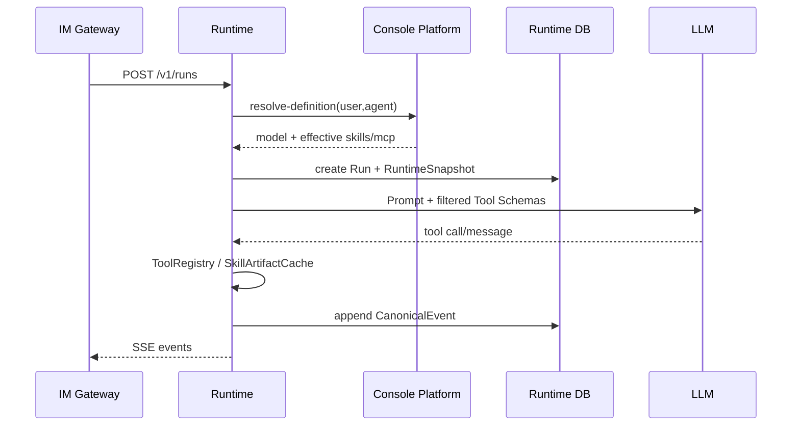
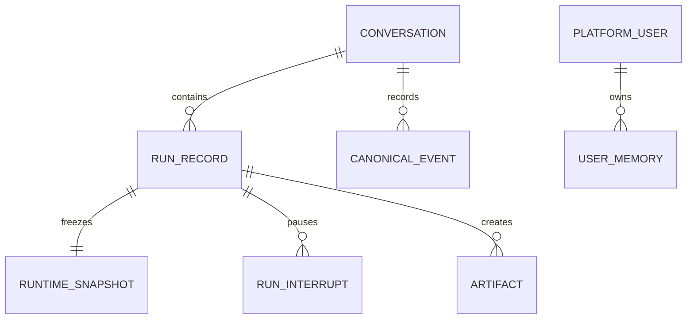

# Agent Runtime 执行引擎 模块需求与设计一体化文档

> **文档编号**: MOD-RUNTIME-V1.0  
> **文档版本**: v1.0  
> **创建日期**: 2026-09-17  
> **文档状态**: 设计评审中  
> **模板**: design-full.md


## 1. 文档控制

| 项目 | 内容 |
|---|---|
| 模块 | Agent Runtime 执行引擎 |
| Owner | muad-agent-runtime |
| 数据 Owner | runtime |
| 前置模块 | 01-platform-foundation, 02-user-identity, 03-model-management, 04-project-platform, 05-skill-management, 06-mcp-management, 07-agent-management |
| 建议代码位置 | apps/agent-runtime/src/muad_agent_runtime/；packages/agent-core/；packages/skill-sdk/；packages/platform-sdk/ |

## 2. 需求分析

### 2.1 需求概述

| 项目 | 内容 |
|---|---|
| 模块名称 | Agent Runtime 执行引擎 |
| 模块 ID | MOD-RUNTIME |
| 需求类型 | 中大型功能开发 |
| 业务背景 | 运行时必须与控制面解耦，不能把状态留在 Pod；授权要在 LLM 看到 Tool Schema 前过滤，Snapshot 后配置不得漂移。 |
| 核心目标 | 实现无状态 LangGraph Runtime：resolve-definition、Effective Capability、Snapshot、Prompt/Skill/Tool/MCP、Context/Memory、SSE、澄清与取消。 |

### 2.2 痛点与价值

| 维度 | 内容 |
|---|---|
| 目标用户/调用方 | Builder / Admin / End User / 内部服务（按模块实际入口） |
| 当前问题 | 运行时必须与控制面解耦，不能把状态留在 Pod；授权要在 LLM 看到 Tool Schema 前过滤，Snapshot 后配置不得漂移。 |
| 业务影响 | 模块边界或契约不固定会导致上层重复设计、接口漂移和跨模块返工。 |
| 预期价值 | 实现无状态 LangGraph Runtime：resolve-definition、Effective Capability、Snapshot、Prompt/Skill/Tool/MCP、Context/Memory、SSE、澄清与取消。 |

### 2.3 功能方案

| 功能ID | 功能名称 | 功能描述 | 优先级 | 来源 |
|---|---|---|---|---|
| FEAT-01 | Run 生命周期 | 创建/流式执行/resume/cancel + canonical event。 | P0 | 需求描述 |
| FEAT-02 | Effective Capability | resolve-definition 在 Prompt/ToolRegistry 前过滤 Skill/MCP。 | P0 | 需求描述 |
| FEAT-03 | RuntimeSnapshot | 冻结 Agent/Model/Skill/MCP/policy 版本。 | P0 | 需求描述 |
| FEAT-04 | Skill/Tool 执行 | lazy Artifact cache + ToolRegistry + Egress/Artifact。 | P0 | 需求描述 |
| FEAT-05 | Context/Memory | canonical history 与 LLM request context 分离，受控长期 Memory。 | P0 | 需求描述 |

#### 2.3.2 字段约束

| 字段类别 | 约束 |
|---|---|
| ID | 业务实体统一 UUID；跨 Owner Schema 仅逻辑引用 UUID |
| 时间 | PostgreSQL 使用 `timestamptz`；Console 展示 `YYYY-MM-DD HH:mm:ss` |
| 删除 | 产品表统一 `is_deleted` 软删除；状态枚举不重复表达 DELETED |
| Secret | 只保存 SecretRef；Secret Value 不进入 DB / Snapshot / 日志 / LLM |
| 枚举 | API 与 DB 统一使用稳定英文枚举值，中文/英文只在 UI/i18n 层映射 |
| 错误 | 业务代码只抛稳定 `code`；`msg/http_status` 由公共配置映射 |

### 2.4 范围与边界

| 类别 | 内容 |
|---|---|
| In Scope | Conversation/Run/Snapshot/Event/Interrupt/Memory/Artifact，SkillArtifactCache/Executor，PromptBuilder/ToolRegistry/MCP Adapter/ModelGateway。 |
| Out of Scope | 不做 Multi-Agent/Worktree；LangGraph checkpoint 不作为业务事实源；Pod 本地不保存权威会话/Memory |
| 技术债 | 无；不为未确认的未来能力增加兼容层 |

### 2.5 验收条件

#### 2.5.1 业务规则与约束

| ID | 类型 | 描述 | 验证场景 |
|---|---|---|---|
| RULE-01 | 系统约束 | 固定 4 个部署单元；Runtime/Worker 无状态横向扩展。 | S-01 / 对应 E- 场景 |
| RULE-02 | 系统约束 | JSON REST 统一 code/msg/data/trace_id/request_id/timestamp；业务只抛 code，msg/http_status 配置映射。 | S-01 / 对应 E- 场景 |
| RULE-03 | 系统约束 | 产品表统一 is_deleted/create_time/update_time；同 Owner Schema 物理 FK，跨 Owner Schema 逻辑 UUID。 | S-01 / 对应 E- 场景 |
| RULE-04 | 系统约束 | Secret Value 不进 DB/Snapshot/日志/LLM，只保存 SecretRef。 | S-01 / 对应 E- 场景 |
| RULE-05 | 系统约束 | User→Agent；Agent→Skill/MCP；SELECTED 再叠加资源用户 Grant；不建三元授权。 | S-01 / 对应 E- 场景 |
| RULE-06 | 系统约束 | NFS-backed RWX PVC 为 Artifact 权威源；Runtime/Worker emptyDir 本地 cache；禁止直接从 NFS 执行 Python。 | S-01 / 对应 E- 场景 |
| RULE-07 | 系统约束 | V1 仅 Streamable HTTP；Tool Catalog 持久化 PostgreSQL；Server 级用户范围，无 Tool 级授权/启停。 | S-01 / 对应 E- 场景 |
| RULE-08 | 系统约束 | 新 Run/Task 冻结 Snapshot；配置/授权变更只影响后续新 Run/Task。 | S-01 / 对应 E- 场景 |

#### 2.5.2 功能验收场景

##### 正常场景

| 场景ID | 功能ID | 测试层级 | 关键真实边界 | 归属 | 操作/前置 | 预期结果 |
|---|---|---|---|---|---|---|
| S-01 | FEAT-02 | E2E | Gateway→Runtime→resolve API→LLM | 本模块 | 用户仅有部分 SELECTED Skill 权限 | LLM catalog 完全不存在未授权能力 |
| S-02 | FEAT-03 | E2E | Runtime→DB Snapshot→LLM/Tool | 本模块 | Run 创建后管理员改 Agent/Grant | 当前 Run 继续原 Snapshot，新 Run 才看到变更 |
| S-03 | FEAT-04 | integration | emptyDir→NFS | 本模块 | 同 Pod 第二次执行同 checksum Skill | 命中 READY，不访问 NFS |

##### 异常场景

| 场景ID | 功能ID | 测试层级 | 关键真实边界 | 归属 | 触发条件 | 系统行为 |
|---|---|---|---|---|---|---|
| E-01 | FEAT-04 | integration | Runtime cache→NFS | 本模块 | cache miss 且 NFS 不可用 | 产生明确 Skill failure，不执行半成品 |
| E-02 | FEAT-01 | E2E | Gateway→Runtime cancel→DB | 本模块 | 用户 /stop | cancel_requested 生效，Run 最终 CANCELLED |

无可靠实测数据的性能阈值统一标记“待定”，不复制模板示例值。

## 3. 技术设计

### 3.1 技术选型与关键决策

| 决策 | 选择 | 放弃项 | 理由 |
|---|---|---|---|
| 执行框架 | LangGraph + PG Checkpointer | 自研状态机 | 保留 interrupt/checkpoint 能力 |
| 能力授权 | resolve-definition 前置过滤 | Tool 执行后 403 | 避免 schema 泄露和无效选择 |
| Skill 加载 | checksum lazy cache | 启动时全量下载 | 扩容成本低且按需 IO |

基础栈：Python >=3.12、FastAPI >=0.115、SQLAlchemy 2.x、PostgreSQL；按需 Redis/NFS/Secret Provider；统一 `muad-api` 与 `muad-logging`。

### 3.2 架构与流程



### 3.3 数据设计

#### `runtime.conversation`

**表说明**

- **用途**：逻辑 Agent 与用户之间的会话容器。
- **主要写入方**：Agent Runtime。
- **主要读取方**：Agent Runtime。
- **生命周期/边界**：跨 Pod；/new 创建新会话；不存 Pod 归属。

| 字段 | 类型 | 约束 | 说明 |
|---|---|---|---|
| `id` | uuid | PK | 主键 |
| `is_deleted` | boolean | NOT NULL DEFAULT false | 软删除 |
| `create_time` | timestamptz | NOT NULL DEFAULT now() | 创建时间 |
| `update_time` | timestamptz | NOT NULL DEFAULT now() | 更新时间 |
| `tenant_id` | varchar(64) | NOT NULL | 隔离键 |
| `user_id` | uuid | NOT NULL | PlatformUser |
| `agent_id` | uuid | NOT NULL | Agent |
| `title` | varchar(256) |  | 标题 |
| `status` | varchar(16) | NOT NULL DEFAULT 'ACTIVE' | ACTIVE/ARCHIVED |
| `last_seq` | bigint | NOT NULL DEFAULT 0 | Canonical Event 序号 |
| `last_run_id` | uuid |  | 最近 Run |

**索引/约束**：

- `INDEX (tenant_id, user_id, agent_id, update_time DESC)`

#### `runtime.run_record`

**表说明**

- **用途**：一次用户消息对应的一次 Agent 执行。
- **主要写入方**：Agent Runtime。
- **主要读取方**：Runtime/Admin。
- **生命周期/边界**：短时执行记录；Pod crash 不改变历史事实。

| 字段 | 类型 | 约束 | 说明 |
|---|---|---|---|
| `id` | uuid | PK | 主键 |
| `is_deleted` | boolean | NOT NULL DEFAULT false | 软删除 |
| `create_time` | timestamptz | NOT NULL DEFAULT now() | 创建时间 |
| `update_time` | timestamptz | NOT NULL DEFAULT now() | 更新时间 |
| `tenant_id` | varchar(64) | NOT NULL | 隔离键 |
| `conversation_id` | uuid | NOT NULL FK -> conversation.id | 会话 |
| `user_id` | uuid | NOT NULL | 执行用户 |
| `agent_id` | uuid | NOT NULL | Agent |
| `snapshot_id` | uuid |  | Snapshot |
| `status` | varchar(24) | NOT NULL | CREATED/RUNNING/WAITING_INPUT/COMPLETED/FAILED/CANCELLED |
| `input_text` | text | NOT NULL | 本轮用户输入 |
| `trace_id` | varchar(64) | NOT NULL | 全链路 Trace |
| `start_time` | timestamptz |  | 开始 |
| `end_time` | timestamptz |  | 结束 |
| `cancel_requested` | boolean | NOT NULL DEFAULT false | 取消标记 |
| `error_code` | varchar(64) |  | 错误码 |
| `error_message` | text |  | 错误摘要 |

**索引/约束**：

- `INDEX (conversation_id, create_time DESC)`
- `INDEX (agent_id, status, create_time DESC)`
- `INDEX (trace_id)`

#### `runtime.runtime_snapshot`

**表说明**

- **用途**：冻结本 Run 的 Agent/Model/Skill/MCP 版本投影。
- **主要写入方**：Agent Runtime Run 创建阶段。
- **主要读取方**：Runtime/Admin。
- **生命周期/边界**：Run 内不可变；不包含 Secret 和 Pod 信息。

| 字段 | 类型 | 约束 | 说明 |
|---|---|---|---|
| `id` | uuid | PK | 主键 |
| `is_deleted` | boolean | NOT NULL DEFAULT false | 软删除 |
| `create_time` | timestamptz | NOT NULL DEFAULT now() | 创建时间 |
| `update_time` | timestamptz | NOT NULL DEFAULT now() | 更新时间 |
| `tenant_id` | varchar(64) | NOT NULL | 隔离键 |
| `run_id` | uuid | NOT NULL UNIQUE | 对应 Run |
| `schema_version` | int | NOT NULL DEFAULT 1 | Snapshot JSON Schema 版本 |
| `agent_revision` | bigint | NOT NULL | Agent revision |
| `model_revision` | bigint | NOT NULL | Model revision |
| `agent_json` | jsonb | NOT NULL | 冻结 Agent 定义 |
| `model_json` | jsonb | NOT NULL | 冻结 Model 非 secret 定义 |
| `skill_catalog_json` | jsonb | NOT NULL | Skill ID/version/checksum/catalog |
| `mcp_catalog_json` | jsonb | NOT NULL | MCP endpoint/tool schema snapshot |
| `policy_json` | jsonb | NOT NULL DEFAULT '{}' | 预算/策略快照 |
| `content_hash` | varchar(128) | NOT NULL | 快照哈希 |

**索引/约束**：

- `UNIQUE (run_id)`
- `INDEX (content_hash)`

#### `runtime.canonical_event`

**表说明**

- **用途**：会话真实发生的不可变事件日志。
- **主要写入方**：Agent Runtime EventWriter。
- **主要读取方**：ContextBuilder/Admin。
- **生命周期/边界**：append-only；上下文裁剪不得修改。

| 字段 | 类型 | 约束 | 说明 |
|---|---|---|---|
| `id` | uuid | PK | 主键 |
| `is_deleted` | boolean | NOT NULL DEFAULT false | 软删除 |
| `create_time` | timestamptz | NOT NULL DEFAULT now() | 创建时间 |
| `update_time` | timestamptz | NOT NULL DEFAULT now() | 更新时间 |
| `tenant_id` | varchar(64) | NOT NULL | 隔离键 |
| `conversation_id` | uuid | NOT NULL | 会话 |
| `run_id` | uuid |  | 所属 Run |
| `seq` | bigint | NOT NULL | Conversation 单调序号 |
| `event_type` | varchar(64) | NOT NULL | USER_MESSAGE/ASSISTANT_MESSAGE/TOOL_CALL/... |
| `payload_json` | jsonb | NOT NULL | 事件负载 |
| `artifact_id` | uuid |  | 大结果引用 |

**索引/约束**：

- `UNIQUE (conversation_id, seq)`
- `INDEX (run_id, seq)`
- `INDEX (conversation_id, create_time)`

#### `runtime.user_memory`

**表说明**

- **用途**：跨 Conversation 的长期用户上下文，不存实时业务事实。
- **主要写入方**：受控 Memory Writer/Console。
- **主要读取方**：ContextBuilder/Console。
- **生命周期/边界**：按 tenant+user 隔离；可查看/清理。

| 字段 | 类型 | 约束 | 说明 |
|---|---|---|---|
| `id` | uuid | PK | 主键 |
| `is_deleted` | boolean | NOT NULL DEFAULT false | 软删除 |
| `create_time` | timestamptz | NOT NULL DEFAULT now() | 创建时间 |
| `update_time` | timestamptz | NOT NULL DEFAULT now() | 更新时间 |
| `tenant_id` | varchar(64) | NOT NULL | 隔离键 |
| `user_id` | uuid | NOT NULL | 用户 |
| `memory_key` | varchar(128) | NOT NULL | 稳定 key |
| `category` | varchar(64) | NOT NULL | PREFERENCE/WORK_STYLE/EXPLICIT |
| `content_json` | jsonb | NOT NULL | 记忆内容 |
| `source_type` | varchar(32) | NOT NULL | USER_EXPLICIT/RUNTIME |
| `source_ref` | varchar(256) |  | 来源 Run/Event |
| `write_policy` | varchar(32) | NOT NULL DEFAULT 'CONTROLLED' | 写入策略 |
| `version` | bigint | NOT NULL DEFAULT 1 | 版本 |
| `enabled` | boolean | NOT NULL DEFAULT true | 是否使用 |

**索引/约束**：

- `UNIQUE (tenant_id, user_id, memory_key) WHERE is_deleted=false`
- `INDEX (user_id, enabled, update_time DESC)`

#### `runtime.artifact`

**表说明**

- **用途**：报告、大 Tool 结果、结构化产物的外部对象引用。
- **主要写入方**：Agent Runtime、Agent Worker（通过共享 Artifact Port）。
- **主要读取方**：ContextBuilder、Agent Worker、Console。
- **生命周期/边界**：内容在 Artifact Store（V1=NFS-backed RWX PVC），DB 只存 storage_key 和元数据；Run Artifact 与 Task Artifact 使用同一表，通过 run_id/task_id 区分。

| 字段 | 类型 | 约束 | 说明 |
|---|---|---|---|
| `id` | uuid | PK | 主键 |
| `is_deleted` | boolean | NOT NULL DEFAULT false | 软删除 |
| `create_time` | timestamptz | NOT NULL DEFAULT now() | 创建时间 |
| `update_time` | timestamptz | NOT NULL DEFAULT now() | 更新时间 |
| `tenant_id` | varchar(64) | NOT NULL | 隔离键 |
| `run_id` | uuid |  | 实时 Run；与 task_id 二选一 |
| `task_id` | uuid |  | 后台 Task；与 run_id 二选一 |
| `conversation_id` | uuid |  | 实时会话；定时任务产物可为空 |
| `artifact_type` | varchar(64) | NOT NULL | TOOL_RESULT/REPORT/FILE/... |
| `storage_key` | text | NOT NULL | Artifact Store 相对键 |
| `media_type` | varchar(128) | NOT NULL | MIME |
| `size` | bigint | NOT NULL | 字节 |
| `checksum` | varchar(128) | NOT NULL | 校验 |
| `preview_text` | text |  | LLM/用户预览 |
| `metadata_json` | jsonb | NOT NULL DEFAULT '{}' | 元数据 |

**索引/约束**：

- `CHECK ((run_id IS NOT NULL) <> (task_id IS NOT NULL))`
- `INDEX (run_id, create_time) WHERE run_id IS NOT NULL`
- `INDEX (task_id, create_time) WHERE task_id IS NOT NULL`
- `INDEX (conversation_id, create_time) WHERE conversation_id IS NOT NULL`

#### `runtime.run_interrupt`

**表说明**

- **用途**：会话内澄清/确认产生的暂停点。
- **主要写入方**：LangGraph/Runtime。
- **主要读取方**：resume API/Gateway/Admin。
- **生命周期/边界**：Phase 1 仅短时会话内等待，不等同 durable human task。

| 字段 | 类型 | 约束 | 说明 |
|---|---|---|---|
| `id` | uuid | PK | 主键 |
| `is_deleted` | boolean | NOT NULL DEFAULT false | 软删除 |
| `create_time` | timestamptz | NOT NULL DEFAULT now() | 创建时间 |
| `update_time` | timestamptz | NOT NULL DEFAULT now() | 更新时间 |
| `tenant_id` | varchar(64) | NOT NULL | 隔离键 |
| `run_id` | uuid | NOT NULL | Run |
| `conversation_id` | uuid | NOT NULL | 会话 |
| `interrupt_type` | varchar(32) | NOT NULL | CLARIFY/CONFIRM/PERMISSION |
| `prompt_text` | text | NOT NULL | 向用户展示的问题 |
| `options_json` | jsonb | NOT NULL DEFAULT '[]' | 可选项 |
| `status` | varchar(16) | NOT NULL DEFAULT 'WAITING' | WAITING/RESOLVED/CANCELLED |
| `resolution_json` | jsonb |  | 用户输入/选择 |
| `expires_at` | timestamptz |  | 可选过期 |
| `resolved_at` | timestamptz |  | 恢复时间 |

**索引/约束**：

- `INDEX (run_id, status)`
- `INDEX (conversation_id, status)`

**ER 图**



数据库规则：所有产品表统一 `id/is_deleted/create_time/update_time`；同 Owner Schema 物理 FK，跨 Owner Schema 逻辑 UUID；迁移使用 Alembic expand→deploy→contract。

### 3.4 接口设计

```json
{
  "code":"0",
  "msg":"成功",
  "data":{},
  "trace_id":"trace-id",
  "request_id":"request-id",
  "timestamp":"2026-09-17T17:00:00+08:00"
}
```

业务异常只允许 `raise AppError("CODE")`；msg 与 HTTP Status 统一由 `config/api-messages.yaml` 映射。

| 接口ID | 名称 | 方法 | 路径 | FEAT |
|---|---|---|---|---|
| API-01 | 创建 Run | POST | `/v1/runs` | FEAT-01 |
| API-02 | Resume Run | POST | `/v1/runs/{run_id}/resume` | FEAT-01 |
| API-03 | Cancel Run | POST | `/v1/runs/{run_id}/cancel` | FEAT-01 |
| API-04 | 创建 Conversation | POST | `/v1/conversations` | FEAT-01 |
| API-05 | Resolve Definition | POST | `/internal/runtime/resolve-definition` | FEAT-02 |
| API-06 | Resolve Egress | POST | `/internal/runtime/resolve-egress-access` | FEAT-04 |

| 函数ID | 签名 | 用途 | 错误码 | FEAT |\n|---|---|---|---|---|\n| LIB-01 | `AgentRunner.run(request) -> AsyncIterator[RunEvent]` | 运行 Agent | `RUN_FAILED` | FEAT-01 |
| LIB-02 | `PromptBuilder.build(snapshot, context) -> messages` | 构建 System Prompt 和上下文 | `PROMPT_BUILD_FAILED` | FEAT-03 |
| LIB-03 | `SkillArtifactCache.ensure(...) -> Path` | lazy prepare Skill | `SKILL_ARTIFACT_UNAVAILABLE` | FEAT-04 |
| LIB-04 | `ToolRegistry.execute(prepared_call) -> ToolResult` | 统一 builtin/skill/mcp 执行与审计 | `TOOL_FAILED / TOOL_DENIED` | FEAT-04 |

#### API-01 创建 Run

```text
POST /v1/runs
```

- 请求：agent_id/platform_user_id/conversation_id?/channel/message。
- `data`：SSE：run.created/message.delta/tool/task/interrupt/run.completed；不使用 JSON Envelope。
- 错误码：`COMMON_VALIDATION_ERROR / COMMON_INTERNAL_ERROR`
- 处理：

#### API-02 Resume Run

```text
POST /v1/runs/{run_id}/resume
```

- 请求：澄清/确认输入。
- `data`：
- 错误码：`COMMON_VALIDATION_ERROR / COMMON_INTERNAL_ERROR`
- 处理：

#### API-03 Cancel Run

```text
POST /v1/runs/{run_id}/cancel
```

- 请求：
- `data`：
- 错误码：`COMMON_VALIDATION_ERROR / COMMON_INTERNAL_ERROR`
- 处理：

#### API-04 创建 Conversation

```text
POST /v1/conversations
```

- 请求：
- `data`：
- 错误码：`COMMON_VALIDATION_ERROR / COMMON_INTERNAL_ERROR`
- 处理：

#### API-05 Resolve Definition

```text
POST /internal/runtime/resolve-definition
```

- 请求：agent_id/platform_user_id。
- `data`：Agent revision + Model + Effective Skill/MCP。
- 错误码：`COMMON_VALIDATION_ERROR / COMMON_INTERNAL_ERROR`
- 处理：

#### API-06 Resolve Egress

```text
POST /internal/runtime/resolve-egress-access
```

- 请求：actor_user_id/execution_ref(type=RUN)/skill_artifact_id/platform_key/target。
- `data`：
- 错误码：`COMMON_VALIDATION_ERROR / COMMON_INTERNAL_ERROR`
- 处理：


### 3.5 质量实现方案

- 性能：批量/聚合优先，列表禁止 N+1，真实目标待基线压测后确定。
- 可靠性：事务只覆盖原子 DB 操作；外部 IO 不包长事务；高影响错误必须有 E-/B- 验收。
- 安全：Secret/Token/Cookie 不进业务 DB、日志、Snapshot、LLM。
- 可观测：统一 JSON 日志，自动带 service/trace_id/request_id；状态变化可关联 trace_id。


## 4. 部署与运维

本模块随 `muad-agent-runtime` 对应镜像/共享 package 发布；PostgreSQL、Redis、NFS、Secret Provider 外置。监控阈值待真实基线确定。

## 5. 风险与依赖

- 前置：01-platform-foundation, 02-user-identity, 03-model-management, 04-project-platform, 05-skill-management, 06-mcp-management, 07-agent-management。
- 主要风险：未授权 Tool Schema 泄露给 LLM；必须在 PromptBuilder/ToolRegistry 前过滤。。
- 应对：Contract Test + S/E/B 验收 + Spec Matrix。

## 6. 需求追溯矩阵

| 用户故事 | 功能ID | 接口ID | 测试用例ID | 测试层级 | 状态 |
|---|---|---|---|---|---|
| 需求描述 | FEAT-01 | API-01, API-02, API-03, API-04, LIB-01 | E-02 | E2E | 待实现 |
| 需求描述 | FEAT-02 | API-05 | S-01 | E2E | 待实现 |
| 需求描述 | FEAT-03 | LIB-02 | S-02 | E2E | 待实现 |
| 需求描述 | FEAT-04 | API-06, LIB-03, LIB-04 | S-03, E-01 | integration | 待实现 |
| 需求描述 | FEAT-05 | - |  | integration | 待实现 |

## Spec Compliance Matrix

| Spec/Rule | enforcement | 设计影响 | 设计落点 | 验证场景 | 状态/N/A 理由 |
|---|---|---|---|---|---|
| `mss-platform#RULE-ARCH-001` | required | 固定 4 个部署单元；Runtime/Worker 无状态横向扩展。 | §3.2/§3.3/§3.4 | S-01 + verifier | applied |
| `mss-platform#RULE-API-001` | required | JSON REST 统一 code/msg/data/trace_id/request_id/timestamp；业务只抛 code，msg/http_status 配置映射。 | §3.2/§3.3/§3.4 | S-01 + verifier | applied |
| `mss-platform#RULE-DATA-001` | required | 产品表统一 is_deleted/create_time/update_time；同 Owner Schema 物理 FK，跨 Owner Schema 逻辑 UUID。 | §3.2/§3.3/§3.4 | S-01 + verifier | applied |
| `mss-platform#RULE-SECRET-001` | required | Secret Value 不进 DB/Snapshot/日志/LLM，只保存 SecretRef。 | §3.2/§3.3/§3.4 | S-01 + verifier | applied |
| `mss-platform#RULE-AUTH-001` | required | User→Agent；Agent→Skill/MCP；SELECTED 再叠加资源用户 Grant；不建三元授权。 | §3.2/§3.3/§3.4 | S-01 + verifier | applied |
| `mss-platform#RULE-SKILL-001` | required | NFS-backed RWX PVC 为 Artifact 权威源；Runtime/Worker emptyDir 本地 cache；禁止直接从 NFS 执行 Python。 | §3.2/§3.3/§3.4 | S-01 + verifier | applied |
| `mss-platform#RULE-MCP-001` | required | V1 仅 Streamable HTTP；Tool Catalog 持久化 PostgreSQL；Server 级用户范围，无 Tool 级授权/启停。 | §3.2/§3.3/§3.4 | S-01 + verifier | applied |
| `mss-platform#RULE-SNAPSHOT-001` | required | 新 Run/Task 冻结 Snapshot；配置/授权变更只影响后续新 Run/Task。 | §3.2/§3.3/§3.4 | S-01 + verifier | applied |
| `mss-platform#RULE-PLATFORM-001` | required | ProjectPlatform + PlatformAdapter + CredentialRef + Redis Session；换 Adapter 使旧凭据/Session 失效。 | §3.2/§3.3/§3.4 | S-01 + verifier | applied |
| `mss-platform#RULE-TEST-001` | required | 跨 API/DB/Runtime/Browser 的关键流程必须 E2E，列出不得 mock 的真实边界。 | §3.2/§3.3/§3.4 | S-01 + verifier | applied |
