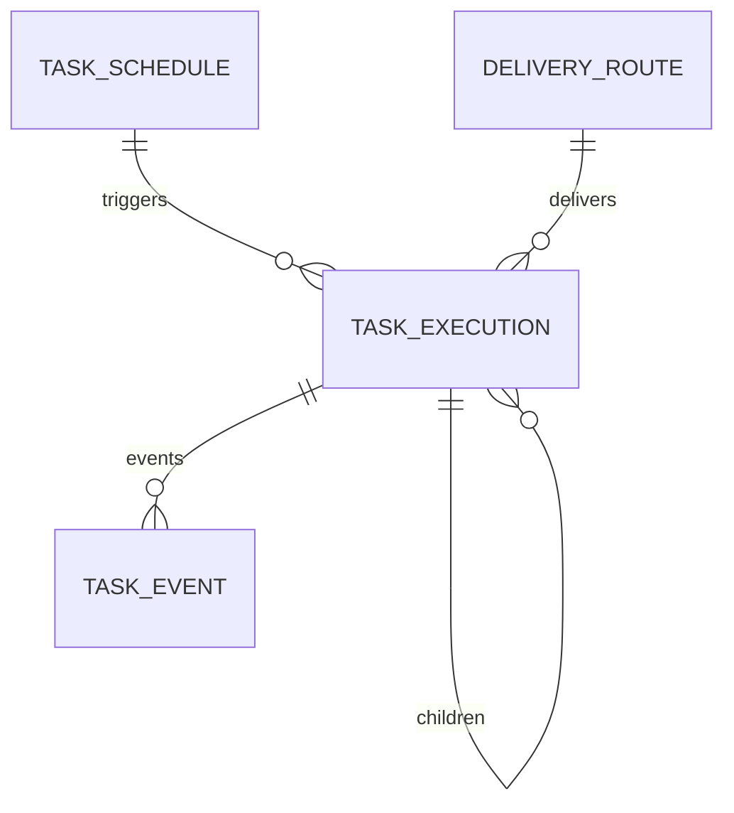

# 后台任务、调度与可靠执行 模块需求与设计一体化文档

> **文档编号**: MOD-TASK-V1.1
> **文档版本**: v1.1
> **创建日期**: 2026-09-17
> **文档状态**: 设计评审中
> **模板**: design-full.md

**评审边界说明**:
- **需求评审**: 第 2 章（需求分析）→ 通过后锁定为需求基线 v1.0
- **设计评审**: 第 3-4 章（技术设计 + 部署运维）→ 通过后锁定设计基线 v1.x
- **交接契约**: 2.5 验收条件 — 需求定义 What，设计实现 How

**ID 体系**: FEAT（功能）、API（接口）、RULE（业务规则/系统约束）；场景编号 S-（正常）、E-（异常）。

## 1. 文档控制

### 1.1 责任人

| 角色 | 姓名 | 职责范围 |
|---|---|---|
| 产品经理 | 待定 | 需求定义、业务验收 |
| 开发负责人 | muad-agent-worker | 技术方案、代码实现 |
| 测试负责人 | 待定 | 测试策略、质量保证 |
| 架构师（如有） | 待定 | 架构审核、技术决策 |

### 1.2 修订历史

| 版本 | 日期 | 作者 | 变更描述 |
|---|---|---|---|
| v1.0 | 2026-09-17 | muad-agent-worker | 初始设计 |
| v1.1 | 2026-09-18 | muad-agent-worker | 对齐 V1.4 决策（docs/17）：删除 `misfire_policy`（V1 仅 SKIP）；`deadline_at` NOT NULL 默认 +24h + Scheduler 30s sweep；`task_execution` 增 `item_key/delivery_key/delivery_attempts/delivered_at`；`delivery_route` 增 `route_hash`；claim/reclaim/cancel 与 docs/02 §6.1 对齐；补全内部 API；删除与模块 08 重复的 Run/授权/Conversation/Snapshot 内容 |

## 2. 需求分析

### 2.1 需求概述

| 项目 | 内容 |
|---|---|
| 模块名称 | 后台任务、调度与可靠执行 |
| 前置模块 | 01-platform-foundation, 02-user-identity, 07-agent-management |
| 模块 ID | MOD-TASK |
| 需求类型 | 中大型功能开发 |
| 业务背景 | 长任务、用户离开和定时触发不能依赖 Runtime 进程，需要幂等、lease、retry、cancel 和最终主动投递。 |
| 核心目标 | 可靠执行异步/定时/批量任务，以 PostgreSQL 保存任务、调度和 lease 权威状态，Worker 无状态横向扩展。 |

### 2.2 痛点与价值

| 维度 | 内容 |
|---|---|
| 目标用户/调用方 | Builder / Admin / End User / 内部服务（按模块实际入口） |
| 当前问题 | 长任务、用户离开和定时触发不能依赖 Runtime 进程，需要幂等、lease、retry、cancel 和最终主动投递。 |
| 业务影响 | 模块边界或契约不固定会导致上层重复设计、接口漂移和跨模块返工。 |
| 预期价值 | 可靠执行异步/定时/批量任务，以 PostgreSQL 保存任务、调度和 lease 权威状态，Worker 无状态横向扩展。 |

### 2.3 功能方案

#### 2.3.1 功能清单

| 功能ID | 功能名称 | 功能描述 | 优先级 | 来源 |
|---|---|---|---|---|
| FEAT-01 | Durable Task | IMMEDIATE ASYNC/SCHEDULED Task 创建、执行、查询、取消。 | P0 | 需求描述 |
| FEAT-02 | Lease/Retry | claim/heartbeat/reclaim + idempotency + retry。 | P0 | 需求描述 |
| FEAT-03 | Schedule | CRON/ONCE；触发时重新校验权限/Binding并生成新 Snapshot。 | P0 | 需求描述 |
| FEAT-04 | Final Delivery | 完成后使用 DeliveryRoute 通过 IM Gateway 主动投递最终结果。 | P0 | 需求描述 |

#### 2.3.2 字段约束

| 字段类别 | 约束 |
|---|---|
| ID | 业务实体统一 UUID；跨 Owner Schema 仅逻辑引用 UUID |
| 时间 | PostgreSQL 使用 `timestamptz`；Console 展示 `YYYY-MM-DD HH:mm:ss` |
| 删除 | 产品表统一 `is_deleted` 软删除；状态枚举不重复表达 DELETED |
| Secret | 只保存 SecretRef；Secret Value 不进入 DB / Snapshot / 日志 / LLM |
| 枚举 | API 与 DB 统一使用稳定英文枚举值，中文/英文只在 UI/i18n 层映射 |
| 错误 | 业务代码只抛稳定 `code`；`msg/http_status` 由公共配置映射 |

### 2.4 范围与边界

| 类别 | 内容 |
|---|---|
| In Scope | TaskExecution/TaskEvent/Schedule/DeliveryRoute、claim/lease/heartbeat/reclaim、retry、fan-out/fan-in、cancel、deadline、final delivery。 |
| Out of Scope | `task_type` 仅 `SKILL/BATCH`（无 EXTERNAL/AGENT_STEP）；Schedule 错过触发仅 SKIP（无补发/FIRE_ONCE/`misfire_policy`）；Redis 不作权威队列；Console 不编辑任务输入/编排 DAG。 |
| 前置假设 | 01-platform-foundation、05-skill-management、07-agent-management、08-runtime-execution 提供 Definition Resolve、Artifact Store 与 IM Gateway 投递契约。 |
| 有意妥协 / 技术债 | 无；不为未确认的未来能力增加兼容层。 |

### 2.5 验收条件

#### 2.5.1 业务规则与约束

| ID | 类型 | 描述 | 验证场景 |
|---|---|---|---|
| RULE-01 | 系统约束 | 固定 4 个部署单元；Runtime/Worker 无状态横向扩展，Task 不绑定 Pod。 | S-01 |
| RULE-02 | 系统约束 | JSON REST 统一 code/msg/data/trace_id/request_id/timestamp；业务只抛 code，msg/http_status 配置映射。 | S-01 / E-01 |
| RULE-03 | 系统约束 | 产品表统一 is_deleted/create_time/update_time；同 Owner Schema 物理 FK，跨 Owner Schema 逻辑 UUID。 | S-01 |
| RULE-04 | 系统约束 | Secret Value 不进 DB/Snapshot/日志/LLM，只保存 SecretRef。 | S-01 |
| RULE-05 | 系统约束 | 新 Run/Task 冻结 Snapshot；配置/授权变更只影响后续新 Run/Task。 | S-02 |
| RULE-06 | 系统约束 | PG 是 Task/Schedule/lease 权威源；Redis 仅 hint；TaskType V1=SKILL/BATCH。 | S-01 / E-01 |
| RULE-07 | 系统约束 | NFS-backed RWX PVC 为 Artifact 权威源；Runtime/Worker emptyDir 本地 cache；禁止直接从 NFS 执行 Python。 | S-01 |
| RULE-08 | 系统约束 | Agent 0..N bot_id；bot_id 只指向一个 Agent；不绑定 Runtime Pod。 | S-03 |
| RULE-09 | 系统约束 | claim 条件 `status IN ('QUEUED','WAITING') AND not_before <= now() AND cancel_requested=false`，`FOR UPDATE SKIP LOCKED`；进入 WAITING 释放 lease；reclaim 仅 `status='RUNNING'`。 | S-01 / E-01 |
| RULE-10 | 系统约束 | `deadline_at` NOT NULL 默认 `now() + interval '24 hours'`；Scheduler 每 30s 将过期非终态 Task CAS 为 `FAILED(TASK_DEADLINE_EXCEEDED)`，终态仍按 `delivery_mode` 投递。 | E-03 |
| RULE-11 | 业务规则 | Schedule 错过触发 V1 仅 SKIP（不补发），无 `misfire_policy` 字段/API/metric label；跳过记审计并累加 `scheduled_misfire_total`；ONCE 触发成功后 `status=COMPLETED`、写 `completed_at`。 | E-04 |
| RULE-12 | 业务规则 | fan-out Child 幂等键 `parent:{parent_id}:{item_key}`，唯一约束 `(parent_id, item_key)`；fan-in 原子检查兄弟终态并 CAS 完成/唤醒 Parent。 | S-04 |
| RULE-13 | 业务规则 | Final Delivery at-least-once：`delivery_key=task:{id}:final`；Gateway 以 Redis `delivery:dedupe:{delivery_key}` SET NX EX 7d 去重；Worker 指数退避最多 5 次。 | S-03 / E-05 |
| RULE-14 | 系统约束 | `/api/v1/*` 为 Console 面向 API（Console Platform 拥有）；Worker 只提供 `/internal/tasks*`、`/internal/schedules*`（Runtime）与 `/internal/admin/*`（Console 管理）内部接口。 | S-01 |

#### 2.5.2 功能验收场景

##### 正常场景

| 场景ID | 功能ID | 测试层级 | 关键真实边界 | 归属 | 操作/前置 | 预期结果 |
|---|---|---|---|---|---|---|
| S-01 | FEAT-01 | E2E | Runtime→Worker API→PG→Worker | 本模块 | Runtime 提交 ASYNC Skill | Task QUEUED 后被任意 Worker claim，最终 COMPLETED |
| S-02 | FEAT-03 | E2E | Scheduler→current grants/artifact→Task DB | 本模块 | CRON 到期 | 重新校验权限/Binding，读取 current Artifact，生成新 Task Snapshot |
| S-03 | FEAT-04 | E2E | Worker→IM Gateway | 本模块 | FINAL_ONLY Task 完成 | 主动投递最终结果并记录 SENT |
| S-04 | FEAT-01 | E2E | Worker→Task DB→IM Gateway | 本模块 | Parent BATCH fan-out 多个 Child | Child 幂等创建，全部终态后原子 fan-in，Parent 终态并按 delivery_mode 投递一次 |

##### 异常场景

| 场景ID | 功能ID | 测试层级 | 关键真实边界 | 归属 | 触发条件 | 系统行为 |
|---|---|---|---|---|---|---|
| E-01 | FEAT-02 | integration | PG lease | 本模块 | Worker crash lease 到期 | 其他 Worker reclaim，副作用由 idempotency_key 防重 |
| E-02 | FEAT-03 | integration | Schedule trigger auth | 本模块 | 触发时用户/Binding 已撤销 | 不创建可执行 Snapshot，记录明确失败/跳过原因 |
| E-03 | FEAT-01 | integration | Scheduler→Task DB→IM Gateway | 本模块 | Task 超过 deadline 仍非终态 | Scheduler 每 30s CAS 置 FAILED(TASK_DEADLINE_EXCEEDED)，仍按 delivery_mode 投递 |
| E-04 | FEAT-03 | integration | Scheduler→PG→审计/metric | 本模块 | Schedule 错过触发时间 | 不补发，记审计事件并累加 scheduled_misfire_total |
| E-05 | FEAT-04 | integration | Worker→IM Gateway Redis 去重 | 本模块 | 同一 delivery_key 重复投递 | Gateway 返回 200 不重复发送；Worker 最多退避重试 5 次，超过置 FAILED |
| E-06 | FEAT-01 | integration | PG CAS | 本模块 | 取消 QUEUED/WAITING Task | CAS 直接置 CANCELLED；RUNNING 走协作取消 |

无可靠实测数据的性能阈值统一标记“待定”，不复制模板示例值。

## 3. 技术设计

### 3.1 技术选型与关键决策

| 决策 | 选择 | 放弃项 | 理由 |
|---|---|---|---|
| Task 权威源 | PostgreSQL | Redis Queue 为唯一事实源 | Worker crash 后可 reclaim |
| Redis | wakeup/cancel hint、delivery 去重 | 任务状态存 Redis | 丢 Redis 不丢任务；at-least-once + 幂等键兜底 |
| TaskType | SKILL/BATCH | EXTERNAL/AGENT_STEP | V1 当前用例不需要额外类型 |
| Task Deadline | `deadline_at` NOT NULL 默认 +24h + Scheduler 30s sweep | 无截止无限等待 | 防止僵尸 Task 永久占用 Worker |
| Misfire | 仅 SKIP | FIRE_ONCE/补偿 | V1 不补发，避免重复外部副作用 |
| Final Delivery | `delivery_key` + Gateway Redis SET NX EX 7d | 终态直接发送无幂等 | 至少一次投递 + 去重 |
| Schedule 触发 | DB claim + `schedule:{schedule_id}:{scheduled_fire_time}` 幂等 | 依赖 Scheduler 单副本 | Scheduler 可随 Worker 横向扩展 |

基础栈：Python >=3.12、FastAPI >=0.115、SQLAlchemy 2.x、PostgreSQL；按需 Redis/NFS/Secret Provider；统一 `muad-api` 与 `muad-logging`。

### 3.2 架构与流程

#### 3.2.1 执行主流程

```mermaid
flowchart TD
    SUB["Create Task"] --> Q["QUEUED"]
    Q --> CLAIM["Claim: QUEUED/WAITING + not_before <= now() + cancel_requested=false"]
    CLAIM --> RUN["RUNNING + lease"]
    RUN --> END{"执行结果"}
    END -->|done| DONE["COMPLETED"]
    END -->|external wait / retry wait| WAIT["WAITING + not_before（释放 lease）"]
    WAIT --> CLAIM
    END -->|retryable| RETRY["QUEUED + backoff"]
    RETRY --> CLAIM
    END -->|attempts exhausted| FAIL["FAILED"]
    Q -.->|deadline| DEAD["Scheduler sweep 每 30s"]
    WAIT -.->|deadline| DEAD
    RUN -.->|deadline| DEAD
    DEAD -.->|CAS| DEADFAIL["FAILED(TASK_DEADLINE_EXCEEDED)"]
    DONE --> DEL["Final Delivery"]
    FAIL --> DEL
    DEADFAIL --> DEL
```

- claim 使用 `FOR UPDATE SKIP LOCKED`；reclaim 仅针对 lease 过期且仍为 `RUNNING` 的 Task，置回 `QUEUED` 并保留 `attempt`；
- 进入 `WAITING` 时清空 `lease_owner/lease_until`；claim/reclaim 始终排除 `cancel_requested=true`；
- 所有终态写入必须 CAS；终态（含 deadline 命中）按 `delivery_mode` 由 Final Delivery 投递一次。

#### 3.2.2 Task 状态机

与 `docs/02 §6.1`、`docs/08 §18` 完全一致：

```mermaid
stateDiagram-v2
    [*] --> QUEUED
    QUEUED --> RUNNING: claim
    RUNNING --> WAITING: external wait / retry wait（释放 lease）
    WAITING --> RUNNING: due claim
    RUNNING --> QUEUED: retry / reclaim
    RUNNING --> COMPLETED
    RUNNING --> FAILED: attempts exhausted / deadline
    QUEUED --> FAILED: deadline
    WAITING --> FAILED: deadline
    QUEUED --> CANCELLED: cancel CAS
    WAITING --> CANCELLED: cancel CAS
    RUNNING --> CANCELLED: cooperative cancel
    COMPLETED --> [*]
    FAILED --> [*]
    CANCELLED --> [*]
```

**图说明**：

- 状态属于 TaskExecution，不属于 Worker Pod；
- `RUNNING` 必须持有有效 lease；进入 `WAITING` 时释放 lease；
- claim 条件：`status IN ('QUEUED','WAITING') AND not_before <= now() AND cancel_requested = false`；reclaim 条件：`status = 'RUNNING' AND lease_until < now() AND cancel_requested = false`（置回 QUEUED，保留 attempts）；
- 取消：`QUEUED/WAITING` 用 CAS 直接置 `CANCELLED`；`RUNNING` 协作取消；
- deadline 到期：Scheduler sweep 将非终态 Task CAS 置 `FAILED(TASK_DEADLINE_EXCEEDED)`；
- 外部异步任务可用 `WAITING + not_before` 表达下一次轮询时间；
- Parent Batch Task 只有在所有 Child 进入终态并完成 fan-in 后才进入自身终态；
- 终态（含 FAILED）按 `delivery_mode` 执行 Final Delivery，`delivery_key` 保证不重复投递。

#### 3.2.3 Schedule 触发、多副本与 Misfire

Scheduler 随 Worker 横向扩展，通过数据库 claim 保证同一 `schedule_id + scheduled_fire_time` 只生成一次 Task：

```sql
SELECT id FROM task.task_schedule
WHERE status = 'ACTIVE' AND next_fire_at <= now() AND is_deleted = false
ORDER BY next_fire_at ASC
FOR UPDATE SKIP LOCKED
LIMIT :n;
```

每次触发：

```text
claim schedule
 -> revalidate Effective Capability（POST /internal/runtime/resolve-definition）
 -> resolve Agent Binding / Skill user_scope + grant
 -> resolve current Skill artifact
 -> create TaskExecution + execution snapshot
    idempotency_key = schedule:{schedule_id}:{scheduled_fire_time}
 -> ONCE: status=COMPLETED, completed_at=now(), next_fire_at 不适用
    非 ONCE: update next_fire_at
```

- 触发时授权不满足 → 不创建可执行 Task，记审计事件与失败原因（fail closed）；
- **Misfire**：V1 唯一策略为 `SKIP`，错过的触发不补发；不存在 `misfire_policy` 字段/API/metric label。每次跳过记录审计事件（`schedule_id/scheduled_fire_time/skipped_at`）并累加 `scheduled_misfire_total`；
- `ONCE` 成功创建唯一 TaskExecution 后进入 `COMPLETED`，写 `completed_at`，不再计算 `next_fire_at`。

#### 3.2.4 Fan-out / Fan-in

- Parent 在事务内创建 Child：`root_id=parent.root_id`、`parent_id=parent.id`、`idempotency_key=parent:{parent_id}:{item_key}`，唯一约束 `(parent_id, item_key) WHERE parent_id IS NOT NULL AND is_deleted=false` 保证同一 Child 只创建一次；
- Parent reclaim 后如已有 Child，继续等待/聚合，不重复 fan-out；
- Parent 可转为 `WAITING`（不占 Worker 线程）；Child 进入终态时在同一事务内原子检查兄弟终态计数，满足 `aggregate_mode` 后 CAS 完成/唤醒 Parent，不依赖 Redis wake-up 时序；
- 聚合条件：`ALL` = 所有 Child 成功；`BEST_EFFORT` = 所有 Child 终态，允许部分失败，Parent 仍 `COMPLETED` 且结果标注成功/失败数量；
- Parent 与 Child 共享同一 `intent_key`；并发上限取 `min(TaskPlan.max_concurrency, system_max, platform_limit)`。

#### 3.2.5 Final Delivery

```text
persist result
 -> CAS task status terminal
 -> POST /internal/deliveries（携带 delivery_key）
 -> update delivery_status / delivery_attempts / delivered_at
```

- **Worker 分工**：终态后先持久化结果，再调用 IM Gateway；失败按指数退避重试，最多 5 次，超过置 `delivery_status=FAILED` 并写审计；
- **Gateway 分工**：只做渠道发送，不重新做 Agent reasoning；以 Redis `delivery:dedupe:{delivery_key}` `SET NX EX 7d` 去重，重复请求直接返回 200；
- Redis 不可用时按 at-least-once 发送，由 `delivery_key` 去重兜底；
- `delivery_mode=NONE` 不投递，`delivery_status=NONE`；
- 顺序要求：**先持久化最终结果，再发送消息**。

#### 3.2.6 跨模块引用边界

- Effective Capability 判定公式：唯一版本见 `docs/02 §5.10`、`docs/14`、模块 07；本模块每次 Schedule 触发经 `POST /internal/runtime/resolve-definition` 重新校验（`docs/07 §6`）。触发时校验口径（与 `docs/02 §5.10` 一致）：

```text
EffectiveSkill(user, agent, skill) =
  AgentAccessGrant(user, agent).is_deleted = false
  AND Agent.enabled = true
  AND AgentSkillBinding(agent, skill).is_deleted = false
  AND Skill.enabled = true
  AND Skill.is_deleted = false
  AND (Skill.user_scope = ALL OR SkillUserGrant(skill, user).is_deleted = false)
```

MCP 同构；绑定无 `enabled` 开关，用户授权无 `expires_at`（撤销 = 软删除）。

- Run 状态机与 Run 租约：见 `docs/08 §10`、模块 08；
- Conversation / CanonicalEvent：见 `docs/08`、模块 08；
- RuntimeSnapshot JSON 结构：见 `docs/02 §8`、`docs/08 §8`、模块 08；本模块 `execution_snapshot_json` 仅冻结本次 Task 执行所需版本键（见 §3.3.3）；
- Redis 全局键清单：见 `docs/02 §10`。

### 3.3 数据设计

#### 3.3.1 `task.task_schedule`

**表说明**

- **用途**：用户通过 Agent 创建的定时任务定义；它表达“什么时候触发 + 执行哪个已解析业务意图模板”，不是一个正在运行的 Task。
- **主要写入方**：Agent Runtime 的 `create_schedule` 内置 Tool，经 Agent Worker Task API 创建；Console 可做管理性启停。
- **主要读取方**：Agent Worker Scheduler、Console。
- **生命周期/边界**：Schedule 不永久冻结 Skill/Model 版本；每次触发创建新的 TaskExecution，并在触发时解析当前有效定义、生成 execution snapshot。
- **安全边界**：只保存 `actor_user_id` 和 CredentialRef 解析所需身份，不保存 Secret Value；每次触发重新校验 Agent 授权与业务凭据状态。

| 字段 | 类型 | 约束 | 说明 |
|---|---|---|---|
| `id` | uuid | PK | 主键 |
| `is_deleted` | boolean | NOT NULL DEFAULT false | 软删除 |
| `create_time` | timestamptz | NOT NULL DEFAULT now() | 创建时间 |
| `update_time` | timestamptz | NOT NULL DEFAULT now() | 更新时间 |
| `tenant_id` | varchar(64) | NOT NULL | 隔离键 |
| `name` | varchar(256) | NOT NULL | 人类可读名称 |
| `agent_id` | uuid | NOT NULL | 逻辑 Agent |
| `actor_user_id` | uuid | NOT NULL | 原始执行用户 |
| `intent_key` | varchar(128) | NOT NULL | 规范化业务意图，例如 policy_check |
| `skill_id` | uuid | NOT NULL | 创建 Schedule 时已解析的稳定 Skill ID；触发时不得按 key 重新匹配 |
| `input_template_json` | jsonb | NOT NULL | 规范化输入模板，可含 previous_day 等受控动态变量 |
| `schedule_type` | varchar(16) | NOT NULL DEFAULT 'CRON' | CRON/ONCE |
| `cron_expr` | varchar(128) |  | Cron 表达式 |
| `timezone` | varchar(64) | NOT NULL | IANA 时区 |
| `run_at` | timestamptz |  | ONCE 触发时间 |
| `delivery_route_id` | uuid | NOT NULL FK -> delivery_route.id | 最终投递路由 |
| `status` | varchar(16) | NOT NULL DEFAULT 'ACTIVE' | ACTIVE/PAUSED/COMPLETED；删除只用 is_deleted |
| `next_fire_at` | timestamptz |  | 下一次触发 |
| `last_fire_at` | timestamptz |  | 最近触发 |
| `revision` | bigint | NOT NULL DEFAULT 1 | 修改版本 |
| `completed_at` | timestamptz |  | ONCE 成功创建对应 TaskExecution 后进入 COMPLETED |

**索引/约束**：

- `INDEX (status, next_fire_at)`
- `INDEX (actor_user_id, status)`
- `INDEX (agent_id, status)`
- CRON 必须有 `cron_expr`；ONCE 必须有 `run_at`。
- 无 `misfire_policy` 字段：V1 仅 SKIP（不补发），记审计事件与 `scheduled_misfire_total` 计数；ONCE 触发成功后 `status=COMPLETED`、写 `completed_at`，不再计算 `next_fire_at`。

#### 3.3.2 `task.delivery_route`

**表说明**

- **用途**：后台任务完成后“结果发到哪里”的持久化路由。
- **主要写入方**：Agent Runtime 在创建 Background Task/Schedule 时根据当前 ChannelEnvelope 建立或复用。
- **主要读取方**：Agent Worker FinalDeliveryExecutor、IM Gateway。
- **生命周期/边界**：路由事实与 TaskProgress 分离；不保存 Bot Secret，只保存 `bot_id`、外部接收方标识及必要渠道元数据。

| 字段 | 类型 | 约束 | 说明 |
|---|---|---|---|
| `id` | uuid | PK | 主键 |
| `is_deleted` | boolean | NOT NULL DEFAULT false | 软删除 |
| `create_time` | timestamptz | NOT NULL DEFAULT now() | 创建时间 |
| `update_time` | timestamptz | NOT NULL DEFAULT now() | 更新时间 |
| `tenant_id` | varchar(64) | NOT NULL | 隔离键 |
| `channel` | varchar(32) | NOT NULL | WECOM |
| `bot_id` | varchar(256) | NOT NULL | 用于选择对应 Bot 连接 |
| `platform_user_id` | uuid | NOT NULL | 平台用户 |
| `external_user_id` | varchar(256) | NOT NULL | WeCom 接收方 |
| `external_conversation_id` | varchar(256) |  | 会话/群标识 |
| `route_json` | jsonb | NOT NULL DEFAULT '{}' | 其他渠道字段 |
| `route_hash` | varchar(128) | NOT NULL | 规范化路由元组的 sha256，用于建立或复用同一路由 |
| `status` | varchar(16) | NOT NULL DEFAULT 'ACTIVE' | ACTIVE/INVALID |

**索引/约束**：

- `UNIQUE (route_hash) WHERE is_deleted=false`
- `INDEX (platform_user_id, channel, update_time DESC)`
- `INDEX (bot_id, external_user_id)`

#### 3.3.3 `task.task_execution`

**表说明**

- **用途**：一次真正的 durable 后台执行实例；支持立即异步、定时触发、Parent/Child 批量并行。
- **主要写入方**：Agent Worker；Agent Runtime 通过 Task API 提交，不直接写 task schema。
- **主要读取方**：Agent Worker、Console、Agent Runtime 的查询/取消 Tool。
- **生命周期/边界**：不绑定固定 Worker Pod；`lease_owner` 只是当前租约持有者。Worker crash 后 lease 过期可被其他实例 reclaim。
- **意图边界**：Parent 与 Child 共享同一个 `intent_key`；多个 Child 不是多个 Agent 意图，而是同一意图的执行实例。
- **版本边界**：`execution_snapshot_json` 在本次 Task 开始时固定 Agent/Model/Skill/MCP 版本，不含 Secret。

| 字段 | 类型 | 约束 | 说明 |
|---|---|---|---|
| `id` | uuid | PK | Task ID |
| `is_deleted` | boolean | NOT NULL DEFAULT false | 软删除 |
| `create_time` | timestamptz | NOT NULL DEFAULT now() | 创建时间 |
| `update_time` | timestamptz | NOT NULL DEFAULT now() | 更新时间 |
| `tenant_id` | varchar(64) | NOT NULL | 隔离键 |
| `parent_id` | uuid | FK -> task_execution.id | 父 Task；根任务为空 |
| `root_id` | uuid |  | 根 Task ID；根任务 `root_id = id`，Child 继承同一 root_id |
| `item_key` | varchar(128) |  | 批量 Child 的确定性项键，用于 fan-out 幂等 |
| `schedule_id` | uuid | FK -> task_schedule.id | 定时触发来源 |
| `source_run_id` | uuid |  | 即时会话触发来源 Run |
| `agent_id` | uuid | NOT NULL | 逻辑 Agent |
| `actor_user_id` | uuid | NOT NULL | 权限与凭据执行主体 |
| `intent_key` | varchar(128) | NOT NULL | 单一业务意图 |
| `skill_id` | uuid | NOT NULL | 已解析稳定 Skill ID |
| `skill_artifact_id` | uuid | NOT NULL | 本次固定 Artifact |
| `trigger_type` | varchar(16) | NOT NULL | IMMEDIATE/SCHEDULED |
| `execution_mode` | varchar(16) | NOT NULL | ASYNC；Worker 内部实际执行模式 |
| `task_type` | varchar(24) | NOT NULL DEFAULT 'SKILL' | V1 仅 SKILL/BATCH；外部异步状态由 external_ref_json + WAITING 表达 |
| `status` | varchar(24) | NOT NULL | QUEUED/RUNNING/WAITING/COMPLETED/FAILED/CANCELLED |
| `input_json` | jsonb | NOT NULL | 规范化任务输入 |
| `result_json` | jsonb |  | 小结果 |
| `result_artifact_id` | uuid |  | 大结果引用 |
| `error_code` | varchar(64) |  | 错误码 |
| `error_message` | text |  | 错误摘要 |
| `cancel_requested` | boolean | NOT NULL DEFAULT false | 用户/管理员取消请求 |
| `external_ref_json` | jsonb | NOT NULL DEFAULT '{}' | external_task_id 等外部持久引用 |
| `deadline_at` | timestamptz | NOT NULL DEFAULT (now() + interval '24 hours') | 任务总截止时间；过期由 Scheduler sweep 置 FAILED(TASK_DEADLINE_EXCEEDED) |
| `execution_snapshot_schema_version` | int | NOT NULL DEFAULT 1 | Task Snapshot Schema 版本 |
| `execution_snapshot_json` | jsonb | NOT NULL | 本 Task 版本快照 |
| `snapshot_hash` | varchar(128) | NOT NULL | 快照哈希 |
| `idempotency_key` | varchar(256) | NOT NULL | 防重复创建/副作用 |
| `priority` | int | NOT NULL DEFAULT 100 | 优先级 |
| `attempt` | int | NOT NULL DEFAULT 0 | 当前尝试次数 |
| `max_attempts` | int | NOT NULL DEFAULT 3 | 最大尝试 |
| `lease_owner` | varchar(128) |  | 当前 Worker 实例 ID |
| `lease_until` | timestamptz |  | 租约到期 |
| `heartbeat_at` | timestamptz |  | 最近心跳 |
| `not_before` | timestamptz | NOT NULL DEFAULT now() | 最早执行时间 |
| `delivery_route_id` | uuid | FK -> delivery_route.id | 最终投递路由 |
| `delivery_mode` | varchar(16) | NOT NULL DEFAULT 'FINAL_ONLY' | FINAL_ONLY/NONE |
| `delivery_status` | varchar(16) | NOT NULL DEFAULT 'PENDING' | PENDING/SENT/FAILED/NONE |
| `delivery_key` | varchar(128) | NOT NULL | 投递幂等键，创建时生成 `task:{id}:final` |
| `delivery_attempts` | int | NOT NULL DEFAULT 0 | 投递尝试次数，上限 5 |
| `delivered_at` | timestamptz |  | 投递成功时间 |
| `started_at` | timestamptz |  | 开始时间 |
| `finished_at` | timestamptz |  | 完成时间 |

**索引/约束**：

- `UNIQUE (tenant_id, idempotency_key) WHERE is_deleted=false`
- `UNIQUE (parent_id, item_key) WHERE parent_id IS NOT NULL AND is_deleted=false`
- `INDEX (status, not_before, priority, create_time)`
- `INDEX (lease_until) WHERE status = 'RUNNING'`
- `INDEX (root_id, parent_id, status)`
- `INDEX (actor_user_id, create_time DESC)`
- `INDEX (schedule_id, create_time DESC)`
- `INDEX (delivery_status, delivered_at) WHERE delivery_mode = 'FINAL_ONLY' AND is_deleted=false`

**`execution_snapshot_json` 必需键**（结构基线见 `docs/02 §8`、模块 08；禁止放入任何 Secret）：

- `schema_version`；
- `agent`：`id/revision`；
- `model`：`id/revision/provider/model/params`；
- `skills[]`：`skill_id/artifact_id/key/version/checksum/storage_key/execution_mode`；
- `mcp[]`：`mcp_server_id/catalog_revision/catalog_hash/tools`；
- `prompt_template_version`；
- `budget`。

#### 3.3.4 `task.task_event`

**表说明**

- **用途**：Task 状态迁移、claim、heartbeat、retry、fan-out、fan-in、delivery 的 append-only 事件日志。
- **主要写入方**：Agent Worker。
- **主要读取方**：Console Timeline、排障、OTel 导出。
- **生命周期/边界**：不作为 Task 当前状态源；当前状态仍以 `task_execution.status` 为准。

| 字段 | 类型 | 约束 | 说明 |
|---|---|---|---|
| `id` | uuid | PK | 主键 |
| `is_deleted` | boolean | NOT NULL DEFAULT false | 保持通用字段 |
| `create_time` | timestamptz | NOT NULL DEFAULT now() | 创建时间 |
| `update_time` | timestamptz | NOT NULL DEFAULT now() | 更新时间 |
| `tenant_id` | varchar(64) | NOT NULL | 隔离键 |
| `task_id` | uuid | NOT NULL | TaskExecution |
| `seq` | bigint | NOT NULL | Task 内单调序号 |
| `event_type` | varchar(64) | NOT NULL | CREATED/CLAIMED/STARTED/RETRY/FAN_OUT/... |
| `payload_json` | jsonb | NOT NULL DEFAULT '{}' | 脱敏事件数据 |
| `trace_id` | varchar(64) |  | Trace |

**索引/约束**：

- `UNIQUE (task_id, seq)`
- `INDEX (task_id, create_time)`
- `INDEX (event_type, create_time DESC)`

#### 3.3.5 状态枚举

```text
TaskStatus:
QUEUED / RUNNING / WAITING / COMPLETED / FAILED / CANCELLED

ScheduleStatus:
ACTIVE / PAUSED / COMPLETED
（删除由 is_deleted=true 表达；ONCE 成功创建唯一 TaskExecution 后进入 COMPLETED）

DeliveryStatus:
PENDING / SENT / FAILED / NONE
```

RunStatus / InterruptStatus / SkillUserScope / McpUserScope / Artifact Validation / Credential Status / SkillExecutionMode 属于模块 05/06/08，见 `docs/02 §5.1-§5.6`。

#### 3.3.6 Redis Key 与边界

Task/Worker 仅把 Redis 作为低延迟 hint 或去重缓存，不作为队列权威源：

```text
task:wakeup                      # 可选 pubsub/stream hint
task:cancel:{task_id}            # cooperative cancel hint（TTL 30m）
schedule:wakeup                  # schedule 配置变更提示
delivery:dedupe:{delivery_key}   # IM Gateway 投递去重，SET NX EX 7d
```

- Task claim、Schedule `next_fire_at`、lease/heartbeat 的权威状态全部在 PostgreSQL；
- Redis 丢失后允许 cache miss，但不得丢失 Task/Schedule/授权关系；`delivery:dedupe` 不可用时投递降级 at-least-once；
- 全局 Redis 键清单见 `docs/02 §10`。

#### 3.3.7 ER 图



数据库规则：所有产品表统一 `id/is_deleted/create_time/update_time`；同 Owner Schema 物理 FK，跨 Owner Schema 逻辑 UUID。

### 3.4 接口设计

统一封套：

```json
{
  "code":"0",
  "msg":"成功",
  "data":{},
  "trace_id":"trace-id",
  "request_id":"request-id",
  "timestamp":"2026-09-17T17:00:00+08:00"
}
```

业务异常只允许 `raise AppError("CODE")`；msg 与 HTTP Status 统一由 `config/api-messages.yaml` 映射。列表统一 `{items,page,page_size,total}`，`page>=1`、`page_size` 默认 20、最大 100。

**归属说明**：`/api/v1/*` 是 Console 面向 API，由 Console Platform 拥有并面向浏览器，Worker 不拥有这些路由；Worker 只提供 Runtime 调用的 `/internal/tasks*`、`/internal/schedules*`（`docs/07 §5`）与 Console Platform 调用的 `/internal/admin/*`（`docs/07 §9.4`）。下表 API-09 ~ API-16 描述 Console 契约与后端行为，实现落点在 Console Platform + Worker 内部接口。

#### 接口清单

| 接口ID | 名称 | 方法 | 路径 | 归属 | FEAT | docs/07 |
|---|---|---|---|---|---|---|
| API-01 | Internal 创建 Task | POST | `/internal/tasks` | Worker | FEAT-01 | §5.1 |
| API-02 | Internal 创建 Schedule | POST | `/internal/schedules` | Worker | FEAT-03 | §5.2 |
| API-03 | Internal Task 列表 | GET | `/internal/tasks` | Worker | FEAT-01 | §5.3 |
| API-04 | Internal Task 详情 | GET | `/internal/tasks/{task_id}` | Worker | FEAT-01 | §5.3 |
| API-05 | Internal 取消 Task | POST | `/internal/tasks/{task_id}/cancel` | Worker | FEAT-01 | §5.3 |
| API-06 | Internal Schedule 列表 | GET | `/internal/schedules` | Worker | FEAT-03 | §5.3 |
| API-07 | Internal 更新 Schedule | PUT | `/internal/schedules/{schedule_id}` | Worker | FEAT-03 | §5.3 |
| API-08 | Internal 删除 Schedule | DELETE | `/internal/schedules/{schedule_id}` | Worker | FEAT-03 | §5.3 |
| API-09 | 任务列表（Console） | GET | `/api/v1/tasks` | Console Platform | FEAT-01 | §10.9 |
| API-10 | 任务详情（Console） | GET | `/api/v1/tasks/{task_id}` | Console Platform | FEAT-01 | §10.9 |
| API-11 | 取消任务（Console） | POST | `/api/v1/tasks/{task_id}/cancel` | Console Platform | FEAT-01 | §10.9 |
| API-12 | Schedule 列表（Console） | GET | `/api/v1/schedules` | Console Platform | FEAT-03 | §10.10 |
| API-13 | Schedule 详情（Console） | GET | `/api/v1/schedules/{schedule_id}` | Console Platform | FEAT-03 | §10.10 |
| API-14 | 暂停 Schedule（Console） | PUT | `/api/v1/schedules/{schedule_id}/pause` | Console Platform | FEAT-03 | §10.10 |
| API-15 | 恢复 Schedule（Console） | PUT | `/api/v1/schedules/{schedule_id}/resume` | Console Platform | FEAT-03 | §10.10 |
| API-16 | 删除 Schedule（Console） | DELETE | `/api/v1/schedules/{schedule_id}` | Console Platform | FEAT-03 | §10.10 |
| API-17 | Worker Admin API | GET/POST/PUT | `/internal/admin/tasks*`、`/internal/admin/schedules*` | Worker | FEAT-01/03 | §9.4 |

Task 摘要字段（列表）：`task_id/tenant_id/agent_id/actor_user_id/intent_key/skill_id/trigger_type/task_type/status/delivery_mode/delivery_status/deadline_at/started_at/finished_at/error_code/error_message/delivery_attempts/delivered_at/create_time/update_time`。

Task 详情额外字段：`parent_id/root_id/schedule_id/source_run_id/input/result/execution_snapshot_schema_version/snapshot_hash/attempt/max_attempts/lease_owner/lease_until/heartbeat_at/not_before`。

Schedule 字段：`schedule_id/tenant_id/name/agent_id/actor_user_id/intent_key/skill_id/schedule_type/cron_expr/timezone/run_at/status/next_fire_at/last_fire_at/revision/completed_at/create_time/update_time`。

---

#### API-01 Internal 创建 Task

```text
POST /internal/tasks
```

- 调用方：Agent Runtime `execute_skill -> ExecutionRouter`（`docs/07 §5.1`）。
- 请求：`tenant_id`(string,必填)、`agent_id`(uuid,必填)、`actor_user_id`(uuid,必填)、`source_run_id`(uuid,选填)、`intent_key`(string,必填)、`skill_id`(uuid,必填)、`skill_artifact_id`(uuid,必填)、`input`(object,必填)、`execution_snapshot`(object,必填)、`snapshot_hash`(string,必填)、`idempotency_key`(string,必填)、`delivery_route`(object,必填：`channel/bot_id/external_user_id/external_conversation_id`)、`delivery_mode`(string,必填,`FINAL_ONLY/NONE`)。
- 请求示例：

```json
{
  "tenant_id":"t1",
  "agent_id":"uuid",
  "actor_user_id":"uuid",
  "source_run_id":"uuid",
  "intent_key":"policy_check",
  "skill_id":"uuid",
  "skill_artifact_id":"uuid",
  "input":{"customers":["A","B","C"]},
  "execution_snapshot":{},
  "snapshot_hash":"sha256:...",
  "idempotency_key":"run:tool-or-router-key",
  "delivery_route":{"channel":"WECOM","bot_id":"bot_xxx","external_user_id":"wotv...","external_conversation_id":"xxx"},
  "delivery_mode":"FINAL_ONLY"
}
```

- `data`：`{ "task_id": "uuid", "status": "QUEUED" }`。
- 错误码：`COMMON_VALIDATION_ERROR / COMMON_NOT_FOUND / COMMON_CONFLICT / COMMON_INTERNAL_ERROR`。
- 处理：同一事务写入 `task_execution`（`task_type=SKILL`、`deadline_at=now()+interval '24 hours'`、`delivery_key=task:{id}:final`）与 `task_event(CREATED)`；`delivery_route` 按 `route_hash=sha256(规范化路由元组)` 复用或新建；同 `(tenant_id,idempotency_key)` 重复请求返回既有 Task（幂等），载荷不同返回 `COMMON_CONFLICT`；提交后发布 `task:wakeup` hint（失败不影响事务）。
- 对应章节：`docs/07 §5.1`。

---

#### API-02 Internal 创建 Schedule

```text
POST /internal/schedules
```

- 调用方：Agent Runtime `create_schedule` 内置 Tool（`docs/07 §5.2`）。
- 请求：`name`(string,必填)、`agent_id`(uuid,必填)、`actor_user_id`(uuid,必填)、`intent_key`(string,必填)、`skill_id`(uuid,必填)、`input_template`(object,必填)、`schedule`(object,必填：`type`=CRON/ONCE、`cron`(CRON 必填)、`run_at`(ONCE 必填)、`timezone`(IANA,必填))、`delivery_route`(object,必填)。
- `data`：`{ "schedule_id": "uuid", "status": "ACTIVE", "next_fire_at": "YYYY-MM-DD HH:mm:ss" }`。
- 错误码：`COMMON_VALIDATION_ERROR / COMMON_NOT_FOUND / COMMON_INTERNAL_ERROR`。
- 处理：校验 CRON 必有 `cron_expr`、ONCE 必有 `run_at`；按 `timezone` 计算 `next_fire_at`；`delivery_route` 按 `route_hash` 复用或新建；同一事务写入 `task_schedule`；不保存 Artifact checksum，每次触发重新解析。
- 对应章节：`docs/07 §5.2`。

---

#### API-03 Internal Task 列表

```text
GET /internal/tasks
```

- 调用方：Agent Runtime 查询 Tool、Console Platform 管理查询。
- 请求（query）：`schedule_id`(uuid,选)、`agent_id`(uuid,选)、`actor_user_id`(uuid,选)、`status`(string,选)、`trigger_type`(string,选)、`start_time`(ISO8601,选)、`end_time`(ISO8601,选)、`page`(int,选,默认 1)、`page_size`(int,选,默认 20,最大 100)。
- `data`：`{ "items": [Task 摘要], "page": 1, "page_size": 20, "total": 123 }`。
- 错误码：`COMMON_VALIDATION_ERROR / COMMON_INTERNAL_ERROR`。
- 处理：按 `tenant_id` 隔离 + 条件 AND；排序 `create_time DESC`；单条 SQL 分页，禁止 N+1；只读无事务副作用。
- 对应章节：`docs/07 §5.3`。

---

#### API-04 Internal Task 详情

```text
GET /internal/tasks/{task_id}
```

- 调用方：Agent Runtime 查询 Tool、Console Platform 管理查询。
- 请求：路径参数 `task_id`(uuid,必填)。
- `data`：Task 详情（含 `execution_snapshot` 摘要与 `task_event` Timeline）。
- 错误码：`COMMON_NOT_FOUND / COMMON_INTERNAL_ERROR`。
- 处理：`tenant_id + id + is_deleted=false` 查询；跨租户视为 `COMMON_NOT_FOUND`；Timeline 按 `seq` 升序。
- 对应章节：`docs/07 §5.3`。

---

#### API-05 Internal 取消 Task

```text
POST /internal/tasks/{task_id}/cancel
```

- 调用方：Agent Runtime `cancel_task` Tool。
- 请求：路径参数 `task_id`(uuid,必填)。
- `data`：`{ "task_id": "uuid", "status": "CANCELLED|RUNNING", "cancel_requested": false|true }`。
- 错误码：`COMMON_NOT_FOUND / COMMON_CONFLICT / COMMON_INTERNAL_ERROR`。
- 处理：`SELECT ... FOR UPDATE` 加载；`QUEUED/WAITING` → CAS 置 `CANCELLED`、写 `finished_at` 与 `task_event(CANCELLED)`，并按 `delivery_mode` 触发 Final Delivery；`RUNNING` → 写 `cancel_requested=true` + Redis `task:cancel:{task_id}`（TTL 30m），由执行 Worker 在模型/工具调用前与心跳处协作停止后 CAS 置 `CANCELLED`；已 `CANCELLED` 幂等返回当前状态；其它终态返回 `COMMON_CONFLICT`（`message_args` 带当前状态）。
- 对应章节：`docs/07 §5.3`、`docs/10 §7.2`。

---

#### API-06 Internal Schedule 列表

```text
GET /internal/schedules
```

- 调用方：Agent Runtime 查询 Tool、Console Platform 管理查询。
- 请求（query）：`actor_user_id`(uuid,选)、`agent_id`(uuid,选)、`status`(string,选)、`page`(int,选,默认 1)、`page_size`(int,选,默认 20,最大 100)。
- `data`：`{ "items": [Schedule], "page": 1, "page_size": 20, "total": 10 }`。
- 错误码：`COMMON_VALIDATION_ERROR / COMMON_INTERNAL_ERROR`。
- 处理：`is_deleted=false` + 条件 AND；排序 `update_time DESC`；分页单条 SQL。
- 对应章节：`docs/07 §5.3`。

---

#### API-07 Internal 更新 Schedule

```text
PUT /internal/schedules/{schedule_id}
```

- 调用方：Agent Runtime 更新 Tool、Console Platform 管理更新。
- 请求：路径参数 `schedule_id`(uuid,必填)；body `name`(string,选)、`input_template`(object,选)、`schedule`(object,选)、`delivery_route`(object,选)，至少一项。
- `data`：更新后的 Schedule。
- 错误码：`COMMON_VALIDATION_ERROR / COMMON_NOT_FOUND / COMMON_CONFLICT / FORBIDDEN / COMMON_INTERNAL_ERROR`。
- 处理：校验 `actor_user_id` 为 Schedule owner（Agent 调用）或 Admin/Builder（Console）；仅影响未来触发，`revision=revision+1` 并重算 `next_fire_at`；`COMPLETED`/已删除不可更新（`COMMON_CONFLICT`）；不修改已创建 Task 的 Snapshot。
- 对应章节：`docs/07 §5.3`。

---

#### API-08 Internal 删除 Schedule

```text
DELETE /internal/schedules/{schedule_id}
```

- 调用方：Agent Runtime 删除 Tool、Console Platform 管理删除。
- 请求：路径参数 `schedule_id`(uuid,必填)。
- `data`：`{ "schedule_id": "uuid", "deleted": true }`。
- 错误码：`COMMON_NOT_FOUND / FORBIDDEN / COMMON_INTERNAL_ERROR`。
- 处理：软删除 `is_deleted=true`；不影响已创建 Task 的执行与投递；已删除幂等返回成功；权限校验同 API-07。
- 对应章节：`docs/07 §5.3`。

---

#### API-09 任务列表（Console）

```text
GET /api/v1/tasks
```

- 调用方：Console 前端（经 Console Platform）。
- 请求（query）：`schedule_id/agent_id/actor_user_id/status/trigger_type/start_time/end_time/page/page_size`（同 API-03）。
- `data`：`{ "items": [Task 摘要], "page": 1, "page_size": 20, "total": 123 }`；UI 展示任务状态、投递状态、任务截止时间、失败原因（`error_code/error_message`）。
- 错误码：`COMMON_VALIDATION_ERROR / UNAUTHORIZED / FORBIDDEN / COMMON_INTERNAL_ERROR`。
- 处理：Console Platform 做 Console 权限与租户过滤后转调 Worker Admin API（`docs/07 §9.4`）；分页参数透传并强制 `page_size<=100`。
- 对应章节：`docs/07 §10.9`。

---

#### API-10 任务详情（Console）

```text
GET /api/v1/tasks/{task_id}
```

- 调用方：Console 前端。
- 请求：路径参数 `task_id`(uuid,必填)。
- `data`：Task 详情（含 Timeline、子任务、投递状态、失败原因）。
- 错误码：`COMMON_NOT_FOUND / UNAUTHORIZED / FORBIDDEN / COMMON_INTERNAL_ERROR`。
- 处理：Console Platform 权限校验后转调 `GET /internal/admin/tasks/{task_id}`；不存在返回 `COMMON_NOT_FOUND`。
- 对应章节：`docs/07 §10.9`。

---

#### API-11 取消任务（Console）

```text
POST /api/v1/tasks/{task_id}/cancel
```

- 调用方：Console 前端（仅非终态显示）。
- 请求：路径参数 `task_id`(uuid,必填)。
- `data`：`{ "task_id": "uuid", "status": "CANCELLED|RUNNING" }`。
- 错误码：`COMMON_NOT_FOUND / COMMON_CONFLICT / UNAUTHORIZED / FORBIDDEN / COMMON_INTERNAL_ERROR`。
- 处理：Console Platform 权限校验后转调 `POST /internal/admin/tasks/{task_id}/cancel`；已终态返回 `COMMON_CONFLICT`，前端不做乐观更新。
- 对应章节：`docs/07 §10.9`。

---

#### API-12 Schedule 列表（Console）

```text
GET /api/v1/schedules
```

- 调用方：Console 前端。
- 请求（query）：`actor_user_id`(选)、`agent_id`(选)、`status`(选，含 `COMPLETED` 筛选)、`page`(默认 1)、`page_size`(默认 20，最大 100)。
- `data`：`{ "items": [Schedule], "page": 1, "page_size": 20, "total": 10 }`。
- 错误码：`COMMON_VALIDATION_ERROR / UNAUTHORIZED / FORBIDDEN / COMMON_INTERNAL_ERROR`。
- 处理：Console Platform 权限与租户过滤后转调 `GET /internal/admin/schedules`；分页约束同 API-09。
- 对应章节：`docs/07 §10.10`。

---

#### API-13 Schedule 详情（Console）

```text
GET /api/v1/schedules/{schedule_id}
```

- 调用方：Console 前端。
- 请求：路径参数 `schedule_id`(uuid,必填)。
- `data`：Schedule 详情 + 按 `schedule_id` 查询的历史 Task（`GET /api/v1/tasks?schedule_id=...`）。
- 错误码：`COMMON_NOT_FOUND / UNAUTHORIZED / FORBIDDEN / COMMON_INTERNAL_ERROR`。
- 处理：Console Platform 权限校验后查询；历史 Task 分页由任务列表接口承载。
- 对应章节：`docs/07 §10.10`。

---

#### API-14 暂停 Schedule（Console）

```text
PUT /api/v1/schedules/{schedule_id}/pause
```

- 调用方：Console 前端。
- 请求：路径参数 `schedule_id`(uuid,必填)。
- `data`：`{ "schedule_id": "uuid", "status": "PAUSED" }`。
- 错误码：`COMMON_NOT_FOUND / COMMON_CONFLICT / UNAUTHORIZED / FORBIDDEN / COMMON_INTERNAL_ERROR`。
- 处理：仅 `ACTIVE` 可暂停，CAS `status=PAUSED` 并保留 `next_fire_at`；已 `PAUSED` 幂等返回；`COMPLETED`/已删除返回 `COMMON_CONFLICT`；失败不做乐观更新。
- 对应章节：`docs/07 §10.10`。

---

#### API-15 恢复 Schedule（Console）

```text
PUT /api/v1/schedules/{schedule_id}/resume
```

- 调用方：Console 前端。
- 请求：路径参数 `schedule_id`(uuid,必填)。
- `data`：`{ "schedule_id": "uuid", "status": "ACTIVE", "next_fire_at": "YYYY-MM-DD HH:mm:ss" }`。
- 错误码：`COMMON_NOT_FOUND / COMMON_CONFLICT / UNAUTHORIZED / FORBIDDEN / COMMON_INTERNAL_ERROR`。
- 处理：仅 `PAUSED` 可恢复，CAS `status=ACTIVE` 并按当前时间重算 `next_fire_at`（错过的触发按 SKIP 不补发）；`COMPLETED`/已删除返回 `COMMON_CONFLICT`。
- 对应章节：`docs/07 §10.10`。

---

#### API-16 删除 Schedule（Console）

```text
DELETE /api/v1/schedules/{schedule_id}
```

- 调用方：Console 前端（危险操作二次确认）。
- 请求：路径参数 `schedule_id`(uuid,必填)。
- `data`：`{ "schedule_id": "uuid", "deleted": true }`。
- 错误码：`COMMON_NOT_FOUND / UNAUTHORIZED / FORBIDDEN / COMMON_INTERNAL_ERROR`。
- 处理：软删除；不影响已创建 Task；已删除幂等返回成功。
- 对应章节：`docs/07 §10.10`。

---

#### API-17 Worker Admin API

```text
GET  /internal/admin/tasks
GET  /internal/admin/tasks/{task_id}
POST /internal/admin/tasks/{task_id}/cancel
GET  /internal/admin/schedules
PUT  /internal/admin/schedules/{schedule_id}/pause
PUT  /internal/admin/schedules/{schedule_id}/resume
```

- 调用方：Console Platform（`docs/07 §9.4`）；浏览器不直接访问。
- 请求：查询参数与对应 Internal API（API-03/04/05/06）一致；暂停/恢复无 body。
- `data`：与对应 Internal API 一致（Task/Schedule 分页或详情）。
- 错误码：`COMMON_VALIDATION_ERROR / COMMON_NOT_FOUND / COMMON_CONFLICT / UNAUTHORIZED / FORBIDDEN / COMMON_INTERNAL_ERROR`。
- 处理：复用 Internal 查询/取消/启停 service，仅增加 Admin 权限域校验；写操作沿用 CAS 与幂等规则，不新增业务逻辑分支。
- 对应章节：`docs/07 §9.4`。

### 3.5 质量实现方案

#### 性能

| 热点路径 | 目标值 | 实现方案 |
|---|---|---|
| Task claim | 待压测基线 | `INDEX (status, not_before, priority, create_time)` + `FOR UPDATE SKIP LOCKED`，避免锁竞争 |
| Task 列表查询 | 待压测基线 | `(actor_user_id, create_time DESC)` / `(schedule_id, create_time DESC)` 索引，单条 SQL 分页，禁止 N+1 |
| 投递扫描 | 待压测基线 | `(delivery_status, delivered_at) WHERE delivery_mode='FINAL_ONLY'` 索引 |
| Schedule claim | 待压测基线 | `(status, next_fire_at)` 索引 + `SKIP LOCKED` |

#### 可靠性

| 风险ID | 失效模式 | 影响 | 应对措施 | 验证场景 |
|---|---|---|---|---|
| RISK-01 | Worker crash，Task 卡 RUNNING | 任务不推进 | lease 过期 reclaim（仅 RUNNING），幂等键防重复副作用 | E-01 |
| RISK-02 | 重复投递 | 用户收到重复消息 | `delivery_key` + Gateway Redis `delivery:dedupe:{delivery_key}` SET NX EX 7d | E-05 |
| RISK-03 | 错过 Schedule 触发 | 漏执行 | V1 仅 SKIP，记审计并累加 `scheduled_misfire_total` | E-04 |
| RISK-04 | 僵尸 Task 永不结束 | 资源占用 | `deadline_at` NOT NULL + Scheduler 30s sweep CAS `FAILED(TASK_DEADLINE_EXCEEDED)` | E-03 |
| RISK-05 | 重复 fan-out | Child 重复执行 | `UNIQUE (parent_id,item_key)` + `parent:{parent_id}:{item_key}` 幂等键 | S-04 |
| RISK-06 | Scheduler 多副本重复触发 | 重复 Task | DB claim + `schedule:{schedule_id}:{scheduled_fire_time}` 幂等键 | S-02 |

#### 安全

- Secret/Token/Cookie/Bot Secret 不进业务 DB、日志、Snapshot、LLM；
- `delivery_route` 只保存 `bot_id` 与外部接收方标识，不保存 Bot Secret；
- 跨租户查询视为 `COMMON_NOT_FOUND`，不泄露存在性。

#### 可观测性

- 统一 JSON 日志，自动带 `service/trace_id/request_id/tenant_id`；
- 指标：`task_claim_total`、`task_reclaim_total`、`task_deadline_exceeded_total`、`scheduled_misfire_total`、`delivery_attempt_total`、`delivery_failed_total`；
- `task_event` 为状态变化与排障 Timeline 的权威事件流，状态变化可关联 `trace_id`。

## 4. 部署与运维

本模块随 `muad-agent-worker` 对应镜像/共享 package 发布；Scheduler 与 Worker 同进程部署并可随副本数横向扩展；PostgreSQL、Redis、NFS、Secret Provider 外置。监控阈值待真实基线确定。

数据迁移遵循 `docs/02 §11` 的 expand → deploy → contract 原则；`task` schema 表由 `migrations/versions/0002_initial_schema.py` 统一建立，模块代码不得自行建表或执行 destructive migration。

## 5. 风险与依赖

- 前置：01-platform-foundation, 05-skill-management, 07-agent-management, 08-runtime-execution。
- 主要风险：错误把 Redis 当队列权威源，或 retry/fan-out/delivery 造成重复外部副作用。
- 应对：Contract Test + S/E/B 验收 + Spec Matrix；所有终态 CAS、所有副作用幂等。

## 6. 需求追溯矩阵

| 用户故事 | 功能ID | 接口ID | 测试用例ID | 测试层级 | 状态 |
|---|---|---|---|---|---|
| 需求描述 | FEAT-01 | API-01, API-03, API-04, API-05, API-09, API-10, API-11, API-17 | S-01, S-04, E-01, E-03, E-06 | E2E / integration | 待实现 |
| 需求描述 | FEAT-02 | API-03, API-04, API-05 | E-01, E-06 | integration | 待实现 |
| 需求描述 | FEAT-03 | API-02, API-06, API-07, API-08, API-12, API-13, API-14, API-15, API-16 | S-02, E-02, E-04 | E2E | 待实现 |
| 需求描述 | FEAT-04 | API-01, API-04, API-05 | S-03, E-03, E-05 | E2E | 待实现 |

## Spec Compliance Matrix

| Spec/Rule | enforcement | 设计影响 | 设计落点 | 验证场景 | 状态/N/A 理由 |
|---|---|---|---|---|---|
| `harness-platform#RULE-arch-001` | required | 固定 4 个部署单元；Runtime/Worker 无状态横向扩展，Task/Schedule/lease 与 Pod 解耦。 | §3.2.2 / §3.3.3 / §4 | S-01, E-01 + verifier | applied |
| `harness-platform#RULE-api-001` | required | JSON REST 统一封套与分页；业务只抛 code，msg/http_status 配置映射；错误码仅用已登记代码。 | §3.4 API-01 ~ API-17 | S-01 + verifier | applied |
| `harness-platform#RULE-data-001` | required | 产品表统一标准列；软删除 partial unique；timestamptz；同 Owner Schema 物理 FK。 | §3.3.1 ~ §3.3.4 | E-01 + verifier | applied |
| `harness-platform#RULE-secret-001` | required | Secret Value 不进 DB/Snapshot/日志/LLM，只保存 SecretRef；delivery_route 不含 Bot Secret。 | §3.3.3 / §3.5 | S-01 + verifier | applied |
| `harness-platform#RULE-snapshot-001` | required | 新 Task 冻结 execution snapshot（含 prompt_template_version、mcp catalog revision/hash）；配置/授权变更只影响后续 Task；终态 CAS。 | §3.3.3 / §3.2.2 | S-02 + verifier | applied |
| `harness-platform#RULE-worker-001` | required | PG 为 Task/Schedule/lease 权威源；Redis 仅 hint；TaskType 仅 SKILL/BATCH；claim `FOR UPDATE SKIP LOCKED`；WAITING 释放 lease；deadline sweep。 | §3.1 / §3.2.1 / §3.2.2 / §3.3.3 | S-01, E-01, E-03 + verifier | applied |
| `harness-platform#RULE-skill-001` | required | `skill_artifact_id` 不可变，Worker 经 SkillArtifactCache 准备，禁止从 NFS 直接执行。 | §3.3.3 / §3.2.3 | S-01 + verifier | applied |
| `harness-platform#RULE-im-001` | required | delivery_route 只存 bot_id/外部接收方；bot_id 唯一归属 Agent；不绑定 Runtime/Worker Pod。 | §3.3.2 / §3.2.5 | S-03 + verifier | applied |
| `harness-platform#RULE-test-001` | required | 关键流程 E2E，明确不得 mock 的真实边界（PG/Redis/HTTP/IM Gateway）。 | §2.5.2 / §3.5 | S-01, S-03, E-01, E-03, E-05 + verifier | applied |