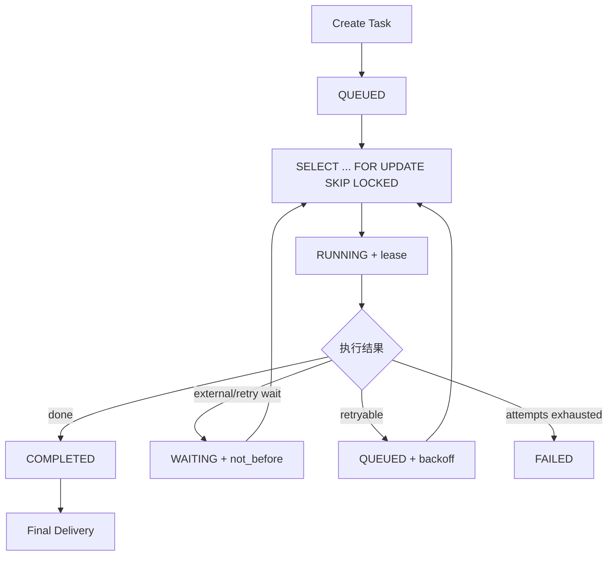
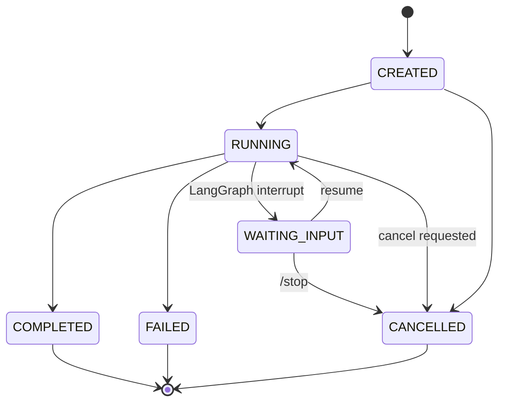
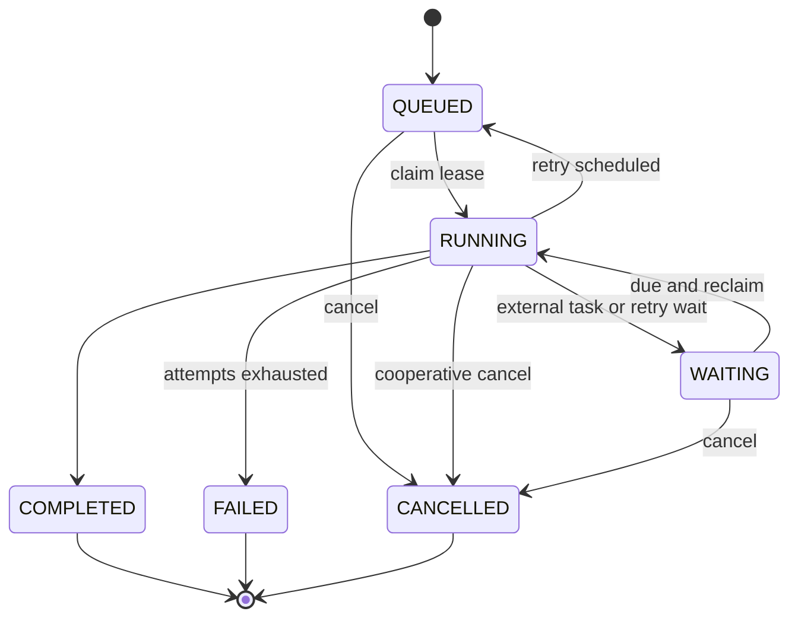
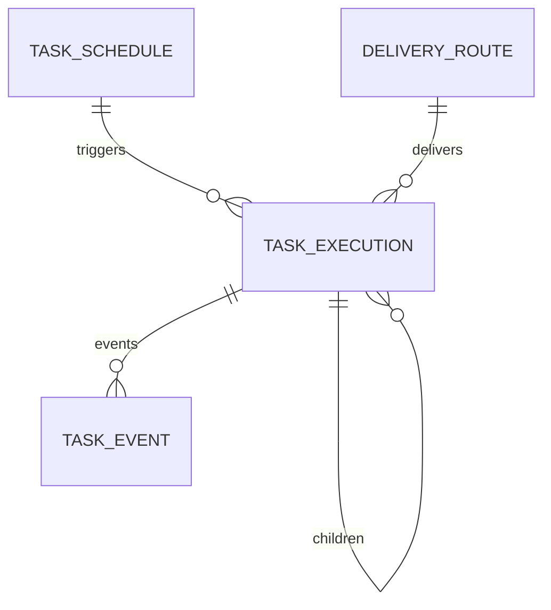

# 后台任务、调度与可靠执行 模块需求与设计一体化文档

> **文档编号**: MOD-TASK-V1.0  
> **文档版本**: v1.0  
> **创建日期**: 2026-09-17  
> **文档状态**: 设计评审中  
> **模板**: design-full.md


## 1. 文档控制

| 项目 | 内容 |
|---|---|
| 模块 | 后台任务、调度与可靠执行 |
| Owner | muad-agent-worker |
| 数据 Owner | task |
| 前置模块 | 01-platform-foundation, 05-skill-management, 07-agent-management, 08-runtime-execution |
| 建议代码位置 | apps/agent-worker/src/muad_agent_worker/；packages/agent-core/ |

## 2. 需求分析

### 2.1 需求概述

| 项目 | 内容 |
|---|---|
| 模块名称 | 后台任务、调度与可靠执行 |
| 模块 ID | MOD-TASK |
| 需求类型 | 中大型功能开发 |
| 业务背景 | 长任务、用户离开和定时触发不能依赖 Runtime 进程，需要幂等、lease、retry、cancel 和最终主动投递。 |
| 核心目标 | 可靠执行异步/定时/批量任务，以 PostgreSQL 保存任务、调度和 lease 权威状态，Worker 无状态横向扩展。 |

### 2.2 痛点与价值

| 维度 | 内容 |
|---|---|
| 目标用户/调用方 | Builder / Admin / End User / 内部服务（按模块实际入口） |
| 当前问题 | 长任务、用户离开和定时触发不能依赖 Runtime 进程，需要幂等、lease、retry、cancel 和最终主动投递。 |
| 业务影响 | 模块边界或契约不固定会导致上层重复设计、接口漂移和跨模块返工。 |
| 预期价值 | 可靠执行异步/定时/批量任务，以 PostgreSQL 保存任务、调度和 lease 权威状态，Worker 无状态横向扩展。 |

### 2.3 功能方案

| 功能ID | 功能名称 | 功能描述 | 优先级 | 来源 |
|---|---|---|---|---|
| FEAT-01 | Durable Task | IMMEDIATE ASYNC/SCHEDULED Task 创建、执行、查询、取消。 | P0 | 需求描述 |
| FEAT-02 | Lease/Retry | claim/heartbeat/reclaim + idempotency + retry。 | P0 | 需求描述 |
| FEAT-03 | Schedule | CRON/ONCE；触发时重新校验权限/Binding并生成新 Snapshot。 | P0 | 需求描述 |
| FEAT-04 | Final Delivery | 完成后使用 DeliveryRoute 通过 IM Gateway 主动投递最终结果。 | P0 | 需求描述 |

#### 2.3.2 字段约束

| 字段类别 | 约束 |
|---|---|
| ID | 业务实体统一 UUID；跨 Owner Schema 仅逻辑引用 UUID |
| 时间 | PostgreSQL 使用 `timestamptz`；Console 展示 `YYYY-MM-DD HH:mm:ss` |
| 删除 | 产品表统一 `is_deleted` 软删除；状态枚举不重复表达 DELETED |
| Secret | 只保存 SecretRef；Secret Value 不进入 DB / Snapshot / 日志 / LLM |
| 枚举 | API 与 DB 统一使用稳定英文枚举值，中文/英文只在 UI/i18n 层映射 |
| 错误 | 业务代码只抛稳定 `code`；`msg/http_status` 由公共配置映射 |

### 2.4 范围与边界

| 类别 | 内容 |
|---|---|
| In Scope | TaskExecution/TaskEvent/Schedule/DeliveryRoute、claim/lease/heartbeat/reclaim、retry、fan-out/fan-in、cancel、final delivery。 |
| Out of Scope | TaskType V1 不做 EXTERNAL/AGENT_STEP；Redis 不作权威队列；Console 不编辑任务输入/编排 DAG |
| 技术债 | 无；不为未确认的未来能力增加兼容层 |

### 2.5 验收条件

#### 2.5.1 业务规则与约束

| ID | 类型 | 描述 | 验证场景 |
|---|---|---|---|
| RULE-01 | 系统约束 | 固定 4 个部署单元；Runtime/Worker 无状态横向扩展。 | S-01 / 对应 E- 场景 |
| RULE-02 | 系统约束 | JSON REST 统一 code/msg/data/trace_id/request_id/timestamp；业务只抛 code，msg/http_status 配置映射。 | S-01 / 对应 E- 场景 |
| RULE-03 | 系统约束 | 产品表统一 is_deleted/create_time/update_time；同 Owner Schema 物理 FK，跨 Owner Schema 逻辑 UUID。 | S-01 / 对应 E- 场景 |
| RULE-04 | 系统约束 | Secret Value 不进 DB/Snapshot/日志/LLM，只保存 SecretRef。 | S-01 / 对应 E- 场景 |
| RULE-05 | 系统约束 | 新 Run/Task 冻结 Snapshot；配置/授权变更只影响后续新 Run/Task。 | S-01 / 对应 E- 场景 |
| RULE-06 | 系统约束 | PG 是 Task/Schedule/lease 权威源；Redis 仅 hint；TaskType V1=SKILL/BATCH。 | S-01 / 对应 E- 场景 |
| RULE-07 | 系统约束 | NFS-backed RWX PVC 为 Artifact 权威源；Runtime/Worker emptyDir 本地 cache；禁止直接从 NFS 执行 Python。 | S-01 / 对应 E- 场景 |
| RULE-08 | 系统约束 | Agent 0..N bot_id；bot_id 只指向一个 Agent；不绑定 Runtime Pod。 | S-01 / 对应 E- 场景 |

#### 2.5.2 功能验收场景

##### 正常场景

| 场景ID | 功能ID | 测试层级 | 关键真实边界 | 归属 | 操作/前置 | 预期结果 |
|---|---|---|---|---|---|---|
| S-01 | FEAT-01 | E2E | Runtime→Worker API→PG→Worker | 本模块 | Runtime 提交 ASYNC Skill | Task QUEUED 后被任意 Worker claim，最终 COMPLETED |
| S-02 | FEAT-03 | E2E | Scheduler→current grants/artifact→Task DB | 本模块 | CRON 到期 | 重新校验权限/Binding，读取 current Artifact，生成新 Task Snapshot |
| S-03 | FEAT-04 | E2E | Worker→IM Gateway | 本模块 | FINAL_ONLY Task 完成 | 主动投递最终结果并记录 SENT |

##### 异常场景

| 场景ID | 功能ID | 测试层级 | 关键真实边界 | 归属 | 触发条件 | 系统行为 |
|---|---|---|---|---|---|---|
| E-01 | FEAT-02 | integration | PG lease | 本模块 | Worker crash lease 到期 | 其他 Worker reclaim，副作用由 idempotency_key 防重 |
| E-02 | FEAT-03 | integration | Schedule trigger auth | 本模块 | 触发时用户/Binding 已撤销 | 不创建可执行 Snapshot，记录明确失败/跳过原因 |

无可靠实测数据的性能阈值统一标记“待定”，不复制模板示例值。

## 3. 技术设计

### 3.1 技术选型与关键决策

| 决策 | 选择 | 放弃项 | 理由 |
|---|---|---|---|
| Task 权威源 | PostgreSQL | Redis Queue 为唯一事实源 | Worker crash 后可 reclaim |
| Redis | wakeup/cancel hint | 任务状态存 Redis | 丢 Redis 不丢任务 |
| TaskType | SKILL/BATCH | EXTERNAL/AGENT_STEP | V1 当前用例不需要额外类型 |

基础栈：Python >=3.12、FastAPI >=0.115、SQLAlchemy 2.x、PostgreSQL；按需 Redis/NFS/Secret Provider；统一 `muad-api` 与 `muad-logging`。

### 3.2 架构与流程



### 3.3 数据设计

#### `task.task_schedule`

**表说明**

- **用途**：用户通过 Agent 创建的定时任务定义；它表达“什么时候触发 + 执行哪个已解析业务意图模板”，不是一个正在运行的 Task。
- **主要写入方**：Agent Runtime 的 `create_schedule` 内置 Tool，经 Agent Worker Task API 创建；Console 可做管理性启停。
- **主要读取方**：Agent Worker Scheduler、Console。
- **生命周期/边界**：Schedule 不永久冻结 Skill/Model 版本；每次触发创建新的 TaskExecution，并在触发时解析当前有效定义、生成 execution snapshot。
- **安全边界**：只保存 `actor_user_id` 和 CredentialRef 解析所需身份，不保存 Secret Value；每次触发重新校验 Agent 授权与业务凭据状态。

| 字段 | 类型 | 约束 | 说明 |
|---|---|---|---|
| `id` | uuid | PK | 主键 |
| `is_deleted` | boolean | NOT NULL DEFAULT false | 软删除 |
| `create_time` | timestamptz | NOT NULL DEFAULT now() | 创建时间 |
| `update_time` | timestamptz | NOT NULL DEFAULT now() | 更新时间 |
| `tenant_id` | varchar(64) | NOT NULL | 隔离键 |
| `name` | varchar(256) | NOT NULL | 人类可读名称 |
| `agent_id` | uuid | NOT NULL | 逻辑 Agent |
| `actor_user_id` | uuid | NOT NULL | 原始执行用户 |
| `intent_key` | varchar(128) | NOT NULL | 规范化业务意图，例如 policy_check |
| `skill_id` | uuid | NOT NULL | 创建 Schedule 时已解析的稳定 Skill ID；触发时不得按 key 重新匹配 |
| `input_template_json` | jsonb | NOT NULL | 规范化输入模板，可含 previous_day 等受控动态变量 |
| `schedule_type` | varchar(16) | NOT NULL DEFAULT 'CRON' | CRON/ONCE |
| `cron_expr` | varchar(128) |  | Cron 表达式 |
| `timezone` | varchar(64) | NOT NULL | IANA 时区 |
| `run_at` | timestamptz |  | ONCE 触发时间 |
| `delivery_route_id` | uuid | NOT NULL FK -> delivery_route.id | 最终投递路由 |
| `status` | varchar(16) | NOT NULL DEFAULT 'ACTIVE' | ACTIVE/PAUSED/COMPLETED；删除只用 is_deleted |
| `next_fire_at` | timestamptz |  | 下一次触发 |
| `last_fire_at` | timestamptz |  | 最近触发 |
| `misfire_policy` | varchar(16) | NOT NULL DEFAULT 'SKIP' | SKIP/FIRE_ONCE |
| `revision` | bigint | NOT NULL DEFAULT 1 | 修改版本 |
| `completed_at` | timestamptz |  | ONCE 成功创建对应 TaskExecution 后进入 COMPLETED |

**索引/约束**：

- `INDEX (status, next_fire_at)`
- `INDEX (actor_user_id, status)`
- `INDEX (agent_id, status)`
- CRON 必须有 `cron_expr`；ONCE 必须有 `run_at`。

#### `task.delivery_route`

**表说明**

- **用途**：后台任务完成后“结果发到哪里”的持久化路由。
- **主要写入方**：Agent Runtime 在创建 Background Task/Schedule 时根据当前 ChannelEnvelope 建立或复用。
- **主要读取方**：Agent Worker FinalDeliveryExecutor、IM Gateway。
- **生命周期/边界**：路由事实与 TaskProgress 分离；不保存 Bot Secret，只保存 `bot_id`、外部接收方标识及必要渠道元数据。

| 字段 | 类型 | 约束 | 说明 |
|---|---|---|---|
| `id` | uuid | PK | 主键 |
| `is_deleted` | boolean | NOT NULL DEFAULT false | 软删除 |
| `create_time` | timestamptz | NOT NULL DEFAULT now() | 创建时间 |
| `update_time` | timestamptz | NOT NULL DEFAULT now() | 更新时间 |
| `tenant_id` | varchar(64) | NOT NULL | 隔离键 |
| `channel` | varchar(32) | NOT NULL | WECOM |
| `bot_id` | varchar(256) | NOT NULL | 用于选择对应 Bot 连接 |
| `platform_user_id` | uuid | NOT NULL | 平台用户 |
| `external_user_id` | varchar(256) | NOT NULL | WeCom 接收方 |
| `external_conversation_id` | varchar(256) |  | 会话/群标识 |
| `route_json` | jsonb | NOT NULL DEFAULT '{}' | 其他渠道字段 |
| `status` | varchar(16) | NOT NULL DEFAULT 'ACTIVE' | ACTIVE/INVALID |

**索引/约束**：

- `INDEX (platform_user_id, channel, update_time DESC)`
- `INDEX (bot_id, external_user_id)`

#### `task.task_execution`

**表说明**

- **用途**：一次真正的 durable 后台执行实例；支持立即异步、定时触发、Parent/Child 批量并行。
- **主要写入方**：Agent Worker；Agent Runtime 通过 Task API 提交，不直接写 task schema。
- **主要读取方**：Agent Worker、Console、Agent Runtime 的查询/取消 Tool。
- **生命周期/边界**：不绑定固定 Worker Pod；`lease_owner` 只是当前租约持有者。Worker crash 后 lease 过期可被其他实例 reclaim。
- **意图边界**：Parent 与 Child 共享同一个 `intent_key`；多个 Child 不是多个 Agent 意图，而是同一意图的执行实例。
- **版本边界**：`execution_snapshot_json` 在本次 Task 开始时固定 Agent/Model/Skill/MCP 版本，不含 Secret。

| 字段 | 类型 | 约束 | 说明 |
|---|---|---|---|
| `id` | uuid | PK | Task ID |
| `is_deleted` | boolean | NOT NULL DEFAULT false | 软删除 |
| `create_time` | timestamptz | NOT NULL DEFAULT now() | 创建时间 |
| `update_time` | timestamptz | NOT NULL DEFAULT now() | 更新时间 |
| `tenant_id` | varchar(64) | NOT NULL | 隔离键 |
| `parent_id` | uuid | FK -> task_execution.id | 父 Task；根任务为空 |
| `root_id` | uuid |  | 根 Task；便于整批查询 |
| `schedule_id` | uuid | FK -> task_schedule.id | 定时触发来源 |
| `source_run_id` | uuid |  | 即时会话触发来源 Run |
| `agent_id` | uuid | NOT NULL | 逻辑 Agent |
| `actor_user_id` | uuid | NOT NULL | 权限与凭据执行主体 |
| `intent_key` | varchar(128) | NOT NULL | 单一业务意图 |
| `skill_id` | uuid | NOT NULL | 已解析稳定 Skill ID |
| `skill_artifact_id` | uuid | NOT NULL | 本次固定 Artifact |
| `trigger_type` | varchar(16) | NOT NULL | IMMEDIATE/SCHEDULED |
| `execution_mode` | varchar(16) | NOT NULL | ASYNC；Worker 内部实际执行模式 |
| `task_type` | varchar(24) | NOT NULL DEFAULT 'SKILL' | V1 仅 SKILL/BATCH；外部异步状态由 external_ref_json + WAITING 表达 |
| `status` | varchar(24) | NOT NULL | QUEUED/RUNNING/WAITING/COMPLETED/FAILED/CANCELLED |
| `input_json` | jsonb | NOT NULL | 规范化任务输入 |
| `result_json` | jsonb |  | 小结果 |
| `result_artifact_id` | uuid |  | 大结果引用 |
| `error_code` | varchar(64) |  | 错误码 |
| `error_message` | text |  | 错误摘要 |
| `cancel_requested` | boolean | NOT NULL DEFAULT false | 用户/管理员取消请求 |
| `external_ref_json` | jsonb | NOT NULL DEFAULT '{}' | external_task_id 等外部持久引用 |
| `deadline_at` | timestamptz |  | 任务总截止时间 |
| `execution_snapshot_schema_version` | int | NOT NULL DEFAULT 1 | Task Snapshot Schema 版本 |
| `execution_snapshot_json` | jsonb | NOT NULL | 本 Task 版本快照 |
| `snapshot_hash` | varchar(128) | NOT NULL | 快照哈希 |
| `idempotency_key` | varchar(256) | NOT NULL | 防重复创建/副作用 |
| `priority` | int | NOT NULL DEFAULT 100 | 优先级 |
| `attempt` | int | NOT NULL DEFAULT 0 | 当前尝试次数 |
| `max_attempts` | int | NOT NULL DEFAULT 3 | 最大尝试 |
| `lease_owner` | varchar(128) |  | 当前 Worker 实例 ID |
| `lease_until` | timestamptz |  | 租约到期 |
| `heartbeat_at` | timestamptz |  | 最近心跳 |
| `not_before` | timestamptz | NOT NULL DEFAULT now() | 最早执行时间 |
| `delivery_route_id` | uuid | FK -> delivery_route.id | 最终投递路由 |
| `delivery_mode` | varchar(16) | NOT NULL DEFAULT 'FINAL_ONLY' | FINAL_ONLY/NONE |
| `delivery_status` | varchar(16) | NOT NULL DEFAULT 'PENDING' | PENDING/SENT/FAILED/NONE |
| `started_at` | timestamptz |  | 开始时间 |
| `finished_at` | timestamptz |  | 完成时间 |

**索引/约束**：

- `UNIQUE (tenant_id, idempotency_key) WHERE is_deleted=false`
- `INDEX (status, not_before, priority, create_time)`
- `INDEX (lease_until) WHERE status IN ('RUNNING','WAITING')`
- `INDEX (root_id, parent_id, status)`
- `INDEX (actor_user_id, create_time DESC)`
- `INDEX (schedule_id, create_time DESC)`

#### `task.task_event`

**表说明**

- **用途**：Task 状态迁移、claim、heartbeat、retry、fan-out、fan-in、delivery 的 append-only 事件日志。
- **主要写入方**：Agent Worker。
- **主要读取方**：Console Timeline、排障、OTel 导出。
- **生命周期/边界**：不作为 Task 当前状态源；当前状态仍以 `task_execution.status` 为准。

| 字段 | 类型 | 约束 | 说明 |
|---|---|---|---|
| `id` | uuid | PK | 主键 |
| `is_deleted` | boolean | NOT NULL DEFAULT false | 保持通用字段 |
| `create_time` | timestamptz | NOT NULL DEFAULT now() | 创建时间 |
| `update_time` | timestamptz | NOT NULL DEFAULT now() | 更新时间 |
| `tenant_id` | varchar(64) | NOT NULL | 隔离键 |
| `task_id` | uuid | NOT NULL | TaskExecution |
| `seq` | bigint | NOT NULL | Task 内单调序号 |
| `event_type` | varchar(64) | NOT NULL | CREATED/CLAIMED/STARTED/RETRY/FAN_OUT/... |
| `payload_json` | jsonb | NOT NULL DEFAULT '{}' | 脱敏事件数据 |
| `trace_id` | varchar(64) |  | Trace |

**索引/约束**：

- `UNIQUE (task_id, seq)`
- `INDEX (task_id, create_time)`
- `INDEX (event_type, create_time DESC)`


---

## 5. 状态枚举

### 5.1 RunStatus

```text
CREATED
RUNNING
WAITING_INPUT
COMPLETED
FAILED
CANCELLED
```

### 5.2 InterruptStatus

```text
WAITING
RESOLVED
CANCELLED
```

### 5.3 SkillUserScope / McpUserScope

```text
ALL
SELECTED
```

- `ALL`：对所有同时满足 AgentAccessGrant + Agent Binding 的用户开放；
- `SELECTED`：还必须存在对应 SkillUserGrant/McpUserGrant。

### 5.4 Artifact Validation

```text
READY
REJECTED
```

### 5.5 Credential Status

```text
ACTIVE
INVALID
```

### 5.6 SkillExecutionMode

```text
SYNC
ASYNC
AUTO
```

### 5.7 TaskStatus

```text
QUEUED
RUNNING
WAITING
COMPLETED
FAILED
CANCELLED
```

### 5.8 ScheduleStatus

```text
ACTIVE
PAUSED
COMPLETED
```

删除由 `is_deleted=true` 表达；`ONCE` 成功创建唯一 TaskExecution 后进入 `COMPLETED`。

### 5.9 DeliveryStatus

```text
PENDING
SENT
FAILED
NONE
```

---


## 5.10 Effective Capability 判定

### Skill

```text
EffectiveSkill(user, agent, skill)
=
AgentAccessGrant(user, agent)
AND AgentSkillBinding(agent, skill)
AND Agent.enabled
AND Skill.enabled
AND (
    Skill.user_scope = ALL
    OR SkillUserGrant(skill, user) exists and not expired
)
```

### MCP

```text
EffectiveMcp(user, agent, mcp)
=
AgentAccessGrant(user, agent)
AND AgentMcpBinding(agent, mcp)
AND Agent.enabled
AND MCP.enabled
AND (
    MCP.user_scope = ALL
    OR McpUserGrant(mcp, user) exists and not expired
)
```

**约束**：

- `ALL` 不会使 Skill/MCP 自动出现在未绑定它的 Agent；
- `SELECTED` 不会授予用户 Agent 使用权；
- 不建立 `user_id + agent_id + skill_id/mcp_id` 三元授权；
- RuntimeDefinition 只返回 Effective Capability；
- 当前 Run/Task 创建 Snapshot 后，即使 Grant 被撤销也不修改当前 Snapshot；撤销对后续新 Run/Task 生效。

## 6. Run 状态机



> **图说明**：状态属于 `run_record`，与执行它的 Runtime Pod 无关。WAITING_INPUT 只表示会话内等待用户输入；Phase 1 不把它扩展成跨小时/跨天可靠任务。


## 6.1 Task 状态机



**图说明**：

- 状态属于 TaskExecution，不属于 Worker Pod；
- `RUNNING` 必须持有有效 lease；
- Worker crash 后 lease 过期，任务可重新进入 claim 流程；
- 外部异步任务可用 `WAITING + not_before` 表达下一次轮询时间；
- Parent Batch Task 只有在所有 Child 进入终态并完成 fan-in 后才进入自身终态。

---

## 7. Conversation 与 CanonicalEvent

`conversation.last_seq` 使用事务内 `SELECT ... FOR UPDATE` 或数据库原子更新生成单调序号：

```text
1 USER_MESSAGE
2 ASSISTANT_MESSAGE(delta aggregated)
3 TOOL_CALL
4 TOOL_RESULT
5 INTERRUPT
6 USER_MESSAGE(resume input)
...
```

CanonicalEvent 只记录**真实发生过的事实**。ContextBuilder 不允许为了 Token 裁剪去修改或删除 CanonicalEvent。

---

## 8. RuntimeSnapshot 内容

建议 Snapshot JSON 至少包含：

```json
{
  "schema_version": 1,
  "agent": {
    "id": "...",
    "revision": 12,
    "instructions": "..."
  },
  "model": {
    "id": "...",
    "revision": 4,
    "provider": "openai-compatible",
    "model": "...",
    "params": {}
  },
  "skills": [
    {
      "skill_id": "...",
      "artifact_id": "...",
      "key": "policy-check",
      "version": "1.3.0",
      "checksum": "sha256:...",
      "storage_key": "skills/.../.../skill.zip",
      "description": "...",
      "execution_mode": "ASYNC"
    }
  ],
  "mcp": [],
  "budget": {
    "max_turns": 20,
    "deadline_ms": 120000,
    "max_tool_calls": 30
  }
}
```

禁止放入：

- API Key；
- Password；
- Cookie；
- User Token；
- Bot Secret Value。

---

## 9. LangGraph Checkpointer

LangGraph 自身维护的 checkpoint 表放在 `langgraph` schema：

```text
langgraph.checkpoints
langgraph.checkpoint_blobs
langgraph.checkpoint_writes
...（以选定 Checkpointer 实现为准）
```

原则：

- 这些是执行恢复技术状态；
- 不作为 Console 业务查询的事实源；
- 不直接替代 `conversation / canonical_event / run_record`；
- 后续 Checkpointer Schema 升级跟随 LangGraph adapter migration，不混入产品表业务逻辑。

---

## 10. Redis Key 设计

Task/Worker 仅把 Redis 作为低延迟 hint，不作为队列权威源：

```text
task:wakeup              # 可选 pubsub/stream hint
task:cancel:{task_id}    # cooperative cancel hint
schedule:wakeup          # schedule 配置变更提示
```

Task claim、Schedule next_fire_at、lease/heartbeat 的权威状态全部在 PostgreSQL。


Redis 只放短期协调数据：

```text
im:dedupe:{channel}:{message_id}       TTL 10m
run:cancel:{run_id}                    TTL 30m
mcp:tools:{server_id}:{revision}       TTL 5m
runtime:def:{agent_id}:{revision}      TTL 1~5m（可选）
ratelimit:{scope}:{key}:{window}       TTL 随窗口
```

Redis 丢失后系统允许 cache miss，但不得丢失用户、Memory、Run、Artifact、授权关系。

---

## 11. 数据迁移原则

1. Alembic 统一管理 `control/runtime` 产品表；
2. 使用 expand → deploy → contract；
3. 新增 NOT NULL 字段先 nullable/backfill，再收紧；
4. 大表索引使用 `CREATE INDEX CONCURRENTLY`；
5. 删除字段至少跨一个版本；
6. RuntimeSnapshot JSON 必须向后兼容旧记录的审计读取；
7. 不允许应用启动时自动 destructive migration。

**ER 图**



数据库规则：所有产品表统一 `id/is_deleted/create_time/update_time`；同 Owner Schema 物理 FK，跨 Owner Schema 逻辑 UUID；迁移使用 Alembic expand→deploy→contract。

### 3.4 接口设计

```json
{
  "code":"0",
  "msg":"成功",
  "data":{},
  "trace_id":"trace-id",
  "request_id":"request-id",
  "timestamp":"2026-09-17T17:00:00+08:00"
}
```

业务异常只允许 `raise AppError("CODE")`；msg 与 HTTP Status 统一由 `config/api-messages.yaml` 映射。

| 接口ID | 名称 | 方法 | 路径 | FEAT |
|---|---|---|---|---|
| API-01 | Internal 创建 Task | POST | `/internal/tasks` | FEAT-01 |
| API-02 | Internal 创建 Schedule | POST | `/internal/schedules` | FEAT-03 |
| API-03 | Internal Task 查询 | GET | `/internal/tasks` | FEAT-01 |
| API-04 | 任务列表 | GET | `/api/v1/tasks` | FEAT-01 |
| API-05 | 任务详情 | GET | `/api/v1/tasks/{task_id}` | FEAT-01 |
| API-06 | 取消任务 | POST | `/api/v1/tasks/{task_id}/cancel` | FEAT-01 |
| API-07 | Schedule 列表 | GET | `/api/v1/schedules` | FEAT-03 |
| API-08 | Schedule 详情 | GET | `/api/v1/schedules/{schedule_id}` | FEAT-03 |
| API-09 | 暂停 Schedule | PUT | `/api/v1/schedules/{schedule_id}/pause` | FEAT-03 |
| API-10 | 恢复 Schedule | PUT | `/api/v1/schedules/{schedule_id}/resume` | FEAT-03 |
| API-11 | 删除 Schedule | DELETE | `/api/v1/schedules/{schedule_id}` | FEAT-03 |


#### API-01 Internal 创建 Task

```text
POST /internal/tasks
```

- 请求：agent_id/actor_user_id/skill_id/skill_artifact_id/input/execution_snapshot/idempotency_key/delivery_route。
- `data`：
- 错误码：`COMMON_VALIDATION_ERROR / COMMON_INTERNAL_ERROR`
- 处理：

#### API-02 Internal 创建 Schedule

```text
POST /internal/schedules
```

- 请求：name/agent_id/actor_user_id/intent_key/skill_id/input_template/schedule/delivery_route。
- `data`：
- 错误码：`COMMON_VALIDATION_ERROR / COMMON_INTERNAL_ERROR`
- 处理：

#### API-03 Internal Task 查询

```text
GET /internal/tasks
```

- 请求：schedule_id/agent_id/actor_user_id/status/trigger_type/start_time/end_time/page/page_size。
- `data`：
- 错误码：`COMMON_VALIDATION_ERROR / COMMON_INTERNAL_ERROR`
- 处理：

#### API-04 任务列表

```text
GET /api/v1/tasks
```

- 请求：同查询过滤字段。
- `data`：
- 错误码：`COMMON_VALIDATION_ERROR / COMMON_INTERNAL_ERROR`
- 处理：

#### API-05 任务详情

```text
GET /api/v1/tasks/{task_id}
```

- 请求：
- `data`：
- 错误码：`COMMON_VALIDATION_ERROR / COMMON_INTERNAL_ERROR`
- 处理：

#### API-06 取消任务

```text
POST /api/v1/tasks/{task_id}/cancel
```

- 请求：
- `data`：
- 错误码：`TASK_NOT_CANCELLABLE`
- 处理：

#### API-07 Schedule 列表

```text
GET /api/v1/schedules
```

- 请求：
- `data`：
- 错误码：`COMMON_VALIDATION_ERROR / COMMON_INTERNAL_ERROR`
- 处理：

#### API-08 Schedule 详情

```text
GET /api/v1/schedules/{schedule_id}
```

- 请求：
- `data`：
- 错误码：`COMMON_VALIDATION_ERROR / COMMON_INTERNAL_ERROR`
- 处理：

#### API-09 暂停 Schedule

```text
PUT /api/v1/schedules/{schedule_id}/pause
```

- 请求：
- `data`：
- 错误码：`COMMON_VALIDATION_ERROR / COMMON_INTERNAL_ERROR`
- 处理：

#### API-10 恢复 Schedule

```text
PUT /api/v1/schedules/{schedule_id}/resume
```

- 请求：
- `data`：
- 错误码：`COMMON_VALIDATION_ERROR / COMMON_INTERNAL_ERROR`
- 处理：

#### API-11 删除 Schedule

```text
DELETE /api/v1/schedules/{schedule_id}
```

- 请求：
- `data`：
- 错误码：`COMMON_VALIDATION_ERROR / COMMON_INTERNAL_ERROR`
- 处理：


### 3.5 质量实现方案

- 性能：批量/聚合优先，列表禁止 N+1，真实目标待基线压测后确定。
- 可靠性：事务只覆盖原子 DB 操作；外部 IO 不包长事务；高影响错误必须有 E-/B- 验收。
- 安全：Secret/Token/Cookie 不进业务 DB、日志、Snapshot、LLM。
- 可观测：统一 JSON 日志，自动带 service/trace_id/request_id；状态变化可关联 trace_id。


## 4. 部署与运维

本模块随 `muad-agent-worker` 对应镜像/共享 package 发布；PostgreSQL、Redis、NFS、Secret Provider 外置。监控阈值待真实基线确定。

## 5. 风险与依赖

- 前置：01-platform-foundation, 05-skill-management, 07-agent-management, 08-runtime-execution。
- 主要风险：错误把 Redis 当队列权威源或 retry 造成重复外部副作用。。
- 应对：Contract Test + S/E/B 验收 + Spec Matrix。

## 6. 需求追溯矩阵

| 用户故事 | 功能ID | 接口ID | 测试用例ID | 测试层级 | 状态 |
|---|---|---|---|---|---|
| 需求描述 | FEAT-01 | API-01, API-03, API-04, API-05, API-06 | S-01 | E2E | 待实现 |
| 需求描述 | FEAT-02 | - | E-01 | integration | 待实现 |
| 需求描述 | FEAT-03 | API-02, API-07, API-08, API-09, API-10, API-11 | S-02, E-02 | E2E | 待实现 |
| 需求描述 | FEAT-04 | - | S-03 | E2E | 待实现 |

## Spec Compliance Matrix

| Spec/Rule | enforcement | 设计影响 | 设计落点 | 验证场景 | 状态/N/A 理由 |
|---|---|---|---|---|---|
| `mss-platform#RULE-ARCH-001` | required | 固定 4 个部署单元；Runtime/Worker 无状态横向扩展。 | §3.2/§3.3/§3.4 | S-01 + verifier | applied |
| `mss-platform#RULE-API-001` | required | JSON REST 统一 code/msg/data/trace_id/request_id/timestamp；业务只抛 code，msg/http_status 配置映射。 | §3.2/§3.3/§3.4 | S-01 + verifier | applied |
| `mss-platform#RULE-DATA-001` | required | 产品表统一 is_deleted/create_time/update_time；同 Owner Schema 物理 FK，跨 Owner Schema 逻辑 UUID。 | §3.2/§3.3/§3.4 | S-01 + verifier | applied |
| `mss-platform#RULE-SECRET-001` | required | Secret Value 不进 DB/Snapshot/日志/LLM，只保存 SecretRef。 | §3.2/§3.3/§3.4 | S-01 + verifier | applied |
| `mss-platform#RULE-SNAPSHOT-001` | required | 新 Run/Task 冻结 Snapshot；配置/授权变更只影响后续新 Run/Task。 | §3.2/§3.3/§3.4 | S-01 + verifier | applied |
| `mss-platform#RULE-WORKER-001` | required | PG 是 Task/Schedule/lease 权威源；Redis 仅 hint；TaskType V1=SKILL/BATCH。 | §3.2/§3.3/§3.4 | S-01 + verifier | applied |
| `mss-platform#RULE-SKILL-001` | required | NFS-backed RWX PVC 为 Artifact 权威源；Runtime/Worker emptyDir 本地 cache；禁止直接从 NFS 执行 Python。 | §3.2/§3.3/§3.4 | S-01 + verifier | applied |
| `mss-platform#RULE-IM-001` | required | Agent 0..N bot_id；bot_id 只指向一个 Agent；不绑定 Runtime Pod。 | §3.2/§3.3/§3.4 | S-01 + verifier | applied |
| `mss-platform#RULE-TEST-001` | required | 跨 API/DB/Runtime/Browser 的关键流程必须 E2E，列出不得 mock 的真实边界。 | §3.2/§3.3/§3.4 | S-01 + verifier | applied |
