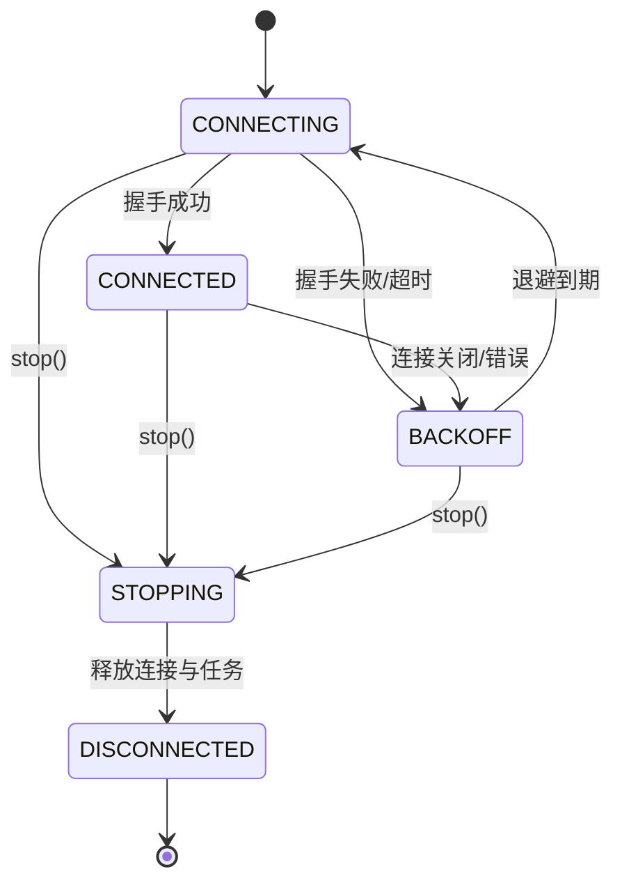
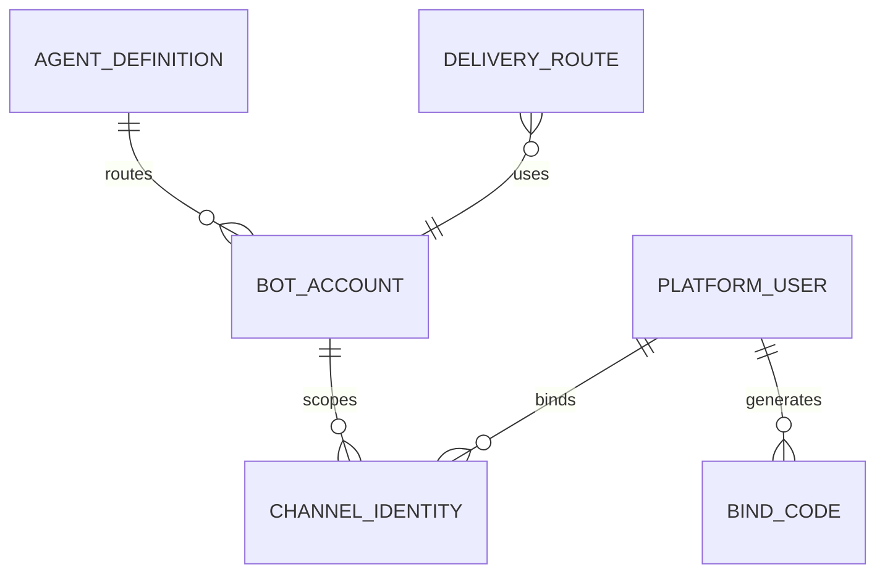

# IM Gateway 与主动投递 模块需求与设计一体化文档

> **文档编号**: MOD-IM-V1.4
>
> **文档版本**: v1.4
> **创建日期**: 2026-09-17  
> **文档状态**: Plan 基线（2026-09-23 按 Plan 复核修订；实现与验收待完成）
>
> **模板**: design-full.md


## 1. 文档控制

### 1.1 责任人

| 角色 | 姓名 | 职责范围 |
|---|---|---|
| 产品经理 | 待定 | 需求定义、业务验收 |
| 开发负责人 | 待定 | 技术方案、代码实现 |
| 测试负责人 | 待定 | 测试策略、质量保证 |
| 架构师 | 待定 | 架构审核、技术决策 |

### 1.2 修订历史

| 版本 | 日期 | 作者 | 变更描述 |
|---|---|---|---|
| v1.0 | 2026-09-17 | — | 需求与设计初稿 |
| v1.1 | 2026-09-18 | — | 对齐 V1.4 决策（docs/17）：resolve 改为 `bound` 正常分支、`/internal/deliveries` 增加 `delivery_key` 去重、`/stop` 改为 `cancel-active`、`iter_events()` 唯一入站路径、入站去重与 WS 状态机、Secret Provider 解析、metrics 与 `/healthz`+`/readyz` 补全 |
| v1.2 | 2026-09-21 | Codex | 承接新增 API 幂等规则；统一 Bot/Skills 分页；明确投递成功去重与失败恢复、就绪/密钥边界；补计划验收与唯一任务责任映射。 |
| v1.4 | 2026-09-23 | Codex | 局部 Plan 承接 `harness-data#RULE-data-001`（TASK-004 改动 repository/持久化路径触发路径映射）：本模块不新增表，复用 Owner 表时遵守标准列、`WHERE is_deleted=false` partial unique、`timestamptz` 与跨 Schema 逻辑 UUID；见 Spec Compliance Matrix。 |
| v1.3 | 2026-09-23 | Codex | Plan 复核修订：①§4.2 明确指标导出机制（仓库无现存指标基建，本模块落地进程内注册表 + 真实 `/metrics` HTTP 端点）；②§2.5.3 补 B-130（多实例/Worker 环境）与 B-131（WS/SDK 故障注入），原 B-120/B-121 收窄为探针核心与基础环境；③外部依赖状态刷新（EXT-09-020/021/043 已 verified，见 §5）；④幂等错误码对齐现行 required `harness-api#RULE-api-002`（异指纹 `IDEMPOTENCY_MISMATCH`，指纹为规范化 JSON SHA256，撤销原 `COMMON_CONFLICT` 要求，见 API-03/API-06 与 Spec Matrix）。 |

**模块信息**

| 项目 | 内容 |
|---|---|
| 模块 | IM Gateway 与主动投递 |
| Owner | muad-im-gateway |
| 数据 Owner | 引用 control/task Owner 表；本模块不新增表 |
| 前置模块 | 02-user-identity, 07-agent-management, 08-runtime-execution, 09-task-schedule |
| 建议代码位置 | apps/im-gateway/src/muad_im_gateway/ |

**评审边界说明**:
- **需求评审**: 第 2 章（需求分析）→ 通过后锁定为需求基线 v1.0
- **设计评审**: 第 3-4 章（技术设计 + 部署运维）→ 通过后锁定设计基线 v1.x
- **交接契约**: 2.5 验收条件 — 需求定义 What，设计实现 How

## 2. 需求分析

### 2.1 需求概述

| 项目 | 内容 |
|---|---|
| 模块名称 | IM Gateway 与主动投递 |
| 模块 ID | MOD-IM |
| 需求类型 | 中大型功能开发 |
| 业务背景 | IM SDK 类型不能渗透 Runtime；多个 bot WebSocket 要统一管理；主动推送需要稳定 route/receiver 字段。 |
| 核心目标 | 统一维护企业微信 Bot WebSocket，完成消息标准化、bot→Agent 路由、/bind、Runtime SSE 桥接和后台最终结果主动投递（`delivery_key` 幂等去重）。 |

### 2.2 痛点与价值

| 维度 | 内容 |
|---|---|
| 目标用户/调用方 | Builder / Admin / End User / 内部服务（按模块实际入口） |
| 当前问题 | IM SDK 类型不能渗透 Runtime；多个 bot WebSocket 要统一管理；主动推送需要稳定 route/receiver 字段。 |
| 业务影响 | 模块边界或契约不固定会导致上层重复设计、接口漂移和跨模块返工。 |
| 预期价值 | 统一维护企业微信 Bot WebSocket，完成消息标准化、bot→Agent 路由、/bind、Runtime SSE 桥接和后台最终结果主动投递。 |

### 2.3 功能方案

| 功能ID | 功能名称 | 功能描述 | 优先级 | 来源 |
|---|---|---|---|---|
| FEAT-01 | Bot 连接与路由 | 一个 Gateway Service 维护多个 bot WebSocket，bot_id→agent_id；入站消息经 `iter_events()` 规范化并去重。 | P0 | 需求描述 |
| FEAT-02 | 身份/命令 | /bind、/skills、/new、/stop；`/new`→`POST /v1/conversations`，`/stop`→`POST /v1/runs/cancel-active`。 | P0 | 需求描述 |
| FEAT-03 | Runtime 桥接 | ChannelEnvelope→`POST /v1/runs`→SSE 事件→IM 流式回复。 | P0 | 需求描述 |
| FEAT-04 | 主动投递 | Worker 携带 `delivery_key` 调 `/internal/deliveries`，Gateway 按 DeliveryRoute 幂等发送最终结果。 | P0 | 需求描述 |

#### 2.3.2 字段约束

| 字段类别 | 约束 |
|---|---|
| ID | 业务实体统一 UUID；跨 Owner Schema 仅逻辑引用 UUID |
| 时间 | PostgreSQL 使用 `timestamptz`；Console 展示 `YYYY-MM-DD HH:mm:ss` |
| 删除 | 产品表统一 `is_deleted` 软删除；状态枚举不重复表达 DELETED |
| Secret | bot secret 明文存于 `bot_account.secret`（主键引用）；仅经 Console→Gateway 受保护内部快照传输并驻留内存，不得进入 Snapshot / 日志 / 审计 / LLM / IM / 对外 API 响应 |
| 枚举 | API 与 DB 统一使用稳定英文枚举值，中文/英文只在 UI/i18n 层映射 |
| 错误 | 业务代码只抛稳定 `code`；`msg/http_status` 由公共配置映射；只使用 `config/api-messages.yaml` 已登记错误码 |
| 去重键 | `im:dedupe:{channel}:{message_id}` TTL 600；`delivery:dedupe:{delivery_key}` TTL 7d |

### 2.4 范围与边界

| 类别 | 内容 |
|---|---|
| In Scope | WeCom WebSocket Adapter、`ChannelAdapter.iter_events()` 入站规范化、ChannelEnvelope、bot resolve、/bind /skills /new /stop、Runtime SSE 桥接与命令文案映射、FinalDelivery（`delivery_key` 去重）、Redis 入站去重降级、WS 连接状态机、metrics 与健康检查。 |
| Out of Scope | V1 仅 WeCom WebSocket；Gateway 不执行 Agent 业务逻辑；bot_id 不绑定 Runtime Pod；不向 IM 用户提供 Artifact 下载；Gateway 不查询/缓存 active run。 |
| 技术债 | 无；不为未确认的未来能力增加兼容层 |

### 2.5 验收条件

#### 2.5.1 业务规则与约束

| ID | 类型 | 描述 | 验证场景 |
|---|---|---|---|
| RULE-01 | 系统约束 | 固定 4 个部署单元；Runtime/Worker 无状态横向扩展。 | S-01 + verifier |
| RULE-02 | 系统约束 | JSON REST 统一 code/msg/data/trace_id/request_id/timestamp；所有列表使用 items/page/page_size/total，page>=1、1<=page_size<=100；业务只抛 code，msg/http_status 配置映射。 | S-02 / E-02 / B-123 |
| RULE-03 | 系统约束 | bot secret 明文存于 `bot_account.secret`；仅 Console→Gateway 内部快照用于 SDK 连接；不得进入 Snapshot/日志/审计/LLM/IM/对外 API 响应。 | S-01 / E-07 / B-128 |
| RULE-04 | 系统约束 | Agent 0..N bot_id；bot_id 只指向一个 Agent；不绑定 Runtime Pod。 | S-01 / E-01 |
| RULE-05 | 系统约束 | 授权为三层关系（User→Agent、Agent→Skill/MCP、SELECTED 资源再叠加用户 Grant）；Effective Capability 公式含 `is_deleted=false` 与 enabled 谓词，绑定无启停开关、授权无到期时间（见 docs/02 §5.10）。 | S-03 / E-04 / B-124 |
| RULE-06 | 系统约束 | 新 Run/Task 冻结 Snapshot；配置/授权变更只影响后续新 Run/Task；Run 终态必须 CAS。 | S-03 / E-03 / B-125 |
| RULE-07 | 系统约束 | 跨 API/DB/Runtime/Browser 的关键流程必须 E2E，列出不得 mock 的真实边界。 | S-01 / S-03 / E-03 |
| RULE-08 | 系统约束 | 入站去重 `im:dedupe:{channel}:{message_id}` SET NX EX 600；重复消息 ACK/忽略不创建 Run；Redis 不可用降级 at-least-once。 | S-05 / E-06 |
| RULE-09 | 系统约束 | Final Delivery 必须携带 `delivery_key`（`task:{task_id}:final`）；仅成功发送后写 Redis `delivery:dedupe:{delivery_key}`（TTL 604800）；并发由独立短租约保护，处理中不得冒充已投递；成功重放返回 200；Redis 不可用按 at-least-once。 | S-04 / E-06 / B-127 |
| RULE-10 | 系统约束 | 未绑定是正常分支（`bound=false`），不是错误码；会话并发与取消只使用 `RUN_BUSY`/`NO_ACTIVE_RUN`，`WAITING_INPUT` 由 Runtime 自动 resume。 | S-06 / E-04 / E-05 |

#### 2.5.2 功能验收场景

##### 正常场景

| 场景ID | 功能ID | 优先级 | 测试层级 | 关键真实边界 | 归属 | 操作/前置 | 预期结果 |
|---|---|---|---|---|---|---|---|
| S-01 | FEAT-01 | P0 | E2E | WeCom Adapter→Gateway→Runtime | 本模块 | 两个 bot_id 指向同一 Agent 分别收到消息 | 均路由到同一逻辑 Agent，但可进入不同 Runtime Pod |
| S-02 | FEAT-02 | P0 | E2E | Gateway→Console bind API→DB | 本模块 | 未绑定用户发送 `/bind <有效绑定码>` | 绑定成功并主动回复已验证 |
| S-03 | FEAT-03 | P0 | E2E | WeCom→Gateway→Runtime SSE→WeCom | 本模块 | 已绑定授权用户发送普通消息 | `POST /v1/runs` 后按 `seq` 流式回复，`run.completed` 收尾 |
| S-04 | FEAT-04 | P0 | E2E | Worker→Gateway→WeCom | 本模块 | 后台任务完成，Worker 带 `delivery_key` 调 `/internal/deliveries` | 按 DeliveryRoute 主动推送最终结果；重复投递返回 200 不重发 |
| S-05 | FEAT-01 | P0 | integration | Gateway→Redis dedupe | 本模块 | 同一 `message_id` 重复投递 | 第二次命中 `im:dedupe:{channel}:{message_id}`，ACK/忽略，不创建第二个 Run |
| S-06 | FEAT-02 | P0 | integration | Gateway→Runtime | 本模块 | 用户发送 `/stop`，存在 `WAITING_INPUT` Run | 调 `POST /v1/runs/cancel-active` 直接 CAS `CANCELLED`，回复“当前任务已停止” |

##### 异常场景

| 场景ID | 功能ID | 测试层级 | 关键真实边界 | 归属 | 触发条件 | 系统行为 |
|---|---|---|---|---|---|---|
| E-01 | FEAT-01 | integration | bot resolve | 本模块 | bot_id 未配置或禁用 | 不创建 Run，记录/返回 `BOT_NOT_FOUND` |
| E-02 | FEAT-02 | integration | bind API→DB | 本模块 | 绑定码无效/过期/已使用 | `BIND_CODE_INVALID`/`BIND_CODE_EXPIRED`，回复重新生成绑定码 |
| E-03 | FEAT-03 | integration | Gateway→SSE | 本模块 | SSE 未收到终态而断开 | 回复“服务暂时中断，请重发消息”；Run 由 Runtime Reaper 回收 `FAILED(RUN_ABANDONED)` |
| E-04 | FEAT-03 | integration | Runtime→Gateway | 本模块 | 会话已有 `CREATED/RUNNING` Run（`RUN_BUSY`） | 不创建新 Run，回复“当前会话已有任务执行中，可发送 /stop 停止” |
| E-05 | FEAT-02 | integration | Runtime→Gateway | 本模块 | `/stop` 时无活跃 Run（`NO_ACTIVE_RUN`） | 回复“当前没有执行中的任务” |
| E-06 | FEAT-01/04 | integration | Gateway→Redis | 本模块 | Redis 不可用 | 去重降级：入站/投递按 at-least-once 继续处理，业务事实不丢 |
| E-07 | FEAT-01 | integration | DB bot secret | 本模块 | bot secret 缺失或不可用 | 该 bot 标记为不可用并退避重试，不影响其他 bot；`/readyz` 降级 |

无可靠实测数据的性能阈值统一标记“待定”，不复制模板示例值。

#### 2.5.3 计划补充验收场景

以下边界由 2026-09-21 局部 Plan 承接、2026-09-23 复核补充，共 31 个补充场景（B-101..B-131），补充原 13 个 S/E 场景，不降低原测试层级。最终负责人、测试文件和命令见 `10-im-gateway.md` 的 Acceptance Coverage / Contract。

真实 E2E 使用生产 Gateway/Console/Runtime/Worker 进程、真实 HTTP/SSE、PostgreSQL、Redis、官方 SDK 与 WS socket。外部企业微信端点由本地协议探针承载，不 mock 业务 API/Adapter/SDK，也不声称完成企业微信实网验收。测试资源以 e2e-im-* 标识并自动清理，缺环境、skip 或外部依赖未就绪不算通过。

| 场景ID | 优先级 | 测试层级 | 关键真实边界 | 核心验证 / 责任任务 |
|---|---|---|---|---|
| B-101 | P0 | unit | 真实 Pydantic DTO 校验与 JSON 序列化 | 公共契约/分页/枚举；TASK-001 |
| B-102 | P0 | integration | 生产 ConsoleClient→真实本地 HTTP 服务→Envelope 解码 | Console 封套、链路头与显式失败；TASK-002 |
| B-103 | P0 | integration | 真实 bind HTTP handler→PostgreSQL 幂等记录、bind_code 行锁、channel_identity | 绑定事务与持久幂等；TASK-003 |
| B-104 | P0 | integration | 真实 Console handler→生产授权服务→PostgreSQL Agent/Skill/Grant | 授权后分页 Skills；TASK-004 |
| B-105 | P0 | integration | Console snapshot HTTP→真实 PG bot 配置→BotSnapshotCache | 一致 revision 全量快照；TASK-005 |
| B-106 | P0 | integration | 生产 WeComAdapter/连接管理器→真实本地 WS 故障探针 | 单 bot 隔离与退避；TASK-006 |
| B-107 | P0 | integration | 真实 Gateway lifespan/HTTP probes→Console/WS 连接管理器 | 启动/就绪/关闭；TASK-007 |
| B-108 | P0 | integration | Gateway inbound→真实 Redis→真实 Runtime HTTP 接收边界 | Redis 入站去重；TASK-008 |
| B-109 | P0 | integration | Gateway→真实 Console resolve HTTP→PostgreSQL→Runtime 接收观测 | 未绑定与路由授权；TASK-009 |
| B-110 | P0 | integration | Gateway command→真实 Console bind HTTP→PostgreSQL | 本地 bind 命令；TASK-010 |
| B-111 | P0 | integration | Gateway commands→真实 Console/Runtime HTTP→PostgreSQL | skills 与 new 会话语义；TASK-011 |
| B-112 | P0 | integration | Gateway→真实 Runtime cancel-active HTTP→PostgreSQL CAS/事件 | 已取消/取消中/no-active；TASK-012 |
| B-113 | P0 | integration | 生产 RuntimeClient→真实本地 HTTP/SSE 接收端 | Runtime 幂等头与上下文；TASK-013 |
| B-114 | P0 | unit | 真实 SSE parser 与分片字节/行输入 | SSE 封套/seq/heartbeat；TASK-014 |
| B-115 | P0 | integration | 真实 SSE 解析→生产 renderer→真实本地 WS SDK 出站 | 流式收尾与中断选项；TASK-015 |
| B-116 | P0 | integration | 真实 iter_events→Gateway 消费队列→Runtime HTTP/SSE→WS 回复 | 长流期间命令可处理；TASK-016 |
| B-117 | P0 | integration | 真实 Gateway HTTP→生产 Adapter→真实 Redis/本地 WS | 主动投递响应与错误；TASK-017 |
| B-118 | P1 | integration | 真实连接迁移→生产日志 + 真实 `/metrics` HTTP 端点（api-kit 注册表） | 连接指标/脱敏；TASK-018 |
| B-119 | P1 | integration | 生产入站/HTTP投递/真实SSE→真实 `/metrics` HTTP 端点（api-kit 注册表） | 消息/投递指标；TASK-019 |
| B-120 | P0 | integration | 官方 SDK→真实本地 WebSocket 服务→生产 WeComAdapter | WS 探针核心与官方 SDK 边界（认证/消息/流式收发）；TASK-020 |
| B-121 | P0 | integration | 生产进程生命周期→真实HTTP/PostgreSQL/Redis | 基础多服务环境与数据清理（Console/Gateway/PG/Redis/模型探针）；TASK-021 |
| B-122 | P0 | E2E | 官方SDK/WeComAdapter→Gateway→Console/PG→真实双Runtime HTTP | 多 bot/任意 Runtime 实例；TASK-022 |
| B-123 | P0 | E2E | 真实WS→Gateway命令→Console bind HTTP→PostgreSQL→SDK回复 | 绑定 E2E 与双语封套；TASK-023 |
| B-124 | P0 | E2E | WS命令→Gateway→Console授权HTTP/PG→Runtime Prompt/ToolRegistry | Effective Capability/不泄露；TASK-024 |
| B-125 | P0 | E2E | 真实WS→Gateway→Runtime HTTP/SSE→PostgreSQL Snapshot/Reaper→SDK回复 | 流式/resume/Snapshot/CAS/回收；TASK-025 |
| B-126 | P0 | E2E | Gateway HTTP→Console/Runtime→真实PostgreSQL幂等表/partial unique→可观测副作用 | 绑定/Run/new 的并发、重启、异指纹重放验证；TASK-026 |
| B-127 | P0 | E2E | 真实Worker/PG→Gateway HTTP→真实Redis→官方SDK/WS接收端 | 投递 E2E/Redis 故障与失败恢复；TASK-027 |
| B-128 | P0 | integration | 真实PG bot secret→Console内部快照HTTP→Gateway/SDK→日志/审计/快照输出 | 密钥不泄露与单 bot readiness；TASK-028 |
| B-129 | P0 | integration | pytest用例收集/运行→验收Contract/Evidence→真实组件记录 | 完整验收映射与真实证据；TASK-029 |
| B-130 | P0 | integration | 生产第二 Runtime 实例与 Worker 进程→真实 PG/Redis | 多实例与 Worker 环境扩展；TASK-030 |
| B-131 | P0 | integration | 生产 WeComAdapter→真实本地 WS 服务→故障注入（握手拒绝/断线/发送失败） | WS/SDK 故障注入边界；TASK-031 |

## 3. 技术设计

### 3.1 技术选型与关键决策

| 决策 | 选择 | 放弃项 | 理由 |
|---|---|---|---|
| SDK 隔离 | ChannelAdapter/Envelope；`iter_events()` 为唯一入站规范化路径 | 业务层直接 SDK 类型 | 后续扩 WebChat/微信无需改 Runtime 与 Gateway 核心 |
| bot 连接 | 单 Gateway 服务多连接 + WS 状态机/退避重连 | 每 bot 单独服务 | 降低部署维护成本，单 bot 故障隔离 |
| 路由 | bot_id→logical Agent | bot_id→Pod | Runtime 保持无状态 |
| 入站去重 | Redis SET NX TTL 600 | 本地内存去重 | 多副本一致；Redis 不可用可降级 at-least-once |
| 主动投递 | `delivery_key` 幂等去重 | 依赖推送次数 | 重复投递返回 200，at-least-once 下语义安全 |
| 未绑定 | `bound=false` 正常分支 | 把未绑定当错误码 | 未绑定是可恢复状态而非错误 |
| Secret | Gateway 从 Bot 快照读取明文 Secret（DB 存储） | 明文进入日志/审计/响应 | 仅内存驻留与日志脱敏 |

基础栈：Python >=3.12、FastAPI >=0.115、SQLAlchemy 2.x、PostgreSQL；按需 Redis/NFS；统一 `muad-api` 与 `muad-logging`。

### 3.2 架构与流程

```mermaid
sequenceDiagram
 participant W as WeCom
 participant G as IM Gateway
 participant C as Console Platform
 participant R as Agent Runtime
 participant WK as Worker
 W->>G: WebSocket message(bot_id, external_user_id, message_id)
 G->>G: SET im:dedupe:{channel}:{message_id} 1 NX EX 600
 G->>C: POST /internal/channel/resolve
 C-->>G: {bound, platform_user_id?, agent_id, authorized}
 G->>R: POST /v1/runs（bound=true 且 authorized=true）
 R-->>G: SSE run.created/message.delta/.../run.completed
 G-->>W: stream/final response
 WK->>G: POST /internal/deliveries（携带 delivery_key）
 G->>G: 检查成功键，原子获取短投递租约
 G-->>W: proactive final message
 G->>G: 成功后写 delivery:dedupe:{delivery_key}（TTL 7d）
 G-->>WK: 200 accepted（成功重放 deduplicated=true）
```

#### 3.2.1 WebSocket 连接状态机



- 重连采用指数退避 + jitter（上限待压测确定），禁止紧循环；
- 状态迁移写结构化日志（`bot_id`、`from/to`、`attempt`、`trace_id`）并更新 `wecom_ws_connected{bot_id}`；
- 单 bot 的 BACKOFF/STOPPING 不影响其他 bot；bot 停用仅停止对应连接；
- `/readyz` 只要求“必要 Bot connection manager 已初始化”，不要求全部 bot 处于 CONNECTED。

#### 3.2.2 Bot 快照轮询与 Secret 解析

- 启动时按页拉取 `GET /internal/channel/bots` 的完整快照，之后每 30s 轮询；只有所有页的 `revision/total` 一致才发布快照，版本变化则放弃该轮并在下次节拍重拉，不形成无等待紧循环。`revision` 变化才热更新连接（新增/停用/切换 Agent/轮换 Secret）。
- Console 快照包含 Bot `secret`（明文）；Gateway 仅保留在内存，不写日志/Snapshot；字段缺失按 bot 维度退避重试并标记不可用（E-07）。
- 已有可用 bot snapshot 时，短暂 Console 不可达不影响已连接 bot（见 `/readyz` 判定）。

#### 3.2.3 入站去重

```text
SET im:dedupe:{channel}:{message_id} 1 NX EX 600
```

- 命中（NX 失败）视为重复消息：ACK/忽略，不解析、不创建 Run；
- Redis 不可用：降级继续处理（at-least-once），通过 WeCom `message_id` 与 Runtime `Idempotency-Key` 尽量降低重复；
- Redis 不是业务事实源，`message_id` 才是消息事实来源。

### 3.3 数据设计

本模块不新增 Owner 表。读取/调用：
- `control.bot_account`：bot_id → agent_id 与 `secret`（明文，主键引用）；
- `control.channel_identity` / `control.bind_code`：外部身份和绑定；
- `control.skill_import_idempotency`：复用 Console 已由 Agent/MCP 等端点使用的幂等存储；`endpoint=/internal/channel/bind`，partial unique `(tenant_id, idempotency_key, endpoint) WHERE is_deleted=false`，记录指纹与首次成功响应，不新增表或存明文绑定码；
- `task.delivery_route`：后台任务主动投递目标（`route_hash` 唯一，`WHERE is_deleted=false`）；
- `task.task_execution.delivery_key`：投递幂等键来源（`task:{task_id}:final`）。

这些表由其 Owner 模块迁移；Gateway 不跨 Schema 直接写非 Owner 业务表，而经对应 Internal API/Application Service（字段口径见 docs/02 §4.12/§4.13/§4.14/§4.30/§4.31）。

**ER 图**



数据库规则：所有产品表统一 `id/is_deleted/create_time/update_time`；同 Owner Schema 物理 FK，跨 Owner Schema 逻辑 UUID；迁移使用 Alembic expand→deploy→contract。

### 3.4 接口设计

```json
{
  "code":"0",
  "msg":"成功",
  "data":{},
  "trace_id":"trace-id",
  "request_id":"request-id",
  "timestamp":"2026-09-17T17:00:00+08:00"
}
```

业务异常只允许 `raise AppError("CODE")`；msg 与 HTTP Status 统一由 `config/api-messages.yaml` 映射，只使用已登记错误码。

| 接口ID | 名称 | 方法 | 路径 | 调用方 | FEAT |
|---|---|---|---|---|---|
| API-01 | Bot 列表 | GET | `/internal/channel/bots`（Console） | IM Gateway | FEAT-01 |
| API-02 | 解析消息路由 | POST | `/internal/channel/resolve`（Console） | IM Gateway | FEAT-01 |
| API-03 | 执行绑定 | POST | `/internal/channel/bind`（Console） | IM Gateway | FEAT-02 |
| API-04 | 查询可用 Skills | GET | `/internal/channel/skills`（Console） | IM Gateway | FEAT-02 |
| API-05 | 主动投递 | POST | `/internal/deliveries`（Gateway 对外） | Agent Worker | FEAT-04 |
| API-06 | Runtime Run 桥接 | POST | `/v1/runs`（Runtime，出站 + SSE） | IM Gateway | FEAT-03 |

| 函数ID | 签名 | 用途 | 错误码 | FEAT |
|---|---|---|---|---|
| LIB-01 | `ChannelAdapter.start()/stop()/iter_events()/send()/stream()` | 隔离官方 WeCom SDK；`iter_events()` 是唯一入站规范化路径 | `COMMON_INTERNAL_ERROR` | FEAT-01 |
| LIB-02 | `MessageRouter.resolve(envelope) -> RouteContext` | bot/user/conversation→agent/user；未绑定返回 `bound=false` | `BOT_NOT_FOUND / COMMON_INTERNAL_ERROR` | FEAT-01 |
| LIB-03 | `RuntimeClient.create_run()/cancel_active()/new_conversation()` | 调用 Runtime `/v1/runs`、`/v1/runs/cancel-active`、`/v1/conversations` | `RUN_BUSY / NO_ACTIVE_RUN / COMMON_INTERNAL_ERROR` | FEAT-02/03 |
| LIB-04 | `DeliveryService.accept(delivery_key, route, message, artifact_ids)` | 幂等投递入口（Redis 去重 + SDK 发送） | `BOT_NOT_FOUND / COMMON_INTERNAL_ERROR` | FEAT-04 |

#### API-01 Bot 列表

```text
GET /internal/channel/bots
```

- 调用方：IM Gateway（启动全量 + 每 30s 轮询）。对应 docs/07 §8.1。
- 请求：无 body；query `page` 默认 1、`page_size` 默认 20，`page>=1`、`1<=page_size<=100`；透传 `X-Tenant-Id` / `X-Trace-Id` / `X-Request-Id`。
- `data`：`{revision, items:[{bot_account_id, bot_id, secret, agent_id, enabled}], page, page_size, total}`；网关仅内存使用，不回显。
- 分页说明：依 required API Rule 修订 docs/07 §8.1 的旧未分页形态，Console/Gateway 两端同步实现；按稳定 bot 主键排序，revision 覆盖当前启用 bot 的路由和 Secret 变更且不暴露明文。Gateway 有界收齐同一 revision 的所有页后一次性热更新；跨页 revision/total 改变时保留旧快照，下一轮重拉。
- 错误码：`COMMON_VALIDATION_ERROR / COMMON_INTERNAL_ERROR`
- 处理：Console 读启用 bot 快照；Gateway 缓存并在 `revision` 变化时热更新连接；不写任何表；轮询失败保留上次快照。

#### API-02 解析消息路由

```text
POST /internal/channel/resolve
```

- 调用方：IM Gateway。对应 docs/07 §8.2。
- 请求字段：

| 参数 | 类型 | 必填 | 说明 |
|---|---|---|---|
| channel | string | 是 | 固定 `WECOM`（未知枚举安全拒绝） |
| bot_id | string | 是 | 通道账号 |
| external_user_id | string | 是 | 外部用户标识 |
| external_conversation_id | string | 否 | 会话/群标识 |

- `data`：`{bound, platform_user_id?, agent_id, authorized}`；未绑定返回 `{bound:false, agent_id, authorized:false}`，属正常分支。
- 错误码：`COMMON_VALIDATION_ERROR / BOT_NOT_FOUND / COMMON_INTERNAL_ERROR`
- 处理：`bot_id → agent_id`（禁用/不存在返回 `BOT_NOT_FOUND`）→ 查 `channel_identity` → 判定 `AgentAccessGrant` 与 enabled；不缓存权威事实，不查询 active run。

#### API-03 执行绑定

```text
POST /internal/channel/bind
```

- 调用方：IM Gateway。对应 docs/07 §8.3。
- 请求字段：

| 参数 | 类型 | 必填 | 说明 |
|---|---|---|---|
| channel | string | 是 | `WECOM` |
| bot_id | string | 是 | 通道账号 |
| external_user_id | string | 是 | 外部用户标识 |
| bind_code | string | 是 | Console 生成的高熵绑定码（明文仅本次传输） |

- `data`：`{platform_user_id, bound:true}`
- 错误码：`COMMON_VALIDATION_ERROR / BIND_CODE_INVALID / BIND_CODE_EXPIRED / IDEMPOTENCY_MISMATCH / COMMON_INTERNAL_ERROR`
- Header：Gateway 传稳定 `Idempotency-Key=channel message_id`。Console 在同一事务中处理幂等记录、`SELECT bind_code FOR UPDATE`、身份 upsert 与标记 USED；未提交/回滚不留下成功响应。
- 请求指纹：规范化 JSON（`sort_keys` + 紧凑分隔符）的 SHA256，含 endpoint、tenant/actor/资源与关键参数（bind 侧为 channel、bot_id、external_user_id 与 bind_code checksum）；只保存指纹，不保存绑定码明文。同 key 同指纹 200 返回首次成功响应，同 key 异指纹 409 `IDEMPOTENCY_MISMATCH`；同租户/endpoint/key 的并发请求由现有 partial unique 与事务保证只消费一次，重启后仍可重放。
- 单次绑定码规则不变：无幂等重放记录或使用不同 key 再消费已用码，返回 `BIND_CODE_INVALID`；无效/过期/已用分支不得新增身份或 AgentAccessGrant。测试见 B-103/B-126。

#### API-04 查询可用 Skills

```text
GET /internal/channel/skills
```

- 调用方：IM Gateway（`/skills` 命令）。对应 docs/07 §8.4。
- 请求：query `agent_id`（必填）、`platform_user_id`（必填）、`page`（默认 1）、`page_size`（默认 20，范围 1..100）；页码必须 >=1。
- `data`：`{items:[{skill_id, key, name, platform_label, description}], page, page_size, total}`；只返回当前 `platform_user_id + agent_id` 的 Effective Skill Catalog。
- 分页说明：按 required API Rule 替换 docs/07 §8.4 旧未分页契约，过滤授权后计算 total，再按稳定 key/id 分页；Gateway 按 total 有界读取，页间保留超时与节流，不形成无等待紧循环；不会将 404/坏封套伪装成空目录。
- 错误码：`COMMON_VALIDATION_ERROR / AGENT_ACCESS_DENIED / COMMON_INTERNAL_ERROR`
- 处理：Console 按三层授权 + Effective Capability 过滤；未授权 Skill 的名称/描述不返回、不泄露存在性；不返回 SKILL.md 全文。

#### API-05 主动投递

```text
POST /internal/deliveries
```

- 调用方：Agent Worker（FinalDeliveryExecutor）。对应 docs/07 §7.1。
- 请求字段：

| 参数 | 类型 | 必填 | 说明 |
|---|---|---|---|
| task_id | uuid | 是 | 来源 Task |
| delivery_key | string | 是 | 幂等键，固定格式 `task:{task_id}:final` |
| route.channel | string | 是 | `WECOM` |
| route.bot_id | string | 是 | 用于选择 bot 连接 |
| route.external_user_id | string | 是 | WeCom 接收方 |
| route.external_conversation_id | string | 否 | 群/会话标识 |
| message.type | string | 是 | `text` |
| message.text | string | 是 | 已由 Worker 生成的最终摘要/结论 |
| artifact_ids | uuid[] | 否 | 大结果引用；V1 不向 IM 用户提供下载 |

- `data`：`{accepted:true, deduplicated:boolean}`；重复投递返回 200 且 `deduplicated=true`。
- 错误码：`COMMON_VALIDATION_ERROR / BOT_NOT_FOUND / COMMON_INTERNAL_ERROR`
- 处理：首先查成功键 `delivery:dedupe:{delivery_key}`；命中才返回 200 / `deduplicated=true`。未命中用独立 `delivery:lease:{delivery_key}` 的原子 NX 短租约串行化发送，值带随机 owner token，释放/续期/提交必须校验 token。已在处理中时有界等待成功键，超时返回可重试的 `COMMON_INTERNAL_ERROR`，不能将仅占位当作成功。
- SDK 明确成功后在仍持有租约的原子操作中写成功键（TTL 604800）并释放租约；明确失败释放本次租约并返回错误，崩溃后由短租约到期恢复。租约 TTL/发送超时可配置并一致约束，不能使用 7d 成功键充当处理中租约。
- Redis 不可用：入站/投递均降级 at-least-once 继续处理；外部发送结果不确定或成功后去重写入失败时可能重复，不声称渠道 exactly-once。Worker 保存业务事实并指数退避重试，最多 5 次，超过置 `delivery_status=FAILED`。
- 本端点是已有 Task 的渠道发送，不创建新的 Agent 业务任务；仅使用 delivery_key 做渠道重放，不以 Redis 代替 Console/Runtime 的 DB 提交幂等，不提供 Artifact 下载或重新 reasoning。原子去重/失败恢复实现唯一责任在 09-task-schedule TASK-021；本模块 TASK-017 承接响应契约，TASK-027 验收 S-04/E-06。

#### API-06 Runtime Run 桥接

```text
POST /v1/runs        (Runtime Service, text/event-stream 响应)
```

- 调用方：IM Gateway。对应 docs/07 §2.1。
- 请求示例：

```json
{
  "agent_id": "uuid",
  "platform_user_id": "uuid",
  "conversation_id": "uuid-or-null",
  "channel": {
    "type": "WECOM",
    "bot_id": "bot_xxx",
    "external_conversation_id": "xxx"
  },
  "message": {
    "id": "msg_xxx",
    "type": "text",
    "text": "帮 A 客户做一次策略检查",
    "attachments": []
  }
}
```

- 调用语义（V1.4）：
  - 存在 `WAITING_INPUT` Run → Runtime 自动 resume（首个事件 `run.created` 带 `"resumed": true`），Gateway 无状态；
  - 存在 `CREATED/RUNNING` Run → `409 RUN_BUSY`；
  - 否则创建新 Run；
  - Gateway 传 `Idempotency-Key`（channel message id），Runtime 在 DB 提交幂等记录；指纹含 endpoint、tenant/actor/agent、原始 conversation 选择值与内容 checksum，不能先解析最新会话再计算指纹。
  - 同 key 同指纹返回首次提交的 200 SSE 结果（可接续尚未结束流），不得新建 Run 或重复 Tool 副作用；不同 resume 输入各自独立提交。异指纹按 required RULE-api-002 返回 409 `IDEMPOTENCY_MISMATCH`。
- 错误码：`RUN_BUSY / AGENT_DISABLED / AGENT_ACCESS_DENIED / MODEL_UNAVAILABLE / IDEMPOTENCY_MISMATCH / COMMON_INTERNAL_ERROR`
- 幂等错误码基线（2026-09-23 复核）：required `harness-api#RULE-api-002` 已明确同 key 异指纹返回 `IDEMPOTENCY_MISMATCH`，08-runtime-execution（`run_submission.py`）、09-task-schedule（`submissions.py`）与 Console Agent/MCP/Skill 幂等原语现有实现与该规则一致；本设计不再要求 `COMMON_CONFLICT`，也不存在待对齐的错误码差异。
- 处理：只传 `agent_id`，不得传 pod id；不保存 `agent_id→pod` 映射；SSE 消费按 §3.4.1。

#### 3.4.1 Runtime SSE 事件处理（FEAT-03）

SSE 封套 `{run_id, seq, timestamp, type, data}`，按 `seq` 单调有序；`: heartbeat` 注释帧不计 seq（docs/07 §3）。

| 事件 | 关键 data | Gateway 处理 | IM 用户可见效果 |
|---|---|---|---|
| `run.created` | run_id/conversation_id/resumed/trace_id | 捕获 `run_id/conversation_id`；`resumed=true` 表示本次消息已自动 resume；建立流状态 | 无直接输出 |
| `message.delta` | delta | 按 SDK 最小发送间隔节流合并后发送 | 流式文本 |
| `skill.loaded` | skill_key/version | 记日志/trace，不展示 | 无 |
| `tool.started` | tool_call_id/tool_name | 默认不展示 | 无 |
| `tool.completed` | status/artifact_id | 记录结果；大结果只留摘要 | 无/摘要 |
| `task.accepted` | task_id/status/delivery_mode/message | finalize 当前流，展示受理文案 | “任务已受理，完成后会通知你” |
| `artifact.created` | artifact_id/media_type/preview | 不作为 IM 下载入口；大结果给摘要 | 摘要（完整结果可在 Console 运行审计查看） |
| `interrupt.required` | prompt/options | 立即 flush，把 prompt/options 发给用户 | 等待用户输入，下一条消息自动 resume |
| `run.completed` | status/final_text | finalize stream；`status=CANCELLED` 显示已停止 | 最终回复/“当前任务已停止” |
| `run.failed` | status/error_code | finalize stream，输出映射后的可理解错误 | 错误文案（见 §3.4.2） |
| `: heartbeat` | 无 | 忽略，不处理、不计 seq | 无 |
| 未收到终态而断开 | 无 | 结束流并提示重发 | “服务暂时中断，请重发消息”；Run 由 Reaper 回收 `FAILED(RUN_ABANDONED)` |

#### 3.4.2 内置命令与文案映射（FEAT-02）

| 命令 | 调用 | 说明 |
|---|---|---|
| `/bind <code>` | API-03 | Gateway 本地识别，不发送 LLM |
| `/skills` | API-04 | 只显示 name/platform_label/description |
| `/new` | `POST /v1/conversations {agent_id, platform_user_id}`，透传本命令稳定 Idempotency-Key | 新建 Conversation；不改身份/Agent/Memory；同命令重试由 Runtime Owner 持久重放，不创建第二会话 |
| `/stop` | `POST /v1/runs/cancel-active {agent_id, platform_user_id}` | 无活跃 → `NO_ACTIVE_RUN`；`WAITING_INPUT` → 直接 CAS `CANCELLED`；`CREATED/RUNNING` → `{run_id,status:"CANCELLING"}` 受理语义 |

| 来源 | code/status | IM 文案 |
|---|---|---|
| resolve | `bound=false` | 请先使用 `/bind <绑定码>` 完成身份绑定 |
| Console | `BIND_CODE_INVALID` | 绑定码无效，请重新生成 |
| Console | `BIND_CODE_EXPIRED` | 绑定码已过期，请重新生成 |
| Runtime | `AGENT_ACCESS_DENIED` | 当前账号未获得该智能体使用权限 |
| Runtime | `AGENT_DISABLED` | 当前智能体暂不可用 |
| Runtime | `RUN_BUSY` | 当前会话已有任务执行中，可发送 /stop 停止 |
| Runtime | `NO_ACTIVE_RUN` | 当前没有执行中的任务 |
| Runtime | `MODEL_UNAVAILABLE` | 服务暂时繁忙，请稍后重试 |
| Runtime SSE | `run.completed(status=CANCELLED)` | 当前任务已停止 |
| Runtime SSE | `run.failed(RUN_ABANDONED)` | 服务暂时中断，请重发消息 |
| 其他 | `COMMON_INTERNAL_ERROR` | 服务暂时不可用，请稍后重试 |

全表只使用 `config/api-messages.yaml` 已登记错误码；`RUN_ABANDONED`/`TASK_DEADLINE_EXCEEDED` 仅作为 Run/Task 终态 `error_code` 记录，不作为 HTTP 错误码（docs/17 §5）。不向用户暴露内部堆栈、URL、Secret。

### 3.5 质量实现方案

- 性能：`message.delta` 按 SDK 最小发送间隔节流合并；bot 快照 30s 轮询；列表/详情禁止 N+1；初始目标参考 docs/09 §7（Gateway→Runtime 连接建立 < 500ms），最终阈值待压测校准。
- 可靠性：WS 状态机 + 指数退避重连（§3.2.1）；Redis 不可用时入站去重与投递去重降级 at-least-once（§3.2.3/API-05）；Run 断开由 Runtime lease/Reaper 回收（E-03）；单 bot 故障隔离。
- 安全：bot secret 从 DB 读取后仅驻留内存（§3.2.2）；不得进入日志、审计、Snapshot、LLM 与 API 响应；日志脱敏规则见 docs/09 §3；IM 文案不回显内部信息。
- 可观测：统一 JSON 日志，自动带 service/trace_id/request_id/tenant_id；状态迁移与投递可关联 trace_id；指标与健康检查见 §4。

## 4. 部署与运维

本模块随 `muad-im-gateway` 对应镜像/共享 package 发布；PostgreSQL、Redis、NFS 外置。监控阈值待真实基线确定。

### 4.1 健康检查与启动校验

- `/healthz`：进程存活（不检查外部依赖）。
- `/readyz`：Console Internal API 可达或已有完整可用 bot snapshot；必要 Bot connection manager 已初始化；事件循环正常（docs/05 §12）。单 bot 缺失/失效 Secret 在 detail 标记 degraded 并退避，不停止其他 bot、不要求全部 CONNECTED；整体必需启动条件缺失才返回 503。
- 启动/探针复用 api-kit `validate_startup` 与 `install_health_probes`。Gateway 不直连 DB，迁移版本由持库 Owner 校验；本进程配置/必要挂载等校验失败则 fail fast 并清理已创建资源，关闭时取消并等待连接、轮询、入站消费任务。

### 4.2 指标目录

| 类别 | 指标 | 来源 |
|---|---|---|
| 连接 | `wecom_ws_connected{bot_id}` | docs/09 §6.4 |
| 消息 | `im_messages_total{type}`、`im_runtime_errors_total{code}`、`im_stream_first_chunk_ms` | docs/09 §6.4 |
| 去重 | `im_dedupe_hits_total` | docs/05 §12 |
| 投递 | `im_background_delivery_total{status}` | docs/05 §12 |
| 调用 | `im_runtime_request_latency_ms`、`im_stream_latency_ms`、`im_message_failures_total{reason}` | docs/05 §12 |

指标标签不得包含 Secret/凭据/消息正文；不进入业务 Console。

**导出机制（2026-09-23 决策）**：仓库当前不存在指标基础设施（无 `prometheus`/`opentelemetry` 依赖，无 `/metrics` 端点，`packages/api-kit` 仅有探针与启动校验），因此本模块承担最小落地：在 `packages/api-kit` 增加进程内指标注册表，并由各服务进程暴露真实 HTTP `GET /metrics`（Prometheus 文本格式，不引入新依赖）；OTel/监控系统经该端点抓取，本模块不直连 collector，也不新增 exporter 进程。验收边界为「真实进程 + 真实 HTTP `/metrics` + 结构化日志」，不得以未定义的 exporter、进程内私有对象断言或 mock 代替。

标签集合以 docs/09 §6.4 为准（`im_messages_total{type}`）；docs/05 §12 的 `im_messages_total{channel,type}` 为早期形态，本模块不采纳，差异不再展开。

## 5. 风险与依赖

- 前置：02-user-identity, 07-agent-management, 08-runtime-execution, 09-task-schedule。
- 跨模块依赖按任务文件 External Dependencies 登记：Runtime 幂等错误码/新会话重放由 Runtime Owner 完成；09-task-schedule TASK-020/021/043 的持久投递/去重/验收不得在本模块重复实现。规划门禁通过不代表这些实现或 E2E 已完成。
- **依赖状态（2026-09-23 复核）**：09-task-schedule 已归档，其 TASK-020/021（持久 Final Delivery、Gateway 并发投递去重与失败恢复）与 TASK-043（Worker 端最终投递验收）均为 verified，实现已落在 `apps/im-gateway/src/muad_im_gateway/api/delivery.py`、`infrastructure/dedupe.py`；本模块 TASK-017/027 只补跨模块 E2E 与响应契约，不重复实现（EXT-09-020/021/043 视为已满足）。

| 风险ID | 类型 | 描述 | 应对措施 | 验证场景 |
|---|---|---|---|---|
| RISK-01 | 技术 | 官方 SDK 类型渗透核心域，牵动后续通道扩展。 | `iter_events()` 为唯一入站规范化路径 + Contract Test。 | S-01 |
| RISK-02 | 可靠性 | Redis 不可用导致重复消息/重复投递。 | at-least-once 降级 + `message_id`/`delivery_key` 幂等。 | E-06 |
| RISK-03 | 可用性 | WeCom WS 抖动或 bot secret 失效导致通道不可用。 | 状态机 + 退避重连 + 单 bot 隔离 + 指标告警。 | E-07 |

应对基线：Contract Test + S/E/B 验收 + Spec Matrix。

## 6. 需求追溯矩阵

| 用户故事 | 功能ID | 接口ID | 测试用例ID | 测试层级 | 状态 |
|---|---|---|---|---|---|
| 需求描述 | FEAT-01 | API-01, API-02, LIB-01, LIB-02 | S-01, S-05, E-01, E-06, E-07 | E2E | 待实现 |
| 需求描述 | FEAT-02 | API-03, API-04, LIB-03 | S-02, S-06, E-02, E-05 | E2E | 待实现 |
| 需求描述 | FEAT-03 | API-06, LIB-03 | S-03, E-03, E-04 | E2E | 待实现 |
| 需求描述 | FEAT-04 | API-05, LIB-04 | S-04, E-06 | E2E | 待实现 |

## Spec Compliance Matrix

| Spec/Rule | enforcement | 设计影响 | 设计落点 | 验证场景 | verifier_ref | 状态/N/A 理由 |
|---|---|---|---|---|---|---|
| `harness-arch#RULE-arch-001` | required | 固定四部署单元；Runtime/Worker 无状态，无 Agent/Bot→Pod 绑定。 | §3.2/§3.3/§4.1 | S-01 / B-122 + 原 verifier | harness-arch#RULE-arch-001 | applied |
| `harness-api#RULE-api-001` | required | REST 封套、列表分页、错误 code/msg/http_status 来自 catalog。 | API-01/API-03/API-04/API-05、§3.4.2 | S-02 / E-02 / B-101 / B-105 / B-123 + 原 verifier | harness-api#RULE-api-001 | applied |
| `harness-api#RULE-api-002` | required | 创建/可重试提交 Header+DB 幂等、partial unique、指纹与首次响应；异指纹 `IDEMPOTENCY_MISMATCH`（409，msg/http_status 来自 catalog）。 | §3.3、API-03/API-06、§3.4.2 /new | B-103 / B-111 / B-126 + 原 verifier | harness-api#RULE-api-002 | applied |
| `harness-secret#RULE-secret-001` | required | Owner 表存密钥，内部最小凭据传输；禁止日志/审计/Snapshot/Prompt/IM/对外 API 回显。 | §3.2.2/§3.5/§4.2 | S-04 / E-07 / B-128 + 原 verifier | harness-secret#RULE-secret-001 | applied |
| `harness-im#RULE-im-001` | required | Agent 0..N bot，bot 唯一 Agent，不绑定 Runtime Pod；SDK 不渗透核心域。 | §2.5.1（RULE-04）/§3.2/§3.3 | S-01 / B-122 + 原 verifier | harness-im#RULE-im-001 | applied |
| `harness-auth#RULE-auth-001` | required | 三层授权及 enabled/is_deleted，未授权资源不进 Catalog/Prompt/ToolRegistry。 | API-02/API-04 | S-03 / E-04 / B-124 + 原 verifier；B-124 明确验证授权而非只验证 RUN_BUSY | harness-auth#RULE-auth-001 | applied |
| `harness-snapshot#RULE-snapshot-001` | required | 新 Run/Task 冻结 Snapshot，配置/授权变更只影响后续提交，终态 CAS。 | API-06/§3.4.1 | S-03 / E-03 / B-125 + 原 verifier | harness-snapshot#RULE-snapshot-001 | applied |
| `harness-data#RULE-data-001` | required | 产品表统一 `id/is_deleted/create_time/update_time`；软删唯一约束用 partial unique `WHERE is_deleted=false`；时间 `timestamptz`；同 Owner Schema 物理 FK、跨 Schema 仅逻辑 UUID；JSON 配置用 `jsonb`。 | §3.3（复用 Owner 表，不新增表；`control.skill_import_idempotency` 的 partial unique 与标准列即本规则的落地形态） | B-103 / B-104 + 原 verifier | harness-data#RULE-data-001 | applied |
| `harness-test#RULE-test-001` | required | 跨服务真实 E2E；按层级记录真实边界、RED/GREEN 与清理证据。 | §2.5.2/§2.5.3/§6 | S-01 / S-03 / E-03 / B-120..B-129 + 原 verifier | harness-test#RULE-test-001 | applied |
