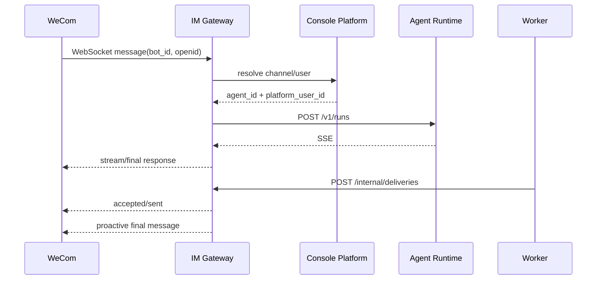
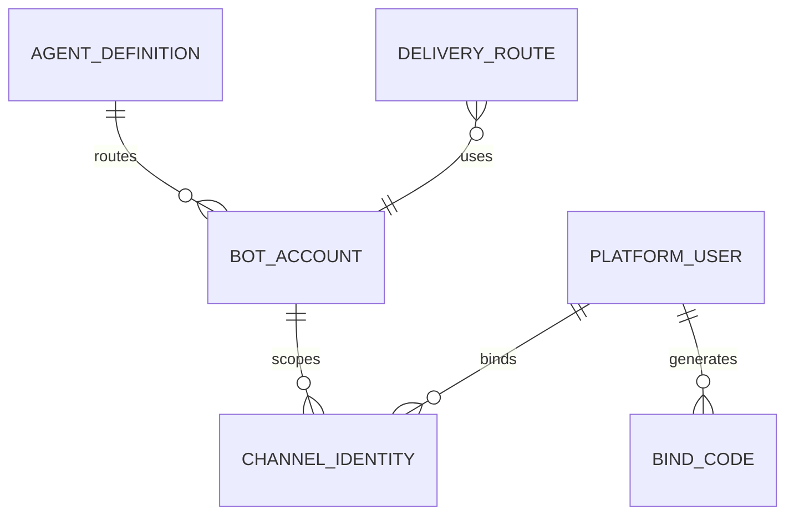

# IM Gateway 与主动投递 模块需求与设计一体化文档

> **文档编号**: MOD-IM-V1.0  
> **文档版本**: v1.0  
> **创建日期**: 2026-09-17  
> **文档状态**: 设计评审中  
> **模板**: design-full.md


## 1. 文档控制

| 项目 | 内容 |
|---|---|
| 模块 | IM Gateway 与主动投递 |
| Owner | muad-im-gateway |
| 数据 Owner | 引用 control/task Owner 表；本模块不新增表 |
| 前置模块 | 02-user-identity, 07-agent-management, 08-runtime-execution, 09-task-schedule |
| 建议代码位置 | apps/im-gateway/src/muad_im_gateway/ |

## 2. 需求分析

### 2.1 需求概述

| 项目 | 内容 |
|---|---|
| 模块名称 | IM Gateway 与主动投递 |
| 模块 ID | MOD-IM |
| 需求类型 | 中大型功能开发 |
| 业务背景 | IM SDK 类型不能渗透 Runtime；多个 bot WebSocket 要统一管理；主动推送需要稳定 route/receiver 字段。 |
| 核心目标 | 统一维护企业微信 Bot WebSocket，完成消息标准化、bot→Agent 路由、/bind、Runtime SSE 桥接和后台最终结果主动投递。 |

### 2.2 痛点与价值

| 维度 | 内容 |
|---|---|
| 目标用户/调用方 | Builder / Admin / End User / 内部服务（按模块实际入口） |
| 当前问题 | IM SDK 类型不能渗透 Runtime；多个 bot WebSocket 要统一管理；主动推送需要稳定 route/receiver 字段。 |
| 业务影响 | 模块边界或契约不固定会导致上层重复设计、接口漂移和跨模块返工。 |
| 预期价值 | 统一维护企业微信 Bot WebSocket，完成消息标准化、bot→Agent 路由、/bind、Runtime SSE 桥接和后台最终结果主动投递。 |

### 2.3 功能方案

| 功能ID | 功能名称 | 功能描述 | 优先级 | 来源 |
|---|---|---|---|---|
| FEAT-01 | Bot 连接与路由 | 一个 Gateway Service 维护多个 bot WebSocket，bot_id→agent_id。 | P0 | 需求描述 |
| FEAT-02 | 身份/命令 | /bind、/skills、/new、/stop。 | P0 | 需求描述 |
| FEAT-03 | Runtime 桥接 | ChannelEnvelope→/v1/runs→SSE→IM。 | P0 | 需求描述 |
| FEAT-04 | 主动投递 | Worker 调 /internal/deliveries，按 DeliveryRoute 主动发送最终结果。 | P0 | 需求描述 |

#### 2.3.2 字段约束

| 字段类别 | 约束 |
|---|---|
| ID | 业务实体统一 UUID；跨 Owner Schema 仅逻辑引用 UUID |
| 时间 | PostgreSQL 使用 `timestamptz`；Console 展示 `YYYY-MM-DD HH:mm:ss` |
| 删除 | 产品表统一 `is_deleted` 软删除；状态枚举不重复表达 DELETED |
| Secret | 只保存 SecretRef；Secret Value 不进入 DB / Snapshot / 日志 / LLM |
| 枚举 | API 与 DB 统一使用稳定英文枚举值，中文/英文只在 UI/i18n 层映射 |
| 错误 | 业务代码只抛稳定 `code`；`msg/http_status` 由公共配置映射 |

### 2.4 范围与边界

| 类别 | 内容 |
|---|---|
| In Scope | WeCom WebSocket Adapter、ChannelEnvelope、bot resolve、/bind /skills /new /stop、Runtime SSE relay、FinalDelivery。 |
| Out of Scope | V1 仅 WeCom WebSocket；Gateway 不执行 Agent 业务逻辑；bot_id 不绑定 Runtime Pod |
| 技术债 | 无；不为未确认的未来能力增加兼容层 |

### 2.5 验收条件

#### 2.5.1 业务规则与约束

| ID | 类型 | 描述 | 验证场景 |
|---|---|---|---|
| RULE-01 | 系统约束 | 固定 4 个部署单元；Runtime/Worker 无状态横向扩展。 | S-01 / 对应 E- 场景 |
| RULE-02 | 系统约束 | JSON REST 统一 code/msg/data/trace_id/request_id/timestamp；业务只抛 code，msg/http_status 配置映射。 | S-01 / 对应 E- 场景 |
| RULE-03 | 系统约束 | Secret Value 不进 DB/Snapshot/日志/LLM，只保存 SecretRef。 | S-01 / 对应 E- 场景 |
| RULE-04 | 系统约束 | Agent 0..N bot_id；bot_id 只指向一个 Agent；不绑定 Runtime Pod。 | S-01 / 对应 E- 场景 |
| RULE-05 | 系统约束 | User→Agent；Agent→Skill/MCP；SELECTED 再叠加资源用户 Grant；不建三元授权。 | S-01 / 对应 E- 场景 |
| RULE-06 | 系统约束 | 新 Run/Task 冻结 Snapshot；配置/授权变更只影响后续新 Run/Task。 | S-01 / 对应 E- 场景 |
| RULE-07 | 系统约束 | 跨 API/DB/Runtime/Browser 的关键流程必须 E2E，列出不得 mock 的真实边界。 | S-01 / 对应 E- 场景 |

#### 2.5.2 功能验收场景

##### 正常场景

| 场景ID | 功能ID | 测试层级 | 关键真实边界 | 归属 | 操作/前置 | 预期结果 |
|---|---|---|---|---|---|---|
| S-01 | FEAT-01 | E2E | WeCom Adapter→Gateway→Runtime | 本模块 | 两个 bot_id 指向同一 Agent 分别收到消息 | 均路由到同一逻辑 Agent，但可进入不同 Runtime Pod |
| S-02 | FEAT-02 | E2E | Gateway→bind API→DB | 本模块 | 未绑定用户发送 /bind code | 绑定成功并主动回复已验证 |
| S-03 | FEAT-04 | E2E | Worker→Gateway→WeCom | 本模块 | 后台任务完成 | 按 DeliveryRoute 主动推送最终结果 |

##### 异常场景

| 场景ID | 功能ID | 测试层级 | 关键真实边界 | 归属 | 触发条件 | 系统行为 |
|---|---|---|---|---|---|---|
| E-01 | FEAT-01 | integration | bot resolve | 本模块 | bot_id 未配置或禁用 | 不创建 Run，返回/记录 BOT_NOT_FOUND |

无可靠实测数据的性能阈值统一标记“待定”，不复制模板示例值。

## 3. 技术设计

### 3.1 技术选型与关键决策

| 决策 | 选择 | 放弃项 | 理由 |
|---|---|---|---|
| SDK 隔离 | ChannelAdapter/Envelope | 业务层直接 SDK 类型 | 后续扩 WebChat/微信无需改 Runtime |
| bot 连接 | 单 Gateway 服务多连接 | 每 bot 单独服务 | 降低部署维护成本 |
| 路由 | bot_id→logical Agent | bot_id→Pod | Runtime 保持无状态 |

基础栈：Python >=3.12、FastAPI >=0.115、SQLAlchemy 2.x、PostgreSQL；按需 Redis/NFS/Secret Provider；统一 `muad-api` 与 `muad-logging`。

### 3.2 架构与流程



### 3.3 数据设计

本模块不新增 Owner 表。读取/调用：
- `control.bot_account`：bot_id → agent_id 与 SecretRef；
- `control.channel_identity` / `control.bind_code`：外部身份和绑定；
- `task.delivery_route`：后台任务主动投递目标。

这些表由其 Owner 模块迁移；Gateway 不跨 Schema 直接写非 Owner 业务表，而经对应 Internal API/Application Service。

**ER 图**



数据库规则：所有产品表统一 `id/is_deleted/create_time/update_time`；同 Owner Schema 物理 FK，跨 Owner Schema 逻辑 UUID；迁移使用 Alembic expand→deploy→contract。

### 3.4 接口设计

```json
{
  "code":"0",
  "msg":"成功",
  "data":{},
  "trace_id":"trace-id",
  "request_id":"request-id",
  "timestamp":"2026-09-17T17:00:00+08:00"
}
```

业务异常只允许 `raise AppError("CODE")`；msg 与 HTTP Status 统一由 `config/api-messages.yaml` 映射。

| 接口ID | 名称 | 方法 | 路径 | FEAT |
|---|---|---|---|---|
| API-01 | Bot 列表 | GET | `/internal/channel/bots` | FEAT-01 |
| API-02 | 解析消息路由 | POST | `/internal/channel/resolve` | FEAT-01 |
| API-03 | 执行绑定 | POST | `/internal/channel/bind` | FEAT-02 |
| API-04 | 查询可用 Skills | GET | `/internal/channel/skills` | FEAT-02 |
| API-05 | 主动投递 | POST | `/internal/deliveries` | FEAT-04 |

| 函数ID | 签名 | 用途 | 错误码 | FEAT |\n|---|---|---|---|---|\n| LIB-01 | `ChannelAdapter.start()/stop()/send()/stream()` | 隔离官方 WeCom SDK | `CHANNEL_CONNECTION_FAILED` | FEAT-01 |
| LIB-02 | `MessageRouter.resolve(envelope) -> RouteContext` | bot/user/conversation→agent/user | `BOT_NOT_FOUND / BIND_REQUIRED` | FEAT-01 |

#### API-01 Bot 列表

```text
GET /internal/channel/bots
```

- 请求：
- `data`：
- 错误码：`COMMON_VALIDATION_ERROR / COMMON_INTERNAL_ERROR`
- 处理：

#### API-02 解析消息路由

```text
POST /internal/channel/resolve
```

- 请求：channel/bot_id/external_user_id/external_conversation_id。
- `data`：agent_id/platform_user_id?/binding_required。
- 错误码：`COMMON_VALIDATION_ERROR / COMMON_INTERNAL_ERROR`
- 处理：

#### API-03 执行绑定

```text
POST /internal/channel/bind
```

- 请求：bind_code + ChannelIdentity fields。
- `data`：
- 错误码：`COMMON_VALIDATION_ERROR / COMMON_INTERNAL_ERROR`
- 处理：

#### API-04 查询可用 Skills

```text
GET /internal/channel/skills
```

- 请求：
- `data`：
- 错误码：`COMMON_VALIDATION_ERROR / COMMON_INTERNAL_ERROR`
- 处理：

#### API-05 主动投递

```text
POST /internal/deliveries
```

- 请求：task_id/route/message/artifact_ids。
- `data`：
- 错误码：`COMMON_VALIDATION_ERROR / COMMON_INTERNAL_ERROR`
- 处理：


### 3.5 质量实现方案

- 性能：批量/聚合优先，列表禁止 N+1，真实目标待基线压测后确定。
- 可靠性：事务只覆盖原子 DB 操作；外部 IO 不包长事务；高影响错误必须有 E-/B- 验收。
- 安全：Secret/Token/Cookie 不进业务 DB、日志、Snapshot、LLM。
- 可观测：统一 JSON 日志，自动带 service/trace_id/request_id；状态变化可关联 trace_id。


## 4. 部署与运维

本模块随 `muad-im-gateway` 对应镜像/共享 package 发布；PostgreSQL、Redis、NFS、Secret Provider 外置。监控阈值待真实基线确定。

## 5. 风险与依赖

- 前置：02-user-identity, 07-agent-management, 08-runtime-execution, 09-task-schedule。
- 主要风险：官方 SDK 类型渗透核心域，导致后续通道扩展牵动 Runtime。。
- 应对：Contract Test + S/E/B 验收 + Spec Matrix。

## 6. 需求追溯矩阵

| 用户故事 | 功能ID | 接口ID | 测试用例ID | 测试层级 | 状态 |
|---|---|---|---|---|---|
| 需求描述 | FEAT-01 | API-01, API-02, LIB-01, LIB-02 | S-01, E-01 | E2E | 待实现 |
| 需求描述 | FEAT-02 | API-03, API-04 | S-02 | E2E | 待实现 |
| 需求描述 | FEAT-03 | - |  | integration | 待实现 |
| 需求描述 | FEAT-04 | API-05 | S-03 | E2E | 待实现 |

## Spec Compliance Matrix

| Spec/Rule | enforcement | 设计影响 | 设计落点 | 验证场景 | 状态/N/A 理由 |
|---|---|---|---|---|---|
| `mss-platform#RULE-ARCH-001` | required | 固定 4 个部署单元；Runtime/Worker 无状态横向扩展。 | §3.2/§3.3/§3.4 | S-01 + verifier | applied |
| `mss-platform#RULE-API-001` | required | JSON REST 统一 code/msg/data/trace_id/request_id/timestamp；业务只抛 code，msg/http_status 配置映射。 | §3.2/§3.3/§3.4 | S-01 + verifier | applied |
| `mss-platform#RULE-SECRET-001` | required | Secret Value 不进 DB/Snapshot/日志/LLM，只保存 SecretRef。 | §3.2/§3.3/§3.4 | S-01 + verifier | applied |
| `mss-platform#RULE-IM-001` | required | Agent 0..N bot_id；bot_id 只指向一个 Agent；不绑定 Runtime Pod。 | §3.2/§3.3/§3.4 | S-01 + verifier | applied |
| `mss-platform#RULE-AUTH-001` | required | User→Agent；Agent→Skill/MCP；SELECTED 再叠加资源用户 Grant；不建三元授权。 | §3.2/§3.3/§3.4 | S-01 + verifier | applied |
| `mss-platform#RULE-SNAPSHOT-001` | required | 新 Run/Task 冻结 Snapshot；配置/授权变更只影响后续新 Run/Task。 | §3.2/§3.3/§3.4 | S-01 + verifier | applied |
| `mss-platform#RULE-TEST-001` | required | 跨 API/DB/Runtime/Browser 的关键流程必须 E2E，列出不得 mock 的真实边界。 | §3.2/§3.3/§3.4 | S-01 + verifier | applied |
