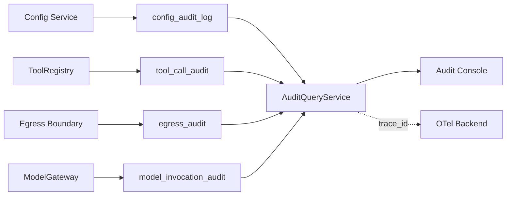
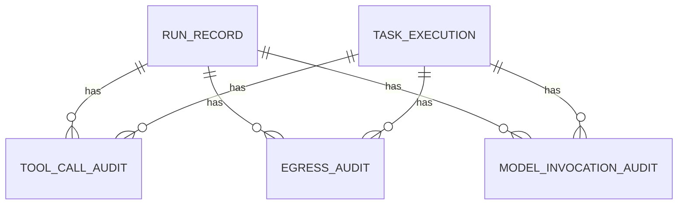

# 运行审计与可观测 模块需求与设计一体化文档

> **文档编号**: MOD-AUDIT-V1.0  
> **文档版本**: v1.0  
> **创建日期**: 2026-09-17  
> **文档状态**: 设计评审中  
> **模板**: design-full.md


## 1. 文档控制

| 项目 | 内容 |
|---|---|
| 模块 | 运行审计与可观测 |
| Owner | muad-console-platform 查询面 + Runtime/Worker 写入 |
| 数据 Owner | control/runtime |
| 前置模块 | 01-platform-foundation, 08-runtime-execution, 09-task-schedule |
| 建议代码位置 | apps/console-platform/backend/src/muad_console_platform/modules/audits/；apps/agent-runtime/src/muad_agent_runtime/audit/；apps/agent-worker/src/muad_agent_worker/audit/ |

## 2. 需求分析

### 2.1 需求概述

| 项目 | 内容 |
|---|---|
| 模块名称 | 运行审计与可观测 |
| 模块 ID | MOD-AUDIT |
| 需求类型 | 中大型功能开发 |
| 业务背景 | 配置、Tool、Egress、Model 审计分散；若 Console 各自拼字段会产生语义漂移和敏感信息泄露风险。 |
| 核心目标 | 统一审计写入和聚合查询，以 trace_id 关联 Run/Task/Tool/Egress/Model，同时保持业务 Console 与运维监控分离。 |

### 2.2 痛点与价值

| 维度 | 内容 |
|---|---|
| 目标用户/调用方 | Builder / Admin / End User / 内部服务（按模块实际入口） |
| 当前问题 | 配置、Tool、Egress、Model 审计分散；若 Console 各自拼字段会产生语义漂移和敏感信息泄露风险。 |
| 业务影响 | 模块边界或契约不固定会导致上层重复设计、接口漂移和跨模块返工。 |
| 预期价值 | 统一审计写入和聚合查询，以 trace_id 关联 Run/Task/Tool/Egress/Model，同时保持业务 Console 与运维监控分离。 |

### 2.3 功能方案

| 功能ID | 功能名称 | 功能描述 | 优先级 | 来源 |
|---|---|---|---|---|
| FEAT-01 | 审计写入 | 各执行路径写结构化 Audit 并统一 trace_id。 | P0 | 需求描述 |
| FEAT-02 | 审计聚合查询 | 统一 audit_type/action/result/target/actor/agent/trace_id。 | P0 | 需求描述 |
| FEAT-03 | 详情关联 | 按 trace_id 关联相关 Run/Task/Tool/Egress/Model。 | P0 | 需求描述 |

#### 2.3.2 字段约束

| 字段类别 | 约束 |
|---|---|
| ID | 业务实体统一 UUID；跨 Owner Schema 仅逻辑引用 UUID |
| 时间 | PostgreSQL 使用 `timestamptz`；Console 展示 `YYYY-MM-DD HH:mm:ss` |
| 删除 | 产品表统一 `is_deleted` 软删除；状态枚举不重复表达 DELETED |
| Secret | 只保存 SecretRef；Secret Value 不进入 DB / Snapshot / 日志 / LLM |
| 枚举 | API 与 DB 统一使用稳定英文枚举值，中文/英文只在 UI/i18n 层映射 |
| 错误 | 业务代码只抛稳定 `code`；`msg/http_status` 由公共配置映射 |

### 2.4 范围与边界

| 类别 | 内容 |
|---|---|
| In Scope | config/tool/egress/model audit、聚合列表/detail、trace_id 关联、日志/OTel 接入边界。 |
| Out of Scope | Console 不展示 Pod/Redis/PostgreSQL 健康；不保存完整 Prompt/Secret |
| 技术债 | 无；不为未确认的未来能力增加兼容层 |

### 2.5 验收条件

#### 2.5.1 业务规则与约束

| ID | 类型 | 描述 | 验证场景 |
|---|---|---|---|
| RULE-01 | 系统约束 | 统一 logging-kit；仅配置 LOG_DIR；日志按 service/YYYY-MM-DD.log 保存并带 trace_id/request_id。 | S-01 / 对应 E- 场景 |
| RULE-02 | 系统约束 | JSON REST 统一 code/msg/data/trace_id/request_id/timestamp；业务只抛 code，msg/http_status 配置映射。 | S-01 / 对应 E- 场景 |
| RULE-03 | 系统约束 | 产品表统一 is_deleted/create_time/update_time；同 Owner Schema 物理 FK，跨 Owner Schema 逻辑 UUID。 | S-01 / 对应 E- 场景 |
| RULE-04 | 系统约束 | Secret Value 不进 DB/Snapshot/日志/LLM，只保存 SecretRef。 | S-01 / 对应 E- 场景 |
| RULE-05 | 系统约束 | Console 时间统一 YYYY-MM-DD HH:mm:ss。 | S-01 / 对应 E- 场景 |
| RULE-06 | 系统约束 | 跨 API/DB/Runtime/Browser 的关键流程必须 E2E，列出不得 mock 的真实边界。 | S-01 / 对应 E- 场景 |

#### 2.5.2 功能验收场景

##### 正常场景

| 场景ID | 功能ID | 测试层级 | 关键真实边界 | 归属 | 操作/前置 | 预期结果 |
|---|---|---|---|---|---|---|
| S-01 | FEAT-02 | E2E | Browser→aggregate query→multiple audit tables | 本模块 | 按 trace_id 搜索 | 返回同链路相关审计且字段归一 |
| S-02 | FEAT-01 | integration | Tool/Egress/Model→DB | 本模块 | 一次 Skill 调模型和平台 | 各 Audit 同 trace_id 且无 Secret |

##### 异常场景

| 场景ID | 功能ID | 测试层级 | 关键真实边界 | 归属 | 触发条件 | 系统行为 |
|---|---|---|---|---|---|---|
| E-01 | FEAT-03 | integration | Audit query→missing source | 本模块 | 关联 Run 已归档/不可读 | 审计自身仍可展示，不返回假关联 |

无可靠实测数据的性能阈值统一标记“待定”，不复制模板示例值。

## 3. 技术设计

### 3.1 技术选型与关键决策

| 决策 | 选择 | 放弃项 | 理由 |
|---|---|---|---|
| Audit 存储 | 各 Owner 表 | 单一超宽审计表 | 保留领域字段和写入边界 |
| Console | 聚合 QueryService | 前端分别查4表 | 避免 N+1 和字段漂移 |
| 敏感数据 | hash/preview/redaction | 完整 request/prompt | 安全合规 |

基础栈：Python >=3.12、FastAPI >=0.115、SQLAlchemy 2.x、PostgreSQL；按需 Redis/NFS/Secret Provider；统一 `muad-api` 与 `muad-logging`。

### 3.2 架构与流程



### 3.3 数据设计

#### `control.config_audit_log`

**表说明**

- **用途**：控制面配置变更审计。
- **主要写入方**：Console Application Service。
- **主要读取方**：Admin/审计。
- **生命周期/边界**：append-only，保存前后差异但不含 Secret Value。

| 字段 | 类型 | 约束 | 说明 |
|---|---|---|---|
| `id` | uuid | PK | 主键 |
| `is_deleted` | boolean | NOT NULL DEFAULT false | 软删除 |
| `create_time` | timestamptz | NOT NULL DEFAULT now() | 创建时间 |
| `update_time` | timestamptz | NOT NULL DEFAULT now() | 更新时间 |
| `tenant_id` | varchar(64) | NOT NULL | 隔离键 |
| `actor_user_id` | uuid | NOT NULL | 操作人 |
| `resource_type` | varchar(64) | NOT NULL | AGENT/SKILL/MCP/... |
| `resource_id` | uuid | NOT NULL | 资源 ID |
| `action` | varchar(64) | NOT NULL | CREATE/UPDATE/DELETE/GRANT/... |
| `before_json` | jsonb |  | 修改前 |
| `after_json` | jsonb |  | 修改后 |
| `trace_id` | varchar(64) |  | Trace |
| `source_ip` | varchar(64) |  | 来源 IP |

**索引/约束**：

- `INDEX (resource_type, resource_id, create_time DESC)`
- `INDEX (actor_user_id, create_time DESC)`

#### `runtime.tool_call_audit`

**表说明**

- **用途**：所有 ToolRegistry 调用的统一审计。
- **主要写入方**：Runtime/Worker 共享 Tool Executor。
- **主要读取方**：Admin/Trace。
- **生命周期/边界**：记录参数摘要/结果状态，避免 Secret。

| 字段 | 类型 | 约束 | 说明 |
|---|---|---|---|
| `id` | uuid | PK | 主键 |
| `is_deleted` | boolean | NOT NULL DEFAULT false | 软删除 |
| `create_time` | timestamptz | NOT NULL DEFAULT now() | 创建时间 |
| `update_time` | timestamptz | NOT NULL DEFAULT now() | 更新时间 |
| `tenant_id` | varchar(64) | NOT NULL | 隔离键 |
| `run_id` | uuid |  | 实时 Run；与 task_id 至少一个存在 |
| `task_id` | uuid |  | 后台 Task |
| `conversation_id` | uuid |  | 会话；Scheduled Task 可为空 |
| `tool_call_id` | varchar(128) | NOT NULL | LLM Tool Call ID |
| `tool_name` | varchar(256) | NOT NULL | 规范化 tool 名 |
| `tool_kind` | varchar(32) | NOT NULL | BUILTIN/SKILL/MCP |
| `prepared_args_hash` | varchar(128) | NOT NULL | 不可变参数哈希 |
| `args_preview_json` | jsonb | NOT NULL DEFAULT '{}' | 脱敏参数预览 |
| `status` | varchar(24) | NOT NULL | PREPARED/RUNNING/SUCCESS/FAILED/DENIED |
| `start_time` | timestamptz |  | 开始 |
| `end_time` | timestamptz |  | 结束 |
| `latency_ms` | bigint |  | 耗时 |
| `error_code` | varchar(64) |  | 错误码 |
| `error_message` | text |  | 错误摘要 |
| `artifact_id` | uuid |  | 大结果引用 |

**索引/约束**：

- `UNIQUE (run_id, tool_call_id) WHERE run_id IS NOT NULL AND is_deleted=false`
- `UNIQUE (task_id, tool_call_id) WHERE task_id IS NOT NULL AND is_deleted=false`
- `CHECK (run_id IS NOT NULL OR task_id IS NOT NULL)`
- `INDEX (run_id, create_time) WHERE run_id IS NOT NULL`
- `INDEX (task_id, create_time) WHERE task_id IS NOT NULL`
- `INDEX (tool_name, status, create_time DESC)`

#### `runtime.egress_audit`

**表说明**

- **用途**：Skill/Runtime/Worker 调用业务平台的审计。
- **主要写入方**：Runtime/Worker 复用的 Egress Boundary。
- **主要读取方**：Admin/Trace。
- **生命周期/边界**：记录逻辑平台、actor、耗时和结果；V1 不做复杂公网安全策略。

| 字段 | 类型 | 约束 | 说明 |
|---|---|---|---|
| `id` | uuid | PK | 主键 |
| `is_deleted` | boolean | NOT NULL DEFAULT false | 软删除 |
| `create_time` | timestamptz | NOT NULL DEFAULT now() | 创建时间 |
| `update_time` | timestamptz | NOT NULL DEFAULT now() | 更新时间 |
| `tenant_id` | varchar(64) | NOT NULL | 隔离键 |
| `run_id` | uuid |  | 实时 Run |
| `task_id` | uuid |  | 后台 Task |
| `user_id` | uuid | NOT NULL | actor |
| `skill_artifact_id` | uuid |  | 调用来源 Skill |
| `platform_id` | uuid |  | 项目平台 |
| `adapter_key` | varchar(128) |  | 实际使用的 PlatformAdapter |
| `target_type` | varchar(32) | NOT NULL | PLATFORM/HTTP/MCP |
| `target` | text | NOT NULL | 逻辑目标/脱敏后的地址 |
| `operation` | varchar(256) |  | operation/path/tool |
| `method` | varchar(16) |  | HTTP method |
| `policy_decision` | varchar(16) | NOT NULL | ALLOW/DENY |
| `credential_ref_id` | uuid |  | 仅记录引用 ID，不记录值 |
| `status_code` | int |  | 下游状态 |
| `result_status` | varchar(24) | NOT NULL | SUCCESS/FAILED/DENIED |
| `latency_ms` | bigint |  | 耗时 |
| `error_code` | varchar(64) |  | 错误码 |

**索引/约束**：

- `CHECK (run_id IS NOT NULL OR task_id IS NOT NULL)`
- `INDEX (run_id, create_time) WHERE run_id IS NOT NULL`
- `INDEX (task_id, create_time) WHERE task_id IS NOT NULL`
- `INDEX (user_id, create_time DESC)`
- `INDEX (platform_id, result_status, create_time DESC)`

#### `runtime.model_invocation_audit`

**表说明**

- **用途**：模型调用与重试审计。
- **主要写入方**：Runtime/Worker 复用的 ModelGateway。
- **主要读取方**：Admin/Trace/指标。
- **生命周期/边界**：记录 provider/model/token/latency/retry，不保存完整敏感 Prompt。

| 字段 | 类型 | 约束 | 说明 |
|---|---|---|---|
| `id` | uuid | PK | 主键 |
| `is_deleted` | boolean | NOT NULL DEFAULT false | 软删除 |
| `create_time` | timestamptz | NOT NULL DEFAULT now() | 创建时间 |
| `update_time` | timestamptz | NOT NULL DEFAULT now() | 更新时间 |
| `tenant_id` | varchar(64) | NOT NULL | 隔离键 |
| `run_id` | uuid |  | 实时 Run |
| `task_id` | uuid |  | 后台 Task/AgentStep |
| `provider` | varchar(64) | NOT NULL | Provider |
| `model` | varchar(128) | NOT NULL | Model |
| `attempt` | int | NOT NULL | 第几次尝试 |
| `retry_reason` | varchar(64) |  | 重试原因 |
| `input_tokens` | bigint |  | 输入 token |
| `output_tokens` | bigint |  | 输出 token |
| `latency_ms` | bigint |  | 耗时 |
| `status` | varchar(24) | NOT NULL | SUCCESS/FAILED/CANCELLED |
| `error_code` | varchar(64) |  | 错误码 |

**索引/约束**：

- `CHECK (run_id IS NOT NULL OR task_id IS NOT NULL)`
- `INDEX (run_id, attempt) WHERE run_id IS NOT NULL`
- `INDEX (task_id, attempt) WHERE task_id IS NOT NULL`
- `INDEX (provider, model, status, create_time DESC)`

**ER 图**



数据库规则：所有产品表统一 `id/is_deleted/create_time/update_time`；同 Owner Schema 物理 FK，跨 Owner Schema 逻辑 UUID；迁移使用 Alembic expand→deploy→contract。

### 3.4 接口设计

```json
{
  "code":"0",
  "msg":"成功",
  "data":{},
  "trace_id":"trace-id",
  "request_id":"request-id",
  "timestamp":"2026-09-17T17:00:00+08:00"
}
```

业务异常只允许 `raise AppError("CODE")`；msg 与 HTTP Status 统一由 `config/api-messages.yaml` 映射。

| 接口ID | 名称 | 方法 | 路径 | FEAT |
|---|---|---|---|---|
| API-01 | 审计列表 | GET | `/api/v1/audits` | FEAT-02 |
| API-02 | 审计详情 | GET | `/api/v1/audits/{audit_id}` | FEAT-03 |
| API-03 | Admin Run 列表 | GET | `/internal/admin/runs` | FEAT-03 |
| API-04 | Admin Run 详情 | GET | `/internal/admin/runs/{run_id}` | FEAT-03 |


#### API-01 审计列表

```text
GET /api/v1/audits
```

- 请求：audit_type/resource_type/resource_id/actor_user_id/action/trace_id/start_time/end_time/page/page_size。
- `data`：
- 错误码：`COMMON_VALIDATION_ERROR / COMMON_INTERNAL_ERROR`
- 处理：

#### API-02 审计详情

```text
GET /api/v1/audits/{audit_id}
```

- 请求：
- `data`：
- 错误码：`COMMON_VALIDATION_ERROR / COMMON_INTERNAL_ERROR`
- 处理：

#### API-03 Admin Run 列表

```text
GET /internal/admin/runs
```

- 请求：
- `data`：
- 错误码：`COMMON_VALIDATION_ERROR / COMMON_INTERNAL_ERROR`
- 处理：

#### API-04 Admin Run 详情

```text
GET /internal/admin/runs/{run_id}
```

- 请求：
- `data`：
- 错误码：`COMMON_VALIDATION_ERROR / COMMON_INTERNAL_ERROR`
- 处理：


### 3.5 质量实现方案

- 性能：批量/聚合优先，列表禁止 N+1，真实目标待基线压测后确定。
- 可靠性：事务只覆盖原子 DB 操作；外部 IO 不包长事务；高影响错误必须有 E-/B- 验收。
- 安全：Secret/Token/Cookie 不进业务 DB、日志、Snapshot、LLM。
- 可观测：统一 JSON 日志，自动带 service/trace_id/request_id；状态变化可关联 trace_id。


## 4. 部署与运维

本模块随 `muad-console-platform 查询面 + Runtime/Worker 写入` 对应镜像/共享 package 发布；PostgreSQL、Redis、NFS、Secret Provider 外置。监控阈值待真实基线确定。

## 5. 风险与依赖

- 前置：01-platform-foundation, 08-runtime-execution, 09-task-schedule。
- 主要风险：preview 或 error_message 泄露 Secret/完整 Prompt。。
- 应对：Contract Test + S/E/B 验收 + Spec Matrix。

## 6. 需求追溯矩阵

| 用户故事 | 功能ID | 接口ID | 测试用例ID | 测试层级 | 状态 |
|---|---|---|---|---|---|
| 需求描述 | FEAT-01 | - | S-02 | integration | 待实现 |
| 需求描述 | FEAT-02 | API-01 | S-01 | E2E | 待实现 |
| 需求描述 | FEAT-03 | API-02, API-03, API-04 | E-01 | integration | 待实现 |

## Spec Compliance Matrix

| Spec/Rule | enforcement | 设计影响 | 设计落点 | 验证场景 | 状态/N/A 理由 |
|---|---|---|---|---|---|
| `mss-platform#RULE-LOG-001` | required | 统一 logging-kit；仅配置 LOG_DIR；日志按 service/YYYY-MM-DD.log 保存并带 trace_id/request_id。 | §3.2/§3.3/§3.4 | S-01 + verifier | applied |
| `mss-platform#RULE-API-001` | required | JSON REST 统一 code/msg/data/trace_id/request_id/timestamp；业务只抛 code，msg/http_status 配置映射。 | §3.2/§3.3/§3.4 | S-01 + verifier | applied |
| `mss-platform#RULE-DATA-001` | required | 产品表统一 is_deleted/create_time/update_time；同 Owner Schema 物理 FK，跨 Owner Schema 逻辑 UUID。 | §3.2/§3.3/§3.4 | S-01 + verifier | applied |
| `mss-platform#RULE-SECRET-001` | required | Secret Value 不进 DB/Snapshot/日志/LLM，只保存 SecretRef。 | §3.2/§3.3/§3.4 | S-01 + verifier | applied |
| `mss-platform#RULE-TIME-001` | required | Console 时间统一 YYYY-MM-DD HH:mm:ss。 | §3.2/§3.3/§3.4 | S-01 + verifier | applied |
| `mss-platform#RULE-TEST-001` | required | 跨 API/DB/Runtime/Browser 的关键流程必须 E2E，列出不得 mock 的真实边界。 | §3.2/§3.3/§3.4 | S-01 + verifier | applied |
