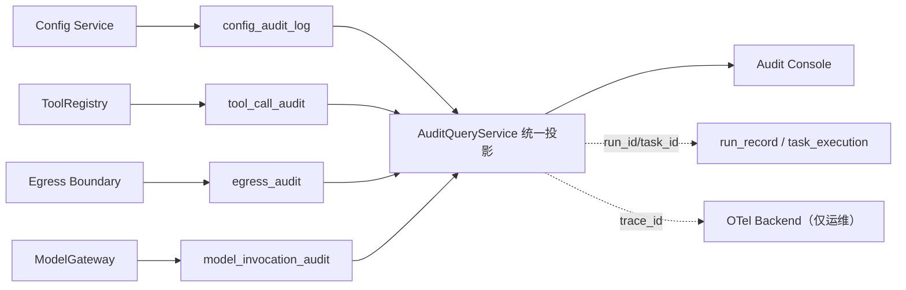
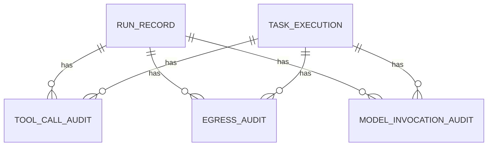

# 运行审计与可观测 模块需求与设计一体化文档

> **文档编号**: MOD-AUDIT-V1.1  
> **文档版本**: v1.1  
> **创建日期**: 2026-09-17  
> **文档状态**: 设计评审中  
> **模板**: design-full.md


## 1. 文档控制

### 1.1 责任人

| 角色 | 姓名 | 职责范围 |
|---|---|---|
| 产品经理 | 待定 | 需求定义、业务验收 |
| 开发负责人 | 待定 | 技术方案、代码实现 |
| 测试负责人 | 待定 | 测试策略、质量保证 |
| 架构师 | 待定 | 架构审核、技术决策 |

### 1.2 修订历史

| 版本 | 日期 | 作者 | 变更描述 |
|---|---|---|---|
| v1.0 | 2026-09-17 | — | 需求与设计初稿 |
| v1.1 | 2026-09-18 | — | 对齐 V1.4 决策（docs/17）：补 `result_status` 映射、`target_type` 统一、config 审计同事务与 actor 语义、日志脱敏、聚合投影与 OTel/metrics 章节、task_type 命名收敛；字段名对齐 docs/15 |

**模块信息**

| 项目 | 内容 |
|---|---|
| 模块 | 运行审计与可观测 |
| Owner | muad-console-platform 查询面 + Runtime/Worker 写入 |
| 数据 Owner | control/runtime |
| 前置模块 | 01-platform-foundation, 08-runtime-execution, 09-task-schedule, 13-console-auth |
| 建议代码位置 | apps/console-platform/backend/src/muad_console_platform/modules/audits/；apps/agent-runtime/src/muad_agent_runtime/audit/；apps/agent-worker/src/muad_agent_worker/audit/ |

**评审边界说明**:
- **需求评审**: 第 2 章（需求分析）→ 通过后锁定为需求基线 v1.0
- **设计评审**: 第 3-4 章（技术设计 + 部署运维）→ 通过后锁定设计基线 v1.x
- **交接契约**: 2.5 验收条件 — 需求定义 What，设计实现 How

## 2. 需求分析

### 2.1 需求概述

| 项目 | 内容 |
|---|---|
| 模块名称 | 运行审计与可观测 |
| 模块 ID | MOD-AUDIT |
| 需求类型 | 中大型功能开发 |
| 业务背景 | 配置、Tool、Egress、Model 审计分散；若 Console 各自拼字段会产生语义漂移和敏感信息泄露风险。 |
| 核心目标 | 统一审计写入和聚合查询，以 `trace_id` 关联 Run/Task/Tool/Egress/Model，同时保持业务 Console 与运维监控分离。 |

### 2.2 痛点与价值

| 维度 | 内容 |
|---|---|
| 目标用户/调用方 | Builder / Admin / End User / 内部服务（按模块实际入口） |
| 当前问题 | 配置、Tool、Egress、Model 审计分散；若 Console 各自拼字段会产生语义漂移和敏感信息泄露风险。 |
| 业务影响 | 模块边界或契约不固定会导致上层重复设计、接口漂移和跨模块返工。 |
| 预期价值 | 统一审计写入和聚合查询，以 trace_id 关联 Run/Task/Tool/Egress/Model，同时保持业务 Console 与运维监控分离。 |

### 2.3 功能方案

| 功能ID | 功能名称 | 功能描述 | 优先级 | 来源 |
|---|---|---|---|---|
| FEAT-01 | 审计写入 | 各执行路径写结构化 Audit 并统一 trace_id；config 审计与业务变更同事务；敏感字段先脱敏再落库。 | P0 | 需求描述 |
| FEAT-02 | 审计聚合查询 | 统一 audit_type/action/result_status/target/actor/agent/trace_id。 | P0 | 需求描述 |
| FEAT-03 | 详情关联 | 按 trace_id 关联相关 Run/Task/Tool/Egress/Model，并提供 Admin Run 详情响应契约。 | P0 | 需求描述 |

#### 2.3.2 字段约束

| 字段类别 | 约束 |
|---|---|
| ID | 业务实体统一 UUID；跨 Owner Schema 仅逻辑引用 UUID |
| 时间 | PostgreSQL 使用 `timestamptz`；Console 展示 `YYYY-MM-DD HH:mm:ss` |
| 删除 | 产品表统一 `is_deleted` 软删除；状态枚举不重复表达 DELETED |
| Secret | 只保存 SecretRef；Secret Value 不进入 DB / Snapshot / 日志 / LLM / Audit |
| 脱敏 | logging-kit 至少识别 Authorization/Cookie/Set-Cookie/api_key/access_token/refresh_token/secret/password 并遮蔽（docs/09 §3） |
| 枚举 | API 与 DB 统一使用稳定英文枚举值，中文/英文只在 UI/i18n 层映射 |
| 错误 | 业务代码只抛稳定 `code`；`msg/http_status` 由公共配置映射；只使用已登记错误码 |

### 2.4 范围与边界

| 类别 | 内容 |
|---|---|
| In Scope | config/tool/egress/model audit、聚合列表/detail、trace_id 关联、日志脱敏、OTel/metrics 目录与导出边界、Admin Run 详情响应契约。 |
| Out of Scope | Console 不展示 Pod/Redis/PostgreSQL 健康；不保存完整 Prompt/Secret；不把 OTel 监控大盘搬进业务 Console；不做审计记录编辑/删除。 |
| 技术债 | 无；不为未确认的未来能力增加兼容层 |

### 2.5 验收条件

#### 2.5.1 业务规则与约束

| ID | 类型 | 描述 | 验证场景 |
|---|---|---|---|
| RULE-01 | 系统约束 | 统一 logging-kit；仅配置 LOG_DIR；日志按 service/YYYY-MM-DD.log 保存并带 trace_id/request_id；Authorization/Cookie/Set-Cookie/api_key/access_token/refresh_token/secret/password 必须遮蔽。 | S-01 / E-02 |
| RULE-02 | 系统约束 | JSON REST 统一 code/msg/data/trace_id/request_id/timestamp；业务只抛 code，msg/http_status 配置映射；分页 `{items,page,page_size,total}` 且 `page_size<=100`。 | S-01 / E-03 |
| RULE-03 | 系统约束 | 产品表统一 is_deleted/create_time/update_time；同 Owner Schema 物理 FK，跨 Owner Schema 逻辑 UUID。 | S-02 / E-01 |
| RULE-04 | 系统约束 | Secret Value 不进 DB/Snapshot/日志/LLM，只保存 SecretRef；审计只存 hash/preview/脱敏值。 | S-02 / E-02 |
| RULE-05 | 系统约束 | Console 时间统一 YYYY-MM-DD HH:mm:ss。 | S-01 / E-01 |
| RULE-06 | 系统约束 | 跨 API/DB/Runtime/Browser 的关键流程必须 E2E，列出不得 mock 的真实边界。 | S-01 / E-01 |
| RULE-07 | 系统约束 | config_audit_log 与业务变更同一事务写入；`actor_user_id` = 登录的 `console_account.id`（账号模型见 13-console-auth 模块）；业务事务回滚则审计不落库。 | S-04 / E-04 |
| RULE-08 | 系统约束 | 运行审计统一暴露 `result_status`：egress 取 `egress_audit.result_status`、tool 取 `tool_call_audit.status`、model 取 `model_invocation_audit.status`，config 固定 `SUCCESS`（docs/07 §10.11）。 | S-01 / S-03 |

#### 2.5.2 功能验收场景

##### 正常场景

| 场景ID | 功能ID | 优先级 | 测试层级 | 关键真实边界 | 归属 | 操作/前置 | 预期结果 |
|---|---|---|---|---|---|---|---|
| S-01 | FEAT-02 | P0 | E2E | Browser→aggregate query→multiple audit tables | 本模块 | 按 trace_id 搜索 | 返回同链路相关审计且字段归一，含 `result_status` |
| S-02 | FEAT-01 | P0 | integration | Tool/Egress/Model→DB | 本模块 | 一次 Skill 调模型和平台 | 各 Audit 同 trace_id 且无 Secret |
| S-03 | FEAT-03 | P0 | E2E | Browser→Admin Run detail→runtime tables | 本模块 | Admin 打开 Run 详情 | 返回 Run/Snapshot/Timeline/Tool/Egress/Model/Artifact，无 Secret |
| S-04 | FEAT-01 | P0 | integration | Console AppService→DB | 本模块 | 更新 Agent revision 并写 config_audit_log | 审计与业务变更同一事务，`actor_user_id` 为登录 `console_account.id` |

##### 异常场景

| 场景ID | 功能ID | 测试层级 | 关键真实边界 | 归属 | 触发条件 | 系统行为 |
|---|---|---|---|---|---|---|
| E-01 | FEAT-03 | integration | Audit query→missing source | 本模块 | 关联 Run 已归档/不可读 | 审计自身仍可展示，`related` 置空并标记 missing，不返回假关联 |
| E-02 | FEAT-01 | integration | Logging→redaction | 本模块 | payload 含 Authorization/api_key/refresh_token 等 | DB/Audit/日志均为遮蔽值，无明文（docs/09 §3） |
| E-03 | FEAT-02 | integration | Query validation | 本模块 | `result_status` 非法枚举或时间区间非法 | `COMMON_VALIDATION_ERROR`，不返回未过滤全量 |
| E-04 | FEAT-01 | integration | Config update transaction | 本模块 | 业务变更事务回滚 | config_audit_log 不产生记录（同事务语义） |

无可靠实测数据的性能阈值统一标记“待定”，不复制模板示例值。

## 3. 技术设计

### 3.1 技术选型与关键决策

| 决策 | 选择 | 放弃项 | 理由 |
|---|---|---|---|
| Audit 存储 | 各 Owner 表（control/runtime） | 单一超宽审计表 | 保留领域字段和写入边界，与 docs/02/migrations 一致 |
| Console | 聚合 QueryService（统一投影） | 前端分别查 4 表 | 避免 N+1 和字段漂移 |
| 敏感数据 | 写入前脱敏 + logging-kit 出口遮蔽 | 仅日志层过滤 | DB/Audit/日志三层都不落明文 |
| trace 关联 | run_id/task_id join 解析 | 审计表冗余 trace_id | 与 docs/02 表定义一致，避免双份事实 |
| OTel | 只作运维导出 | 业务 Console 展示中间件健康 | 业务/运维分离（docs/00 §0.7） |

基础栈：Python >=3.12、FastAPI >=0.115、SQLAlchemy 2.x、PostgreSQL；按需 Redis/NFS/Secret Provider；统一 `muad-api` 与 `muad-logging`。

### 3.2 架构与流程



- 审计写入方：Config Service（Console 应用服务）、ToolRegistry、Egress Boundary、ModelGateway；均先脱敏再写；
- 查询面：Console 聚合投影；运行审计按 `run_id → run_record.trace_id`、`task_id → task_event.trace_id` 关联 trace；
- OTel/监控后端只作运维排障，不回流为业务审计数据源。

### 3.3 数据设计

#### `control.config_audit_log`

**表说明**

- **用途**：控制面配置变更审计。
- **主要写入方**：Console Application Service；与业务变更**同一事务**写入，业务回滚则审计不落库（RULE-07）。
- **actor 语义**：`actor_user_id` = 登录的 `console_account.id`（账号/会话模型见 13-console-auth 模块）。
- **主要读取方**：Admin/审计。
- **生命周期/边界**：append-only，保存前后差异但不含 Secret Value；该表无 `result_status` 列，统一投影固定为 `SUCCESS`（docs/07 §10.11）。

| 字段 | 类型 | 约束 | 说明 |
|---|---|---|---|
| `id` | uuid | PK | 主键 |
| `is_deleted` | boolean | NOT NULL DEFAULT false | 软删除 |
| `create_time` | timestamptz | NOT NULL DEFAULT now() | 创建时间 |
| `update_time` | timestamptz | NOT NULL DEFAULT now() | 更新时间 |
| `tenant_id` | varchar(64) | NOT NULL | 隔离键 |
| `actor_user_id` | uuid | NOT NULL | 登录 console_account.id |
| `resource_type` | varchar(64) | NOT NULL | AGENT/SKILL/MCP/MODEL/PROJECT_PLATFORM/USER/GRANT |
| `resource_id` | uuid | NOT NULL | 资源 ID |
| `action` | varchar(64) | NOT NULL | CREATE/UPDATE/DELETE/GRANT/... |
| `before_json` | jsonb |  | 修改前（已脱敏） |
| `after_json` | jsonb |  | 修改后（已脱敏） |
| `trace_id` | varchar(64) |  | Trace |
| `source_ip` | varchar(64) |  | 来源 IP |

**索引/约束**：

- `INDEX (resource_type, resource_id, create_time DESC)`
- `INDEX (actor_user_id, create_time DESC)`

#### `runtime.tool_call_audit`

**表说明**

- **用途**：所有 ToolRegistry 调用的统一审计。
- **主要写入方**：Runtime/Worker 共享 Tool Executor。
- **主要读取方**：Admin/Trace。
- **生命周期/边界**：记录参数摘要/结果状态，避免 Secret。

| 字段 | 类型 | 约束 | 说明 |
|---|---|---|---|
| `id` | uuid | PK | 主键 |
| `is_deleted` | boolean | NOT NULL DEFAULT false | 软删除 |
| `create_time` | timestamptz | NOT NULL DEFAULT now() | 创建时间 |
| `update_time` | timestamptz | NOT NULL DEFAULT now() | 更新时间 |
| `tenant_id` | varchar(64) | NOT NULL | 隔离键 |
| `run_id` | uuid |  | 实时 Run；与 task_id 至少一个存在 |
| `task_id` | uuid |  | 后台 Task |
| `conversation_id` | uuid |  | 会话；Scheduled Task 可为空 |
| `tool_call_id` | varchar(128) | NOT NULL | LLM Tool Call ID |
| `tool_name` | varchar(256) | NOT NULL | 规范化 tool 名 |
| `tool_kind` | varchar(32) | NOT NULL | BUILTIN/SKILL/MCP |
| `prepared_args_hash` | varchar(128) | NOT NULL | 不可变参数哈希 |
| `args_preview_json` | jsonb | NOT NULL DEFAULT '{}' | 脱敏参数预览 |
| `status` | varchar(24) | NOT NULL | PREPARED/RUNNING/SUCCESS/FAILED/DENIED |
| `start_time` | timestamptz |  | 开始 |
| `end_time` | timestamptz |  | 结束 |
| `latency_ms` | bigint |  | 耗时 |
| `error_code` | varchar(64) |  | 错误码 |
| `error_message` | text |  | 错误摘要（已脱敏） |
| `artifact_id` | uuid |  | 大结果引用 |

**索引/约束**：

- `UNIQUE (run_id, tool_call_id) WHERE run_id IS NOT NULL AND is_deleted=false`
- `UNIQUE (task_id, tool_call_id) WHERE task_id IS NOT NULL AND is_deleted=false`
- `CHECK (run_id IS NOT NULL OR task_id IS NOT NULL)`
- `INDEX (run_id, create_time) WHERE run_id IS NOT NULL`
- `INDEX (task_id, create_time) WHERE task_id IS NOT NULL`
- `INDEX (tool_name, status, create_time DESC)`

#### `runtime.egress_audit`

**表说明**

- **用途**：Skill/Runtime/Worker 调用业务平台的审计。
- **主要写入方**：Runtime/Worker 复用的 Egress Boundary。
- **主要读取方**：Admin/Trace。
- **生命周期/边界**：记录逻辑平台、actor、耗时和结果；V1 不做复杂公网安全策略。

| 字段 | 类型 | 约束 | 说明 |
|---|---|---|---|
| `id` | uuid | PK | 主键 |
| `is_deleted` | boolean | NOT NULL DEFAULT false | 软删除 |
| `create_time` | timestamptz | NOT NULL DEFAULT now() | 创建时间 |
| `update_time` | timestamptz | NOT NULL DEFAULT now() | 更新时间 |
| `tenant_id` | varchar(64) | NOT NULL | 隔离键 |
| `run_id` | uuid |  | 实时 Run |
| `task_id` | uuid |  | 后台 Task |
| `user_id` | uuid | NOT NULL | actor |
| `skill_artifact_id` | uuid |  | 调用来源 Skill |
| `platform_id` | uuid |  | 项目平台 |
| `adapter_key` | varchar(128) |  | 实际使用的 PlatformAdapter |
| `target_type` | varchar(32) | NOT NULL | `PLATFORM_SERVICE/HTTP/MCP` |
| `target` | text | NOT NULL | 逻辑目标/脱敏后的地址 |
| `operation` | varchar(256) |  | operation/path/tool |
| `method` | varchar(16) |  | HTTP method |
| `policy_decision` | varchar(16) | NOT NULL | ALLOW/DENY |
| `credential_ref_id` | uuid |  | 仅记录引用 ID，不记录值 |
| `status_code` | int |  | 下游状态 |
| `result_status` | varchar(24) | NOT NULL | SUCCESS/FAILED/DENIED |
| `latency_ms` | bigint |  | 耗时 |
| `error_code` | varchar(64) |  | 错误码 |

**索引/约束**：

- `CHECK (run_id IS NOT NULL OR task_id IS NOT NULL)`
- `INDEX (run_id, create_time) WHERE run_id IS NOT NULL`
- `INDEX (task_id, create_time) WHERE task_id IS NOT NULL`
- `INDEX (user_id, create_time DESC)`
- `INDEX (platform_id, result_status, create_time DESC)`

#### `runtime.model_invocation_audit`

**表说明**

- **用途**：模型调用与重试审计。
- **主要写入方**：Runtime/Worker 复用的 ModelGateway。
- **主要读取方**：Admin/Trace/指标。
- **生命周期/边界**：记录 provider/model/token/latency/retry，不保存完整敏感 Prompt。

| 字段 | 类型 | 约束 | 说明 |
|---|---|---|---|
| `id` | uuid | PK | 主键 |
| `is_deleted` | boolean | NOT NULL DEFAULT false | 软删除 |
| `create_time` | timestamptz | NOT NULL DEFAULT now() | 创建时间 |
| `update_time` | timestamptz | NOT NULL DEFAULT now() | 更新时间 |
| `tenant_id` | varchar(64) | NOT NULL | 隔离键 |
| `run_id` | uuid |  | 实时 Run |
| `task_id` | uuid |  | 后台 Task |
| `provider` | varchar(64) | NOT NULL | Provider |
| `model` | varchar(128) | NOT NULL | Model |
| `attempt` | int | NOT NULL | 第几次尝试 |
| `retry_reason` | varchar(64) |  | 重试原因 |
| `input_tokens` | bigint |  | 输入 token |
| `output_tokens` | bigint |  | 输出 token |
| `latency_ms` | bigint |  | 耗时 |
| `status` | varchar(24) | NOT NULL | SUCCESS/FAILED/CANCELLED |
| `error_code` | varchar(64) |  | 错误码 |

**索引/约束**：

- `CHECK (run_id IS NOT NULL OR task_id IS NOT NULL)`
- `INDEX (run_id, attempt) WHERE run_id IS NOT NULL`
- `INDEX (task_id, attempt) WHERE task_id IS NOT NULL`
- `INDEX (provider, model, status, create_time DESC)`

**ER 图**



数据库规则：所有产品表统一 `id/is_deleted/create_time/update_time`；同 Owner Schema 物理 FK，跨 Owner Schema 逻辑 UUID；字段与 `docs/02` §4.18/§4.26/§4.27/§4.28 及 `migrations/versions/0002_initial_schema.py` 一致；迁移使用 Alembic expand→deploy→contract。

#### 审计聚合投影

统一查询不建宽表、不做物化视图，由 `AuditQueryService` 在查询时按四表 UNION ALL 投影到同一字段集。字段名对齐 docs/15（`resource_type`→审计类型、`resource_id`→操作目标、`actor_user_id`→操作用户、`action`→动作、`result_status`→执行结果、`trace_id`→Trace ID）。

| 统一字段 | config_audit_log | tool_call_audit | egress_audit | model_invocation_audit |
|---|---|---|---|---|
| `audit_id` | id | id | id | id |
| `audit_type`（判别字段，用于详情定位） | CONFIG | TOOL | EGRESS | MODEL |
| `resource_type` | resource_type | `TOOL` | target_type | `MODEL` |
| `resource_id` | resource_id | run_id 或 task_id | platform_id（为空取 target） | run_id 或 task_id |
| `actor_user_id` / `actor_name` | actor_user_id（console_account.id） | join run_record.user_id / task_execution.actor_user_id | user_id | join run_record.user_id / task_execution.actor_user_id |
| `agent_id` / `agent_name` | 空 | join run_record.agent_id 或 task_execution.agent_id → agent_definition.name | 同左 | 同左 |
| `action` | action | tool_name | operation（为空取 target） | `provider/model` |
| `result_status` | 固定 `SUCCESS` | status | result_status | status |
| `trace_id` | trace_id | run_record.trace_id / task_event.trace_id | 同左 | 同左 |
| `occurred_at` | create_time | create_time | create_time | create_time |
| `started_at` / `finished_at` | create_time / 空 | start_time / end_time | create_time / 空（按 latency_ms 展示耗时） | create_time / 空（按 latency_ms 展示耗时） |
| `target` | resource_type + resource_id | tool_name | target | provider/model |

投影规则：

- `result_status` 映射严格按 docs/07 §10.11；`FAILED` 时详情展示 `error_code`，`PREPARED/RUNNING` 仅出现在进行中记录，不作为列表默认筛选；
- 运行审计三表不冗余 `trace_id`，按 `run_id/task_id` join 解析（与 docs/02 表定义一致）；trace 查询先解析出 run_id/task_id 集合再并集过滤；
- Agent 列只对运行审计生效，config 审计留空；
- 列表 `ORDER BY occurred_at DESC`，`page_size<=100`，禁止逐行关联查询（N+1）。

#### Admin Run 详情响应（API-04）

按 docs/07 §9.2 返回 Run、Snapshot 摘要、Canonical Timeline、Tool Audit、Egress Audit、Model Invocation、Artifact 列表；所有 preview/payload 已脱敏，Snapshot 不含 Secret。

```json
{
  "run": {
    "run_id": "uuid", "conversation_id": "uuid", "agent_id": "uuid", "agent_name": "策略检查助手",
    "user_id": "uuid", "user_name": "张三", "status": "RUNNING",
    "trace_id": "trace-id", "cancel_requested": false, "error_code": null,
    "start_time": "2026-09-18T10:00:00+08:00", "end_time": null
  },
  "snapshot": {
    "snapshot_id": "uuid", "schema_version": 1, "agent_revision": 12, "model_revision": 4,
    "prompt_template_version": "1", "content_hash": "sha256:..."
  },
  "timeline": [{"seq": 1, "event_type": "USER_MESSAGE", "payload": {}, "create_time": "2026-09-18T10:00:00+08:00"}],
  "tool_audits": [{"audit_id": "uuid", "tool_name": "execute_skill", "tool_kind": "SKILL", "status": "SUCCESS", "latency_ms": 812, "error_code": null}],
  "egress_audits": [{"audit_id": "uuid", "target_type": "PLATFORM_SERVICE", "target": "customer-service-mgr", "operation": "get_customer", "policy_decision": "ALLOW", "result_status": "SUCCESS", "latency_ms": 233, "error_code": null}],
  "model_invocations": [{"audit_id": "uuid", "provider": "openai-compatible", "model": "qwen3-235b-a22b", "attempt": 1, "status": "SUCCESS", "input_tokens": 1832, "output_tokens": 226, "latency_ms": 1401, "error_code": null}],
  "artifacts": [{"artifact_id": "uuid", "artifact_type": "TOOL_RESULT", "media_type": "application/json", "size": 20480, "checksum": "sha256:...", "preview": "…", "create_time": "2026-09-18T10:01:00+08:00"}]
}
```

### 3.4 接口设计

```json
{
  "code":"0",
  "msg":"成功",
  "data":{},
  "trace_id":"trace-id",
  "request_id":"request-id",
  "timestamp":"2026-09-17T17:00:00+08:00"
}
```

业务异常只允许 `raise AppError("CODE")`；msg 与 HTTP Status 统一由 `config/api-messages.yaml` 映射，只使用已登记错误码。

| 接口ID | 名称 | 方法 | 路径 | 调用方 | FEAT |
|---|---|---|---|---|---|
| API-01 | 审计列表 | GET | `/api/v1/audits` | Console Browser | FEAT-02 |
| API-02 | 审计详情 | GET | `/api/v1/audits/{audit_id}` | Console Browser | FEAT-03 |
| API-03 | Admin Run 列表 | GET | `/internal/admin/runs`（Runtime，出站调用） | Console 审计查询面 | FEAT-03 |
| API-04 | Admin Run 详情 | GET | `/internal/admin/runs/{run_id}`（Runtime，出站调用） | Console 审计查询面 | FEAT-03 |

#### API-01 审计列表

```text
GET /api/v1/audits
```

- 调用方：Console Browser。对应 docs/07 §10.11。
- 请求字段：

| 参数 | 类型 | 必填 | 说明 |
|---|---|---|---|
| audit_type | string | 否 | `CONFIG/TOOL/EGRESS/MODEL` |
| resource_type | string | 否 | 审计类型（docs/15）；config 为配置对象类型，运行时为 `TOOL/PLATFORM_SERVICE/HTTP/MCP/MODEL` |
| resource_id | uuid | 否 | 操作目标 |
| actor_user_id | uuid | 否 | 操作用户 |
| action | string | 否 | 动作 |
| result_status | string | 否 | `SUCCESS` / `FAILED` / `<领域错误码>`（docs/07 §10.11） |
| trace_id | string | 否 | Trace ID |
| start_time / end_time | string | 否 | RFC3339 时间区间 |
| page / page_size | int | 否 | 默认 1 / 20；`1<=page_size<=100` |

- `data`：分页封套 `{items, page, page_size, total}`；`items` 字段为 §3.3 投影字段集（`audit_id/audit_type/resource_type/resource_id/actor_user_id/actor_name/agent_id/agent_name/action/result_status/trace_id/target/occurred_at/started_at/finished_at/latency_ms`）。
- 错误码：`COMMON_VALIDATION_ERROR / COMMON_INTERNAL_ERROR`
- 处理：参数与枚举校验（E-03）→ 若给 `trace_id` 先解析 run/task 集合 → 四表 UNION ALL 投影 → `ORDER BY occurred_at DESC` → 分页与 total；不做 N+1、不返回 Secret；时间入参 RFC3339，出参按 Console 约定格式化。

#### API-02 审计详情

```text
GET /api/v1/audits/{audit_id}
```

- 调用方：Console Browser。对应 docs/07 §10.11。
- 请求：path `audit_id`（uuid，必填）+ query `audit_type`（`CONFIG/TOOL/EGRESS/MODEL`，必填；UUID 跨 4 表，必须显式指定来源表，不猜表）。
- `data`：该条审计全字段 + `before/after`（config）、`args_preview`（tool）、`related:{run_id?, task_id?}`；敏感值均为脱敏后的值或 hash/preview。
- 错误码：`COMMON_VALIDATION_ERROR / COMMON_NOT_FOUND / COMMON_INTERNAL_ERROR`
- 处理：按 `audit_type` 定位来源表并按 `id` 查询；不存在或已归档返回 `COMMON_NOT_FOUND`；关联 Run/Task 不可读时 `related` 置空并标记 missing，不伪造关联（E-01）。

#### API-03 Admin Run 列表

```text
GET /internal/admin/runs
```

- 调用方：Console 审计查询面（后端出站调用 Runtime/Worker Admin API）。对应 docs/07 §9.1。
- 请求字段：

| 参数 | 类型 | 必填 | 说明 |
|---|---|---|---|
| agent_id | uuid | 否 | Agent 过滤 |
| user_id | uuid | 否 | 用户过滤 |
| skill_id | uuid | 否 | Skill 过滤 |
| status | string | 否 | RunStatus |
| start_time / end_time | string | 否 | RFC3339 时间区间 |
| page / page_size | int | 否 | `1<=page_size<=100` |

- `data`：`{items, page, page_size, total}`；`items` 为 Run 摘要（`run_id/conversation_id/agent_id/agent_name/user_id/user_name/status/trace_id/start_time/end_time/error_code`）。
- 错误码：`UNAUTHORIZED / FORBIDDEN / COMMON_VALIDATION_ERROR / COMMON_INTERNAL_ERROR`
- 处理：Admin 权限校验 → 按索引字段过滤 → `ORDER BY start_time DESC` 分页；名称列由 agent/user 权威查询补齐，不在审计表冗余。

#### API-04 Admin Run 详情

```text
GET /internal/admin/runs/{run_id}
```

- 调用方：Console 审计查询面。对应 docs/07 §9.2。
- 请求：path `run_id`（uuid，必填）。
- `data`：见 §3.3 Admin Run 详情响应；返回 Run、Snapshot 摘要、Canonical Timeline、Tool Audit、Egress Audit、Model Invocation、Artifact 列表。
- 错误码：`COMMON_NOT_FOUND / COMMON_INTERNAL_ERROR`
- 处理：Run 不存在返回 `COMMON_NOT_FOUND`；Snapshot/Timeline/Audit/Artifact 按 `run_id` 批量查询（IN 查询聚合，避免 N+1）；所有 preview/payload 脱敏；审计自身不可读时该项返回空数组并在响应中标记 missing（E-01）。

### 3.5 质量实现方案

#### 性能

- 聚合查询使用既有索引（`ix_config_audit_log_*`、`ix_tool_call_audit_*`、`ix_egress_audit_*`、`ix_model_invocation_audit_*`），四表 UNION ALL + 排序分页；
- 列表禁止 N+1（Actor/Agent 名称批量补齐）；`page_size<=100`；
- 性能目标待基线压测后确定，不照抄模板值。

#### 可靠性

- config 审计与业务变更同一事务（RULE-07）；业务回滚审计不落库（E-04）；
- Run/Task 终态写入保持 CAS，不由审计模块改写业务状态；
- 详情关联缺失按 E-01 降级，不返回假关联。

#### 安全与日志脱敏

- 识别字段（至少）：`Authorization`、`Cookie`、`Set-Cookie`、`api_key`、`access_token`、`refresh_token`、`secret`、`password`（docs/09 §3）；
- 遮蔽规则：HTTP 头与已知敏感 key 统一替换为 `<redacted>`；`args_preview_json`/`before_json`/`after_json`/`error_message` 写入前按同一规则递归脱敏；`prepared_args_hash` 只存 hash；
- 生效位置：logging-kit 出口（日志）、审计写入前（DB）、Console API 响应（前端）；三层都不落明文；
- 验收：E-02 + docs/09 §14 Log redaction test；Secret 扫描纳入 CI。

#### 可观测性

- Trace 关联字段：`trace_id/request_id/run_id/conversation_id/platform_user_id/agent_id/snapshot_id/skill_artifact_id/tool_call_id/task_id/schedule_id`（docs/09 §6.1）；
- 每服务指标目录（只导出 OTel/监控，不进入业务 Console）：

| 服务 | 指标（节选） | 来源 |
|---|---|---|
| Runtime | `agent_runs_total{agent,status}`、`model_invocations_total{provider,model,status}`、`tool_calls_total{kind,tool,status}`、`skill_load_total{skill,status}`、`egress_calls_total{platform,status}`、`artifact_bytes_total{type}` | docs/09 §6.2 |
| Worker | `tasks_total{type,status}`、`task_queue_depth`、`task_reclaim_total`、`run_reclaim_total`、`task_lease_expired_total`、`scheduled_fire_total{status}`、`scheduled_misfire_total`、`delivery_total{status}` | docs/09 §6.3 |
| Gateway | `wecom_ws_connected{bot_id}`、`im_messages_total{type}`、`im_runtime_errors_total{code}`、`im_stream_first_chunk_ms`；`im_dedupe_hits_total`、`im_background_delivery_total{status}` | docs/09 §6.4 / docs/05 §12 |
| Console | `console_api_requests_total{path,status}`、`skill_import_total{status}`、`runtime_definition_resolve_total{status}`、`bind_total{status}` | docs/09 §6.5 |

- 导出边界：OTel 只用于运维排障与告警，不作为业务审计事实源；审计列表/详情权威数据来自 PostgreSQL；指标 label 不得包含 Secret/凭据/消息正文/PII；业务 Console 不展示中间件/Pod 健康（docs/00 §0.7）；
- 验收：关键链路可按 `trace_id` 串联；指标可在监控后端查询；日志无敏感明文（docs/09 §14）。

## 4. 部署与运维

本模块随 `muad-console-platform 查询面 + Runtime/Worker 写入` 对应镜像/共享 package 发布；PostgreSQL、Redis、NFS、Secret Provider 外置。监控阈值待真实基线确定。

- 每服务提供 `/healthz`（进程存活）与 `/readyz`（依赖就绪，如 PG/存储/内部 API；Redis 丢失不阻塞就绪，见 docs/09 §4）；
- 启动执行配置/迁移/存储初始化校验，失败 fail fast；
- 审计与 metrics 的上线门禁纳入 docs/09 §14（Log redaction test、Egress Deny Test、Golden Journey）。

## 5. 风险与依赖

- 前置：01-platform-foundation, 08-runtime-execution, 09-task-schedule, 13-console-auth。

| 风险ID | 类型 | 描述 | 应对措施 | 验证场景 |
|---|---|---|---|---|
| RISK-01 | 安全 | preview 或 error_message 泄露 Secret/完整 Prompt。 | 写入前脱敏 + logging-kit 遮蔽 + Secret Scan 门禁。 | E-02 |
| RISK-02 | 一致性 | Console 各自拼装审计字段造成语义漂移。 | 单一聚合投影 QueryService；字段口径以 docs/15 为准。 | S-01 |
| RISK-03 | 可用性 | 详情关联 Run/Task 已归档导致查询失败。 | 关联缺失降级为空并标记 missing。 | E-01 |

应对基线：Contract Test + S/E/B 验收 + Spec Matrix。

## 6. 需求追溯矩阵

| 用户故事 | 功能ID | 接口ID | 测试用例ID | 测试层级 | 状态 |
|---|---|---|---|---|---|
| 需求描述 | FEAT-01 | - | S-02, S-04, E-02, E-04 | integration | 待实现 |
| 需求描述 | FEAT-02 | API-01 | S-01, E-03 | E2E | 待实现 |
| 需求描述 | FEAT-03 | API-02, API-03, API-04 | S-03, E-01 | E2E | 待实现 |

## Spec Compliance Matrix

| Spec/Rule | enforcement | 设计影响 | 设计落点 | 验证场景 | 状态/N/A 理由 |
|---|---|---|---|---|---|
| `harness-platform#RULE-log-001` | required | 统一 logging-kit；仅配置 LOG_DIR；按 service/日期落盘；敏感字段脱敏。 | §3.5（安全与日志脱敏）/§4 | S-02, E-02 + verifier | applied |
| `harness-platform#RULE-api-001` | required | JSON REST 统一封套；分页 `{items,page,page_size,total}` 且 `page_size<=100`。 | §3.4（API-01~API-04） | S-01, E-03 + verifier | applied |
| `harness-platform#RULE-data-001` | required | 标准列、partial unique、timestamptz、同 Owner Schema 物理 FK/跨 Schema 逻辑 UUID。 | §3.3 | S-02, E-01 + verifier | applied |
| `harness-platform#RULE-secret-001` | required | Secret Value 不进 DB/Snapshot/日志/LLM/Audit，只存 SecretRef。 | §3.3/§3.5 | E-02 + verifier | applied |
| `harness-platform#RULE-time-001` | required | Console 时间统一 `YYYY-MM-DD HH:mm:ss`；存储 timestamptz。 | §3.4/§3.5 | S-01 + verifier | applied |
| `harness-platform#RULE-test-001` | required | 关键流程 E2E，明确不得 mock 的真实边界。 | §2.5.2/§6 | S-01, E-01 + verifier | applied |
