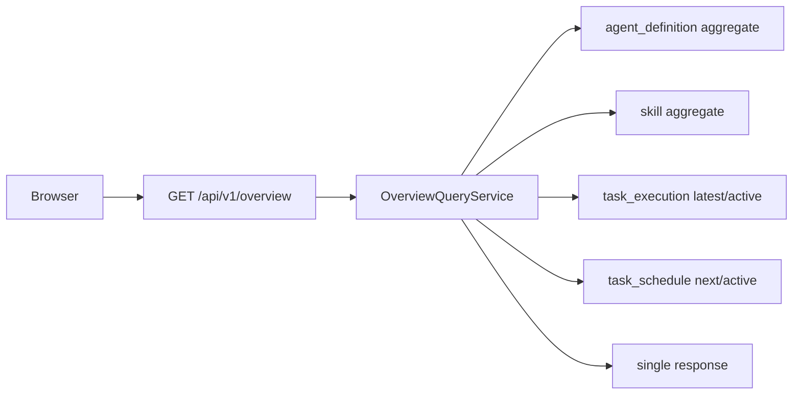
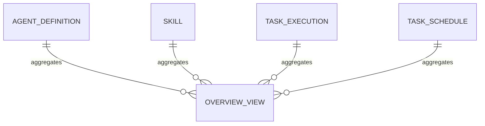

# 概览与运营入口 模块需求与设计简报

> **文档编号**: MOD-OVERVIEW-V1.0  
> **文档版本**: v1.0  
> **创建日期**: 2026-09-17  
> **文档状态**: 设计评审中  
> **模板**: design-lite.md


## 1. 文档控制

| 项目 | 内容 |
|---|---|
| 模块 | 概览与运营入口 |
| Owner | muad-console-platform |
| 数据 Owner | 无新表；只读聚合 |
| 前置模块 | 05-skill-management, 07-agent-management, 09-task-schedule |
| 建议代码位置 | apps/console-platform/backend/src/muad_console_platform/modules/overview/ |

## 2. 需求分析

### 2.1 需求概述

| 项目 | 内容 |
|---|---|
| 模块名称 | 概览与运营入口 |
| 模块 ID | MOD-OVERVIEW |
| 需求类型 | 中大型功能开发 |
| 业务背景 | 概览跨多个模块，但不能由前端循环调用每个实体接口产生 N+1，也不能复制持久化统计事实。 |
| 核心目标 | 聚合 Agent/Skill/Task/Schedule 关键状态并提供最近任务和下一批调度入口。 |

### 2.2 功能方案

| 功能ID | 功能名称 | 功能描述 | 优先级 | 来源 |
|---|---|---|---|---|
| FEAT-01 | KPI 聚合 | 启用 Agent/Skill、执行中 Task、启用 Schedule。 | P0 | 需求描述 |
| FEAT-02 | 最近任务/调度 | 最近 Task 与下一批 Schedule。 | P0 | 需求描述 |

### 2.3 范围与边界

| 类别 | 内容 |
|---|---|
| In Scope | KPI、运行关系说明、最近后台任务、下一批定时触发、跳转入口。 |
| Out of Scope | 不做实时运维监控大盘；不建概览快照表；不展示中间件/Pod 健康 |
| 技术债 | 无；不为未确认的未来能力增加兼容层 |

### 2.4 验收条件

**正常场景**

| 场景ID | 功能ID | 测试层级 | 关键真实边界 | 归属 | 操作/前置 | 预期结果 |
|---|---|---|---|---|---|---|
| S-01 | FEAT-01 | E2E | Browser→overview API→DB aggregate | 本模块 | 进入概览 | 一次接口返回全部 KPI/列表，无前端 N+1 |
| S-02 | FEAT-02 | E2E | Browser Router | 本模块 | 点击最近任务/下次调度条目 | 进入对应详情/模块 |

**异常场景**

| 场景ID | 功能ID | 测试层级 | 关键真实边界 | 归属 | 触发条件 | 系统行为 |
|---|---|---|---|---|---|---|
| E-01 | FEAT-01 | integration | Overview query | 本模块 | 某模块无数据 | 对应 KPI=0/列表空，不把整个概览判错 |

无可靠实测数据的性能阈值统一标记“待定”，不复制模板示例值。

## 3. 技术设计

### 3.1 技术选型

| 决策 | 选择 | 放弃项 | 理由 |
|---|---|---|---|
| 数据获取 | 单一 overview 聚合接口 | 前端多接口循环 | 避免 N+1 和 loading 碎片化 |
| 持久化 | 不新增表 | dashboard snapshot | 数据量当前无需派生事实表 |

基础栈：Python >=3.12、FastAPI >=0.115、SQLAlchemy 2.x、PostgreSQL；按需 Redis/NFS/Secret Provider；统一 `muad-api` 与 `muad-logging`。

### 3.2 架构设计



#### 3.2.1 数据设计与 ER 图

本模块不新增业务表，只读以下 Owner 表的索引字段：
- `control.agent_definition`
- `control.skill`
- `task.task_execution`
- `task.task_schedule`

查询必须用单次/少量聚合 SQL + LIMIT，禁止在前端按实体循环拉取。

**ER 图**



数据库规则：所有产品表统一 `id/is_deleted/create_time/update_time`；同 Owner Schema 物理 FK，跨 Owner Schema 逻辑 UUID；迁移使用 Alembic expand→deploy→contract。

### 3.3 接口设计

```json
{
  "code":"0",
  "msg":"成功",
  "data":{},
  "trace_id":"trace-id",
  "request_id":"request-id",
  "timestamp":"2026-09-17T17:00:00+08:00"
}
```

业务异常只允许 `raise AppError("CODE")`；msg 与 HTTP Status 统一由 `config/api-messages.yaml` 映射。

| 接口ID | 名称 | 方法 | 路径 | FEAT |
|---|---|---|---|---|
| API-01 | 概览聚合 | GET | `/api/v1/overview` | FEAT-01 |


#### API-01 概览聚合

```text
GET /api/v1/overview
```

- 请求：
- `data`：kpis + recent_tasks + next_schedules；一次响应。
- 错误码：`COMMON_VALIDATION_ERROR / COMMON_INTERNAL_ERROR`
- 处理：


### 3.4 性能与容量考量

#### 3.4.1 质量与可靠性补充

- 性能：批量/聚合优先，列表禁止 N+1，真实目标待基线压测后确定。
- 可靠性：事务只覆盖原子 DB 操作；外部 IO 不包长事务；高影响错误必须有 E-/B- 验收。
- 安全：Secret/Token/Cookie 不进业务 DB、日志、Snapshot、LLM。
- 可观测：统一 JSON 日志，自动带 service/trace_id/request_id；状态变化可关联 trace_id。


#### 3.4.2 聚合查询性能

KPI 用 COUNT FILTER/条件索引；最近任务/下次 Schedule 使用排序索引 + LIMIT。目标值在实际数据库规模压测后确定。

## 4. 风险与依赖

- 前置：05-skill-management, 07-agent-management, 09-task-schedule。
- 风险：OverviewQueryService 逐条读取关联实体造成 N+1。。

## Spec Compliance Matrix

| Spec/Rule | enforcement | 设计影响 | 设计落点 | 验证场景 | 状态/N/A 理由 |
|---|---|---|---|---|---|
| `mss-platform#RULE-API-001` | required | JSON REST 统一 code/msg/data/trace_id/request_id/timestamp；业务只抛 code，msg/http_status 配置映射。 | §3.2/§3.3/§3.4 | S-01 + verifier | applied |
| `mss-platform#RULE-UI-001` | required | Console 使用 React + Semi；左上操作、右上搜索筛选、右下分页；主展示字段打开详情。 | §3.2/§3.3/§3.4 | S-01 + verifier | applied |
| `mss-platform#RULE-TIME-001` | required | Console 时间统一 YYYY-MM-DD HH:mm:ss。 | §3.2/§3.3/§3.4 | S-01 + verifier | applied |
| `mss-platform#RULE-FRONT-001` | required | 前端 API 只经 services/；组件不裸用 axios/fetch；文案只用 i18n key。 | §3.2/§3.3/§3.4 | S-01 + verifier | applied |
| `mss-platform#RULE-TEST-001` | required | 跨 API/DB/Runtime/Browser 的关键流程必须 E2E，列出不得 mock 的真实边界。 | §3.2/§3.3/§3.4 | S-01 + verifier | applied |
