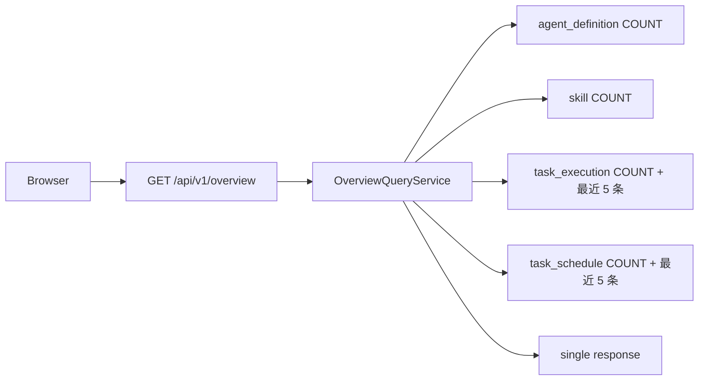

# 概览与运营入口 模块需求与设计简报

> **文档编号**: MOD-OVERVIEW-V1.1  
> **文档版本**: v1.1  
> **创建日期**: 2026-09-17  
> **文档状态**: 设计评审中  
> **模板**: design-lite.md


## 1. 文档控制

### 1.1 责任人

| 角色 | 姓名 | 职责范围 |
|---|---|---|
| 开发负责人 | 待定 | 技术方案、代码实现 |
| 测试负责人 | 待定 | 测试策略、质量保证 |

### 1.2 修订历史

| 版本 | 日期 | 作者 | 变更描述 |
|---|---|---|---|
| v1.0 | 2026-09-17 | — | 需求与设计初稿 |
| v1.1 | 2026-09-18 | — | 对齐 V1.4 决策（docs/17）：冻结 `/api/v1/overview` 完整响应契约（4 KPI + recent_tasks + next_schedules）、删除虚构概览统计实体、补异常场景与优先级列、固定 10 项菜单引用 |

**模块信息**

| 项目 | 内容 |
|---|---|
| 模块 | 概览与运营入口 |
| Owner | muad-console-platform |
| 数据 Owner | 无新表；只读聚合 |
| 前置模块 | 05-skill-management, 07-agent-management, 09-task-schedule |
| 建议代码位置 | apps/console-platform/backend/src/muad_console_platform/modules/overview/ |

## 2. 需求分析

### 2.1 需求概述

| 项目 | 内容 |
|---|---|
| 模块名称 | 概览与运营入口 |
| 模块 ID | MOD-OVERVIEW |
| 需求类型 | 中大型功能开发 |
| 业务背景 | 概览跨多个模块，但不能由前端循环调用每个实体接口产生 N+1，也不能复制持久化统计事实。 |
| 核心目标 | 一次聚合返回 4 个 KPI（启用 Agent/启用 Skill/后台执行中/启用定时任务）以及最近任务和下一批调度入口。 |

### 2.2 功能方案

| 功能ID | 功能名称 | 功能描述 | 优先级 | 来源 |
|---|---|---|---|---|
| FEAT-01 | KPI 聚合 | 4 个 KPI：启用 Agent、启用 Skill、后台执行中 Task、启用 Schedule。 | P0 | 需求描述 |
| FEAT-02 | 最近任务/调度 | 最近 Task 与下一批 Schedule，并提供跳转入口。 | P0 | 需求描述 |

### 2.3 范围与边界

| 类别 | 内容 |
|---|---|
| 在范围内（In Scope） | 4 个 KPI、运行关系说明、最近后台任务、下一批定时触发、跳转入口。 |
| 非范围（Out of Scope） | 不做实时运维监控大盘；不建概览快照表/物化视图；不展示中间件/Pod 健康；不新增菜单——Console 菜单固定 10 项（概览/Agent/Skill/MCP/模型/用户/项目平台/后台任务/定时任务/运行审计，与 docs/00 §0.7 / docs/01 一致）。 |
| 有意妥协 / 技术债 | 无；不为未确认的未来能力增加兼容层 |

### 2.4 验收条件

**正常场景**

| 场景ID | 功能ID | 优先级 | 测试层级 | 关键真实边界 | 归属 | 操作/前置 | 预期结果 |
|---|---|---|---|---|---|---|---|
| S-01 | FEAT-01 | P0 | E2E | Browser→overview API→DB aggregate | 本模块 | 进入概览 | 一次接口返回全部 4 KPI/列表，无前端 N+1 |
| S-02 | FEAT-02 | P0 | E2E | Browser Router | 本模块 | 点击最近任务/下次调度条目 | 进入对应详情/模块 |

**异常场景**

| 场景ID | 功能ID | 测试层级 | 关键真实边界 | 归属 | 触发条件 | 系统行为 |
|---|---|---|---|---|---|---|
| E-01 | FEAT-01 | integration | Overview query | 本模块 | 某模块无数据 | 对应 KPI=0/列表空，不把整个概览判错 |
| E-02 | FEAT-02 | integration | Overview query→Router | 本模块 | 跳转目标 ID 已失效/无权限 | 目标页展示 ErrorState 或回退列表，不白屏、不伪造数据 |

无可靠实测数据的性能阈值统一标记“待定”，不复制模板示例值。

## 3. 技术设计

### 3.1 技术选型

| 决策 | 选择 | 放弃项 | 理由 |
|---|---|---|---|
| 数据获取 | 单一 overview 聚合接口 | 前端多接口循环 | 避免 N+1 和 loading 碎片化 |
| 持久化 | 不新增表、不建快照/物化视图 | dashboard snapshot | 数据量当前无需派生事实表 |
| 查询 | 少量聚合 SQL + LIMIT | 逐实体查询 | 控制延迟并保持只读 |

基础栈：Python >=3.12、FastAPI >=0.115、SQLAlchemy 2.x、PostgreSQL；按需 Redis/NFS；统一 `muad-api` 与 `muad-logging`。

### 3.2 架构设计



#### 3.2.1 查询流（不建表、不建视图）

本模块不新增业务表，也不存在概览统计实体或物化视图；全部指标在请求时由只读查询计算：

```text
启用 Agent      = COUNT(control.agent_definition WHERE enabled=true AND is_deleted=false)
启用 Skill      = COUNT(control.skill WHERE enabled=true AND is_deleted=false)
后台执行中      = COUNT(task.task_execution WHERE status IN ('QUEUED','RUNNING','WAITING') AND is_deleted=false)
启用定时任务    = COUNT(task.task_schedule WHERE status='ACTIVE' AND is_deleted=false)

recent_tasks    = task_execution ORDER BY create_time DESC LIMIT 5（当前 tenant）
next_schedules  = task_schedule WHERE status='ACTIVE' AND next_fire_at IS NOT NULL
                  ORDER BY next_fire_at ASC LIMIT 5（当前 tenant）
```

约束：

- 查询必须使用单次/少量聚合 SQL + LIMIT，禁止前端按实体循环拉取；禁止 N+1；
- 只读 Owner 表，不写任何表；不缓存为业务快照（Redis 不可用时功能应仍可用）；
- 所有查询带 `tenant_id` 与 `is_deleted=false`；时间字段展示口径见 docs/15。

数据库规则：所有产品表统一 `id/is_deleted/create_time/update_time`；同 Owner Schema 物理 FK，跨 Owner Schema 逻辑 UUID；字段逻辑见 docs/02 §4.3/§4.4/§4.31/§4.29。

### 3.3 接口设计

```json
{
  "code":"0",
  "msg":"成功",
  "data":{},
  "trace_id":"trace-id",
  "request_id":"request-id",
  "timestamp":"2026-09-17T17:00:00+08:00"
}
```

业务异常只允许 `raise AppError("CODE")`；msg 与 HTTP Status 统一由 `config/api-messages.yaml` 映射。

| 接口ID | 名称 | 方法 | 路径 | 调用方 | FEAT |
|---|---|---|---|---|---|
| API-01 | 概览聚合 | GET | `/api/v1/overview` | Console Browser | FEAT-01/02 |

> **登记状态**：该端点尚未写入 docs/07 §10，需由主任务在 docs/07 §10 补录（本文件先冻结契约）；补录前实现不得自创路径或字段。

#### API-01 概览聚合

```text
GET /api/v1/overview
```

- 请求：无 query/body（会话身份由 13-console-auth 提供的 Console 登录态承载）。
- `data` 结构：

```json
{
  "kpis": {
    "enabled_agents": 8,
    "enabled_skills": 21,
    "active_tasks": 3,
    "active_schedules": 5
  },
  "recent_tasks": [
    {
      "task_id": "uuid",
      "intent_key": "policy_check",
      "agent_id": "uuid",
      "agent_name": "策略检查助手",
      "actor_user_id": "uuid",
      "actor_user_name": "张三",
      "status": "RUNNING",
      "trigger_type": "SCHEDULED",
      "delivery_status": "PENDING",
      "started_at": "2026-09-18 10:00:00",
      "finished_at": null,
      "deadline_at": "2026-09-19 10:00:00",
      "create_time": "2026-09-18 10:00:00"
    }
  ],
  "next_schedules": [
    {
      "schedule_id": "uuid",
      "name": "每周策略检查",
      "agent_id": "uuid",
      "agent_name": "策略检查助手",
      "actor_user_id": "uuid",
      "actor_user_name": "张三",
      "intent_key": "policy_check",
      "status": "ACTIVE",
      "next_fire_at": "2026-09-21 09:00:00",
      "last_fire_at": "2026-09-14 09:00:00",
      "timezone": "Asia/Shanghai"
    }
  ]
}
```

- 字段与筛选条件：

| 字段 | 含义（docs/15 口径） | 筛选/来源 |
|---|---|---|
| `kpis.enabled_agents` | 启用 Agent | `agent_definition.enabled=true AND is_deleted=false` |
| `kpis.enabled_skills` | 启用 Skill | `skill.enabled=true AND is_deleted=false` |
| `kpis.active_tasks` | 后台执行中 | `task_execution.status IN ('QUEUED','RUNNING','WAITING') AND is_deleted=false` |
| `kpis.active_schedules` | 启用定时任务 | `task_schedule.status='ACTIVE' AND is_deleted=false` |
| `recent_tasks[].status` | 任务状态 | docs/15：Task status |
| `recent_tasks[].trigger_type` | 触发方式 | IMMEDIATE/SCHEDULED |
| `recent_tasks[].delivery_status` | 投递状态 | PENDING/SENT/FAILED/NONE |
| `recent_tasks[].deadline_at` | 任务截止时间 | docs/15 |
| `recent_tasks[].started_at/finished_at` | 开始/完成时间 | docs/15 |
| `next_schedules[].status` | 调度状态 | ACTIVE/PAUSED（列表只取 ACTIVE） |
| `next_schedules[].next_fire_at` | 下次触发时间 | docs/15；仅 `status='ACTIVE' AND next_fire_at IS NOT NULL` |
| `next_schedules[].last_fire_at` | 最近触发时间 | docs/15 |

- 错误码：`UNAUTHORIZED / COMMON_INTERNAL_ERROR`
- 处理：单请求内执行 ≤5 条聚合 SQL；`recent_tasks` 与 `next_schedules` 各 LIMIT 5；所有查询复用 status/enabled 索引并按 `tenant_id` 隔离；不建快照表、不写 Redis；`recent_tasks` 按 `create_time DESC`，`next_schedules` 按 `next_fire_at ASC`。

### 3.4 性能与容量考量

| 热点路径 | 预估负载 | 潜在瓶颈 | 应对策略 | 目标值 |
|---|---|---|---|---|
| `GET /api/v1/overview` | 待定（首页级低频） | 4 张表 COUNT + 2 次排序 LIMIT | 少量聚合 SQL、status/enabled 索引、LIMIT 5、无前端 N+1 | 待定 |

#### 3.4.1 质量与可靠性补充

- 性能：KPI 用条件 COUNT/部分索引；最近任务/下次 Schedule 使用排序索引 + LIMIT；目标值在实际数据库规模压测后确定。
- 可靠性：模块只读；某模块无数据时对应 KPI=0/列表空，不把整个概览判错（E-01）；整体查询失败时前端展示 ErrorState，不伪造 0。
- 安全：不返回 Secret/凭据；只返回运营所需字段。
- 可观测：统一 JSON 日志，自动带 service/trace_id/request_id。

## 4. 风险与依赖

### 4.1 项目依赖

| 依赖模块 | 依赖内容 | 风险等级 |
|---|---|---|
| 05-skill-management | `skill` 启用状态与当前版本 | 低 |
| 07-agent-management | `agent_definition` 启用状态与名称 | 低 |
| 09-task-schedule | `task_execution` / `task_schedule` 只读聚合 | 中（查询性能与字段口径） |
| 13-console-auth | Console 登录态与 `UNAUTHORIZED` 语义 | 低 |

### 4.2 风险识别

| 风险ID | 描述 | 影响 | 应对措施 | 验证场景 |
|---|---|---|---|---|
| RISK-01 | OverviewQueryService 逐条读取关联实体造成 N+1。 | 首页延迟上升 | 聚合 SQL + 批量名称补齐 + LIMIT。 | S-01 |
| RISK-02 | 端点未在 docs/07 登记导致跨模块契约漂移。 | 前后端/主任务返工 | 本文件冻结 schema，主任务补录 docs/07 §10。 | S-01 |
| RISK-03 | 把 COUNT 结果缓存为快照造成事实漂移。 | 指标失真 | V1 不建快照表/物化视图，请求时计算。 | E-01 |

## Spec Compliance Matrix

| Spec/Rule | enforcement | 设计影响 | 设计落点 | 验证场景 | 状态/N/A 理由 |
|---|---|---|---|---|---|
| `harness-platform#RULE-api-001` | required | JSON REST 统一 code/msg/data/trace_id/request_id/timestamp；业务只抛 code，msg/http_status 配置映射。 | §3.3 | S-01, E-01 + verifier | applied |
| `harness-platform#RULE-ui-001` | required | Console 使用 React + Semi；菜单固定 10 项；主展示字段打开详情。 | 前端文件 §3.2/§3.3 | S-02 + verifier | applied |
| `harness-platform#RULE-time-001` | required | 时间存储 timestamptz、展示 YYYY-MM-DD HH:mm:ss。 | §3.3/§3.2.1 | S-01 + verifier | applied |
| `harness-platform#RULE-front-001` | required | 前端 API 只经 services/；组件不裸用 axios/fetch；文案只用 i18n key。 | 前端文件 §3.5 | S-01 + verifier | applied |
| `harness-platform#RULE-test-001` | required | 跨 API/DB/Runtime/Browser 的关键流程必须 E2E，列出不得 mock 的真实边界。 | §2.4/§4.2 | S-01, S-02 + verifier | applied |
