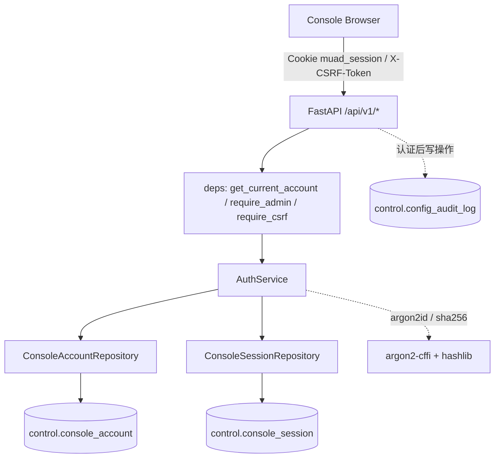
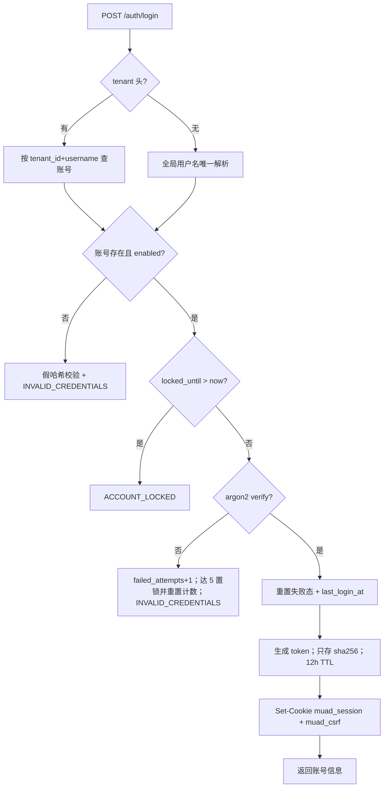
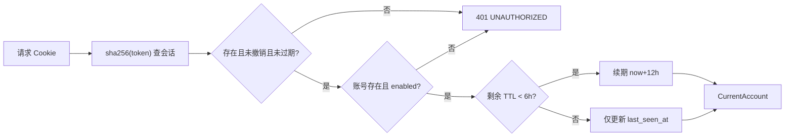
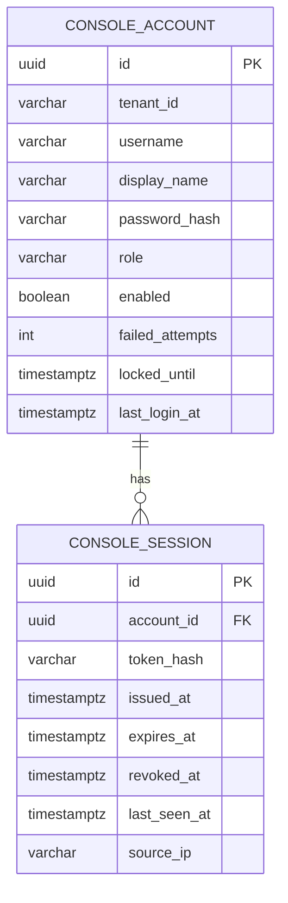

# Console 账号与访问控制 模块需求与设计一体化文档

> **文档编号**: MOD-AUTH-V1.0
> **文档版本**: v1.1
> **创建日期**: 2026-09-17
> **文档状态**: 设计评审中
> **模板**: design-full.md
> **交互基线**: `智能服务交付平台-V1.4-交互稿.html`
> **源文档**: `详细设计-V1.4`（docs/03 §3.2/§3.3/§4.3/§11/§12/§13、docs/07 §1/§10.11、docs/09、docs/15、docs/17）
> **实现基线**: `migrations/versions/0003_console_auth.py`、`config/api-messages.yaml`、`apps/console-platform/backend/src/muad_console_platform/`、`tests/console_auth/`

## 1. 文档控制

| 项目 | 内容 |
|---|---|
| 模块 | Console 账号与访问控制 |
| Owner | muad-console-platform |
| 数据 Owner | `control` schema |
| 前置模块 | 01-platform-foundation |
| 建议代码位置 | 后端：`apps/console-platform/backend/src/muad_console_platform/api/`（auth.py / accounts.py / security.py / deps.py）、`application/`（auth_service.py / dto.py）、`infrastructure/`（models/auth.py、repositories/console_account_repository.py、console_session_repository.py）、`cli.py`、`main.py`；前端：`apps/console-platform/frontend/src/auth/`、`src/pages/LoginPage.tsx`（详见前端设计） |

> **与 01 的接线交集（2026-09-20）**：01-platform-foundation 的 review 把 api-kit 安全原语接进了 console，因此本设计「建议代码位置」里的 `api/deps.py`、`api/auth.py`、`application/auth_service.py` 已被改动：`api/deps.py` 的会话/RBAC 依赖改为 api-kit `require_session`/`require_roles` 的薄适配（`ConsoleSessionVerifier`/`ConsoleRoleResolver` 在 `main.py` 经 `install_console_security` 装配）；`AuthService.change_password` 签名由 `(account, current, new)` 改为 `(account_id, current, new)`（会话校验原语持有自己的 session，处理器拿到的是 detached 对象，故由服务按 id 在请求 session 内重新加载）。本任务后续实现请基于该现状，不要回退这两处。

| 迁移 | `0003_console_auth.py`（revision `0003`，down_revision `0002`） |
| 对外入口 | Console Browser `/api/v1/auth/*`、`/api/v1/accounts`；CLI `create-admin` |
| 非职责 | 不管理 PlatformUser 身份、不管理 ProjectPlatform 凭据、不承载三层授权公式（见 02/04/07/14） |

### 1.1 责任人

| 角色 | 姓名 | 职责范围 |
|---|---|---|
| 产品经理 | fluxion-harness 产品组 | 需求定义、Console 访问控制口径 |
| 开发负责人 | muad-console-platform | 技术方案、代码实现 |
| 测试负责人 | 14-dfx-acceptance | 测试策略、质量保证 |
| 架构师 | fluxion-harness 架构组 | 安全边界与角色模型评审 |

### 1.2 修订历史

| 版本 | 日期 | 作者 | 变更描述 |
|---|---|---|---|
| v0.1 | 2026-09-17 | muad-console-platform | 初始草稿：按 0003 迁移与已实现基线整理 |
| v1.0 | 2026-09-17 | muad-console-platform | 需求评审通过 |
| v1.1 | 2026-09-18 | muad-console-platform | 对齐 V1.4 决策（docs/17）：会话/CSRF/RBAC 契约按 0003 落库；补错误码与分页收敛说明 |

## 2. 需求分析

### 2.1 需求概述

| 项目 | 内容 |
|---|---|
| 模块名称 | Console 账号与访问控制 |
| 模块 ID | MOD-AUTH |
| 需求类型 | 中大型功能开发（安全基础能力） |
| 业务背景 | Console 无自助注册，仅内网 Builder/Admin 访问；必须在任何配置管理动作发生前建立可审计的登录、会话与角色边界 |
| 核心目标 | 用 `control.console_account` + `control.console_session` 两张表闭合 Console 登录、会话、登出、`/me`、改密与账号管理，并把 Admin/Builder 权限边界、CSRF 防护和审计归因固定为后续所有 Console 模块的依赖 |

### 2.2 痛点与价值

| 维度 | 内容 |
|---|---|
| 目标用户/调用方 | Admin / Builder（Console 内网用户）；后续所有 Console 业务模块（复用认证依赖与角色守卫） |
| 当前问题 | 无统一登录则所有 `/api/v1/*` 无身份边界；密码与令牌若无定式存储会带来脱敏与审计缺口 |
| 业务影响 | 配置变更无法归因到具体账号；越权修改用户/授权/凭据无法阻断 |
| 预期价值 | 登录/会话/角色/审计成为单一底座，后续模块只需声明权限依赖，不再各自实现认证 |

**用户故事**

| 编号 | 用户故事 | 优先级 |
|---|---|---|
| US-01 | 作为 Admin，我希望用账号密码登录 Console 并在 12 小时内保持会话，以便连续完成配置工作 | P0 |
| US-02 | 作为 Builder，我希望只能管理 Agent/Skill/MCP/Model/ProjectPlatform，用户、授权与凭据管理被拒绝 | P0 |
| US-03 | 作为 Admin，我希望创建/查看 Console 账号并知道每次配置变更由谁发起，以便追溯 | P0 |
| US-04 | 作为运维，我希望首次部署时通过 CLI 建档，且无账号启动能收到告警，以便系统不会“静默不可登录” | P0 |
| US-05 | 作为安全评审者，我希望错误密码锁定、令牌仅存哈希、CSRF 强校验，以便抵御暴力破解与跨站请求 | P0 |

### 2.3 功能方案

#### 2.3.1 功能清单

| 功能ID | 功能名称 | 功能描述 | 优先级 | 来源 |
|---|---|---|---|---|
| FEAT-01 | 登录认证 | 用户名/密码登录；argon2id 校验；失败 5 次锁 15 分钟；成功重置失败计数并写 `last_login_at` | P0 | US-01/US-05 |
| FEAT-02 | 会话与 `/me` | 令牌只存 sha256；12 小时有效期；已用时长 > 50% 时滑动续期；`/me` 返回当前账号 | P0 | US-01 |
| FEAT-03 | 登出撤销 | 当前令牌置 `revoked_at` 并清除 Cookie；重复登出幂等 | P0 | US-01 |
| FEAT-04 | 修改密码 | 校验当前密码；新密码最短 12 位；成功后可立即用新密码登录 | P0 | US-01/US-05 |
| FEAT-05 | 账号管理（仅 ADMIN） | `GET/POST /api/v1/accounts`；创建账号、查看账号列表；不返回 `password_hash` | P0 | US-03 |
| FEAT-06 | 访问控制 | `muad_session`（HttpOnly）+ `muad_csrf`（JS 可读）；非安全方法校验 `X-CSRF-Token`；`/api/v1/*` 除登录/healthz 外要求认证；RBAC 按角色拒绝越权 | P0 | US-02/US-05 |
| FEAT-07 | 启动自检与 CLI | 无账号启动输出告警；`create-admin` 支持 `--username/--password/--role/--tenant` | P0 | US-04 |
| FEAT-08 | 配置审计归因 | 受保护区变更写 `control.config_audit_log`，`actor_user_id = console_account.id`，与变更同一事务；账号创建/登录成功审计 | P0 | US-03 |

#### 2.3.2 字段约束

**FEAT-01/FEAT-04 密码与登录字段**

| 字段名 | 字段类型 | 必填 | 约束 | 说明 |
|---|---|---|---|---|
| username | string | 是 | 1..128；`(tenant_id, username)` 软删唯一 | 登录名 |
| password | string | 是 | 登录 1..256；新建/改密 12..256 | 只用于校验/哈希，不落库明文 |
| role | enum | 否 | `ADMIN \| BUILDER`，默认 `BUILDER`（CLI 默认 `ADMIN`） | Console 角色 |
| enabled | boolean | 否 | 默认 true | 禁用账号登录返回 `INVALID_CREDENTIALS` |

**FEAT-05 账号列表字段**

| 字段名 | 字段类型 | 必填 | 约束 | 说明 |
|---|---|---|---|---|
| id | uuid | 是 | PK | 账号 ID |
| username | string | 是 | ≤128 | 登录名 |
| display_name | string | 是 | ≤128 | 显示名 |
| role | string | 是 | `ADMIN/BUILDER` | 角色 |

**FEAT-06 Header/Cookie 约束**

| 名称 | 位置 | 约束 | 说明 |
|---|---|---|---|
| `X-Tenant-Id` | Header | 可选 | 登录时租户定位；其余端点为租户上下文，缺省取部署默认租户 |
| `muad_session` | Cookie | HttpOnly、SameSite=Strict、`ENV != dev` 时 Secure、Max-Age=43200、Path=/ | 会话令牌（不落库明文） |
| `muad_csrf` | Cookie | JS 可读、SameSite=Strict、`ENV != dev` 时 Secure、Max-Age=43200、Path=/ | CSRF 双提交令牌 |
| `X-CSRF-Token` | Header | 非安全方法必填且与 `muad_csrf` 一致 | 失败 `403 FORBIDDEN` |

### 2.4 范围与边界

| 类别 | 内容 |
|---|---|
| In Scope | 登录/登出/`/me`/改密；账号列表与创建（ADMIN）；会话滑动续期；Cookie + CSRF；RBAC 依赖（`get_current_account` / `require_admin`）；CLI `create-admin`；无账号启动告警；登录/账号变更的审计接入点 |
| Out of Scope | 不做 Console 自助注册；不做多因素认证/OIDC/LDAP；不做密码找回与邮件通知；不管理 PlatformUser/项目平台凭据；不新增权限 DSL；不引入 Redis/外部会话存储（V1 会话以 PG 为唯一权威） |
| 前置假设 | `control` schema 已由 0002/0003 迁移建立；`config/api-messages.yaml` 已登记本模块全部错误码；前端经同域反向代理访问 `/api/v1`；整个平台部署在内网（docs/09 §1.0） |
| 有意妥协 / 技术债 | ① `GET /api/v1/accounts` 基线返回全量数组，按 RULE-api-001 收敛为 `{items,page,page_size,total}`；② 账号创建/登录成功审计基线尚未写入 `config_audit_log`，按 FEAT-08 补齐；③ 改密不撤销其他既有会话（V1 行为，后续按安全评审决定） |

### 2.5 验收条件

#### 2.5.1 业务规则与约束

| ID | 类型 | 描述 | 验证场景 |
|---|---|---|---|
| RULE-01 | 系统约束 | 对外响应统一 Envelope `{code,msg,data,trace_id,request_id,timestamp}`；错误码只用 `config/api-messages.yaml` 已登记项 | S-01 / E-08 |
| RULE-02 | 系统约束 | 会话令牌只存储 sha256 哈希；Cookie 不落日志；密码只存储 argon2id 哈希 | S-01 / E-01 |
| RULE-03 | 业务规则 | 连续 5 次密码错误锁定 15 分钟；锁定期间即使密码正确也返回 `ACCOUNT_LOCKED`；成功登录重置 `failed_attempts/locked_until` | S-01 / E-02 / B-01 |
| RULE-04 | 业务规则 | 会话 12 小时有效；剩余不足 6 小时（已用 > 50%）时滑动续期为 now+12h 并更新 `last_seen_at` | S-02 / B-02 |
| RULE-05 | 系统约束 | `/api/v1/*` 除 `/auth/login` 与 `/healthz` 外要求有效会话；`/internal/*` 走服务身份，不使用 Console Cookie | S-01 / E-08 |
| RULE-06 | 业务规则 | 用户/授权/凭据类管理仅 ADMIN；其余配置 ADMIN+BUILDER；越权返回 `FORBIDDEN` | S-05 / E-05 |
| RULE-07 | 系统约束 | 非安全方法必须带有效 `X-CSRF-Token`；缺失或不匹配返回 `FORBIDDEN` | S-03 / E-04 |
| RULE-08 | 系统约束 | 账号禁用、密码错误、未知用户名对外一律 `INVALID_CREDENTIALS`，不泄露账号状态；未知用户执行假哈希校验以保持时序一致 | E-01 / E-06 |
| RULE-09 | 系统约束 | 产品表统一 `id/is_deleted/create_time/update_time`；软删唯一用 partial unique；时间统一 `timestamptz`；同 schema 物理 FK | S-01 / 契约测试 S-03（模块 14） |
| RULE-10 | 系统约束 | 审计 `actor_user_id = console_account.id`，与业务变更同一事务，且不写 Secret/密码明文 | S-08 / E-07 |

#### 2.5.2 功能验收场景

##### 正常场景

| 场景ID | 功能ID | 优先级 | 测试层级 | 关键真实边界 | 归属 | 操作/前置 | 预期结果 |
|---|---|---|---|---|---|---|---|
| S-01 | FEAT-01 | P0 | E2E | Browser → API → Postgres | 本模块 | 已建档账号 + 正确密码登录 | 200 `code=0`；`data={id,username,display_name,role}`；`muad_session` HttpOnly + `muad_csrf` 可读；`last_login_at` 更新；库内仅 sha256 令牌哈希 |
| S-02 | FEAT-02 | P0 | integration | Service → Postgres | 本模块 | 构造剩余 < 6h 的会话后调用 `/auth/me` | 200 返回账号；`expires_at` 续期为 now+12h、`last_seen_at` 更新 |
| S-03 | FEAT-03 | P0 | E2E | Browser → API → Postgres | 本模块 | 登录后带 CSRF 调用登出 | 200 `{logged_out:true}`；Cookie 清除；会话 `revoked_at` 非空；再次 `/me` 401 |
| S-04 | FEAT-04 | P0 | E2E | Browser → API → Postgres | 本模块 | 登录后提交正确当前密码 + 合规新密码 | 200 `{changed:true}`；旧密码登录 401、新密码登录 200 |
| S-05 | FEAT-05 | P0 | E2E | Browser → API → Postgres | 本模块 | ADMIN 登录后创建 BUILDER 账号 | 200 返回账号（无 `password_hash`）；新账号可登录；账号列表含新账号 |
| S-06 | FEAT-05 | P1 | E2E | Browser → API → Postgres | 本模块 | ADMIN 打开账号列表 | 返回账号集合，字段与 docs/15 一致，无敏感字段 |
| S-07 | FEAT-07 | P0 | integration | CLI → Postgres；启动 lifespan → 日志 | 本模块 | 空库启动服务；执行 `create-admin --username ... --role ADMIN` | 启动日志出现 `console_no_accounts_run_cli_create_admin` 告警；stdout 输出账号信息；exit 0；建档后告警消失且可登录 |
| S-08 | FEAT-08 | P0 | integration | Service → Postgres | 本模块 | 登录态下执行一次受保护写操作；创建账号 | 写操作审计 `actor_user_id=console_account.id` 且与变更同事务；账号创建/登录成功审计落 `CONSOLE_ACCOUNT` 的 `CREATE`/`LOGIN`（基线待补齐） |

##### 异常场景

| 场景ID | 功能ID | 测试层级 | 关键真实边界 | 归属 | 触发条件 | 系统行为 |
|---|---|---|---|---|---|---|
| E-01 | FEAT-01 | integration | API → Postgres | 本模块 | 正确用户名 + 错误密码 | 401 `INVALID_CREDENTIALS`；不建会话、不发 Cookie；`failed_attempts` +1 |
| E-02 | FEAT-01 | integration | API → Postgres | 本模块 | 连续 5 次错误密码后用正确密码登录 | 前 5 次 401；第 5 次后 `failed_attempts=0`、`locked_until=now+15min`；锁定期内 423 `ACCOUNT_LOCKED` |
| E-03 | FEAT-02 | integration | API → Postgres | 本模块 | 过期、已撤销或未知令牌访问 `/me` | 401 `UNAUTHORIZED`，Envelope 含 `trace_id` |
| E-04 | FEAT-06 | integration | API → CSRF 校验 | 本模块 | 非安全方法缺失或伪造 `X-CSRF-Token` | 403 `FORBIDDEN`；请求不落业务变更 |
| E-05 | FEAT-06 | integration | API → RBAC | 本模块 | BUILDER 访问 `/api/v1/accounts` | 403 `FORBIDDEN`，不发生查询/写入 |
| E-06 | FEAT-01 | integration | API → Postgres | 本模块 | 禁用账号 + 正确密码 | 401 `INVALID_CREDENTIALS`（不暴露“已禁用”） |
| E-07 | FEAT-08 | integration | Service → Postgres | 本模块 | 变更载荷含 `password/secret/token/api_key` 字段 | 审计 JSON 中敏感键被剔除，无明文泄漏 |
| E-08 | FEAT-06 | integration | API → 全局认证 | 本模块 | 未登录访问 `/api/v1/agents` 或 `/api/v1/accounts` | 401 `UNAUTHORIZED`；`/healthz`、`/auth/login` 保持公开 |

##### 边界场景

| 场景ID | 测试层级 | 关键真实边界 | 归属 | 字段/条件 | 边界值 | 预期行为 |
|---|---|---|---|---|---|---|
| B-01 | integration | API → Postgres | 本模块 | 失败计数临界 | 第 4 次 / 第 5 次失败 | 第 4 次 `failed_attempts=4` 不锁；第 5 次进入锁定并重置计数 |
| B-02 | integration | Service → Postgres | 本模块 | 滑动续期临界 | 剩余 = 6h / 剩余 < 6h | 恰好 6h 不续期；小于 6h 续期到 now+12h |
| B-03 | integration | API → Postgres | 本模块 | 多租户同名 | 无 `X-Tenant-Id` 且跨租户重名 | 401 `INVALID_CREDENTIALS`（入口日志告警）；带租户头时正确账号可登录 |

#### 2.5.3 非功能指标

| 指标ID | 指标名称 | 目标值 | 测量方法 |
|---|---|---|---|
| NFR-PERF-01 | 登录接口 P95（不含浏览器） | 待定（压测校准；argon2id 为主要成本） | 压测报告 |
| NFR-PERF-02 | `/auth/me` P95 | 待定（单索引查询） | APM / 压测 |
| NFR-REL-01 | 认证能力可用性 | 待定 | 线上可用时长 |
| NFR-SEC-01 | 密码与令牌存储 | 密码 100% argon2id、令牌 100% sha256，无明文落库 | 代码审计 + 库内扫描 |
| NFR-SEC-02 | 越权请求拦截率 | 100%（受保护端点全部经统一依赖） | 集成/E2E 负向用例 |

## 3. 技术设计

### 3.1 方案选型与关键决策

| 决策点 | 选择 | 被否决项 | 理由 | 可逆性 |
|---|---|---|---|---|
| 会话存储 | PostgreSQL `control.console_session` | Redis/JWT 无状态令牌 | PG 为平台唯一权威源；可即时撤销、可审计（docs/09 §4 第 7 条：Redis 丢失不丢业务事实） | 易 |
| 密码哈希 | argon2id（argon2-cffi） | bcrypt/PBKDF2 | 抗 GPU 暴破，参数可升级；库内实测 `$argon2id$` 前缀 | 难（需在线重哈希策略） |
| CSRF 防护 | 双提交 Cookie（`muad_csrf` + `X-CSRF-Token`） | 仅 SameSite | SameSite=Strict 已降低风险，但内网代理形态下双提交更明确 | 易 |
| 会话续期 | 剩余 < 50% 时滑动续期 | 每次请求续期 | 控制写放大，避免每个 GET 都更新会话行 | 易 |
| 角色模型 | 固定 `ADMIN/BUILDER` 两角色 | 权限点/自定义角色 | V1 范围收敛（docs/03 §3.3），避免过早建设 RBAC DSL | 易 |
| 首次建档 | CLI `create-admin` | 默认口令/首个注册者成为管理员 | 内网安全基线不接受默认凭据 | 易 |

基础栈：Python ≥3.12、FastAPI ≥0.115、SQLAlchemy 2.x（async）、PostgreSQL、argon2-cffi；统一 `muad-api`（Envelope/AppError/ErrorCode）与 `muad-logging`；不引入 Redis。

### 3.2 架构与流程



**登录流程**



**会话解析**



### 3.3 数据设计

#### `control.console_account`

**表说明**

- **用途**：Console 登录账号、角色与失败计数。
- **主要写入方**：CLI `create-admin`、`POST /api/v1/accounts`、登录失败/成功路径。
- **主要读取方**：登录、会话解析、账号列表。
- **生命周期/边界**：软删除；`password_hash` 为不可逆哈希；账号不作为 PlatformUser，也不参与 Effective Capability 公式。

| 字段 | 类型 | 约束 | 说明 |
|---|---|---|---|
| `id` | uuid | PK，server default `gen_random_uuid()` | 主键 |
| `is_deleted` | boolean | NOT NULL DEFAULT false | 软删除 |
| `create_time` | timestamptz | NOT NULL DEFAULT now() | 创建时间 |
| `update_time` | timestamptz | NOT NULL DEFAULT now() | 更新时间 |
| `tenant_id` | varchar(64) | NOT NULL | 租户隔离键 |
| `username` | varchar(128) | NOT NULL | 登录名 |
| `display_name` | varchar(128) | NOT NULL | 显示名 |
| `password_hash` | varchar(256) | NOT NULL | argon2id 哈希 |
| `role` | varchar(16) | NOT NULL DEFAULT 'BUILDER' | `ADMIN / BUILDER` |
| `enabled` | boolean | NOT NULL DEFAULT true | 启用状态 |
| `failed_attempts` | integer | NOT NULL DEFAULT 0 | 连续失败次数 |
| `locked_until` | timestamptz | 可空 | 锁定截止时间 |
| `last_login_at` | timestamptz | 可空 | 最近登录时间 |

**索引/约束**

- `UNIQUE uq_console_account_tenant_username (tenant_id, username) WHERE is_deleted = false`

#### `control.console_session`

**表说明**

- **用途**：登录会话与撤销状态；令牌明文只存在于 Cookie，库内仅哈希。
- **主要写入方**：登录（签发）、`/me`（续期/活跃）、登出（撤销）。
- **主要读取方**：`get_current_account`。
- **生命周期/边界**：12 小时 TTL；过期/撤销即失效；按需清理历史行，业务读取只认未撤销且未过期。

| 字段 | 类型 | 约束 | 说明 |
|---|---|---|---|
| `id` | uuid | PK，server default `gen_random_uuid()` | 主键 |
| `is_deleted` | boolean | NOT NULL DEFAULT false | 软删除 |
| `create_time` | timestamptz | NOT NULL DEFAULT now() | 创建时间 |
| `update_time` | timestamptz | NOT NULL DEFAULT now() | 更新时间 |
| `account_id` | uuid | NOT NULL，FK → `control.console_account.id` | 所属账号 |
| `token_hash` | varchar(128) | NOT NULL | 令牌 sha256 十六进制 |
| `issued_at` | timestamptz | NOT NULL DEFAULT now() | 签发时间 |
| `expires_at` | timestamptz | NOT NULL | 过期时间 |
| `revoked_at` | timestamptz | 可空 | 撤销时间 |
| `last_seen_at` | timestamptz | NOT NULL DEFAULT now() | 最近活跃时间 |
| `source_ip` | varchar(64) | 可空 | 签发来源 IP |

**索引/约束**

- `UNIQUE uq_console_session_token_hash (token_hash) WHERE is_deleted = false`
- `INDEX ix_console_session_account_expires (account_id, expires_at)`：按账号清理/审计用

**ER 图**



**容量预估**

| 维度 | 预估值 |
|---|---|
| 初始数据量 | 账号：每租户 1..50（Builder/Admin 团队规模）；会话：每账号并发 1..3 |
| 3 年预估 | 账号低增长；会话行按 12h TTL 线性累积，历史行定期归档/清理 |

数据库规则：所有产品表统一 `id/is_deleted/create_time/update_time`；同 Owner Schema 物理 FK，跨 Owner Schema 逻辑 UUID；迁移使用 Alembic expand→deploy→contract。

### 3.4 接口设计

统一 Envelope（与 docs/07 §1 一致）：

```json
{
  "code": "0",
  "msg": "成功",
  "data": {},
  "trace_id": "trace-id",
  "request_id": "request-id",
  "timestamp": "2026-09-17T17:00:00+08:00"
}
```

业务异常只允许 `raise AppError("CODE")`；`msg` 与 HTTP Status 统一由 `config/api-messages.yaml` 映射；本模块只用以下已登记代码：`COMMON_BAD_REQUEST / COMMON_VALIDATION_ERROR / ACCOUNT_USERNAME_EXISTS / COMMON_INTERNAL_ERROR / UNAUTHORIZED / FORBIDDEN / INVALID_CREDENTIALS / ACCOUNT_LOCKED`。

#### 接口清单

| 接口ID | 名称 | 方法 | 路径 | 认证/角色 | FEAT |
|---|---|---|---|---|---|
| API-01 | 登录 | POST | `/api/v1/auth/login` | 公开（免认证/免 CSRF） | FEAT-01 |
| API-02 | 登出 | POST | `/api/v1/auth/logout` | 登录 + CSRF | FEAT-03 |
| API-03 | 当前账号 | GET | `/api/v1/auth/me` | 登录 | FEAT-02 |
| API-04 | 修改密码 | POST | `/api/v1/auth/password` | 登录 + CSRF | FEAT-04 |
| API-05 | 账号列表 | GET | `/api/v1/accounts` | ADMIN | FEAT-05 |
| API-06 | 创建账号 | POST | `/api/v1/accounts` | ADMIN + CSRF | FEAT-05 |

#### API-01: 登录

```text
POST /api/v1/auth/login
Content-Type: application/json
X-Tenant-Id: <tenant>        # 可选
```

**请求**

| 参数 | 类型 | 必填 | 说明 |
|---|---|---|---|
| username | string | 是 | 1..128 |
| password | string | 是 | 1..256 |

**请求示例**

```json
{"username": "admin", "password": "console-admin-password"}
```

**响应**

| 参数 | 类型 | 说明 |
|---|---|---|
| code | string | `"0"` 成功 |
| data.id | uuid | 账号 ID |
| data.username | string | 登录名 |
| data.display_name | string | 显示名 |
| data.role | string | `ADMIN / BUILDER` |
| Set-Cookie | header | `muad_session`（HttpOnly）、`muad_csrf`（JS 可读） |

**响应示例**

```json
{
  "code": "0",
  "msg": "成功",
  "data": {"id": "uuid", "username": "admin", "display_name": "Admin", "role": "ADMIN"},
  "trace_id": "trace-id",
  "request_id": "request-id",
  "timestamp": "2026-09-17T17:00:00+08:00"
}
```

**错误码**

| 错误码 | 信息 | 场景 | HTTP状态码 |
|---|---|---|---|
| `INVALID_CREDENTIALS` | 用户名或密码错误 | 未知用户/密码错误/禁用账号/用户名跨租户歧义 | 401 |
| `ACCOUNT_LOCKED` | 账号已锁定，请稍后重试 | 锁定有效期内（含正确密码） | 423 |
| `COMMON_VALIDATION_ERROR` | 请求参数校验失败 | username/password 缺失或超长 | 422 |
| `COMMON_INTERNAL_ERROR` | 系统内部错误 | 未预期异常（含 DB 错误） | 500 |

**处理逻辑**

1. 解析 `X-Tenant-Id`；有租户头时按 `(tenant_id, username)` 查询，无租户头时全局按用户名查询（唯一才匹配，多个候选记录告警并拒绝）；
2. 账号不存在或 `enabled=false`：执行一次假哈希校验等化时序，返回 `INVALID_CREDENTIALS`；
3. `locked_until > now`：直接返回 `ACCOUNT_LOCKED`（不校验密码）；
4. argon2id 校验失败：`failed_attempts + 1`；达到 5 次时置 `locked_until = now + 15min` 并把 `failed_attempts` 重置为 0；提交事务后返回 `INVALID_CREDENTIALS`；
5. 校验成功：重置 `failed_attempts/locked_until`、写 `last_login_at`；生成 32 字节 urlsafe 令牌，库内只存 sha256，TTL 12h，记录 `source_ip`；
6. 设置 `muad_session` / `muad_csrf`（SameSite=Strict，`ENV != dev` 时 Secure），返回账号信息；
7. 事务边界：账号更新与会话插入由同一请求事务提交（`get_session` 成功即 commit，异常 rollback）。

#### API-02: 登出

```text
POST /api/v1/auth/logout
Cookie: muad_session=...; muad_csrf=...
X-CSRF-Token: <muad_csrf>
```

**请求**：无 body。

**响应** `data`：`{"logged_out": true}`；响应同时删除两个 Cookie。

**错误码**

| 错误码 | 信息 | 场景 | HTTP状态码 |
|---|---|---|---|
| `UNAUTHORIZED` | 未登录或会话已失效 | 无 Cookie/会话失效 | 401 |
| `FORBIDDEN` | 无权执行该操作 | CSRF 缺失或不匹配 | 403 |
| `COMMON_INTERNAL_ERROR` | 系统内部错误 | 未预期异常 | 500 |

**处理逻辑**：取 `muad_session` → sha256 查会话；不存在或已撤销直接返回成功（幂等）；否则置 `revoked_at = now`、更新 `update_time`；清除 Cookie；返回 `{logged_out: true}`。

#### API-03: 当前账号

```text
GET /api/v1/auth/me
Cookie: muad_session=...
```

**请求**：无参数。

**响应** `data`：`{id, username, display_name, role}`（同 API-01，无 Set-Cookie）。

**错误码**

| 错误码 | 信息 | 场景 | HTTP状态码 |
|---|---|---|---|
| `UNAUTHORIZED` | 未登录或会话已失效 | 无 Cookie/过期/撤销/账号被禁用 | 401 |
| `COMMON_INTERNAL_ERROR` | 系统内部错误 | 未预期异常 | 500 |

**处理逻辑**：Cookie → sha256 → 会话校验（`is_deleted=false`、`revoked_at IS NULL`、`expires_at > now`）→ 账号存在且 `enabled=true` → 剩余 TTL < 6h 时 `expires_at = now + 12h`，始终更新 `last_seen_at` → 返回账号。GET 属安全方法，免 CSRF。

#### API-04: 修改密码

```text
POST /api/v1/auth/password
X-CSRF-Token: <muad_csrf>
```

**请求**

| 参数 | 类型 | 必填 | 说明 |
|---|---|---|---|
| current_password | string | 是 | 当前密码（≥1） |
| new_password | string | 是 | 12..256 |

**响应** `data`：`{"changed": true}`。

**错误码**

| 错误码 | 信息 | 场景 | HTTP状态码 |
|---|---|---|---|
| `INVALID_CREDENTIALS` | 用户名或密码错误 | 当前密码校验失败 | 401 |
| `COMMON_VALIDATION_ERROR` | 请求参数校验失败 | 新密码 < 12 或超长 | 422 |
| `COMMON_BAD_REQUEST` | 请求参数错误 | 服务层收到非法新密码（非 API 路径） | 400 |
| `UNAUTHORIZED` / `FORBIDDEN` | 未登录 / CSRF 失败 | 会话或 CSRF 校验失败 | 401 / 403 |
| `COMMON_INTERNAL_ERROR` | 系统内部错误 | 未预期异常 | 500 |

**处理逻辑**：校验当前密码（失败 `INVALID_CREDENTIALS`）→ 校验新密码长度 → 写入新 argon2id 哈希、重置 `failed_attempts/locked_until`、更新 `update_time` → 返回成功。当前基线不撤销其他会话（技术债见 §2.4）。

#### API-05: 账号列表

```text
GET /api/v1/accounts?page=1&page_size=20
```

**请求**

| 参数 | 类型 | 必填 | 说明 |
|---|---|---|---|
| page | int | 否 | 默认 1，≥1 |
| page_size | int | 否 | 默认 20，1..100 |

**响应** `data`：

```json
{
  "items": [{"id": "uuid", "username": "admin", "display_name": "Admin", "role": "ADMIN"}],
  "page": 1,
  "page_size": 20,
  "total": 1
}
```

**错误码**

| 错误码 | 信息 | 场景 | HTTP状态码 |
|---|---|---|---|
| `FORBIDDEN` | 无权执行该操作 | 非 ADMIN 访问 | 403 |
| `UNAUTHORIZED` | 未登录或会话已失效 | 无有效会话 | 401 |
| `COMMON_VALIDATION_ERROR` | 请求参数校验失败 | page=0 / page_size=101 | 422 |
| `COMMON_INTERNAL_ERROR` | 系统内部错误 | 未预期异常 | 500 |

**处理逻辑**：`get_tenant_id()` 解析租户 → 查询 `tenant_id` 且 `is_deleted=false` 的账号，按 `username` 排序 → 分页返回；永不返回 `password_hash`。基线当前返回全量数组，按 RULE-api-001 收敛为分页（技术债）。

#### API-06: 创建账号

```text
POST /api/v1/accounts
X-CSRF-Token: <muad_csrf>
```

**请求**

| 参数 | 类型 | 必填 | 说明 |
|---|---|---|---|
| username | string | 是 | 1..128 |
| display_name | string | 是 | 1..128 |
| password | string | 是 | 12..256 |
| role | string | 否 | `ADMIN / BUILDER`，默认 `BUILDER` |

**响应** `data`：`{id, username, display_name, role}`。

**错误码**

| 错误码 | 信息 | 场景 | HTTP状态码 |
|---|---|---|---|
| `ACCOUNT_USERNAME_EXISTS` | 账号 {username} 已存在 | 同租户用户名已存在（含并发唯一约束冲突） | 409 |
| `COMMON_BAD_REQUEST` | 请求参数错误 | role 非法或密码过短（服务层） | 400 |
| `COMMON_VALIDATION_ERROR` | 请求参数校验失败 | 字段缺失/越界（API 层） | 422 |
| `FORBIDDEN` / `UNAUTHORIZED` | 越权 / 未登录 | 非 ADMIN 或无会话 | 403 / 401 |
| `COMMON_INTERNAL_ERROR` | 系统内部错误 | 未预期异常 | 500 |

**处理逻辑**：RBAC（ADMIN）→ CSRF → 参数校验 → 租户内重名预查（冲突 `ACCOUNT_USERNAME_EXISTS`）→ argon2id 哈希 → 插入账号（`IntegrityError` 兜底 `ACCOUNT_USERNAME_EXISTS`）→ 同一事务写审计（`CONSOLE_ACCOUNT/CREATE`，基线待补齐）→ 返回账号信息。

#### 形态 B：CLI 命令

| 命令 | 参数 / Flag | 说明 | 退出码 |
|---|---|---|---|
| `python -m muad_console_platform.cli create-admin` | `--username`（必填）、`--password`（可选，缺省 `getpass` 交互输入）、`--role ADMIN\|BUILDER`（默认 ADMIN）、`--tenant`（默认 default） | 首次初始化或补建 Console 账号 | 0=成功；1=业务失败（stderr 输出 `create-admin failed: CODE`）；2=密码长度不合法 |

- stdout：`created console account <username> role=<role> tenant=<tenant>`；
- 密码长度 < 12 时不发起 DB 写入，直接以退出码 2 结束；
- 启动自检：服务 lifespan 检查是否存在账号；无 `DATABASE_URL` 时记录 `console_account_check_skipped_database_url_missing`，查询异常记录 `console_account_check_failed`，无账号记录 `console_no_accounts_run_cli_create_admin`（warning）。

### 3.5 质量实现方案

#### 可靠性设计

| 风险ID | 失效模式 | 影响 | 应对措施 | 验证场景 |
|---|---|---|---|---|
| RISK-01 | 并发创建同名账号 | 出现重复账号 | partial unique + `IntegrityError` → `ACCOUNT_USERNAME_EXISTS` | E-02 邻接 / API-06 并发用例 |
| RISK-02 | 登录暴力破解 | 账号被撞库 | 5 次失败锁定 15 分钟 + 未知用户假哈希等化时序 | E-01/E-02 |
| RISK-03 | 会话令牌泄漏 | 会话被冒用 | 库内只存 sha256；HttpOnly + SameSite=Strict；可撤销 | S-01/S-03 |
| RISK-04 | 跨站请求伪造 | 未授权变更 | 非安全方法强制 CSRF 双提交 | E-04 |
| RISK-05 | 账号状态枚举 | 泄露禁用/存在性 | 统一 `INVALID_CREDENTIALS` | E-06 |
| RISK-06 | 审计缺归因 | 变更不可追溯 | `actor_user_id = console_account.id`，与变更同事务 | S-08/E-07 |

#### 安全性设计

| 指标ID | 验收标准 | 实现方案 |
|---|---|---|
| NFR-SEC-01 | 密码/令牌无明文落库 | argon2id + sha256；Cookie 仅传输层持有 |
| NFR-SEC-02 | 越权与 CSRF 请求被拒 | 统一依赖 `get_current_account` / `require_admin` / `require_csrf`；RBAC 仅 ADMIN/BUILDER |
| NFR-SEC-03 | 审计与日志无 Secret | 统一 logging-kit 脱敏（Authorization/Cookie/password/token/api_key）；审计 payload 敏感键剔除 |

#### 可观测性设计

| 场景 | 实现方案 |
|---|---|
| 日志 | `muad-logging` JSON，按 `service/YYYY-MM-DD.log` 落盘，自动带 `trace_id/request_id/tenant_id` |
| 审计 | 业务变更写 `control.config_audit_log`（`trace_id/source_ip/action/resource_*`） |
| 启动告警 | 无账号 warning；DB 不可达 exception 日志 |
| 待补指标 | 登录成功/失败计数、锁定计数可按需增加（真实目标待定） |

## 4. 部署与运维

### 4.1 部署架构

| 环境 | 配置 | 实例数 | 用途 |
|---|---|---|---|
| dev | 2C4G | 1 | 本地开发（`ENV=dev`，Cookie 不带 Secure） |
| prod | 8C16G | 2+ | 内网生产（`ENV != dev`，Cookie Secure） |

Console Platform 与其余三个部署单元共享 PostgreSQL；认证不依赖 Redis/NFS。

### 4.2 发布与回滚

- 发布顺序：先执行 Alembic `0003`（新增两张表与索引），再发布应用；回滚时不删表（保留审计与会话事实），仅回滚应用版本；
- 兼容性：新增表为纯增量，旧版本应用不受影响。

### 4.3 监控告警

| 指标 | 阈值 | 级别 | 处理SLA |
|---|---|---|---|
| 无 Console 账号告警 | 启动时出现 | P2 | 15min 内执行 `create-admin` |
| 登录失败率 | 待定（基线观测后设定） | P2 | 待定 |
| 数据库不可用 | `/readyz` 失败 | P1 | 5min响应 |

### 4.4 数据迁移

| 阶段 | 操作 | 验证方法 |
|---|---|---|
| 1 | `0003_console_auth.py` 创建 `control.console_account` / `control.console_session` 与索引 | 迁移 dry run + 反射对比 |
| 2 | 发布应用并执行 `create-admin` 建档 | CLI 成功 + 登录 E2E |
| 3 | 无历史数据回填（V1 新表） | 无 |

## 5. 风险与依赖

### 5.1 项目依赖

| 依赖模块/团队 | 依赖内容 | 状态 | 风险等级 |
|---|---|---|---|
| 01-platform-foundation | `muad-api` Envelope/AppError/ErrorCode、`muad-logging`、迁移纪律 | 已具备 | 低 |
| 14-dfx-acceptance | 认证契约、越权、脱敏与持久化验收 | 规划中 | 中 |
| 前端 01 公共组件 | ApiClient、LocaleSwitch、ConsoleShell | 已具备 | 低 |

### 5.2 风险识别

| 风险ID | 类型 | 描述 | 概率 | 影响 | 应对措施 | 验证场景 |
|---|---|---|---|---|---|---|
| RISK-07 | 安全 | 令牌/密码经日志或审计外泄 | 低 | 高 | logging-kit 脱敏 + AuditService 敏感键剔除 + 代码评审 | E-07 |
| RISK-08 | 兼容 | 账号列表未分页导致数据量大时响应膨胀 | 中 | 中 | 按 RULE-api-001 收敛分页 | API-05 契约用例 |
| RISK-09 | 行为 | 改密后旧会话仍有效 | 中 | 中 | 记录为技术债，按安全评审决定是否强制下线 | S-04 后续增强 |

## 6. 需求追溯矩阵

| 用户故事 | 功能ID | 接口ID | 测试用例ID | 测试层级 | 状态 |
|---|---|---|---|---|---|
| US-01 | FEAT-01, FEAT-02, FEAT-03, FEAT-04 | API-01..API-04 | S-01, S-02, S-03, S-04, E-01, E-03, B-02 | E2E/integration | 待实现 |
| US-02 | FEAT-06 | API-05, API-06 | S-05, S-06, E-04, E-05, E-08 | integration/E2E | 待实现 |
| US-03 | FEAT-05, FEAT-08 | API-05, API-06 | S-05, S-08, E-07 | E2E/integration | 待实现 |
| US-04 | FEAT-07 | CLI `create-admin` | S-07 | integration | 待实现 |
| US-05 | FEAT-01, FEAT-06 | API-01, API-02, API-04 | S-01, S-03, E-02, E-04, E-06, B-01 | integration/E2E | 待实现 |

## Spec Compliance Matrix

> 从需求目录 `spec-context.yml` 继承并逐 Rule 回填。required Rule 必须有具体设计落点和 verifier/验收场景；N/A 只接受逐项用户确认。

| Spec/Rule | enforcement | 设计影响 | 设计落点 | 验证场景 | 状态/N/A 理由 |
|---|---|---|---|---|---|
| `harness-platform#RULE-api-001` | required | 统一 Envelope；错误码只用 yaml 登记项；列表分页 `page>=1`、`page_size<=100` | §3.4 全部接口；§2.4 技术债① | S-01, E-08, API-05 契约用例 + verifier | applied |
| `harness-platform#RULE-auth-001` | required | Console 访问控制只使用 ADMIN/BUILDER 与统一依赖；不引入三元授权、绑定开关或到期授权；Console 账号不进入 Effective Capability | §2.4 Out of Scope；§3.4 RBAC；§3.5 安全性设计 | E-05 + verifier | applied |
| `harness-platform#RULE-data-001` | required | 标准列、partial unique 软删唯一、timestamptz、同 schema 物理 FK | §3.3 两表定义与索引 | S-01 + 模块 14 契约测试 S-03 + verifier | applied |
| `harness-platform#RULE-i18n-001` | required | 错误 `msg` 按 `X-Locale`/`Accept-Language` 输出 zh-CN/en-US；新增业务只加配置 | §3.4 错误码表；依赖 `muad-api` MessageCatalog | S-01, E-01 + verifier | applied |
| `harness-platform#RULE-secret-001` | required | 密码只存 argon2id；令牌只存 sha256；审计/日志无 Secret 明文 | §3.3；§3.5 安全性设计 NFR-SEC-01/03 | S-01, E-07 + verifier | applied |
| `harness-platform#RULE-log-001` | required | 统一 logging-kit、LOG_DIR、JSON、trace_id/request_id/tenant_id 与敏感字段脱敏 | §3.5 可观测性设计 | E-07 + verifier | applied |
| `harness-platform#RULE-test-001` | required | 认证关键链路 E2E 并明确不得 mock 的真实边界（真实 PG、真实 Cookie/HTTP、真实浏览器） | §2.5.2 场景表“关键真实边界”列；§3.5 | S-01/S-03/S-05 + verifier | applied |
| `harness-platform#RULE-time-001` | required | 存储 timestamptz；账号相关时间展示统一 `YYYY-MM-DD HH:mm:ss`（前端） | §3.3；前端 §3.6 | S-02 + verifier | applied |
| `harness-platform#RULE-rel-001` | required | 本模块无关系集合写接口；账号/会话/密码均为单端点单事务原子变更，禁止全量 PUT 覆盖 | §3.4 接口清单（无 PUT 关系集合） | S-03, S-04 + verifier | applied |

## 附录：术语表

| 术语 | 定义 |
|---|---|
| Console | Agent Runtime 的控制面 Web 界面，仅 Builder/Admin 内网访问 |
| Admin / Builder | Console 两类固定角色；Admin 含用户/授权/凭据管理，Builder 负责其余配置与发布 |
| CSRF 双提交 | 服务端下发 JS 可读 Cookie，客户端在 Header 回传同值，服务端比对 |
| 滑动续期 | 会话剩余有效期低于阈值时延长到完整 TTL |
| partial unique | 带 `WHERE is_deleted = false` 的部分唯一索引 |
| Effective Capability | 三层授权收敛后的有效能力集合（本模块不实现，见 docs/02 §5.10） |

---

*文档结束*
