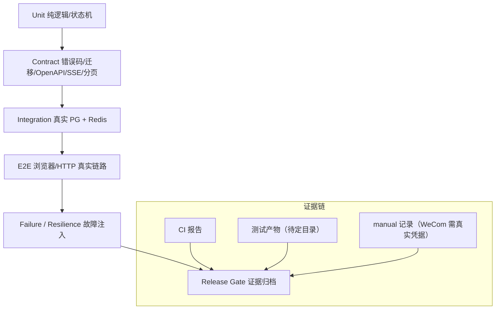

# DFX、测试与验收 模块需求与设计简报

> **文档编号**: MOD-DFX-V1.0
> **文档版本**: v1.1
> **创建日期**: 2026-09-17
> **文档状态**: 设计评审中
> **模板**: design-lite.md
> **基线**: `docs/09-DFX安全可靠性测试验收详细设计.md`（全文）、`docs/10` §5/§7/§8.4/§9/§10、`docs/04` §14、`docs/08` §13、`docs/17`、基线 V7
> **定位**: 跨模块测试与验收唯一 owner；只聚合与引用各模块场景，不复制、不重定义领域契约

## 1. 文档控制

| 项目 | 内容 |
|---|---|
| 模块 | DFX、测试与验收（跨模块） |
| Owner | fluxion-harness 测试与验收组 |
| 数据 Owner | 无（不新增业务表；证据与报告落 CI 产物） |
| 前置模块 | 01-platform-foundation, 02-user-identity, 03-model-management, 04-project-platform, 05-skill-management, 06-mcp-management, 07-agent-management, 08-runtime-execution, 09-task-schedule, 10-im-gateway, 11-audit-observability, 12-overview-dashboard, 13-console-auth |
| 建议落位 | `tests/`（按域目录）、`tests/test_error_catalog.py`、`tests/test_contracts.py`、`tests/test_logging_redaction.py`、`scripts/check_frontend_i18n.py`、`scripts/check_error_message_hardcode.py`、`Makefile check`、CI 流水线 |
| 对外接口 | 测试命令（pytest / make check / alembic dry run）；不新增 HTTP API |

### 1.1 责任人

| 角色 | 姓名 | 职责范围 |
|---|---|---|
| 开发负责人 | 各模块 Owner（01..13） | 用例实现、真实边界保障 |
| 测试负责人 | 14-dfx-acceptance | 测试策略、门禁执行、证据归档 |
| 质量/发布 | fluxion-harness 发布负责人 | 上线门禁签核与回滚决策 |

### 1.2 修订历史

| 版本 | 日期 | 作者 | 变更描述 |
|---|---|---|---|
| v0.1 | 2026-09-17 | 14-dfx-acceptance | 初始草稿：按 docs/09 与已实现测试基线聚合 |
| v1.0 | 2026-09-17 | 14-dfx-acceptance | 评审通过 |
| v1.1 | 2026-09-18 | 14-dfx-acceptance | 对齐 V1.4 决策（docs/17）：lease/deadline/投递去重/Reaper 场景；补“不得 mock 的真实边界”与上线门禁映射 |

## 2. 需求分析

### 2.1 需求概述

| 项目 | 内容 |
|---|---|
| 模块名称 | DFX、测试与验收 |
| 模块 ID | MOD-DFX |
| 需求类型 | 质量工程与验收（跨模块） |
| 业务背景 | V1.4 收敛了 Run 租约、Task deadline、Final Delivery 去重、授权公式等关键语义；这些语义跨模块且无法靠单模块测试闭合，必须有唯一验收 owner 统一分层、真实边界与上线门禁 |
| 核心目标 | 以 docs/09 为唯一 DFX 基线，建立“单元/契约/集成/E2E”分层、黄金旅程、可靠性、安全、模型恢复与上线门禁矩阵；所有断言引用模块场景或 docs/09 条目，禁止在验收层复制领域定义 |

### 2.2 功能方案

| 功能ID | 功能名称 | 功能描述 | 优先级 | 来源 |
|---|---|---|---|---|
| FEAT-01 | 测试分层与执行基线 | 单元（纯逻辑/状态机）、契约、集成（真实 PG+Redis）、E2E（浏览器/HTTP 真实链路）分层与选择器 | P0 | docs/09 §8 L242-304 |
| FEAT-02 | 黄金旅程 E2E | `/bind`、普通会话流式、同步/异步/定时、fan-out/fan-in、Interrupt/Resume、取消、用户范围、多 IM 路由、最终投递、Snapshot/无状态 | P0 | docs/09 §9 L308-329、基线 V7 §2.3 L192 |
| FEAT-03 | 契约与一致性 | 错误码 enum↔YAML、源扫描、ORM↔迁移 parity、OpenAPI 形状、SSE 封套/seq、分页边界 | P0 | docs/07 §1/§11；harness-platform RULE-api-001 |
| FEAT-04 | 可靠性/故障矩阵 | PG/Redis/Artifact Store/NFS 故障、lease reclaim、deadline sweep、Reaper、投递重试与去重 | P0 | docs/09 §5 L129-148、docs/10 §5/§8.4/§10 |
| FEAT-05 | 安全验收 | Egress 拒绝、Secret 不外泄、日志脱敏、CSRF/RBAC、租户隔离、授权可见性 | P0 | docs/09 §3/§8.2/§12 |
| FEAT-06 | 模型恢复验收 | 429 `Retry-After`、5xx/超时退避、deadline/cancel 约束、prompt too long 处理 | P0 | docs/04 §14 L751-786、docs/08 §13 L385 |
| FEAT-07 | 上线门禁 | docs/09 §14 清单逐项映射测试与证据；分批发布复用同一门禁 | P0 | docs/09 §14 L421-443 |
| FEAT-08 | 真实边界与证据 | 明确“不得 mock”清单；WeCom 真机标注需真实凭据；门禁证据可追溯 | P0 | harness-platform RULE-test-001 |

### 2.3 范围与边界

| 类别 | 内容 |
|---|---|
| In Scope | 测试分层与门禁编排；跨模块黄金旅程；契约一致性（错误码/迁移/OpenAPI/SSE/分页）；故障与恢复矩阵；安全与脱敏验收；模型恢复；上线门禁清单与证据规范 |
| Out of Scope | 不实现业务功能；不替代各模块单元测试（各模块 owner 负责其用例本身）；不建设压测平台/混沌平台；不做公网 WAF、零信任等 docs/09 §2 明确的“当前不建设”项 |
| 前置假设 | 环境提供真实 PostgreSQL（迁移至 head）、Redis、NFS-backed Artifact Store；企业微信真机验证只在有真实凭据的环境执行 |
| 有意妥协 / 技术债 | ① pytest 分层 marker 尚未登记，当前基线靠 `make test` 全量执行；② Redis 部分用例当前使用替身（如 `tests/gateway/test_dedupe.py`），按 FEAT-01 在 CI 增加真实 Redis 集成；③ NFS 慢故障注入依赖环境能力；④ WeCom 真机项维持 manual + 证据归档 |

### 2.4 验收条件

#### 2.4.1 业务规则与约束

| ID | 类型 | 描述 | 验证场景 |
|---|---|---|---|
| RULE-01 | 测试约束 | 测试层级只能为 unit/contract/integration/E2E；跨 API/DB/Runtime/Browser 的关键流程必须 E2E | S-01..S-12 |
| RULE-02 | 测试约束 | 集成与 E2E 不得 mock 真实 PostgreSQL、Redis 行为、HTTP 与浏览器渲染；允许替身仅限单元层纯逻辑 | 全部场景“关键真实边界”列 |
| RULE-03 | 契约约束 | 错误码必须双向等于 `config/api-messages.yaml`；源码不得出现未登记码；ORM 与迁移列/索引/partial predicate 一致；新增枚举值 Consumer 必须 unknown-safe | S-02/S-03 |
| RULE-04 | 可靠性约束 | lease 过期可 reclaim；Reaper 把过期 RUNNING 的 Run 置 `FAILED(RUN_ABANDONED)`；deadline 到期置 `FAILED(TASK_DEADLINE_EXCEEDED)`；终态仍按 delivery_mode 投递 | E-04/E-05 |
| RULE-05 | 可靠性约束 | Final Delivery 以 `delivery_key` 去重；Worker 指数退避最多 5 次；Redis 不可用降级 at-least-once | S-11/E-06 |
| RULE-06 | 安全约束 | Egress 未授权不发出调用；Secret 不出现在 DB/Snapshot/日志/Audit/Prompt；日志敏感字段必须脱敏 | E-07 |
| RULE-07 | 安全约束 | 非安全方法 CSRF 强校验；越权 403；租户谓词覆盖所有查询/写入 | E-08 |
| RULE-08 | 模型恢复 | 429 尊重 `Retry-After`；5xx/超时指数退避 + jitter；等待不超过剩余 deadline；cancel 优先 | E-09 |
| RULE-09 | 门禁约束 | docs/09 §14 每项门禁必须有测试或证据路径；WeCom 真机须标注“需真实凭据”；不允许以“未执行”冒充通过 | S-13 |
| RULE-10 | 可维护性 | 引用而非复制：各模块场景由模块文档与用例负责；本模块只聚合引用，避免双份定义漂移 | 全文档 |

#### 2.4.2 功能验收场景

**正常场景**

| 场景ID | 功能ID | 优先级 | 测试层级 | 关键真实边界 | 归属 | 操作/前置 | 预期结果 |
|---|---|---|---|---|---|---|---|
| S-01 | FEAT-01 | P0 | unit | 纯逻辑/状态机（无 IO） | 本模块 | 执行单元层套件 | Visibility/Snapshot hash/claim 决策/状态机转换全部通过，无网络与 DB 依赖 |
| S-02 | FEAT-03 | P0 | contract | Enum ↔ YAML ↔ 源码扫描 | 本模块 | 执行 `test_error_catalog.py` + `test_api_i18n.py` | `ErrorCode` 与 catalog 双向一致；无未登记码；每码双语与合法 http_status；`paginate` 默认形状正确 |
| S-03 | FEAT-03 | P0 | contract | ORM ↔ 迁移 ↔ OpenAPI | 本模块 | 执行各域 schema parity + `test_contracts.py` | 列/类型/可空/PK/FK/索引/partial predicate 一致；契约模型拒绝额外字段与非法枚举；关系接口只允许单关系 POST/DELETE |
| S-04 | FEAT-01/04 | P0 | integration | 真实 PostgreSQL + Redis | 本模块 | 启动迁移到 head 的环境执行 claim/lease/heartbeat | 同一 Task 只被一个 Worker claim；heartbeat 续租；租户隔离查询通过 |
| S-05 | FEAT-02 | P0 | E2E | Browser/HTTP → Console → PG → IM Gateway | 本模块 | 未绑定用户发消息触发 `/bind` 后再次对话 | 身份稳定映射 PlatformUser；不自动授予 Agent（引用 02 模块场景） |
| S-06 | FEAT-02 | P0 | E2E | Gateway → Runtime SSE → Browser | 本模块 | 发起普通对话 | SSE 首事件 `run.created`；`message.delta` 顺序到达；终态 `run.completed/run.failed`；封套 `{run_id,seq,timestamp,type,data}` |
| S-07 | FEAT-02 | P0 | E2E | Runtime → Worker → Schedule | 本模块 | 分别触发同步 Skill、异步 Task、定时 Schedule | 路由符合 execution_mode；Schedule 到点只创建一次 Task；ONCE 成功后 `COMPLETED` 且无 `next_fire_at` |
| S-08 | FEAT-02 | P0 | E2E | Worker Parent/Child → fan-in | 本模块 | 批量意图产生 Parent/Child | Child 幂等键 `parent:{parent_id}:{item_key}`；并发受限；fan-in 后 Parent CAS 完成并只推最终结果 |
| S-09 | FEAT-02 | P0 | E2E | Runtime interrupt → resume/cancel | 本模块 | 触发澄清后继续；另一 Run 执行取消 | Interrupt→WAITING_INPUT；resume 后继续；`cancel-active` 返回 `CANCELLING` 并协作终态；无活跃返回 `NO_ACTIVE_RUN` |
| S-10 | FEAT-05 | P0 | E2E | 授权解析 → Prompt/ToolRegistry → IM 路由 | 本模块 | SELECTED/ALL 用户范围与多 bot 路由验证 | 未授权 Skill/MCP 不进入 Catalog/Prompt；撤销后新 Run 不可见、旧 Snapshot 不变；多 bot_id 路由同一 Agent |
| S-11 | FEAT-04 | P0 | integration | Worker → Gateway `/internal/deliveries` → Redis | 本模块 | 终态投递同一 `delivery_key` 两次 | 重复投递返回 200；`delivery_status` 最终 SENT；结果先持久化后投递 |
| S-12 | FEAT-02 | P0 | E2E | Runtime A/B Pod → PostgreSQL + Artifact Store | 本模块 | Run R1 后更新配置；删除 Pod 后继续 Turn 2 | R1 Snapshot 不漂移；Turn 2 在新 Pod 重建上下文；不依赖 sticky session |
| S-13 | FEAT-07 | P0 | manual | CI/环境全链路 | 本模块 | 执行 docs/09 §14 门禁清单 | 每项有通过记录或证据路径；WeCom 真机标注“需真实凭据” |

**异常场景**

| 场景ID | 功能ID | 测试层级 | 关键真实边界 | 归属 | 触发条件 | 系统行为 |
|---|---|---|---|---|---|---|
| E-01 | FEAT-04 | integration | Service → PostgreSQL | 本模块 | PG 停止/连接失败 | fail closed，不本地落状态；`/readyz` 失败；恢复后业务事实完整 |
| E-02 | FEAT-04 | integration | Redis → PG | 本模块 | Redis 停止 | cache miss / dedupe 降级 at-least-once；PG 数据完整；恢复后去重生效 |
| E-03 | FEAT-04 | integration | emptyDir cache → NFS | 本模块 | Artifact Store 不可用或 NFS 高延迟 | 已有 READY 可继续执行；cache miss 与新 Artifact 写入明确失败（`SKILL_ARTIFACT_UNAVAILABLE`），不返回假成功 |
| E-04 | FEAT-04 | integration | lease → Reaper → CAS | 本模块 | kill Worker/Runtime Pod 且 lease 过期 | Task 被其他 Worker reclaim；过期 RUNNING Run 被 CAS `FAILED(RUN_ABANDONED)` 并释放会话 |
| E-05 | FEAT-04 | integration | Scheduler sweep → PG | 本模块 | Task 超过 `deadline_at` | 30s 内 CAS `FAILED(TASK_DEADLINE_EXCEEDED)`，仍按 `delivery_mode` 投递 |
| E-06 | FEAT-04 | integration | Worker → Gateway → Redis | 本模块 | 前 4 次投递失败、第 5 次成功；以及超限 | 指数退避重试；重复 `delivery_key` 不重复发送；超过 5 次置 `delivery_status=FAILED` 并写审计 |
| E-07 | FEAT-05 | integration | Egress Boundary → Audit/日志/Snapshot | 本模块 | 未命中 allowlist 调用；载荷含 Secret | 调用不发出并写 DENY 审计；Secret 扫描 DB/Snapshot/日志/Audit/Prompt 均无明文；>5 MiB 响应拒绝 |
| E-08 | FEAT-05 | integration | API → RBAC/CSRF/租户谓词 | 本模块 | 缺失 CSRF；Builder 访问 ADMIN 端点；跨租户读取 | 403 `FORBIDDEN`；跨租户不可见/不可写，不泄露存在性 |
| E-09 | FEAT-06 | integration | ModelGateway → Provider | 本模块 | 429（含 `Retry-After`）、5xx、连接超时、deadline 不足、cancel | 退避受剩余 deadline 约束；cancel 时立即停止；无无限等待；重试计数与原因入模型审计 |
| E-10 | FEAT-07 | manual | Gateway WS → 企业微信 | 本模块 | 断开 WS 后重连（需真实凭据） | SDK backoff 重连成功，`reconnect` 指标可见；标注“需真实凭据，环境受限时记录原因” |

**边界场景**

| 场景ID | 测试层级 | 关键真实边界 | 归属 | 字段/条件 | 边界值 | 预期行为 |
|---|---|---|---|---|---|---|
| B-01 | contract | api-kit paginate → API Query | 本模块 | 分页边界 | page=0 / page_size=0 / 1 / 100 / 101 | 0 与 101 返回 `COMMON_VALIDATION_ERROR`；1/100 通过；默认 `{items,page,page_size,total}` |
| B-02 | contract | SSE 解析器 → Runtime | 本模块 | seq 单调与 heartbeat | 注释帧 `: heartbeat`、乱序事件 | heartbeat 不计 seq；事件按 seq 单调有序；未知事件类型 unknown-safe |
| B-03 | integration | Scheduler → Schedule | 本模块 | 错过触发 / ONCE | misfire、ONCE 创建成功 | 仅 SKIP 不补发并计数；ONCE 成功后 `COMPLETED`、`completed_at` 非空、`next_fire_at` 为空 |
| B-04 | contract | locale 资源 ↔ API catalog | 本模块 | 双语完整性 | zh-CN/en-US | 后端每码双语非空；前端 key 双语一致（`make i18n-check` 通过） |

**非功能指标**

| 指标ID | 指标名称 | 目标值 | 测量方法 |
|---|---|---|---|
| NFR-PERF-01 | 单元 + 契约套件单轮执行时长 | 待定（CI 预算确定） | CI 报告 |
| NFR-PERF-02 | 全量 E2E 单轮执行时长 | 待定 | CI 报告 |
| NFR-REL-01 | 门禁证据可追溯率 | 100%（每项门禁对应测试或证据路径） | 门禁清单核对 |
| NFR-REL-02 | 用例 flaky 率 | 待定（基线观测后设定） | CI 重跑统计 |

## 3. 技术设计

### 3.1 技术选型与关键决策

| 决策 | 选择 | 放弃项 | 理由 |
|---|---|---|---|
| 运行框架 | pytest + pytest-asyncio（`asyncio_mode=auto`） | 多套测试框架 | 与现有 `tests/` 基线一致 |
| HTTP 集成 | httpx `ASGITransport`（进程内真实应用） | 直接调用 Service | 覆盖路由、依赖、Envelope、HTTP 状态 |
| 真实数据库 | 真实 PostgreSQL（迁移到 head） | SQLite/ORM mock | partial unique、`FOR UPDATE SKIP LOCKED`、CAS 只能在 PG 验证 |
| 真实 Redis | 集成/E2E 连真实 Redis | 全部用替身 | SET NX EX + TTL + 不可用降级是行为契约 |
| 浏览器 E2E | 真实浏览器 + 真实 Cookie/CSRF/路由 | jsdom 全替身 | 登录/守卫/401/CSRF 只能在真实浏览器链路验证 |
| 分层选择 | pytest marker（`unit/contract/integration/e2e`） | 目录约定 | 便于按门禁选择执行（marker 登记为待办） |
| 测试数据隔离 | 每个用例生成唯一 tenant_id + 清理钩子 | 共享固定数据 | 支持并行且不依赖执行顺序 |
| 验收归属 | 本模块聚合引用，模块 owner 承载用例 | 验收层复制领域定义 | 避免双份定义漂移（RULE-10） |

### 3.2 架构与流程



**CI 门禁流**


### 3.3 接口设计

#### 形态 B：CLI 命令

| 命令 | 参数 / Flag | 说明 | 退出码 |
|---|---|---|---|
| `make check` | 无 | compile + test + i18n-check + error-message-check + lint + typecheck | 0=全通过 / 非 0=任一项失败 |
| `uv run python -m pytest -q` | 无 | 全量套件（当前基线） | 0 / 1（失败） |
| `uv run python -m pytest -m unit` | marker `unit` | 纯逻辑与状态机（设计目标，marker 待登记） | 0 / 1 |
| `uv run python -m pytest -m contract` | marker `contract` | 错误码/迁移/OpenAPI/SSE/分页契约 | 0 / 1 |
| `uv run python -m pytest -m integration` | marker `integration` | 真实 PG + Redis（未配置则显式跳过并记录） | 0 / 1 |
| `uv run python -m pytest -m e2e` | marker `e2e` | 浏览器/HTTP 真实链路 | 0 / 1 |
| `uv run alembic -c migrations/alembic.ini upgrade head` | 无 | 迁移 dry run / 到 head | 0 / 非 0 |
| `uv run python scripts/check_frontend_i18n.py` | 无 | 前端 locale key 双语一致 | 0 / 非 0 |
| `uv run python scripts/check_error_message_hardcode.py` | 无 | 错误信息硬编码扫描 | 0 / 非 0 |

> stdout：测试摘要与门禁结果；stderr：失败详情。跳过必须有明确理由（如 `DATABASE_URL` 未配置），不得静默跳过真实边界。

#### 形态 C：函数 / 夹具接口

| 函数/夹具 | 入参 | 返回 | 错误处理 |
|---|---|---|---|
| `database_guard`（tests/console_auth/conftest.py 等） | 无 | fixture；表就绪 | 未配置 `DATABASE_URL` 或迁移未执行时 `pytest.skip` 并给出命令提示 |
| 各域 `client` fixture | 无 | httpx `AsyncClient(ASGITransport(app))` | 断言响应 Envelope 与状态码 |
| 各域 `auth` fixture | `database_guard` | 唯一租户 + Admin/Builder/禁用账号上下文 | 用后清理会话/账号/审计行 |
| `csrf_headers(client)` | client | `{X-CSRF-Token: cookie}` | 无 cookie 时返回空值，由后端 403 断言 |
| `_create_session(...)`（console_auth） | 时间与撤销参数 | 会话令牌 | 用于过期/撤销/滑动边界 |

### 3.4 测试矩阵

#### 3.4.1 测试分层矩阵

| 层级 | 覆盖目标 | 工具/落点 | 不得 mock 的真实边界 | 场景 |
|---|---|---|---|---|
| unit | 纯逻辑、状态机、校验函数（Visibility Resolver、Snapshot hash、claim 决策、cron next_fire、paginate） | pytest；`tests/**` 无 IO 用例 | 无（允许纯函数替身） | S-01 |
| contract | 错误码 enum↔YAML↔源码、ORM↔迁移、OpenAPI/请求模型形状、SSE 封套/seq、分页边界、i18n | `tests/test_error_catalog.py`、`tests/test_contracts.py`、`tests/test_api_i18n.py`、各域 `test_*_schema_parity.py`、`scripts/check_frontend_i18n.py` | 真实迁移后的 PG schema（parity 反射） | S-02/S-03/B-01/B-02/B-04 |
| integration | 真实 PostgreSQL + Redis 的持久化、claim/lease、去重、投递、脱敏、租户隔离 | 各域 conftest + `tests/agent_worker`、`tests/gateway`、`tests/console_auth` | 真实 PG、真实 Redis、真实 HTTP 封套 | S-04/S-11/E-01..E-09 |
| E2E | 浏览器/HTTP 真实链路的黄金旅程与跨模块边界 | 浏览器 E2E + Gateway↔Runtime↔Worker 真实服务 | 真实浏览器渲染、真实 Cookie/CSRF、真实 PG/Redis、真实 SSE | S-05..S-12 |
| manual | 外部真实条件（企业微信真机、部分平台联调） | 证据归档 + 执行记录 | 真实企业微信凭据 | E-10 |

#### 3.4.2 黄金旅程矩阵（引用 docs/09 与基线，行号按 2026-09-17 版本）

| 旅程 | 设计与基线引用 | 验收点 | 场景 | 层级 | 关联模块 |
|---|---|---|---|---|---|
| `/bind` 首次绑定 | docs/08 §1 L3-37；基线 V7 U05 L344-360；docs/09 §9 L314 | 未绑定提示 `/bind`；绑定后身份稳定；不自动授权 | S-05 | E2E | 02 / 10 |
| 普通会话流式 | docs/08 §2 L38-77；docs/09 §9 L312 | SSE 封套/seq、`run.created`、终态事件 | S-06 | E2E | 05 / 08 |
| 同步/异步/定时路由 | docs/08 §14 L405、§15 L439、§19 L582；docs/09 §9 L325-326 | execution_mode 路由；Schedule 单次触发；ONCE 终态 | S-07 | E2E | 08 / 09 |
| Parent/Child fan-out/fan-in | docs/08 §16 L483-524；docs/10 §9 L390-425；docs/09 §9 L327 | Child 幂等键；并发限制；fan-in CAS | S-08 | E2E | 09 / 10 |
| Interrupt / Resume | docs/08 §5 L165-190；docs/09 §9 L313 | WAITING_INPUT 与 resume 继续 | S-09 | E2E | 08 |
| 取消 | docs/08 §6 L191-235；docs/07 §2.3 L100、§2.4 L104；docs/17 D3 L17 | WAITING_INPUT 直接 CAS；CREATED/RUNNING 协作取消；`NO_ACTIVE_RUN` | S-09 | E2E | 08 / 09 / 10 |
| Skill 用户范围验证 | docs/08 §7 L236-274；docs/09 §8.2 L268-279、§9 L320；基线 V7 A06 L504 | SELECTED/ALL 判定；撤销后新 Run 不可见 | S-10 | E2E | 05 / 07 |
| 多 IM 路由 | docs/08 §21 L655-682；docs/09 §9 L317；基线 V7 A03 L448 | 多 bot_id 路由同一 Agent；bot_id 唯一归属 | S-10 | E2E | 10 |
| 最终投递 | docs/10 §10 L427-472；docs/07 §7.1 L481-501；docs/09 §9 L325 | 先持久化后投递；`delivery_key` 去重 | S-11 | integration | 09 / 10 |
| Snapshot 确定性与无状态 | docs/09 §10 L331-348、§11 L352-362；docs/17 D7 L21 | 配置变更不漂移旧 Run；新 Pod 重建上下文 | S-12 | E2E | 08 |
| Model Recovery | docs/08 §13 L385-403；docs/04 §14 L751-786；基线 V7 §6.6 L863 | 429/5xx/超时退避；deadline/cancel | E-09 | integration | 08 |

#### 3.4.3 契约与一致性测试清单

| 契约 | 断言 | 现有落点 | 场景 |
|---|---|---|---|
| ErrorCode ↔ catalog | `ErrorCode` 值集合与 `config/api-messages.yaml`（除 `"0"`）双向一致 | `tests/test_error_catalog.py::test_catalog_codes_match_error_code_enum_bidirectionally` | S-02 |
| 源码无未登记码 | 扫描 `apps/`+`packages/` 的 `AppError("CODE")` 与 `ErrorCode.X`，全部登记且无未知成员 | `tests/test_error_catalog.py::test_source_error_codes_are_registered` | S-02 |
| 错误消息双语 | 每码 zh-CN/en-US 非空、http_status ∈ [100,599]、必须含 `COMMON_INTERNAL_ERROR` | `test_every_catalog_code_has_non_empty_messages` | S-02/B-04 |
| 后端 msg 映射 | 指定 code 的中英文与 http_status 正确；未知 code 回退内部错误 | `tests/test_api_i18n.py` | S-02 |
| ORM ↔ 迁移 | 列名/可空/PK/FK/索引名/唯一性/partial predicate 完全一致 | `tests/console_platform/test_schema_parity.py`、`console_internal/test_resolve_schema_parity.py`、`console_channel/test_channel_schema_parity.py`、`agent_runtime/test_runtime_schema_parity.py`、`agent_worker/test_task_schema_parity.py` | S-03 |
| 契约模型形状 | 拒绝额外字段；enum/literal/pattern（snapshot_hash、delivery_key）符合契约 | `tests/test_contracts.py` | S-03 |
| 关系接口形态 | 仅单关系 POST/DELETE，无全量 PUT 覆盖关系集合 | OpenAPI 形状断言（新增） | S-03 |
| SSE 封套/seq | 公共字段 `{run_id,seq,timestamp,type,data}`；`: heartbeat` 不计 seq；按 seq 单调 | `tests/agent_runtime/test_sse.py`、`tests/gateway/test_sse_parser.py` | B-02 |
| 分页边界 | 默认形状 `{items,page,page_size,total}`；`page=0`、`page_size=101` 拒绝 | `tests/test_error_catalog.py::test_paginate_*` | B-01 |
| 前端 i18n parity | zh-CN/en-US key 完全一致 | `scripts/check_frontend_i18n.py`（`make i18n-check`） | B-04 |
| 日志脱敏 | Authorization/Cookie/api_key/access_token/secret/password 不出现明文 | `tests/test_logging_redaction.py` | E-07 |

#### 3.4.4 可靠性矩阵（故障注入 → 预期 → 场景）

| 故障注入 | 预期行为 | 引用 | 场景 |
|---|---|---|---|
| PostgreSQL 不可用 | fail closed，不本地落状态；`/readyz` 告警；恢复后事实完整 | docs/09 §5 L142 | E-01 |
| Redis 不可用 | cache miss / dedupe 降级 at-least-once；PG 事实不丢；恢复后去重生效 | docs/09 §5 L141；docs/07 §7.1 L501 | E-02 |
| Artifact Store / NFS 不可用或慢 | 已有 READY 可继续；cache miss/新写入明确失败，不返回假成功 | docs/09 §5 L143 | E-03 |
| Runtime Pod crash + lease 过期 | Reaper CAS `FAILED(RUN_ABANDONED)` 并释放会话；新请求进其他 Pod | docs/09 §5 L134；docs/17 D1 L15 | E-04 |
| Worker Pod crash | lease 到期由其他 Worker reclaim；外部 create 幂等；Final Delivery 去重 | docs/09 §5 L135；docs/10 §5.3 L197-215 | E-04 |
| 进入 WAITING | 释放 lease，不参与 reclaim；取消直接 CAS `CANCELLED` | docs/10 §5.3；docs/17 §3.3 L42-43 | S-09/E-04 |
| Task 超过 deadline_at | Scheduler 每 30s CAS `FAILED(TASK_DEADLINE_EXCEEDED)`，终态仍按 delivery_mode 投递 | docs/09 §5 L136；docs/10 §8.4 L367-380 | E-05 |
| Scheduler 多副本并发触发 | 同一 Schedule fire 只创建一次 Task | docs/09 §5 L137 | S-07 |
| Schedule 错过触发 | 仅 SKIP 不补发；`scheduled_misfire_total` 计数 | docs/09 §5 L138；docs/10 §8.5 L381-389 | B-03 |
| IM Gateway 暂时不可用 | 结果已持久化，Delivery 重试后补发 | docs/09 §5 L139 | E-06 |
| Final Delivery 重试/去重 | Redis `SET NX EX 7d` 去重返回 200；指数退避最多 5 次；超限 FAILED + 审计 | docs/10 §10 L427-472；docs/07 §7.1 L481 | E-06 |
| 模型 429 | `Retry-After` + deadline；无无限等待 | docs/09 §5 L145；docs/04 §14 | E-09 |
| MCP down | Tool failed，Run 可由 Agent 解释；有 ToolAudit | docs/09 §5 L146 | E-09 邻接（审计） |
| WeCom WS down | SDK backoff 重连；reconnect 指标 | docs/09 §5 L144 | E-10（manual，需真实凭据） |

#### 3.4.5 安全验收矩阵

| 验收点 | 断言 | 引用 | 场景 |
|---|---|---|---|
| Egress 拒绝 | 未命中租户/部署 allowlist 的 `ctx.http` 不发出调用，按 `target_type=HTTP` 写 DENY 审计 | docs/09 §12 L366-386 | E-07 |
| 响应大小上限 | `ctx.http` 响应 > 5 MiB 拒绝并审计 | docs/09 §12 L385 | E-07 |
| Secret 全链路不外泄 | Secret Value 不出现在 DB、RuntimeSnapshot、日志、Audit、Prompt、IM 消息；只保存 `secret_ref` | docs/09 §3 L65-99；RULE-secret-001 | E-07 |
| 日志脱敏 | Authorization/Cookie/Set-Cookie/api_key/access_token/secret/password 脱敏输出 | docs/09 §3 L89-99 | E-07 |
| CSRF / RBAC | 非安全方法缺 CSRF → 403；Builder 越权管理端点 → 403；用户/凭据仅 ADMIN | 模块 13 E-04/E-05；RULE-auth-001 | E-08 |
| 租户隔离 | 所有查询/写入带 tenant 谓词；跨租户不可见/不可写 | `tests/agent_worker/test_tenant_guard.py` | E-08 |
| 授权可见性 | `ALL/SELECTED` 判定带 `is_deleted=false` 与 `enabled`；未授权资源不进入 Prompt/ToolRegistry/Catalog；撤销仅影响后续 Run | docs/09 §8.2 L268-279；RULE-auth-001 | S-10 |
| 凭据与会话 | 平台 Session 可重建；Secret 只经 Secret Provider 解析；Console 不回显凭据明文 | docs/09 §12；模块 04/12 | E-07 |

#### 3.4.6 模型恢复矩阵

| 触发 | 预期 | 约束 | 场景 |
|---|---|---|---|
| 429 + `Retry-After` | 优先按 `Retry-After` 等待后重试 | 等待 ≤ 剩余 deadline | E-09 |
| 5xx / 529 / 连接重置 / 超时 | 指数退避 + jitter 重试 | 受 `max_model_retries` 与 deadline 约束 | E-09 |
| deadline 不足 | 不再重试，Run/Task 进入失败终态并写审计 | 终态 CAS，不被过期执行者覆盖 | E-05/E-09 |
| cancel 请求 | 每轮调用前检查取消，立即停止重试 | 取消优先于重试 | S-09/E-09 |
| prompt too long | 触发一次 Context rebuild/compaction 后重试 | 不得无限循环 | E-09（补充用例） |

#### 3.4.7 上线门禁映射（docs/09 §14 L421-443）

| 门禁项 | 测试/证据 | 场景 | 执行方式 |
|---|---|---|---|
| SCA/Mend | 依赖扫描报告 | S-13 | CI（外部工具） |
| Image Scan | 镜像扫描报告 | S-13 | CI |
| Secret Scan | 扫描报告 + Egress/Secret 用例 | S-13/E-07 | CI + 测试 |
| DB Migration Dry Run | `alembic upgrade head` + schema parity | S-03 | CI |
| Golden Journey | 黄金旅程 E2E 全量 | S-05..S-12 | E2E |
| Egress Deny Test | 未命中 allowlist 拒绝 + DENY 审计 | E-07 | integration |
| ctx.http allowlist test | 命中 allowlist 放行、5 MiB 上限 | E-07 | integration |
| Snapshot Determinism Test | 旧 Run Snapshot 不漂移 | S-12 | E2E |
| Runtime A/B Stateless Test | 删除 Pod 后新 Pod 重建上下文 | S-12 | E2E |
| Runtime run lease reclaim test | Reaper `RUN_ABANDONED` 与会话释放 | E-04 | integration |
| WeCom reconnect test | WS 退避重连成功 | E-10 | manual（需真实凭据） |
| Model 429 recovery test | `Retry-After` + deadline | E-09 | integration |
| Worker lease reclaim test | lease 过期被其他 Worker reclaim | E-04 | integration |
| Task deadline sweep test | deadline 到期 CAS 失败终态 | E-05 | integration |
| Schedule duplicate-fire test | 多副本只触发一次 | S-07 | integration |
| Schedule SKIP test | 错过触发不补发 + 计数 | B-03 | integration |
| Background final-delivery retry test | 重试 ≤ 5 次 + 去重 | E-06 | integration |
| Batch concurrency limit test | Parent/Child 并发受限 | S-08 | E2E |
| Log redaction test | 敏感字段脱敏 | E-07 | unit/contract |

> **分批发布（灰度）**：V1.4 收敛了“灰度”专项流程（docs/17 §3.5 L59）；若部署侧采用分批发布，复用上表同一门禁清单，不新增/减少门禁项。任一必测项未通过不得进入下一批。

#### 3.4.8 不得 mock 的真实边界清单

```text
集成与 E2E 必须真实（不得 mock）：
  1. PostgreSQL：迁移后的真实 schema（partial unique、CAS、FOR UPDATE SKIP LOCKED、timestamptz）
  2. Redis：真实 SET NX EX / TTL / 连接失败降级行为
  3. HTTP：服务间 Internal API、统一 Envelope、SSE 流式响应
  4. 浏览器：真实渲染、真实 Cookie（HttpOnly/SameSite）、真实 X-CSRF-Token、路由守卫
  5. 文件系统：Artifact Store 的 NFS-backed 语义与本地 emptyDir 缓存边界

允许替身（仅限单元层）：
  纯函数、状态机决策、时间/随机源（需可注入且断言确定性）

manual（环境受限，需记录原因与证据）：
  企业微信真机（需真实凭据）
  NFS 慢故障注入（依赖环境能力）
```

### 3.5 性能与容量考量

> 本模块无生产热点路径；关注测试执行效率与可选性。

| 热点路径 | 预估负载 | 潜在瓶颈 | 应对策略 | 目标值 |
|---|---|---|---|---|
| 全量 `make check` | 每个 PR 触发 | PG/Redis 共享、E2E 串行 | 分层 marker、唯一租户隔离、E2E 单独 stage | 待定 |
| 黄金旅程 E2E | 发布前全量 | 浏览器启动与流式等待 | 并行度受环境约束；失败重跑保留现场 | 待定 |

## 4. 风险与依赖

### 4.1 项目依赖

| 依赖模块 | 依赖内容 | 风险等级 |
|---|---|---|
| 01..13 全部模块 | 可测试的真实契约与场景 owner | 中（任一契约漂移会触发门禁失败） |
| 运行环境 | 真实 PostgreSQL、Redis、NFS、企业微信（manual） | 中 |
| CI | 分层执行、产物归档、SCA/镜像扫描 | 中 |

### 4.2 风险识别

| 风险ID | 描述 | 影响 | 应对措施 | 验证场景 |
|---|---|---|---|---|
| RISK-DFX-01 | 契约漂移（新增错误码/字段未同步） | 门禁失败或线上不一致 | enum↔YAML↔源码与迁移 parity 自动阻断 | S-02/S-03 |
| RISK-DFX-02 | 集成用例使用替身导致真实行为漏测 | 故障场景上线暴露 | 真实边界清单 + 门禁逐项核对 | E-01..E-09 |
| RISK-DFX-03 | 测试数据串扰/顺序依赖 | flaky | 唯一租户 + 清理钩子 + 不依赖顺序 | S-04 |
| RISK-DFX-04 | WeCom 真机无凭据导致门禁缺口 | 上线风险残留 | manual 记录“需真实凭据”并在有凭据环境复验 | E-10 |
| RISK-DFX-05 | 证据未归档 | 门禁不可追溯 | 每项门禁必须落路径/报告；未执行不得记通过 | S-13 |

## Spec Compliance Matrix

> 从需求目录 `spec-context.yml` 继承并逐 Rule 回填。required Rule 必须有具体设计落点和 verifier/验收场景；N/A 只接受逐项用户确认。

| Spec/Rule | enforcement | 设计影响 | 设计落点 | 验证场景 | 状态/N/A 理由 |
|---|---|---|---|---|---|
| `harness-platform#RULE-test-001` | required | 关键流程 E2E；明确不得 mock 的真实边界（PG/Redis/HTTP/浏览器） | §3.4.1/§3.4.8 | S-01..S-12, E-10 + verifier | applied |
| `harness-platform#RULE-secret-001` | required | Secret 不入 DB/Snapshot/日志/Audit/Prompt，只存 SecretRef | §3.4.5 | E-07 + verifier | applied |
| `harness-platform#RULE-snapshot-001` | required | 新 Run/Task 冻结 Snapshot；变更只影响后续；终态 CAS 不漂移 | §3.4.2（S-12）/§3.4.4 | S-12, E-04/E-05 + verifier | applied |
| `harness-platform#RULE-rel-001` | required | 契约测试断言关系接口只允许单关系 POST/DELETE，禁止全量 PUT 覆盖 | §3.4.3 关系接口形态 | S-03 + verifier | applied |
| `harness-platform#RULE-arch-001` | required | Architecture Gate 映射为自动化检查；四个部署单元与无状态约束纳入验收 | §3.4.1/§3.4.2；docs/09 §13 L390-417 | S-12 + verifier | applied |
| `harness-platform#RULE-worker-001` | required | PG 为 Task/Schedule/lease 权威源；Redis 仅 hint；claim/deadline/reclaim 可验证 | §3.4.4 | S-04, E-02/E-04/E-05 + verifier | applied |
| `harness-platform#RULE-log-001` | required | 日志 JSON、trace_id/request_id 与敏感字段脱敏进入契约与安全矩阵 | §3.4.3/§3.4.5 | E-07 + verifier | applied |
| `harness-platform#RULE-api-001` | required | 统一 Envelope、错误码 catalog parity、分页边界进入契约矩阵 | §3.4.3 | S-02, B-01 + verifier | applied |

## 附录：术语表

| 术语 | 定义 |
|---|---|
| DFX | Design for X，本模块取可靠性、安全、可测试与可运维的统称 |
| 黄金旅程 | 端到端必须可复现的核心用户/运维链路（docs/09 §9） |
| 契约测试 | 校验枚举/错误码/迁移/接口形状一致性的测试 |
| parity | ORM 定义与数据库实际 schema 的逐字段一致性 |
| Reaper | 回收 lease 过期 Run 的后台机制，终态 `RUN_ABANDONED` |
| 门禁 | 发布前必须通过的安全/可靠性检查清单（docs/09 §14） |
| 真实边界 | 测试中不得 mock 的组件或最终可观测面 |
| flaky | 非确定性失败用例 |

---

*文档结束*
