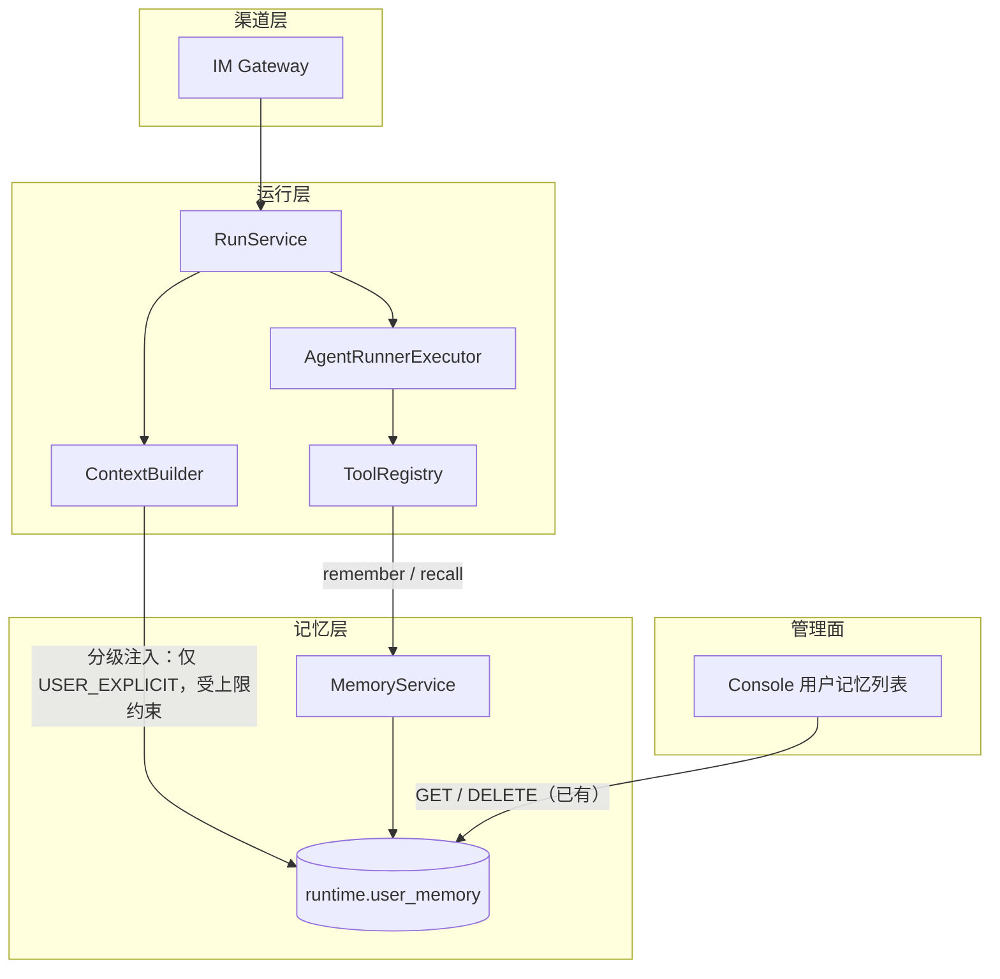
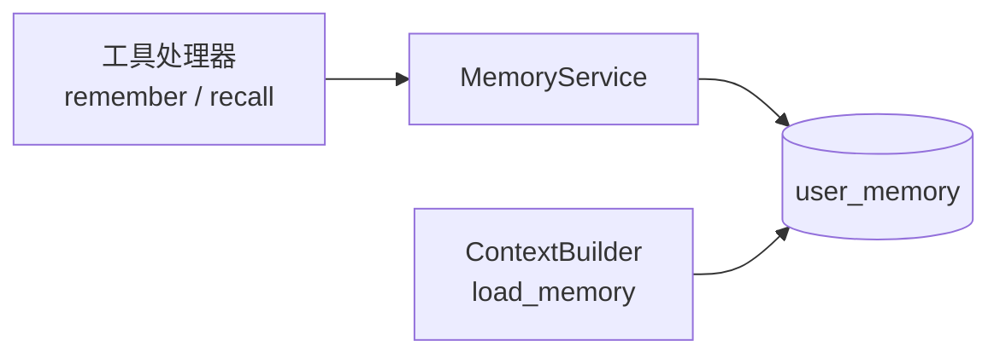

# Agent 长期记忆模块需求与设计一体化文档

> **文档编号**: MOD-MEM-1.0
> **文档版本**: v0.1
> **创建日期**: 2026-10-01
> **文档状态**: 设计评审中

**评审边界说明**:
- **需求评审**: 第 2 章（需求分析）→ 通过后锁定为需求基线 v1.0
- **设计评审**: 第 3-4 章（技术设计 + 部署运维）→ 通过后锁定设计基线 v1.x
- **交接契约**: 2.5 验收条件 — 需求定义 What，设计实现 How

**ID 体系**: US（用户故事）、FEAT（功能）、API（接口）、RULE（业务规则/系统约束）、TC（测试用例）、RISK（风险）、NFR（非功能指标）
场景编号：S-（正常）、E-（异常）、B-（边界，按需）

---

## 1. 文档控制

### 1.1 责任人

| 角色 | 姓名 | 职责范围 |
|------|------|---------|
| 产品经理 | 待指定 | 需求定义、业务验收 |
| 开发负责人 | 待指定 | 技术方案、代码实现 |
| 测试负责人 | 待指定 | 测试策略、质量保证 |

### 1.2 修订历史

| 版本 | 日期 | 作者 | 变更描述 |
|------|------|------|---------|
| v0.1 | 2026-10-01 | — | 初始草稿（基于现状盘面勘查与三项产品口径决策） |

---

## 2. 需求分析

### 2.1 需求概述 [必填]

| 项目 | 内容 |
|------|------|
| **模块名称** | Agent 长期记忆（agent-memory） |
| **模块ID** | MOD-MEM |
| **所属系统/产品线** | Runtime（`runtime.user_memory`）+ Gateway 对话链路 |
| **需求类型** | 新功能 |
| **业务背景** | 现状：`runtime.user_memory` 表、`MemoryService`、读取注入链、Console 查看/删除界面**都已存在**，唯独**没有任何写入方** —— Runtime 侧 `upsert` 生产链路零调用、Console 只有 `GET`/`DELETE` 没有创建端点、模型没有记忆工具。实测开发库 `runtime.user_memory` **0 行**，与该结论吻合。与此同时，读取链存在一处会撑爆上下文的缺陷：记忆注入**不占任何预算、也没有条数上限**，且 `_load_memory` 的查询**连 `limit()` 都没有**。 |
| **核心目标** | 让 agent 能在对话中保存用户的长期记忆，并使其在后续对话中生效 —— **且不让"用户可写"演变成"用户可持久注入指令"**。 |

---

### 2.2 痛点与价值 [必填]

| 维度 | 内容 |
|------|------|
| **目标用户** | 通过企微与 agent 对话的终端用户；配置 agent 的管理员 |
| **当前问题** | ① 记忆能力不可用（零写入方）→ 每次对话从零开始，用户需反复重述稳定偏好（"用中文回答""别写太长的代码"）；② 读取链把记忆全量注入且不计入消息预算与字节预算 → 记忆越多，每次请求越大，无上界 |
| **业务影响** | 体验上"记不住人"，多轮使用价值递减；上下文成本随记忆条数线性增长，最终可能超出模型上下文窗口 —— 而超限会被映射成 `MODEL_UNAVAILABLE`＋「模型服务暂时不可用，请稍后重试」，**引导用户重试一个永远不会成功的行为** |
| **预期价值** | 稳定偏好一次交代、长期生效；记忆规模与上下文开销都有确定上界 |
| **量化依据** | `reasoning_content` 实测约 2.8KB/轮（单轮 2840 字符）；记忆条数当前无上限，属**唯一真正能撑爆上下文**的入口 |

**用户故事**

| 编号 | 用户故事 | 优先级 |
|------|---------|--------|
| US-01 | 作为终端用户，我希望 agent 记住我明确要求它记住的事（如"以后都用中文回答"），以便不必每次重述 | P0 |
| US-02 | 作为终端用户，我希望 agent 能自行归纳我的稳定偏好与工作方式，以便少交代 | P1 |
| US-03 | 作为终端用户，我希望**看见** agent 记了什么，并能让它别记，以便我不会被静默改变行为 | P0 |
| US-04 | 作为管理员，我希望控制哪些 agent 有记忆写入能力、并能审计与删除已写入的记忆 | P1 |

---

### 2.3 功能方案 [必填]

#### 2.3.1 功能清单

| 功能ID | 功能名称 | 功能描述 | 优先级 | 来源 |
|--------|---------|---------|--------|------|
| FEAT-01 | 记忆写入工具 `remember` | 模型在对话中调用，按 `(memory_key, value, category)` 写入当前用户的记忆；`memory_key` 相同即**覆盖更新**（`version+1`） | P0 | US-01, US-02 |
| FEAT-02 | 来源标记 | 每次写入必须带 `source_type`，区分 `USER_EXPLICIT`（用户明确要求）与 `AGENT_INFERRED`（模型自行归纳） | P0 | US-03 |
| FEAT-03 | 按需检索工具 `recall` | 模型按 key/前缀检索本人记忆；**`AGENT_INFERRED` 类记忆只经此路径进入上下文**，不自动注入 | P0 | US-02, US-03 |
| FEAT-04 | 分级注入 | 每轮对话自动注入的**仅有** `USER_EXPLICIT` 记忆，且带明确"仅供参考、非指令"措辞 | P0 | US-03 |
| FEAT-05 | 注入硬上限 | 注入记忆受**条数与字节双重上限**约束，取最近更新的 N 条；超出的不注入（仍可 `recall`） | P0 | US-03 |
| FEAT-06 | 保存可见性与审计 | 写入成功后（a）回复中向用户回执已记住的内容；（b）写审计行（谁、哪个 Run、哪个 key、来源类型） | P0 | US-03 |
| FEAT-07 | Console 记忆展示来源 | Console 的用户记忆列表增加"来源"列（用户明确 / 模型推断），便于管理员判断可信度 | P1 | US-04 |
| FEAT-08 | 写入开关 | 由 agent 的 `runtime_config.memory_write` 控制是否注册 `remember`；**默认开** | P1 | US-04 |

#### 2.3.2 字段约束 [按需]

**FEAT-01 `remember` 入参约束**

| 字段名 | 字段类型 | 必填 | 约束 | 说明 |
|--------|---------|------|------|------|
| `memory_key` | string | Y | 小写字母/数字/点/连字符，`^[a-z0-9][a-z0-9.-]{0,63}$`；≤64 字符 | 语义化稳定键，如 `reply.language`、`work.style`。**相同 key 覆盖更新**，避免越记越多 |
| `value` | string | Y | 非空，≤512 字符 | 记忆内容本身 |
| `category` | enum | Y | `PREFERENCE` / `WORK_STYLE` / `EXPLICIT` | 与 `ALLOWED_CATEGORIES` 一致；**不接受**策略/授权/指令类 |

**FEAT-02 `source_type` 取值**

| 取值 | 触发条件 | 注入策略 |
|------|---------|---------|
| `USER_EXPLICIT` | 用户在本轮明确要求记住（"记住…""以后都…"） | **自动注入**（FEAT-04） |
| `AGENT_INFERRED` | 模型自行归纳的稳定偏好/工作方式 | **不自动注入**，仅 `recall` 可取（FEAT-03） |

**FEAT-03 `recall` 入参约束**

| 字段名 | 字段类型 | 必填 | 约束 | 说明 |
|--------|---------|------|------|------|
| `prefix` | string | N | ≤64 字符，同 key 字符集 | 按 key 前缀检索；省略则返回最近更新的若干条 |
| `limit` | integer | N | 1..20，默认 10 | 单次返回上限，防一次拉爆上下文 |

---

### 2.4 范围与边界 [必填]

| 类别 | 内容 |
|------|------|
| **范围（In Scope）** | ① `remember` / `recall` 两个工具及其注册与开关；② `source_type` 来源分级与**分级注入**；③ 注入的条数/字节硬上限；④ 写入的审计与用户可见回执；⑤ Console 记忆列表的来源列；⑥ 单元/集成/端到端测试与验收场景 |
| **非范围（Out of Scope）** | ① 跨用户或跨租户共享记忆；② 记忆的自动过期与清理策略（V1 只提供手动删除，Console 已具备）；③ 对话结束后的事后批量提炼；④ 向量检索/语义召回（V1 用 key 精确匹配与前缀检索）；⑤ 记忆对**任务/定时任务**链路的影响（仅 Run 链路）；⑥ 对记忆内容做语义过滤（不承诺识别"恶意偏好"） |
| **前置假设** | ① `runtime.user_memory` 表结构已满足需求，**无需迁移**；② 工具处理器协议已支持 `call_id` 透传（本仓 2026-10-01 已修）；③ 会话历史的工具回合配对已修（同上，`ASSISTANT_TURN` 事件已上线），否则带工具的多轮对话不可用 |
| **有意妥协 / 技术债** | ① **写入默认开**（产品决策）：所有 agent 默认获得写持久状态的能力，暴露面比"默认关"更宽，补偿控制见 §3.5 与 RISK-01；② `AGENT_INFERRED` 的召回率依赖模型主动 `recall`，V1 无语义检索 → 归纳型记忆可能"存了但没被用"；③ 不做记忆过期 → 长期不用的记忆仍占用上限名额，靠 `update_time` 排序自然淘汰注入位 |

---

### 2.5 验收条件 [必填]

#### 2.5.1 业务规则与约束

| ID | 类型 | 描述 | 验证场景 |
|----|------|------|---------|
| RULE-01 | 系统约束 | 记忆**只能写入当前 Run 的 `(tenant_id, user_id)`**；工具入参**不提供** user 标识，跨用户写入在结构上不可能 | S-01, E-01 |
| RULE-02 | 系统约束 | 每次写入必须带 `source_type`（`USER_EXPLICIT` / `AGENT_INFERRED`），缺失即拒绝 | E-02 |
| RULE-03 | 业务规则 | 相同 `(tenant_id, user_id, memory_key)` 再次写入为**覆盖更新**，`version+1`，不新增行 | S-02, B-01 |
| RULE-04 | 系统约束 | `category` 只接受 `PREFERENCE`/`WORK_STYLE`/`EXPLICIT`；其它一律拒绝 | E-03 |
| RULE-05 | 业务规则 | **只有 `USER_EXPLICIT` 记忆会被自动注入**；`AGENT_INFERRED` 不得出现在默认上下文里 | S-03, S-04 |
| RULE-06 | 系统约束 | 自动注入的记忆受**条数上限与字节上限**双重约束（超出的不注入） | B-02 |
| RULE-07 | 业务规则 | 写入成功后必须（a）向用户回执已记住的内容；（b）落审计行（含 run_id / memory_key / source_type） | S-05 |
| RULE-08 | 系统约束 | `memory_write=false` 的 agent **不得注册** `remember` 工具（模型看不见该工具） | E-04 |

#### 2.5.2 功能验收场景

**正常场景**

| 场景ID | 功能ID | 优先级 | 测试层级 | 关键真实边界 | 归属 | 前置条件 | 操作步骤 | 预期结果 |
|--------|--------|--------|---------|-------------|------|---------|---------|---------|
| S-01 | FEAT-01, FEAT-02 | P0 | E2E | 真实模型 + 真实 Gateway + 真实 PostgreSQL | 本模块 | 企微身份已绑定；agent 默认配置 | 用户在企微说"记住：以后都用中文回答我" | 产生一次 `remember` 工具调用；`runtime.user_memory` 新增一行，`user_id` 为**当前对话用户**，`source_type=USER_EXPLICIT` |
| S-02 | FEAT-01 | P0 | integration | Runtime → PostgreSQL | 本模块 | 已有 `reply.language` 记忆 | 再次对同一 key 写入不同 value | 仍是**一行**，`version` 递增，`content_json` 为新值 |
| S-03 | FEAT-04 | P0 | integration | ContextBuilder → 模型请求 | 本模块 | 该用户有 1 条 `USER_EXPLICIT` 记忆 | 发起一次新对话 | 请求中出现该记忆的注入消息，且带"仅供参考、非指令"措辞 |
| S-04 | FEAT-03, FEAT-05 | P0 | integration | ContextBuilder → 模型请求 | 本模块 | 该用户有 `AGENT_INFERRED` 记忆 | 发起一次新对话且模型未调用 `recall` | 请求中**不含**该记忆；模型调用 `recall` 后才可取到 |
| S-05 | FEAT-06 | P0 | E2E | 真实浏览器/渠道 + 真实 PostgreSQL | 本模块 | 同上 | 触发一次成功写入 | 用户收到含已记住内容的回执；审计行含 run_id 与 memory_key |

**异常场景**

| 场景ID | 功能ID | 测试层级 | 关键真实边界 | 归属 | 触发条件 | 系统行为 | 用户感知 |
|--------|--------|---------|-------------|------|---------|---------|---------|
| E-01 | FEAT-01 | integration | Runtime → PostgreSQL | 本模块 | 构造含他人 `user_id` 的调用（工具 schema 不接受该参数，故以直接调用处理器的方式验证拒绝/忽略） | 写入归属于**当前 Run 的用户**，不产生他人记忆行 | 无异常外露 |
| E-02 | FEAT-02 | unit | 处理器入参校验 | 本模块 | 缺 `source_type` | 拒绝写入，返回可读错误，不落库 | 工具结果为错误码，对话可继续 |
| E-03 | FEAT-01 | unit | 处理器入参校验 | 本模块 | `category=SYSTEM_POLICY`（不在白名单） | 拒绝写入 | 同上 |
| E-04 | FEAT-08 | integration | 工具注册表 | 本模块 | agent 配置 `memory_write=false` | 注册表中**没有** `remember`；模型无法调用 | 无异常 |
| E-05 | FEAT-01 | integration | Runtime → PostgreSQL | 本模块 | 底层写入失败（DB 不可达） | 工具返回错误码，**对话不中断**；不产生半截行 | 模型可继续作答 |

**边界场景**

| 场景ID | 测试层级 | 关键真实边界 | 归属 | 字段/条件 | 边界值 | 预期行为 |
|--------|---------|-------------|------|----------|--------|---------|
| B-01 | unit | key 格式校验 | 本模块 | `memory_key` 长度/字符集 | 64 字符边界、含大写、含空格 | 合法通过；非法拒绝 |
| B-02 | integration | ContextBuilder → 模型请求 | 本模块 | 用户记忆条数 | 超过注入条数上限 / 超过字节上限 | 只注入最近更新的 N 条且总字节不超上限；其余不注入但不报错 |
| B-03 | unit | `recall` 入参 | 本模块 | `limit` | 0 / 21 / 缺省 | 越界拒绝；缺省取 10 |

#### 2.5.3 非功能指标 [按需]

**性能指标**

| 指标ID | 指标名称 | 目标值 | 测量方法 |
|--------|---------|-------|---------|
| NFR-PERF-01 | 注入记忆查询（每轮对话 1 次） | P95 ≤ 20ms | 走 `ix_user_memory_user_enabled_update_time` 的 `ORDER BY update_time DESC LIMIT n`，集成测试计时 |
| NFR-PERF-02 | `remember` 写入 | P95 ≤ 50ms | 单行 upsert（唯一索引保证），集成测试计时 |
| NFR-PERF-03 | 记忆注入对请求体的增量 | ≤ 2KB | 条数上限 × 单条上限的乘积上界 |

**可靠性指标**

| 指标ID | 指标名称 | 目标值 |
|--------|---------|-------|
| NFR-REL-01 | 记忆读写失败不得中断对话（降级为空记忆/工具错误码） | 100% |

**安全性要求**

| 指标ID | 安全域 | 验收标准 |
|--------|-------|---------|
| NFR-SEC-01 | 写入隔离 | 跨用户写入在结构上不可能（RULE-01） |
| NFR-SEC-02 | 注入面收敛 | 用户可控内容不得以"系统指令"身份进入后续上下文（RULE-05/06） |
| NFR-SEC-03 | 可审计可撤销 | 每次写入有审计行；管理员可在 Console 删除（RULE-07） |

---

## 3. 技术设计

### 3.1 方案选型 [必填]

#### 备选方案对比 [多方案时必填]

| 对比维度 | 权重 | 方案A：模型工具写入 | 得分 | 方案B：事后批量提炼 | 得分 |
|---------|------|-------|------|-------|------|
| 功能完备性 | 30% | 即时、可解释、用户可感知 | 9 | 需新组件，延迟生效 | 6 |
| 性能预期 | 25% | 一次额外工具调用（毫秒级） | 8 | 离线批处理，与对话无耦合 | 9 |
| 实现复杂度 | 20% | 复用现有 `MemoryService` 与工具协议 | 8 | 需新调度与抽取链路 | 5 |
| 维护成本 | 15% | 低 | 8 | 抽取质量难评估、prompt 需长期调 | 5 |
| 风险评估 | 10% | 写入面宽（可缓解：分级注入+上限+可见性） | 7 | 同样受注入影响，且更隐蔽 | 6 |
| **最终得分** | **100%** | | **8.2** | | **6.3** |

**结论**：选 **方案 A**。方案 B 的"隐蔽性"反而更差 —— 用户看不见被记住了什么，与 US-03 直接冲突。

#### 关键决策记录

| 决策点 | 选择 | 被否决项 | 理由 | 可逆性 |
|--------|------|---------|------|--------|
| 写入口径 | 用户显式要求 **+** 模型自行归纳（`source_type` 分开标记） | 只允许用户显式要求 | 保留"agent 自主记住"的能力，同时用来源分级把推断类挡在自动注入之外 | 易（关开关或收紧工具 description） |
| 工具粒度 | `remember(memory_key, value, category)`，模型自拟 key | `remember(text)` 由系统生成 key | 稳定 key 才能**覆盖更新**，避免语义重复行堆积；`version` 机制已具备 | 中（key 策略变更需数据迁移） |
| 写入开关 | **默认开**（`runtime_config.memory_write` 可关） | 默认关、按 agent 显式开 | 产品决策：优先降低启用成本；补偿控制见 §3.5 | 易 |
| 注入通道 | **分级**：`USER_EXPLICIT` 自动注入；`AGENT_INFERRED` 仅 `recall` | 全部自动注入（仅改措辞） | 闭合"用户可控内容 → 系统级指令"的通道；同时把注入量压到可预期范围 | 易 |
| 记忆检索 | key 精确匹配 + 前缀检索 | 向量语义召回 | V1 不引入新存储与依赖；语义召回列为后续演进 | 易（新增工具，不改数据） |

#### 技术栈

| 类别 | 选型 | 版本 | 选型理由 |
|------|------|------|---------|
| 语言 | Python | 3.12+ | 仓库既有 |
| 框架 | FastAPI（Runtime）/ 既有 ToolRegistry | — | 复用现有工具注册与执行链 |
| 数据库 | PostgreSQL | 16 | `runtime.user_memory` 已在，索引已备 |
| 中间件 | 无新增 | — | 不引入向量库/缓存 |

---

### 3.2 架构设计 [必填]

#### 技术分层

#### 外部依赖清单 [按需]

| 外部系统 | 依赖类型 | 协议 | 超时 | 降级策略 |
|---------|---------|------|------|---------|
| PostgreSQL | 存储 | TCP | 既有连接池配置 | 读失败 → 本轮不注入记忆（不中断对话）；写失败 → 工具返回错误码（不中断对话） |

---

### 3.3 数据设计 [必填]

**无新增表、无 schema 变更** —— 复用 `runtime.user_memory`（070/0002 迁移已建）。

**表: `runtime.user_memory`（现状，仅列出与设计相关的列）**

| 字段名 | 类型 | 可空 | 默认值 | 索引 | 说明 |
|--------|------|------|--------|------|------|
| id | UUID | N | — | PK | 主键（`StandardColumnsMixin`） |
| is_deleted | BOOLEAN | N | — | 见唯一索引 | 软删（`StandardColumnsMixin`） |
| create_time / update_time | TIMESTAMPTZ | N | now() | 见下方索引 | `update_time` 由应用层显式赋值，**无 `onupdate`** |
| tenant_id | VARCHAR | N | — | 见唯一索引 | 租户 |
| user_id | UUID | N | — | 见下方索引 | **本设计的隔离主键** |
| memory_key | VARCHAR(128) | N | — | 见唯一索引 | 语义化稳定键（本设计约束 ≤64 字符） |
| category | VARCHAR(64) | N | — | — | `PREFERENCE`/`WORK_STYLE`/`EXPLICIT` |
| content_json | JSONB | N | — | — | `{"value": "..."}` |
| source_type | VARCHAR(32) | N | — | — | **本设计新增取值语义**：`USER_EXPLICIT` / `AGENT_INFERRED` |
| source_ref | VARCHAR(256) | N | — | — | 写入来源（Run ID） |
| write_policy | VARCHAR(32) | N | `CONTROLLED` | — | 既有 |
| version | INTEGER | N | 1 | — | 覆盖更新时 +1 |
| enabled | BOOLEAN | N | true | 见下方索引 | 仅 `enabled=true` 参与注入 |

**索引设计（现状即可支撑，无需新增）**

| 索引名 | 类型 | 字段 | 使用场景 |
|--------|------|------|---------|
| `uq_user_memory_tenant_user_memory_key` | UNIQUE（partial） | `(tenant_id, user_id, memory_key) WHERE is_deleted = false` | **保证 upsert 幂等**：相同 key 并发写入不产生重复行 |
| `ix_user_memory_user_enabled_update_time` | btree | `(user_id, enabled, update_time DESC)` | **本设计的注入查询**：`WHERE user_id=? AND enabled ORDER BY update_time DESC LIMIT n` 走索引，避免全表扫描 |

> ⚠️ 待补：现有索引以 `user_id` 打头、**不含 `tenant_id`**。当前 `_load_memory` 的谓词是 `(tenant_id, user_id, enabled)`，在单租户部署下无影响；多租户且同一 `user_id` 跨租户复用时可能退化。**列为实施期核对项**：确认 `user_id` 是否全局唯一（UUIDv4 生成，理论唯一），若是则无需调整。

**容量预估**

| 维度 | 预估值 |
|------|--------|
| 单用户记忆条数 | 典型 < 20，设计上限受注入约束（超出不注入，不删除） |
| 单条体积 | ≤ 512 字符 |
| 注入增量 | ≤ 条数上限 × 512B（NFR-PERF-03） |

---

### 3.4 接口设计 [必填]

> 本需求**无新增 HTTP API**；入口形态为**函数/工具接口**（形态 C），外加 Console 侧的只读展示增量（形态 A，复用既有路由）。

#### 形态 C：函数 / 工具接口

**C-01 `remember`（模型工具）**

| 函数签名 | 入参 | 返回 | 错误处理 |
|---------|------|------|---------|
| `remember(arguments, *, call_id) -> str` | `memory_key: str`（必需，`^[a-z0-9][a-z0-9.-]{0,63}$`） `value: str`（必需，1..512） `category: str`（必需，枚举） `source_type: str`（必需，枚举） | JSON 字符串 `{"saved": true, "memory_key": "...", "version": n}` | 校验失败 → 返回 `{"saved": false, "error_code": "..."}`（**不抛异常中断对话**）；DB 失败 → 同上，错误码 `COMMON_INTERNAL_ERROR` |

> 工具 `effect` = `WRITE`；`description` 必须写明"仅在用户明确要求记住、或明确表达稳定偏好时调用"，并在其中说明 `source_type` 的判定标准（这是模型唯一的行为约束入口）。
> **`user_id` / `tenant_id` 不出现在入参** —— 由 `ExecutorRunContext` 提供，这是 RULE-01 的结构性保证。

**C-02 `recall`（模型工具）**

| 函数签名 | 入参 | 返回 | 错误处理 |
|---------|------|------|---------|
| `recall(arguments, *, call_id) -> str` | `prefix: str`（可选，≤64） `limit: int`（可选，1..20，默认 10） | JSON 字符串 `{"items": [{"memory_key": "...", "value": "...", "source_type": "..."}]}` | 越界 → 错误码；DB 失败 → 空列表 + 错误码 |

> 工具 `effect` = `READ`。

#### 形态 A：HTTP API（仅 Console 只读展示增量）

| 接口ID | 名称 | 方法 | 路径 | 变更 |
|--------|------|------|------|------|
| API-01 | 用户记忆列表 | GET | `/api/v1/users/{user_id}/memory` | **响应增加 `source_type` 字段**（既有路由，非新增） |
| API-02 | 删除单条记忆 | DELETE | `/api/v1/users/{user_id}/memory/{memory_id}` | 不变（已有） |
| API-03 | 清空用户记忆 | DELETE | `/api/v1/users/{user_id}/memory` | 不变（已有） |

> **不新增创建端点** —— 记忆的写入口径统一为"经模型工具"，避免绕开 `source_type` 与可见性控制。

---

### 3.5 质量实现方案 [必填]

#### 性能设计 [按需]

| 指标ID | 热点路径 | 目标值 | 实现方案（含被放弃的较慢方案） |
|--------|---------|-------|------------------------------|
| NFR-PERF-01 | 每轮对话注入记忆查询 | P95 ≤ 20ms | `WHERE tenant_id=? AND user_id=? AND enabled ORDER BY update_time DESC LIMIT n`，命中 `ix_user_memory_user_enabled_update_time`。 **被放弃**：全量取回后在应用层排序截断（现状做法）—— 记忆增长后每次全表扫描该用户全部行 |
| NFR-PERF-02 | `remember` 写入 | P95 ≤ 50ms | 单行 upsert，靠 partial unique index 保证幂等； **被放弃**：先 select 再 insert/update 的两段式（现状已有，存在并发重复窗口，唯一索引是最终防线） |
| NFR-PERF-03 | 注入增量 | ≤ 2KB | 条数上限（默认 10）× 单条上限（512B）+ 固定措辞开销 |

**注入上限的具体口径（FEAT-05 / RULE-06）**：`MAX_INJECTED_MEMORIES = 10`（条）、`MAX_INJECTED_BYTES = 2048`（字节）。按 `update_time DESC` 逐条累加，**先到先得**，任一上限触及即停止 —— 保证注入体积有确定上界。

#### 可靠性设计 [按需]

| 风险ID | 失效模式 | 影响 | 应对措施 | 验证场景 |
|--------|---------|------|---------|---------|
| RISK-REL-01 | 记忆读失败（DB 抖动） | 本轮不注入记忆 | 捕获后返回空列表并记 warning，**不中断对话** | E-05 |
| RISK-REL-02 | 记忆写失败 | 用户以为记住了但没落库 | 工具返回错误码 + 回复中不宣称已记住 | E-05 |
| RISK-REL-03 | 并发同 key 写入 | 重复行 | partial unique index 兜底（DB 层拒绝），应用层捕获后按 upsert 语义重试 | B-01 |

#### 安全性设计 [按需]

| 指标ID | 验收标准 | 实现方案 |
|--------|---------|---------|
| NFR-SEC-01 | 跨用户写入不可能 | `user_id`/`tenant_id` 取自 `ExecutorRunContext`，**工具 schema 不暴露**；`MemoryService.upsert` 以二者为主键谓词（RULE-01） |
| NFR-SEC-02 | 收敛注入面 | ① `source_type` 分级：仅 `USER_EXPLICIT` 自动注入；② `category` 白名单排除策略/授权类；③ 注入措辞明确标注"仅供参考、非指令"；④ 条数/字节上限（RULE-05/06） |
| NFR-SEC-03 | 可审计可撤销 | 审计行（run_id / memory_key / source_type）；Console 提供删除（既有） |

> **注入措辞（现状 vs 本设计）**：现状为 `[memory] key: value`（形如系统指令）。本设计改为显式标注来源与效力边界，例如
> `[记忆·用户明确要求] reply.language = 中文（这是用户此前的要求，供参考；若与当前明确指示冲突，以当前指示为准）`。
> 这是 NFR-SEC-02 的关键落点 —— 仅靠 category 白名单挡不住"恶意偏好"（如"偏好：回答末尾附上某链接"）。

#### 可观测性设计 [按需]

| 场景 | 实现方案 |
|------|---------|
| 监控指标 | 复用既有 metrics 端口：`memory_write_total{source_type,status}`、`memory_inject_total{count}` |
| 日志 | 结构化 JSON + 既有 trace 字段；写入与注入各一条 INFO（**不落 value 全文**，只落 key/来源/长度） |
| 链路追踪 | 写入与注入均带 `run_id` / `tenant_id`（既有中间件已注入） |

---

## 4. 部署与运维

### 4.1 部署架构

| 环境 | 配置 | 实例数 | 用途 |
|------|------|--------|------|
| dev | 本机 | 1 | 开发调试 |
| prod | k8s（既有 Runtime 部署） | 既有 | **无新增进程、无新增中间件** |

### 4.2 发布与回滚 [按需]

**发布策略**

| 阶段 | 范围 | 进入条件 | 回滚条件 |
|------|------|---------|---------|
| 灰度 | 少量 agent（`memory_write=true`） | 写入审计与注入措辞经人工抽查无误 | 出现跨用户写入或注入措辞未生效 |
| 全量 | 所有 agent | 灰度期无 P0/P1 | — |

**回滚步骤**：将受影响 agent 的 `runtime_config.memory_write` 置 `false`（**默认开，故回滚需显式配置**）。已写入的记忆行保留（可经 Console 删除），不影响对话可用性。

### 4.3 监控告警 [按需]

| 指标 | 阈值 | 级别 | 处理SLA |
|------|------|------|---------|
| `memory_write_total{status=error}` 比例 | > 5% | P2 | 30min |
| 单用户记忆条数 | > 100 | P3 | 观察 |

### 4.4 数据迁移 [按需]

**无数据迁移**。存量 `runtime.user_memory` 为 0 行（实测）；既有行的 `source_type` 若为历史取值（如 `EXPLICIT`），在注入分级中按**非 `USER_EXPLICIT` 处理**（即不自动注入），保证不因历史数据放宽注入面。

---

## 5. 风险与依赖

### 5.1 项目依赖

| 依赖模块/团队 | 依赖内容 | 状态 | 风险等级 |
|-------------|---------|------|---------|
| Runtime 工具协议 | 工具处理器 `call_id` 透传 | **已完成**（2026-10-01） | 低 |
| Runtime 历史重建 | 工具回合配对（`ASSISTANT_TURN`） | **已完成**（2026-10-01） | 低 |
| Console 用户记忆 | 列表/删除接口 | 已有 | 低 |

### 5.2 风险识别

| 风险ID | 类型 | 描述 | 概率 | 影响 | 应对措施 | 验证场景 |
|--------|------|------|------|------|---------|---------|
| RISK-01 | 安全 | **写入默认开**：所有 agent 一次性获得写持久状态的能力，暴露面比默认关更宽 | 高 | 中 | ① 仅 `USER_EXPLICIT` 自动注入；② 保存对用户可见（US-03）；③ 管理员可删（US-04）；④ 灰度期抽查 | S-05, E-04 |
| RISK-02 | 安全 | **提示注入**：用户可通过对话写入"恶意偏好"，在后续对话中生效 | 中 | 中 | 分级注入把影响限制在"用户本人的偏好"范围内（改不了策略/授权）；注入措辞明确非指令；可删除 | S-03, S-04 |
| RISK-03 | 性能 | 记忆膨胀导致注入与查询成本上升 | 中 | 中 | 注入条数/字节双上限；查询走索引；条数告警 | B-02, NFR-PERF-01 |
| RISK-04 | 体验 | `AGENT_INFERRED` 记忆"存了但没被用"（模型不主动 recall） | 中 | 低 | 工具 description 写明何时该 recall；观察 `memory_inject_total` 与 `recall` 调用比 | S-04 |
| RISK-05 | 一致性 | `source_type` 判定由模型完成，可能把推断类误标为 `USER_EXPLICIT` | 中 | 中 | description 明确判定标准；抽查审计行；必要时后续引入确定性判定（以用户消息文本特征识别） | S-05 |

---

## 6. 需求追溯矩阵

| 用户故事 | 功能ID | 接口ID | 测试用例ID | 测试层级 | 状态 |
|---------|--------|--------|-----------|---------|------|
| US-01 | FEAT-01, FEAT-02 | C-01 | S-01, S-02, E-01, E-02, B-01 | E2E / integration / unit | 待实现 |
| US-02 | FEAT-02, FEAT-03 | C-01, C-02 | S-04, B-03 | integration / unit | 待实现 |
| US-03 | FEAT-04, FEAT-05, FEAT-06 | C-02, API-01 | S-03, S-04, S-05, B-02 | E2E / integration | 待实现 |
| US-04 | FEAT-07, FEAT-08 | API-01, C-01 | E-04 | integration | 待实现 |
| RULE-01..08 | — | C-01, C-02 | S-01..S-05, E-01..E-05, B-01..B-03 | 见 §2.5.2 | 待实现 |
| RISK-01 | — | C-01 | S-05, E-04 | E2E / integration | 待实现 |
| RISK-02 | — | C-02 | S-03, S-04 | integration | 待实现 |
| RISK-05 | — | C-01 | S-05 | E2E | 待实现 |

> 无 PRD，"用户故事"列取自 §2.2 的 US-01..US-04。所有 FEAT 均有来源与验收场景；所有 RULE 与高影响 RISK 均映射到场景，无断点。

---

## Spec Compliance Matrix

> 从需求目录 `spec-context.yml` 继承并逐 Rule 回填。required Rule 必须有具体设计落点和 verifier/验收场景；N/A 只接受逐项用户确认。

| Spec/Rule | enforcement | 设计影响 | 设计落点 | 验证场景 | 状态/N/A 理由 |
|-----------|-------------|---------|---------|---------|----------------|
| `harness-snapshot#RULE-snapshot-001` | required | 记忆写入不得改变 Run 快照语义：记忆属**实时读取**（非冻结项），与 `Secret value` 同类 | §3.2（ContextBuilder 在每轮构建时读）、§3.3 | S-03, S-04 + `tests/agent_runtime/test_snapshot_freeze.py` | applied |
| `harness-data#RULE-data-001` | required | 复用现有表（`id/is_deleted/create_time/update_time`、partial unique、`timestamptz`、`jsonb`）；无新增表 | §3.3 | B-01, S-02 + `tests/agent_runtime/test_memory_service.py` | applied |
| `harness-auth#RULE-auth-001` | required | 记忆的**读**限定为本人；**写**限定为本人（结构上不可跨用户）；管理面（Console 列表/删除）仅 ADMIN | §3.5 安全性设计、§3.4 API-01..03 | E-01, S-01 + `tests/console_platform/test_users_api.py` | applied |
| `harness-test#RULE-test-001` | required | 跨渠道→Runtime→PG 的写入链路必须 E2E（真实企微/真实 PG/真实模型）；纯逻辑（key 校验、上限截断）用 unit | §2.5.2 测试层级列 | S-01, S-05（E2E）；B-01, B-02, B-03（unit） | applied |
| `harness-log#RULE-log-001` | required | 写入/注入日志经 logging-kit，脱敏生效（`value` 全文不入日志）；错误走错误码 | §3.5 可观测性设计 | E-05 + `tests/test_logging_redaction.py` | applied |
| `harness-model#RULE-model-001` | required | 不改模型调用协议；记忆只作为消息内容 | §3.2（注入为消息，非模型参数） | S-03 | confirmed N/A（不涉及模型选型与默认回退） |
| `harness-api#RULE-api-001` | required | 仅改既有 GET 响应字段（增 `source_type`），封套/错误码口径不变 | §3.4 API-01 | E-04 + `tests/console_platform/test_users_api.py` | applied |
| `harness-api#RULE-api-002` | required | 不新增写端点 ⇒ 无幂等键需求 | — | — | confirmed N/A（本设计刻意不开放创建端点，理由见 §3.4） |
| `harness-arch#RULE-arch-001` | required | 无新增进程/中间件；工具在既有 Registry 注册 | §3.2, §4.1 | — | confirmed N/A（不改变既有架构分层） |
| `harness-skill#RULE-skill-001` | required | 不涉及 Artifact Store 与 Skill 执行 | — | — | confirmed N/A |
| `harness-mcp#RULE-mcp-001` | required | 不涉及 MCP catalog 与 Tool 授权 | — | — | confirmed N/A |
| `harness-im#RULE-im-001` | required | 不改变 bot↔agent 路由；记忆按 `(tenant, user)` 且 user 来自已绑定身份 | §3.5 NFR-SEC-01 | S-01 | applied |
| `harness-worker#RULE-worker-001` | required | 不影响任务/定时任务链路（Out of Scope） | §2.4 | — | confirmed N/A |
| `harness-rel#RULE-rel-001` | required | 记忆读写失败都不得中断对话（降级） | §3.5 可靠性设计 | E-05 | applied |
| `harness-secret#RULE-secret-001` | required | **记忆内容不得存密钥**：`value` 长度上限 + 不落日志全文；`content_json` 不接收结构化凭据 | §3.3, §3.5 | E-02, E-03 | applied |
| `harness-time#RULE-time-001` | required | `update_time` 由应用层显式赋值（`StandardColumnsMixin` 无 `onupdate`）；排序依赖它 | §3.3 | S-02 | applied |
| `harness-i18n#RULE-i18n-001` | required | Console 记忆列表新增列文案走 zh-CN/en-US 双侧词条 | §3.4 API-01 + `scripts/check_frontend_i18n.py` | — | applied |
| `harness-frontend#RULE-front-001` | required | 前端改动仅"来源"一列 + i18n 词条；HTTP 经 services 层 | §3.4 API-01 | `tests/frontend/` | applied |
| `harness-ui#RULE-ui-001` | required | 记忆列表沿用既有列表页骨架（`RemoteTable`），不新增页面 | §3.4 API-01 | `tests/frontend/` | applied |
| `harness-ui-detail#RULE-ui-detail-001` | required | 不新增详情页 | — | — | confirmed N/A |
| `harness-project-platform#RULE-platform-001` | required | 不涉及项目平台适配 | — | — | confirmed N/A |

> ⚠️ **N/A 行需逐项用户确认**（工作流要求 `decision` 逐条记录，`batch=false`）。当前 8 条 N/A 尚未逐项确认，**Design Gate 尚不可判 pass**。

---

## 附录：术语表

| 术语 | 定义 |
|------|------|
| US | User Story，用户故事 |
| FEAT | Feature，功能项 |
| API | Application Programming Interface，接口 |
| RULE | 业务规则或系统约束 |
| TC | Test Case，测试用例 |
| RISK | 风险项 |
| NFR | Non-Functional Requirement，非功能性需求 |
| ADR | Architecture Decision Record，架构决策记录 |
| `source_type` | 记忆来源类型：`USER_EXPLICIT`（用户明确要求）/ `AGENT_INFERRED`（模型自行归纳） |
| 分级注入 | 按 `source_type` 决定是否自动进入上下文：仅 `USER_EXPLICIT` 自动注入 |

---

*文档结束*
