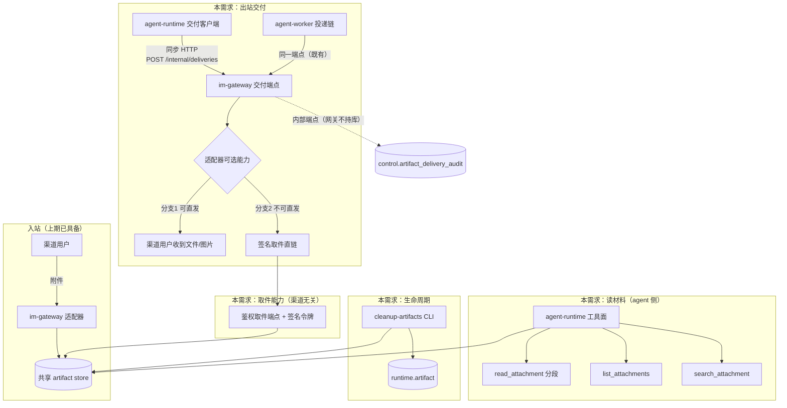
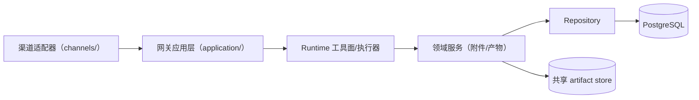
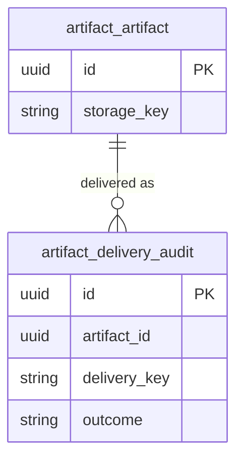
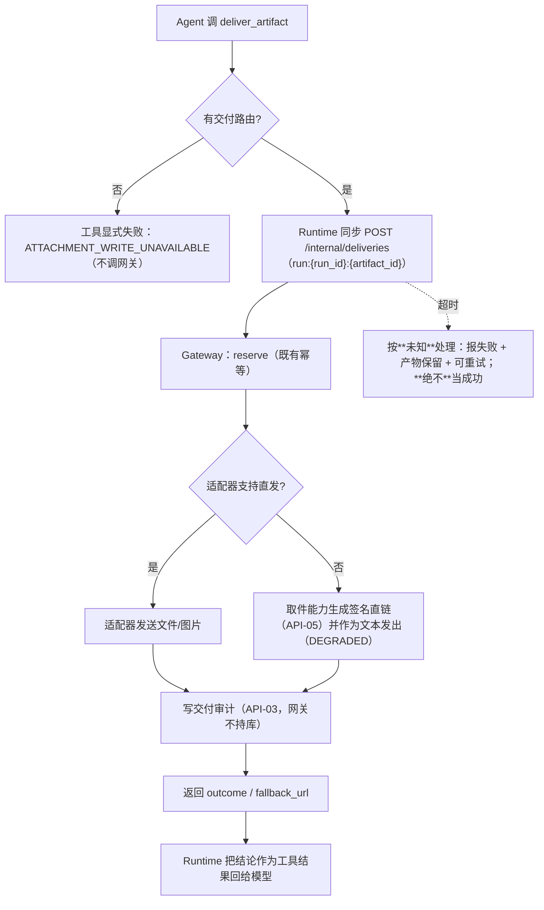

# 附件往返（出站交付 + 读材料增强 + 入站回执 + 生命周期）模块需求与设计一体化文档

> **文档编号**: MOD-ARTIFACT-RT-1
> **文档版本**: v0.1
> **创建日期**: 2026-10-02
> **文档状态**: 草稿

**评审边界说明**:
- **需求评审**: 第 2 章（需求分析）→ 通过后锁定为需求基线 v1.0
- **设计评审**: 第 3-4 章（技术设计 + 部署运维）→ 通过后锁定设计基线 v1.x
- **交接契约**: 2.5 验收条件 — 需求定义 What，设计实现 How

**ID 体系**: US（用户故事）、FEAT（功能）、API（接口）、RULE（业务规则/系统约束）、TC（测试用例）、RISK（风险）、NFR（非功能指标）
场景编号：S-（正常）、E-（异常）、B-（边界，按需）

**填写约定**: 本文档无 PRD 来源，US 由本设计定义并作为 FEAT 的"来源"。表内未实测的阈值一律填"待定"，不照抄示例值。

---

## 目录

- [1. 文档控制](#1-文档控制)
- [2. 需求分析](#2-需求分析)
- [3. 技术设计](#3-技术设计)
- [4. 部署与运维](#4-部署与运维)
- [5. 风险与依赖](#5-风险与依赖)
- [6. 需求追溯矩阵](#6-需求追溯矩阵)
- [Spec Compliance Matrix](#spec-compliance-matrix)
- [附录：术语表](#附录术语表)

---

## 1. 文档控制

### 1.1 责任人

| 角色 | 姓名 | 职责范围 |
|------|------|---------|
| 产品经理 | 待填 | 需求定义、业务验收 |
| 开发负责人 | 待填 | 技术方案、代码实现 |
| 测试负责人 | 待填 | 测试策略、质量保证 |

### 1.2 修订历史

| 版本 | 日期 | 作者 | 变更描述 |
|------|------|------|---------|
| v0.1 | 2026-10-02 | — | 初始草稿（四包范围对齐后成文） |
| v0.2 | 2026-10-03 | — | FEAT-06 真机探针完成：回填 §3.6「真机探针结论」事实表；跳 4 由"完全未知"改为**直发（`media_id`）**；§2.4 前置假设/妥协、§3.2 外部依赖、§5.1/§5.2（R-01 消解、R-06 已执行）同步更新；S-05 结论落定 S-06 走分支 1 |
| v0.3 | 2026-10-03 | — | ①TASK-002 范围收窄：FEAT-03 的「目录/摘要」不做，降级为可行动的翻页指引；`offset` 超全文长度定为「空段+标注」而非报错（E-01 措辞同步澄清）。②**单文件上限 20 MiB → 50 MiB**（门控 `MAX_ATTACHMENT_BYTES` + Runtime `MAX_READ_BYTES` 同步），依据：企微官方入站回调上限 100 MB、出站上传天花板 ≈50 MB；**取代**归档需求 wecom-inbound-media 的 RULE-05 数值 |

---

## 2. 需求分析

### 2.1 需求概述 [必填]

| 项目 | 内容 |
|------|------|
| **模块名称** | 附件往返（attachment round-trip） |
| **模块ID** | MOD-ARTIFACT-RT-1 |
| **所属系统/产品线** | Fluxion Agent Harness |
| **需求类型** | 新功能 + 缺陷修复（既有 `write_artifact` 语义与实际能力不符） |
| **业务背景** | 上一需求 `wecom-inbound-media`（2026-10-02 归档，12/12 任务、25/25 场景 verified）只闭合了**入站**：用户可以发图片/文件给 Agent，Agent 能看、能读、能被门控与审计。但**另一半是断的**——(a) Agent 写出的文件没有任何人交付给用户；(b) 读文档只能读前 20 000 字符；(c) 收到附件后除了模型回答没有任何回执；(d) 产物只增不减。 |
| **核心目标** | 让附件在平台上**走得通往返**：进得来（已具备）→ 读得完 → 交得回 → 有回执、有生命周期。 |

---

### 2.2 痛点与价值 [必填]

| 维度 | 内容 |
|------|------|
| **目标用户** | ① 企微里跟机器人对话的终端用户；② 平台运维/租户管理员（需要看到与取回产物） |
| **当前问题** | ① **出站断链（最严重）**：`write_artifact` 写入 `outbound/{run_id}/{artifact_id}` 并落 `artifact` 行（`AGENT_OUTPUT`），返回一个 UUID；**全仓 `AGENT_OUTPUT` 只有写入方、零消费方**，用户永远收不到文件。② 后台任务路径更直白：交付正文会拼一句「完整结果见附件：`<uuid>`」，用户看到一串 UUID，既没有文件也没有可点的入口（`apps/agent-worker/src/muad_agent_worker/delivery/messages.py:70-71`）。③ 长文档只能读前 20 000 字符且无分页参数（`MAX_TEXT_CHARS`，`read_attachment` schema 只有 `artifact_id`）。④ 历史引用被上下文预算裁掉后，附件**永久失联**（无枚举入口）。⑤ 收到附件后除模型回答无任何回执：全收下时静默，部分拒绝时用户不知道哪些收下了。⑥ 入站/出站产物只增不减（上期 Non-goals 明确排除保留期策略）。 |
| **业务影响** | 「Agent 把结果整理成文件交回」这条用户价值（上期 US-05）**当前不成立**；长文档场景实际不可用（只能看到开头）；产物无限增长会在共享 PVC 上堆积且无人能证明"某个文件存在过"。 |
| **预期价值** | 让"发文件给机器人 → 机器人处理 → 拿回文件"成为一条端到端可用的闭环；把长文档从"只能看开头"变成"可读完"；产物可追溯、可清理。 |

**用户故事**

| 编号 | 用户故事 | 优先级 |
|------|---------|--------|
| US-01 | 作为终端用户，我希望 Agent 能读完整份长文档（而不只是开头），以便它就文档后半部分的事实也能回答 | P0 |
| US-02 | 作为终端用户/Agent，我希望在对话的任何阶段都能重新找回之前发过或写过的某个附件，以便跨多轮继续用它 | P0 |
| US-03 | 作为终端用户，我希望发完附件后明确知道哪些收下了、哪些被拒了，以便决定要不要重发 | P0 |
| US-04 | 作为终端用户，我希望 Agent 写出的文件能真正交到我手里（在企微里收到文件，或拿到一个可下载的链接），以便直接用 | P0 |
| US-05 | 作为运维/租户管理员，我希望产物有明确的保留期与清理，并能查看/取回，以便控制存储与排查问题 | P1 |

---

### 2.3 功能方案 [必填]

#### 2.3.1 功能清单

| 功能ID | 功能名称 | 功能描述 | 优先级 | 来源 |
|--------|---------|---------|--------|------|
| FEAT-01 | `read_attachment` 分段读取 | schema 增加 `offset`/`limit`；返回值标注片段区间与总长度，可拼接还原全文 | P0 | US-01 |
| FEAT-02 | 附件枚举 `list_attachments` | 枚举当前 Run/会话可寻址的附件（入站 + Agent 自产），带 id/文件名/MIME/大小/方向/时间 | P0 | US-02 |
| FEAT-03 | 长文档分段指引 | **正文超长**（> `MAX_TEXT_CHARS`，与字节上限无关）时，把原来那句"内容过长，已截断"换成**可行动的翻页指引**：全文总长 + 本段区间 + 后续各段 `offset` + 单次上限。**不做"目录/摘要"**（抽取结果是纯文本、无真实文档结构可依；行首偏移表语义模糊且会挤占模型上下文）——真需要时另开需求 | P1 | US-01 |
| FEAT-04 | 文档内定位 `search_attachment` | 在已抽取文本里按关键词返回命中片段与偏移，避免盲目翻页 | P1 | US-01 |
| FEAT-05 | 入站附件回执 | 收到附件后（全部或部分接收）给一条明确回执；与既有"拒绝反馈"合并为**至多一条**消息 | P0 | US-03 |
| FEAT-06 | 企微出站能力真机探针 | 用真实机器人验证：能否发文件/图片、上传流程、发送 ack 与幂等。**已完成（2026-10-03）：可以直发，唯一通路是 `media_id`**，逐条实测见 §3.6「真机探针结论」 | P0（前置） | US-04 |
| FEAT-07 | 出站形态契约 | `DeliveryMessage` 增加产物形态（渠道中立，复用 `AttachmentRef` 同型引用） | P0 | US-04 |
| FEAT-08 | "写出"与"交付"语义分离 | `write_artifact` 只写；新增 `append_artifact`（分段写长文档）与显式交付动作 | P0 | US-04 |
| FEAT-09 | 产物投递链 | 会话内（SSE 内交付）与后台任务（worker → gateway）两条路径把产物交给渠道 | P0 | US-04 |
| FEAT-10 | 图片出站 | 让 Agent 把图片发给用户（`view_image` 是入站方向的重看，方向不同）；与文件共用同一条交付链（`type=image`） | P0 | US-04 |
| FEAT-11 | 出站交付审计 | 记录"谁在何时把哪个产物交付给哪个路由、结果如何" | P0 | US-04 |
| FEAT-12 | 产物保留期与清理 | 按保留期清理入站/出站产物（文件 + DB 行），带宽限期保护进行中事务 | P1 | US-05 |
| FEAT-13 | 产物取件（渠道无关） | 带鉴权的取件端点 + **签名短 TTL 令牌**（降级链接、未来 web chat 复用同一套）；**Console 页面后置** | P0 | US-04、US-05 |
| FEAT-14 | **写完即可交付（硬需求）** | 写出的产物**必须能被发送给用户**：`write_artifact` 不得停留在「返回一个没人接收的 id」；由显式交付动作 + 两条投递路径 + 适配器出站能力共同保证（见 §3.6） | P0 | US-04 |

#### 2.3.2 字段约束 [按需]

**FEAT-01 `read_attachment` 入参**

| 字段名 | 字段类型 | 必填 | 约束 | 说明 |
|--------|---------|------|------|------|
| artifact_id | string | 是 | UUID 形态 | 既有字段，寻址入口 |
| offset | integer | 否 | ≥0，缺省 0 | 起始字符偏移；**超出全文长度返回空片段并注明**（不是错误——设计口径，与 B-01 一致） |
| limit | integer | 否 | 1..`MAX_TEXT_CHARS`，缺省 `MAX_TEXT_CHARS` | 单次返回的字符数上限 |

> **三个"上限"别混**（2026-10-03 澄清）：① 门控 `MAX_ATTACHMENT_BYTES` = **50 MiB 字节**——收不收这个附件；② runtime `MAX_READ_BYTES` = 50 MiB——照门控抄的第二道防线；③ `MAX_TEXT_CHARS` = **20 000 字符**——单次回给模型的**上下文窗口**，与前两者无关。本节的 `offset`/`limit` 只管第③个：一份 60 000 字符的文档通常只有几十到一两百 KB，**离门控差三个数量级**，"读不动"不会发生，只有"一次看不全"。
> **单文件上限 20 MiB → 50 MiB（2026-10-03，TASK-002 附带改动）**：企微官方对入站 `file`/`video` 的回调上限是 **100 MB**（《接收消息》100719），`image` 未标限制；而这个 20 MiB 从来不是渠道约束，是上期（wecom-inbound-media RULE-05）自己定的产品策略，**比官方紧 5 倍**。放宽到 50 MiB 的第二个理由是与**出站**对齐：出站上传通道的天花板是 512 KiB × 100 片 ≈ 50 MB（§3.6），50 MiB 让"收得进来"与"发得出去"同量级。**本值取代归档需求 RULE-05 的数值**，数量上限（单消息 5 个）未动。代价：单个超限附件最多浪费 50 MiB + 1 带宽（下载器读满即止）；验收 E-02 的超限夹具随常数涨到 62 MiB。改动落点：门控常量 + Runtime 镜像常量 + 钉死数值的那条断言。

**FEAT-02 `list_attachments` 入参**

| 字段名 | 字段类型 | 必填 | 约束 | 说明 |
|--------|---------|------|------|------|
| scope | string | 否 | `run` / `conversation`，缺省 `conversation` | 枚举范围 |
| direction | string | 否 | `inbound` / `outbound`，缺省不限 | 用户发来的 vs Agent 写出的 |
| limit | integer | 否 | 1..50，缺省 20 | 返回条数 |
| offset | integer | 否 | ≥0，缺省 0 | 分页偏移 |

**FEAT-07 出站产物形态（契约）**

| 字段名 | 字段类型 | 必填 | 约束 | 说明 |
|--------|---------|------|------|------|
| type | string | 是 | `text` / `artifact` / `image` | 新增取值；`text` 为既有缺省 |
| text | string | 条件 | `type=text` 时必填且 `min_length=1` | 既有字段 |
| artifact | `AttachmentRef` | 条件 | `type=artifact`/`image` 时必填 | **渠道中立**：只有相对 `storage_key` 与元信息，不含任何渠道私有取件/发送凭据 |

---

### 2.4 范围与边界 [必填]

| 类别 | 内容 |
|------|------|
| **范围（In Scope）** | ① 读材料：分段读取、附件枚举、大文件策略、文档内定位；② 入站回执：接收结果反馈（与拒绝反馈合并）；③ 出站交付：真机探针 → 契约形态 → 写/交付语义分离 → 会话内与后台两条投递路径 → 图片出站 → 交付审计；④ 生命周期：保留期与清理、**渠道无关的产物取件端点（签名短 TTL 直链）**。**本期不做 Console 前端页面**（见 §Spec Compliance Matrix 的落点说明）。 |
| **非范围（Out of Scope）** | ① 企微以外的 IM 通道（本次只做企微；但接缝按渠道中立设计，新通道只写适配器）；② 附件的在线编辑/协作（只做读、写、交付）；③ 文档结构化理解（表格还原、版面分析）；④ 产物内容的病毒扫描/内容审核；⑤ 跨租户的产物共享；⑥ 出站消息的富文本排版能力（卡片模板只作为链接载体，不做模板卡片编排）；⑦ **Console 前端页面**（产物列表/下载页面、任何页面改造）——后置由承接方（Console 产物页 / 未来 web chat 页）落地，本期只提供后端能力。 |
| **前置假设** | ① **企微 aibot 的出站能力已由 FEAT-06 真机探针实测确认（2026-10-03）**：官方《回复消息》允许的回复体是 `stream`／`template_card`／`markdown`／`file`／`image`／`voice`／`video`，其中**文件与图片可以直发，但只有 `media_id` 一条通路**（`url` 与内联 `base64` 均被 `40058` 拒收），`media_id` 由**三步分片上传**取得、有效 3 天。逐条实测与原始回执见 §3.6「真机探针结论」。**注**：`channels/wecom/adapter.py:444-457` 的现有注释（"主动发送体支持 markdown / template_card"）**不完整且会误导读代码的人**——它没写 `file`/`image`/`voice`/`video` 也合法，也没写 `msg_item` 不支持；TASK-006 落地时应一并订正。② 共享 artifact store 是 RWX PVC，Runtime/Gateway 看到同一批字节（上期已落地）。③ 用户已配置真实企微机器人，可做真机验证。 |
| **有意妥协 / 技术债** | ① **探针结论：企微可以直发文件/图片**，故本次**不走**"降级为签名取件直链"作为主路径；直链降级**保留**为兜底，触发条件收窄为「产物超过 ≈50 MB 上限（512 KiB × 100 片）」或类型不受支持（不可接受者：`voice`/`video` 本期不发）。**无论哪条分支都不是** Console 页面（终端用户没有 Console 账号，见 API-05）；② 产物保留期先做"定时扫描 + 宽限期"，不做配额/告警；③ 出站交付采用**同步调用**（模型要拿到交付结论），代价是 Run 时长多一次渠道往返——由超时与"未知不等于成功"的语义兜住（§3.6）。 |

---

### 2.5 验收条件 [必填]

#### 2.5.1 业务规则与约束

| ID | 类型 | 描述 | 验证场景 |
|----|------|------|---------|
| RULE-01 | 业务规则 | 产物写出一律**不可变**：同一 `storage_key` 不得二次写入（二次写必须抛 `FileExistsError`）；追加必须换新键（遵守上期 `harness-skill#RULE-skill-001`） | B-03 |
| RULE-02 | 系统约束 | 出站交付的**渠道差异只活在适配器层**：核心域与网关应用层不得出现渠道专有字样、上传凭据或发送形状 | S-05、S-06 |
| RULE-03 | 业务规则 | 写出与交付是两件事：写出成功不等于用户收到；**交付结论来自真实发送结果**（同步调用，超时视为**未知**、不得算成功），失败必须显式报错、**不得谎报 delivered**；**交付失败时产物必须保留**（不回滚写入，见 §3.6） | S-06、E-04、E-06 |
| RULE-07 | 业务规则 | 同一产物对同一交付路由**只交付一次**：重复请求返回「此前已交付」，不产生第二个文件、不新增第二条审计行 | S-10 |
| RULE-04 | 系统约束 | 入站回执与拒绝反馈**合并为至多一条消息**，不得对同一条入站消息产生两条用户可见反馈 | S-04、E-02 |
| RULE-05 | 系统约束 | 产物对用户的可见性受**租户与授权**约束：跨租户、未授权的产物读取与下载一律拒绝且不泄露存在性 | S-09、E-03 |
| RULE-06 | 业务规则 | 清理必须**保护在用文件**：宽限期内（默认 1h）不删；文件与 DB 行的删除保持可对账（不留孤儿、不留悬空行） | S-08、E-05 |

#### 2.5.2 功能验收场景

**正常场景**

| 场景ID | 功能ID | 优先级 | 测试层级 | 关键真实边界 | 归属 | 前置条件 | 操作步骤 | 预期结果 |
|--------|--------|--------|---------|-------------|------|---------|---------|---------|
| S-01 | FEAT-01、FEAT-03 | P0 | integration | 真实文件系统 + 真实解析库（pypdf/docx） | 本模块 | 一份正文超过 20 000 字符的真实 pdf 已落 artifact | 依次以 `offset=0/20000/40000` 读取 | 三次片段拼接**逐字符等于**全文字符串；每段标注区间与总长 |
| S-02 | FEAT-02 | P0 | integration | 真实 PG（`runtime.artifact` 逐行回读） | 本模块 | 一次 Run 内有 1 个入站 pdf 与 1 个自产 markdown | 调 `list_attachments`（默认 scope） | 两条都在，含 id/文件名/MIME/大小/方向；入站与自产可区分 |
| S-03 | FEAT-01、FEAT-02、FEAT-04 | P0 | E2E | 真实回调桩 → 真实落盘 → 真实工具 → 真实模型请求体 | 本模块 | 一份**末尾**含唯一事实（如 "XL-900"）的长 pdf | 用户发文档并提问该事实 | 模型请求体里出现后续片段的正文；最终回答含该事实（证明不是只读了开头） |
| S-04 | FEAT-05 | P0 | E2E | 真实 WS 探针 → 真实网关 → 真实渠道帧 | 本模块 | 用户发送 3 个附件（其中 1 个超限） | 发送后观察用户收到的消息 | 用户收到**一条**包含"已收到 2 个、1 个未接收及原因"的回执；且仅此一条附件相关反馈 |
| S-05 | FEAT-06 | P0 | manual | 真实企微机器人（外部条件，无法在 CI 自动化） | 本模块 | 真实 bot 凭据与可用会话 | 按探针清单逐项发送文件/图片并记录帧与 ack | 产出**事实表**：可否直发文件、可否发图片、上传流程、ack 语义、失败形态；结论写入设计并决定 S-06 的形态分支。**已执行（2026-10-03）**：可直发文件与图片，唯一通路 `media_id`；S-06 定为**分支 1（直发）**。事实表见 §3.6「真机探针结论」，逐条原始回执见任务文件 TASK-001 的 Acceptance Evidence |
| S-06 | FEAT-07、FEAT-08、FEAT-09、FEAT-10、FEAT-11 | P0 | E2E | 真实会话 → 真实产物 → **真实 HTTP 交付调用** → 渠道帧/链接 | 本模块 | Agent 在一次会话内写出一个产物并显式交付 | 触发一次含交付的会话 | 用户在该对话内收到文件/图片（分支 1）或签名取件链接（分支 2）；`artifact_delivery_audit` 有对应记录；**交付失败时工具结果必须报失败**（不得出现"已交付"字样） |
| S-07 | FEAT-09、FEAT-11 | P0 | E2E | 真实 Worker 进程 → 真实网关 `/internal/deliveries` → 渠道帧 | 本模块 | 一个带 `result_artifact_id` 的后台任务完成 | 等 Worker 投递 | 用户收到文件/图片或链接（不再是一串 UUID）；投递恰好一次（重投幂等）；审计有记录 |
| S-08 | FEAT-12 | P1 | integration | 真实文件系统 + 真实 PG | 本模块 | 三个产物：一个早于保留期、一个在宽限期内、一个在用的 | 跑清理命令 | 只清理过期项；文件与 DB 行同时消失；宽限期内与在用项**原地不动** |
| S-09 | FEAT-13 | P0 | E2E | 真实 HTTP 取件端点 + 真实鉴权（**非 mock**）；浏览器渲染场景后置 | 本模块 | 租户 A 有产物 | 用签名令牌与 Console 会话两条路径取件 | 两条路径都拿到**字节与原文件一致**的内容；令牌过期/跨租户一律 404 且不泄露存在性 |
| S-10 | FEAT-14、FEAT-09 | P0 | E2E | 真实渠道帧 + 真实 PG（审计逐行回读） | 本模块 | 一个产物已被交付给某路由 | 对同一产物、同一路由再次发起交付 | 用户**只**收到一次文件/链接；第二次的工具结果明确回「此前已交付」；审计**仍只有一行**（该行 `outcome=DELIVERED`，不新增行） |

**异常场景**

| 场景ID | 功能ID | 测试层级 | 关键真实边界 | 归属 | 触发条件 | 系统行为 | 用户感知 |
|--------|--------|---------|-------------|------|---------|---------|---------|
| E-01 | FEAT-01 | integration | 真实文件系统 | 本模块 | 读取超上限文件 / 损坏文档 / 越界 offset | 返回**明确错误**（指明是哪个文件、哪种原因），绝不返回乱码或空内容冒充成功 | Agent 能向用户说清"哪个文件读不了、为什么" |
| E-02 | FEAT-05 | E2E | 真实 WS 探针 → 真实网关 | 本模块 | 全部附件被拒 | 只发一条拒绝说明（不叠加回执，不出现两条消息） | 用户收到一条清楚说明 |
| E-03 | FEAT-13 | integration | 真实 PG + 真实存储 + 鉴权层 | 本模块 | 以租户 B 请求租户 A 的产物 id | 拒绝且**不泄露存在性**（与不存在同样响应） | 无信息泄露 |
| E-04 | FEAT-11 | integration | 真实 HTTP（console 内部端点）+ 真实 PG | 本模块 | 以 `outcome=FAILED` 写交付审计（渠道失败由调用方上报） | 审计落一行 `FAILED` + 原因码；同键重写**不产生第二行**（`DELIVERED` 为终态不可被覆盖）；凭据/令牌不在字段里 | 运维可查到"这次交付失败了、为什么" |
| E-05 | FEAT-12 | integration | 真实文件系统 + 真实 PG | 本模块 | 清理时遇到宽限期内的文件 / 有 DB 行但文件缺失 | 跳过在用文件；行缺失的文件按"孤儿"处理且不误删在用；结果可对账 | 无用户可见影响；运维可核对清理结果 |
| E-06 | FEAT-14、FEAT-09 | integration | 真实 HTTP（网关交付端点 + 渠道侧失败注入） | 本模块 | 首次交付失败（渠道侧拒绝/超时/交付超时） | 工具结果显式报失败与原因；**产物保留**；审计记 FAILED；按同一幂等键重试后成功、同一行转为 DELIVERED 且用户恰好收到一次 | Agent 能向用户说明「文件没能发出、可重试」；重试成功后用户收到文件 |

**边界场景**

| 场景ID | 测试层级 | 关键真实边界 | 归属 | 字段/条件 | 边界值 | 预期行为 |
|--------|---------|-------------|------|----------|--------|---------|
| B-01 | unit | 分段纯函数 | 本模块 | `offset` | 0 / 恰好等于总长 / 超出总长 / 负值 | 分别返回首段 / 空段 + 明确标注 / 空段 + 明确标注 / 参数错误 |
| B-02 | unit | 枚举分页 | 本模块 | `limit` | 1 / 50 / 51 / 空集 | 上限内正常；超上限被拒绝或夹紧（实现需二选一并固定）；空集返回空列表而非错误 |
| B-03 | unit | 出站产物大小 + **不可变性**（真实文件系统） | 本模块 | 产物字节数 / 二次写入 | 上限值 / 上限 + 1 B / 同一 `storage_key` 二次写 | 等于上限接收；超过上限**明确拒绝**并保留已有内容不被破坏；**同一 `storage_key` 二次写入抛 `FileExistsError`**（RULE-01） |

#### 2.5.3 非功能指标 [按需]

**性能指标**

| 指标ID | 指标名称 | 目标值 | 测量方法 |
|--------|---------|-------|---------|
| NFR-PERF-01 | 分段读取单次调用耗时（20 000 字符片段） | **不作为门禁**（观测项，首轮实测后回填） | 集成测试内计时（同一份文档三次读取的 P95） |
| NFR-PERF-02 | 附件枚举单次调用耗时（20 条） | **不作为门禁**（观测项，首轮实测后回填） | 集成测试内计时 |
| NFR-PERF-03 | 会话内交付从工具调用到渠道发出 | **不作为门禁**（观测项；受渠道往返支配，探针结论后回填） | E2E 计时 |
| NFR-PERF-04 | 清理扫描（`--limit` 批量） | **不作为门禁**（观测项，首轮实测后回填） | 集成测试内计时 |

> **为什么不给数值**：本模块的耗时几乎全部由外部因素支配（渠道往返、解析库、PG），在没有实测基线时填任何数字都是编造；而这三项都不构成用户可感知的门槛。故本期**只作观测**，不进任何门禁；首轮实测后回填量级。

**可靠性指标**

| 指标ID | 指标名称 | 目标值 |
|--------|---------|-------|
| NFR-REL-01 | 交付幂等：同一产物对同一路由不重复发送 | 由幂等键保证，重投不产生第二个文件（S-07） |
| NFR-REL-02 | 清理对在用文件零误删 | 宽限期内零删除（S-08、E-05） |

**安全性要求**

| 指标ID | 安全域 | 验收标准 |
|--------|--------|---------|
| NFR-SEC-01 | 越权访问 | 跨租户/未授权的产物读取与下载被拒且不泄露存在性（E-03） |
| NFR-SEC-02 | 凭据卫生 | 渠道上传凭据、签名下载令牌、产物明文内容不得进入日志与审计字段（沿用上期口径） |
| NFR-SEC-03 | 渠道中立 | 核心域零渠道专有字样与取件/发送形状（RULE-02，机检） |

---

## 3. 技术设计

### 3.1 方案选型 [必填]

#### 备选方案对比 [多方案时必填]

出站交付的**形态**取决于尚未验证的外部事实（FEAT-06），因此这里对比的是**架构策略**，而不是具体协议：

| 对比维度 | 权重 | 方案A：可选能力协议（渠道自理发送） | 得分 | 方案B：核心域统一上传+发 ID | 得分 |
|---------|------|-----------------------------------|------|---------------------------|------|
| 功能完备性 | 30% | 直发/链接/降级都由适配器表达，覆盖两分支 | 5 | 只覆盖"渠道支持直发"，否则整条链失效 | 2 |
| 性能预期 | 25% | 字节不经核心域搬运（引用传递） | 5 | 核心域要读字节再上传，多一跳 | 2 |
| 实现复杂度 | 20% | 一个可选协议 + 两条投递路径 | 4 | 需要通用上传抽象，且各渠道差异仍会漏出 | 3 |
| 维护成本 | 15% | 新通道只加适配器 | 5 | 每加通道都要改核心域 | 2 |
| 风险评估 | 10% | 与入站 `AttachmentSource` **同构**，模式已被验证 | 5 | 核心域持有渠道形状，违反 RULE-im-002 | 1 |
| **最终得分** | **100%** | | **4.75** | | **2.05** |

#### 关键决策记录

| 决策点 | 选择 | 被否决项 | 理由 | 可逆性 |
|--------|------|---------|------|--------|
| 出站渠道差异的落点 | **可选能力协议**：核心域给"产物引用 + 路由"，适配器决定直发/链接/降级 | 核心域统一上传后下发 `media_id` | 与入站 `AttachmentSource` 同构；`RULE-im-002` 要求渠道差异不出适配器；探针结论未定时能同时容纳两条分支 | 易 |
| 设计顺序 | **探针先行**（FEAT-06 是 P0 前置） | 先写契约再探针 | 出站形态（直发 vs 链接）是外部协议事实，猜错要重写整条链；与上期媒体下载 R-01 同源的坑 | 难（若跳过） |
| 写 & 交付的语义 | **分离**：`write_artifact` 只写，新增 `append_artifact` 与**显式交付工具** `deliver_artifact` | ① 维持现状（写出即隐含已交付）② 参数式合并 `write_artifact(deliver=true)` | 选项 ② 会把「发」塞进「写」的同步路径，而发送依赖外部网络（超时/重试/吞吐未知）⇒ 失败语义模糊（究竟是没写成功，还是写了没发出去？），且中间产物会被误发给用户；选项 ① 保留现有缺陷。详见 §3.6 的五条代码事实论证 | 易 |
| 追加写长文档 | 每次追加写**新 `storage_key`**，artifact 行指向最新版本并在 metadata 记录历史版本 | 同一 key 二次写入（覆盖） | `RULE-skill-001` 明确不可变：同 key 二次写入必须抛错；新键方案天然满足，历史版本交给生命周期清理 | 易 |
| 读取分段 | **参数化**（`offset`/`limit` 挂在 `read_attachment`） | 新增 `read_attachment_range` 工具 | 工具面越窄，模型选错的机会越小；分段是同一动作的参数 | 易 |
| 枚举 | **新增 `list_attachments` 工具** | 复用上下文引用 | 枚举是**新动作**；且上下文引用会被预算裁剪，是"失联"的根因 | 易 |
| 会话内交付的载体 | Runtime **同步调用网关既有的 `/internal/deliveries`**（产物形态复用同一交付契约） | ① 发 SSE 事件 + 网关异步消费（原方案）② 把产物塞进回复文本（贴 UUID） | ① 模型拿不到交付结论：网关是 SSE 的**纯消费方**（runtime 只有 `/runs`、`/resume`、`/cancel`、`GET /runs/{id}`，**没有回执通道**），于是"已交付/失败可重试"无法诚实表达，E-04/E-06 按原设计不可实现；② 现状正是贴 UUID 且用户拿不到文件。同步调用复用网关既有的 `reserve → 发送 → mark` + 幂等 + 失败释放占位，**一条交付契约两个调用方**（worker 已在用），与既有 `worker → gateway` 同型（都是"调用渠道能力持有者"，适配器只在网关）。**代价**：Run 多一次渠道往返（见 §3.6 的超时与未知语义） | 中 |
| 交付审计落点 | 新增 `control.artifact_delivery_audit` + 内部端点写入 | 网关直连 DB / 复用 runtime 审计表 | 网关不持库（架构测试守住）；runtime 审计表语义是工具/出站/模型调用，不含"交付给谁" | 中 |
| 降级形态 | 渠道不支持直发时**发签名取件链接** | 静默不发 / 只回文本 / 发 Console 页面链接 | 静默不发等于欺骗；Console 页面链接给终端用户是死链（`platform_user` 没有 Console 账号）；签名直链是唯一不依赖渠道能力、也不依赖 Console 身份的真实交付 | 易 |

#### 技术栈

| 类别 | 选型 | 版本 | 选型理由 |
|------|------|------|---------|
| 语言 | Python | 3.12+ | 与四个部署单元一致 |
| 框架 | FastAPI / SQLAlchemy / Pydantic v2 | 现状 | 不引入新框架 |
| 数据库 | PostgreSQL | 现状 | 产物生命周期与审计沿用既有库 |
| 存储 | 共享 artifact store（RWX PVC） | 现状 | `RULE-skill-001` |
| 前端 | React + TS + Semi Design | 现状 | **本期不改前端**（Console 产物页与未来 web chat 页后置；本需求只提供后端能力与签名取件链接） |

---

### 3.2 架构设计 [必填]



> **新增的组件边界：`agent-runtime → im-gateway`**（图中的 `RT2 --> GW2`）。
> - **为什么新增这条边**：交付结论必须回到模型（RULE-03），而网关是 SSE 的纯消费方、没有回执通道；同步调用复用网关既有的 `reserve → 发送 → mark` 与失败释放占位，且与既有 `worker → im-gateway` 同型——**渠道能力只在网关**，runtime 不直接碰渠道。
> - **身份与鉴权（如实记录）**：该端点**现状没有任何服务令牌校验**，靠内网隔离（`apps/im-gateway/src/muad_im_gateway/api/delivery.py` 的依赖只有 registry 与 dedupe，`main.py` 无鉴权中间件）。本需求**不改变这个姿态**（worker 已在用同一端点）；若要加服务令牌属独立加固项，不在本期范围——此处显式记录，避免后人误以为已有校验。
> - **超时**：runtime 侧交付调用必须有独立超时；超时**不得算成功**（§3.6）。

#### 技术分层



> 关键：**渠道形状只出现在 A**（`RULE-im-002`）。B 及以上只看到 `AttachmentRef`（相对 `storage_key` + 元信息）与"交付结果"。

#### 外部依赖清单 [按需]

| 外部系统 | 依赖类型 | 协议 | 超时 | 降级策略 |
|---------|---------|------|------|---------|
| 企微 aibot 出站发送/上传 | 长连接 WebSocket（`wss://openws.work.weixin.qq.com`） | `aibot_send_msg`（主动）／`aibot_respond_msg`（会话内）+ `aibot_upload_media_{init,chunk,finish}`；**已实测，见 §3.6「真机探针结论」** | SDK 回执关联超时 **5.0 s**（`aibot` 1.0.2 硬编码）；runtime→gateway 的独立超时另定（§3.6 跳 2） | 产物 >≈50 MB（512 KiB × 100 片）或类型不受支持时，走签名取件直链（API-05） |
| 共享 artifact store | 读写字节 | 文件系统（RWX PVC） | 不适用 | 读失败退回引用（上期既有口径） |

---

### 3.3 数据设计 [必填]

**新增表: `control.artifact_delivery_audit`**

> Owner = console-platform（与上期 `control.im_inbound_audit` 同源理由：**网关不持库**，审计只能经 console 内部端点写；runtime 侧审计表语义是工具/出站/模型调用，不含"交付给谁"）。

| 字段名 | 类型 | 可空 | 默认值 | 索引 | 说明 |
|--------|------|------|--------|------|------|
| id | UUID | N | — | PK | 主键（标准四列之一） |
| tenant_id | VARCHAR(64) | N | — | 见索引 | 租户 |
| artifact_id | UUID | N | — | 见索引 | 被交付的产物（逻辑引用，跨 Schema 不做物理 FK） |
| channel | VARCHAR(32) | N | — | 见索引 | 渠道枚举（值域 = 契约 `ChannelName`，渠道中性词汇） |
| route_key | VARCHAR(256) | N | — | 见索引 | **交付路由标识**：由适配器产出的**可读不透明串**——企微 = `{bot_id}:{external_user_id}`；未来 web chat = `session:{id}`。刻意**不拆成渠道私有列** |
| delivery_key | VARCHAR(128) | N | — | 见索引 | **传输幂等键**（调用方给出的那一个）：会话内 = `run:{run_id}:{artifact_id}`；后台 = 既有 `task:{task_id}:final`。留痕用，**不参与唯一约束**（见下） |
| outcome | VARCHAR(16) | N | — | 见索引 | **该行的当前状态**：`DELIVERED` / `FAILED` / `DEGRADED`（降级为签名链接）。`DELIVERED` 为**终态**（不可被后续写覆盖）；失败重试成功 = **更新同一行**，不新增行 |
| reason_code | VARCHAR(64) | N | `''` | — | 失败/降级原因码（枚举化，无自由文本） |
| trace_id | VARCHAR(64) | Y | — | — | 链路串联 |
| is_deleted | BOOLEAN | N | false | — | 标准四列 |
| create_time | TIMESTAMPTZ | N | now() | 见索引 | 标准四列 |
| update_time | TIMESTAMPTZ | N | now() | — | 标准四列 |

**索引设计**

| 索引名 | 类型 | 字段 | 使用场景 |
|--------|------|------|---------|
| `ix_artifact_delivery_audit_tenant_time` | BTREE | `(tenant_id, create_time DESC)` | 租户内按时间排查 |
| `ix_artifact_delivery_audit_artifact` | BTREE | `(artifact_id)` | 某个产物的交付历史 |
| `ix_artifact_delivery_audit_route` | BTREE | `(tenant_id, channel, route_key)` | 按交付对象排查（route_key 不透明，配合 `channel` 前缀） |
| `ix_artifact_delivery_audit_delivery_key` | BTREE | `(delivery_key)` | 按调用方的传输幂等键追溯 |
| `uq_artifact_delivery_audit_target` | partial UNIQUE | `(tenant_id, artifact_id, route_key)` `WHERE is_deleted = false` | **幂等键的唯一权威定义**：同一产物对同一路由**只有一行** |

**幂等语义（唯一键的权威定义，全文只此一处）**

- **键 = `(tenant_id, artifact_id, route_key)`**——对齐 RULE-07 与 S-10 的口径："同一**产物**对同一**路由**只交付一次"。刻意**不含** `delivery_key`：会话内与后台是两条传输路径，但"某产物已交付给某路由"是**同一个事实**，不该因为走的路径不同而记两行。
- **`outcome` 是该行的当前状态，不在唯一键里**：失败后重试成功 = **把同一行从 `FAILED` 更新为 `DELIVERED`**（不是新增一行）。这样 S-10 的"审计仍只有一行"与 E-06 的"失败→重试成功"两条断言同时成立。
  - 写入语义：`INSERT ... ON CONFLICT (tenant_id, artifact_id, route_key) DO UPDATE SET outcome=EXCLUDED.outcome, reason_code=EXCLUDED.reason_code, update_time=now() WHERE artifact_delivery_audit.outcome <> 'DELIVERED'`——**已 `DELIVERED` 的行是终态，不被后续写覆盖**（重放只读回既有行）。
- **`delivery_key` 只留痕**：它仍由调用方给出（后台沿用 `task:{task_id}:final`），用于把审计行与传输层的重试对起来；**不参与唯一约束**。
- **为什么含 `route_key`**：同一产物交付给两个不同路由是**两条不同的事实**，不能被去重掉（早前一版曾把它写成 `(tenant_id, delivery_key, outcome)`，那会误判重复）。

**为什么路由用 `(channel, route_key)` 而不是 `channel + bot_id + external_user_id`**（本表的形状与上期入站审计表**刻意不一致**）

- **理由**：`bot_id` + `external_user_id` 是**企微私有形状**。本需求明确「Console 不放开给终端用户，未来会做 web chat 页面」——那时交付路由是 session/WebSocket，不是 bot+external_user。若照抄企微形状，未来 web 交付时那两列**要么空着、要么塞假值**，正是上期 B-09 ② 修掉的坑（"为填一个没人读的字段去编一个值"）。
- **代价（如实记）**：`route_key` 是不透明串，运维不能直接 SQL join 到 `control.bot_account`。缓解：串**可读且自描述**（由适配器按 `<部分>:<部分>` 产出），且配 `ix_artifact_delivery_audit_route` 支持按 `(tenant_id, channel, route_key)` 精确排查；代价被限定在"少一次 join"。
- **与上期的不一致如何处理**：`control.im_inbound_audit` **已归档、不改**（改动已关闭的需求既有表不划算）；**出新表从一开始就中立**。此处显式记录"不一致是有意的"，避免后人误判为写歪。
- **未来新增通道（含 web chat）**：只需适配器产出新的 `route_key`，**本表不加列**。

**ER图**



> 注：`runtime.artifact` 与 `control.artifact_delivery_audit` 属**不同 Owner Schema**，仅逻辑 UUID 引用，不建物理 FK（`RULE-data-001`）。

**容量预估** [按需]

| 维度 | 预估值 |
|------|--------|
| 交付审计初始数据量 | 待定（随会话/任务量线性） |
| 3年预估 | 待定；按 `create_time` 分区或定期归档由后续需求决定 |

**既有表改动**：无。产物的保留期用既有 `runtime.artifact.create_time` + 配置项判断，**不新增列**（追加写版本化的历史版本键记录在既有 `metadata_json` 内）。

**决定（明确记下，供后人引用）：`runtime.artifact` 不新增 `channel` 列。** 事实是——该表**没有**任何渠道列，渠道只出现在两处：`control.*` 的渠道管理面，以及产物行的 `metadata_json.source`（弱类型，仅作溯源）。这是**有意保持**的：

- 产物是**渠道无关的一等公民**：入站（企微附件）与出站（agent 产物）落同一张表，未来 web chat 上传的附件同样落这里；
- 因此 **未来新增通道（含 web chat）不改本表、不需要迁移**——这是"通道复用性"在数据层的依据（与入站 `AttachmentSource` 在契约层的依据同源）；
- 反例警示：一旦为某渠道加了物理列，新通道要么写空值要么塞假值，表会随通道数量线性长列。

---

### 3.4 接口设计 [必填]

> 本需求同时涉及**函数/库接口**（agent 工具）、**HTTP API**（内部交付、Console）与 **CLI**（清理），按形态分别列出。

#### 形态 C：函数 / 库接口（agent 工具面）

| 函数签名 | 入参 | 返回 | 错误处理 |
|---------|------|------|---------|
| `read_attachment(arguments, *, call_id) -> str` | `artifact_id`、`offset?`、`limit?` | 片段文本 + 区间与总长标注 | `ATTACHMENT_NOT_FOUND` / `ATTACHMENT_TYPE_UNSUPPORTED` / `ATTACHMENT_EXTRACT_FAILED` / `ATTACHMENT_TOO_LARGE` |
| `list_attachments(arguments, *, call_id) -> str` | `scope?`、`direction?`、`limit?`、`offset?` | 紧凑行文本（id、文件名、MIME、大小、方向、时间） | 参数非法 → 明确错误码；空集返回空列表说明 |
| `search_attachment(arguments, *, call_id) -> str` | `artifact_id`、`query`、`limit?` | 命中片段 + 偏移（找不到时明确说"未命中"） | 同上解析类错误码 |
| `write_artifact(arguments, *, call_id) -> str` | `content`、`filename?` | 产物 id + 文件名 | 超上限 → `ATTACHMENT_TOO_LARGE`；**不再因缺少交付路由而拒绝** |
| `append_artifact(arguments, *, call_id) -> str` | `artifact_id`、`content` | 新版本字节数 + 产物 id | 目标不是自产产物 / 超上限 → 明确错误码 |
| `deliver_artifact(arguments, *, call_id) -> str` | `artifact_id`、`note?` | 交付结论（已交付 / 降级为链接 / 失败可重试）——**来自同步调用的真实结果**，超时按失败 | 无交付路由 → `ATTACHMENT_WRITE_UNAVAILABLE`（**只有交付动作**依赖路由）；渠道失败 → `ARTIFACT_DELIVERY_FAILED` |

> 工具面原则：**只增动作，不加渠道字段**。所有工具 schema 里不得出现渠道名、上传凭据或 URL（`RULE-im-002`）。

#### 形态 A：HTTP API

##### 接口清单

| 接口ID | 名称 | 方法 | 路径 | 详细 |
|--------|------|------|------|------|
| API-01 | 会话内交付（**同步 HTTP**，复用交付端点） | POST | `/internal/deliveries`（im-gateway，既有端点新增产物形态） | [↓](#api-01) |
| API-02 | 后台任务投递（既有路径，新增形态） | POST | `/internal/deliveries`（im-gateway，既有） | [↓](#api-02) |
| API-03 | 交付审计写入 | POST | `/internal/channel/artifact-delivery`（console，内部） | [↓](#api-03) |
| API-04 | 产物列表（**后置**：随 Console 页面） | GET | `/api/v1/artifacts` | [↓](#api-04) |
| API-05 | 产物取件（渠道无关能力） | GET | `/api/v1/artifacts/{artifact_id}/content` | [↓](#api-05) |

#### 形态 B：CLI 命令

| 命令 | 参数 / Flag | 说明 | 退出码 |
|------|------------|------|--------|
| `python -m muad_console_platform.cli cleanup-artifacts` | `--grace-seconds`（默认 3600）、`--retention-days`（默认取配置）、`--dry-run`（只报告）、`--limit` | 扫描并清理过期产物（文件 + DB 行）；`--dry-run` 先出清单 | 0=成功（含"无待清理"）/ 非 0=失败 |

> 与既有 `cleanup-skill-orphans` 同口径：宽限期保护进行中事务；stdout 打印逐条动作，便于运维对账。

---

#### API-01: 会话内交付（Runtime **同步调用**，与 API-02 同一端点）

> **B1 决策（同步而非异步）**：本接口**不是** SSE 事件。Runtime 在工具调用内**同步 POST** `/internal/deliveries`（API-02 的端点），拿到真实交付结论后作为工具结果回给模型。理由见 §3.1 ADR「会话内交付的载体」：网关是 SSE 的纯消费方、没有回执通道，而 RULE-03 要求不得谎报。

**请求**：与 API-02 同形，差异只在 `delivery_key` 的形态与 `task_id` 的缺省。

| 参数 | 类型 | 必填 | 说明 |
|------|------|------|------|
| task_id | UUID | 否 | **后台路径必填**（既有不变）；**会话内路径省略** |
| delivery_key | string | 是 | 会话内 = `run:{run_id}:{artifact_id}`；后台 = 既有 `task:{task_id}:final`。契约校验按形态互斥（见下） |
| route | object | 是 | 既有交付路由（`DeliveryRouteInput`） |
| message.type | string | 是 | `artifact` / `image`（新增取值） |
| message.artifact | `AttachmentRef` | 条件 | `type != text` 时必填；**渠道中立引用** |
| note | string | 否 | 模型想附的一句话说明 |

**响应**（在既有封套上扩展，向后兼容）

```json
{ "code": 0, "msg": "success",
  "data": { "accepted": true, "delivered": true, "deduplicated": false,
            "outcome": "DEGRADED", "fallback_url": "https://…/api/v1/artifacts/…/content?token=…" } }
```

| 字段 | 说明 |
|------|------|
| delivered | 是否**真实送达**（既有字段；`false` 表示仅占位/未确认，不得当成功） |
| outcome | `DELIVERED`（直发成功）/ `DEGRADED`（渠道不支持直发，已发**签名取件链接**）。`FAILED` 不走 200，走错误码 |
| fallback_url | 仅 `DEGRADED` 时返回，供模型转达用户（签名短 TTL，非渠道私密凭据） |

**错误码**

| 错误码 | 信息 | 场景 | HTTP状态码 |
|--------|------|------|----------|
| `ARTIFACT_DELIVERY_UNAVAILABLE` | 当前会话没有可交付的通道 | `run_context.delivery_route` 缺失 | 400 |
| `ARTIFACT_DELIVERY_FAILED` | 产物交付失败（渠道侧/上传侧） | 上传/发送失败、占位超时 | 502 |

**处理逻辑**



**关于"未知"**：runtime→gateway 的超时只说明**没拿到结论**，不说明没发出去。因此超时一律按**失败（可重试）**反馈；重试由幂等键兜底（同产物同路由不会重复发）。这是 RULE-03"不得谎报"的直接推论。

---

#### API-02: 交付端点 `/internal/deliveries`（既有端点，新增产物形态与第二个调用方）

> **路径以代码为准**：真实路由前缀是 **`/internal/deliveries`**（`apps/im-gateway/src/muad_im_gateway/api/delivery.py:21`；worker 客户端 `apps/agent-worker/src/muad_agent_worker/delivery/client.py:9`）。早前草案里的 `/internal/deliver` **不存在**，照它实现会 404。

**契约改动（一条交付契约、两个调用方）**

既有 `DeliveryRequest` 是**任务专属**的——`task_id` 必填，且 `@model_validator` 强制 `delivery_key == f"task:{task_id}:final"`（`packages/contracts/src/muad_contracts/delivery.py`）。会话内交付不是任务，故需**最小扩展**（对既有 worker 调用**完全向后兼容**）：

| 字段 | 改动 | 约束 |
|------|------|------|
| `task_id` | `UUID` → `UUID \| None = None` | **后台路径仍然必填** |
| `delivery_key` | 形态扩展 | 两种形态**互斥**校验：`task:{task_id}:final`（有 `task_id` 时）或 `run:{run_id}:{artifact_id}`（无 `task_id` 时）。保留"key 与 task_id 必须一致"的既有校验，只是新增第二形态 |
| `message.type` | `Literal["text"]` → `Literal["text","artifact","image"]` | 缺省仍 `text`（向后兼容） |
| `message.artifact` | 新增 `AttachmentRef \| None` | `type != text` 时必填 |
| `DeliveryResponse.outcome` / `.fallback_url` | 新增 | 见 API-01 的响应表 |

**请求**（产物形态）

| 参数 | 类型 | 必填 | 说明 |
|------|------|------|------|
| delivery_key | string | 是 | `task:{task_id}:final`（后台）或 `run:{run_id}:{artifact_id}`（会话内） |
| route | object | 是 | 既有交付路由 |
| message.type | string | 是 | 新增取值 `artifact` / `image`（缺省仍为 `text`，向后兼容） |
| message.artifact | `AttachmentRef` | 条件 | `type != text` 时必填；**渠道中立引用** |
| artifact_ids | UUID[] | 否 | 既有字段，语义保持"仅引用、便于追溯"，**不因本需求改变** |

**响应**（沿用既有封套 + 新增两个字段）

```json
{ "code": 0, "msg": "success",
  "data": { "accepted": true, "delivered": true, "deduplicated": false,
            "outcome": "DELIVERED", "fallback_url": null } }
```

**错误码**：沿用既有投递错误码；新增 `ARTIFACT_DELIVERY_FAILED`（渠道侧失败，可重试）。

**处理逻辑**：既有 `reserve → 发送 → mark` 不变；`type=artifact`/`image` 时走适配器的**可选出站能力**（直发或降级为签名链接），**发送失败必须释放占位**（否则任务被误判已送达）。降级时把 `fallback_url` 一并回给调用方（会话内路径要转达用户，后台路径可拼进正文）。

---

#### API-03: 交付审计写入（console 内部端点）

**请求**

| 参数 | 类型 | 必填 | 说明 |
|------|------|------|------|
| artifact_id | UUID | 是 | 产物 |
| channel | string | 是 | 渠道枚举（`ChannelName` 值域） |
| route_key | string | 是 | **交付路由标识**：适配器产出的可读不透明串（与 §3.3 审计表同形，见该节"为什么不用 bot_id + external_user_id"） |
| delivery_key | string | 是 | 幂等键 |
| outcome | string | 是 | `DELIVERED` / `FAILED` / `DEGRADED` |
| reason_code | string | 否 | 枚举化原因码 |
| trace_id | string | 否 | 链路串联 |

**响应**：`{ "code": 0, "msg": "success", "data": { "id": "<uuid>" } }`（统一封套，`RULE-api-001`）

**错误码**

| 错误码 | 信息 | 场景 | HTTP状态码 |
|--------|------|------|----------|
| `COMMON_VALIDATION_ERROR` | 参数错误 | 字段非法/夹带未知字段（`extra="forbid"`） | 400 |
| `UNAUTHORIZED` | 未授权 | 缺内部服务令牌 | 401 |

**处理逻辑**：按 §3.3 的唯一键 `(tenant_id, artifact_id, route_key)` 做 `ON CONFLICT DO UPDATE`（`DELIVERED` 为终态、不被覆盖）+ 回查，**失败重试成功是更新同一行而非新增行**。**契约字段全枚举化、无自由 JSON 列** ⇒ 上传凭据与下载令牌在类型上无处可放。

---

#### API-04: 产物列表（**本期后置**）

> 本接口的唯一消费方是 Console 产物页；本期前端页面后置（见 §Spec Compliance Matrix 的前端落点说明），**故本接口随页面一并后置**。此处保留设计是为将来承接方直接落地，**不属本期实现与验收范围**（S-09 已收敛为取件端点 E2E）。

**请求**

| 参数 | 类型 | 必填 | 说明 |
|------|------|------|------|
| direction | string | 否 | `inbound` / `outbound` |
| kind | string | 否 | `IMAGE` / `DOCUMENT` / `OTHER` |
| page / page_size | int | 否 | 统一分页（`page>=1`、`1<=page_size<=100`） |

**响应**：`{ items, page, page_size, total }`（统一列表封套，`RULE-api-001`）

**错误码**：`UNAUTHORIZED` / `FORBIDDEN`（无该租户权限）。

**处理逻辑**：只返回**当前账号有权看到**的产物（租户 + 授权范围），跨租户一律按"不存在"处理。

---

#### API-05: 产物取件（**渠道无关能力**）

> **定位（重要）**：这不是"企微的降级方案"，而是本需求建立的**渠道无关取件能力**：Console 页面、未来 web chat、以及任何"渠道不能直发文件"时的降级链接，**复用同一个鉴权端点与同一套令牌模型**。本期只有两个消费方（Console 与降级链接），但接口与令牌模型按"多消费方"设计，避免将来为 web chat 再写一套。

**请求**：路径参数 `artifact_id`；鉴权二选一——
- **会话态**（Console）：登录会话 + 归属校验；
- **签名令牌**（降级链接、未来 web chat）：`?token=…`，**单产物 + 短 TTL + 可撤销**，仅存内存/短 TTL 存储。

**响应**：二进制流（`Content-Type` 取产物 `media_type`、`Content-Disposition` 带原文件名）；无权限、令牌失效或不存在**统一 404**。

**错误码**

| 错误码 | 信息 | 场景 | HTTP状态码 |
|--------|------|------|----------|
| `COMMON_NOT_FOUND` | 资源不存在 | 不存在 / 跨租户 / 未授权 / 令牌失效（**一律不区分**，防存在性泄露） | 404 |

**处理逻辑**：鉴权（令牌或会话）→ 校验归属 → 从共享 store 读字节 → 流式返回。**不得把 `storage_key` 或存储路径暴露给客户端**；**令牌不进日志、不进审计字段**（`RULE-secret-001`）。

**为什么终端用户取件只能是签名直链**：IM 终端用户是 `platform_user`，Console 登录主体是 `console_account`（角色 ADMIN/BUILDER）——**两套身份**。给终端用户一个 Console 页面等于给一扇打不开的门，所以"渠道不能直发文件"时的降级形态**只能是带签名的短 TTL 直链**。

---

### 3.5 质量实现方案 [必填]

#### 性能设计 [按需]

| 指标ID | 热点路径 | 目标值 | 实现方案（含被放弃的较慢方案） |
|--------|---------|-------|------------------------------|
| NFR-PERF-01 | `read_attachment` 分段 | 不作为门禁（观测项） | **按需抽取**：只解码/抽取一次全量文本并缓存于单次工具调用内，再切片返回；**放弃**"每次 offset 都从字节重新解析"（同一 Run 内重复解析同一文档是纯浪费） |
| NFR-PERF-02 | `list_attachments` | 不作为门禁（观测项） | 单条 SQL，按 `(run_id)` / `(conversation_id, create_time DESC)` 走既有索引 `ix_artifact_run` / `ix_artifact_conversation`；**放弃**先查全量再内存过滤 |
| NFR-PERF-03 | 会话内交付（**同步**） | 不作为门禁（观测项） | 字节**不经核心域搬运**：请求只带 `AttachmentRef`，适配器按 key 直接读共享 store；**放弃**把字节放进请求体（会把链路撑爆）。代价是 Run 多一次渠道往返——由**独立超时**兜住，超时按失败处理（§3.6） |
| NFR-PERF-04 | 清理扫描 | 不作为门禁（观测项） | 单次扫描 + `--limit` 批量删除；**放弃**逐文件 stat 的 N+1 |

#### 可靠性设计 [按需]

**风险 / 失效应对**

| 风险ID | 失效模式 | 影响 | 应对措施 | 验证场景 |
|--------|---------|------|---------|---------|
| RISK-01 | 渠道上传/发送失败 | 用户收不到产物 | 显式失败 + 释放投递占位 + 幂等键可重试；**不谎报 delivered** | E-04 |
| RISK-02 | 重复投递 | 用户收到两份文件 | 幂等键（既有 `delivery_key` + 新增审计 partial unique） | S-07 |
| RISK-03 | 清理误删在用文件 | 产物损坏 | 宽限期 + 在用判定（有 DB 行且未过期） | S-08、E-05 |
| RISK-04 | 长文档追加写覆盖历史 | 内容丢失 | 每次追加写新 key；artifact 行指向最新 + metadata 记版本；**同 key 二次写抛错**由单测钉死 | B-03 |
| RISK-05 | 下载端点越权 | 跨租户数据泄露 | 统一 404 + 不泄露存在性 | E-03 |

#### 安全性设计 [按需]

| 指标ID | 验收标准 | 实现方案 |
|--------|---------|---------|
| NFR-SEC-01 | 跨租户/未授权一律拒绝 | 与既有 resolve 口径一致：非授权按"不存在"返回 |
| NFR-SEC-02 | 凭据与明文不进日志/审计 | 审计契约字段全枚举化（无自由 JSON 列）；日志只记类型/大小/原因码 |
| NFR-SEC-03 | 渠道中立 | `tests/architecture/test_channel_neutrality.py` 覆盖出站路径；出站能力经可选协议表达 |

#### 可观测性设计 [按需]

| 场景 | 实现方案 |
|------|---------|
| 交付计数与结果 | 指标：`artifact_delivery_total{outcome, channel}`（标签不含 id/正文） |
| 交付失败排查 | 结构化日志：`artifact_delivery_failed artifact_id=… reason=…`（不含凭据） |
| 清理可对账 | CLI stdout 逐条输出 + 审计/计数 |
| 链路串联 | 交付事件与审计都带 `trace_id` |

---

### 3.6 出站交付：写与发的分离（硬需求落点）

**硬需求**：写完文件之后，Agent **必须能把它发送给用户**。`write_artifact` 不得停留在「返回一个没人接收的 id」——这正是当前实现的状态（全仓 `AGENT_OUTPUT` 只有写入方、零消费方）。

#### 取舍结论：采用显式交付工具（形态 a），否决 `deliver=true` 参数（形态 b）

按代码事实论证，不是偏好：

| # | 代码事实 | 对取舍的含义 |
|---|---------|-------------|
| 1 | 现有守卫把「写」与「可交付」**耦合错了方向**：`write_artifact` 在 `has_delivery_route=false` 时直接拒绝，理由是「写出来没人收，静默成功等于骗模型」（`apps/agent-runtime/src/muad_agent_runtime/application/attachment_tools.py:214-221`） | 于是**没有交付路由的场景连「写」都做不了**（后台任务、控制台触发的 Run）。可「写」本身不需要路由——产物落共享 store + DB 行即可（上期 AD-1-B）。分离后：写只依赖 run 上下文，**只有交付依赖路由**。选 (b) 会把这个错误耦合保留下来。 |
| 2 | 「写」已有完整实现（原子写 + 落 `artifact` 行），「发」**完全没有实现** | 两者在实现上本就是两段独立工作。选 (b) 会把「发」塞进「写」的同步路径，而发送依赖外部网络（超时/重试/吞吐未知）⇒ 失败语义模糊：究竟是**没写成功**还是**写了没发出去**？(a) 让两种状态各自独立、可分别重试。 |
| 3 | Agent 需要**中间产物**（分片整理后合并、多候选文件） | 选 (b) 时每个中间产物都会被发出去——用户被垃圾文件轰炸，且模型无法撤回。(a) 让写出自由用于中间步骤，交付是显式决定。 |
| 4 | 工具结果要能表达交付成败 | (a) 下该结果属于交付工具，语义单一；(b) 下同一次调用要同时表达「写了/没写」×「发了/没发」四种组合，模型极易把「写了但没发」当成成功。 |
| 5 | 幂等键必须可派生 | (b) 下幂等键要在「写」那次调用里生成（否则重试会写出第二个产物）；(a) 下交付调用持有 `artifact_id`，**幂等键天然是 `(artifact_id, route)`**，与入站审计表的 partial unique 同口径（§3.3）。 |

**如实记录的代价**：多一个工具、多一次模型决策；模型可能「写完忘了发」。缓解：`write_artifact` / `append_artifact` 的返回值里明确提示「产物已写出（id=…）；如需交给用户请调用 `deliver_artifact`」，并在提示词层引导（属 plan 阶段的 prompt 约定，不在本设计内定稿）。

#### 交付在链路上的落实（逐跳，含待验标记）

| 跳 | 组件 | 做什么 | 现状 | 待验/未决 |
|---|------|--------|------|-----------|
| 1 | agent-runtime 工具面 | 模型调 `deliver_artifact(artifact_id, note?)`；校验归属（本 Run/会话 + 租户）与交付路由存在 | 新写 | — |
| 2 | agent-runtime **交付客户端** | **同步 POST 网关 `/internal/deliveries`**（会话形态 `run:{run_id}:{artifact_id}`，`task_id` 省略），带 `AttachmentRef`（**不含字节**）；**独立超时**，超时按"未知"→ 失败可重试，**绝不拆成成功** | 新写（runtime 首次调 gateway） | 超时取值（取 runtime 交付客户端配置） |
| 3 | im-gateway 交付端点 | 既有 `reserve → 发送 → mark` 不变；`type=artifact/image` 时取适配器的**可选出站能力**；失败释放占位 | 骨架已有，形态待加 | — |
| 3′ | agent-worker 后台路径 | 后台任务完成时既有投递链已带 `artifact_ids`（`apps/agent-worker/src/muad_agent_worker/delivery/service.py:82`），新增 `message.type=artifact` 形态 → 走**同一网关端点** | 骨架已有，形态待加 | — |
| 4 | 渠道适配器 | **直发**：先三步分片上传拿 `media_id`，再 `image`/`file` 体发出（会话内走 `aibot_respond_msg`，主动走 `aibot_send_msg`）；超 ≈50 MB 或类型不支持时降级为签名取件直链（调 API-05 的取件能力生成链接，作为文本发出） | **已实测**（FEAT-06，2026-10-03） | 上传在 `channels/wecom/` 内自行实现（**Python SDK 无此能力**，见下）；chunk 并发/重试策略取自 Node SDK 参考实现 |
| 5 | 交付审计 | 网关把 `outcome`（`DELIVERED`/`DEGRADED`/`FAILED`）经 console 内部端点写入（**网关不持库**） | 新写（TASK-007） | — |

> 跳 1–3、5 全程**不见渠道形状**；跳 4 是唯一允许出现渠道差异的地方。

#### 真机探针结论（FEAT-06 → S-05，2026-10-03 实测）

用真实企微机器人与真实会话逐项实测，**断言全部落在服务端返回的 `errcode`/`errmsg` 上**，并在用户侧目视确认渲染。探针代码不入库（渠道专有形状不得进核心域，`RULE-im-002`）。

**① 出站能力矩阵**（`aibot_send_msg` 主动与 `aibot_respond_msg` 会话内结论一致）

| 请求体 | 真实回执 | 含义 |
|--------|---------|------|
| `markdown`（主动）／`stream`（会话内） | `errcode 0` | 对照·已知合法体，用户侧渲染正常 |
| `text` | `40008 invalid message type` | 对照·已知非法体，**两条路径都拒** ⇒ 探针确实能测出拒绝 |
| `image` + `url` ／ `file` + `url` | `40058 missing field 'body.<type>.media_id'` | **不收 URL** |
| `image` + 内联 `base64`/`md5` | `40058` | 顶层**不收内联字节** |
| `mixed`（出站） | `40008` | `mixed` 只存在于入站方向 |
| `image`／`file` + `media_id` | `errcode 0`，**用户侧确认渲染** | ✅ 唯一通路 |

> 为什么带对照组：上期踩过"本地探针不校验消息类型，故套件测不出线上 `40008`"。只跑目标变体会把"服务端宽容地收下了"误读成"支持"。本轮两个对照分别验证了合法与非法两端——**探针自身的可信度必须先被证明**。

**② 上传＝三步分片，走同一条 WS**（Python SDK 未实现，探针自行实现后实测通过）

```
aibot_upload_media_init    {type, filename, total_size, total_chunks, md5}  ->  {upload_id}
aibot_upload_media_chunk   {upload_id, chunk_index, base64_data}            分片 ≤512 KiB(base64 前)，≤100 片
aibot_upload_media_finish  {upload_id}                                      ->  {media_id, type, created_at}
```

- 1 片（图片、小文件）与 **3 片（1.25 MB）** 均通过。
- `chunk_index` **0-based**——Node SDK 的类型注释写"从 1 开始"、其实现却从 0 起，两者互相矛盾；**真机判 0-based**。
- `media_id` 是 87 字符的**不透明串**，**有效 3 天**。

**③ ack 语义与失败形态**（`RULE-03` 的直接输入）

回执帧带 `headers.req_id` 时 `errcode` 明确：`0`／`40007 invalid media_id`／`40008 invalid message type`／`86201 chatid missing`。
**但字段级校验失败（`40058`）的回执帧不带 `req_id`** ⇒ SDK 的回执关联匹配不上 ⇒ **调用方拿到的是 5 秒超时，而不是那条明确的错误**。即：一个**确定性拒绝被报成"未知"**，且重试必然再失败。

**④ 幂等：渠道不兜底**——同一 `media_id` 连续发送两次，服务端两次都回 `errcode 0`，**用户侧出现两条**（已目视确认）。
⇒ 去重**只能**依赖我们自己的 `(tenant_id, artifact_id, route_key)` 唯一键（§3.3）；渠道永远不会替我们挡。
另：官方文档明确「同一次回调的所有流式刷新均使用同一个 `req_id`」，故**一次入站回调可承载多条回复**——这是设计，不是漏洞。

**⑤ 官方文档给出的一手硬边界**（企业微信开发者中心《回复消息》101836）

- 会话内回复的合法 `msgtype` 全集：`stream`／`template_card`／`markdown`／`file`／`image`／`voice`／`video`（**`text`、`mixed` 不在其中**）。
- `stream.content` ≤ 20 480 字节；流式消息自首次推送起**须在 10 分钟内 `finish`**。
- **`body.stream` 明确「暂不支持 `msg_item` 字段」**——服务端对不认识的字段宽容忽略（回 `errcode 0` 但不渲染）。探针曾用 6 种形状（含 Node SDK 类型定义里的 `base64`+`md5`）验证，全部"收下不出图"，与文档一致。

**⑥ SDK 现实（直接决定 TASK-006 的工作量）**

| 能力 | Python `aibot` 1.0.2（PyPI 最新） | Node `aibot-node-sdk` |
|---|---|---|
| 上传素材 | ❌ 无 | `uploadMedia` |
| 回复媒体／主动发媒体 | ❌ 无 | `replyMedia`／`sendMediaMessage` |
| 文本·流式·卡片·下载 | ✅ | ✅ |

Python SDK 只有 `WeComApiClient.download_file_raw`，是按**入站**方向写的移植版。⇒ **三步上传与媒体发送必须由我们在 `channels/wecom/` 内自行实现**（渠道差异只活在适配器层，`RULE-im-002`）。

**⑦ 附带发现（记录，本期不用）**：入站回调体带 `response_url`（含 `response_code`），是一条**基于 HTTP 的回复通道**，不依赖 WS 长连接。将来若要"WS 断线仍能回应用户"，这是现成兜底。

> 逐条原始回执帧附在任务文件 `attachment-round-trip.md` 的 TASK-001 Acceptance Evidence。

**关于不新增 SSE 事件类型（记录）**：会话内交付改为**同步调用**后，**不再新增 `artifact.delivery` 事件**，因此**无需**在 `apps/agent_runtime/application/run_service.py:104-116` 的 `STREAM_BUSINESS_TYPES` 里登记新类型（早前草案依赖那条登记，改设计后自然消除）。交付的规范记录由两处承担：**既有 tool 调用事件**（会话回放可见）+ **交付审计行**（运维可查）。若将来有人新增事件类型，**必须**同时登记该映射，否则落不了库、回放不了。

#### 交付结果可观测（成功/失败怎么表达，产物去哪）

工具结果回传**明确的结论字符串**（模型据此决定怎么跟用户说）：

- 成功：`已交付产物 {id} 到当前会话（{文件名}）`
- 降级：`已发送取件链接（当前渠道不支持直发文件）：{链接}` —— 链接即 §3.4 API-05 的**渠道无关取件能力**（签名短 TTL），不是一次性特例
- 失败（含**超时/未知**）：`交付失败（{原因码}）：产物已保留（id={id}），可重试` —— 超时只说明没拿到结论，**不得**改成"已交付"

三条配套规则：

1. **失败不回滚写入**：字节与 `artifact` 行都保留——「写出」已成功且可能已被其他步骤引用；重试只需再调一次交付，不需要重写。
2. **不得谎报**：交付未成功时，回复里不得暗示「文件已发出」（当前 UUID 文案正是这种误导）。落到 RULE-03，由 E-04/E-06 验证。
3. **失败可见于两侧**：模型侧（工具结果）、用户侧（模型据此给出的说明）、运维侧（审计 `outcome=FAILED` + 指标），三者一致。

#### 幂等：同一产物被要求交付两次

**键的权威定义在 §3.3**（"幂等语义"小节），此处不重复定义，只讲行为：

- **键 = `(tenant_id, artifact_id, route_key)`**——对齐 RULE-07/S-10 的口径"同一**产物**对同一**路由**只交付一次"。会话内与后台是两条传输路径，但"某产物已交付给某路由"是**同一个事实**，不因路径不同而记两行；`delivery_key`（`run:{run_id}:{artifact_id}` / `task:{task_id}:final`）只作传输层留痕。
- **行为**：同一产物对同一路由重复交付 → **只发一次**；第二次请求返回「此前已交付」，不产生第二个文件、**不新增审计行**（那一行保持 `outcome=DELIVERED`）。
- **失败重试**：首次失败留下 `outcome=FAILED` 的**同一行**；重试成功把这行**更新**为 `DELIVERED`（不新增行）。`DELIVERED` 为终态，不被后续写覆盖。
- **两层兜底**：网关既有的 `reserve → 发送 → mark`（Redis 占位 + 送达标记）负责**传输层**不重发；本表唯一键负责**事实层**不重复记账。渠道重投场景另由入站去重（上期 E-07）兜底。

#### RULE-im-002 兼容（渠道中立）

- 核心域的措辞一律渠道中立：工具名/描述、事件类型、错误码只说「交付到当前会话 / 产物 / 路由」；`deliver_artifact` 的 schema **只有 `artifact_id` 与 `note`**，没有任何渠道字段。
- 「怎么发」是适配器的内部决定：核心域只依赖一个**可选能力协议** `OutboundArtifactDelivery.deliver(route, ref) -> DeliveryOutcome`，与入站 `AttachmentSource` 同构。
- **机检会先红**：`tests/architecture/test_channel_neutrality.py` 的三条断言（核心域全文零渠道字样 / 核心域不得给 `ResolveDefinitionRequest.channel` 传字面量 / 全仓代码扫描只允许出现在 `ALLOWED_SURFACES`）覆盖出站新代码；出站落点若按渠道分叉，这套断言会当场判红——这是本设计的**硬边界**，不是提示。

## 4. 部署与运维

### 4.1 部署架构

| 环境 | 配置 | 实例数 | 用途 |
|------|------|--------|------|
| dev | 现状四进程 + 真实企微 bot | 1 | 开发与真机探针（FEAT-06） |
| prod | 现状 | 现状 | 无额外部署单元变化（`RULE-arch-001` 四单元不变） |

> 本需求**不新增部署单元**；出站交付沿用既有 gateway/worker 进程，产物仍落共享 PVC。

### 4.2 发布与回滚 [按需]

| 阶段 | 范围 | 持续 | 进入条件 | 回滚条件 |
|------|------|------|---------|---------|
| 契约先行 | 新增字段/取值（向后兼容） | — | 既有测试全绿 | — |
| 灰度 | 单 bot | 待定 | 交付成功率达标 | 交付失败率超阈值则关闭出站 |

**回滚步骤**: 关掉出站交付开关（配置项）→ 回退到"只回文本 + 链接"；契约新增字段可留存（向后兼容，`type` 缺省为 `text`）。

### 4.3 监控告警 [按需]

| 指标 | 阈值 | 级别 | 处理SLA |
|------|------|------|---------|
| `artifact_delivery_total{outcome=FAILED}` 比率 | 待定 | P2 | 待定 |
| 清理命令失败 | 任意失败 | P3 | 待定 |

### 4.4 数据迁移 [按需]

| 阶段 | 操作 | 验证方法 |
|------|------|---------|
| 1 | 新增 `control.artifact_delivery_audit` + 迁移（单链，接当前 head 之后） | `alembic upgrade head` / `downgrade` 双跑 |
| 2 | 无回填：历史产物无交付记录（不存在的事实不伪造） | 迁移后用空表核对 |

---

## 5. 风险与依赖

### 5.1 项目依赖

| 依赖模块/团队 | 依赖内容 | 状态 | 风险等级 |
|-------------|---------|------|---------|
| 企微 aibot 出站协议 | 能否发文件/图片、上传流程、ack | **已探明（2026-10-03）**：可直发文件与图片，唯一通路 `media_id`（`url`/内联 `base64` 被 `40058` 拒）；上传为三步分片；渠道不做幂等。见 §3.6「真机探针结论」 | 低（原为高；残留项＝Python SDK 无上传能力，需自实现，归 TASK-006） |
| 共享 artifact store（RWX PVC） | 产物字节存取 | 上期已落地 | 低 |
| **im-gateway `/internal/deliveries`（runtime 为其新增调用方）** | 会话内交付的同步调用入口；复用既有 `reserve → 发送 → mark` | 端点已存在、**worker 已在用**；runtime 是**新增调用方**（`settings.im_gateway_url` 目前只有 worker 消费，已存在该配置项） | 中（新增一条 runtime→gateway 调用边；默认超时与故障语义需定，见 §3.6） |
| Console 前端 | 产物页面与下载交互 | **本期不做**（页面后置；本期交付的是后端取件能力 + 签名直链） | — |

### 5.2 风险识别

| 风险ID | 类型 | 描述 | 概率 | 影响 | 应对措施 | 验证场景 |
|--------|------|------|------|------|---------|---------|
| R-01 | 外部依赖 | **企微 aibot 可能根本不支持发送文件/图片** | **已排除**（2026-10-03 真机实测：可直发，唯一通路 `media_id`） | 原为"出站直发形态不成立"；实际**分支 1 成立** | 已由 FEAT-06 探针消解；签名取件直链**保留为兜底**，触发条件收窄为「>≈50 MB」或类型不受支持。**残留**：Python SDK 无上传能力，上传需自实现（TASK-006） | S-05 |
| R-02 | 技术 | 出站交付容易把渠道形状漏进核心域（违反 `RULE-im-002`） | 中 | 后续接新通道要改核心域 | 可选能力协议 + 静态守卫覆盖出站路径 | S-05、S-06 + verifier |
| R-03 | 数据 | 追加写与"不可变"规则冲突 | 低 | 实现走偏（同 key 覆盖） | 新键 + 版本记录；单测钉死"同 key 二次写抛错" | B-03 |
| R-04 | 一致性 | 清理与在用产物竞争 | 中 | 误删在用文件 | 宽限期 + 在用判定 + dry-run | S-08、E-05 |
| R-05 | 安全 | 下载端点越权/存在性泄露 | 中 | 跨租户泄露 | 统一 404、租户+授权过滤 | E-03 |
| R-06 | 外部依赖 | 真机探针需要真实凭据与会话，无法在 CI 复现 | 高（**结构性，不随探针完成而消失**） | S-05 只能 manual | **已执行（2026-10-03）**：探针结论落**事实表**（§3.6）作为后续设计输入；E2E 只覆盖到"适配器接口调用"这一层。今后若变更出站协议，仍需人工复验 | S-05（manual）、S-06 |

---

## 6. 需求追溯矩阵

| 用户故事 | 功能ID | 接口ID | 测试用例ID | 测试层级 | 状态 |
|---------|--------|--------|-----------|---------|------|
| US-01 | FEAT-01 | 函数 `read_attachment` | S-01, B-01, E-01 | integration / unit | 待实现 |
| US-01 | FEAT-03 | 函数 `read_attachment` | S-03 | E2E | 待实现 |
| US-01 | FEAT-04 | 函数 `search_attachment` | S-03 | E2E | 待实现 |
| US-02 | FEAT-02 | 函数 `list_attachments` | S-02, B-02 | integration / unit | 待实现 |
| US-03 | FEAT-05 | （网关行为，无独立接口） | S-04, E-02 | E2E | 待实现 |
| US-04 | FEAT-06 | （探针，无接口） | S-05 | manual（外部条件） | 待实现 |
| US-04 | FEAT-07 | API-01, API-02（契约形态） | S-06, S-07 | E2E | 待实现 |
| US-04 | FEAT-08 | 函数 `write_artifact` / `append_artifact` / `deliver_artifact` | S-06, B-03, E-01 | E2E / unit | 待实现 |
| US-04 | FEAT-09 | API-01, API-02 | S-06, S-07, E-04 | E2E / integration | 待实现 |
| US-04 | FEAT-10 | 函数 `deliver_artifact`（图片分支）、API-01/02（`type=image`） | S-06, S-07 | E2E | 待实现 |
| US-04 | FEAT-11 | API-03 | S-06, S-07, E-04 | E2E / integration | 待实现 |
| US-04 | FEAT-13 | API-05（**API-04 后置，随 Console 页面**） | S-09, E-03 | E2E / integration | 待实现 |
| US-04 | FEAT-14 | 函数 `deliver_artifact`、API-01、API-02、API-03 | S-06, S-10, E-04, E-06 | E2E / integration | 待实现 |
| US-05 | FEAT-12 | CLI `cleanup-artifacts` | S-08, E-05 | integration | 待实现 |
| US-05 | FEAT-13 | API-05（取件能力，供未来 Console 页面复用） | S-09 | E2E | 待实现 |

**RULE / 高影响 RISK 映射自检**

| RULE / RISK | 映射场景 | 说明 |
|-------------|---------|------|
| RULE-01（不可变） | B-03 | 追加写新键 + **同 key 二次写抛错**（B-03 已含该断言） |
| RULE-02（渠道中立） | S-05、S-06 | 探针与交付路径 + 静态守卫 verifier |
| RULE-03（写≠交付） | S-06、E-04、E-06 | 交付结论来自同步真实结果；超时不得算成功 |
| RULE-04（至多一条反馈） | S-04、E-02 | 回执与拒绝合并 |
| RULE-05（可见性受授权） | S-09、E-03 | 取件端点与令牌 |
| RULE-06（清理保护在用） | S-08、E-05 | 宽限期 + dry-run |
| RULE-07（交付幂等） | S-10 | 唯一键 `(tenant_id, artifact_id, route_key)`（§3.3 权威定义） |
| R-01（企微可能不支持直发） | S-05（manual） | 无法自动化：需真实外部机器人与会话 |
| R-03（追加写覆盖历史） | B-03 | 新键 + 同 key 二次写抛错 |
| R-06（探针不可 CI 复现） | S-05（manual） | 同上 |

---

## Spec Compliance Matrix

| Spec/Rule | enforcement | 设计影响 | 设计落点 | 验证场景 | 状态/N/A 理由 |
|-----------|-------------|---------|---------|---------|----------------|
| `harness-im#RULE-im-001` | required | 出站交付不引入 bot→Pod/Agent 映射；交付路由来自既有 `DeliveryRouteInput` | §3.2 架构（交付路由沿用既有）、API-02 `route` | S-06、S-07 | applied |
| `harness-im#RULE-im-002` | required | **本设计的核心约束**：出站渠道差异（上传、发送形态、降级）只活在适配器；核心域只见 `AttachmentRef` 与交付结论 | §3.1 ADR「出站渠道差异的落点」、§3.4 形态 C 工具面、API-01 事件体 | S-05、S-06 + verifier `tests/architecture/test_channel_neutrality.py` | applied |
| `harness-skill#RULE-skill-001` | required | 产物仍写 RWX PVC、相对 `storage_key`、原子写；**不可变**约束直接决定"追加写新键"的方案 | §3.1 ADR「追加写长文档」、RULE-01 | S-01、E-01、B-03 | applied |
| `harness-arch#RULE-arch-001` | required | 不新增部署单元；交付链不绑定 Pod；同一会话可任意实例 | §4.1 | S-06、S-07 | applied |
| `harness-api#RULE-api-001` | required | Console 产物接口与内部端点统一封套；列表统一分页 | API-03/04/05 | S-09、E-03 | applied |
| `harness-api#RULE-api-002` | required | 交付/审计写入需幂等：传输层沿用 `delivery_key`（`task:{task_id}:final` / `run:{run_id}:{artifact_id}`），**事实层唯一键是 `(tenant_id, artifact_id, route_key)`**（§3.3 权威定义） | §3.3「幂等语义」、§3.4 API-02/03 | S-06、S-10、E-04、E-06 | applied |
| `harness-data#RULE-data-001` | required | 新表用标准四列 + partial unique（`WHERE is_deleted=false`）+ `timestamptz`；跨 Owner Schema 仅逻辑 UUID | §3.3 | S-08（清理对账）、迁移双跑 | applied |
| `harness-secret#RULE-secret-001` | required | 上传凭据/下载令牌/产物明文不进日志与审计字段（审计契约无自由 JSON 列） | §3.3、§3.5 安全性、API-03 | E-03、E-04 | applied |
| `harness-log#RULE-log-001` | required | 交付与清理日志走 logging-kit，只记类型/大小/原因码 | §3.5 可观测性 | S-06、E-04 | applied |
| `harness-i18n#RULE-i18n-001` | required | 新增文案均补 zh-CN/en-US 词条：入站回执（FEAT-05）、交付失败说明（§3.6）、取件端点错误文案（API-05）。**本期无前端页面文案** | FEAT-05、§3.4 API-05、§3.6 | S-04、E-02、S-09 | applied |
| `harness-test#RULE-test-001` | required | 主链（读完整文档、交付回用户、清理对账、Console 下载）必须 E2E 且标注不得 mock 的真实边界；探针为 manual 并写明原因 | §2.5.2 全表 | S-03、S-04、S-06、S-07、S-09 | applied |
| `harness-time#RULE-time-001` | required | 审计与保留期判定用 `timestamptz`；交付结果的时间戳口径一致（Console 展示格式随页面后置） | §3.3、§3.6 | S-08、S-09 | applied |
| `harness-worker#RULE-worker-001` | required | 交付沿用既有投递租约/幂等；**不新增 `task_type`**，不改变 PG 为唯一权威源 | §3.4 API-02、§3.2 链路 | S-07、E-04 | applied |
| `harness-auth#RULE-auth-001` | required | 产物取件受授权约束：签名令牌 + 归属校验，未授权/跨租户一律 404 | API-05、RULE-05 | S-09、E-03 | applied |
| `harness-frontend#RULE-front-001` | required | **本期无前端改动**（产物取件走签名直链，不新增/不改造任何页面）⇒ 规则不适用本期 | —（后置承接：Console 产物页 / 未来 web chat 页） | — | **not_applicable（用户已确认：本期 N/A，后置承接）** |
| `harness-ui#RULE-ui-001` | required | 同上：本期不新增/不改造 Console 页面 | —（后置承接） | — | **not_applicable（用户已确认：本期 N/A，后置承接）** |
| `harness-snapshot#RULE-snapshot-001` | required | 交付与产物**不进入快照冻结范围**（快照只冻 Agent/Model/Skill/MCP/Prompt/catalog） | §3.3（无快照字段改动） | S-06 | applied |
| `harness-model#RULE-model-001` | required | 本需求不新增模型调用/不引入默认模型回退 | —（工具结果仍走既有模型链路） | — | **标 N/A：待用户逐条确认** |
| `harness-mcp#RULE-mcp-001` | required | 不涉及 MCP Tool Catalog 与授权 | — | — | **标 N/A：待用户逐条确认** |
| `harness-platform#RULE-platform-001` | required | 不涉及 ProjectPlatform 实例/Session | — | — | **标 N/A：待用户逐条确认** |
| `harness-rel#RULE-rel-001` | required | 不修改任何关系集合（无全量 PUT） | — | — | **标 N/A：待用户逐条确认** |

> **前端落点（用户已确认）**：本期**只做渠道无关的取件能力（API-05 签名直链）**，**不做**任何 Console 页面（FEAT-13 的页面部分后置；API-04 随页面一并后置）。理由：IM 终端用户没有 Console 账号（`console_account` 与 `platform_user` 是两套身份），给终端用户 Console 页面等于给一扇打不开的门；而运营在 Console 里看产物不紧急、且不影响本需求的任何验收场景（US-04/US-05"把结果交回用户"由签名直链闭合）。`harness-frontend#RULE-front-001` 与 `harness-ui#RULE-ui-001` 因此在本需求标 **not_applicable**（用户逐条确认）。
> 相应地：§2.3 的 FEAT-13 在本期收敛为"取件端点 + 签名令牌"；S-09 的验收为**取件端点 E2E（真实 HTTP + 真实鉴权）**，Playwright 渲染场景后置到承接方。

---

## 附录：术语表

| 术语 | 定义 |
|------|------|
| US | User Story，用户故事（本设计自定，无 PRD） |
| FEAT | Feature，功能项 |
| API | Application Programming Interface，接口 |
| RULE | 业务规则或系统约束 |
| TC | Test Case，测试用例（本文引用 §2.5.2 场景 ID） |
| RISK | 风险项 |
| NFR | Non-Functional Requirement，非功能性需求 |
| AC | Acceptance Criteria，验收条件 |
| ADR | Architecture Decision Record，架构决策记录 |
| 产物 | artifact：用户在共享 store 上的一份字节 + `runtime.artifact` 行 |
| 交付 | 把产物交给终端用户（渠道直发文件/图片，或给出可下载链接） |
| 可选能力协议 | 用 `Protocol` 表达"本渠道是否支持某能力"，核心域只依赖协议不依赖渠道实现（入站 `AttachmentSource` 同款） |

---

*文档结束*
