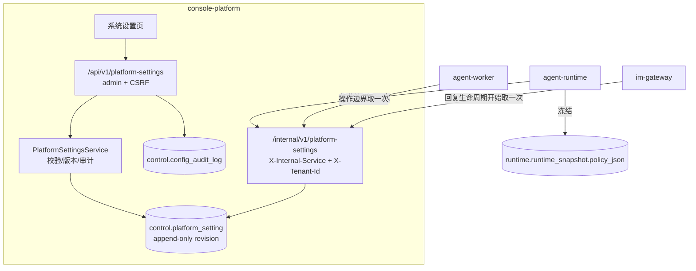
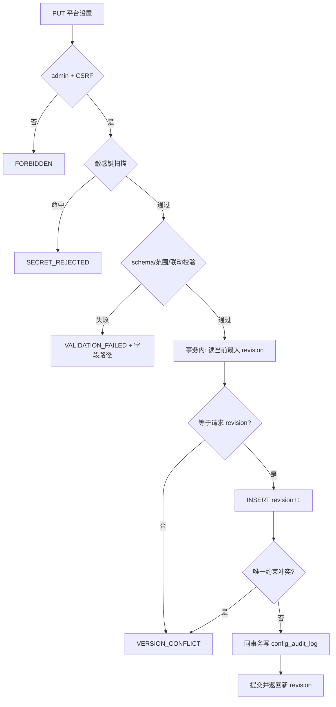

# 平台系统设置 后端模块需求与设计一体化文档

> 本需求 = `context-compaction` 划出的**需求二（Console 系统设置页）** ∪ 2026-10-04 全仓配置盘点（`docs/configuration-inventory.md`）。
> 前端设计见同目录 `platform-settings.frontend.design.md`。

## 目录

- [1. 文档控制](#1-文档控制)
- [2. 需求分析](#2-需求分析)
  - [2.1 需求概述](#21-需求概述-必填)
  - [2.2 痛点与价值](#22-痛点与价值-必填)
  - [2.3 功能方案](#23-功能方案-必填)
  - [2.4 范围与边界](#24-范围与边界-必填)
  - [2.5 验收条件](#25-验收条件-必填)
- [3. 技术设计](#3-技术设计)
  - [3.1 方案选型](#31-方案选型-必填)
  - [3.2 架构设计](#32-架构设计-必填)
  - [3.3 数据设计](#33-数据设计-必填)
  - [3.4 接口设计](#34-接口设计-必填)
  - [3.5 质量实现方案](#35-质量实现方案-必填)
- [4. 部署与运维](#4-部署与运维)
- [5. 风险与依赖](#5-风险与依赖)
- [6. 需求追溯矩阵](#6-需求追溯矩阵)
- [Spec Compliance Matrix](#spec-compliance-matrix)
- [附录：术语表](#附录术语表)

---

## 1. 文档控制

### 1.1 责任人

| 角色 | 姓名 | 职责范围 |
|------|------|---------|
| 产品经理 | fluxion-harness | 需求定义、业务验收 |
| 开发负责人 | fluxion-harness | 技术方案确认 |

### 1.2 修订历史

| 版本 | 日期 | 作者 | 变更描述 |
|------|------|------|---------|
| v0.1 | 2026-10-04 | fluxion-harness | 初始草稿：归一需求二与配置盘点，确定权威源、读取边界、设置 schema 与收敛清单 |
| v0.2 | 2026-10-05 | fluxion-harness | 依 §3.1 ADR-10：设置文档 schema 落到 `muad_contracts`（Console 不依赖 `muad-agent-core`，v0.1 的「复用 `muad_agent_core.context.settings._validate`」不可达），`muad_agent_core.context.settings` 整体迁移；场景编号去重（幂等场景改 `E-17`，新增边界场景 `B-07`） |
| v0.3 | 2026-10-05 | fluxion-harness | 拆解阶段发现 `agent`(4 中余 2) / `memory`(5) / `artifact`(3) 共 9 个叶子没有承接任务，补验收场景 `E-20`（执行默认接入），由 TASK-013 负责 |
| v0.6 | 2026-10-05 | fluxion-harness || v0.7 | 2026-10-05 | fluxion-harness |
| v0.8 | 2026-10-05 | fluxion-harness |
| v0.9 | 2026-10-05 | fluxion-harness |
| v0.10 | 2026-10-05 | fluxion-harness | TASK-010 的 E2E 照出真缺陷：敏感键守卫用**子串**匹配归一化键名，`auth.min_password_length` 含 `password` ⇒ 含 `auth` 分组的**任何**保存（含 ADR-09 的整文档保存）一律 400。补验收场景 **E-22**（业务键边界 + 结构性回归），由 TASK-015 修复 | 补 **ADR-12**：设置源不可读时「明确失败」的边界——**已认证会话的解析不得依赖设置可读**（TASK-009 实测：一条 schema 坏行会让 `resolve_session` 失败并掐断该租户**全部**已认证请求）。设置读取只发生在登录/续期这两个策略生效点 | 记录 TASK-013 报备的两处取舍：① `packages/api-kit` 的 locale 兜底从 `SharedSettings.default_locale` 改为框架常量 `zh-CN`（它是「调用方没传」的兜底，不是业务平台默认）；② 清理入口省略 `--tenant` 时按 `default_tenant_id` 解析（单租户部署口径）。二者写进 §2.4 技术债 | TASK-006 落地后补两条：① 新增 **ADR-11** 记录「投递队列跨租户 × 设置按租户」的取舍（设计原本没规定）；② 新增验收场景 **E-21**——各 acceptance 栈原先靠 env 注入 `DELIVERY_BACKOFF_BASE_SEC`/`TASK_MAX_ATTEMPTS`/`BATCH_MAX_CONCURRENCY` 等键，这些键删掉后注入静默失效（`dfx` 的并发上限断言会直接挂），改由「栈启动时按租户种一行 `control.platform_setting`」承接 | 补齐 `locale` 分组的落点：消费方是 Worker 投递文案 / Gateway 回复渲染 / Runtime `TimeToolSet` 时区，此前无任务承接；并入 E-19 / B-03 / E-20 三条既有场景的断言，环境键由最后一个切换的任务一次性摘除 |
| v0.5 | 2026-10-05 | fluxion-harness | TASK-004 落地后更正取快照指标的归属：`failed` 分支只能由**调用方**（Runtime/Worker/Gateway 的 client）记录（端点被切断时 Console 收不到请求）；Console 侧只记 `ok`/`error` 服务分支并接受可选头 `X-Caller-Service` 供 `caller` 标签 |
| v0.4 | 2026-10-05 | fluxion-harness | 更正审计登记口径：`AUDIT_TYPES` 是**审计来源枚举**不是 `resource_type` 注册表（v0.1 的「登记进两处」是错的）；`resource_type="PLATFORM_SETTING"` 真正要同步的是**前端登记域**（`RESOURCE_TYPES` + `audit.resourceType.*` 词条），由 `tests/frontend/test_audit_gap_contract.py` 机检 |

---

## 2. 需求分析

### 2.1 需求概述 [必填]

**模块名称**：平台系统设置（platform-settings）

**背景**：平台级业务默认散落在四个服务的源码常量与 `.env` 里。上下文压缩的「平台设置源」读取缝（`ContextSettingsCache`）已在 Runtime 留出，但源函数 `_no_platform_overrides()` 硬编码返回 `{}`（`apps/agent-runtime/src/muad_agent_runtime/application/context_settings.py:29-30`），既没有表也没有页面可写；即便有源，`context_settings_cache_ttl_sec`（默认 10s，`packages/common/src/muad_common/settings.py:37`）也意味着「保存后等一会儿才生效」。同时盘点出 **10 组重复/冲突声明**（历史预算 40 两处、工具结果 8 KiB 与 schema 默认两套、会话时长 12h 两处、默认租户两处、产物路径两套默认、`DEFAULT_POLICY` 导入期求值等）。

**核心目标**：建立一份**按租户持久化、带版本、可审计**的平台业务设置，作为「平台默认」的唯一权威源；保存成功后开始的新 Run / 新 Task / 新业务操作立即使用新值，执行中的对象保留已冻结快照；Console 提供系统设置页；同时收敛重复默认源，并把环境类与代码类配置的归属写死。

**交付形态**：Console 后端（表 + service + API + 内部取设置端点）、四服务读取缝改造、已有业务默认接入、收敛清单落地、配置盘点机检同步。

---

### 2.2 痛点与价值 [必填]

| 维度 | 内容 |
|------|------|
| **目标用户** | 平台管理员（Console admin 角色）、平台运维；业务用户间接受影响 |
| **当前问题** | ① 改一个平台业务默认要改代码发版或改 `.env` 重启；② 上下文压缩只能逐 Agent 配 `runtime_config_json`，无平台默认；③ 10s TTL 缓存让「运行期可改」名不副实；④ 同一语义两处声明（改一处另一处漂移）；⑤ 运维分不清某个参数该改哪里 |
| **业务影响** | 调参需要发版窗口；平台级策略无审计、无回滚；重复默认导致「以为改了其实没改」 |
| **预期价值** | 运行期可改且立即生效；改动可追溯到人、可回滚；同类语义只剩一处权威声明 |
| **用户故事** | US-01..US-07（见 PRD §3.2） |

---

### 2.3 功能方案 [必填]

#### 2.3.1 功能清单

| 功能ID | 功能名称 | 功能描述 | 优先级 | 来源 |
|--------|---------|---------|--------|------|
| FEAT-01 | 平台业务设置持久化与版本 | 按租户 append-only 版本表 + 服务端 schema/范围/联动校验收口 | P0 | US-01, US-04, US-07 |
| FEAT-02 | 四服务按操作边界读取设置 | 内部取设置端点 + 各服务在新操作边界取一次快照；新 Run/Task 冻结 | P0 | US-01, US-06 |
| FEAT-03 | 系统设置 API | 读/写/版本历史/回滚 + 乐观并发 + 审计 + 权限与租户隔离 | P0 | US-01, US-02, US-04 |
| FEAT-04 | Console 系统设置页 | 前端交付物，见 `platform-settings.frontend.design.md` | P0 | US-01, US-02, US-03 |
| FEAT-05 | 已有业务默认的迁移与重复源收敛 | 41 个叶子接入统一源；收敛 10 组重复/冲突声明 | P0 | US-03, US-07 |
| FEAT-06 | 环境配置收口 | 去掉重复默认源与裸 `getenv` 第二套默认；`.env.example` 补全为完整运维契约 | P1 | US-05 |
| FEAT-07 | 配置盘点基线与机检同步 | 盘点报告 + 逐项清单 + 无服务机检 | P1 | US-05, US-07 |
| FEAT-08 | 菜单/规范/事实文档同步 | 含前端菜单规则，见前端设计；后端侧为规范与事实文档同步 | P1 | US-01 |

#### 2.3.2 字段约束 [按需]

平台设置是一份**按分组嵌套的 JSON 文档**（存 `jsonb`），schema、默认值、范围与联动校验由**服务端唯一持有**。下表是 v1 全部 **41 个叶子**；「替代」列写明它取缔了哪个散落声明（`—` 表示新引入的平台默认，其值取自原常量）。

**分组 `compaction`（15）** — 形状与 `packages/agent-core/src/muad_agent_core/context/settings.py` 的 `CompactionSettings` 完全一致，Agent 级 `runtime_config.budget.compaction` 仍按既有 `merge_compaction_payload` 覆盖平台默认。

| 键路径 | 类型 | 默认 | 替代 |
|--------|------|------|------|
| `compaction.snip.enabled` | bool | `true` | `SnipSettings.enabled` |
| `compaction.snip.max_groups` | int ≥2 | `50` | `SnipSettings.max_groups` |
| `compaction.snip.keep_head_groups` | int ≥0 | `3` | `SnipSettings.keep_head_groups` |
| `compaction.snip.keep_tail_groups` | int ≥0 | `20` | `SnipSettings.keep_tail_groups` |
| `compaction.tool_result.persist_threshold_bytes` | int >0 | `8192` | `TOOL_RESULT_ARTIFACT_BYTES`（收敛：只留 schema 单一来源） |
| `compaction.tool_result.round_budget_bytes` | int >0 | `200000` | `ToolResultSettings.round_budget_bytes` |
| `compaction.tool_result.preview_head_bytes` | int ≥0 | `2000` | `PREVIEW_HEAD_BYTES`（同上收敛） |
| `compaction.tool_result.preview_tail_bytes` | int ≥0 | `2000` | `PREVIEW_TAIL_BYTES`（同上收敛） |
| `compaction.micro.enabled` | bool | `false` | `MicroSettings.enabled` |
| `compaction.micro.keep_recent_tool_groups` | int ≥0 | `3` | `MicroSettings.keep_recent_tool_groups` |
| `compaction.summary.enabled` | bool | `false` | `SummarySettings.enabled` |
| `compaction.summary.threshold_bytes` | int >0 | `50000` | `SummarySettings.threshold_bytes` |
| `compaction.summary.model_ref` | uuid \| null | `null` | `SummarySettings.model_ref`（必须引用既有 `model_definition`，见 ADR-06） |
| `compaction.memory.budget_ratio` | float 0..1 | `0.2` | `MemorySettings.budget_ratio` |
| `compaction.history_budget_messages` | int ≥1 | `40` | `CompactionSettings.history_budget_messages` **与** `BudgetPolicy.max_messages`（收敛为同一冻结值） |

**分组 `agent`（4）**

| 键路径 | 类型 | 默认 | 替代 |
|--------|------|------|------|
| `agent.max_turns` | int ≥1 | `20` | `AgentPolicy.max_turns` |
| `agent.max_tool_calls` | int ≥0 | `30` | `AgentPolicy.max_tool_calls` |
| `agent.deadline_ms` | int >0 | `120000` | `AgentPolicy.deadline_ms` |
| `agent.max_model_retries` | int ≥0 | `3` | `MAX_MODEL_RETRIES` / `MAX_RETRIES_DEFAULT` / `AgentPolicy.max_model_retries`（三处合一，见 ADR-07） |

**分组 `task`（6）**

| 键路径 | 类型 | 默认 | 替代 |
|--------|------|------|------|
| `task.default_deadline_hours` | int ≥1 | `24` | `task_default_deadline_hours`（由环境项改为业务项） |
| `task.max_attempts` | int ≥1 | `3` | `task_max_attempts` |
| `task.batch_max_concurrency` | int ≥1 | `8` | `batch_max_concurrency`（仍不得超过环境项 `batch_platform_limit`） |
| `task.misfire_grace_sec` | int ≥0 | `60` | `misfire_grace_sec` |
| `task.delivery_max_attempts` | int ≥1 | `5` | `delivery_max_attempts` |
| `task.delivery_backoff_base_sec` | int ≥1 | `5` | `delivery_backoff_base_sec` |

**分组 `memory`（5）**

| 键路径 | 类型 | 默认 | 替代 |
|--------|------|------|------|
| `memory.write_enabled` | bool | `true` | `memory_tools` 未显式配置时的默认（`application/memory_tools.py:104`） |
| `memory.max_injected_memories` | int ≥0 | `10` | `MAX_INJECTED_MEMORIES` |
| `memory.max_injected_bytes` | int ≥0 | `2048` | `MAX_INJECTED_BYTES` |
| `memory.max_recall_bytes` | int >0 | `4096` | `MAX_RECALL_BYTES` |
| `memory.recall_default_limit` | int ≥0 | `10` | `RECALL_DEFAULT_LIMIT`（仍不得超过既有 `RECALL_MAX_LIMIT`） |

**分组 `artifact`（3）**

| 键路径 | 类型 | 默认 | 替代 |
|--------|------|------|------|
| `artifact.retention_days` | int ≥1 | `30` | `artifact_retention_days`（由环境项改为业务项） |
| `artifact.max_archive_files` | int ≥1 | `2000` | `MAX_ARCHIVE_FILES` |
| `artifact.cleanup_batch_size` | int ≥1 | `500` | 清理批次的散落常量 |

**分组 `auth`（4）**

| 键路径 | 类型 | 默认 | 替代 |
|--------|------|------|------|
| `auth.min_password_length` | int ≥8 | `12` | `MIN_PASSWORD_LENGTH` |
| `auth.max_failed_attempts` | int ≥1 | `5` | `MAX_FAILED_ATTEMPTS` |
| `auth.lock_duration_minutes` | int ≥1 | `15` | `LOCK_DURATION` |
| `auth.session_ttl_hours` | int ≥1 | `12` | `SESSION_TTL` **与** Cookie `Max-Age`（收敛为同源；`SLIDE_THRESHOLD` 是派生值，不作独立输入） |

**分组 `locale`（2）**

| 键路径 | 类型 | 默认 | 替代 |
|--------|------|------|------|
| `locale.default_locale` | enum `zh-CN`\|`en-US` | `zh-CN` | `default_locale`（由环境项改为业务项） |
| `locale.default_timezone` | IANA tz 字符串 | `Asia/Shanghai` | `default_timezone`（同上；沿用 `RULE-time-001`） |

**分组 `im`（1）**

| 键路径 | 类型 | 默认 | 替代 |
|--------|------|------|------|
| `im.progress_interval_sec` | float ≥1.0 | `5.0` | `PROGRESS_INTERVAL_SEC` / `im_progress_interval_sec`（`im_progress_updates_per_second` 作为服务资源预算**留在环境**） |

**分组 `mcp`（1）**

| 键路径 | 类型 | 默认 | 替代 |
|--------|------|------|------|
| `mcp.max_tools_per_server` | int ≥1 | `200` | `mcp_max_tools_per_server`（发现/接入规模策略；MCP 连接参数仍留 MCP 页面） |

**跨字段联动校验（沿用并扩展既有 `_validate`）**

| 规则 | 拒绝条件 |
|------|---------|
| 压缩触发阈值 | `snip.max_groups < snip.keep_head_groups + snip.keep_tail_groups + 1` |
| 预览与预算 | `preview_head_bytes + preview_tail_bytes > round_budget_bytes` |
| 摘要 | `summary.enabled = true` 时 `summary.model_ref` 必须指向本租户 enabled 的既有模型 |
| 记忆预算 | `memory.budget_ratio ∈ [0, 1]`；`recall_default_limit ≤ RECALL_MAX_LIMIT` |
| 并发上限 | `task.batch_max_concurrency ≤ batch_platform_limit`（环境项） |
| 未知键 | 任何不在上表的键 → 拒绝（fail-closed，不做静默忽略） |

> 校验实现的单一来源：**整份设置文档的 schema（含 `compaction` 分组）落在 `packages/contracts`**，压缩分组的字段/默认/联动校验由 `muad_agent_core.context.settings` **整体迁移**过来（见 ADR-10），不是复制；前端**不持有**校验规则，只从读取接口拿范围元数据做预检。

---

### 2.4 范围与边界 [必填]

| 类别 | 内容 |
|------|------|
| **范围（In Scope）** | ① `control.platform_setting` 版本表（append-only，按租户）+ 迁移；② 设置文档 schema/默认/范围/联动校验（服务端唯一，含把压缩分组 schema 从 `muad_agent_core.context.settings` **迁移**到 `muad_contracts`，见 ADR-10）；③ Console 读写/版本/回滚 API + 内部取设置端点 + 已认证限额端点；④ 四服务按操作边界取快照（Runtime 冻结进 `policy_json`、Worker 任务与投递边界、Gateway 回复生命周期边界）；⑤ 41 个叶子接入并替换散落常量；⑥ 收敛清单（见 §3.1 ADR-05..ADR-10）；⑦ 盘点报告/清单/机检纳入需求交付；⑧ 环境项与代码项归属写入事实文档 |
| **非范围（Out of Scope）** | ① DSN/端口/身份/租约/心跳/路径/内部 token 进入页面；② Agent/模型/MCP/项目平台已有资源配置复制进系统设置（只提供平台默认，资源覆盖优先）；③ 把 995 个盘点声明点都做成配置（协议状态码、状态枚举、第三方硬上限、UI 原语、算法不变量留在代码）；④ 执行中 Run/Task 的动态策略变更（冻结语义不变）；⑤ 前端构建期 `VITE_*` 运行时化；⑥ 部署侧容量参数（HPA/PDB/镜像钉版本/资源配额/多节点）；⑦ 上下文膨胀看板、非 OpenAI 兼容模型的精确 token 计数；⑧ 为**未认证**访问新开公开配置端点 |
| **前置假设** | ① 四个服务与 Console 共用同一 PostgreSQL；② Console 已有 `require_admin`/`AdminAccount` 与 `AccountTenantId`/`TenantId` 租户门控，内部路由已有 `require_service_identity`；③ 审计原语 `write_config_audit` 与业务同事务；④ `context-compaction` 已交付 `budget.compaction` 口径与冻结链路；⑤ 四个服务都已有指向 Console 的内部 HTTP client（Runtime `ConsoleResolveClient`、Worker `scheduler/client.py`、Gateway `ConsoleClient`） |
| **有意妥协 / 技术债** | ① **整文档保存**（非字段级 PATCH）：并发编辑同一份设置时后提交者按乐观并发失败，不做字段级合并；② 请求内临时构造 `SharedSettings()` 的全仓收口**不在本次**（只改本需求触碰的路径与重复默认源），作为已知债记入 §5.2；③ 前端限额复用（盘点收敛项 4）只做「Skill 导入限额」的已认证只读端点，附件/归档限额仍留在各自服务；④ 盘点清单是快照，靠机检同步，不实时生成；⑤ **清理入口的租户口径**：`cleanup-artifacts` 省略 `--tenant` 时按 `SharedSettings.default_tenant_id` 取该租户的平台设置（单租户部署口径）；多租户共享库场景需逐租户解析，本期不做；⑥ **api-kit 的 locale 兜底**是框架级 `zh-CN`（`install_api_foundation(app, default_locale=None)`）——业务平台默认语言由 Worker 投递 / Gateway 渲染 / Runtime 工具时区三处承担，不由 api-kit 读平台设置 |

---

### 2.5 验收条件 [必填]

#### 2.5.1 业务规则与约束

| ID | 类型 | 描述 | 验证场景 |
|----|------|------|---------|
| RULE-01 | 业务规则 | 保存成功后开始的**新** Run / 新 Task / 新业务操作必须使用新 revision；执行中的对象继续用其冻结快照 | S-01, S-02, E-08 |
| RULE-02 | 业务规则 | 资源级显式配置优先于平台默认；平台默认不得改写既有资源行 | E-07 |
| RULE-03 | 业务规则 | 只有授权管理员可写；读写严格按租户隔离 | S-03, E-04 |
| RULE-04 | 系统约束 | 非法值/超范围/破坏联动/未知键 → 拒绝保存且**不产生新版本** | E-01, B-01 |
| RULE-05 | 系统约束 | 版本只在保存成功时产生，单调递增；回滚产生新版本而非改写历史 | E-02, E-06 |
| RULE-06 | 系统约束 | 设置源不可读时业务操作明确失败，不得静默使用过期默认值 | E-03 |
| RULE-07 | 系统约束 | 业务设置文档、审计、日志与响应**不得**承载密钥/凭据/DSN | E-10 |
| RULE-08 | 系统约束 | 取设置快照的次数与业务操作边界一一对应，不进入热路径 | E-08, B-03 |
| RULE-09 | 系统约束 | 模型执行预算为层级关系：总 deadline → 单次请求预算 → 重试预算 | B-02 |
| RULE-10 | 系统约束 | 同一业务语义只有一处权威声明（收敛清单逐项） | E-09 |

#### 2.5.2 功能验收场景

> 场景 ID 即测试用例来源。测试层级只能取 `unit` / `integration` / `E2E` / `manual`；跨 API、存储、运行时生成、用户可见结果多个边界的场景为 E2E。**关键真实边界**列出不得 mock 的组件。归属均为 `本模块`。

**正常场景**

| 场景ID | 功能ID | 优先级 | 测试层级 | 关键真实边界 | 归属 | 前置条件 | 操作步骤 | 预期结果 |
|--------|--------|--------|---------|-------------|------|---------|---------|---------|
| S-01 | FEAT-01/02/03/04 | P0 | E2E | 真实浏览器 → 真实 Console API → 真实 PostgreSQL → 真实 Runtime HTTP → 真实模型 HTTP 探针 | 本模块 | 租户已有 Agent 与会话；一个 Run 正在执行 | ① 管理员在系统设置页把 `compaction.snip.max_groups` 调小并保存；② 在同一会话再发一条消息产生**新 Run**；③ 观察探针记录的请求体 | 新 Run 的 `policy_json` 含新压缩配置且模型请求体现新阈值；**保存前已开始的那个 Run** 的 `policy_json` 与行为不变 |
| S-02 | FEAT-02/05 | P0 | E2E | 真实 Console API → 真实 PostgreSQL → 真实 Worker 进程（真实 lease/claim） | 本模块 | 租户已有 Schedule/Task | 管理员保存 `task.max_attempts` 新值；再创建一个新 Task | 新 Task 冻结/使用新默认；**既有 Task 行**的字段不被改写 |
| S-03 | FEAT-03/08 | P0 | E2E | 真实浏览器（真实登录会话与角色）→ 真实 Console API → 真实 PostgreSQL | 本模块 | 存在 ADMIN 与 BUILDER 两种账号、两个租户 | 分别以 ADMIN / BUILDER / 另一租户 ADMIN 身份访问系统设置页与 API | ADMIN 可读写本租户；BUILDER **无入口且读写均被拒**；另一租户看不到也改不了本租户设置；被拒请求留审计 |

**异常场景**

| 场景ID | 功能ID | 测试层级 | 关键真实边界 | 归属 | 触发条件 | 系统行为 | 用户感知 |
|--------|--------|---------|-------------|------|---------|---------|---------|
| E-01 | FEAT-01 | integration | 真实 PostgreSQL + 真实 settings service | 本模块 | 提交 `snip.max_groups=3, keep_head=3, keep_tail=20`（破坏联动）、越界值、未知键 | 拒绝并返回可定位到字段的错误码；**不插入新版本行** | 页面显示具体字段错误，当前设置不变 |
| E-02 | FEAT-03 | integration | 真实 PostgreSQL（真实唯一约束） | 本模块 | 两个并发保存携带同一 `revision` | 一个成功、另一个返回版本冲突错误码；不静默覆盖 | 后提交者被提示重新加载 |
| E-03 | FEAT-02 | integration | 真实 Runtime 进程 + 被切断的 Console 内部端点 | 本模块 | 设置源不可读时创建 Run | Run 创建明确失败（统一错误码 + `platform_settings_fetch` 失败指标）；**不**用过期默认值继续 | 用户收到明确失败而非"用了旧配置" |
| E-04 | FEAT-03 | integration | 真实 Console API（真实服务身份校验） | 本模块 | 内部取设置端点无/错 `X-Internal-Service`，或带非本租户 `X-Tenant-Id` | 拒绝（403/401），不返回任何设置内容 | 内部调用方收到明确拒绝 |
| E-05 | FEAT-03 | integration | 真实 PostgreSQL（同一事务） | 本模块 | 保存成功 | `control.config_audit_log` 出现同事务记录：actor、revision、before/after（脱敏后） | 审计页可查到本次变更 |
| E-06 | FEAT-03 | integration | 真实 PostgreSQL | 本模块 | 管理员回滚到历史版本 | 产生**新** revision（内容等于目标版本）；历史行全部保留 | 页面版本号递增，历史可继续回看 |
| E-07 | FEAT-02/05 | integration | 真实 PostgreSQL + 真实 Agent 定义行 | 本模块 | Agent 的 `runtime_config_json.budget.compaction` 已显式设置，管理员改平台默认为不同值 | 该 Agent 仍用显式覆盖值；读取接口如实返回"已被 N 个资源覆盖" | 页面显示覆盖关系，不误导 |
| E-08 | FEAT-02 | integration | 真实 PostgreSQL + **独立进程**的 Console/Runtime（无 TTL 缓存、无重启） | 本模块 | Console 保存成功后，Runtime 进程创建新 Run | 新 Run 读到新 revision（保存与读取之间没有任何缓存等待窗口） | 无需重启任何服务 |
| E-09 | FEAT-05/06/07 | integration | 真实源码树 + 真实 `.env.example` + 真实 `SharedSettings` 字段集 | 本模块 | 运行配置一致性检查 | 重复默认源已消除（产物路径、默认租户、工具结果三常量、会话时长、历史预算）；改由业务设置接管的键（`default_locale`/`default_timezone`/`artifact_retention_days`/`im_progress_interval_sec`/`mcp_max_tools_per_server`/任务与投递六项）已从启动 settings、`.env.example` 与部署面（`deploy/k8s/base/configmap.yaml`）移除；`.env.example` 键集覆盖余下全部环境类字段；盘点清单与源码声明一致 | 运维可从示例文件得到完整契约，且不会误以为已移除的键还能生效 |
| E-10 | FEAT-01/03 | integration | 真实 PostgreSQL + 真实 HTTP 响应体 | 本模块 | 尝试提交含 `password`/`secret`/`dsn`/`api_key` 类键的设置；并检查审计行与日志 | 拒绝写入；审计与响应体、日志中均不出现敏感值 | 管理员得到明确拒绝，无泄漏 |
| E-15 | FEAT-05 | integration | 真实 PostgreSQL + 真实登录会话与 CSRF | 本模块 | `auth.session_ttl_hours` 改为短值、`auth.min_password_length` 改为更长 | 新签发会话按新会话时长（Cookie `Max-Age` 与 `SESSION_TTL` **同源**）；**已签发会话的到期时间不变**；新密码按新长度校验，存量密码不回改 | 改认证策略不必重启，也不会把已有会话立刻踢掉 |
| E-16 | FEAT-05/07 | integration | 真实源码树 + 真实 CSV + 真实机检（无服务） | 本模块 | 收敛与迁移完成后运行盘点机检 | `docs/configuration-inventory.csv` 与当前源码声明逐行一致（路径/行号/符号/默认值/分类）；被删除或迁移的常量不再出现；分类期望与迁移结论一致 | 盘点清单不因本次迁移变成过期文档 |
| E-17 | FEAT-03 | integration | 真实 PostgreSQL（真实幂等表与 partial unique）+ 真实 HTTP | 本模块 | 同一 `Idempotency-Key` 重复提交保存（同指纹）；再用同键不同指纹提交一次 | 同指纹重放**首次**结果（revision 不变、不产生第二个版本）；不同指纹返回 `IDEMPOTENCY_MISMATCH` | 超时重试不会让管理员看到"版本冲突"，也不会写出两版 |
| E-18 | FEAT-01..08 | integration | 真实任务文档与 manifest（收口清单交叉核对） | 本模块 | 运行收口清单 | 覆盖表 ↔ 契约表 ↔ 证据表三方闭环；manifest 与覆盖表同 ID/owner/命令且 level/boundary/cwd 一致；`-k` 令牌在真实用例名里命中；**不豁免收口任务自身** | 收口任务自己的契约行也必须终态 |
| E-19 | FEAT-02/05 | integration | 真实 PostgreSQL + 真实 Worker 应用层（真实 lease/claim 语义） | 本模块 | 保存 `task.max_attempts` / `task.default_deadline_hours` 新值后创建新 Task | 新 Task 用新默认；**既有 Task 行的 deadline/attempt 字段不被改写**；设置源不可读时任务创建明确失败；投递文案按新 `locale.default_locale` 渲染 | 改平台默认不偷偷重写存量行 |
| E-20 | FEAT-02/05 | integration | 真实 PostgreSQL + 真实 Runtime 装配（`context_builder`/`memory_tools`/`archive_tools`）+ 真实 Console 清理入口 | 本模块 | 改 `agent.max_turns`、`memory.max_injected_memories`、`artifact.max_archive_files`、`artifact.retention_days` 后新建 Run 与执行一次清理；以及 `locale.default_timezone` 后新建 Run | 新 Run 的轮次/记忆注入上限、归档文件上限用新值；下一次清理按新保留期挑选；**既有 Run/Task 行与已落库记忆不被改写** | 平台默认对新操作立刻生效，不重写存量数据 |
| E-21 | FEAT-05 | integration | 真实 acceptance 栈（真实 Console API + 真实 PostgreSQL + 真实 Worker 进程） | 本模块 | 栈启动时按租户种一行 `control.platform_setting`（非默认的退避基数 / 尝试次数 / 批次并发），并删除各栈对这些键的 env 注入 | 栈内用例按**种下的设置**观察到对应行为（投递退避窗口、并发上限、尝试次数）；env 注入路径不再存在；`dfx` 故障矩阵的 `TASK_MAX_ATTEMPTS=1` 臂改由设置表达 | 验收栈与生产同构：默认值来自平台设置而非环境变量 |
| E-22 | FEAT-01/03 | integration | 真实 Console API（真实 HTTP `PUT`）+ 真实 PostgreSQL | 本模块 | ① 经 `PUT /api/v1/platform-settings` 保存**整份默认文档**（含 `auth` 分组）；② 再提交含真敏感形状键的文档（`auth.password`/`token`/`dsn` 一类）；③ 再提交未知键 | ① 成功并产生新版本——**平台自己定义的合法设置项不得被敏感键扫描误伤**；② 被拒 `PLATFORM_SETTINGS_SECRET_REJECTED` 且不回显键名；③ 被拒。**结构性回归**：遍历 schema 全部叶子路径，断言无一被守卫判定为敏感 | 管理员改得了自己的认证策略，同时真敏感键仍进不来 |

**边界场景**

| 场景ID | 测试层级 | 关键真实边界 | 归属 | 字段/条件 | 边界值 | 预期行为 |
|--------|---------|-------------|------|----------|--------|---------|
| B-01 | unit | schema 校验函数（含复用压缩 `_validate`） | 本模块 | 各叶子范围与跨字段联动 | 下界-1 / 下界 / 上界 / 上界+1 / 未知键 | 界内接受、界外拒绝；错误定位到字段路径 |
| B-02 | unit | 预算层级解析函数 | 本模块 | 总 deadline 与单次/重试预算 | 单次预算 > 剩余总预算；重试预算之和 > 总预算 | 单次预算被夹到剩余总预算；重试在总预算耗尽前停止 |
| B-03 | unit | Gateway 回复生命周期取值与节拍 | 本模块 | 一条回复内多次 tick；并断言回复渲染的 locale 取自平台设置 | `im.progress_interval_sec = 1.0`（下界）与保存并发 | 回复期间节拍固定（不中途跳变）；下一条消息用新值 |
| B-04 | integration | 真实 PostgreSQL（表内无该租户行） | 本模块 | 首次读取 | 租户无任何版本行 | 返回 schema 默认值（`revision=0` 语义），不报错；首次保存创建 revision 1 |
| B-07 | integration | 真实 PostgreSQL（`alembic upgrade 0001→0017` / `downgrade`） | 本模块 | 迁移与 schema 对齐 | 升到 `0017` 后建表 | `control.platform_setting` 的列与索引与 model 定义一致；partial unique `(tenant_id, revision) WHERE is_deleted=false` 真实生效（重复 `(tenant_id, revision)` 插入被拒）；`downgrade` 可干净回滚 |

#### 2.5.3 非功能指标 [按需]

**性能指标**

| 指标ID | 指标名称 | 目标值 | 测量方法 |
|--------|---------|-------|---------|
| NFR-PERF-01 | 取设置快照次数 | 与业务操作边界一一对应（每个新 Run/Task 一次），不进入每轮模型调用/每次轮询 | 计数指标 + 集成断言 |
| NFR-PERF-02 | 内部取设置端点响应 | 单次索引查询（`tenant_id + max(revision)`），无全表扫描 | 查询计划断言 |

**可靠性指标**

| 指标ID | 指标名称 | 目标值 |
|--------|---------|-------|
| NFR-REL-01 | 设置源不可读 | 业务操作明确失败并计数，绝不静默回退到过期默认值 |
| NFR-REL-02 | 保存成功后的一致性 | 之后的**新**业务操作必定读到新 revision（无 TTL、无重启、无跨 Pod 广播） |

**安全性要求**

| 指标ID | 安全域 | 验收标准 |
|--------|--------|---------|
| NFR-SEC-01 | 认证鉴权 | 写操作仅 ADMIN；读严格按登录账号租户；未授权返回统一错误码并留审计 |
| NFR-SEC-02 | 数据安全 | 设置文档/审计/日志/响应不含密钥、凭据、DSN、内部 token |
| NFR-SEC-03 | 失败关闭 | 未知键、未知分组、越界值一律拒绝，不静默忽略 |

---

## 3. 技术设计

### 3.1 方案选型 [必填]

#### 备选方案对比 [多方案时必填]

**在哪里放权威设置、四服务怎么读**（性能预期权重相同：都在业务操作边界，不在热路径）

| 方案 | 复杂度 | 生效延迟 | 失败模式 | 结论 |
|------|--------|---------|---------|------|
| A. 各服务**直读** Console 的 `control.platform_setting` 表 | 低（无新端点） | 无延迟 | 首次让 Runtime/Worker/Gateway 读 `control` schema，形成**新的跨服务 DB 耦合**；校验/范围要复制或信任 | ❌ 被否：现有边界是 Runtime/Worker/Gateway 经内部 HTTP 取定义（`ConsoleResolveClient`/`ConsoleClient`），直读表破坏该边界 |
| B. **Console 内部 HTTP 端点**，各服务在操作边界取一次快照 | 中（一个端点 + 四个调用点） | 无延迟（无缓存） | Console 不可读 → 业务操作明确失败（与既有 `resolve-definition` 同一失败面，非新增类别） | ✅ **选中**：与既有架构同构，读入口唯一，可独立观测 |
| C. Redis Pub/Sub + 长 TTL 本地缓存 | 高 | 有延迟 | 离线/漏消息/重连节点继续用旧值，"立即生效"无法宣称 | ❌ 被否：违反 RULE-01/NFR-REL-02 |
| D. 每服务挂载配置文件，改动靠 rollout | 中 | 需重启 | 不满足"运行期可改" | ❌ 被否 |

#### 关键决策记录

**ADR-01 · 权威源 = Console 持有的 PG 版本表；读取 = 内部 HTTP 快照（方案 B）**
理由：PG 是唯一持久事实，Console 是唯一写入口；四服务已有的内部 HTTP 通道与服务身份门控（`X-Internal-Service` + `require_service_identity`）可原样复用，不新增耦合面。

**ADR-02 · 表形态 = append-only 版本行（每次保存插入新行，当前版本 = 该租户最大 `revision`）**
被否方案：① 单行原地 update —— 无历史、无法回滚、无法回答"本次实际值用的哪版"；② 当前行表 + 历史表 —— 两张表、写放大、当前版本要 join。
append-only 的额外收益：乐观并发**不需要行锁**——`INSERT (tenant_id, revision=expected+1)` 由 partial unique `(tenant_id, revision) WHERE is_deleted=false` 兜底，落败者拿到唯一冲突即返回版本冲突（与 `RULE-api-002` 的「partial unique 兜底」口径一致）。

**ADR-03 · 删除 `ContextSettingsCache` 的 TTL 语义**（盘点收敛项 9 的落地）
现状：`context_settings.py:70-78` 的进程级单例 + `context_settings_cache_ttl_sec`（10s）正是"保存后等一会儿才生效"。新设计**不保留任何进程内设置缓存**：快照在业务操作边界取一次、随调用栈显式传递（Runtime 侧进 `resolve_compaction_settings(platform_overrides=...)` 后立即冻结进 `policy_json`）。`context_settings_cache_ttl_sec` 从 `SharedSettings` 删除。
被否方案：保留缓存但把 TTL 设小 —— 仍是"有延迟"，且 TTL 越小越退化成每请求一跳。

**ADR-04 · 设置读取的边界=「有实际工作开始」，不是「轮询一次」**
Runtime：Run 创建事务内解析一次；Worker：任务开始执行时一次、投递记录开始尝试时一次；Gateway：**每条入站消息的回复生命周期开始时一次**。
否掉盘点草稿里"IM 节拍在每次 tick 单独读版本"的建议：那会把 Console 放进 5s 级热路径，且会让**同一条回复的节拍中途跳变**（用户体验更差）。回复期间节拍固定的收益大于"tick 级即时"，下一条消息即生效，仍满足 RULE-01。
**渠道中立不受影响**（`RULE-im-002`）：读设置发生在 Gateway 的 `application/` 层与 Runtime/Worker 的核心域，用的键名是渠道中立的 `im.progress_interval_sec`；`channels/` 与适配器**一行不改**，核心域不新增任何渠道专有字样。机检沿用 `tests/architecture/test_channel_neutrality.py` 的三条断言。

**ADR-05 · 收敛：工具结果默认只留 schema 单一来源**
`TOOL_RESULT_ARTIFACT_BYTES` / `PREVIEW_HEAD_BYTES` / `PREVIEW_TAIL_BYTES`（`application/attachments/tool_results.py:23,27,28`）是 `ToolResultSettings` 的调用别名。删除三个模块常量，调用点改为读**冻结后的 settings**（`context-compaction` 已把三者的取数改为 `tool_result_settings(request)`），非请求上下文（如 `ArchiveToolSet` 的默认值）改为显式传入，不设第二套默认。

**ADR-06 · 收敛：摘要模型只引用既有 `model_definition`**
`compaction.summary.model_ref` 保存的是既有模型定义的主键；校验时要求它在本租户存在且 enabled。**不引入平台默认模型**（`RULE-model-001`：不存在平台默认模型回退）。

**ADR-07 · 收敛：模型执行预算层级**
现状是四套互不相关的超时/重试常量：`AgentPolicy.deadline_ms=120000`、`ModelGateway.DEADLINE_DEFAULT_MS=60000`、`executor.MODEL_TIMEOUT_SEC=120`、Provider I/O 60s，重试 3 次散落三处，退避 0.1/0.05 两处。
新口径是**层级**，不是"合并成一个数"：
```
总预算 agent.deadline_ms
  └─ 单次模型请求预算 = min(上限, 剩余总预算)          # 由 deadline 派生，不再是独立默认
       └─ 重试预算 = agent.max_model_retries × 退避基数 ≤ 剩余总预算   # 总预算耗尽前停止重试
```
`MAX_MODEL_RETRIES` / `MAX_RETRIES_DEFAULT` / `AgentPolicy.max_model_retries` 三处合一为 `agent.max_model_retries`；`RETRY_BASE_SEC` 与 `DEFAULT_RETRY_BASE_SEC` 合一为一处常量（退避基数是算法参数，不开放为设置）。

**ADR-08 · 收敛：产物路径与默认租户各留一处**
`SharedSettings.artifact_root`（`./.data/artifacts`）与 bootstrap 里的 `/mnt/muad-artifacts`、`skill_cache_root` 与 `/var/cache/muad/skills` 是两套默认：删除裸 `getenv` 那套，全部经启动 settings。CLI 的 `DEFAULT_TENANT='default'` 改为读 `SharedSettings.default_tenant_id`。

**ADR-09 · 设置文档整份保存（不做字段级 PATCH）**
被否方案：字段级 PATCH + 逐字段版本 —— 版本语义复杂、并发合并语义要定义、页面实现翻倍。整份保存 + 乐观并发是**明确失败**而非静默合并，语义可解释。

**ADR-10 · 设置文档 schema 落在 `packages/contracts`（v0.2 修订）**
v0.1 写的「复用 `muad_agent_core.context.settings._validate`，不复制」在依赖图上**不可达**：`apps/console-platform/backend/pyproject.toml` 依赖 `muad-api / muad-common / muad-contracts / muad-artifact-store / muad-logging / muad-skill-sdk / jsonschema`，**没有** `muad-agent-core`；而 Console 是唯一的写入口，必须能校验整份文档。
结论：新增 `packages/contracts/src/muad_contracts/platform_settings.py`，承载整份设置文档（9 个分组、41 个叶子）的类型、默认、解析与联动校验；`packages/agent-core/src/muad_agent_core/context/settings.py` 的压缩分组 schema **整体迁移**过去，原文件删除，**11 处导入改指向新模块**（`apps/agent-runtime` 6 处 + `tests` 5 处），**不留 re-export 薄壳**（过渡适配层是规范禁止的，见 CLAUDE.md「最优设计而非兼容垫片」）。
`muad_contracts` 是 Console 与三个执行服务共同依赖的包（agent-core 也依赖它），把「平台设置文档」定义在这里，等于把它确立为**跨服务契约**——它本来就是。被否方案：① Console 依赖 `muad-agent-core`（把 langgraph 等重依赖拖进控制面镜像）；② 在 contracts 里复制一份压缩校验（两套默认源漂移，正是本需求要消灭的问题）；③ 保留 `muad_agent_core.context.settings` 作为转发薄壳（过渡适配层）。

#### 技术栈

**ADR-12 · 「设置不可读即明确失败」的边界（TASK-009 落地后补记）**
RULE-06 要求设置源不可读时业务操作明确失败、不静默用旧值。但这条**不能推广到已认证会话的解析**：会话解析发生在每个请求上，若它也读设置，一条 schema 不认识的 `platform_setting` 行会让该租户的**全部**已认证请求失败——把「一次保存写坏」放大成「整个租户锁死」。
因此边界是：**设置读取只发生在「策略生效点」**——登录（按当前值签发）与续期（按当前值续到 `now + ttl`）；**会话解析用本会话签发时冻结的 TTL**（`expires_at - issued_at`）判滑动阈值，不读设置。这样既满足「之后签发/续期的会话按新值」，又不动已签发会话，还让普通请求零额外设置读取（同时守 NFR-PERF-01）。E-06 的「回滚/保存被拒时不得污染既有能力」由此得到保证。

**ADR-11 · 投递队列的跨租户取件（TASK-006 落地后补记）**
投递队列的取件谓词原本不带租户，而平台设置**按租户**——若逐个租户取快照再判到期，某个租户停在退避窗口就会阻塞整条队列。取舍：取件时用**设置无关**的谓词取「有界租户前缀」（`MAX_TENANTS_PER_TICK=8`），再逐个租户取快照判到期。代价是这些租户在退避等待期内每拍仍各取一次快照（有界，空闲时零调用）。`MAX_TENANTS_PER_TICK` 是**有界并发参数**，属 `environment`/`code` 类，不进平台设置。

Python 3.12 + FastAPI + SQLAlchemy 2（async）+ Alembic；`pydantic` 承载设置文档 schema；前端 React 18 + TypeScript + Semi Design（见前端设计）。

---

### 3.2 架构设计 [必填]

#### 分层与数据流



**读取边界表**

| 服务 | 边界（何时取） | 取什么 | 用在哪 |
|------|---------------|--------|--------|
| Console | 保存事务内 | 权威版本 | 校验、写入新 revision、审计 |
| agent-runtime | Run 创建事务内（`_create_run`） | 快照 | `compaction` 经 `resolve_compaction_settings(platform_overrides=…)` → 冻结进 `policy_json`；`agent.*`、`memory.*`、`artifact.*` 供本次装配 |
| agent-worker | ① 任务开始执行时；② 投递记录开始尝试时 | 快照 | `task.*`（deadline/attempts/并发）、`task.delivery_*` |
| im-gateway | 每条入站消息的回复生命周期开始时 | 快照 | `im.progress_interval_sec`（回复期间固定，见 ADR-04） |

**不读设置的地方（明确禁止）**：每轮模型调用、每次工具执行、每次轮询 tick、每次 SSE 事件（NFR-PERF-01）。

#### 外部依赖清单 [按需]

| 依赖 | 用途 | 失败时 |
|------|------|--------|
| PostgreSQL `control.platform_setting` | 权威设置与版本 | 读写失败即明确失败（不静默用默认） |
| 内部 HTTP（Console `/internal/v1/platform-settings`） | 四服务取快照 | 业务操作明确失败 + 计数指标（RULE-06） |
| `control.config_audit_log` | 变更审计 | 与保存同事务，失败则保存失败 |

---

### 3.3 数据设计 [必填]

**新增表: `control.platform_setting`**（迁移 `0017_platform_setting`，`down_revision="0016"`）

| 字段名 | 类型 | 可空 | 默认值 | 索引 | 说明 |
|--------|------|------|--------|------|------|
| id | uuid | N | gen | PK | 主键 |
| tenant_id | varchar(64) | N | — | 联合唯一 | 与既有 `control.*` 表同型 |
| revision | bigint | N | — | 联合唯一 | 按租户单调递增，从 1 开始 |
| settings_json | jsonb | N | — | — | 整份设置文档（§2.3.2 的 41 个叶子） |
| actor_user_id | uuid | Y | null | — | 保存者（`console_account.id` 逻辑引用） |
| is_deleted | boolean | N | `false` | — | 统一列口径；版本行不可变，恒 `false` |
| create_time | timestamptz | N | `now()` | — | 统一列口径 |
| update_time | timestamptz | N | `now()` | — | 统一列口径（版本行不可变，等于 `create_time`） |

**索引设计**

| 索引名 | 类型 | 字段 | 使用场景 |
|--------|------|------|---------|
| `uq_platform_setting_tenant_revision` | **partial unique** `WHERE is_deleted = false` | `(tenant_id, revision)` | 乐观并发兜底（ADR-02）+ 当前版本查询走同一索引 |
| `ix_platform_setting_tenant_revision_desc` | btree | `(tenant_id, revision DESC)` | 读当前版本 / 版本历史分页 |

**关键查询**

```sql
-- 当前版本（唯一热路径；走 uq/ix 索引，不做全表扫描）
SELECT revision, settings_json FROM control.platform_setting
WHERE tenant_id = :t AND is_deleted = false
ORDER BY revision DESC LIMIT 1;
```

**ER 关系**：本表独立，不建物理 FK（`actor_user_id` 为跨表逻辑引用，遵循 `RULE-data-001` 的跨 Owner 逻辑引用口径）。

**容量预估**

| 维度 | 预估值 |
|------|--------|
| 初始数据量 | 0（未保存的租户无行，读取回落 schema 默认） |
| 每行大小 | 设置文档约 2 KB JSON |
| 3 年预估 | 按每租户每月 20 次保存计，单租户约 720 行/3 年 ≈ 1.5 MB —— 无需归档策略 |

**配置数据落列的口径**（`RULE-data-001`：关键查询字段不得只藏在 JSON）：本表**唯一的查询键是 `tenant_id + revision`**，二者都是独立列；设置内容本身不参与查询（只被整份读出），放 `jsonb` 是正确选择。

---

### 3.4 接口设计 [必填]

#### 形态 A：HTTP API

#### 接口清单

| 接口ID | 名称 | 方法 | 路径 | 门控 | 详细 |
|--------|------|------|------|------|------|
| API-01 | 读取平台设置 | GET | `/api/v1/platform-settings` | admin | [↓](#api-01-读取平台设置) |
| API-02 | 保存平台设置 | PUT | `/api/v1/platform-settings` | admin + CSRF | [↓](#api-02-保存平台设置) |
| API-03 | 版本历史 | GET | `/api/v1/platform-settings/revisions` | admin | [↓](#api-03-版本历史) |
| API-04 | 回滚到指定版本 | POST | `/api/v1/platform-settings/revisions/{revision}/restore` | admin + CSRF | [↓](#api-04-回滚到指定版本) |
| API-05 | 已认证平台限额 | GET | `/api/v1/platform-limits` | authenticated | [↓](#api-05-已认证平台限额) |
| API-06 | 内部取设置快照 | GET | `/internal/v1/platform-settings` | `require_service_identity` + `X-Tenant-Id` | [↓](#api-06-内部取设置快照) |

> 注册位置：API-01..05 进 `api/router.py` 的 authenticated / admin 组；API-06 进 internal 组。全部遵循统一封套与 `config/api-messages.yaml` 错误码（`RULE-api-001`）。列表端点（API-03）返回 `{items,page,page_size,total}`。

---

#### API-01: 读取平台设置

**请求**

| 参数 | 类型 | 必填 | 说明 |
|------|------|------|------|
| （无参数） | — | — | 租户取自登录账号（`AccountTenantId`），不接受请求头租户 |

> 门控为 **admin**：非 ADMIN 既看不到菜单入口，也读不到设置内容（与前端 `RequireRole role="ADMIN"` 一致）。只读角色查看设置**不在本次范围**——设置是面向管理员的运维面，不向普通使用者暴露平台内部参数。

**响应**

| 参数 | 类型 | 说明 |
|------|------|------|
| data.revision | int | 当前版本；无记录时为 `0`（表示"全部为 schema 默认"） |
| data.updated_at | string \| null | 当前版本的保存时间 |
| data.updated_by | string \| null | 保存者显示名（**不返回**内部 id 以外的凭据信息） |
| data.groups[] | array | 分组 → 项 → `{key, label_key, value, default, type, min, max, enum, applies_to, overridden_by_resources}` |
| data.readonly_notes[] | array | 非本页管理的项及其归属说明（`.env` + 重启 / 资源页面 / 代码） |

`applies_to` 取值：`new_run` / `new_task` / `next_operation` / `restart_required` / `code`。
`overridden_by_resources`：被多少资源显式覆盖（FEAT-04 的「平台默认 / 资源覆盖」），由各分组对应的资源表按需统计（压缩 → Agent 的 `runtime_config_json`）。

**错误码**

| 错误码 | 信息 | 场景 | HTTP状态码 |
|--------|------|------|----------|
| `FORBIDDEN` | 无权限 | 未登录 / 会话失效 | 403 / 401 |

---

#### API-02: 保存平台设置

**请求**

| 参数 | 类型 | 必填 | 说明 |
|------|------|------|------|
| Header `Idempotency-Key` | string | N | **可重试提交**：保存超时后重试不该让管理员看到"版本冲突"。同键同指纹重放首次结果（revision 不变），同键不同指纹返回 `IDEMPOTENCY_MISMATCH` |
| revision | int | Y | 客户端读到的版本（乐观并发）；`0` 表示"尚无版本" |
| settings | object | Y | 整份设置文档（§2.3.2 的 41 个叶子，未提供分组按 schema 默认） |

**请求示例**

```json
{
  "revision": 7,
  "settings": {
    "compaction": {"snip": {"max_groups": 30}},
    "task": {"max_attempts": 5}
  }
}
```

**响应**

| 参数 | 类型 | 说明 |
|------|------|------|
| data.revision | int | 新版本号（= 旧版本 + 1） |
| data.settings | object | 归一化后的完整设置文档（含被补全的默认值） |

**错误码**

| 错误码 | 信息 | 场景 | HTTP状态码 |
|--------|------|------|----------|
| `VALIDATION_FAILED` | 参数错误 | 类型/范围/联动/未知键失败，`details[].path` 指出字段 | 400 |
| `PLATFORM_SETTINGS_VERSION_CONFLICT` | 版本冲突 | `revision` 与当前版本不一致 | 409 |
| `PLATFORM_SETTINGS_SECRET_REJECTED` | 不允许的配置项 | 提交敏感键 | 400 |
| `MODEL_NOT_FOUND` | 模型不存在 | `summary.model_ref` 指向不存在/未启用模型 | 400 |
| `IDEMPOTENCY_MISMATCH` | 幂等键冲突 | 同 `Idempotency-Key` 但请求指纹不同 | 409 |

> **幂等口径**（`RULE-api-002`）：保存与回滚都是「可重试提交」，均按既有口径实现——DB 幂等表 partial unique `(tenant_id, idempotency_key, endpoint)` 记录首次提交，请求指纹为规范化 JSON（`sort_keys` + 紧凑分隔符）的 SHA256，**含 `endpoint` 与 `tenant_id` 两个判别键**；并发插入由 partial unique 兜底，落败者读取首次提交结果。参考实现：`channel_service.py:153-159`、`audit_export_service.py:386-392`。不带该 Header 时行为不变（每次提交产生新版本）。

**处理逻辑**



---

#### API-03: 版本历史

**请求**

| 参数 | 类型 | 必填 | 说明 |
|------|------|------|------|
| page | int | N | ≥1，默认 1 |
| page_size | int | N | 1..100，默认 20 |

**响应**：`data = {items:[{revision, created_at, actor_display, changed_keys[]}], page, page_size, total}`。
`changed_keys` 由相邻版本 diff 得出，用于"本次改了什么"。

**错误码**：`FORBIDDEN`（非 admin）。

---

#### API-04: 回滚到指定版本

**请求**：路径参数 `revision`（目标版本，必须存在）；可选 Header `Idempotency-Key`（口径同 API-02——回滚也是可重试提交，重复提交不得产生第二个版本）。

**响应**：`data = {revision: 新版本号, restored_from: 目标版本}`。

**错误码**

| 错误码 | 信息 | 场景 | HTTP状态码 |
|--------|------|------|----------|
| `PLATFORM_SETTINGS_REVISION_NOT_FOUND` | 版本不存在 | 目标版本查不到 | 404 |
| `PLATFORM_SETTINGS_VERSION_CONFLICT` | 版本冲突 | 与并发保存竞争 | 409 |
| `IDEMPOTENCY_MISMATCH` | 幂等键冲突 | 同 `Idempotency-Key` 但请求指纹不同 | 409 |

**处理逻辑**：读目标版本内容 → 按**当前 schema**校验（历史内容可能早于新 schema，校验失败即拒绝回滚并说明原因）→ 插入新 revision（内容为目标版本）→ 审计 `action="RESTORE"`。**不删除、不改写任何历史行**。

---

#### API-05: 已认证平台限额

**请求**：无参数（租户取自登录账号）。

**响应**：`data = {skill_import: {zip_bytes_limit, unpacked_bytes_limit, entry_limit}, attachments: {max_bytes, max_per_message}}`。

**说明**：为盘点收敛项 4 提供**服务端单一来源**，供前端复用（替代前端 `SKILL_ZIP_LIMIT_BYTES` 之类的副本）。仅返回非敏感限额；不含密钥、路径与内部地址。未认证不可访问（不新开公开端点）。

---

#### API-06: 内部取设置快照

**请求**

| 参数 | 类型 | 必填 | 说明 |
|------|------|------|------|
| Header `X-Internal-Service` | string | Y | 内部服务 token（`require_service_identity`） |
| Header `X-Tenant-Id` | string | Y | 调用方租户（内部口用 `HeaderTenantId`） |
| Header `X-Caller-Service` | string | N | 调用方标识（`runtime`/`worker`/`gateway`），缺省 `runtime`；只用于 `platform_settings_fetch_total` 的 `caller` 标签 |

**响应**

```json
{"code": 0, "msg": "success", "data": {"revision": 7, "settings": { "...": "..." }}}
```

**语义**：返回该租户**当前**版本（无 TTL、无缓存）；租户无记录时返回 `revision: 0` + schema 默认。**失败即失败**——不返回"最后一次已知值"（RULE-06）。

**错误码**：`FORBIDDEN`（服务身份不合法）。

---

### 3.5 质量实现方案 [必填]

#### 性能设计 [按需]

- **热点路径**：`_create_run`（每个新 Run 一次内部 GET）。查询是 `(tenant_id, revision DESC) LIMIT 1` 的单索引点查，无全表扫描（NFR-PERF-02）。
- **反模式防线**：明确禁止在每轮模型调用、每次工具执行、每次轮询 tick 上取设置（NFR-PERF-01）；用计数指标断言"每个 Run 恰好一次"。
- **放弃的更慢方案**：Redis 缓存 + 失效通知（ADR-03 被否）——省一次 SQL，却引入"漏消息即用旧值"的正确性缺陷，与需求目标直接冲突。

#### 可靠性设计 [按需]

- **保存**：校验先于写入；写入与审计**同一事务**（失败一起回滚，不留"改了没记"）。
- **并发**：partial unique 兜底乐观并发，不引入行锁；冲突是**明确失败**而非静默覆盖。
- **读取失败**：内部端点不可用 → 业务操作明确失败 + 计数指标（`platform_settings_fetch_total{result="failed"}`），绝不静默回退（RULE-06）。
- **回滚**：只增不改，历史可追溯；历史内容按当前 schema 校验，避免把旧口径写回。

#### 安全性设计 [按需]

- 写路径：`require_admin` + CSRF；租户取自 `AccountTenantId`（**不信任请求头**）。
- 内部路径：`require_service_identity`（`X-Internal-Service`）+ `HeaderTenantId`。
- 敏感键拒绝：`password`/`secret`/`token`/`api_key`/`dsn`/`credential` 等命名的键一律拒绝（NFR-SEC-02），并从 schema 层就不存在这些字段（白名单校验，未知键即拒绝）。
- 审计复用 `write_config_audit` 的 `sanitize_audit_payload`（既有脱敏）；`resource_type = "PLATFORM_SETTING"`。

> **审计登记口径（v0.4 更正）**：`AUDIT_TYPES`（`application/audit_query_service.py:27`，`frozenset({"CONFIG","TOOL","EGRESS","MODEL"})`）是**审计来源类型**枚举——用在 `audit_query_service.py:48` 校验 `audit_type` 入参，**不是 `resource_type` 注册表**；后端根本没有 `resource_type` 注册表，`config_audit_log.resource_type` 是自由列，CONFIG 来源整类投影，新取值自动出现在审计列表里。v0.1 写的「登记进 `AUDIT_TYPES` 两处」是错的，照做还会打破 `tests/frontend/test_audit_i18n_contract.py`（它断言前后端来源枚举完全相同）。
>
> 真正必须同步的是**前端登记域**：`tests/frontend/test_audit_gap_contract.py` 从后端写入器的 `AUDIT_*` 常量与内联 `resource_type="..."` 字面量派生值域，强制 `modules/audit-observability/components/AuditFilterBar.tsx` 的 `RESOURCE_TYPES`（`:41`）与 zh-CN/en-US 的 `audit.resourceType.*` 词条覆盖它。新增 `PLATFORM_SETTING` 必须同时补这两处，否则该契约立即变红（这属于后端新增取值的直接后果，不是设置页的活）。
- 响应只返回设置项与限额，**不回显**任何凭据形状。

#### 可观测性设计 [按需]

- 指标：`platform_settings_save_total{result="ok|validation_failed|conflict"}`、`platform_settings_fetch_total{caller="runtime|worker|gateway", result="ok|failed"}`。其中**取快照的失败分支由调用方记录**（Console 端点不可达时 Console 根本收不到请求，`result="failed"` 只能由 Runtime/Worker/Gateway 的 client 侧计数）；Console 侧只记服务到的分支，并接受可选头 `X-Caller-Service`（缺省 `runtime`）供 `caller` 标签。~~`platform_settings_revision` gauge~~ **本期不做**（没有消费方/告警规则，按「无投机代码」砍掉；将来要加时按租户维度重新设计）。
- 日志：保存/回滚 INFO（revision、actor、变更键名），**不含变更值全文**；读取失败 WARNING + 失败原因。
- 审计：`control.config_audit_log`，`action ∈ {CREATE, UPDATE, RESTORE}`，`before_json/after_json` 为脱敏后的设置文档。

---

## 4. 部署与运维

### 4.1 部署架构

无新增部署单元。Console 是唯一写入口与内部读入口；Runtime/Worker/Gateway 在业务操作边界调用 Console 的内部端点（与既有 `resolve-definition` 同一条通道与鉴权）。四服务均无状态、不绑定 Pod（`RULE-arch-001` 不变）。

### 4.2 发布与回滚 [按需]

- 先发 Console（表 + API + 内部端点），旧版 Runtime/Worker/Gateway 不受影响（它们还不调用内部端点）。
- 再发四服务读取改造；**同一次发布内**完成"删常量 + 改调用点"，不留双读期（否则两套默认继续漂移）。
- 回滚：Console 回滚到上一镜像即可（表只增不改）；设置版本回滚用 API-04，二者互不依赖。

### 4.3 监控告警 [按需]

`platform_settings_fetch_total{result="failed"}` 持续 >0 时告警：这说明有业务操作因设置不可读而失败（RULE-06 的可观测面）。

### 4.4 数据迁移 [按需]

- **DDL**：`0017_platform_setting` 建表 + 两个索引；`downgrade` 删表。
- **数据**：无存量数据需要搬迁——保存前该租户无行，读取回落 schema 默认（**默认值即当前线上常量值**，因此切换不改行为）。这是本方案"零行为变更上线"的关键：新表为空时四服务拿到的就是今天的效果。
- **环境项删除**：`context_settings_cache_ttl_sec`、`im_progress_interval_sec`、`artifact_retention_days`、`mcp_max_tools_per_server`、`task_default_deadline_hours`、`task_max_attempts`、`batch_max_concurrency`、`misfire_grace_sec`、`delivery_max_attempts`、`delivery_backoff_base_sec`、`default_locale`、`default_timezone` 从启动 settings 与 `.env.example` 移除（改为业务设置项），并在发布说明里写明"这些键不再生效"。
- **`batch_platform_limit`、`im_progress_updates_per_second` 保留为环境项**（服务资源/容量上限）。

---

## 5. 风险与依赖

### 5.1 项目依赖

| 依赖方 | 依赖内容 | 最晚交付时间 | 风险等级 |
|--------|----------|--------------|---------|
| `context-compaction`（已归档） | `budget.compaction` schema、`policy_json` 冻结、`tool_result_settings(request)` 取数 | 已交付 | 低 |
| Console 认证/权限/审计 | `require_admin`、`AccountTenantId`、`write_config_audit` | 已交付 | 低 |
| 四服务的内部 HTTP client | Runtime/Worker/Gateway 已有指向 Console 的 client 与 `internal_service_token` | 已交付 | 低 |

### 5.2 风险识别

| 风险ID | 描述 | 影响 | 缓解方案 |
|--------|------|------|---------|
| RISK-01 | 迁移期新旧来源并存（双写/别名/旧常量兜底） | 两套默认继续漂移 | 一次性切换：删常量、不留别名；E-09 机检断言重复源已消除 |
| RISK-02 | 有人图省事在热路径读设置 | Run 延迟与 Console 压力 | NFR-PERF-01 + 计数指标断言"每 Run 一次" |
| RISK-03 | 内部端点被当成"总是可用" | 设置故障被静默吞掉 | 明确失败 + WARNING + 失败指标（RULE-06） |
| RISK-04 | `RULE-ui-001` 的"固定十项菜单"与 shell 契约测试写死 | 新增入口即破坏既有断言 | 规范与测试随事实改写（前端设计 FEAT-08），不留兼容分支 |
| RISK-05 | 请求内临时构造 `SharedSettings()` 全仓未收口 | 环境项在进程内可能读到不同值 | 本次只收敛重复默认源与触碰路径，其余记为技术债（§2.4）并在事实文档登记 |
| RISK-06 | 回滚把旧 schema 内容写回 | 旧口径覆盖新默认 | 回滚前按**当前 schema** 校验，失败即拒绝并说明 |

---

## 6. 需求追溯矩阵

| US | FEAT | API | 场景 |
|----|------|-----|------|
| US-01 | FEAT-01, FEAT-02, FEAT-03, FEAT-04 | API-01, API-02, API-06 | S-01, E-08, B-04 |
| US-02 | FEAT-03, FEAT-04 | API-01 | E-07, S-03 |
| US-03 | FEAT-04, FEAT-05 | API-02, API-05 | S-02, E-09, E-19, E-20 |
| US-04 | FEAT-01, FEAT-03 | API-02, API-03, API-04 | E-02, E-05, E-06, E-17, S-03 |
| US-05 | FEAT-06, FEAT-07 | API-05 | E-09, E-16 |
| US-06 | FEAT-02 | API-06 | S-01, S-02 |
| US-07 | FEAT-01, FEAT-05 | API-02 | E-01, E-09, E-15, E-16, B-01 |

矩阵闭合：每个 US 至少一个 FEAT；每个 FEAT 有 API 与场景；TC 列引用 §2.5.2 场景 ID。

---

## Spec Compliance Matrix

| Spec/Rule | enforcement | 设计影响 | 设计落点 | 验证场景/verifier | 状态 |
|---|---|---|---|---|---|
| harness-data#RULE-data-001 | required | 新表统一 `id/is_deleted/create_time/update_time`、`timestamptz`、`jsonb`，软删唯一约束用 partial unique；关键查询字段（`tenant_id`/`revision`）独立成列 | 3.3 数据设计（索引与查询段） | E-01、B-04；verifier `harness-data#RULE-data-001`（`tests -k schema_parity`） | applied |
| harness-snapshot#RULE-snapshot-001 | required | 平台默认只影响**后续新** Run/Task；新 Run 在创建事务内把平台压缩配置并入 `policy_json` 冻结，`DEFAULT_POLICY` 不再当动态默认源 | 3.1 ADR-03、3.2 读取边界表 | S-01、S-02、E-08 | applied |
| harness-arch#RULE-arch-001 | required | 不新增部署单元；四服务仍无状态、不绑定 Pod；设置由 Console 权威持有、操作边界取快照 | 3.2 架构设计、4.1 部署架构 | E-08；verifier `harness-arch#RULE-arch-001` | applied |
| harness-api#RULE-api-001 | required | 新 API 走统一封套；列表端点（版本历史）返回 `{items,page,page_size,total}`；错误码只来自 `config/api-messages.yaml` | 3.4 接口清单与各 API 错误码表 | E-02、E-04、E-06 | applied |
| harness-api#RULE-api-002 | required | 保存（PUT）与回滚（POST）都是「可重试提交」⇒ 均支持 `Idempotency-Key`：幂等表 partial unique `(tenant_id, idempotency_key, endpoint)`，指纹含 endpoint/tenant，同键同指纹重放首次结果 | 3.4 API-02 请求与幂等口径段、API-04 请求段 | E-17 | applied |
| harness-auth#RULE-auth-001 | required | 写路径 `require_admin`、租户取 `AccountTenantId`；`auth.session_ttl_hours` 接入认证域但不改写既有授权关系 | 3.4 API-02 门控、3.5 安全性设计 | S-03、E-04 | applied |
| harness-secret#RULE-secret-001 | required | 设置文档 schema 白名单不含任何密钥键；审计/日志/响应不出现凭据；平台侧仍无自有密钥列 | 3.5 安全性设计（敏感键拒绝） | E-10 | applied |
| harness-model#RULE-model-001 | required | 不引入平台默认模型；`compaction.summary.model_ref` 只引用既有 `model_definition` 且要求 enabled | 3.1 ADR-06、3.4 API-02 错误码 | E-01、E-07 | applied |
| harness-log#RULE-log-001 | required | 保存/回滚走既有 logging-kit 日志并沿用脱敏清单；变更值全文不入日志 | 3.5 可观测性设计 | E-05、E-10 | applied |
| harness-test#RULE-test-001 | required | 分层验收：纯逻辑 schema/预算单测 + 真实 PG 集成 + 浏览器→Console→PG→Runtime→模型探针 E2E | 2.5.2 验收场景 | S-01..S-03、E-01..E-22、B-01..B-08 | applied |
| harness-worker#RULE-worker-001 | required | Worker 在任务执行与投递尝试边界读设置；PG 仍是 Task/Schedule/lease 唯一权威源，设置不改变 claim/lease 语义 | 3.2 读取边界表 | S-02、E-08 | applied |
| harness-im#RULE-im-001 | required | IM 展示节拍由 Gateway 读取，渠道适配器零改动；bot→Agent 路由与渠道中立不变 | 3.1 ADR-04 | B-03；verifier 见 `tests/architecture/test_channel_neutrality.py` | applied |
| harness-im#RULE-im-002 | required | 读设置落在 Gateway `application/` 层与核心域，键名渠道中立（`im.progress_interval_sec`）；`channels/` 一行不改，核心域零渠道专有字样 | 3.1 ADR-04（渠道中立段）、3.2 读取边界表 | B-03；verifier `harness-im#RULE-im-002`（`tests -k channel_neutrality`） | applied |
| harness-frontend#RULE-front-001 | required | 前端交付物：HTTP 调用只经 `modules/<module>/services`（详见前端设计） | `platform-settings.frontend.design.md` §3.5 | S-03；verifier `harness-frontend#RULE-front-001` | applied |
| harness-ui#RULE-ui-001 | required | `RULE-ui-001` 的"固定十项菜单"随新增系统设置入口**如实改写**；页面遵循列表页/表单页规范（详见前端设计） | `platform-settings.frontend.design.md` §3.2、3.3 | S-03、E-09 | applied |
| harness-i18n#RULE-i18n-001 | required | 新页面文案与新增错误码走 zh-CN/en-US 词条；`locale.default_locale` 成为业务设置项 | `platform-settings.frontend.design.md` §3.7；3.3 `locale` 分组 | E-09 | applied |
| harness-time#RULE-time-001 | required | `locale.default_timezone` 只接受 IANA 时区（如 `Asia/Shanghai`）；新增时间列统一 `timestamptz` | 3.3 数据设计、3.3 `locale` 分组校验 | B-01、E-01 | applied |
| harness-mcp#RULE-mcp-001 | required | 只接管 MCP **接入规模**默认（`mcp.max_tools_per_server`）；MCP 连接参数仍留 MCP 页面；Tool Catalog 仍由 `discover-tools` 唯一维护 | 2.3.2 `mcp` 分组、2.4 非范围② | E-09；verifier `harness-mcp#RULE-mcp-001` | applied |

---

## 附录：术语表

| 术语 | 定义 |
|------|------|
| 平台默认 | 平台级业务设置取值，作用于所有未显式覆盖的资源 |
| 资源覆盖 | Agent/模型/MCP/项目平台/Schedule 上显式保存的配置，优先于平台默认 |
| revision | 平台设置版本号，按租户单调递增 |
| 快照（execution snapshot） | 新 Run/Task 执行前冻结的策略集合；Run 侧的等价载体是 `runtime_snapshot.policy_json` |
| 操作边界 | 「有实际工作开始」的时刻（Run 创建、任务开始执行、投递开始尝试、回复生命周期开始），取设置只在此发生 |
| append-only | 版本行只插入不修改；当前版本 = 该租户最大 `revision` |

---

*文档结束*
