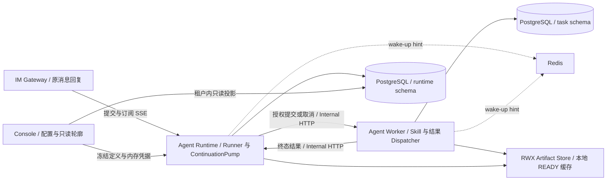
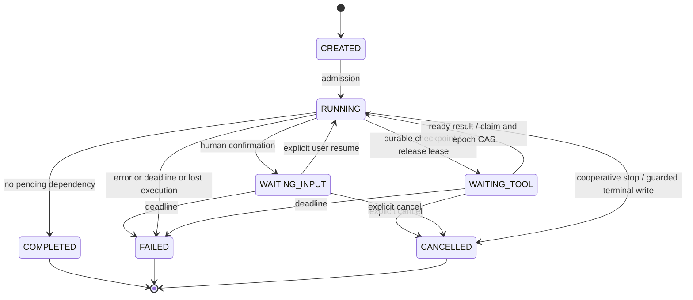
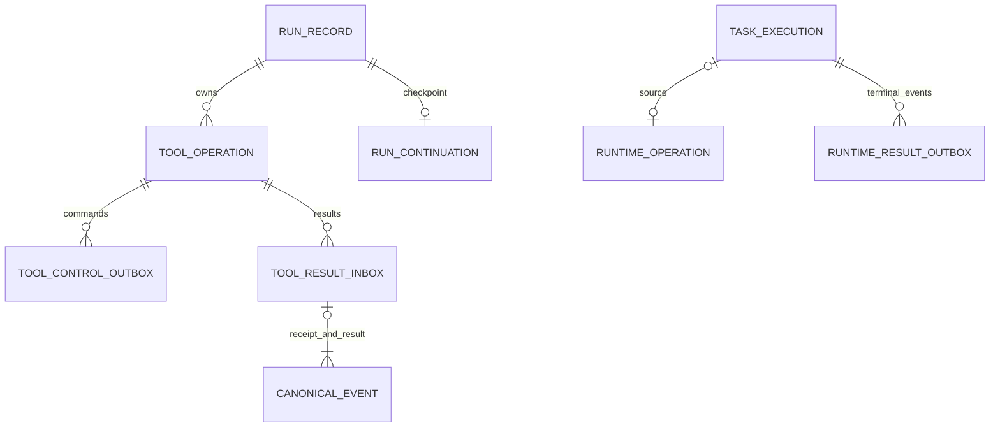

# 异步工具结果回流与 Run 等待恢复：后端设计

> 文档编号：MOD-ASYNC-TOOLS-BE-0.1
>
> 版本：v0.1 · 创建日期：2026-10-07 · 状态：设计评审中
>
> 需求目录：`async-tool-runtime` · 模板：Full
>
> 配套文档：[前端设计](async-tool-runtime.frontend.design.md) · [Spec Context](spec-context.yml)

## 1. 文档控制

本文将用户要求“把这些内容直接细化成设计文档”及前一轮代码分析作为需求来源，无独立 PRD。第 2 章定义交付行为，第 3–4 章定义实现与发布约束。文中的新表、接口、场景和模块划分均为拟实现方案；现有实现证据集中在附录 A，不能把设计门禁通过当作功能已经完成。

| 版本 | 日期 | 作者 | 变更 |
|---|---|---|---|
| v0.1 | 2026-10-07 | Codex | 将章节十三的可采纳设计转化为适配现有四服务架构的方案 |

用户负责设计取舍与业务验收；实现阶段的开发、测试负责人由任务拆解指定，不在设计中虚构姓名。

## 2. 需求分析

### 2.1 需求概述

使需要慢任务结果的 Agent 可以继续处理独立工作，在任务结果回来后于**原 Run、原会话、原快照**下继续推理。等待期间释放模型连接、本地 Runner 和执行租约；任意 Runtime 实例都能接续。独立后台任务继续使用 Worker 的查询和最终投递能力。

### 2.2 痛点与价值

当前 Runner 使用异步 IO，但同一轮工具逐个执行；`ASYNC` Skill 已提交到 Worker，返回 `SUBMITTED` 回执，结果可查询和投递，却没有进入原 Runner 推理循环的输入端口。仅把工具调用放进 `create_task()` 会遗漏授权、资源归属、任务提交响应丢失、完成事件丢失及跨实例恢复。

| 需求来源 ID | 已有讨论中的需求 | 预期价值 |
|---|---|---|
| SRC-01 | 授权后提交、回执与结果分开、显式后台能力 | 拒绝的调用不会启动业务任务，模型不会把排队当完成 |
| SRC-02 | 安全 READ 并发、资源约束、MCP 并发前置修复 | 缩短独立读操作的等待，保留写操作的顺序 |
| SRC-03 | 两处排空事件、JOIN/DETACH 区分、持久化等待 | 原请求能使用慢任务的最终结果，独立任务不拖住原回答 |
| SRC-04 | 终态与事件原子提交、幂等回流、任意实例恢复 | 进程崩溃及网络重试不会丢结果或重复执行已提交任务 |
| SRC-05 | 生命周期、取消、绝对预算、批量制品与确定性竞态测试 | 能界定资源释放、取消效果及失败边界 |
| SRC-06 | 在现有 Console 中展示等待、关联 Task 与事件轮廓 | 用户能定位等待原因和最终状态 |

没有生产并发量、吞吐和延迟基线；本文不承诺未经测量的 P95 或加速百分比。并行和恢复的收益按 §3.5 的可观察行为验收。

### 2.3 功能方案

| 功能 ID | 功能 | 优先级 | 来源 | 设计落点 |
|---|---|---|---|---|
| FEAT-01 | 统一参数校验、Hook 改写后复验、冻结授权及审计的执行入口 | P0 | SRC-01 | §3.2 / FLOW-01 |
| FEAT-02 | 明确 ASYNC Skill 的 JOIN/DETACH、诚实提交回执和持久化提交意图 | P0 | SRC-01、SRC-04 | §3.2 / FLOW-02；API-01 |
| FEAT-03 | Worker 终态原子发件、Runtime 幂等收件与原循环输入端口 | P0 | SRC-03、SRC-04 | §3.2 / FLOW-03；API-03、PORT-01 |
| FEAT-04 | WAITING_TOOL、检查点、事件驱动唤醒及跨实例接续 | P0 | SRC-03、SRC-04 | §3.2 / FLOW-04；API-04 |
| FEAT-05 | 取消、截止时间、租约守卫与资源关闭 | P0 | SRC-05 | §3.2 / FLOW-05；API-02 |
| FEAT-06 | 显式允许的独立 READ 工具有界并发 | P1 | SRC-02 | §3.2 / FLOW-06；PORT-02 |
| FEAT-07 | MCP 单次初始化、唯一请求 ID 与响应关联 | P0 | SRC-02 | §3.2 / FLOW-07 |
| FEAT-08 | 批量结果预算、上下文重建、日志与指标 | P0 | SRC-05 | §3.5 / QUALITY-01、QUALITY-02 |
| FEAT-09 | Console 只读等待与关联任务投影、Gateway 等待回复 | P0 | SRC-06、SRC-03 | API-04、API-05；配套前端设计 |

### 2.4 范围与边界

第一版后台执行仅覆盖已有 `execution_mode=ASYNC` 的 Skill，沿用 `SKILL/BATCH` Task。MCP、普通 HTTP 工具及任意 shell 的后台化不在本次范围。并发工具必须由注册代码显式声明；READ 标记本身不是安全证明。不会把全部 WRITE/EXTERNAL 调用交给 `gather()`。

本次保留四个部署单元，PG 为业务状态权威源、Redis 为通知提示；不用文件 JobStore，不新增队列服务，不绑定执行实例。Console 沿用只读 Run 详情，不开原文、工具结果明文或新 Run 管理入口。

接受的取舍：模型调用和外部副作用不能承诺 exactly-once；任意执行中途的 `RUNNING` 崩溃仍按现有 Reaper 明确失败，不自动重放不安全工具。可接续的边界限定为已持久化的 `BEFORE_MODEL` 等待检查点。消息回复会话失效后的主动投递必须依赖适配器能力，不能假装原会话仍可写。

### 2.5 验收条件

#### 2.5.1 业务规则

| ID | 约束 | 验证场景 |
|---|---|---|
| RULE-01 | 参数、改写后的参数、授权与额度均通过后，才创建提交意图或执行业务操作；拒绝保留审计 | E-01、B-01 |
| RULE-02 | JOIN 结果影响原 Run；已受理 DETACH 独立存活；排队、执行和完成不能混淆 | S-01、S-02、E-02 |
| RULE-03 | 同一操作最多一条 Worker Task；同一事件每种 canonical 记录最多一条，模型结果只物化一次；网络至少一次投递 | E-02、E-03、B-02 |
| RULE-04 | 等待前复检已到事件；唤醒只由有效状态和租约 CAS 获胜者执行 | E-04、E-05、B-04 |
| RULE-05 | deadline、turn/tool/usage 预算跨等待保持，过期结果不得将 Run/Task 改成成功 | E-06、B-05 |
| RULE-06 | Run 取消级联 JOIN 和尚未受理的提交；已受理 DETACH 不级联；取消不能被晚到提交绕过 | S-02、E-07、E-08 |
| RULE-07 | 结果是外部数据，不能提升为 SYSTEM 指令，不能伪造或重复原 tool_call 的 tool 响应 | S-03、E-09 |
| RULE-08 | 压缩/制品外置失败保留原历史或整批内联，warning 和失败指标同时可见 | E-10、B-03 |
| RULE-09 | 身份、租户、会话、快照取自可信执行上下文；结果回流不得跨主体或跨租户 | E-01、E-11 |
| RULE-10 | 工具并行保持模型调用次序的结果排列、tool_call 配对和写屏障；并行度有上限 | S-04、B-06 |
| RULE-11 | 检查点与事件无凭据；恢复保留配置/授权快照，但凭据经 API-09 实时读取 | S-05、E-12 |
| RULE-12 | SSE 提交后再输出；等待不发终帧，断流不等于取消，重连不重复提交 Run 或工具 | S-06、E-13 |

#### 2.5.2 场景清单

以下全部归属**本需求**，状态均为待实现。`integration` 仅验证单层服务/数据库或协议；跨服务用户流程为 `E2E`。时序用探针屏障、事件及可注入时钟控制，不靠长 sleep 猜竞态。

| 场景 | 功能 | 层级 | 关键真实边界 | 输入与可观察结果 |
|---|---|---|---|---|
| S-01 | FEAT-02、FEAT-03、FEAT-04 | E2E | Runtime/Worker HTTP、PG、Redis、LLM 探针、SSE | ASYNC JOIN 慢任务：先拿提交回执、执行独立工作、进入 WAITING_TOOL；Task 完成后同 run_id 恢复并用真实结果回答；等待不占 Runner/租约 |
| S-02 | FEAT-02、FEAT-05 | E2E | 四服务 HTTP、真实 Task、渠道出站探针 | 明确 DETACH：受理后原 Run 完成；其后取消原 Run 不取消 Task，Worker 按 FINAL_ONLY 送达一次；无路由时 NONE 且可查询 |
| S-03 | FEAT-03、FEAT-08 | E2E | 实际 provider 请求、canonical 历史、制品存储 | 两个 JOIN 结果回流，重建前后模型可见内容一致，原 tool_call 仍只有一个 tool 响应；结果按持久 seq 进入后续模型请求 |
| S-04 | FEAT-06 | integration | 真实 Runner、可控异步工具处理器 | 两个允许并发的独立 READ 均到启动屏障后才放行；WRITE 在读批全部结束后才启动，返回消息顺序按原调用序 |
| S-05 | FEAT-04、FEAT-08 | E2E | Console resolve/API-09、等待恢复、LLM/MCP HTTP | 分别修改 Agent 配置、授权、模型参数；旧 Run 恢复仍用旧快照，新 Run 使用新值；独立轮换凭据后旧 Run 用新凭据但快照 hash 不变 |
| S-06 | FEAT-04、FEAT-09 | E2E | Gateway、Runtime SSE、Worker、原消息回复探针 | JOIN 等待阶段不发完成帧；接续后在同消息回复输出最终文本，无额外 Worker FINAL_ONLY 通知；/stop 不被排队阻塞 |
| S-07 | FEAT-07 | integration | 真实 MCP HTTP 探针、Runtime adapter | 并发两个 tools/call 仅一次 initialize，请求 ID 不复用，响应逐一匹配；无 tools/list 请求 |
| E-01 | FEAT-01、FEAT-02 | E2E | 冻结授权、Worker HTTP、PG、审计 | 未授权 Skill、非法参数、Hook 改写后非法参数分别拒绝；业务 Task/operation/outbox 均不创建，DENY/ERROR 审计仍存在 |
| E-02 | FEAT-02 | E2E | Runtime 控制发件、Worker 创建事务、故障代理 | Worker 创建后丢提交响应；模型收到 SUBMISSION_PENDING 而非完成；重试得到同 task_id，只建一条 Task，最终可回流 |
| E-03 | FEAT-03 | E2E | Worker 真实进程、PG outbox、Runtime HTTP | 在终态事务提交后、发件前 SIGKILL；另一 Worker 重投，Runtime canonical 结果恰一条；响应丢失后的重投也不重写 |
| E-04 | FEAT-04 | E2E | Runtime 等待事务、结果回流 HTTP、PG | 在“已检查无结果”和“提交等待”间完成 Task；无失唤醒，Run 最终完成而非永久 WAITING_TOOL |
| E-05 | FEAT-04、FEAT-05 | E2E | 两个 Runtime 真实进程、PG lease、LLM HTTP | 杀死 WAITING_TOOL 所在实例，另一实例恢复；同时两个实例 claim 只有一方有效；过期 owner 无法续租或提交终态 |
| E-06 | FEAT-05 | E2E | 真实 deadline sweep、Worker、Runtime、PG | 等待跨绝对 deadline：Run FAILED，JOIN 发出取消；晚到成功只留轮廓不复活；Task 跨 deadline 不能 COMPLETED |
| E-07 | FEAT-05 | E2E | Runtime cancel、Worker operation 行锁、真实 HTTP | 控制取消先到而提交后到；Worker cancellation tombstone 阻止新任务启动；反向交错已创建 Task 则进入真实取消路径；BATCH 取消与最后 Child fan-in 同时到达无死锁或状态反转 |
| E-08 | FEAT-05 | E2E | ScriptSkillExecutor、实际子孙进程、管道、HTTP | 运行中取消/超时回收整组；直接子进程已退出但孙进程持 stdout 时收尾仍有界；不把协作取消声称为强制停止所有远端副作用 |
| E-09 | FEAT-03、FEAT-08 | integration | ContextBuilder、真实 provider 消息序列化 | 结果含“忽略原指令”文本；只出现外部结果数据消息，SYSTEM 前缀与原 tool_call 配对不被改写 |
| E-10 | FEAT-08 | integration | 真实制品发布/DB 事务、压缩端口 | 注入批量外置中途失败和摘要失败：整批结果内联/历史原文保留，Run 不因压缩失败终止，warning 与 metric 增量可断言 |
| E-11 | FEAT-03、FEAT-09 | E2E | 内部服务门控、Runtime/Console HTTP、PG | 无服务身份、跨租户、actor/run/operation/task/hash 不匹配拒绝；不写 inbox、不泄露另租户存在性，Console 伪造租户头无效 |
| E-12 | FEAT-04、FEAT-08 | E2E | API-09、日志、inbox/outbox/checkpoint/canonical、制品 | canary 密钥不出现在新增持久化面、Prompt 或出站；模型凭据清空后恢复明确失败，不退回环境变量 |
| E-13 | FEAT-04、FEAT-09 | E2E | SSE socket、Runtime supervisor、Gateway/重连客户端 | 等待期间断开 SSE，任务仍执行；新连接从已确认 seq 回放；无新 Task/模型预算重置，终态只输出一次 |
| E-14 | FEAT-07 | integration | MCP HTTP 探针、客户端关闭 | 错误响应 ID、初始化失败、isError、超时及取消均明确失败并关闭连接；初始化失败可由后续调用重试，无旧失败锁死 |
| E-15 | FEAT-02、FEAT-03 | E2E | Redis 故障代理、PG 队列和结果发件 | Redis wake-up 丢失/不可用时 PG 扫描仍使提交、结果投递和等待恢复前进，异常有日志与指标 |
| E-16 | FEAT-02、FEAT-05 | E2E | Worker HTTP 故障代理、控制发件、PG tombstone | 提交响应持续丢失直至重试耗尽，operation 明确 SUBMIT 失败而非伪造 Task 失败；取消意图持久化，晚到提交/结果不恢复该依赖或启动另一 Task |
| E-17 | FEAT-04、FEAT-09 | E2E | Gateway/Runtime HTTP、PG 活跃会话约束 | WAITING_TOOL 时显式人类 resume 被 RUN_BUSY 拒绝，普通新消息沿既有路由队列且不替换等待输入；/stop 可取消，之后新 Run 可正常创建 |
| B-01 | FEAT-02、FEAT-05 | integration | PG 行锁、并发提交、关闭屏障 | pending_limit=1 同时申请两次只接受一个；关闭与提交交错后无未登记本地任务，等待意图全部可查 |
| B-02 | FEAT-02、FEAT-03 | integration | 严格 JSON DTO、幂等表、PG 唯一约束 | 相同 key/指纹重放首次结果；同 key 换 tenant/endpoint/actor/input/mode/hash 分腿验证；NaN/Infinity/未知类型入口 422，不撞成另一 JSON |
| B-03 | FEAT-08 | integration | UTF-8 字节预算、共享制品、历史重建 | 恰等阈值内联，超 1 字节触发；中文、多结果合计超 round_budget 均正确；外置失败保留整批原内容 |
| B-04 | FEAT-04 | integration | PG wait_generation、epoch、canonical seq | 旧等待代的迟到唤醒不接管新等待代；已消费事件不重复注入；未消费事件在重建时不丢，剩余批次存在时不睡眠 |
| B-05 | FEAT-04、FEAT-05 | integration | 持久检查点、注入时钟、真实 budget 判定 | 多次等待与人类确认 resume 不重置已用 turns/tool_calls/usage 或本 Run deadline；预算耗尽明确失败 |
| B-06 | FEAT-06 | integration | 并行规划器、Runner、资源声明 | READ 未声明并发、共享有状态资源、同资源锁或未知依赖时保持串行；并行度=1 和上限边界均符合声明 |
| B-07 | FEAT-03、FEAT-04 | integration | inbox/outbox 租约、PG、故障代理 | 同事件改变正文得 409；ack 仅表示 durable；重投耗尽保留 FAILED 发件及告警，可操作性恢复不制造第二 canonical 结果 |
| B-08 | FEAT-04、FEAT-09 | integration | 真实 PG、Alembic、迁移前置检查 | 空库及含旧终态 Run/旧 Task 的盘面升级后 schema parity 一致；有 WAITING_TOOL 或 PENDING outbox 时回退检查失败，drain 后允许回退 |
| B-09 | FEAT-08 | integration | 真实需求文件、manifest、inventory runner | 改状态、删证据行、伪造用例名、改 manifest 边界四类扰动分别使闭合清单变红；逐字节还原后通过，缺 inventory 文件本身也失败 |

#### 2.5.3 非功能要求

| ID | 目标与测量方式 |
|---|---|
| NFR-PERF-01 | 有界并行、批量事件处理，执行热路径不重复读平台设置；用启动屏障和 HTTP 请求计数验证，不虚设 QPS |
| NFR-REL-01 | 已提交 terminal event 在发送前崩溃仍能重投；仅持久化后 ack；丢 Redis hint 不丢业务事实 |
| NFR-REL-02 | WAITING_TOOL 不持有执行租约、模型/MCP/Worker HTTP 客户端；通过 PG 字段与连接/任务计数验证 |
| NFR-SEC-01 | 越权结果零写入，凭据不落新增表/制品/Prompt/日志；真实 canary 反查全部新增面 |
| NFR-OBS-01 | 每个降级、重投耗尽、恢复冲突均可观察；指标只使用固定低基数标签 |

## 3. 技术设计

### 3.1 方案选型

| 决策 | 采用方案 | 被否决项与理由 |
|---|---|---|
| ADR-01 | 复用 PG Worker 任务、租约、TaskEvent 和四服务边界 | 文件 JobStore/本地 detached coroutine 不能承载多实例任务归属、崩溃恢复及可靠回流 |
| ADR-02 | 后台资格沿用 ASYNC Skill；另设 completion_mode 表达依赖 | 把通用 run_in_background 三态加到所有工具会重复 Skill 配置，并向不具备取消/资源安全能力的工具承诺后台化 |
| ADR-03 | durable operation + 双向 outbox/inbox；取消有 Worker tombstone | 只写终态再发事件有丢事件窗口；只重试 POST 无法覆盖先取消后提交 |
| ADR-04 | 新增 WAITING_TOOL 与 BEFORE_MODEL 检查点 | 复用 WAITING_INPUT 混淆人类确认和任务依赖；内存等待占资源且进程退出后无法接续 |
| ADR-05 | 明确声明的独立 READ 有界并行；写操作为屏障 | 仅按 ToolEffect.READ 放行忽略共享工作目录、会话和非可信 MCP annotation；全串行无法改善已证明独立的读操作 |
| ADR-06 | Runtime lifespan 管执行，HTTP 仅订阅持久事件 | 将 Runner 生命周期绑到 SSE generator 会把网络断开变成业务取消，并妨碍跨实例恢复 |

沿用 Python 3.12+、FastAPI、SQLAlchemy 2、LangGraph、PostgreSQL、Redis、OpenAI 兼容 provider；不引入新执行框架、第三方队列或默认模型。

### 3.2 架构设计



跨 app 仅通过契约 HTTP 进行业务写入；共享 package 不 import app。Console 对 runtime/task 的查询限于带租户和软删谓词的只读投影，名称字段在同一 SQL JOIN，不逐行拉取。

**FLOW-01：唯一工具执行入口（FEAT-01）。** 解析原参数与工具 schema → PRE_TOOL_USE Hook → 对最终参数复验 → 基于冻结 EffectiveCapabilities、effect 和出站策略授权 → 在 Run 行锁内预留额度 → 执行或建立 operation → 整轮结果处理 → 审计及 tool.completed。收敛现有 `ToolExecutionPipeline` 与 Runner 直接调用路径，默认 Runner 必须接入统一端口，不能只提供一个未接线的可选 pipeline。授权后提交意图不可由模型参数覆盖 tenant/actor/run/snapshot。Hook 更改参数后旧授权结论不复用；审计只由一个端口写，DENY/ERROR 仍记录脱敏参数 hash，拒绝不生成业务任务和业务制品。

**FLOW-02：执行资格、回执与提交（FEAT-02）。** `execute_skill` 对 SYNC 沿用内联执行，对 ASYNC 新增 `completion_mode: JOIN | DETACH`，默认 JOIN。schema 中该参数可省略，仅在识别 ASYNC 后填默认，不能给 SYNC 自动注入 JOIN。SYNC 显式携带 completion_mode 明确校验失败；不悄悄解释成后台调用。ASYNC 的 `SUBMITTED` 回执包含 operation_id、task_id、真实 task_status 与 completion_mode，不代表执行成功。5 秒内未拿到 Worker durable admission 时返回 `SUBMISSION_PENDING`，task_id 为空且 pending 原因明确，不能虚报 QUEUED。

提交成功前，同事务写 `runtime.tool_operation(SUBMIT_PENDING)` 与 `tool_control_outbox(SUBMIT)`。operation_id 由服务生成，每次真实 tool_call 一个，重试使用原 ID；不能再用“同 Run + 同 Skill + 同输入”合并用户明确重复的两次调用。发件器有限批量 claim 后在事务外发 HTTP，响应匹配后同事务更新 operation、发件状态和 `TOOL_TASK_ACCEPTED` canonical 事件。确定性 4xx 写 operation FAILED 与可供循环消费的拒绝事件；超时/5xx 保持 SUBMIT_PENDING 退避重投。模型可先做独立工作；尚未受理的 JOIN/DETACH 都是待确定的提交依赖，不能当成功独立任务结束 Run。受理后 DETACH 解除依赖，JOIN 等终态。JOIN 的 delivery_mode=NONE，DETACH 有路由时 FINAL_ONLY，无路由时 NONE。

**FLOW-03：终态可靠回流（FEAT-03）。** Worker 所有产生根 Task 终态的路径——成功、确定性失败、重试耗尽、deadline sweep、QUEUED/WAITING 取消、reclaim 终止、BATCH fan-in——共用终态记录函数，在**同一事务**内完成租约/CAS 状态更新、TaskEvent 和 `runtime_result_outbox` 插入。仅 JOIN 根任务产生模型结果回流，Child 不重复发送根结果，DETACH 保留现有 final delivery。成功无 terminal outbox、失败有 outbox 等不对称情况不可接受。

event_id 根据 tenant/task_id/terminal TaskEvent seq 生成稳定 UUID；记录不可变 task_snapshot_hash、operation_id、结果或错误信息。Dispatcher 只承认响应 `data.persisted=true` 和同 event_id；HTTP 2xx 或 Redis 通知不代表入库。Runtime 先核验内部身份及 operation 的 tenant/actor/run/task/hash，回流 payload 的身份不是权威来源。按 DATA-03 锁序，同事务写原始终态 inbox、更新 operation、写 canonical TOOL_RESULT_RECEIVED 元信息并设置可接续标记；提交后才 ack、发 hint/SSE。未知或不匹配 operation 拒绝，绝不兜底新建会话。Task 完成可先于提交响应到达，凭已持久化 operation 绑定 task_id；之后 admission 响应必须匹配同 task_id，且不得把已终态 operation 回退为 SUBMITTED。

收件与模型结果物化明确分开：inbox 已持久化的完整终态数据是可靠事实；PORT-01 在模型请求前取未物化的有界批次，按 QUALITY-01 整批决定内联/制品后，同事务追加 BACKGROUND_RESULT 并标记 inbox 已物化。canonical 是 append-only，**不得先写原结果，再 UPDATE 成制品预览**。receipt 和 result 各用由 event_id/记录种类派生的稳定 source_event_id 去重，结果排列按 receipt_seq。崩溃于 ack 与物化之间，另一实例仍能读 inbox 完成物化；物化失败回退原文而非漏过该事件。终态/已取消或放弃的 operation 收件写 BACKGROUND_RESULT_LATE，不进入模型队列。

**FLOW-04：两处排空、等待与接续（FEAT-04）。** Runner 接入 PORT-01，在模型调用前非阻塞排空可消费事件；模型返回无工具调用时再次排空，复检依赖后决定等待或完成。等待事务按 DATA-03 的锁序复检所有 ready 事件、未物化 inbox、未受理提交和未结束 JOIN，避免检查后完成产生失唤醒。存在未消费结果时继续推理；无依赖则按正常终态收尾；确实待结果才同事务落中间 assistant 文本、BEFORE_MODEL checkpoint、WAITING_TOOL 事件并释放 lease。Runner 返回类型扩展为有判别字段的 RunOutcome（COMPLETED/WAITING_TOOL/WAITING_INPUT/BUDGET_EXCEEDED），WAITING_TOOL 分支只能持久化暂停，不能落进现有完成收尾路径。

检查点只能处于完整工具回合之后，所有 assistant tool_calls 已与原 tool receipt 配对。`TOOL_TASK_ACCEPTED` 和 `BACKGROUND_RESULT` 渲染为明确标注来源的**外部数据 USER 消息**；不新造同 tool_call_id 的 tool 响应，不变成 SYSTEM，不冒充用户的新业务请求。模型提示说明回执是受理信息、结果数据不赋予指令权；保留既有 SYSTEM 受保护前缀顺序。中间 assistant 文本可发送并落库，但不写 run.completed。进入等待后关闭本段执行资源。

ContinuationPump 在各 Runtime lifespan 启动，读取 PG 中 WAITING_TOOL 且 ready 的记录，`FOR UPDATE SKIP LOCKED` 后按 status/wait_generation CAS 到 RUNNING、增加 execution_epoch 并取得 lease。所有心跳、事件与终态写入均核验 epoch、owner 和未过期 lease。claim 只选择 `ready=true`、未过期 deadline、未取消且仍有未消费事件的 WAITING_TOOL；claim 失败不得修改业务状态，只有同一事务内 Run/continuation/lease 都切到新 owner、epoch 与 lease 后才算抢占成功。任意实例从相同 snapshot、canonical history 和 checkpoint 重建，不重新 resolve 授权/配置；实时获取 API-09 凭据。多个等待轮次复用同 Run。事件到达 WAITING_INPUT 时仅持久化，不绕过人类确认；用户 resume 同样带入持久预算和未消费事件。RUNNING 中的普通事件到达不启动第二 Runner。

WAITING_TOOL 保留该会话的活跃 Run 唯一约束。用户 resume 接口仅接受 WAITING_INPUT，不能驱动工具等待恢复；新消息经既有 Gateway 路由队列等待，绕过队列直接调用 Runtime 创建新 Run 时明确 RUN_BUSY。/stop 沿现有独立命令容量取消等待，不能把“释放 Runtime Runner”错误解释为“会话可以同时运行第二个 Run”。



**FLOW-05：取消、deadline 与关闭（FEAT-05）。** Run 取消/失败/超时事务同时为未结束 JOIN、所有未受理提交写 `CANCEL_OPERATION` 控制发件，不等待远端停止才回复。Worker 的 operation cancel 接口可在 Task 尚不存在时记录 cancellation tombstone；Task 创建与取消在同 operation 行锁内复检，取消先到不得再启动 Task。已受理 DETACH 不级联。QUEUED/WAITING 直接取消，RUNNING 仍使用现有 cancel_requested 与协作停止；返回值明确标记请求已持久化，不宣称外部副作用已停止。晚到结果只追加 LATE 轮廓，不唤醒或复活终态 Run。

首次启动冻结 `deadline_at=start_time+effective_policy.deadline_ms`；JOIN Task 的 deadline 不晚于 Run；DETACH 受理后用自己的 Task budget。运行、等待及 resume 不重置 turns/tool_calls/usage/deadline；WAITING_TOOL 和 WAITING_INPUT 均不延长 deadline，WAITING_INPUT 跨期也按既定失败终态收尾。`deadline sweep 与接续循环独立，WAITING_TOOL 不走 RUNNING lease Reaper。旧 owner 不得续租、发布结果或写成功；丢租约立即停止本地执行。Script Skill 沿用 start_new_session、killpg(SIGTERM→SIGKILL) 及有界 drain；Python wait_for 的取消等待可能超出 timeout，不能当不可协作远端操作的强制终止保证。

消息重投与 Skill 重执行是两个预算。第一版对本链路新建的 Run 来源 Task/Child 冻结 max_attempts=1，Worker 崩溃返回明确 TASK_ATTEMPTS_EXHAUSTED 并回流，不能在未知副作用下自动重执行。既有非本链路任务仍按其自身冻结预算工作。将来允许 Skill 多次执行必须先有明确幂等/可重试契约，本次不拿“只创建一条 Task”冒充“外部副作用只发生一次”。

Supervisor 在接收新执行与关闭之间使用同一登记锁：关闭先封入口，收拢全部已登记执行，再请求停止并有界等待，最后关闭 provider/MCP/HTTP 客户端。已持久化 WAITING_TOOL 保留给其他实例；关闭不能遍历并误取消其他实例的所有 Task。RUNNING 若无法落安全等待点，按受控失败写取消意图；SIGKILL 路径由 Reaper 完成同样收尾。不能将无限等待 close 当成资源清理成功。

**FLOW-06：安全 READ 并行（FEAT-06）。** ToolDefinition 新增不可由模型设置的 `concurrency` 声明：SERIAL 默认；PARALLEL_READ 需要 handler 可重入、无共享可变副作用、明确资源键和独立性。按原调用序切分连续可并行 READ 批，资源冲突/未知依赖拆成串行；WRITE/EXTERNAL 是前后屏障。先统一校验/授权/预留 tool-call 预算，任务只包实际 handler IO，使用 TaskGroup 与 semaphore；单调用失败变成对应失败 ToolResult，不随意撤销其他成功读。Run 取消/失约则取消整批并等待清理。结果按原序进入 ToolResultRoundPort，follow-up 消息仍在全部 tool 响应之后；整批判定预算后才发 tool.completed。

第一版允许 `search_skills`、已证明只读的 `read_skill_resource`，以及隔离客户端上的 `get_task/list_tasks` 等候选，经测试后逐个登记；会写 Skill 加载状态的 load_skill、记忆写入及所有 MCP 默认 SERIAL。没有声明并行的工具保持串行。MCP 的 readOnlyHint 是对端提示，不能作为开启并行的授权依据。

**FLOW-07：MCP 前置正确性（FEAT-07）。** 每个冻结 server 会话使用初始化 singleflight 锁，成功才置 initialized；失败释放锁并允许重试。请求 ID 由会话计数器/唯一生成器提供，每次 initialize/tools-call 都不复用；响应 ID 严格相等，缺失/错配为协议错误。仍仅 Streamable HTTP、冻结 catalog 注册统一 registry、不在 Run 内 tools/list，不新增 Tool 级 RBAC。isError、取消和超时分别归类并写既有工具/egress 审计。该修复先于任何 MCP 并行扩展交付。

### 3.3 数据设计

**DATA-01：统一表约束。** 下列新增产品表均继承各 Owner 的 StandardColumnsMixin，含 UUID id、is_deleted=false、create_time/update_time；时间使用 timestamptz UTC，应用更新显式赋 update_time。所有查询包含 tenant_id 和未删除谓词；同 Owner 实体关系物理 FK，跨 Owner/操作者 UUID 逻辑引用。稳定身份和查询状态为列，JSON 只装有界结构化内容。Inbox/outbox 在可重放窗口内不删除或置软删，canonical 关联保留去重身份。

| 表/Owner | 专用字段、类型、空值与默认 | 关系与约束 |
|---|---|---|
| `runtime.tool_operation` | tenant_id text N；run_id uuid N；actor_user_id uuid N；source_tool_call_id text N；completion_mode enum N；status enum N 默认 SUBMIT_PENDING；task_id uuid 可空；task_snapshot_hash text N；submission_json jsonb N；input_hash text N；terminal_event_id uuid 可空；cancel_requested bool 默认 false；error_phase SUBMIT/EXECUTE 可空；error_code text 可空 | run_id FK run_record；task_id 逻辑引用；唯一 active(tenant_id,run_id,source_tool_call_id)；task_id 非空唯一 active(tenant_id,task_id) |
| `runtime.run_continuation` | tenant_id text N；run_id uuid N；snapshot_id uuid N；phase=BEFORE_MODEL；wait_generation bigint 默认 0；ready bool 默认 false；context_upto_seq bigint N；consumed_event_seq bigint 默认 0；turns/tool_calls int 默认 0；input_tokens/output_tokens bigint 可空；checkpoint_schema_version int 默认 1；runner_state_json jsonb N | run_id/snapshot_id 物理 FK；每 Run 一行；计数非负，tokens 的 null 表示 provider 未返回而非伪造 0；未完成 operation 在独立表查询，不藏在 JSON |
| `runtime.tool_result_inbox` | tenant_id text N；event_id uuid N；run_id uuid N；operation_id uuid N；task_id uuid N；task_event_seq bigint N；payload_hash text N；payload_json jsonb N；late bool 默认 false；receipt_event_id uuid N；receipt_seq bigint N；canonical_event_id uuid 可空；materialized bool 默认 false | run/operation/receipt/canonical 物理 FK；唯一 active(tenant_id,event_id)；同 event_id 不同 payload_hash 冲突；原 payload 不改写，canonical_event_id 物化后非空 |
| `runtime.tool_control_outbox` | tenant_id text N；operation_id uuid N；command enum SUBMIT/CANCEL_OPERATION；status enum PENDING/SENT/FAILED 默认 PENDING；attempts int 默认 0；not_before timestamptz N；lease_owner text 可空；lease_until timestamptz 可空；last_error_code text 可空 | operation FK；唯一 active(operation_id,command)；载荷从不可变 submission_json 取，不带任何凭据 |
| `task.runtime_operation` | tenant_id text N；operation_id uuid N；source_run_id uuid N；source_tool_call_id text N；actor_user_id uuid N；task_id uuid 可空；cancel_requested bool 默认 false；submission_hash text 可空；completion_mode JOIN/DETACH 可空 | task_id 同 Owner FK；source_run/operation 逻辑引用；唯一 active(tenant_id,operation_id)；取消先到允许空 submission_hash，后续只允许同可信来源的提交 |
| `task.runtime_result_outbox` | tenant_id text N；event_id uuid N；task_id uuid N；task_event_seq bigint N；operation_id uuid N；task_snapshot_hash text N；payload_json jsonb N；payload_hash text N；status、attempts、not_before、lease_owner/until、last_error_code 同上 | task_id FK、(task_id,task_event_seq) 复合 FK 到 TaskEvent 唯一键；唯一 active(tenant_id,event_id) 和 active(task_id,task_event_seq)；终态结果 payload 不改写 |

`submission_json` 是已经校验并冻结的非秘密 CreateTaskRequest 业务参数，只含本次执行的一个 Skill。服务令牌、模型密钥、MCP auth_secret 不进入该 JSON。所有自由 JSON 在 DTO 入口经 ensure_strict_json 校验，规范化序列化使用 sort_keys、紧凑 separators、ensure_ascii=False、allow_nan=False；禁止 default=str。

**状态枚举必须显式定义、可测试。** 实现时契约代码必须定义且钉死以下集合，不得由字符串拼接或不同模块各自声明：`RunStatus = CREATED/RUNNING/WAITING_TOOL/WAITING_INPUT/COMPLETED/FAILED/CANCELLED`；`CompletionMode = JOIN/DETACH`；`TerminalStatus = COMPLETED/FAILED/CANCELLED`；`OperationStatus = SUBMIT_PENDING/SUBMITTED/TASK_ACCEPTED/RUNNING/RESULT_RECEIVED/MATERIALIZED/COMPLETED/FAILED/CANCELLED/LATE`；`ControlOutboxStatus = PENDING/SENT/FAILED`；`InboxMaterializationState = PENDING/RECEIVED/MATERIALIZED/LATE/FAILED`；`WaitReason = SUBMISSION/TASK_RESULT/RESUME_READY/null`。迁移和 API DTO 更改必须同一发布，避免旧代码把新枚举解释成 `unknown`。

**DATA-02：既有表变更。** RunRecord 新增 deadline_at（timestamptz，新执行非空）、execution_epoch（bigint 默认 0）；RunStatus 新增 WAITING_TOOL；活跃会话唯一索引的状态集合加入 WAITING_TOOL。CanonicalEvent 新增 source_event_id UUID 可空及 unique active(tenant_id,source_event_id)，用于 admission/result/control 的稳定去重。TaskExecution 增加 source_operation_id UUID 可空、source_tool_call_id text 可空、completion_mode 可空，保留 SKILL/BATCH 与原 TaskStatus。Task snapshot budget 冻结 JOIN 有效 deadline 与 async policy，不能修改已经运行任务的配置。

**DATA-03：索引与事务锁序。** 控制/结果 outbox 使用 `(not_before,create_time,id) WHERE status='PENDING' AND is_deleted=false` 与租约回收索引；operation 使用 `(tenant_id,run_id,status,completion_mode)` 未终态 partial index；Run 用 WAITING_TOOL deadline 索引，continuation 使用 `(run_id) WHERE ready=true AND is_deleted=false`，claim 通过 continuation 与 Run JOIN。inbox 使用 `(tenant_id,run_id,receipt_seq) WHERE materialized=false AND late=false AND is_deleted=false`；canonical 按 tenant/run/seq 有界查询。后台跨租户扫描使用有前进游标的公平批次，某租户失败不能阻断其他租户。

Runtime 顺序为 conversation → run_record → continuation → 按 id 排序的 operation → inbox/canonical/outbox；EventWriter 不能在拿 Run 锁后反向拿 conversation 锁。Worker 顺序为 runtime_operation → root Parent → Child → TaskEvent/outbox；无 operation 的旧任务沿用 Parent→Child。提交、取消、fan-in、deadline sweep、reclaim 均遵守同一锁序。所有网络调用在事务外，不持行锁等 HTTP。



operation 与 Task 的跨 Schema 关联是逻辑 UUID，图中不画成物理 FK。规模按“异步操作数 ×（operation、至多两条控制发件、一次 terminal inbox/outbox）+ 等待 Run 数”估算；无实际流量，不填写虚构的三年条数。保留期和清理只能在 Run/Task 均终态、outbox 无 PENDING、重放窗口结束之后制定；第一版不自动删除新增事件记录。

### 3.4 接口设计

**API-CONTRACT：统一 HTTP 契约。** 内部端点要求 X-Internal-Service 和可信租户头；Console 租户取登录账号，不取可伪造请求头。内部时间 UTC ISO8601；Console 复用 format_console_time，前端 DateTimeText。HTTP 返回 api-kit 的 `{code,msg,data,trace_id,request_id,timestamp}`，成功 code 为字符串 `"0"`；错误 HTTP/msg 只来自 config/api-messages.yaml。所有新错误同时登记 zh-CN/en-US，不改 i18n 框架。

| ID | 路径/端口 | 功能 | 关键契约 |
|---|---|---|---|
| API-01 | 扩展 `POST /internal/tasks` | FEAT-02 | CreateTaskRequest 新增 runtime_operation（见下），同操作创建一次；不另建第二套任务创建 API |
| API-02 | 新增 `POST /internal/runtime-operations/{operation_id}/cancel`（Worker） | FEAT-05 | 可以先于 Task 创建到达，durable tombstone；已有 Task 复用现有取消服务 |
| API-03 | 新增 `POST /internal/tool-results`（Runtime） | FEAT-03 | stable event_id 的幂等结果回流；persisted 后 ack |
| API-04 | 新增 `GET /v1/runs/{run_id}/events?after_seq=N`（Runtime），扩展原创建/恢复 SSE | FEAT-04、FEAT-09 | 原授权/服务身份门控，tail 持久事件；after_seq 为已收到的 canonical seq；终态排空后关闭，不重新执行 |
| API-05 | 扩展 `GET /api/v1/runs/{id}`（Console） | FEAT-09 | 保持只读轮廓，增加等待信息；关联操作另用分页子资源 |
| API-06 | 新增 `GET /api/v1/runs/{id}/operations`（Console） | FEAT-09 | items/page/page_size/total，默认 15，上限 100，只返回身份/状态/时间/关联 Task，无 input/result |
| PORT-01 | `RuntimeEventPort.drain_ready(cursor, limit)` / `try_wait(checkpoint)` | FEAT-03、FEAT-04、FEAT-08 | typed admission/result/拒绝事件，wait 决策 CONTINUE/WAIT/FINISH；状态由 Runtime 实现，agent-core 不访问 app/DB |
| PORT-02 | ToolExecutionPort + ToolDefinition.concurrency | FEAT-01、FEAT-06 | 最终参数、授权上下文与不可变并发声明；无模型可设置的 resource/tenant/authorization 字段 |

**API-01 / IDEMP-01：提交。** 现有 CreateTaskRequest 字段保留，新增可空对象 runtime_operation，仅 Run 发起的异步 Skill 填写：operation_id UUID、source_tool_call_id 非空字符串、completion_mode JOIN/DETACH、source_run_id UUID（必须与顶层相同）。冻结 execution_snapshot.budget 新增 async_tools 与带时区的 run_deadline_at，JOIN 取两侧预算中的更早 deadline，max_attempts 按 FLOW-05 冻结；Worker 校验预算后再入队。不接受 callback_url；返回目标来自部署配置 AGENT_RUNTIME_URL，避免模型控制回调地址。

Idempotency-Key=`runtime-op:{operation_id}:submit`；指纹包含 endpoint/tenant/actor/operation/run/call/skill/artifact/input/completion_mode/snapshot_hash/delivery。使用现有幂等表先 pg_advisory_xact_lock 再 partial unique 兜底，提交与 cancellation tombstone 的 operation 行锁还需独立取得。首次成功响应重放当时的受理结果，当前状态通过事件或 GET 查询，不能把首次响应替换成新终态。首次被 tombstone 拒绝是明确 409 TASK_OPERATION_CANCELLED，不创建可执行 Task。

工具回执 data 形状：`{status:SUBMITTED|SUBMISSION_PENDING, operation_id, task_id:null|UUID, task_status:null|TaskStatus, completion_mode}`；工具的 SUCCESS 仅指提交动作完成，不是业务 Task COMPLETED。已经拿到 terminal result 的 operation 不回退；admission 事件和结果事件各有稳定 source_event_id，处理顺序以实际持久 seq 为准。

**API-02：取消。** 请求含 source_run_id、source_tool_call_id、actor_user_id；tenant 来自可信上下文，Worker 复核与既有 operation 相同。Idempotency-Key=`runtime-op:{operation_id}:cancel`，指纹含 endpoint/tenant/actor/source identity。响应 data 为 operation_id、cancel_recorded=true、task_id 可空、task_status 可空、cancel_requested。重复请求回放首次确认；不因 Task 已终态把 Run 改成成功。

**API-03：终态结果。** 请求字段：schema_version=1、event_id UUID、operation_id UUID、task_id UUID、task_event_seq 正整数、source_run_id UUID、actor_user_id UUID、task_snapshot_hash、terminal_status=COMPLETED/FAILED/CANCELLED、completed_at（带时区）、result（成功 JSON 对象）或 error_code/error_message（失败脱敏字段）。不携带会话路由或 credential。result 的全部值必须严格 JSON，成功/失败形状互斥。本链路新建 Task 的小结果协议上限设计为 256 KiB，与现有内容投递内联上限量级一致；超大输出由 Skill 产生合法 Artifact 引用。Worker 在写终态前校验，超限明确 SKILL_RESULT_INVALID 并回流错误，不在发件时静默裁剪，也不把它伪称为压缩失败。结果上限在 contracts 定义唯一常量，字节与边界用 B-03 验证；这是新增协议约束，不声称现有 Worker 已有此限制。

Idempotency-Key=`task-result:{event_id}`，标准幂等指纹包含 endpoint/tenant/actor/operation/task/seq/hash/result。inbox 与 canonical source_event_id 唯一约束二次兜底；同 event_id 改正文 409。响应完整示例：

```json
{
  "code": "0",
  "msg": "成功",
  "data": {"event_id": "b234258d-8ac6-4c7c-904a-b97b90135ee4", "persisted": true, "duplicate": false},
  "trace_id": "trace-example",
  "request_id": "request-example",
  "timestamp": "2026-10-07T08:00:00+00:00"
}
```

persisted 只代表完整 inbox 与 receipt 已同事务提交，不代表模型结果已物化、模型已读、Run 已完成或消息已送达。先持久化原数据再 ack；物化与消费有独立标记，可由其他实例恢复，不能 ack 一个仅存于内存的结果。late 事件保留审计事实但不注入已终态 Run。

**API-04：执行与 SSE。** 初始 Run 创建事务同时写 durable 启动资格；Runtime Supervisor 有界扫描 claim CREATED，单赢家切为 RUNNING 并取得 epoch/lease 后运行，HTTP generator 只 tail canonical。新事件映射：tool.submitted→TOOL_TASK_ACCEPTED（JOIN 提交不走当前会终止 renderer 的 task.accepted）、tool.result.received→TOOL_RESULT_RECEIVED、tool.result→BACKGROUND_RESULT、run.waiting→RUN_WAITING_TOOL、run.resumed→RUN_RESUMED。结果 SSE 只携带 operation/task/status 等元信息，不把原结果正文重复交给 Gateway。事件沿原封套 `{run_id,seq,timestamp,type,data}`，必须入库后发出。SUBMIT_PENDING 用 tool.submission_pending→TOOL_SUBMISSION_PENDING 元信息，不伪造 task.accepted。DETACH 的独立投递沿原 Worker 流程；原 Run 仍按真实 run.completed 收尾。新事件的 `data` 载荷统一声明 `event_version=1`；未知 event type 的旧客户端只可记录/降级展示，不得解释成终态或业务成功。所有 SSE 事件只携带 operation/task/status/seq/ref 等轮廓，不把原结果正文重复交给 Gateway。

Gateway 把 run.waiting 作为非终态等待，停本段执行计时；run.resumed 开新执行段，完整 Run 总耗时由起止时间另算。等待期不伪造模型/工具活动。SSE heartbeat 继续保活；Gateway 读超时保护保持有界，正常等待由 heartbeat 防止空闲读超时。断流按最后 seq 重连现有 Run，不能重复 POST 创建。原消息 ReplySession 失效时，通过渠道中立端口按稳定 `run:{run_id}:final` 交付键走适配器主动投递并去重；仅明确 delivered 才认成功。无可用能力必须显式反馈投递失败，不能回“已送达”。Gateway 不持业务库、不持执行归属映射。

**API-05/06：只读投影。** Run 详情新增 `waiting_since`、`deadline_at`、`waiting_reason`（SUBMISSION/TASK_RESULT/RESUME_READY 或 null）、`pending_join_count`、`pending_submission_count`、`continuation_count`；WAITING_INPUT 和 WAITING_TOOL 分开。结果已经到达但尚待 claim 的窗口显示 RESUME_READY，不继续声称任务未结束。operations 子资源字段：operation_id、source_tool_call_id、completion_mode、status、error_phase/error_code 可空、task_id 可空、task_status 可空、submitted_at/completed_at 可空。operation 的 SUBMIT 失败不等价于 Task FAILED。Console 以一次 JOIN 批量补 Task 状态，不读取原 input/result，分页与 count 共用条件。timeline 仍排除 token 增量、上限 200、超限有 truncated；新事件只取轮廓字段。

| 新增错误码（实现时登记） | HTTP | 触发条件 | 默认用户可读含义 |
|---|---|---|---|
| TOOL_COMPLETION_MODE_INVALID | 422 | SYNC 使用后台依赖模式或非法枚举 | SYNC Skill 不支持 JOIN/DETACH，或 completion_mode 非法 |
| TOOL_OPERATION_CAPACITY_EXCEEDED | 409 | Run 预留并发/待确定操作额度失败 | 当前 Run 的异步操作额度已满 |
| TASK_OPERATION_CANCELLED | 409 | cancellation tombstone 已生效，禁止创建任务 | 该 operation 已被取消，不能创建任务 |
| TOOL_RESULT_BINDING_MISMATCH | 403 | 可信租户内来源主体、Task 或快照不匹配 | 结果回流的来源租户、Task 或快照与操作不匹配 |
| RUN_CHECKPOINT_INVALID | 500 | schema、预算或 snapshot 引用损坏，禁止猜测性恢复 | 等待检查点损坏，无法安全恢复 |

以上错误码随实现必须同步登记到 `config/api-messages.yaml` 与前端 fallback 词条，未登记不得推出新交互错误。

COMMON_NOT_FOUND、FORBIDDEN、IDEMPOTENCY_MISMATCH、COMMON_VALIDATION_ERROR 与既有预算/deadline 错误码复用；不存在与跨租户同 404，不泄露他租户身份。

### 3.5 质量实现方案

**QUALITY-01：批量结果与上下文。** `drain_ready` 默认单批至多 16 条，稳定 receipt_seq 顺序；有剩余 ready 事件则继续有界处理，不进入等待。后台批次复用冻结 compaction.tool_result 的 persist_threshold_bytes/round_budget_bytes 与同一 reference_payload；单条与整批均按 UTF-8 字节判定，严格大于才外置。制品准备不持业务行锁等 IO，提交时复检 owner/epoch/lease，原子写新 BACKGROUND_RESULT 与 inbox 物化标记，失约则回滚并回收本批未引用产物。外置失败整批回滚，重新按原结果内联提交并记录 warning 与 context_compaction_total{layer,status=FAILED}；摘要失败保留原历史。不得 UPDATE 既有 canonical payload。Artifacts 继续 immutable publish_if_absent、RWX 共享存储、相对 storage_key 和 checksum 校验，本地缓存单进程 singleflight；Skill 从 READY 本地目录执行，缓存根不跨进程共享。新增结果制品在原 Run 尚活跃/可重放时不得被清理，清理服务以关联状态复检保护，不修改统一保留期默认。

结果事件加入 ContextBuilder 可重建集合；外置 canonical 的 artifact_id 列和 payload 共用同一 reference_payload，不能写一套重建另一套。continuation 的 consumed_event_seq 在成功模型回合与相关持久事件同事务前进；崩溃于模型请求/回合提交之间可以重复模型请求，但不能跳过结果或重复已授权 operation。SYSTEM、摘要和 memory 前缀按现有保护规则保留；pending operation 不依赖压缩后的文本记忆，而查询独立列。配置或系统提示拿不到应明确失败，不能替换成缺能力的提示兜底。

**QUALITY-02：日志、秘密与指标。** 业务使用 logging.getLogger，复用 logging-kit/root 脱敏，不另建 handler。HTTP 关联上下文由 api-kit 中间件写；拟新增 api-kit 共享 context_scope，使中间件与后台执行边界复用**同一个** trace→logging 桥，恢复原 trace/request/tenant/run/call/task 等已定义字段，结束用 contextvar token 恢复，不在业务层另写 set_log_context。该 scope 是拟新增能力，现有 api-kit/context.py 尚无此原语；实现后把 log Spec 的桥接位置说明更新为代码事实，不预先改规范声称已经存在。未知关联字段不引入第二词表，operation_id/event_id 作 extra 字段。所有后台任务关联必须显式恢复，不能靠启动协程偶然继承上次请求的 contextvar。

API-09 当前凭据只在执行内存；新提交意图、检查点、收发件、canonical 和结果制品都纳入 canary 反查。工具输入不得传平台执行凭据，产物/结果入库与送模型前走现有敏感字段清理边界；已解析的当前凭据 canary 也不得以改名字段、自由文本或异常堆栈外泄。脱敏/鉴权失败是明确错误，不能以压缩降级绕过。日志只记录状态、hash、关联 ID 与错误码，不记录任意输入/结果正文。

| 指标/Owner | 允许标签 | 记录点 |
|---|---|---|
| tool_operation_total / Runtime | mode、outcome | 提交意图/受理/拒绝 |
| tool_result_delivery_total / Worker | outcome | terminal outbox 的确认/重试/耗尽 |
| tool_result_ingest_total / Runtime | outcome | 新收件/重复/拒绝/late |
| run_tool_wait_total / Runtime | outcome | 等待、唤醒、deadline、取消 |
| run_continuation_total / Runtime | outcome | claim 成功/冲突/检查点失败 |
| context_compaction_total / Runtime | layer、status | 复用既有压缩失败语义 |

全部登记各服务 catalog，经 api-kit /metrics 暴露；labels 禁止 run/task/tenant/event UUID、用户路径或正文。带 label 计数器不写 metric 日志；普通告警日志使用关联 ID。run_reclaim_total 仍属 Runtime，task_reclaim_total 属 Worker。

**QUALITY-03：容量和资源。** 第一版建议默认 parallel_limit=4（范围 1–16）、pending_operation_limit=4（1–32）、event_batch_size=16（1–100），属于**待实现的保守设计默认**而非生产实测。统一定义 typed AsyncToolPolicy，允许 Agent runtime_config.async_tools 覆盖，拒绝 bool/小数/非有限数及越界值；服务可用更低技术上限进一步限流。有效值在 Run 创建时进入 policy_json，Task budget 引用同一冻结值，恢复不重新读取设置。pending_operation_limit 按 SUBMIT_PENDING（含 DETACH）+未终态 JOIN 计数，在 Run 行锁内原子预留；DETACH 受理后释放名额。

Dispatcher 技术配置初值：HTTP timeout=5s、租约=30s、poll_interval=1s、batch_size=32、retry_base=1s、retry_cap=30s、max_attempts=20，指数退避加有界 jitter；它们是可注入的启动配置，由单测钉默认与读取链路。attempt 在发送前预留并提交，失约的回执不得写 SENT，保留原身份重投。可重试传输失败退避；确定性 4xx 终止并告警；相同 durable duplicate 成功。SUBMIT 重试耗尽时停止新提交、将 operation 标为明确“提交未确认”的失败并追加供模型读取的提交错误，同时持久化 CANCEL_OPERATION 防止迟到创建；不得假报 Task 已 FAILED。已终态或已取消/放弃 operation 的迟到 admission/result 仅绑定身份和记 LATE。CANCEL/RESULT 发件耗尽保留 FAILED 并告警，Run deadline 不因此重置，不能假认远端已停或模型已读。

本地执行容量与 DB/HTTP 连接池受服务启动配置限制，Worker 任务队列提供跨实例排队。Run 内额度不声称为集群全局租户配额。Dispatcher/Pump 采用 PG 有界批次、lease、退避和调度节拍，Redis 只加速；不在紧循环中做网络轮询，不用每轮模型前多次 GET Task 模拟事件端口。通过 S-04 验证并行重叠，通过 E-05/15 验证独立恢复；后续压测记录吞吐、等待时长、连接数和 DB contention，才制定 SLO。

**QUALITY-04：验证与代码约束。** 纯 planner/状态机用 unit；真实 PG 锁、DTO、HTTP adapter、制品事务用 integration；S/E 标注的跨服务场景使用现有 live stack、独立空库和独立 Redis 号位、真实子进程/HTTP 探针/SSE。Browser 用例见前端设计。生产函数单一职责且不超过 50 行；状态分支放明确类型的服务与仓储，不继续扩张现有 executor/run_service 大文件。严禁 Any 作为新业务状态/事件接口类型、静默 except、未参数化 SQL。

计划验收文件为 `tests/acceptance/runtime/test_background_result_resume.py`、`test_background_result_delivery.py`、`tests/agent_runtime/test_tool_wait_state_machine.py`、`tests/agent_worker/test_runtime_operation_races.py` 和 `tests/async_tool_runtime_inventory.py`；这些是拟创建的路径，当前不宣称存在/已通过。Plan 阶段生成具体场景命令、owner 和 manifest；Done 前闭合 inventory，核对实际用例名、层级/边界、证据、required rule，并至少扰动四类清单使门禁变红。文档阶段只验设计引用、场景覆盖和 Spec Gate，不伪造功能测试证据。

## 4. 部署与运维

### 4.1 部署和模块落点

Runtime 在 lifespan 装配 ExecutionSupervisor、ContinuationPump、控制 Dispatcher 与独立 deadline sweep；Worker 在已有循环旁装配结果 Dispatcher。不存在第五服务。readiness 依赖 PG、迁移和共享制品，Redis 按当前服务探针策略处理；内部接线从部署配置显式提供，各服务令牌一致。/healthz、/readyz、/metrics 复用 api-kit。

| 域 | 改动位置/拟新增组件 | 责任 |
|---|---|---|
| agent-core | agent/runner.py；tools/pipeline.py、registry.py；拟新增 tools/runtime_events.py、parallel_plan.py | 端口、消息协议、串并行规划与无 app 依赖的循环 |
| Runtime application | executor/run_service/context_builder/skill_tools/task_client；拟新增 async_tools/{operation_service,continuation_service,control_dispatcher}.py | 授权意图、等待、接续、资源装配；子包不反向引用 executor |
| Runtime infrastructure/api | models/runtime.py；拟新增 continuation/inbox/outbox 存储模块与内部结果路由；api/runs.py | PG 原子事务、租约、幂等与 SSE tail |
| Worker | worker/service、task_service、task_events、scheduler、batch_fanin；拟新增 runtime_results/dispatcher 与 operation 服务 | 所有终态原子结果发件、取消 tombstone、Root/Child 锁序 |
| contracts / api-kit | tasks/runtime typed DTO；新增状态和错误码、受控后台关联桥 | 严格 JSON、固定封套与跨服务契约 |
| Console | run_query_service、run_query_repository、只读 operations API；artifact_cleanup_service；现有 Run/Task 详情 | 租户投影、分页、活跃结果制品保护及前端词条，详见配套设计 |
| Gateway | runtime_client、sse、progress、stream_renderer、inbound 及 channels 能力装配 | 等待/恢复事实、按 seq 重连、原消息回复和主动投递去重 |
| migrations / deploy / tests | 新 migration、当前四服务清单与验收域 | Schema parity、统一版本发布、真实故障验收 |

### 4.2 发布与回滚

这次增加状态及跨服务契约，采用协调发布，不做旧新双写、适配层或滚动混跑承诺。先关闭新 Run/新异步提交入口，等待在跑 Run 结束或按明确取消路径收尾；保留用户数据。停消费者后执行 migration、部署同版本 Runtime/Worker/Gateway/Console，校验 readiness、跨实例恢复、取消交错和消息归属，再开放入口。

旧 Task 没有 runtime_operation 关联，继续其原有 delivery/query 语义；不根据 source_run_id 推断 JOIN、不回填伪造 tool_call_id。这是明确的历史数据边界，新代码不会为旧任务双写新链路。新 ASYNC 默认 JOIN 是有意行为变化，更新工具描述与相关文档，不能悄悄保留错误旧默认作为兼容设计。

代码回退前必须 drain 新等待 Run、无 PENDING 控制/结果 outbox、无正在执行的 operation；业务信息全部终态并可核对之后才考虑 downgrade。存在 WAITING_TOOL/待回流时禁止直接启动旧版本。优先通过向前修复恢复积压，不删除业务任务或 dev 库数据“清环境”。

### 4.3 监控与恢复操作

连续结果投递失败、FAILED 发件、到期仍 WAITING_TOOL、检查点损坏、恢复冲突异常增多均需告警。轮询/退避参数可注入，告警基于 deadline 和配置的投递窗口，不虚设 SLA 数字。FAILED 发件保留 error_code/attempts 供排查；修复依赖后由受控运维入口重置为 PENDING，保持 event_id/payload/idempotency_key，不重建 Task 或改写 terminal payload。操作必须留审计。

### 4.4 数据迁移

新增六张表、Run/Task 字段与状态 check constraint、canonical source_event_id、上述 partial indexes；同步 ORM、migration 和枚举 Schema parity。migration 连接只取显式 migrations/alembic.ini，不读取环境变量。旧终态 Run 可保留 deadline_at=NULL；部署前 drain 的活跃 Run 不做预算猜测性 backfill。新 Run 必须写 deadline_at。验收以空库升级和有历史终态/旧 Task 的升级两种盘面运行，回退前置条件需要可失败的检查用例。

## 5. 风险与依赖

| 风险 | 影响 | 应对和验证 |
|---|---|---|
| RISK-01 提交 ack 丢失/先取消后提交 | 高：重复执行或取消失效 | operation、幂等与 tombstone；E-02、E-07、B-02 |
| RISK-02 终态与投递断裂/提前 ack | 高：永久丢结果 | 同事务发件/收件，ack 不等于消费；E-03、B-07 |
| RISK-03 等待/唤醒、旧 owner 竞态 | 高：永等或双执行 | Run 锁复检、generation/epoch/lease；E-04、E-05、B-04 |
| RISK-04 deadline 重置、取消不停止进程 | 高：无限任务或残留副作用 | 持久预算与已有进程组执行器；E-06、E-08、B-05 |
| RISK-05 越权回流/凭据落新表 | 高：跨租户数据与密钥泄漏 | 可信绑定、canary 全面反查；E-01、E-11、E-12 |
| RISK-06 结果消息破坏协议/制品重建不一致 | 高：模型请求拒绝或失去结果 | 外部数据消息、共享引用、整批降级；S-03、E-09、E-10、B-03 |
| RISK-07 并发 READ 共享资源、MCP 错配 | 高：串改状态或拿错结果 | 显式声明、写屏障、singleflight/request ID；S-04、S-07、E-14、B-06 |
| RISK-08 SSE/回复会话寿命不足 | 高：任务已完成但原请求无反馈 | durable tail、重连、适配器主动投递去重；S-06、E-13 |
| RISK-09 新状态混版本和锁序反转 | 高：旧消费者误判或死锁 | 协调发布、统一锁序、迁移 parity；E-04、E-07、E-05、B-08 |

依赖均为现有四服务、PG/Redis、制品与可控 LLM/MCP/渠道探针；没有待外部团队提供的新服务。第一版不承诺远端任意请求可被强制中止，也不自动重放可能产生副作用的 RUNNING 执行。

## 6. 需求追溯矩阵

| 来源 | 功能 | 接口/端口 | 验收场景 | 层级 | 状态 |
|---|---|---|---|---|---|
| SRC-01 | FEAT-01 | PORT-02 | E-01、B-01 | E2E、integration | 待实现 |
| SRC-01、SRC-04 | FEAT-02 | API-01 | S-01、S-02、E-02、E-16、B-02 | E2E、integration | 待实现 |
| SRC-03、SRC-04 | FEAT-03 | API-03、PORT-01 | S-03、E-03、E-11、E-15、B-07 | E2E、integration | 待实现 |
| SRC-03、SRC-04 | FEAT-04 | API-04、PORT-01 | S-01、S-05、E-04、E-05、E-13、B-04、B-05、B-08 | E2E、integration | 待实现 |
| SRC-05 | FEAT-05 | API-02 | E-06、E-07、E-08、E-16、B-01、B-05 | E2E、integration | 待实现 |
| SRC-02 | FEAT-06 | PORT-02 | S-04、B-06 | integration | 待实现 |
| SRC-02 | FEAT-07 | PORT-02 / MCP adapter | S-07、E-14 | integration | 待实现 |
| SRC-05 | FEAT-08 | PORT-01 / ContextBuilder / metrics | S-03、E-09、E-10、E-12、B-03、B-09 | E2E、integration | 待实现 |
| SRC-06、SRC-03 | FEAT-09 | API-04、API-05、API-06 | S-06、E-11、E-13、E-17；前端 S-20–S-24、E-20、B-20 | E2E | 待实现 |

实施顺序：先 FEAT-01/07 和 contracts/schema；再 operation/取消 tombstone；再原子结果发件和收件；再等待接续与 SSE/Gateway；最后启用经证明安全的 READ 并发、Console 联动和需求终验。每阶段均带对应测试，但**跨服务第一条 JOIN 全链路完成以前不开放生产入口**。Plan 再将这些依赖拆成原子 TASK，不在本设计伪造已分配 owner 或完成证据。

## Spec Compliance Matrix

下表为本文件承载的 16 条 required Rule；前端文件承载另外 4 条，共 20 条。状态 applied 仅指设计有具体落点，功能验证仍待实现。所列 verifier 沿用 Context 对应命令，新增场景不能用现有 verifier 通过来替代。

| Spec/Rule | enforcement | 设计影响 | 具体设计落点 | 验证场景 / 现有 verifier | 状态 |
|---|---|---|---|---|---|
| harness-api#RULE-api-001 | required | 统一封套、列表、词条错误码 | §3.4 / API-CONTRACT | B-02、E-11；test_api_envelope/test_error_catalog | applied |
| harness-api#RULE-api-002 | required | 严格 JSON 指纹与提交/结果重放 | §3.4 / IDEMP-01 | E-02、B-02、B-07；test_import_idempotency | applied |
| harness-arch#RULE-arch-001 | required | 四服务、任意实例、依赖方向 | §3.1 / ADR-01 | E-05、E-15；tests/architecture | applied |
| harness-worker#RULE-worker-001 | required | PG 权威、租约、全部终态发件 | §3.2 / FLOW-03 | E-03、E-05、E-06、E-15；tests/agent_worker | applied |
| harness-snapshot#RULE-snapshot-001 | required | 冻结配置、预算、CAS | §3.2 / FLOW-04 | S-05、B-05；test_snapshot_freeze/test_run_reaper | applied |
| harness-auth#RULE-auth-001 | required | 冻结 EffectiveCapabilities、无 Tool 级 RBAC | §3.2 / FLOW-01 | E-01、E-11；test_user_side_relations -k s04 | applied |
| harness-data#RULE-data-001 | required | 四列、FK、JSON、partial index | §3.3 / DATA-01 | B-02、E-05；schema_parity | applied |
| harness-skill#RULE-skill-001 | required | RWX、不可变制品、READY 与整批预算 | §3.5 / QUALITY-01 | E-08、E-10、B-03；test_skill_artifact_cache | applied |
| harness-mcp#RULE-mcp-001 | required | 冻结目录、统一 registry、Streamable HTTP | §3.2 / FLOW-07 | S-07、E-14；test_mcp_rules | applied |
| harness-model#RULE-model-001 | required | 恢复用显式原模型、OpenAI 兼容协议 | §3.2 / FLOW-04 | S-03、S-05、E-12；test_models_api/test_agents_api | applied |
| harness-secret#RULE-secret-001 | required | 凭据仅内存、禁止落新增持久化面 | §3.5 / QUALITY-02 | E-12；test_logging_redaction/test_foundation_ops_audit | applied |
| harness-log#RULE-log-001 | required | logging-kit 关联上下文与双通道脱敏 | §3.5 / QUALITY-02 | E-10、E-12、E-15；test_logging/test_logging_redaction | applied |
| harness-im#RULE-im-001 | required | 原消息归属、无 Bot/执行实例绑定 | §3.4 / API-04 | S-06、E-13；tests/console_channel/tests/gateway | applied |
| harness-im#RULE-im-002 | required | 渠道私有回复能力只在适配器 | §3.4 / API-04 | S-06、E-13；test_channel_neutrality | applied |
| harness-time#RULE-time-001 | required | UTC deadline、内部/Console 时间分面 | §3.4 / API-CONTRACT | E-06、前端 S-23；test_datetime_contract/schema_parity | applied |
| harness-test#RULE-test-001 | required | 明确真实 E2E、inventory、证据闭合 | §3.5 / QUALITY-04 | S-01、E-03、E-05、前端 S-20；tests/acceptance/Playwright | applied |

## 附录 A：分析证据与采纳边界

| 证据 | 现状或观察 | 对设计的影响 |
|---|---|---|
| agent-core `agent/runner.py::_execute_tools` | 当前 serial await；没有运行时输入事件端口 | FLOW-04/06 为新增能力，不能声称已异步并行 |
| agent-core `tools/pipeline.py` 与 Runner handler 路径 | pipeline 存在，但默认执行路径需收口 | FLOW-01 必须有实际接线测试 |
| Runtime `skill_tools.py::_submit_background`、`task_client.py` | ASYNC 已提交 Worker、返回 SUBMITTED，按 Run/Skill/input 派生幂等键 | 复用 Worker，但改为每个真实 tool_call 的 operation 身份 |
| Runtime `context_builder.py`、`run_service.py`、`run_lease.py` | 有 canonical history、WAITING_INPUT/CAS、运行 lease；没有工具等待状态 | 扩展已有历史和租约，专门实现 WAITING_TOOL |
| Runtime `mcp_runtime_adapter.py` | initialize 无 singleflight、tools/call 使用固定请求 ID | FLOW-07 是并发前的必要修复 |
| Worker `service.py`、`task_events.py`、`batch_fanin.py` | PG claim、lease、TaskEvent、Parent/Child 锁序与 deadline 机制已存在 | 只扩展原子终态发件，不另造执行调度器 |
| agent-core `skill/executor.py` | 已有进程组回收与有界 stdout drain | 保留并补充回归，不复制教程的弱取消实现 |
| Console `run_query_repository.py`、`RunDetailSideSheet.tsx` | 当前只展示结构，timeline 上限 200、不暴露原文 | 配套前端与 API-05/06 保持这一产品边界 |

参考材料：[章节十三](</Users/jahan/workspace/learn-agent/13. 从串行到异步：AI Agent 架构演进中的“慢操作”填坑指南（Agent架构实操十三）.md>) 及 `learn-agent/code/chapters/ch13`。上一轮分析实际运行教程 14 条测试通过；额外竞争探针观察到 capacity=1 接受两次并发提交、close 后尚未完成的 submit 仍启动任务、20ms timeout 后 80ms 仍 running、终态已写但发布前崩溃恢复事件为 0。它们说明教程 happy-path 测试不能证明容量、关闭、硬截止和终态投递；这些探针是分析证据，**不是本项目功能验收**。

MCP 请求身份参照 [MCP 2025-03-26 协议](https://modelcontextprotocol.io/specification/2025-03-26/basic)：会话内请求 ID 不复用，响应关联相同 ID。取消时间边界参照 [Python 3.12 asyncio.wait_for](https://docs.python.org/3.12/library/asyncio-task.html#asyncio.wait_for)：等待取消完成可能超过名义 timeout。本文将这些协议约束用于当前客户端设计，不推断远端系统具有额外取消能力。

## 附录 B：术语

JOIN：本次回答依赖终态结果。DETACH：任务受理后独立执行和投递。operation：已授权的一次 tool_call 提交身份。outbox/inbox：同业务事务持久化的待发送/已接收记录。wait_generation：区分同 Run 多轮等待。execution_epoch：区分同 Run 不同执行所有者。durable ack：业务收件已提交，不能替代模型消费或用户送达确认。
