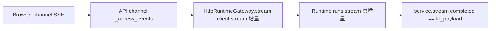

# SSE 真流式与契约统一模块需求与设计简报

> **文档编号**: MOD-SSE-CONTRACT-v0.1
> **文档版本**: v0.1
> **创建日期**: 2026-09-07
> **文档状态**: 草稿

**评审边界说明**:
- **需求评审**: 第 2 章（需求分析）→ 通过后锁定需求基线
- **设计评审**: 第 3 章（技术设计）→ 通过后锁定设计基线

**ID 体系**: FEAT（功能）、NFR（非功能指标）
场景编号：S-（正常）、E-（异常）、B-（边界）

**适用场景**: Bug修复 | 小型重构

---

## 目录

- [1. 文档控制](#1-文档控制)
- [2. 需求分析](#2-需求分析)
  - [2.1 需求概述](#21-需求概述)
  - [2.2 功能方案](#22-功能方案)
  - [2.3 范围与边界](#23-范围与边界)
  - [2.4 验收条件](#24-验收条件)
- [3. 技术设计](#3-技术设计)
  - [3.1 技术选型](#31-技术选型)
  - [3.2 架构设计](#32-架构设计)
  - [3.3 接口设计](#33-接口设计)
  - [3.4 性能与容量考量](#34-性能与容量考量)
- [4. 风险与依赖](#4-风险与依赖)
- [Spec Compliance Matrix](#spec-compliance-matrix)
- [附录：术语表](#附录术语表)

---

## 1. 文档控制

### 1.1 责任人

| 角色 | 姓名 | 职责范围 |
|------|------|---------|
| 开发负责人 | 待定 | 技术方案、代码实现 |
| 测试负责人 | 待定 | 测试策略、质量保证 |

### 1.2 修订历史

| 版本 | 日期 | 作者 | 变更描述 |
|------|------|------|---------|
| v0.1 | 2026-09-07 | cf-task-align | 初始草稿（Codex review 四问题 + 双 agent 深挖） |

---

## 2. 需求分析

### 2.1 需求概述

| 项目 | 内容 |
|------|------|
| **模块名称** | sse-streaming-contracts |
| **需求类型** | Bug修复 / 重构 |
| **业务背景** | Codex review 最新代码发现 4 问题并经双 agent 深挖证实：① API→Runtime 名义 SSE 实为缓冲式伪流式；② 流式 completed 结算手拼 dict 丢 `model_provider_id`；③ 网关丢上游错误码；④ "三镜像"表述与单制品+role 实际模型矛盾 |
| **核心目标** | 真流式端到端 + completed/error 契约统一 + 单制品表达一致 |

---

### 2.2 功能方案

#### 2.2.1 功能清单

| 功能ID | 功能名称 | 功能描述 | 优先级 | 来源 |
|--------|---------|---------|--------|------|
| FEAT-01 | 网关真流式 | `HttpRuntimeGateway.stream` 改 `client.stream` 增量转发；非 200 先读 body 转错误；服务端 SSE 加防缓冲头 | P0 | 需求描述 |
| FEAT-02 | completed 统一 | 流式 B 分支改组 `RunRuntimeResult` 走 `to_payload()`；provider 取自 `model.completed` 上下文事件 | P1 | 需求描述 |
| FEAT-03 | 错误透传不断链 | `RuntimeApplicationError` 新增上游字段；网关回填；channel 加 slug 保留分支 | P1 | 需求描述 |
| FEAT-04 | 单制品表达一致 | Dockerfile 合回单 final；workflow 单构建单推送；compose/注释去"三镜像"表述 | P2 | 需求描述 |

#### 2.2.2 字段约束

**FEAT-03 错误字段约束**

| 字段名 | 字段类型 | 必填 | 约束 | 说明 |
|--------|---------|------|------|------|
| upstream_code | int \| None | 否 | 默认 None，纯新增 | 上游信封整数码（如 40001） |
| upstream_error | str \| None | 否 | 默认 None，纯新增 | 上游 slug（如 agent_not_found） |

---

### 2.3 范围与边界

| 类别 | 内容 |
|------|------|
| **范围（In Scope）** | FEAT-01~FEAT-04；回归现有 gateway/channel/streaming 测试 |
| **非范围（Out of Scope）** | idle 心跳检测（runtime 无心跳，需服务端配合，另起任务）；channel completed 6 字段产品契约（既有 `ChannelResult`，不动）；断线重连 |
| **有意妥协 / 技术债** | ① B 分支 `tool_results` 仍为 `[]`（该分支仅当 `model_tools==[]` 进入，恒空是语义正确，非丢失，注释写明）。② benchmark 基线仍沿用旧值（本机 OOM 不可比，待空闲机器重跑）。 |

---

### 2.4 验收条件

#### 2.4.1 功能验收场景

**正常场景**

| 场景ID | 功能ID | 优先级 | 测试层级 | 关键真实边界 | 操作步骤 | 预期结果 |
|--------|--------|--------|---------|-------------|---------|---------|
| S-01 | FEAT-01 | P0 | integration | 真实 httpx（含 MockTransport 增量下发） | MockTransport 分两块延迟下发 token；计时首事件到达 | 首事件到达早于全收（真增量），两事件都收到 |
| S-02 | FEAT-02 | P1 | integration | 真实 service.stream + run | 同请求分别走 stream/recording-stream 与 run，取 completed | 10 字段全等（含真实 model_provider_id） |
| S-03 | FEAT-03 | P1 | integration | 真实 httpx MockTransport | 上游 40001+slug → 网关 | 网关 error 含 upstream_code=40001 与 slug，message 可读 |
| S-04 | FEAT-04 | P2 | manual | GitHub Actions 环境 | workflow 文件评审 + helm template 渲染 | 单构建、单推送、三部署同镜像；文档无"三镜像"表述（manual 原因：需 CI 环境验证构建） |

**异常场景**

| 场景ID | 功能ID | 测试层级 | 关键真实边界 | 触发条件 | 系统行为 |
|--------|--------|---------|-------------|---------|---------|
| E-01 | FEAT-01 | integration | 真实 httpx MockTransport | 建连前 503 | 抛 RuntimeApplicationError，不产任何事件 |
| E-02 | FEAT-01 | integration | 真实 httpx MockTransport | 建连后非 200 + 错误 body | 先读 body 转错误抛出，不进入事件流 |
| E-03 | FEAT-03 | integration | 真实 service.stream | 流中途 error 帧 | channel 透传且保留 slug，不变裸 INTERNAL_ERROR |

**边界场景**

| 场景ID | 功能ID | 测试层级 | 关键真实边界 | 触发条件 | 系统行为 |
|--------|--------|---------|-------------|---------|---------|
| B-01 | FEAT-01 | integration | 真实 httpx（外借 client） | 外借 AsyncClient + stream 提前中断 | response 正常 aclose，外借 client 不被关闭 |

#### 2.4.2 非功能指标

| 指标ID | 指标名称 | 目标值 | 测量方法 |
|--------|---------|-------|---------|
| NFR-PERF-01 | 流式首 token 到达延迟 | 待定（真机实测） | MockTransport 增量用例计时 + 生产实测 |

---

## 3. 技术设计

### 3.1 技术选型

| 类别 | 选型 | 版本 | 选型理由 |
|------|------|------|---------|
| HTTP | httpx `client.stream` | 0.28.1（已锁） | 仓内已有用法（model_provider.py:124），无需新依赖 |
| 契约 | 复用 `RunRuntimeResult.to_payload()` | 现状 | 消灭手拼分支，单事实源 |
| 构建 | 单 final 镜像 + 单构建单推送 | 现状工具链 | Helm 已是单镜像三部署，workflow 向它对齐 |

---

### 3.2 架构设计

| 层级 | 改动 |
|------|------|
| Gateway | `stream()` 改 `async with client.stream("POST",...)`；200 先判状态码（非 200 读 body→`_error_from_envelope` 抛）；200 则 `aiter_text` 复用 `_iter_sse` 增量 yield；外借 client 只关 response 不关 client；超时保持 connect/pool/write + stream read 300s |
| Runtime 服务端 | `runs:stream` 与 channel `:stream` 的 `StreamingResponse` 加 `Cache-Control: no-cache` + `X-Accel-Buffering: no`（防代理缓冲；本地无代理也无害） |
| Runtime stream | B 分支用 `_run_result`-等价构造 `RunRuntimeResult`（provider 取 `model.completed` 事件，无事件则 None 并注释）；A/C 分支不动 |
| 错误 | `RuntimeApplicationError` 加 `upstream_code/upstream_error`（默认 None）；`_error_from_envelope` 回填；channel `_access_events` 加 `except RuntimeApplicationError` 分支（code 保持 channel 码，data 加 `error` slug）；`_iter_sse` error 事件透传不动 |
| 构建 | Dockerfile 删三 target 回单 final（去 ENV）；workflow 删矩阵改单构建（tags 照旧三名？否——单镜像单名 `fluxion`，tag sha+latest）；compose 去 `target` 行并显式 `FLUXION_ROLE: api`；workflow/Dockerfile 注释改"单制品" |

---

### 3.3 接口设计

> SSE 行为与错误信封变更（无新 endpoint，形态 A 精简版）。

| 接口 | 变更 | 说明 |
|------|------|------|
| `POST /internal/.../runs:stream` | 响应头新增 `Cache-Control: no-cache`、`X-Accel-Buffering: no`；事件序列不变 | 首字节即达，中转不再攒包 |
| `POST /api/v1/channels/web/...:stream` | 同上加头；`completed` data 与非流式 10 字段对齐（channel 外层 6 字段包装不动） | 浏览器侧结算可信 |
| error 帧/信封 | 网关抛出的 error 带 `upstream_code/upstream_error`；SSE `error` 事件透传上游 `{code, error}` 不变 | 调用方可分支上游码 |

---

### 3.4 性能与容量考量

| 热点路径 | 预估负载 | 潜在瓶颈 | 应对策略 | 目标值 |
|---------|---------|---------|---------|--------|
| SSE 首字节 | dev 联调量级，无实测 | 网关缓冲（本次根除） | `client.stream` 增量 + 防代理头 | 首 token 到达≈上游产出（待定，真机实测） |

> 性能依据：增量转发把首字节延迟从 O(全程) 降到 O(首 token)；放弃的方案是保持 `post`+调大缓冲（治标）。`_iter_sse` 逐块解析复杂度不变。

---

## 4. 风险与依赖

### 4.1 项目依赖

| 依赖模块 | 依赖内容 | 风险等级 |
|---------|---------|---------|
| httpx 0.28.1 | `client.stream` + 外借 client 生命周期 | 低（仓内已有用法） |
| GHCR | 单镜像推送命名 | 低（沿用已验证的 owner 小写逻辑） |

### 4.2 风险识别

| 风险ID | 描述 | 影响 | 应对措施 | 验证场景 |
|--------|------|------|---------|---------|
| RISK-01 | `client.stream` 下 MockTransport/ASGITransport 行为与真实网络差异 | 测试通过但生产仍缓冲 | S-01 用延迟分块 Mock 断言增量；防代理头双保险 | S-01 |
| RISK-02 | 外借 client 时 response 未 aclose 致连接泄漏 | 连接池耗尽 | `async with` 包 stream 块，B-01 显式断言外借 client 存活且 response 已关 | B-01 |
| RISK-03 | 单镜像改动影响 Helm/compose 拉取（tag 名变化） | 部署拉不到镜像 | workflow 保留 sha+latest 双 tag；values 默认 tag 不变，本次不改 Helm 值 | S-04 |
| RISK-04 | channel 6 字段包装继续丢字段（产品契约） | 流式结算在 channel 层仍不全 | Out of Scope，已在 §2.3 声明；浏览器只消费 6 字段 | N/A（产品契约， breakout 任务） |

---

## Spec Compliance Matrix

| Spec/Rule | enforcement | 设计影响 | 设计落点 | 验证场景 | 状态/N/A 理由 |
|-----------|-------------|---------|---------|---------|----------------|
| `fluxion-runtime-core`#RULE-fluxion-runtime-001 | required | stream/run 同 Snapshot 结算一致 | §3.2 Runtime stream 行 | S-02 + verifier | applied |
| `fluxion-console-api-contract`#RULE-fluxion-console-api-001 | required | 错误码不断链，统一封装透传 | §3.2 错误行 / §3.3 | S-03 + E-03 + verifier | applied |
| `fluxion-console-channel`#RULE-fluxion-console-001 | required | Web Chat SSE 边界与鉴权不变，只修转发语义 | §3.2 Gateway/Channel 行 | S-01 + E-03 | applied |
| `backend-code-quality-performance`#RULE-backend-quality-001 | required | 超时语义保持，不吞异常，外借资源释放 | §3.2 Gateway 行 | E-01 + E-02 + B-01 | applied |
| `fluxion-dfx`#RULE-fluxion-dfx-001 | required | 全场景自动化证据 | §2.4 | S-01 ~ S-04 + E-01 ~ E-03 + B-01 | applied |

---

## 附录：术语表

| 术语 | 定义 |
|------|------|
| SSE | Server-Sent Events，服务端推事件流 |
| 首字节 | 流式首个 token/event 到达客户端的时间 |
| 单制品 | 同一份镜像内容部署多角色（role 由环境决定） |

---

*文档结束*
