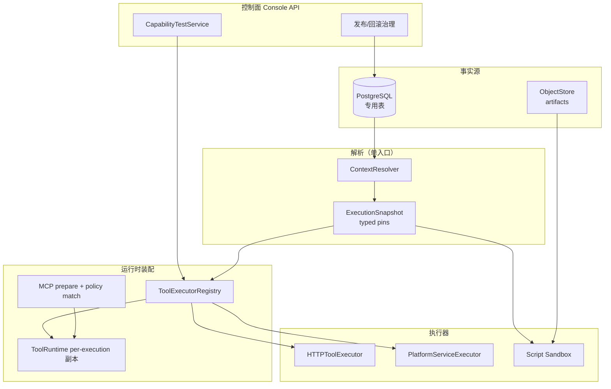
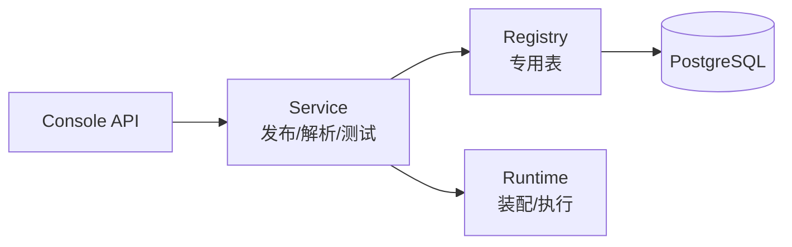
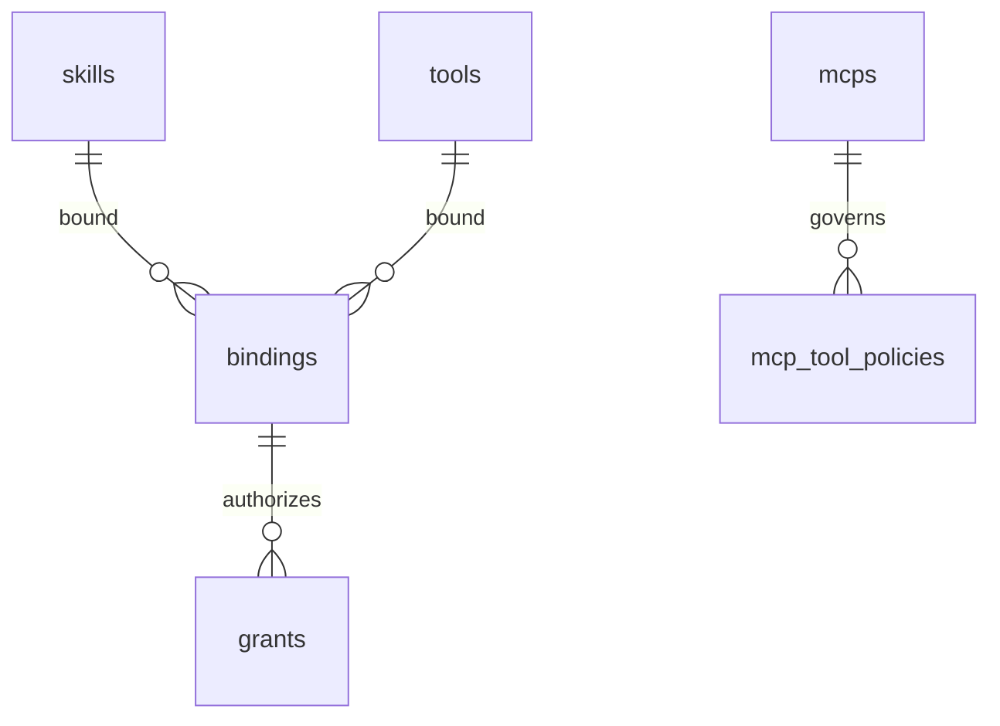
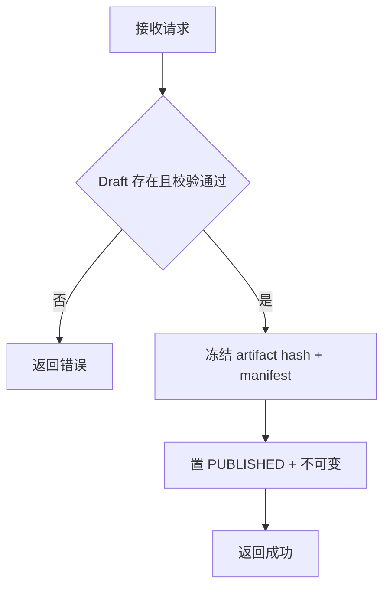

# 能力体系优化补救·后端设计

> **文档编号**: MOD-CAP-REM-v0.1
> **文档版本**: v0.1（草稿）
> **创建日期**: 2026-09-09
> **文档状态**: 草稿
> **来源**: `/Users/jahan/Downloads/fluxion-capability-optimization-design-v4-complete.md`（V4）+ 评审结论（3 P0 / 3 P1 / 3 P2）
> **需求目录**: `.code-flow/tasks/2026-09-09/capability-remediation/`

**评审边界说明**:
- **需求评审**: 第 2 章 → 通过后锁定需求基线 v1.0
- **设计评审**: 第 3-4 章 → 通过后锁定设计基线 v1.x
- **交接契约**: 2.5 验收条件 — 需求定义 What，设计实现 How

**ID 体系**: US / FEAT / API / RULE / TC / RISK / NFR；场景 S-（正常）/ E-（异常）/ B-（边界）

---

## 1. 文档控制

### 1.1 责任人

| 角色 | 姓名 | 职责范围 |
|------|------|---------|
| 产品经理 | | 需求定义、业务验收 |
| 开发负责人 | | 技术方案、代码实现 |
| 测试负责人 | | 测试策略、质量保证 |

### 1.2 修订历史

| 版本 | 日期 | 作者 | 变更描述 |
|------|------|------|---------|
| v0.1 | 2026-09-09 | | 初始草稿：V4 评审问题修复版 |

---

## 2. 需求分析

### 2.1 需求概述

| 项目 | 内容 |
|------|------|
| **模块名称** | 能力体系优化补救（Skill / Tool / MCP 后端） |
| **模块ID** | MOD-CAP-REM |
| **所属系统/产品线** | Fluxion Harness |
| **需求类型** | 功能优化 + 技术重构 |
| **业务背景** | V4 设计评审发现 3 个 P0 基线冲突（租户策略缺失、凭证归属错位、存量原地替换）及 P1/P2 问题；本次在 V4 方向（Package 统一、Published-only、测试即运行、删 stdio）不变的前提下修正后重新细化到可实施粒度 |
| **核心目标** | 三类能力统一走 Published → Binding → Authorization → Snapshot → Runtime，且每一环都满足基线（TenantPolicy 三重交集、凭证用户归属、Published 不可变） |

### 2.2 痛点与价值

| 维度 | 内容 |
|------|------|
| **目标用户** | 平台管理员（发布治理）、租户管理员（授权策略）、Agent 开发者（能力接入）、最终用户（隔离执行） |
| **当前问题** | Skill 只有 instructions 文本无 Package 模型；MCP 保留 stdio 扩大攻击面；Registry Tool 动态装配链未收口（Console 可建可测、Runtime 无 Executor）；`deny_only` 租户模式削弱 fail-closed；凭证模型在 Definition/Binding 两处摇摆 |
| **业务影响** | 新能力从"可创建"到"可安全执行"链路断裂；租户隔离靠自律而非机制 |
| **预期价值** | 创建→发布→绑定→授权→执行→审计全链路闭环；三重交集机制化；零兼容包袱（无真数据，直接删旧） |

**用户故事**

| 编号 | 用户故事 | 优先级 |
|------|---------|--------|
| US-01 | 作为平台管理员，我希望 Skill/MCP/Tool 统一发布链，以便一个入口治理三类能力 | P0 |
| US-02 | 作为租户管理员，我希望租户策略默认拒绝未授权能力，以便租户内默认安全 | P0 |
| US-03 | 作为 Agent 开发者，我希望 Console 测试调用与 Runtime 用同一 Executor，以便测过即能跑 | P0 |
| US-04 | 作为最终用户，我希望我的凭证只属于我，以便不同用户用同一 Agent 互不串权 | P0 |
| US-05 | 作为平台管理员，我希望 MCP 只有 streamable-http，以便关闭本地进程攻击面 | P1 |
| US-06 | 作为企业集成方，我希望 Platform Service 成为一等 Tool，以便微服务可被 Agent 调用 | P1 |

### 2.3 功能方案

#### 2.3.1 功能清单

| 功能ID | 功能名称 | 功能描述 | 优先级 | 来源 |
|--------|---------|---------|--------|------|
| FEAT-01 | 租户策略维度补齐 + 删除 deny_only | EffectiveCapability 增加 TenantPolicy 为第三交集；删除 `deny_only` 模式，仅保留 unconfigured fail-closed + allow_list；已配 deny_only 的租户迁移为显式 allow_list | P0 | 评审 P0-1 |
| FEAT-02 | 凭证归属收口 | `credential_ref` 只允许出现在 User Binding；Definition 仅声明凭证槽位（名称+用途）；删除 MCP `headers` 字段；认证注入沿用 `credential_env` / `credential_header` 机制 | P0 | 评审 P0-2 / P1-1 |
| FEAT-03 | Snapshot 对齐 ADR-A003 amend | Snapshot 条目按 amend typed pins（model/provider/credential versions）；MCP 条目含 `approved_tool_policies` + `schema_hash`；Resolver 保持单入口（子分解仅内部实现） | P0 | 评审 P0-3 / P1-3 |
| FEAT-04 | Tool Runtime Golden Path（HTTP） | ToolDefinition → descriptor → ToolExecutorRegistry → ToolRuntime.register；`HTTPToolExecutor`（超时/重试/credential 解析/schema 校验/错误归一）；`CapabilityTestService` 与正式执行共用同一 Executor | P0 | V4 §39-40/§42 |
| FEAT-05 | MCP 收口 | 删除 stdio/command/args/cwd/env/transport selector；仅 streamable-http；discovery + policy match（未分类 deny、allowed_tools 为空 deny all、schema 漂移重审） | P1 | V4 §24-31 |
| FEAT-06 | Platform Service Registry + Executor | 新建 Platform Service 注册表契约（service_name/operation 目录）+ `PlatformServiceExecutor`（服务发现/超时/重试/映射）；`connection_test` 支持 platform_service | P1 | 评审 P1-2 |
| FEAT-07 | Skill Package | manifest.yaml + SKILL.md + knowledge/scripts/templates/assets；parser/validator/zip 安全；复用 `ArtifactStoreProvider` + `SandboxBackend` 现货；Script Contract `stdin JSON → stdout JSON` | P1 | V4 §5-19 |
| FEAT-08 | 存量清理 | 无真数据：直接删除旧分支代码与假数据（instructions Editor 路径、text-only/Quick/Legacy runtime 分支、stdio 相关）；不做数据迁移、不留 fallback | P1 | 用户决策 |
| FEAT-09 | 统一发布状态机 | DRAFT / PUBLISHED / DEPRECATED；Draft 可编辑可删；Published 不可改、只可 deprecate；Draft 不可执行（解析层硬拒绝） | P0 | V4 §44-45 |
| FEAT-10 | 审计追踪指标 | 能力发布/绑定/授权/执行进 AuditLog；Tool/MCP 调用进 Trace；命令式指标；Secret 脱敏（沿用 channel 审计模式） | P1 | V4 §60-62 |

### 2.4 范围与边界

| 类别 | 内容 |
|------|------|
| **范围（In Scope）** | FEAT-01~10；Console 后端 API（§3.4）；专用表 + 迁移脚本；Contract Test 重写（ADR-A007） |
| **非范围（Out of Scope）** | Skill 调用链 DSL（由 Workflow 承担，V4 §80.1）；MCP Hosting/Runner；Package 在线编辑；语义索引（可选）；第二套运行时兼容逻辑 |
| **前置假设** | 无真数据（用户确认：存量均为假数据）；`ArtifactStoreProvider` / `SandboxBackend` 现货可复用；ADR-A003 amend 已合入 |
| **有意妥协 / 技术债** | 专用表方案重写 Contract Test（一次性成本）；Platform Service registry 首版仅支持 K8s Service DNS + 静态注册，不做应用层 DNS RR（V4 §41）；deny_only 删除后宽松租户需手工补 allow_list |

### 2.5 验收条件

#### 2.5.1 业务规则与约束

| ID | 类型 | 描述 | 验证场景 |
|----|------|------|---------|
| RULE-CAP-01 | 业务规则 | 有效权限 = UserGrant ∩ AgentAllowlist ∩ TenantPolicy，任一缺失 fail-closed；无 tenant policy 配置时 tenant 维为空集 | S-01, E-01 |
| RULE-CAP-02 | 业务规则 | `credential_ref` 只允许在 User Binding；Definition 出现则发布校验失败 | E-02 |
| RULE-CAP-03 | 业务规则 | Published 版本不可变；Draft 不进快照（解析层排除，承载型 pin 无回退时拒绝；显式调用落空拒绝） | S-02, E-03 |
| RULE-CAP-04 | 业务规则 | MCP 未分类 Tool = deny；allowed_tools 为空 = deny all；未知 RiskLevel 不可发布 | E-04, B-01 |
| RULE-CAP-05 | 业务规则 | 单 Resolver 入口；执行链不得拼第二套授权逻辑 | S-01 |
| RULE-CAP-06 | 系统约束 | Console 测试调用与 Runtime 使用同一 Executor 实例路径 | S-03 |
| RULE-CAP-07 | 系统约束 | Secret 明文不得进入 Spec / Trace / Prompt / Audit payload | E-05 |

#### 2.5.2 功能验收场景

**正常场景**

| 场景ID | 功能ID | 优先级 | 测试层级 | 关键真实边界 | 前置条件 | 操作步骤 | 预期结果 |
|--------|--------|--------|---------|-------------|---------|---------|---------|
| S-01 | FEAT-01 | P0 | integration | ContextResolver → PG 真库 → Snapshot digest | 租户配 allow_list；用户有 grant；Agent 有 allowlist | 执行一次 Tool 调用 | 三重交集生效，digest 含三维 exact version |
| S-02 | FEAT-09 | P0 | integration | Registry PG 真库 | Draft 已发布为 Published | 用 Published 版本执行 | 执行成功；digest 可追溯 exact version |
| S-03 | FEAT-04 | P0 | E2E | Console Test API → 同一 Executor → HTTP stub 服务 | HTTP Tool 已发布绑定授权 | Console 点测试调用，再经 Chat 真实调用 | 两次走同一 executor 路径，结果一致 |
| S-04 | FEAT-05 | P1 | integration | 真 MCP Server（streamable-http） | MCP 已发布，Tool 已分类 | Agent 调用 MCP Tool | policy match 后执行成功 |
| S-05 | FEAT-06 | P1 | integration | Service registry + 被调服务 | platform_service Tool 已发布 | Agent 调用 | 服务发现→调用成功，超时/重试生效 |
| S-06 | FEAT-07 | P1 | E2E | ZIP 上传 → 解析 → 发布 → Chat 生效 | Package 合法 | 上传→发布→绑定→授权→Chat | instructions + knowledge 生效 |

**异常场景**

| 场景ID | 功能ID | 测试层级 | 关键真实边界 | 触发条件 | 系统行为 | 用户感知 |
|--------|--------|---------|-------------|---------|---------|---------|
| E-01 | FEAT-01 | integration | ContextResolver → PG | 租户无 policy 配置 | tenant 维为空集，调用拒绝 | 明确的无授权错误 |
| E-02 | FEAT-02 | integration | 发布校验 | Definition 含 credential_ref 或敏感头 | publish 失败 | 字段级错误说明 |
| E-03 | FEAT-09 | integration | Resolver | pin 到 Draft 版本 | 解析成功但草稿不进快照（承载型 Profile pin 无回退则拒绝） | Draft 不可执行错误 |
| E-04 | FEAT-05 | integration | MCP prepare | 未分类 Tool / allowed_tools 为空 | deny，不注册 | Tool 不可见 |
| E-05 | FEAT-10 | integration | AuditLog PG 真查 | 含 Secret 的调用 | audit 无明文 | 脱敏字段验证 |

**边界场景**

| 场景ID | 测试层级 | 关键真实边界 | 字段/条件 | 边界值 | 预期行为 |
|--------|---------|-------------|----------|--------|---------|
| B-01 | unit | 校验函数 | RiskLevel | 未知值 | publish failed |
| B-02 | integration | MCP prepare | Server Tool Schema 变更 | hash 不一致 | 重新审核（不可执行到重审通过） |

#### 2.5.3 非功能指标

**性能指标**

| 指标ID | 指标名称 | 目标值 | 测量方法 |
|--------|---------|-------|---------|
| NFR-PERF-01 | Resource Resolver L1 命中 | P95 ≤ 5ms | 基线压测（AGENTS.md） |
| NFR-PERF-02 | ExecutionSnapshot 构建 | P95 ≤ 20ms | 基线压测 |
| NFR-PERF-03 | Publish API | P95 ≤ 500ms | 基线压测 |

**安全性要求**

| 指标ID | 安全域 | 验收标准 |
|--------|--------|---------|
| NFR-SEC-01 | SSRF | HTTP Tool/MCP 出站满足 allowlist、禁 metadata/loopback、redirect 限制（V4 §58） |
| NFR-SEC-02 | Package 安全 | Zip Slip/Bomb、symlink、path traversal、hash 校验全覆盖（V4 §59 + §71 用例） |
| NFR-SEC-03 |  Secret | RULE-CAP-07 |

---

## 3. 技术设计

### 3.1 方案选型

#### 备选方案对比

| 对比维度 | 权重 | 专用表（采用） | 得分 | 通用表+JSON（否决） | 得分 |
|---------|------|---------------|------|-------------------|------|
| 治理查询（policy/引用统计） | 30% | 结构化字段可索引 | 8 | JSON 内查询，无索引 | 4 |
| Contract Test 改造成本 | 25% | 需重写（一次性） | 4 | 零成本 | 9 |
| 与 V4 §63 一致性 | 20% | 完全一致 | 9 | 需改设计 | 4 |
| 长期维护 | 15% | 模型清晰 | 8 | spec_json 膨胀 | 5 |
| 风险评估 | 10% | 迁移风险（无真数据≈0） | 8 | 几乎无风险 | 9 |
| **最终得分** | **100%** | | **7.15** | | **5.85** |

> 无真数据是决定性因素：专用表的最大成本（数据迁移）在本次 ≈ 0，故选专用表。

#### 关键决策记录

| 决策点 | 选择 | 被否决项 | 理由 | 可逆性 |
|--------|------|---------|------|--------|
| deny_only | 删除，仅 allow_list + unconfigured fail-closed | 保留受限 | fail-closed 机制化；用户决策 | 难（需数据回填） |
| 凭证归属 | Binding 持有，Definition 仅声明槽位 | Definition 持有 | REQ-CAP-004 / REQ-AGT-002；代码现状已如此 | 难 |
| MCP headers | 删除字段 | 保留受限 | 最优解且无兼容包袱；认证走 Binding 注入 | 易 |
| stdio | 彻底删除 | 保留过渡 | 攻击面；用户确认无兼容要求 | 难 |
| 存量 | 直接删除假数据+旧分支 | 新版本迁移 | 用户确认无真数据 | 不可逆（故需用户已确认） |
| Snapshot | 对齐 ADR-A003 amend typed pins | V4 §48 原样 | 基线 amend 已合入，digest 不断裂 | 中 |
| Resolver | 单入口 + 内部子分解 | 三独立 Resolver | REQ-CAP-006 | 易 |

#### 技术栈

| 类别 | 选型 | 版本 | 选型理由 |
|------|------|------|---------|
| 语言 | Python | 3.12+ | 现状 |
| 存储 | PostgreSQL（单库，ADR-A007） | 现状 | 事实源 |
| MCP 协议 | streamable-http（官方 SDK） | 现状 `mcp.py` | 唯一 transport |
| 沙箱 | 复用 `SandboxBackend`（bubblewrap/dev） | 现状 | 不重复造 |
| Artifact | 复用 `ArtifactStoreProvider` | 现状 | 不重复造 |

### 3.2 架构设计

#### 技术分层

#### 外部依赖清单

| 外部系统 | 依赖类型 | 协议 | 超时 | 降级策略 |
|---------|---------|------|------|---------|
| 被调 HTTP 服务 | 出站调用 | HTTPS | 必填 timeout_ms | 错误归一 + failure_policy |
| MCP Server | 能力服务器 | streamable-http | connect_timeout 必填 | 连接失败则该 MCP 能力不可用 |
| 平台微服务 | 服务发现 | K8s DNS / 静态注册 | 必填 timeout | fail-closed |
| ObjectStore | artifact 存储 | 内部 SPI | 复用现状 | 发布失败 |

### 3.3 数据设计

> 结论：新建专用表；删除旧字段；无真数据故迁移 = 建表 + 删旧代码/假数据（§4.4）。

**新增表 `skills`**

| 字段名 | 类型 | 可空 | 默认值 | 索引 | 说明 |
|--------|------|------|--------|------|------|
| skill_id | TEXT | N | — | PK | 资源 ID |
| tenant_id | TEXT | N | — | IDX(tenant) | 租户隔离 |
| name | TEXT | N | — | | 展示名 |
| description | TEXT | Y | '' | | 说明 |
| version | INT | N | 1 | UQ(tenant,skill,ver) | 不可变版本 |
| status | TEXT | N | DRAFT | IDX | DRAFT/PUBLISHED/DEPRECATED |
| artifact_uri | TEXT | Y | NULL | | Package 位置 |
| artifact_hash | TEXT | Y | NULL | | 不可变校验 |
| manifest_json | JSONB | Y | NULL | | manifest 原文 |
| knowledge_manifest_json | JSONB | Y | NULL | | knowledge 清单 |
| created_at / updated_at / published_at | TIMESTAMPTZ | N/Y | now/NULL | | 时间线 |

**新增表 `tools`**：tool_id / tenant_id / name / description / kind（http_api/platform_service）/ version / status / spec_json / governance_json / spec_hash + 同上索引/时间线。

**新增表 `mcps`**：mcp_id / tenant_id / name / description / url / version / status / spec_json / spec_hash + 同上。**无** transport/command/args/env/cwd/headers/credential_env/credential_header/credential_ref 列（全部删除）。

**新增表 `mcp_tool_policies`**：tenant_id / mcp_id / mcp_version / tool_name / schema_hash / operation / side_effect / risk_level / idempotency_json / approval_policy_json / enabled + UQ(tenant,mcp,ver,tool)。

**删除清单**：Skill `instructions` Editor 路径与 text-only/Quick/Legacy 分支；MCP stdio 全套字段与 `StdioServerParameters` / 前端 selector / 测试代码；`headers` 字段；`deny_only` 模式分支（`tool_authorization.py:18-23` + `context_resolver.py:403`）。

**索引设计**

| 索引名 | 类型 | 字段 | 使用场景 |
|--------|------|------|---------|
| idx_skills_tenant | BTREE | tenant_id | 租户列表 |
| uq_skills_ver | UNIQUE | tenant_id, skill_id, version | exact version 召回 |
| idx_tools_tenant | BTREE | tenant_id | 租户列表 |
| uq_tools_ver | UNIQUE | tenant_id, tool_id, version | exact version 召回 |
| idx_mcps_tenant | BTREE | tenant_id | 租户列表 |
| uq_mcp_policy | UNIQUE | tenant_id, mcp_id, mcp_version, tool_name | policy match |

**ER图**

### 3.4 接口设计

> 形态 A：HTTP API。响应统一信封 `{code, message, data, request_id}`（AGENTS.md #22）。

#### 接口清单

| 接口ID | 名称 | 方法 | 路径 | 详细 |
|--------|------|------|------|------|
| API-01 | 上传 Skill Package | POST | `/api/v1/skills/packages` | multipart zip |
| API-02 | Skill 版本发布 | POST | `/api/v1/skills/{id}/versions/{v}:publish` | ↓ |
| API-03 | 创建 Tool | POST | `/api/v1/tools` | ↓ |
| API-04 | 测试调用 Tool | POST | `/api/v1/tools/{id}/versions/{v}:test` | 共用 Executor |
| API-05 | Tool 版本发布 | POST | `/api/v1/tools/{id}/versions/{v}:publish` | ↓ |
| API-06 | 创建 MCP | POST | `/api/v1/mcps` | 无 transport 字段 |
| API-07 | MCP discover | POST | `/api/v1/mcps/{id}/versions/{v}:discover` | ↓ |
| API-08 | 配置 Tool Policy | PUT | `/api/v1/mcps/{id}/versions/{v}/tool-policies` | ↓ |
| API-09 | MCP 版本发布 | POST | `/api/v1/mcps/{id}/versions/{v}:publish` | 未分类存在则失败 |

#### API-02: Skill 版本发布

**请求**：路径参数 id/version，无 Body。

**响应**：`data: {skill_id, version, status: "PUBLISHED", artifact_hash}`。

**错误码**

| 错误码 | 信息 | 场景 | HTTP状态码 |
|--------|------|------|----------|
| 40001 | manifest 缺失/非法 | 校验失败 | 400 |
| 40002 | Definition 含 credential_ref | 凭证归属违规 | 400 |
| 40901 | 版本已发布 | 重复发布 | 409 |

**处理逻辑**

### 3.5 质量实现方案

#### 性能设计

| 指标ID | 热点路径 | 目标值 | 实现方案（含被放弃的较慢方案） |
|--------|---------|-------|------------------------------|
| NFR-PERF-01 | Resolver 有效能力计算 | P95 ≤ 5ms（L1 命中） | TenantResourceCache 按 tenant 缓存 Published 清单；放弃每次全量查表 |
| NFR-PERF-02 | Snapshot 构建 | P95 ≤ 20ms | 单次 scope 内批量读 Registry（现状 context_resolver scope 模式），不逐项查询 |

#### 可靠性设计

| 风险ID | 失效模式 | 影响 | 应对措施 | 验证场景 |
|--------|---------|------|---------|---------|
| RISK-01 | MCP Server 不可达 | 该 MCP 能力不可用 | 连接超时 + 该执行内降级（不影响其他能力） | E-04 |
| RISK-02 | MCP Tool Schema 漂移 | 策略与实际不符 | schema_hash 比对，不一致则重审前拒绝 | B-02 |
| RISK-03 | 专用表迁移漏 Contract Test | ADR-A007 破裂 | 迁移脚本 + 全量 Contract Test 重跑 | S-01 |

#### 安全性设计

| 指标ID | 验收标准 | 实现方案 |
|--------|---------|---------|
| NFR-SEC-01 | SSRF 防护 | URL strict 解析 + 内网 allowlist + 禁 metadata/loopback + redirect 限制 + DNS rebinding 防护（V4 §58） |
| NFR-SEC-02 | Package 安全 | Zip Slip/Bomb、symlink 拒绝、数量/大小限制、hash 校验、Script 静态检查（V4 §59） |
| NFR-SEC-03 | Secret 零明文 | 发布校验 + CredentialResolver + 脱敏（RULE-CAP-07） |

#### 可观测性设计

| 场景 | 实现方案 |
|------|---------|
| 审计 | publish/bind/grant/execute 进 AuditLog（沿用 channel 审计模式，request_id/trace_id 关联） |
| Trace | Tool/MCP 调用 span；skill_id 高基数只进 trace/audit 不进 metric label |
| 指标 | 执行计数/延迟/拒绝原因；request_id 全链路 |

---

## 4. 部署与运维

### 4.1 部署架构

| 环境 | 配置 | 实例数 | 用途 |
|------|------|--------|------|
| dev | 现状 | 1 | 联调（含 `init_db.py` 建表） |
| prod | 现状 | 3+ | 生产环境 |

### 4.2 发布与回滚

| 阶段 | 范围 | 进入条件 | 回滚条件 |
|------|------|---------|---------|
| 灰度 | 单租户试运行 | Contract Test 全绿 | 执行失败率异常 |
| 全量 | 全租户 | 灰度 24h 无 P0 | 同上 |

**回滚步骤**: 代码回滚 + 新表保留（无真数据，可直接删表重建）。

### 4.4 数据迁移

> 用户确认：无真数据。迁移 = 执行建表 migration + 删除旧分支代码与假数据（FEAT-08）。不做双写、不留 fallback。

| 阶段 | 操作 | 验证方法 |
|------|------|---------|
| 1 | 新建四表 migration | 查 Schema |
| 2 | 删除旧字段/分支/假数据 | grep 零残留 + 全量测试绿 |
| 3 | Contract Test 重跑（ADR-A007） | 单库套件全绿 |

---

## 5. 风险与依赖

### 5.1 项目依赖

| 依赖模块/团队 | 依赖内容 | 状态 | 风险等级 |
|-------------|---------|------|---------|
| Registry（PG 单库） | 新表 + Contract Test | 待实施 | 中 |
| SecretStore | Binding credential 解析 | 现货 | 低 |
| 平台微服务目录 | service registry 数据源 | 待确认 | 中 |

### 5.2 风险识别

| 风险ID | 类型 | 描述 | 概率 | 影响 | 应对措施 | 验证场景 |
|--------|------|------|------|------|---------|---------|
| RISK-04 | 兼容 | deny_only 删除影响宽松租户 | 中 | 中 | 迁移为显式 allow_list + 发布说明 | E-01 |
| RISK-05 | 范围 | Platform Service 无现货 registry | 高 | 中 | 首版 K8s DNS + 静态注册 | S-05 |

---

## 6. 需求追溯矩阵

| 用户故事 | 功能ID | 接口ID | 测试用例ID | 测试层级 | 状态 |
|---------|--------|--------|-----------|---------|------|
| US-01 | FEAT-09 | API-02/05/09 | S-02 | integration | 待实现 |
| US-02 | FEAT-01 | — | S-01, E-01 | integration | 待实现 |
| US-03 | FEAT-04 | API-04 | S-03 | E2E | 待实现 |
| US-04 | FEAT-02 | API-02 | E-02, E-05 | integration | 待实现 |
| US-05 | FEAT-05 | API-06/07/08/09 | S-04, E-04, B-01/02 | integration | 待实现 |
| US-06 | FEAT-06 | API-03/04 | S-05 | integration | 待实现 |
| 需求描述 | FEAT-07 | API-01/02 | S-06 | E2E | 待实现 |
| 需求描述 | FEAT-08 | — | 全量回归绿 | integration | 待实现 |
| 需求描述 | FEAT-10 | — | E-05 | integration | 待实现 |

> RULE 追溯：RULE-CAP-01→S-01/E-01；02→E-02；03→S-02/E-03；04→E-04/B-01；05→S-01；06→S-03；07→E-05。RISK-01→E-04；02→B-02；03→S-01。

---

## Spec Compliance Matrix

| Spec/Rule | enforcement | 设计影响 | 设计落点 | 验证场景 | 状态/N/A 理由 |
|-----------|-------------|---------|---------|---------|----------------|
| fluxion-resource-registry#RULE-fluxion-resource-001 | required | 版本语义、tenant scope、Published 不可变 | §2.5 RULE-CAP-03/09、§3.3 | S-02, E-03 | applied（Design Gate pass 2026-09-09） |
| fluxion-runtime-core#RULE-fluxion-runtime-001 | required | Snapshot 冻结、无状态执行 | §2.5 RULE-CAP-01、§3.2 | S-01 | applied（Design Gate pass 2026-09-09） |
| fluxion-workflow-capability#RULE-fluxion-workflow-001 | required | Skill/Workflow 边界（无 DSL） | §2.4 Out of Scope | S-06 | applied（Design Gate pass 2026-09-09） |
| fluxion-console-api-contract#RULE-fluxion-console-api-001 | required | 统一信封、request_id | §3.4 | S-03 | applied（Design Gate pass 2026-09-09） |
| backend-database#RULE-backend-database-001 | required | 专用表 + Contract Test | §3.3、§4.4 | S-01 | applied（Design Gate pass 2026-09-09） |
| backend-logging#RULE-backend-logging-001 | required | 审计脱敏 + trace 关联 | §3.5 可观测性 | E-05 | applied（Design Gate pass 2026-09-09） |
| fluxion-dfx#RULE-fluxion-dfx-001 | required | DFX 十二项（§3.5+§5） | §3.5、§5 | S-01~S-06 | applied（Design Gate pass 2026-09-09） |
| backend-platform-rules#RULE-backend-platform-001 | required | 超时/重试/熔断必填 | §3.2 外部依赖 | S-04, S-05 | applied（Design Gate pass 2026-09-09） |
| backend-directory-structure#RULE-backend-directory-001 | required | capabilities/ 包布局 | §3.2（沿用 V4 §67） | 编码阶段按布局验 | applied（Design Gate pass 2026-09-09） |
| backend-code-quality-performance#RULE-backend-quality-001 | required | 类型注解、函数长度 | §3.5 约束声明，编码阶段执行 | 编码阶段 | applied（Design Gate pass 2026-09-09，验证在编码阶段） |
| fluxion-console-channel#RULE-fluxion-console-001 | required | 同仓边界 | §3.2 | S-03 | applied（Design Gate pass 2026-09-09） |

---

## 附录：术语表

| 术语 | 定义 |
|------|------|
| Package | Skill Package（manifest + SKILL.md + knowledge/scripts/templates/assets） |
| deny_only | 已删除的租户策略模式（本文档仅作迁移说明） |
| SoT | Single Source of Truth，单一真相源 |

---

*文档结束*
