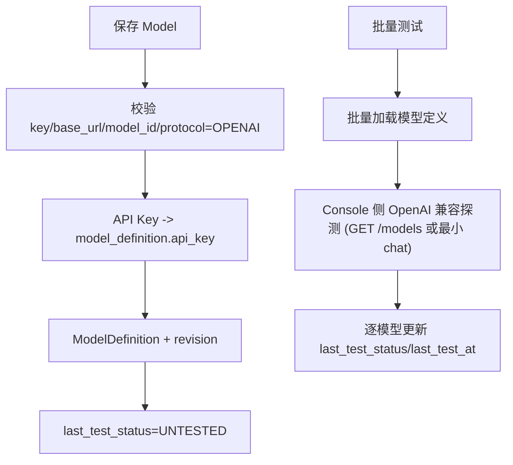
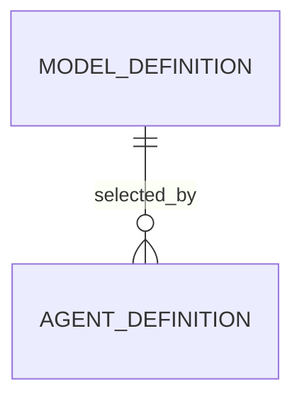

# 模型管理 模块需求与设计一体化文档

> **文档编号**: MOD-MODEL-V1.1  
> **文档版本**: v1.1  
> **创建日期**: 2026-09-17  
> **文档状态**: 设计评审中  
> **模板**: design-full.md

## 1. 文档控制

| 项目 | 内容 |
|---|---|
| 模块 | 模型管理 |
| Owner | muad-console-platform |
| 数据 Owner | control |
| 前置模块 | 01-platform-foundation |
| 建议代码位置 | apps/console-platform/backend/src/muad_console_platform/api/models.py、application/model_service.py、application/model_test_service.py、infrastructure/repositories/model_repository.py |

### 1.1 责任人

| 角色 | 姓名 | 职责范围 |
|------|------|---------|
| 产品经理 | 待定 | 需求定义、业务验收 |
| 开发负责人 | 待定 | 技术方案、代码实现 |
| 测试负责人 | 待定 | 测试策略、质量保证 |

### 1.2 修订历史

| 版本 | 日期 | 作者 | 变更说明 |
|------|------|------|---------|
| v1.0 | 2026-09-17 | fluxion-harness | 初始设计 |
| v1.1 | 2026-09-18 | fluxion-harness | 对齐 V1.4 决策（docs/17）：批量测试改为 Console 侧 OpenAI 兼容探测（不依赖 Runtime ModelGateway）、`protocol=OPENAI` 创建固定/编辑不可改、列表分页与筛选、删除冲突改 `COMMON_CONFLICT`（message_args）、补全 API 契约与场景矩阵 |
| v1.2 | 2026-09-20 | fluxion-harness | review 修正：§3.1 决策表的 Secret 行与全模块实际决策相反（改为如实描述明文 `api_key`）；删除冲突改用专用错误码 `MODEL_IN_USE`（`COMMON_CONFLICT` 无占位符，无法承载引用数）；Spec Matrix owner 由不存在的 `harness-platform` 更正为真实 spec id；§1 建议代码位置改正 |

## 2. 需求分析

### 2.1 需求概述

| 项目 | 内容 |
|---|---|
| 模块名称 | 模型管理 |
| 模块 ID | MOD-MODEL |
| 需求类型 | 中大型功能开发 |
| 业务背景 | 需要区分内部 key 与 OpenAI model_id，并彻底移除没有业务意义的默认模型概念。 |
| 核心目标 | 提供 OpenAI-compatible ModelDefinition CRUD（含 `api_key` 明文落库）、revision 和批量模型测试（连通/鉴权探测）。 |

### 2.2 痛点与价值

| 维度 | 内容 |
|---|---|
| 目标用户/调用方 | Builder / Admin / End User / 内部服务（按模块实际入口） |
| 当前问题 | 需要区分内部 key 与 OpenAI model_id，并彻底移除没有业务意义的默认模型概念。 |
| 业务影响 | 模块边界或契约不固定会导致上层重复设计、接口漂移和跨模块返工。 |
| 预期价值 | 提供 OpenAI-compatible ModelDefinition CRUD（含 `api_key` 明文落库）、revision 和批量模型测试。 |

### 2.3 功能方案

#### 2.3.1 功能清单

| 功能ID | 功能名称 | 功能描述 | 优先级 | 来源 |
|---|---|---|---|---|
| FEAT-01 | 模型 CRUD | key/name/protocol(OPENAI)/base_url/model_id/api_key/params/enabled/revision，含启停与删除。 | P0 | 需求描述 |
| FEAT-02 | 批量测试 | 选中多个模型做连通性/鉴权探测（Console 侧 OpenAI 兼容探测）并逐项返回结果。 | P0 | 需求描述 |

#### 2.3.2 字段约束

| 字段类别 | 约束 |
|---|---|
| ID | 业务实体统一 UUID；跨 Owner Schema 仅逻辑引用 UUID |
| 时间 | PostgreSQL 使用 `timestamptz`；Console 展示 `YYYY-MM-DD HH:mm:ss` |
| 删除 | 产品表统一 `is_deleted` 软删除；状态枚举不重复表达 DELETED |
| Secret | 模型凭据 `model_definition.api_key` 按产品决策明文落库；其他 Secret 只保存 SecretRef；Secret Value 不进入 Snapshot / 日志 / LLM / API 响应 |
| 枚举 | API 与 DB 统一使用稳定英文枚举值，中文/英文只在 UI/i18n 层映射 |
| 错误 | 业务代码只抛稳定 `code`；`msg/http_status` 由公共配置映射 |

### 2.4 范围与边界

| 类别 | 内容 |
|---|---|
| In Scope | 模型 CRUD（含启用/停用、删除）、`api_key` 明文存 `model_definition`（新增迁移列）、批量测试（Console 侧直连 `base_url` 的 OpenAI 兼容探测）、test status/revision、Agent 选择 enabled 模型。 |
| Out of Scope | 无 is_default/default_model；不支持多协议 Provider；不依赖 Runtime `ModelGateway` 做批量测试（禁止越层）；不做 LLM 推理/计费语义，不写 `model_invocation_audit`。 |
| 技术债 | 无；不为未确认的未来能力增加兼容层 |

### 2.5 验收条件

#### 2.5.1 业务规则与约束

| ID | 类型 | 描述 | 验证场景 |
|---|---|---|---|
| RULE-01 | 系统约束 | JSON REST 统一 code/msg/data/trace_id/request_id/timestamp；列表 `{items,page,page_size,total}` 且 `page_size<=100`；业务只抛已登记 code。 | S-01 / E-03 |
| RULE-02 | 系统约束 | 产品表统一 is_deleted/create_time/update_time；同 Owner Schema 物理 FK，跨 Owner Schema 逻辑 UUID。 | S-01 / E-01 |
| RULE-03 | 系统约束 | 模型 `api_key` 明文存 `model_definition`（产品决策）；其他 Secret 只保存 SecretRef；API Key 不得进入日志/审计/Snapshot/API 响应；留空表示保持。 | S-01 / E-04 |
| RULE-04 | 系统约束 | ModelDefinition 无 is_default；Agent 显式选择 enabled model_id。 | S-01 / E-02 |
| RULE-05 | 系统约束 | 新 Run/Task 冻结 Snapshot；配置/授权变更只影响后续新 Run/Task；批量测试只更新 `last_test_status/last_test_at`，不递增 revision。 | S-02 / S-03 |
| RULE-06 | 系统约束 | 跨 API/DB/Runtime/Browser 的关键流程必须 E2E，列出不得 mock 的真实边界。 | S-02 |
| RULE-07 | 业务规则 | `protocol=OPENAI` 创建时固定，编辑不可修改；请求携带非 OPENAI 或编辑携带 protocol 均返回 `COMMON_VALIDATION_ERROR`。 | S-01 / E-05 |
| RULE-08 | 业务规则 | 删除仅允许无 Agent 引用时执行；被引用时返回 **`MODEL_IN_USE`**（HTTP 409，message_args: `{model_key, agent_count}`）—— 通用 `COMMON_CONFLICT` 的文案不含占位符、无法承载引用数，故本模块用专用码（`key` 重复等带参数的冲突同样不能走 `COMMON_CONFLICT`，见 API-02 用 `MODEL_KEY_EXISTS`）；启用/停用通过编辑 `enabled` 完成。 | S-03 / E-03 |
| RULE-09 | 业务规则 | 批量测试为 Console 侧 OpenAI 兼容探测（`GET {base_url}/models`，必要时回退最小 chat 请求），不进入 Runtime ModelGateway、不产生计费/上下文语义。 | S-02 / E-04 |

#### 2.5.2 功能验收场景

##### 正常场景

| 场景ID | 功能ID | 测试层级 | 关键真实边界 | 归属 | 操作/前置 | 预期结果 |
|---|---|---|---|---|---|---|
| S-01 | FEAT-01 | E2E | Browser→API→DB | 本模块 | 新增模型含 API Key | DB `api_key` 与输入一致，详情仅显示已配置（不回显明文） |
| S-02 | FEAT-02 | E2E | Browser→batch-test→model endpoint→DB | 本模块 | 选择多个模型测试 | 逐项结果和 test_status 更新，不写 model_invocation_audit |
| S-03 | FEAT-01 | E2E | Browser→API→DB | 本模块 | 停用模型；删除无引用模型 | 停用立即可见；删除为软删除且列表不再出现 |

##### 异常场景

| 场景ID | 功能ID | 测试层级 | 关键真实边界 | 归属 | 触发条件 | 系统行为 |
|---|---|---|---|---|---|---|
| E-01 | FEAT-01 | integration | DB revision CAS | 本模块 | 旧 revision 保存 | `REVISION_CONFLICT`，不覆盖新值 |
| E-02 | FEAT-01 | unit | request schema | 本模块 | 请求携带 is_default | Schema 不接受该领域字段 |
| E-03 | FEAT-01 | integration | API→agent_definition 引用 | 本模块 | 删除被 Agent 引用的模型 | `MODEL_IN_USE`（message_args: `{model_key, agent_count}`，文案含引用数），不删除 |
| E-04 | FEAT-02 | integration | Probe→model endpoint | 本模块 | API Key 错误/缺失导致 401/403 | 该项 `FAILED` + `CREDENTIAL_MISSING`，不影响其它项，不递增 revision |
| E-05 | FEAT-01 | unit | request schema | 本模块 | 创建传非 OPENAI 或编辑携带 protocol | `COMMON_VALIDATION_ERROR` |

无可靠实测数据的性能阈值统一标记“待定”，不复制模板示例值。

## 3. 技术设计

### 3.1 技术选型与关键决策

| 决策 | 选择 | 放弃项 | 理由 |
|---|---|---|---|
| 模型选择 | Agent 显式 model_id | 平台默认模型 | 避免隐式行为 |
| 模型 Secret | `api_key` 明文存 `model_definition`（产品决策） | 通用 SecretRef / 外部 Secret Provider | 模型凭据只在平台内使用，V1 不引入外部密钥管理；仍禁止进入日志/审计/Snapshot/API 响应 |
| 批量测试 | Console 侧 OpenAI 兼容探测 | Runtime ModelGateway | 禁止越层，不引入 LLM 计费/上下文语义 |
| 协议 | 创建固定 OPENAI | 多协议 enum | V1 范围 |

基础栈：Python >=3.12、FastAPI >=0.115、SQLAlchemy 2.x、PostgreSQL；按需 Redis/NFS；统一 `muad-api` 与 `muad-logging`。

### 3.2 架构与流程



### 3.3 数据设计

#### `control.model_definition`

**表说明**

- **用途**：Agent 可选择的模型配置定义，不代表模型实例。
- **主要写入方**：Console。
- **主要读取方**：Agent Runtime 创建 Snapshot 时读取。
- **生命周期/边界**：修改 revision+1；新 Run 生效，旧 Run Snapshot 不漂移；`protocol` 创建后不可变。

| 字段 | 类型 | 约束 | 说明 |
|---|---|---|---|
| `id` | uuid | PK | 主键 |
| `is_deleted` | boolean | NOT NULL DEFAULT false | 软删除 |
| `create_time` | timestamptz | NOT NULL DEFAULT now() | 创建时间 |
| `update_time` | timestamptz | NOT NULL DEFAULT now() | 更新时间 |
| `tenant_id` | varchar(64) | NOT NULL | 隔离键 |
| `key` | varchar(128) | NOT NULL | 稳定业务 key（内部标识） |
| `name` | varchar(128) | NOT NULL | 名称 |
| `protocol` | varchar(32) | NOT NULL DEFAULT 'OPENAI' | 当前仅 OPENAI；创建固定，编辑不可修改 |
| `model_id` | varchar(128) | NOT NULL | OpenAI 请求中的 `model` 字段 |
| `base_url` | text | NOT NULL | OpenAI-compatible Base URL，不包含具体 `/chat/completions` 路径 |
| `api_key` | text |  | 模型 API Key（明文，产品决策；仅本表列，不进入其他表/审计/日志） |
| `params_json` | jsonb | NOT NULL DEFAULT '{}' | temperature 等 |
| `revision` | bigint | NOT NULL DEFAULT 1 | 每次修改 +1 |
| `enabled` | boolean | NOT NULL DEFAULT true | 是否启用 |
| `last_test_status` | varchar(16) | NOT NULL DEFAULT 'UNTESTED' | UNTESTED/AVAILABLE/FAILED |
| `last_test_at` | timestamptz |  | 最近批量测试时间 |

**索引/约束**：

- `UNIQUE (tenant_id, key) WHERE is_deleted=false`

迁移：`0004` expand 新增 `model_definition.api_key`；旧 `secret_ref` 列由 15 专项 `0005` contract 删除（expand→backfill→contract）。

**明确不设计** `is_default`：Agent 必须显式选择 `model_id`。

**ER 图**



数据库规则：所有产品表统一 `id/is_deleted/create_time/update_time`；同 Owner Schema 物理 FK，跨 Owner Schema 逻辑 UUID；迁移使用 Alembic expand→deploy→contract。

### 3.4 接口设计

```json
{
  "code":"0",
  "msg":"成功",
  "data":{},
  "trace_id":"trace-id",
  "request_id":"request-id",
  "timestamp":"2026-09-17T17:00:00+08:00"
}
```

业务异常只允许 `raise AppError("CODE")`；msg 与 HTTP Status 统一由 `config/api-messages.yaml` 映射。

| 接口ID | 名称 | 方法 | 路径 | FEAT |
|---|---|---|---|---|
| API-01 | 模型列表 | GET | `/api/v1/models` | FEAT-01 |
| API-02 | 新增模型 | POST | `/api/v1/models` | FEAT-01 |
| API-03 | 模型详情 | GET | `/api/v1/models/{model_id}` | FEAT-01 |
| API-04 | 编辑模型（含启停） | PUT | `/api/v1/models/{model_id}` | FEAT-01 |
| API-05 | 删除模型 | DELETE | `/api/v1/models/{model_id}` | FEAT-01 |
| API-06 | 批量测试 | POST | `/api/v1/models/batch-test` | FEAT-02 |

#### API-01 模型列表

```text
GET /api/v1/models
```

- 调用方：Console 模型列表页（useModelList）。
- 请求（Query）：
  - `page`：int，可选，默认 1，`>=1`。
  - `page_size`：int，可选，默认 20，`1<=page_size<=100`。
  - `keyword`：string，可选，模糊匹配 `key/name/model_id`。
  - `enabled`：boolean，可选。
  - `last_test_status`：string，可选，`UNTESTED/AVAILABLE/FAILED`。
- `data`：`{items:[{id,key,name,protocol,model_id,base_url,api_key_configured,params,revision,enabled,last_test_status,last_test_at,create_time,update_time}],page,page_size,total}`；`api_key_configured` 表示是否已配置，任何接口都不回显明文。
- 错误码：`COMMON_VALIDATION_ERROR`、`COMMON_INTERNAL_ERROR`。
- 处理：按会话租户分页查询 `model_definition WHERE is_deleted=false`，筛选条件走索引/稳定排序 `update_time DESC`；列表禁止 N+1。
- 对应：docs/07 §10.4、§11；docs/15 §5。

#### API-02 新增模型

```text
POST /api/v1/models
```

- 调用方：Console 新增模型 Modal。
- 请求（JSON body）：
  - `key`：string，必填，`<=128`，租户内唯一，创建后不可修改。
  - `name`：string，必填，`<=128`。
  - `protocol`：string，可选，只能 `OPENAI`；缺省与仅允许 `OPENAI`。
  - `base_url`：string，必填，`http/https` 根地址，不含 `/chat/completions`。
  - `model_id`：string，必填，OpenAI `model` 字段值。
  - `api_key`：string，可选；提供时直接写入 `model_definition.api_key`（明文，产品决策）。
  - `params`：object，可选，默认 `{}`。
  - `enabled`：boolean，可选，默认 `true`。
- `data`：创建后的模型对象（同 API-01 item 结构；`api_key_configured=true`）。
- 错误码：`COMMON_VALIDATION_ERROR`、**`MODEL_KEY_EXISTS`**（HTTP 409，message_args: `{key}`）、`COMMON_INTERNAL_ERROR`。
- 处理：校验 → INSERT `model_definition(api_key=…, revision=1, last_test_status='UNTESTED')` + `config_audit_log` 同事务（审计不含 `api_key`）。
- 对应：docs/07 §10.4；docs/03 §6.7。

#### API-03 模型详情

```text
GET /api/v1/models/{model_id}
```

- 调用方：Console 模型详情 SideSheet。
- 请求：路径参数 `model_id`（uuid，必填）；无 body。
- `data`：单个模型对象（结构同 API-01 item）。
- 错误码：`COMMON_VALIDATION_ERROR`、`COMMON_NOT_FOUND`、`COMMON_INTERNAL_ERROR`。
- 处理：按 id 查询 `is_deleted=false`；不存在返回 `COMMON_NOT_FOUND`；只读。
- 对应：docs/07 §10.4。

#### API-04 编辑模型（含启停）

```text
PUT /api/v1/models/{model_id}
```

- 调用方：Console 编辑 Modal、列表启用/停用操作。
- 请求（JSON body）：
  - `expected_revision`：int，必填，用于 CAS。
  - `name`：string，可选。
  - `model_id`：string，可选。
  - `base_url`：string，可选。
  - `api_key`：string，可选；留空/省略表示保持现有值，提供则覆盖。
  - `params`：object，可选。
  - `enabled`：boolean，可选（启停操作只传 `expected_revision` + `enabled`）。
  - `protocol`：不可修改；请求携带则 `COMMON_VALIDATION_ERROR`。
  - `key`：不可修改；携带则 `COMMON_VALIDATION_ERROR`。
- `data`：更新后的模型对象（`revision` 已 +1）。
- 错误码：`COMMON_VALIDATION_ERROR`、`COMMON_NOT_FOUND`、`REVISION_CONFLICT`、`COMMON_INTERNAL_ERROR`。
- 处理：`UPDATE ... WHERE id=? AND revision=expected_revision AND is_deleted=false`（CAS，失败返回 `REVISION_CONFLICT`）；`revision+1`、`last_test_status='UNTESTED'`、`last_test_at=NULL`；仅当提供 `api_key` 时覆盖该列；`config_audit_log` 同事务（不含 Key）。
- 对应：docs/07 §10.4；docs/03 §6.7。

#### API-05 删除模型

```text
DELETE /api/v1/models/{model_id}
```

- 调用方：Console 列表/详情删除操作（Popconfirm）。
- 请求：路径参数 `model_id`；无 body。
- `data`：`{id, deleted: true}`。
- 错误码：`COMMON_NOT_FOUND`、**`MODEL_IN_USE`**（被 `agent_definition.model_id` 引用，message_args: `{model_key, agent_count}`）、`COMMON_INTERNAL_ERROR`。
- 处理：校验存在 → `COUNT(agent_definition WHERE tenant_id=? AND model_id=? AND is_deleted=false)`；`>0` 返回 `MODEL_IN_USE` 不删除；否则软删除 + `config_audit_log` 同事务；历史 Run Snapshot 不漂移。
- 对应：docs/07 §10.4；docs/15 §8（操作列保留真实动作）。

#### API-06 批量测试

```text
POST /api/v1/models/batch-test
```

- 调用方：Console 模型列表「批量测试（N）」。
- 请求（JSON body）：
  - `model_ids`：array\<uuid\>，必填，长度 `1..50`。
- `data`：`{items:[{model_id,status,latency_ms,error_code,tested_at}]}`；`status` ∈ `AVAILABLE/FAILED`；`error_code` 为已登记 code 或 `null`。
- 错误码：`COMMON_VALIDATION_ERROR`（空数组/超 50/非法 uuid）、`COMMON_INTERNAL_ERROR`。单项失败不是 HTTP 错误，整体仍 200。
- 处理：按以下顺序执行（受限并发，探测不落计费语义）：
  1. 批量加载 `model_definition(is_deleted=false)`；`enabled=false` 的项直接 `FAILED` + `MODEL_DISABLED`，不发网络请求；
  2. 受限并发（如 4）逐模型探测：`GET {base_url}/models`（Bearer `model_definition.api_key`）；若 404/405 回退最小 chat 请求 `POST {base_url}/chat/completions`，`max_tokens=1`；超时 5s；
  3. 结果映射：2xx→`AVAILABLE`；401/403→`FAILED` + `CREDENTIAL_MISSING`；超时/连接失败/5xx→`FAILED` + `MODEL_UNAVAILABLE`；其它→`FAILED` + `COMMON_INTERNAL_ERROR`；
  4. 仅更新 `last_test_status/last_test_at`，不递增 `revision`、不重置配置字段；
  5. 不调用 Runtime `ModelGateway`，不写 `model_invocation_audit`，不产生 LLM 计费/上下文语义（RULE-09）。
- 对应：docs/07 §10.4；docs/03 §6.7。

### 3.5 质量实现方案

- 性能：批量/聚合优先，列表禁止 N+1，真实目标待基线压测后确定；批量测试并发受限保护目标端点。
- 可靠性：事务只覆盖原子 DB 操作；外部 IO（模型探测）不包长事务；CAS + `REVISION_CONFLICT` 防覆盖。
- 安全：Secret/Token/Cookie 不进日志、Snapshot、LLM、审计；模型 API Key 仅存 `model_definition.api_key`，任何接口不回显；批量测试不落 Prompt/上下文。
- 可观测：统一 JSON 日志，自动带 service/trace_id/request_id；配置变更写 `config_audit_log`；批量测试探测只更新测试状态，不写运行审计。

## 4. 部署与运维

本模块随 `muad-console-platform` 对应镜像/共享 package 发布；PostgreSQL、Redis、NFS 外置。监控阈值待真实基线确定。

## 5. 风险与依赖

- 前置：01-platform-foundation。
- 主要风险：后续 UI/API 再次引入默认模型；批量测试误接 Runtime ModelGateway 形成越层。
- 应对：Contract Test + S/E/B 验收 + Spec Matrix + 依赖方向门禁（01 提供）。

## 6. 需求追溯矩阵

| 用户故事 | 功能ID | 接口ID | 测试用例ID | 测试层级 | 状态 |
|---|---|---|---|---|---|
| 需求描述 | FEAT-01 | API-01, API-02, API-03, API-04, API-05 | S-01, S-03, E-01, E-02, E-03, E-05 | E2E | 待实现 |
| 需求描述 | FEAT-02 | API-06 | S-02, E-04 | E2E | 待实现 |

## Spec Compliance Matrix

| Spec/Rule | enforcement | 设计影响 | 设计落点 | 验证场景 | 状态/N/A 理由 |
|---|---|---|---|---|---|
| `harness-api#RULE-api-001` | required | JSON REST 统一封套；列表 `{items,page,page_size,total}` 且 `page_size<=100`；业务只抛已登记 code。 | §3.4 API-01~API-06 | S-01, S-02, E-03（verifier: project-owner 确认分页/错误码） | applied |
| `harness-data#RULE-data-001` | required | 产品表统一 is_deleted/create_time/update_time；同 Owner Schema 物理 FK，跨 Owner Schema 逻辑 UUID。 | §3.3 model_definition | S-01, E-01（verifier: project-owner 确认迁移一致） | applied |
| `harness-secret#RULE-secret-001` | required | 模型 `api_key` 明文存 `model_definition`（产品决策例外）；其他 Secret 只存 SecretRef；Key 不进日志/审计/Snapshot/API 响应。 | §3.3 / §3.4 API-02/API-04 / §3.5 | S-01, E-04（verifier: 命令测试） | applied |
| `harness-model#RULE-model-001` | required | ModelDefinition 无 is_default；Agent 显式选择 enabled model_id。 | §2.4 / §3.3 / §3.4 API-02 | S-01, E-02（verifier: project-owner） | applied |
| `harness-snapshot#RULE-snapshot-001` | required | 新 Run/Task 冻结 Snapshot；配置变更只影响后续；批量测试不改 revision。 | §3.3 生命周期 / §3.4 API-06 | S-02, S-03（verifier: project-owner） | applied |
| `harness-test#RULE-test-001` | required | 跨 API/DB/Runtime/Browser 的关键流程必须 E2E，列出不得 mock 的真实边界。 | §2.5.2 / §3.5 | S-01~S-03, E-01~E-05（verifier: project-owner 确认真实 PG/HTTP） | applied |

> 说明：本矩阵原先把 owner 写成 `harness-platform`，该 spec id 在 `.code-flow/specs/` 中**不存在**；已按实际生效的 spec id 更正（同表内 `harness-secret#RULE-secret-001` 原本就是真实 owner）。
