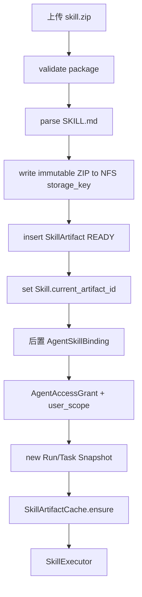
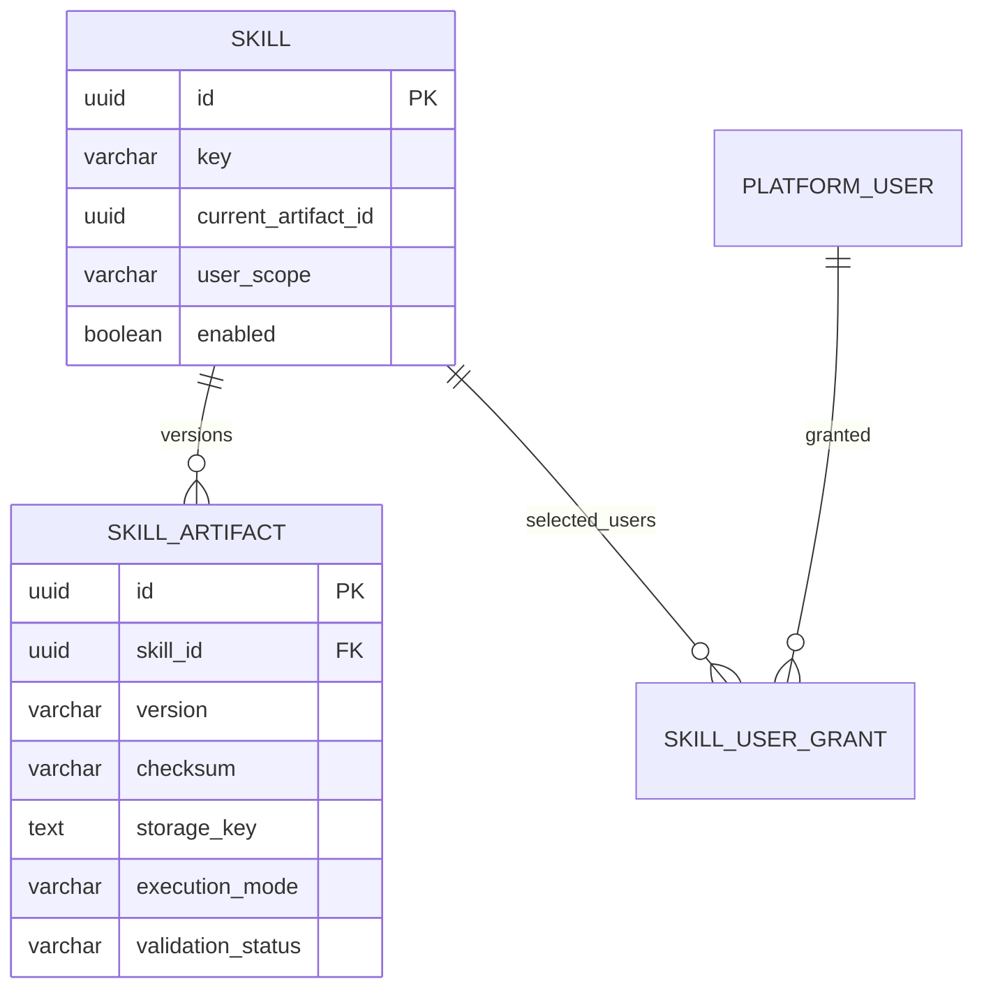

# Skill 管理与 Artifact 模块需求与设计一体化文档

> **文档编号**: MOD-SKILL-V1.0  
> **文档版本**: v1.1  
> **创建日期**: 2026-09-17  
> **文档状态**: 设计评审中  
> **模板**: design-full.md


## 1. 文档控制

| 项目 | 内容 |
|---|---|
| 模块 | Skill 管理与 Artifact |
| Owner | muad-console-platform + skill-sdk/artifact-store |
| 数据 Owner | control + NFS Artifact Store |
| 前置模块 | 01-platform-foundation, 02-user-identity, 04-project-platform |
| 建议代码位置 | apps/console-platform/backend/src/muad_console_platform/modules/skills/；packages/skill-sdk/；packages/artifact-store/ |

### 1.1 责任人

| 角色 | 姓名 | 职责范围 |
|---|---|---|
| 产品经理 | — | 需求定义、业务验收 |
| 开发负责人 | muad-console-platform + skill-sdk/artifact-store | 技术方案、代码实现 |
| 测试负责人 | — | 测试策略、质量保证 |
| 架构师 | 01-platform-foundation Owner | 架构审核、技术决策 |

### 1.2 修订历史

| 版本 | 日期 | 作者 | 变更描述 |
|---|---|---|---|
| v1.0 | 2026-09-17 | muad-console-platform | 初始设计 |
| v1.1 | 2026-09-18 | muad-console-platform | 对齐 V1.4 决策（docs/17）：删除 skill_user_grant.expires_at、补导入限制与 SKILL_VERSION_EXISTS/幂等语义、SDK 契约改引 docs/06 §5、manifest 措辞澄清、skill 无 revision |

## 2. 需求分析

### 2.1 需求概述

| 项目 | 内容 |
|---|---|
| 模块名称 | Skill 管理与 Artifact |
| 模块 ID | MOD-SKILL |
| 需求类型 | 中大型功能开发 |
| 业务背景 | Skill 需要支持线下 IDE 开发后导入平台，不能依赖共享执行目录，也不能把认证和复杂 manifest 塞进包。 |
| 核心目标 | 把 Skill 作为业务能力最小单元，管理不可变 Artifact 版本、执行模式、用户范围和 SDK/Egress 运行边界。 |

### 2.2 痛点与价值

| 维度 | 内容 |
|---|---|
| 目标用户/调用方 | Builder / Admin / End User / 内部服务（按模块实际入口） |
| 当前问题 | Skill 需要支持线下 IDE 开发后导入平台，不能依赖共享执行目录，也不能把认证和复杂 manifest 塞进包。 |
| 业务影响 | 模块边界或契约不固定会导致上层重复设计、接口漂移和跨模块返工。 |
| 预期价值 | 把 Skill 作为业务能力最小单元，管理不可变 Artifact 版本、执行模式、用户范围和 SDK/Egress 运行边界。 |

### 2.3 功能方案

#### 2.3.1 功能清单

| 功能ID | 功能名称 | 功能描述 | 优先级 | 来源 |
|---|---|---|---|---|
| FEAT-01 | 导入 Skill | ZIP 安全限制校验（≤50MiB/≤200MiB/≤2000 文件/扩展名白名单）、解析 SKILL.md、写 NFS、创建 Skill 与首个 Artifact；重复版本/checksum 返回 `SKILL_VERSION_EXISTS`。 | P0 | 需求描述 |
| FEAT-02 | 版本管理 | 给已有 Skill 导入新不可变 Artifact 并更新 current_artifact；导入幂等（`Idempotency-Key` + checksum 去重）。 | P0 | 需求描述 |
| FEAT-03 | 用户范围 | ALL/SELECTED + SkillUserGrant，资源级跨 Agent 生效；无到期时间，撤销=软删除。 | P0 | 需求描述 |
| FEAT-04 | SDK/Egress Contract | Skill 通过 SkillContext/PlatformClient 调用项目平台；签名以 docs/06 §5 为唯一来源。 | P0 | 需求描述 |

#### 2.3.2 字段约束

| 字段类别 | 约束 |
|---|---|
| ID | 业务实体统一 UUID；跨 Owner Schema 仅逻辑引用 UUID |
| 时间 | PostgreSQL 使用 `timestamptz`；Console 展示 `YYYY-MM-DD HH:mm:ss` |
| 删除 | 产品表统一 `is_deleted` 软删除；状态枚举不重复表达 DELETED；授权撤销=软删除，无到期时间 |
| Secret | 只保存 SecretRef；Secret Value 不进入 DB / Snapshot / 日志 / LLM |
| 枚举 | API 与 DB 统一使用稳定英文枚举值，中文/英文只在 UI/i18n 层映射 |
| 错误 | 业务代码只抛稳定 `code`；`msg/http_status` 由公共配置映射 |
| 导入 | 只接受 ZIP；大小/文件数/扩展名/路径/压缩包嵌套限制见 §3.2，违规返回 `SKILL_PACKAGE_INVALID` |

### 2.4 范围与边界

| 类别 | 内容 |
|---|---|
| In Scope | Skill import、Artifact 新版本、导入限制与幂等、校验/manifest、current_artifact、user_scope/selected users、NFS storage_key、Skill SDK 契约引用。 |
| Out of Scope | Skill 包不保存 Secret；不动态 pip install；不从 NFS 直接执行 Python；不做复杂 Workflow DSL；不做用户侧 Artifact 下载。 |
| 技术债 | 无；不为未确认的未来能力增加兼容层 |

### 2.5 验收条件

#### 2.5.1 业务规则与约束

| ID | 类型 | 描述 | 验证场景 |
|---|---|---|---|
| RULE-01 | 系统约束 | JSON REST 统一 code/msg/data/trace_id/request_id/timestamp；业务只抛 code，msg/http_status 配置映射。 | S-01 / E-03 |
| RULE-02 | 系统约束 | 产品表统一 is_deleted/create_time/update_time；同 Owner Schema 物理 FK，跨 Owner Schema 逻辑 UUID。 | S-01 / S-02 |
| RULE-03 | 系统约束 | Secret Value 不进 DB/Snapshot/日志/LLM，只保存 SecretRef。 | S-01 / E-02 |
| RULE-04 | 系统约束 | User→Agent；Agent→Skill/MCP；SELECTED 再叠加资源用户 Grant；不建三元授权；SkillUserGrant 无 `expires_at`，撤销=软删除。 | S-02 / E-03 |
| RULE-05 | 系统约束 | NFS-backed RWX PVC 为 Artifact 权威源；Runtime/Worker emptyDir 本地 cache；禁止直接从 NFS 执行 Python。 | S-01 / S-03 |
| RULE-06 | 系统约束 | 新 Run/Task 冻结 Snapshot；配置/授权变更只影响后续新 Run/Task。 | S-03 |
| RULE-07 | 系统约束 | 关系修改使用单关系 POST/DELETE 独立事务，不用全量 PUT。 | S-02 / E-03 |
| RULE-08 | 系统约束 | 跨 API/DB/Runtime/Browser 的关键流程必须 E2E，列出不得 mock 的真实边界。 | S-01 / S-03 |
| RULE-09 | 系统约束 | 导入限制：zip ≤50MiB、解压后 ≤200MiB、文件数 ≤2000、扩展名白名单、拒绝绝对路径/`..`/符号链接/嵌套压缩包、敏感信息扫描；违规统一 `SKILL_PACKAGE_INVALID`。 | B-01~B-04 / E-04 |
| RULE-10 | 系统约束 | 重复 `skill_id + version` 或重复 checksum 返回 `SKILL_VERSION_EXISTS`，不覆盖、不产生新 Artifact；`/import` 与 `/artifacts` 支持 `Idempotency-Key`，同 key 重放返回首次结果。 | S-04 / E-03 |
| RULE-11 | 系统约束 | `skill` 表无 `revision` 列，元数据更新不携带 `expected_revision`，同一事务追加 `config_audit_log`。 | S-01 |

#### 2.5.2 功能验收场景

##### 正常场景

| 场景ID | 功能ID | 测试层级 | 关键真实边界 | 归属 | 操作/前置 | 预期结果 |
|---|---|---|---|---|---|---|
| S-01 | FEAT-01 | E2E | Upload API→NFS→PostgreSQL | 本模块 | 导入合法 ZIP | NFS 有不可变 Artifact；`skill_artifact` 写入 storage_key/checksum/manifest_json 且 `validation_status=READY`；`skill.current_artifact_id` 指向它 |
| S-02 | FEAT-03 | integration | Grant service→DB | 本模块 | SELECTED Skill 添加用户 | 只创建 SkillUserGrant（无到期时间），不创建 AgentAccessGrant/AgentSkillBinding |
| S-03 | FEAT-02 | E2E | Upload→Snapshot semantics | 本模块 | Run A 开始后导入 v2 | Run A 继续旧 Artifact，新 Run 使用 current v2 |
| S-04 | FEAT-01/02 | integration | API→DB | 本模块 | 相同 `Idempotency-Key` 重放导入 | 不新增 Artifact，返回首次导入结果 |

##### 异常场景

| 场景ID | 功能ID | 测试层级 | 关键真实边界 | 归属 | 触发条件 | 系统行为 |
|---|---|---|---|---|---|---|
| E-01 | FEAT-01 | integration | Validator→NFS/DB | 本模块 | ZIP 路径穿越或缺 SKILL.md | 拒绝导入（`SKILL_PACKAGE_INVALID`），不产生 READY Artifact |
| E-02 | FEAT-04 | integration | Skill SDK→Egress | 本模块 | Skill 试图直接访问 Secret | SDK 无此接口，Secret 不进入 Skill context |
| E-03 | FEAT-02 | integration | API→DB | 本模块 | 导入已存在的 version 或相同 checksum | 返回 `SKILL_VERSION_EXISTS`，不覆盖、不新增 |
| E-04 | FEAT-01 | integration | Validator→Secret Scan | 本模块 | 包内命中敏感信息扫描 | 拒绝导入（`SKILL_PACKAGE_INVALID`），不写 NFS/DB |

##### 边界场景

| 场景ID | 测试层级 | 关键真实边界 | 归属 | 字段/条件 | 边界值 | 预期行为 |
|---|---|---|---|---|---|---|
| B-01 | unit | 导入校验 | 本模块 | zip 大小 | 50MiB / 50MiB+1 | 边界内通过；超出拒绝 |
| B-02 | unit | 导入校验 | 本模块 | 解压后总大小 | 200MiB / 200MiB+1 | 边界内通过；超出拒绝 |
| B-03 | unit | 导入校验 | 本模块 | 文件数 | 2000 / 2001 | 边界内通过；超出拒绝 |
| B-04 | integration | 导入校验 | 本模块 | 扩展名/路径/链接/嵌套包 | 白名单外、绝对路径、`..`、符号链接、嵌套 zip | 全部拒绝，`SKILL_PACKAGE_INVALID` |

无可靠实测数据的性能阈值统一标记“待定”，不复制模板示例值。

## 3. 技术设计

### 3.1 技术选型与关键决策

| 决策 | 选择 | 放弃项 | 理由 |
|---|---|---|---|
| Artifact 存储 | NFS RWX PVC + storage_key | 共享执行目录 | 保持文件事实源与执行 cache 分离 |
| Skill 包 | SKILL.md + scripts/references/assets/tests | 复杂 skill.yaml | 线下开发简单且低耦合 |
| 依赖 | 基础镜像白名单依赖 | 运行时 pip install | 避免污染 Runtime 环境 |
| 导入限制 | zip ≤50MiB、解压 ≤200MiB、≤2000 文件、扩展名白名单、拒绝穿越/链接/嵌套包、Secret 扫描 | 只做 checksum | docs/03 §5.1.2 统一入口防护 |
| 导入幂等 | `Idempotency-Key` + checksum 去重；重复返回 `SKILL_VERSION_EXISTS` | 重复上传覆盖 | Artifact append-only，需可安全重试 |

基础栈：Python >=3.12、FastAPI >=0.115、SQLAlchemy 2.x、PostgreSQL；按需 Redis/NFS；统一 `muad-api` 与 `muad-logging`。

### 3.2 架构与流程



**导入校验（docs/03 §5.1.2）**

- zip ≤ 50 MiB；解压后总大小 ≤ 200 MiB；文件数 ≤ 2000；
- 扩展名白名单：`.md` / `.py` / `.json` / `.yaml` / `.yml` / `.txt` / `.csv` / `.html` / `.css` / `.js` / `.png` / `.jpg` / `.svg`；
- 拒绝绝对路径与 `..`、拒绝符号链接、拒绝嵌套压缩包；
- 导入时执行敏感信息扫描（与 docs/06 §8 一致）；
- 违规统一返回 `SKILL_PACKAGE_INVALID`，不写 NFS/DB。

SDK 契约以 docs/06 §5 为唯一来源，本模块不重定义 `SkillContext` 任何方法签名。

### 3.3 数据设计

#### `control.skill`

**表说明**

- **用途**：Skill 逻辑资源，name/description 主要来自 SKILL.md frontmatter。
- **主要写入方**：Skill 导入流程。
- **主要读取方**：Console、Runtime Skill Catalog。
- **生命周期/边界**：可切换 current_artifact；旧 Artifact 保持不可变；**无 `revision` 列**，元数据更新不携带 `expected_revision`，同一事务追加 `config_audit_log`（docs/03 §4.3）。

| 字段 | 类型 | 约束 | 说明 |
|---|---|---|---|
| `id` | uuid | PK | 主键 |
| `is_deleted` | boolean | NOT NULL DEFAULT false | 软删除 |
| `create_time` | timestamptz | NOT NULL DEFAULT now() | 创建时间 |
| `update_time` | timestamptz | NOT NULL DEFAULT now() | 更新时间 |
| `tenant_id` | varchar(64) | NOT NULL | 隔离键 |
| `key` | varchar(128) | NOT NULL | Skill key |
| `name` | varchar(128) | NOT NULL | 名称 |
| `description` | text | NOT NULL | Catalog 描述 |
| `platform_label` | varchar(128) |  | 人类识别标签 |
| `user_scope` | varchar(16) | NOT NULL DEFAULT 'SELECTED' | ALL/SELECTED；默认指定用户，避免新导入能力直接对所有 Agent 授权用户开放 |
| `current_artifact_id` | uuid |  | 当前默认 Artifact |
| `enabled` | boolean | NOT NULL DEFAULT true | 是否启用 |

**索引/约束**：

- `UNIQUE (tenant_id, key) WHERE is_deleted=false`
- `INDEX (user_scope, enabled)`

#### `control.skill_artifact`

**表说明**

- **用途**：一次不可变 Skill 包上传结果。Package 以 SKILL.md + scripts/resources 为事实源。
- **主要写入方**：Console Skill Import。
- **主要读取方**：Runtime SkillLoader。
- **生命周期/边界**：append-only；checksum 确保可复现；不覆盖；同一 `(skill_id, version)` 与同一 `(skill_id, checksum)` 均拒绝重复。

| 字段 | 类型 | 约束 | 说明 |
|---|---|---|---|
| `id` | uuid | PK | 主键 |
| `is_deleted` | boolean | NOT NULL DEFAULT false | 软删除 |
| `create_time` | timestamptz | NOT NULL DEFAULT now() | 创建时间 |
| `update_time` | timestamptz | NOT NULL DEFAULT now() | 更新时间 |
| `skill_id` | uuid | NOT NULL FK -> skill.id | 所属 Skill |
| `version` | varchar(64) | NOT NULL | Artifact 语义版本 |
| `checksum` | varchar(128) | NOT NULL | 不可变校验 |
| `storage_key` | text | NOT NULL | Artifact Store 相对键，例如 `skills/{skill_id}/{artifact_id}/skill.zip` |
| `frontmatter_json` | jsonb | NOT NULL DEFAULT '{}' | SKILL.md frontmatter 快照 |
| `manifest_json` | jsonb | NOT NULL DEFAULT '{}' | 包内文件清单快照（文件路径/大小等），仅用于详情/校验，不作为执行 manifest |
| `execution_mode` | varchar(16) | NOT NULL DEFAULT 'SYNC' | SYNC/ASYNC/AUTO；由 SKILL.md `execution` 提取 |
| `default_script` | varchar(256) |  | 可选默认脚本，例如 scripts/main.py；不是强制入口 |
| `package_size` | bigint | NOT NULL | 字节数 |
| `validation_status` | varchar(32) | NOT NULL | READY/REJECTED |
| `validation_message` | text |  | 校验信息 |
| `created_by` | uuid | NOT NULL | 上传人 |

**索引/约束**：

- `UNIQUE (skill_id, version) WHERE is_deleted=false`
- `UNIQUE (skill_id, checksum) WHERE is_deleted=false`
- `INDEX (skill_id, create_time DESC)`

#### `control.skill_user_grant`

**表说明**

- **用途**：当 Skill `user_scope=SELECTED` 时，声明哪些 PlatformUser 可以使用该 Skill。
- **主要写入方**：Admin/Builder。
- **主要读取方**：Runtime Visibility Resolver。
- **生命周期/边界**：
  - 只控制 Skill 的资源级用户范围；
  - 不授予 Agent 使用权；
  - 不把 Skill 自动绑定到 Agent；
  - 一个 Grant 对所有绑定该 Skill 的 Agent 生效，但用户仍必须分别拥有目标 Agent 的 AgentAccessGrant；
  - **无到期时间**：不设 `expires_at`，撤销 = 软删除（`is_deleted=true`），判定只用 `is_deleted=false`（docs/17 §D7）。

| 字段 | 类型 | 约束 | 说明 |
|---|---|---|---|
| `id` | uuid | PK | 主键 |
| `is_deleted` | boolean | NOT NULL DEFAULT false | 软删除；true 即撤销 |
| `create_time` | timestamptz | NOT NULL DEFAULT now() | 创建时间 |
| `update_time` | timestamptz | NOT NULL DEFAULT now() | 更新时间 |
| `skill_id` | uuid | NOT NULL FK -> skill.id | Skill |
| `user_id` | uuid | NOT NULL FK -> platform_user.id | 指定用户 |
| `granted_by` | uuid | NOT NULL | 授权人 |

**索引/约束**：

- `UNIQUE (skill_id, user_id) WHERE is_deleted=false`
- `INDEX (user_id, skill_id)`

**ER 图**



数据库规则：所有产品表统一 `id/is_deleted/create_time/update_time`；同 Owner Schema 物理 FK，跨 Owner Schema 逻辑 UUID；迁移使用 Alembic expand→deploy→contract。

### 3.4 接口设计

```json
{
  "code":"0",
  "msg":"成功",
  "data":{},
  "trace_id":"trace-id",
  "request_id":"request-id",
  "timestamp":"2026-09-17T17:00:00+08:00"
}
```

业务异常只允许 `raise AppError("CODE")`；msg 与 HTTP Status 统一由 `config/api-messages.yaml` 映射。列表接口统一分页 `{items,page,page_size,total}`，`page>=1`、`1<=page_size<=100`（docs/07 §11）。

| 接口ID | 名称 | 方法 | 路径 | FEAT |
|---|---|---|---|---|
| API-01 | Skill 列表 | GET | `/api/v1/skills` | FEAT-01 |
| API-02 | 导入新 Skill | POST | `/api/v1/skills/import` | FEAT-01 |
| API-03 | Skill 详情 | GET | `/api/v1/skills/{skill_id}` | FEAT-01 |
| API-04 | 编辑 Skill 元数据 | PUT | `/api/v1/skills/{skill_id}` | FEAT-01 |
| API-05 | 版本列表 | GET | `/api/v1/skills/{skill_id}/artifacts` | FEAT-02 |
| API-06 | 导入新版本 | POST | `/api/v1/skills/{skill_id}/artifacts` | FEAT-02 |
| API-07 | 版本详情 | GET | `/api/v1/skills/{skill_id}/artifacts/{artifact_id}` | FEAT-02 |
| API-08 | 变更用户范围 | PUT | `/api/v1/skills/{skill_id}/user-scope` | FEAT-03 |
| API-09 | 指定用户列表 | GET | `/api/v1/skills/{skill_id}/users` | FEAT-03 |
| API-10 | 添加指定用户 | POST | `/api/v1/skills/{skill_id}/users/{user_id}` | FEAT-03 |
| API-11 | 移除指定用户 | DELETE | `/api/v1/skills/{skill_id}/users/{user_id}` | FEAT-03 |

| 函数ID | 暴露面 | 用途 | 错误码 | FEAT |
|---|---|---|---|---|
| LIB-01 | `SkillArtifactValidator.validate(zip_path) -> ValidationResult` | 校验包结构、导入限制、ZIP 安全与 SKILL.md | `SKILL_PACKAGE_INVALID` | FEAT-01 |
| LIB-02 | `SkillContext` 能力清单（签名以 docs/06 §5 为唯一来源，本模块不重定义） | `ctx.platform`（PlatformClient：`call/request`）、`ctx.http`（get/post/request）、`ctx.mcp`（call）、`ctx.task`（map）、`ctx.artifact`、`ctx.logger`、`ctx.user` | 调用失败 `COMMON_INTERNAL_ERROR`；策略拒绝 `FORBIDDEN` | FEAT-04 |

#### API-01 Skill 列表

```text
GET /api/v1/skills
```

- 调用方：Console Web。
- 请求（Query）：

| 字段 | 类型 | 必填 | 说明 |
|---|---|---|---|
| `keyword` | string | 否 | name/key 模糊搜索 |
| `user_scope` | string | 否 | `ALL` / `SELECTED` 筛选 |
| `enabled` | boolean | 否 | 启用状态筛选 |
| `page` | int | 否 | 页码，默认 1，最小 1 |
| `page_size` | int | 否 | 每页条数，默认 20，最大 100 |

- `data`：`{items:[{skill_id,key,name,platform_label,user_scope,enabled,current_version,using_agent_count,selected_user_count,update_time}],page,page_size,total}`。
- 错误码：`COMMON_VALIDATION_ERROR / COMMON_INTERNAL_ERROR`
- 处理：软删过滤；`using_agent_count`/`selected_user_count` 聚合 COUNT，禁止 N+1；中文映射留给 UI/i18n。
- 对应 docs/07：§10.2。

#### API-02 导入新 Skill

```text
POST /api/v1/skills/import
```

- 调用方：Console Web。
- 请求（multipart/form-data + Header）：

| 字段 | 类型 | 必填 | 说明 |
|---|---|---|---|
| `file` | file | 是 | ZIP 包，≤50MiB；解压 ≤200MiB、≤2000 文件、扩展名白名单 |
| `user_scope` | string | 否 | 默认 `SELECTED` |
| `Idempotency-Key`（Header） | string | 否 | 同 key 重放返回首次导入结果 |

- `data`：`{skill_id,key,user_scope,current_artifact:{artifact_id,version,checksum,validation_status,storage_key}}`。
- 错误码：`COMMON_VALIDATION_ERROR / SKILL_PACKAGE_INVALID / SKILL_VERSION_EXISTS / SKILL_KEY_EXISTS / COMMON_INTERNAL_ERROR`
- 处理：先执行 §3.2 导入限制与敏感信息扫描；解压到临时目录解析 SKILL.md frontmatter；写 NFS Artifact Store（事务外，失败清理 orphan）；DB 事务内 insert `skill` + `skill_artifact(validation_status=READY)` + `current_artifact_id` + `config_audit_log`；`(tenant_id,key)` 冲突 `SKILL_KEY_EXISTS`；重复 version/checksum `SKILL_VERSION_EXISTS`；`Idempotency-Key` 命中返回首次结果。
- 对应 docs/07：§10.2、§12。

#### API-03 Skill 详情

```text
GET /api/v1/skills/{skill_id}
```

- 调用方：Console Web。
- 请求：path `skill_id`。
- `data`：`{skill_id,key,name,description,platform_label,user_scope,enabled,current_artifact:{artifact_id,version,checksum,execution_mode},using_agent_count,selected_user_count,update_time}`。
- 错误码：`COMMON_NOT_FOUND / COMMON_INTERNAL_ERROR`
- 处理：软删过滤；不存在返回 `COMMON_NOT_FOUND`；含当前 Artifact 摘要与聚合计数。
- 对应 docs/07：§10.2。

#### API-04 编辑 Skill 元数据

```text
PUT /api/v1/skills/{skill_id}
```

- 调用方：Console Web。
- 请求（Body）：

| 字段 | 类型 | 必填 | 说明 |
|---|---|---|---|
| `description` | string | 否 | Catalog 描述 |
| `enabled` | boolean | 否 | 启用状态 |

  Artifact 内容不可变；不携带 `expected_revision`（`skill` 无 revision 列）；`user_scope` 变更走 API-08。
- `data`：`{skill_id}`。
- 错误码：`COMMON_VALIDATION_ERROR / COMMON_NOT_FOUND / COMMON_INTERNAL_ERROR`
- 处理：单事务更新元数据并追加 `config_audit_log`；不影响已运行 Run/Task 的 Snapshot。
- 对应 docs/07：§10.2。

#### API-05 版本列表

```text
GET /api/v1/skills/{skill_id}/artifacts
```

- 调用方：Console Web。
- 请求（Path + Query）：

| 字段 | 类型 | 必填 | 说明 |
|---|---|---|---|
| `skill_id` | uuid | 是 | Path 参数 |
| `page` | int | 否 | 页码，默认 1，最小 1 |
| `page_size` | int | 否 | 每页条数，默认 20，最大 100 |

- `data`：`{items:[{artifact_id,version,checksum,execution_mode,validation_status,package_size,created_by,create_time}],page,page_size,total}`。
- 错误码：`COMMON_NOT_FOUND / COMMON_VALIDATION_ERROR / COMMON_INTERNAL_ERROR`
- 处理：按 `create_time DESC` 分页；只返回当前 Skill 的 Artifact；不返回文件内容。
- 对应 docs/07：§10.2。

#### API-06 导入新版本

```text
POST /api/v1/skills/{skill_id}/artifacts
```

- 调用方：Console Web。
- 请求（multipart/form-data + Header）：

| 字段 | 类型 | 必填 | 说明 |
|---|---|---|---|
| `file` | file | 是 | 新版本 ZIP，限制同 API-02 |
| `Idempotency-Key`（Header） | string | 否 | 同 key 重放返回首次导入结果 |

  `user_scope` 不随版本改变。
- `data`：`{skill_id,current_artifact:{artifact_id,version,checksum,validation_status,storage_key}}`（更新 `current_artifact_id` 后的结果）。
- 错误码：`COMMON_VALIDATION_ERROR / COMMON_NOT_FOUND / SKILL_PACKAGE_INVALID / SKILL_VERSION_EXISTS / COMMON_INTERNAL_ERROR`
- 处理：校验同 API-02；单事务 append `skill_artifact` 并更新 `current_artifact_id` + `config_audit_log`；旧 Artifact 保持不可变，已运行 Run/Task 继续引用旧 Artifact。
- 对应 docs/07：§10.2、§12。

#### API-07 版本详情

```text
GET /api/v1/skills/{skill_id}/artifacts/{artifact_id}
```

- 调用方：Console Web。
- 请求：path `skill_id`、`artifact_id`。
- `data`：`{artifact_id,skill_id,version,checksum,storage_key,execution_mode,default_script,package_size,validation_status,validation_message,frontmatter,manifest,create_time}`；其中 `manifest` 是包内文件清单快照（不作为执行 manifest）。
- 错误码：`COMMON_NOT_FOUND / COMMON_INTERNAL_ERROR`
- 处理：软删过滤；Artifact 与 Skill 归属校验，不返回文件内容与 Secret。
- 对应 docs/07：§10.2。

#### API-08 变更用户范围

```text
PUT /api/v1/skills/{skill_id}/user-scope
```

- 调用方：Console Web。
- 请求（Body）：

| 字段 | 类型 | 必填 | 说明 |
|---|---|---|---|
| `user_scope` | string | 是 | `ALL` / `SELECTED` |

- `data`：`{skill_id,user_scope}`。
- 错误码：`COMMON_VALIDATION_ERROR / COMMON_NOT_FOUND / COMMON_INTERNAL_ERROR`
- 处理：单事务更新 `skill.user_scope` + `config_audit_log`；切换为 SELECTED 不清空既有 Grant；变更只影响后续新 Run/Task。
- 对应 docs/07：§10.2。

#### API-09 指定用户列表

```text
GET /api/v1/skills/{skill_id}/users
```

- 调用方：Console Web。
- 请求（Path + Query）：

| 字段 | 类型 | 必填 | 说明 |
|---|---|---|---|
| `skill_id` | uuid | 是 | Path 参数 |
| `page` | int | 否 | 页码，默认 1，最小 1 |
| `page_size` | int | 否 | 每页条数，默认 20，最大 100 |

- `data`：`{items:[{user_id,display_name,granted_by,granted_at,create_time}],page,page_size,total}`。
- 错误码：`COMMON_NOT_FOUND / COMMON_VALIDATION_ERROR / COMMON_INTERNAL_ERROR`
- 处理：只返回 `is_deleted=false` 的 SkillUserGrant；`user_scope=ALL` 时列表可为空，由 UI 提示“当前对所有拥有对应 Agent 使用权的用户开放”。
- 对应 docs/07：§10.2。

#### API-10 添加指定用户

```text
POST /api/v1/skills/{skill_id}/users/{user_id}
```

- 调用方：Console Web。
- 请求：path `skill_id`、`user_id`；无 body。
- `data`：`{}`（Grant 创建结果）。
- 错误码：`COMMON_VALIDATION_ERROR / COMMON_NOT_FOUND / COMMON_INTERNAL_ERROR`
- 处理：校验 Skill 与 PlatformUser 存在；重复授权幂等：已存在活跃 Grant 直接返回既有记录（200，不重复写审计，与用户↔Agent 授权口径一致）；只创建 SkillUserGrant（软删除记录可重新创建），不创建 AgentAccessGrant/AgentSkillBinding，无到期时间；同事务 `config_audit_log`。
- 对应 docs/07：§10.2、§12。

#### API-11 移除指定用户

```text
DELETE /api/v1/skills/{skill_id}/users/{user_id}
```

- 调用方：Console Web。
- 请求：path `skill_id`、`user_id`。
- `data`：`{}`（软删除结果）。
- 错误码：`COMMON_NOT_FOUND / COMMON_INTERNAL_ERROR`
- 处理：`skill_user_grant.is_deleted=true`（撤销=软删除）；同事务 `config_audit_log`；只影响后续新 Run/Task。
- 对应 docs/07：§10.2。

### 3.5 质量实现方案

- 性能：批量/聚合优先，列表禁止 N+1，真实目标待基线压测后确定。
- 可靠性：事务只覆盖原子 DB 操作；外部 IO 不包长事务；高影响错误必须有 E-/B- 验收。
- 安全：Secret/Token/Cookie 不进业务 DB、日志、Snapshot、LLM。
- 可观测：统一 JSON 日志，自动带 service/trace_id/request_id；状态变化可关联 trace_id。

## 4. 部署与运维

本模块随 `muad-console-platform + skill-sdk/artifact-store` 对应镜像/共享 package 发布；PostgreSQL、Redis、NFS 外置。监控阈值待真实基线确定。

## 5. 风险与依赖

- 前置：01-platform-foundation, 02-user-identity, 04-project-platform。
- 主要风险：上传成功但 DB 事务失败留下孤儿文件。
- 应对：用临时 storage_key/promote 或后台 orphan 清理；Contract Test + S/E/B 验收 + Spec Matrix。

## 6. 需求追溯矩阵

| 用户故事 | 功能ID | 接口ID | 测试用例ID | 测试层级 | 状态 |
|---|---|---|---|---|---|
| 需求描述 | FEAT-01 | API-01, API-02, API-03, API-04, LIB-01 | S-01, S-04, E-01, E-04, B-01~B-04 | E2E/integration/unit | 待实现 |
| 需求描述 | FEAT-02 | API-05, API-06, API-07 | S-03, E-03 | E2E/integration | 待实现 |
| 需求描述 | FEAT-03 | API-08, API-09, API-10, API-11 | S-02 | integration | 待实现 |
| 需求描述 | FEAT-04 | LIB-02 | E-02 | integration | 待实现 |

## Spec Compliance Matrix

| Spec/Rule | enforcement | 设计影响 | 设计落点 | 验证场景 | 状态/N/A 理由 |
|---|---|---|---|---|---|
| `harness-platform#RULE-api-001` | required | JSON REST 统一封套与分页；业务只抛 code，msg/http_status 走配置映射。 | §3.4 全部 API | S-01、S-02 | applied |
| `harness-platform#RULE-data-001` | required | 统一标准列、软删除 partial unique、timestamptz、同 Schema 物理 FK。 | §3.3 三张表定义 | S-01、S-02 | applied |
| `harness-platform#RULE-secret-001` | required | 包内敏感信息扫描；Secret 不进 DB/NFS 元数据/SkillContext/日志。 | §3.2、§3.3、§3.4 API-07 | E-02、E-04 | applied |
| `harness-platform#RULE-auth-001` | required | SELECTED 叠加 SkillUserGrant；无到期时间、绑定无开关、不建三元授权。 | §2.5.1 RULE-04、§3.3 skill_user_grant | S-02、E-03 | applied |
| `harness-platform#RULE-skill-001` | required | NFS-backed RWX PVC 为 Artifact 权威源；DB 只存 storage_key；Runtime emptyDir cache。 | §3.1、§3.2、§3.3 skill_artifact | S-01、S-03 | applied |
| `harness-platform#RULE-snapshot-001` | required | 新 Run 冻结 Artifact；新版本只影响后续 Run。 | §2.5.2 S-03、§3.4 API-06 | S-03 | applied |
| `harness-platform#RULE-rel-001` | required | 指定用户关系用单关系 POST/DELETE，独立事务。 | §3.4 API-10/API-11 | S-02 | applied |
| `harness-platform#RULE-test-001` | required | 关键流程 E2E 且列出不得 mock 的真实边界（NFS/DB/Upload）。 | §2.5.2 S-01、S-03、B-04 | S-01、S-03 | applied |
