# 通用智能服务执行框架 V1.8 总体设计说明书

> **文档状态**：总体设计基线（以完整 V1.7 为母本，V1.8 最新交互、Skill SDK、ProjectPlatform、Channel/授权、Capability 分页决策已合入正文）  
> **版本**：V1.8  
> **日期**：2026-09-11  
> **设计性质**：Greenfield 开源框架设计；Framework Core 与具体业务项目解耦，`muad-openclaw`、`fluxion-harness` 和 MSS 仅作为需求验证/工程经验来源，不形成兼容约束  
> **参考模板**：《版本总体设计说明书》V3.2（SFRD-TS-01-3.2）  
> **首个参考业务需求**：《MSS 智能服务交付平台——用户场景与 Playbook 旅程设计 V6》  
> **历史工程参考**：
> - https://github.com/Michaelxwb/muad-openclaw
> - https://github.com/Michaelxwb/fluxion-harness
>
> **V1.8 关键修订（相对 V1.7）**
>
> 1. `ProjectPlatform`（业务项目平台）与 `ProjectIntegration`（代码/部署扩展）正式拆分；前者进入 Console/API/DB，后者保持 Manifest/Provider 装配机制。
> 2. V1 普通用户的产品授权收敛为 `PlatformUser → AgentAccessGrant → AgentDefinition`；外部业务系统继续做业务数据权限最终判定。
> 3. Channel 身份、Bot 路由、用户授权三分离：`external_user_id → PlatformUser`、`bot_id → Agent`、`User → AgentAccessGrant`。
> 4. WeCom V1 一个 `bot_id` 只服务一个 Agent；一个 Channel Gateway 可以同时维护多个 Bot WebSocket。新 Agent 需要独立企微入口时配置新的 Bot。
> 5. `/bind` 只建立 ChannelIdentity 与 PlatformUser 的身份映射，不携带 Agent/Bot 授权；用户详情“IM 身份”页统一管理已绑定身份与一次性绑定码。
> 6. 每个 Service V1 必须绑定一个 `primary_agent_id`；一个 Agent 可以承载多个 Service。
> 7. Skill 收敛为离线开发的 Python SOP 代码资产：IDE + `fluxion_skill_sdk` 开发/调试/测试，完成后打包导入 Console；Console 不提供 Skill 在线编排和在线代码编辑。
> 8. Skill 保留传统 Python 逻辑（if/for/while、数据过滤/转换、算法、业务判断）；认证、服务发现、分页、Retry/Timeout、Secret 等共性能力下沉 Capability Runtime。
> 9. Skill 的 Capability 依赖来自 `skill.yaml capabilities[]`，Console 只读展示；`platform_label` 仅为文本分类标签，不是 ProjectPlatform 外键。
> 10. Capability Implementation V1 固定 `PLATFORM_SERVICE / HTTP / MCP / SANDBOX`；只有 PLATFORM_SERVICE 关联 ProjectPlatform。异步是执行语义，不是第五种实现类型。
> 11. Capability Runtime 增加 Data Retrieval Policy，统一 Page/Offset/Cursor 自动分页、结束策略、硬限制、重复页检测和大结果 Artifact 化。
> 12. `User × ProjectPlatform` V1 只能配置一套用户认证；ProjectPlatform 只定义认证字段模板，真实 Secret 存 Secret Provider。
> 13. Knowledge 调整为规划项，Phase 1 不冻结完整 Knowledge Console/API/DB/Provider。
> 14. Console 以最新交互稿为产品事实：End User 不访问；Builder/Admin 页面级区分；Channel 配置在 Agent IM 接入；系统设置不展示基础设施状态；时间统一 `YYYY-MM-DD HH:mm:ss`。
> 15. 异步状态统一进入 Execution/Timeline，不新增“异步任务”一级菜单；一个 Execution 可包含多个 Async Task Step。

> **核心设计原则**
>
> ```text
> 通用 Framework Core
>   → Agent / Service / Execution / Capability / Knowledge / Channel / Auth
>   → Extension SPI / Adapter
>   → 具体项目 Integration
>   → 项目已有业务系统
> ```
>
> 框架不从某个具体 MSS SOP 或旧项目模块反向定义核心领域。MSS 是首个真实验证项目，但 `MSS / customer / device / EDR / policy_check` 等业务语义不得进入 Framework Core 的核心表、核心接口和核心执行引擎。

---

# 目录

- [1. 引言与设计任务](#1-引言与设计任务)
  - [1.1 目的、范围与设计输入](#11-目的范围与设计输入)
  - [1.2 定义、角色与核心设计原则](#12-定义角色与核心设计原则)
  - [1.3 总体设计目标与约束](#13-总体设计目标与约束)
  - [1.4 历史项目可吸收经验与明确舍弃项](#14-历史项目可吸收经验与明确舍弃项)
- [2. 框架定位与关键使用场景](#2-框架定位与关键使用场景)
  - [2.1 产品定位与三类核心用户](#21-产品定位与三类核心用户)
  - [2.2 Service、SOP、Skill、Capability 的产品语义](#22-servicesopskillcapability-的产品语义)
  - [2.3 关键用户旅程 与 黄金旅程](#23-关键用户-旅程-与-golden-旅程)
  - [2.4 第一阶段范围与明确不做](#24-第一阶段范围与明确不做)
- [3. 方案选型与软件总体架构](#3-方案选型与软件总体架构)
  - [3.1 总体方案选型](#31-总体方案选型)
  - [3.2 逻辑架构与核心边界](#32-逻辑架构与核心边界)
  - [3.3 进程、部署与运行视图](#33-进程部署与运行视图)
  - [3.4 技术栈基线](#34-技术栈基线)
  - [3.5 信任边界与控制面/执行面](#35-信任边界与控制面执行面)
- [4. 核心模块、数据结构与系统流程](#4-核心模块数据结构与系统流程)
  - [4.1 核心模块职责与边界](#41-核心模块职责与边界)
  - [4.2 核心领域对象与数据结构](#42-核心领域对象与数据结构)
  - [4.3 关键系统流程](#43-关键系统流程)
  - [4.4 模块间接口与 Contract](#44-模块间接口与-contract)
  - [4.5 推荐代码组织与依赖规则](#45-推荐代码组织与依赖规则)
- [5. 关键特性与 DFX 设计](#5-关键特性与-dfx-设计)
  - [5.1 安全性与权限设计](#51-安全性与权限设计)
  - [5.2 可靠性、韧性与 Worker Engine 设计](#52-可靠性韧性与-worker-engine-设计)
  - [5.3 可测试性、可调试性与可观测性](#53-可测试性可调试性与可观测性)
  - [5.4 可扩展性、可复用性与能力生态](#54-可扩展性可复用性与能力生态)
  - [5.5 User Memory、隐私与数据治理](#55-user-memory隐私与数据治理)
  - [5.6 可运维性、发布与升级](#56-可运维性发布与升级)
- [6. 实施基线、验收 Gate、风险与变更控制](#6-实施基线验收-gate风险与变更控制)
  - [6.1 Phase 1 实施基线](#61-phase-1-实施基线)
  - [6.2 黄金旅程验收 Gate](#62-golden-旅程-验收-gate)
  - [6.3 关键风险与后续决策阈值](#63-关键风险与后续决策阈值)
  - [6.4 设计变更与文档维护规则](#64-设计变更与文档维护规则)

---

# 1. 引言与设计任务

## 1.1 目的、范围与设计输入

本文用于定义一个可开源复用的**通用智能服务执行框架**总体技术方案。框架目标不是只服务 MSS，而是允许任意业务项目通过配置、Contract 和 Adapter 接入，而无需 fork Framework Core。

总体设计输出仍聚焦：

```text
Framework Core 如何划分
+
各运行角色如何部署和扩缩
+
业务项目通过哪些 SPI / Contract 接入
+
Agent、Service、Worker、Capability、Knowledge、Channel 如何协作
+
可靠性、安全性、可运维性等 DFX 如何成为框架能力
```

### 设计输入

本次总体设计使用以下输入：

1. MSS Playbook：作为首个真实业务需求与黄金旅程，用来验证框架是否真正可承载企业服务交付；
2. `muad-openclaw`：作为企业微信、用户绑定、用户身份复用、Skill、Browser、Progress、多用户运行等工程实践来源；
3. `fluxion-harness`：作为 stateless、Execution Snapshot、Capability、Memory、Worker/Durable Execution、Architecture Gate 以及“版本管理过重”等工程试错来源；
4. 已对齐的通用技术约束：Python、LangGraph Library、自研轻量 Worker Engine、外部 PostgreSQL/Redis/Object Store、Channel Gateway、Kubernetes；
5. 开源可复用约束：Framework Core 不依赖 MSS 业务接口、领域名词、认证方式和 Channel 协议；具体项目通过 Integration/Adapter 接入。

### 设计性质

本项目不是：

```text
fluxion-harness V4 重构
```

也不是：

```text
muad-openclaw 去 OpenClaw 化
```

更不是：

```text
把 MSS 现有 SOP 直接写进 Agent Runtime / Worker
```

而是：

```text
通用 Framework Core
        +
Project Integration
        =
具体项目智能服务平台
```

以 MSS 为例：

```text
通用 Framework
+
MSS Integration
+
WeCom Adapter
=
MSS 智能服务交付平台
```

其他项目可以是：

```text
通用 Framework
+
DevOps Integration
=
智能发布平台
```

或：

```text
通用 Framework
+
ITSM / CRM / ERP Integration
=
对应业务智能服务平台
```

旧项目和 MSS 业务只作为需求验证、参考实现和工程证据，不形成 Framework Core 的兼容性约束。


---

## 1.2 定义、角色与核心设计原则

### 关键定义

| 名称 | 定义 |
|---|---|
| Framework Core | 与具体项目无关的核心运行框架，不识别 MSS/CRM/ERP/DevOps 等领域对象 |
| Project Platform（ProjectPlatform） | Console/API/DB 中的外部业务平台对象，例如 MSS/CRM/ERP；承载用户认证模板，并被 Platform Service 类型 Capability 引用 |
| Project Integration | 某个项目接入框架所提供的 Manifest、Service/Agent Seed、Capability Adapter、AuthProvider 等代码/部署扩展集合；不是普通 Console CRUD 资源 |
| Platform User | 框架统一用户主体，是授权、Memory、Conversation、Execution 的用户根 |
| Channel Identity | WeCom、WebChat、Slack、Mattermost 等 Channel 中的外部身份，仅映射到 Platform User，不承担 Agent 路由和授权 |
| Channel Account | 一个具体渠道账号/端点，例如一个 WeCom Bot；V1 一个 bot_id 只绑定一个 Agent |
| Agent Access Grant | Platform User 是否有权使用某个 Agent 的产品授权关系，与 Channel Identity/Bot Route 分离 |
| Bind Code | 面向 Platform User 生成的一次性短时身份绑定码，仅用于建立 ChannelIdentity → PlatformUser |
| Skill SDK | 与 Framework 同仓维护的稳定 Python Public API；本地可经 HTTP Dev Capability Gateway 联调，生产由 Runtime 注入同语义 Context |
| Data Retrieval Policy | Capability Implementation 的数据获取策略，定义 Page/Offset/Cursor 分页、结束条件、安全上限与大结果处理 |
| Agent Definition | Agent 的配置定义；不同 Agent 共用同一 Agent Runtime |
| Agent Runtime | 面向实时交互的无状态计算服务，可动态加载并运行多个 Agent Definition |
| Service Definition | 面向最终用户的一项可执行服务定义，是最高业务服务抽象 |
| SOP | 具体业务项目完成某项服务的业务做法，不等于 Skill，也不等于 Workflow |
| Skill | 使用 Skill SDK 在线下 IDE 开发、以不可变 Artifact 导入的平台 Python SOP/方法代码资产；可组合 Capability 并保留数据处理/业务判断逻辑 |
| Capability | 稳定的“可做什么”合同，不包含具体项目传输实现 |
| Capability Provider/Adapter | Capability 的具体实现，如 HTTP/API、MCP、Browser、项目 SDK |
| Built-in Tool | 框架内置的通用工具能力，如 `filesystem.read`、`filesystem.write`、`filesystem.edit`、`filesystem.glob`、`filesystem.grep`、`shell.execute`；产品模型仍按 Capability 管理 |
| Workspace | Conversation/Execution 使用的受控工作目录抽象，不等于用户固定 Pod/本地 Home 目录 |
| Sandbox Executor | 为文件与 Shell 类 Capability 提供受控执行环境的 SPI；开发可用 Local 实现，生产应使用隔离实现 |
| Knowledge Provider | 对统一 Knowledge Retrieval Contract 的实现，可连接本地文件、外部知识库、RAG/MCP 等 |
| AuthProvider | 把 Framework User/ExecutionContext 转换为下游系统可接受认证上下文的扩展点 |
| ExecutionService | 共享的确定性 Application Service：把 Agent Proposal 转成可信 ServiceExecution；不是独立微服务 |
| ServiceExecution | 一次真实 Service 执行实例 |
| Worker Engine | ServiceExecution 的可靠执行底座，负责 claim、lease、wait、retry、recovery 等生命周期 |
| Agent Executor | 运行认知型 Agent Step 的统一执行器，V1 由 LangGraph Library 实现 |
| Execution Snapshot | Execution 创建时冻结的轻量运行投影，只固定本次执行必须保持一致的业务逻辑 |
| User Memory | 跨会话、跨渠道的长期用户上下文，不是外部业务系统权威数据 |
| Channel Gateway | 通用 Channel 接入/路由/投递服务，通过 Channel Adapter SPI 支持不同入口 |
| Delivery Route | 后台任务进度/结果应该投递到哪个 Channel/Peer 的持久化路由 |
| Resource Scope | 一次执行所作用的通用业务资源范围；具体 schema 由 Service/Integration 定义 |

### 三类核心用户

框架仍以三类用户旅程作为产品主线，但 V1 Console 只面向 Builder 与 Admin，End User 不访问 Console：

```text
End User
→ 通过已授权 Agent 的 IM/未来 WebChat 使用服务
→ /bind 建立外部身份
→ /skills 查看当前 Agent Skill
→ /new 新会话
→ /stop 停止当前执行

Admin
→ 用户 / IM 身份 / 绑定码
→ 用户 × 项目平台认证
→ 用户 → Agent 授权
→ Agent IM 接入
→ Service 正式发布
→ Execution / Timeline / Audit

Builder / Integration Developer
→ Agent / Service / Capability / Model / ProjectPlatform
→ IDE + Skill SDK 开发 Skill
→ 导入 Skill Artifact
→ 测试 Service / 查看开发执行记录
```

V1 不建设复杂资源级 RBAC，主要通过菜单与少量关键按钮实现 Builder/Admin 页面级区分。具体项目的能力接入开发者仍属于 Builder 工作模式。

### 核心设计原则

**P1：Framework Core 必须与业务项目解耦。**  
核心领域、数据库、Runtime、Worker、Contract 中不得硬编码 `MSS / customer / device / EDR / policy_check` 等某个项目的领域对象。

**P2：旅程是功能合法性的来源，但单个项目旅程不能污染通用内核。**  
真实项目旅程负责验证“框架是否缺能力”；新增业务语义优先进入 Integration，而不是 Core。

**P3：Service 是业务抽象，技术实现不能反向定义产品。**  
一个 Service 可以 Agentic、Deterministic 或 Hybrid；这些是执行方式，不是三套 Engine。

**P4：Chat ≠ Execution。**  
普通问答和短时无副作用 Capability 不必创建后台任务；写操作、长任务、高风险、需要恢复的动作必须进入 ExecutionService + Worker Engine。

**P5：Agent Runtime = Stateless Compute。**  
一个 Agent Runtime Pool 可以运行多个 Agent Definition。User、Memory、Conversation、Service、Skill、Capability、Execution、Credential、DeliveryRoute 等权威状态全部外置。

**P6：Worker Engine 是可靠执行面的主人。**  
LangGraph 只是 Agent Executor，不承担整个 ServiceExecution 的可靠调度职责。

**P7：外部业务系统是其业务权限的最终判定者。**  
框架提供 AuthProvider、Framework Grant 和 Trusted Context，但不复制每个接入项目完整 RBAC。

**P8：LLM 不属于可信身份、授权和安全边界。**  
`actor_user_id`、`tenant_id`、Resource Scope、Credential/Auth Context、Capability Set、风险策略和 DeliveryRoute 均由可信上下文解析。

**P9：Capability Contract 稳定，Implementation 可替换。**  
同一 Capability 可以由 HTTP/API、MCP、Browser 或项目 SDK 实现；Service 不绑定传输协议。

**P10：Knowledge、Auth、Channel 同样通过 Provider/Adapter 扩展。**  
未来接入外部知识库、OAuth、API Key、WeCom/WebChat 等，不修改 Agent Runtime/Worker Core。

**P11：版本管理默认从简。**  
只有 Service 保留“草稿 / 已发布”；Agent 统一 direct-effect + revision/audit（V1.7 D04，删除“关键 Agent”概念）；多数运行配置保存后直接生效，历史用 revision/audit 留痕。

**P12：集成优先配置化，复杂逻辑再写 Adapter。**  
简单 HTTP Capability 应允许通过 schema/config 接入；只有认证、聚合、异步协议或复杂转换需要代码扩展。

**P13：开源框架不强制部署拓扑等于代码模块。**  
Production 可以四个运行镜像独立部署；本地开发可用同仓统一命令启动多个角色，但不得产生第二套业务逻辑。

**P14：Tool 不建立第二套产品模型。**  
`shell/read_file/write_file/edit_file/glob/grep` 等通用工具作为 Built-in/Sandbox-backed Capability 注册，继续复用 Capability Registry、授权、风险、审计和 Worker 路径，不新增 Tool Center/Tool Runtime。

**P15：Agent Runtime 不直接操作 Host 文件系统或 Host Shell。**  
文件/Shell 能力必须通过 Workspace + Sandbox Executor；Workspace 是按 Conversation/Execution 分配的受控资源，不能恢复成“每用户固定 workspace/pod”的有状态模型。

**P16：ProjectPlatform 与 ProjectIntegration 必须分层。**  
ProjectPlatform 是业务配置和用户认证边界；ProjectIntegration 是代码/部署扩展边界，二者不得共用表、API 或 Console 菜单。

**P17：身份、路由、授权三件事必须独立。**  
ChannelIdentity 回答“是谁”，ChannelAccount.bot_id 回答“去哪一个 Agent”，AgentAccessGrant 回答“能不能用”。

**P18：Skill 保持传统 Python 开发体验。**  
Skill 开发者继续编写 SOP、数据处理和业务判断，不学习新的 Workflow DSL；平台抽离认证、服务发现、自动分页、Retry/Timeout、Secret。

**P19：Skill 本地与生产使用同一 SDK 语义。**  
Mock、HTTP Dev Capability Gateway、生产 Runtime 均以 `ctx.capability.call()` 为稳定接口，Skill 不感知底层调用拓扑。

**P20：Capability 自动分页属于 Implementation。**  
Skill/Agent 发起一次逻辑 Capability 调用，Capability Executor 内部可发起 N 次请求，并受结束条件与 `max_pages/max_items/max_duration` 保护。

**P21：Knowledge 当前进入规划。**  
真实外部知识库接入、权限、检索协议未明确前，不冻结完整 Knowledge Console/API/DB。

**P22：交互稿是 API/DB 的产品上游契约。**  
页面菜单、字段、按钮、新增/编辑/详情和角色边界先冻结，再反推 API/DB，禁止由现有表结构反推产品。


---

## 1.3 总体设计目标与约束

### 第一阶段设计目标

| 目标维度 | 目标 |
|---|---|
| 可复用 | 新业务项目通过 Integration/Adapter 接入，不 fork Framework Core |
| 用户体验 | 最终用户通过任意已接入 Channel 使用 Agent/Service，不安装本地 Runtime/Skill/模型 |
| Agent | 同一个 Agent Runtime Pool 动态运行不同 Agent Definition |
| 长任务 | 用户离开 Channel 后任务继续，完成后可按 DeliveryRoute 主动通知 |
| 身份权限 | Channel Identity 映射 Platform User；下游业务权限通过 AuthProvider 和外部系统继续判断 |
| 无状态 | 用户数量增长不要求按用户创建 Agent Pod |
| 可靠执行 | Worker 崩溃后其他 Worker 可以恢复，不重复关键副作用 |
| 配置一致 | ExecutionSnapshot 只固定本次执行必须保持一致的业务逻辑 |
| 扩展 | Skill、Knowledge、Capability、Auth、Channel、Model 均有明确扩展点 |
| Memory | User Memory 跨会话、跨 Channel，并与业务权威数据分离 |
| 运维 | Control Plane 故障不能使已发布 Service 和在途 Execution 整体不可运行 |
| 可追踪 | execution_id 可定位用户、Service、Agent、Step、Capability、错误、重试、恢复和 Delivery |
| 配置生效 | 多数管理员配置保存后直接生效；只有 Service 保留草稿/已发布两态，Agent 直接生效 + revision |

### 环境与部署约束

Production：

- 支持 Kubernetes 部署；
- `platform-api`、`agent-runtime`、`worker`、`channel-gateway` 为四个独立运行角色；
- PostgreSQL、Redis、Object Store 作为外部基础设施独立部署；
- Framework Core 不要求接入项目迁移到 MCP；
- 项目可继续复用已有 HTTP/API/SDK/服务注册发现体系；
- V1 不引入 Kafka/NATS/Temporal 等非必要大型基础设施。

Open-source / Development：

- 单仓库开发；
- 同一套 Core 支持本地启动多个运行角色；
- 不为 Quick Start 建第二套 Execution/Storage 语义；
- 本地可连接开发环境的 PostgreSQL/Redis/Object Store；
- Production Helm 不内嵌这些外部基础设施。

### 性能与容量要求

框架不为所有使用项目伪造统一 QPS/SLA。V1 必须提供清晰的扩容边界：

```text
实时 Agent 压力增长
→ 扩 agent-runtime

后台 Execution 压力增长
→ 扩 worker

Channel connection / delivery 压力增长
→ 扩 channel-gateway

Control Plane
→ 一般低频，不随终端用户流量扩容

存储压力
→ 外部 PostgreSQL/Redis/Object Store 独立治理
```

用户、Agent Definition、Service 与具体 Runtime Pod 不建立固定绑定。


---

## 1.4 历史项目可吸收经验与明确舍弃项

### `muad-openclaw` 应吸收的经验

`muad-openclaw` 的价值主要来自真实 IM、多用户、Skill、平台登录态、浏览器和 K8S 场景的实际运行经验。

| 历史实践/问题 | 新框架吸收方式 |
|---|---|
| 平台用户创建 user-agent，通过绑定码关联 IM 身份 | 保留“一次性身份绑定”思想，但改成 `ChannelIdentity → PlatformUser`；不创建专属 Pod |
| 执行 Skill 时后台静默登录平台，保存用户 External Session | 保留真实用户身份传递原则；具体实现下沉为 `AuthProvider`，Session 外置 |
| 复用平台已有角色与权限 | 完整保留；外部业务系统仍做最终业务授权 |
| Agent/workspace/session/browser profile 本地化导致 Pod 有状态 | 反向形成硬约束：Runtime 不保存用户权威状态 |
| 每 Pod 有界并发、Browser 是资源瓶颈 | Worker V1 即提供并发、resource class、per-capability/per-tenant 限额 |
| session-manager 从可信 Tool Context 解析 agent/session，不相信模型输入 | 升级为统一 `TrustedExecutionContext` 原则 |
| Skill public/private 分层和同名覆盖存在治理需求 | 新框架保留 Skill scope/version，但不复制 OpenClaw workspace 加载层级 |
| 配置 apply 使用 generation/validate/health/rollback | Service/Agent/Skill/Capability 发布继续采用 Validate → Publish → Health/Smoke → Rollback |
| 已验证 WeCom/WeChat 可路由到同一用户上下文 | 新框架 Channel Binding 与 User Memory 必须跨渠道 |
| Browser profile 隔离复杂 | Browser 被建模为特殊有状态 Capability/Executor，不污染 Agent Runtime |
| Console 挂掉会影响新的 platform resolve | 新框架明确 Control Plane 不能成为已发布 Execution 的同步运行依赖 |
| Progress/Skill 执行栈反复演进 | Progress 归 Worker/Execution，DeliveryRoute 与 ProgressEvent 分离，不由每个 Skill 自建 |

### `fluxion-harness` 应吸收的经验

| 历史实践/问题 | 新框架吸收方式 |
|---|---|
| Runtime Pool + 外置状态 | 保留 Stateless Runtime 原则 |
| Execution Snapshot 轻量冻结关键业务逻辑 | 完整保留并提升为 V1 硬约束 |
| G3 Multi-Pod Stateless / G5 Local State Audit | 直接转成新项目自动化 Architecture Gate |
| Capability 授权与用户授权需要共同解析 | 保留统一 Effective Capability Resolver，但业务数据权限仍由外部业务系统最终判断 |
| Memory 需区分 Working/Session/Summary/Personal | 保留语义边界；V1 不把 session summary 当用户长期学习 |
| DBOS 实测暴露 recovery/queue/event-loop/timeout 等复杂性 | Worker 不依赖“框架宣称 durable”判断正确性，必须 SIGKILL/恢复实测 |
| 启动某些 Runtime 会意外消费 recovery queue | API/Agent Runtime/Worker 运行角色必须硬隔离，只有 Worker 消费后台执行 |
| 外部 backend 可能无限 retry | 所有 LLM/API/MCP/ObjectStore/Auth 调用必须有 deadline 和有界重试 |
| Local Scheduler 不适合作为生产 truth | `next_run_at/lease` 等执行调度状态进入 PostgreSQL |
| Redis 事件不能成为事实源 | Redis 只做 wake-up/cancel/pubsub/cache，Redis 丢失后 PG polling 能自愈 |
| Tool/MCP/Skill/Plugin 曾被过度泛化为 Resource | 新框架避免万能 Resource；Service、Skill、Capability、Implementation 分开建模 |
| 功能越来越多，逐渐偏离用户旅程 | 新项目用 旅程 Gate 阻止再次“问题→平台功能→全量实现” |
| 对大量配置对象引入复杂版本/发布/生效链路 | 新项目只保留少量发布边界；其他对象直接生效或使用内部 revision，避免管理员陷入版本管理 |

### 明确不继承

以下旧设计不形成兼容要求：

```text
User → 固定 Agent 实例 → 固定 Pod
OpenClaw workspace 作为用户事实源
本地 MEMORY.md / SQLite 作为企业生产 SoT
Tool/MCP/Skill/Plugin 统一万能 Resource
RuntimeProfile 承担 persona/产品语义
所有 SOP 强制 Skill 化
所有服务强制 Workflow 化
DBOS 作为领域模型
LangGraph Agent Server 作为平台 Execution Engine
Console 在线才能解析运行时 truth
```

---

# 2. 框架定位与关键使用场景

## 2.1 开源框架定位与三类核心用户

本项目定位为：

> **可嵌入不同业务项目的通用智能服务执行框架。**

它不是：

```text
某一个行业专属 Agent
单纯聊天机器人后台
Prompt 管理平台
通用工作流设计器
```

而是提供：

```text
Agent Runtime
+
Service Execution
+
Reliable Worker
+
Capability / Knowledge / Auth / Channel Extension
+
Control Plane
```

让不同项目把已有业务能力接入统一的 Agent + Service Execution 运行模型。

框架与具体项目的关系：

```text
Framework Core
      │
      ├── Project A Integration
      │       └── Project A Services / Capabilities / Auth / Knowledge
      │
      ├── Project B Integration
      │       └── Project B Services / Capabilities / Auth / Knowledge
      │
      └── MSS Integration
              └── 策略检查 / 漏洞复测 / 月报 ...
```

### End User

最终用户不关心框架内部概念。

用户只看到：

```text
进入一个 Channel
→ 与某个 Agent 对话
→ 使用某项 Service
→ 必要时确认
→ 查看进度
→ 获得结果/Artifact
```

### Admin

管理员产品操作围绕：

```text
用户 / IM 身份 / 绑定码
用户 × ProjectPlatform 认证
用户 → Agent 授权
Agent IM 接入
Service 发布
Execution / Timeline / Audit
```

基础设施状态由运维体系负责，不通过 Console“系统设置”维护。Console 是低频控制面，不进入普通用户执行主链。

### Builder / Integration Developer

Builder 有两种工作形态：

```text
Service Builder
→ Agent / Service / Capability / Model / ProjectPlatform
→ IDE 中使用 Skill SDK 开发 Skill
→ 导入 Skill Artifact
→ 测试 Service

Integration Developer
→ ProjectIntegration Manifest / Provider / Adapter
→ 复杂 CapabilityProvider/AuthProvider/ChannelAdapter
```

Skill 代码开发不在 Console 完成；Console 只做 Artifact 导入、校验、查看和 Agent 选择 Skill。简单能力优先配置化，复杂协议/认证/转换再写 Adapter。

## 2.2 Service、SOP、Agent、Skill、Knowledge、Capability 的框架语义

### Service Definition

Service 是最终用户真正使用的一项业务服务。

通用例子：

```text
部署应用
生成月报
创建采购审批
检查设备配置
执行漏洞复测
分析工单
```

Service 描述业务语义，不直接保存 URL、Python 类名、MCP transport 或数据库连接。

最小语义：

```text
service_key
name
primary_agent_id        # V1 必填；一个 Service 一个主 Agent
goal
input_schema
execution_spec
confirmation_rules
deliverable_spec
completion_criteria
exception_policy
enabled
```

### SOP

SOP 属于具体业务项目，描述组织希望如何完成一项服务，但不等于某一个技术对象：

```text
短时、柔性、数据处理密集
→ 可由 Skill Python 承载

长时、等待、重试、恢复、人工检查点
→ Service Execution / Worker

复杂服务
→ Skill + Service Execution 组合
```

V1 不再把 Skill 限定为“只有 Prompt/知识”。Skill 可以继续采用传统 Python SOP 开发逻辑，但不自行实现认证、服务发现、分页框架和基础 Retry/Timeout。

### Agent Definition

不同 Agent Definition 共用同一个 Agent Runtime。

差异主要是配置：

```text
name / description
instructions
model_config
skill_bindings
knowledge_bindings
capability_bindings
service_bindings
memory_policy
structured_output(optional)
```

Console 创建的是 Agent Definition，不是 Agent Runtime/Pod。

### Skill

Skill 是**离线开发、平台运行的 Python SOP/方法代码资产**，保留传统 Skill 开发体验。

推荐包结构：

```text
customer-analysis/
├── SKILL.md
├── skill.yaml
├── src/main.py
├── resources/
└── tests/
```

`skill.yaml`：

```yaml
name: 客户经营分析
key: customer-analysis
platform_label: MSS        # 仅文本标签，不是 ProjectPlatform 外键
sdk_version: "1.x"
entrypoint: src/main.py
capabilities:
  - customer.get
  - order.list
```

Python 中继续允许 `if/for/while`、数据过滤/转换/聚合和业务算法，通过：

```python
ctx.capability.call("customer.get", {...})
```

调用平台能力。

职责边界：

```text
Skill：SOP、业务判断、数据处理、算法、Prompt/模板/资源
Capability Runtime：认证、Secret、服务发现、自动分页、Retry/Timeout、实现协议、统一错误
```

开发：

```text
Mock 单测
Skill → Skill SDK → Mock Capability

真实联调
Skill → Skill SDK → HTTP Dev Capability Gateway → Dev Capability Runtime

生产
Skill Runtime → 同一 Skill SDK 语义 → Capability Runtime
```

生产不要求再次走 HTTP，SDK 只保证 Public API 语义稳定。

Capability 依赖以 `skill.yaml capabilities[]` 为事实源；Console 详情只读，不允许人工绑定/解绑。每次导入创建新的 immutable Artifact + checksum。

`platform_label` 只用于识别、搜索、筛选和 `/skills` 分组；真实平台依赖由 Skill 调用的 Platform Service Capability 间接形成。

### Knowledge

Knowledge 表示 Agent 可以查询的专业知识源，但 **V1.8 将完整 Knowledge 能力划入规划项**。

当前只保留概念和未来扩展方向，不在 Phase 1 冻结：

```text
Knowledge Console CRUD
Knowledge DB Schema
完整 KnowledgeProvider SPI
向量库选型
通用文档切分/Embedding
```

少量静态知识可以先随 Skill Artifact / Service 资源管理。待真实外部知识库接入、权限和检索 Contract 明确后再独立设计。

### ProjectPlatform

`ProjectPlatform` 表示 MSS、CRM、ERP 等外部业务项目平台，是 Console/API/DB 产品对象；它与 `ProjectIntegration` 不同：

```text
ProjectPlatform                         ProjectIntegration
DB/API/Console                         code/manifest
用户认证模板                           Provider/Adapter
Platform Service Capability 归属       启动装配
可启停/审计                             非普通 CRUD
```

V1 规则：

1. 每个平台一套用户认证字段模板；模板只定义结构，不保存真实值；
2. 同一 `PlatformUser × ProjectPlatform` 最多一套用户 Credential；
3. Secret 进入 Secret Provider；
4. 只有 `PLATFORM_SERVICE` Capability 关联 ProjectPlatform；
5. HTTP/MCP/SANDBOX 不关联项目平台，如需认证使用 Implementation 自身共享认证；
6. 相同底层接口若服务于不同项目平台，优先建立不同 Capability，保持业务语义、认证和风险边界独立。

### IntegrationRegistration

`IntegrationRegistration` 只登记当前部署已装配的项目扩展，不承担 Marketplace/动态插件生命周期。

**该登记是运行时行为（内存投影），不落库**：字段清单描述的是登记记录的形状，不是一张表。权威来源是部署制品中的 manifest 文件；「已装配什么」的可见性由启动日志事件与 health 提供。

```text
integration_registration
- key
- name
- artifact_ref
- integration_type
- manifest_hash
- enabled
- loaded_at
```

manifest 可以声明：

```text
capability providers
auth providers
knowledge providers
service/agent seed definitions
channel adapters（如适用）
resource_scope_types（V1.7 D01：scope 类型名 → JSON Schema）
```

Manifest 三层锁定（V1.7 D08）：编写=YAML → 校验=Pydantic → 哈希输入=canonical JSON → SHA-256 manifest_hash；Provider key 冲突 fail-fast。

它是运行装配信息，不引入复杂 Draft/Published/Version 状态机。

### Capability

Capability 表示“系统能做什么”，Definition 保持稳定业务合同。

V1 Implementation 类型固定：

```text
PLATFORM_SERVICE   # 必须关联 ProjectPlatform
HTTP
MCP
SANDBOX
```

异步不是第五种 Implementation Type，而是执行特性。

列表能力可配置 `DataRetrievalPolicy`：

```text
NONE / PAGE / OFFSET / CURSOR
items_path
total_path / has_more_path / next_cursor_path（可选）
请求分页参数映射
termination_policy
max_pages
max_items
max_duration_ms
duplicate_page_detection
result_policy
```

结束优先级：明确 `next_cursor/has_more` → `total` → 短页（协议保证时）→ `items == []` 兜底。任意策略必须受硬限制保护。

Agent/Skill 只发起一次逻辑 Capability 调用；分页循环由 Executor 内部完成。超大结果优先聚合或写 Artifact，不无条件塞入 LLM Context。

## 2.3 通用用户旅程与首个参考验证旅程

### 通用 End User 旅程

```text
用户从 Channel 进入
→ ChannelIdentity 映射 PlatformUser
→ 选择/路由 Agent
→ Agent 加载 User Memory / Skill / Knowledge / Capabilities
→ 普通问答直接回复
→ 短时只读能力直接调用
→ 需要可靠执行时形成 ServiceExecution Proposal
→ 用户确认
→ ExecutionService 创建 ServiceExecution
→ Worker 后台执行
→ 用户离开
→ Worker 恢复/等待/重试
→ 结果通过原 Channel 或指定 DeliveryRoute 返回
```

### 通用 Builder 旅程

```text
创建/复用 ProjectPlatform 与 Capability
→ IDE + Skill SDK 开发 Skill
→ Mock 单测
→ HTTP Dev Capability Gateway 真实联调
→ validate / pack
→ Console 导入 Skill Artifact
→ 创建 Agent 并绑定 Skill/Direct Capability
→ 创建 Service（必须选择主 Agent）
→ Test
→ 交给 Admin Publish
```

Skill 的代码组合和数据转换在线下完成；Console 不提供 Skill 在线编排器。

### 通用 Admin 旅程

```text
配置用户/授权
→ 配置 Channel
→ 管理 Agent/Service
→ 发布/停用
→ 查看 Execution/Trace/Audit
→ 排障
```

### MSS 作为首个 Reference Integration

MSS Playbook 中的“设备策略检查”继续作为第一条真实黄金旅程，但其业务名词只存在于：

```text
integrations/mss
tests/reference_integration/mss
docs/integrations/mss
```

框架核心只看到：

```text
Service
Capability
ResourceScope
Async External Task
Agent Step
Artifact
Delivery
```

参考映射：

```text
MSS: policy_check.create
→ Framework: Capability Contract

MSS: customer/device 范围
→ Framework: ResourceScope payload

MSS: External Session 静默登录
→ Framework: AuthProvider implementation

MSS: WeCom Bot
→ Framework: ChannelAdapter implementation
```

这条参考旅程的目标是证明 Framework Core 可以承载真实企业业务，而不是把安全行业语义写入 Core。

---

## 2.4 第一阶段范围与明确不做

### Phase 1 Framework Core 必须具备

```text
Platform User / Channel Identity / BindCode
Agent Access Grant
Agent Definition
Service Definition（primary_agent_id 必填）
Skill Registry / Immutable Artifact / Skill Runtime
Skill SDK + Local Mock + Dev Capability Gateway
ProjectPlatform / UserProjectCredential
Capability Contract + Implementation + Data Retrieval Policy
Built-in Sandbox Capability（filesystem/shell）
Workspace Contract + Sandbox Executor SPI
AuthProvider SPI
Channel Gateway + WeCom Adapter
Conversation / User Memory
ExecutionService
Worker Engine
Execution Snapshot
Artifact / Progress / Delivery
PostgreSQL authoritative state
Redis non-authoritative coordination
Object Store
Secret Provider
OpenTelemetry
Console（Builder/Admin）
```

Knowledge 在 Phase 1 只保留规划方向，不作为完整交付 Gate。

### Phase 1 Reference Integration

用 MSS 完成首个端到端验证：

```text
WeCom
→ MSS User/Auth
→ 一个 MSS Agent
→ 设备策略检查 Service
→ MSS Capability Adapters
→ Worker 长任务
→ Agent 分析
→ Artifact / 主动 Delivery
```

Reference Integration 可以与 Framework 同仓，但物理目录和依赖边界必须分离。

### 第一阶段明确不完整建设

```text
通用 Workflow Designer
Plugin Marketplace
复杂 Hooks 平台
A2A 平台
完整 EventBus
复杂 ModelPolicy
通用 ABAC 引擎
每种 IM Adapter
所有 Knowledge Provider
所有业务项目 Adapter
动态 Runtime Pod 管理
重型多版本中心
```

新增项目能力时必须先判断：

```text
这是 Framework 缺失的通用能力？
还是只属于该 Project Integration？
```

默认优先放 Integration。

---


# 3. 方案选型与软件总体架构

## 3.1 总体方案选型

### Agent/Execution 总体方案

候选方案：

- **方案 A：继续以 OpenClaw 为核心 Runtime**
- **方案 B：LangGraph Agent Server + 外部业务系统外围扩展**
- **方案 C：Python + LangGraph Library + 自有 Worker Engine**

评估分数为总体设计判断，不代表性能 Benchmark。

| 评估维度 | 权重 | OpenClaw Runtime | LangGraph Agent Server | LangGraph Library + Worker |
|---|---:|---:|---:|---:|
| 与新产品模型匹配度 | 30% | 2/5 | 3/5 | 5/5 |
| Stateless / 横向扩展可控性 | 25% | 2/5 | 4/5 | 5/5 |
| 长任务与未来 Worker 扩展 | 20% | 2/5 | 3/5 | 5/5 |
| 外部业务系统深度集成与权限扩展 | 15% | 3/5 | 3/5 | 5/5 |
| 部署/依赖/长期控制权 | 10% | 3/5 | 3/5 | 4/5 |
| 加权结论 | 100% | 2.25 | 3.30 | **4.90** |

最终选择：

```text
Python
+
LangGraph Library
+
自研轻量 Worker Engine
```

### 选择理由

**不继续使用 OpenClaw 作为主 Runtime**：  
OpenClaw 的 Agent/workspace/auth/session/browser 等本地状态模型非常适合个人/单机 assistant，但历史实践已经证明，把它强行转成大规模企业共享 Runtime 会自然产生 user-agent/pod、workspace、browser profile 和本地状态管理成本。

**不以 LangGraph Agent Server 为 V1 主 Execution Engine**：  
Agent Server 自带一套 Run Queue/Worker/Checkpoint Runtime。如果新框架未来 Worker Engine 只负责 Agent Run，这很有价值；但当前已经明确 Worker Engine 还要承载 Capability Step、Timer、Human Checkpoint、Delivery、固定流程、未来通用后台 Job。若同时引入 Agent Server 与自己的 Worker Engine，会形成两套 Execution Engine 和生命周期。

**使用 LangGraph Library**：  
保留 LangGraph 在 Agent reasoning、planning、tool calling、checkpoint、interrupt 等方面的成熟能力，但平台自己掌握 Service Execution 生命周期。

### Worker Engine 技术选型

第一阶段选择：

```text
PostgreSQL durable execution state
+
DB claim/lease
+
Redis wake-up/cancel fast path
+
Python Worker
```

不立即引入 Temporal/DBOS。原因：

- 黄金旅程需要的可靠语义范围可控；
- 历史 DBOS PoC 已证明 durable framework 本身也会引入 recovery/event-loop/queue/driver 等复杂性；
- LangGraph PostgreSQL Checkpointer 只能保存 Graph State，不能独立承担未来唤醒/claim/scheduler；
- 先把平台自己的 Execution 语义定义正确，再决定是否需要替换底层 durable engine。

后续引入 Temporal/其他 Durable Engine 的阈值见第 6 章。

---

## 3.2 逻辑架构与核心边界

逻辑架构不再把 Control Plane、实时 Agent、Worker、Capability 和基础设施并排堆在一张图中，而是明确区分**业务运行主链**与**旁路控制面**。

### 业务运行主链：自上而下分层

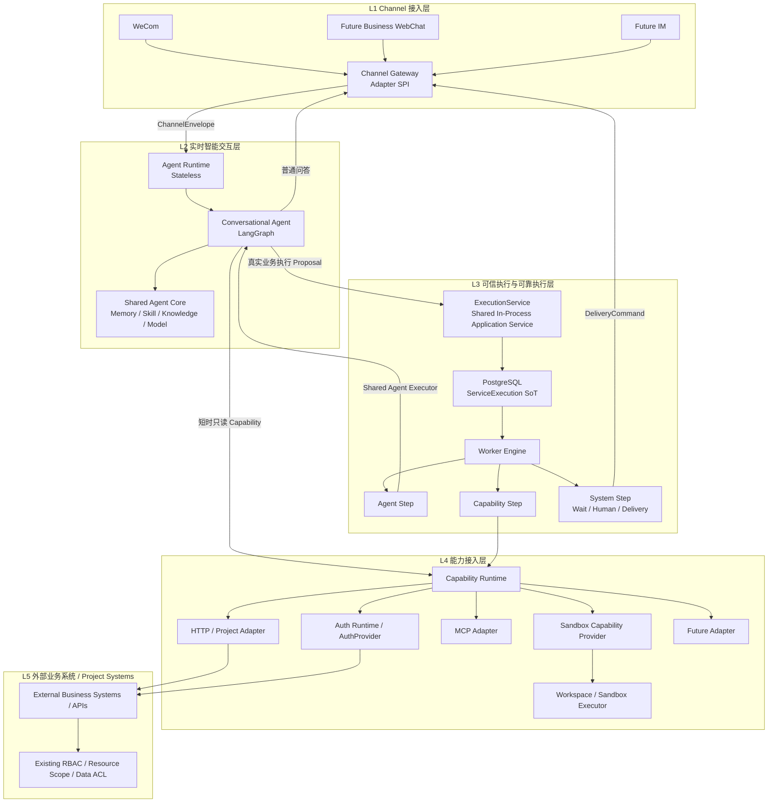

这条主链表达的上下游关系是：

```text
WeCom / Future WebChat / Future IM
                ↓
          Channel Gateway
                ↓
           Agent Runtime
          /             \
普通问答/短查询          真实业务执行
      ↓                        ↓
Capability Runtime       ExecutionService
                               ↓
                     PostgreSQL ServiceExecution
                               ↓
                         Worker Engine
                    /          |          \
              Agent Step   Capability   System Step
                  ↓            ↓        Wait/Human/
               LangGraph  Capability    Delivery
                               ↓
                       External Business APIs
                               ↓
                  External RBAC / Data ACL
```

### Control Plane：旁路管理面

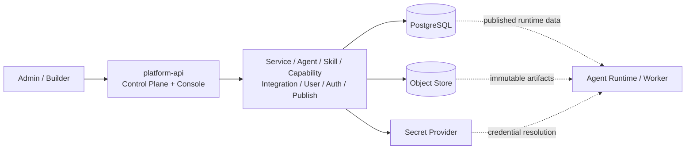

`platform-api` 不位于普通用户的实时执行主链。Console 暂时不可用，不应导致已经发布的 Service 和正在运行的 Execution 全部停止。

### Framework Core 与 Project Integration 边界

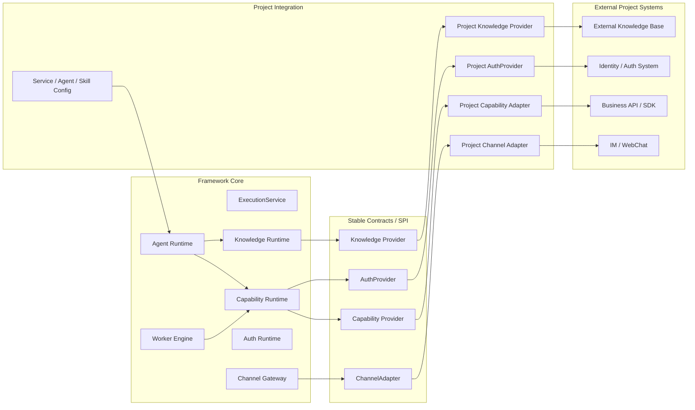

核心约束是：

```text
Framework Core
→ 只依赖稳定 Contract/SPI

Project Integration
→ 实现具体业务、认证、知识和 Channel 接入

External Project Systems
→ 继续保持原有业务模型和权限体系
```

任何新项目接入默认不修改 Framework Core。

### ProjectPlatform 与 ProjectIntegration 的物理边界（V1.8）

```text
ProjectPlatform
→ 产品/业务对象
→ DB/API/Console
→ 用户认证模板
→ Platform Service Capability 归属

ProjectIntegration
→ 代码/部署扩展
→ Manifest / Provider / Adapter / Seeds
→ 启动 Registry
→ 不作为普通 CRUD
```

ProjectIntegration 可以 seed ProjectPlatform/Capability/Agent/Service，但 seed 后的产品对象遵循各自领域模型。运行时不得依赖 Console 在线才能解析已装配 Integration。

### 核心边界

**边界 1：Agent Proposal 与可信执行分离**

```text
LLM / Agent output
→ 只能形成 Proposal

ExecutionService
→ deterministic validation
→ ServiceExecution
```

**边界 2：ExecutionService 是逻辑边界，不是独立网络服务**

V1 推荐：

```text
packages/execution/execution_service.py
```

Agent Runtime 在用户确认后直接复用该 Application Service：

```text
Agent Runtime
→ ExecutionService.create(...)
→ PostgreSQL
→ Worker
```

platform-api 需要管理员手工发起任务时也调用同一模块。

**边界 3：在线 Agent 与后台 Worker 分离**

```text
Agent Runtime
= realtime / short-lived / stateless compute

Worker Engine
= durable / retryable / resumable background execution
```

**边界 4：业务语义与接入协议分离**

```text
Service / Agent
→ Capability Contract
→ Implementation(API / MCP / Browser / Future)
```

**边界 5：Channel 与 Agent 解耦**

```text
WeCom / Future WebChat / Future IM
→ Channel Adapter
→ ChannelEnvelope
→ Agent Runtime
```

新增 WebChat 只增加 Adapter，不改变 Agent/Memory/Service/Execution 模型。


**边界 6：Built-in Tool 仍属于 Capability，Workspace/Sandbox 只是执行环境**

```text
Agent / Worker
    ↓
Capability Runtime
    ↓
SandboxCapabilityProvider
    ↓
Workspace + SandboxExecutor
    ↓
filesystem / process
```

Framework 不新增 `Tool Runtime`。`filesystem.read/write/edit/glob/grep`、`shell.execute` 使用与其他 Capability 相同的：

```text
Capability Contract
Agent Capability Binding
Effective Capability Resolver
risk_level / side_effect / invocation_policy
Audit / Trace
```

Agent Runtime 禁止直接调用 Host `subprocess` 或访问任意 Pod 文件路径。

---

## 3.3 进程、部署与运行视图

### V1 最终镜像

V1 核心后台只交付四个应用镜像：

| 镜像 | 技术栈 | 默认副本 | 是否在普通用户运行主链 | 职责 |
|---|---|---:|---:|---|
| `platform-api` | Python/FastAPI + Console 静态资源 | 1 | 否 | Control Plane、Console、Service/Agent/Skill/Capability/User/发布/审计 |
| `agent-runtime` | Python/LangGraph | 1~2 | 是 | 无状态实时 Agent、Conversation/Memory、意图识别、短查询 |
| `worker` | Python | 1 | 是 | Worker Engine、长任务、Retry/Wait/Recovery/Delivery |
| `channel-gateway` | Node.js/TypeScript | 1（V1单副本） | 是 | 多 Channel 连接、消息标准化、路由、流式回复、主动投递 |

不单独交付：

```text
console-web
```

React/Vite Console build 结果直接打入 `platform-api` 镜像。

`platform-api` 的定位是管理员/Builder 控制面，一般无需根据普通用户流量扩容；默认 1 个副本即可，后续只有 HA/管理面容量有真实要求时再增加。

### Agent Runtime 和 Worker 不按用户动态创建 Pod

平台部署时通过 Helm 一起创建长期运行的 Deployment：

```text
helm install / upgrade

├── platform-api
├── agent-runtime
├── worker
└── channel-gateway
```

禁止重新采用历史模型：

```text
新用户申请
→ platform-api 调 Kubernetes API
→ 创建专属 Agent Pod
→ 用户绑定 Pod
```

正确模型：

```text
所有用户
→ Agent Runtime Pool

所有 ServiceExecution
→ Worker Pool
```

用户、Conversation、Memory、Execution 与具体 Pod 不建立长期绑定关系。

副本扩缩由：

```text
Kubernetes Deployment
HPA
KEDA（后续按真实指标需要）
```

管理，而不是 `platform-api` 直接创建/销毁普通 Agent/Worker Pod。

Phase 1 不优先做 scale-to-zero，避免 cold start 和恢复路径复杂化。

### Channel Gateway 独立部署

`channel-gateway` 与其他服务独立 Deployment，原因是运行模型不同：

```text
platform-api
→ HTTP 管理 API / Console

agent-runtime
→ LLM / LangGraph / realtime stream

worker
→ durable background execution

channel-gateway
→ long-lived connection / heartbeat / reconnect / proactive delivery
```

Channel Gateway 可以是：

```text
Connection Stateful
```

允许本地维护：

```text
WebSocket connection
heartbeat
connection ownership
short-lived stream reply handle
```

但必须保持：

```text
Business Stateless
```

以下数据不能以 Gateway 本地内存/磁盘为权威事实源：

```text
PlatformUser
User Memory
Conversation
Authorization
Service
ServiceExecution
DeliveryRoute
```

### Channel Adapter 模型

同一 `channel-gateway` 镜像支持：

```text
Channel Gateway
└── Adapter SPI
    ├── WeCom Adapter         ← Phase 1
    ├── WebChat Adapter       ← Future
    ├── Mattermost Adapter    ← Future / Dev
    ├── Feishu Adapter        ← Future
    └── DingTalk Adapter      ← Future
```

不默认为每个 IM 建一个不同产品/仓库/镜像。

如果未来某 Channel 需要独立扩缩，可以使用同一镜像不同配置：

```text
channel-gateway --channels=wecom
channel-gateway --channels=feishu,mattermost
```

### 生产部署关系

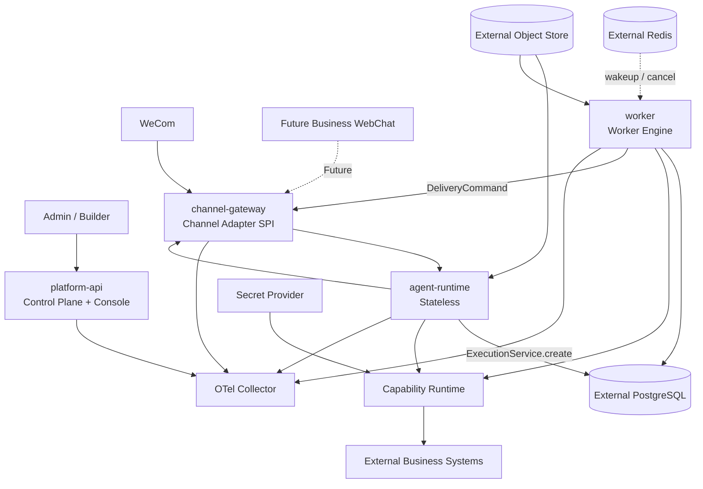


---

## 3.4 技术栈基线

### Backend / Control / Runtime

```text
Python 3.12+
FastAPI
Pydantic v2
SQLAlchemy 2 Async
asyncpg
Alembic
uv
```

约束：

- API/DTO 统一使用 Pydantic；
- DB 访问统一 SQLAlchemy 2 Async；
- 业务事务边界显式；
- Alembic 管理生产 Schema；
- 开发和生产不维护两套领域持久化实现；
- PostgreSQL 为权威数据库。

### Agent

```text
LangGraph 1.x
LangChain Core
Model Adapter / Factory
PostgreSQL Checkpointer
```

LangGraph 负责：

```text
Agent state
reasoning
planning
tool/capability selection
agent-node orchestration
agent-internal checkpoint
agent-internal interrupt/resume
```

不负责：

```text
整个 ServiceExecution 生命周期
全局 queue/lease
业务级 scheduler
所有 delivery
所有 fixed workflow
所有后台 job
```

### Worker

```text
Python
PostgreSQL execution tables
SELECT ... FOR UPDATE SKIP LOCKED
lease / heartbeat
next_run_at
idempotency
bounded retry
```

Redis：

```text
wakeup
cancel fast signal
stream/pubsub
cache
```

但 Redis 不是业务 SoT。

### Frontend

```text
React
TypeScript
Vite
Semi Design
pnpm
```

Console UI 统一规范：

```text
列表左上：新增
列表右上：搜索/筛选
列表右下：分页
行末：操作
新增/编辑：标准弹窗或独立编辑页
详情：只读 Drawer
```

### Channel Gateway / 首个 WeCom Adapter

```text
Node.js
TypeScript
@wecom/aibot-node-sdk
```

企业微信 Bot WebSocket 已在历史项目中验证支持：

```text
消息接收
流式回复
主动推送
```

`WecomTeam/wecom-openclaw-plugin` 用作协议/工程实现参考，但不直接运行 OpenClaw Plugin ABI。

第一阶段：

```text
WeCom Bot WebSocket
→ Thin Channel Gateway
→ Normalized ChannelEnvelope
→ Agent Runtime
```

### Storage / Infra

```text
PostgreSQL
Redis
S3-compatible Object Store
Secret Provider
OpenTelemetry Collector
Kubernetes
Helm
Docker
```

可选后置：

```text
pgvector
```

只有当 User Memory/Knowledge 确实需要语义检索时启用。

### 内部通信

V1：

```text
HTTP / REST
OpenAPI
Pydantic Contract
SSE（Web Streaming）
```

暂不引入：

```text
gRPC
Kafka
NATS
```

---

## 3.5 信任边界与控制面/执行面

### Trust Boundary

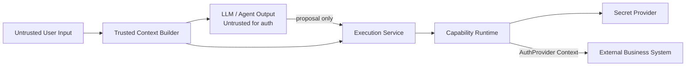

### TrustedExecutionContext

不允许 LLM 自己提供或修改：

```text
actor_user_id
tenant_id
channel_identity
auth_context_ref
effective_capability_set
service_release_ref
resource_scope
risk_policy
delivery_route
```

这些由 Trusted Context Builder 从数据库/身份映射/授权系统解析。

### 双层授权模型

第一层：Framework 侧使用授权。

```text
这个 Agent/Service 是否允许调用 Capability X？
这个 PlatformUser 是否允许使用这个 Service？
Tenant/Project Policy 是否允许？
```

第二层：External Business System 侧业务授权。

```text
当前真实业务身份
是否允许访问目标 Resource Scope？
是否允许执行目标动作？
```

第二层通过项目实现的 `AuthProvider` 建立调用身份，并由外部业务系统继续做最终 RBAC/ACL 判断。

因此 Framework Core 不复制所有接入项目的业务权限模型。


### Control Plane Down 原则

`platform-api/Console` 暂时故障时：

- 新发布/新配置不可用是允许的；
- 已经发布的 Service Definition/Capability/Agent 运行时投影应可从共享 Store 获取；
- 正在运行的 Worker Execution 应继续；
- AuthProvider/Auth Context 解析不能强依赖 Console Web 进程；
- Channel Gateway 的存量连接和后台 Delivery 尽量继续运行。

---

# 4. 核心模块、数据结构与系统流程

## 4.1 核心模块职责与边界

### 4.1.1 Platform API / Control Plane

负责：

```text
Service Draft / Published Snapshot
Agent Definition
Skill / Knowledge Metadata
Capability / Implementation
Model Config
Credential Ref
User / Authorization
Channel Binding
Draft / Publish / Disable
Execution command/query
Audit
```

不负责：

```text
持续运行 Agent Graph
消费后台 Execution
持有用户 External Session 明文
直接成为 Runtime truth 的唯一在线节点
```

### 4.1.2 Agent Runtime

负责：

```text
Conversation turn
User Memory retrieval
Intent recognition
Service recognition
Information completion
Skill/Knowledge load
Agent reasoning
Read/short/no-side-effect Capability calling
Structured confirmation
Streaming response
```

必须无状态。

允许本地：

```text
current request objects
connection pool
bounded cache
current SSE/WebSocket stream
model client
short-lived LangGraph state before checkpoint
```

禁止本地 SoT：

```text
User
ChannelBinding
External Session
Memory
Conversation history
Published Service
Execution
Approval/Human Decision
Credential
```

### 4.1.3 Shared Agent Executor

统一接口示意：

```python
class AgentExecutor(Protocol):
    async def invoke(self, context, input) -> AgentResult: ...
    async def resume(self, thread_id, command) -> AgentResult: ...
```

第一阶段实现：

```text
LangGraphAgentExecutor
```

由两处复用：

```text
Agent Runtime
+
Worker Engine / Agent Step
```

避免两套 Agent。

### 4.1.4 ExecutionService

ExecutionService 是**共享的确定性 Application Service**，不是独立微服务，也不专属于 `platform-api`。

建议代码位置：

```text
packages/execution/execution_service.py
```

职责：

```text
Service exists / published validation
actor/user authorization
resource scope validation
input schema validation
confirmation validation
idempotency validation
runtime version resolve
ExecutionSnapshot build
ServiceExecution transaction create
worker wake-up hint
```

用户确认后：

```text
Agent Runtime
→ ExecutionService.create(...)
→ PostgreSQL
→ Worker Engine
```

管理员手工发起：

```text
platform-api
→ 同一个 ExecutionService.create(...)
```

这样可以保证可信执行边界只有一份实现，同时 `platform-api` 不成为普通用户执行链同步依赖。


### 4.1.5 Worker Engine

负责：

```text
claim
lease
heartbeat
reclaim expired RUNNING
execute step
persist result
wait
timer
retry
timeout
cancel
human checkpoint
resource governance
delivery trigger
```

Worker 不重新理解用户原始 Prompt。

Worker 输入必须是结构化的：

```text
ServiceExecution
+
ExecutionSnapshot
```

### 4.1.6 Capability Runtime

Capability Runtime 是 Skill/Agent/Worker 共同使用的稳定业务调用层。

组成：

```text
Capability Registry
Effective Capability Resolver
Capability Executor
PlatformServiceAdapter
HttpAdapter
MCPAdapter
SandboxAdapter
AuthContextResolver
DataRetrievalExecutor
ResultMaterializer
```

Implementation V1 固定：`PLATFORM_SERVICE / HTTP / MCP / SANDBOX`。

- PLATFORM_SERVICE：必须绑定 ProjectPlatform，可使用当前用户 × 项目平台 Credential；
- HTTP/MCP：不绑定 ProjectPlatform；需要认证时使用 Implementation 共享 Secret；
- SANDBOX：只在受控 Workspace/Sandbox 执行白名单入口。

统一接口只接受 Capability Contract + TrustedExecutionContext，Service/Skill 不直接依赖项目 URL/SDK。

#### Data Retrieval Policy / 自动分页

支持 PAGE / OFFSET_LIMIT / CURSOR。

PAGE 示例：

```text
page_param = page
page_size_param = page_size
start_page = 1
page_size = 100
items_path = data.items
total_path = data.total(optional)
```

结束判断：

```text
next_cursor / has_more（如有）
→ total（如有）
→ len(items) < page_size（下游协议保证时）
→ items == [] 固定兜底
```

同时强制：`max_pages / max_items / max_duration_ms / duplicate_page_detection`。

Agent/Skill 一次调用，对内可执行 N 次请求；Skill 不写分页循环，LLM 不逐页调用。大结果优先聚合或 Artifact 化。

### 4.1.7 Auth Runtime / ProjectPlatform / AuthProvider

V1 产品认证关系：

```text
PlatformUser × ProjectPlatform
→ 最多一套 UserProjectCredential
```

ProjectPlatform 定义认证字段模板；真实 Secret 只存 Secret Provider 引用。

Platform Service 调用：

```text
Capability.project_platform_id
→ 当前 User × ProjectPlatform Credential
→ AuthProvider / Secret Provider
→ InvocationCredential
```

HTTP/MCP 等非 Platform Service 不读取用户项目平台账号，使用 Implementation 自身共享认证。

复杂 OAuth/Session Exchange 仍由 AuthProvider 扩展；外部系统仍做业务数据权限最终判定。

### 4.1.8 Channel Gateway

Channel Gateway 独立部署。产品上 Channel 配置位于 Agent 的“IM 接入”，不设独立 Channel 一级菜单。

V1 WeCom：

```text
Bot01 ─┐
Bot02 ─┼─ WebSocket → Channel Gateway → Agent Runtime Pool
Bot03 ─┘

bot01 → Agent01
bot02 → Agent02
bot03 → Agent03
```

一个 Gateway 可维护多个 Bot 长连接；一个 bot_id 只服务一个 Agent，一个 Agent V1 最多一个 WeCom Bot。

普通消息三段解析：

```text
bot_id → Agent                         # 去哪
external_user_id → PlatformUser       # 是谁
User + Agent → AgentAccessGrant       # 能不能用
```

`/bind` 只建立外部身份映射。如果 WeCom 同一用户跨 Bot 身份稳定则只需绑定一次；若是 Bot 级隔离，允许一个 PlatformUser 绑定多个 ChannelIdentity，但授权关系不复制。

Gateway 可保存连接临时状态，但 User/Grant/Memory/Conversation/Execution/DeliveryRoute 必须外置。

## 4.2 核心领域对象与数据结构

### 数据库设计原则

所有 Framework 自建数据库表必须统一包含以下公共字段：

```text
is_deleted  BOOLEAN NOT NULL DEFAULT FALSE
create_time TIMESTAMPTZ NOT NULL DEFAULT now()
update_time TIMESTAMPTZ NOT NULL DEFAULT now()
```

约束：

- 默认查询必须过滤 `is_deleted = false`；
- 删除业务数据默认执行逻辑删除，不做物理删除；
- `create_time` 由数据库默认值生成；
- `update_time` 在 ORM 更新时自动刷新；任何绕过 ORM 的 SQL 更新必须同步更新 `update_time`；
- 需要“删除后允许重新创建同名资源”的唯一约束使用 PostgreSQL partial unique index：`WHERE is_deleted = false`；
- append-only 的 Event/Audit 表也保留这三个字段以满足统一数据库治理，但业务上通常不执行删除；
- LangGraph Checkpointer 等第三方框架自管理表不强行改列，避免破坏第三方 schema；这类表不属于 Framework 自建业务表。


PostgreSQL 是 V1 的业务权威数据源。数据库模型遵循以下原则：

```text
1. Agent Runtime / Worker / Channel Gateway 不以本地内存或本地磁盘保存业务 SoT。
2. 业务发布只有 Service 暴露“草稿 / 已发布”两态；Agent 直接生效 + revision（V1.7 D04）。
3. Skill/静态知识文件使用不可变 Artifact + checksum。
4. Model、Capability Implementation、Knowledge Source、Channel Config 等运行配置保存后直接生效，并通过 revision/audit 留痕。
5. ServiceExecution 通过轻量 ExecutionSnapshot 固定本次任务必须保持一致的业务逻辑。
6. User Authorization、Credential、External Session、紧急禁用等安全状态实时读取，不被 Snapshot 固定。
7. 大字段、报告、Skill Package、知识文件放 Object Store；PostgreSQL 保存 metadata/ref/checksum。
8. LangGraph Checkpointer 使用独立的框架管理表，不与 ServiceExecution 业务表混成同一个领域模型。
```

### ER 图 A：用户、项目平台、通道、Agent、Service、Skill 与 Capability

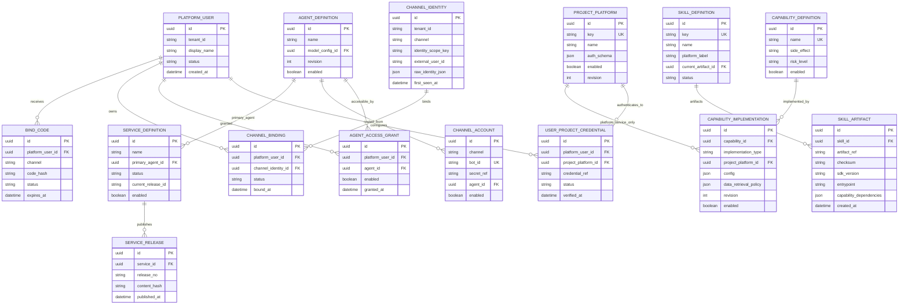

> Agent 与 Skill / Direct Capability / 可调用 Service 的多对多绑定使用轻量 binding 表。Skill 内部 Capability 依赖来自 skill.yaml，不是 Console binding。`project_platform_id` 只在 PLATFORM_SERVICE 时必填。ProjectIntegration 是启动 Registry 投影，不作为该 DB ER 中的持久业务表。

### ER 图 B：会话、可靠执行、进度、产物与投递

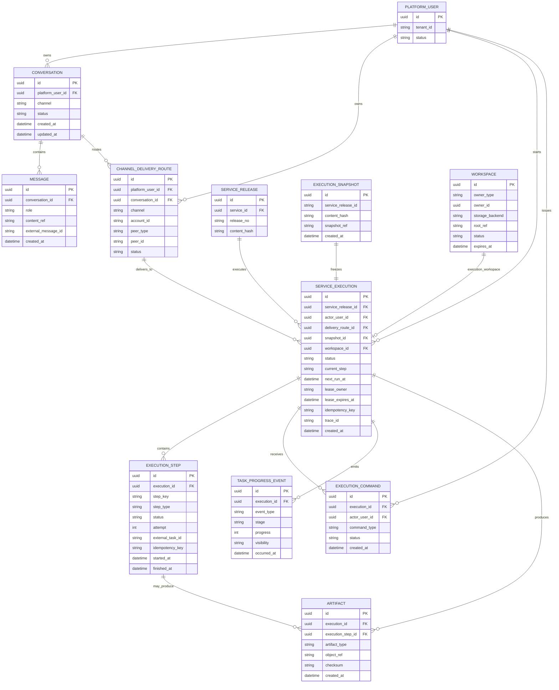

### 数据关系说明

上面两张 ER 图对应两个不同的数据生命周期：

```text
配置/身份域
→ 低频管理、直接生效或 Draft/Published
→ PlatformUser / Channel / Agent / Service / Capability / Knowledge

运行域
→ 高频追加、可靠恢复、审计
→ Conversation / Message / ServiceExecution / Step / Event / Artifact
```

两类数据都落 PostgreSQL，但在代码和 Repository 层保持领域边界，避免 Control Plane 配置表和 Worker 执行表相互污染。

### 关键索引与唯一性约束

V1 至少需要以下数据库约束：

```text
channel_identity:
UNIQUE(tenant_id, channel_type, identity_scope_key, external_user_id)

channel_binding:
同一个 channel_identity 同时最多一个 ACTIVE binding

capability_definition:
UNIQUE(tenant_id, key)

service_release:
UNIQUE(service_id, release_no)
UNIQUE(service_id, content_hash)

service_execution:
UNIQUE(idempotency_key) 或按 tenant/user/service 形成组合唯一约束
INDEX(status, next_run_at)
INDEX(status, lease_expires_at)
INDEX(actor_user_id, created_at)
INDEX(trace_id)

execution_step:
UNIQUE(execution_id, step_key, attempt)
INDEX(execution_id, status)

task_progress_event:
INDEX(execution_id, occurred_at)

message:
INDEX(conversation_id, created_at)

workspace:
INDEX(tenant_id, owner_type, owner_id)
INDEX(status, expires_at)
```

Worker claim 所需的 `status + next_run_at + lease_expires_at` 索引必须在第一阶段就建立，否则 Execution 数量增长后数据库扫描会成为可靠执行面的瓶颈。

### LangGraph Checkpointer 表边界

LangGraph PostgreSQL Checkpointer 的表由 LangGraph/Checkpointer 组件自身维护，逻辑上只服务：

```text
Agent Graph State
thread/checkpoint
Agent internal interrupt/resume
```

它不替代：

```text
service_execution
execution_step
execution_command
task_progress_event
```

业务任务状态仍以 Framework 自己的 Execution 表为权威事实源。


### PlatformUser

```text
platform_user
- id
- tenant_id
- external_platform_user_ref
- display_name
- status
- created_at
- updated_at
```

### ChannelAccount / ChannelIdentity / ChannelBinding / BindCode

```text
channel_account
- id
- channel
- bot_id / account_key
- secret_ref
- agent_id
- enabled
- revision
```

一个具体 bot_id V1 只绑定一个 Agent。产品入口在 Agent 的 IM 接入页。

```text
channel_identity
- id
- tenant_id
- channel
- identity_scope_key
- external_user_id
- raw_identity_json
- first_seen_at

channel_binding
- id
- platform_user_id
- channel_identity_id
- status
- bound_at
- binding_method

bind_code
- id
- platform_user_id
- channel
- code_hash
- status(PENDING/USED/EXPIRED/REVOKED)
- expires_at
- used_at
```

绑定码只保存 hash，不包含 agent_id/bot_id/service_id。`identity_scope_key` 用于兼容“外部身份跨 Bot 稳定”或“Bot 级隔离”两种现实协议。

### AgentAccessGrant（V1.8）

```text
agent_access_grant
- id
- platform_user_id
- agent_definition_id
- enabled
- granted_by
- granted_at
- revoked_at

UNIQUE(platform_user_id, agent_definition_id)
```

它表达“用户能否使用 Agent”，不是消息路由。不得包含 runtime_pod_id/worker_id/workspace/bot_id。

### ProjectPlatform / UserProjectCredential

```text
project_platform
- id
- key
- name
- description
- auth_schema
- enabled
- revision

user_project_credential
- id
- platform_user_id
- project_platform_id
- credential_ref
- external_session_ref(optional)
- expires_at(optional)
- status
- verified_at

UNIQUE(platform_user_id, project_platform_id)
```

同一个用户同一个项目平台只配置一套账号。auth_schema 只定义字段结构；实际 Secret 进入 Secret Provider。复杂 OAuth/Session 仍可由 AuthProvider 实现。

### UserMemory

```text
user_memory
- id
- tenant_id
- platform_user_id
- memory_type
- content
- source
- source_ref
- confidence
- created_at
- updated_at
- expires_at
- status
```

V1 主要存：

```text
明确记住的信息
稳定偏好
语言/输出格式
长期工作上下文
```

不存：

```text
当前设备列表
当前权限
当前任务进度
最新扫描结果
```

### Conversation / Message

```text
conversation
- id
- platform_user_id
- channel
- status
- summary
- created_at
- updated_at

message
- id
- conversation_id
- role
- content
- external_message_id
- created_at
```

Conversation Summary 是上下文压缩，不自动成为 User Memory。

### ServiceDefinition / Published Service Snapshot

```text
service_definition
- id
- name
- owner
- status

service_release
- id
- service_id
- release_no
- content_hash
- published_payload
- published_by
- published_at
```

### AgentDefinition / Skill / Knowledge

```text
agent_definition
- id
- name
- description
- instructions
- model_config_id
- memory_policy
- revision
- enabled
```

Agent V1 一个模型，保存后直接对新请求生效，不走 Draft/Publish。

```text
skill_definition
- id
- key
- name
- description
- platform_label
- current_artifact_id
- status

skill_artifact
- id
- skill_id
- artifact_ref
- checksum
- sdk_version
- entrypoint
- manifest_json
- capability_dependencies_json
- created_at
```

能力依赖来自 manifest，可做只读索引投影但 manifest 是事实源。Knowledge 当前为规划项，不在 Phase 1 固定 knowledge_source 表。

### Capability

```text
capability_definition
- id
- name
- description
- input_schema
- output_schema
- side_effect
- risk_level
- invocation_policy            # 直调结论：DIRECT | EXECUTION_ONLY（V1.13.1 D1 收敛；凭据来源见 implementation.auth_mode）
- idempotency_semantics
- enabled

capability_implementation
- id
- capability_id
- implementation_type(PLATFORM_SERVICE/HTTP/MCP/SANDBOX)
- project_platform_id(nullable; PLATFORM_SERVICE required)
- config
- execution_policy{deadline_ms,max_retries,backoff_ms}
- data_retrieval_policy
- revision
- enabled
```

异步任务不作为 implementation_type；分页策略属于 Implementation。

### Workspace

```text
workspace
- id
- tenant_id
- owner_type(conversation/execution)
- owner_id
- storage_backend
- root_ref
- status
- created_at
- expires_at
```

V1 不要求为 Workspace 内每个普通临时文件建立数据库行。文件内容可以存在受控 Workspace Storage/Object Store；需要作为正式交付物/审计证据的文件才进入 `artifact`。

Workspace 的权威 metadata 必须外置；Agent Runtime/Worker 的本地目录不能成为 Workspace SoT。

### ServiceExecution

```text
service_execution
- id
- tenant_id
- service_release_id
- actor_user_id
- resource_scope_json
- input_json
- status
- waiting_reason
- current_step
- next_run_at
- lease_owner
- lease_expires_at
- attempt
- max_attempts
- idempotency_key
- delivery_route_id
- snapshot_id
- trace_id
- created_at
- started_at
- finished_at
- cancel_requested_at
```

状态词表：

```text
PENDING
RUNNING
WAITING
WAITING_HUMAN
RETRY_WAIT
SUCCEEDED
FAILED
CANCELLING
CANCELLED
```

### ExecutionStep

```text
execution_step
- id
- execution_id
- step_key
- step_type(agent/capability/system)
- status
- attempt
- input_json
- output_json / artifact_ref
- external_task_id
- idempotency_key
- started_at
- finished_at
- error_code
- error_detail_ref
```

### ExecutionSnapshot

轻量冻结：

```text
service release_no/content_hash
agent release_no 或 revision
必要的 model config snapshot
skill artifact checksum
knowledge binding refs
capability contract names
业务阶段/确认点/执行逻辑
delivery route ref
trace_id
```

以下内容不放入固定 Snapshot，而在每次执行时实时解析：

```text
current user authorization
credential / platform session
capability emergency disable
tenant/security status
capability implementation（默认取当前有效实现）
```

Credential 明文永远不进入 Snapshot。

### TaskProgressEvent / DeliveryRoute

```text
task_progress_event
- execution_id
- event_type
- stage
- progress
- message
- visibility
- occurred_at
```

```text
channel_delivery_route
- id
- platform_user_id
- channel
- account_id
- peer_type
- peer_id
- conversation_id
- last_active_at
- status
```

固定原则：

```text
ProgressEvent = 发生了什么
DeliveryRoute = 发到哪里
```

---


### 配置生效与版本管理模型

V1 不建设通用版本管理系统。

控制台主要由内部管理员/Builder 使用，配置变化频率较低，因此默认原则是：

```text
能直接生效的配置
→ 保存后校验
→ 直接对后续请求生效
```

只有真正存在“编辑中的内容不能立即影响线上用户”这一业务需求时，才引入发布语义。

#### 四类对象的生效模型

| 类型 | 代表对象 | V1 生效方式 | 是否保留历史 |
|---|---|---|---|
| 业务定义 | Service | 草稿 → 已发布 | 是，内部 release/audit |
| 不可变资源 | Skill Package、静态知识文件 | 上传生成 immutable artifact + checksum | 是 |
| 运行配置 | Agent、ModelConfig、Capability Implementation、ProjectPlatform、ChannelAccount、Memory Policy | 保存后直接生效 | 是，revision/audit |
| 安全/用户状态 | User、Authorization、Credential、External Session、紧急禁用状态 | 实时生效 | 是，audit |

#### Service：草稿 / 已发布两态

Service 是 V1 最重要的业务发布单元。

```text
当前已发布 Service
        │
      编辑
        ▼
      Draft
        │
   保存 / 测试
        │
      发布
        ▼
Published Snapshot
```

Console 只需要面向管理员展示：

```text
当前已发布
当前草稿（如存在）
```

不要求管理员维护：

```text
v1 / v2 / v3
Active / Retired
Version Dependency Graph
Compatibility Matrix
```

系统内部允许生成：

```text
release_no
published_at
published_by
content_hash
```

用于审计、回滚和 Execution Snapshot，但这些字段不产品化为独立“版本中心”。

#### Agent：保存后直接生效 + revision/audit

V1 Agent 不再区分“关键/非关键”，也不走 Draft/Test/Publish：

```text
编辑 → 校验 → 保存 → revision+1 → 对后续新请求生效
```

正在执行的 ServiceExecution 是否继续使用旧 Agent 投影由 ExecutionSnapshot 决定。

#### Skill：离线开发 + 不可变 Artifact + 导入新版本

```text
IDE 修改 Python / skill.yaml
→ Mock
→ Dev Gateway 联调
→ validate / pack
→ Console 导入新版本
```

每次导入都创建新的 Artifact + checksum。Skill 详情全部只读：基本信息、能力依赖、使用智能体、制品版本、校验结果。

#### Built-in Tool / Sandbox Capability：内置注册，授权后使用

框架内置 Tool 不单独建立版本中心：

```text
filesystem.read
filesystem.write
filesystem.edit
filesystem.glob
filesystem.grep
shell.execute
```

它们启动时注册到 Capability Registry，管理员只需要控制：

```text
enabled
Agent capability binding
risk policy
timeout / size limit
Sandbox policy
```

配置变更保存后直接生效；Execution 是否允许直接调用仍由 `side_effect + risk_level + invocation_policy` 判断（V1.13.1 起用单一结论字段，见 ADR-057）。

#### Capability：实现配置默认直接生效

稳定业务合同：

```text
resource.get
external_job.submit
```

如果仅发生：

```text
URL 改变
service-name 改变
timeout 改变
认证实现改变
```

属于 `CapabilityImplementation` 配置变化，保存后直接生效。

只有当以下发生不兼容改变：

```text
业务语义
input/output schema
权限语义
side-effect 语义
```

才新建新的 Capability Contract，而不是为每次配置变化创建新版本。

#### Knowledge：规划项

当前不冻结 Knowledge Source 的 Console/API/DB 生效模型。真实外部知识库接入场景明确后再决定 Provider Contract、权限、版本和索引语义。

#### Execution Snapshot：只冻结必须保持一致的业务逻辑

版本管理简化并不意味着运行中任务可以漂移。

`ServiceExecution` 创建时仍生成轻量 `ExecutionSnapshot`，但只记录影响本次执行确定性的内容：

```text
service_release_id / content_hash
agent_release_id or agent_revision
skill artifact checksum
固定业务步骤/确认点
必要的模型配置快照
必要的知识绑定引用
```

Snapshot 不要求把所有运行配置复制一份，也不代表所有被引用对象都必须拥有独立业务版本。

#### Snapshot 与实时安全上下文必须分离

以下内容必须实时生效，不能被旧 Execution Snapshot 锁死：

```text
当前 User/Authorization
Credential / External Session
账号禁用状态
Capability 紧急停用
Tenant 状态
安全策略
```

因此运行时明确区分：

```text
ExecutionSnapshot
= 固定“这次任务按什么业务逻辑执行”

RuntimeDynamicContext
= 实时决定“现在是否仍允许执行”
```

例如一个三天前创建、今天继续恢复的任务，在恢复时必须重新检查当前用户授权，不能因为创建时有权限就继续沿用旧权限。

#### Capability Implementation 默认不 pin

V1 默认：

```text
ExecutionSnapshot
→ 记录 Capability Contract name

Capability Runtime
→ 每次调用使用当前有效 Implementation
```

这样管理员修复错误 URL/认证配置后，正在运行的长任务后续调用可以立即使用修复后的实现。

只有未来确有强一致性需求时，才允许为特定 Capability 增加：

```text
pin_implementation = true
```

V1 不预先建设。

#### 发布必须原子生效

Service/Agent 从 Draft 发布时：

```text
读取完整 Draft
→ Schema Validate
→ Dependency Validate
→ 安全/权限检查
→ 生成 Published Snapshot
→ 原子切换 current published
```

不能出现：

```text
Prompt 已生效
Skill 仍是旧配置
Capability Binding 正在切换
```

#### 紧急停用绕过草稿流程

以下操作必须直接、实时生效：

```text
Disable Agent
Disable Service
Disable Capability
Disable User
Revoke Credential
```

紧急安全处置不要求先创建 Draft 再 Publish。


## 4.3 关键系统流程

### 4.3.1 通用 Channel Identity 绑定与普通消息路由

`/bind` 只把外部用户身份映射为 PlatformUser：

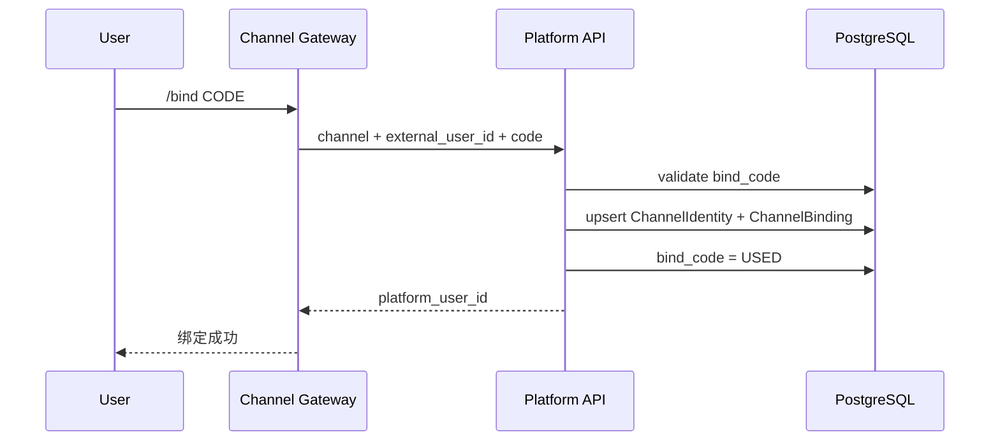

普通消息：

```text
bot_id → ChannelAccount.agent_id
external_user_id → PlatformUser
PlatformUser + Agent → AgentAccessGrant
→ Agent Runtime
```

未绑定身份提示 `/bind`；已绑定但无 Agent 权限提示无权限。V1 一个 bot_id 一个 Agent，因此不需要 Router LLM 猜测消息目标。

### 4.3.2 普通聊天/查询型 Capability

用户请求一个短时、只读、无副作用的业务查询，例如：

> 查询资源 X 的当前状态。

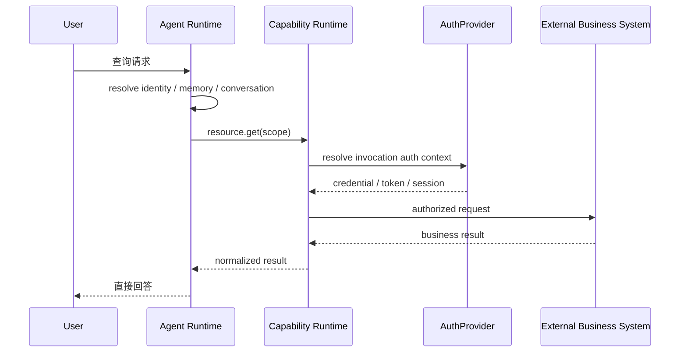

此类调用满足：

```text
Read
+
Short-lived
+
No side effect
```

无需创建 ServiceExecution。


### 4.3.2A 文件与 Shell Tool 调用

只读、短时能力：

```text
Agent Runtime
→ Capability Runtime
→ filesystem.read / glob / grep
→ Workspace/Sandbox
→ direct result
```

有副作用、高风险或长时间能力：

```text
Agent Proposal
→ ExecutionService
→ Worker
→ Capability Step
→ shell.execute / filesystem.write / filesystem.edit
→ Sandbox
```

V1 不通过 Capability 名称硬编码路由，而由 Contract 元数据判定：

```text
side_effect
risk_level
invocation_policy
```

例如 `shell.execute` 默认应为高风险且 `invocation_policy=EXECUTION_ONLY`；开发者可以为受控只读命令定义更窄的 Capability，而不是把一个无限制 shell 授权给普通 Agent。（示意，判定以 CAP-API-06 direct_invocation 派生字段 + ADR-057 为准）

### 4.3.3 Agent 意图识别后发起 ServiceExecution

Agent 识别出用户希望执行某个需要可靠运行的 Service，并形成结构化意图：

```json
{
  "service": "reference-async-service",
  "input": {
    "resource_scope": {
      "type": "project-defined",
      "refs": ["resource-1", "resource-2"]
    },
    "parameters": {}
  }
}
```

`resource_scope` 收敛形态 `{type, refs[], attributes?}`（ADR-050）。

用户确认后，Agent 只能提交：

```text
StartServiceExecutionProposal
```

ExecutionService 再做确定性处理：

```text
identity resolve
→ Service authorization
→ Resource Scope validation
→ input schema validation
→ confirmation validation
→ idempotency validation
→ resolve published Service/Agent
→ build ExecutionSnapshot
→ create ServiceExecution transaction
```

LLM 不得直接提供或覆盖：

```text
actor_user_id
tenant_id
auth_context
effective_capability_set
delivery_route
current security state
```


### 4.3.4 Worker 执行通用 Async Capability

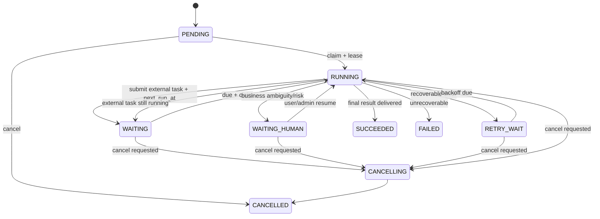

总设状态图仅示意，详见08+模块05；`cancel_requested_at` 优先于 deadline。

等待阶段不占用 Python coroutine：

```text
status = WAITING
next_run_at = ...
lease = NULL
```

### 4.3.5 Worker 崩溃恢复

关键历史教训：不能只扫描 `PENDING/WAITING`。

Worker A：

```text
claim
→ status=RUNNING
→ lease_expires_at=T+30s
→ crash
```

Worker B 必须能够 reclaim：

```sql
eligible =
    status IN ('PENDING','RETRY_WAIT')
 OR (status='WAITING' AND next_run_at <= now())
 OR (status='RUNNING' AND lease_expires_at < now())
```

处理关键副作用：

```text
external_job.submit
```

必须满足：

```text
idempotency_key
+
external_task_id durable persist
```

恢复时如果已经有 `external_task_id`：

```text
禁止再次 create
→ 继续 status/result
```

### 4.3.6 AuthProvider 获取/刷新外部认证上下文

Capability Runtime 不理解具体项目的认证协议，只调用 AuthProvider：

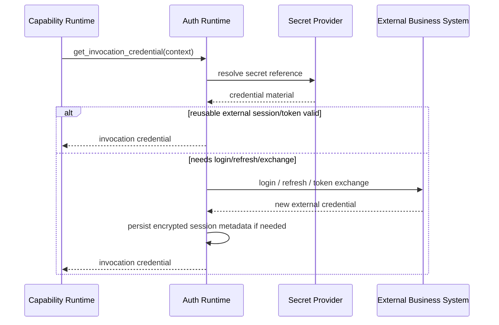

具体项目可以实现不同 Provider：

```text
OAuth2
JWT Exchange
API Key
Service Account
Project Session
NoAuth
```

MSS 的静默登录/Session 复用属于 `MSSSessionAuthProvider`，不进入 Framework Core。


### 4.3.7 后台进度与 Channel 主动通知

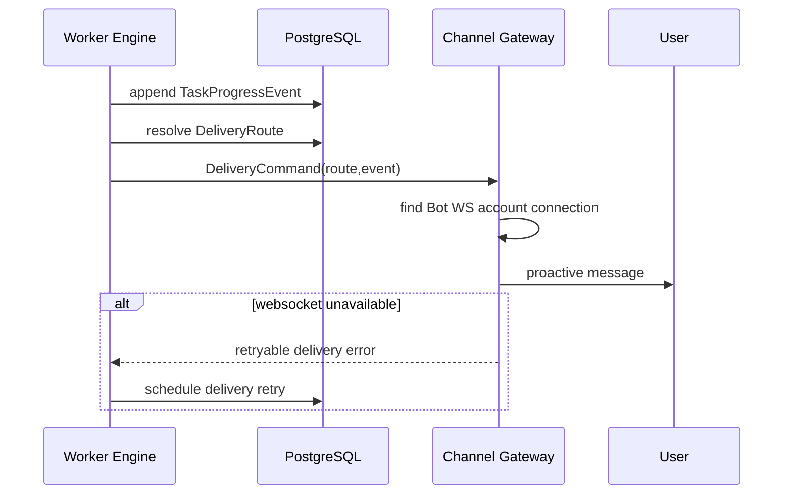

任一 Channel 连接断开只影响即时投递，不得丢失 Execution Result。

### 4.3.8 Service 发布

Builder：

```text
当前已发布 Service
→ 编辑形成 Draft
→ bind Capability
→ attach Agent/Skill/Knowledge
→ Validate
→ Draft Run/Test
→ Publish
```

V1 只保留：

```text
Draft
Published
```

两个业务状态。

发布必须原子完成：

```text
读取完整 Draft
→ schema validate
→ dependency validate
→ capability/auth smoke test
→ 生成 Published Snapshot
→ atomic switch
```

运行中的 Execution 只冻结本次执行必须保持一致的业务逻辑；用户授权、Credential、紧急禁用等安全状态始终实时检查。

---

## 4.4 模块间接口与 Contract

### ChannelEnvelope

```json
{
  "channel": "channel-type",
  "account_id": "account-main",
  "peer_type": "user",
  "peer_id": "channel-native-peer-id",
  "message_id": "msg-xxx",
  "conversation_ref": "channel-conv-ref",
  "content_type": "text",
  "content": "请执行服务 X",
  "received_at": "2026-09-10T10:00:00+08:00"
}
```

`platform_user_id` 由服务端 Binding Resolver 注入，不信任渠道消息正文提供。

### StartServiceExecutionProposal

```json
{
  "service_key": "service-x",
  "input": {
    "resource_scope": {
      "type": "project-defined",
      "refs": ["resource-1", "resource-2"]
    },
    "parameters": {}
  },
  "confirmation_ref": "confirm-xxx",
  "conversation_id": "conv-xxx",
  "idempotency_key": "..."
}
```

服务端补充：

```text
actor_user_id
tenant_id
delivery_route_id
effective authorization
published release
```

### CapabilityInvoke

```json
{
  "capability": "external_job.submit",
  "input": {},
  "actor": {
    "platform_user_id": "u-1"
  },
  "resource_scope": {},
  "execution_context": {
    "execution_id": "e-1",
    "step_id": "s-3",
    "idempotency_key": "..."
  }
}
```

其中 actor 信息由 Trusted Context 生成，不直接使用 LLM 参数。

### Capability Data Retrieval Policy 合同（V1.8）

```json
{
  "pagination_type": "PAGE",
  "request_mapping": {"page_param":"page","page_size_param":"page_size","start_page":1,"page_size":100},
  "response_mapping": {"items_path":"data.items","total_path":"data.total"},
  "termination": {"empty_items":true,"short_page":true,"use_total":true},
  "limits": {"max_pages":200,"max_items":20000,"max_duration_ms":120000,"duplicate_page_detection":true}
}
```

`empty_items=true` 是 PAGE/OFFSET 的兜底结束条件；short_page 仅在下游协议保证分页填满时开启。

### Async Capability 统一合同

```text
submit(input, idempotency_key) -> external_task_ref
status(external_task_ref) -> PENDING/RUNNING/COMPLETED/FAILED
result(external_task_ref) -> normalized result/artifact
cancel(external_task_ref) -> optional
```

不同业务系统的轮询细节由 Adapter 封装，不让每个 Service/Skill 自己写一套 polling framework。

### SandboxInvoke

Agent/LLM 不提供 Host 路径，只提供 Workspace 内相对路径：

```json
{
  "capability": "filesystem.read",
  "input": {
    "path": "reports/result.md"
  },
  "execution_context": {
    "workspace_id": "ws-xxx"
  }
}
```

禁止：

```text
/etc/passwd
../../outside
C:\host\secret
任意未经过 Workspace Resolver 的绝对路径
```

`shell.execute` 输入建议使用 argv 而不是拼接 Shell 字符串：

```json
{
  "capability": "shell.execute",
  "input": {
    "argv": ["python", "scripts/check.py"],
    "timeout_seconds": 30
  }
}
```

Local Sandbox 实现禁止 `shell=True`；Production Sandbox 还必须依赖 Container/Namespace/VM 等真正隔离边界。

### Worker Command

```text
StartExecution
ResumeExecution
CancelExecution
RetryExecution
HumanDecision
```

### DeliveryCommand

```json
{
  "execution_id": "e-1",
  "route_id": "route-1",
  "event_type": "completed",
  "content_ref": "artifact/message-ref",
  "dedupe_key": "delivery:e-1:completed"
}
```

---

## 4.5 推荐代码组织与依赖规则

推荐单仓库、多运行角色、Framework 与 Integration 物理隔离：

```text
fluxion-harness/
├── apps/
│   ├── platform_api/
│   ├── agent_runtime/
│   ├── worker/
│   └── channel_gateway/
│
├── frontend/
│   └── console/
│
├── framework/
│   ├── domain/
│   ├── contracts/
│   ├── agent_core/
│   ├── execution/
│   ├── capability/
│   ├── knowledge/
│   ├── memory/
│   ├── auth/
│   ├── channel/
│   ├── workspace/
│   ├── storage/
│   └── observability/
│
├── adapters/
│   ├── http/
│   ├── sandbox/
│   ├── mcp/
│   ├── object_store/
│   ├── postgres/
│   └── redis/
│
├── integrations/
│   ├── mss/                    # 首个 Reference Integration
│   │   ├── services/
│   │   ├── agents/
│   │   ├── capabilities/
│   │   ├── auth/
│   │   ├── knowledge/
│   │   └── tests/
│   └── channels/
│       └── wecom/              # 首个 Channel Adapter
│
├── migrations/
├── deploy/
│   └── helm/
├── tests/
│   ├── unit/
│   ├── integration/
│   ├── architecture/
│   ├── reliability/
│   └── reference_integration/
└── docs/
    ├── architecture/
    └── integrations/
```

### 依赖规则

依赖方向：

```text
framework/domain
      ↑
framework/contracts
      ↑
framework/{agent_core,execution,capability,knowledge,memory,auth,channel,workspace}
      ↑
adapters / integrations
      ↑
apps
```

核心规则：

```text
Framework Core
❌ 不依赖 integrations/*

Framework Core
❌ 不依赖 WeCom SDK / MSS SDK / 某项目 HTTP client

Integration
✅ 依赖 Framework Contracts
✅ 依赖项目 SDK / API client

Apps
✅ 装配 Framework + selected Integrations
```

禁止：

```text
framework/domain → FastAPI
framework/domain → SQLAlchemy ORM
framework/domain → LangGraph Run/Thread 产品模型
framework/worker → integrations/mss
framework/agent_core → WeCom SDK
framework/capability → 项目专属 SDK
```

### Core Purity Gate

CI 必须扫描核心目录，阻止项目领域词和反向依赖进入 Framework Core。

例如 MSS Reference Integration 上线后：

```text
framework/**
```

不得新增：

```text
mss
customer
device
edr
policy_check
wecom sdk import
```

允许这些词出现在：

```text
integrations/mss/**
integrations/channels/wecom/**
tests/reference_integration/**
docs/integrations/**
```

该 Gate 是“可开源复用”目标的直接架构约束。


---

# 5. 关键特性与 DFX 设计

## 5.1 安全性与权限设计

### 安全目标

1. 用户不能通过 Prompt 或 Skill 参数伪造其他用户身份；
2. Agent 不能绕过外部业务系统现有权限；
3. Credential/Session 不进入模型上下文和普通日志；
4. 高风险写操作不能只靠 LLM 判断后直接执行；
5. tenant/user/channel/memory/execution 数据跨域访问成功数必须为 0；
6. 任何 Capability 都有明确的 side-effect/risk/auth 语义；
7. 业务外部系统返回拒绝时 Fail Closed，不做“Agent 猜测式降级”。

### 写操作安全链

```text
User Intent
→ Agent structured proposal
→ Schema Validation
→ Semantic Validation
→ Trusted Authorization
→ Human Confirmation（需要时）
→ Execution Service
→ Worker
→ Capability Runtime
→ Business Platform Authorization
```

### 风险分级

Capability 至少标记：

```text
side_effect = none/read/write/destructive
risk_level = low/medium/high
```

建议策略（示意，判定以 CAP-API-06 direct_invocation 派生字段 + ADR-057 为准）：

```text
read + low
→ Agent 可直接调用

write + low/medium
→ ServiceExecution，按 Service confirmation rule

high/destructive
→ 强制 Human Checkpoint
```

LLM 不能自行把 `high` 改成 `low`。

### Workspace / Sandbox 安全

文件和进程执行能力属于高风险基础能力，V1 必须满足：

```text
Agent Runtime
❌ 不直接访问 Host 任意文件
❌ 不直接 subprocess/shell
❌ 不接受 LLM 提供的 Host absolute path

Sandbox Provider
✅ Workspace root confinement
✅ path normalization + traversal rejection
✅ operation allowlist
✅ shell executable allowlist
✅ bounded timeout
✅ stdout/stderr/output size limit
✅ audit with workspace_id/capability/execution_id
```

`LocalSandboxExecutor` 仅用于开发/受信环境，不能作为生产安全隔离声明。生产若启用 `shell.execute` 或不可信代码执行，必须使用容器/Namespace/VM 等真正隔离的 SandboxExecutor。

Workspace 到期需要异步清理；正式 Artifact 必须先持久化到 Object Store，再允许删除临时 Workspace。

### Skill / Knowledge 安全

Skill 作为代码/指令包，需要：

```text
checksum
version
publisher
scope
static scan
dependency scan
publish review
```

如果 Skill 包含可执行脚本：

- 默认不允许宿主机任意 shell；
- 后续通过受限 sandbox/resource executor 执行；
- Credential 运行时注入，禁止写入包；
- Draft 测试与正式发布使用同一 artifact。

### 威胁建模重点

按照模板建议的 STRIDE 思路，V1 至少覆盖：

| 威胁 | 典型场景 | 核心对策 |
|---|---|---|
| Spoofing | LLM 伪造 user_id / channel identity | Trusted Context + Channel Binding |
| Tampering | 修改 Execution Version/输入 | immutable snapshot + audit |
| Repudiation | 无法说明是谁发起写操作 | actor/confirmation/trace audit |
| Information Disclosure | Session/secret 进入 prompt/log | Secret Provider + redact + no snapshot secret |
| Denial of Service | 用户大量发 Agent/Browser/Worker 任务 | rate/concurrency/resource class |
| Elevation of Privilege | Agent 直接调用高风险 Capability | capability policy + execution boundary + business RBAC |

---

## 5.2 可靠性、韧性与 Worker Engine 设计

### 可靠性目标

由于目前尚无正式 SLA 数字，先把可验证目标定义成架构 Gate：

| 故障场景 | V1 目标 |
|---|---|
| 单 Agent Runtime 崩溃 | 不丢 User/Memory/Conversation/已创建 Execution；下一请求可由其他实例处理 |
| 单 Worker 崩溃 | lease 到期后其他 Worker 可 reclaim；已完成副作用不重复 |
| Worker 在 external submit 后崩溃 | durable `external_task_id` 后继续原任务 |
| Redis 故障 | 正确性不丢失；退化为 PG polling/wakeup latency 增加 |
| Channel Gateway 重连 | Execution 不受影响；Delivery 重试只由 Worker 触发（V1.7 D03），Gateway 单次 best-effort |
| Console/Control Plane 故障 | 已发布的 Service/正在运行的 Execution 尽量继续 |
| 业务 API 短时故障 | 有界 retry/backoff；不无限 hang |
| External Session 过期 | Session Broker refresh/relogin；失败则明确 auth error |
| PG 故障 | Fail Closed；不允许用 Redis/local cache 冒充 durable success |
| 发布新 ServiceVersion | 已运行 Execution 始终使用旧 Snapshot |

### Worker Claim / Lease

推荐：

```sql
SELECT id
FROM service_execution
WHERE
      status = 'PENDING'
   OR (status IN ('WAITING','RETRY_WAIT') AND next_run_at <= now())
   OR (status = 'RUNNING' AND lease_expires_at < now())
ORDER BY priority DESC, next_run_at NULLS FIRST, created_at
FOR UPDATE SKIP LOCKED
LIMIT :batch;
```

claim 后原子更新：

```text
status = RUNNING
lease_owner = worker_instance_id
lease_expires_at = now + lease_ttl
```

长步骤执行期间 heartbeat 延长 lease。

### 幂等

三层幂等：

```text
Execution idempotency
Step idempotency
External side-effect idempotency
```

例如：

```text
execution idempotency key
= user + service + confirmed-request hash

external_job.submit idempotency key
= execution_id + step_key
```

业务 API 如果支持 idempotency header/key，直接透传；不支持时通过本地 durable mapping + external_task_id 保证恢复行为。

### Timeout / Retry

所有外部调用必须有：

```text
connect timeout
request deadline
error classification
max retry
backoff
```

错误分类示例：

```text
RETRYABLE_TECHNICAL
AUTH_EXPIRED
CREDENTIAL_INVALID
BUSINESS_REJECTED
SEMANTIC_INVALID
USER_ACTION_REQUIRED
FATAL
```

禁止：

```text
while True retry
```

### Wait / Timer

Worker 不持有长时间睡眠线程。

```text
WAITING
next_run_at = ...
```

Redis 可以立即唤醒 due work，但 PG 扫描是兜底真相。

### Cancellation

`/stop` 或 Console Cancel：

```text
cancel_requested_at = now
status -> CANCELLING
```

Worker 在：

```text
step boundary
before side effect
after external response
poll boundary
```

检查取消。

若底层 Async Capability 支持 cancel，则调用；不支持时至少停止平台侧后续步骤并明确外部任务仍可能继续。

### Human Checkpoint

不是先建设通用 Approval Center。

V1 只需要 Task-level（V1.7 D02）：

```text
WAITING_HUMAN
reason
requested_action      # 仅 RESUME / CANCEL，不做 PAUSE/TRANSFER/改参
deadline              # 必填，默认进入等待时 +24h，可配不可空
context_summary
```

进入 WAITING_HUMAN 时 `next_run_at = deadline`，复用 timer，无独立 Human Scheduler。
超时后进入 `FAILED / HUMAN_TIMEOUT`（= USER_INACTION，非业务失败，失败率单独统计）；
超时后到达的 RESUME/CANCEL 幂等拒绝。

User/Admin 决策写数据库后：

```text
ResumeExecution
```

### Resource Governance

吸收 OpenClaw 多用户/Browser 的前车之鉴，Worker Engine 第一阶段的治理按 P0/P1 拆分（V1.7 收口）：

```text
P0（必须）：
global worker concurrency
per-capability concurrency
step timeout

P1（后续）：
per-tenant concurrency
per-resource-class concurrency
priority
rate limit（高级）
```

Browser/Shell 仍保留基础独立并发限制。Resource Class 示例：

```text
default-io
llm-heavy
browser
large-report
external-scan
```

浏览器不是“普通 Tool 一样无限并发”。

### LangGraph Checkpointer 的位置

```text
Worker Engine
  ↓
Agent Step
  ↓
LangGraph
  ↓
PostgreSQL Checkpointer
```

Checkpointer 负责保存 Agent Graph state，但不是 Worker 的 `next_run_at/lease/claim` 事实源。

---

## 5.3 可测试性、可调试性与可观测性

### OpenTelemetry

统一：

```text
trace_id
execution_id
conversation_id
user_id（按隐私规范脱敏/受控）
service_release_ref
step_key
capability
worker_instance
runtime_instance
channel
```

Trace 贯穿：

```text
Channel
→ Agent Runtime
→ Execution Service
→ Worker
→ Agent Step / Capability
→ Business API
→ Artifact
→ Delivery
```

### 日志要求

- JSON structured log；
- Credential/Session 自动 redact；
- 所有外部调用记录 duration/status/error_class，不记录 secret；
- Worker 的 claim/reclaim/lease timeout 有独立事件；
- Capability 调用记录业务 capability name，而不仅是 URL；
- 发布/绑定/授权写操作进入 Audit Log。

### Architecture Gates

从项目第一天建设：

```text
G1 Stateless Runtime
G2 Execution Snapshot
G3 Worker Crash Recovery
G4 Idempotent Side Effect
G5 Permission / On-Behalf-Of
G6 Credential Isolation
G7 Control Plane Outage
G8 Channel Reconnect / Delivery
G9 Memory Cross-Channel
G10 Capability Contract
G11 Redis Non-SoT
G12 Local State Audit
G13 Simplified Publish Model（仅 Service 两态发布；Agent direct-effect，V1.7 D04）
G14 Database ER / Constraint Gate（关系、唯一约束、Worker 索引与 Snapshot FK 一致）
```

### 故障注入

黄金旅程集成测试至少能：

```text
kill -9 agent-runtime
kill -9 worker
disconnect channel gateway
invalidate platform session
timeout platform API
make Redis unavailable
publish v2 during v1 execution
duplicate StartExecution request
duplicate delivery request
```

不能仅通过 mock unit test 宣称 reliable。

---

## 5.4 可扩展性、可复用性与 Integration 生态

### Framework Extension Points

Framework Core 正式保留以下扩展点：

```text
ModelProvider
CapabilityProvider / Adapter
KnowledgeProvider
AuthProvider
ChannelAdapter
ArtifactStore
SecretProvider
WorkspaceStore / WorkspaceManager
SandboxExecutor
AgentExecutor
StepExecutor
```

V1 不建设动态 Marketplace/复杂 Plugin Lifecycle。扩展默认通过部署时装配和 Registry 注册。

### Capability

```text
Capability Contract
   ├── HTTP/API Adapter
   ├── MCP Adapter
   ├── Sandbox/Built-in Tool Adapter
   ├── Browser Adapter
   └── Project SDK Adapter
```

上层 Service 只依赖 Contract。

### Knowledge

```text
Knowledge Runtime
   ├── Static Artifact
   ├── External Knowledge API
   ├── pgvector
   ├── MCP
   └── Project Provider
```

外部知识库增加/替换不改变 Agent Runtime/Worker。

### Auth

```text
AuthProvider
   ├── OAuth2
   ├── JWT Exchange
   ├── API Key
   ├── Service Account
   ├── Project Session
   └── NoAuth
```

框架不把“静默登录 + Session Cookie”写成唯一认证模型。

### Channel

```text
Channel Gateway
   └── ChannelAdapter
       ├── WeCom      # Reference
       ├── WebChat    # Future
       ├── Mattermost # Future
       └── Other
```

不同 Channel 到 Agent Runtime 后统一为 `ChannelEnvelope`。

### Skill

Skill 扩展基线：

```text
开发：IDE / Git
依赖：fluxion_skill_sdk Public API
能力调用：ctx.capability.call()
发布：pack → Console 导入 immutable Artifact
运行：Skill Runtime 注入 SkillContext
```

SDK 与主项目同仓作为独立 Python package；V1 不要求单独 PyPI 发布，但 Skill 禁止直接 import Runtime/Domain/Repository/Infrastructure 内部模块。

SDK V1 保持薄接口：`ctx.capability.call / ctx.logger / ctx.artifact / ctx.user / ctx.session`。Skill 入口统一同步 `def run(ctx, input)`。

本地支持 MockSkillContext 和 HTTP Dev Capability Gateway。Console 不提供 Skill 低代码编排器，不维护人工能力依赖。

### Model

V1：

```text
ModelConfig
ModelFactory
OpenAI-compatible provider
```

Model Config 保存后直接生效；复杂 ModelPolicy/自动路由后置。

### Built-in Tool / Sandbox

框架内置 Tool 通过 Capability Registry 暴露，不形成第二套 Tool 生态：

```text
filesystem.read
filesystem.write
filesystem.edit
filesystem.glob
filesystem.grep
shell.execute
```

开发环境：

```text
LocalSandboxExecutor
```

生产环境：

```text
Container/Kubernetes/Isolated SandboxExecutor
```

二者实现相同 `SandboxExecutor` Contract，因此切换执行环境不改变 AgentDefinition、ServiceDefinition 或 Worker Engine。

### Browser

Browser 是特殊资源型 Capability/Executor，不使一般 Agent Runtime 变成有状态浏览器宿主。

只有真实业务需要时引入：

```text
Browser Resource Pool
Profile/Session lease
Concurrency control
Timeout
Artifact capture
Cleanup
```

### Integration Packaging

一个业务项目接入框架，理想情况下只需要：

```text
1. Service/Agent 配置
2. Capability Contract + Adapter
3. AuthProvider（如需要）
4. KnowledgeProvider/Source（如需要）
5. ChannelAdapter（如项目需要新渠道）
6. Integration Test
```

如果接一个新项目必须修改 Framework Core 的 Agent Runtime、Worker 或核心数据库模型，应先判定 Core 抽象是否泄漏业务语义。


---

## 5.5 User Memory、隐私与数据治理

### 四类状态必须区分

```text
User Memory
= 长期用户上下文

Conversation
= 当前会话上下文

Task/Execution State
= 当前Service Execution 状态

Business Data
= 外部业务系统权威事实
```

典型错误：

```text
“上次看到 A 客户有 20 台 EDR”
→ 写 User Memory
→ 下次直接当真
```

禁止。

资源状态、权限、任务状态和外部业务结果必须重新通过 Capability 查询外部业务系统。

### V1 Memory

Phase 1 使用 PostgreSQL 即可。

要求：

- tenant + user scope；
- 跨 Conversation；
- 跨 Conversation；
- Channel 无关；
- source/provenance；
- created/updated time；
- controlled write；
- 用户可查看/清理；
- Runtime 每次根据 user 加载；
- 不依赖某个 Runtime Pod。

V1 不要求：

```text
完整向量数据库
L0/L1/L2 复杂自动学习
大规模自动画像
```

需要语义检索时再加 pgvector。

### Conversation Compaction

```text
Conversation Summary
≠
Personal/User Memory
```

Summary 只解决上下文长度。

### 隐私

- Credential、External Session 不进 Memory；
- 高敏业务结果只保存在有权限的 Artifact/Result scope；
- Trace/log 中用户/业务资源标识按部署项目的数据治理规范处理；
- Memory 写入必须有可解释 source；
- 删除 User Memory 不应该误删业务审计记录，二者数据生命周期分离。

---

## 5.6 可运维性、发布与升级

### 部署

生产：

```text
Kubernetes + Helm
```

外部依赖：

```text
PostgreSQL
Redis
Object Store
Secret Provider
OTel Backend
```

应用 Helm 不部署内置 PG/Redis。

### Readiness / Liveness

`agent-runtime`：

```text
process alive
PG reachable（按降级策略）
model adapter health（可异步）
registry revision loadable
```

`worker`：

```text
process alive
PG writable
lease loop healthy
queue lag metrics
```

`channel-gateway`：

```text
process alive
adapter health
connection state（对长连接 Channel）
last heartbeat（如适用）
reconnect count（如适用）
delivery backlog
```

### 发布版本

Service / 对外独立 Agent：

```text
Draft
→ Validate
→ Test
→ Publish
```

只保留 Draft/Published 两态。

其他对象：

```text
ModelConfig / Knowledge Source / Capability Implementation / Channel Config
→ validate
→ save
→ direct effect
```

历史通过 revision/audit 保留，不建设通用版本中心。

Skill/静态知识文件采用 immutable artifact/checksum。

### Runtime 滚动升级

Agent Runtime 无状态，因此：

```text
rolling upgrade
→ drain current HTTP/stream
→ new requests to new pod
```

Worker：

```text
stop claiming new execution
→ finish/heartbeat current bounded step
→ release or let lease expire
→ other worker reclaim
```

### Control Plane 升级

不允许因为 Console/API 发布中断导致：

```text
running Execution lost
published Service unusable
```

### Schema Migration

Alembic migration 分为：

```text
expand
→ application rollout
→ contract
```

避免滚动升级时新旧 Pod 使用不兼容 Schema。

---

# 6. 实施基线、验收 Gate、风险与变更控制

## 6.1 Phase 1 实施基线

Phase 1 同时完成两件事：

```text
A. 通用 Framework Core 可独立成立
B. MSS Reference Integration 完成一条真实黄金旅程
```

不能只做一个抽象框架而没有真实业务验证，也不能把 MSS 业务直接写进 Core。

### Framework Core 交付组件

| 组件 | V1 状态 | 部署/承载方式 |
|---|---|---|
| Platform API + Console | 必须 | `platform-api` 镜像，通常 1 replica |
| Agent Runtime | 必须 | `agent-runtime` Deployment |
| Shared Agent Executor / LangGraph | 必须 | Agent Runtime 与 Worker 共享 |
| Agent Definition | 必须 | 通用配置对象 |
| Service Definition | 必须 | Draft/Published 两态 |
| ExecutionService | 必须 | 共享 Application Service，不独立部署 |
| Worker Engine | 必须 | `worker` Deployment |
| Capability Runtime + SPI | 必须 | Framework package |
| Workspace Contract/Manager | 必须 | Framework package；metadata 外置 |
| Sandbox Capability Provider | 必须 | 内置 filesystem/shell Tool Provider |
| LocalSandboxExecutor | 开发必备 | Dev/Trusted Environment only |
| Knowledge Runtime + SPI | 规划项（V1 不交付） | Framework package |
| Auth Runtime + SPI | 必须 | Framework package |
| User Memory | 必须 | PostgreSQL |
| Channel Gateway + SPI | 必须 | `channel-gateway` Deployment |
| PostgreSQL | 外部必备 | 独立部署 |
| Redis | 外部协调组件 | 独立部署 |
| Object Store | 外部必备 | 独立部署 |
| Secret Provider | 必须抽象 | 外部 |
| OpenTelemetry | 必须 | Collector + existing backend |

### Reference Integration 交付

| 组件 | V1 状态 | 归属 |
|---|---|---|
| MSS Service/Agent 配置 | 必须 | `integrations/mss` |
| MSS Capability Adapters | 必须 | `integrations/mss` |
| MSS Session/AuthProvider | 必须 | `integrations/mss` |
| WeCom Adapter | 必须 | `integrations/channels/wecom` |
| 设备策略检查黄金旅程| 必须 | reference integration test |
| Future Business WebChat | 后续 | 新 ChannelAdapter，不改 Core |

### V1 Production 最终镜像

```text
1. platform-api
2. agent-runtime
3. worker
4. channel-gateway
```

`platform-api` 同时承载 Console 静态资源，不单独交付 `console-web` 镜像。

`agent-runtime` / `worker` 在 Kubernetes 部署时创建 Deployment，不按 User/Agent/Execution 动态创建 Pod。

### 开源本地开发形态

同仓提供统一开发启动命令，例如：

```text
framework dev
```

其作用是启动/编排同一套：

```text
platform-api
agent-runtime
worker
channel-gateway
```

而不是实现一个“dev 专用 Runtime”。

外部 PostgreSQL/Redis/Object Store 的边界不改变；开发环境可以指向开发实例。

### 推荐实施顺序

```text
S1 Core Domain + Contracts + PostgreSQL
→
S2 Platform User / Channel Identity / Binding
→
S3 Stateless Agent Runtime + Agent Definition + Memory
→
S4 Capability Runtime + HTTP Adapter SPI
→
S5 Workspace Contract + Sandbox Capability Provider
→
S6 AuthProvider + KnowledgeProvider
→
S7 ExecutionService
→
S8 Worker Engine 最小可靠语义
→
S9 Channel Gateway + Adapter SPI
→
S10 MSS Reference Integration + WeCom Adapter
→
S11 Console
→
S12 Architecture/DFX Gates + SIGKILL/Redis Down/Control Plane Down
→
S13 Core Purity Gate + 第二个最小样例 Integration
```

其中 S13 很关键：除了 MSS，再提供一个极小的非 MSS 示例（例如 `examples/demo-service`），用来证明核心抽象没有被 MSS 偶然约束。


---

## 6.2 Framework 与 Reference Integration 验收 Gate

### Gate A：Identity / AuthProvider

```text
Channel userid
→ Binding
→ PlatformUser
→ AuthProvider Context
→ External System RBAC/ACL
```

验证：

- A 用户不能访问 B 用户客户；
- 模型传入假的 user_id 无效；
- Platform API 403 不被 Agent 绕过；
- Session 过期能重新登录/refresh；
- Secret 不出现在 trace/prompt/log。

### Gate B：Stateless Runtime

真实启动至少 2 个 Agent Runtime：

```text
Turn 1 → Runtime A
Turn 2 → Runtime B
kill Runtime A
继续 Runtime B
```

必须保持：

```text
User
Memory
Conversation
Agent/Service Version
Capabilities
```

一致。

### Gate C：Execution Snapshot

```text
Execution-1 start with Service v1
→ publish Service v2
→ Execution-1 still v1
→ Execution-2 uses v2
```

### Gate D：Worker Crash Recovery

```text
Worker A
→ external_job.submit
→ external_task_id persisted
→ SIGKILL A
→ lease expires
→ Worker B reclaim
→ no second create
→ continue status/result
→ complete
```

### Gate E：Long Wait

任务等待 10 分钟/30 分钟时：

```text
no request held
no coroutine required
no sticky worker
```

`next_run_at` 到期后任意 Worker 恢复。

### Gate F：Redis Down

停止 Redis：

```text
Execution truth remains in PostgreSQL
Worker falls back to DB polling
Cancel/wakeup fast path may degrade
No durable state loss
```

### Gate G：Channel Delivery / Reference WeCom

```text
用户通过 WeCom 发起
→ 用户离开
→ Worker 完成
→ DeliveryRoute lookup
→ Channel Gateway / WeCom Adapter
→ Bot WebSocket proactive push
```

Gateway 中途重连后 Delivery 重试只由 Worker 触发（同 dedupe_key，V1.7 D03），不重复轰炸用户。

### Gate H：Control Plane Down

Service 已发布、Execution 已创建后停止 Console/API 管理面：

- Worker 可继续；
- Agent Runtime 对已缓存/共享注册事实有可恢复读取路径；
- External Session Resolver 不依赖 Console Web 进程；
- 重新启动后管理功能恢复。

### Gate I：Memory 与 Channel 解耦

Phase 1 验证跨会话：

```text
WeCom Conversation A
→ 明确记录长期偏好
→ 新 Conversation B
→ 同一 PlatformUser 能读取
```

同时验证 Memory key 不包含 WeCom 专属身份语义。未来外部业务系统 WebChat Adapter 上线后，应无需修改 Memory Schema/Agent Runtime 即可读取同一 PlatformUser Memory。

业务数据不得从 Memory 伪造。

### Gate J：Capability Contract / Project Adapter

同一个通用 Capability Contract，例如：

```text
resource.get
```

必须可以同时被：

```text
Agent Runtime 直接查询
Worker Capability Step
```

复用，并使用同一 AuthProvider / Adapter / Risk 语义。


### Gate K：Core Purity

```text
Framework Core package dependency scan
→ 不依赖 integrations/mss
→ 不依赖 WeCom SDK
→ 不出现 MSS 领域模型
```

并运行至少两个 Integration：

```text
MSS Reference Integration
+
非 MSS Demo Integration
```

两者必须共用同一个 Agent Runtime、Worker Engine、ExecutionService 和数据库核心模型。

### Gate L：Knowledge 规划 Gate（后续）

```text
Agent Definition
→ Knowledge Source
→ KnowledgeProvider SPI
→ fake/external provider
```

替换 Provider 后不修改 Agent Runtime/Worker Core，并能在 ExecutionStep 中记录实际 retrieval evidence。

### Gate M：AuthProvider Replaceability

用至少两种认证实现验证：

```text
NoAuth / API-Key test provider
+
MSS Session AuthProvider
```

Capability Runtime 不出现项目认证分支。


### Gate N：Workspace / Sandbox Boundary

必须自动验证：

```text
absolute path rejected
path traversal rejected
workspace A cannot read workspace B
shell disabled by default in LocalSandbox policy
unapproved executable rejected
timeout enforced
Agent Runtime source does not directly invoke subprocess/shell
```

如果生产启用 Shell/不可信代码执行，还必须增加对应 Container/Kubernetes Sandbox 的逃逸、资源限制和清理验证。


---

## 6.3 关键风险与后续决策阈值

| 风险 | 当前判断 | 规避/验证 |
|---|---|---|
| 自研 Worker Engine 演化为重复造 Temporal | 中 | V1 只做真实旅程 所需状态机；设置引入 durable engine 阈值 |
| PostgreSQL Queue 在高并发下成为瓶颈 | 中低（V1） | 压测 queue lag/claim latency；必要时再演进专用队列 |
| External Session 静默登录机制依赖现有平台接口稳定性 | 中 | Auth Adapter + timeout + refresh + fail closed |
| Skill 可执行脚本带来高权限风险 | 高 | artifact scan + sandbox/resource executor + no credential in package |
| Channel Gateway 多实例连接 ownership | 中 | account connection ownership + lease/coordination；主动 route 外置 |
| Browser 重新引入用户态/本地状态 | 中 | 独立 Browser Executor/Resource Class |
| Capability 抽象过度导致接入成本 | 中 | 只对真实业务 API 做 contract；不追求通用低代码映射器 |
| Memory 自动学习误写业务事实 | 中高 | V1 controlled write；business data 禁止进入 Memory truth |
| Console 与 Runtime 再次发生同步强耦合 | 中 | runtime store/registry/auth resolver 独立；Control Plane Outage Gate |
| 版本对象过多造成 Builder 使用复杂 | 中 | Console 面向 Service 旅程 组织，不把底层 version 对象全部暴露给用户 |

### 何时考虑引入 Temporal/成熟 Durable Engine

满足以下任一类真实条件再重新选型：

```text
大量跨天/跨周 Workflow
复杂 parallel/join
多层 compensation/saga
大量 event-driven correlation
数十种 Human Task 类型
复杂 cron/calendar
跨服务 durable transaction orchestration
Worker Engine 自研代码主要成本已经变成通用调度框架而非业务
```

在此之前，不因为“未来可能需要”提前引入。

### 何时考虑 LangGraph Agent Server

仅当出现：

```text
Agent Run 需要独立于 Worker Engine 大规模弹性集群
并且 Agent Server 的 Run/Thread/Store 模型不会反向绑架 Service/Execution 模型
```

才作为 `RemoteAgentExecutor` 候选，而不是总体业务 Execution Engine。

### 何时引入 EventBus

当出现真实需求：

```text
多个下游消费者需要同一个 Execution Event
高吞吐跨系统异步解耦
Callback/Event 成为主要业务集成模式
```

再引入 Kafka/NATS 等；V1 不预埋空转 EventBus。

---

## 6.4 设计变更与文档维护规则

### 本次相对历史版本的关键设计变化

| 历史方向 | 新设计 |
|---|---|
| User Agent 与 Pod 强关联 | User/Agent 逻辑绑定，Runtime Pool 无状态 |
| OpenClaw 主 Runtime | Python + LangGraph Library |
| Workspace/SQLite/文件本地状态 | PostgreSQL/Object Store/SecretProvider 外置 |
| Skill 脚本包揽 API/认证/分页/SOP | Service 为业务抽象；Skill 保留 Python SOP/数据处理，共性调用治理下沉 Capability Runtime |
| Agent 直接 Tool/Skill 执行长任务 | ExecutionService → Worker Engine |
| External Session 跟随 Agent/Pod | AuthProvider/Auth Context 外置 |
| Tool/MCP/Skill 多技术资源并列 | Capability Contract 统一业务能力语义 |
| LangGraph/DBOS/Workflow 尝试承担 durability | Worker Engine 统一 ServiceExecution 可靠生命周期 |
| Progress 与渠道通知耦合 | TaskProgressEvent 与 DeliveryRoute 分离 |
| 功能从问题清单不断扩展 | 旅程 Gate 决定是否立项 |
| 大量对象独立版本/发布/生效 | 仅 Service 两态发布，Agent direct-effect；其他 direct effect/revision |
| Project Integration 同时承担业务平台概念 | ProjectPlatform（业务/认证）与 ProjectIntegration（代码/部署扩展）拆分 |
| 用户到 Agent 只有路由无授权对象 | 新增 AgentAccessGrant；身份、Bot 路由、用户授权三分离 |
| Channel 独立 Console 资源 | 产品上在 Agent 内配置 IM；底层仍由独立 Channel Gateway 管理长连接 |
| Skill 在线绑定 Capability | Skill manifest 声明依赖，Console 只读；IDE + SDK 开发 |
| Skill 自己写分页循环 | Capability Data Retrieval Policy 自动分页 |
| Knowledge Phase1 必做 | Knowledge 后置为规划项 |

### 总设必须同步更新的触发条件

以下变更必须先更新/评审总体设计：

```text
Agent Runtime 是否仍无状态
Worker Engine 生命周期/SoT 发生改变
Service/SOP/Skill/Capability 语义改变
Execution Service 信任边界改变
AuthProvider/权限模型改变
新增核心 Channel
新增核心持久化基础设施
从 PG Worker 切换 Temporal/其他 durable engine
LangGraph Agent Server 成为生产执行依赖
引入 EventBus 作为核心数据流
Memory 边界改变
版本/发布/生效模型改变
Framework Core 与 Project Integration 边界改变
新增 Core 级 Extension SPI
Workspace/Sandbox 安全边界或执行隔离模型改变
```

普通 Adapter、新 Service、新 Skill 不需要修改总体架构，除非它们证明当前抽象无法覆盖。

### 变更控制表

| 变更章节 | 变更内容 | 变更原因 | 影响评估 | 状态 |
|---|---|---|---|---|
| V1.2 | 简化版本与生效模型 | 避免控制台重型版本管理；补充 Draft/Published、direct-effect、Snapshot/DynamicContext 边界 | 降低管理员维护复杂度 | Draft |
| V1.3 | 修复生产部署 Mermaid，并补充数据库 ER 设计 | 修复 Mermaid 兼容性；补全身份/配置域与运行/执行域的数据关系、索引和 Checkpointer 边界 | 总设数据设计完整性提升 | Draft |
| V1.4 | Framework Core 去 MSS 领域化 | MSS 降级为 Reference Integration；补充 Integration/Auth/Knowledge/Channel SPI、Core Purity Gate、第二示例 Integration | 形成可开源复用框架基线 | Draft |
| V1.5 | 补充 Built-in Tool / Workspace / Sandbox | 将 shell/read/write/edit/glob/grep 统一纳入 Capability；补 Workspace/Sandbox SPI、ER、风险、Gate | 不新增部署服务，完善通用 Agent 工具能力 | Draft |
| V1.6 | 统一数据库公共字段与 cf-task-align 设计基线 | Framework 自建表统一 `is_deleted/create_time/update_time`；模块设计按 Full/Lite/Frontend 模板重新对齐 | 数据治理和实现约束进一步统一 | Draft |
| V1.7 | D01-D08 整改合入正文 | Agent 去发布化；Scope Registry；Human 最小闭环；Delivery 唯一 Owner；删 user_agent_binding；Manifest 三层锁定；治理 P0/P1 拆分 | 总设与代码/模块设计重新一致，R1 可开工 | Draft |
| V1.8 | 交互/Skill SDK/ProjectPlatform/Channel/分页决策合入正文 | 关键修订见文首 15 条 | 与 V6 Playbook 对齐 | Released |
| V1.9~V1.11 | Skill 开发模式收敛、详细设计恢复、cf-task-align 重生成、模块分档拆分与 18/19 模块新增 | 详见 `docs/05-变更记录/` | 模块设计与 Owner 索引以 V1.11 为准 | Released |

---


## 6.5 当前部署与 Channel 结论

为避免后续再次出现“逻辑模块 = 微服务 = 独立镜像”的混淆，当前部署结论固定如下：

```text
逻辑模块 ≠ 一定独立部署
```

当前映射：

```text
Control Plane / Console
→ platform-api

Realtime Agent
→ agent-runtime

Reliable Execution
→ worker

Multi-Channel Transport
→ channel-gateway

ExecutionService
→ shared in-process application service

Capability Runtime
→ shared runtime package
```

`platform-api` 一般 1 副本，不负责动态创建 Agent/Worker Pod。

`agent-runtime`、`worker`、`channel-gateway` 由 Kubernetes 在安装/升级时统一部署；后续扩缩由 Kubernetes/HPA/KEDA 负责。

任意接入项目未来增加 WebChat 时：

```text
Project WebChat
→ Channel Gateway / WebChat Adapter
→ Agent Runtime
```

不改变 Agent Runtime、Worker Engine、Memory、ServiceExecution 和 Capability/Knowledge/Auth 架构。

---

## 6.6 V1.8 产品契约补充

### Console 信息架构

```text
概览
服务
智能体
能力
Skill
知识库（规划）
模型
项目平台
用户（Admin）
执行记录
审计查询（Admin）
```

不单设 Channel、认证配置、系统设置、异步任务、ProjectIntegration 一级菜单。

- Channel 配置位于 Agent IM 接入；
- 用户平台认证位于用户详情；
- 基础设施状态由运维保证；
- Async Task 信息进入 Execution Timeline；
- ProjectIntegration 是部署扩展。

### 前端统一规则

- 所有时间 `YYYY-MM-DD HH:mm:ss`；
- 列表左上主操作、右上搜索/筛选、右下分页和每页条数；
- 不重复页面大标题/说明文案；
- 详情只读，编辑/发布使用独立入口；
- Skill 详情只读，仅允许“导入新版本”。

### IM 命令

```text
/bind <code>  外部身份绑定
/skills       当前 Agent Skill 列表，按 platform_label 分组
/new          新建会话，不改变用户/Agent/Skill/IM 关系
/stop         停止当前 Run/Execution，不删除会话
```

# 附：当前总体设计结论

当前锁定以下原则作为开源 Framework V1 架构基线：

1. **Framework Core 与业务项目彻底解耦；MSS 是首个 Reference Integration，不是 Core 领域；ProjectPlatform 与 ProjectIntegration 分层。**
2. **Service 是最终用户真正使用的业务服务；SOP 属于 Integration，不等于 Skill/Workflow。**
3. **Agent Definition 是配置对象；一个 Agent Runtime Pool 可以运行多个 Agent，不创建 Agent 专属 Pod。**
4. **Agent Runtime 与 Worker Engine 是两个独立运行角色，可独立横向扩容。**
5. **Agent Runtime 必须无状态，User/Memory/Conversation/Execution/Credential 等权威状态外置。**
6. **ExecutionService 是 Agent Proposal 进入真实执行的确定性可信边界，但不是独立微服务。**
7. **Worker Engine 是完整 ServiceExecution 的可靠执行底座；LangGraph 是共享 Agent Executor。**
8. **Capability、Auth、Channel 以稳定 Contract/SPI 隔离项目实现；Knowledge 保留规划位，待真实场景后冻结。**
9. **具体项目优先通过配置 + Adapter/Provider 接入，不 fork Framework Core。**
10. **外部业务系统继续负责自身 RBAC/ACL；Framework 不复制所有业务权限模型。**
11. **版本管理从简：只有 Service 保留草稿/已发布，Agent 直接生效 + revision，其他运行配置直接生效或内部 revision。**
12. **ExecutionSnapshot 只冻结必须保持一致的业务逻辑；授权、Credential、紧急禁用等实时生效。**
13. **生产默认四个镜像：platform-api、agent-runtime、worker、channel-gateway；Console 静态资源并入 platform-api。**
14. **Project Integration、Channel Adapter 与 Framework Core 必须有物理目录和依赖边界。**
15. **Built-in Tool 不建立第二套 Tool 平台；filesystem/shell 等能力统一作为 Sandbox-backed Capability。**
16. **Workspace 以 Conversation/Execution 为受控资源，Agent Runtime 不直接操作 Host 文件系统或 Host Shell。**
17. **MSS + 第二个非 MSS Demo Integration 同时通过 Core Purity/Architecture Gate，才能证明框架真正通用。**
18. **所有 Framework 自建数据库表统一包含 `is_deleted/create_time/update_time`，默认软删除并过滤已删除数据。**
19. **关键架构承诺必须变成自动化、依赖扫描和故障注入 Gate，而不是只写在设计文档中。**


---

# 参考资料

1. 《版本总体设计说明书》模板 V3.2，SFRD-TS-01-3.2。
2. 《MSS 智能服务交付平台——用户场景与 Playbook 旅程设计 V6》。
3. `muad-openclaw`：https://github.com/Michaelxwb/muad-openclaw
4. `muad-openclaw` 多用户实践：https://github.com/Michaelxwb/muad-openclaw/blob/main/docs/multi-user-single-pod.md
5. `muad-openclaw` 总体设计：https://github.com/Michaelxwb/muad-openclaw/blob/main/docs/muad-openclaw-%E6%80%BB%E4%BD%93%E8%AE%BE%E8%AE%A1%E8%AF%B4%E6%98%8E%E4%B9%A6.md
6. `muad-progress`：https://github.com/Michaelxwb/muad-openclaw/tree/main/tools/muad-progress
7. 企业微信 OpenClaw Plugin：https://github.com/WecomTeam/wecom-openclaw-plugin
8. `fluxion-harness`：https://github.com/Michaelxwb/fluxion-harness
9. Fluxion 总体架构：https://github.com/Michaelxwb/fluxion-harness/blob/main/docs/architecture/%E6%80%BB%E4%BD%93%E6%9E%B6%E6%9E%84.md
10. Fluxion Runtime/Execution 设计：https://github.com/Michaelxwb/fluxion-harness/blob/main/docs/design/01-Runtime%E4%B8%8EExecution%E8%AE%BE%E8%AE%A1.md
11. Fluxion Capability 设计：https://github.com/Michaelxwb/fluxion-harness/blob/main/docs/design/02-Capability%E4%B8%8ETool%E8%AE%BE%E8%AE%A1.md
12. Fluxion User/Memory 设计：https://github.com/Michaelxwb/fluxion-harness/blob/main/docs/design/03-%E7%94%A8%E6%88%B7%E8%BA%AB%E4%BB%BD%E4%B8%8EMemory%E8%AE%BE%E8%AE%A1.md
13. Fluxion Architecture Gate：https://github.com/Michaelxwb/fluxion-harness/blob/main/docs/development/%E6%9E%B6%E6%9E%84%E9%AA%8C%E6%94%B6Gate.md
14. Fluxion DBOS 实测记录：https://github.com/Michaelxwb/fluxion-harness/blob/main/docs/development/DBOS%E6%B5%8B%E8%AF%95%E6%8E%A2%E7%B4%A2%E4%B8%8E%E8%B8%A9%E5%9D%91%E8%AE%B0%E5%BD%95.md
