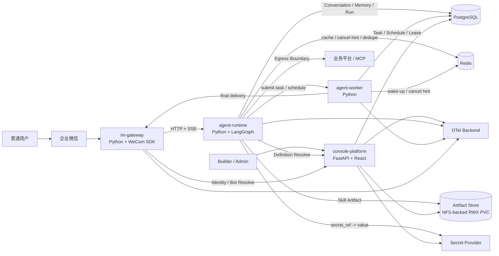

# MSS 智能服务交付平台 V1.3 详细设计——索引与设计基线

## 0. V1.3 最新设计决策

### 0.1 Agent / Runtime / Bot 三个概念必须分开

| 概念 | 含义 | 是否持久化 | 是否横向扩展 | 与 bot_id 的关系 |
|---|---|---:|---:|---|
| Agent / AgentDefinition | Console 中维护的逻辑 IM Agent：指令、模型、Skill、MCP、授权、IM 接入 | 是 | 不适用 | `0..N bot/channel account -> agent_id` |
| Agent Runtime | 执行逻辑 Agent 的无状态服务 | 否 | 是 | 不直接绑定 bot_id |
| Runtime Pod | `agent-runtime` 的任意实例 | 否 | 是 | 不绑定 bot_id / agent_id |

消息路径固定为：

```text
WeCom bot_id
  -> IM Gateway
  -> 解析得到 logical agent_id
  -> agent-runtime Service / LoadBalancer
  -> 任意 Runtime Pod
  -> 依据 agent_id 获取 RuntimeSnapshot
  -> 执行
```

因此**一个逻辑 Agent 可以配置多个 IM 通道账号；每个 bot_id 只路由到一个逻辑 Agent，但绝不绑定某个 Runtime Pod**。同一个用户连续两轮消息可以分别由 Runtime A、Runtime B 执行，只要 Conversation、Memory、Snapshot、Artifact 等权威状态均外置即可。

### 0.2 从 learn-agent 吸收的经验

| learn-agent 经验 | 本项目采纳方式 | Phase 1 |
|---|---|---:|
| Agent Loop 保持最小 | LangGraph 只负责 reasoning/tool loop，平台能力放在 Harness 周围 | ✅ |
| ToolRegistry | Built-in / Skill Script / MCP 统一进入 ToolRegistry | ✅ |
| Hook 生命周期 | UserPrompt / PreTool / PostTool / Stop 扩展点 | ✅ |
| Skill 渐进式披露 | 启动只放 name+description，命中后加载完整 SKILL.md，资源/脚本按需读取 | ✅ |
| Artifact + Context Compaction | 大 Tool 结果外置 Artifact Store（V1=NFS-backed RWX PVC），LLM 只拿 preview/reference | ✅ |
| Canonical History 与请求上下文分离 | CanonicalEvent 永久事实；ContextBuilder 可裁剪副本 | ✅ |
| Dynamic Prompt | PromptBuilder/Provider 动态组装运行态上下文 | ✅ |
| Model Recovery | deadline、retry budget、Retry-After、cancel | ✅ |
| MCP 动态工具池 | MCP Tool 适配后进入统一 ToolRegistry | ✅ |
| Background | Durable 后台任务、用户可离开、最终结果投递 | ✅ |
| Cron | 通过 Agent 创建定时任务，Scheduler 到点创建 TaskExecution | ✅ |
| Multi-Agent | 多角色 Agent 协作；当前批量并行用 Parent/Child Task，不需要 | ❌ |
| Worktree | Coding Agent 隔离 Git 工作区；与 MSS 业务场景无关 | ❌ |

### 0.3 Skill 包格式简化与执行元数据

V1.1 不再要求 `skill.yaml`。Skill 最小结构：

```text
policy-check/
├── SKILL.md            # 必需：frontmatter + Agent 指令
├── scripts/            # 可选：Python 脚本
├── references/         # 可选：长文档
├── assets/             # 可选：模板/静态资源
└── tests/              # 可选：本地测试
```

`SKILL.md` frontmatter 必需字段仍只有 `name`、`description`；V1.2 允许增加一个最小运行提示 `execution: sync|async|auto`，默认 `sync`。它只描述默认执行方式，不描述业务流程、接口、schema、分页或编排。版本、checksum、`user_scope`、指定用户授权等仍属于平台元数据，不写入 SKILL.md。


### 0.4 单一意图与执行策略必须分离

用户只表达一个业务意图，例如：

```text
“帮 A 客户做一次策略检查”
```

Agent 负责得到：

```text
intent = policy_check
parameters = {customer: A, ...}
```

随后由框架决定执行方式：

```text
Intent
  -> Skill Resolver
  -> Resolved Skill
  -> ExecutionRouter
     -> SYNC   -> InlineExecutor
     -> ASYNC  -> BackgroundSubmitter
     -> AUTO   -> Deterministic ExecutionPlanner
```

**禁止**把 `use_async=true` 作为 LLM 自由判断结果直接驱动执行。`execution_mode` 来自 Skill Artifact 的机器可读元数据；`AUTO` 也只能依据确定性规则，例如“定时触发”“需要 durable wait”“Skill 返回 BackgroundDirective”。

执行方式与触发方式是两个正交维度：

| 维度 | 值 | 说明 |
|---|---|---|
| Trigger | `IMMEDIATE` | 用户当前会话立即触发 |
| Trigger | `SCHEDULED` | Scheduler 到点触发 |
| Execution | `SYNC` | 当前 Runtime 请求内完成 |
| Execution | `ASYNC` | 创建 durable Task，由 Worker 完成 |
| Execution | `AUTO` | 由确定性 ExecutionPlanner 解析 |

所有 `SCHEDULED` 任务物理执行都进入 Worker，即使对应 Skill 默认是 `SYNC`。

### 0.5 后台任务与并行任务

“同时检查 A/B/C/D 四个客户”仍然是一个业务意图：

```text
intent = policy_check
targets = [A, B, C, D]
```

后台执行使用：

```text
Parent Task
  -> Child Task A
  -> Child Task B
  -> Child Task C
  -> Child Task D
  -> Fan-in Aggregate
  -> Final Delivery
```

这是 Task 并行，不是 Multi-Agent。Agent Runtime 只提交一次 Parent Task；Worker 根据确定性 TaskPlan fan-out，并通过并发上限保护业务平台。


### 0.6 ProjectPlatform 与 PlatformAdapter 分离

V1.3 不再把项目平台认证抽象成固定的 Bearer/Basic/OAuth2 枚举。

```text
ProjectPlatform
= 一个真实业务平台实例的地址、服务发现、Adapter 选择和非敏感配置

PlatformAdapter
= 一类平台认证/Session 协议的 Python 实现

CredentialRef
= 用户或共享凭据的 SecretProvider 引用

PlatformSession
= 由 Credential 派生的可重建 Session 缓存
```

调用链固定为：

```text
Skill
 -> PlatformClient
 -> Egress Boundary
 -> ProjectPlatform Resolver
 -> PlatformAdapterRegistry
 -> CredentialResolver
 -> PlatformSessionManager
 -> PlatformAdapter
 -> Business Platform
```

Adapter 最小能力：

```text
authenticate / refresh
validate
prepare_request
```

Adapter 同时声明：

```text
platform_config_schema
credential_schema
```

Console 根据 Schema 动态生成项目平台配置表单和用户凭据表单。因此：

- 新增平台且复用已有 Adapter：**只配置，不写认证代码**；
- 新增平台需要新的登录/签名/Session 协议：**新增一个 PlatformAdapter**；
- 同一 Adapter 可以服务多个 ProjectPlatform；
- Adapter 属于代码能力，不作为用户可上传脚本在 Console 动态执行。

`credential_mode` 只表达凭据选择策略：

```text
USER_ONLY
SHARED_ONLY
USER_THEN_SHARED
NONE
```

它不描述具体认证协议。

PlatformSession 不作为业务权威事实；Redis 丢失只导致重新认证，不导致业务数据或凭据丢失。

### 0.7 Console 与运维边界

业务 Console 菜单固定为：

```text
概览
Agent
Skill
MCP
模型
用户
项目平台
后台任务
定时任务
运行审计
```

不提供“系统设置/中间件状态”菜单，不展示 PostgreSQL、Redis、NFS/PVC、Runtime Pod、Worker Pod 健康状态。这些由部署平台/OTel/监控系统负责。

列表页不再重复展示页面标题和说明块，直接进入工具栏与列表。

### 0.8 内网安全基线

Phase 1 只有 IM 通道面向普通用户，Console、Runtime、数据库、业务平台调用均在内网。因此保留身份绑定、Agent 授权、Secret 不下发、Tool 审计、Egress 审计、输入校验、日志脱敏等必要控制，不引入复杂公网 WAF、Service Mesh 零信任、通用 ABAC、恶意第三方代码沙箱等超前能力。

---

> 文档定位：基于《用户场景与 Playbook 旅程设计 V7》和《总体设计说明书 V2.0》的模块级详细设计。
>
> 架构基线：**Skill-first / Stateless Agent Runtime / Durable Agent Worker / Python Unified Backend / 四核心 Image**。
>
> 日期：2026-09-17

---


### 0.9 Skill / MCP 用户范围与三层授权关系

V1.3 将原来的 `PUBLIC / PRIVATE + 灰度用户` 语义收敛为更准确的“用户范围”：

```text
user_scope = ALL
user_scope = SELECTED
```

含义：

- `ALL`：对**所有已经获得对应 Agent 使用权的用户**开放；
- `SELECTED`：除 Agent 使用权外，还要求用户存在该 Skill/MCP 的指定用户授权；
- `ALL` 不等于“平台所有用户可用”，也不等于“所有 Agent 自动获得该能力”。

三类关系必须分开：

```text
User -> Agent
    AgentAccessGrant

Agent -> Skill / MCP
    AgentSkillBinding
    AgentMcpBinding

User -> Skill / MCP
    SkillUserGrant
    McpUserGrant
    仅在 user_scope=SELECTED 时参与判定
```

最终运行时权限公式：

```text
Effective Skill
=
AgentAccessGrant(user, agent)
AND AgentSkillBinding(agent, skill)
AND Skill.enabled
AND (
    Skill.user_scope = ALL
    OR SkillUserGrant(skill, user) exists
)

Effective MCP
=
AgentAccessGrant(user, agent)
AND AgentMcpBinding(agent, mcp)
AND MCP.enabled
AND (
    MCP.user_scope = ALL
    OR McpUserGrant(mcp, user) exists
)
```

V1.3 **不建设** `User-Agent-Skill` / `User-Agent-MCP` 三元授权，也不建设 MCP Tool 级用户授权。

Runtime 必须在构建 Prompt/Skill Catalog/ToolRegistry **之前**完成 Effective Capability 过滤。未授权 Skill/MCP 的名称、描述、Tool Schema 不进入模型上下文。

这个用户范围是资源级的、跨 Agent 生效：如果同一个 SELECTED Skill 被 Agent A/B 同时绑定，某用户被加入 Skill 指定用户后，只要他同时拥有 A 或 B 的 AgentAccessGrant，就可以在对应 Agent 中使用该 Skill。

### 0.10 Artifact Store 与 Skill 本地缓存基线

V1 不额外建设 MinIO/S3，也不把 NFS Server 作为本平台业务 Pod 交付。

```text
外部 NFS / 企业共享文件存储
        ↓
Kubernetes PV/PVC（RWX）
        ↓
Artifact Store Mount
/mnt/muad-artifacts
```

V1 的 `ArtifactStore` 代码抽象实际落地为 `NfsArtifactStore`。数据库只保存稳定 `storage_key`，不保存 Pod 本地绝对路径。

Skill Artifact 路径：

```text
skills/{skill_id}/{artifact_id}/skill.zip
```

`agent-runtime` / `agent-worker` 不直接在 NFS 目录执行 Python Skill，而使用 Pod 本地 `emptyDir`：

```text
/var/cache/muad/skills/{checksum}/
```

每次执行前统一经过：

```text
SkillArtifactCache.ensure
 -> L1 进程内索引
 -> 本地 READY 目录
 -> cache miss 才从 NFS PVC 复制
 -> checksum 校验
 -> 临时目录解压
 -> 原子 rename
 -> READY
 -> SkillExecutor
```

同一 checksum 的并发首次加载必须 singleflight。

### 0.11 Model 选择基线

`model_definition` 不增加 `is_default` 字段。每个 Agent 必须显式保存 `agent_definition.model_id`；不存在“未选择模型时自动回退到平台默认模型”的规则。


## 1. 详细设计目标

本设计包把总体设计进一步下沉到可编码、可建库、可联调、可测试的粒度，至少回答以下问题：

1. 四个部署单元如何协作；
2. 每个模块内部如何分层和依赖；
3. 数据库有哪些表、字段、索引、唯一约束与状态；
4. Runtime 如何创建快照、构建上下文、Lazy Load Skill、执行 Tool/MCP；
5. Skill 如何通过 PlatformAdapter/SessionManager 访问不同认证协议的业务平台且不持有真实凭据；
6. 企业微信消息如何完成身份解析、Agent 路由、Streaming 与命令处理；
7. 跨模块 HTTP/SSE 接口如何定义；
8. `/bind`、普通会话、同步/异步路由、定时任务、批量并行、Skill 按用户范围发布/验证、Interrupt/Resume、取消等关键旅程如何执行；
9. 如何验证无状态、安全、版本确定性和可观测性。

---

## 2. 设计来源与经验吸收

### 2.1 保留的第一版实践

继续保留已经验证有效的产品模型：

- PlatformUser；
- `User → AgentAccessGrant → Agent`；
- 企业微信 `/bind` 身份映射；
- 一个逻辑 Agent 可绑定多个 IM 通道账号；每个 `bot_id` 只路由一个逻辑 AgentDefinition；Runtime Pod 与 bot_id 无绑定关系；
- Agent 管理 Skill/MCP/Model；
- 用户 × 项目平台凭据；
- 平台特有认证/Session 逻辑由可复用 PlatformAdapter 承载；
- Skill 在线下 IDE 开发、打包、上传；
- Skill/MCP 用户范围（ALL/SELECTED）及指定用户授权。

### 2.2 明确替换的旧 Runtime 设计

不再继承：

- 用户与 Runtime Pod/Workspace 强绑定；
- Pod 内持久化用户/会话/Memory；
- 按用户或 Agent 动态创建 Runtime Pod；
- OpenClaw Plugin Runtime 作为企业微信运行依赖；
- Runtime 与控制面 ORM/实现代码直接耦合。

### 2.3 从 Agent Harness 实践吸收

Agent Harness 当前直接纳入：

- Skill Catalog + Lazy Load；
- Unified ToolRegistry；
- Hook 生命周期；
- RuntimeSnapshot；
- Canonical History 与 LLM Request Context 分离；
- 大 Tool Result Artifact 化；
- Model Recovery / Deadline / Cancellation；
- MCP Tool 统一映射到 ToolRegistry；
- LangGraph 只做执行引擎，不成为平台领域模型。

### 2.4 本轮明确删除的复杂度

当前不建设：

- Capability Center；
- Workflow Designer；
- ServiceExecution 产品层；
- 通用 Approval Center；
- 独立 Egress Proxy Image；
- 通用 A2A / Multi-Agent Team。

---

## 3. V1.2 固定部署基线



V1.2 交付：

```text
muad-console-platform
muad-agent-runtime
muad-agent-worker
muad-im-gateway
```

---

## 4. 文档拆分

| 编号 | 文档 | 主要内容 |
|---|---|---|
| 00 | 本文 | 设计基线、约束、文档导航 |
| 01 | 总体架构与部署详细设计 | 总体架构图、部署视图、代码视图、依赖方向 |
| 02 | 核心领域与数据库详细设计 | 表设计、ER 图、索引、状态、迁移原则 |
| 03 | Console Platform 详细设计 | 控制面后端、前端、Skill 导入、授权、配置管理 |
| 04 | Agent Runtime 详细设计 | LangGraph、AgentRunner、Skill/Tool/MCP、Context、Memory、Snapshot |
| 05 | IM Gateway 详细设计 | WeCom SDK、路由、身份、命令、Streaming、连接管理 |
| 06 | Skill SDK 与 Egress Boundary 详细设计 | Skill 包规范、SDK、PlatformAdapter 接入、出网安全边界 |
| 12 | 项目平台适配与 Session 详细设计 | Adapter Registry、动态 Schema、Credential、Session 生命周期 |
| 07 | 跨模块接口与协议详细设计 | HTTP API、Internal API、SSE、错误码、Header |
| 08 | 关键流程、时序与状态机详细设计 | `/bind`、普通聊天、Skill Lazy Load、Interrupt、灰度、取消 |
| 09 | DFX、安全、测试与验收详细设计 | 安全、可靠性、可观测、测试矩阵、Architecture Gate |
| 10 | Agent Worker 与异步任务详细设计 | Background、Cron、Lease、Fan-out/Fan-in、Final Delivery |

---

## 5. 全局技术规范

### 5.1 后端

- Python 3.12+；
- FastAPI；
- Pydantic v2；
- SQLAlchemy 2 Async；
- asyncpg；
- Alembic；
- uv；
- pytest；
- OpenTelemetry。

### 5.2 Agent Runtime

- LangGraph Library；
- PostgreSQL Checkpointer；
- 自研 Agent Core / Harness；
- 自研 Model Provider Adapter；
- MCP Python SDK；
- ArtifactStore 文件适配器（V1：NFS-backed RWX PVC）。

### 5.3 Agent Worker

- Python 3.12+；
- SQLAlchemy 2 Async / asyncpg；
- PostgreSQL durable task queue；
- Scheduler Loop；
- Worker Loop；
- 复用 `agent-core / skill-sdk / platform-sdk`；
- Redis 仅作为 wake-up/cancel hint。

### 5.4 Console Frontend

- React；
- TypeScript；
- Vite；
- Semi Design。

### 5.5 IM Gateway

- Python；
- asyncio；
- 企业微信官方 Python AI Bot SDK。

---

## 6. 全局编码与数据约束

1. 业务主表统一包含：`id / is_deleted / create_time / update_time`。
2. 所有时间统一存 `timestamptz`，Console 展示格式统一 `YYYY-MM-DD HH:mm:ss`。
3. ID 默认 UUIDv7/UUID4；外部可读 key 单独建 `key` 字段，不把数据库 ID 暴露为业务标识。
4. 软删除唯一约束使用 PostgreSQL partial unique index：`WHERE is_deleted = false`。
5. JSON 配置统一使用 `jsonb`，但关键查询字段不得只藏在 JSON 中。
6. Secret 仅保存 `secret_ref`，不进入普通业务表、Prompt、Snapshot、Audit。
7. Runtime 不 import Console ORM/Repository。
8. Skill 不 import Runtime/Console 内部模块。
9. MCP Tool 必须进入 ToolRegistry，禁止旁路调用。
10. Skill 出网必须使用 `SkillContext` 提供的 `ctx.platform / ctx.http / ctx.mcp`。
11. Skill 的同步/异步入口统一经过 `execute_skill -> ExecutionRouter`，脚本不得自行绕过 Worker 持久化后台任务。
12. 当前 Run 的 Agent/Model/Skill/MCP 版本由 RuntimeSnapshot 固定。
13. Redis 不能成为权威事实源。
14. LangGraph Checkpointer 是技术执行状态，不替代 Canonical History。

---

## 7. 当前范围与后续范围

### V1.2 当前范围

```text
实时对话
短时同步 Skill
Background Task
Scheduled Task / Cron
Parent/Child 并行任务
Lease / Heartbeat / Crash Reclaim
Retry / Timeout / Cancel
最终结果主动投递
会话内 Interrupt / Resume
Skill/MCP 按用户范围控制
Runtime / Worker 无状态
跨会话 Memory
企微 Streaming
Run/Task/Tool/Egress/Model Audit
```

### 后续范围

```text
Multi-Agent Team
Worktree
Workflow Designer / BPMN
复杂 DAG 产品化
Durable Human Approval Center
正式 Service Release
通用 Compensation Framework
```

Worker 已因真实的“长任务、定时任务、并行后台执行、最终通知”旅程进入 V1.2，不再属于 Future 扩展。
