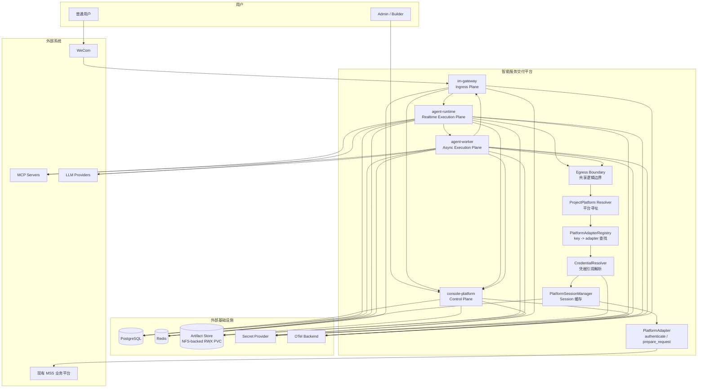
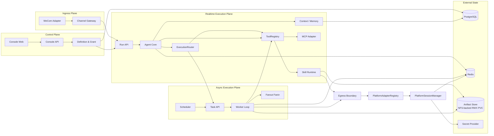
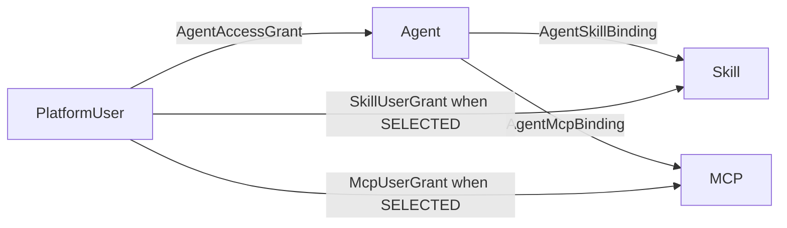
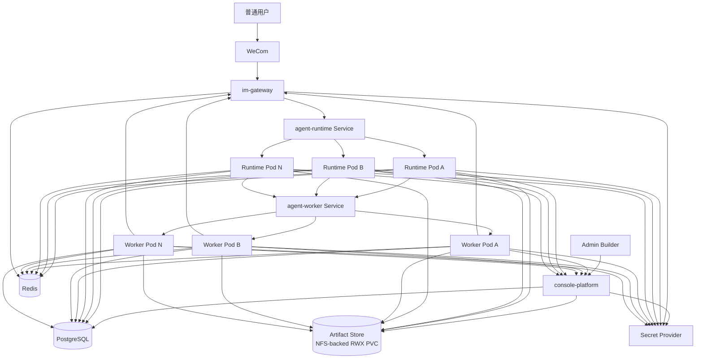
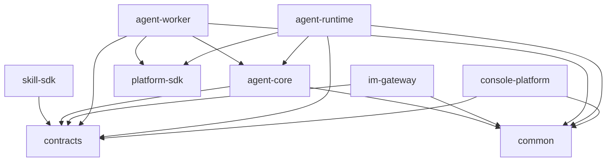
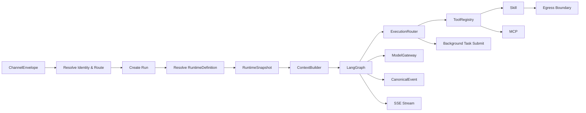
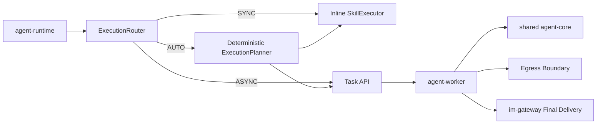

# 01 总体架构与部署详细设计

## 1. 设计目标

本章固定 V1.3 的逻辑架构、部署架构、代码结构和模块依赖关系。设计核心不是“服务拆得多”，而是做到：

- 控制面与执行面解耦；
- Runtime 无状态；
- IM 协议与 Agent reasoning 解耦；
- Skill 作为业务 SOP 最小发布单元；
- 共享代码通过 package 复用，而不是通过同进程耦合；
- 每个部署单元可独立构建和扩缩。

---

## 1.1 核心术语

- **Agent**：产品/控制面逻辑对象，也可理解为 IM Agent Definition；它描述“这个机器人是谁、用什么模型、绑定哪些 Skill/MCP、哪些用户能使用该 Agent”。Skill/MCP 对具体用户是否有效，还要继续经过资源自己的 `user_scope` 过滤。
- **Agent Runtime**：通用无状态执行服务，不对应某一个 Agent。
- **Runtime Pod**：Agent Runtime 的一个实例，可以执行任何 Agent 的请求。
- **BotAccount / ChannelAccount**：一个 IM 通道账号（如企业微信 bot_id）与逻辑 `agent_id` 的绑定关系；一个 Agent 可配置多个通道账号。
- **Agent Worker**：通用 durable 后台执行服务，不对应某一个 Agent/User；负责 Task、Schedule、Lease、Retry、Fan-out/Fan-in 与最终投递。
- **PlatformAdapter**：平台认证、签名、Session 管理、请求准备的可复用代码适配器；同一个 Adapter 可服务多个 ProjectPlatform。

这四者不能混用。Console 的“Agent 列表”展示逻辑 Agent，不展示 Runtime Pod。

---

## 2. 系统上下文图



### 2.1 图说明

- Admin/Builder 只通过 `console-platform` 管理逻辑 Agent、Skill、MCP、Model、授权和 Bot。
- 普通用户只通过 WeCom 进入系统；`im-gateway` 是唯一普通用户入口。
- `im-gateway` 先将 `bot_id` 解析为逻辑 `agent_id`，再把 Run 请求发给 `agent-runtime` 服务。
- `agent-runtime` 不保存用户专属本地目录，也不为某个 Agent 常驻一个 Pod；任意 Pod 都可以执行任意 `agent_id`。
- `agent-worker` 同样不绑定 Agent/User/Task；任何 Worker Pod 都可 claim 任意可执行 Task，权威状态在 PostgreSQL。
- Egress Boundary 作为 `agent-core/skill-sdk` 的共享逻辑边界，由 Runtime 与 Worker 复用，不是独立微服务。
- Egress Boundary 不再直接假设“Credential=Header”；它通过 `PlatformAdapterRegistry + PlatformSessionManager` 处理不同平台的登录、签名和 Session。
- `PlatformAdapterRegistry` 只做 `adapter_key -> adapter` 查找；`PlatformAdapter` 负责 `authenticate / prepare_request` 等业务调用，业务平台调用出边由 `PlatformAdapter` 发出。
- PlatformSession 由 `PlatformSessionManager` 统一缓存在 Redis；Redis 丢失只触发重新认证，因此不属于业务权威事实。
- `im-gateway` 直接向 Secret Provider 解析 Bot 的 `secret_ref`；Console Internal API 不传输 Secret 明文。


---

## 3. 逻辑分层



> **图说明**：逻辑分层图说明：Control Plane 只管理定义；Ingress Plane 只处理 IM 协议；Execution Plane 根据逻辑 Agent Definition 执行；External State 保存所有权威状态。


### 3.1 Console Platform

**职责**：定义、配置、授权、发布 Artifact、查看运行结果。

**不负责**：Agent reasoning、Skill execute、WeCom WebSocket、模型调用。

### 3.2 Agent Runtime

**职责**：一次 Run 的完整实时执行，包括 Snapshot、Context、LangGraph、Skill、Tool、MCP、Memory、Model、Egress、Audit。

**不负责**：Console CRUD、企业微信协议连接、长期 Durable Task。

### 3.3 Agent Worker

**职责**：后台 durable Task、定时触发、claim/lease/heartbeat、retry/timeout/cancel、Parent/Child fan-out/fan-in、结果聚合与 Final Delivery。

**不负责**：用户意图理解、IM 协议、Console 配置 CRUD。Worker 只执行已经由 Agent Runtime 解析并提交的 TaskSpec/ScheduleDefinition。

### 3.4 IM Gateway

**职责**：渠道连接、消息标准化、身份解析、Agent 路由、命令、Streaming 转换、去重与重连。

**不负责**：Agent Prompt、Skill、Memory、业务平台调用。


### 3.5 PlatformAdapter / Session

**职责**：

- 根据 `ProjectPlatform.adapter_key` 获取 Adapter；
- 根据 Adapter Schema 校验平台配置与凭据结构；
- 解析用户/共享 CredentialRef；
- 管理 Session 缓存、TTL、刷新、校验；
- 为每次请求生成认证 Header/Cookie/签名；
- 认证失败时按 Adapter 语义重新认证一次；
- 输出脱敏审计信息。

**不负责**：

- Skill 业务逻辑；
- Agent reasoning；
- 在 Console 在线编写 Adapter；
- 将明文 Secret 放入 Snapshot/日志/LLM Context。

Adapter 实现在共享 `packages/platform-sdk` 中，Runtime/Worker 复用同一实现；Console 只读取 Adapter Metadata/Schema 生成配置界面。

---


### 3.6 User / Agent / Skill / MCP 授权边界



**图说明**：

- `User -> Agent` 决定用户能不能进入某个 Agent；
- `Agent -> Skill/MCP` 决定该 Agent 理论上拥有哪些能力；
- `Skill/MCP -> user_scope` 决定这些能力对 Agent 的哪些授权用户开放；
- `ALL` 只放宽用户范围，不会把资源自动绑定到其他 Agent；
- `SELECTED` 的用户授权是资源级的，不与某一个 Agent 组成三元绑定；
- Runtime 在创建 Run/Task Snapshot 前只保留 Effective Skill/MCP。

## 4. 部署视图



### 4.0 图说明：为什么多个 IM 通道也不绑定 Pod

每个 `bot_id` / ChannelAccount 只在控制面绑定 `agent_id`，但一个 Agent 可以拥有多条 ChannelAccount。IM Gateway 将消息转换为：

```text
RunRequest(agent_id, platform_user_id, conversation_id, message...)
```

之后请求进入 `agent-runtime` 的 Kubernetes Service/内部负载均衡，由它随机分发到 A/B/N 任意实例。Runtime Pod 根据 `agent_id` 获取 RuntimeDefinition 和 Snapshot 后执行。因此：

- 不存在 `bot_id -> pod_ip`；
- 不存在 `agent_id -> 单一 bot_id`；Agent 与通道账号是 `1:N`；
- 不存在 `agent_id -> fixed pod`；
- 不要求 sticky session；
- 扩容/缩容 Runtime 不修改任何 Bot 配置；
- 同一 Conversation 下一轮可以落到不同 Pod。


### 4.1 Worker 无绑定说明

与 Runtime 一样，Worker 也没有以下绑定：

```text
agent_id -> worker pod
user_id -> worker pod
task_id -> permanent worker pod
```

Task 仅在一次 claim 的 lease 周期内临时拥有 `lease_owner`。Worker Pod 崩溃且 lease 过期后，其他 Pod 可以重新 claim。定时任务由 Scheduler 使用数据库行锁/claim 机制保证同一个触发点只生成一次执行实例。

### 4.2 Replica 原则

| 组件 | Phase 1 建议 | 扩缩容依据 |
|---|---:|---|
| console-platform | 1~2 | 管理面 QPS，不跟随普通用户流量 |
| agent-runtime | 2~N | Run 并发、模型等待、Tool/Skill I/O |
| agent-worker | 2~N | 后台任务队列深度、长任务等待数、外部任务并发 |
| im-gateway | 1~N | Bot 数量、WS 连接数、消息吞吐 |

### 4.3 外部依赖

PostgreSQL、Redis、NFS/企业文件存储、Secret Provider 均作为外部依赖单独部署，不放入应用 Compose 作为生产拓扑。

V1 不交付 `nfs-server` 业务 Pod。Kubernetes 通过现有 NFS/企业文件存储创建 `ReadWriteMany` PV/PVC；平台只消费 PVC。

`im-gateway` 直接向 Secret Provider 解析 Bot 的 `secret_ref`；Console Internal API 不传输 Secret 明文。

### 4.4 Artifact Store / PVC 挂载

V1 固定采用：

```text
NFS / 企业共享文件存储
 -> StorageClass / PV
 -> RWX PVC: muad-artifacts-rwx
```

推荐挂载：

| 服务 | `/mnt/muad-artifacts` | `/var/cache/muad/skills` |
|---|---|---|
| console-platform | RW | 不需要 |
| agent-runtime | RW | `emptyDir` |
| agent-worker | RW | `emptyDir` |
| im-gateway | 不挂载 | 不需要 |

说明：

- Console 写入 Skill ZIP；
- Runtime/Worker 读取 Skill ZIP，并可写运行产物/报告 Artifact；
- Runtime/Worker 的解压执行目录必须使用本地 `emptyDir`；
- 不允许把 NFS 目录本身作为 Python import / script working directory；
- `emptyDir` 丢失只导致下一次 cache miss；
- NFS 暂时不可用时，已缓存 READY Skill 可继续执行；未缓存 Skill 返回 `SKILL_ARTIFACT_UNAVAILABLE`。

### 4.5 Artifact 存储键

数据库和 API 统一保存相对 `storage_key`：

```text
skills/{skill_id}/{artifact_id}/skill.zip
artifacts/{yyyy}/{mm}/{artifact_id}
```

代码层：

```text
ArtifactStore.resolve(storage_key)
 -> /mnt/muad-artifacts/{storage_key}
```

---

## 5. Monorepo 代码结构

```text
muad/
├── apps/
│   ├── console-platform/
│   │   ├── backend/
│   │   │   ├── api/
│   │   │   ├── application/
│   │   │   ├── domain/
│   │   │   ├── infrastructure/
│   │   │   └── main.py
│   │   ├── frontend/
│   │   └── Dockerfile
│   ├── agent-runtime/
│   │   ├── api/
│   │   ├── bootstrap/
│   │   ├── adapters/
│   │   └── main.py
│   ├── agent-worker/
│   │   ├── api/
│   │   ├── scheduler/
│   │   ├── worker/
│   │   ├── adapters/
│   │   └── main.py
│   └── im-gateway/
│       ├── api/
│       ├── channels/
│       ├── application/
│       └── main.py
├── packages/
│   ├── agent-core/
│   ├── contracts/
│   ├── skill-sdk/
│   ├── platform-sdk/
│   │   ├── adapter/
│   │   │   ├── base.py
│   │   │   ├── registry.py
│   │   │   └── adapters/
│   │   ├── credential/
│   │   ├── session/
│   │   └── client.py
│   └── common/
├── migrations/
├── tests/
└── deploy/
```

---

## 6. 代码依赖规则



> **图说明**：依赖图说明：共享只发生在 contracts/agent-core/skill-sdk 等稳定 package 层，不允许 Runtime 反向 import Console 的 ORM/Repository。


### 6.1 禁止依赖

- `agent-runtime -> console-platform.infrastructure`：禁止；
- `agent-core -> FastAPI/SQLAlchemy Console Model`：禁止；
- `im-gateway -> agent-core/LangGraph`：禁止；
- `agent-worker -> console-platform.infrastructure`：禁止；
- `skill package -> apps/*`：禁止；
- `skill package -> 数据库 Repository`：禁止。

### 6.2 共享方式

共享的是：

- DTO / Contract；
- Error Code；
- Trace Context；
- SecretRef 类型；
- Agent Core；
- Skill SDK；
- Platform SDK。

不共享：

- ORM Entity；
- Repository 实现；
- FastAPI Route 实现；
- 业务 Application Service。

---

## 7. 数据拥有关系

建议同一 PostgreSQL Cluster 下使用逻辑 Schema 隔离：

```text
control.*    Console 控制面权威定义
runtime.*    Conversation / Run / Memory / Audit
task.*       Background Task / Schedule / Lease / Delivery
langgraph.*  LangGraph Checkpointer 技术表
```

### 7.1 Owner

| Schema | Owner | 说明 |
|---|---|---|
| control | console-platform | Agent/Skill/MCP/Model/User/AgentGrant/SkillUserGrant/McpUserGrant/Bot/Platform |
| runtime | agent-runtime | Conversation/Run/Snapshot/Event/Memory/Audit |
| task | agent-worker | Background Task/Schedule/Lease/Delivery |
| langgraph | LangGraph adapter | 技术 checkpoint，仅 Runtime 使用 |

`im-gateway` 不直接写业务表；身份绑定和路由配置通过 Console Internal API 完成。

---

## 8. 一次 Run 的依赖方向



> **图说明**：Run 依赖图说明：`agent_id` 是运行输入之一；真正执行实例由 Runtime Service 负载均衡决定，与 Agent Definition 无固定实例关系。


---

## 9. RuntimeSnapshot 与实时安全策略

一次 Run 开始后，以下内容冻结：

- Agent revision / instructions；
- Model definition revision、模型参数；
- Skill Artifact ID / checksum / version；
- MCP endpoint / tool schema 快照；
- RuntimeSnapshot JSON 记录 `prompt_template_version`（Prompt 模板代码内置，无 Console 模板管理）；
- Runtime 配置预算。

以下内容不进入 Snapshot 或需要调用时实时解析：

- Secret Value；
- 用户凭据实际值；
- Egress Allowlist 的紧急阻断；
- Secret 撤销/轮换；
- `/stop` cancellation 状态。

目的：**业务版本确定性与安全控制实时性同时满足**。

---

## 10. Image 构建策略

同一 Git commit 产生：

```text
muad-console-platform:<git-sha>
muad-agent-runtime:<git-sha>
muad-agent-worker:<git-sha>
muad-im-gateway:<git-sha>
```

### console-platform

Multi-stage：

```text
Node build React -> dist/
Python runtime -> copy dist -> FastAPI static mount
```

生产容器只运行一个 Python 主进程，不要求 Node 常驻。

---

## 11. Agent Worker 接入与执行模式

Agent Worker 已进入当前架构，不再是 Phase 2 占位。



**图说明**：

- Agent Runtime 负责理解业务意图和选择 Skill；
- `ExecutionRouter` 负责执行方式，不让 LLM 自由决定 async；
- Worker 只接收明确的 TaskSpec/ScheduleDefinition；
- Runtime 与 Worker 复用同一 `agent-core / SkillExecutor / Egress Boundary`；
- 每个 `bot_id` 仍只绑定一个逻辑 Agent，但一个 Agent 可以配置多个 `bot_id`；所有通道账号都与 Worker/Runtime Pod 无任何绑定。

### 11.1 两个维度

```text
Trigger   = IMMEDIATE | SCHEDULED
Execution = SYNC | ASYNC | AUTO
```

规则：

- `IMMEDIATE + SYNC`：当前 Runtime 内联执行；
- `IMMEDIATE + ASYNC`：Runtime 提交 Background Task；
- `SCHEDULED + *`：一律由 Worker 执行；
- `AUTO`：由确定性 ExecutionPlanner 解析，禁止把 LLM 的主观“可能很久”作为唯一依据。

### 11.2 Snapshot

- 即时异步任务：Task 创建时冻结 Agent/Skill/Model 版本；
- 定时任务：Schedule 本身不永久冻结版本；每次触发创建新的 TaskExecution，并在触发时生成新的 execution snapshot；
- 单次 Task 开始后 Snapshot 不漂移。

